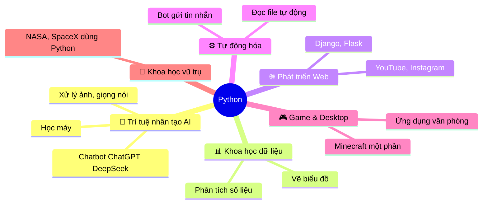
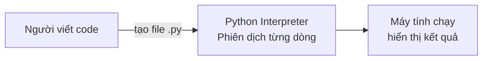

# Bài 1 — Giới Thiệu Python

> 🎓 **Chương 1 – Khởi đầu hành trình lập trình**

## 🧠 Điều kiện tiên quyết

Không cần kiến thức lập trình trước đó — bài này là điểm khởi đầu.

---

## 🎯 Mục tiêu

Sau bài học này, học viên sẽ:

* ✅ Hiểu **Python là gì**, vì sao nó phổ biến nhất thế giới hiện nay.
* ✅ Biết được **lịch sử hình thành** và ai đã tạo ra Python.
* ✅ Nắm được các **lĩnh vực ứng dụng** thực tế của Python (AI, Web, Khoa học dữ liệu...).
* ✅ Phân biệt được **ngôn ngữ thông dịch** với ngôn ngữ biên dịch.
* ✅ Viết được **chương trình đầu tiên** in ra màn hình dòng chữ "Xin chào".
* ✅ Biết nơi **luyện tập code online** khi chưa cài đặt Python.

---

## 📖 Kiến thức

### 1. Python là gì?

> 💬 **Nói đơn giản:** Python là một **ngôn ngữ lập trình bậc cao** — nghĩa là nó gần với ngôn ngữ con người (tiếng Anh) hơn là ngôn ngữ máy tính (0 và 1).

**Ví dụ đời thực:**
Giống như bạn học một **ngôn ngữ giao tiếp** để nói chuyện với người nước ngoài, bạn học Python để "nói chuyện" với máy tính. Thay vì ra lệnh bằng cách bật/tắt dòng điện (0/1), bạn ra lệnh bằng các từ tiếng Anh dễ hiểu như:

```python
print("Xin chào")
```

### 2. Lịch sử ra đời

| Năm | Sự kiện |
|---|---|
| **1989** | **Guido van Rossum** (người Hà Lan) bắt đầu viết Python như một dự án giải trí dịp Giáng sinh |
| **1991** | Phát hành phiên bản **Python 1.0** đầu tiên |
| **2000** | Phát hành **Python 2.0** |
| **2008** | Phát hành **Python 3.0** — phiên bản cách mạng, vẫn được dùng đến nay |
| **Hiện nay** | Python nằm trong **top 3 ngôn ngữ phổ biến nhất thế giới** |

> 🐍 **Tên gọi "Python"** — không phải do con rắn, mà Guido đặt tên theo chương trình hài *Monty Python's Flying Circus* mà ông yêu thích.

### 3. Vì sao Python được yêu thích?

| Đặc điểm | Giải thích dễ hiểu |
|---|---|
| ✏️ **Cú pháp ngắn gọn** | Code gần giống tiếng Anh, dễ đọc như sách giáo khoa |
| 🧠 **Dễ học** | Phù hợp làm ngôn ngữ **đầu tiên** cho người mới |
| 📦 **Kho thư viện khổng lồ** | Hơn **400.000+** thư viện miễn phí sẵn sàng dùng |
| 🌍 **Đa nền tảng** | Chạy được trên Windows, macOS, Linux |
| 🆓 **Miễn phí** | Tải về và dùng thoải mái, không tốn tiền |
| 🔥 **Cộng đồng lớn** | Hàng triệu lập trình viên sẵn sàng giúp đỡ |

### 4. Python được dùng ở đâu?



> 💡 **Bạn có biết:** **YouTube**, **Instagram**, **Dropbox**, **Reddit** đều dùng Python cho hệ thống của mình. **NASA** và **SpaceX** cũng dùng Python để tính toán quỹ đạo tàu vũ trụ!

### 5. Thông dịch hay biên dịch?

Python là ngôn ngữ **thông dịch (interpreted)**. Hãy tưởng tượng:

* 🗣️ **Ngôn ngữ thông dịch** (Python): giống như bạn **phiên dịch trực tiếp** từng câu — phiên dịch tới đâu, nói ra tới đó. Sửa lỗi nhanh, chạy ngay.
* 📖 **Ngôn ngữ biên dịch** (C/C++): giống như dịch **cả quyển sách** trước khi đọc — chạy nhanh hơn nhưng sửa lỗi lâu hơn.



### 6. Chương trình đầu tiên của bạn

Hãy tạo file `hello.py` và gõ:

```python
# Chương trình đầu tiên: in dòng chữ chào hỏi
print("Xin chào mừng bạn đến với Python!")
```

Kết quả chạy:

```
Xin chào mừng bạn đến với Python!
```

**Giải thích từng dòng:**

| Dòng code | Ý nghĩa |
|---|---|
| `# Chương trình đầu tiên...` | Dòng **chú thích** — để con người đọc, máy tính bỏ qua |
| `print("...")` | Lệnh **in ra màn hình** nội dung bên trong cặp ngoặc kép |
| `"Xin chào..."` | **Chuỗi ký tự** — đoạn chữ cần hiển thị |

> ⚠️ **Lưu ý:** Trong code Python, **không được dùng dấu nháy kiểu Unicode "..." hoặc '...'** — phải dùng dấu nháy **thẳng** `"` `'` mà bàn phím tiếng Anh gõ ra. Nếu dùng sai, chương trình báo `SyntaxError`.

---

## 💡 Ví dụ minh họa

### Ví dụ 1: In nhiều dòng chữ

```python
# In từng dòng chữ
print("Họ tên: Nguyễn Văn An")
print("Trường: THPT Python")
print("Lớp: 10A1")
```

Kết quả:

```
Họ tên: Nguyễn Văn An
Trường: THPT Python
Lớp: 10A1
```

### Ví dụ 2: In số và phép tính

```python
# In ra số
print(2026)

# In ra kết quả phép tính
print(10 + 5)
print(10 - 5)
```

Kết quả:

```
2026
15
5
```

> 💡 Python làm toán hộ bạn luôn! Lệnh `print(10 + 5)` in ra `15` chứ không phải dòng chữ `10 + 5`.

### Ví dụ 3: Vẽ chữ nghệ thuật

```python
# Vẽ dấu * ra màn hình
print("  *  ")
print(" *** ")
print("*****")
```

Kết quả:

```
  *
 ***
*****
```

---

## 🔬 Ví dụ nâng cao

### Ví dụ: Máy chào hỏi thông minh (cần kiến thức bài 7)

> Khi học xong bài về nhập dữ liệu, bạn sẽ viết được chương trình này:

```python
# Chương trình chào hỏi có tương tác
ten = input("Bạn tên gì? ")
print("Chào mừng", ten, "đến với khóa học Python!")
```

Kết quả chạy:

```
Bạn tên gì? Mai
Chào mừng Mai đến với khóa học Python!
```

---

## ⚠️ Lỗi thường gặp

### Lỗi 1: Quên dấu ngoặc

```python
print "Xin chào"   # ❌ SAI
print("Xin chào")  # ✅ ĐÚNG
```

* **Nguyên nhân:** Python 3 yêu cầu `print` phải có dấu ngoặc tròn.
* **Kết quả báo:** `SyntaxError: Missing parentheses in call to 'print'`

### Lỗi 2: Dùng dấu nháy Unicode

```python
print(“Xin chào”)   # ❌ SAI — dấu nháy cong
print("Xin chào")   # ✅ ĐÚNG — dấu nháy thẳng
```

* **Nguyên nhân:** Máy tính phân biệt dấu nháy thẳng và cong; code chỉ nhận dấu nháy thẳng `"`.
* **Cách khắc phục:** Tắt tính năng *Smart Quotes* trong trình soạn thảo hoặc gõ lại bằng tay.

### Lỗi 3: Nhầm lẫn `Print` với `print`

```python
Print("Xin chào")   # ❌ SAI — chữ P viết hoa
print("Xin chào")   # ✅ ĐÚNG — chữ thường
```

* **Nguyên nhân:** Python **phân biệt chữ hoa, chữ thường**.
* **Kết quả báo:** `NameError: name 'Print' is not defined`

---

## 💎 Mẹo

* ✨ **Mẹo ghi nhớ:** `print()` là **bộ loa** của chương trình — muốn máy "nói" ra điều gì, đưa vào loa!
* 📝 **Tên file:** Đặt tên có nghĩa như `hello.py`, `bai1.py`. Phần mở rộng `.py` là dấu hiệu file Python.
* 🔤 **Chỉ dùng chữ thường** khi gõ lệnh Python (trừ khi lệnh yêu cầu viết hoa).
* 🧪 **Luyện online ngay** (chưa cần cài đặt):
  * [Replit](https://replit.com/)
  * [Google Colab](https://colab.research.google.com/)
  * [Python Tutor](https://pythontutor.com/) — xem từng bước chạy, cực kỳ tốt cho người mới.
* 📖 **Đọc thêm:** [Python.org – About](https://www.python.org/about/)

---

## 📝 Tóm tắt

| Khái niệm | Nội dung |
|---|---|
| 🐍 Python | Ngôn ngữ lập trình bậc cao, dễ học, phổ biến nhất thế giới |
| 👨‍💻 Tác giả | Guido van Rossum, phát hành lần đầu năm 1991 |
| 🗣️ Thông dịch | Chạy từng dòng lệnh, sửa lỗi nhanh |
| 🌍 Ứng dụng | AI, khoa học dữ liệu, web, tự động hóa, game, vũ trụ |
| 🖨️ `print()` | Lệnh in dữ liệu ra màn hình |
| ✍️ `#` | Dấu chú thích trong Python |
| ❗ Điểm quan trọng | Code phân biệt hoa – thường, chỉ dùng dấu nháy thẳng |

---

## 🧪 Kiểm tra nhanh

1. ❓ Python do ai sáng tạo ra?
2. ❓ Python ra đời vào năm nào và thuộc loại ngôn ngữ gì?
3. ❓ Lệnh nào dùng để in dữ liệu ra màn hình?
4. ❓ Kể tên 3 lĩnh vực ứng dụng của Python.
5. ❓ Viết chương trình in ra tên trường của bạn.
6. ❓ Dấu `#` trong Python dùng để làm gì?
7. ❓ Đúng hay sai: `Print("Xin chao")` chạy được bình thường?
8. ❓ `print(10 + 5)` in ra màn hình kết quả nào?
9. ❓ Trong cặp ngoặc của `print()`, ta cần dùng dấu nháy gì để bọc chữ?
10. ❓ Vì sao Python được chọn làm ngôn ngữ đầu tiên cho người mới?

<details>
<summary>🔍 Xem đáp án</summary>

1. Guido van Rossum.
2. Năm 1991, ngôn ngữ thông dịch (interpreted).
3. `print()`.
4. AI, khoa học dữ liệu, phát triển web, tự động hóa, game (nêu 3 là đủ).
5. `print("Trường THPT của tôi")`.
6. Dấu chú thích — máy tính bỏ qua.
7. Sai — Python phân biệt chữ hoa, lệnh đúng là `print`.
8. In ra `15`.
9. Dấu nháy thẳng `"` hoặc `'`.
10. Cú pháp ngắn gọn, gần với ngôn ngữ tự nhiên, cộng đồng lớn, nhiều tài liệu.

</details>

---

## 📚 Bài đọc thêm

* [Python.org – Giới thiệu](https://www.python.org/about/)
* [Wikipedia – Python (ngôn ngữ lập trình)](https://vi.wikipedia.org/wiki/Python_(ng%C3%B4n_ng%E1%BB%AF_l%E1%BA%ADp_tr%C3%ACnh))
* [W3Schools – Python Introduction](https://www.w3schools.com/python/python_intro.asp)
* [Python Tutor – học bằng hình ảnh](https://pythontutor.com/)

---

---

## 🧩 Bài tập

> 📝 🎯 **Chủ đề:** Khái niệm cơ bản về Python, viết và chạy chương trình đầu tiên với `print()`.

## 🟢 Dễ (Bài 1 – 7)

### Bài 1: Xin chào thế giới

* **Đề bài:** Viết chương trình in ra dòng chữ `Xin chao the gioi Python`.
* **Input:** (không cần nhập gì)
* **Output:**
  ```
  Xin chao the gioi Python
  ```
* **Gợi ý:** Dùng lệnh `print("...")`.

### Bài 2: Giới thiệu bản thân

* **Đề bài:** Viết chương trình in ra 3 dòng: họ tên, tuổi, môn học yêu thích của bạn.
* **Input:** (không cần nhập gì)
* **Output:**
  ```
  Ten: Nguyen Van A
  Tuoi: 15
  Mon yeu thich: Tin hoc
  ```
* **Gợi ý:** Mỗi dòng dùng một lệnh `print()`.

### Bài 3: Phép tính nhanh

* **Đề bài:** Viết chương trình in ra kết quả của `25 + 17` và `100 - 45`.
* **Input:** (không cần nhập gì)
* **Output:**
  ```
  42
  55
  ```
* **Gợi ý:** Python tính toán được bên trong `print()`, ví dụ `print(25 + 17)`.

### Bài 4: Ngày và tháng

* **Đề bài:** Viết chương trình in ra hôm nay là thứ mấy, ngày mấy, tháng mấy (tùy ý bạn).
* **Input:** (không cần nhập gì)
* **Output:**
  ```
  Hom nay la thu Hai
  Ngay 5 thang 8
  ```
* **Gợi ý:** Dùng `print()` cho từng dòng.

### Bài 5: Vẽ hình chữ nhật bằng dấu `*`

* **Đề bài:** Dùng `print()` vẽ hình chữ nhật 4 hàng, 6 cột bằng dấu `*`.
* **Input:** (không cần nhập gì)
* **Output:**
  ```
  ******
  ******
  ******
  ******
  ```
* **Gợi ý:** Mỗi dòng in đúng 6 dấu `*`.

### Bài 6: Vẽ tam giác đơn giản

* **Đề bài:** Dùng `print()` vẽ tam giác 3 tầng bằng dấu `*`.
* **Input:** (không cần nhập gì)
* **Output:**
  ```
  *
  **
  ***
  ```
* **Gợi ý:** Lần lượt in 1, 2, 3 dấu `*`.

### Bài 7: In ra con số 2026

* **Đề bài:** Viết chương trình in ra số `2026` **không dùng dấu ngoặc kép**.
* **Input:** (không cần nhập gì)
* **Output:**
  ```
  2026
  ```
* **Gợi ý:** `print(2026)` — khi in số, không cần dấu nháy.

---

## 🟡 Trung bình (Bài 8 – 14)

### Bài 8: Chương trình tính điểm

* **Đề bài:** Máy tính đã tính sẵn tổng điểm 3 môn của bạn là `25`. Viết chương trình in ra câu: `Tong diem 3 mon la: 25` (25 lấy từ phép tính `10 + 8 + 7`).
* **Input:** (không cần nhập gì)
* **Output:**
  ```
  Tong diem 3 mon la: 25
  ```
* **Gợi ý:** `print("Tong diem 3 mon la:", 10 + 8 + 7)`.

### Bài 9: Tính trung bình cộng

* **Đề bài:** Ba bạn An, Bình, Cường có số viên kẹo lần lượt là 12, 15, 18. Viết chương trình in ra tổng số kẹo và trung bình cộng số kẹo của 3 bạn.
* **Input:** (không cần nhập gì)
* **Output:**
  ```
  Tong keo: 45
  Trung binh: 15.0
  ```
* **Gợi ý:** Trung bình = tổng chia cho số lượng: `(12 + 15 + 18) / 3`.

### Bài 10: Bảng cửu chương nhân 5

* **Đề bài:** Viết chương trình in ra 3 phép tính đầu tiên của bảng nhân 5: `5 x 1 = 5`, `5 x 2 = 10`, `5 x 3 = 15`.
* **Input:** (không cần nhập gì)
* **Output:**
  ```
  5 x 1 = 5
  5 x 2 = 10
  5 x 3 = 15
  ```
* **Gợi ý:** Python tính `5 * 1` trong lệnh `print`.

### Bài 11: In cách nhau bởi dấu phẩy

* **Đề bài:** Viết chương trình in ra `Python`, `Java`, `C++` trên cùng một dòng, giữa mỗi tên có **một khoảng trắng** do Python tự thêm.
* **Input:** (không cần nhập gì)
* **Output:**
  ```
  Python Java C++
  ```
* **Gợi ý:** `print("Python", "Java", "C++")` — dấu phẩy làm Python tự chèn khoảng trắng.

### Bài 12: Đếm ngược

* **Đề bài:** Viết chương trình in ra 3 dòng số: `3`, `2`, `1` rồi dòng cuối là `Chay!`.
* **Input:** (không cần nhập gì)
* **Output:**
  ```
  3
  2
  1
  Chay!
  ```
* **Gợi ý:** Bốn lệnh `print()`.

### Bài 13: Tìm chỗ sai (Debug)

* **Đề bài:** Chương trình sau bị lỗi. Hãy tìm và sửa cho chạy đúng:

  ```python
  Print("Ten toi la An")
  print(Toi 15 tuoi")
  ```
* **Output mong đợi sau khi sửa:**
  ```
  Ten toi la An
  Toi 15 tuoi
  ```
* **Gợi ý:** Có 2 lỗi: một chỗ viết hoa sai, một chỗ thiếu/ sai dấu nháy.

### Bài 14: In ra thông tin trường học

* **Đề bài:** Viết chương trình in ra 4 dòng thông tin: tên trường, địa chỉ, lớp, số điện thoại (tự đặt). Mỗi thông tin đi kèm nhãn trước dấu hai chấm.
* **Input:** (không cần nhập gì)
* **Output:**
  ```
  Truong: THPT Python
  Dia chi: 123 Nguyen Hue, TP HCM
  Lop: 10A1
  So dien thoai: 0901 234 567
  ```
* **Gợi ý:** Mỗi dòng là một `print("Nhan:", "gia tri")`.

---

## 🔴 Khó (Bài 15 – 20)

### Bài 15: In ra số đã làm tròn

* **Đề bài:** Viết chương trình in ra chu vi hình tròn có bán kính `r = 5` (chu vi = `2 * 3.14 * r`), và **làm tròn tới 2 chữ số** sau dấu phẩy.
* **Input:** (không cần nhập gì)
* **Output:**
  ```
  Chu vi: 31.4
  ```
* **Gợi ý:** Dùng hàm `round(so, 2)` để làm tròn; lưu kết quả phép tính vào biến trước khi in.

### Bài 16: Bảng thông báo trường học

* **Đề bài:** Viết chương trình in ra một bảng thông báo giống mẫu sau (dùng ký tự `=`, `|`):

  ```
  ==============================
  |  TRUONG THPT PYTHON        |
  |  Khai giang: 05/09/2026    |
  |  Chuan bi giay to can thiet |
  ==============================
  ```
* **Input:** (không cần nhập gì)
* **Output:** Giống mẫu trên (ít nhất 3 dòng nội dung bên trong).
* **Gợi ý:** Chia đôi dòng bằng cách in từng phần: `print("|", "TRUONG THPT PYTHON", "|")` — hãy thử kết hợp dấu phẩy để có khoảng trắng đều.

### Bài 17: Tách số thành chữ số

* **Đề bài:** Số `12345` gồm 5 chữ số. Viết chương trình in ra từng chữ số của `12345` trên một dòng, **không dùng vòng lặp**.
* **Input:** (không cần nhập gì)
* **Output:**
  ```
  1
  2
  3
  4
  5
  ```
* **Gợi ý:** Biến đổi số thành chuỗi bằng `str(12345)` rồi lấy từng ký tự bằng `[vị trí]`, ví dụ `str(12345)[0]` cho ra `1`.

### Bài 18: Vẽ ngôi nhà

* **Đề bài:** Viết chương trình vẽ một ngôi nhà gồm mái tam giác và thân chữ nhật bằng dấu `*`.
* **Input:** (không cần nhập gì)
* **Output:**
  ```
     *
    ***
   *****
  *******
  *******
  *******
  *******
  ```
* **Gợi ý:** Mái là tam giác 4 tầng, thân là 4 dòng in đủ 7 dấu `*`. Nhớ thêm khoảng trắng trước tam giác.

### Bài 19: In tên viết tắt

* **Đề bài:** Bạn tên là `Nguyen Van An`. Viết chương trình in ra tên viết tắt dạng chữ in hoa.
* **Input:** (không cần nhập gì)
* **Output:**
  ```
  NVA
  ```
* **Gợi ý:** Lấy ký tự đầu của mỗi từ: `"Nguyen"[0]`, `"Van"[0]`, `"An"[0]`, rồi nối lại bằng `+`.

### Bài 20: Thiết kế khung giờ tự học

* **Đề bài:** Viết chương trình in ra thời khóa biểu tự học cá nhân của bạn, gồm 5 dòng: mỗi dòng là buổi + môn học, ngăn cách bằng dấu `|`, có dòng viền trên và dưới bằng dấu `-`.

  ```
  ------------------------------
  | Sang | Toan               |
  | Trua | Van                |
  | Chieu| Tin hoc            |
  ------------------------------
  ```
* **Input:** (không cần nhập gì)
* **Output:** Tương tự mẫu trên với ít nhất 3 buổi học.
* **Gợi ý:** Căn lề bằng cách thêm khoảng trắng cho khớp; dùng `print()` nhiều lần.

---

## 🎯 Tổng kết sau khi làm bài

Sau 20 bài tập, bạn đã:

* ✅ Thành thạo lệnh `print()` — in chữ, in số, in nhiều dữ liệu cùng lúc.
* ✅ Làm quen với dấu nháy thẳng, chú thích `#`, phân biệt hoa – thường.
* ✅ Viết chương trình tính toán đơn giản ngay trong `print()`.
* ✅ Tự tìm và sửa lỗi cú pháp.

> 💪 Chưa tự làm được bài nào thì đừng lo — hãy xem lại bài giảng rồi quay lại. **Lập trình là luyện tập!**

---

## ✅ Đáp án

> 💡 **Hãy tự làm bài tập trước** rồi mới mở đáp án.

## 🟢 Dễ (Bài 1 – 7)


<details>
<summary>✅ Bài 1: Xin chào thế giới</summary>


**Phân tích:** Bài tập làm quen đơn giản nhất — in một dòng chữ ra màn hình.

**Ý tưởng:** Dùng lệnh `print()` với chuỗi ký tự bên trong dấu ngoặc kép.

**Thuật toán:**
1. Gọi lệnh `print()`.
2. Truyền vào chuỗi cần in.

**Code:**

```python
print("Xin chao the gioi Python")
```

**Giải thích code:**
* `print(...)` — lệnh in dữ liệu ra màn hình.
* `"Xin chao the gioi Python"` — chuỗi ký tự cần hiển thị, nằm trong dấu ngoặc kép thẳng.

**Độ phức tạp:** O(1).

---

</details>

<details>
<summary>✅ Bài 2: Giới thiệu bản thân</summary>


**Phân tích:** Cần in 3 dòng thông tin khác nhau.

**Ý tưởng:** Mỗi dòng là một lệnh `print()` riêng biệt — Python in lần lượt từng dòng.

**Thuật toán:**
1. In dòng họ tên.
2. In dòng tuổi.
3. In dòng môn học yêu thích.

**Code:**

```python
# In dòng họ tên
print("Ten: Nguyen Van A")
# In dòng tuổi
print("Tuoi: 15")
# In dòng môn học yêu thích
print("Mon yeu thich: Tin hoc")
```

**Giải thích code:**
* Ba lệnh `print()` chạy lần lượt từ trên xuống dưới.
* Mỗi lệnh kết thúc sẽ **xuống dòng** tự động — đó là hành vi mặc định của `print()`.

**Độ phức tạp:** O(1).

---

</details>

<details>
<summary>✅ Bài 3: Phép tính nhanh</summary>


**Phân tích:** Python tính toán được phép toán số học ngay bên trong `print()`.

**Ý tưởng:** Truyền biểu thức số học vào `print()`; Python tính ra kết quả rồi mới in.

**Thuật toán:**
1. In kết quả `25 + 17`.
2. In kết quả `100 - 45`.

**Code:**

```python
print(25 + 17)
print(100 - 45)
```

**Giải thích code:**
* `25 + 17` — phép cộng, Python tính ra `42`.
* `100 - 45` — phép trừ, Python tính ra `55`.
* Lưu ý: không cần dấu ngoặc kép vì đây là **số**, không phải **chữ**.

**Độ phức tạp:** O(1).

---

</details>

<details>
<summary>✅ Bài 4: Ngày và tháng</summary>


**Phân tích:** In nhiều dòng thông tin về ngày giờ tùy theo mốc thời gian bạn chọn.

**Ý tưởng:** Dùng `print()` cho từng dòng.

**Thuật toán:**
1. In dòng thứ trong tuần.
2. In dòng ngày – tháng.

**Code:**

```python
print("Hom nay la thu Hai")
print("Ngay 5 thang 8")
```

**Giải thích code:**
* Dòng 1: in ra thứ trong tuần.
* Dòng 2: in ra ngày và tháng.
* Mỗi `print()` xuống dòng tự động nên hai dòng hiển thị riêng biệt.

**Độ phức tạp:** O(1).

---

</details>

<details>
<summary>✅ Bài 5: Vẽ hình chữ nhật bằng dấu `*`</summary>


**Phân tích:** Hình chữ nhật 4 hàng × 6 cột, mỗi hàng giống hệt nhau.

**Ý tưởng:** In 4 lần chuỗi 6 dấu `*` giống nhau.

**Thuật toán:**
1. In hàng thứ nhất: 6 dấu `*`.
2. Lặp lại cho đến hàng thứ tư.

**Code:**

```python
print("******")
print("******")
print("******")
print("******")
```

**Giải thích code:**
* Mỗi dòng `print("******")` in đúng 6 dấu `*`.
* Bốn lệnh tạo ra 4 hàng — đủ hình chữ nhật 4×6.

**Độ phức tạp:** O(1).

---

</details>

<details>
<summary>✅ Bài 6: Vẽ tam giác đơn giản</summary>


**Phân tích:** Tam giác 3 tầng: tầng 1 có 1 dấu `*`, tầng 2 có 2, tầng 3 có 3.

**Ý tưởng:** Số dấu `*` tăng dần theo từng hàng.

**Thuật toán:**
1. In hàng 1 dấu `*`.
2. In hàng 2 dấu `*`.
3. In hàng 3 dấu `*`.

**Code:**

```python
print("*")
print("**")
print("***")
```

**Giải thích code:**
* `"*"` — 1 ký tự.
* `"**"` — 2 ký tự.
* `"***"` — 3 ký tự.
* Ba hàng chồng lên nhau tạo hình tam giác hướng trái.

**Độ phức tạp:** O(1).

---

</details>

<details>
<summary>✅ Bài 7: In ra con số 2026</summary>


**Phân tích:** Đây là bài phân biệt in **số** và in **chuỗi chữ**.

**Ý tưởng:** In số trực tiếp, không bọc trong dấu nháy.

**Thuật toán:**
1. Gọi `print()` với đối số là số nguyên.

**Code:**

```python
print(2026)
```

**Giải thích code:**
* `2026` — số nguyên (`int`), không cần dấu ngoặc kép.
* Nếu viết `"2026"` thì máy in chữ "2026" — nhìn giống nhau nhưng về bản chất khác: một cái là số để tính toán, một cái chỉ là ký tự.

**Độ phức tạp:** O(1).

---

</details>

## 🟡 Trung bình (Bài 8 – 14)


<details>
<summary>✅ Bài 8: Chương trình tính điểm</summary>


**Phân tích:** In chuỗi chữ kèm kết quả phép tính.

**Ý tưởng:** Dùng `print()` với nhiều đối số cách nhau dấu phẩy; Python tự thêm khoảng trắng giữa các đối số.

**Thuật toán:**
1. In nhãn "Tong diem 3 mon la:".
2. In kết quả `10 + 8 + 7` ngay sau đó.

**Code:**

```python
print("Tong diem 3 mon la:", 10 + 8 + 7)
```

**Giải thích code:**
* `"Tong diem 3 mon la:"` — phần chữ.
* `10 + 8 + 7` — Python tính ra `25`.
* Dấu phẩy ngăn cách hai đối số, Python tự chèn một khoảng trắng giữa chúng.

**Độ phức tạp:** O(1).

---

</details>

<details>
<summary>✅ Bài 9: Tính trung bình cộng</summary>


**Phân tích:** Tính tổng rồi chia cho số lượng phần tử.

**Ý tưởng:** Tổng = `12 + 15 + 18`, trung bình = tổng / 3. Phép chia luôn cho kết quả số thực (`float`).

**Thuật toán:**
1. In tổng số kẹo.
2. In trung bình cộng.

**Code:**

```python
print("Tong keo:", 12 + 15 + 18)
print("Trung binh:", (12 + 15 + 18) / 3)
```

**Giải thích code:**
* Dòng 1: `12 + 15 + 18 = 45`.
* Dòng 2: `45 / 3 = 15.0` — có dấu `.0` vì phép chia `/` luôn trả về số thực.
* Dấu ngoặc `( )` giúp Python tính tổng trước khi chia.

**Độ phức tạp:** O(1).

---

</details>

<details>
<summary>✅ Bài 10: Bảng cửu chương nhân 5</summary>


**Phân tích:** In 3 dòng dạng `5 x k = kết quả`.

**Ý tưởng:** Đối số thứ ba của `print()` là phép nhân `5 * k` — Python tính rồi in.

**Thuật toán:**
1. In `5 x 1 = 5`.
2. In `5 x 2 = 10`.
3. In `5 x 3 = 15`.

**Code:**

```python
print("5 x 1 =", 5 * 1)
print("5 x 2 =", 5 * 2)
print("5 x 3 =", 5 * 3)
```

**Giải thích code:**
* `5 * 1` → `5`, `5 * 2` → `10`, `5 * 3` → `15`.
* Dấu `*` là phép **nhân** trong Python (không phải `x` như toán học thông thường).

**Độ phức tạp:** O(1).

---

</details>

<details>
<summary>✅ Bài 11: In cách nhau bởi dấu phẩy</summary>


**Phân tích:** In nhiều chuỗi trên cùng một dòng.

**Ý tưởng:** Truyền nhiều đối số cho `print()`, ngăn cách bằng dấu phẩy.

**Thuật toán:**
1. Gọi `print()` với 3 chuỗi.

**Code:**

```python
print("Python", "Java", "C++")
```

**Giải thích code:**
* Ba chuỗi cách nhau bằng dấu phẩy — Python in chúng liền một dòng.
* Python tự thêm **một khoảng trắng** giữa các đối số.

**Độ phức tạp:** O(1).

---

</details>

<details>
<summary>✅ Bài 12: Đếm ngược</summary>


**Phân tích:** In 4 dòng: 3 số và một dòng chữ.

**Ý tưởng:** Bốn lệnh `print()` tuần tự.

**Thuật toán:**
1. In `3`.
2. In `2`.
3. In `1`.
4. In `Chay!`.

**Code:**

```python
print(3)
print(2)
print(1)
print("Chay!")
```

**Giải thích code:**
* Các số in ra không cần dấu nháy; dòng chữ cần dấu nháy.
* Thứ tự lệnh chạy từ trên xuống tạo cảm giác đếm ngược.

**Độ phức tạp:** O(1).

---

</details>

<details>
<summary>✅ Bài 13: Tìm chỗ sai (Debug)</summary>


**Phân tích:** Chương trình có 2 lỗi cú pháp.

**Ý tưởng:** Xác định từng lỗi:
1. `Print` — sai vì Python phân biệt hoa – thường, phải là `print`.
2. `print(Toi 15 tuoi")` — thiếu dấu mở nháy, dấu nháy đặt sai vị trí.

**Thuật toán:**
1. Sửa `Print` thành `print`.
2. Đặt dấu nháy đúng cho chuỗi.

**Code:**

```python
print("Ten toi la An")
print("Toi 15 tuoi")
```

**Giải thích code:**
* Lỗi 1: `Print("...")` → `print("...")` — lệnh Python viết thường.
* Lỗi 2: `print(Toi 15 tuoi")` → `print("Toi 15 tuoi")` — chuỗi phải nằm trọn trong cặp dấu nháy.

**Độ phức tạp:** O(1).

---

</details>

<details>
<summary>✅ Bài 14: In ra thông tin trường học</summary>


**Phân tích:** In 4 dòng thông tin dạng nhãn: giá trị.

**Ý tưởng:** Mỗi dòng là một `print("Nhan:", "gia tri")`.

**Thuật toán:**
1. In tên trường.
2. In địa chỉ.
3. In lớp.
4. In số điện thoại.

**Code:**

```python
print("Truong:", "THPT Python")
print("Dia chi:", "123 Nguyen Hue, TP HCM")
print("Lop:", "10A1")
print("So dien thoai:", "0901 234 567")
```

**Giải thích code:**
* Mỗi `print()` có hai đối số: nhãn và giá trị, ngăn cách bởi dấu phẩy.
* Địa chỉ và số điện thoại là chữ nên phải đặt trong dấu nháy.

**Độ phức tạp:** O(1).

---

</details>

## 🔴 Khó (Bài 15 – 20)


<details>
<summary>✅ Bài 15: In ra số đã làm tròn</summary>


**Phân tích:** Chu vi hình tròn = `2 * pi * r` với pi ≈ 3.14. Kết quả `31.400000...` cần làm tròn về 31.4.

**Ý tưởng:** Lưu kết quả vào biến, dùng hàm `round(x, 2)` làm tròn 2 chữ số thập phân.

**Thuật toán:**
1. Tính chu vi: `chu_vi = 2 * 3.14 * 5`.
2. Làm tròn: `round(chu_vi, 2)`.
3. In kết quả.

**Code:**

```python
# Bán kính hình tròn
r = 5
# Tính chu vi: 2 * pi * r
chu_vi = 2 * 3.14 * r
# Làm tròn tới 2 chữ số thập phân rồi in
print("Chu vi:", round(chu_vi, 2))
```

**Giải thích code:**
* `r = 5` — biến lưu bán kính.
* `2 * 3.14 * r` — phép tính cho ra `31.4`.
* `round(chu_vi, 2)` — giữ 2 chữ số sau dấu phẩy, kết quả `31.4`.

**Độ phức tạp:** O(1).

---

</details>

<details>
<summary>✅ Bài 16: Bảng thông báo trường học</summary>


**Phân tích:** Cần in viền trên/dưới và các dòng nội dung có lề.

**Ý tưởng:** Mỗi dòng là một `print()`. Dùng dấu phẩy để Python tự căn khoảng trắng giữa `|` và nội dung.

**Thuật toán:**
1. In dòng viền trên.
2. In từng dòng nội dung kèm dấu `|`.
3. In dòng viền dưới.

**Code:**

```python
# Vẽ bảng thông báo
print("==============================")
print("|", "TRUONG THPT PYTHON", "|")
print("|", "Khai giang: 05/09/2026", "|")
print("|", "Chuan bi giay to can thiet", "|")
print("==============================")
```

**Giải thích code:**
* `print("==...")` — dòng viền trên và dưới giống nhau.
* `print("|", "TRUONG THPT PYTHON", "|")` — dấu phẩy tạo khoảng trắng đều hai bên nội dung.
* Nếu muốn căn chính xác từng cột, có thể cộng chuỗi bằng `+` và tự thêm khoảng trắng.

**Độ phức tạp:** O(1).

---

</details>

<details>
<summary>✅ Bài 17: Tách số thành chữ số</summary>


**Phân tích:** Cần lấy từng chữ số của số 12345. Vì đây là chữ số nên cách đơn giản nhất là đổi thành chuỗi rồi truy cập từng vị trí.

**Ý tưởng:** `str(12345)` cho chuỗi `"12345"`; lấy ký tự thứ `i` bằng cú pháp `chuoi[i]` với vị trí bắt đầu từ 0.

**Thuật toán:**
1. Đổi số sang chuỗi.
2. Lấy lần lượt vị trí 0 → 4 và in ra.

**Code:**

```python
# Đổi số sang chuỗi để lấy từng chữ số
so = str(12345)
# Lấy từng ký tự theo vị trí (bắt đầu từ 0)
print(so[0])
print(so[1])
print(so[2])
print(so[3])
print(so[4])
```

**Giải thích code:**
* `str(12345)` → `"12345"`.
* `so[0]` → `"1"`, `so[1]` → `"2"`, ... `so[4]` → `"5"`.
* Vị trí chuỗi bắt đầu từ **0**, không phải 1 — đây là quy tắc quan trọng trong lập trình.

**Độ phức tạp:** O(1).

---

</details>

<details>
<summary>✅ Bài 18: Vẽ ngôi nhà</summary>


**Phân tích:** Ngôi nhà gồm mái tam giác 4 tầng (mỗi tầng thêm 2 dấu `*` và bớt 1 dấu cách) và thân hình chữ nhật 4×7.

**Ý tưởng:** Tự đếm khoảng trắng cho mái; thân nhà đơn giản là 4 dòng 7 dấu `*`.

**Thuật toán:**
1. Vẽ mái: từ 3 dấu cách + 1 `*`, giảm dần cách, tăng dần `*`.
2. Vẽ thân: 4 dòng `*******`.

**Code:**

```python
# Mái nhà - tam giác
print("   *")
print("  ***")
print(" *****")
print("*******")
# Thân nhà - hình chữ nhật
print("*******")
print("*******")
print("*******")
print("*******")
```

**Giải thích code:**
* Mái: hàng 1 có 3 dấu cách + 1 `*`; hàng 4 có 0 dấu cách + 7 `*`.
* Thân: 4 hàng giống nhau, mỗi hàng 7 dấu `*` — khớp đáy mái.

**Độ phức tạp:** O(1).

---

</details>

<details>
<summary>✅ Bài 19: In tên viết tắt</summary>


**Phân tích:** Tên "Nguyen Van An" viết tắt thành "NVA" — lấy chữ cái đầu mỗi từ.

**Ý tưởng:** Lấy ký tự vị trí 0 của mỗi từ rồi nối bằng `+`.

**Thuật toán:**
1. Lấy `"Nguyen"[0]` = `"N"`.
2. Lấy `"Van"[0]` = `"V"`.
3. Lấy `"An"[0]` = `"A"`.
4. Nối ba ký tự và in.

**Code:**

```python
# Lấy chữ cái đầu của mỗi từ rồi nối lại
viet_tat = "Nguyen"[0] + "Van"[0] + "An"[0]
print(viet_tat)
```

**Giải thích code:**
* `"Nguyen"[0]` — vị trí 0 là ký tự đầu tiên.
* `+` — phép **nối chuỗi** (không phải phép cộng số).
* Kết quả: `"N" + "V" + "A" = "NVA"`.

**Độ phức tạp:** O(1).

---

</details>

<details>
<summary>✅ Bài 20: Thiết kế khung giờ tự học</summary>


**Phân tích:** Cần in viền trên/dưới và các dòng buổi – môn học với cột thẳng hàng.

**Ý tưởng:** Dùng `print()` nhiều lần; thêm khoảng trắng để căn cột môn học thẳng lề.

**Thuật toán:**
1. In viền trên.
2. In từng dòng buổi – môn.
3. In viền dưới.

**Code:**

```python
# Khung giờ tự học
print("------------------------------")
print("| Sang | Toan                |")
print("| Trua | Van                 |")
print("| Chieu| Tin hoc             |")
print("------------------------------")
```

**Giải thích code:**
* Dấu `|` tạo cột; khoảng trắng thủ công để cột môn học thẳng hàng.
* Viền trên và dưới giống hệt nhau tạo khung đóng kín.
* Chú ý: `"| Chieu|"` — muốn thẳng cột phải canh độ dài của từng buổi trong dấu `|`.

**Độ phức tạp:** O(1).

---

</details>

## 📌 Lời khuyên cuối


* Mọi lệnh `print()` phải có dấu ngoặc tròn.
* Chuỗi chữ cần dấu nháy thẳng `"` hoặc `'`; số thì không cần.
* Python phân biệt hoa – thường: `print` đúng, `Print` sai.
* Luyện viết **biến** (đã thấy ở bài 15, 17, 19) — bài sau sẽ học kỹ hơn về biến!

👉 Tiếp theo: **[Bài 2: Cài đặt Python](../02-Cai-Dat-Python/bai.md)**

---

## ➡️ Điều hướng

**Vị trí:** `01-Co-Ban/01-Gioi-Thieu/bai.md`

**Bài tiếp theo:** [Bài 2 — Cài Đặt Python](../02-Cai-Dat-Python/bai.md)
