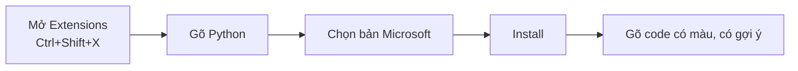

# Bài 3 — Visual Studio Code – Môi Trường Viết Code

> 🎓 **Chương 1 – Khởi đầu hành trình lập trình**

## 🧠 Điều kiện tiên quyết

- [Bài 1 — Giới Thiệu Python](../01-Gioi-Thieu/bai.md)
- [Bài 2 — Cài Đặt Python](../02-Cai-Dat-Python/bai.md)

---

## 🎯 Mục tiêu

Sau bài học này, học viên sẽ:

* ✅ Hiểu **IDE / Text Editor là gì** và vì sao lập trình viên cần nó.
* ✅ Tải và cài đặt **Visual Studio Code** về máy.
* ✅ Cài **Extension Python** để có gợi ý code, tô màu, chạy và gỡ lỗi.
* ✅ **Tạo file Python, viết code, chạy chương trình** ngay trong VSCode.
* ✅ Làm quen với **bảng điều khiển Terminal** bên trong VSCode.
* ✅ Biết các phím tắt quan trọng: `Ctrl + S`, `Ctrl + Shift + P`, `F5`.

---

## 📖 Kiến thức

### 1. Text Editor và IDE là gì?

* **Text Editor (trình soạn thảo):** phần mềm để viết văn bản/code (Notepad, VSCode...).
* **IDE (Integrated Development Environment):** môi trường phát triển tích hợp — gồm soạn thảo + chạy + sửa lỗi trong một công cụ.

> 💬 **Ví dụ đời thực:** Viết code bằng Notepad giống **viết thư bằng tay rồi gửi bưu điện**. Viết bằng VSCode giống **viết trong phần mềm soạn thảo hiện đại** — có gạch lỗi, gợi ý từ, auto lưu. Hiệu quả hơn gấp nhiều lần.

**So sánh nhanh:**

| Tiêu chí | Notepad | VSCode |
|---|---|---|
| Tô màu cú pháp | ❌ | ✅ |
| Gợi ý code (IntelliSense) | ❌ | ✅ |
| Chạy code | ❌ | ✅ |
| Sửa lỗi (debug) | ❌ | ✅ |
| Miễn phí | ✅ | ✅ |

### 2. Tại sao chọn VSCode

* 🆓 Miễn phí, mã nguồn mở.
* ⚡ Nhẹ, chạy nhanh.
* 🧩 Hàng nghìn **Extension** cho mọi ngôn ngữ.
* 🐍 Hỗ trợ Python tuyệt vời.
* 🔥 Cộng đồng rất lớn.

> 💡 VSCode không phải là IDE đúng nghĩa — nó là **trình soạn thảo siêu hiện đại**, nhờ Extension mà trở thành IDE "mọi thứ trong một".

### 3. Bước 1 – Tải VSCode

1. Vào: **https://code.visualstudio.com/**
2. Bấm nút **Download for Windows** (chọn đúng hệ điều hành của bạn).
3. Mở file tải về → chọn **I accept the agreement** → **Next** → **Install**.

> 💡 Khi cài, bạn có thể tích thêm tùy chọn **"Add 'Open with Code' action to Windows Explorer"** để mở thư mục bằng chuột phải — tiện lợi!

### 4. Bước 2 – Cài Extension Python

1. Mở VSCode.
2. Nhấn `Ctrl + Shift + X` (hoặc bấm biểu tượng 4 khối vuông trong thanh bên trái) để mở **Extensions**.
3. Gõ `Python` vào ô tìm kiếm.
4. Chọn bản của **Microsoft** → bấm **Install**.



### 5. Bước 3 – Mở một thư mục làm việc

Nguyên tắc quan trọng: **Mở Thư mục chứ không mở file**.

1. Mở VSCode.
2. Vào menu **File → Open Folder** (hoặc bấm `Ctrl+K Ctrl+O`).
3. Chọn thư mục (hoặc tạo mới, ví dụ `D:\PythonCourse`) → **Select Folder**.
4. Ở thanh **Explorer** (biểu tượng giống 2 trang giấy) bạn nhìn thấy nội dung thư mục.

> ⚠️ Nếu mở **file** riêng lẻ, VSCode không nhận diện thư mục → khó quản lý nhiều file và chạy lệnh.

### 6. Bước 4 – Tạo file Python

1. Bấm vào biểu tượng **New File** (hoặc `Ctrl + N`).
2. Nhấn `Ctrl + S` để lưu, đặt tên **kết thúc bằng `.py`**, ví dụ `bai1.py`.
3. Lưu vào thư mục đang mở.

> 🔑 Tên file có đuôi `.py` giúp VSCode nhận diện là code Python để gợi ý và tô màu.

### 7. Bước 5 – Viết và chạy chương trình

**Viết code** (bài giảng sẽ viết chương trình đầu tiên):

```python
# Chương trình đầu tiên trong VSCode
print("Hello, Visual Studio Code!")
```

**Chạy chương trình — có 3 cách:**

| Cách | Thao tác | Khi nào dùng |
|---|---|---|
| 1️⃣ Chạy nhanh | Bấm biểu tròn ▶ **(Run Python File)** góc phải trên | Thường xuyên |
| 2️⃣ Dùng Terminal | Mở Terminal `Ctrl + `` `` → gõ `python bai1.py` | Khi cần đối số |
| 3️⃣ Chạy + gỡ lỗi | Bấm `F5` | Khi cần sửa lỗi từng bước |

Kết quả hiển thị ở **panel bên dưới** (Terminal):

```
Chào Visual Studio Code!
```

### 8. Terminal bên trong VSCode

* Nhấn `` Ctrl + ` `` để mở/đóng Terminal.
* Bạn có thể gõ lệnh `python hello.py` ngay tại đó — giống Command Prompt nhưng gọn hơn.
* Nếu Terminal bị đóng, mở lại bằng menu **Terminal → New Terminal**.

---

## 💡 Ví dụ minh họa

### Ví dụ 1: Tạo một dự án có 2 file

1. Thư mục `baitap/` chứa:
   * `gioi_thieu.py` — in họ tên.
   * `tinh_tong.py` — in phép cộng.
2. Chạy từng file bằng nút ▶️.
3. Xem kết quả hiện trong **Terminal**.

**File `gioi_thieu.py`:**

```python
# Giới thiệu bản thân
print("Toi ten la An")
print("Toi 15 tuoi")
```

**File `tinh_tong.py`:**

```python
# Tính tổng
print("Tong cua 12 va 8 la:", 12 + 8)
```

---

### Ví dụ 2: Sửa nhanh dòng trong Terminal

Mở Terminal (`Ctrl + ~`), gõ:

```bash
python gioi_thieu.py
```

Dùng **phím mũi tên ↑** gọi lại lệnh cũ rồi Enter — lệnh vẫn còn trong lịch sử, không phải gõ lại thủ công.

---

## 🔬 Ví dụ nâng cao

### Ví dụ: Bật Auto Save để không lo quên lưu

1. Nhấn `Ctrl + Shift + P` (Command Palette).
2. Gõ `auto save`.
3. Chọn **Toggle Auto Save** → bật.

> Từ giờ VSCode tự lưu mỗi khi bạn tạm dừng gõ — bớt một nỗi lo "quên Ctrl+S".

### Ví dụ: Gợi ý code (IntelliSense)

* Khi gõ `pri`, bảng gợi ý hiện `print` → bấm `Tab` để chọn.
* Gõ được nửa từ, VSCode đã gợi ý phần còn lại — đỡ sai chính tả lệnh.
* Gõ `impo` → gợi ý `import`, gõ tiếp `math` → gợi ý tên thư viện.

---

## ⚠️ Lỗi thường gặp

### Lỗi 1: Bấm Run nhưng không ra kết quả

* **Nguyên nhân:** Chưa cài Extension **Python** (phần Bước 2) hoặc chưa chọn đúng file đang mở.
* **Cách sửa:**
  * Cài Extension Python (Microsoft).
  * Chọn tab code đang mở chính là file `.py`.
  * Nhấn `Ctrl + Shift + P` → gõ `Python: Select Interpreter` → chọn phiên bản đã cài (bài 2).

### Lỗi 2: Terminal báo "not recognized"

* **Nguyên nhân:** Python chưa được thêm vào PATH hoặc terminal trong VSCode đang ở thư mục khác.
* **Cách sửa:**
  * Xem lại bài 2 về PATH.
  * Gõ `cd đường_dẫn` để tới thư mục chứa file, rồi chạy lại.

### Lỗi 3: Chữ không có màu code

* **Nguyên nhân:** File chưa lưu đuôi `.py` (VSCode không nhận Python).
* **Cách sửa:** Lưu với tên file kết thúc bằng `.py`.

### Lỗi 4: Tạo file trong nhánh Explorer mà hiển thị ở chỗ khác

* **Nguyên nhân:** Đang mở file lẻ chứ không phải mở thư mục.
* **Cách sửa:** File → Open Folder, chọn đúng thư mục dự án.

---

## 💎 Mẹo

* ⚡ `Ctrl + Shift + P` — **Command Palette**: mọi lệnh VSCode đều có thể gõ tìm ở đây.
* 💾 Bật **Auto Save** để khỏi lo quên lưu.
* 🧩 Dùng thêm extension `indent-rainbow` (màu lề), `Brackets` (màu dấu ngoặc).
* 👁️ Chế độ Explorer phía trái để xem file; `.py` đầu tiên chính là tab đang mở.
* 🎯 Thêm extension "Python" giúp gợi ý, kiểm tra PEP 8 (theo chuẩn code).

---

## 📝 Tóm tắt

| Thành phần | Thao tác | Phím tắt |
|---|---|---|
| Mở Terminal | Menu or nút | `Ctrl + `` `` |
| Mở Command Palette | Tìm mọi lệnh | `Ctrl + Shift + P` |
| Tạo file mới | File → New File | `Ctrl + N` |
| Lưu file | File → Save | `Ctrl + S` |
| Chạy nhanh code | Nút Run ▶ hoặc F5 | — |
| Gợi ý code | Gõ code, có bảng hiện | — |

* Luôn **Open Folder** chứ không mở file lẻ.
* File Python phải `.py`.
* Extension Python của Microsoft cho gợi ý, chạy, gỡ lỗi.

---

## 🧪 Kiểm tra nhanh

1. ❓ VSCode là gì và tại sao cần nó để học Python?
2. ❓ Phím tắt mở Extensions?
3. ❓ Extension Python phải của hãng (publisher) nào?
4. ❓ Tạo file Python lưu phải có phần mở rộng gì?
5. ❓ Nên bấm Open **File** hay Open **Folder**? vì sao?
6. ❓ Nút nào chạy nhanh file Python trong VSCode?
7. ❓ Phím tắt lưu file?
8. ❓ Terminal mở/đóng bằng phím tắt nào, để làm gì?
9. ❓ Lỗi "not recognized python" khi chạy là do đâu?
10. ❓ Bật Auto Save để làm gì?

<details>
<summary>🔍 Xem đáp án</summary>

1. Trình soạn thảo + IDE nhờ extension: gợi ý code, chạy, gỡ lỗi.
2. `Ctrl + Shift + X`.
3. Microsoft.
4. `.py`.
5. Open Folder — để VSCode quản lý thư mục dự án, chạy đúng terminal.
6. Nút Run Python ▶ (hoặc F5).
7. `Ctrl + S`.
8. `` Ctrl + `` ` `` — gõ lệnh không ra khỏi cửa sổ.
9. PATH chưa đúng hoặc chưa chọn interpreter.
10. Tự động lưu file khi dừng gõ — không lo quên lưu.

</details>

---

## 📚 Bài đọc thêm

* [Hướng dẫn chính thức – Code.visualstudio.com](https://code.visualstudio.com/docs/languages/python)
* [VSCode – Download trang chủ](https://code.visualstudio.com/download)
- [Real Python – Python in VS Code](https://realpython.com/python-development-visual-studio-code/)

---

---

## 🧩 Bài tập

> 📝 🎯 **Chủ đề:** Cài đặt VSCode, cài Extension Python, tạo file, chạy chương trình.

## 🟢 Dễ (Bài 1 – 7)

### Bài 1: Cài đặt VSCode

* **Đề bài:** Tải và cài Visual Studio Code từ trang chính thức.
* **Input:** 🖱️ Thực hành cài đặt tại máy.
* **Output:** Biểu tượng VSCode xuất hiện trên Desktop / Start Menu.
* **Gợi ý:** Vào https://code.visualstudio.com/download → Download for Windows.

### Bài 2: Mở VSCode và tạo thư mục học tập

* **Đề bài:** Dùng VSCode tạo thư mục `HocPython`, sau đó mở thư mục này bằng Open Folder.
* **Input:** 🖱️ Trong VSCode: File → Open Folder → tạo mới `HocPython`.
* **Output:** Explorer hiển thị thư mục `HocPython` rỗng ở phía trái.
* **Gợi ý:** Nhớ nguyên tắc **mở thư mục, không mở file lẻ**.

### Bài 3: Cài Extension Python

* **Đề bài:** Cài Extension Python (publisher Microsoft) trong VSCode.
* **Input:** `Ctrl + Shift + X` → gõ `Python` → Install.
* **Output:** Extension Python xuất hiện trong danh sách Installed.
* **Gợi ý:** Nhận diện bản chuẩn bằng tên publisher **Microsoft**.

### Bài 4: Tạo file hello_vscode.py

* **Đề bài:** Tạo file `hello_vscode.py` trong thư mục đang mở, ghi dòng `Chao ban den voi VSCode`.
* **Input:** Tạo file mới (`Ctrl + N`), lưu bằng `Ctrl + S`, đặt tên đuôi `.py`.
* **Output:** File nằm trong **Explorer** (thanh bên trái).
* **Gợi ý:** File phải có đuôi `.py` mới kích hoạt hỗ trợ Python.

### Bài 5: Chạy chương trình bằng nút Run

* **Đề bài:** Chạy `hello_vscode.py` bằng nút ▶️ **Run Python File**.
* **Input:** Giữ tab `hello_vscode.py` → bấm nút Run.
* **Output:** Dòng `Chao ban den voi VSCode` hiện trong **Terminal** phía dưới.
* **Gợi ý:** Nếu không thấy nút Run, kiểm tra đã cài Extension Python chưa.

### Bài 6: Mở Terminal và chạy bằng lệnh

* **Đề bài:** Mở Terminal trong VSCode và chạy file bằng lệnh `python`.
* **Input:** `Ctrl + ~` → gõ `python hello_vscode.py`.
* **Output:** Kết quả in ra giống khi bấm nút Run.
* **Gợi ý:** Dùng phím mũi tên ↑ để gọi lại lệnh cũ.

### Bài 7: Lưu file nhanh

* **Đề bài:** Sửa nội dung `hello_vscode.py` thành in thêm dòng thứ 2 `Chuc ban hoc tot nhe!` và lưu bằng shortcut.
* **Input:** Sửa code → `Ctrl + S`.
* **Output:** Dấu chấm tròn trên tab không còn (báo hiệu đã lưu).
* **Gợi ý:** Ghi nhớ `Ctrl + S` — phím tắt quan trọng nhất của lập trình viên.

---

## 🟡 Trung bình (Bài 8 – 14)

### Bài 8: Tạo menu thực hành

* **Đề bài:** Tạo file `menu.py` in ra 3 dòng: `1. Xem bai giang`, `2. Lam bai tap`, `3. Xem dap an`. Chạy thử.
* **Input:** Code 3 lệnh `print()`.
* **Output:**
  ```
  1. Xem bai giang
  2. Lam bai tap
  3. Xem dap an
  ```
* **Gợi ý:** Mỗi dòng là một `print()`.

### Bài 9: Bật Auto Save

* **Đề bài:** Bật tính năng Auto Save bằng Command Palette.
* **Input:** `Ctrl + Shift + P` → gõ `auto save` → chọn bật.
* **Output:** Thanh trạng thái hiển thị trạng thái Auto Save đã bật.
* **Gợi ý:** Command Palette cho phép gõ tìm lệnh mà không cần tìm trong menu.

### Bài 10: Tìm lỗi bằng gạch chân đỏ

* **Đề bài:** Viết một dòng code sai (ví dụ thiếu dấu nháy) để xem VSCode gợi ý lỗi. Ghi lại dòng code sai và dòng sửa đúng.
* **Input:** Gõ `print("Thieu nhay)` → quan sát.
* **Output:** Ghi lại 2 dòng: sai và đúng.
* **Gợi ý:** VSCode **gạch chân sóng đỏ** ở chỗ lỗi cú pháp.

### Bài 11: Chọn Interpreter đúng

* **Điều kiện trước:** Đang mở file `.py`.
* **Đề bài:** Chọn đúng bản Python đã cài cho VSCode.
* **Input:** `Ctrl + Shift + P` → `Python: Select Interpreter`.
* **Output:** Góc dưới cửa sổ hiển thị tên phiên bản Python.
* **Gợi ý:** Chọn phiên bản trùng với kết quả `python --version` (bài 2).

### Bài 12: Hai file, hai lần chạy

* **Đề bài:** Tạo thêm `tinh.py` in ra phép nhân `25 * 4 = 100` (dùng phép nhân của Python). Chạy cả 2 file bằng lệnh Terminal.
* **Input:** `python hello_vscode.py` rồi `python tinh.py`.
* **Output:** Kết quả 2 chương trình hiện ở 2 dòng liên tiếp.
* **Gợi ý:** `print("25 x 4 =", 25 * 4)`.

### Bài 13: So sánh nhanh

* **Đề bài:** Viết bảng so sánh giữa Notepad và VSCode với 5 tiêu chí đã học: tô màu cú pháp, gợi ý code, chạy code, sửa lỗi, giá tiền.
* **Input:** Không có.
* **Output:** Bảng so sánh đầy đủ 5 tiêu chí.
* **Gợi ý:** Tham khảo bảng "So sánh nhanh" trong bài giảng.

### Bài 14: Sửa lỗi thiếu dấu ngoặc

* **Đề bài:** Chương trình sau bị lỗi, hãy sửa để chạy được:
  ```python
  print"Thieu dau ngoac"
  ```
* **Output mong đợi:**
  ```
  Thieu dau ngoac
  ```
* **Gợi ý:** `print` cần cặp dấu ngoặc tròn `( )`.

---

## 🔴 Khó (Bài 15 – 20)

### Bài 15: Bảng cửu chương trong VSCode

* **Đề bài:** Tạo file `bang_cuu_chuong.py` in ra các phép nhân từ `7 x 1 = 7` đến `7 x 5 = 35` (mỗi dòng một phép). Chạy file.
* **Input:** Code 5 dòng `print()`.
* **Output:**
  ```
  7 x 1 = 7
  7 x 2 = 14
  7 x 3 = 21
  7 x 4 = 28
  7 x 5 = 35
  ```
* **Gợi ý:** Mỗi dòng chứa phép tính `7 * k`.

### Bài 16: Tính trung bình cộng

* **Đề bài:** Tạo file `diem.py` in ra trung bình cộng của 3 môn (tự chọn 3 điểm), làm tròn 2 chữ số thập phân.
* **Input:** Code với 3 biến số và `print()`.
* **Output:**
  ```
  Diem trung binh: 8.0
  ```
* **Gợi ý:** `round((a + b + c) / 3, 2)`.

### Bài 17: Vẽ tam giác trong file

* **Đề bài:** Tạo `tamgiac.py` vẽ tam giác 5 tầng bằng dấu `*`, chạy bằng cả nút ▶️ và Terminal. Ghi nhận: kết quả hai cách giống nhau.
* **Input:** Code 5 lệnh `print()`.
* **Output:**
  ```
  *
  **
  ***
  ****
  *****
  ```
* **Gợi ý:** Đã từng vẽ 3 tầng ở bài 1 — tăng lên 5 tầng.

### Bài 18: Vẽ bản đồ game 3x3

* **Đề bài:** Tạo file `ban_do.py` vẽ một "bản đồ" 3x3 bằng dấu `.` (3 hàng, mỗi hàng 3 dấu).
* **Input:** 3 lệnh `print()`.
* **Output:**
  ```
  ...
  ...
  ...
  ```
* **Gợi ý:** Mỗi hàng là 3 dấu `.` liền nhau.

### Bài 19: Chạy nhiều file một dòng lệnh

* **Đề bài:** Tạo ba file: `a.py` in `A`, `b.py` in `B`, `c.py` in `C`. Chạy cả ba bằng một dòng lệnh nối nhau bằng `&&` trong Terminal.
* **Input:**
  ```
  python a.py && python b.py && python c.py
  ```
* **Output:**
  ```
  A
  B
  C
  ```
* **Gợi ý:** Ký tự `&&` chạy lệnh tiếp theo khi lệnh trước đó thành công.

### Bài 20: Tự kiểm tra tổng hợp

* **Đề bài:** Viết ra **checklist 10 mục** kiểm tra mức độ sẵn sàng, đánh dấu ✔️ hoặc ❌ cho từng mục:
  1. VSCode đã cài đặt và mở được.
  2. Đã mở đúng thư mục `HocPython`.
  3. Extension Python (Microsoft) đã cài.
  4. Tạo được file `.py`.
  5. Chạy được code bằng nút ▶️.
  6. Chạy được code bằng Terminal.
  7. Đã bật Auto Save.
  8. Đã chọn đúng Interpreter.
  9. Tự sửa được ít nhất 1 lỗi cú pháp.
  10. Đã chạy thử ít nhất 2 chương trình khác nhau.
* **Gợi ý:** Mục nào chưa ✔️ thì quay lại làm đúng phần đó trước khi sang bài 4.

---

## 🎯 Tổng kết sau khi làm bài

* ✅ Cài và làm chủ VSCode cho Python.
* ✅ Chạy code bằng nút Run và Terminal.
* ✅ Dùng Command Palette, Auto Save, Select Interpreter.
* ✅ Sẵn sàng bước vào **Bài 4 – Biến** để khởi đầu lập trình thực thụ.

---

## ✅ Đáp án

> 💡 **Hãy tự làm bài tập trước** rồi mới mở đáp án.

## 🟢 Dễ (Bài 1 – 7)


<details>
<summary>✅ Bài 1: Cài đặt VSCode</summary>


**Phân tích:** Cài phần mềm miễn phí, chính thức từ trang chủ.

**Các bước:**

1. Mở trình duyệt → https://code.visualstudio.com/download
2. Bấm **Download for Windows** (hoặc đúng hệ điều hành).
3. Mở file cài đặt → chọn **I accept the agreement** → **Next** → **Install**.
4. Bấm **Finish** — VSCode tự mở.

**Kiểm tra:** Biểu tượng VSCode xuất hiện trên Desktop / Start Menu. ✅

---

</details>

<details>
<summary>✅ Bài 2: Mở VSCode và tạo thư mục học tập</summary>


**Các bước:**

1. Mở VSCode.
2. Menu **File → Open Folder** (`Ctrl + K, Ctrl + O`).
3. Trong hộp thoại, tạo thư mục mới tên `HocPython` (nút New Folder).
4. Chọn `HocPython` → **Select Folder**.

**Kiểm tra:** Thanh **Explorer** bên trái hiển thị thư mục rỗng. ✅

> 📌 Nhớ: luôn **mở thư mục**, không mở file lẻ.

---

</details>

<details>
<summary>✅ Bài 3: Cài Extension Python</summary>


**Các bước:**

1. Nhấn `Ctrl + Shift + X` → mở Extensions.
2. Gõ `Python` vào ô tìm kiếm.
3. Chọn gói **Python** của **Microsoft** (có hàng trăm triệu lượt cài).
4. Bấm **Install**, đợi hoàn tất.

**Kiểm tra:** Mục **Installed** trong Extensions có tên Python. ✅

---

</details>

<details>
<summary>✅ Bài 4: Tạo file hello_vscode.py</summary>


**Các bước:**

1. Bấm biểu tượng **New File** (hoặc `Ctrl + N`).
2. Gõ nội dung:

```python
print("Chao ban den voi VSCode")
```

3. `Ctrl + S` → đặt tên `hello_vscode.py` → Save.

**Kiểm tra:** File xuất hiện trong Explorer, code tự **tô màu** (nhờ đuôi `.py`). ✅

---

</details>

<details>
<summary>✅ Bài 5: Chạy chương trình bằng nút Run</summary>


**Các bước:**

1. Chắc chắn tab `hello_vscode.py` đang mở.
2. Bấm nút ▶️ **Run Python File** ở góc phải trên cửa sổ.

**Kết quả:** Terminal phía dưới hiện:

```
Chao ban den voi VSCode
```

> ⚠️ Không thấy nút ▶️? → Chưa cài Extension Python (làm lại bài 3).

---

</details>

<details>
<summary>✅ Bài 6: Mở Terminal và chạy bằng lệnh</summary>


**Các bước:**

1. Nhấn `` Ctrl + ` `` để mở Terminal.
2. Gõ lệnh:

```bash
python hello_vscode.py
```

**Kết quả:** Giống hệt khi bấm nút Run.

```
Chao ban den voi VSCode
```

> 💡 Phím **↑** gọi lại lệnh cũ — gõ nhanh hơn.

---

</details>

<details>
<summary>✅ Bài 7: Lưu file nhanh</summary>


**Các bước:**

1. Sửa file thành:

```python
print("Chao ban den voi VSCode")
print("Chuc ban hoc tot nhe!")
```

2. Nhấn `Ctrl + S`.

**Kiểm tra:** Dấu chấm tròn màu trắng trên tab biến mất → đã lưu. ✅

---

</details>

## 🟡 Trung bình (Bài 8 – 14)


<details>
<summary>✅ Bài 8: Tạo menu thực hành</summary>


**Code `menu.py`:**

```python
print("1. Xem bai giang")
print("2. Lam bai tap")
print("3. Xem dap an")
```

**Kết quả khi chạy:**

```
1. Xem bai giang
2. Lam bai tap
3. Xem dap an
```

**Giải thích:** Ba lệnh `print()` tuần tự in 3 dòng menu; mỗi lệnh tự động xuống dòng.

---

</details>

<details>
<summary>✅ Bài 9: Bật Auto Save</summary>


**Các bước:**

1. Nhấn `Ctrl + Shift + P` → Command Palette.
2. Gõ `auto save`.
3. Chọn **File: Toggle Auto Save**.

**Kiểm tra:** Gõ thử 1 ký tự rồi dừng 1–2 giây — dấu tròn trên tab biến mất tự động. ✅

---

</details>

<details>
<summary>✅ Bài 10: Tìm lỗi bằng gạch chân đỏ</summary>


**Dòng sai:**

```python
print("Thieu nhay)
```

**Dòng đúng:**

```python
print("Thieu nhay")
```

**Giải thích:** Dòng sai thiếu dấu nháy đóng — VSCode gạch chân đỏ ở cuối chuỗi. Cần cặp nháy `" "` bao trọn chuỗi.

---

</details>

<details>
<summary>✅ Bài 11: Chọn Interpreter đúng</summary>


**Các bước:**

1. Mở file `.py`.
2. `Ctrl + Shift + P` → gõ `Python: Select Interpreter`.
3. Chọn phiên bản Python trùng với `python --version` đã kiểm tra ở bài 2.

**Kiểm tra:** Góc dưới trái hiện tên phiên bản (ví dụ `Python 3.14.2 64-bit`). ✅

---

</details>

<details>
<summary>✅ Bài 12: Hai file, hai lần chạy</summary>


**Code `tinh.py`:**

```python
print("25 x 4 =", 25 * 4)
```

**Chạy trong Terminal:**

```bash
python hello_vscode.py
python tinh.py
```

**Kết quả:**

```
Chao ban den voi VSCode
Chuc ban hoc tot nhe!
25 x 4 = 100
```

**Giải thích:** `25 * 4` — Python tính ra `100` rồi in kèm sau nhãn.

---

</details>

<details>
<summary>✅ Bài 13: So sánh nhanh</summary>


| Tiêu chí | Notepad | VSCode |
|---|---|---|
| Tô màu cú pháp | ❌ | ✅ |
| Gợi ý code (IntelliSense) | ❌ | ✅ |
| Chạy code | ❌ | ✅ |
| Sửa lỗi (debug) | ❌ | ✅ |
| Giá tiền | Miễn phí | Miễn phí |

**Kết luận:** VSCode vượt trội hoàn toàn cho việc học lập trình.

---

</details>

<details>
<summary>✅ Bài 14: Sửa lỗi thiếu dấu ngoặc</summary>


**Code sai:**

```python
print"Thieu dau ngoac"
```

**Code đúng:**

```python
print("Thieu dau ngoac")
```

**Giải thích:** Hàm `print` luôn cần cặp dấu ngoặc tròn chứa đối số. Thiếu dấu ngoặc → `SyntaxError`.

---

</details>

## 🔴 Khó (Bài 15 – 20)


<details>
<summary>✅ Bài 15: Bảng cửu chương trong VSCode</summary>


**Code `bang_cuu_chuong.py`:**

```python
print("7 x 1 =", 7 * 1)
print("7 x 2 =", 7 * 2)
print("7 x 3 =", 7 * 3)
print("7 x 4 =", 7 * 4)
print("7 x 5 =", 7 * 5)
```

**Kết quả:**

```
7 x 1 = 7
7 x 2 = 14
7 x 3 = 21
7 x 4 = 28
7 x 5 = 35
```

**Giải thích:** Mỗi dòng in nhãn `"7 x k ="` rồi Python tính `7 * k`. Dấu `*` là phép nhân.

---

</details>

<details>
<summary>✅ Bài 16: Tính trung bình cộng</summary>


**Code `diem.py`:**

```python
# Điểm ba môn
toan = 8
van = 7
anh = 9
# Trung bình cộng, làm tròn 2 chữ số
trung_binh = round((toan + van + anh) / 3, 2)
print("Diem trung binh:", trung_binh)
```

**Kết quả:**

```
Diem trung binh: 8.0
```

**Giải thích code:**
* `(8 + 7 + 9) / 3 = 8.0` — phép chia `/` trả về số thực.
* `round(..., 2)` giữ 2 chữ số sau dấu phẩy.
* Biến giúp code gọn, dễ thay điểm số.

---

</details>

<details>
<summary>✅ Bài 17: Vẽ tam giác trong file</summary>


**Code `tamgiac.py`:**

```python
print("*")
print("**")
print("***")
print("****")
print("*****")
```

**Kết quả:**

```
*
**
***
****
*****
```

**Ghi nhận:** Cách chạy bằng nút ▶️ và bằng Terminal cho **kết quả giống hệt nhau** — chỉ khác cách bấm.

---

</details>

<details>
<summary>✅ Bài 18: Vẽ bản đồ game 3x3</summary>


**Code `ban_do.py`:**

```python
print("...")
print("...")
print("...")
```

**Kết quả:**

```
...
...
...
```

**Giải thích:** Ba hàng giống nhau tạo lưới 3x3 — mô hình ban đầu cho trò chơi (cờ, mê cung...) sẽ học sau.

---

</details>

<details>
<summary>✅ Bài 19: Chạy nhiều file một dòng lệnh</summary>


**Code các file:**

* `a.py`: `print("A")`
* `b.py`: `print("B")`
* `c.py`: `print("C")`

**Lệnh chạy:**

```bash
python a.py && python b.py && python c.py
```

**Kết quả:**

```
A
B
C
```

**Giải thích:** `&&` chạy lệnh sau chỉ khi lệnh trước **thành công** — hữu ích khi cần chạy chuỗi công việc.

---

</details>

<details>
<summary>✅ Bài 20: Tự kiểm tra tổng hợp</summary>


**Checklist mẫu (tick ✔️ nếu làm được):**

- [x] VSCode đã cài đặt và mở được.
- [x] Đã mở đúng thư mục `HocPython`.
- [x] Extension Python (Microsoft) đã cài.
- [x] Tạo được file `.py`.
- [x] Chạy được code bằng nút ▶️.
- [x] Chạy được code bằng Terminal.
- [x] Đã bật Auto Save.
- [x] Đã chọn đúng Interpreter.
- [x] Tự sửa được ít nhất 1 lỗi cú pháp.
- [x] Đã chạy thử ít nhất 2 chương trình khác nhau.

> Nếu còn mục ❌ — quay lại ôn phần đó. Từ bài sau, mọi kiến thức đều dựa trên công cụ này.

---

</details>

## 📌 Lời khuyên cuối


* VSCode sẽ là "nhà" của bạn suốt khóa học — hãy ghi nhớ các phím tắt.
* Luyện chạy code cả 2 cách: nút ▶️ và Terminal.
* Đừng ngại bấm thử: sai lỗi cú pháp chỉ là lỗi gõ — sửa là chạy.

👉 Tiếp theo: **[Bài 4: Biến trong Python](../04-Bien/bai.md)**

---

## ➡️ Điều hướng

**Vị trí:** `01-Co-Ban/03-VSCode/bai.md`

**Bài tiếp theo:** [Bài 4 — Biến Trong Python](../04-Bien/bai.md)
