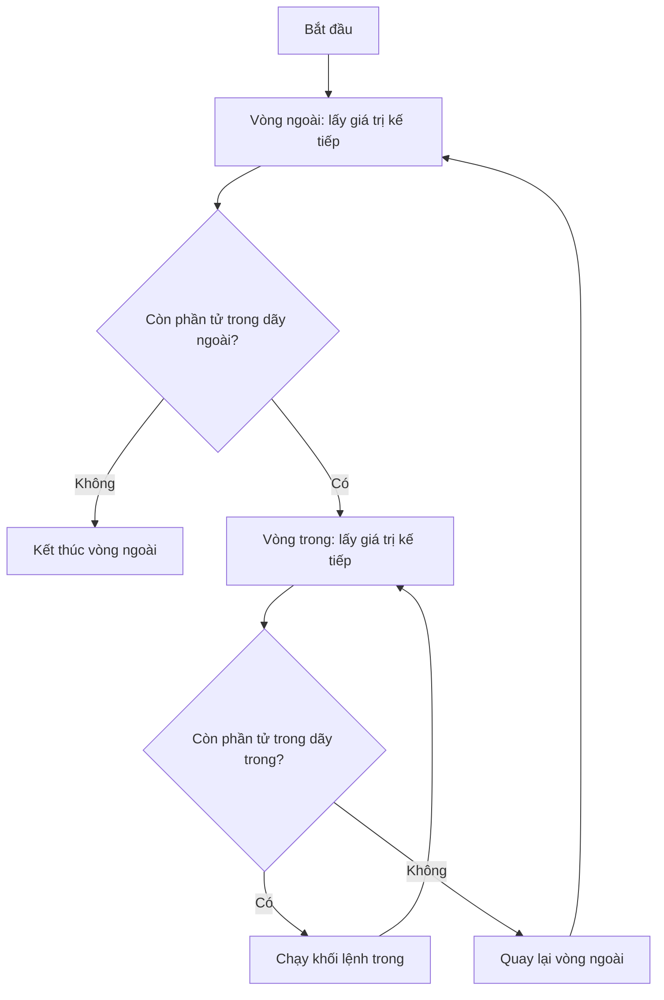

# Bài 10 — Vòng Lặp For – Lặp Lại Một Số Lần Biết Trước

> 🎓 **Chương 4 – Vòng lặp trong Python**

## 🧠 Điều kiện tiên quyết

- [Bài 6 — Toán Tử Trong Python](../06-Toan-Tu/bai.md)

---

## 🎯 Mục tiêu

Sau bài học này, học viên sẽ:

* ✅ Hiểu **vòng lặp là gì** và khi nào chương trình cần lặp lại công việc.
* ✅ Viết được vòng lặp `for` với **`range(start, stop, step)`** — cả đếm tăng lẫn đếm ngược.
* ✅ **Duyệt qua từng phần tử** của chuỗi và danh sách bằng `for`.
* ✅ Dùng **`enumerate`** để lấy cả vị trí lẫn giá trị trong vòng lặp.
* ✅ Điều khiển vòng lặp bằng **`break`** (dừng ngay) và **`continue`** (bỏ qua lượt hiện tại).
* ✅ Viết được **vòng lặp lồng nhau** — ví dụ bảng cửu chương.
* ✅ Giải quyết bài toán thực tế: tổng 1..n, giai thừa, tổng số chẵn, tính tiền hóa đơn.

---

## 📖 Kiến thức

### 1. Vòng lặp là gì? Vì sao cần nó?

Máy tính mạnh nhất ở chỗ **làm đi làm lại một việc thật nhanh**. Nếu bạn cần in "Xin chào" 10 lần, bạn sẽ không viết 10 lệnh `print`:

> 💬 **Ví dụ đời thực:** Giống việc nhân viên kho đếm 100 thùng hàng — thay vì viết sẵn 100 dòng "đếm thùng 1", "đếm thùng 2"... anh ta có một **quy trình lặp**: *đếm thùng hiện tại → sang thùng kế tiếp → đến khi hết*. Vòng lặp trong lập trình chính là quy trình đó.

```python
# Cách "dở tệ" — viết tay 10 lần
print("Xin chào")
print("Xin chào")
# ... viết đến 10 lần 😫

# Cách của lập trình viên — vòng lặp
for i in range(10):
    print("Xin chào")   # Chỉ cần 1 dòng lệnh
```

**Hai loại vòng lặp chính trong Python:**

| Loại | Dùng khi | Số lần lặp |
|---|---|---|
| 🔁 `for` (bài này) | **Biết trước** số lần hoặc lặp qua một dãy | Do dãy quyết định |
| 🔄 `while` (bài 11) | **Chưa biết trước**, lặp tới khi điều kiện sai | Do điều kiện quyết định |

### 2. Cú pháp `for` và hàm `range`

```python
for bien in day:
    # Khối lệnh lặp — chạy với mỗi phần tử của day
```

* `bien` — biến tạm, mỗi lượt được gán một giá trị trong dãy.
* `day` — dãy cần duyệt: `range(...)`, chuỗi, danh sách...
* Khối lệnh thụt lề phía dưới được chạy lặp lại — hết dãy thì tự dừng.

**Hàm `range` — nhà máy sản xuất dãy số:**

| Cách viết | Dãy sinh ra | Ghi chú |
|---|---|---|
| `range(5)` | `0, 1, 2, 3, 4` | Bắt đầu từ **0**, đến **stop - 1** |
| `range(1, 6)` | `1, 2, 3, 4, 5` | Từ `start`, đến `stop - 1` |
| `range(2, 8, 2)` | `2, 4, 6` | Bước nhảy `step = 2` |
| `range(10, 0, -2)` | `10, 8, 6, 4, 2` | `step` **âm** → đếm ngược |

> ⚠️ **Quy tắc vàng:** `range(stop)` **không bao giờ sinh ra `stop`** — `range(5)` cho 0,1,2,3,4. Muốn có số 5 thì viết `range(6)`.

### 3. Đếm ngược bằng `step` âm

`step` có thể là số âm — vòng lặp đi **lùi**:

```python
# Đếm ngược từ 5 về 1
for i in range(5, 0, -1):
    print(i)
print("Hết giờ!")
```

> 💡 `range(5, 0, -1)` — bắt đầu 5, mỗi bước bớt 1, dừng trước khi xuống tới 0.

### 4. Duyệt chuỗi và danh sách

`for` duyệt được **từng ký tự** của chuỗi, **từng phần tử** của danh sách:

```python
# Duyệt chuỗi: in từng chữ cái
for chu in "Python":
    print(chu)

# Duyệt danh sách: in từng môn học
mon_hoc = ["Toán", "Văn", "Anh"]
for mon in mon_hoc:
    print("Môn:", mon)
```

> 💬 **Ví dụ đời thực:** Vòng lặp duyệt danh sách giống **giáo viên điểm danh**: lần lượt gọi tên từng học sinh trong danh sách — hết danh sách thì dừng.

### 5. `enumerate` — lấy cả "số thứ tự" lẫn giá trị

Khi cần **vị trí** (0, 1, 2...) đi kèm **giá trị**, dùng `enumerate`:

```python
mon_hoc = ["Toán", "Văn", "Anh"]
# enumerate trả về cặp (vị trí, giá trị)
for vi_tri, mon in enumerate(mon_hoc):
    print(f"Vị trí {vi_tri}: {mon}")
```

Kết quả:

```
Vị trí 0: Toán
Vị trí 1: Văn
Vị trí 2: Anh
```

> 💡 Muốn số thứ tự bắt đầu từ 1, viết `enumerate(mon_hoc, start=1)`.

### 6. `break` và `continue` — điều khiển vòng lặp

| Lệnh | Tác dụng | Ví dụ đời thực |
|---|---|---|
| `break` | **Dừng hẳn** vòng lặp ngay lập tức | Gọi điện thoại: gặp đúng người cần thì **cúp máy**, không gọi tiếp |
| `continue` | **Bỏ qua lượt hiện tại**, sang lượt kế | Xếp hàng: gặp người không mua hàng thì **nhường qua người sau**, không rời hàng |

```python
# break: dừng khi tìm thấy số 5
for i in range(1, 11):
    if i == 5:
        break          # Gặp 5 là thoát vòng lặp ngay
    print(i)           # In: 1 2 3 4

# continue: bỏ qua số chẵn
for i in range(1, 8):
    if i % 2 == 0:
        continue       # Số chẵn → bỏ qua lượt này
    print(i)           # In: 1 3 5 7
```

### 7. Vòng lặp lồng nhau

Vòng lặp bên trong vòng lặp — với mỗi lượt của vòng ngoài, vòng trong chạy **đủ hết** các lượt của nó:

```python
# In bảng tọa độ 3x3
for i in range(1, 4):        # Vòng ngoài: i = 1, 2, 3
    for j in range(1, 4):    # Vòng trong: j = 1, 2, 3
        print(f"({i},{j})", end=" ")
    print()                  # Xuống dòng sau mỗi vòng ngoài
```

Kết quả:

```
(1,1) (1,2) (1,3)
(2,1) (2,2) (2,3)
(3,1) (3,2) (3,3)
```

> 💬 **Ví dụ đời thực:** Vòng lặp lồng nhau giống **lịch trình huấn luyện**: mỗi ngày (vòng ngoài) bạn chạy đủ 3 hiệp (vòng trong) — hết hiệp mới sang ngày kế tiếp.



### 8. Khi nào dùng `for`?

* Đếm từ A đến B (biết trước số lần).
* Xử lý từng phần tử của danh sách / chuỗi / bảng.
* Lặp n lần bất kỳ: `for i in range(n):`.

---

## 💡 Ví dụ minh họa

### Ví dụ 1: Tổng các số từ 1 đến n

```python
# Nhập n (ví dụ: 5)
n = int(input("Nhập n: "))

tong = 0  # Biến tích lũy — ban đầu bằng 0

# Cộng dồn từng số từ 1 đến n
for i in range(1, n + 1):
    tong = tong + i

print(f"Tổng 1 + 2 + ... + {n} = {tong}")
```

**Giải thích từng dòng:**

| Dòng code | Ý nghĩa |
|---|---|
| `tong = 0` | **Biến tích lũy** — hộp cộng dồn, bắt đầu trống (0) |
| `for i in range(1, n + 1):` | i lần lượt nhận 1, 2, ..., n (nhớ `n + 1` vì range không bao gồm điểm dừng) |
| `tong = tong + i` | Lấy hộp cộng thêm i, bỏ lại vào hộp |

> 💡 Với n = 5: hộp trải qua 0 → 1 → 3 → 6 → 10 → 15. Kết quả `Tổng = 15`.

### Ví dụ 2: Giai thừa n! (ví dụ 5! = 120)

```python
# Nhập n (ví dụ: 5)
n = int(input("Nhập n: "))

giai_thua = 1  # Biến nhân dồn — bắt đầu bằng 1 (không phải 0!)

# Nhân dồn từ 1 đến n
for i in range(1, n + 1):
    giai_thua = giai_thua * i

print(f"{n}! = {giai_thua}")
```

**Giải thích từng dòng:**

| Dòng code | Ý nghĩa |
|---|---|
| `giai_thua = 1` | Nhân dồn nên khởi tạo **1** — khởi tạo 0 thì kết quả mãi bằng 0 |
| `giai_thua = giai_thua * i` | Nhân dồn: 1×1 → ×2 → ×3 → ×4 → ×5 = 120 |
| `print(f"{n}! = {giai_thua}")` | In đúng định dạng `5! = 120` |

> ⚠️ **Lỗi cổ điển:** biến nhân dồn khởi tạo bằng 0 → kết quả luôn 0. Nhớ quy tắc: **cộng dồn khởi tạo 0, nhân dồn khởi tạo 1**!

### Ví dụ 3: Số lẻ từ 1 đến 20 và số chẵn giảm dần từ 20 về 0

```python
# In các số lẻ từ 1 đến 20
print("Các số lẻ từ 1 đến 20:")
for i in range(1, 21, 2):   # 1, 3, 5, ..., 19 (bước nhảy 2)
    print(i)

# In các số chẵn giảm dần từ 20 về 0
print("Các số chẵn giảm dần từ 20 về 0:")
for i in range(20, -1, -2):   # 20, 18, ..., 0 (step âm)
    print(i)
```

**Giải thích từng dòng:**

| Dòng code | Ý nghĩa |
|---|---|
| `range(1, 21, 2)` | Bắt đầu 1, mỗi bước +2 → toàn số lẻ; dừng trước 21 để có 19 |
| `range(20, -1, -2)` | Bắt đầu 20, mỗi bước −2 → số chẵn; viết `-1` để dừng đúng tại 0 |

> 💡 Mẹo nhớ: `range(start, stop, step)` luôn **không bao gồm `stop`** — muốn in tới 0 thì `stop` phải là `-1`.

---

## 🔬 Ví dụ nâng cao

### Ví dụ 1: Bảng cửu chương đầy đủ (vòng lặp lồng nhau)

```python
# In bảng cửu chương từ 2 đến 9
for so in range(2, 10):            # Vòng ngoài: từng bảng nhân
    print(f"=== BẢNG NHÂN {so} ===")
    for nhan in range(1, 11):      # Vòng trong: 1 x 1 đến 1 x 10
        print(f"{so} x {nhan} = {so * nhan}")
    print()                        # Dòng trống ngăn cách các bảng
```

**Giải thích:**
* Vòng ngoài chọn bảng (2 → 9); với mỗi bảng, vòng trong in đủ 10 phép tính.
* `f"{so} x {nhan} = {so * nhan}"` — f-string ghép 3 thông tin vào một dòng.
* Tổng số lần in: 8 bảng × 10 dòng = 80 dòng — viết tay thì không tưởng, vòng lặp chỉ vài dòng code.

### Ví dụ 2: Tổng các số chẵn từ 0 đến n

```python
n = int(input("Nhập n: "))   # Ví dụ: 10

tong = 0
# Duyệt tất cả số 0..n nhưng chỉ cộng số chẵn
for i in range(n + 1):
    if i % 2 == 0:      # i chia hết cho 2 → chẵn
        tong = tong + i

print(f"Tổng các số chẵn từ 0 đến {n} là: {tong}")
```

**Giải thích:**
* `i % 2 == 0` — phép chia lấy dư (bài 6): dư 0 nghĩa là số chẵn.
* Với n = 10: 0+2+4+6+8+10 = 30 — khớp ví dụ giáo trình.
* **Cách gọn hơn:** `for i in range(0, n + 1, 2):` — sinh thẳng dãy số chẵn, khỏi cần `if`.

### Ví dụ 3: Tính tiền hóa đơn siêu thị

```python
# Danh sách giá các món hàng (nghìn đồng)
don_gia = [15, 25, 10, 40, 8]

tong = 0
# Duyệt từng giá rồi cộng dồn
for gia in don_gia:
    print(f"  + {gia} nghìn đồng")
    tong = tong + gia

print(f"Tổng hóa đơn: {tong} nghìn đồng")
```

Kết quả:

```
  + 15 nghìn đồng
  + 25 nghìn đồng
  + 10 nghìn đồng
  + 40 nghìn đồng
  + 8 nghìn đồng
Tổng hóa đơn: 98 nghìn đồng
```

**Giải thích:**
* `for gia in don_gia:` — duyệt **trực tiếp danh sách**, không cần chỉ số.
* Biến tích lũy `tong` hoạt động y như ví dụ tổng 1..n — cùng một ý tưởng, áp dụng cho dữ liệu thật.
* Nếu sau này siêu thị thêm 100 món, danh sách dài ra nhưng code **không đổi** — sức mạnh của vòng lặp.

### Ví dụ 4: Đếm nguyên âm trong chuỗi (dùng `enumerate` + `continue`)

```python
cau = "Hoc lap trinh Python"
nguyen_am = "aeiouAEIOU"
dem = 0

# Duyệt từng ký tự kèm vị trí
for vi_tri, ky_tu in enumerate(cau):
    if ky_tu not in nguyen_am:
        continue               # Không phải nguyên âm → bỏ qua lượt này
    dem = dem + 1
    print(f"Nguyên âm thứ {dem} ở vị trí {vi_tri}: {ky_tu}")

print(f"Tổng số nguyên âm: {dem}")
```

**Giải thích:**
* `enumerate(cau)` trả về cặp (vị trí, ký tự) — biết chính xác nguyên âm nằm ở đâu.
* `continue` giúp bỏ qua phụ âm, chỉ xử lý nguyên âm — code trong vòng lặp sạch hơn.
* `ky_tu not in nguyen_am` — kiểm tra ký tự có thuộc chuỗi nguyên âm hay không.

---

## ⚠️ Lỗi thường gặp

### Lỗi 1: `range(n)` thiếu số n cuối cùng

```python
for i in range(1, 5):   # ❌ chỉ in 1, 2, 3, 4
    print(i)

for i in range(1, 6):   # ✅ muốn in tới 5 phải ghi 6
    print(i)
```

* **Nguyên nhân:** `range(start, stop)` không bao gồm `stop`.
* **Cách khắc phục:** Nhớ quy tắc: muốn đếm tới n thì ghi `range(1, n + 1)`.

### Lỗi 2: Quên dấu hai chấm sau `for`

```python
for i in range(5)    # ❌ thiếu dấu :
    print(i)
```

* **Kết quả báo:** `SyntaxError: expected ':'`.
* **Cách khắc phục:** Luôn viết đủ `for i in range(5):` — dấu `:` là "bộ khởi động" của khối lệnh.

### Lỗi 3: Thụt lề không đều

```python
for i in range(5):
print(i)     # ❌ lệnh này không thuộc vòng lặp (hoặc báo IndentationError)
```

* **Nguyên nhân:** Python dùng **thụt lề để nhận biết khối lệnh**.
* **Cách khắc phục:** Mọi lệnh trong vòng lặp phải thụt vào **cùng một mức** (1 tab hoặc 4 dấu cách).

### Lỗi 4: `range` với step bằng 0

```python
for i in range(1, 5, 0):   # ❌ step = 0
    print(i)
```

* **Kết quả báo:** `ValueError: range() arg 3 must not be zero`.
* **Cách khắc phục:** Step phải khác 0; muốn đếm ngược dùng step âm như `range(5, 0, -1)`.

### Lỗi 5: Sửa danh sách ngay trong lúc đang duyệt

```python
so = [1, 2, 3, 4, 5]
for x in so:
    if x == 3:
        so.remove(x)   # ❌ kết quả khó lường: phần tử bị "nhảy cóc"
```

* **Nguyên nhân:** Vòng lặp đang duyệt theo chỉ số ban đầu, xóa phần tử làm lệch vị trí.
* **Cách khắc phục:** Thu thập phần tử cần xóa trước, xóa sau vòng lặp; hoặc duyệt bản sao `for x in so[:]:` (sẽ học sâu ở bài List).

### Lỗi 6: Nhầm lẫn `break` và `continue`

* `break` → **thoát hẳn** vòng lặp. `continue` → **bỏ qua lượt**, vẫn còn lặp tiếp.
* Nhầm lẫn điển hình: dùng `continue` khi muốn dừng tìm kiếm → vòng lặp vẫn chạy đến hết, kết quả in thừa.

---

## 💎 Mẹo

* 🎯 **Quy tắc vàng `range`:** muốn in 1..n thì `range(1, n + 1)` — "một cộng" ghi nhớ suốt đời.
* 🏁 **`break` dùng trong tìm kiếm:** tìm thấy rồi thì dừng ngay, đừng duyệt tiếp làm lãng phí thời gian.
* 🚦 **`continue` làm code gọn:** kiểm tra điều kiện "loại trừ" trước rồi `continue`, phần việc chính nằm gọn phía dưới.
* 🔢 **Nghĩ tới step:** cần dãy cách quãng (số lẻ, số chẵn) → dùng step thay vì `if` bên trong.
* 🧮 **Biến tích lũy:** cộng dồn khởi tạo `0`, nhân dồn khởi tạo `1` — ghi lên giấy dán bàn!
* 📏 **Vòng lặp lồng nhau:** vòng trong chạy hết **một chu kỳ đầy đủ** cho mỗi lượt của vòng ngoài — vẽ bảng 3×3 để hiểu ngay.
* 🏷️ **`_` thay cho biến tạm:** nếu không dùng biến đếm, viết `for _ in range(n):` để báo "tôi chỉ cần lặp n lần".

---

## 📝 Tóm tắt

| Khái niệm | Nội dung |
|---|---|
| 🔁 `for bien in day:` | Lặp qua từng phần tử của dãy; hết dãy thì tự dừng |
| 🔢 `range(stop)` | `0, 1, ..., stop-1` — không bao gồm stop |
| 🔢 `range(start, stop)` | Từ start đến stop-1 |
| 🔢 `range(start, stop, step)` | Bước nhảy step; step âm để đếm ngược |
| 📜 Duyệt chuỗi/list | `for x in "Python":` / `for x in [1, 2, 3]:` |
| 🔖 `enumerate(day)` | Trả cặp (vị trí, giá trị); có `start=` để đổi điểm đầu |
| ⏹️ `break` | Dừng hẳn vòng lặp |
| ⏭️ `continue` | Bỏ qua lượt hiện tại, sang lượt kế |
| 🪆 Lồng nhau | Vòng trong chạy đủ hết rồi mới quay lại vòng ngoài |
| 🧮 Tích lũy | Cộng dồn bắt đầu `0`; nhân dồn bắt đầu `1` |

---

## 🧪 Kiểm tra nhanh

1. ❓ `range(5)` sinh ra dãy số nào?
2. ❓ Muốn in các số 1, 2, ..., 10 thì viết `range` thế nào?
3. ❓ `range(2, 10, 2)` cho dãy nào?
4. ❓ Viết câu lệnh in các số 5, 4, 3, 2, 1 bằng range.
5. ❓ `break` và `continue` khác nhau thế nào?
6. ❓ Sau vòng `for i in range(3): for j in range(3):`, khối trong chạy tổng cộng bao nhiêu lần?
7. ❓ `enumerate(["a", "b"])` trả về những cặp nào?
8. ❓ Vì sao biến nhân dồn phải khởi tạo bằng 1 thay vì 0?
9. ❓ `range(1, 5, 0)` có chạy được không? Vì sao?
10. ❓ Dùng vòng lặp viết code in "Xin chào" đúng 7 lần.

<details>
<summary>🔍 Xem đáp án</summary>

1. `0, 1, 2, 3, 4`.
2. `range(1, 11)`.
3. `2, 4, 6, 8`.
4. `for i in range(5, 0, -1): print(i)`.
5. `break` thoát hẳn vòng lặp; `continue` chỉ bỏ qua lượt hiện tại.
6. 9 lần (3 × 3).
7. `(0, "a")`, `(1, "b")`.
8. Vì nhân với 0 kết quả luôn bằng 0.
9. Không — `ValueError`, vì step không được bằng 0.
10. `for _ in range(7): print("Xin chào")`.

</details>

---

## 📚 Bài đọc thêm

* [Python.org – For Statements](https://docs.python.org/3/tutorial/controlflow.html#for-statements)
* [Python.org – The range() Function](https://docs.python.org/3/tutorial/controlflow.html#the-range-function)
* [W3Schools – Python For Loops](https://www.w3schools.com/python/python_for_loops.asp)
* [Real Python – Loops in Python](https://realpython.com/python-for-loop/)
* [Programiz – Python for Loop](https://www.programiz.com/python-programming/for-loop)

---

---

## 🧩 Bài tập

> 📝 🎯 **Chủ đề:** `for`, `range(start, stop, step)`, duyệt chuỗi/list, `enumerate`, `break`, `continue`, vòng lặp lồng nhau.

## 🟢 Dễ (Bài 1 – 7)

### Bài 1: Đếm từ 1 đến 10

* **Đề bài:** Dùng vòng lặp `for` in các số từ 1 đến 10, mỗi số một dòng.
* **Input:** Không có.
* **Output:**
  ```
  1
  2
  ...
  10
  ```
* **Gợi ý:** `for i in range(1, 11): print(i)`.

### Bài 2: Các số lẻ từ 1 đến 20

* **Đề bài:** In các số lẻ từ 1 đến 20, mỗi số một dòng.
* **Input:** Không có.
* **Output:**
  ```
  1
  3
  5
  ...
  19
  ```
* **Gợi ý:** Dùng step 2: `range(1, 21, 2)`.

### Bài 3: Tổng từ 1 đến n

* **Đề bài:** Nhập số nguyên dương n, tính và in tổng `1 + 2 + ... + n`.
* **Input:** Một số nguyên dương n.
* **Output:** Tổng.
* **Ví dụ:**
  ```
  Nhập n: 5
  Tổng 1 + 2 + ... + 5 = 15
  ```
* **Gợi ý:** Biến `tong = 0` rồi cộng dồn từng i trong vòng lặp.

### Bài 4: In chữ 5 lần

* **Đề bài:** In dòng chữ `Xin chao Python!` đúng 5 lần, mỗi lần kèm số thứ tự: `Lan 1: Xin chao Python!`.
* **Input:** Không có.
* **Output:**
  ```
  Lan 1: Xin chao Python!
  Lan 2: Xin chao Python!
  ...
  Lan 5: Xin chao Python!
  ```
* **Gợi ý:** `for i in range(1, 6): print(f"Lan {i}: ...")`.

### Bài 5: Bảng nhân của n

* **Đề bài:** Nhập số nguyên n (1–9), in bảng nhân n từ `n x 1 = ...` đến `n x 10 = ...`.
* **Input:** Một số nguyên.
* **Output:** 10 dòng phép nhân.
* **Ví dụ:**
  ```
  Nhập n: 5
  5 x 1 = 5
  5 x 2 = 10
  ...
  5 x 10 = 50
  ```
* **Gợi ý:** `for i in range(1, 11): print(f"{n} x {i} = {n * i}")`.

### Bài 6: Số chẵn giảm dần

* **Đề bài:** In các số chẵn **giảm dần** từ 20 về 0, mỗi số một dòng.
* **Input:** Không có.
* **Output:**
  ```
  20
  18
  ...
  0
  ```
* **Gợi ý:** `range(20, -1, -2)` — step âm và nhớ `stop` là `-1` để có số 0.

### Bài 7: Tên của bạn từng chữ

* **Đề bài:** Nhập họ tên của bạn, in **từng chữ cái** trên một dòng.
* **Input:** Một chuỗi họ tên.
* **Output:** Từng ký tự trên từng dòng.
* **Ví dụ:**
  ```
  Nhập họ tên: An
  A
  n
  ```
* **Gợi ý:** `for chu in ho_ten:` — chuỗi duyệt được từng ký tự.

---

## 🟡 Trung bình (Bài 8 – 14)

### Bài 8: Giai thừa n!

* **Đề bài:** Nhập số nguyên dương n, tính và in `n! = 1 * 2 * ... * n`.
* **Input:** Một số nguyên dương.
* **Output:** Giá trị giai thừa.
* **Ví dụ:**
  ```
  Nhập n: 5
  5! = 120
  ```
* **Gợi ý:** Biến nhân dồn khởi tạo **1** (không phải 0!), nhân dồn từ 1 đến n.

### Bài 9: Tổng số chẵn từ 0 đến n

* **Đề bài:** Nhập số nguyên dương n, tính tổng các số chẵn từ 0 đến n.
* **Input:** Một số nguyên dương.
* **Output:** Tổng.
* **Ví dụ:**
  ```
  Nhập n: 10
  Tổng các số chẵn từ 0 đến 10 là: 30
  ```
* **Gợi ý:** Cách 1: `if i % 2 == 0` để lọc; Cách 2 (gọn hơn): `range(0, n + 1, 2)`.

### Bài 10: Bỏ qua số chia hết cho 3

* **Đề bài:** In các số từ 1 đến 30, nhưng **bỏ qua** các số chia hết cho 3.
* **Input:** Không có.
* **Output:**
  ```
  1
  2
  4
  5
  7
  ...
  29
  ```
* **Gợi ý:** Dùng `if i % 3 == 0: continue` trong vòng lặp.

### Bài 11: Bảng cửu chương 2 đến 5

* **Đề bài:** In các bảng nhân từ 2 đến 5, mỗi bảng đủ 10 phép tính, trước mỗi bảng in dòng `=== BANG NHAN {so} ===`.
* **Input:** Không có.
* **Output:**
  ```
  === BANG NHAN 2 ===
  2 x 1 = 2
  ...
  === BANG NHAN 3 ===
  ...
  ```
* **Gợi ý:** Hai vòng lặp lồng nhau: vòng ngoài chọn bảng, vòng trong in phép tính.

### Bài 12: Trung bình cộng n số

* **Đề bài:** Nhập số lượng môn học n, rồi nhập điểm của từng môn; in trung bình cộng (làm tròn 2 chữ số thập phân).
* **Input:** n và n điểm (số thực).
* **Output:** Điểm trung bình.
* **Ví dụ:**
  ```
  Nhập số môn: 3
  Nhập điểm môn 1: 7
  Nhập điểm môn 2: 8
  Nhập điểm môn 3: 9
  Điểm trung bình: 8.0
  ```
* **Gợi ý:** Cộng dồn trong vòng lặp `range(n)`, sau đó chia cho n.

### Bài 13: Hóa đơn siêu thị

* **Đề bài:** Nhập số món hàng n, rồi nhập giá từng món (nghìn đồng); in từng món đã mua và tổng tiền phải trả.
* **Input:** n và n giá tiền.
* **Output:** Tổng tiền hóa đơn.
* **Ví dụ:**
  ```
  Nhập số món hàng: 3
  Nhập giá món 1: 15
  Nhập giá món 2: 25
  Nhập giá món 3: 10
  Tổng hóa đơn: 50 nghìn đồng
  ```
* **Gợi ý:** Biến tích lũy cộng dồn giá từng món ngay khi nhập.

### Bài 14: Vị trí đầu tiên của ký tự

* **Đề bài:** Nhập một chuỗi và một ký tự, in vị trí **đầu tiên** ký tự đó xuất hiện (vị trí đếm từ 0). Nếu không có → in `Khong tim thay!`.
* **Input:** Một chuỗi và một ký tự.
* **Output:** Vị trí đầu tiên hoặc thông báo.
* **Ví dụ:**
  ```
  Nhập chuỗi: python
  Nhập ký tự: t
  Vị trí đầu tiên: 2
  ```
* **Gợi ý:** `for vi_tri, ky_tu in enumerate(chuoi):` và dùng `break` khi tìm thấy; dùng biến cờ `tim_thay` để biết có tìm thấy hay không.

---

## 🔴 Khó (Bài 15 – 20)

### Bài 15: Toàn bộ bảng cửu chương

* **Đề bài:** In bảng cửu chương từ 2 đến 9, mỗi bảng đủ 10 phép tính, có dòng tiêu đề và **dòng trống** ngăn cách giữa các bảng.
* **Input:** Không có.
* **Output:** 8 bảng cửu chương hoàn chỉnh.
* **Gợi ý:** Vòng lặp lồng nhau; `print()` không đối số sẽ xuống dòng tạo khoảng cách.

### Bài 16: Kiểm tra số nguyên tố

* **Đề bài:** Nhập số nguyên dương n, kiểm tra n có phải số nguyên tố không (chia hết cho 1 và chính nó; 2 là số nguyên tố nhỏ nhất). In `La so nguyen to` hoặc `Khong phai so nguyen to`.
* **Input:** Một số nguyên dương.
* **Output:** Kết luận.
* **Ví dụ:**
  ```
  Nhập n: 17
  La so nguyen to
  ```
* **Gợi ý:** Đếm số ước trong khoảng `range(2, n)` — nếu có ước nào chia hết thì không phải nguyên tố; dùng biến cờ hoặc `break`.

### Bài 17: Tam giác sao

* **Đề bài:** Nhập chiều cao h, vẽ tam giác vuông cân bằng dấu `*`, hàng thứ i có i dấu `*` (i từ 1 đến h).
* **Input:** Một số nguyên dương.
* **Output:** Hình tam giác.
* **Ví dụ:**
  ```
  Nhập chiều cao: 4
  *
  **
  ***
  ****
  ```
* **Gợi ý:** Vòng ngoài in từng hàng; nhân chuỗi: `"*" * i` tạo i dấu `*`.

### Bài 18: Tổng dãy phân số

* **Đề bài:** Nhập n, tính `S = 1 + 1/2 + 1/3 + ... + 1/n` và in kết quả làm tròn 2 chữ số thập phân.
* **Input:** Số nguyên dương n.
* **Output:** Tổng (2 chữ số thập phân).
* **Ví dụ:**
  ```
  Nhập n: 4
  S = 2.08
  ```
* **Gợi ý:** Cộng dồn `tong = tong + 1 / i`; lưu ý `1/i` trong Python 3 là phép chia thực.

### Bài 19: Dãy Fibonacci

* **Đề bài:** Nhập n, in **n số đầu tiên** của dãy Fibonacci (0, 1, 1, 2, 3, 5, 8, ... — mỗi số bằng tổng hai số trước).
* **Input:** Số nguyên dương n.
* **Output:** n số Fibonacci.
* **Ví dụ:**
  ```
  Nhập n: 7
  0 1 1 2 3 5 8
  ```
* **Gợi ý:** Hai biến `a, b` bắt đầu là 0, 1; mỗi lượt in `a` rồi gán đồng thời `a, b = b, a + b`.

### Bài 20: Lãi kép tiết kiệm

* **Đề bài:** Gửi tiết kiệm số tiền S (triệu đồng), lãi suất r% **mỗi tháng**, lãi được nhập vào gốc hằng tháng (lãi kép). Nhập S, r và số tháng n; tính số tiền sau n tháng (làm tròn 2 chữ số thập phân).
* **Input:** S (float), r (float), n (int).
* **Output:** Số tiền sau n tháng.
* **Ví dụ:**
  ```
  Nhập số tiền gửi (triệu): 100
  Nhập lãi suất %/tháng: 1
  Nhập số tháng: 12
  Số tiền sau 12 tháng: 112.68 triệu đồng
  ```
* **Gợi ý:** Mỗi tháng: `tien = tien + tien * r / 100` — lặp n lần, in kết quả bằng `round(..., 2)`.

---

## 🎯 Tổng kết sau khi làm bài

Sau 20 bài tập, bạn đã:

* ✅ Thành thạo `for` với `range(start, stop, step)` — kể cả đếm ngược.
* ✅ Duyệt chuỗi và danh sách, dùng `enumerate` lấy vị trí.
* ✅ Điều khiển vòng lặp với `break` và `continue`.
* ✅ Viết vòng lặp lồng nhau cho bảng cửu chương, hình vẽ.
* ✅ Giải các bài toán thực tế: giai thừa, tổng, hóa đơn, lãi suất.

> 💪 Chưa tự làm được bài nào thì đừng lo — hãy xem lại bài giảng rồi quay lại. **Lập trình là luyện tập!**

---

## ✅ Đáp án

> 💡 **Hãy tự làm bài tập trước** rồi mới mở đáp án.

## 🟢 Dễ (Bài 1 – 7)


<details>
<summary>✅ Bài 1: Đếm từ 1 đến 10</summary>


**Phân tích:** Đếm đều tay từ 1 đến 10 — bài làm quen vòng lặp.

**Ý tưởng:** `range(1, 11)` sinh dãy 1..10; in từng giá trị.

**Thuật toán:**
1. Duyệt `i` từ 1 đến 10.
2. In `i`.

**Code:**

```python
# In các số từ 1 đến 10
for i in range(1, 11):
    print(i)
```

**Giải thích code:**
* `range(1, 11)` — sinh `1, 2, ..., 10` (không bao gồm 11).
* `print(i)` — in từng số, mỗi `print` tự xuống dòng.

**Độ phức tạp:** O(n) với n = 10 số in.

---

</details>

<details>
<summary>✅ Bài 2: Các số lẻ từ 1 đến 20</summary>


**Phân tích:** Dãy số lẻ cách đều 2 đơn vị — dùng step của range.

**Ý tưởng:** `range(1, 21, 2)` sinh thẳng dãy số lẻ.

**Thuật toán:**
1. Duyệt `i` trong dãy 1, 3, 5, ..., 19.
2. In từng số.

**Code:**

```python
# In các số lẻ từ 1 đến 20
for i in range(1, 21, 2):
    print(i)
```

**Giải thích code:**
* `range(1, 21, 2)` — bắt đầu 1, mỗi bước cộng 2 → `1, 3, 5, ..., 19`.
* Điểm dừng `21` đảm bảo số cuối là 19 (lẻ lớn nhất ≤ 20).

**Độ phức tạp:** O(n) — 10 số.

---

</details>

<details>
<summary>✅ Bài 3: Tổng từ 1 đến n</summary>


**Phân tích:** Cộng dồn — bài toán kinh điển của biến tích lũy.

**Ý tưởng:** Khởi tạo `tong = 0`, mỗi lượt cộng i vào.

**Thuật toán:**
1. Nhập n.
2. `tong = 0`.
3. Lặp i từ 1 đến n: `tong = tong + i`.
4. In kết quả.

**Code:**

```python
# Nhập n (ví dụ nhập: 5)
n = int(input("Nhập n: "))

tong = 0  # Biến tích lũy bắt đầu bằng 0

# Cộng dồn từng số từ 1 đến n
for i in range(1, n + 1):
    tong = tong + i

print(f"Tổng 1 + 2 + ... + {n} = {tong}")
```

**Giải thích code:**
* `range(1, n + 1)` — quy tắc "một cộng": muốn đủ đến n thì ghi `n + 1`.
* `tong = tong + i` — hộp tích lũy: lấy giá trị cũ, cộng thêm i, bỏ lại.
* Với n = 5: 0→1→3→6→10→15.

**Độ phức tạp:** O(n).

---

</details>

<details>
<summary>✅ Bài 4: In chữ 5 lần</summary>


**Phân tích:** Lặp đúng 5 lần, cần số lần để hiển thị.

**Ý tưởng:** `range(1, 6)` cho số lần 1..5; f-string ghép vào dòng chữ.

**Thuật toán:**
1. Duyệt i từ 1 đến 5.
2. In `Lan i: Xin chao Python!`.

**Code:**

```python
# In dòng chữ 5 lần kèm số thứ tự
for i in range(1, 6):
    print(f"Lan {i}: Xin chao Python!")
```

**Giải thích code:**
* `range(1, 6)` — 5 lượt với i = 1, 2, 3, 4, 5.
* `f"Lan {i}: ..."` — f-string chèn số i vào giữa câu.

**Độ phức tạp:** O(1) — số lần cố định 5.

---

</details>

<details>
<summary>✅ Bài 5: Bảng nhân của n</summary>


**Phân tích:** Một bảng nhân gồm 10 phép tính với số cố định n.

**Ý tưởng:** i chạy 1..10, in `n x i = n*i`.

**Thuật toán:**
1. Nhập n.
2. Lặp i từ 1 đến 10.
3. In phép tính.

**Code:**

```python
# Nhập số cần làm bảng nhân (ví dụ nhập: 5)
n = int(input("Nhập n: "))

# In bảng nhân từ n x 1 đến n x 10
for i in range(1, 11):
    print(f"{n} x {i} = {n * i}")
```

**Giải thích code:**
* `range(1, 11)` — i = 1..10.
* `{n * i}` — Python tính sẵn tích ngay trong f-string.
* Nhập 5 → 10 dòng từ `5 x 1 = 5` đến `5 x 10 = 50`.

**Độ phức tạp:** O(10) → hằng số.

---

</details>

<details>
<summary>✅ Bài 6: Số chẵn giảm dần</summary>


**Phân tích:** Đếm lùi cách quãng 2 — step âm của range.

**Ý tưởng:** `range(20, -1, -2)` sinh 20, 18, ..., 0.

**Thuật toán:**
1. Duyệt i trong dãy 20 → 0 (bước −2).
2. In i.

**Code:**

```python
# In các số chẵn giảm dần từ 20 về 0
for i in range(20, -1, -2):
    print(i)
```

**Giải thích code:**
* `range(20, -1, -2)` — bắt đầu 20, mỗi bước trừ 2.
* Điểm dừng `-1` (không phải 0!) vì range không bao gồm stop — muốn in cả 0 thì stop phải nhỏ hơn 0.

**Độ phức tạp:** O(n) — 11 số.

---

</details>

<details>
<summary>✅ Bài 7: Tên của bạn từng chữ</summary>


**Phân tích:** Chuỗi là một dãy ký tự — duyệt trực tiếp bằng for.

**Ý tưởng:** `for chu in ho_ten:` in từng ký tự.

**Thuật toán:**
1. Nhập họ tên.
2. Duyệt từng ký tự và in.

**Code:**

```python
# Nhập họ tên (ví dụ nhập: An)
ho_ten = input("Nhập họ tên: ")

# In từng chữ cái của tên
for chu in ho_ten:
    print(chu)
```

**Giải thích code:**
* `for chu in ho_ten:` — Python cho phép duyệt trực tiếp chuỗi, mỗi lượt gán `chu` một ký tự.
* Với "An" → in `A` rồi `n`.

**Độ phức tạp:** O(len(ho_ten)).

---

</details>

## 🟡 Trung bình (Bài 8 – 14)


<details>
<summary>✅ Bài 8: Giai thừa n!</summary>


**Phân tích:** Nhân dồn các số 1..n — cần phân biệt khởi tạo với cộng dồn.

**Ý tưởng:** `giai_thua = 1` rồi nhân dồn từng i.

**Thuật toán:**
1. Nhập n.
2. `giai_thua = 1` (nhân dồn khởi tạo bằng 1).
3. Lặp i từ 1 đến n: `giai_thua = giai_thua * i`.
4. In kết quả.

**Code:**

```python
# Nhập n (ví dụ nhập: 5)
n = int(input("Nhập n: "))

giai_thua = 1  # Nhân dồn nên khởi tạo bằng 1, không phải 0!

# Nhân dồn từ 1 đến n
for i in range(1, n + 1):
    giai_thua = giai_thua * i

print(f"{n}! = {giai_thua}")
```

**Giải thích code:**
* `giai_thua = 1` — nếu khởi tạo 0, mọi phép nhân với 0 ra 0.
* Các bước với n = 5: 1×1=1 → ×2=2 → ×3=6 → ×4=24 → ×5=**120**.

**Độ phức tạp:** O(n).

---

</details>

<details>
<summary>✅ Bài 9: Tổng số chẵn từ 0 đến n</summary>


**Phân tích:** Lọc số chẵn — có hai cách: lọc bằng `if` hoặc sinh thẳng bằng step.

**Ý tưởng:** Dùng `range(0, n + 1, 2)` sinh thẳng dãy số chẵn.

**Thuật toán:**
1. Nhập n.
2. `tong = 0`.
3. Cộng dồn i trong dãy 0, 2, 4, ..., n.
4. In kết quả.

**Code:**

```python
# Nhập n (ví dụ nhập: 10)
n = int(input("Nhập n: "))

tong = 0
# Dãy số chẵn: 0, 2, 4, ... (bước nhảy 2)
for i in range(0, n + 1, 2):
    tong = tong + i

print(f"Tổng các số chẵn từ 0 đến {n} là: {tong}")
```

**Giải thích code:**
* `range(0, n + 1, 2)` — sinh thẳng dãy số chẵn, không cần `if i % 2 == 0`.
* Với n = 10: 0+2+4+6+8+10 = **30** — khớp ví dụ giáo trình.
* Nếu n lẻ (n = 7): dãy 0,2,4,6 → tổng 12 — vẫn đúng vì chỉ tính số chẵn.

**Độ phức tạp:** O(n).

---

</details>

<details>
<summary>✅ Bài 10: Bỏ qua số chia hết cho 3</summary>


**Phân tích:** "Bỏ qua lượt" đúng nghĩa của `continue`.

**Ý tưởng:** Trong vòng lặp, nếu `i % 3 == 0` thì `continue` (không in).

**Thuật toán:**
1. Duyệt i từ 1 đến 30.
2. Nếu i chia hết cho 3 → `continue`.
3. Ngược lại in i.

**Code:**

```python
# In số từ 1 đến 30, bỏ qua số chia hết cho 3
for i in range(1, 31):
    if i % 3 == 0:
        continue  # Bỏ qua lượt này, sang số kế tiếp
    print(i)
```

**Giải thích code:**
* `continue` — khi gặp, Python bỏ qua phần còn lại của lượt và chuyển ngay đến i kế tiếp.
* Số 3, 6, 9... không được in; các số khác in bình thường.

**Độ phức tạp:** O(n).

---

</details>

<details>
<summary>✅ Bài 11: Bảng cửu chương 2 đến 5</summary>


**Phân tích:** Nhiều bảng nhân — vòng lặp lồng nhau: vòng ngoài chọn bảng, vòng trong in phép tính.

**Ý tưởng:** Hai `for` lồng nhau, mỗi lượt vòng ngoài đổi bảng.

**Thuật toán:**
1. Vòng ngoài `so` từ 2 đến 5: in tiêu đề.
2. Vòng trong `i` từ 1 đến 10: in phép tính.

**Code:**

```python
# In các bảng nhân từ 2 đến 5
for so in range(2, 6):            # Vòng ngoài: chọn bảng
    print(f"=== BANG NHAN {so} ===")
    for i in range(1, 11):        # Vòng trong: 10 phép tính
        print(f"{so} x {i} = {so * i}")
```

**Giải thích code:**
* Với `so = 2`, vòng trong in đủ 10 phép tính rồi mới sang `so = 3`.
* `range(2, 6)` — 2, 3, 4, 5 (4 bảng).
* Tổng cộng 4 tiêu đề + 40 phép tính.

**Độ phức tạp:** O(4 × 10) → hằng số.

---

</details>

<details>
<summary>✅ Bài 12: Trung bình cộng n số</summary>


**Phân tích:** Nhập n lần trong vòng lặp, cộng dồn rồi chia — mô hình nhập liệu hàng loạt.

**Ý tưởng:** Vòng lặp `range(n)`; mỗi lượt nhập một số và cộng dồn.

**Thuật toán:**
1. Nhập số môn n.
2. `tong = 0`.
3. Lặp i từ 1 đến n: nhập điểm môn i, cộng vào tong.
4. Trung bình = tong / n; in làm tròn 2 chữ số.

**Code:**

```python
# Nhập số môn (ví dụ nhập: 3)
n = int(input("Nhập số môn: "))

tong = 0

# Nhập và cộng dồn điểm từng môn
for i in range(1, n + 1):
    diem = float(input(f"Nhập điểm môn {i}: "))  # Ví dụ: 7, 8, 9
    tong = tong + diem

# Trung bình = tổng chia số môn
trung_binh = tong / n
print(f"Điểm trung bình: {round(trung_binh, 2)}")
```

**Giải thích code:**
* `input(f"Nhập điểm môn {i}: ")` — nhãn thay đổi theo i nhờ f-string.
* `tong / n` — với 7, 8, 9 → `24 / 3 = 8.0`.
* `round(trung_binh, 2)` — làm tròn 2 chữ số thập phân (bài 4 đã làm quen).

**Độ phức tạp:** O(n).

---

</details>

<details>
<summary>✅ Bài 13: Hóa đơn siêu thị</summary>


**Phân tích:** Tính tiền thực tế: nhập giá từng món, cộng dồn tổng.

**Ý tưởng:** Giống bài 12 nhưng chỉ cộng dồn, không chia.

**Thuật toán:**
1. Nhập số món n.
2. `tong = 0`.
3. Lặp i từ 1 đến n: nhập giá món i, cộng dồn.
4. In tổng.

**Code:**

```python
# Nhập số món hàng (ví dụ nhập: 3)
n = int(input("Nhập số món hàng: "))

tong = 0

# Nhập giá từng món và cộng dồn
for i in range(1, n + 1):
    gia = float(input(f"Nhập giá món {i}: "))  # Ví dụ: 15, 25, 10
    tong = tong + gia

print(f"Tổng hóa đơn: {tong} nghìn đồng")
```

**Giải thích code:**
* Mỗi lượt vòng lặp nhập một giá và cộng ngay vào hóa đơn.
* Ví dụ: 15 + 25 + 10 = **50** nghìn đồng.
* Nếu siêu thị có 1000 món, chỉ cần đổi n — code không đổi dòng nào.

**Độ phức tạp:** O(n).

---

</details>

<details>
<summary>✅ Bài 14: Vị trí đầu tiên của ký tự</summary>


**Phân tích:** Tìm kiếm trong chuỗi — dùng `enumerate` lấy vị trí và `break` để dừng ngay khi tìm thấy.

**Ý tưởng:** Duyệt cặp (vị trí, ký tự); tìm thấy thì ghi lại vị trí và `break`; biến cờ cho biết có tìm thấy.

**Thuật toán:**
1. Nhập chuỗi và ký tự cần tìm.
2. `tim_thay = False`, `vi_tri = -1`.
3. Duyệt `enumerate(chuoi)`: nếu ký tự khớp → lưu vị trí, `tim_thay = True`, `break`.
4. In kết quả theo cờ.

**Code:**

```python
# Nhập chuỗi và ký tự (ví dụ: "python" và "t")
chuoi = input("Nhập chuỗi: ")
ky_tu = input("Nhập ký tự: ")

tim_thay = False
vi_tri = -1

# Duyệt từng vị trí kèm ký tự
for vi_tri, c in enumerate(chuoi):
    if c == ky_tu:
        tim_thay = True
        break  # Tìm thấy rồi thì dừng ngay, không duyệt tiếp

# In kết quả dựa vào biến cờ
if tim_thay:
    print(f"Vị trí đầu tiên: {vi_tri}")
else:
    print("Khong tim thay!")
```

**Giải thích code:**
* `enumerate(chuoi)` — trả về cặp `(vị trí, ký tự)`.
* `break` — với chuỗi "python", chữ 't' ở vị trí 2; break giúp dừng ngay, không in các vị trí sau.
* Biến cờ `tim_thay` — cách chuẩn để kiểm tra "có tìm thấy không" sau vòng lặp; nếu chỉ dựa vào `vi_tri` thì không biết phân biệt vị trí 0 thật với "chưa tìm".

**Độ phức tạp:** O(len(chuoi)) — trong trường hợp xấu nhất duyệt hết chuỗi.

---

</details>

## 🔴 Khó (Bài 15 – 20)


<details>
<summary>✅ Bài 15: Toàn bộ bảng cửu chương</summary>


**Phân tích:** Mở rộng bài 11 cho 8 bảng với khoảng cách giữa các bảng.

**Ý tưởng:** Vòng ngoài 2..9, vòng trong 1..10, thêm `print()` trống.

**Thuật toán:**
1. Vòng ngoài `so` từ 2 đến 9: in tiêu đề.
2. Vòng trong in 10 phép tính.
3. In dòng trống ngăn cách.

**Code:**

```python
# In toàn bộ bảng cửu chương từ 2 đến 9
for so in range(2, 10):
    print(f"=== BANG NHAN {so} ===")
    for i in range(1, 11):
        print(f"{so} x {i} = {so * i}")
    print()  # Dòng trống ngăn cách các bảng
```

**Giải thích code:**
* `range(2, 10)` — 8 bảng: 2..9.
* `print()` không đối số — in một dòng trống sau mỗi bảng, nhìn gọn gàng.
* Vòng trong chạy đủ 10 lượt cho mỗi giá trị của vòng ngoài — 80 dòng phép tính.

**Độ phức tạp:** O(8 × 10) → hằng số.

---

</details>

<details>
<summary>✅ Bài 16: Kiểm tra số nguyên tố</summary>


**Phân tích:** Số nguyên tố không có ước nào ngoài 1 và chính nó — kiểm tra từ 2 đến n-1.

**Ý tưởng:** Biến cờ `nguyen_to`; nếu tìm thấy ước thì gán False và `break`.

**Thuật toán:**
1. Nhập n.
2. Nếu n < 2 → không phải nguyên tố (2 là nguyên tố nhỏ nhất).
3. Duyệt i từ 2 đến n-1: nếu n chia hết cho i → cờ sai, break.
4. In kết luận theo cờ.

**Code:**

```python
# Nhập n (ví dụ nhập: 17)
n = int(input("Nhập n: "))

nguyen_to = True  # Giả định n là số nguyên tố

# 1 và số nhỏ hơn 2 không phải số nguyên tố
if n < 2:
    nguyen_to = False

# Kiểm tra từ 2 đến n - 1
for i in range(2, n):
    if n % i == 0:   # Có ước khác 1 và n
        nguyen_to = False
        break        # Đã chắc chắn không phải, dừng sớm

# In kết luận
if nguyen_to:
    print("La so nguyen to")
else:
    print("Khong phai so nguyen to")
```

**Giải thích code:**
* `range(2, n)` — các ước ứng viên của n.
* `break` — gặp ước đầu tiên là đủ kết luận, không cần kiểm tra tiếp (tiết kiệm thời gian với số lớn).
* n = 17: thử 2..16 không số nào chia hết → vẫn True → "La so nguyen to".

**Độ phức tạp:** O(n) — duyệt tối đa n−2 số; có thể tối ưu thành O(√n) (sẽ học ở bài sau).

---

</details>

<details>
<summary>✅ Bài 17: Tam giác sao</summary>


**Phân tích:** Hàng i có i dấu `*` — nhân chuỗi bằng toán tử `*`.

**Ý tưởng:** Vòng ngoài điều khiển hàng; `"*" * i` tạo đủ số dấu sao.

**Thuật toán:**
1. Nhập chiều cao h.
2. Duyệt i từ 1 đến h.
3. In `"*" * i`.

**Code:**

```python
# Nhập chiều cao (ví dụ nhập: 4)
h = int(input("Nhập chiều cao: "))

# Vẽ từng hàng: hàng i có i dấu sao
for i in range(1, h + 1):
    print("*" * i)
```

**Giải thích code:**
* `"*" * i` — toán tử `*` với chuỗi lặp lại chuỗi i lần: `"*" * 3` = `"***"`.
* `range(1, h + 1)` — i = 1..h; hàng 1 có 1 sao, hàng h có h sao.

**Độ phức tạp:** O(h²) ký tự in ra.

---

</details>

<details>
<summary>✅ Bài 18: Tổng dãy phân số</summary>


**Phân tích:** Mỗi số hạng là `1/i` — cộng dồn số thực.

**Ý tưởng:** `tong = tong + 1 / i` cho i = 1..n.

**Thuật toán:**
1. Nhập n.
2. `tong = 0`.
3. Lặp i từ 1 đến n: cộng `1 / i`.
4. In làm tròn 2 chữ số.

**Code:**

```python
# Nhập n (ví dụ nhập: 4)
n = int(input("Nhập n: "))

tong = 0.0

# Cộng dồn các phân số 1/i
for i in range(1, n + 1):
    tong = tong + 1 / i

print(f"S = {round(tong, 2)}")
```

**Giải thích code:**
* `1 / i` — trong Python 3, `/` luôn là phép chia thực (ra số thập phân) — không phải `int(i)` như Python 2.
* Với n = 4: 1 + 0.5 + 0.3333 + 0.25 = 2.0833... → làm tròn **2.08**.

**Độ phức tạp:** O(n).

---

</details>

<details>
<summary>✅ Bài 19: Dãy Fibonacci</summary>


**Phân tích:** Mỗi số bằng tổng hai số trước — dùng hai biến trượt.

**Ý tưởng:** `a, b = 0, 1`; mỗi lượt in `a` rồi trượt: `a, b = b, a + b`.

**Thuật toán:**
1. Nhập n.
2. `a, b = 0, 1`.
3. Lặp n lần: in a; cập nhật a, b.
4. Xuống dòng khi kết thúc.

**Code:**

```python
# Nhập n (ví dụ nhập: 7)
n = int(input("Nhập n: "))

a, b = 0, 1  # Hai số đầu của dãy

# In n số Fibonacci đầu tiên
for _ in range(n):
    print(a, end=" ")   # In a kèm khoảng trắng, không xuống dòng
    a, b = b, a + b     # Trượt: a nhận b, b nhận tổng hai số trước

print()  # Xuống dòng sau cùng
```

**Giải thích code:**
* `a, b = b, a + b` — **gán đồng thời**: Python tính `b` và `a + b` từ giá trị cũ rồi mới gán — không cần biến phụ.
* Các bước: in 0 → (1,1); in 1 → (1,2); in 1 → (2,3); in 2 → (3,5); in 3 → (5,8); in 5 → (8,13); in 8 → dừng.
* Kết quả: `0 1 1 2 3 5 8` — đúng n = 7 số.
* `end=" "` — thay ký tự xuống dòng mặc định bằng khoảng trắng (in trên một dòng).

**Độ phức tạp:** O(n).

---

</details>

<details>
<summary>✅ Bài 20: Lãi kép tiết kiệm</summary>


**Phân tích:** Mỗi tháng số tiền tăng thêm `tien * r / 100` — lặp lại n lần.

**Ý tưởng:** Vòng lặp n lần, mỗi lần cập nhật `tien = tien + tien * r / 100`.

**Thuật toán:**
1. Nhập S, r, n.
2. `tien = S`.
3. Lặp n lần: `tien = tien + tien * r / 100`.
4. In kết quả làm tròn 2 chữ số.

**Code:**

```python
# Nhập dữ liệu (ví dụ: 100 triệu, 1% / tháng, 12 tháng)
s = float(input("Nhập số tiền gửi (triệu): "))
r = float(input("Nhập lãi suất %/tháng: "))
n = int(input("Nhập số tháng: "))

tien = s

# Cộng lãi từng tháng (lãi kép: lãi nhập vào gốc)
for _ in range(n):
    tien = tien + tien * r / 100

print(f"Số tiền sau {n} tháng: {round(tien, 2)} triệu đồng")
```

**Giải thích code:**
* `tien = tien + tien * r / 100` — lãi tháng này tính trên **gốc mới** (đã cộng lãi tháng trước) — đó chính là lãi kép.
* Tháng 1: 100 + 1 = 101; tháng 2: 101 + 1.01 = 102.01... — lãi ngày càng lớn dần.
* Sau 12 tháng: **112.68** triệu — khớp ví dụ đề bài.

**Độ phức tạp:** O(n).

---

</details>

## 📌 Lời khuyên cuối


* 🔢 Ghi nhớ bộ ba: `range(start, stop, step)` — và **"một cộng"** cho đếm tới n.
* 🧮 Phân biệt: cộng dồn khởi tạo `0`, nhân dồn khởi tạo `1`.
* 🏁 Tìm kiếm → `break`; lọc bỏ → `continue`; tích lũy → biến đặt trước vòng lặp.
* 🧪 Chạy thử với n nhỏ và tự kiểm tra bằng tay trước khi tin kết quả.

👉 Tiếp theo: **[Bài 11: Vòng Lặp While](../11-Vong-Lap-While/bai.md)**

---

## ➡️ Điều hướng

**Vị trí:** `01-Co-Ban/10-Vong-Lap-For/bai.md`

**Bài tiếp theo:** [Bài 11 — Vòng Lặp While – Lặp Cho Đến Khi Điều Kiện Sai](../11-Vong-Lap-While/bai.md)
