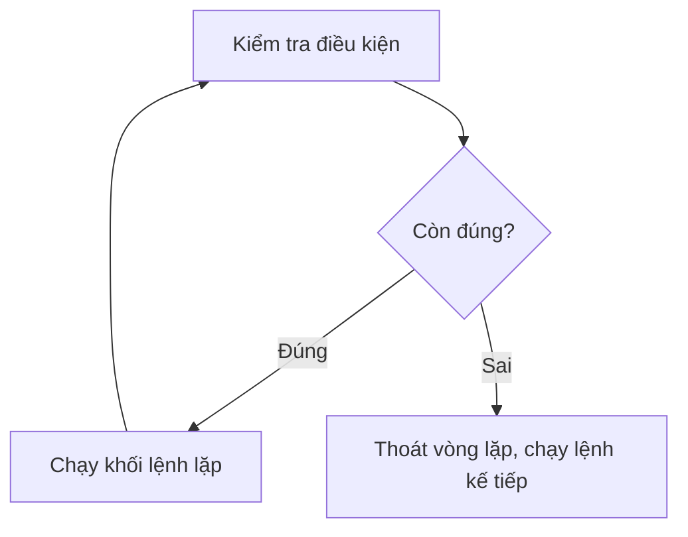

# Bài 11 — Vòng Lặp While – Lặp Cho Đến Khi Điều Kiện Sai

> 🎓 **Chương 4 – Vòng lặp trong Python**

## 🧠 Điều kiện tiên quyết

- [Bài 10 — Vòng Lặp For – Lặp Lại Một Số Lần Biết Trước](../10-Vong-Lap-For/bai.md)

---

## 🎯 Mục tiêu

Sau bài học này, học viên sẽ:

* ✅ Hiểu **cú pháp `while`** và sự khác biệt với `for` (lặp "không biết trước số lần").
* ✅ Biết **vòng lặp vô hạn là gì**, vì sao xảy ra và **cách tránh** (nhớ cập nhật biến điều kiện!).
* ✅ Dùng **`break`** và **`continue`** để điều khiển vòng lặp linh hoạt.
* ✅ Dùng **`else` với `while`** để chạy code khi vòng lặp kết thúc tự nhiên.
* ✅ Viết được **`while True:` + `break`** — khuôn mẫu cho menu chương trình.
* ✅ Kiểm tra **đầu vào hợp lệ** bằng vòng lặp (nhập sai phải nhập lại).
* ✅ Xây dựng ứng dụng thực tế: game đoán số, đếm ngược, máy ATM.

---

## 📖 Kiến thức

### 1. Vòng lặp while là gì?

`while` lặp lại một khối lệnh **chừng nào điều kiện còn đúng**:

```python
while dieu_kien:
    # Khối lệnh lặp
```

> 💬 **Ví dụ đời thực:** Đi bộ leo cầu thang — mỗi bước kiểm tra *"còn bậc thang không?"*; còn thì bước tiếp, hết thì dừng. Bạn không biết trước có bao nhiêu bậc — chỉ dừng khi **điều kiện sai**.



**Ví dụ đầu tiên:**

```python
i = 1            # Bước 1: khởi tạo biến đếm
while i <= 5:    # Bước 2: kiểm tra điều kiện
    print(f"Lần lặp thứ {i}")   # Bước 3: khối lệnh lặp
    i = i + 1    # Bước 4: cập nhật biến đếm — QUAN TRỌNG!
```

| Dòng | Ý nghĩa |
|---|---|
| `i = 1` | Khởi tạo biến đếm trước vòng lặp |
| `while i <= 5:` | Kiểm tra điều kiện **trước khi chạy** — sai ngay từ đầu thì không chạy lần nào |
| `i = i + 1` | **Cập nhật biến** — quên dòng này là vòng lặp chạy mãi mãi! |

### 2. `while` so với `for` — dùng cái nào?

| Tiêu chí | `for` | `while` |
|---|---|---|
| Số lần lặp | **Biết trước** (đếm 1..n, duyệt dãy) | **Chưa biết**, phụ thuộc điều kiện |
| Điều kiện dừng | Hết phần tử của dãy | Điều kiện trở thành sai |
| Biến đếm | Tự động qua `range` | Tự bạn khởi tạo + cập nhật |
| Ví dụ | In 10 lần, bảng cửu chương | Nhập đến khi đúng, game đoán số |
| Rủi ro | Thấp — không thể vô hạn | **Cao — dễ vòng lặp vô hạn** |

> 💡 **Quy tắc nhanh:** đếm được trước số lần → `for`. Không đếm được, chỉ biết "đến khi nào thì dừng" → `while`.

### 3. ⚠️ Vòng lặp vô hạn — "con quỷ" của while

Vòng lặp vô hạn chạy **mãi không dừng**, khiến chương trình "treo":

```python
i = 1
while i <= 5:
    print(i)      # ❌ Quên i = i + 1 → i luôn bằng 1 → lặp vô tận!
```

> 💬 **Ví dụ đời thực:** Cửa tự động nhận diện: *"nếu còn người thì mở cửa"* — nhưng quên cập nhật *"hết người"*, cửa mở mãi mãi, điện giật thùng!

**Cách tránh — "bộ ba bất tử":**

```python
i = 1                  # 1. KHỞI TẠO biến điều kiện
while i <= 5:          # 2. KIỂM TRA điều kiện
    print(i)
    i = i + 1          # 3. CẬP NHẬT biến — hướng tới điều kiện sai
```

Nếu chương trình vô tình bị treo vì lặp vô hạn, nhấn **`Ctrl + C`** trong Terminal để dừng khẩn cấp.

### 4. `break` và `continue` trong while

Giống `for` (bài 10), nhưng trong `while` chúng còn quan trọng hơn — đôi khi là "phao cứu sinh" thoát vòng lặp:

```python
# break: thoát hẳn khi gặp số 3
i = 1
while i <= 10:
    if i == 3:
        break          # Dừng hẳn vòng lặp
    print(i)
    i = i + 1          # Kết quả in: 1 2

# continue: bỏ qua số chẵn
i = 0
while i < 7:
    i = i + 1          # Cập nhật TRƯỚC continue — tránh vô hạn!
    if i % 2 == 0:
        continue
    print(i)           # In: 1 3 5 7
```

> ⚠️ **Bẫy continue:** nếu viết `continue` trước lệnh cập nhật biến, vòng lặp sẽ không bao giờ cập nhật → **vô hạn**. Luôn đặt lệnh cập nhật **trước** `continue` (hoặc đảm bảo nó luôn được chạy).

### 5. `else` với while — chạy khi kết thúc "tự nhiên"

Python cho phép `while ... else`: khối `else` chạy khi vòng lặp **kết thúc bình thường** (điều kiện tự sai) — nhưng **KHÔNG chạy** nếu thoát bằng `break`:

```python
# Tìm số 7 trong dãy
i = 1
while i <= 5:
    if i == 7:
        print("Tìm thấy 7!")
        break
    i = i + 1
else:
    print("Đã duyệt hết dãy mà không thấy 7")   # Chạy vì không có break
```

> 💬 **Ví dụ đời thực:** Khối `else` giống câu thông báo *"đã hết hàng chưa thấy sản phẩm"* — chỉ đọc khi bạn đi hết quầy mà **không** gặp sản phẩm. Nếu gặp rồi (break) thì không cần thông báo nữa.

### 6. `while True:` — vòng lặp "vĩnh cửu" có chủ đích

Nhiều chương trình thực tế chạy **mãi cho đến khi người dùng muốn thoát** (máy ATM, menu game...). Khuôn mẫu chuẩn:

```python
while True:
    lua_chon = input("Chọn chức năng (0 để thoát): ")
    if lua_chon == "0":
        break           # Người dùng thoát → break ra ngoài
    # ... xử lý chức năng khác
print("Tạm biệt!")
```

> 💡 `while True:` **cố ý** tạo vòng lặp vô hạn, nhưng có `break` bên trong làm "lối thoát". Không bao giờ viết `while True:` mà không có `break` (hoặc cách thoát khác)!

### 7. Kiểm tra đầu vào hợp lệ — "hỏi lại cho đến khi đúng"

Tình huống rất thực tế: người dùng nhập sai → chương trình phải **hỏi lại**, không được "chết" giữa chừng:

```python
# Nhập điểm cho tới khi nằm trong khoảng 0-10
while True:
    diem = float(input("Nhập điểm (0-10): "))
    if 0 <= diem <= 10:   # Hợp lệ → thoát vòng lặp
        break
    print("Điểm không hợp lệ! Vui lòng nhập lại.")
print(f"Điểm đã nhận: {diem}")
```

> 💬 **Ví dụ đời thực:** Ngân hàng yêu cầu nhập mã PIN — nhập sai, màn hình báo *"Mã sai, nhập lại"* cho tới khi đúng (hoặc hết lượt). Không bao giờ để khách "bơ vơ" vì nhập sai một ký tự.

---

## 💡 Ví dụ minh họa

### Ví dụ 1: Đếm ngược pháo hoa

```python
# Đếm ngược từ 10 đến 1 rồi bắn pháo hoa
dem = 10                       # 1. Khởi tạo

while dem > 0:                 # 2. Điều kiện: còn số dương
    print(dem)
    dem = dem - 1              # 3. Cập nhật — mỗi lượt giảm 1

print("🎆 Pháo hoa!")          # Chạy sau khi vòng lặp kết thúc
```

**Giải thích từng dòng:**

| Dòng code | Ý nghĩa |
|---|---|
| `dem = 10` | Khởi tạo biến đếm — phần "số lần còn lại" |
| `while dem > 0:` | Kiểm tra trước mỗi lượt; dem = 0 là dừng |
| `dem = dem - 1` | Cập nhật — đưa điều kiện dần về sai, không vô hạn |

### Ví dụ 2: Cộng dồn đến khi nhập số 0

```python
# Nhập các số, cộng dồn; nhập 0 thì dừng và in tổng
tong = 0

while True:
    so = float(input("Nhập số (0 để dừng): "))
    if so == 0:
        break           # Số 0 là tín hiệu dừng
    tong = tong + so

print(f"Tổng các số đã nhập: {tong}")
```

**Giải thích từng dòng:**

| Dòng code | Ý nghĩa |
|---|---|
| `while True:` | Vòng lặp vô hạn có chủ đích — người dùng quyết định khi dừng |
| `if so == 0: break` | Quy ước "nhập 0 để dừng" — lối thoát duy nhất |
| `tong = tong + so` | Chỉ cộng khi chưa nhập 0 (dòng break đã thoát) |

> 💡 Mô hình này giống **máy tính tiền chợ**: gõ từng món, gõ 0 khi hết hàng, máy báo tổng.

### Ví dụ 3: Kiểm tra số dương

```python
# Nhập số cho tới khi nhận được số dương
so = -1                         # Khởi tạo giá trị "chưa hợp lệ"

while so <= 0:                  # Còn sai thì cứ hỏi lại
    so = float(input("Nhập số dương: "))
    if so <= 0:
        print("Sai rồi! Số phải lớn hơn 0.")

print(f"Đã nhận số dương: {so}")
```

**Giải thích từng dòng:**

| Dòng code | Ý nghĩa |
|---|---|
| `so = -1` | Khởi tạo để điều kiện `so <= 0` đúng ngay lần đầu — vòng lặp chắc chắn chạy ít nhất 1 lần |
| `while so <= 0:` | Số không hợp lệ thì vòng lặp tiếp tục |
| `print(...)` | Sau khi thoát, `so` chắc chắn hợp lệ — vòng lặp kiểm soát chất lượng đầu vào |

---

## 🔬 Ví dụ nâng cao

### Ví dụ 1: Game đoán số

Máy "nghĩ" một số bí mật, người chơi đoán đến khi đúng:

```python
so_bi_mat = 7   # Số bí mật (cố định để dễ kiểm tra)
so_lan = 0      # Đếm số lần đoán

print("Máy đang nghĩ một số từ 1 đến 10...")

while True:
    so_lan = so_lan + 1
    doan = int(input(f"Lần đoán {so_lan}: "))
    if doan == so_bi_mat:
        print(f"Chúc mừng! Bạn đoán đúng sau {so_lan} lần.")
        break           # Đúng rồi thì thoát
    elif doan < so_bi_mat:
        print("Số của bạn nhỏ hơn số bí mật.")
    else:
        print("Số của bạn lớn hơn số bí mật.")
```

**Giải thích:**
* Số lần đoán **không biết trước** — đây chính là tình huống "sinh ra cho while".
* Lời gợi ý "lớn hơn / nhỏ hơn" giúp người chơi đoán gần dần — game 9+ đoán đúng số trong 7.
* `so_lan = so_lan + 1` là lệnh cập nhật — vòng lặp tiến dần về đích.

> 🎲 **Nâng cấp:** muốn số bí mật ngẫu nhiên, dùng `import random` rồi `so_bi_mat = random.randint(1, 10)` — thư viện chuẩn của Python.

### Ví dụ 2: Máy ATM mini (menu vòng lặp)

```python
# Số dư ban đầu
so_du = 1000000.0

print("===== MÁY ATM =====")

while True:
    # In menu mỗi lượt
    print("0. Thoát chương trình")
    print("1. Xem số dư hiện tại")
    print("2. Nạp tiền")
    print("3. Rút tiền")
    lua_chon = input("Nhập lựa chọn: ")

    if lua_chon == "0":
        print("Cảm ơn bạn đã sử dụng ATM!")
        break                       # Thoát chương trình
    elif lua_chon == "1":
        print(f"Số dư hiện tại: {so_du} VND")
    elif lua_chon == "2":
        tien = float(input("Nhập số tiền muốn nạp: "))
        so_du = so_du + tien
        print(f"Nạp tiền thành công. Số dư mới: {so_du} VND")
    elif lua_chon == "3":
        tien = float(input("Nhập số tiền muốn rút: "))
        if tien > so_du:
            print("Số dư không đủ!")
        else:
            so_du = so_du - tien
            print(f"Rút tiền thành công. Số dư mới: {so_du} VND")
    else:
        print("Lựa chọn không hợp lệ!")
```

**Giải thích:**
* `while True:` bao quanh menu — máy ATM chạy mãi cho tới khi khách chọn `0`.
* Sau mỗi thao tác, vòng lặp **quay lại đầu** và in lại menu — trải nghiệm đúng như máy thật.
* Kiểm tra `tien > so_du` trước khi rút — ngân hàng không bao giờ để tài khoản âm.
* Lựa chọn là **chuỗi** (`"0"`, `"1"`) — so sánh trực tiếp với input, không cần ép kiểu.

### Ví dụ 3: Nhập điểm hợp lệ (bắt buộc trong khoảng 0–10)

```python
# Bắt buộc nhập điểm trong khoảng 0-10
while True:
    diem = float(input("Nhập điểm môn Toán (0-10): "))
    if 0 <= diem <= 10:
        break                       # Hợp lệ → chấp nhận
    print("⚠️ Điểm phải từ 0 đến 10. Vui lòng nhập lại!")

# Xếp loại sau khi điểm đã chắc chắn hợp lệ
if diem >= 9:
    print("Xuất sắc")
elif diem >= 8:
    print("Giỏi")
elif diem >= 6.5:
    print("Khá")
elif diem >= 5:
    print("Trung bình")
else:
    print("Yếu")
```

**Giải thích:**
* Vòng lặp đảm bảo `diem` nằm trong 0–10 **trước khi** xếp loại — phần sau vòng lặp yên tâm xử lý dữ liệu "sạch".
* `0 <= diem <= 10` — cú pháp so sánh kép của Python (tương đương `diem >= 0 and diem <= 10`).
* Kết hợp kiến thức bài 8 (if-elif) với while — một chuỗi xử lý hoàn chỉnh.

### Ví dụ 4: `else` với while — tìm kiếm trong dãy

```python
# Tìm số chẵn đầu tiên trong khoảng bắt đầu từ 7
i = 7
while i <= 10:
    if i % 2 == 0:
        print(f"Tìm thấy số chẵn: {i}")
        break
    i = i + 1
else:
    print("Không có số chẵn nào trong khoảng này")   # Không break → chạy
```

**Giải thích:**
* Với `i = 7`: 7 lẻ → i = 8; 8 chẵn → in và `break` → khối `else` **không** chạy.
* Nếu bắt đầu từ 9: 9, 10 → thấy 10. Nếu khoảng không có số chẵn, vòng lặp kết thúc tự nhiên → `else` chạy.

---

## ⚠️ Lỗi thường gặp

### Lỗi 1: Vòng lặp vô hạn — quên cập nhật biến

```python
i = 1
while i <= 5:
    print(i)      # ❌ Không có i = i + 1 → in 1 mãi mãi
```

* **Nguyên nhân:** Điều kiện `i <= 5` luôn đúng vì i không bao giờ đổi.
* **Kết quả:** Chương trình treo, cửa sổ "đơ".
* **Cách sửa:** Thêm `i = i + 1` vào cuối khối lệnh — "bộ ba: khởi tạo – kiểm tra – cập nhật".

### Lỗi 2: Điều kiện sai ngay từ đầu — vòng lặp không chạy lần nào

```python
i = 6
while i <= 5:     # ❌ 6 <= 5 là sai → không in gì cả
    print(i)
```

* **Nguyên nhân:** `while` kiểm tra điều kiện **trước** khi chạy.
* **Cách khắc phục:** Nếu muốn chạy ít nhất một lần, dùng `while True:` + `break`, hoặc khởi tạo biến đúng giá trị.

### Lỗi 3: `continue` đặt trước lệnh cập nhật

```python
i = 1
while i <= 5:
    if i % 2 == 0:
        continue      # ❌ Cập nhật i bị nhảy qua → vô hạn
    print(i)
    i = i + 1
```

* **Nguyên nhân:** `continue` đưa vòng lặp về đầu ngay, lệnh `i = i + 1` không bao giờ chạy với số chẵn.
* **Cách sửa:** Cập nhật biến **trước** `continue`:

```python
i = 1
while i <= 5:
    if i % 2 == 0:
        i = i + 1
        continue
    print(i)
    i = i + 1
```

### Lỗi 4: `while True:` mà không có lối thoát

```python
while True:
    print("Chạy mãi...")     # ❌ Không break, không cách thoát
```

* **Nguyên nhân:** Quên thiết kế lối thoát.
* **Cách sửa:** Luôn có `break` khi điều kiện dừng thỏa mãn, hoặc biến điều kiện thay đổi để thoát.

### Lỗi 5: So sánh sai kiểu dữ liệu

```python
while True:
    so = input("Nhập số: ")        # Chuỗi
    if so > 5:                      # ❌ So chuỗi với số → TypeError
        break
```

* **Nguyên nhân:** `input()` trả về **chuỗi**, không thể so sánh với số.
* **Cách sửa:** Ép kiểu: `so = float(input("Nhập số: "))` trước khi so sánh.

---

## 💎 Mẹo

* 🔁 **Bộ ba của while:** khởi tạo → kiểm tra → cập nhật. Thiếu một chân là hỏng.
* 🛑 **`Ctrl + C`** trong Terminal để dừng chương trình đang lặp vô hạn.
* 🚪 **`while True` + break** là khuôn mẫu chuẩn cho menu, game, máy ATM — nhớ luôn có lối thoát.
* ✅ **Kiểm tra đầu vào:** mọi dữ liệu từ bàn phím đều "đáng ngờ" — vòng lặp nhập lại giúp chương trình không bao giờ "chết" vì dữ liệu xấu.
* 📏 **Chọn vòng lặp:** biết trước số lần → `for`; "đến khi nào thì dừng" → `while`.
* 🔍 **`else` với while** dùng cho tìm kiếm: chạy khi không tìm thấy (không break) — gọn hơn biến cờ.
* 🧪 **Debug nhanh:** in biến điều kiện ngay đầu vòng lặp (`print(i)`) để xem nó có đang tiến về điều kiện sai hay không.

---

## 📝 Tóm tắt

| Khái niệm | Nội dung |
|---|---|
| 🔄 `while dk:` | Lặp chừng nào điều kiện còn đúng; kiểm tra trước khi chạy |
| ♾️ Vòng lặp vô hạn | Điều kiện không bao giờ sai — tránh bằng bộ ba: khởi tạo, kiểm tra, **cập nhật** |
| ⏹️ `break` | Thoát hẳn vòng lặp ngay lập tức |
| ⏭️ `continue` | Bỏ qua lượt hiện tại (cập nhật biến **trước** continue!) |
| 🔵 `while ... else` | `else` chạy khi kết thúc tự nhiên, **không** chạy khi break |
| 🔁 `while True:` | Vòng lặp vô hạn có chủ đích — bắt buộc có `break` bên trong |
| 🎛️ Menu vòng lặp | In menu → nhận chọn → xử lý → quay lại (đến khi chọn "Thoát") |
| ✅ Nhập hợp lệ | `while True:` hỏi lại cho tới khi dữ liệu hợp lệ mới `break` |
| ⚖️ So với `for` | `for` đếm biết trước; `while` lặp theo điều kiện |

---

## 🧪 Kiểm tra nhanh

1. ❓ `while` khác `for` ở điểm cơ bản nào?
2. ❓ Viết 3 bước cần thiết để while không bị vô hạn.
3. ❓ Điều gì xảy ra nếu điều kiện while sai ngay từ đầu?
4. ❓ `break` trong while có tác dụng gì?
5. ❓ Vì sao `continue` đặt trước lệnh cập nhật biến lại gây vô hạn?
6. ❓ Khối `else` của `while` chạy khi nào? Khi nào không chạy?
7. ❓ `while True:` dùng cho tình huống nào? Yêu cầu gì bắt buộc?
8. ❓ Khi chương trình bị treo vì lặp vô hạn, nhấn phím gì để dừng?
9. ❓ Viết vòng lặp nhập số dương (hỏi lại nếu nhập sai).
10. ❓ Muốn số lần lặp biết trước (1..10), nên dùng `for` hay `while`?

<details>
<summary>🔍 Xem đáp án</summary>

1. `for` lặp theo dãy/số lần biết trước; `while` lặp theo điều kiện, số lần có thể chưa biết.
2. Khởi tạo biến → kiểm tra điều kiện → cập nhật biến trong khối lặp.
3. Vòng lặp không chạy lần nào.
4. Thoát hẳn vòng lặp ngay lập tức.
5. Lệnh cập nhật bị bỏ qua nên điều kiện không bao giờ sai.
6. Chạy khi vòng lặp kết thúc tự nhiên; không chạy khi thoát bằng `break`.
7. Vòng lặp vô hạn có chủ đích (menu, game...); bắt buộc có `break` bên trong.
8. `Ctrl + C`.
9. `while True: so = float(input("Nhập số dương: ")); if so > 0: break`.
10. `for` — vì số lần lặp đã biết.

</details>

---

## 📚 Bài đọc thêm

* [Python.org – while Statements](https://docs.python.org/3/reference/compound_stmts.html#the-while-statement)
* [W3Schools – Python While Loops](https://www.w3schools.com/python/python_while_loops.asp)
* [Real Python – Python "while" Loops](https://realpython.com/python-while-loop/)
* [Programiz – Python while Loop](https://www.programiz.com/python-programming/while-loop)
* [GeeksforGeeks – Python While Loop](https://www.geeksforgeeks.org/python-while-loop/)

---

---

## 🧩 Bài tập

> 📝 🎯 **Chủ đề:** `while`, vòng lặp vô hạn và cách tránh, `break`, `continue`, `else` với while, `while True`, menu vòng lặp, kiểm tra nhập liệu.

## 🟢 Dễ (Bài 1 – 7)

### Bài 1: Đếm từ 1 đến 10 bằng while

* **Đề bài:** Dùng `while` in các số từ 1 đến 10.
* **Input:** Không có.
* **Output:**
  ```
  1
  2
  ...
  10
  ```
* **Gợi ý:** `i = 1`; điều kiện `i <= 10`; cuối khối lệnh có `i = i + 1`.

### Bài 2: Đếm ngược từ 10 về 1

* **Đề bài:** Dùng `while` đếm ngược từ 10 về 1.
* **Input:** Không có.
* **Output:**
  ```
  10
  9
  ...
  1
  ```
* **Gợi ý:** Khởi tạo `i = 10`, điều kiện `i >= 1`, cập nhật `i = i - 1`.

### Bài 3: Tổng 1 đến n bằng while

* **Đề bài:** Nhập n, tính tổng `1 + 2 + ... + n` **bằng vòng lặp while**.
* **Input:** Số nguyên dương n.
* **Output:** Tổng.
* **Ví dụ:**
  ```
  Nhập n: 5
  Tổng: 15
  ```
* **Gợi ý:** Biến `i = 1`, biến `tong = 0`; vòng lặp cộng dồn rồi tăng i.

### Bài 4: In "Python" 5 lần bằng while

* **Đề bài:** Dùng `while` in dòng chữ `Python` đúng 5 lần, mỗi lần kèm số thứ tự: `Lan 1: Python`.
* **Input:** Không có.
* **Output:**
  ```
  Lan 1: Python
  Lan 2: Python
  ...
  Lan 5: Python
  ```
* **Gợi ý:** `dem = 1`; `while dem <= 5:`; đừng quên `dem = dem + 1`!

### Bài 5: Các số chẵn từ 2 đến 20

* **Đề bài:** Dùng `while` in các số chẵn từ 2 đến 20.
* **Input:** Không có.
* **Output:**
  ```
  2
  4
  ...
  20
  ```
* **Gợi ý:** Cập nhật `i = i + 2` mỗi lượt — bước nhảy 2.

### Bài 6: Bảng nhân 7 bằng while

* **Đề bài:** Dùng `while` in bảng nhân 7: từ `7 x 1 = 7` đến `7 x 10 = 70`.
* **Input:** Không có.
* **Output:** 10 dòng phép nhân.
* **Gợi ý:** `i = 1`; `while i <= 10:`; in `f"7 x {i} = {7 * i}"`; tăng i.

### Bài 7: Nhập số dương

* **Đề bài:** Nhập một số nguyên; nếu số ≤ 0 thì báo `So phai lon hon 0!` và **yêu cầu nhập lại** cho đến khi hợp lệ, rồi in số đã nhận.
* **Input:** Một hoặc nhiều số nguyên.
* **Output:** Số dương đã nhận.
* **Ví dụ:**
  ```
  Nhập số: -3
  So phai lon hon 0!
  Nhập số: 5
  Số đã nhận: 5
  ```
* **Gợi ý:** `while so <= 0:` — điều kiện "còn sai thì lặp lại".

---

## 🟡 Trung bình (Bài 8 – 14)

### Bài 8: Cộng dồn đến khi nhập 0

* **Đề bài:** Nhập liên tục các số, cộng dồn lại; nhập **0** thì dừng và in tổng.
* **Input:** Nhiều số thực, kết thúc bằng 0.
* **Output:** Tổng các số đã nhập.
* **Ví dụ:**
  ```
  Nhập số (0 để dừng): 5
  Nhập số (0 để dừng): 3
  Nhập số (0 để dừng): 0
  Tổng: 8.0
  ```
* **Gợi ý:** `while True:` + `if so == 0: break`.

### Bài 9: Đếm ngược có hồi chuông

* **Đề bài:** Đếm ngược từ n về 1 (n nhập từ bàn phím), sau đó in `Het gio!`. Nếu n ≤ 0 thì in `So khong hop le!` mà không đếm.
* **Input:** Số nguyên n.
* **Output:** Dãy đếm ngược + dòng kết thúc.
* **Ví dụ:**
  ```
  Nhập n: 3
  3
  2
  1
  Het gio!
  ```
* **Gợi ý:** Điều kiện `i >= 1`; sau vòng lặp in "Het gio!" — dùng `else` của while để chỉ in khi đếm thật.

### Bài 10: Nhập điểm hợp lệ (0–10)

* **Đề bài:** Nhập điểm môn học; nếu điểm ngoài khoảng 0–10 thì báo lỗi và nhập lại; khi hợp lệ thì in `Điểm đã nhận: X` và xếp loại (>= 9 Xuất sắc, >= 8 Giỏi, >= 6.5 Khá, >= 5 Trung bình, còn lại Yếu).
* **Input:** Một hoặc nhiều số thực.
* **Output:** Điểm đã nhận và xếp loại.
* **Ví dụ:**
  ```
  Nhập điểm (0-10): 12
  Điểm không hợp lệ!
  Nhập điểm (0-10): 8.5
  Điểm đã nhận: 8.5
  Xếp loại: Gioi
  ```
* **Gợi ý:** `while True:` hỏi lại; `if 0 <= diem <= 10: break`. Xếp loại bằng if-elif sau vòng lặp.

### Bài 11: Đếm chữ số của n

* **Đề bài:** Nhập số nguyên dương n, đếm xem n có bao nhiêu chữ số (ví dụ 2026 có 4 chữ số).
* **Input:** Số nguyên dương.
* **Output:** Số lượng chữ số.
* **Ví dụ:**
  ```
  Nhập n: 2026
  Số chữ số: 4
  ```
* **Gợi ý:** Lặp phép chia `n = n // 10` cho tới khi n = 0, mỗi lần tăng biến đếm lên 1.

### Bài 12: Tổng các chữ số của n

* **Đề bài:** Nhập số nguyên dương n, tính tổng các chữ số của n (ví dụ 2026 → 2+0+2+6 = 10).
* **Input:** Số nguyên dương.
* **Output:** Tổng các chữ số.
* **Ví dụ:**
  ```
  Nhập n: 2026
  Tổng các chữ số: 10
  ```
* **Gợi ý:** Chữ số cuối là `n % 10`; bỏ chữ số cuối bằng `n = n // 10`; cộng dồn đến khi hết.

### Bài 13: Đảo ngược số

* **Đề bài:** Nhập số nguyên dương n, in ra số đảo ngược (ví dụ 2026 → 6202; lưu ý chữ số 0 đầu kết quả bị mất là chấp nhận).
* **Input:** Số nguyên dương.
* **Output:** Số đảo ngược.
* **Ví dụ:**
  ```
  Nhập n: 2026
  Số đảo ngược: 6202
  ```
* **Gợi ý:** Xây dựng `so_dao = so_dao * 10 + (n % 10)` rồi `n = n // 10`.

### Bài 14: Tìm ước chung lớn nhất

* **Đề bài:** Nhập hai số nguyên dương a, b; tìm **ước chung lớn nhất** bằng phương pháp trừ liên tiếp: lặp tới khi a == b; nếu a > b thì a = a - b, ngược lại b = b - a. Kết quả là a (hoặc b).
* **Input:** Hai số nguyên dương.
* **Output:** ƯCLN.
* **Ví dụ:**
  ```
  Nhập a: 12
  Nhập b: 8
  ƯCLN(12, 8) = 4
  ```
* **Gợi ý:** Điều kiện lặp `while a != b:`; in kết quả sau vòng lặp.

---

## 🔴 Khó (Bài 15 – 20)

### Bài 15: Game đoán số

* **Đề bài:** Máy nghĩ số bí mật từ 1 đến 10 (cố định là 7 để dễ kiểm tra). Người chơi đoán liên tục; mỗi lần sai, máy gợi ý `Nho hon so bi mat!` hoặc `Lon hon so bi mat!`. Đoán đúng thì in `Chuc mung! Ban doan dung sau X lan.` rồi kết thúc.
* **Input:** Nhiều số nguyên (lần đoán).
* **Output:** Gợi ý và kết quả.
* **Ví dụ:**
  ```
  Lần đoán 1: 5
  Nho hon so bi mat!
  Lần đoán 2: 8
  Lon hon so bi mat!
  Lần đoán 3: 7
  Chuc mung! Ban doan dung sau 3 lan.
  ```
* **Gợi ý:** `so_bi_mat = 7`; `while True:` với biến đếm `so_lan`; `break` khi đúng.

### Bài 16: Kiểm tra số đối xứng

* **Đề bài:** Nhập số nguyên dương n, kiểm tra n có phải **số đối xứng** (đọc xuôi, ngược giống nhau — ví dụ 1221, 585) hay không. In `La so doi xung` hoặc `Khong phai so doi xung`.
* **Input:** Số nguyên dương.
* **Output:** Kết luận.
* **Ví dụ:**
  ```
  Nhập n: 1221
  La so doi xung
  ```
* **Gợi ý:** Đảo ngược n (kỹ thuật bài 13) rồi so sánh với n ban đầu (nhớ lưu bản gốc trước khi phá hủy n).

### Bài 17: Kiểm tra số nguyên tố bằng while

* **Đề bài:** Nhập số nguyên dương n, kiểm tra n có phải số nguyên tố không (chỉ chia hết cho 1 và chính nó; 2 là nguyên tố nhỏ nhất). In `La so nguyen to` hoặc `Khong phai so nguyen to`.
* **Input:** Số nguyên dương.
* **Output:** Kết luận.
* **Ví dụ:**
  ```
  Nhập n: 29
  La so nguyen to
  ```
* **Gợi ý:** `i = 2`; `while i < n:`; nếu `n % i == 0` thì `break`; dùng `else` của while để kết luận "là nguyên tố".

### Bài 18: Lãi kép — bao giờ đạt mục tiêu?

* **Đề bài:** Gửi tiết kiệm S triệu đồng, lãi r% mỗi tháng (lãi kép). Nhập S, r và số tiền mục tiêu M. Hỏi sau **ít nhất bao nhiêu tháng** thì số tiền đạt hoặc vượt M?
* **Input:** S (float), r (float), M (float).
* **Output:** Số tháng cần gửi.
* **Ví dụ:**
  ```
  Nhập tiền gửi (triệu): 100
  Nhập lãi suất %/tháng: 1
  Nhập mục tiêu (triệu): 150
  Cần 41 tháng để đạt mục tiêu
  ```
* **Gợi ý:** `while tien < M:` — mỗi lượt cộng lãi và tăng biến đếm tháng; số tháng không biết trước nên phải dùng while.

### Bài 19: Game đoán số ngẫu nhiên (có giới hạn lượt)

* **Đề bài:** Dùng `import random` — máy nghĩ số ngẫu nhiên `random.randint(1, 100)`. Người chơi có tối đa **7 lượt** đoán; mỗi lần gợi ý lớn/nhỏ hơn. Đoán đúng → chúc mừng kèm số lượt; hết lượt → in `Ban da thua! So bi mat la: X`.
* **Input:** Nhiều số nguyên (tối đa 7 lượt).
* **Output:** Gợi ý và kết quả.
* **Ví dụ:**
  ```
  Lần 1/7: 50
  Lon hon so bi mat!
  ...
  ```
* **Gợi ý:** Biến `so_lan = 0`; điều kiện `while so_lan < 7:`; tăng `so_lan` mỗi lượt; `break` khi đúng; `else` của while in thông báo thua.

### Bài 20: Máy ATM hoàn chỉnh

* **Đề bài:** Viết chương trình máy ATM chạy vòng lặp với menu:
  * `0. Thoát` — in lời tạm biệt rồi kết thúc.
  * `1. Xem số dư` — in số dư hiện tại.
  * `2. Nạp tiền` — nhập số tiền dương, cộng vào số dư.
  * `3. Rút tiền` — nhập số tiền; nếu lớn hơn số dư → `So du khong du!`, ngược lại trừ vào số dư.
  * Số khác → `Lua chon khong hop le!`
  
  Số dư khởi tạo 1 000 000 VND. Sau mỗi thao tác quay lại menu.
* **Input:** Chuỗi lựa chọn và số tiền (khi nạp/rút).
* **Output:** Menu lặp lại và kết quả từng thao tác.
* **Ví dụ:**
  ```
  === MÁY ATM ===
  0. Thoát
  1. Xem số dư
  2. Nạp tiền
  3. Rút tiền
  Nhập lựa chọn: 2
  Nhập số tiền muốn nạp: 50000
  Nạp tiền thành công. Số dư mới: 1050000.0 VND
  ...
  Nhập lựa chọn: 0
  Cảm ơn bạn đã sử dụng ATM!
  ```
* **Gợi ý:** `while True:` bao quanh menu; `if lua_chon == "0": break`; số dư là biến cập nhật bên trong vòng lặp; kiểm tra tiền dương khi nạp.

---

## 🎯 Tổng kết sau khi làm bài

Sau 20 bài tập, bạn đã:

* ✅ Viết thành thạo `while` với "bộ ba: khởi tạo – kiểm tra – cập nhật".
* ✅ Tránh và xử lý được vòng lặp vô hạn.
* ✅ Dùng `break`, `continue`, `else` với while đúng tình huống.
* ✅ Xây dựng menu vòng lặp (máy ATM) và game tương tác (đoán số).
* ✅ Kiểm soát đầu vào hợp lệ — chương trình không "chết" vì dữ liệu xấu.

> 💪 Chưa tự làm được bài nào thì đừng lo — hãy xem lại bài giảng rồi quay lại. **Lập trình là luyện tập!**

---

## ✅ Đáp án

> 💡 **Hãy tự làm bài tập trước** rồi mới mở đáp án.

## 🟢 Dễ (Bài 1 – 7)


<details>
<summary>✅ Bài 1: Đếm từ 1 đến 10 bằng while</summary>


**Phân tích:** Lặp đếm với số lần biết trước nhưng yêu cầu dùng `while` để làm quen "bộ ba".

**Ý tưởng:** Khởi tạo `i = 1`; kiểm tra `i <= 10`; cập nhật `i = i + 1`.

**Thuật toán:**
1. `i = 1`.
2. Trong khi `i <= 10`: in i, tăng i lên 1.

**Code:**

```python
# Khởi tạo biến đếm
i = 1

# Lặp khi điều kiện còn đúng
while i <= 10:
    print(i)
    i = i + 1   # Cập nhật — thiếu dòng này là vô hạn!
```

**Giải thích code:**
* `i = 1` — khởi tạo trước vòng lặp.
* `while i <= 10:` — kiểm tra trước mỗi lượt.
* `i = i + 1` — biến đếm tiến dần về 11 → điều kiện sai → dừng.

**Độ phức tạp:** O(n).

---

</details>

<details>
<summary>✅ Bài 2: Đếm ngược từ 10 về 1</summary>


**Phân tích:** Đếm lùi — cập nhật bằng phép trừ.

**Ý tưởng:** Khởi tạo 10, điều kiện `>= 1`, cập nhật trừ 1.

**Thuật toán:**
1. `i = 10`.
2. Trong khi `i >= 1`: in i, giảm i xuống 1.

**Code:**

```python
# Khởi tạo từ 10
i = 10

# Lặp khi i còn lớn hơn hoặc bằng 1
while i >= 1:
    print(i)
    i = i - 1   # Giảm dần — hướng tới điều kiện sai
```

**Giải thích code:**
* Điều kiện `i >= 1` — khi i = 0 thì sai, vòng lặp dừng đúng lúc.
* `i = i - 1` — mỗi lượt giảm 1, ngược với bài 1.

**Độ phức tạp:** O(n).

---

</details>

<details>
<summary>✅ Bài 3: Tổng 1 đến n bằng while</summary>


**Phân tích:** Biến tích lũy (bài 10) kết hợp while.

**Ý tưởng:** `tong = 0`, `i = 1`; cộng dồn rồi tăng i tới khi i > n.

**Thuật toán:**
1. Nhập n.
2. `tong = 0`, `i = 1`.
3. Trong khi `i <= n`: `tong = tong + i`, `i = i + 1`.
4. In tổng.

**Code:**

```python
# Nhập n (ví dụ nhập: 5)
n = int(input("Nhập n: "))

tong = 0
i = 1

# Cộng dồn từ 1 đến n
while i <= n:
    tong = tong + i
    i = i + 1

print(f"Tổng: {tong}")
```

**Giải thích code:**
* Vòng lặp vừa cộng dồn `tong` vừa cập nhật `i` — hai lệnh cập nhật đi kèm nhau.
* Với n = 5: tổng = 1+2+3+4+5 = **15**.

**Độ phức tạp:** O(n).

---

</details>

<details>
<summary>✅ Bài 4: In "Python" 5 lần bằng while</summary>


**Phân tích:** Lặp đúng 5 lần kèm số thứ tự — kiểm tra kỹ năng cập nhật biến đếm.

**Ý tưởng:** `dem` chạy 1..5, in f-string.

**Thuật toán:**
1. `dem = 1`.
2. Trong khi `dem <= 5`: in `Lan {dem}: Python`, tăng dem.

**Code:**

```python
dem = 1

# In đúng 5 lần
while dem <= 5:
    print(f"Lan {dem}: Python")
    dem = dem + 1
```

**Giải thích code:**
* `dem = dem + 1` — đừng quên: thiếu là chương trình in "Lan 1" mãi mãi.
* f-string chèn số thứ tự vào dòng chữ.

**Độ phức tạp:** O(1) — số lần cố định 5.

---

</details>

<details>
<summary>✅ Bài 5: Các số chẵn từ 2 đến 20</summary>


**Phân tích:** Dãy cách quãng — cập nhật bước nhảy 2.

**Ý tưởng:** Khởi tạo 2, cập nhật `i = i + 2`.

**Thuật toán:**
1. `i = 2`.
2. Trong khi `i <= 20`: in i, tăng i thêm 2.

**Code:**

```python
i = 2

# Mỗi lượt tăng 2 → luôn là số chẵn
while i <= 20:
    print(i)
    i = i + 2
```

**Giải thích code:**
* Khởi tạo 2 (chẵn) và bước nhảy 2 (chẵn) → mọi giá trị i đều chẵn.
* In đến 20 rồi i = 22 → dừng.

**Độ phức tạp:** O(n).

---

</details>

<details>
<summary>✅ Bài 6: Bảng nhân 7 bằng while</summary>


**Phân tích:** Giống bài 5 (bài 10) nhưng bằng while.

**Ý tưởng:** i chạy 1..10, in `7 x i = 7*i`.

**Thuật toán:**
1. `i = 1`.
2. Trong khi `i <= 10`: in phép nhân, tăng i.

**Code:**

```python
i = 1

# In bảng nhân 7 từ 1 đến 10
while i <= 10:
    print(f"7 x {i} = {7 * i}")
    i = i + 1
```

**Giải thích code:**
* `7 * i` — Python tính tích ngay trong f-string.
* Sau lượt i = 10, i = 11 → dừng.

**Độ phức tạp:** O(10) → hằng số.

---

</details>

<details>
<summary>✅ Bài 7: Nhập số dương</summary>


**Phân tích:** Kiểm tra đầu vào — "còn sai thì hỏi lại".

**Ý tưởng:** Điều kiện lặp chính là điều kiện "chưa hợp lệ".

**Thuật toán:**
1. `so = 0` (khởi tạo để chắc chắn vào vòng lặp).
2. Trong khi `so <= 0`: nhập số; nếu ≤ 0 báo lỗi.
3. In số đã nhận.

**Code:**

```python
# Khởi tạo giá trị không hợp lệ để vòng lặp chạy ít nhất 1 lần
so = 0

# Còn không hợp lệ thì cứ hỏi lại
while so <= 0:
    so = int(input("Nhập số: "))
    if so <= 0:
        print("So phai lon hon 0!")

print(f"Số đã nhận: {so}")
```

**Giải thích code:**
* `so = 0` — điều kiện `so <= 0` đúng ngay lần đầu → vòng lặp chắc chắn chạy.
* Sau vòng lặp, `so` **chắc chắn** là số dương — phần sau yên tâm xử lý.

**Độ phức tạp:** O(1) trung bình (số lần phụ thuộc người nhập).

---

</details>

## 🟡 Trung bình (Bài 8 – 14)


<details>
<summary>✅ Bài 8: Cộng dồn đến khi nhập 0</summary>


**Phân tích:** Số lần lặp không biết trước — `while True` + `break` là lựa chọn chuẩn.

**Ý tưởng:** Nhập liên tục; số 0 là tín hiệu dừng.

**Thuật toán:**
1. `tong = 0`.
2. Vòng lặp: nhập số; nếu 0 → break; ngược lại cộng dồn.
3. In tổng.

**Code:**

```python
tong = 0

# Vòng lặp vô hạn có chủ đích, thoát khi nhập 0
while True:
    so = float(input("Nhập số (0 để dừng): "))
    if so == 0:
        break          # Lối thoát duy nhất
    tong = tong + so

print(f"Tổng: {tong}")
```

**Giải thích code:**
* `while True:` — người dùng quyết định khi nào dừng, chương trình không thể đoán trước.
* `break` nằm trước lệnh cộng dồn — số 0 chỉ làm tín hiệu dừng, không bị cộng vào tổng.
* Ví dụ: 5 + 3 + 0 → tổng **8.0**.

**Độ phức tạp:** O(k) với k là số lượng số nhập vào.

---

</details>

<details>
<summary>✅ Bài 9: Đếm ngược có hồi chuông</summary>


**Phân tích:** Chỉ đếm khi n hợp lệ — `else` của while báo "hết giờ" khi đếm xong thật sự.

**Ý tưởng:** `i = n`; while `i >= 1` đếm lùi; `else` in "Het gio!".

**Thuật toán:**
1. Nhập n.
2. `i = n`.
3. Trong khi `i >= 1`: in i, giảm i.
4. `else`: in "Het gio!" (chỉ khi không bị break).
5. Nếu n ≤ 0: in "So khong hop le!" và không đếm.

**Code:**

```python
# Nhập n (ví dụ nhập: 3)
n = int(input("Nhập n: "))

# Kiểm tra n hợp lệ trước khi đếm
if n <= 0:
    print("So khong hop le!")
else:
    i = n
    # Đếm ngược từ n về 1
    while i >= 1:
        print(i)
        i = i - 1
    else:
        # Chạy khi vòng lặp kết thúc tự nhiên (không break)
        print("Het gio!")
```

**Giải thích code:**
* `while ... else:` — khối `else` chạy khi điều kiện tự sai (i < 1) — đúng lúc in "Het gio!".
* Nếu n ≤ 0, nhánh `else` ngoài cùng báo lỗi, không đếm — "Het gio!" không bị in nhầm.

**Độ phức tạp:** O(n).

---

</details>

<details>
<summary>✅ Bài 10: Nhập điểm hợp lệ (0–10)</summary>


**Phân tích:** Kiểm soát đầu vào rồi mới xử lý — kết hợp while với if-elif (bài 8).

**Ý tưởng:** `while True` hỏi lại tới khi `0 <= diem <= 10`; sau đó xếp loại.

**Thuật toán:**
1. Vòng lặp nhập điểm; hợp lệ thì break.
2. Xếp loại bằng if-elif.
3. In kết quả.

**Code:**

```python
# Nhập điểm cho tới khi hợp lệ (ví dụ nhập: 12 rồi 8.5)
while True:
    diem = float(input("Nhập điểm (0-10): "))
    if 0 <= diem <= 10:
        break          # Điểm hợp lệ → chấp nhận
    print("Điểm không hợp lệ!")

print(f"Điểm đã nhận: {diem}")

# Xếp loại (kiến thức bài 8)
if diem >= 9:
    loai = "Xuat sac"
elif diem >= 8:
    loai = "Gioi"
elif diem >= 6.5:
    loai = "Kha"
elif diem >= 5:
    loai = "Trung binh"
else:
    loai = "Yeu"

print(f"Xếp loại: {loai}")
```

**Giải thích code:**
* `0 <= diem <= 10` — so sánh kép của Python: diem ≥ 0 **và** diem ≤ 10.
* Vòng lặp đảm bảo sau break, `diem` luôn hợp lệ → phần xếp loại không cần kiểm tra lại.
* Điểm 8.5 → "Gioi" — đúng ví dụ.

**Độ phức tạp:** O(1) trung bình.

---

</details>

<details>
<summary>✅ Bài 11: Đếm chữ số của n</summary>


**Phân tích:** Mỗi lượt "bóc" một chữ số bằng `// 10` — vòng lặp tự dừng khi n = 0.

**Ý tưởng:** `dem = 0`; lặp `while n > 0:` — đếm 1, `n = n // 10`.

**Thuật toán:**
1. Nhập n.
2. `dem = 0`.
3. Trong khi `n > 0`: `dem = dem + 1`; `n = n // 10`.
4. In số chữ số.

**Code:**

```python
# Nhập n (ví dụ nhập: 2026)
n = int(input("Nhập n: "))

dem = 0

# Bóc từng chữ số: 2026 → 202 → 20 → 2 → 0
while n > 0:
    dem = dem + 1
    n = n // 10      # Bỏ chữ số cuối

print(f"Số chữ số: {dem}")
```

**Giải thích code:**
* `n // 10` — chia lấy phần nguyên: 2026 // 10 = 202 (bỏ chữ số 6).
* Lượt đi: 2026 (đếm 1) → 202 (2) → 20 (3) → 2 (4) → 0 → dừng → **4 chữ số**.
* Lưu ý: với n = 0 kết quả là 0 — nếu muốn 0 có 1 chữ số, xử lý riêng (thực tế đề bài dùng n dương).

**Độ phức tạp:** O(số chữ số của n) = O(log n).

---

</details>

<details>
<summary>✅ Bài 12: Tổng các chữ số của n</summary>


**Phân tích:** Lấy chữ số cuối bằng `% 10`, bỏ chữ số cuối bằng `// 10`.

**Ý tưởng:** Cộng dồn `n % 10` mỗi lượt.

**Thuật toán:**
1. Nhập n.
2. `tong = 0`.
3. Trong khi `n > 0`: `tong = tong + n % 10`; `n = n // 10`.
4. In tổng.

**Code:**

```python
# Nhập n (ví dụ nhập: 2026)
n = int(input("Nhập n: "))

tong = 0

# Tách từng chữ số và cộng dồn
while n > 0:
    tong = tong + (n % 10)   # Chữ số cuối cùng của n
    n = n // 10              # Bỏ chữ số cuối

print(f"Tổng các chữ số: {tong}")
```

**Giải thích code:**
* `n % 10` — lấy chữ số hàng đơn vị: 2026 % 10 = 6.
* Lượt đi: +6 → +2 → +0 → +2 = **10** — khớp ví dụ 2026 → 10.
* Kỹ thuật "bóc chữ số" (`% 10` lấy, `// 10` bỏ) xuất hiện lại ở bài 13, 16 — ghi nhớ!

**Độ phức tạp:** O(log n).

---

</details>

<details>
<summary>✅ Bài 13: Đảo ngược số</summary>


**Phân tích:** Dựng số mới bằng cách "đẩy" từng chữ số: `so_dao = so_dao * 10 + chu_so`.

**Ý tưởng:** Với mỗi chữ số cuối của n, nhân số đảo đang dựng lên 10 rồi cộng thêm chữ số đó.

**Thuật toán:**
1. Nhập n.
2. `so_dao = 0`.
3. Trong khi `n > 0`: `so_dao = so_dao * 10 + (n % 10)`; `n = n // 10`.
4. In số đảo ngược.

**Code:**

```python
# Nhập n (ví dụ nhập: 2026)
n = int(input("Nhập n: "))

so_dao = 0

# Dựng số đảo ngược từng chữ số một
while n > 0:
    so_dao = so_dao * 10 + (n % 10)   # Đẩy chữ số cuối vào số đảo
    n = n // 10                       # Bỏ chữ số cuối

print(f"Số đảo ngược: {so_dao}")
```

**Giải thích code:**
* Với 2026: so_dao = 0×10+6 = 6 → 6×10+2 = 62 → 62×10+0 = 620 → 620×10+2 = **6202**.
* Số 0 ở đầu kết quả bị "nuốt" tự nhiên (ví dụ 120 → 21) — chấp nhận theo đề bài.
* Phép `* 10 + chữ số` là kỹ thuật trung tâm của bài toán đảo số — cũng dùng ở bài 16.

**Độ phức tạp:** O(log n).

---

</details>

<details>
<summary>✅ Bài 14: Tìm ước chung lớn nhất</summary>


**Phân tích:** Phương pháp trừ liên tiếp: hai số bằng nhau là dừng — số đó chính là ƯCLN.

**Ý tưởng:** `while a != b:` — trừ số lớn cho số nhỏ đến khi bằng nhau.

**Thuật toán:**
1. Nhập a, b.
2. Trong khi `a != b`: nếu a > b → `a = a - b`; ngược lại → `b = b - a`.
3. In a (bằng b).

**Code:**

```python
# Nhập hai số (ví dụ: 12 và 8)
a = int(input("Nhập a: "))
b = int(input("Nhập b: "))

# Lưu bản gốc — a, b sẽ bị thay đổi trong vòng lặp
a_goc, b_goc = a, b

# Trừ liên tiếp cho tới khi hai số bằng nhau
while a != b:
    if a > b:
        a = a - b   # Giảm số lớn bên trái
    else:
        b = b - a   # Giảm số lớn bên phải

print(f"ƯCLN({a_goc}, {b_goc}) = {a}")
```

**Giải thích code:**
* 12 vs 8 → a = 4; 4 vs 8 → b = 4; 4 vs 4 → dừng → **ƯCLN = 4**.
* `a_goc, b_goc = a, b` — sao lưu trước khi lặp vì a, b bị đổi; dùng lại để in kết quả đúng dạng `ƯCLN(12, 8) = 4` với mọi cặp số nhập vào.

**Độ phức tạp:** O(a + b) trong trường hợp xấu (phương pháp trừ); nhanh hơn nhiều với số nhỏ.

---

</details>

## 🔴 Khó (Bài 15 – 20)


<details>
<summary>✅ Bài 15: Game đoán số</summary>


**Phân tích:** Số lần đoán không biết trước — tình huống chuẩn của `while True` + `break`.

**Ý tưởng:** Số bí mật cố định 7; mỗi lượt đoán, so sánh và gợi ý; đúng thì break.

**Thuật toán:**
1. `so_bi_mat = 7`, `so_lan = 0`.
2. Vòng lặp: tăng so_lan, nhập dự đoán.
3. Nếu đúng → chúc mừng, break. Nếu nhỏ → gợi ý nhỏ hơn. Ngược lại → lớn hơn.

**Code:**

```python
# Số bí mật (cố định để dễ kiểm tra)
so_bi_mat = 7
so_lan = 0

print("Máy đã nghĩ một số từ 1 đến 10...")

# Người chơi đoán cho tới khi đúng
while True:
    so_lan = so_lan + 1
    doan = int(input(f"Lần đoán {so_lan}: "))
    if doan == so_bi_mat:
        print(f"Chuc mung! Ban doan dung sau {so_lan} lan.")
        break
    elif doan < so_bi_mat:
        print("Nho hon so bi mat!")
    else:
        print("Lon hon so bi mat!")
```

**Giải thích code:**
* `so_lan = so_lan + 1` ở **đầu** mỗi lượt — đếm trước khi hỏi.
* `break` — lối thoát duy nhất của vòng lặp vô hạn có chủ đích.
* Gợi ý "nhỏ hơn/lớn hơn" thu hẹp dần phạm vi đoán — với số bí mật 7, mọi dãy đoán đều hội tụ nhanh.

**Độ phức tạp:** O(k) với k là số lần đoán.

---

</details>

<details>
<summary>✅ Bài 16: Kiểm tra số đối xứng</summary>


**Phân tích:** Đảo ngược n (bài 13) rồi so sánh với bản gốc — nhớ lưu bản gốc trước khi phá hủy n.

**Ý tưởng:** `n_goc = n`; dựng `so_dao`; so sánh.

**Thuật toán:**
1. Nhập n, lưu `n_goc = n`.
2. Dựng `so_dao` bằng kỹ thuật `* 10 + chữ số`.
3. So sánh `so_dao` với `n_goc`.

**Code:**

```python
# Nhập n (ví dụ nhập: 1221)
n = int(input("Nhập n: "))

n_goc = n      # Lưu bản gốc — n sẽ bị phá hủy trong vòng lặp!
so_dao = 0

# Dựng số đảo ngược
while n > 0:
    so_dao = so_dao * 10 + (n % 10)
    n = n // 10

# So sánh số đảo với số gốc
if so_dao == n_goc:
    print("La so doi xung")
else:
    print("Khong phai so doi xung")
```

**Giải thích code:**
* `n_goc = n` trước vòng lặp — sau vòng lặp n = 0 nên phải so sánh với bản gốc.
* 1221 đảo thành 1221 → bằng nhau → "La so doi xung". 123 đảo thành 321 → không.

**Độ phức tạp:** O(log n).

---

</details>

<details>
<summary>✅ Bài 17: Kiểm tra số nguyên tố bằng while</summary>


**Phân tích:** Tìm ước từ 2 đến n−1; `else` của while kết luận "nguyên tố" khi không tìm thấy ước (không break).

**Ý tưởng:** `i = 2`; `while i < n:`; thấy ước thì break; else → nguyên tố.

**Thuật toán:**
1. Nhập n; nếu n < 2 → không nguyên tố.
2. `i = 2`.
3. Trong khi `i < n`: nếu `n % i == 0` → break; tăng i.
4. `else`: n là số nguyên tố.

**Code:**

```python
# Nhập n (ví dụ nhập: 29)
n = int(input("Nhập n: "))

# Số nhỏ hơn 2 không phải số nguyên tố
if n < 2:
    print("Khong phai so nguyen to")
else:
    i = 2
    # Tìm ước trong khoảng từ 2 đến n - 1
    while i < n:
        if n % i == 0:
            print("Khong phai so nguyen to")
            break            # Tìm thấy ước → thoát
        i = i + 1
    else:
        # Vòng lặp kết thúc tự nhiên — không tìm thấy ước nào
        print("La so nguyen to")
```

**Giải thích code:**
* Khối `else` của while chạy **chỉ khi không có `break`** — chính là "duyệt hết mà không thấy ước" → nguyên tố.
* Với n = 29: thử i = 2..28 không số nào chia hết → hết vòng lặp → "La so nguyen to".
* Với n = 10: gặp i = 2 (10 % 2 == 0) → break → else không chạy → "Khong phai...".
* n = 2: i = 2 không nhỏ hơn 2 → vòng lặp không chạy → else chạy → nguyên tố ✅ (2 là nguyên tố nhỏ nhất).

**Độ phức tạp:** O(n) — có thể tối ưu O(√n) ở bài sau.

---

</details>

<details>
<summary>✅ Bài 18: Lãi kép — bao giờ đạt mục tiêu?</summary>


**Phân tích:** Số tháng không biết trước — `while tien < M:` đúng chất while.

**Ý tưởng:** Mỗi tháng cộng lãi và tăng biến đếm; dừng khi đạt mục tiêu.

**Thuật toán:**
1. Nhập S, r, M.
2. `tien = S`, `thang = 0`.
3. Trong khi `tien < M`: `tien = tien + tien * r / 100`; `thang = thang + 1`.
4. In số tháng.

**Code:**

```python
# Nhập dữ liệu (ví dụ: 100 triệu, 1%/tháng, mục tiêu 150 triệu)
s = float(input("Nhập tiền gửi (triệu): "))
r = float(input("Nhập lãi suất %/tháng: "))
muc_tieu = float(input("Nhập mục tiêu (triệu): "))

tien = s
thang = 0

# Cộng lãi mỗi tháng cho tới khi đạt mục tiêu
while tien < muc_tieu:
    tien = tien + tien * r / 100   # Lãi kép
    thang = thang + 1

print(f"Cần {thang} tháng để đạt mục tiêu")
```

**Giải thích code:**
* `tien = tien + tien * r / 100` — lãi tính trên gốc mới (đã gồm lãi tháng trước).
* 100 → 101 → 102.01 → ... chạm 150 sau **41 tháng** (100 × 1.01⁴¹ ≈ 150.6) — khớp ví dụ.
* Lưu ý: nếu r = 0 và mục tiêu > tiền gửi thì vòng lặp **vô hạn** — có thể thêm kiểm tra `if r <= 0` để tránh; với r > 0 mọi mục tiêu đều đạt được.

**Độ phức tạp:** O(tháng cần gửi).

---

</details>

<details>
<summary>✅ Bài 19: Game đoán số ngẫu nhiên (có giới hạn lượt)</summary>


**Phân tích:** Số bí mật ngẫu nhiên 1–100 (thư viện chuẩn `random`), giới hạn 7 lượt — `else` của while in thông báo thua khi hết lượt không break.

**Ý tưởng:** `while so_lan < 7:`; đúng thì break; else → thua.

**Thuật toán:**
1. `import random`; `so_bi_mat = random.randint(1, 100)`.
2. `so_lan = 0`.
3. Trong khi `so_lan < 7`: tăng so_lan, nhập đoán, gợi ý; đúng → break.
4. `else`: in thông báo thua kèm số bí mật.

**Code:**

```python
import random  # Thư viện chuẩn — tạo số ngẫu nhiên

# Máy nghĩ số ngẫu nhiên từ 1 đến 100
so_bi_mat = random.randint(1, 100)
so_lan = 0

print("Máy đã nghĩ một số từ 1 đến 100. Bạn có 7 lượt đoán!")

# Người chơi có tối đa 7 lượt
while so_lan < 7:
    so_lan = so_lan + 1
    doan = int(input(f"Lần {so_lan}/7: "))
    if doan == so_bi_mat:
        print(f"Chuc mung! Ban doan dung sau {so_lan} lan.")
        break
    elif doan < so_bi_mat:
        print("Lon hon so bi mat!")   # Gợi ý: số cần đoán lớn hơn
    else:
        print("Nho hon so bi mat!")   # Gợi ý: số cần đoán nhỏ hơn
else:
    # Hết 7 lượt mà không đoán đúng (không có break)
    print(f"Ban da thua! So bi mat la: {so_bi_mat}")
```

**Giải thích code:**
* `random.randint(1, 100)` — sinh số nguyên ngẫu nhiên trong khoảng 1..100 (đã học cách cài `import` ở bài 2, chi tiết bài 20).
* `while so_lan < 7:` — vòng lặp bị **giới hạn lượt** bởi điều kiện; không cần `while True`.
* Khối `else` chạy khi vòng lặp kết thúc vì so_lan = 7 (không break) → thông báo thua. Đúng thì break → else bị bỏ qua.
* Mẹo chơi: chọn 50, rồi thu hẹp nửa phạm vi mỗi lượt — tối đa ~7 lượt đủ thắng (thuật toán tìm kiếm nhị phân, sẽ học ở bài sau).

**Độ phức tạp:** O(1) — tối đa 7 lượt cố định.

---

</details>

<details>
<summary>✅ Bài 20: Máy ATM hoàn chỉnh</summary>


**Phân tích:** Menu vòng lặp chuẩn: in menu → nhận lựa chọn → xử lý → quay lại; thoát bằng lựa chọn 0.

**Ý tưởng:** `while True:`; số dư là biến cập nhật; kiểm tra số dư đủ khi rút; kiểm tra tiền dương khi nạp.

**Thuật toán:**
1. `so_du = 1000000.0`.
2. Vòng lặp: in menu, nhận lựa chọn (chuỗi).
3. `"0"` → tạm biệt, break.
4. `"1"` → in số dư. `"2"` → nhập tiền dương, cộng dồn. `"3"` → kiểm tra đủ tiền rồi trừ.
5. Khác → báo lỗi.

**Code:**

```python
# Số dư khởi tạo
so_du = 1000000.0

print("===== MÁY ATM =====")

# Menu chạy cho tới khi người dùng thoát
while True:
    # In menu mỗi lượt
    print("0. Thoát chương trình")
    print("1. Xem số dư hiện tại")
    print("2. Nạp tiền")
    print("3. Rút tiền")
    lua_chon = input("Nhập lựa chọn: ")

    # Xử lý từng lựa chọn
    if lua_chon == "0":
        print("Cảm ơn bạn đã sử dụng ATM!")
        break
    elif lua_chon == "1":
        print(f"Số dư hiện tại: {so_du} VND")
    elif lua_chon == "2":
        tien = float(input("Nhập số tiền muốn nạp: "))
        if tien <= 0:
            print("Số tiền nạp phải lớn hơn 0!")
        else:
            so_du = so_du + tien
            print(f"Nạp tiền thành công. Số dư mới: {so_du} VND")
    elif lua_chon == "3":
        tien = float(input("Nhập số tiền muốn rút: "))
        if tien <= 0:
            print("Số tiền rút phải lớn hơn 0!")
        elif tien > so_du:
            print("So du khong du!")
        else:
            so_du = so_du - tien
            print(f"Rút tiền thành công. Số dư mới: {so_du} VND")
    else:
        print("Lua chon khong hop le!")
```

**Giải thích code:**
* `lua_chon` là **chuỗi** (`"0"`...`"3"`) — so sánh trực tiếp với input, không cần ép kiểu.
* `so_du` được cập nhật trong vòng lặp và **giữ nguyên giá trị** giữa các lượt — đúng tính chất máy ATM thật.
* Nạp tiền kiểm tra `tien <= 0`; rút tiền kiểm tra cả `tien <= 0` lẫn `tien > so_du` — tài khoản không bao giờ âm.
* Sau mỗi thao tác, vòng lặp quay lại in menu; chỉ `lua_chon == "0"` (break) mới kết thúc.

**Độ phức tạp:** O(1) mỗi lượt; tổng phụ thuộc số thao tác người dùng.

---

</details>

## 📌 Lời khuyên cuối


* 🔁 Kiểm tra lại "bộ ba": khởi tạo? kiểm tra? cập nhật? — thiếu một là vô hạn.
* 🚪 `while True` phải có lối thoát — nếu không thấy `break` trong 5 giây, dừng lại đọc lại code.
* 🧮 Kỹ thuật "bóc chữ số" (`% 10` lấy, `// 10` bỏ) xuất hiện ở bài 11, 12, 13, 16 — thuộc lòng nó.
* 🔍 `else` của while rất hợp cho tìm kiếm: "không thấy thì báo" — gọn hơn biến cờ.
* 🧪 Chạy thử với số nhỏ và kiểm tra bằng tay trước khi tin kết quả.

👉 Tiếp theo: **[Bài 12: Hàm](../12-Ham/bai.md)**

---

## ➡️ Điều hướng

**Vị trí:** `01-Co-Ban/11-Vong-Lap-While/bai.md`

**Bài tiếp theo:** [Bài 12 — Hàm (Function) Trong Python](../12-Ham/bai.md)
