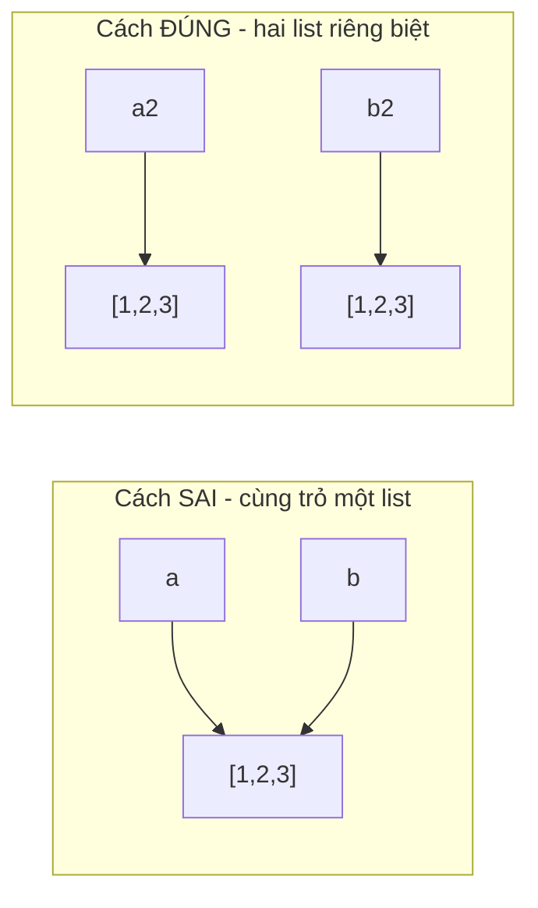

# Bài 14 — Danh Sách (List) Trong Python

> 🎓 **Chương 5 – Cấu trúc dữ liệu: List, Tuple, Set và Dictionary**

## 🧠 Điều kiện tiên quyết

- [Bài 10 — Vòng Lặp For – Lặp Lại Một Số Lần Biết Trước](../10-Vong-Lap-For/bai.md)
- [Bài 12 — Hàm (Function) Trong Python](../12-Ham/bai.md)

---

## 🎯 Mục tiêu

Sau bài học này, học viên sẽ:

* ✅ Hiểu **List là gì**, vì sao cần nó thay vì nhiều biến rời rạc.
* ✅ **Tạo** list bằng `[]` và hàm `list()`.
* ✅ **Truy cập** phần tử bằng **index dương** (0, 1, 2...) và **index âm** (-1, -2...).
* ✅ **Cắt** list bằng slice `[start:stop:step]`.
* ✅ **Thêm** phần tử với `append`, `extend`, `insert`.
* ✅ **Xóa** phần tử với `remove`, `pop`, `clear`, `del`.
* ✅ **Tìm kiếm, sắp xếp, đảo** list và tính toán với `len/min/max/sum`.
* ✅ **Duyệt** list bằng vòng lặp, xử lý **list lồng nhau** và **copy** list an toàn.

---

## 📖 Kiến thức

### 1. List là gì?

> 💬 **Nói đơn giản:** List là **cái kệ nhiều ngăn có đánh số** — mỗi ngăn chứa một giá trị, và bạn gọi tên **vị trí** ngăn để lấy giá trị ra.

**Ví dụ đời thực:** 🛒 danh sách đồ mua sắm, 🏫 danh sách tên học sinh trong lớp, 📊 bảng điểm 10 môn của bạn.

```python
hoc_sinh = ["An", "Binh", "Chi"]   # cái kệ 3 ngăn: ngăn 0, 1, 2
```

**Vì sao không cần list?** Hãy thử tưởng tượng lưu 50 cái tên bằng biến sẽ thế nào:

```python
hs1 = "An"; hs2 = "Binh"; ...   # ❌ viết 50 dòng, không thể duyệt bằng vòng lặp
```

```mermaid
mindmap
  root((List))
    Đặc điểm
      Có THỨ TỰ (cố định)
      Có THỂ thay đổi (mutable)
      Được phép TRÙNG giá trị
      Chứa mọi kiểu dữ liệu
    Thao tác chính
      Tạo: ds = [ ... ]
      Truy cập: ds[0], ds[-1]
      Cắt: ds[1:4]
      Thêm: append, extend, insert
      Xóa: remove, pop, del, clear
      Sắp xếp: sort, sorted
```

> 💡 **Điểm mạnh cốt lõi của list** so với biến đơn: bạn có thể **duyệt bằng vòng lặp `for`** để xử lý 50, 500, hay 5.000 phần tử chỉ với vài dòng code.

### 2. Tạo list

| Cách | Cú pháp | Ví dụ |
|---|---|---|
| Có sẵn dữ liệu | `[giá_trị, ...]` | `diem = [8.5, 7.0, 9.0]` |
| Chuỗi chữ sang list | `list("abc")` | `list("xin")` → `['x', 'i', 'n']` |
| List rỗng | `[]` hoặc `list()` | `gio_hang = []` |

```python
# List chứa số, chuỗi, thậm chí lẫn lộn nhiều kiểu
ten = ["An", "Binh"]          # list chuỗi
diem = [8.5, 7.0, 9.0]        # list số
hon_hop = ["An", 15, True]    # list lẫn lộn kiểu — Python cho phép!
rong = []                     # list rỗng, sẵn sàng nhận dữ liệu sau
```

> ⚠️ **Lưu ý quan trọng:** các giá trị trong list phân cách nhau bởi **dấu phẩy `,`** — quên dấu phẩy là bị `SyntaxError`.

### 3. Truy cập phần tử — Index (chỉ số)

Mỗi phần tử trong list có một **số thứ tự gọi là index**, bắt đầu đếm từ **0**:

```python
trai_cay = ["tao", "chuoi", "cam"]
# index dương: 0       1        2
# index âm:  -3      -2       -1

print(trai_cay[0])    # tao   — phần tử đầu tiên
print(trai_cay[2])    # cam   — phần tử thứ 3
print(trai_cay[-1])   # cam   — phần tử CUỐI (index âm)
print(trai_cay[-2])   # chuoi — phần tử kế cuối
```

> 💡 **Index âm rất tiện:** `trai_cay[-1]` luôn lấy phần tử **cuối cùng** dù list dài bao nhiêu — không cần đếm độ dài.

> ⚠️ **Bẫy:** điều chỉ số ngoài phạm vi như `trai_cay[10]` → lỗi `IndexError: list index out of range`.

### 4. Cắt list — Slice `[start:stop:step]`

Slice là cách lấy ra **một đoạn (mảng con)** của list — kết quả trả về **list mới**:

```python
so = [0, 1, 2, 3, 4, 5]

print(so[1:4])     # [1, 2, 3]  — từ index 1 tới TRƯỚC index 4
print(so[:3])      # [0, 1, 2]  — từ đầu tới trước index 3
print(so[3:])      # [3, 4, 5]  — từ index 3 tới hết
print(so[::2])     # [0, 2, 4]  — bước nhảy 2 (lấy phần tử chẵn)
print(so[::-1])    # [5, 4, 3, 2, 1, 0] — bước -1: ĐẢO NGƯỢC list!
```

| Thành phần | Ý nghĩa | Ghi chú |
|---|---|---|
| `start` | Vị trí **bắt đầu** (mặc định 0) | Giá trị **được lấy** |
| `stop` | Vị trí **kết thúc** (mặc định cuối) | Giá trị **KHÔNG được lấy** |
| `step` | **Bước nhảy** (mặc định 1) | Âm để đi ngược |

### 5. Thêm phần tử

| Phương thức | Công dụng | Ví dụ |
|---|---|---|
| `ds.append(x)` | Thêm **1** giá trị vào **cuối** | `ds.append(10)` |
| `ds.extend(other)` | Nối toàn bộ **list khác** vào cuối | `ds.extend([1, 2])` |
| `ds.insert(vị_trí, x)` | **Chèn** giá trị vào vị trí bất kỳ | `ds.insert(0, "dau")` |

```python
# append: thêm 1 phần tử vào cuối (như đẩy món vào cuối kệ)
mon_an = ["pho", "bun"]
mon_an.append("com")          # → ["pho", "bun", "com"]

# extend: nối cả một danh sách — KHÔNG nên dùng append để nối!
mon_an.extend(["mi xao", "cha gio"])   # → ["pho", "bun", "com", "mi xao", "cha gio"]

# insert: chèn vào vị trí xác định, các phần tử sau bị đẩy lùi
mon_an.insert(1, "banh mi")   # → ["pho", "banh mi", "bun", ...]
```

> ⚠️ **Lỗi phổ biến:** `mon_an.append(["mi xao", "cha gio"])` sẽ chèn **cả list** làm **một** phần tử → tạo *list lồng nhau* không mong muốn. Muốn nối các phần tử rời rạc thì phải dùng `extend`.

### 6. Xóa phần tử

| Cách | Công dụng | Hành vi khi không tìm thấy |
|---|---|---|
| `ds.remove(x)` | Xóa phần tử **đầu tiên** có giá trị `x` | `ValueError` |
| `ds.pop()` | Xóa phần tử **cuối** và **trả về** nó | list rỗng → `IndexError` |
| `ds.pop(i)` | Xóa phần tử ở vị trí `i` và **trả về** nó | -- |
| `del ds[i]` | Xóa phần tử ở vị trí `i` (không trả về) | `IndexError` |
| `ds.clear()` | Xóa **toàn bộ** list | -- |

```python
diem = [6, 9, 7, 9]
diem.remove(9)                  # xóa số 9 ĐẦU TIÊN → [6, 7, 9]
phan_tu_bi_xoa = diem.pop()     # pop() trả về 9, diem còn [6, 7]
last = diem.pop(0)              # pop(0) trả về 6, diem còn [7]
del diem[0]                     # xóa luôn phần tử 0 → []
diem.clear()                    # diem = [] (xóa sạch)
```

> 💡 **`pop` vs `del`:** `pop` vừa xóa vừa **trả về** giá trị — hữu ích khi cần lưu lại thứ bị xóa (ví dụ hủy món khỏi giỏ hàng và trả tiền vào ví); `del` xóa thẳng không cần dùng lại.

### 7. Tìm kiếm và đếm

```python
trai_cay = ["tao", "chuoi", "cam", "chuoi"]

print(trai_cay.count("chuoi"))   # 2  — đếm số lần xuất hiện
print(trai_cay.index("cam"))     # 2  — vị trí ĐẦU TIÊN của "cam"
print("cam" in trai_cay)         # True — kiểm tra tồn tại
print("xoai" in trai_cay)        # False
```

> ⚠️ `index(x)` mà không có giá trị `x` → `ValueError: 'xoai' is not in list`. Hãy kiểm tra `in` trước khi gọi `index`.

### 8. Sắp xếp và đảo ngược

```python
diem = [9, 5, 7]

diem.sort()          # sắp xếp NGAY TRÊN list gốc → [5, 7, 9]
diem.sort(reverse=True)   # giảm dần → [9, 7, 5]

moi = sorted(diem)   # sorted() TRẢ VỀ list mới, list gốc KHÔNG đổi
print(diem)          # [9, 7, 5] (không đổi)
print(moi)           # [5, 7, 9] (list mới sau khi sắp tăng dần)

diem.reverse()       # đảo ngược thứ tự list
print(diem[::-1])    # đảo ngược bằng slice — trả về list mới
```

| Hàm | Tác động list gốc | Trả về |
|---|---|---|
| `ds.sort()` | ✅ Thay đổi | Không (None) |
| `sorted(ds)` | ❌ Không đổi | 📦 List mới |
| `ds.reverse()` | ✅ Thay đổi | Không |
| `ds[::-1]` | ❌ Không đổi | 📦 List mới |

> 💡 **Mẹo:** muốn giữ list gốc nguyên vẹn để so sánh, dùng `sorted()` / `ds[::-1]`; muốn tiết kiệm bộ nhớ và sửa ngay list gốc, dùng `sort()` / `reverse()`.

### 9. `len`, `min`, `max`, `sum`

```python
diem = [8, 9, 10, 7, 6]

print(len(diem))            # 5  — số phần tử
print(min(diem))            # 6  — nhỏ nhất
print(max(diem))            # 10 — lớn nhất
print(sum(diem))            # 40 — tổng (chỉ áp dụng cho list số)

print(sum(diem) / len(diem))  # 8.0 — trung bình cộng
```

> ⚠️ `sum()` yêu cầu list **toàn số**; list lẫn chuỗi như `["An", 15]` → `TypeError`. Khi list rỗng, `min()`/`max()` → `ValueError`.

### 10. Duyệt list bằng vòng lặp

```python
hoc_sinh = ["An", "Binh", "Chi"]

# Cách 1: duyệt TỪNG GIÁ TRỊ — đơn giản, hay dùng
for ten in hoc_sinh:
    print("Chao", ten)

# Cách 2: duyệt theo VỊ TRÍ — cần index khi muốn sửa hoặc đếm thứ tự
for i in range(len(hoc_sinh)):
    print(i, "-", hoc_sinh[i])

# Cách 3: enumerate — vừa có index vừa có giá trị, gọn nhất
for i, ten in enumerate(hoc_sinh):
    print(f"{i}. {ten}")
```

### 11. List lồng nhau (nested list)

List có thể chứa... list khác, giống **bảng** nhiều hàng nhiều cột:

```python
bang_diem = [          # hàng là mỗi học sinh
    ["An", 8, 9],      #    tên, điểm Toán, điểm Văn
    ["Binh", 7, 8],
    ["Chi", 9, 10],
]

print(bang_diem[0])      # ["An", 8, 9]  — hàng đầu tiên
print(bang_diem[0][1])   # 8 — hàng 0, cột 1

for hang in bang_diem:            # duyệt theo từng hàng
    print(hang[0], "Toan:", hang[1], "Van:", hang[2])
```

### 12. Copy list và BẪY THAM CHIẾU (siêu quan trọng!)

> ⚠️⛔ **Bẫy kinh điển:** viết `ds_moi = ds_cu` **KHÔNG hề tạo bản sao** — cả hai biến cùng *trỏ về một list*:

```python
a = [1, 2, 3]
b = a                # ❌ CHƯA copy gì cả — b và a trỏ về CÙNG một list!
b.append(99)
print(a)             # [1, 2, 3, 99] — a cũng bị đổi theo!
```

> 🧠 **Nhớ lại Bài 4 (mục 3b):** `b = a` chỉ dán thêm nhãn, không copy gì cả.
> Với số thì không sao (số không sửa tại chỗ được), nhưng list SỬA ĐƯỢC tại
> chỗ (`append` chọc thẳng vào list gốc) — nên nhìn qua nhãn nào cũng thấy đổi.
> Không có gì ngạc nhiên nếu bạn đã hiểu mô hình nhãn dán: hai nhãn, một list!



**Cách copy an toàn:**

```python
goc = [1, 2, 3]

sao1 = goc.copy()        # ✅ Cách 1: copy()
sao2 = list(goc)         # ✅ Cách 2: list()
sao3 = goc[:]            # ✅ Cách 3: slice toàn bộ

sao1.append(100)
print(goc)               # [1, 2, 3] — an toàn!
```

> 💡 **Lưu ý thêm:** `copy()` và `[:]` là **copy nông (shallow)** — với list lồng nhau, hàng bên trong vẫn dùng chung. Muốn copy sâu toàn bộ thì hoặc tự duyệt, hoặc dùng `import copy; bản_sao = copy.deepcopy(goc)` (đọc thêm ở bài cuối).

---

## 💡 Ví dụ minh họa

### Ví dụ 1: Danh sách mua sắm — thêm, xóa, duyệt

```python
# Tạo danh sách mua sắm ban đầu
gio_hang = ["táo", "sữa", "bánh mì"]

# Thêm 2 món mới
gio_hang.append("trứng")
gio_hang.append("cà phê")

# Bánh mì hết trong tủ → bỏ khỏi giỏ
gio_hang.remove("bánh mì")

# In danh sách cuối cùng theo thứ tự
print("Số món:", len(gio_hang))
for mon in gio_hang:
    print("-", mon)
```

Kết quả:

```
Số món: 4
- táo
- sữa
- trứng
- cà phê
```

| Dòng code | Ý nghĩa |
|---|---|
| `gio_hang = [...]` | Tạo list 3 phần tử |
| `gio_hang.append("trứng")` | Thêm món mới vào **cuối** |
| `gio_hang.remove("bánh mì")` | Xóa phần tử **theo giá trị** |
| `len(gio_hang)` | Lấy **số lượng** phần tử đang có |
| `for mon in gio_hang` | Duyệt lần lượt và in từng món |

### Ví dụ 2: Quản lý bảng điểm — cộng, tìm max, trung bình

```python
diem = [8, 9, 7, 10, 6]

tong = sum(diem)                      # tổng điểm
so_mon = len(diem)                    # số môn
trung_binh = tong / so_mon            # trung bình
diem_cao_nhat = max(diem)             # điểm cao nhất
diem_thap_nhat = min(diem)            # điểm thấp nhất

print(f"Tổng điểm: {tong}")
print(f"Trung bình: {round(trung_binh, 2)}")
print(f"Cao nhất: {diem_cao_nhat}, thấp nhất: {diem_thap_nhat}")
```

Kết quả:

```
Tổng điểm: 40
Trung bình: 8.0
Cao nhất: 10, thấp nhất: 6
```

### Ví dụ 3: Cắt và đảo list

```python
# 10 số ngẫu nhiên từ 1 tới 10
so = [1, 2, 3, 4, 5, 6, 7, 8, 9, 10]

print(so[:5])       # năm số đầu
print(so[5:])       # năm số sau
print(so[1::2])     # các vị trí lẻ (index 1, 3, 5, 7, 9)
print(so[::3])      # cứ 3 số lấy 1
print(so[::-1])     # đảo ngược toàn bộ
```

Kết quả:

```
[1, 2, 3, 4, 5]
[6, 7, 8, 9, 10]
[2, 4, 6, 8, 10]
[1, 4, 7, 10]
[10, 9, 8, 7, 6, 5, 4, 3, 2, 1]
```

---

## 🔬 Ví dụ nâng cao

### Ví dụ 1: Quản lý danh sách học sinh 🏫

```python
# Lớp có 5 học sinh, thêm 1 bạn mới chuyển đến
lop = ["An", "Binh", "Chi", "Dung", "Em"]
lop.append("Phuc")                        # bạn mới vào cuối

for i, ten in enumerate(lop, start=1):    # đánh số thứ tự từ 1
    print(f"{i}. {ten}")

# Bạn Dung chuyển trường → xóa
lop.remove("Dung")
print("Sau khi Dung chuyển đi:")
for ten in lop:
    print("-", ten)
```

### Ví dụ 2: Giỏ hàng siêu thị có giá 🛒

```python
# Danh sách [tên, giá] — list lồng nhau
gio = [
    ["Sữa", 35],
    ["Trứng", 28],
    ["Bánh mì", 20],
]

tong_tien = 0
for ten, gia in gio:                  # unpacking pair khi duyệt
    print(f"{ten}: {gia}k")
    tong_tien += gia

print("=" * 15)
print(f"Tổng tiền: {tong_tien}k")
```

### Ví dụ 3: Đảo điểm số ngược — minigame hồi máu 💊

```python
# Danh sách máu của 4 nhân vật, lấy theo thứ tự ưu tiên (nhân vật 1 có máu thấp nhất rồi tăng dần)
mau = [50, 80, 120, 200]

# Nhân vật đang hồi sinh → thêm máu của nhân vật MỚI nhất vào cuối
mau.append(90)

# Lấy 2 nhân vật có máu cao nhất để đi tiên phong
mau.sort()
tien_phong = mau[-2:]
print("Đội tiên phong (2 máu cao nhất):", tien_phong)
```

### Ví dụ 4: Lọc số chẵn — kết hợp vòng lặp và append 🔢

```python
so = [4, 7, 2, 9, 10, 3]
so_chan = []                      # list rỗng để thu thập kết quả

for x in so:
    if x % 2 == 0:                # số chẵn
        so_chan.append(x)

print("Số chẵn:", so_chan)        # [4, 2, 10]
print("Trung bình số chẵn:", sum(so_chan) / len(so_chan))
```

> 💡 Đây là mẫu hình **"collect"** cực kỳ phổ biến: duyệt → lọc → `append` vào list kết quả. Bạn sẽ dùng lại kỹ thuật này ở rất nhiều bài sau.

---

## ⚠️ Lỗi thường gặp

### Lỗi 1: Truy cập quá phạm vi — IndexError

```python
ds = [1, 2, 3]
print(ds[5])   # ❌ SAI — IndexError: list index out of range
```

* **Nguyên nhân:** list chỉ có 3 phần tử (index 0, 1, 2); index 5 không tồn tại.
* **Cách sửa:** kiểm tra `0 <= i < len(ds)` hoặc dùng `ds[-1]` cho phần tử cuối.

### Lỗi 2: `sort()` trong `print()` — nhầm lẫn sort vs sorted

```python
diem = [9, 5, 7]
print(diem.sort())   # ❌ SAI — in ra None!
```

* **Nguyên nhân:** `sort()` **thay đổi list gốc** và **trả về None**, không trả về list đã sắp.
* **Cách sửa:** tách riêng: `diem.sort()` rồi `print(diem)`; hoặc `print(sorted(diem))`.

### Lỗi 3: Nhầm `append` list vs `extend` list

```python
a = [1, 2]
a.append([3, 4])   # ❌ KHÔNG nối — a thành [1, 2, [3, 4]] (list lồng nhau)
```

* **Nguyên nhân:** `append` đúng nghĩa là thêm *một* phần tử; cái list `[3, 4]` bị coi là *một* phần tử.
* **Cách sửa:** muốn nối rời từng phần tử dùng `a.extend([3, 4])`.

### Lỗi 4: Xóa bằng `remove` phần tử không tồn tại — ValueError

```python
ds = ["tao", "cam"]
ds.remove("xoai")   # ❌ SAI — ValueError: xoai is not in list
```

* **Nguyên nhân:** không có giá trị "xoai" trong list.
* **Cách sửa:** kiểm tra `if "xoai" in ds:` trước khi remove.

### Lỗi 5: Tưởng `=` sao chép được list — BẪY THAM CHIẾU

```python
a = [1, 2, 3]
b = a
b.append(99)
print(a)   # ❌ [1, 2, 3, 99] — a bị đổi "ma quái"!
```

* **Nguyên nhân:** `b = a` cho `b` trỏ tới **cùng** list của `a`; sửa qua `b` tức sửa cả `a`.
* **Cách sửa:** `b = a.copy()` hoặc `b = list(a)` hoặc `b = a[:]`.

---

## 💎 Mẹo

* ✨ **`-1` là "chốt cuối":** `ds[-1]` luôn lấy phần tử cuối — dùng để đọc "hàng tồn mới nhất" trong danh sách.
* 🛡️ **Kiểm tra trước khi xóa/tìm:** `x in ds` trước `remove` hay `index` để tránh `ValueError`.
* 📦 **`sorted()` giữ bản gốc:** khi cần so sánh trước – sau khi sắp xếp, đừng dùng `sort()`.
* 🔁 **Slide để đảo nhanh:** `ds[::-1]` chỉ vài ký tự đã đảo ngược list — không cần vòng lặp.
* 🧮 **`enumerate(ds, start=1)`** giúp in số thứ tự bắt đầu từ 1 cho con người đọc dễ hơn.
* 💾 **Copy list thì dùng `copy()`/`list()`/`[:]`** — đừng bao giờ dùng dấu `=`.
* 🔤 **List có thể chứa mọi kiểu** — kể cả lẫn lộn; nhưng khi tính toán bằng `sum()` thì phải toàn số.
* 🐍 **Quy ước module chuẩn:** dùng `ds` hoặc tên mô tả như `gio_hang`, `bang_diem` — PEP 8 khuyến khích tên hàm/biến chữ thường.

---

## 📝 Tóm tắt

| Thao tác | Cú pháp | Kết quả / ghi chú |
|---|---|---|
| Tạo | `ds = [1, 2, 3]` hoặc `list()` | Có thứ tự, được trùng, đổi được |
| Truy cập | `ds[0]`, `ds[-1]` | Bắt đầu từ 0; âm đi từ cuối |
| Cắt | `ds[start:stop:step]` | Trả về **list mới** |
| Thêm cuối | `ds.append(x)` | Thêm 1 phần tử |
| Nối | `ds.extend(other)` | Nối cả list khác |
| Chèn | `ds.insert(i, x)` | Chèn tại vị trí i |
| Xóa theo giá trị | `ds.remove(x)` | Lỗi `ValueError` nếu không có |
| Xóa theo vị trí | `ds.pop(i)` / `del ds[i]` | `pop` trả về giá trị |
| Xóa sạch | `ds.clear()` | List rỗng |
| Đếm / tìm | `ds.count(x)`, `ds.index(x)` | Cần kiểm tra `in` trước |
| Sắp xếp | `ds.sort()` / `sorted(ds)` | Đổi list gốc / tạo list mới |
| Đảo | `ds.reverse()` / `ds[::-1]` | Đổi / tạo list mới |
| Tính toán | `len`, `min`, `max`, `sum` | Bộ công cụ nhanh cho list số |
| Duyệt | `for x in ds`, `enumerate` | Xử lý cả list chỉ vài dòng |
| Copy an toàn | `ds.copy()` / `list(ds)` / `ds[:]` | Tránh bẫy tham chiếu |

---

## 🧪 Kiểm tra nhanh

1. ❓ List lưu dữ liệu theo **thứ tự hay không**? Truy cập phần tử đầu tiên bằng index nào?
2. ❓ `ds[-1]` dùng để làm gì?
3. ❓ Viết lệnh cắt 3 phần tử đầu của `so = [5, 6, 7, 8, 9]`.
4. ❓ `append` và `extend` khác nhau thế nào?
5. ❓ `ds.pop()` trả về gì và khác `del ds[-1]` ở điểm nào?
6. ❓ `sort()` và `sorted()` khác nhau như thế nào về list gốc?
7. ❓ Viết vòng lặp in ra từng giá trị của list `ten = ["An", "Binh"]`.
8. ❓ `b = a` có thực sự tạo bản sao list `a` không? Vì sao?
9. ❓ `bang_diem[0][1]` nghĩa là gì?
10. ❓ Nêu 2 lệnh để lấy số phần tử và tổng của list chứa toàn số.

<details>
<summary>🔍 Xem đáp án</summary>

1. Có thứ tự; index của phần tử đầu tiên là `0`.
2. Lấy phần tử **cuối cùng** — index âm đếm từ cuối list.
3. `so[:3]` → `[5, 6, 7]`.
4. `append` thêm **1** phần tử vào cuối; `extend` nối toàn bộ phần tử của **list khác** vào cuối.
5. `pop()` xóa phần tử cuối và **trả về** nó; `del` xóa nhưng không trả về giá trị.
6. `sort()` thay đổi **list gốc** trả về `None`; `sorted()` **tạo list mới**, giữ list gốc nguyên vẹn.
7. `for t in ten: print(t)`.
8. Không — `b = a` chỉ cho `b` **trỏ tới cùng list** với `a`; phải dùng `copy()`/`list()`/`[:]`.
9. Lấy phần tử hàng `0`, cột `1` của một list lồng nhau — tức phần tử thứ hai của hàng đầu tiên.
10. `len(so)` và `sum(so)`.

</details>

---

## 📚 Bài đọc thêm

* [Python.org – Khái niệm dữ liệu: list](https://docs.python.org/3/tutorial/datastructures.html#more-on-lists)
* [W3Schools – Python Lists](https://www.w3schools.com/python/python_lists.asp)
* [Python.org – Kiểu dữ liệu tích hợp (list, slice)](https://docs.python.org/3/library/stdtypes.html#sequence-types-list-tuple-range)
* [Real Python – Python Lists and Tuples](https://realpython.com/python-lists-tuples/)

---

---

## 🧩 Bài tập

> 📝 🎯 **Chủ đề:** Tạo list, truy cập, cắt slice, thêm/xóa, tìm kiếm, sắp xếp, đảo, duyệt, list lồng nhau và copy list an toàn.

## 🟢 Dễ (Bài 1 – 7)

### Bài 1: Tạo danh sách trái cây

* **Đề bài:** Tạo list `trai_cay` chứa 4 loại quả: `"tao"`, `"chuoi"`, `"cam"`, `"xoai"`. In ra phần tử đầu tiên và phần tử cuối cùng.
* **Input:** Không có.
* **Output:**
  ```
  tao
  xoai
  ```
* **Gợi ý:** Index đầu tiên là `0`, index cuối có thể dùng `-1`.

### Bài 2: In toàn bộ danh sách

* **Đề bài:** Cho list `so = [10, 20, 30, 40, 50]`. Viết chương trình in ra từng số trên một dòng.
* **Input:** Không có.
* **Output:**
  ```
  10
  20
  30
  40
  50
  ```
* **Gợi ý:** Dùng vòng lặp `for x in so:`.

### Bài 3: Độ dài và tổng

* **Đề bài:** Cho `diem = [8, 9, 10, 7]`. In ra số lượng phần tử và tổng điểm.
* **Input:** Không có.
* **Output:**
  ```
  So phan tu: 4
  Tong diem: 34
  ```
* **Gợi ý:** Dùng `len()` và `sum()`.

### Bài 4: Thêm phần tử vào cuối

* **Đề bài:** Tạo list rỗng `gio_hang`, rồi lần lượt thêm `"sua"`, `"trung"`, `"banh mi"` bằng `append`. In list kết quả.
* **Input:** Không có.
* **Output:**
  ```
  ['sua', 'trung', 'banh mi']
  ```
* **Gợi ý:** `gio_hang = []` rồi gọi `gio_hang.append(...)` ba lần.

### Bài 5: Tìm vị trí phần tử

* **Đề bài:** Cho `mon = ["pho", "bun", "com", "mi"]`. In ra vị trí (index) của `"com"` và kiểm tra xem `"banh"` có trong list không.
* **Input:** Không có.
* **Output:**
  ```
  2
  False
  ```
* **Gợi ý:** `mon.index("com")` và `"banh" in mon`.

### Bài 6: Xóa phần tử

* **Đề bài:** Cho `diem = [5, 8, 7, 5]`. Xóa giá trị `5` đầu tiên rồi in list; sau đó xóa phần tử cuối bằng `pop()` và in ra list.
* **Input:** Không có.
* **Output:**
  ```
  [8, 7, 5]
  [8, 7]
  ```
* **Gợi ý:** `diem.remove(5)` xóa theo giá trị; `diem.pop()` xóa phần tử cuối.

### Bài 7: Sắp xếp tăng dần

* **Đề bài:** Cho `so = [9, 1, 7, 3]`. Sắp xếp list theo thứ tự tăng dần rồi in ra.
* **Input:** Không có.
* **Output:**
  ```
  [1, 3, 7, 9]
  ```
* **Gợi ý:** `so.sort()` sẽ sửa ngay list gốc.

---

## 🟡 Trung bình (Bài 8 – 14)

### Bài 8: Điểm trung bình của lớp

* **Đề bài:** Cho danh sách điểm `[6.5, 8.0, 9.5, 5.0, 7.5]`. Tính và in ra điểm trung bình (làm tròn 2 chữ số), điểm cao nhất và thấp nhất.
* **Input:** Không có.
* **Output:**
  ```
  Trung binh: 7.3
  Cao nhat: 9.5
  Thap nhat: 5.0
  ```
* **Gợi ý:** Kết hợp `sum`, `len`, `max`, `min` và `round`.

### Bài 9: Lọc số chẵn

* **Đề bài:** Cho `so = [1, 4, 7, 8, 10, 13]`. Tạo list mới `so_chan` chỉ chứa các số chẵn rồi in ra.
* **Input:** Không có.
* **Output:**
  ```
  [4, 8, 10]
  ```
* **Gợi ý:** Duyệt list, kiểm tra `x % 2 == 0`, rồi `append` vào list kết quả.

### Bài 10: Chia danh sách thành 3 phần

* **Đề bài:** Cho `so = [1, 2, 3, 4, 5, 6, 7, 8, 9]`. In ra: 3 số đầu, 3 số giữa, 3 số cuối bằng cách cắt slice.
* **Input:** Không có.
* **Output:**
  ```
  [1, 2, 3]
  [4, 5, 6]
  [7, 8, 9]
  ```
* **Gợi ý:** Dùng `so[:3]`, `so[3:6]`, `so[6:]`.

### Bài 11: Đếm số lần xuất hiện

* **Đề bài:** Cho chuỗi chữ: `"toi thich hoc python vi python don gian"` (lưu dưới dạng list các từ). Đếm xem từ `"python"` xuất hiện mấy lần và in ra.
* **Input:** Không có.
* **Output:**
  ```
  2
  ```
* **Gợi ý:** Tách chuỗi thành list bằng `cau.split()` rồi dùng `list.count("python")`.

### Bài 12: Hoán đổi vị trí

* **Đề bài:** Cho `ds = [1, 2, 3, 4]`. Viết chương trình hoán đổi phần tử đầu và phần tử cuối cho nhau, rồi in ra.
* **Input:** Không có.
* **Output:**
  ```
  [4, 2, 3, 1]
  ```
* **Gợi ý:** Dùng biến tạm hoặc hoán đổi trực tiếp `ds[0], ds[-1] = ds[-1], ds[0]`.

### Bài 13: Kiểm tra tăng dần

* **Đề bài:** Cho `ds = [1, 3, 5, 7]`. Viết chương trình kiểm tra list này có được sắp xếp tăng dần hay không và in ra `True`/`False`.
* **Input:** Không có.
* **Output:**
  ```
  True
  ```
* **Gợi ý:** So sánh từng cặp phần tử liền kề trong vòng lặp; hoặc so sánh `ds` với `sorted(ds)`.

### Bài 14: Sinh viên mới

* **Đề bài:** Lớp có danh sách `["An", "Binh", "Chi"]`. Bạn "Dung" chuyển đến, cần xếp **đúng vị trí giữa list** (sau "Binh"); sau đó bạn "An" chuyển trường phải xóa. In list cuối cùng.
* **Input:** Không có.
* **Output:**
  ```
  ['Binh', 'Dung', 'Chi']
  ```
* **Gợi ý:** `insert(index, "Dung")` với index hợp lý, rồi `remove("An")`. Lưu ý thứ tự thao tác.

---

## 🔴 Khó (Bài 15 – 20)

### Bài 15: Bảng điểm học sinh (list lồng nhau)

* **Đề bài:** Cho `bang_diem = [["An", 8, 9], ["Binh", 7, 8], ["Chi", 9, 10]]` (tên, điểm Toán, điểm Văn). In ra tên và **tổng điểm** của từng bạn, rồi in tên bạn có tổng điểm cao nhất.
* **Input:** Không có.
* **Output:**
  ```
  An: 17
  Binh: 15
  Chi: 19
  Cao nhat: Chi
  ```
* **Gợi ý:** Duyệt từng hàng, cộng `hang[1] + hang[2]`; dùng biến `max` để lưu bạn đang dẫn đầu.

### Bài 16: Bảng cửu chương từ danh sách

* **Đề bài:** Cho list `nhan = [2, 3, 4, 5]`. In ra bảng nhân `x * 1`, `x * 2`, `x * 3` cho từng giá trị `x` trong list (mỗi giá trị một dòng, các phép tính cách nhau dấu `, `).
* **Input:** Không có.
* **Output:**
  ```
  2x1=2, 2x2=4, 2x3=6
  3x1=3, 3x2=6, 3x3=9
  4x1=4, 4x2=8, 4x3=12
  5x1=5, 5x2=10, 5x3=15
  ```
* **Gợi ý:** Hai vòng lặp lồng nhau: vòng ngoài duyệt `nhan`, vòng trong chạy 1 → 3; gom chuỗi rồi in một lần.

### Bài 17: Xóa các phần tử trùng lặp liên tiếp

* **Đề bài:** Cho `ds = [1, 1, 2, 2, 2, 3, 4, 4, 5]`. Viết chương trình tạo list mới chỉ giữ lại **một** bản của mỗi phần tử đứng **liền kề nhau** (các phần tử trùng nhưng tách rời thì vẫn giữ). In list kết quả.
* **Input:** Không có.
* **Output:**
  ```
  [1, 2, 3, 4, 5]
  ```
* **Gợi ý:** Duyệt list, chỉ thêm phần tử vào list kết quả nếu nó **khác phần tử đứng trước** trong list kết quả.

### Bài 18: Ghép danh sách lệch thứ tự

* **Đề bài:** Cho hai list đã sắp tăng dần `a = [1, 3, 5]` và `b = [2, 4, 6]`. Viết chương trình **trộn (merge)** chúng thành một list duy nhất vẫn **tăng dần** và in ra.
* **Input:** Không có.
* **Output:**
  ```
  [1, 2, 3, 4, 5, 6]
  ```
* **Gợi ý:** Không dùng `sorted(a + b)`. Dùng hai biến chỉ số `i`, `j` so sánh lần lượt: phần tử nhỏ hơn được đưa vào kết quả trước (kỹ thuật **two-pointer**).

### Bài 19: Dịch chuyển vòng (rotate)

* **Đề bài:** Cho `ds = [1, 2, 3, 4, 5]`. Viết chương trình **dịch phải vòng tròn** 2 lần: mỗi lần phần tử cuối nhảy lên đầu, các phần tử còn lại lùi xuống. In list kết quả.
* **Input:** Không có.
* **Output:**
  ```
  [4, 5, 1, 2, 3]
  ```
* **Gợi ý:** Mỗi lần dịch: `ds.insert(0, ds.pop())`. Lặp đúng 2 lần.

### Bài 20: Copy an toàn — ứng dụng chấm điểm

* **Đề bài:** Cho `goc = [7, 9, 8, 6]`. Viết chương trình **sao chép an toàn** `goc` sang list `sao` (không được để thay đổi `sao` ảnh hưởng `goc`). Sau đó `sao` cộng thêm 1 điểm cho mỗi phần tử, in ra cả hai list để thấy `goc` không đổi.
* **Input:** Không có.
* **Output:**
  ```
  Sao (sau khi +1): [8, 10, 9, 7]
  Goc (khong doi): [7, 9, 8, 6]
  ```
* **Gợi ý:** Đừng gán bằng `=`. Dùng `copy()`, `list()`, hoặc `[:]`. Cộng điểm bằng vòng lặp duyệt theo index.

---

## 🎯 Tổng kết sau khi làm bài

Sau 20 bài tập, bạn đã:

* ✅ Tạo, truy cập và cắt list thành thạo.
* ✅ Thêm/xóa/sắp xếp/đảo list đúng cách.
* ✅ Duyệt list, xử lý list lồng nhau và copy an toàn.

---

## ✅ Đáp án

> 💡 **Hãy tự làm bài tập trước** rồi mới mở đáp án.

## 🟢 Dễ (Bài 1 – 7)


<details>
<summary>✅ Bài 1: Tạo danh sách trái cây</summary>


**Phân tích:** Cần tạo list 4 phần tử, in phần tử đầu (index 0) và cuối (index -1).

**Ý tưởng:** Truy cập trực tiếp bằng chỉ số dương `0` và chỉ số âm `-1`.

**Thuật toán:**
1. Tạo list `trai_cay`.
2. In `trai_cay[0]`.
3. In `trai_cay[-1]`.

**Code:**

```python
# Tạo list 4 loại trái cây
trai_cay = ["tao", "chuoi", "cam", "xoai"]
# Phần tử đầu tiên — index dương 0
print(trai_cay[0])
# Phần tử cuối cùng — index âm -1
print(trai_cay[-1])
```

**Giải thích code:**
* `["tao", "chuoi", "cam", "xoai"]` — list có index 0, 1, 2, 3.
* `trai_cay[0]` → `"tao"` (đầu tiên).
* `trai_cay[-1]` → `"xoai"` (đếm ngược từ cuối, nhanh hơn nhớ độ dài).

**Độ phức tạp:** O(1) — truy cập theo index luôn tức thời.

---

</details>

<details>
<summary>✅ Bài 2: In toàn bộ danh sách</summary>


**Phân tích:** In từng phần tử của list lên từng dòng.

**Ý tưởng:** Dùng vòng lặp `for` duyệt qua từng giá trị — Python tự gán biến `x` cho mỗi phần tử.

**Thuật toán:**
1. Khởi tạo list `so`.
2. Lặp qua từng phần tử và in ra.

**Code:**

```python
# Danh sách 5 số
so = [10, 20, 30, 40, 50]
# Duyệt từng phần tử và in ra màn hình
for x in so:
    print(x)
```

**Giải thích code:**
* `for x in so:` — lần lượt gán `x = 10`, `x = 20`, ..., `x = 50`.
* `print(x)` — in ra giá trị hiện tại, xuống dòng tự động.

**Độ phức tạp:** O(n) — duyệt n phần tử.

---

</details>

<details>
<summary>✅ Bài 3: Độ dài và tổng</summary>


**Phân tích:** Cần số lượng phần tử và tổng giá trị của list số.

**Ý tưởng:** `len(diem)` cho số phần tử; `sum(diem)` cho tổng.

**Thuật toán:**
1. Khởi tạo list `diem`.
2. In `len(diem)`.
3. In `sum(diem)`.

**Code:**

```python
# Điểm 4 môn học
diem = [8, 9, 10, 7]
# Số lượng phần tử
print("So phan tu:", len(diem))
# Tổng giá trị các phần tử
print("Tong diem:", sum(diem))
```

**Giải thích code:**
* `len(diem)` → 4 (đếm phần tử).
* `sum(diem)` → 8 + 9 + 10 + 7 = 34.
* Hai hàm này chỉ hoạt động đúng với list chứa toàn số (đối với `sum`).

**Độ phức tạp:** O(1) cho `len`, O(n) cho `sum`.

---

</details>

<details>
<summary>✅ Bài 4: Thêm phần tử vào cuối</summary>


**Phân tích:** Bắt đầu từ list rỗng rồi thêm dần 3 giá trị.

**Ý tưởng:** Dùng `append()` — mỗi lần thêm 1 phần tử vào cuối list.

**Thuật toán:**
1. Tạo list rỗng `gio_hang`.
2. Gọi `append` 3 lần với từng món.
3. In list.

**Code:**

```python
# Giỏ hàng ban đầu rỗng
gio_hang = []
# Lần lượt thêm từng món vào cuối giỏ
gio_hang.append("sua")
gio_hang.append("trung")
gio_hang.append("banh mi")
# In toàn bộ giỏ hàng
print(gio_hang)
```

**Giải thích code:**
* `[]` — list rỗng, chưa có ngăn nào.
* Mỗi `append` mở thêm một "ngăn" ở cuối và đặt giá trị vào.
* Kết quả in ra `['sua', 'trung', 'banh mi']` theo đúng thứ tự thêm.

**Độ phức tạp:** O(1) mỗi lần `append`.

---

</details>

<details>
<summary>✅ Bài 5: Tìm vị trí phần tử</summary>


**Phân tích:** Cần vị trí của `"com"` và kiểm tra sự tồn tại của `"banh"`.

**Ý tưởng:** `index()` trả vị trí đầu tiên; toán tử `in` trả `True`/`False`.

**Thuật toán:**
1. Khởi tạo list `mon`.
2. In `mon.index("com")`.
3. In `"banh" in mon`.

**Code:**

```python
# Danh sách món ăn
mon = ["pho", "bun", "com", "mi"]
# Vị trí đầu tiên của "com"
print(mon.index("com"))
# Kiểm tra "banh" có trong list không
print("banh" in mon)
```

**Giải thích code:**
* `mon.index("com")` → 2 (vị trí bắt đầu đếm từ 0).
* `"banh" in mon` → `False` vì list không chứa `"banh"`.
* Lưu ý: nếu dùng `index` với phần tử không tồn tại sẽ báo `ValueError`.

**Độ phức tạp:** O(n) — phải duyệt để tìm.

---

</details>

<details>
<summary>✅ Bài 6: Xóa phần tử</summary>


**Phân tích:** Xóa theo **giá trị** (số 5 đầu tiên) rồi xóa theo **vị trí** (phần tử cuối).

**Ý tưởng:** `remove(5)` tìm giá trị đầu tiên; `pop()` xóa phần tử cuối.

**Thuật toán:**
1. Khởi tạo `diem = [5, 8, 7, 5]`.
2. `diem.remove(5)` rồi in.
3. `diem.pop()` rồi in.

**Code:**

```python
# Danh sách điểm
diem = [5, 8, 7, 5]
# Xóa giá trị 5 ĐẦU TIÊN — list còn [8, 7, 5]
diem.remove(5)
print(diem)
# Xóa phần tử cuối (pop trả về giá trị bị xóa nhưng ta không cần dùng)
diem.pop()
print(diem)
```

**Giải thích code:**
* `remove(5)` — xóa đúng **một** phần tử đầu tiên có giá trị 5.
* `pop()` — xóa phần tử cuối (giá trị 5 còn lại) và trả về nó.
* Kết quả: `[8, 7, 5]` rồi `[8, 7]`.

**Độ phức tạp:** O(n) cho `remove` (phải dò), O(1) cho `pop` cuối.

---

</details>

<details>
<summary>✅ Bài 7: Sắp xếp tăng dần</summary>


**Phân tích:** Cần sắp xếp list số theo thứ tự tăng dần.

**Ý tưởng:** `sort()` sắp xếp **ngay trên list gốc**.

**Thuật toán:**
1. Khởi tạo list `so`.
2. Gọi `so.sort()`.
3. In list.

**Code:**

```python
# Danh sách chưa sắp xếp
so = [9, 1, 7, 3]
# Sắp xếp tăng dần — sửa ngay list gốc
so.sort()
# In kết quả
print(so)
```

**Giải thích code:**
* `so.sort()` — sắp xếp và **thay đổi list gốc**, trả về `None`.
* Kết quả: `[1, 3, 7, 9]`.
* Nếu muốn giữ list gốc, phải dùng `sorted(so)`.

**Độ phức tạp:** O(n log n).

---

</details>

## 🟡 Trung bình (Bài 8 – 14)


<details>
<summary>✅ Bài 8: Điểm trung bình của lớp</summary>


**Phân tích:** Với list số, trung bình = `sum / len`; cần thêm `max` và `min`.

**Ý tưởng:** Tính từng giá trị rồi làm tròn 2 chữ số với `round`.

**Thuật toán:**
1. Khởi tạo list điểm.
2. Tính `tong = sum(diem)`, `so_mon = len(diem)`.
3. Tính trung bình và làm tròn.
4. In trung bình, cao nhất, thấp nhất.

**Code:**

```python
# Danh sách điểm của 5 học sinh
diem = [6.5, 8.0, 9.5, 5.0, 7.5]
# Tổng điểm
tong = sum(diem)
# Số môn
so_mon = len(diem)
# Trung bình, làm tròn 2 chữ số
trung_binh = round(tong / so_mon, 2)
# In kết quả
print("Trung binh:", trung_binh)
print("Cao nhat:", max(diem))
print("Thap nhat:", min(diem))
```

**Giải thích code:**
* `tong / so_mon` → 36.5 / 5 = 7.3.
* `round(7.3, 2)` → 7.3 (giữ 2 chữ số thập phân).
* `max`/`min` duyệt toàn list để tìm giá trị lớn/nhỏ nhất.

**Độ phức tạp:** O(n) — 3 lần duyệt qua list.

---

</details>

<details>
<summary>✅ Bài 9: Lọc số chẵn</summary>


**Phân tích:** Thu thập các số chia hết cho 2 vào list riêng.

**Ý tưởng:** Mẫu hình "collect": duyệt → kiểm tra điều kiện → `append` vào list kết quả.

**Thuật toán:**
1. Khởi tạo list rỗng `so_chan`.
2. Với mỗi `x` trong `so`: nếu `x % 2 == 0` thì `append`.
3. In `so_chan`.

**Code:**

```python
# Danh sách gốc
so = [1, 4, 7, 8, 10, 13]
# List kết quả — thu thập số chẵn
so_chan = []
# Duyệt từng phần tử
for x in so:
    # Kiểm tra số chẵn: chia hết cho 2
    if x % 2 == 0:
        so_chan.append(x)
# In kết quả
print(so_chan)
```

**Giải thích code:**
* `x % 2 == 0` — phép chia lấy dư: chẵn khi dư 0.
* `append` chỉ được gọi khi điều kiện đúng → list chỉ chứa số chẵn.
* Kết quả: `[4, 8, 10]`.

**Độ phức tạp:** O(n).

---

</details>

<details>
<summary>✅ Bài 10: Chia danh sách thành 3 phần</summary>


**Phân tích:** List 9 phần tử cần chia thành 3 đoạn bằng nhau.

**Ý tưởng:** Dùng slice với `stop` tương ứng: 3, 6, hết.

**Thuật toán:**
1. Khởi tạo list.
2. In `so[:3]`, `so[3:6]`, `so[6:]`.

**Code:**

```python
# Danh sách 9 số
so = [1, 2, 3, 4, 5, 6, 7, 8, 9]
# Ba số đầu — từ đầu tới trước index 3
print(so[:3])
# Ba số giữa — từ index 3 tới trước index 6
print(so[3:6])
# Ba số cuối — từ index 6 tới hết
print(so[6:])
```

**Giải thích code:**
* Slice `[start:stop]` lấy từ `start` tới **trước** `stop`.
* `so[:3]` → `[1, 2, 3]`; `so[3:6]` → `[4, 5, 6]`; `so[6:]` → `[7, 8, 9]`.
* Mỗi slice trả về **list mới**, list gốc không đổi.

**Độ phức tạp:** O(k) với k là độ dài đoạn cắt.

---

</details>

<details>
<summary>✅ Bài 11: Đếm số lần xuất hiện</summary>


**Phân tích:** Cần đếm từ `"python"` trong một câu; câu cần được tách thành list từ.

**Ý tưởng:** `str.split()` tách chuỗi theo khoảng trắng thành list; `list.count()` đếm số lần xuất hiện.

**Thuật toán:**
1. Tách câu bằng `cau.split()`.
2. In `tu.split().count("python")`.

**Code:**

```python
# Câu văn cần phân tích
cau = "toi thich hoc python vi python don gian"
# Tách thành list các từ (theo khoảng trắng)
tu = cau.split()
# Đếm số lần từ "python" xuất hiện
print(tu.count("python"))
```

**Giải thích code:**
* `cau.split()` → `["toi", "thich", "hoc", "python", "vi", "python", "don", "gian"]`.
* `tu.count("python")` → 2 (duyệt toàn list đếm các phần tử khớp).

**Độ phức tạp:** O(n).

---

</details>

<details>
<summary>✅ Bài 12: Hoán đổi vị trí</summary>


**Phân tích:** Đổi chỗ phần tử đầu và cuối.

**Ý tưởng:** Python cho phép gán nhiều giá trị cùng lúc — hoán đổi trong **một dòng**.

**Thuật toán:**
1. Khởi tạo list.
2. `ds[0], ds[-1] = ds[-1], ds[0]`.
3. In list.

**Code:**

```python
# Danh sách ban đầu
ds = [1, 2, 3, 4]
# Hoán đổi phần tử đầu và cuối trong một dòng
ds[0], ds[-1] = ds[-1], ds[0]
# In kết quả
print(ds)
```

**Giải thích code:**
* Vế phải `ds[-1], ds[0]` được **đọc trước** (= 4, 1).
* Sau đó mới gán lần lượt: `ds[0] = 4`, `ds[-1] = 1`.
* Kết quả: `[4, 2, 3, 1]`.

**Độ phức tạp:** O(1).

---

</details>

<details>
<summary>✅ Bài 13: Kiểm tra tăng dần</summary>


**Phân tích:** List "tăng dần" khi mọi phần tử đứng sau đều lớn hơn phần tử liền trước.

**Ý tưởng:** So sánh `ds` với phiên bản đã sắp xếp `sorted(ds)` — nếu bằng nhau thì đã tăng dần.

**Thuật toán:**
1. Khởi tạo list.
2. So sánh `ds == sorted(ds)`.
3. In kết quả.

**Code:**

```python
# Danh sách cần kiểm tra
ds = [1, 3, 5, 7]
# sorted(ds) tạo list đã sắp xếp; so sánh với list gốc
ket_qua = ds == sorted(ds)
# In ra True nếu đúng là tăng dần
print(ket_qua)
```

**Giải thích code:**
* `sorted(ds)` → `[1, 3, 5, 7]` — list mới, không sửa `ds`.
* So sánh `==` giữa hai list so từng phần tử từng vị trí.
* Vì giống hệt nhau → `True`.
* Nếu đổi `ds = [1, 3, 2]` thì `sorted` cho `[1, 2, 3]` → `False`.

**Độ phức tạp:** O(n log n) — chi phí của `sorted`.

---

</details>

<details>
<summary>✅ Bài 14: Sinh viên mới</summary>


**Phân tích:** Vừa chèn vào vị trí giữa, vừa xóa phần tử — thứ tự thao tác quyết định kết quả.

**Ý tưởng:** `insert(2, "Dung")` chèn sau "Binh" (index 1 → chèn tại 2); sau đó `remove("An")`.

**Thuật toán:**
1. Khởi tạo list ban đầu.
2. `insert(2, "Dung")` — chèn vào vị trí index 2.
3. `remove("An")` — xóa phần tử theo giá trị.
4. In list.

**Code:**

```python
# Danh sách lớp ban đầu
lop = ["An", "Binh", "Chi"]
# Chèn "Dung" vào vị trí index 2 — sau "Binh"
lop.insert(2, "Dung")
# "An" chuyển trường — xóa theo giá trị
lop.remove("An")
# In list cuối cùng
print(lop)
```

**Giải thích code:**
* Sau `insert(2, "Dung")`: `["An", "Binh", "Dung", "Chi"]`.
* Sau `remove("An")`: `["Binh", "Dung", "Chi"]`.
* Nếu làm ngược (xóa trước, chèn sau) vẫn ra kết quả đúng trong bài này, nhưng hãy tập suy nghĩ theo thứ tự dữ kiện thực tế.

**Độ phức tạp:** O(n) — insert/remove đều phải dịch chuyển phần tử.

---

</details>

## 🔴 Khó (Bài 15 – 20)


<details>
<summary>✅ Bài 15: Bảng điểm học sinh (list lồng nhau)</summary>


**Phân tích:** Mỗi hàng là `[tên, toán, văn]`; cần tổng điểm từng bạn và tìm bạn cao nhất.

**Ý tưởng:** Duyệt từng hàng, cộng điểm; dùng biến `diem_max` và `ten_max` cập nhật khi gặp tổng lớn hơn.

**Thuật toán:**
1. Khởi tạo `bang_diem`.
2. Với mỗi hàng: tính `tong = hang[1] + hang[2]`, in ra.
3. Nếu `tong > diem_max`: cập nhật `diem_max`, `ten_max`.
4. In tên cao nhất.

**Code:**

```python
# Bảng điểm: [tên, điểm Toán, điểm Văn]
bang_diem = [
    ["An", 8, 9],
    ["Binh", 7, 8],
    ["Chi", 9, 10],
]
# Biến theo dõi bạn có tổng cao nhất
diem_max = -1
ten_max = ""
# Duyệt từng hàng của bảng
for hang in bang_diem:
    # Tổng điểm Toán + Văn
    tong = hang[1] + hang[2]
    print(f"{hang[0]}: {tong}")
    # Cập nhật người dẫn đầu nếu tổng lớn hơn
    if tong > diem_max:
        diem_max = tong
        ten_max = hang[0]
# In người có tổng cao nhất
print("Cao nhat:", ten_max)
```

**Giải thích code:**
* `hang[0]` là tên, `hang[1]` và `hang[2]` là hai cột điểm.
* Khởi tạo `diem_max = -1` đảm bảo mọi tổng dương đều lớn hơn.
* Cuối vòng lặp, `ten_max` giữ tên bạn đứng đầu.

**Độ phức tạp:** O(n) với n là số hàng.

---

</details>

<details>
<summary>✅ Bài 16: Bảng cửu chương từ danh sách</summary>


**Phân tích:** Với mỗi giá trị `x`, cần in 3 phép tính `x * 1`, `x * 2`, `x * 3` trên cùng dòng.

**Ý tưởng:** Vòng lặp ngoài duyệt `nhan`; vòng trong xây chuỗi phép tính; dùng `", ".join(...)` nối chuỗi.

**Thuật toán:**
1. Khởi tạo list `nhan`.
2. Với mỗi `x`: tạo list các chuỗi `f"{x}x{i}={x*i}"` cho i từ 1 đến 3.
3. Nối bằng dấu `, ` và in.

**Code:**

```python
# Các số cần in bảng nhân
nhan = [2, 3, 4, 5]
# Duyệt từng giá trị
for x in nhan:
    # Tạo list các phép tính x*1, x*2, x*3 dưới dạng chuỗi
    cac_phep = [f"{x}x{i}={x * i}" for i in range(1, 4)]
    # Nối các chuỗi bằng dấu ", " và in
    print(", ".join(cac_phep))
```

**Giải thích code:**
* `range(1, 4)` sinh ra 1, 2, 3.
* List comprehension tạo chuỗi như `"2x1=2"`, `"2x2=4"`, `"2x3=6"`.
* `", ".join(...)` nối thành `2x1=2, 2x2=4, 2x3=6`.

**Độ phức tạp:** O(n × 3) = O(n).

---

</details>

<details>
<summary>✅ Bài 17: Xóa các phần tử trùng lặp liên tiếp</summary>


**Phân tích:** Chỉ giữ một bản cho nhóm phần tử giống nhau đứng liền nhau.

**Ý tưởng:** Xây list kết quả; thêm phần tử mới **chỉ khi khác phần tử cuối** của list kết quả.

**Thuật toán:**
1. Khởi tạo list rỗng `ket_qua`.
2. Với mỗi `x` trong `ds`: nếu `ket_qua` rỗng hoặc `ket_qua[-1] != x` thì `append`.
3. In `ket_qua`.

**Code:**

```python
# Danh sách có các cụm trùng liên tiếp
ds = [1, 1, 2, 2, 2, 3, 4, 4, 5]
# List kết quả sau khi nén các cụm trùng
ket_qua = []
# Duyệt từng phần tử
for x in ds:
    # Chỉ thêm khi khác phần tử đứng liền trước trong kết quả
    if not ket_qua or ket_qua[-1] != x:
        ket_qua.append(x)
# In kết quả
print(ket_qua)
```

**Giải thích code:**
* `ket_qua[-1]` — phần tử vừa thêm vào cuối list kết quả.
* `not ket_qua` — kiểm tra list rỗng để thêm phần tử đầu tiên.
* Các giá trị trùng liền kề bị "nuốt" vì bằng `ket_qua[-1]`.

**Độ phức tạp:** O(n).

---

</details>

<details>
<summary>✅ Bài 18: Ghép danh sách lệch thứ tự</summary>


**Phân tích:** Hai list đã tăng dần; cần trộn thành một list tăng dần mà **không** dùng `sorted(a + b)`.

**Ý tưởng:** Kỹ thuật **two-pointer**: hai biến `i`, `j` lần lượt trỏ vào hai list; so sánh, đưa phần tử nhỏ hơn vào kết quả, tăng con trỏ tương ứng.

**Thuật toán:**
1. Khởi tạo `i = 0`, `j = 0`, list rỗng `ket_qua`.
2. Trong khi cả hai con trỏ còn trong phạm vi: so sánh `a[i]` và `b[j]`, thêm giá trị nhỏ hơn.
3. Sao chép nốt phần dư của list còn lại.
4. In kết quả.

**Code:**

```python
# Hai list đã sắp xếp tăng dần
a = [1, 3, 5]
b = [2, 4, 6]
# Hai con trỏ chỉ số và list kết quả
i = 0
j = 0
ket_qua = []
# Trộn khi cả hai còn phần tử
while i < len(a) and j < len(b):
    # Lấy phần tử nhỏ hơn ở hai đầu
    if a[i] < b[j]:
        ket_qua.append(a[i])
        i += 1
    else:
        ket_qua.append(b[j])
        j += 1
# Dồn nốt phần còn lại của list a (nếu có)
while i < len(a):
    ket_qua.append(a[i])
    i += 1
# Dồn nốt phần còn lại của list b (nếu có)
while j < len(b):
    ket_qua.append(b[j])
    j += 1
# In kết quả
print(ket_qua)
```

**Giải thích code:**
* Vì hai list đều tăng dần, phần tử nhỏ nhất "còn lại" luôn nằm ở một trong hai đầu `a[i]` hoặc `b[j]`.
* Vòng `while` thứ hai/thứ ba chỉ chạy cho list còn dư sau khi list kia hết.
* Kết quả: `[1, 2, 3, 4, 5, 6]`.

**Độ phức tạp:** O(n + m) — mỗi phần tử được xử lý đúng một lần.

---

</details>

<details>
<summary>✅ Bài 19: Dịch chuyển vòng (rotate)</summary>


**Phân tích:** Dịch phải vòng tròn 2 lần: phần tử cuối chuyển lên đầu.

**Ý tưởng:** Mỗi lần: `ds.pop()` lấy phần tử cuối, `ds.insert(0, ...)` chèn lên đầu. Lặp đúng 2 lần.

**Thuật toán:**
1. Khởi tạo list.
2. Lặp 2 lần: `ds.insert(0, ds.pop())`.
3. In list.

**Code:**

```python
# Danh sách ban đầu
ds = [1, 2, 3, 4, 5]
# Số lần dịch phải
so_lan = 2
# Dịch phải vòng tròn so_lan lần
for _ in range(so_lan):
    # pop lấy phần tử cuối, insert đưa lên đầu
    ds.insert(0, ds.pop())
# In kết quả
print(ds)
```

**Giải thích code:**
* Lần 1: `pop()` trả 5, `insert(0, 5)` → `[5, 1, 2, 3, 4]`.
* Lần 2: `pop()` trả 4, `insert(0, 4)` → `[4, 5, 1, 2, 3]`.
* Biến `_` chỉ dùng để đếm lần lặp, không dùng giá trị.

**Độ phức tạp:** O(k × n) — mỗi `insert(0, ...)` phải dịch cả list; với list lớn nên dùng `deque` (đọc thêm ở phần mở rộng).

---

</details>

<details>
<summary>✅ Bài 20: Copy an toàn — ứng dụng chấm điểm</summary>


**Phân tích:** Phải tạo **bản sao thực sự** để thay đổi bản sao không ảnh hưởng bản gốc — đây là bẫy tham chiếu `=` cần tránh.

**Ý tưởng:** Dùng `list()` (hoặc `copy()`/`[:]`) để copy; sau đó duyệt theo index để cộng điểm cho bản sao.

**Thuật toán:**
1. Khởi tạo `goc`.
2. `sao = goc.copy()` — copy an toàn.
3. Với mỗi index: `sao[i] += 1`.
4. In cả hai list.

**Code:**

```python
# Danh sách điểm gốc
goc = [7, 9, 8, 6]
# COPY AN TOÀN — không được dùng dấu "="!
sao = goc.copy()
# Cộng 1 điểm cho từng phần tử của bản sao
for i in range(len(sao)):
    sao[i] += 1
# In cả hai để kiểm chứng
print("Sao (sau khi +1):", sao)
print("Goc (khong doi):", goc)
```

**Giải thích code:**
* `goc.copy()` tạo list **mới độc lập** — khác hẳn `sao = goc` (chỉ trỏ chung).
* `for i in range(len(sao))` duyệt theo index để **sửa giá trị** — duyệt theo giá trị không sửa được.
* `sao[i] += 1` — mỗi phần tử của bản sao tăng 1.
* Kiểm chứng: `goc` vẫn là `[7, 9, 8, 6]`.

**Độ phức tạp:** O(n).

---

</details>

## 📌 Lời khuyên cuối


* ⛔ Nhớ kỹ **bẫy tham chiếu**: muốn copy list luôn dùng `copy()`, `list()` hay `[:]`.
* 🔍 Kiểm tra `x in ds` trước khi `remove`/`index` để tránh `ValueError`.
* 📦 Phân biệt `sort()` (sửa list gốc) và `sorted()` (trả list mới).
* 🧪 Khi gặp `IndexError`, hãy in `len(ds)` ra xem list thực sự có bao nhiêu phần tử.

👉 Tiếp theo: **[Bài 15: Tuple (Bộ dữ liệu)](../15-Tuple/bai.md)**

---

## ➡️ Điều hướng

**Vị trí:** `01-Co-Ban/14-List/bai.md`

**Bài tiếp theo:** [Bài 15 — Tuple (Bộ Dữ Liệu) Trong Python](../15-Tuple/bai.md)
