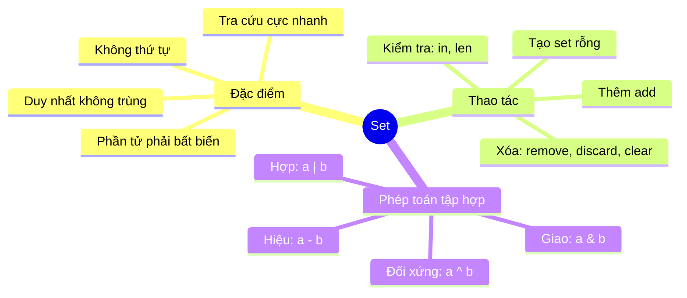
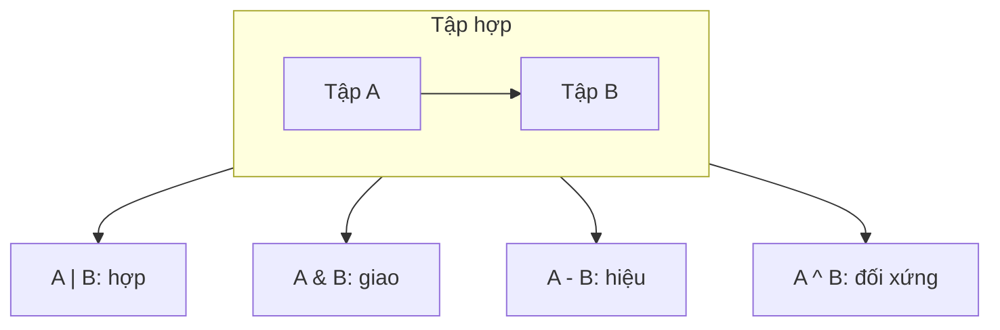

# Bài 16 — Set (Tập Hợp) Trong Python

> 🎓 **Chương 5 – Cấu trúc dữ liệu: List, Tuple, Set và Dictionary**

## 🧠 Điều kiện tiên quyết

- [Bài 14 — Danh Sách (List) Trong Python](../14-List/bai.md)

---

## 🎯 Mục tiêu

Sau bài học này, học viên sẽ:

* ✅ Hiểu **Set là gì** và ba đặc điểm cốt lõi: **duy nhất**, **không thứ tự**, **nhanh**.
* ✅ **Tạo** set bằng `{}` và hàm `set()`.
* ✅ Hiểu cơ chế **tự loại bỏ phần tử trùng lặp**.
* ✅ **Thêm** phần tử bằng `add()` và **xóa** bằng `remove()`, `discard()`, `clear()`.
* ✅ **Kiểm tra** phần tử bằng `in` và đếm bằng `len()`.
* ✅ Thực hiện **phép toán tập hợp**: `union |`, `intersection &`, `difference -`, `symmetric_difference ^`.
* ✅ Biết **khi nào dùng set** và so sánh set với list/tuple.

---

## 📖 Kiến thức

### 1. Set là gì?

> 💬 **Nói đơn giản:** Set giống **rổ đựng trái cây không được trùng loại** — mỗi loại chỉ được bỏ vào một quả, và cách nhận diện cực nhanh: muốn biết có quả táo không, chỉ cần liếc qua rổ, không phải soi từng quả.

**Ví dụ đời thực:** 🗂️ danh sách mã số sinh viên trong câu lạc bộ (không ai trùng mã), 📇 danh sách từ khóa trong bài viết, 👥 danh sách bạn bè trên mạng (mỗi người một lần).

```python
ma_sv = {"SV001", "SV002", "SV003"}   # mỗi mã chỉ có một
```

**Ba đặc điểm của set:**

| Đặc điểm | Giải thích |
|---|---|
| 🔷 **Duy nhất** | Mỗi phần tử chỉ xuất hiện **một lần** — tự động loại trùng |
| 🌀 **Không thứ tự** | Phần tử không có index — **không thể** `ds[0]` |
| ⚡ **Tra cứu nhanh** | Kiểm tra `in` cực nhanh kể cả set hàng triệu phần tử |



### 2. Tạo set

| Cách | Cú pháp | Ví dụ |
|---|---|---|
| Có sẵn dữ liệu | `{giá_trị, ...}` | `s = {1, 2, 3}` |
| Từ list/chuỗi | `set(dữ liệu)` | `set("hello")` → `{'h','e','l','o'}` |
| Set rỗng | `set()` | `s = set()` — ⚠️ không dùng `{}` |

```python
mon_hoc = {"Toan", "Van", "Anh"}    # tạo bằng ngoặc nhọn
so = set([1, 2, 2, 3])              # từ list → tự loại bỏ số 2 trùng
chu = set("hello")                  # từ chuỗi → {'e', 'h', 'l', 'o'}

rong = set()                        # ✅ set rỗng
# rong = {}                         # ❌ đây là DICTIONARY rỗng, không phải set!
```

> ⚠️ **Bẫy số 1:** `{}` tạo ra **dictionary rỗng**, không phải set! Muốn set rỗng phải viết `set()`.

> ⚠️ **Bẫy số 2:** set chỉ chứa phần tử **bất biến** — số, chuỗi, tuple được; **list và set khác** thì không (sẽ báo `TypeError: unhashable type`).

### 3. Tính duy nhất — tự loại trùng lặp ⭐

```python
so = [1, 2, 2, 3, 3, 3]
so_duy_nhat = set(so)
print(so_duy_nhat)        # {1, 2, 3} — các giá trị trùng bị "nuốt" gọn

danh_sach = ["An", "An", "Binh", "Chi", "Binh"]
ten_duy_nhat = set(danh_sach)
print(ten_duy_nhat)       # {'An', 'Binh', 'Chi'}
```

> 💡 **Ứng dụng chớp nhoáng:** muốn biết một danh sách có bao nhiêu giá trị *khác nhau*? Chỉ cần `len(set(danh_sach))` — một dòng thay cho cả vòng lặp đếm tay.

### 4. Thêm và xóa phần tử

| Phương thức | Công dụng | Ví dụ |
|---|---|---|
| `s.add(x)` | Thêm **1** phần tử | `s.add("cam")` |
| `s.update([...])` | Thêm **nhiều** phần tử | `s.update(["cam", "xoai"])` |
| `s.remove(x)` | Xóa phần tử — **lỗi** nếu không có | `s.remove("cam")` |
| `s.discard(x)` | Xóa phần tử — **không lỗi** nếu không có | `s.discard("cam")` |
| `s.clear()` | Xóa **toàn bộ** set | `s.clear()` |

```python
trai_cay = {"tao", "chuoi"}

trai_cay.add("cam")                 # → {"tao", "chuoi", "cam"}
trai_cay.add("cam")                 # thêm lần nữa — không đổi gì cả!
trai_cay.update(["xoai", "dua"])    # thêm nhiều phần tử

trai_cay.remove("cam")              # xóa được — có "cam" trong set
trai_cay.discard("sau rieng")       # không có → không báo lỗi, im lặng bỏ qua
# trai_cay.remove("sau rieng")      # ❌ nếu dùng remove → KeyError!
```

> 💡 **`remove` vs `discard`:** `discard` "bao dung" hơn — xóa không thấy cũng không phàn nàn. Dùng `remove` khi bạn **chắc chắn** phần tử tồn tại; dùng `discard` khi dữ liệu đến từ bên ngoài không chắc chắn.

### 5. Kiểm tra và đếm

```python
thanh_vien = {"An", "Binh", "Chi"}

print("An" in thanh_vien)      # True — kiểm tra cực nhanh
print("Dung" in thanh_vien)    # False
print(len(thanh_vien))         # 3
```

> ⚡ **Vì sao `in` với set nhanh?** Set được cài đặt bằng **bảng băm (hash table)** — mỗi phần tử có "địa chỉ" tính sẵn, máy tính đi thẳng tới địa chỉ đó thay vì rà soát từng phần tử như list.

### 6. Duyệt set

```python
mon = {"Toan", "Van", "Anh"}

for m in mon:               # duyệt được nhưng THỨ TỰ KHÔNG cố định!
    print(m)

# ⚠️ KHÔNG có m.index, m[0], m[::-1], sắp xếp vị trí... vì set không có thứ tự
```

> ⚠️ **Lưu ý:** thứ tự in ra **không đảm bảo** giống thứ tự bạn gõ — mỗi lần chạy có thể khác nhau. Muốn duyệt có thứ tự thì dùng `sorted(s)` (trả list) hoặc chuyển `list(s)`.

### 7. Phép toán tập hợp — sức mạnh thật sự 🎯

Nhớ lại toán học lớp 6: hợp, giao, hiệu, hiệu đối xứng — Python có **toán tử riêng** cho từng phép:

```python
lop_A = {"An", "Binh", "Chi"}
lop_B = {"Chi", "Dung", "Em"}

hop    = lop_A | lop_B          # HỢP: ai đó thuộc ít nhất một lớp
giao   = lop_A & lop_B          # GIAO: thuộc cả hai lớp
hieu   = lop_A - lop_B          # HIỆU: chỉ thuộc A, không thuộc B
doi_x  = lop_A ^ lop_B          # ĐỐI XỨNG: chỉ thuộc đúng một trong hai

print(hop)    # {'An', 'Binh', 'Chi', 'Dung', 'Em'}
print(giao)   # {'Chi'}
print(hieu)   # {'An', 'Binh'}
print(doi_x)  # {'An', 'Binh', 'Dung', 'Em'}
```

| Ký hiệu | Tên | Nghĩa (toán học) | Tương đương phương thức |
|---|---|---|---|
| `a \| b` | Hợp (union) | mọi phần tử của cả hai | `a.union(b)` |
| `a & b` | Giao (intersection) | phần tử **chung** | `a.intersection(b)` |
| `a - b` | Hiệu (difference) | phần tử của a **trừ** phần trong b | `a.difference(b)` |
| `a ^ b` | Hiệu đối xứng (symmetric difference) | phần tử chỉ thuộc **một** trong hai | `a.symmetric_difference(b)` |



> 💡 **Có phải con trỏ `|` là "hoặc" trong điều kiện?** Không! Trong điều kiện `or` là chữ; dấu `|` **giữa hai set** nghĩa là phép hợp. Python thông minh phân biệt theo kiểu dữ liệu.

### 8. Set vs List vs Tuple — khi nào dùng gì?

| Tiêu chí | 📋 List | 🔗 Tuple | 🎲 Set |
|---|---|---|---|
| Thứ tự | ✅ Có | ✅ Có | ❌ Không |
| Trùng lặp | ✅ Cho phép | ✅ Cho phép | ❌ **Không** |
| Thay đổi được | ✅ | ❌ | ✅ |
| Truy cập theo index | ✅ `ds[0]` | ✅ `tp[0]` | ❌ |
| Tra cứu `in` | Chậm (duyệt) | Chậm (duyệt) | ⚡ Rất nhanh |
| Phần tử | Mọi kiểu | Mọi kiểu | Chỉ **bất biến** |
| Dùng khi | Cần thứ tự + thay đổi | Cố định, bảo vệ | Cần **duy nhất** + tra cứu nhanh + toán tập hợp |

**Tóm gọn:**
* Cần **thứ tự và sửa đổi** → **list**
* Dữ liệu **cố định không đổi** → **tuple**
* Cần **loại trùng, tìm nhanh, so sánh tập hợp** → **set**

---

## 💡 Ví dụ minh họa

### Ví dụ 1: Lọc phần tử trùng lặp

```python
# Danh sách môn đăng ký của cả khối — có học sinh đăng trùng
dang_ky = ["Toan", "Ly", "Toan", "Hoa", "Ly", "Anh"]

# set tự động loại bỏ trùng
mon_duy_nhat = set(dang_ky)

print("So luot dang ky:", len(dang_ky))          # 6
print("So mon khac nhau:", len(mon_duy_nhat))    # 4
print("Cac mon:", mon_duy_nhat)
```

| Dòng code | Ý nghĩa |
|---|---|
| `set(dang_ky)` | Chuyển list sang set — tự nén các giá trị trùng |
| `len(dang_ky)` | Số lượt đăng ký ban đầu |
| `len(mon_duy_nhat)` | Số môn học **khác nhau** thực tế |

### Ví dụ 2: Thêm và xóa với remove/discard

```python
# Set thành viên câu lạc bộ
thanh_vien = {"An", "Binh", "Chi"}

thanh_vien.add("Dung")        # thêm thành viên mới
thanh_vien.discard("An")      # An rời CLB — discard an toàn
thanh_vien.discard("Xuan")    # không có Xuan — không sao cả
print(thanh_vien)             # {'Binh', 'Chi', 'Dung'}
```

### Ví dụ 3: Kiểm tra môn đã đăng ký

```python
da_dang_ky = {"Toan", "Anh"}

mon_moi = "Ly"
if mon_moi in da_dang_ky:      # kiểm tra nhanh bằng in
    print("Da dang ky roi!")
else:
    da_dang_ky.add(mon_moi)
    print("Da them mon", mon_moi)
```

---

## 🔬 Ví dụ nâng cao

### Ví dụ 1: Lọc phần tử trùng lặp từ danh sách mua sắm 🛒

```python
# Giỏ hàng ghi nhầm nhiều lần
gio = ["sua", "banh", "sua", "trung", "banh", "gao"]

# Danh sách món cần mua — mỗi món một lần
can_mua = list(set(gio))
print("Can mua:", can_mua)
```

### Ví dụ 2: Học sinh giỏi cả hai môn 🏆

```python
# Học sinh giỏi từng môn (dữ liệu trùng nên dùng set là hợp lý)
gioi_toan = {"An", "Binh", "Chi", "Dung"}
gioi_van = {"Binh", "Dung", "Em", "Phuc"}

# Học sinh giỏi CẢ Toán lẫn Văn → GIAO của hai tập hợp
gioi_ca_hai = gioi_toan & gioi_van
print("Gioi ca hai mon:", gioi_ca_hai)

# Học sinh giỏi ít nhất MỘT môn → HỢP
gioi_it_nhat_mot = gioi_toan | gioi_van
print("So hoc sinh gioi it nhat 1 mon:", len(gioi_it_nhat_mot))

# Học sinh CHỈ giỏi Toán → HIỆU
chi_gioi_toan = gioi_toan - gioi_van
print("Chi gioi toan:", chi_gioi_toan)
```

Kết quả:

```
Gioi ca hai mon: {'Binh', 'Dung'}
So hoc sinh gioi it nhat 1 mon: 6
Chi gioi toan: {'An', 'Chi'}
```

### Ví dụ 3: Bạn bè chung của hai người 👥

```python
# Bạn của An và bạn của Binh (set — không trùng ai)
ban_an = {"Binh", "Chi", "Dung", "Em"}
ban_binh = {"An", "Chi", "Em", "Phuc"}

# Bạn CHUNG của cả hai → GIAO
ban_chung = ban_an & ban_binh
print("Ban chung:", ban_chung)

# Bạn chỉ quen đúng một trong hai → HIỆU ĐỐI XỨNG
ban_rieng = ban_an ^ ban_binh
print("Ban rieng (cua mot nguoi):", ban_rieng)
```

Kết quả:

```
Ban chung: {'Chi', 'Em'}
Ban rieng (cua mot nguoi): {'An', 'Binh', 'Dung', 'Phuc'}
```

### Ví dụ 4: Kiểm tra tài khoản trùng trong cuộc thi ⚠️

```python
# Danh sách tài khoản dự thi ghi từ 2 nguồn — có thể trùng
nguon_1 = ["user01", "user02", "user03"]
nguon_2 = ["user02", "user04"]

# Gộp và loại trùng bằng set
hop = set(nguon_1) | set(nguon_2)
print("Tong tai khoan duy nhat:", len(hop))

# Tìm tài khoản bị ghi trùng → GIAO
trung = set(nguon_1) & set(nguon_2)
print("Tai khoan trung:", trung)
```

---

## ⚠️ Lỗi thường gặp

### Lỗi 1: Dùng `{}` khi muốn set rỗng

```python
s = {}          # ❌ SAI — đây là dictionary rỗng!
s = set()       # ✅ ĐÚNG — set rỗng
```

* **Nguyên nhân:** `{}` đã được dành riêng cho dictionary (bài 17).
* **Cách kiểm tra:** `type(s)` — `<class 'set'>` mới là đúng.

### Lỗi 2: Đưa list vào set — TypeError

```python
s = {[1, 2], [3, 4]}   # ❌ SAI — TypeError: unhashable type: 'list'
```

* **Nguyên nhân:** set chỉ chứa phần tử **bất biến** (hashable); list thay đổi được nên không tính được "địa chỉ".
* **Cách sửa:** thay bằng tuple: `s = {(1, 2), (3, 4)}`.

### Lỗi 3: `remove` phần tử không tồn tại — KeyError

```python
s = {"tao", "cam"}
s.remove("xoai")   # ❌ SAI — KeyError: 'xoai'
```

* **Cách sửa:** dùng `discard("xoai")` (không lỗi) hoặc kiểm tra `if "xoai" in s:` trước.

### Lỗi 4: Tưởng truy cập theo index được

```python
s = {1, 2, 3}
print(s[0])   # ❌ SAI — TypeError: 'set' object is not subscriptable
```

* **Nguyên nhân:** set **không có thứ tự** nên không có index.
* **Cách sửa:** dùng `in` để kiểm tra, `for x in s:` để duyệt, hoặc `list(s)[0]` nếu thật sự cần vị trí.

### Lỗi 5: Giữ nguyên thứ tự sau khi tạo từ list

```python
ds = ["a", "b", "c"]
s = set(ds)
print(list(s))   # ⚠️ CÓ THỂ ra ['a', 'c', 'b'] — thứ tự không đảm bảo!
```

* **Nguyên nhân:** set không ghi nhớ thứ tự — đừng dựa vào thứ tự của set.

---

## 💎 Mẹo

* ⭐ **Loại trùng một dòng:** `set(danh_sach)` — nhanh hơn và ngắn hơn mọi vòng lặp tự viết.
* ⚡ **`in` với set cực nhanh:** kiểm tra thành viên với dữ liệu lớn nên dùng set thay list.
* 🧮 **Toán tập hợp thay vòng lặp:** `|`, `&`, `-`, `^` biến cả đoạn so sánh dài thành một biểu thức.
* 🛡️ **`discard` khi dữ liệu không chắc chắn** — đỡ phải viết `if` kiểm tra trước.
* 🔒 **Phần tử phải bất biến:** dùng tuple thay list nếu cần đưa nhiều giá trị vào set.
* 🔍 **Đếm giá trị khác nhau:** `len(set(ds))` — bài toán đếm phân biệt giải trong một dòng.
* 📦 **Muốn thứ tự khi in set:** dùng `sorted(s)`.

---

## 📝 Tóm tắt

| Thao tác | Cú pháp | Ghi chú |
|---|---|---|
| Tạo | `{1, 2, 3}` hoặc `set(list)` | `set()` cho set rỗng |
| Thêm 1 phần tử | `s.add(x)` | Thêm trùng → không đổi |
| Thêm nhiều | `s.update([...])` | |
| Xóa (có lỗi) | `s.remove(x)` | `KeyError` nếu không có |
| Xóa (an toàn) | `s.discard(x)` | Không lỗi khi thiếu |
| Xóa sạch | `s.clear()` | |
| Kiểm tra | `x in s` | ⚡ Rất nhanh |
| Số lượng | `len(s)` | |
| Hợp | `a \| b` | Mọi phần tử của cả hai |
| Giao | `a & b` | Phần tử chung |
| Hiệu | `a - b` | Phần của a trừ phần trong b |
| Đối xứng | `a ^ b` | Chỉ thuộc đúng một tập |

---

## 🧪 Kiểm tra nhanh

1. ❓ Ba đặc điểm chính của set là gì?
2. ❓ `{}` và `set()` khác nhau thế nào?
3. ❓ `set([1, 2, 2, 3])` cho kết quả gì? Vì sao?
4. ❓ `remove` và `discard` khác nhau ra sao?
5. ❓ Vì sao không thể dùng `s[0]` với set?
6. ❓ `a = {1, 2, 3}`, `b = {2, 3, 4}` — kết quả `a & b`, `a - b`, `a | b` là gì?
7. ❓ Viết lệnh kiểm tra `5` có trong set `s` không.
8. ❓ Khi nào nên dùng set thay vì list?
9. ❓ Đưa list vào set bị lỗi gì? Cách sửa?
10. ❓ `len(set("hello"))` bằng bao nhiêu?

<details>
<summary>🔍 Xem đáp án</summary>

1. **Duy nhất** (không trùng), **không thứ tự**, **tra cứu nhanh**.
2. `{}` là **dictionary rỗng**; `set()` mới là **set rỗng**.
3. `{1, 2, 3}` — set tự động loại bỏ phần tử trùng lặp.
4. `remove` báo `KeyError` khi phần tử không tồn tại; `discard` im lặng bỏ qua.
5. Vì set **không có thứ tự** — không có khái niệm vị trí/index.
6. `a & b` = `{2, 3}`; `a - b` = `{1}`; `a | b` = `{1, 2, 3, 4}`.
7. `5 in s`.
8. Khi cần loại trùng, tra cứu nhanh, hoặc thực hiện phép toán tập hợp (giao/hợp/hiệu).
9. `TypeError: unhashable type: 'list'` — set chỉ nhận phần tử bất biến; sửa bằng tuple.
10. 4 — chữ `l` trùng bị loại bỏ (`{'h','e','l','o'}`).

</details>

---

## 📚 Bài đọc thêm

* [Python.org – Data Structures: sets](https://docs.python.org/3/tutorial/datastructures.html#sets)
* [W3Schools – Python Sets](https://www.w3schools.com/python/python_sets.asp)
* [Python.org – Set types (set, frozenset)](https://docs.python.org/3/library/stdtypes.html#set-types-set-frozenset)
* [Real Python – Sets in Python](https://realpython.com/python-sets/)

---

---

## 🧩 Bài tập

> 📝 🎯 **Chủ đề:** Tạo set, tính duy nhất, add/remove/discard/clear, membership `in`, phép toán tập hợp và khi nào dùng set.

## 🟢 Dễ (Bài 1 – 7)

### Bài 1: Tạo set đầu tiên

* **Đề bài:** Tạo set `trai_cay = {"tao", "chuoi", "cam"}` và in ra `len()` của nó.
* **Input:** Không có.
* **Output:**
  ```
  3
  ```
* **Gợi ý:** `len(set)` đếm số phần tử.

### Bài 2: Kiểm tra phần tử

* **Đề bài:** Cho `mon = {"Toan", "Van", "Anh"}`. Kiểm tra `"Toan"` và `"Ly"` có trong set không, in hai kết quả.
* **Input:** Không có.
* **Output:**
  ```
  True
  False
  ```
* **Gợi ý:** Dùng toán tử `in`.

### Bài 3: Loại phần tử trùng

* **Đề bài:** Cho list `ds = [1, 2, 2, 3, 3, 3, 4]`. Chuyển sang set để loại trùng rồi in ra set và số phần tử duy nhất.
* **Input:** Không có.
* **Output:**
  ```
  {1, 2, 3, 4}
  4
  ```
* **Gợi ý:** `set(ds)` và `len(set(ds))`.

### Bài 4: Thêm phần tử

* **Đề bài:** Tạo set rỗng `thanh_vien = set()`. Thêm lần lượt `"An"`, `"Binh"`, `"An"` bằng `add`. In ra set và số thành viên.
* **Input:** Không có.
* **Output:**
  ```
  {'An', 'Binh'}
  2
  ```
* **Gợi ý:** Thêm `"An"` lần 2 không làm tăng số phần tử.

### Bài 5: Thêm nhiều phần tử

* **Đề bài:** Cho `s = {1, 2}`. Dùng `update([3, 4])` để thêm hai số nữa rồi in ra set.
* **Input:** Không có.
* **Output:**
  ```
  {1, 2, 3, 4}
  ```
* **Gợi ý:** `s.update([3, 4])`.

### Bài 6: Xóa với discard

* **Đề bài:** Cho `s = {"An", "Binh", "Chi"}`. Xóa `"Binh"` bằng `discard`, rồi `discard("Dung")` (không có — thử xem có lỗi không). In set kết quả.
* **Input:** Không có.
* **Output:**
  ```
  {'An', 'Chi'}
  ```
* **Gợi ý:** `discard` không báo lỗi khi phần tử không tồn tại.

### Bài 7: Hợp hai set

* **Đề bài:** Cho `a = {1, 2}` và `b = {2, 3}`. In ra phép hợp `a | b` và số phần tử của nó.
* **Input:** Không có.
* **Output:**
  ```
  {1, 2, 3}
  3
  ```
* **Gợi ý:** Dùng toán tử `|`.

---

## 🟡 Trung bình (Bài 8 – 14)

### Bài 8: Giao, hiệu, đối xứng

* **Đề bài:** Cho `a = {1, 2, 3, 4}` và `b = {3, 4, 5, 6}`. In ra lần lượt: `a & b`, `a - b`, `a ^ b`.
* **Input:** Không có.
* **Output:**
  ```
  {3, 4}
  {1, 2}
  {1, 2, 5, 6}
  ```
* **Gợi ý:** Nhớ `&` là giao, `-` là hiệu, `^` là đối xứng.

### Bài 9: Đếm ký tự khác nhau

* **Đề bài:** Cho chuỗi `cau = "abracadabra"`. Đếm và in ra số ký tự **khác nhau** xuất hiện trong chuỗi.
* **Input:** Không có.
* **Output:**
  ```
  5
  ```
* **Gợi ý:** `set(cau)` tách từng ký tự và loại trùng; đếm bằng `len`.

### Bài 10: So sánh remove và discard

* **Đề bài:** Cho `s = {"An", "Binh"}`. Viết chương trình dùng `try...except` để gọi `s.remove("Dung")` và bắt lỗi, sau đó dùng `s.discard("Dung")` và in thông báo kiểu lỗi. In ra set cuối cùng.
* **Input:** Không có.
* **Output:**
  ```
  Loi: KeyError
  Duoc discrim bo qua 'Dung'
  {'An', 'Binh'}
  ```
* **Gợi ý:** `remove` ném `KeyError`; bắt bằng `except KeyError`. `discard` không ném lỗi.

### Bài 11: Lọc tên trùng trong danh sách đăng ký

* **Đề bài:** Danh sách đăng ký dự thi lớp 10: `["An", "Binh", "An", "Chi", "Dung", "Chi"]`. Tạo set từ danh sách rồi in ra các tên duy nhất (mỗi tên một lần) và số thí sinh duy nhất.
* **Input:** Không có.
* **Output:**
  ```
  {'An', 'Binh', 'Chi', 'Dung'}
  4
  ```
* **Gợi ý:** `set(danh_sach)` rồi `sorted()` nếu muốn in có thứ tự (tùy chọn).

### Bài 12: Kiểm tra môn đã đăng ký

* **Đề bài:** Cho `da_dang_ky = {"Toan", "Anh"}`. Kiểm tra nếu `"Van"` chưa đăng ký thì thêm vào; nếu `"Toan"` đã đăng ký thì in `"Da co"`. In set cuối cùng.
* **Input:** Không có.
* **Output:**
  ```
  Da co
  {'Toan', 'Anh', 'Van'}
  ```
* **Gợi ý:** `x in set` để kiểm tra, `add` để thêm.

### Bài 13: Học sinh giỏi cả hai môn

* **Đề bài:** Cho `gioi_toan = {"An", "Binh", "Chi"}` và `gioi_van = {"Binh", "Chi", "Dung"}`. In ra học sinh giỏi **cả hai môn** và học sinh giỏi **ít nhất một môn**.
* **Input:** Không có.
* **Output:**
  ```
  Gioi ca hai: {'Binh', 'Chi'}
  Gioi it nhat 1 mon: {'An', 'Binh', 'Chi', 'Dung'}
  ```
* **Gợi ý:** Giao `&` và hợp `|`.

### Bài 14: Bạn chung của hai người

* **Đề bài:** Cho `ban_an = {"Binh", "Chi", "Dung"}` và `ban_binh = {"An", "Chi", "Dung", "Em"}`. In ra bạn chung và số bạn **chỉ quen đúng một người** trong hai người.
* **Input:** Không có.
* **Output:**
  ```
  Ban chung: {'Chi', 'Dung'}
  Ban chi quen 1 nguoi: 3
  ```
* **Gợi ý:** Giao `&`; đối xứng `^` rồi `len`.

---

## 🔴 Khó (Bài 15 – 20)

### Bài 15: Kiểm tra tập con

* **Đề bài:** Cho `lop_10A = {"An", "Binh", "Chi"}` và `toan_truong = {"An", "Binh", "Chi", "Dung", "Em"}`. Viết chương trình kiểm tra xem `lop_10A` có phải là **tập con** của `toan_truong` không và in `True`.
* **Input:** Không có.
* **Output:**
  ```
  True
  ```
* **Gợi ý:** Dùng phương thức `issubset()` — tìm hiểu thêm từ bài giảng/đọc thêm.

### Bài 16: Từ khóa xuất hiện trong cả hai bài viết

* **Đề bài:** Hai bài viết (dạng chuỗi) có nội dung:
  * `bai_1 = "python lap trinh la de hoc va dong dao"`
  * `bai_2 = "python dung de phan tich du lieu dong dao"`
  Tách thành set các từ, rồi in ra các **từ khóa chung** của hai bài và **số từ khóa duy nhất** toàn bộ.
* **Input:** Không có.
* **Output:**
  ```
  Tu chung: {'python', 'de', 'dong', 'dao'}
  Tong tu duy nhat: 14
  ```
* **Gợi ý:** `cau.split()` → `set(...)`; giao `&` cho từ chung; hợp `|` rồi `len` cho tổng duy nhất.

### Bài 17: Tìm phần tử lạc (xuất hiện một lần)

* **Đề bài:** Cho list `so = [1, 2, 3, 4, 2, 3, 4]` — mọi số đều xuất hiện đúng 2 lần **ngoại trừ một số** xuất hiện 1 lần. Viết chương trình in ra "số lạc" đó.
* **Input:** Không có.
* **Output:**
  ```
  1
  ```
* **Gợi ý:** Dùng set duy nhất đi với `count`: với mỗi phần tử trong `set(so)`, kiểm tra `so.count(x) == 1`.

### Bài 18: Hiệu chỉnh danh sách trùng

* **Đề bài:** Có 2 danh sách mã sản phẩm: `a = ["SP1", "SP2", "SP3"]` và `b = ["SP2", "SP4", "SP5"]`. Sản phẩm trùng giữa hai list phải bị **loại khỏi danh sách a** (chỉ còn ở một chỗ). Tính và in ra: mã trùng, mã chỉ có trong `a` sau khi loại trùng.
* **Input:** Không có.
* **Output:**
  ```
  Ma trung: {'SP2'}
  Con lai trong a: {'SP1', 'SP3'}
  ```
* **Gợi ý:** Giao `&` tìm trùng; hiệu `-` để biết mã chỉ thuộc a.

### Bài 19: Hệ thống quét thẻ sinh viên

* **Đề bài:** Khi điểm danh, mỗi sinh viên có thể bị quét thẻ **nhiều lần**. Viết chương trình từ một list thẻ `the = ["SV1", "SV2", "SV1", "SV3", "SV2", "SV4"]`, in ra danh sách sinh viên **có mặt** (mỗi người một lần, sắp xếp theo mã) và **số sinh viên có mặt**.
* **Input:** Không có.
* **Output:**
  ```
  Co mat: ['SV1', 'SV2', 'SV3', 'SV4']
  So luong: 4
  ```
* **Gợi ý:** `set(the)` loại trùng rồi `sorted()` cho thứ tự.

### Bài 20: Bầu chọn ứng viên đa năng

* **Đề bài:** Mỗi ứng viên được chấm điểm theo các **kỹ năng**. Cho:
  * `an_ky_nang = {"python", "thuyet_trinh", "phan_tich"}`
  * `binh_ky_nang = {"python", "thiet_ke", "thuyet_trinh"}`
  * `chi_ky_nang = {"python", "quan_ly", "marketing"}`
  Viết chương trình in ra: kỹ năng chung của cả ba người; kỹ năng chỉ An có (không ai khác có); tổng kỹ năng duy nhất của cả nhóm.
* **Input:** Không có.
* **Output:**
  ```
  Ky nang chung: {'python'}
  Chi An co: {'phan_tich'}
  Tong ky nang duy nhat: 6
  ```
* **Gợi ý:** Giao **nhiều** set bằng `a & b & c`; hiệu `an - binh - chi`; hợp `a | b | c` rồi `len`.

---

## 🎯 Tổng kết sau khi làm bài

Sau 20 bài tập, bạn đã:

* ✅ Tạo set, loại trùng và thao tác thêm/xóa thành thạo.
* ✅ Kiểm tra phần tử nhanh bằng `in`.
* ✅ Vận dụng 4 phép toán tập hợp vào bài toán thực tế.

---

## ✅ Đáp án

> 💡 **Hãy tự làm bài tập trước** rồi mới mở đáp án.

## 🟢 Dễ (Bài 1 – 7)


<details>
<summary>✅ Bài 1: Tạo set đầu tiên</summary>


**Phân tích:** Tạo set 3 phần tử và đếm số phần tử.

**Ý tưởng:** `len()` đếm phần tử của set như của list/tuple.

**Thuật toán:**
1. Tạo set `trai_cay`.
2. In `len(trai_cay)`.

**Code:**

```python
# Set 3 loại trái cây
trai_cay = {"tao", "chuoi", "cam"}
# Số phần tử trong set
print(len(trai_cay))
```

**Giải thích code:**
* `{"tao", "chuoi", "cam"}` — set tạo bằng ngoặc nhọn.
* `len(trai_cay)` → 3.
* Lưu ý: dấu `{}` khi chứa dữ liệu tạo **set**, nhưng `{}` rỗng là dictionary.

**Độ phức tạp:** O(1).

---

</details>

<details>
<summary>✅ Bài 2: Kiểm tra phần tử</summary>


**Phân tích:** Kiểm tra sự tồn tại của hai giá trị.

**Ý tưởng:** Toán tử `in` trả `True`/`False` — với set hoạt động **rất nhanh**.

**Thuật toán:**
1. Tạo set `mon`.
2. In `"Toan" in mon`.
3. In `"Ly" in mon`.

**Code:**

```python
# Set các môn học
mon = {"Toan", "Van", "Anh"}
# "Toan" có trong set không?
print("Toan" in mon)
# "Ly" có trong set không?
print("Ly" in mon)
```

**Giải thích code:**
* `"Toan" in mon` → `True`.
* `"Ly" in mon` → `False`.
* Khác list (phải duyệt từng phần), set dùng bảng băm nên kiểm tra gần như tức thời.

**Độ phức tạp:** O(1) trung bình.

---

</details>

<details>
<summary>✅ Bài 3: Loại phần tử trùng</summary>


**Phân tích:** Cần "nén" các giá trị trùng trong list thành set duy nhất.

**Ý tưởng:** `set(ds)` tự động loại bỏ trùng — tính duy nhất là đặc tính của set.

**Thuật toán:**
1. Tạo list `ds` có trùng.
2. `s = set(ds)`.
3. In set và số phần tử.

**Code:**

```python
# List có nhiều giá trị trùng
ds = [1, 2, 2, 3, 3, 3, 4]
# Chuyển sang set — tự loại bỏ phần tử trùng
s = set(ds)
# In set và số phần tử duy nhất
print(s)
print(len(s))
```

**Giải thích code:**
* `set(ds)` → `{1, 2, 3, 4}` — các số 2, 3 trùng bị "nuốt" gọn.
* `len(s)` → 4.
* Đây là cách ngắn nhất để đếm giá trị khác nhau trong danh sách.

**Độ phức tạp:** O(n) — duyệt toàn list để dựng set.

---

</details>

<details>
<summary>✅ Bài 4: Thêm phần tử</summary>


**Phân tích:** Set rỗng được thêm dần; phần tử trùng không làm tăng kích thước.

**Ý tưởng:** `set()` tạo set rỗng (không phải `{}`); `add` thêm một phần tử.

**Thuật toán:**
1. Tạo `thanh_vien = set()`.
2. `add("An")`, `add("Binh")`, `add("An")`.
3. In set và `len`.

**Code:**

```python
# Set rỗng — bắt buộc dùng set(), không dùng {}
thanh_vien = set()
# Thêm từng thành viên
thanh_vien.add("An")
thanh_vien.add("Binh")
# Thêm "An" lần nữa — không làm tăng phần tử vì đã có
thanh_vien.add("An")
# In kết quả
print(thanh_vien)
print(len(thanh_vien))
```

**Giải thích code:**
* `set()` — cách duy nhất để tạo set rỗng.
* `add("An")` lần hai không đổi gì — tính duy nhất của set.
* Kết quả `{'An', 'Binh'}` với số lượng 2.

**Độ phức tạp:** O(1) mỗi lần `add`.

---

</details>

<details>
<summary>✅ Bài 5: Thêm nhiều phần tử</summary>


**Phân tích:** Thêm cả một nhóm phần tử vào set trong một lần.

**Ý tưởng:** `update([...])` nhận một dãy (list/tuple/chuỗi) và thêm từng phần tử.

**Thuật toán:**
1. Tạo set `s = {1, 2}`.
2. `s.update([3, 4])`.
3. In set.

**Code:**

```python
# Set ban đầu
s = {1, 2}
# Thêm nhiều phần tử cùng lúc bằng update
s.update([3, 4])
# In kết quả
print(s)
```

**Giải thích code:**
* `update([3, 4])` — thêm cả 3 và 4 vào set.
* Nếu thêm trùng, tự động bỏ qua.
* `add` chỉ thêm **một** phần tử; `update` thêm **nhiều**.

**Độ phức tạp:** O(k) với k là số phần tử thêm.

---

</details>

<details>
<summary>✅ Bài 6: Xóa với discard</summary>


**Phân tích:** Xóa phần tử có thể **không tồn tại** mà không sợ lỗi.

**Ý tưởng:** `discard` im lặng bỏ qua khi phần tử không có — an toàn hơn `remove`.

**Thuật toán:**
1. Tạo set `s`.
2. `s.discard("Binh")`.
3. `s.discard("Dung")` — không có, không lỗi.
4. In set.

**Code:**

```python
# Set thành viên
s = {"An", "Binh", "Chi"}
# Xóa "Binh" — có trong set nên xóa được
s.discard("Binh")
# Xóa "Dung" — KHÔNG có trong set, discard im lặng bỏ qua
s.discard("Dung")
# In kết quả — chương trình chạy bình thường
print(s)
```

**Giải thích code:**
* `discard` không báo lỗi dù phần tử vắng mặt.
* Nếu dùng `remove("Dung")` ở vị trí này sẽ báo `KeyError`.
* Kết quả: `{'An', 'Chi'}`.

**Độ phức tạp:** O(1) trung bình.

---

</details>

<details>
<summary>✅ Bài 7: Hợp hai set</summary>


**Phân tích:** Phép hợp gom mọi phần tử của cả hai set.

**Ý tưởng:** Toán tử `|` — mỗi phần tử chỉ xuất hiện một lần.

**Thuật toán:**
1. Tạo hai set `a`, `b`.
2. `hop = a | b`.
3. In set và `len`.

**Code:**

```python
# Hai tập hợp
a = {1, 2}
b = {2, 3}
# Phép hợp — gom mọi phần tử, không trùng
hop = a | b
# In kết quả và số phần tử
print(hop)
print(len(hop))
```

**Giải thích code:**
* `a | b` → `{1, 2, 3}` — số 2 chung chỉ xuất hiện một lần.
* `len(hop)` → 3.
* Tương đương `a.union(b)`.

**Độ phức tạp:** O(n + m).

---

</details>

## 🟡 Trung bình (Bài 8 – 14)


<details>
<summary>✅ Bài 8: Giao, hiệu, đối xứng</summary>


**Phân tích:** Thực hiện ba phép toán tập hợp trên hai set.

**Ý tưởng:** `&` giao, `-` hiệu, `^` đối xứng — kết quả là set mới.

**Thuật toán:**
1. Tạo `a`, `b`.
2. In `a & b`, `a - b`, `a ^ b`.

**Code:**

```python
# Hai tập hợp
a = {1, 2, 3, 4}
b = {3, 4, 5, 6}
# Giao: phần tử chung
print(a & b)
# Hiệu: phần tử của a nhưng không thuộc b
print(a - b)
# Hiệu đối xứng: chỉ thuộc đúng một trong hai
print(a ^ b)
```

**Giải thích code:**
* `a & b` → `{3, 4}` (chung).
* `a - b` → `{1, 2}` (chỉ của a).
* `a ^ b` → `{1, 2, 5, 6}` (mỗi phần tử chỉ thuộc một set).

**Độ phức tạp:** O(n + m) mỗi phép.

---

</details>

<details>
<summary>✅ Bài 9: Đếm ký tự khác nhau</summary>


**Phân tích:** Chuỗi có ký tự lặp; cần đếm loại ký tự khác nhau.

**Ý tưởng:** `set(chuỗi)` tách chuỗi thành set **từng ký tự** và loại trùng.

**Thuật toán:**
1. Khởi tạo chuỗi.
2. `s = set(cau)`.
3. In `len(s)`.

**Code:**

```python
# Chuỗi cần đếm ký tự
cau = "abracadabra"
# set(chuỗi) tách thành các ký tự và loại trùng
s = set(cau)
# Số ký tự khác nhau
print(len(s))
```

**Giải thích code:**
* `set("abracadabra")` → `{'a', 'b', 'c', 'd', 'r'}`.
* `len(s)` → 5.
* Cách đếm ký tự phân biệt ngắn gọn nhất trong Python.

**Độ phức tạp:** O(n) với n là độ dài chuỗi.

---

</details>

<details>
<summary>✅ Bài 10: So sánh remove và discard</summary>


**Phân tích:** Cần chứng minh `remove` báo `KeyError`, `discard` thì không.

**Ý tưởng:** Bắt lỗi bằng `try...except KeyError` rồi chuyển sang `discard`.

**Thuật toán:**
1. Tạo set `s`.
2. `try: s.remove("Dung")` → `except KeyError: in thông báo`.
3. `s.discard("Dung")` → in thông báo.
4. In set.

**Code:**

```python
# Set thành viên
s = {"An", "Binh"}
# remove sẽ ném KeyError vì "Dung" không tồn tại
try:
    s.remove("Dung")
except KeyError:
    # Bắt lỗi và in tên loại lỗi
    print("Loi: KeyError")
# discard không ném lỗi — im lặng bỏ qua
s.discard("Dung")
print("Duoc discard bo qua 'Dung'")
# In set cuối cùng — không đổi
print(s)
```

**Giải thích code:**
* `s.remove("Dung")` — phần tử vắng mặt → Python ném `KeyError`.
* `except KeyError` — bắt đúng lỗi, chương trình không dừng.
* `s.discard("Dung")` — không lỗi, set giữ nguyên `{'An', 'Binh'}`.

**Độ phức tạp:** O(1) trung bình.

---

</details>

<details>
<summary>✅ Bài 11: Lọc tên trùng trong danh sách đăng ký</summary>


**Phân tích:** Danh sách thí sinh bị ghi trùng; cần danh sách tên duy nhất.

**Ý tưởng:** `set(danh_sach)` loại trùng; `sorted()` để in có thứ tự dễ đọc.

**Thuật toán:**
1. Khởi tạo list.
2. `s = set(danh_sach)`.
3. In set và `len`.

**Code:**

```python
# Danh sách đăng ký — có tên trùng
danh_sach = ["An", "Binh", "An", "Chi", "Dung", "Chi"]
# Loại trùng bằng set
s = set(danh_sach)
# In set và số thí sinh duy nhất
print(s)
print(len(s))
```

**Giải thích code:**
* `set(danh_sach)` → `{'An', 'Binh', 'Chi', 'Dung'}`.
* `len(s)` → 4 (thay vì 6 lượt đăng ký).
* Muốn in có thứ tự, dùng `sorted(s)`.

**Độ phức tạp:** O(n).

---

</details>

<details>
<summary>✅ Bài 12: Kiểm tra môn đã đăng ký</summary>


**Phân tích:** Vừa kiểm tra vừa thêm môn chưa có vào set.

**Ý tưởng:** `in` để kiểm tra; `add` để thêm — kết hợp thành quy tắc "thêm nếu chưa có".

**Thuật toán:**
1. Tạo set `da_dang_ky`.
2. Nếu `"Van" not in da_dang_ky`: thêm.
3. Nếu `"Toan" in da_dang_ky`: in `"Da co"`.
4. In set.

**Code:**

```python
# Các môn đã đăng ký
da_dang_ky = {"Toan", "Anh"}
# "Van" chưa có → thêm vào
if "Van" not in da_dang_ky:
    da_dang_ky.add("Van")
# "Toan" đã có → thông báo
if "Toan" in da_dang_ky:
    print("Da co")
# In set cuối cùng
print(da_dang_ky)
```

**Giải thích code:**
* `"Van" not in da_dang_ky` → `True` nên `add("Van")`.
* `"Toan" in da_dang_ky` → `True` nên in `Da co`.
* Kết quả set: `{'Toan', 'Anh', 'Van'}`.

**Độ phức tạp:** O(1) trung bình.

---

</details>

<details>
<summary>✅ Bài 13: Học sinh giỏi cả hai môn</summary>


**Phân tích:** Tìm học sinh giỏi cả hai môn (giao) và giỏi ít nhất một môn (hợp).

**Ý tưởng:** `&` và `|`.

**Thuật toán:**
1. Tạo hai set.
2. `ca_hai = gioi_toan & gioi_van`.
3. `it_nhat_mot = gioi_toan | gioi_van`.
4. In kết quả.

**Code:**

```python
# Học sinh giỏi từng môn
gioi_toan = {"An", "Binh", "Chi"}
gioi_van = {"Binh", "Chi", "Dung"}
# Giỏi CẢ HAI môn → giao
gioi_ca_hai = gioi_toan & gioi_van
print("Gioi ca hai:", gioi_ca_hai)
# Giỏi ÍT NHẤT MỘT môn → hợp
gioi_it_nhat_mot = gioi_toan | gioi_van
print("Gioi it nhat 1 mon:", gioi_it_nhat_mot)
```

**Giải thích code:**
* Giao → `{'Binh', 'Chi'}`.
* Hợp → `{'An', 'Binh', 'Chi', 'Dung'}`.
* Không cần vòng lặp nào — sức mạnh của phép toán tập hợp.

**Độ phức tạp:** O(n + m).

---

</details>

<details>
<summary>✅ Bài 14: Bạn chung của hai người</summary>


**Phân tích:** Tìm bạn chung và đếm bạn "riêng" (chỉ quen một người).

**Ý tưởng:** Giao `&` cho bạn chung; hiệu đối xứng `^` cho bạn riêng.

**Thuật toán:**
1. Tạo hai set bạn.
2. `ban_chung = ban_an & ban_binh`.
3. `ban_rieng = ban_an ^ ban_binh` và đếm `len`.
4. In kết quả.

**Code:**

```python
# Bạn của An và bạn của Binh
ban_an = {"Binh", "Chi", "Dung"}
ban_binh = {"An", "Chi", "Dung", "Em"}
# Bạn CHUNG của cả hai → giao
ban_chung = ban_an & ban_binh
print("Ban chung:", ban_chung)
# Bạn chỉ quen ĐÚNG một người → hiệu đối xứng
ban_rieng = ban_an ^ ban_binh
print("Ban chi quen 1 nguoi:", len(ban_rieng))
```

**Giải thích code:**
* `ban_chung` → `{'Chi', 'Dung'}`.
* `ban_an ^ ban_binh` → `{'An', 'Binh', 'Em'}` — 3 người.
* Hiệu đối xứng loại các phần tử chung, giữ phần tử chỉ thuộc một set.

**Độ phức tạp:** O(n + m).

---

</details>

## 🔴 Khó (Bài 15 – 20)


<details>
<summary>✅ Bài 15: Kiểm tra tập con</summary>


**Phân tích:** Cần kiểm tra mọi phần tử của set này đều nằm trong set kia.

**Ý tưởng:** Phương thức `issubset()` — trả `True` nếu là tập con.

**Thuật toán:**
1. Tạo hai set.
2. In `lop_10A.issubset(toan_truong)`.

**Code:**

```python
# Lớp 10A và toàn trường
lop_10A = {"An", "Binh", "Chi"}
toan_truong = {"An", "Binh", "Chi", "Dung", "Em"}
# Kiểm tra mọi học sinh 10A có trong toàn trường không
print(lop_10A.issubset(toan_truong))
```

**Giải thích code:**
* Mọi phần tử của `lop_10A` đều nằm trong `toan_truong` → `True`.
* Ngược lại: `toan_truong.issuperset(lop_10A)` cũng trả `True` (superset = tập chứa).
* Nếu đổi thành `{"An", "Xuan"}` thì trả `False`.

**Độ phức tạp:** O(n) với n là kích thước set con.

---

</details>

<details>
<summary>✅ Bài 16: Từ khóa xuất hiện trong cả hai bài viết</summary>


**Phân tích:** Cần tách chuỗi thành các từ, so sánh hai tập từ.

**Ý tưởng:** `split()` tách từ; `set(...)` dựng tập từ; `&` cho từ chung, `|` + `len` cho tổng duy nhất.

**Thuật toán:**
1. Tạo hai chuỗi.
2. `s1 = set(bai_1.split())`, `s2 = set(bai_2.split())`.
3. `tu_chung = s1 & s2`.
4. `len(s1 | s2)`.
5. In kết quả.

**Code:**

```python
# Hai bài viết
bai_1 = "python lap trinh la de hoc va dong dao"
bai_2 = "python dung de phan tich du lieu dong dao"
# Tách chuỗi thành set các từ
s1 = set(bai_1.split())
s2 = set(bai_2.split())
# Từ xuất hiện trong CẢ HAI bài → giao
tu_chung = s1 & s2
print("Tu chung:", tu_chung)
# Tổng từ duy nhất của cả hai bài → hợp
tong_tu = len(s1 | s2)
print("Tong tu duy nhat:", tong_tu)
```

**Giải thích code:**
* `bai_1.split()` tách theo khoảng trắng thành list các từ.
* Giao → `{'python', 'de', 'dong', 'dao'}`.
* Hợp: mỗi bài 9 từ, chung 4 → tổng duy nhất 9 + 9 − 4 = 14.

**Độ phức tạp:** O(n + m) với n, m là số từ hai bài.

---

</details>

<details>
<summary>✅ Bài 17: Tìm phần tử lạc (xuất hiện một lần)</summary>


**Phân tích:** Mọi số xuất hiện 2 lần trừ một số — cần tìm số "lạc".

**Ý tưởng:** Duyệt các giá trị duy nhất (từ `set(so)`), đếm số lần xuất hiện trong list gốc bằng `count`.

**Thuật toán:**
1. Tạo list `so`.
2. `for x in set(so):` kiểm tra `so.count(x) == 1`.
3. In số tìm được.

**Code:**

```python
# Mọi số xuất hiện 2 lần, một số chỉ 1 lần
so = [1, 2, 3, 4, 2, 3, 4]
# Duyệt các giá trị duy nhất
for x in set(so):
    # Số lạc là số chỉ xuất hiện đúng 1 lần
    if so.count(x) == 1:
        print(x)
        break
```

**Giải thích code:**
* `set(so)` → `{1, 2, 3, 4}` — chỉ xét mỗi giá trị một lần.
* `so.count(1)` = 1 → in ra `1` và dừng.
* Các số khác đếm ra 2 nên bỏ qua.

**Độ phức tạp:** O(n²) với cách `count` lặp lại; cải tiến được bằng dict đếm (bài 17).

---

</details>

<details>
<summary>✅ Bài 18: Hiệu chỉnh danh sách trùng</summary>


**Phân tích:** Mã sản phẩm trùng giữa hai list phải bị loại khỏi list a.

**Ý tưởng:** Giao `&` tìm mã trùng; hiệu `-` tìm mã chỉ có trong a (đã loại trùng tự động).

**Thuật toán:**
1. Tạo hai list.
2. `sa = set(a)`, `sb = set(b)`.
3. `ma_trung = sa & sb`.
4. `con_lai = sa - sb`.
5. In kết quả.

**Code:**

```python
# Hai danh sách mã sản phẩm
a = ["SP1", "SP2", "SP3"]
b = ["SP2", "SP4", "SP5"]
# Chuyển sang set để so sánh
sa = set(a)
sb = set(b)
# Mã có ở CẢ HAI nơi → giao
ma_trung = sa & sb
print("Ma trung:", ma_trung)
# Mã chỉ có trong a (đã loại phần trùng) → hiệu
con_lai = sa - sb
print("Con lai trong a:", con_lai)
```

**Giải thích code:**
* `ma_trung` → `{'SP2'}`.
* `sa - sb` → `{'SP1', 'SP3'}` — hiệu tự loại SP2 vì nó thuộc cả `sb`.
* Hai dòng toán tập hợp thay cho cả vòng lặp dài dòng.

**Độ phức tạp:** O(n + m).

---

</details>

<details>
<summary>✅ Bài 19: Hệ thống quét thẻ sinh viên</summary>


**Phân tích:** Thẻ bị quét nhiều lần — cần danh sách có mặt mỗi người một lần, có thứ tự.

**Ý tưởng:** `set(the)` loại trùng; `sorted()` sắp xếp mã.

**Thuật toán:**
1. Tạo list thẻ.
2. `co_mat = sorted(set(the))`.
3. In list và số lượng.

**Code:**

```python
# Danh sách thẻ quét — có lần trùng
the = ["SV1", "SV2", "SV1", "SV3", "SV2", "SV4"]
# Loại trùng và sắp xếp theo mã
co_mat = sorted(set(the))
# In danh sách có mặt
print("Co mat:", co_mat)
print("So luong:", len(co_mat))
```

**Giải thích code:**
* `set(the)` → `{'SV1', 'SV2', 'SV3', 'SV4'}`.
* `sorted(...)` → `['SV1', 'SV2', 'SV3', 'SV4']` — set không có thứ tự nên cần sắp xếp.
* `len` → 4.

**Độ phức tạp:** O(n log n) — chi phí sắp xếp.

---

</details>

<details>
<summary>✅ Bài 20: Bầu chọn ứng viên đa năng</summary>


**Phân tích:** So sánh kỹ năng của ba ứng viên: chung cả ba, chỉ một người có, tổng duy nhất.

**Ý tưởng:** Giao nhiều set `a & b & c`; hiệu liên tiếp `a - b - c`; hợp `a | b | c`.

**Thuật toán:**
1. Tạo ba set kỹ năng.
2. `chung = a & b & c`.
3. `chi_an = a - b - c`.
4. `tong = len(a | b | c)`.
5. In kết quả.

**Code:**

```python
# Kỹ năng của từng ứng viên
an_ky_nang = {"python", "thuyet_trinh", "phan_tich"}
binh_ky_nang = {"python", "thiet_ke", "thuyet_trinh"}
chi_ky_nang = {"python", "quan_ly", "marketing"}
# Kỹ năng chung của CẢ BA → giao nhiều set
chung = an_ky_nang & binh_ky_nang & chi_ky_nang
print("Ky nang chung:", chung)
# Kỹ năng CHỈ An có → trừ dần kỹ năng của hai người kia
chi_an = an_ky_nang - binh_ky_nang - chi_ky_nang
print("Chi An co:", chi_an)
# Tổng kỹ năng duy nhất của cả nhóm → hợp
tong = len(an_ky_nang | binh_ky_nang | chi_ky_nang)
print("Tong ky nang duy nhat:", tong)
```

**Giải thích code:**
* Giao 3 set: chỉ `'python'` có ở cả ba → `{'python'}`.
* `an - binh - chi` → `{'phan_tich'}` (bỏ thuyet_trinh vì Bình cũng có, bỏ python vì mọi người có).
* Hợp 3 set: mỗi người 3 kỹ năng, trùng `python` (3 lần → tính 1) và `thuyet_trinh` (An, Bình → tính 1) → tổng duy nhất = 9 − 2 (python) − 1 (thuyet_trinh) = 6.

**Độ phức tạp:** O(n + m + p).

---

</details>

## 📌 Lời khuyên cuối


* ⭐ Dùng `set(danh_sach)` để loại trùng — nhanh và ngắn hơn mọi vòng lặp.
* 🛡️ `discard` khi dữ liệu không chắc chắn; `remove` khi chắc chắn tồn tại.
* 🧮 Bốn phép toán `| & - ^` giải quyết mọi bài toán "chung/riêng/khác".
* ⚠️ Nhớ: `{}` là dictionary — muốn set rỗng phải dùng `set()`.
* 🔍 Duyệt set không đảm bảo thứ tự — dùng `sorted()` khi cần.

👉 Tiếp theo: **[Bài 17: Dictionary (Từ điển)](../17-Dictionary/bai.md)**

---

## ➡️ Điều hướng

**Vị trí:** `01-Co-Ban/16-Set/bai.md`

**Bài tiếp theo:** [Bài 17 — Dictionary (Từ Điển) Trong Python](../17-Dictionary/bai.md)
