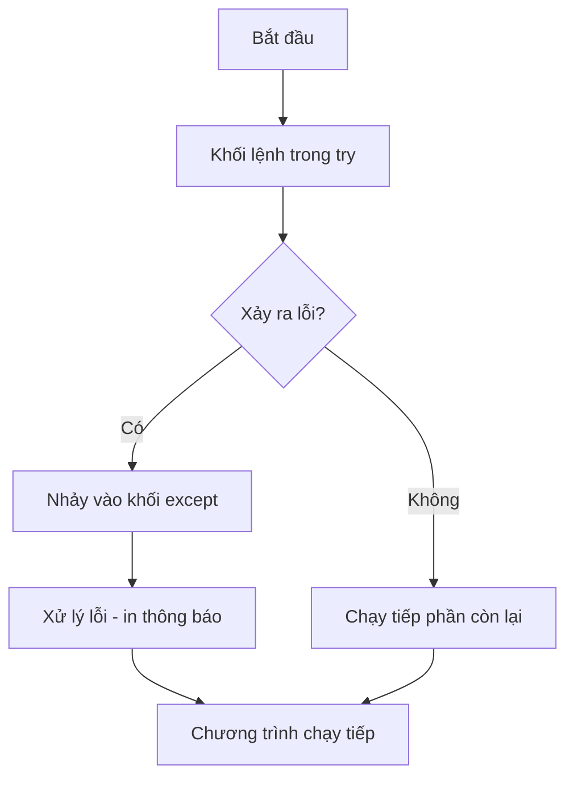

# Bài 19 — Ngoại Lệ (Exception) Trong Python

> 🎓 **Chương 7 – Viết chương trình an toàn, không bao giờ "sập"**

## 🧠 Điều kiện tiên quyết

- [Bài 12 — Hàm (Function) Trong Python](../12-Ham/bai.md)

---

## 🎯 Mục tiêu

Sau bài học này, học viên sẽ:

* ✅ Phân biệt **lỗi cú pháp (error)** và **ngoại lệ (exception)**.
* ✅ Dùng `try` / `except` để bắt lỗi và giữ chương trình chạy tiếp.
* ✅ Bắt các ngoại lệ cụ thể: `ValueError`, `TypeError`, `ZeroDivisionError`, `IndexError`, `KeyError`, `FileNotFoundError`.
* ✅ Dùng `else` (chạy khi không lỗi) và `finally` (luôn chạy).
* ✅ Chủ động ném lỗi bằng `raise`.
* ✅ Tự định nghĩa ngoại lệ riêng bằng `class MyError(Exception)`.

---

## 📖 Kiến thức

### 1. Error (lỗi) và Exception (ngoại lệ) khác nhau thế nào?

> 💬 **Nói đơn giản:** **Error** là lỗi xảy ra khi viết **sai cú pháp** — Python không hiểu code và không chạy được gì. **Exception** là lỗi xảy ra **lúc chương trình đang chạy** — code đúng cú pháp nhưng gặp tình huống bất thường (chia cho 0, nhập chữ vào chỗ số...).

| Tiêu chí | Error (lỗi) | Exception (ngoại lệ) |
|---|---|---|
| Xảy ra khi | Viết sai cú pháp | Đang chạy chương trình |
| Ví dụ | Thiếu dấu `:` sau `if` | `10 / 0` |
| Bắt được bằng try? | ❌ Không — phải sửa code | ✅ Có |

```python
print("Xin chao"    # ❌ SyntaxError — thiếu ngoặc, phải sửa code
```

```python
x = 10 / 0          # ✅ Cú pháp đúng, nhưng chạy báo ZeroDivisionError
```

**Ví dụ đời thực:** Chiếc ô tô — **Error** giống đổ xăng lẫn nước, xe không nổ máy. **Exception** giống đang chạy gặp chướng ngại vật: hệ thống **phanh** để bạn xử lý, không để xe lao xuống hố.

### 2. Tại sao chương trình "sập"?

Khi Python gặp ngoại lệ mà **không có chỗ xử lý**, nó in traceback (vết lỗi) và **dừng chương trình** — mọi câu lệnh phía sau không chạy nữa:

```python
a = int(input("Nhap so: "))   # người dùng gõ "abc"
print(a + 1)                  # ❌ ValueError → chương trình chết tại đây
```

Nếu đây là quầy tính tiền đang phục vụ khách, chương trình "chết" giữa chừng là thảm họa. Giải pháp: **bắt ngoại lệ** để xử lý lỗi nhẹ nhàng rồi chạy tiếp.

### 3. Cú pháp try / except cơ bản

```python
try:
    # khối lệnh có nguy cơ lỗi
    x = 10 / 0
except:
    # khối lệnh chạy khi có lỗi xảy ra
    print("Co loi xay ra!")
print("Chuong trinh van chay tiep")   # ✅ vẫn chạy
```



> 💡 Tưởng tượng `try` là **tấm lưới an toàn** dưới người đi dây: có lỗi là rơi vào lưới (`except`), không đau, vẫn đi tiếp.

### 4. Bắt ngoại lệ cụ thể

Bắt "trùm chung" giấu đi thông tin lỗi thật. Python cho phép bắt **từng loại lỗi riêng** và xử lý khác nhau:

```python
try:
    so = int(input("Nhap so: "))   # Nhập: abc
    print(10 / so)
except ValueError:
    print("Ban phai nhap SO, khong phai chu!")
except ZeroDivisionError:
    print("Khong duoc chia cho 0!")
```

| Ngoại lệ | Xảy ra khi | Ví dụ |
|---|---|---|
| `ValueError` | Giá trị không hợp lệ với hàm | `int("abc")` |
| `TypeError` | Sai kiểu dữ liệu | `"a" + 1` |
| `ZeroDivisionError` | Chia cho 0 | `10 / 0` |
| `IndexError` | Vượt quá chỉ số list/chuỗi | `"abc"[9]` |
| `KeyError` | Khóa không tồn tại trong dict | `{}["x"]` |
| `FileNotFoundError` | File không tồn tại | `open("none.txt")` |

> 💡 Bắt nhiều lỗi trong **một** khối bằng tuple: `except (ValueError, TypeError):`.

### 5. else và finally — thành công và dọn dẹp

```python
try:
    so = int(input("Nhap so: "))     # Nhập: 10
    ket_qua = 10 / so
except ValueError:
    print("Nhap sai roi!")
else:
    print("Ket qua:", ket_qua)       # else: chỉ chạy khi try không lỗi
finally:
    print("Hoan tat")                # finally: luôn chạy

try:
    f = open("ghi_chu.txt", "w")
    f.write("Xin chao")
finally:
    print("Dong file")               # dọn dẹp tài nguyên dù có lỗi hay không
```

> 💡 `finally` giống **công việc dọn dẹp**: trả sách cho thư viện dù bài kiểm tra đạt hay trượt.

### 7. raise — chủ động ném lỗi

Đôi khi **chính bạn** muốn báo lỗi khi dữ liệu không hợp lệ, thay vì chờ Python phát hiện:

```python
def kiem_tra_diem(diem):
    if diem < 0 or diem > 10:
        raise ValueError("Diem phai tu 0 den 10!")   # ném lỗi
    return diem
```

> 💡 `raise` đúng nghĩa "hô hoán": nói "có chuyện rồi!", ai có `try/except` bao quanh sẽ đỡ lấy.

### 8. Exception do người dùng định nghĩa

Hệ thống có sẵn nhiều ngoại lệ, nhưng bạn có thể **tự đặt tên** lỗi cho ứng dụng của mình:

```python
# Ngoại lệ riêng: chỉ cần kế thừa Exception
class TuoiKhongHopLe(Exception):
    pass

def kiem_tra_tuoi(tuoi):
    if tuoi < 0:
        raise TuoiKhongHopLe("Tuoi khong the la so am!")
    return tuoi

try:
    tuoi = kiem_tra_tuoi(-5)
except TuoiKhongHopLe as e:
    print("Loi:", e)   # Loi: Tuoi khong the la so am!
```

> 💡 Vì sao tự định nghĩa? Ngoại lệ của bạn mang **nghĩa riêng** — đọc code hiểu ngay chuyện gì xảy ra, xử lý đúng chỗ hơn là bắt chung `Exception`.

### 9. Thứ tự except — con trước, cha sau

Các ngoại lệ có quan hệ **cha – con** (ví dụ `ValueError` là con của `Exception`). Đặt con **trước**, cha **sau**, nếu không con sẽ không bao giờ chạy:

```python
try:
    int("abc")
except ValueError:          # ✅ con đặt trước
    print("Sai gia tri")
except Exception:           # cha đặt sau — bắt tất cả còn lại
    print("Loi khac")
```

---

## 💡 Ví dụ minh họa

### Ví dụ 1: Chia cho 0 không còn "sập"

```python
# Bước 1: phép chia có nguy cơ lỗi đặt trong try
try:
    ket_qua = 10 / 0

# Bước 2: bắt riêng lỗi chia cho 0
except ZeroDivisionError:
    print("Khong the chia cho 0!")

# Bước 3: chương trình vẫn chạy tiếp
print("Ket thuc chuong trinh binh thuong")
```

Kết quả: `Khong the chia cho 0!` rồi `Ket thuc chuong trinh binh thuong`.

| Dòng code | Ý nghĩa |
|---|---|
| `try:` | Mở khối có nguy cơ lỗi |
| `ket_qua = 10 / 0` | Ném ra `ZeroDivisionError` |
| `except ZeroDivisionError:` | Bắt đúng loại lỗi, in thông báo thân thiện |
| `print("Ket thuc...")` | Ngoài try — luôn chạy, chương trình không chết |

### Ví dụ 2: Nhập số sai — chương trình không sập

```python
try:
    so = int(input("Nhap mot so nguyen: "))   # Nhập: abc
    print("So cua ban:", so)
except ValueError:
    print("Ban nhap khong phai so nguyen!")
```

Kết quả: `Ban nhap khong phai so nguyen!`.

### Ví dụ 3: Bộ đủ try – except – else – finally

```python
try:
    so = int(input("Nhap so: "))      # Nhập: 10
    ket_qua = 100 / so
except ValueError:
    print("Phai nhap so!")
except ZeroDivisionError:
    print("Khong chia 0 duoc!")
else:
    print("Ket qua:", ket_qua)        # không lỗi mới chạy
finally:
    print("Da hoan tat xu ly")        # luôn chạy
```

Kết quả (với `10`): `Ket qua: 10.0` rồi `Da hoan tat xu ly`.

---

## 🔬 Ví dụ nâng cao

### Ví dụ 1: Nhập điểm hợp lệ — lặp cho tới khi đúng 🏫

```python
while True:
    try:
        diem = float(input("Nhap diem (0-10): "))   # Nhập: 12
        if diem < 0 or diem > 10:
            raise ValueError("Diem ngoai khoang 0-10!")
        break                     # hợp lệ thì thoát vòng lặp
    except ValueError:
        print("Sai roi! Nhap lai diem so tu 0 den 10.")

print("Diem da nhap:", diem)
```

> 💡 Mô hình **vòng lặp bảo vệ**: nhập sai → báo → nhập lại cho tới khi đúng. Dùng cực nhiều trong chương trình thực tế.

### Ví dụ 2: Máy tính không bao giờ "đứng" khi nhập sai 🧮

```python
while True:
    try:
        a = float(input("Nhap so thu nhat: "))   # Nhập: 10
        b = float(input("Nhap so thu hai: "))    # Nhập: 0
        print("Thuong:", a / b)
    except ValueError:
        print("Ban phai nhap SO, thu lai nhe!")
    except ZeroDivisionError:
        print("Khong chia duoc cho 0, thu lai nhe!")
    else:
        print("Tinh xong!")
        break                     # không lỗi thì hoàn thành và thoát
```

### Ví dụ 3: Ngoại lệ tùy chỉnh cho ứng dụng ngân hàng 🏦

```python
class SoDuKhongDu(Exception):
    pass

def rut_tien(so_du, so_tien):
    if so_tien <= 0:
        raise ValueError("So tien phai lon hon 0!")
    if so_tien > so_du:
        raise SoDuKhongDu("So du khong du!")
    return so_du - so_tien

try:
    so_du_moi = rut_tien(100000, 200000)
except SoDuKhongDu as e:
    print("Loi:", e)              # Loi: So du khong du!
else:
    print("Rut thanh cong. So du:", so_du_moi)
```

### Ví dụ 4: Chương trình đọc file an toàn 📄

```python
try:
    with open("khong_co_file.txt", "r") as f:   # bài 22 học kỹ về file
        noi_dung = f.read()
except FileNotFoundError:
    print("Khong tim thay file! Kiem tra lai ten file.")
else:
    print("Noi dung file:", noi_dung)
```

Kết quả: `Khong tim thay file! Kiem tra lai ten file.`

---

## ⚠️ Lỗi thường gặp

### Lỗi 1: Bắt lỗi quá rộng và "nuốt" lỗi

```python
try:
    x = int(input("Nhap so: "))
except Exception:     # ⚠️ bắt tất cả
    pass              # ❌ nuốt lỗi im lặng — không biết chuyện gì xảy ra
```

* **Cách sửa:** bắt loại cụ thể và in thông báo: `except ValueError as e: print("Nhap sai:", e)`.

### Lỗi 2: Thứ tự except sai — con đặt sau cha

```python
try:
    int("abc")
except Exception:          # ❌ cha chặn hết
    print("Loi chung")
except ValueError:         # ❌ không bao giờ tới đây
    print("Sai gia tri")
```

* **Nguyên nhân:** `ValueError` là con của `Exception` nên bị bắt trước. **Cách sửa:** con trước, cha sau.

### Lỗi 3: Viết code ngoài try rồi tưởng được bảo vệ

```python
try:
    a = int(input("Nhap so: "))
except ValueError:
    print("Sai!")
print(10 / a)      # ❌ phép chia NẰM NGOÀI try — chia 0 vẫn sập
```

* **Cách sửa:** đưa toàn bộ lệnh nguy hiểm vào trong `try`.

### Lỗi 4: raise thiếu thông điệp

```python
raise ValueError   # ❌ SAI — ném "lỗi trống", khó biết vì sao
raise ValueError("Diem khong hop le")   # ✅ kèm thông báo rõ ràng
```

---

## 💎 Mẹo

* 🎯 **Bắt lỗi cụ thể nhất có thể** — `except ValueError` rõ ràng hơn `except Exception`.
* 📦 **Gom nhiều lỗi một khối:** `except (ValueError, TypeError):`.
* 🛡️ **`finally` cho tài nguyên:** đóng file, đóng kết nối — dù lỗi hay không, không rò rỉ tài nguyên.
* 🔄 **Vòng lặp bảo vệ nhập liệu** (`while True` + `try/except` + `break`) là khuôn mẫu vàng cho mọi chương trình có nhập liệu.
* 🏷️ **Đặt tên ngoại lệ riêng có nghĩa** — `TuoiKhongHopLe` đọc là hiểu ngay.
* 🔬 Khi debug: bắt rộng tạm thời và in lỗi thật: `except Exception as e: print(e)`.
* 🚫 Không dùng `except:` trần hay `pass` im lặng — nó giấu mọi vấn đề.

---

## 📝 Tóm tắt

| Thành phần | Công dụng | Chạy khi nào |
|---|---|---|
| `try` | Chứa code có nguy cơ lỗi | Luôn |
| `except LoaiLoi` | Xử lý lỗi cụ thể | Có lỗi đúng loại |
| `except (L1, L2)` | Bắt nhiều loại lỗi | Có lỗi thuộc các loại đó |
| `else` | Code thành công | Không có lỗi |
| `finally` | Dọn dẹp tài nguyên | Luôn luôn |
| `raise LoaiLoi("msg")` | Chủ động ném lỗi | Khi bạn gọi |
| `class MyError(Exception)` | Ngoại lệ tùy chỉnh | Khi bạn `raise` nó |

---

## 🧪 Kiểm tra nhanh

1. ❓ Phân biệt error và exception bằng một ví dụ mỗi loại.
2. ❓ Viết cú pháp `try/except` bắt lỗi `ZeroDivisionError`.
3. ❓ `int("abc")` gây ra ngoại lệ gì?
4. ❓ Khối `else` chạy khi nào? Khối `finally` chạy khi nào?
5. ❓ Lệnh nào dùng để chủ động ném lỗi?
6. ❓ Làm sao tạo ngoại lệ tùy chỉnh tên `MyError`?
7. ❓ Vì sao phải đặt `except` của lớp con trước lớp cha?
8. ❓ Đọc file không tồn tại gây ra ngoại lệ gì?
9. ❓ Code ngoài `try` có được bảo vệ không?
10. ❓ Vòng lặp nhập điểm cho tới khi hợp lệ gồm những bước nào?

<details>
<summary>🔍 Xem đáp án</summary>

1. Error: `print("a"` (sai cú pháp). Exception: `10 / 0` (lỗi lúc chạy).
2. `try: x = 10 / 0` / `except ZeroDivisionError: print("Khong chia 0")`.
3. `ValueError`.
4. `else` chạy khi không có lỗi; `finally` luôn chạy.
5. `raise`.
6. `class MyError(Exception): pass`.
7. Vì lớp con bắt được sẽ chạy trước; đặt cha trước sẽ "chặn" con.
8. `FileNotFoundError`.
9. Không — chỉ code trong `try` được bảo vệ.
10. `while True` + `try/except` bắt lỗi nhập + kiểm tra khoảng giá trị (có thể `raise`) + `break` khi hợp lệ.

</details>

---

## 📚 Bài đọc thêm

* [Python.org – Errors and Exceptions](https://docs.python.org/3/tutorial/errors.html)
* [Python.org – Built-in Exceptions](https://docs.python.org/3/library/exceptions.html)
* [W3Schools – Python Try Except](https://www.w3schools.com/python/python_try_except.asp)
* [Real Python – Python Exceptions](https://realpython.com/python-exceptions/)

---

---

## 🧩 Bài tập

> 📝 🎯 **Chủ đề:** Error vs Exception, try/except, except cụ thể, else, finally, raise, ngoại lệ tùy chỉnh.

## 🟢 Dễ (Bài 1 – 7)

### Bài 1: Bắt lỗi chia cho 0

* **Đề bài:** Đặt phép tính `10 / 0` trong `try`, bắt lỗi `ZeroDivisionError` và in ra `Khong the chia cho 0!`. Sau đó in thêm `Chuong trinh van chay tiep`.
* **Input:** (không cần nhập gì)
* **Output:**
  ```
  Khong the chia cho 0!
  Chuong trinh van chay tiep
  ```
* **Gợi ý:** `except ZeroDivisionError:` ngay sau khối `try`.

### Bài 2: Bắt lỗi nhập sai kiểu

* **Đề bài:** Dùng `int("abc")` trong `try`, bắt `ValueError` và in `Khong phai so nguyen!`.
* **Input:** (không cần nhập gì)
* **Output:**
  ```
  Khong phai so nguyen!
  ```
* **Gợi ý:** `int("abc")` luôn ném `ValueError`.

### Bài 3: Bắt lỗi chỉ số ngoài phạm vi

* **Đề bài:** Truy cập `ds[5]` với `ds = [10, 20, 30]` trong `try`, bắt `IndexError` và in `Chi so nam ngoai danh sach!`.
* **Input:** (không cần nhập gì)
* **Output:**
  ```
  Chi so nam ngoai danh sach!
  ```
* **Gợi ý:** `except IndexError:`.

### Bài 4: Bắt lỗi khóa không tồn tại

* **Đề bài:** Truy cập `diem["Ly"]` với `diem = {"Toan": 8}` trong `try`, bắt `KeyError` và in `Mon nay chua co diem!`.
* **Input:** (không cần nhập gì)
* **Output:**
  ```
  Mon nay chua co diem!
  ```
* **Gợi ý:** `except KeyError:` — ôn lại bài 17.

### Bài 5: finally luôn chạy

* **Đề bài:** Viết chương trình: `try` thực hiện `10 / 0` (sẽ lỗi), `except` in `Da bat duoc loi!`, `finally` in `Dang don dep tai nguyen...`. In thêm dòng `Ket thuc chuong trinh`.
* **Input:** (không cần nhập gì)
* **Output:**
  ```
  Da bat duoc loi!
  Dang don dep tai nguyen...
  Ket thuc chuong trinh
  ```
* **Gợi ý:** Khối `finally` chạy dù có lỗi hay không.

### Bài 6: else chạy khi không lỗi

* **Đề bài:** `try` thực hiện `x = 10 / 2` (không lỗi); `except` in `Co loi!`; `else` in `Khong co loi gi!`. Quan sát kết quả.
* **Input:** (không cần nhập gì)
* **Output:**
  ```
  Khong co loi gi!
  ```
* **Gợi ý:** `else` chỉ chạy khi khối `try` hoàn thành không lỗi.

### Bài 7: Sử dụng biến lỗi

* **Đề bài:** `try` gọi `int("abc")`, `except ValueError as e:` in nội dung lỗi ra màn hình.
* **Input:** (không cần nhập gì)
* **Output:**
  ```
  Loi: invalid literal for int() with base 10: 'abc'
  ```
* **Gợi ý:** `as e` gán ngoại lệ vào biến; in bằng `print("Loi:", e)`.

---

## 🟡 Trung bình (Bài 8 – 14)

### Bài 8: Nhập số nguyên cho tới khi đúng

* **Đề bài:** Dùng vòng lặp `while` nhập một số nguyên; nếu nhập sai thì báo `Sai roi, nhap lai!` và cho nhập lại tới khi đúng thì in `So da nhap: <so>`.
* **Input:**
  ```
  Nhap so nguyen: abc
  Sai roi, nhap lai!
  Nhap so nguyen: 15
  ```
* **Output:**
  ```
  So da nhap: 15
  ```
* **Gợi ý:** `while True` + `try/except ValueError` + `break` khi thành công.

### Bài 9: Bắt nhiều loại lỗi cùng lúc

* **Đề bài:** Viết chương trình tính `100 / so` với `so` nhập từ bàn phím. Bắt cả `ValueError` (nhập sai) và `ZeroDivisionError` (chia 0) — mỗi lỗi in thông báo riêng. Không lỗi thì in kết quả.
* **Input:**
  ```
  Nhap so: 0
  ```
* **Output:**
  ```
  Khong duoc chia cho 0!
  ```
* **Gợi ý:** Hai khối `except` riêng biệt, viết liên tiếp.

### Bài 10: Chương trình chia an toàn

* **Đề bài:** Nhập hai số `a`, `b`, in thương `a / b`. Nếu lỗi thì báo lại và cho **nhập lại từ đầu** cho tới khi thành công. Dùng cả `else` để in `Tinh xong!`.
* **Input:**
  ```
  Nhap a: 10
  Nhap b: 0
  Nhap a: 10
  Nhap b: 4
  ```
* **Output:**
  ```
  Khong chia duoc cho 0!
  Thuong: 2.5
  Tinh xong!
  ```
* **Gợi ý:** Vòng lặp bảo vệ: `try` + `except` + `else` với `break` trong `else`.

### Bài 11: Nhập tuổi hợp lệ bằng raise

* **Đề bài:** Viết hàm `kiem_tra_tuoi(tuoi)`: nếu tuổi < 0 hoặc > 150 thì `raise ValueError`. Gọi thử với `-5` trong `try/except` và in thông báo lỗi.
* **Input:** (không cần nhập gì)
* **Output:**
  ```
  Loi: Tuoi phai tu 0 den 150!
  ```
* **Gợi ý:** `raise ValueError("Tuoi phai tu 0 den 150!")`.

### Bài 12: Đọc file không tồn tại

* **Đề bài:** Dùng `open("khong_co.txt", "r")` trong `try`, bắt `FileNotFoundError` và in `Khong tim thay file!`. `finally` in `Da ket thuc xu ly file`.
* **Input:** (không cần nhập gì)
* **Output:**
  ```
  Khong tim thay file!
  Da ket thuc xu ly file
  ```
* **Gợi ý:** `except FileNotFoundError` + `finally` luôn chạy.

### Bài 13: Tránh lỗi ngoài try

* **Đề bài:** Đoạn code sau bị lỗi ở dòng ngoài `try`. Hãy sửa để chương trình bắt được cả lỗi nhập sai lẫn lỗi chia 0:

  ```python
  a = int(input("Nhap so: "))
  try:
      print(10 / a)
  except ZeroDivisionError:
      print("Khong chia 0!")
  ```
* **Input:**
  ```
  Nhap so: abc
  ```
* **Output mong đợi:**
  ```
  Phai nhap so nguyen!
  ```
* **Gợi ý:** Đưa `int(input(...))` vào trong `try` và thêm `except ValueError`.

### Bài 14: Bộ đủ try – except – else – finally

* **Đề bài:** Nhập một số nguyên `n`, in `Binh phuong: n*n`. Dùng đủ 4 khối: `except ValueError` in `Nhap sai!`; `else` in bình phương; `finally` in `Ket thuc chuong trinh`.
* **Input:**
  ```
  Nhap n: 6
  ```
* **Output:**
  ```
  Binh phuong: 36
  Ket thuc chuong trinh
  ```
* **Gợi ý:** Theo đúng thứ tự `try` → `except` → `else` → `finally`.

---

## 🔴 Khó (Bài 15 – 20)

### Bài 15: Nhập điểm hợp lệ (0–10)

* **Đề bài:** Nhập điểm từ bàn phím, chấp nhận cả số thập phân. Yêu cầu: phải là số (bắt `ValueError`), phải nằm trong khoảng 0–10 (dùng `raise ValueError`). Lặp tới khi hợp lệ, in `Diem hop le: <diem>`.
* **Input:**
  ```
  Nhap diem (0-10): abc
  Sai roi, nhap lai!
  Nhap diem (0-10): 12
  Sai roi, nhap lai!
  Nhap diem (0-10): 8.5
  ```
* **Output:**
  ```
  Diem hop le: 8.5
  ```
* **Gợi ý:** `float(input(...))` + kiểm tra khoảng + `raise` + `while True`/`break`.

### Bài 16: Máy tính 4 phép tính không bao giờ "sập"

* **Đề bài:** Viết máy tính cộng, trừ, nhân, chia với vòng lặp. Nhập phép tính dạng `a op b` (cách nhau khoảng trắng), ví dụ `10 / 3`. Bắt mọi lỗi nhập (sai định dạng, chia 0) và cho nhập lại. Gõ `thoat` để kết thúc.
* **Input:**
  ```
  Nhap phep tinh: 10 / 0
  Nhap phep tinh: abc
  Nhap phep tinh: 10 / 3
  Nhap phep tinh: thoat
  ```
* **Output:**
  ```
  Loi: khong chia duoc cho 0!
  Loi: phep tinh khong hop le!
  Ket qua: 3.3333333333333335
  Tam biet!
  ```
* **Gợi ý:** `split()` lấy 3 phần tử; `try/except` bao quanh toàn bộ phép tính; dùng `if` để chọn phép toán.

### Bài 17: Ngoại lệ tùy chỉnh — tuổi

* **Đề bài:** Định nghĩa `class TuoiKhongHopLe(Exception)`. Viết hàm `kiem_tra_tuoi` ném lỗi này khi tuổi < 0 (thông điệp `Tuoi khong the la so am!`) hoặc > 150 (`Tuoi qua lon!`). Gọi thử với `-5` và `200` trong `try/except` rồi in kết quả.
* **Input:** (không cần nhập gì)
* **Output:**
  ```
  Loi: Tuoi khong the la so am!
  Loi: Tuoi qua lon!
  ```
* **Gợi ý:** `class TuoiKhongHopLe(Exception): pass` rồi `raise TuoiKhongHopLe("...")`.

### Bài 18: Ngoại lệ tùy chỉnh — tiền rút ATM

* **Đề bài:** Định nghĩa `class SoDuKhongDu(Exception)`. Hàm `rut_tien(so_du, so_tien)` ném lỗi khi `so_tien > so_du`, ngược lại trả về số dư mới. Gọi với `so_du = 50000, so_tien = 100000`; bắt lỗi và in `Loi: So du khong du!`.
* **Input:** (không cần nhập gì)
* **Output:**
  ```
  Loi: So du khong du!
  ```
* **Gợi ý:** Dùng `as e` để in thông điệp đã ném.

### Bài 19: Điểm danh bằng get() và KeyError

* **Đề bài:** Cho `diem = {"An": 8, "Binh": 7}`. Viết hàm `lay_diem(ten)` dùng `diem[ten]`. Trong `main`, hỏi nhập tên học sinh (cho tới khi gõ `thoat`), in điểm; bắt `KeyError` in `Hoc sinh nay khong co diem!` rồi tiếp tục nhập tên khác.
* **Input:**
  ```
  Nhap ten hoc sinh: An
  Nhap ten hoc sinh: Chi
  Nhap ten hoc sinh: thoat
  ```
* **Output:**
  ```
  Diem cua An: 8
  Hoc sinh nay khong co diem!
  ```
* **Gợi ý:** Vòng lặp `while`, `try/except KeyError` bên trong.

### Bài 20: Quản lý điểm học sinh hoàn chỉnh

* **Đề bài:** Viết chương trình nhập điểm của 3 môn Toán, Văn, Anh (mỗi môn dùng vòng lặp bảo vệ: phải là số, phải trong 0–10, nếu không thì báo lỗi và nhập lại). Sau đó tính và in trung bình (2 chữ số) và xếp loại: ≥ 8.0 → `Gioi`, ≥ 6.5 → `Kha`, ≥ 5.0 → `Trung binh`, còn lại → `Yeu`. Nếu tổng cộng có lỗi bất ngờ, bắt `Exception` in `Co loi khong mong doi!`.
* **Input:**
  ```
  Nhap diem Toan: abc
  Nhap diem Toan: 8.5
  Nhap diem Van: 7
  Nhap diem Anh: 9
  ```
* **Output:**
  ```
  Diem khong hop le, nhap lai!
  Trung binh: 8.17
  Xep loai: Gioi
  ```
* **Gợi ý:** Tạo hàm `nhap_diem(mon)` dùng vòng lặp bảo vệ; `try/except Exception` bao quanh phần tính toán.

---

## 🎯 Tổng kết sau khi làm bài

Sau 20 bài tập, bạn đã:

* ✅ Phân biệt error và exception; dùng `try/except` bắt lỗi không cho chương trình "sập".
* ✅ Dùng `else`, `finally`, `raise` và bắt các ngoại lệ cụ thể.
* ✅ Tự định nghĩa ngoại lệ riêng bằng `class ... (Exception)`.
* ✅ Xây dựng máy tính và chương trình nhập điểm an toàn — mẫu của mọi ứng dụng thực tế.

> 💪 Chưa tự làm được bài nào thì đừng lo — xem lại bài giảng rồi quay lại. **Lập trình là luyện tập!**

---

## ✅ Đáp án

> 💡 **Hãy tự làm bài tập trước** rồi mới mở đáp án.

## 🟢 Dễ (Bài 1 – 7)


<details>
<summary>✅ Bài 1: Bắt lỗi chia cho 0</summary>


**Phân tích:** Phép chia cho 0 luôn ném `ZeroDivisionError`; cần giữ chương trình chạy tiếp.

**Ý tưởng:** Đặt phép chia trong `try`, bắt lỗi bằng `except`.

**Thuật toán:**
1. Đặt `10 / 0` trong `try`.
2. `except ZeroDivisionError` in thông báo.
3. In dòng kết thúc (ngoài try — chứng tỏ chương trình không chết).

**Code:**

```python
try:
    ket_qua = 10 / 0          # ném ZeroDivisionError
except ZeroDivisionError:
    print("Khong the chia cho 0!")

# Ngoài try/except: vẫn chạy bình thường
print("Chuong trinh van chay tiep")
```

**Giải thích code:**
* `10 / 0` bên trong `try` — lỗi bị "bắt" thay vì làm sập chương trình.
* `except ZeroDivisionError` — bắt đúng loại lỗi chia cho 0.
* Dòng `print` cuối ngoài khối try — chạy bình thường.

**Độ phức tạp:** O(1).

---

</details>

<details>
<summary>✅ Bài 2: Bắt lỗi nhập sai kiểu</summary>


**Phân tích:** `int("abc")` không chuyển được → `ValueError`.

**Ý tưởng:** Bắt `ValueError` trong khối `except`.

**Thuật toán:**
1. Gọi `int("abc")` trong `try`.
2. Bắt `ValueError`, in thông báo.

**Code:**

```python
try:
    so = int("abc")           # không chuyển được -> ValueError
except ValueError:
    print("Khong phai so nguyen!")
```

**Giải thích code:**
* `int("abc")` ném `ValueError` vì "abc" không phải số.
* `except ValueError` bắt và in thông báo thân thiện.

**Độ phức tạp:** O(1).

---

</details>

<details>
<summary>✅ Bài 3: Bắt lỗi chỉ số ngoài phạm vi</summary>


**Phân tích:** List có 3 phần tử nhưng truy cập vị trí 5.

**Ý tưởng:** Bắt `IndexError`.

**Thuật toán:**
1. Tạo list 3 phần tử.
2. Truy cập `ds[5]` trong `try`.
3. Bắt `IndexError` và in thông báo.

**Code:**

```python
ds = [10, 20, 30]

try:
    phan_tu = ds[5]           # vượt quá chỉ số 0..2 -> IndexError
except IndexError:
    print("Chi so nam ngoai danh sach!")
```

**Giải thích code:**
* Chỉ số hợp lệ của `ds` là 0, 1, 2 — truy cập 5 ném `IndexError`.
* `except IndexError` — bắt lỗi này và in thông báo.

**Độ phức tạp:** O(1).

---

</details>

<details>
<summary>✅ Bài 4: Bắt lỗi khóa không tồn tại</summary>


**Phân tích:** Truy cập khóa không có trong dictionary (ôn lại bài 17).

**Ý tưởng:** Bắt `KeyError`.

**Thuật toán:**
1. Tạo từ điển 1 môn.
2. Truy cập `diem["Ly"]` trong `try`.
3. Bắt `KeyError` và in thông báo.

**Code:**

```python
diem = {"Toan": 8}

try:
    d = diem["Ly"]            # khóa "Ly" không tồn tại -> KeyError
except KeyError:
    print("Mon nay chua co diem!")
```

**Giải thích code:**
* `diem["Ly"]` ném `KeyError` vì từ điển không có khóa "Ly".
* `except KeyError` — bắt lỗi khóa và báo cho người dùng.

**Độ phức tạp:** O(1).

---

</details>

<details>
<summary>✅ Bài 5: finally luôn chạy</summary>


**Phân tích:** Cần minh họa `finally` chạy dù lỗi xảy ra.

**Ý tưởng:** Khối `try` có lỗi; `except` xử lý; `finally` vẫn chạy.

**Thuật toán:**
1. `try`: `10 / 0`.
2. `except`: in "Đã bắt được lỗi!".
3. `finally`: in "Đang dọn dẹp tài nguyên...".
4. In dòng kết thúc.

**Code:**

```python
try:
    x = 10 / 0               # lỗi xảy ra
except ZeroDivisionError:
    print("Da bat duoc loi!")
finally:
    print("Dang don dep tai nguyen...")   # luôn chạy

print("Ket thuc chuong trinh")
```

**Giải thích code:**
* Lỗi xảy ra → `except` chạy.
* `finally` chạy **sau cùng bất kể** có lỗi hay không.
* Dòng cuối ngoài khối — chứng minh chương trình còn sống.

**Độ phức tạp:** O(1).

---

</details>

<details>
<summary>✅ Bài 6: else chạy khi không lỗi</summary>


**Phân tích:** `10 / 2` không lỗi nên `except` không chạy, `else` phải chạy.

**Ý tưởng:** Viết đủ `try/except/else` và quan sát.

**Thuật toán:**
1. `try`: `x = 10 / 2`.
2. `except`: in "Có lỗi!" (không chạy).
3. `else`: in "Không có lỗi gì!".

**Code:**

```python
try:
    x = 10 / 2               # không lỗi
except ZeroDivisionError:
    print("Co loi!")
else:
    print("Khong co loi gi!")   # chỉ chạy khi try không lỗi
```

**Giải thích code:**
* `10 / 2 = 5.0` — không ném lỗi.
* Vì không có lỗi → `except` bỏ qua, `else` chạy.

**Độ phức tạp:** O(1).

---

</details>

<details>
<summary>✅ Bài 7: Sử dụng biến lỗi</summary>


**Phân tích:** Cần in nội dung chi tiết của ngoại lệ.

**Ý tưởng:** `except ValueError as e` — `e` chứa thông điệp lỗi.

**Thuật toán:**
1. Gọi `int("abc")` trong `try`.
2. `except ValueError as e`: in `e`.

**Code:**

```python
try:
    so = int("abc")
except ValueError as e:
    print("Loi:", e)
```

**Giải thích code:**
* `as e` gán đối tượng ngoại lệ vào biến `e`.
* `print("Loi:", e)` — in thông điệp gốc của Python: `invalid literal for int() with base 10: 'abc'`.

**Độ phức tạp:** O(1).

---

</details>

## 🟡 Trung bình (Bài 8 – 14)


<details>
<summary>✅ Bài 8: Nhập số nguyên cho tới khi đúng</summary>


**Phân tích:** Người dùng có thể nhập sai nhiều lần — cần vòng lặp nhập lại.

**Ý tưởng:** `while True` + `try/except` + `break` khi thành công (vòng lặp bảo vệ).

**Thuật toán:**
1. Vòng lặp vô hạn.
2. Nhập và chuyển `int`.
3. Lỗi → báo, quay lại nhập.
4. Thành công → `break`.

**Code:**

```python
while True:
    try:
        so = int(input("Nhap so nguyen: "))   # Nhập: abc
    except ValueError:
        print("Sai roi, nhap lai!")
    else:
        break          # nhập đúng thì thoát vòng lặp

print("So da nhap:", so)
```

**Giải thích code:**
* `except ValueError` — nhập "abc" không chuyển được → báo và lặp lại.
* `else` + `break` — chỉ thoát khi `int()` thành công.
* Đây là khuôn mẫu **vòng lặp bảo vệ nhập liệu** dùng khắp nơi.

**Độ phức tạp:** O(k) với k là số lần nhập sai.

---

</details>

<details>
<summary>✅ Bài 9: Bắt nhiều loại lỗi cùng lúc</summary>


**Phân tích:** Hai loại lỗi khác nhau cần hai thông báo khác nhau.

**Ý tưởng:** Hai khối `except` viết liên tiếp — Python thử từng cái.

**Thuật toán:**
1. Nhập số, tính `100 / so`.
2. `except ValueError` — báo nhập sai.
3. `except ZeroDivisionError` — báo chia 0.
4. `else` — in kết quả.

**Code:**

```python
try:
    so = int(input("Nhap so: "))   # Nhập: 0
    ket_qua = 100 / so
except ValueError:
    print("Ban phai nhap so nguyen!")
except ZeroDivisionError:
    print("Khong duoc chia cho 0!")
else:
    print("Ket qua:", ket_qua)
```

**Giải thích code:**
* Nhập `0` → phép chia ném `ZeroDivisionError` → đúng khối thứ hai.
* Nhập `"abc"` → `ValueError` → khối thứ nhất.
* `else` chỉ in kết quả khi không lỗi.

**Độ phức tạp:** O(1).

---

</details>

<details>
<summary>✅ Bài 10: Chương trình chia an toàn</summary>


**Phân tích:** Lỗi phải dẫn tới **nhập lại cả hai số** cho tới khi thành công.

**Ý tưởng:** Vòng lặp bảo vệ với `break` đặt trong `else`.

**Thuật toán:**
1. Vòng lặp: nhập `a`, `b`.
2. Bắt `ValueError` và `ZeroDivisionError`.
3. Không lỗi → in thương và `Tinh xong!`, `break`.

**Code:**

```python
while True:
    try:
        a = float(input("Nhap a: "))   # Nhập: 10
        b = float(input("Nhap b: "))   # Nhập: 0
        thuong = a / b
    except ValueError:
        print("Phai nhap SO!")
    except ZeroDivisionError:
        print("Khong chia duoc cho 0!")
    else:
        print("Thuong:", thuong)
        print("Tinh xong!")
        break          # thành công thì thoát
```

**Giải thích code:**
* Bước nhập và chia đều nằm trong `try` nên được bảo vệ trọn vẹn.
* Lỗi → in thông báo, vòng lặp lặp lại.
* `else` + `break` — chỉ thoát khi không lỗi.

**Độ phức tạp:** O(k) với k là số lần nhập lại.

---

</details>

<details>
<summary>✅ Bài 11: Nhập tuổi hợp lệ bằng raise</summary>


**Phân tích:** Dùng `raise` chủ động ném lỗi khi dữ liệu không hợp lệ.

**Ý tưởng:** Hàm kiểm tra ném `ValueError`; nơi gọi bắt bằng `try/except`.

**Thuật toán:**
1. Định nghĩa hàm kiểm tra tuổi, `raise` khi ngoài 0–150.
2. Gọi hàm với `-5` trong `try`.
3. `except ValueError as e` in lỗi.

**Code:**

```python
def kiem_tra_tuoi(tuoi):
    # Tuổi không hợp lệ thì chủ động ném lỗi
    if tuoi < 0 or tuoi > 150:
        raise ValueError("Tuoi phai tu 0 den 150!")
    return tuoi

try:
    tuoi = kiem_tra_tuoi(-5)     # sẽ ném ValueError
except ValueError as e:
    print("Loi:", e)
```

**Giải thích code:**
* `raise ValueError("...")` — tạo và ném ngoại lệ kèm thông điệp.
* Hàm chỉ "hô hoán" — nơi gọi quyết định bắt hay để lọt.

**Độ phức tạp:** O(1).

---

</details>

<details>
<summary>✅ Bài 12: Đọc file không tồn tại</summary>


**Phân tích:** `open()` file không tồn tại ném `FileNotFoundError`.

**Ý tưởng:** Bắt `FileNotFoundError`; `finally` minh họa dọn dẹp luôn chạy.

**Thuật toán:**
1. `try`: mở file `"khong_co.txt"`.
2. `except FileNotFoundError`: in thông báo.
3. `finally`: in dòng dọn dẹp.

**Code:**

```python
try:
    f = open("khong_co.txt", "r")   # file không tồn tại
except FileNotFoundError:
    print("Khong tim thay file!")
finally:
    print("Da ket thuc xu ly file")   # luôn chạy
```

**Giải thích code:**
* `open("khong_co.txt", "r")` ném `FileNotFoundError` — bài 22 sẽ học kỹ về file.
* `finally` luôn chạy để báo quá trình xử lý kết thúc.

**Độ phức tạp:** O(1).

---

</details>

<details>
<summary>✅ Bài 13: Tránh lỗi ngoài try</summary>


**Phân tích:** `int(input(...))` nằm ngoài `try` nên lỗi nhập không được bảo vệ.

**Ý tưởng:** Đưa lệnh nhập vào trong `try`, thêm `except ValueError`.

**Thuật toán:**
1. Chuyển `int(input(...))` vào trong `try`.
2. Giữ `except ZeroDivisionError`.
3. Thêm `except ValueError`.

**Code:**

```python
try:
    a = int(input("Nhap so: "))   # Nhập: abc
    print(10 / a)
except ValueError:
    print("Phai nhap so nguyen!")
except ZeroDivisionError:
    print("Khong chia 0!")
```

**Giải thích code:**
* Giờ cả hai lệnh nguy hiểm (nhập + chia) đều trong `try`.
* Nhập `"abc"` → `except ValueError` chạy: `Phai nhap so nguyen!`.

**Độ phức tạp:** O(1).

---

</details>

<details>
<summary>✅ Bài 14: Bộ đủ try – except – else – finally</summary>


**Phân tích:** Minh họa đầy đủ 4 khối theo đúng thứ tự quy định.

**Ý tưởng:** `try` → `except` → `else` → `finally`.

**Thuật toán:**
1. `try`: nhập `n`, tính bình phương.
2. `except ValueError`: báo nhập sai.
3. `else`: in bình phương.
4. `finally`: in kết thúc.

**Code:**

```python
try:
    n = int(input("Nhap n: "))   # Nhập: 6
    binh_phuong = n * n
except ValueError:
    print("Nhap sai!")
else:
    print("Binh phuong:", binh_phuong)
finally:
    print("Ket thuc chuong trinh")
```

**Giải thích code:**
* Nhập `6` → không lỗi → `else` in `36`.
* `finally` luôn in `Ket thuc chuong trinh`.
* Nếu nhập sai → `except` chạy, `else` bỏ qua, `finally` vẫn chạy.

**Độ phức tạp:** O(1).

---

</details>

## 🔴 Khó (Bài 15 – 20)


<details>
<summary>✅ Bài 15: Nhập điểm hợp lệ (0–10)</summary>


**Phân tích:** Hai tầng kiểm tra: số hợp lệ (`ValueError`) và khoảng giá trị (`raise`).

**Ý tưởng:** Vòng lặp bảo vệ kết hợp `float()` + kiểm tra khoảng.

**Thuật toán:**
1. `while True`: nhập `float(diem)`.
2. `except ValueError` → báo sai và lặp lại.
3. Kiểm tra 0–10; ngoài khoảng → `raise ValueError` (bị `except` cùng khối bắt).
4. Hợp lệ → `break`.

**Code:**

```python
while True:
    try:
        diem = float(input("Nhap diem (0-10): "))   # Nhập: abc
        if diem < 0 or diem > 10:
            raise ValueError("Diem ngoai khoang 0-10!")
        break
    except ValueError:
        print("Sai roi, nhap lai!")

print("Diem hop le:", diem)
```

**Giải thích code:**
* `raise ValueError` ném lỗi **từ bên trong try** — bị chính `except ValueError` của khối bắt, không cần khối mới.
* Nhập `"abc"` → `float` lỗi → thông báo; nhập `12` → ngoài khoảng → cũng thông báo.
* Nhập `8.5` → hợp lệ → `break`.

**Độ phức tạp:** O(k) với k là số lần nhập sai.

---

</details>

<details>
<summary>✅ Bài 16: Máy tính 4 phép tính không bao giờ "sập"</summary>


**Phân tích:** Cần xử lý chuỗi nhập `a op b`, bắt lỗi định dạng, chia 0, toán tử lạ.

**Ý tưởng:** `split()` lấy 3 phần; `try/except` bao quanh toàn bộ; `if` chọn phép toán.

**Thuật toán:**
1. Vòng lặp nhập phép tính; `thoat` → kết thúc.
2. `split()` → nếu không đủ 3 phần thì ném `ValueError`.
3. Chọn phép toán theo toán tử; `else` ném `ValueError`.
4. Bắt lỗi, in thông báo, lặp lại.

**Code:**

```python
while True:
    phep_tinh = input("Nhap phep tinh: ")   # Nhập: 10 / 0

    if phep_tinh == "thoat":
        print("Tam biet!")
        break

    try:
        # Tách thành [a, toán tử, b]
        phan = phep_tinh.split()
        if len(phan) != 3:
            raise ValueError("thieu thanh phan")

        a = float(phan[0])
        b = float(phan[2])
        toan_tu = phan[1]

        # Chọn phép toán theo toán tử
        if toan_tu == "+":
            ket_qua = a + b
        elif toan_tu == "-":
            ket_qua = a - b
        elif toan_tu == "*":
            ket_qua = a * b
        elif toan_tu == "/":
            ket_qua = a / b          # chia 0 sẽ ném ZeroDivisionError
        else:
            raise ValueError("toan tu khong hop le")

        print("Ket qua:", ket_qua)

    except ValueError:
        print("Loi: phep tinh khong hop le!")
    except ZeroDivisionError:
        print("Loi: khong chia duoc cho 0!")
```

**Giải thích code:**
* `split()` với `"10 / 0"` → `['10', '/', '0']`; thiếu phần tử thì `raise ValueError`.
* Phép `/` với b = 0 ném `ZeroDivisionError` → bị bắt riêng.
* Toán tử lạ (như `%`) → `raise ValueError` → thông báo chung.
* Mọi lỗi đều kết thúc bằng vòng lặp quay lại — máy tính không bao giờ "sập".

**Độ phức tạp:** O(k) với k là số lần nhập.

---

</details>

<details>
<summary>✅ Bài 17: Ngoại lệ tùy chỉnh — tuổi</summary>


**Phân tích:** Lỗi có tên riêng của ứng dụng — dễ đọc, dễ xử lý đúng chỗ.

**Ý tưởng:** `class TuoiKhongHopLe(Exception)`; hàm ném lỗi này theo từng tình huống.

**Thuật toán:**
1. Định nghĩa lớp ngoại lệ.
2. Hàm kiểm tra: < 0 ném lỗi âm; > 150 ném lỗi quá lớn.
3. Gọi thử hai giá trị trong `try/except`.

**Code:**

```python
# Ngoại lệ riêng của ứng dụng
class TuoiKhongHopLe(Exception):
    pass

def kiem_tra_tuoi(tuoi):
    if tuoi < 0:
        raise TuoiKhongHopLe("Tuoi khong the la so am!")
    if tuoi > 150:
        raise TuoiKhongHopLe("Tuoi qua lon!")
    return tuoi

# Thử với -5
try:
    kiem_tra_tuoi(-5)
except TuoiKhongHopLe as e:
    print("Loi:", e)

# Thử với 200
try:
    kiem_tra_tuoi(200)
except TuoiKhongHopLe as e:
    print("Loi:", e)
```

**Giải thích code:**
* `class TuoiKhongHopLe(Exception)` — kế thừa `Exception` nên được xem là ngoại lệ.
* Mỗi trường hợp `raise` kèm thông điệp riêng.
* `except TuoiKhongHopLe as e` — bắt đúng loại lỗi của mình, in thông điệp.

**Độ phức tạp:** O(1).

---

</details>

<details>
<summary>✅ Bài 18: Ngoại lệ tùy chỉnh — tiền rút ATM</summary>


**Phân tích:** Rút tiền vượt số dư là lỗi nghiệp vụ — cần ngoại lệ riêng.

**Ý tưởng:** `class SoDuKhongDu(Exception)`; hàm ném khi `so_tien > so_du`.

**Thuật toán:**
1. Định nghĩa lớp ngoại lệ.
2. Hàm `rut_tien` ném lỗi khi vượt số dư, ngược lại trả số dư mới.
3. Gọi với số tiền lớn hơn số dư; bắt và in lỗi.

**Code:**

```python
class SoDuKhongDu(Exception):
    pass

def rut_tien(so_du, so_tien):
    if so_tien > so_du:
        raise SoDuKhongDu("So du khong du!")
    return so_du - so_tien

try:
    so_du_moi = rut_tien(50000, 100000)
except SoDuKhongDu as e:
    print("Loi:", e)
else:
    print("Rut thanh cong. So du:", so_du_moi)
```

**Giải thích code:**
* `so_tien (100000) > so_du (50000)` → ném `SoDuKhongDu`.
* `except SoDuKhongDu as e` — bắt lỗi nghiệp vụ của ATM và in thông điệp.
* `else` chỉ chạy khi rút thành công (không xảy ra ở ví dụ này).

**Độ phức tạp:** O(1).

---

</details>

<details>
<summary>✅ Bài 19: Điểm danh bằng get() và KeyError</summary>


**Phân tích:** Tra điểm theo tên; học sinh chưa có điểm thì không được "sập" chương trình.

**Ý tưởng:** Hàm `lay_diem` dùng `diem[ten]` (có thể ném `KeyError`); vòng lặp bắt lỗi.

**Thuật toán:**
1. Tạo từ điển điểm.
2. Vòng lặp nhập tên; `thoat` → dừng.
3. Trong `try`: in điểm; `except KeyError`: báo không có điểm.

**Code:**

```python
diem = {"An": 8, "Binh": 7}

def lay_diem(ten):
    return diem[ten]          # có thể ném KeyError

while True:
    ten = input("Nhap ten hoc sinh: ")   # Nhập: An
    if ten == "thoat":
        break
    try:
        print("Diem cua", ten, ":", lay_diem(ten))
    except KeyError:
        print("Hoc sinh nay khong co diem!")
```

**Giải thích code:**
* `lay_diem(ten)` dùng `diem[ten]` — khóa không tồn tại ném `KeyError`.
* `except KeyError` bắt tại nơi gọi, chương trình tiếp tục nhận tên khác.
* Ví dụ: nhập `An` → in `8`; nhập `Chi` → báo không có điểm.

**Độ phức tạp:** O(k) với k là số tên nhập vào; mỗi lần tra là O(1).

---

</details>

<details>
<summary>✅ Bài 20: Quản lý điểm học sinh hoàn chỉnh</summary>


**Phân tích:** Tổng hợp toàn bộ bài: vòng lặp bảo vệ nhập từng môn, tính trung bình, xếp loại, bắt lỗi bất ngờ.

**Ý tưởng:** Hàm `nhap_diem(mon)` dùng vòng lặp bảo vệ; phần tính toán bọc `try/except Exception`.

**Thuật toán:**
1. Hàm `nhap_diem`: nhập `float`, kiểm tra 0–10, lặp tới khi hợp lệ.
2. Nhập điểm 3 môn.
3. Tính trung bình (làm tròn 2 chữ số), xếp loại.
4. `except Exception` bao quanh để chặn lỗi bất ngờ.

**Code:**

```python
def nhap_diem(mon):
    """Nhập điểm một môn cho tới khi hợp lệ (0-10)."""
    while True:
        try:
            d = float(input(f"Nhap diem {mon}: "))   # Nhập: abc
            if d < 0 or d > 10:
                raise ValueError("Diem ngoai khoang 0-10!")
            return d
        except ValueError:
            print("Diem khong hop le, nhap lai!")

try:
    # Nhập điểm 3 môn bằng hàm bảo vệ
    d_toan = nhap_diem("Toan")
    d_van = nhap_diem("Van")
    d_anh = nhap_diem("Anh")

    # Tính trung bình
    tb = round((d_toan + d_van + d_anh) / 3, 2)
    print("Trung binh:", tb)

    # Xếp loại
    if tb >= 8.0:
        loai = "Gioi"
    elif tb >= 6.5:
        loai = "Kha"
    elif tb >= 5.0:
        loai = "Trung binh"
    else:
        loai = "Yeu"
    print("Xep loai:", loai)

except Exception:
    print("Co loi khong mong doi!")
```

**Giải thích code:**
* Hàm `nhap_diem` trả về ngay khi hợp lệ (`return d`) — chạy với 8.5, 7, 9 → trung bình `8.17`.
* `raise ValueError` ngoài khoảng bị `except ValueError` trong chính hàm bắt.
* Lớp `except Exception` ngoài cùng là "lưới an toàn cuối cùng" cho lỗi bất ngờ.

**Độ phức tạp:** O(k) với k là tổng số lần nhập lại của cả 3 môn.

---

</details>

## 📌 Lời khuyên cuối


* Luôn bắt **loại ngoại lệ cụ thể** — `except ValueError` tốt hơn `except Exception` trong 90% tình huống.
* Vòng lặp bảo vệ nhập liệu (`while True` + `try/except` + `break`) là kỹ năng bắt buộc cho mọi chương trình thực tế.
* Dùng `raise` + ngoại lệ tự định nghĩa để code tự mô tả lỗi — ứng dụng ngân hàng, quản lý điểm đều áp dụng.
* `finally` là nơi duy nhất đảm bảo dọn dẹp tài nguyên — đừng bỏ qua.

👉 Tiếp theo: **[Bài 20: Module](../20-Module/bai.md)**

---

## ➡️ Điều hướng

**Vị trí:** `01-Co-Ban/19-Exception/bai.md`

**Bài tiếp theo:** [Bài 20 — Module Trong Python](../20-Module/bai.md)
