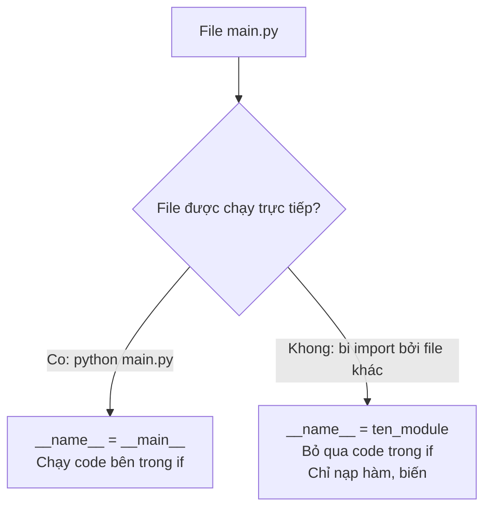

# Bài 20 — Module Trong Python

> 🎓 **Chương 6 – Tổ chức mã nguồn: Module, Package và File**

## 🧠 Điều kiện tiên quyết

- [Bài 12 — Hàm (Function) Trong Python](../12-Ham/bai.md)

---

## 🎯 Mục tiêu

Sau bài học này, học viên sẽ:

* ✅ Hiểu **module là gì** và vì sao phải **chia nhỏ** chương trình thành nhiều file.
* ✅ Thành thạo **4 cách import**: `import ten`, `import ten as`, `from ... import ...`, `from ... import *`.
* ✅ Hiểu rõ câu lệnh **`if __name__ == "__main__"`** — "bí ẩn" mà ai cũng gặp.
* ✅ **Tự tạo module** riêng (`tien_ich.py`) và dùng lại trong chương trình khác.
* ✅ Sử dụng được các **module chuẩn**: `math`, `random`, `datetime`, `os` cho tác vụ thực tế.

---

## 📖 Kiến thức

### 1. Nhắc lại bài trước

Ở **Bài 19**, chúng ta học cách dùng `try/except` để **xử lý lỗi** mà không làm chương trình sập:

```python
try:
    so = int(input("Nhập số: "))
except ValueError:
    print("Bạn nhập không phải số!")
```

Khi chương trình còn nhỏ, viết tất cả trong **một file** không sao. Nhưng khi chương trình lên tới hàng trăm, hàng nghìn dòng thì một file duy nhất trở thành "mớ bòng bong". Giải pháp chính là **module**.

### 2. Module là gì?

> 💬 **Nói đơn giản:** Module là **một file Python (`.py`)** chứa các hàm, biến, class — giống một **bộ phận của máy**, chỉ đảm nhận một mảng việc nhất định.

> 🏠 **Ví dụ đời thực:** Một ngôi nhà không xây thành một khối duy nhất mà gồm nhiều **phòng**: phòng khách, phòng bếp, phòng ngủ. Mỗi phòng có chức năng riêng. Tương tự, mỗi module phụ trách một mảng chức năng: `tinh_toan.py` làm phép tính, `luu_tru.py` lưu dữ liệu, `hien_thi.py` hiển thị.

**Vì sao dùng module?**

| Lý do | Giải thích |
|---|---|
| ♻️ **Tái sử dụng** | Viết một lần, dùng ở nhiều nơi — giống món đồ nghề dùng chung |
| 🛠️ **Dễ bảo trì** | Sửa một chức năng chỉ cần sửa trong module của nó |
| 👀 **Dễ đọc** | File ngắn gọn, tập trung, ai đọc cũng dễ hiểu |
| 👥 **Dễ làm việc nhóm** | Mỗi người viết một module riêng, cuối cùng ghép lại |

### 3. Cách 1: `import ten_module`

```python
import math

print(math.sqrt(81))   # 9.0
print(math.pi)         # 3.141592653589793
```

* Sau lệnh `import math`, ta truy cập hàm qua **tên module**: `math.sqrt(...)`.
* Lợi ích: không sợ **trùng tên** — nếu bạn có hàm `sqrt` của riêng mình, nó không đụng độ với `math.sqrt`.

### 4. Cách 2: `import ten_module as ten_ngan`

```python
import random as rd
import math as m

so = rd.randint(1, 6)   # mô phỏng xúc xắc 1 - 6
print(m.floor(3.7))     # 3
```

* `as` (alias) = đặt **biệt danh ngắn** cho module — gõ nhanh hơn, code gọn hơn.
* Quy ước phổ biến: `import pandas as pd`, `import numpy as np` — bạn sẽ gặp hoài trong dự án thực tế.

### 5. Cách 3: `from ten_module import ten_can_dung`

```python
from math import sqrt, pi

print(sqrt(16))   # 4.0 — gọi trực tiếp, không cần math.sqrt
print(pi)
```

* Chỉ **lấy những thứ cần dùng** — code ngắn, rõ ràng.
* Lưu ý: giờ gọi thẳng `sqrt(16)`; nếu bạn tự định nghĩa một hàm `sqrt` khác thì nó sẽ **bị ghi đè** — cẩn thận trùng tên.

### 6. Cách 4: `from ten_module import *`

```python
from random import *

print(random())           # số thực ngẫu nhiên trong 0.0 - 1.0
print(randint(1, 100))    # số nguyên ngẫu nhiên từ 1 đến 100
```

* `*` = "lấy **tất cả**". Tiện nhưng **nguy hiểm**: mọi tên trong module đổ vào không gian tên của bạn, dễ ghi đè hàm/biến. Người mới nên hạn chế dùng.

> ⚠️ Trong code thực tế của các công ty, `import *` thường bị cấm (PEP 8 khuyến nghị tránh).

### 7. `if __name__ == "__main__"` là gì?

Đây là câu lệnh "thần bí" xuất hiện ở gần như mọi file Python chuyên nghiệp. Hãy hiểu từng mảnh:

* Khi bạn **chạy file trực tiếp** (`python main.py`), Python gán biến đặc biệt `__name__` = chuỗi `"__main__"`.
* Khi file đó **bị import** từ file khác, `__name__` = tên module (ví dụ `"tien_ich"`).



```python
# tien_ich.py
def binh_phuong(x):
    return x * x

if __name__ == "__main__":
    # Code này chỉ chạy khi gõ: python tien_ich.py
    print("Đang chạy trực tiếp tien_ich.py")
```

> 💡 **Ý nghĩa:** Giúp một file vừa làm **module** (bị import để dùng hàm) vừa làm **chương trình chạy độc lập** (kiểm thử nhanh). Đây là "khuôn vàng" của mọi file Python.

### 8. Tạo module tự viết

Chỉ cần **tạo một file `.py`** là đã có một module! Ví dụ tạo file `tien_ich.py`:

```python
# tien_ich.py — module tiện ích do mình viết
PI = 3.14159

def dien_tich_hinh_tron(r):
    """Trả về diện tích hình tròn bán kính r."""
    return PI * r * r

def chu_vi_hinh_tron(r):
    """Trả về chu vi hình tròn bán kính r."""
    return 2 * PI * r
```

Sau đó trong file `main.py` cùng thư mục:

```python
import tien_ich   # hoặc: from tien_ich import dien_tich_hinh_tron

print(tien_ich.dien_tich_hinh_tron(5))   # 78.53975
```

> ✔️ Điều kiện duy nhất với người mới: **file module và file dùng nó nằm cùng thư mục**. Bài 21 (Package) và Bài 30 (Virtual Environment) sẽ dạy cách tổ chức chuyên nghiệp hơn.

### 9. Module chuẩn của Python

Python đi kèm "tủ đồ nghề" khổng lồ gọi là **Thư viện chuẩn** (Standard Library) — cài Python là có sẵn, không cần cài thêm:

| Module | Chức năng | Ví dụ hay dùng |
|---|---|---|
| `math` | Toán học nâng cao | `sqrt()`, `floor()`, `ceil()`, `pi` |
| `random` | Sinh số ngẫu nhiên | `randint()`, `choice()`, `shuffle()` |
| `datetime` | Ngày, giờ | `datetime.now()`, `date.today()` |
| `os` | Tương tác với hệ điều hành | `os.getcwd()`, `os.listdir()` |
| `json` | Dữ liệu JSON (bài 32) | `json.dumps()`, `json.loads()` |
| `csv` | File CSV (bài 33) | `csv.reader()`, `csv.writer()` |

* **`math`**: như cuốn sổ tay công thức toán — căn bậc hai, lũy thừa, làm tròn, các hằng số.
* **`random`**: "máy xào bài" — sinh số/đối tượng ngẫu nhiên cho game, khảo sát, bốc thăm.
* **`datetime`**: đồng hồ + lịch — lấy giờ hiện tại, đếm ngày, tính tuổi.
* **`os`**: cầu nối với hệ điều hành — xem thư mục hiện tại, liệt kê file, đặt biến môi trường.

---

## 💡 Ví dụ minh họa

### Ví dụ 1: Dùng `math` tính diện tích hình tròn

```python
# Nhập module toán học
import math

# Bán kính hình tròn
ban_kinh = 5.0

# Diện tích = pi * r^2
dien_tich = math.pi * ban_kinh ** 2

# Làm tròn 2 chữ số sau dấu phẩy
print(round(dien_tich, 2))   # 78.54
```

**Giải thích từng dòng:**

| Dòng code | Ý nghĩa |
|---|---|
| `import math` | Nạp module math — từ đây dùng được `math.pi`, `math.sqrt`... |
| `ban_kinh = 5.0` | Biến lưu bán kính |
| `math.pi * ban_kinh ** 2` | `3.1415... * 5^2` — tính diện tích |
| `round(..., 2)` | Làm tròn tới 2 chữ số thập phân |

### Ví dụ 2: `random` mô phỏng xúc xắc

```python
# Nhập module sinh số ngẫu nhiên
import random

# randint(a, b): số nguyên ngẫu nhiên từ a đến b (bao gồm cả hai)
mat_xuc_xac = random.randint(1, 6)

# In kết quả
print("Bạn tung được:", mat_xuc_xac)
```

**Giải thích từng dòng:**

| Dòng code | Ý nghĩa |
|---|---|
| `import random` | Nạp module sinh số ngẫu nhiên |
| `random.randint(1, 6)` | Trả về một số nguyên bất kỳ trong 1 → 6 |
| `print(...)` | In kết quả — mỗi lần chạy ra một con số khác nhau |

### Ví dụ 3: Tự tạo module và dùng lại

File `chao_hon.py`:

```python
# Module chào hỏi do mình viết
def chao_ban(ten):
    """In lời chào thân thiện."""
    print(f"Xin chào {ten}, chúc một ngày tốt lành!")

if __name__ == "__main__":
    # Chỉ chạy khi gõ: python chao_hon.py
    chao_ban("Mai")
```

File `main.py`:

```python
# Nhập hàm từ module mình viết
from chao_hon import chao_ban

# Dùng hàm như hàm bình thường
chao_ban("An")
```

**Giải thích từng dòng:**

| Dòng code | Ý nghĩa |
|---|---|
| `def chao_ban(ten):` | Định nghĩa hàm trong module |
| `if __name__ == "__main__":` | Test thử khi chạy trực tiếp file `chao_hon.py` |
| `from chao_hon import chao_ban` | Chỉ nhập đúng hàm cần dùng, không kéo theo phần test |

---

## 🔬 Ví dụ nâng cao

### Ví dụ 1: Game đoán số (kết hợp `random` + `if` + vòng lặp)

```python
# Game đoán số từ 1 đến 100
import random

# Máy nghĩ ra một số bí mật
so_bi_mat = random.randint(1, 100)
so_ban_doan = 0
so_lan_doan = 0

print("Tôi đã nghĩ một số từ 1 đến 100. Hãy đoán nó!")

# Vòng lặp cho đến khi đoán đúng
while so_ban_doan != so_bi_mat:
    so_ban_doan = int(input("Nhập số bạn đoán: "))
    so_lu_doan = so_lu_doan + 1
    if so_ban_doan < so_bi_mat:
        print("Số bí mật lớn hơn! Đoán cao hơn nhé.")
    elif so_ban_doan > so_bi_mat:
        print("Số bí mật nhỏ hơn! Đoán thấp hơn nhé.")

print(f"Chúc mừng! Bạn đã đoán đúng số {so_bi_mat} sau {so_lu_doan} lần.")
```

* `random.randint(1, 100)` — máy chọn số ngẫu nhiên.
* `while` + `if/elif` — tạo vòng phản hồi cho đến khi trúng.
* Lưu ý: cần xử lý trường hợp người dùng nhập chữ *(dùng ứng dụng Bài 19)*.

### Ví dụ 2: Nhật ký thời gian chạy bằng `datetime`

```python
# Ghi lại thời điểm chạy chương trình
from datetime import datetime

# Lấy thời điểm hiện tại
bay_gio = datetime.now()
print("Chương trình chạy lúc:", bay_gio)
print("Giờ:phút:giây:", bay_gio.strftime("%H:%M:%S"))
```

> `strftime("%H:%M:%S")` — định dạng giờ theo mẫu (giờ:phút:giây).

### Ví dụ 3: `os` — dò thư mục và file `.py`

```python
# Khám phá hệ điều hành bằng os
import os

# Thư mục đang làm việc
print("Thư mục hiện tại:", os.getcwd())

# Liệt kê các file .py trong thư mục hiện tại
for ten in os.listdir():
    if ten.endswith(".py"):
        print("File Python:", ten)
```

---

## ⚠️ Lỗi thường gặp

### Lỗi 1: `ModuleNotFoundError: No module named 'tien_ich'`

```python
import tien_ich   # ❌ báo ModuleNotFoundError
```

* **Nguyên nhân:** File `tien_ich.py` **không tồn tại** hoặc **nằm khác thư mục** với file đang chạy; hoặc viết sai tên (hoa – thường, thiếu dấu).
* **Cách sửa:** Kiểm tra lại tên file (phải trùng khớp chính xác), đặt module cùng thư mục, hoặc kiểm tra đường dẫn.

### Lỗi 2: `ImportError: cannot import name 'rd' from 'random'`

```python
from random import rd   # ❌ sai — rd không tồn tại trong random
```

* **Nguyên nhân:** Bạn nhầm `import random as rd` (bí danh) với `from ... import` (tên thật phải đúng).
* **Cách sửa:** `import random as rd` dùng được `rd.randint(...)`, còn `from random import ...` chỉ nhập tên thật như `randint`.

### Lỗi 3: Đặt tên file trùng module chuẩn

Bạn đặt file `math.py` rồi gõ `import math` — chương trình báo lỗi hoặc hoạt động sai.

* **Nguyên nhân:** Python ưu tiên module cùng thư mục, nên `math` bị thay bằng file của bạn.
* **Cách sửa:** Không bao giờ đặt tên file trùng module chuẩn (`math.py`, `random.py`, `datetime.py`, `os.py`...).

### Lỗi 4: `import *` làm ghi đè hàm

```python
from random import *
def choice(a):
    return "tôi chọn"   # hàm tự viết
print(choice([1, 2, 3]))   # ❌ chạy hàm random, không phải hàm của bạn
```

* **Nguyên nhân:** `import *` đổ mọi tên vào không gian chung, ghi đè tên trùng.
* **Cách sửa:** Hạn chế `import *`, dùng `from random import choice` hoặc `import random`.

### Lỗi 5: Code "chạy lạ" khi import

```python
# file do_so.py
import random
print(random.randint(1, 100))   # ❌ in ra số ngẫu nhiên mỗi lần bị import
```

* **Nguyên nhân:** Code nằm ngoài `if __name__ == "__main__"` nên chạy cả khi import.
* **Cách sửa:** Bọc phần chạy thử trong `if __name__ == "__main__":`.

---

## 💎 Mẹo

* 📄 **Một module = một chủ đề.** Nếu file của bạn dài quá 300 dòng, hãy nghĩ tới việc tách module.
* 🏷️ Dùng `as` để gõ ngắn: `import random as rd`, nhưng giữ tên dễ nhớ, không lạm dụng.
* 🧪 Mọi file nên có khối `if __name__ == "__main__":` để tự test.
* 🔍 Gõ `help(math)` hoặc `dir(random)` để xem module có gì.
* 📚 Trước khi cài thư viện ngoài (Bài 31), hãy kiểm tra thư viện chuẩn đã có chưa.

---

## 📝 Tóm tắt

| Khái niệm | Nội dung |
|---|---|
| 🧩 Module | File `.py` chứa hàm, biến, class |
| `import ten` | Nạp cả module, gọi qua `ten.ham()` |
| `import ten as t` | Đặt bí danh ngắn gọn |
| `from ten import x` | Chỉ lấy `x`, gọi thẳng `x()` |
| `from ten import *` | Lấy tất cả — dễ ghi đè, hạn chế dùng |
| `if __name__ == "__main__"` | Chỉ chạy khi chạy trực tiếp file |
| 📦 Module chuẩn | `math`, `random`, `datetime`, `os`, `json`, `csv`... |

---

## 🧪 Kiểm tra nhanh

1. ❓ Module là gì trong Python?
2. ❓ Sự khác nhau giữa `import math` và `from math import sqrt`?
3. ❓ `as` trong `import random as rd` có tác dụng gì?
4. ❓ Vì sao nên hạn chế `from ten import *`?
5. ❓ `__name__` bằng gì khi chạy file trực tiếp? Khi bị import?
6. ❓ Lệnh nào sinh số nguyên ngẫu nhiên từ 1 đến 10?
7. ❓ Module nào lấy thời điểm hiện tại?
8. ❓ `os.getcwd()` trả về gì?
9. ❓ Tên file như thế nào có thể phá vỡ `import math`?
10. ❓ Muốn module vừa chạy thử trực tiếp vừa import được, cần bọc phần chạy thử trong gì?

<details>
<summary>🔍 Xem đáp án</summary>

1. Một file `.py` chứa hàm, biến, class để tái sử dụng.
2. `import math` phải gọi `math.sqrt(...)`; `from math import sqrt` gọi thẳng `sqrt(...)`.
3. Đặt bí danh ngắn hơn cho module.
4. Vì nó đổ mọi tên vào chương trình, dễ ghi đè hàm/biến của bạn.
5. Trực tiếp → `"__main__"`; bị import → tên module.
6. `random.randint(1, 10)`.
7. `datetime` (lệnh `datetime.now()`).
8. Đường dẫn thư mục đang làm việc.
9. Tên trùng module chuẩn như `math.py`, `random.py`.
10. `if __name__ == "__main__":`.

</details>

---

## 📚 Bài đọc thêm

* [Python.org – Modules](https://docs.python.org/3/tutorial/modules.html)
* [Python.org – The Python Standard Library](https://docs.python.org/3/library/index.html)
* [Real Python – Python Modules and Packages](https://realpython.com/python-modules-packages/)
* [PEP 8 – phong cách viết code (tiếng Anh)](https://peps.python.org/pep-0008/)

---

---

## 🧩 Bài tập

> 📝 🎯 **Chủ đề:** Import module theo 4 cách, tự tạo module `tien_ich`, dùng `math`, `random`, `datetime`, `os`, và `if __name__ == "__main__"`.

## 🟢 Dễ (Bài 1 – 7)

### Bài 1: Căn bậc hai với math

* **Đề bài:** Dùng module `math`, viết chương trình in ra căn bậc hai của 81.
* **Input:** Không có.
* **Output:**
  ```
  9.0
  ```
* **Gợi ý:** `import math` rồi gọi `math.sqrt(...)`.

### Bài 2: Tung xúc xắc

* **Đề bài:** Dùng module `random`, mô phỏng tung một con xúc xắc 6 mặt và in kết quả ra màn hình.
* **Input:** Không có.
* **Output:** Một số nguyên bất kỳ từ 1 đến 6 (thay đổi mỗi lần chạy), ví dụ:
  ```
  4
  ```
* **Gợi ý:** `random.randint(1, 6)`.

### Bài 3: Bí danh cho math

* **Đề bài:** Dùng `import math as m`, in ra giá trị của `pi` và kết quả `m.ceil(4.2)`.
* **Input:** Không có.
* **Output:**
  ```
  3.141592653589793
  5
  ```
* **Gợi ý:** Sau khi đặt bí danh `m`, gọi `m.pi` và `m.ceil(...)`.

### Bài 4: Chỉ lấy một hàm

* **Đề bài:** Dùng `from random import randint`, sinh và in một số nguyên ngẫu nhiên từ 1 đến 100.
* **Input:** Không có.
* **Output:** Một số nguyên bất kỳ trong khoảng 1 – 100.
* **Gợi ý:** Gọi thẳng `randint(...)` không cần tiền tố `random.`.

### Bài 5: Bốc thăm món ăn

* **Đề bài:** Có danh sách món ăn `["phở", "bún", "cơm", "bánh mì"]`. Dùng `random.choice` bốc thăm ngẫu nhiên một món và in ra.
* **Input:** Không có.
* **Output:** Một trong 4 món trên, ví dụ:
  ```
  phở
  ```
* **Gợi ý:** `random.choice(danh_sach)` chọn ngẫu nhiên một phần tử.

### Bài 6: Module chào hỏi của tôi

* **Đề bài:** Tạo file `chao_hon.py` chứa hàm `xin_chao(ten)` in ra `"Xin chao <ten>!"`. Viết thêm file `main.py` import và gọi hàm với tên `"Mai"`.
* **Input:** Không có.
* **Output:**
  ```
  Xin chao Mai!
  ```
* **Gợi ý:** Đặt hai file cùng thư mục, dùng `from chao_hon import xin_chao`.

### Bài 7: Số thực ngẫu nhiên

* **Đề bài:** Dùng `random.random()` in ra một số thực ngẫu nhiên trong khoảng 0 đến 1, rồi làm tròn 4 chữ số thập phân.
* **Input:** Không có.
* **Output:** Dạng số thực, ví dụ `0.8472`.
* **Gợi ý:** `random.random()` trả về giá trị trong `[0.0, 1.0)`; kết hợp `round(..., 4)`.

---

## 🟡 Trung bình (Bài 8 – 14)

### Bài 8: Module tiện ích hình tròn

* **Đề bài:** Tạo module `tien_ich.py` chứa hàm `dien_tich_hinh_tron(r)` và `chu_vi_hinh_tron(r)` (lấy `PI = 3.14159`). Tạo `main.py` nhập 2 hàm này, tính và in diện tích + chu vi hình tròn bán kính 5.
* **Input:** Không có.
* **Output:**
  ```
  Dien tich: 78.53975
  Chu vi: 31.4159
  ```
* **Gợi ý:** Module chỉ chứa hằng số và hàm; phần tính toán nằm trong `main.py`.

### Bài 9: Giải phương trình bậc hai

* **Đề bài:** Dùng `math.sqrt`, viết chương trình giải phương trình `x^2 - 5x + 6 = 0` (tính delta rồi in hai nghiệm).
* **Input:** Không có.
* **Output:**
  ```
  Nghiem x1 = 3.0
  Nghiem x2 = 2.0
  ```
* **Gợi ý:** `delta = b*b - 4*a*c`; nghiệm `(-b ± sqrt(delta)) / (2*a)`.

### Bài 10: Sinh 5 số và tìm số lớn nhất

* **Đề bài:** Sinh 5 số nguyên ngẫu nhiên từ 1 đến 99, in cả danh sách và số lớn nhất.
* **Input:** Không có.
* **Output:** (mỗi lần chạy khác nhau)
  ```
  Cac so: [12, 78, 45, 3, 90]
  So lon nhat: 90
  ```
* **Gợi ý:** Dùng vòng lặp `for` để gom vào list, sau đó dùng `max(danh_sach)`.

### Bài 11: Đồng hồ thông minh

* **Đề bài:** Dùng `datetime`, in ra thời điểm hiện tại dạng `HH:MM:SS DD/MM/YYYY`.
* **Input:** Không có.
* **Output:** Dạng ví dụ:
  ```
  14:30:05 05/08/2026
  ```
* **Gợi ý:** `datetime.now()` + `strftime("%H:%M:%S %d/%m/%Y")`.

### Bài 12: Khám phá thư mục

* **Đề bài:** Dùng module `os`, in thư mục hiện tại và đếm xem có bao nhiêu file Python (`.py`) trong đó.
* **Input:** Không có.
* **Output:**
  ```
  Thu muc hien tai: D:\random\Python-Course\20_Module
  So file .py: 2
  ```
* **Gợi ý:** `os.getcwd()` và `os.listdir()` + đếm bằng `if ten.endswith(".py")`.

### Bài 13: Đoán số một lượt

* **Đề bài:** Máy nghĩ số từ 1 đến 10. Người chơi nhập một số (dùng `input`). In `"Dung roi!"` nếu trùng, ngược lại in số bí mật để động viên.
* **Input:** Một số nguyên, ví dụ `7`.
* **Output:**
  ```
  Sai roi! So bi mat la 7
  ```
* **Gợi ý:** `so_bi_mat = random.randint(1, 10)` rồi so sánh với `int(input(...))`.

### Bài 14: Module có chạy thử

* **Đề bài:** Tạo module `tien_ich.py` chứa hàm `tong(*cac_so)` tính tổng nhiều số, kèm khối `if __name__ == "__main__":` để tự chạy thử in ra tổng của `1, 2, 3` khi chạy trực tiếp. Tạo `main.py` import hàm và in tổng của `10, 20, 30`.
* **Input:** Không có.
* **Output khi chạy `tien_ich.py`:** `Tong thu nghiem: 6`
* **Output khi chạy `main.py`:** `Tong: 60`
* **Gợi ý:** `*cac_so` cho phép hàm nhận nhiều đối số; khối `if __name__` chỉ chạy khi chạy trực tiếp.

---

## 🔴 Khó (Bài 15 – 20)

### Bài 15: Bộ tiện ích hình học hoàn chỉnh

* **Đề bài:** Tạo module `hinh_hoc.py` gồm 4 hàm: `dien_tich_hinh_tron(r)`, `chu_vi_hinh_tron(r)`, `dien_tich_tam_giac(a, h)`, `dien_tich_chu_nhat(a, b)`. Tạo `main.py` nhập 2 hàm hình tròn và 2 hàm hình chữ nhật, tính với dữ liệu mẫu và in kết quả đẹp mắt (có nhãn).
* **Input:** Không có.
* **Output:**
  ```
  Hinh tron r=5: Dien tich 78.54, Chu vi 31.42
  Hinh chu nhat 4x6: Dien tich 24
  ```
* **Gợi ý:** Tách rõ phần "định nghĩa" trong module và phần "dùng thử" trong `main.py`.

### Bài 16: Đoán số nhiều lượt

* **Đề bài:** Máy nghĩ số 1–100. Người chơi đoán nhiều lượt; mỗi lượt máy báo `Lon hon` / `Be hon`. Khi đoán đúng, in số lượt đã dùng. Xử lý ngoại lệ khi người chơi nhập không phải số.
* **Input:**
  ```
  50
  abc
  75
  62
  ```
* **Output:**
  ```
  Be hon
  Vui long nhap so nguyen!
  Lon hon
  Dung roi! So bi mat la 62. Ban doan 3 luot.
  ```
* **Gợi ý:** Kết hợp `while`, `try/except ValueError`, `random.randint`.

### Bài 17: Sinh mật khẩu ngẫu nhiên

* **Đề bài:** Dùng `random.choice`, sinh mật khẩu 6 ký tự gồm chữ thường, chữ hoa và chữ số. In ra mật khẩu vừa sinh.
* **Input:** Không có.
* **Output:** Một chuỗi 6 ký tự ngẫu nhiên, ví dụ `kQ7pZ2`.
* **Gợi ý:** Gộp `"abcdefghijklmnopqrstuvwxyzABCDEFGHIJKLMNOPQRSTUVWXYZ0123456789"` thành một chuỗi rồi bốc thăm từng ký tự trong vòng lặp.

### Bài 18: Module thống kê

* **Đề bài:** Tạo module `thong_ke.py` gồm các hàm `tong(ds)`, `trung_binh(ds)`, `lon_nhat(ds)`, `nho_nhat(ds)`. Tạo `main.py` nhập 4 hàm và dùng chúng cho danh sách điểm `[7, 8.5, 6, 9, 7.5]`, in tổng, trung bình (làm tròn 2 chữ số), lớn nhất, nhỏ nhất.
* **Input:** Không có.
* **Output:**
  ```
  Tong: 38.0
  Trung binh: 7.6
  Lon nhat: 9.0
  Nho nhat: 6.0
  ```
* **Gợi ý:** Viết thủ công bằng vòng lặp (không dùng `sum`/`max`/`min` sẵn có) để luyện tay; hoặc dùng hàm sẵn có nếu muốn.

### Bài 19: Module hai vai — chạy thử và bị import

* **Đề bài:** Tạo module `thoi_tiet.py` chứa hàm `mo_ta(t)`: trả về `"Nong"` nếu `t >= 30`, `"Mat"` nếu `t >= 20`, còn lại `"Lanh"`. Kèm khối `if __name__ == "__main__":` in kết quả kiểm thử 3 giá trị `35, 25, 10` khi chạy trực tiếp. Tạo `main.py` import hàm, hỏi người dùng nhiệt độ (dùng `input`) rồi in mô tả.
* **Input (chạy main.py):**
  ```
  32
  ```
* **Output (chạy thời_tiet.py):**
  ```
  Test 35 -> Nong
  Test 25 -> Mat
  Test 10 -> Lanh
  ```
* **Output (chạy main.py):**
  ```
  Thoi tiet hom nay: Nong
  ```
* **Gợi ý:** Kiểm thử nằm trong `if __name__ == "__main__"` để khi import không bị in ra.

### Bài 20: Trò chơi Oẳn tù tì

* **Đề bài:** Viết trò chơi "Búa – Kéo – Bao": máy chọn ngẫu nhiên (`"bua"`, `"keo"`, `"bao"`), người chơi nhập lựa chọn, in kết quả thắng/thua/hòa. Búa thắng Kéo, Kéo thắng Bao, Bao thắng Búa.
* **Input:**
  ```
  bua
  ```
* **Output:** (máy chọn ngẫu nhiên nên mỗi lần khác nhau)
  ```
  May chon: keo
  Ban thang!
  ```
* **Gợi ý:** `random.choice(["bua", "keo", "bao"])`; dùng từ điển để so sánh luật chơi thay vì cả đống `if`.

---

## 🎯 Tổng kết sau khi làm bài

Sau 20 bài tập, bạn đã:

* ✅ Thành thạo 4 cách import và biết khi nào nên dùng cách nào.
* ✅ Tự tạo module riêng và tái sử dụng trong nhiều file.
* ✅ Dùng được `math`, `random`, `datetime`, `os` cho việc thực tế.
* ✅ Hiểu `if __name__ == "__main__"` — viết được file vừa chạy vừa import.

> 💪 Chưa tự làm được bài nào thì đừng lo — hãy xem lại bài giảng rồi quay lại. **Lập trình là luyện tập!**

---

## ✅ Đáp án

> 💡 **Hãy tự làm bài tập trước** rồi mới mở đáp án.

## 🟢 Dễ (Bài 1 – 7)


<details>
<summary>✅ Bài 1: Căn bậc hai với math</summary>


**Phân tích:** Dùng hàm `sqrt` trong module `math` — thư viện chuẩn, không cần cài thêm.

**Ý tưởng:** `import math` rồi gọi `math.sqrt(81)`.

**Thuật toán:**
1. Import module `math`.
2. In kết quả `math.sqrt(81)`.

**Code:**

```python
import math

print(math.sqrt(81))
```

**Giải thích code:**
* `import math` — nạp module toán học.
* `math.sqrt(81)` — căn bậc hai của 81, kết quả `9.0` (số thực).

**Độ phức tạp:** O(1).

---

</details>

<details>
<summary>✅ Bài 2: Tung xúc xắc</summary>


**Phân tích:** Mô phỏng con xúc xắc 6 mặt bằng cách sinh số nguyên ngẫu nhiên 1–6.

**Ý tưởng:** Dùng `random.randint(1, 6)`.

**Thuật toán:**
1. `import random`.
2. Gán `ket_qua = random.randint(1, 6)`.
3. In kết quả.

**Code:**

```python
import random

# Tung xúc xắc: số ngẫu nhiên từ 1 đến 6
ket_qua = random.randint(1, 6)
print(ket_qua)
```

**Giải thích code:**
* `randint(a, b)` — trả về số nguyên ngẫu nhiên nằm giữa `a` và `b`, **bao gồm cả hai đầu mút**.
* Mỗi lần chạy, kết quả khác nhau.

**Độ phức tạp:** O(1).

---

</details>

<details>
<summary>✅ Bài 3: Bí danh cho math</summary>


**Phân tích:** Luyện cú pháp `as` — đặt tên ngắn cho module.

**Ý tưởng:** `import math as m` rồi dùng `m.pi`, `m.ceil`.

**Thuật toán:**
1. Import math với bí danh `m`.
2. In `m.pi`.
3. In `m.ceil(4.2)`.

**Code:**

```python
import math as m

print(m.pi)
print(m.ceil(4.2))
```

**Giải thích code:**
* `import math as m` — từ nay gọi `m.` thay vì `math.`.
* `m.pi` — hằng số pi.
* `m.ceil(4.2)` — làm tròn lên, ra `5`.

**Độ phức tạp:** O(1).

---

</details>

<details>
<summary>✅ Bài 4: Chỉ lấy một hàm</summary>


**Phân tích:** Luyện `from ... import ...` để gọi hàm trực tiếp.

**Ý tưởng:** `from random import randint` rồi gọi `randint(1, 100)`.

**Thuật toán:**
1. Nhập riêng hàm `randint`.
2. In kết quả ngẫu nhiên.

**Code:**

```python
from random import randint

print(randint(1, 100))
```

**Giải thích code:**
* `from random import randint` — chỉ lấy hàm `randint`, không cần tiền tố `random.`.
* Kết quả là số nguyên trong khoảng 1 – 100.

**Độ phức tạp:** O(1).

---

</details>

<details>
<summary>✅ Bài 5: Bốc thăm món ăn</summary>


**Phân tích:** `random.choice` chọn ngẫu nhiên một phần tử từ một chuỗi/list.

**Ý tưởng:** Tạo list món ăn, gọi `random.choice`.

**Thuật toán:**
1. `import random`.
2. Tạo list `mon_an`.
3. Chọn ngẫu nhiên và in.

**Code:**

```python
import random

# Danh sách món ăn trong căng tin
mon_an = ["phở", "bún", "cơm", "bánh mì"]

# Bốc thăm ngẫu nhiên một món
chon = random.choice(mon_an)
print(chon)
```

**Giải thích code:**
* `random.choice(mon_an)` — trả về ngẫu nhiên một phần tử của list.
* `random.choice` còn dùng được cho cả chuỗi, tuple.

**Độ phức tạp:** O(1).

---

</details>

<details>
<summary>✅ Bài 6: Module chào hỏi của tôi</summary>


**Phân tích:** Bài đầu tiên "tự tạo module" — chứng minh file `.py` chính là module.

**Ý tưởng:** Tạo `chao_hon.py` chứa hàm, rồi import từ `main` cùng thư mục. Để file chạy được ngay khi copy, code dưới đây **tự tạo** module trước khi import.

**Thuật toán:**
1. Ghi nội dung hàm `xin_chao` vào file `chao_hon.py`.
2. Import hàm từ `chao_hon`.
3. Gọi hàm với tên `"Mai"`.

**Code:**

```python
# Tự tạo module chao_hon.py ngay trong code để đáp án chạy được
with open("chao_hon.py", "w", encoding="utf-8") as f:
    f.write(
        'def xin_chao(ten):\n'
        '    return f"Xin chao {ten}!"\n'
    )

# Nhập hàm từ module vừa tạo
from chao_hon import xin_chao

# Dùng hàm
print(xin_chao("Mai"))
```

**Giải thích code:**
* `open("chao_hon.py", "w", encoding="utf-8")` — tạo file mới (chế độ `w`) và ghi nội dung hàm.
* `from chao_hon import xin_chao` — import hàm từ module cùng thư mục.
* `xin_chao("Mai")` — trả về chuỗi `"Xin chao Mai!"`.

> 📝 **Cách làm "thật" trong dự án:** tạo hai file `chao_hon.py` và `main.py` như bài tập mô tả.

**Độ phức tạp:** O(1).

---

</details>

<details>
<summary>✅ Bài 7: Số thực ngẫu nhiên</summary>


**Phân tích:** `random.random()` sinh số thực trong `[0.0, 1.0)` — cần làm tròn để hiển thị đẹp.

**Ý tưởng:** Lấy `random.random()`, làm tròn 4 chữ số.

**Thuật toán:**
1. Import random.
2. Sinh số thực ngẫu nhiên.
3. Làm tròn và in.

**Code:**

```python
import random

so = random.random()
print(round(so, 4))
```

**Giải thích code:**
* `random.random()` — số thực ngẫu nhiên lớn hơn hoặc bằng 0, nhỏ hơn 1.
* `round(so, 4)` — giữ 4 chữ số thập phân.

**Độ phức tạp:** O(1).

---

</details>

## 🟡 Trung bình (Bài 8 – 14)


<details>
<summary>✅ Bài 8: Module tiện ích hình tròn</summary>


**Phân tích:** Module chứa hằng số `PI` và hai hàm; `main.py` chỉ nhập và tính toán.

**Ý tưởng:** Ghi module `tien_ich.py` bằng code, import 2 hàm cần thiết, in kết quả.

**Thuật toán:**
1. Tạo `tien_ich.py` với `PI` và 2 hàm.
2. Import 2 hàm từ module.
3. Tính toán và in.

**Code:**

```python
# Tự tạo module tien_ich.py
with open("tien_ich.py", "w", encoding="utf-8") as f:
    f.write(
        'PI = 3.14159\n'
        '\n'
        'def dien_tich_hinh_tron(r):\n'
        '    return PI * r * r\n'
        '\n'
        'def chu_vi_hinh_tron(r):\n'
        '    return 2 * PI * r\n'
    )

from tien_ich import dien_tich_hinh_tron, chu_vi_hinh_tron

# Bán kính mẫu
ban_kinh = 5

print("Dien tich:", round(dien_tich_hinh_tron(ban_kinh), 5))
print("Chu vi:", round(chu_vi_hinh_tron(ban_kinh), 4))
```

**Giải thích code:**
* `open(...).write(...)` — tạo file module chứa hằng số và hàm.
* `from tien_ich import ...` — chỉ lấy 2 hàm cần dùng.
* `round(..., 5)` và `round(..., 4)` — làm tròn theo số chữ số mong muốn.

**Độ phức tạp:** O(1).

---

</details>

<details>
<summary>✅ Bài 9: Giải phương trình bậc hai</summary>


**Phân tích:** Công thức nghiệm cần căn bậc hai của biệt thức (delta).

**Ý tưởng:** Tính `delta = b*b - 4*a*c`, `sqrt_delta = math.sqrt(delta)`, rồi hai nghiệm.

**Thuật toán:**
1. Gán `a, b, c = 1, -5, 6`.
2. Tính delta.
3. Tính hai nghiệm và in.

**Code:**

```python
import math

# Hệ số phương trình x^2 - 5x + 6 = 0
a, b, c = 1, -5, 6

# Biệt thức delta
delta = b * b - 4 * a * c

# Căn bậc hai của delta
sqrt_delta = math.sqrt(delta)

# Hai nghiệm
x1 = (-b + sqrt_delta) / (2 * a)
x2 = (-b - sqrt_delta) / (2 * a)

print("Nghiem x1 =", x1)
print("Nghiem x2 =", x2)
```

**Giải thích code:**
* `math.sqrt(delta)` — căn bậc hai để giải phương trình thay vì nhẩm tay.
* Với `a=1, b=-5, c=6`, delta = 1 → nghiệm `3.0` và `2.0`.

> ⚠️ Nếu `delta < 0` chương trình sẽ báo `ValueError` — xử lý bằng `if` là bài nâng cao đáng thử.

**Độ phức tạp:** O(1).

---

</details>

<details>
<summary>✅ Bài 10: Sinh 5 số và tìm số lớn nhất</summary>


**Phân tích:** Gom số ngẫu nhiên vào list rồi tìm phần tử lớn nhất.

**Ý tưởng:** Vòng lặp `for` sinh 5 số, dùng `max()`.

**Thuật toán:**
1. Tạo list rỗng.
2. Lặp 5 lần thêm số ngẫu nhiên.
3. In list và `max(danh_sach)`.

**Code:**

```python
import random

danh_sach = []

# Sinh 5 số nguyên ngẫu nhiên từ 1 đến 99
for i in range(5):
    danh_sach.append(random.randint(1, 99))

print("Cac so:", danh_sach)
print("So lon nhat:", max(danh_sach))
```

**Giải thích code:**
* `append(...)` — thêm từng số vào cuối list.
* `max(danh_sach)` — hàm sẵn có tìm giá trị lớn nhất.
* Trong dự án thật, bạn sẽ gom dữ liệu theo cách này trước khi thống kê.

**Độ phức tạp:** O(n) với n = 5 lượt sinh + duyệt tìm max (thực chất rất nhỏ).

---

</details>

<details>
<summary>✅ Bài 11: Đồng hồ thông minh</summary>


**Phân tích:** Định dạng thời điểm hiện tại theo mẫu `HH:MM:SS DD/MM/YYYY`.

**Ý tưởng:** `datetime.now()` sau đó `strftime(...)`.

**Thuật toán:**
1. `from datetime import datetime`.
2. Lấy thời điểm hiện tại.
3. In theo định dạng.

**Code:**

```python
from datetime import datetime

# Thời điểm hiện tại
bay_gio = datetime.now()

# Định dạng: giờ:phút:giây ngày/tháng/năm
print(bay_gio.strftime("%H:%M:%S %d/%m/%Y"))
```

**Giải thích code:**
* `datetime.now()` — thời điểm hiện tại (ngày giờ của máy).
* `strftime(...)` — đổi `datetime` thành chuỗi theo mã: `%H` giờ (00–23), `%M` phút, `%S` giây, `%d` ngày, `%m` tháng, `%Y` năm.

**Độ phức tạp:** O(1).

---

</details>

<details>
<summary>✅ Bài 12: Khám phá thư mục</summary>


**Phân tích:** Đếm file Python trong thư mục hiện tại bằng `os`.

**Ý tưởng:** `os.getcwd()` lấy thư mục; lặp `os.listdir()`, đếm tên kết thúc bằng `.py`.

**Thuật toán:**
1. `import os`.
2. In `os.getcwd()`.
3. Lặp danh sách file, đếm `endswith(".py")`.

**Code:**

```python
import os

# Thư mục đang làm việc
print("Thu muc hien tai:", os.getcwd())

# Đếm file Python
so_file_py = 0
for ten in os.listdir():
    if ten.endswith(".py"):
        print("File Python:", ten)
        so_file_py = so_file_py + 1

print("So file .py:", so_file_py)
```

**Giải thích code:**
* `os.listdir()` — danh sách tên các tệp/thư mục trong thư mục hiện tại.
* `ten.endswith(".py")` — kiểm tra kiểu file bằng đuôi.
* Kết quả phụ thuộc vào thư mục bạn đang chạy — giá trị in ra có thể khác ví dụ.

**Độ phức tạp:** O(n) với n = số phần tử trong thư mục.

---

</details>

<details>
<summary>✅ Bài 13: Đoán số một lượt</summary>


**Phân tích:** Kết hợp `input` (Bài 7), `random` và `if` để đoán số.

**Ý tưởng:** Máy chọn số 1–10; so sánh với nhập của người chơi.

**Thuật toán:**
1. Máy chọn `so_bi_mat = random.randint(1, 10)`.
2. Người chơi nhập số.
3. So sánh và in thông báo.

**Code:**

```python
import random

# Máy nghĩ số từ 1 đến 10
so_bi_mat = random.randint(1, 10)

# Người chơi nhập dự đoán (# Nhập: 7)
du_doan = int(input("Nhap so ban doan (1-10): "))

if du_doan == so_bi_mat:
    print("Dung roi!")
else:
    print("Sai roi! So bi mat la", so_bi_mat)
```

**Giải thích code:**
* `input(...)` trả về chuỗi nên phải `int(...)` để so sánh số.
* `if/else` quyết định thông báo thắng – thua.
* Lời khuyên: bọc `int(input(...))` trong `try/except` (Bài 19) để an toàn.

**Độ phức tạp:** O(1).

---

</details>

<details>
<summary>✅ Bài 14: Module có chạy thử</summary>


**Phân tích:** Luyện `if __name__ == "__main__"` — file vừa chạy thử trực tiếp vừa được import.

**Ý tưởng:** Module `tien_ich.py` chứa hàm `tong(*cac_so)` + khối chạy thử; `main.py` chỉ import hàm.

**Thuật toán:**
1. Tạo `tien_ich.py` với hàm `tong` và khối `if __name__`.
2. Import từ `main` và in tổng ba số.

**Code:**

```python
# Tự tạo module tien_ich.py có cả phần chạy thử
with open("tien_ich.py", "w", encoding="utf-8") as f:
    f.write(
        'def tong(*cac_so):\n'
        '    """Tính tổng nhiều số."""\n'
        '    ket_qua = 0\n'
        '    for so in cac_so:\n'
        '        ket_qua += so\n'
        '    return ket_qua\n'
        '\n'
        'if __name__ == "__main__":\n'
        '    print("Tong thu nghiem:", tong(1, 2, 3))\n'
    )

# Chạy thử trực tiếp module
import tien_ich

# Đọc phần main: import hàm rồi dùng
from tien_ich import tong
print("Tong:", tong(10, 20, 30))
```

**Giải thích code:**
* `def tong(*cac_so):` — `*` cho phép truyền bao nhiêu số cũng được, gom vào tuple.
* `if __name__ == "__main__":` — câu lệnh này chỉ chạy thử khi gõ `python tien_ich.py`, không chạy khi bị import.
* Chạy toàn file này: dòng `import tien_ich` đã chạy module (không in dòng test vì khi import `__name__` khác `"__main__"`), sau đó dòng `from tien_ich import tong` và `print` hiển thị `Tong: 60`.

**Độ phức tạp:** O(n) với n = số lượng đối số.

---

<!--P-DAPAN-P3-->
</details>

<details>
<summary>✅ Bài 15: Bộ tiện ích hình học hoàn chỉnh</summary>

**Phân tích:** Cần tách rõ "định nghĩa" (trong module `hinh_hoc.py`) và "dùng thử"
(trong `main.py`); chỉ import 2 hàm hình tròn và 2 hàm hình chữ nhật — đúng luật
"dùng gì, nhập nấy".

**Ý tưởng:** Module chứa công thức thuần túy (không `input`/`print` bên trong);
`main.py` quyết định dữ liệu mẫu và cách in đẹp mắt.

**Thuật toán:**
1. Module: 4 hàm nhận số, trả số (`math.pi` cho hình tròn).
2. `main.py`: import 4 hàm (riêng biệt, không import *).
3. Gọi với dữ liệu mẫu, in kết quả làm tròn 2 chữ số.

**Code:**

```python
# hinh_hoc.py
import math


def dien_tich_hinh_tron(r):
    return math.pi * r * r


def chu_vi_hinh_tron(r):
    return 2 * math.pi * r


def dien_tich_tam_giac(a, h):
    return a * h / 2


def dien_tich_chu_nhat(a, b):
    return a * b
```

```python
# main.py
from hinh_hoc import (dien_tich_hinh_tron, chu_vi_hinh_tron,
                      dien_tich_chu_nhat)

dien_tich = round(dien_tich_hinh_tron(5), 2)
chu_vi = round(chu_vi_hinh_tron(5), 2)
print("Hinh tron r=5: Dien tich", dien_tich, end=", ")
print("Chu vi", chu_vi)
print("Hinh chu nhat 4x6: Dien tich", dien_tich_chu_nhat(4, 6))
```

**Giải thích code:**
* `math.pi` — hằng số π chuẩn xác từ thư viện, không cần ghi 3.14 thủ công.
* `dien_tich_tam_giac` nằm trong module nhưng `main.py` không import —
  đó là ý nghĩa của import chọn lọc: dùng gì, lấy đúng cái đó.
* `round(x, 2)` để in 78.54 và 31.42 — khớp output yêu cầu.

**Độ phức tạp:** O(1) — toàn phép tính số học, không vòng lặp.

</details>

<details>
<summary>✅ Bài 16: Đoán số nhiều lượt</summary>

**Phân tích:** Ba yêu cầu cùng lúc: lặp nhiều lượt (`while`), xử lý nhập sai
(`try/except ValueError`), số ngẫu nhiên (`random.randint`). Lượt nhập sai
không được tính — phải `continue` kịp thời.

**Ý tưởng:** Vòng lặp vô hạn + `break` khi đoán đúng; `try/except` bao quanh
chỗ chuyển `int()`; chỉ tăng đếm `luot` sau khi có số hợp lệ.

**Thuật toán:**
1. `so_bi_mat = random.randint(1, 100)`, `luot = 0`.
2. Lặp: đọc `input`, `try: doan = int(...)` — lỗi thì in cảnh báo, `continue`.
3. So sánh: nhỏ hơn → "Lon hon", lớn hơn → "Be hon", bằng → in kết quả + `break`.

**Code:**

```python
import random

so_bi_mat = random.randint(1, 100)
luot = 0

while True:
    try:
        doan = int(input("Doan so 1-100: "))
    except ValueError:
        print("Vui long nhap so nguyen!")
        continue
    luot += 1
    if doan < so_bi_mat:
        print("Lon hon")
    elif doan > so_bi_mat:
        print("Be hon")
    else:
        print(f"Dung roi! So bi mat la {so_bi_mat}. Ban doan {luot} luot.")
        break
```

**Giải thích code:**
* `continue` trong `except` — bỏ qua phần còn lại của vòng lặp, không cộng `luot`.
  Với input mẫu (`50, abc, 75, 62` khi số bí mật là 62): lần 1 "Be hon",
  `abc` → cảnh báo (không tính lượt), 75 → "Lon hon", 62 → đúng với 3 lượt. ✔
* `while True + break` dùng khi chưa biết trước số vòng lặp — đúng hoàn cảnh
  trò chơi "đoán đến khi đúng".

**Độ phức tạp:** O(k) với k = số lượt đoán hợp lệ; bộ nhớ O(1).

</details>

<details>
<summary>✅ Bài 17: Sinh mật khẩu ngẫu nhiên</summary>

**Phân tích:** Mật khẩu = chuỗi 6 ký tự, mỗi ký tự bốc ngẫu nhiên từ bảng
chữ cái gồm chữ thường + chữ hoa + chữ số (62 ký tự). `random.choice` là công
cụ đúng — nó chọn 1 phần tử từ dãy, cần thì gọi lại nhiều lần.

**Ý tưởng:** Cộng chuỗi rỗng với từng ký tự bốc được trong vòng lặp 6 lần;
có thể viết gọn bằng `join` sau khi hiểu kỹ.

**Thuật toán:**
1. Gộp 3 nhóm ký tự thành chuỗi `ky_tu`.
2. `mat_khau = ""`, lặp 6 lần: `mat_khau += random.choice(ky_tu)`.
3. In ra.

**Code:**

```python
# Cách 1 — vòng lặp, rõ ý nhất
import random

ky_tu = "abcdefghijklmnopqrstuvwxyzABCDEFGHIJKLMNOPQRSTUVWXYZ0123456789"
mat_khau = ""
for i in range(6):
    mat_khau += random.choice(ky_tu)
print(mat_khau)
```

```python
# Cách 2 — join + generator expression (khi đã thành thạo)
mat_khau = "".join(random.choice(ky_tu) for i in range(6))
print(mat_khau)
```

**Giải thích code:**
* `random.choice(ky_tu)` — bốc 1 ký tự bất kỳ trong 62 ký tự, mỗi lần độc lập
  nên ký tự có thể lặp (đúng như mật khẩu thật).
* Cách 2 dùng `"".join(...)` nối 6 ký tự thành chuỗi — ngắn gọn, hiệu năng tốt
  hơn cộng chuỗi nhiều lần (với 6 ký tự thì khác biệt không đáng kể).

**Độ phức tạp:** O(6) ≈ O(1); bộ nhớ O(1).

</details>

<details>
<summary>✅ Bài 18: Module thống kê</summary>

**Phân tích:** Module gồm 4 hàm thuần túy; `main.py` import cả 4 hàm và dùng
cho danh sách điểm cụ thể. Gợi ý yêu cầu viết thủ công bằng vòng lặp (không
dùng `sum`/`max`/`min`) — luyện tay và hiểu sâu.

**Ý tưởng:** `tong` là nền cho `trung_binh`; tìm lớn/nhỏ nhất bằng kỹ thuật
"gán ứng viên đầu tiên, duyệt so sánh và thay thế".

**Thuật toán:**
1. `tong(ds)`: cộng dồn từ 0.
2. `trung_binh(ds)`: `tong(ds) / len(ds)`.
3. `lon_nhat(ds)` / `nho_nhat(ds)`: ứng viên = `ds[0]`, duyệt so sánh.
4. `main.py`: import 4 hàm, gọi cho `[7, 8.5, 6, 9, 7.5]`, làm tròn 2 chữ số.

**Code:**

```python
# thong_ke.py
def tong(ds):
    kq = 0
    for x in ds:
        kq += x
    return kq


def trung_binh(ds):
    return tong(ds) / len(ds)


def lon_nhat(ds):
    kq = ds[0]
    for x in ds:
        if x > kq:
            kq = x
    return kq


def nho_nhat(ds):
    kq = ds[0]
    for x in ds:
        if x < kq:
            kq = x
    return kq
```

```python
# main.py
from thong_ke import tong, trung_binh, lon_nhat, nho_nhat

diem = [7, 8.5, 6, 9, 7.5]
print("Tong:", tong(diem))
print("Trung binh:", round(trung_binh(diem), 2))
print("Lon nhat:", lon_nhat(diem))
print("Nho nhat:", nho_nhat(diem))
```

**Giải thích code:**
* Tái sử dụng `tong()` bên trong `trung_binh()` — đúng tinh thần module:
  viết một lần, dùng nhiều chỗ.
* Tổng = 7 + 8.5 + 6 + 9 + 7.5 = 38.0; trung bình = 38.0 / 5 = 7.6. ✔

**Độ phức tạp:** O(n) thời gian, O(1) bộ nhớ phụ.

</details>

<details>
<summary>✅ Bài 19: Module hai vai — chạy thử và bị import</summary>

**Phân tích:** Điểm mấu chốt là `if __name__ == "__main__"` — khối kiểm thử chỉ
chạy khi thực thi trực tiếp file `thoi_tiet.py`, không chạy khi `main.py`
import nó. Đây là mẫu "module hai vai" chuẩn trong mọi dự án Python.

**Ý tưởng:** Hàm `mo_ta(t)` dùng rẽ nhánh ngưỡng; khối test in 3 giá trị;
`main.py` đọc nhiệt độ từ người dùng và gọi hàm.

**Thuật toán:**
1. `mo_ta(t)`: `t >= 30` → "Nong"; `t >= 20` → "Mat"; còn lại → "Lanh".
2. Khối `if __name__ == "__main__"` in test 35, 25, 10.
3. `main.py`: import hàm, `input` nhiệt độ (đổi sang `int`), in mô tả.

**Code:**

```python
# thoi_tiet.py
def mo_ta(t):
    if t >= 30:
        return "Nong"
    elif t >= 20:
        return "Mat"
    return "Lanh"


if __name__ == "__main__":
    print("Test 35 ->", mo_ta(35))
    print("Test 25 ->", mo_ta(25))
    print("Test 10 ->", mo_ta(10))
```

```python
# main.py
from thoi_tiet import mo_ta

t = int(input("Nhiet do hom nay: "))
print("Thoi tiet hom nay:", mo_ta(t))
```

**Giải thích code:**
* Chạy `python thoi_tiet.py` → `__name__` là `"__main__"` → khối test chạy,
  in đúng 3 dòng yêu cầu.
* Chạy `python main.py` → module được import, `__name__` là `"thoi_tiet"` →
  khối test **không** chạy; người dùng nhập 32 → "Thoi tiet hom nay: Nong". ✔
* Lỗi thường gặp: quên khối `if __name__...` thì khi `main.py` import, 3 dòng
  test bị in ra — "rác" trong chương trình chính.

**Độ phức tạp:** O(1).

</details>

<details>
<summary>✅ Bài 20: Trò chơi Oẳn tù tì</summary>

**Phân tích:** Máy chọn ngẫu nhiên 1 trong 3; người chơi nhập 1 trong 3; phán
thắng/thua/hòa theo vòng tròn Búa → Kéo → Bao → Búa. Viết cả đống `if/elif`
dễ sai; dùng từ điển `thang` ánh xạ "X thắng Y" là cách gọn và ít lỗi nhất.

**Ý tưởng:** `thang = {"bua": "keo", "keo": "bao", "bao": "bua"}` — chữ đọc
là "bua thắng keo"... Nếu hai bên bằng nhau → hòa; nếu `thang[ban] == may`
→ người thắng; còn lại → máy thắng.

**Thuật toán:**
1. `may = random.choice(["bua", "keo", "bao"])`.
2. `ban = input(...)`, in lựa chọn của máy.
3. Hòa → bằng nhau; thắng → tra từ điển; ngược lại thua.

**Code:**

```python
import random

thang = {
    "bua": "keo",   # Búa thắng Kéo
    "keo": "bao",   # Kéo thắng Bao
    "bao": "bua",   # Bao thắng Búa
}

may = random.choice(["bua", "keo", "bao"])
ban = input("Ban chon (bua/keo/bao): ")
print("May chon:", may)

if ban == may:
    print("Hoa!")
elif thang[ban] == may:
    print("Ban thang!")
else:
    print("May thang!")
```

**Giải thích code:**
* Ví dụ: bạn chọn `bua`, máy `keo` → `thang["bua"]` là `"keo"` bằng `may` →
  "Ban thang!". ✔
* Nếu bạn nhập chữ không có trong từ điển (ví dụ `da`) → `KeyError`. Muốn
  chương trình chắc chắn, thêm vòng kiểm tra `while ban not in thang` —
  kỹ thuật học ở bài `while` và `Exception`.

**Độ phức tạp:** O(1).

</details>


---

## ➡️ Điều hướng

**Vị trí:** `01-Co-Ban/20-Module/bai.md`

**Bài tiếp theo:** [Bài 21 — Package Trong Python](../21-Package/bai.md)
