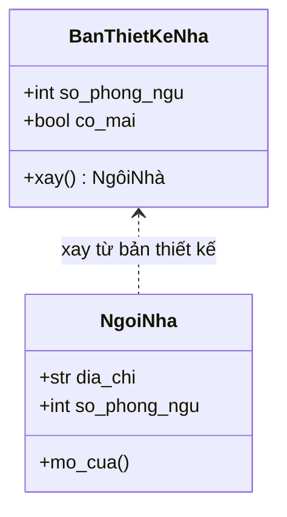
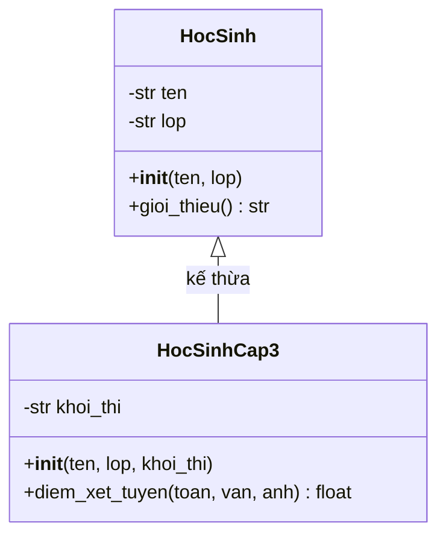

# Bài 23 — Lập Trình Hướng Đối Tượng (OOP)

> 🎓 **Chương 7 – Lập trình hướng đối tượng**

## 🧠 Điều kiện tiên quyết

- [Bài 12 — Hàm (Function) Trong Python](../12-Ham/bai.md)
- [Bài 14 — Danh Sách (List) Trong Python](../14-List/bai.md)
- [Bài 17 — Dictionary (Từ Điển) Trong Python](../17-Dictionary/bai.md)

---

## 🎯 Mục tiêu

Sau bài học này, học viên sẽ:

* ✅ Hiểu **class là gì**, **đối tượng là gì** — khác nhau như bản thiết kế và ngôi nhà.
* ✅ Biết khai báo class với **thuộc tính** (biến) và **phương thức** (hàm).
* ✅ Sử dụng thành thạo **`__init__`** và **`self`**.
* ✅ Viết **`__str__`** để in đối tượng đẹp mắt.
* ✅ Phân biệt rõ **lập trình thủ tục** và **hướng đối tượng** qua bảng so sánh.
* ✅ Dùng được **kế thừa** với `super()` và **ghi đè phương thức**.
* ✅ Hiểu **đóng gói** với dấu `_` và làm quen **`@classmethod` / `@staticmethod`**.

---

## 📖 Kiến thức

### 1. Nhắc lại Bài 22 — điểm yếu của cách cũ

Ở **Bài 22**, mỗi học sinh là một dict: `{"ten": ..., "lop": ..., "diem": [...]}`. Vấn đề:

* 😵 Tên khóa phải gõ lại mỗi lần: `hs["ten"]`, `hs["lop"]` — dễ gõ sai.
* 🧯 Mọi thao tác (tính TB, xếp loại, in) đều là hàm **tách rời** dữ liệu.
* 📦 Dữ liệu và hành vi "ở hai nơi" — như bánh xe và động cơ để riêng, muốn chạy phải tự lắp.

**OOP (Object-Oriented Programming)** giải quyết bằng cách **gói dữ liệu và hành vi vào một "vật thể" duy nhất** gọi là đối tượng.

### 2. Class và đối tượng

> 💬 **Nói đơn giản:** **Class (lớp)** là **bản thiết kế**; **đối tượng (object)** là **sản phẩm** làm ra từ bản thiết kế đó.

> 🏠 **Ví dụ đời thực:** Bản vẽ thiết kế một ngôi nhà: mô tả "ngôi nhà có mái, 2 phòng ngủ, 1 phòng khách" — đó là **class**. Căn nhà thật mà bạn **xây lên từ bản vẽ** — đó là **đối tượng**. Từ MỘT bản vẽ có thể xây HÀNG TRĂM ngôi nhà khác nhau!



Trong Python:

```python
class NgoiNha:
    def __init__(self, dia_chi, so_phong_ngu):
        self.dia_chi = dia_chi
        self.so_phong_ngu = so_phong_ngu

nha_cua_an = NgoiNha("12 Nguyen Hue", 2)   # một đối tượng từ class
nha_cua_mai = NgoiNha("45 Le Loi", 3)      # đối tượng thứ hai
```

### 3. Cú pháp khai báo class

```python
class TenLop:          # quy ước: tên class viết HOA chữ đầu mỗi từ
    """Docstring mô tả class."""
    pass
```

**Ví dụ thật — class HocSinh:**

```python
class HocSinh:
    """Bản thiết kế của một học sinh."""

    def __init__(self, ten, lop):
        self.ten = ten      # thuộc tính: biến gắn với từng đối tượng
        self.lop = lop

    def gioi_thieu(self):
        """Phương thức: hành vi của đối tượng."""
        print(f"Toi la {self.ten}, hoc lop {self.lop}.")
```

* **Thuộc tính** (attribute): biến của đối tượng — mô tả "đối tượng CÓ gì".
* **Phương thức** (method): hàm của đối tượng — mô tả "đối tượng LÀM được gì".

### 4. `__init__` và `self` — hai "nhân vật" quan trọng nhất

| Thành phần | Vai trò |
|---|---|
| `__init__` | **Hàm khởi tạo** — tự động chạy khi tạo đối tượng, dùng để "nạp nguyên liệu ban đầu" |
| `self` | **Chính đối tượng đang làm việc** — giúp phương thức truy cập thuộc tính của đúng đối tượng đó |

```python
hs = HocSinh("An", "10A1")
# Khi chạy dòng trên, Python gọi:  HocSinh.__init__(hs, "An", "10A1")
#                                   └─ self = hs
```

> 💡 `self` không cần bạn truyền vào — Python tự động đưa đối tượng đang gọi vào vị trí đầu tiên. Nhưng khi **định nghĩa** phương thức, `self` phải nằm ở tham số đầu tiên, nếu không chương trình báo lỗi!

### 5. `__str__` — "chân dung" của đối tượng

Mặc định `print(hs)` in ra thứ xấu xí: `<__main__.HocSinh object at 0x...>`. Phương thức đặc biệt `__str__` cho phép bạn quy định **đối tượng hiển thị như thế nào**:

```python
class HocSinh:
    def __init__(self, ten, lop, diem_tb):
        self.ten = ten
        self.lop = lop
        self.diem_tb = diem_tb

    def __str__(self):
        """Khi in đối tượng, Python gọi hàm này."""
        return f"Hoc sinh: {self.ten} - lop {self.lop} - TB {self.diem_tb}"

hs = HocSinh("An", "10A1", 8.5)
print(hs)   # Hoc sinh: An - lop 10A1 - TB 8.5
```

### 6. Thủ tục vs Hướng đối tượng — bảng so sánh

| Tiêu chí | 🔧 Lập trình thủ tục (đã học) | 🏗️ Hướng đối tượng (bài này) |
|---|---|---|
| Trọng tâm | **Hàm** làm việc với biến | **Đối tượng** gói dữ liệu + hành vi |
| Dữ liệu | Biến, list, dict rời rạc | Thuộc tính bên trong class |
| Hành vi | Hàm độc lập, phải truyền dữ liệu vào | Phương thức tự truy cập dữ liệu qua `self` |
| Ví dụ | `xep_loai(diem)` — đưa điểm vào hàm | `hs.xep_loai()` — đối tượng tự xếp loại |
| Tái sử dụng | Copy hàm | Kế thừa từ class cha |
| Dễ mở rộng | Phải sửa nhiều hàm | Thêm class mới không đụng code cũ |
| Phù hợp | Script nhỏ, tính toán | Hệ thống lớn: game, app, phần mềm quản lý |

```python
# THỦ TỤC: dữ liệu và hành vi tách rời
hs = {"ten": "An", "lop": "10A1", "diem": 8.5}
def xep_loai(diem):
    return "Gioi" if diem >= 8 else "Kha"
print(xep_loai(hs["diem"]))

# HƯỚNG ĐỐI TƯỢNG: mọi thứ nằm trong một đối tượng
class HocSinh:
    def __init__(self, ten, lop, diem):
        self.ten = ten
        self.lop = lop
        self.diem = diem
    def xep_loai(self):
        return "Gioi" if self.diem >= 8 else "Kha"

hs = HocSinh("An", "10A1", 8.5)
print(hs.xep_loai())
```

### 7. Kế thừa — con thừa hưởng của cha

> 💬 **Kế thừa:** Tạo **class mới** từ **class có sẵn** — class mới có **tất cả** thuộc tính/phương thức của class cũ, và có thể **thêm thứ riêng**.

> 🏫 **Ví dụ đời thực:** "Học sinh" là chung. "Học sinh cấp 3" cũng là học sinh (có tên, có lớp, biết giới thiệu) nhưng **thêm** khối thi, điểm xét tuyển. Ta không cần viết lại từ đầu — chỉ cần **kế thừa**.



```python
class HocSinh:                       # class cha
    def __init__(self, ten, lop):
        self.ten = ten
        self.lop = lop

    def gioi_thieu(self):
        print(f"Toi la {self.ten}, hoc lop {self.lop}.")

class HocSinhCap3(HocSinh):          # (HocSinh) = kế thừa từ HocSinh
    def __init__(self, ten, lop, khoi_thi):
        super().__init__(ten, lop)   # gọi __init__ của class cha
        self.khoi_thi = khoi_thi     # thêm thuộc tính riêng

    def diem_xet_tuyen(self, toan, van, anh):
        return (toan + van + anh) / 3

hs = HocSinhCap3("Mai", "12A1", "A1")
hs.gioi_thieu()                      # ✅ thừa hưởng phương thức của cha
print(hs.diem_xet_tuyen(8, 7, 9))    # ✅ dùng được tính năng riêng
```

**`super()`** = "người đại diện của class cha" — giúp gọi `__init__` của cha để **không phải gõ lại** những thuộc tính chung.

### 8. Ghi đè phương thức (override)

Class con muốn phương thức **hành xử khác** cha — chỉ cần **định nghĩa lại cùng tên**:

```python
class HocSinh:
    def __init__(self, ten, lop):
        self.ten = ten
        self.lop = lop

    def mo_ta(self):
        return f"Toi la hoc sinh {self.ten} lop {self.lop}."

class HocSinhGioi(HocSinh):
    def mo_ta(self):                     # ghi đè: cùng tên, nội dung mới
        return f"Toi la {self.ten}, mot hoc sinh gioi cua lop {self.lop}!"

hs1 = HocSinh("An", "10A1")
hs2 = HocSinhGioi("Mai", "10A1")
print(hs1.mo_ta())   # Toi la hoc sinh An lop 10A1.
print(hs2.mo_ta())   # Toi la Mai, mot hoc sinh gioi cua lop 10A1!
```

### 9. Đóng gói — "tài sản riêng" của đối tượng

> 💬 **Đóng gói:** Giấu chi tiết nội bộ, chỉ cho phép thay đổi qua phương thức — giống cây ATM: bạn chỉ nhấn nút nạp/rút, không thò tay vào máy để lấy tiền trực tiếp.

Python không cấm cứng như Java/C++, nhưng có **quy ước dấu gạch dưới**:

| Viết | Ý nghĩa |
|---|---|
| `self.ten` | Thuộc tính công khai — ai cũng dùng được |
| `self._so_du` | **Một gạch dưới** — "nội bộ, đừng động vào" (chỉ là quy ước) |
| `self.__mat_khau` | **Hai gạch dưới** — Python "bẻ tên" thật sự, truy cập trực tiếp sẽ lỗi |

```python
class BankAccount:
    def __init__(self, so_du):
        self._so_du = so_du          # quy ước: thuộc tính nội bộ

    def nap_tien(self, tien):
        if tien > 0:
            self._so_du += tien

    def xem_so_du(self):
        return self._so_du

tk = BankAccount(1000000)
tk.nap_tien(50000)                   # thay đổi qua phương thức — an toàn
print(tk.xem_so_du())                # 1050000
# tk._so_du = -999999                # ❌ không nên làm: phá vỡ quy ước
```

### 10. `@classmethod` và `@staticmethod` — giới thiệu

Hai loại phương thức đặc biệt **không cần đối tượng**:

| Loại | Tham số đầu tiên | Ý nghĩa |
|---|---|---|
| Phương thức thường | `self` | Làm việc với **đối tượng cụ thể** |
| `@classmethod` | `cls` | Làm việc với **cả class** — thường dùng để tạo đối tượng kiểu khác |
| `@staticmethod` | không có | "Hàm tiện ích" đặt trong class, không cần đối tượng cũng không cần class |

```python
class SanPham:
    THUE = 0.1                          # thuế chung cho MỌI sản phẩm

    def __init__(self, ten, gia):
        self.ten = ten
        self.gia = gia

    @classmethod
    def doi_thue(cls, thue_moi):        # cls = chính class SanPham
        cls.THUE = thue_moi

    @staticmethod
    def tinh_gia_sau_thue(gia):
        """Tiện ích: cộng thuế vào giá — không cần đối tượng."""
        return round(gia * (1 + SanPham.THUE), 2)

print(SanPham.tinh_gia_sau_thue(100000))    # 110000.0
SanPham.doi_thue(0.05)                       # đổi thuế cho cả class
print(SanPham.tinh_gia_sau_thue(100000))    # 105000.0
```

---

## 💡 Ví dụ minh họa

### Ví dụ 1: Class HocSinh cơ bản

```python
class HocSinh:
    """Bản thiết kế học sinh."""

    def __init__(self, ten, lop, diem_tb):
        self.ten = ten          # thuộc tính: tên
        self.lop = lop          # thuộc tính: lớp
        self.diem_tb = diem_tb  # thuộc tính: điểm trung bình

    def xep_loai(self):
        """Xếp loại theo điểm trung bình."""
        if self.diem_tb >= 8.0:
            return "Gioi"
        if self.diem_tb >= 6.5:
            return "Kha"
        if self.diem_tb >= 5.0:
            return "Trung binh"
        return "Yeu"

# Tạo 2 đối tượng từ cùng một class
an = HocSinh("Nguyen Van An", "10A1", 8.5)
mai = HocSinh("Tran Thi Mai", "10A1", 6.2)

print(f"{an.ten}: {an.xep_loai()}")   # Nguyen Van An: Gioi
print(f"{mai.ten}: {mai.xep_loai()}") # Tran Thi Mai: Trung binh
```

**Giải thích từng dòng:**

| Dòng code | Ý nghĩa |
|---|---|
| `class HocSinh:` | Khai báo class — tên viết hoa chữ cái đầu |
| `def __init__(self, ten, lop, diem_tb):` | Hàm khởi tạo — chạy tự động khi tạo đối tượng |
| `self.ten = ten` | Gán tham số vào thuộc tính của **đối tượng cụ thể** |
| `def xep_loai(self):` | Phương thức — tự đọc `self.diem_tb`, không cần truyền từ ngoài |
| `an = HocSinh(...)` | Tạo đối tượng `an` — tự động gọi `__init__(an, ...)` |

### Ví dụ 2: `__str__` làm đối tượng "nói chuyện"

```python
class ATM:
    """Máy ATM đơn giản."""

    def __init__(self, so_du):
        self.so_du = so_du

    def nap(self, tien):
        self.so_du += tien

    def rut(self, tien):
        if tien > self.so_du:
            print("Khong du tien!")
            return False
        self.so_du -= tien
        return True

    def __str__(self):
        return f"So du hien tai: {self.so_du} VND"

may_1 = ATM(500000)
may_1.nap(200000)
may_1.rut(100000)
print(may_1)                # So du hien tai: 600000 VND — nhờ __str__
```

**Giải thích từng dòng:**

| Dòng code | Ý nghĩa |
|---|---|
| `def nap(self, tien):` | Phương thức nạp — cập nhật `self.so_du` |
| `if tien > self.so_du:` | Kiểm tra đủ tiền trước khi rút — "bảo vệ" tài sản |
| `return False` | Tín hiệu rút thất bại cho chỗ gọi |
| `def __str__(self):` | Python tự gọi khi `print(may_1)` — không còn in địa chỉ bộ nhớ |

### Ví dụ 3: Kế thừa + ghi đè

```python
class Xe:
    """Xe nói chung."""

    def __init__(self, ten, gia):
        self.ten = ten
        self.gia = gia

    def mo_ta(self):
        return f"Xe {self.ten}, gia {self.gia} trieu."

class XeDien(Xe):
    """Xe điện — kế thừa Xe, thêm pin."""

    def __init__(self, ten, gia, pin_km):
        super().__init__(ten, gia)      # dùng __init__ của cha
        self.pin_km = pin_km

    def mo_ta(self):                    # ghi đè phương thức cha
        return f"Xe dien {self.ten}, gia {self.gia} trieu, di duoc {self.pin_km} km/sac."

xe = Xe("Vision", 40)
xe_dien = XeDien("VinFast Evo", 30, 200)
print(xe.mo_ta())
print(xe_dien.mo_ta())
```

**Giải thích từng dòng:**

| Dòng code | Ý nghĩa |
|---|---|
| `class XeDien(Xe):` | Kế thừa — XeDien có toàn bộ "tài sản" của Xe |
| `super().__init__(ten, gia)` | Gọi hàm khởi tạo của cha để gán 2 thuộc tính chung |
| `self.pin_km = pin_km` | Thêm thuộc tính riêng của con |
| `def mo_ta(self):` (trong XeDien) | Ghi đè — cùng tên hàm nhưng hành xử khác |

---

## 🔬 Ví dụ nâng cao

### Ví dụ 1: Hệ thống quản lý học sinh bằng OOP

```python
class HocSinh:
    """Học sinh với danh sách điểm 3 môn."""

    def __init__(self, ten, lop, diem):
        self.ten = ten
        self.lop = lop
        self.diem = diem              # list 3 điểm

    def tinh_tb(self):
        return sum(self.diem) / len(self.diem)

    def xep_loai(self):
        tb = self.tinh_tb()
        if tb >= 8.0:
            return "Gioi"
        if tb >= 6.5:
            return "Kha"
        if tb >= 5.0:
            return "Trung binh"
        return "Yeu"

    def __str__(self):
        return f"{self.ten:<20} TB: {self.tinh_tb():.2f} - {self.xep_loai()}"

class LopHoc:
    """Lớp học quản lý nhiều học sinh."""

    def __init__(self, ten_lop):
        self.ten_lop = ten_lop
        self.danh_sach = []           # list chứa đối tượng HocSinh

    def them(self, hs):
        self.danh_sach.append(hs)

    def in_bang_diem(self):
        print(f"=== BANG DIEM LOP {self.ten_lop} ===")
        for hs in self.danh_sach:
            print(hs)

# Sử dụng
lop_10a1 = LopHoc("10A1")
lop_10a1.them(HocSinh("Nguyen Van An", "10A1", [8.5, 7.0, 9.0]))
lop_10a1.them(HocSinh("Tran Thi Mai", "10A1", [6.0, 6.5, 7.0]))
lop_10a1.them(HocSinh("Le Quang Binh", "10A1", [4.5, 5.0, 5.5]))
lop_10a1.in_bang_diem()
```

Kết quả:

```
=== BANG DIEM LOP 10A1 ===
Nguyen Van An       TB: 8.17 - Gioi
Tran Thi Mai        TB: 6.50 - Kha
Le Quang Binh       TB: 5.00 - Trung binh
```

> 💡 Chú ý: `LopHoc` chứa list **các đối tượng HocSinh** — gọi là *hợp thành (composition)*: lớp gồm nhiều học sinh.

### Ví dụ 2: BankAccount với đóng gói

```python
class BankAccount:
    """Tài khoản ngân hàng — số dư được bảo vệ."""

    def __init__(self, so_du_ban_dau, mat_khau):
        self._so_du = so_du_ban_dau    # nội bộ: không động vào trực tiếp
        self.__mat_khau = mat_khau     # khóa riêng: hai gạch dưới

    def nap_tien(self, tien):
        if tien > 0:
            self._so_du += tien
            print(f"Nap {tien} VND. So du moi: {self._so_du}")

    def rut_tien(self, tien):
        if tien > self._so_du:
            print("Khong du so du!")
        else:
            self._so_du -= tien
            print(f"Rut {tien} VND. So du con lai: {self._so_du}")

    def xem_so_du(self):
        """Cách hợp lệ duy nhất để xem số dư."""
        return self._so_du

tk = BankAccount(1000000, "1234")
tk.nap_tien(500000)
tk.rut_tien(300000)
print("So du:", tk.xem_so_du())
# tk.__mat_khau          # ❌ AttributeError — Python đã "bẻ tên" thuộc tính
```

### Ví dụ 3: Kế thừa hai tầng — nhân viên, giáo viên, giáo viên chủ nhiệm

```python
class NhanVien:
    def __init__(self, ten, ma_so):
        self.ten = ten
        self.ma_so = ma_so

    def gioi_thieu(self):
        return f"Nhan vien {self.ten} (MS: {self.ma_so})"

class GiaoVien(NhanVien):
    def __init__(self, ten, ma_so, mon):
        super().__init__(ten, ma_so)     # tầng 1: kế thừa NhanVien
        self.mon = mon

    def gioi_thieu(self):                # ghi đè tầng 1
        return f"Giao vien {self.ten} day mon {self.mon}"

class GiaoVienChuNhiem(GiaoVien):
    def __init__(self, ten, ma_so, mon, lop):
        super().__init__(ten, ma_so, mon)  # tầng 2: kế thừa GiaoVien
        self.lop = lop

    def gioi_thieu(self):                # ghi đè tầng 2
        return f"Giao vien chu nhiem lop {self.lop}: {self.ten} (mon {self.mon})"

gv = GiaoVienChuNhiem("Co Mai", "GV01", "Toan", "10A1")
print(gv.gioi_thieu())
```

Kết quả:

```
Giao vien chu nhiem lop 10A1: Co Mai (mon Toan)
```

> 💡 `super()` ở tầng 2 gọi `GiaoVien.__init__`, tầng đó lại gọi tiếp `NhanVien.__init__` — "cầu thang" kế thừa tự nối tiếp.

---

## ⚠️ Lỗi thường gặp

### Lỗi 1: Quên `self` khi khai báo phương thức

```python
class HocSinh:
    def __init__(self, ten):
        self.ten = ten
    def xep_loai():            # ❌ thiếu self
        return "Gioi"
```

* **Nguyên nhân:** Python tự truyền đối tượng vào vị trí đầu tiên; khai báo thiếu `self` làm lệch tham số.
* **Kết quả báo:** `TypeError: xep_loai() takes 0 positional arguments but 1 was given`.
* **Cách sửa:** `def xep_loai(self):`.

### Lỗi 2: Gọi phương thức mà quên dấu ngoặc

```python
hs = HocSinh("An", "10A1", 8.5)
print(hs.xep_loai)   # ❌ in ra "<bound method ...>" thay vì kết quả
```

* **Nguyên nhân:** Không có `()` nghĩa là bạn đang "nói về" hàm, chứ không gọi hàm.
* **Cách sửa:** `print(hs.xep_loai())` — đủ dấu ngoặc.

### Lỗi 3: Quên gọi `super().__init__()` trong class con

```python
class HocSinhCap3(HocSinh):
    def __init__(self, ten, lop, khoi_thi):
        self.khoi_thi = khoi_thi      # ❌ chưa gán ten, lop
```

* **Nguyên nhân:** Không gọi `super().__init__(ten, lop)` nên thuộc tính của cha chưa được tạo.
* **Kết quả báo:** `AttributeError: 'HocSinhCap3' object has no attribute 'ten'`.
* **Cách sửa:** Dòng đầu tiên của `__init__` con: `super().__init__(ten, lop)`.

### Lỗi 4: Nhầm thuộc tính class với thuộc tính đối tượng

```python
class SanPham:
    thue = 0.1      # thuộc tính của CLASS
    def __init__(self, ten):
        self.ten = ten   # thuộc tính của ĐỐI TƯỢNG
```

* **Nguyên nhân:** `SanPham.thue` chia sẻ cho mọi đối tượng; gán `sp.thue = 0.2` chỉ tạo thuộc tính mới cho riêng `sp`, không ảnh hưởng class.
* **Cách sửa:** Đổi thuế chung phải qua `@classmethod` như ví dụ ở phần Kiến thức.

### Lỗi 5: Tưởng `__ten` cấm hoàn toàn bên ngoài

* **Nguyên nhân:** Hai gạch dưới chỉ là *name mangling* — đổi tên thành `_TenLop__ten`, không phải bảo mật tuyệt đối.
* **Cách sửa:** Hiểu đúng bản chất: `_` và `__` là **quy ước/che giấu**, an toàn thực sự phụ thuộc thiết kế phương thức truy cập hợp lý.

---

## 💎 Mẹo

* 🏷️ Tên class viết hoa chữ đầu (`HocSinh`, `BankAccount`); tên phương thức/thuộc tính viết thường.
* 📦 **Một class = một khái niệm** — `HocSinh` không nên quản lý cả trường học; hãy tách `LopHoc`, `Truong`.
* 🧪 Viết `__str__` cho mọi class — in đối tượng để kiểm tra rất tiện.
* 🛡️ Thuộc tính nội bộ đặt `_` (một gạch); chỉ cho thay đổi qua phương thức.
* 🧬 Dùng kế thừa khi có quan hệ "là một" (`GiaoVien là NhanVien`); dùng hợp thành khi "có một" (`LopHoc có nhiều HocSinh`).
* 🔍 `dir(hs)` xem mọi thứ đối tượng có; `help(HocSinh)` xem tài liệu.

---

## 📝 Tóm tắt

| Khái niệm | Nội dung |
|---|---|
| 🏗️ Class | Bản thiết kế — gói thuộc tính + phương thức |
| 🧸 Đối tượng | Sản phẩm tạo từ class bằng `TenLop(...)` |
| ⚙️ `__init__` | Hàm khởi tạo, tự chạy khi tạo đối tượng |
| 🪞 `self` | Chính đối tượng đang gọi phương thức |
| 📜 `__str__` | Quy định cách in đối tượng |
| 🧬 Kế thừa | `class Con(Cha)`, `super().__init__(...)`, ghi đè bằng định nghĩa lại |
| 🔒 Đóng gói | `_ten` quy ước nội bộ; `__ten` name mangling |
| 🏷️ `@classmethod` / `@staticmethod` | Làm việc với class / hàm tiện ích không cần đối tượng |

---

## 🧪 Kiểm tra nhanh

1. ❓ Class và đối tượng khác nhau như thế nào?
2. ❓ `self` trong phương thức đại diện cho gì?
3. ❓ `__init__` chạy khi nào?
4. ❓ Phương thức `__str__` có tác dụng gì?
5. ❓ Viết cú pháp tạo class `Cho` kế thừa class `DongVat`.
6. ❓ `super().__init__(...)` dùng để làm gì?
7. ❓ Ghi đè phương thức nghĩa là gì?
8. ❓ `self._so_du` so với `self.so_du` khác gì nhau?
9. ❓ `@staticmethod` có tham số `self` không?
10. ❓ Kế thừa phù hợp với quan hệ nào: "là một" hay "có một"?

<details>
<summary>🔍 Xem đáp án</summary>

1. Class là bản thiết kế; đối tượng là sản phẩm cụ thể tạo từ bản thiết kế.
2. Chính đối tượng đang gọi phương thức.
3. Tự động chạy ngay khi tạo đối tượng (`TenLop(...)`).
4. Quy định cách đối tượng hiển thị khi in (`print(doi_tuong)`).
5. `class Cho(DongVat):`.
6. Gọi hàm khởi tạo (hoặc phương thức) của class cha để tái sử dụng.
7. Định nghĩa lại phương thức cùng tên trong class con với hành vi khác.
8. `_so_du` là quy ước thuộc tính nội bộ; `so_du` là thuộc tính công khai.
9. Không — staticmethod không cần `self` cũng không cần `cls`.
10. "Là một" (ví dụ: GiaoVien là NhanVien).

</details>

---

## 📚 Bài đọc thêm

* [Python.org – Classes](https://docs.python.org/3/tutorial/classes.html)
* [Python.org – Dunder methods (Special method names)](https://docs.python.org/3/reference/datamodel.html#special-method-names)
* [Real Python – Object-Oriented Programming in Python](https://realpython.com/python3-object-oriented-programming/)
* [W3Schools – Python Classes and Objects](https://www.w3schools.com/python/python_classes.asp)

---

---

## 🧩 Bài tập

> 📝 🎯 **Chủ đề:** class, thuộc tính, phương thức, `__init__`, `self`, `__str__`, kế thừa (`super`), ghi đè, đóng gói, `@classmethod` / `@staticmethod`.

## 🟢 Dễ (Bài 1 – 7)

### Bài 1: Class đầu tiên

* **Đề bài:** Tạo class `HocSinh` có thuộc tính `ten`, `lop` gán trong `__init__`. Tạo 2 đối tượng "Nguyen Van An" (10A1) và "Tran Thi Mai" (11B2), in tên của từng bạn.
* **Input:** Không có.
* **Output:**
  ```
  An hoc lop 10A1
  Mai hoc lop 11B2
  ```
* **Gợi ý:** `print(f"{hs.ten} hoc lop {hs.lop}")`.

### Bài 2: Xếp loại điểm

* **Đề bài:** Class `HocSinh` có `__init__(ten, diem_tb)`. Phương thức `xep_loai()` trả về loại: ≥8 Gioi, ≥6.5 Kha, ≥5 Trung binh, còn lại Yeu. Tạo bạn "An" điểm 8.5, in kết quả.
* **Input:** Không có.
* **Output:**
  ```
  An: Gioi
  ```
* **Gợi ý:** Dùng `if/elif` đọc `self.diem_tb`.

### Bài 3: Constructor với giá trị biến thiên

* **Đề bài:** Class `HinhChuNhat` với `dai`, `rong`. Phương thức `dien_tich()` và `chu_vi()`. Tạo hình 6×4, in diện tích và chu vi.
* **Input:** Không có.
* **Output:**
  ```
  Dien tich: 24
  Chu vi: 20
  ```
* **Gợi ý:** `dien_tich = dai * rong`; `chu_vi = 2 * (dai + rong)`.

### Bài 4: ATM Mini

* **Đề bài:** Class `ATM` với `so_du`; phương thức `nap(tien)` cộng vào số dư; `rut(tien)` kiểm tra đủ tiền rồi trừ, trả về `True/False`; `xem()` trả về số dư. Mô phỏng: khởi tạo 1000000, nạp 50000, rút 200000, in số dư.
* **Input:** Không có.
* **Output:**
  ```
  So du: 850000
  ```
* **Gợi ý:** Nếu `tien > self.so_du` → in thông báo và trả về `False`.

### Bài 5: `__str__` đẹp

* **Đề bài:** Class `SinhVien` với `ma_so`, `ho_ten`. Viết `__str__` trả về chuỗi dạng `Ma so: SV001 - Ho ten: Nguyen Van An`. Tạo 2 sinh viên và in từng đối tượng.
* **Input:** Không có.
* **Output:**
  ```
  Ma so: SV001 - Ho ten: Nguyen Van An
  Ma so: SV002 - Ho ten: Tran Thi Mai
  ```
* **Gợi ý:** `def __str__(self): return f"Ma so: {self.ma_so} - Ho ten: {self.ho_ten}"`.

### Bài 6: Danh sách điểm

* **Đề bài:** Class `SinhVien` thêm thuộc tính `mon_hoc` (list rỗng), phương thức `them_mon(ten)` thêm môn, `in_mon_hoc()` in danh sách. Tạo sinh viên, thêm 3 môn, in ra.
* **Input:** Không có.
* **Output:**
  ```
  Mon hoc cua An: Toan, Van, Anh
  ```
* **Gợi ý:** `self.mon_hoc.append(ten)`; nối list bằng `", ".join(self.mon_hoc)`.

### Bài 7: Tính điểm trung bình

* **Đề bài:** Class `HocSinh` có `diem` là list 3 môn. Phương thức `tinh_tb()` trả về điểm trung bình. Tạo sinh viên điểm `[8, 7, 9]`, in TB 2 chữ số thập phân.
* **Input:** Không có.
* **Output:**
  ```
  Diem trung binh: 8.00
  ```
* **Gợi ý:** `sum(self.diem) / len(self.diem)`.

---

## 🟡 Trung bình (Bài 8 – 14)

### Bài 8: Đóng gói tài khoản

* **Đề bài:** Class `BankAccount` với `_so_du` protected; `nap_tien(tien)`, `rut_tien(tien)` (kiểm tra đủ tiền), `xem_so_du()`. Mô phỏng: 1.000.000 → nạp 200.000 → rút 1.500.000 (thất bại) → rút 100.000 → in số dư.
* **Input:** Không có.
* **Output:**
  ```
  Rut that bai: khong du so du
  So du cuoi: 1100000
  ```
* **Gợi ý:** `rut_tien` trả về `False` khi không đủ; chỉ trừ khi đủ.

### Bài 9: Kế thừa đơn giản

* **Đề bài:** Class `HocSinh` (`ten`, `lop`, `gioi_thieu()`). Class `HocSinhNangKhieu(HocSinh)` thêm `nang_khieu`, ghi đè `gioi_thieu()` thêm "voi nang khieu ...". Tạo đối tượng, gọi phương thức.
* **Input:** Không có.
* **Output:**
  ```
  Toi la An hoc lop 10A1
  Toi la Minh hoc lop 10A1, voi nang khieu ve hoi hoa
  ```
* **Gợi ý:** Phương thức của con gọi `super()` hoặc viết lại hoàn toàn.

### Bài 10: `super().__init__`

* **Đề bài:** Class `NhanVien` (`ten`, `ma_so`). Class `GiaoVien(NhanVien)` thêm `mon_day`, dùng `super().__init__`. Phương thức `mo_ta()` in thông tin đầy đủ.
* **Input:** Không có.
* **Output:**
  ```
  Giao vien: Nguyen Van An, MS: NV01, day mon Toan
  ```
* **Gợi ý:** `self.mon_day` thêm sau khi `super().__init__`.

### Bài 11: Lớp học quản lý học sinh

* **Đề bài:** Class `HocSinh` (`ten`, `diem_tb`). Class `LopHoc` với `them(hs)` và `trung_binh_ca_lop()` tính TB cả lớp (list rỗng thì 0.0). Thêm 3 bạn, in TB cả lớp 2 chữ số.
* **Input:** Không có.
* **Output:**
  ```
  Diem trung binh ca lop: 7.50
  ```
* **Gợi ý:** Duyệt `self.danh_sach`, cộng `hs.diem_tb` rồi chia `len`.

### Bài 12: Ghi đè `__str__`

* **Đề bài:** Class `Xe` (`ten`, `gia`) `__str__`; Class `XeMay(Xe)` ghi đè `__str__` thêm tiền tố `[Xe may]`; class `OTo(Xe)` ghi đè thêm `[O to]`. Tạo đối tượng và in cả 3.
* **Input:** Không có.
* **Output:**
  ```
  Xe chung: Xe Cub, gia 30
  Xe may: [Xe may] Xemay, gia 30
  O to: [Oto] Kia, gia 500
  ```
* **Gợi ý:** Mỗi class con định nghĩa lại `__str__` với nội dung riêng (có thể dùng `super().__str__()`).

### Bài 13: Đóng gói với `__so_du`

* **Đề bài:** Class `ViDienTu` dùng `self.__so_du` (2 gạch dưới) `nap(tien)`, `tra_so_du()`. Truy cập `vi.__so_du` ngoài class. In lỗi `AttributeError` và ghi nhận chương trình đã dùng đúng `tra_so_du()`.
* **Input:** Không có.
* **Output:**
  ```
  So du hop le: 100000
  `vi.__so_du` gay AttributeError (dang bao mat)
  ```
* **Gợi ý:** Dùng `try/except` để bắt lỗi truy cập trực tiếp (kiến thức Bài 19).

### Bài 14: `@staticmethod` và `@classmethod`

* **Đề bài:** Class `SanPham` với `THUE = 0.1`; `@classmethod doi_thue(cls, thue)`; `@staticmethod tinh_gia_sau_thue(gia)`. Ban đầu in `tinh_gia_sau_thue(100000)`, sau khi `doi_thue(0.05)` in tiếp.
* **Input:** Không có.
* **Output:**
  ```
  110000.0
  105000.0
  ```
* **Gợi ý:** Đầu tiên = `100000 * 1.1`; sau khi đổi = `100000 * 1.05`.

---

## 🔴 Khó (Bài 15 – 20)

### Bài 15: Quản lý điểm cá nhân

* **Đề bài:** Class `HocSinh` (`ten`, `lop`, `diem` list 3 môn). Phương thức: `tinh_tb()`, `xep_loai()` (≥8 Gioi, ≥6.5 Kha, ≥5 Trung binh, else Yeu), `__str__` dạng `Ten - TB - Loai`. Tạo 3 học sinh, in danh sách trình bày đẹp.
* **Input:** Không có.
* **Output:**
  ```
  Nguyen Van An     TB: 8.17 - Gioi
  Tran Thi Mai      TB: 6.50 - Kha
  Le Quang Binh     TB: 5.00 - Trung binh
  ```
* **Gợi ý:** F-string canh cột `:<20` + `:.2f`; `diem = [8.5, 7.0, 9.0]`.

### Bài 16: Thư viện mini

* **Đề bài:** Class `Sach` (`ten`, `tac_gia`, `nam`). Class `ThuVien` có list rỗng, `them(sach)`, `tim(ten_tu_khoa)` trả về list sách có tên chứa từ khóa, `ton_danh_sach()`. Thêm 3 sách, tìm sách có "Python".
* **Input:** Không có.
* **Output:**
  ```
  Tim thay 2 quyen:
  - Python Co Ban - Nguyen Van An
  - Python Nang Cao - Tran B
  ```
* **Gợi ý:** Duyệt list; `if tu_khoa in sach.ten`; `__str__` của `Sach` trả về `f"{ten} - {tac_gia}"`.

### Bài 17: ATM hoàn chỉnh

* **Đề bài:** Class `ATM` với `_so_du`, `nap(tien)`, `rut(tien)` (chặn rút 0 đủ số dư, chặn số âm), `xem_so_du()`. Mô phỏng các thao tác: tạo 500000; nạp -100 (lỗi); rút 600000 (lỗi); nạp 300000; rút 400000; in từng kết quả và số dư cuối.
* **Input:** Không có.
* **Output:**
  ```
  Nap that bai: so tien phai lon hon 0
  Rut that bai: khong du so du
  Nap 300000 thanh cong
  Rut 400000 thanh cong
  So du cuoi: 400000
  ```
* **Gợi ý:** Kiểm tra điều kiện trước khi cập nhật; mỗi phương thức in trạng thái hoặc trả về `True/False`.

### Bài 18: Kế thừa ba tầng

* **Đề bài:** `NhanVien` → `GiaoVien` (thêm `mon_day`) → `GiaoVienChuNhiem` (thêm `lop_cn`). Mỗi tầng gọi `super().__init__` và ghi đè `mo_ta()`. Tạo đối tượng 3 tầng, in `mo_ta()` của cả 3 và so sánh.
* **Input:** Không có.
* **Output:**
  ```
  NV: An (NV01)
  GV: An day mon Toan (NV01)
  GVCN: An day mon Toan, chu nhiem lop 10A1 (NV01)
  ```
* **Gợi ý:** Mỗi tầng `mo_ta()` xây trên kết quả của cha bằng `super().mo_ta()` hoặc viết lại.

### Bài 19: Game đoán số bằng OOP

* **Đề bài:** Class `NguoiChoi` (`ten`, `diem`). `Class TroChoi` với `so_bi_mat` ngẫu nhiên (dùng `random.randint` Bài 20), `doan(so)` trả về `-1` nếu nhỏ, `1` nếu lớn, `0` nếu đúng và tăng `số_lan`. Mô phỏng dùng `while` đoán số 7 để máy phản hồi từng lượt.
* **Input:** Không có.
* **Output (ví dụ):**
  ```
  So ban doan 5 nho hon
  So ban doan 8 lon hon
  Chinh xac! So bi mat la 7 sau 3 luot
  ```
* **Gợi ý:** `random.randint(1, 10)`; trong `TroChoi` dùng `self.so_bi_mat` so sánh.

### Bài 20: Quản lý trường học (tiểu dự án)

* **Đề bài:** Xây 5 class:
  * `Nguoi` (`ten`, `__str__` trả về tên)
  * `HocSinh(Nguoi)` thêm `lop`, `diem_tb`, `xep_loai()`
  * `GiaoVien(Nguoi)` thêm `mon_day`
  * `LopHoc` (`ten_lop`, list học sinh, `them(hs)`, `so_hoc_sinh()`)
  * `Truong` (`ten`, load list `lop_hoc` và `giao_vien`, `them_lop`, `tong_so_hoc_sinh()` với `@staticmethod` đếm, hoặc `@classmethod` in báo cáo)
* Chương trình: tạo 1 trường, 2 lớp (mỗi lớp 2 HS), 1 giáo viên; in báo cáo: tổng HS, từng lớp, từng giáo viên.
* **Input:** Không có.
* **Output:**
  ```
  Truong THPT Python
  Tong so hoc sinh: 4
  Lop 10A1: 2 hoc sinh
  Lop 10A2: 2 hoc sinh
  Giao vien: Co Mai day mon Toan
  ```
* **Gợi ý:** `@staticmethod` đếm hỗ trợ lớp `Truong`; dùng `__str__` lớp con hợp lại trong báo cáo.

---

## 🎯 Tổng kết sau khi làm bài

* ✅ Tự viết class với thuộc tính, phương thức, `__init__`, `self`, `__str__`.
* ✅ Dùng kế thừa + `super()` + ghi đè để tái sử dụng và mở rộng.
* ✅ Bảo vệ dữ liệu bằng đóng gói `_` / `__` và phương thức truy cập.
* ✅ Áp dụng OOP vào hệ thống nhỏ: trường học, ATM, thư viện, game.

> 💪 OOP là "chân trời mới" — Bài tiếp theo **Dataclass** sẽ giúp viết class ngắn gọn hơn hẳn!

---

## ✅ Đáp án

> 💡 **Hãy tự làm bài tập trước** rồi mới mở đáp án.

## 🟢 Dễ (Bài 1 – 7)


<details>
<summary>✅ Bài 1: Class đầu tiên</summary>


**Phân tích:** Bài làm quen: khai báo class với `__init__` gán thuộc tính; tạo nhiều đối tượng độc lập.

**Ý tưởng:** `__init__` nhận `ten`, `lop`; mỗi đối tượng lưu giá trị riêng của mình qua `self`.

**Thuật toán:**
1. Khai báo class `HocSinh` với `__init__(self, ten, lop)`.
2. Tạo 2 đối tượng.
3. In thuộc tính của từng đối tượng.

**Code:**

```python
class HocSinh:
    """Bản thiết kế của một học sinh."""

    def __init__(self, ten, lop):
        self.ten = ten      # thuộc tính gắn với từng đối tượng
        self.lop = lop

# Tạo hai đối tượng từ cùng một class
an = HocSinh("An", "10A1")
mai = HocSinh("Mai", "11B2")

print(f"{an.ten} hoc lop {an.lop}")
print(f"{mai.ten} hoc lop {mai.lop}")
```

**Giải thích code:**
* `class HocSinh:` — khai báo class; tên class viết hoa chữ đầu.
* `self.ten = ten` — gán tham số vào thuộc tính của **đối tượng đang được tạo**.
* `an` và `mai` là 2 đối tượng riêng biệt: `an.ten = "An"`, `mai.ten = "Mai"`.

**Độ phức tạp:** O(1).

---

</details>

<details>
<summary>✅ Bài 2: Xếp loại điểm</summary>


**Phân tích:** Phương thức đọc thuộc tính `self.diem_tb` và trả về xếp loại theo thang điểm.

**Ý tưởng:** `if/elif` từ mốc cao xuống thấp; `return` chuỗi loại.

**Thuật toán:**
1. `__init__` gán `ten`, `diem_tb`.
2. `xep_loai()`: ≥8 Gioi, ≥6.5 Kha, ≥5 Trung binh, còn lại Yeu.
3. Tạo đối tượng An (8.5) và in.

**Code:**

```python
class HocSinh:
    """Học sinh có điểm trung bình."""

    def __init__(self, ten, diem_tb):
        self.ten = ten
        self.diem_tb = diem_tb

    def xep_loai(self):
        """Trả về xếp loại dựa trên điểm trung bình."""
        if self.diem_tb >= 8.0:
            return "Gioi"
        if self.diem_tb >= 6.5:
            return "Kha"
        if self.diem_tb >= 5.0:
            return "Trung binh"
        return "Yeu"

an = HocSinh("An", 8.5)
print(f"{an.ten}: {an.xep_loai()}")
```

**Giải thích code:**
* `xep_loai` không cần tham số điểm — tự đọc `self.diem_tb`.
* `8.5 >= 8.0` → nhánh đầu tiên → `"Gioi"`.
* Thứ tự kiểm tra từ cao xuống thấp là bắt buộc (nếu đảo thứ tự sẽ xếp loại sai).

**Độ phức tạp:** O(1).

---

</details>

<details>
<summary>✅ Bài 3: Constructor với giá trị biến thiên</summary>


**Phân tích:** Hình chữ nhật có 2 thuộc tính; diện tích và chu vi tính từ chúng.

**Ý tưởng:** Hai phương thức `dien_tich()` và `chu_vi()` dùng `self.dai`, `self.rong`.

**Thuật toán:**
1. `__init__(self, dai, rong)`.
2. `dien_tich()` → `self.dai * self.rong`.
3. `chu_vi()` → `2 * (self.dai + self.rong)`.
4. Tạo hình 6×4 và in kết quả.

**Code:**

```python
class HinhChuNhat:
    """Hình chữ nhật với chiều dài, chiều rộng."""

    def __init__(self, dai, rong):
        self.dai = dai
        self.rong = rong

    def dien_tich(self):
        """Diện tích = dài x rộng."""
        return self.dai * self.rong

    def chu_vi(self):
        """Chu vi = 2 x (dài + rộng)."""
        return 2 * (self.dai + self.rong)

hinh = HinhChuNhat(6, 4)
print("Dien tich:", hinh.dien_tich())
print("Chu vi:", hinh.chu_vi())
```

**Giải thích code:**
* Tham số `dai`, `rong` của `__init__` chuyển thành thuộc tính để dùng lại ở mọi phương thức.
* `6 * 4 = 24`; `2 * (6 + 4) = 20`.

**Độ phức tạp:** O(1).

---

</details>

<details>
<summary>✅ Bài 4: ATM Mini</summary>


**Phân tích:** Số dư thay đổi qua phương thức; `rut` phải kiểm tra điều kiện trước khi trừ.

**Ý tưởng:** `nap` cộng; `rut` kiểm tra đủ tiền rồi trừ, trả về `True/False`; `xem` trả về số dư.

**Thuật toán:**
1. Khởi tạo `so_du = 1000000`.
2. `nap(50000)` → 1.050.000.
3. `rut(200000)` → 850.000.
4. In số dư.

**Code:**

```python
class ATM:
    """Máy ATM đơn giản."""

    def __init__(self, so_du):
        self.so_du = so_du

    def nap(self, tien):
        """Nạp tiền vào tài khoản."""
        self.so_du += tien

    def rut(self, tien):
        """Rút tiền; trả về True nếu thành công."""
        if tien > self.so_du:
            print("Khong du tien!")
            return False
        self.so_du -= tien
        return True

    def xem(self):
        """Trả về số dư hiện tại."""
        return self.so_du

may = ATM(1000000)
may.nap(50000)
may.rut(200000)
print("So du:", may.xem())
```

**Giải thích code:**
* `may.rut(200000)` — 200.000 ≤ 1.050.000 nên thành công.
* Nếu rút quá số dư, phương thức in cảnh báo và trả `False` — không trừ nhầm tiền.
* `xem()` chỉ trả về, không in — tách "lấy dữ liệu" khỏi "hiển thị".

**Độ phức tạp:** O(1).

---

</details>

<details>
<summary>✅ Bài 5: `__str__` đẹp</summary>


**Phân tích:** In trực tiếp đối tượng cần `__str__` — phương thức quy định chuỗi hiển thị.

**Ý tưởng:** `__str__` trả về f-string; `print(doi_tuong)` tự gọi nó.

**Thuật toán:**
1. `__init__` gán `ma_so`, `ho_ten`.
2. `__str__` trả về chuỗi định dạng.
3. Tạo 2 sinh viên và in.

**Code:**

```python
class SinhVien:
    """Sinh viên với mã số và họ tên."""

    def __init__(self, ma_so, ho_ten):
        self.ma_so = ma_so
        self.ho_ten = ho_ten

    def __str__(self):
        """Python gọi hàm này khi in đối tượng."""
        return f"Ma so: {self.ma_so} - Ho ten: {self.ho_ten}"

sv1 = SinhVien("SV001", "Nguyen Van An")
sv2 = SinhVien("SV002", "Tran Thi Mai")

print(sv1)
print(sv2)
```

**Giải thích code:**
* Không có `__str__`, `print(sv1)` in ra địa chỉ bộ nhớ xấu xí.
* `__str__` **trả về** chuỗi (không `print` bên trong) — đúng chuẩn.
* `print(sv1)` → tự động gọi `sv1.__str__()`.

**Độ phức tạp:** O(1).

---

</details>

<details>
<summary>✅ Bài 6: Danh sách điểm</summary>


**Phân tích:** Thuộc tính `mon_hoc` là list; phương thức thêm phần tử và in ra.

**Ý tưởng:** `self.mon_hoc = []` trong `__init__`; `them_mon` dùng `append`; in dùng `join`.

**Thuật toán:**
1. `__init__` tạo list rỗng.
2. `them_mon(ten)` append.
3. `in_mon_hoc()` nối list thành chuỗi bằng `", "`.
4. Thêm 3 môn và in.

**Code:**

```python
class SinhVien:
    """Sinh viên theo dõi các môn học."""

    def __init__(self, ten):
        self.ten = ten
        self.mon_hoc = []          # list rỗng — chưa có môn nào

    def them_mon(self, mon):
        """Thêm một môn học vào danh sách."""
        self.mon_hoc.append(mon)

    def in_mon_hoc(self):
        """In danh sách các môn đã đăng ký."""
        print(f"Mon hoc cua {self.ten}: {', '.join(self.mon_hoc)}")

an = SinhVien("An")
an.them_mon("Toan")
an.them_mon("Van")
an.them_mon("Anh")
an.in_mon_hoc()
```

**Giải thích code:**
* Thuộc tính list phải khởi tạo trong `__init__` — nếu khai báo ngoài, mọi đối tượng sẽ **dùng chung** một list (lỗi ngầm nguy hiểm).
* `', '.join(self.mon_hoc)` — nối list chuỗi bằng dấu phẩy + khoảng trắng.

**Độ phức tạp:** O(1) mỗi lần thêm; O(n) khi in.

---

</details>

<details>
<summary>✅ Bài 7: Tính điểm trung bình</summary>


**Phân tích:** Điểm là list 3 môn; TB = tổng chia số lượng.

**Ý tưởng:** `sum(self.diem) / len(self.diem)`; in làm tròn 2 chữ số.

**Thuật toán:**
1. `__init__` nhận list `diem`.
2. `tinh_tb()` trả về trung bình.
3. In `8.00`.

**Code:**

```python
class HocSinh:
    """Học sinh có danh sách điểm."""

    def __init__(self, ten, diem):
        self.ten = ten
        self.diem = diem          # list điểm các môn

    def tinh_tb(self):
        """Điểm trung bình = tổng / số môn."""
        return sum(self.diem) / len(self.diem)

an = HocSinh("An", [8, 7, 9])
print(f"Diem trung binh: {an.tinh_tb():.2f}")
```

**Giải thích code:**
* `[8, 7, 9]` → tổng 24, chia 3 → `8.0`.
* `:.2f` — định dạng 2 chữ số thập phân: `8.00`.

**Độ phức tạp:** O(m) với m số môn.

---

</details>

## 🟡 Trung bình (Bài 8 – 14)


<details>
<summary>✅ Bài 8: Đóng gói tài khoản</summary>


**Phân tích:** Số dư đặt sau `_` (quy ước nội bộ); chỉ thay đổi qua phương thức kiểm tra.

**Ý tưởng:** `rut_tien` trả `False` khi không đủ; `xem_so_du()` là "cửa sổ" hợp lệ để đọc.

**Thuật toán:**
1. `_so_du = 1000000`.
2. `nap_tien(200000)` → 1.200.000.
3. `rut_tien(1500000)` → thất bại (1.500.000 > 1.200.000).
4. `rut_tien(100000)` → 1.100.000.
5. In số dư cuối.

**Code:**

```python
class BankAccount:
    """Tài khoản ngân hàng với số dư được bảo vệ."""

    def __init__(self, so_du_ban_dau):
        self._so_du = so_du_ban_dau      # quy ước: thuộc tính nội bộ

    def nap_tien(self, tien):
        """Nạp tiền, chỉ nhận số dương."""
        if tien > 0:
            self._so_du += tien

    def rut_tien(self, tien):
        """Rút tiền; trả về True nếu thành công."""
        if tien > self._so_du:
            return False
        self._so_du -= tien
        return True

    def xem_so_du(self):
        """Cách hợp lệ để đọc số dư."""
        return self._so_du

tk = BankAccount(1000000)
tk.nap_tien(200000)
if not tk.rut_tien(1500000):               # rút quá số dư
    print("Rut that bai: khong du so du")
tk.rut_tien(100000)
print("So du cuoi:", tk.xem_so_du())
```

**Giải thích code:**
* `_so_du` (một gạch) là lời nhắn "nội bộ — đừng đụng vào"; muốn thay đổi phải qua `nap_tien`/`rut_tien`.
* `rut_tien(1500000)` trả `False` nên in thông báo; không trừ tiền.
* Cuối cùng: 1.000.000 + 200.000 − 100.000 = 1.100.000.

**Độ phức tạp:** O(1).

---

</details>

<details>
<summary>✅ Bài 9: Kế thừa đơn giản</summary>


**Phân tích:** `HocSinhNangKhieu` là một `HocSinh` nhưng có thêm năng khiếu — dùng kế thừa.

**Ý tưởng:** Class con không viết lại `__init__` mà gọi `super().__init__`, thêm thuộc tính mới, ghi đè `gioi_thieu`.

**Thuật toán:**
1. `HocSinh`: `__init__` + `gioi_thieu()`.
2. `HocSinhNangKhieu(HocSinh)`: `super().__init__` + thêm `nang_khieu` + ghi đè `gioi_thieu`.
3. Tạo 2 đối tượng, gọi `gioi_thieu()`.

**Code:**

```python
class HocSinh:
    """Học sinh cơ bản."""

    def __init__(self, ten, lop):
        self.ten = ten
        self.lop = lop

    def gioi_thieu(self):
        return f"Toi la {self.ten} hoc lop {self.lop}"

class HocSinhNangKhieu(HocSinh):
    """Học sinh năng khiếu — kế thừa HocSinh."""

    def __init__(self, ten, lop, nang_khieu):
        super().__init__(ten, lop)        # gán ten, lop giống cha
        self.nang_khieu = nang_khieu      # thêm thuộc tính riêng

    def gioi_thieu(self):                 # ghi đè phương thức cha
        return f"Toi la {self.ten} hoc lop {self.lop}, voi nang khieu ve {self.nang_khieu}"

hs1 = HocSinh("An", "10A1")
hs2 = HocSinhNangKhieu("Minh", "10A1", "hoi hoa")
print(hs1.gioi_thieu())
print(hs2.gioi_thieu())
```

**Giải thích code:**
* `class HocSinhNangKhieu(HocSinh)` — kế thừa: có ngay `ten`, `lop`.
* `super().__init__(ten, lop)` — dùng lại hàm khởi tạo của cha, không gõ lại.
* Ghi đè: cùng tên `gioi_thieu` nhưng nội dung khác — đối tượng mỗi loại tự "nói" theo cách của mình.

**Độ phức tạp:** O(1).

---

</details>

<details>
<summary>✅ Bài 10: `super().__init__`</summary>


**Phân tích:** Tầng kế thừa 1 cấp: `GiaoVien` là `NhanVien` + thêm môn dạy.

**Ý tưởng:** `super().__init__(ten, ma_so)` ở dòng đầu của `__init__` con.

**Thuật toán:**
1. `NhanVien`: `ten`, `ma_so`.
2. `GiaoVien(NhanVien)`: `super().__init__` + `mon_day`.
3. `mo_ta()` in đầy đủ.
4. Tạo đối tượng và in.

**Code:**

```python
class NhanVien:
    """Nhân viên cơ bản."""

    def __init__(self, ten, ma_so):
        self.ten = ten
        self.ma_so = ma_so

class GiaoVien(NhanVien):
    """Giáo viên — là một nhân viên, thêm môn dạy."""

    def __init__(self, ten, ma_so, mon_day):
        super().__init__(ten, ma_so)      # gọi __init__ của NhanVien
        self.mon_day = mon_day            # thuộc tính riêng

    def mo_ta(self):
        return f"Giao vien: {self.ten}, MS: {self.ma_so}, day mon {self.mon_day}"

gv = GiaoVien("Nguyen Van An", "NV01", "Toan")
print(gv.mo_ta())
```

**Giải thích code:**
* `super().__init__(ten, ma_so)` — nạp "tài sản" chung từ cha, chỉ cần viết 1 lần.
* Quên `super()` sẽ báo `AttributeError` khi truy cập `self.ten`.
* Lợi ích: sau này thêm thuộc tính cho `NhanVien`, mọi class con tự có.

**Độ phức tạp:** O(1).

---

</details>

<details>
<summary>✅ Bài 11: Lớp học quản lý học sinh</summary>


**Phân tích:** `LopHoc` chứa list **đối tượng** `HocSinh` — hợp thành ("có một/một lớp").

**Ý tưởng:** `them(hs)` append; `trung_binh_ca_lop()` cộng dồn `hs.diem_tb`.

**Thuật toán:**
1. `LopHoc.__init__` tạo list rỗng.
2. `them(hs)` — nhận cả đối tượng.
3. `trung_binh_ca_lop()` — duyệt list, cộng dồn, chia số lượng; rỗng → 0.0.
4. Thêm 3 bạn và in.

**Code:**

```python
class HocSinh:
    """Học sinh với điểm trung bình."""

    def __init__(self, ten, diem_tb):
        self.ten = ten
        self.diem_tb = diem_tb

class LopHoc:
    """Lớp học quản lý nhiều học sinh."""

    def __init__(self, ten_lop):
        self.ten_lop = ten_lop
        self.danh_sach = []              # list chứa đối tượng HocSinh

    def them(self, hs):
        """Thêm một học sinh vào lớp."""
        self.danh_sach.append(hs)

    def trung_binh_ca_lop(self):
        """Điểm trung bình của cả lớp."""
        if len(self.danh_sach) == 0:
            return 0.0
        tong = 0.0
        for hs in self.danh_sach:
            tong += hs.diem_tb
        return tong / len(self.danh_sach)

lop = LopHoc("10A1")
lop.them(HocSinh("An", 8.5))
lop.them(HocSinh("Binh", 7.0))
lop.them(HocSinh("Cuong", 7.0))

print(f"Diem trung binh ca lop: {lop.trung_binh_ca_lop():.2f}")
```

**Giải thích code:**
* `lop.them(HocSinh("An", 8.5))` — tạo đối tượng ngay khi truyền (đối tượng "vô danh").
* `hs.diem_tb` — duyệt list và đọc thuộc tính từng đối tượng.
* (8.5 + 7.0 + 7.0) / 3 = 7.5.

**Độ phức tạp:** O(n) với n học sinh.

---

</details>

<details>
<summary>✅ Bài 12: Ghi đè `__str__`</summary>


**Phân tích:** Ba class cùng tên `__str__` nhưng mỗi class hiển thị theo kiểu riêng.

**Ý tưởng:** Class con định nghĩa lại `__str__`; có thể tận dụng `super().__str__()`.

**Thuật toán:**
1. `Xe.__str__` → `f"Xe {ten}, gia {gia}"`.
2. `XeMay.__str__` → thêm tiền tố `[Xe may]`.
3. `OTo.__str__` → thêm tiền tố `[Oto]`.
4. In 3 đối tượng với nhãn.

**Code:**

```python
class Xe:
    """Xe nói chung."""

    def __init__(self, ten, gia):
        self.ten = ten
        self.gia = gia

    def __str__(self):
        return f"Xe {self.ten}, gia {self.gia}"

class XeMay(Xe):
    """Xe máy — ghi đè __str__."""

    def __str__(self):
        return f"[Xe may] {self.ten}, gia {self.gia}"

class OTo(Xe):
    """Ô tô — ghi đè __str__."""

    def __str__(self):
        return f"[Oto] {self.ten}, gia {self.gia}"

xe = Xe("Cub", 30)
xemay = XeMay("Xemay", 30)
oto = OTo("Kia", 500)

print("Xe chung:", xe)
print("Xe may:", xemay)
print("O to:", oto)
```

**Giải thích code:**
* Ba class có cùng phương thức `__str__` nhưng hành vi khác nhau — đây là **đa hình** (polymorphism).
* `print(xemay)` gọi đúng `__str__` của `XeMay` chứ không phải của `Xe`.
* Có thể dùng `super().__str__()` nếu muốn lấy phần chuỗi của cha rồi thêm tiếp.

**Độ phức tạp:** O(1).

---

</details>

<details>
<summary>✅ Bài 13: Đóng gói với `__so_du`</summary>


**Phân tích:** Hai gạch dưới khiến Python **bẻ tên** (name mangling) — truy cập trực tiếp từ ngoài gây lỗi.

**Ý tưởng:** Chỉ thay đổi/đọc qua phương thức; dùng `try/except` để chứng minh truy cập trực tiếp lỗi.

**Thuật toán:**
1. `self.__so_du` trong `__init__`.
2. `nap(tien)` cộng; `tra_so_du()` trả về.
3. Thử `vi.__so_du` trong `try/except AttributeError`.
4. In kết quả hợp lệ.

**Code:**

```python
class ViDienTu:
    """Ví điện tử — số dư bị che giấu bằng hai gạch dưới."""

    def __init__(self, so_du):
        self.__so_du = so_du       # name mangling: thành _ViDienTu__so_du

    def nap(self, tien):
        """Nạp tiền."""
        self.__so_du += tien

    def tra_so_du(self):
        """Trả về số dư — cách hợp lệ duy nhất."""
        return self.__so_du

vi = ViDienTu(50000)
vi.nap(50000)
print("So du hop le:", vi.tra_so_du())

# Chứng minh không thể đọc trực tiếp từ bên ngoài
try:
    print(vi.__so_du)                     # ❌ AttributeError
except AttributeError:
    print("`vi.__so_du` gay AttributeError (dang bao mat)")
```

**Giải thích code:**
* `self.__so_du` bị Python đổi tên thành `_ViDienTu__so_du` — tên gốc không còn tồn tại.
* `vi.__so_du` ngoài class → `AttributeError` — đây chính là lớp bảo vệ.
* Bên trong class vẫn gọi bình thường; ngoài class phải qua `tra_so_du()`.

**Độ phức tạp:** O(1).

---

</details>

<details>
<summary>✅ Bài 14: `@staticmethod` và `@classmethod`</summary>


**Phân tích:** `staticmethod` không cần đối tượng/class; `classmethod` nhận `cls` để đổi thuộc tính chung.

**Ý tưởng:** `THUE` là thuộc tính lớp; `doi_thue(cls, ...)` thay đổi cho toàn class; `tinh_gia_sau_thue(gia)` là tiện ích độc lập.

**Thuật toán:**
1. `THUE = 0.1` (thuộc tính của class, chung mọi đối tượng).
2. `@staticmethod tinh_gia_sau_thue(gia)` → `gia * (1 + THUE)`.
3. `@classmethod doi_thue(cls, thue)` → `cls.THUE = thue`.
4. In giá trị trước và sau khi đổi thuế.

**Code:**

```python
class SanPham:
    """Sản phẩm với thuế chung cho cả class."""

    THUE = 0.1                            # thuộc tính class: ai cũng dùng chung

    def __init__(self, ten, gia):
        self.ten = ten
        self.gia = gia

    @staticmethod
    def tinh_gia_sau_thue(gia):
        """Tiện ích: cộng thuế vào giá. Không cần đối tượng."""
        return round(gia * (1 + SanPham.THUE), 2)

    @classmethod
    def doi_thue(cls, thue_moi):
        """Đổi thuế cho TOÀN BỘ class."""
        cls.THUE = thue_moi

print(SanPham.tinh_gia_sau_thue(100000))   # gọi qua class, không cần đối tượng
SanPham.doi_thue(0.05)
print(SanPham.tinh_gia_sau_thue(100000))
```

**Giải thích code:**
* `SanPham.tinh_gia_sau_thue(100000)` — gọi staticmethod thẳng qua class.
* `doi_thue(0.05)` — `cls` chính là `SanPham`; đổi `THUE` ai cũng thấy.
* `round(..., 2)` — làm tròn tránh lỗi số thực (`100000 * 1.1` có thể in ra `110000.00000000001`). Kết quả: 110.000.0; sau khi đổi thuế: 105.000.0.

**Độ phức tạp:** O(1).

---

</details>

## 🔴 Khó (Bài 15 – 20)


<details>
<summary>✅ Bài 15: Quản lý điểm cá nhân</summary>


**Phân tích:** Gói trọn dữ liệu điểm + hành vi tính/xếp loại/in vào một class.

**Ý tưởng:** `tinh_tb()` phục vụ cả `xep_loai()` lẫn `__str__` — tránh lặp code.

**Thuật toán:**
1. `__init__` nhận `ten`, `lop`, list `diem`.
2. `tinh_tb()` → trung bình.
3. `xep_loai()` → dựa trên `tinh_tb()`.
4. `__str__` → chuỗi canh cột.
5. Tạo 3 học sinh, in danh sách.

**Code:**

```python
class HocSinh:
    """Học sinh với điểm 3 môn."""

    def __init__(self, ten, lop, diem):
        self.ten = ten
        self.lop = lop
        self.diem = diem                # list 3 điểm

    def tinh_tb(self):
        """Điểm trung bình."""
        return sum(self.diem) / len(self.diem)

    def xep_loai(self):
        """Xếp loại theo điểm trung bình."""
        tb = self.tinh_tb()
        if tb >= 8.0:
            return "Gioi"
        if tb >= 6.5:
            return "Kha"
        if tb >= 5.0:
            return "Trung binh"
        return "Yeu"

    def __str__(self):
        return f"{self.ten:<20} TB: {self.tinh_tb():.2f} - {self.xep_loai()}"

danh_sach = [
    HocSinh("Nguyen Van An", "10A1", [8.5, 7.0, 9.0]),
    HocSinh("Tran Thi Mai", "10A1", [6.0, 6.5, 7.0]),
    HocSinh("Le Quang Binh", "10A1", [4.5, 5.0, 5.5]),
]

for hs in danh_sach:
    print(hs)
```

**Giải thích code:**
* `xep_loai()` gọi `self.tinh_tb()` — tái sử dụng, sửa ở một nơi là đổi khắp nơi.
* `:<20` căn trái 20 ký tự cho cột tên thẳng hàng; `:.2f` làm tròn điểm.
* `print(hs)` — nhờ `__str__`, in ra đúng chuỗi định dạng.

**Độ phức tạp:** O(m) mỗi học sinh với m số môn.

---

</details>

<details>
<summary>✅ Bài 16: Thư viện mini</summary>


**Phân tích:** Hai class hợp tác: `Sach` là dữ liệu, `ThuVien` quản lý list sách và tìm kiếm.

**Ý tưởng:** `tim` duyệt list, lọc theo chuỗi con trong `sach.ten`.

**Thuật toán:**
1. `Sach`: `ten`, `tac_gia`, `nam`; `__str__` = `"ten - tac_gia"`.
2. `ThuVien`: list rỗng, `them`, `tim(tu_khoa)`, `ton_danh_sach()`.
3. Thêm 3 sách, tìm "Python", in kết quả.

**Code:**

```python
class Sach:
    """Quyển sách."""

    def __init__(self, ten, tac_gia, nam):
        self.ten = ten
        self.tac_gia = tac_gia
        self.nam = nam

    def __str__(self):
        return f"{self.ten} - {self.tac_gia}"

class ThuVien:
    """Thư viện quản lý các quyển sách."""

    def __init__(self):
        self.kho_sach = []

    def them(self, sach):
        """Thêm sách vào kho."""
        self.kho_sach.append(sach)

    def tim(self, tu_khoa):
        """Trả về list sách có tên chứa từ khóa."""
        ket_qua = []
        for sach in self.kho_sach:
            if tu_khoa in sach.ten:
                ket_qua.append(sach)
        return ket_qua

    def ton_danh_sach(self):
        """Số sách hiện có."""
        return len(self.kho_sach)

thu_vien = ThuVien()
thu_vien.them(Sach("Python Co Ban", "Nguyen Van An", 2024))
thu_vien.them(Sach("Toan Cao Cap", "Le B", 2023))
thu_vien.them(Sach("Python Nang Cao", "Tran B", 2025))

tim_thay = thu_vien.tim("Python")
print(f"Tim thay {len(tim_thay)} quyen:")
for sach in tim_thay:
    print("-", sach)
```

**Giải thích code:**
* `thu_vien.tim("Python")` — kiểm tra `"Python" in "Python Co Ban"` → `True`.
* List kết quả chứa **đối tượng Sach**; khi in tự gọi `__str__` của từng sách.
* `len(tim_thay)` = 2.

**Độ phức tạp:** O(n) cho `tim`, O(1) cho `them`.

---

</details>

<details>
<summary>✅ Bài 17: ATM hoàn chỉnh</summary>


**Phân tích:** Mọi thao tác phải kiểm tra điều kiện trước — chặn số âm và rút quá số dư.

**Ý tưởng:** Mỗi phương thức in kết quả thành công/thất bại; chỉ cập nhật `_so_du` khi hợp lệ.

**Thuật toán:**
1. `_so_du = 500000`.
2. `nap(-100)` → thất bại (số âm).
3. `rut(600000)` → thất bại (vượt số dư 500.000).
4. `nap(300000)` → 800.000.
5. `rut(400000)` → 400.000.
6. In số dư cuối.

**Code:**

```python
class ATM:
    """Máy ATM với kiểm tra chặt chẽ."""

    def __init__(self, so_du):
        self._so_du = so_du

    def nap(self, tien):
        """Nạp tiền — chỉ nhận số dương."""
        if tien <= 0:
            print("Nap that bai: so tien phai lon hon 0")
            return False
        self._so_du += tien
        print(f"Nap {tien} thanh cong")
        return True

    def rut(self, tien):
        """Rút tiền — không vượt số dư, không rút số âm."""
        if tien <= 0:
            print("Rut that bai: so tien phai lon hon 0")
            return False
        if tien > self._so_du:
            print("Rut that bai: khong du so du")
            return False
        self._so_du -= tien
        print(f"Rut {tien} thanh cong")
        return True

    def xem_so_du(self):
        """Số dư hiện tại."""
        return self._so_du

may = ATM(500000)
may.nap(-100)          # ❌ số âm
may.rut(600000)        # ❌ vượt số dư
may.nap(300000)        # ✅ 800.000
may.rut(400000)        # ✅ 400.000
print("So du cuoi:", may.xem_so_du())
```

**Giải thích code:**
* Mỗi phương thức kiểm tra 2 loại lỗi: số tiền không hợp lệ và số dư không đủ.
* `return False` giúp chỗ gọi biết kết quả — "ATM" luôn báo rõ trạng thái.
* 500.000 + 300.000 − 400.000 = 400.000.

**Độ phức tạp:** O(1).

---

</details>

<details>
<summary>✅ Bài 18: Kế thừa ba tầng</summary>


**Phân tích:** Chuỗi kế thừa `NhanVien → GiaoVien → GiaoVienChuNhiem`; mỗi tầng thêm thuộc tính và ghi đè `mo_ta()`.

**Ý tưởng:** Tầng con gọi `super().__init__` của tầng cha; `mo_ta()` tầng con có thể dựa trên `super().mo_ta()`.

**Thuật toán:**
1. `NhanVien.mo_ta()` → `"NV: ten (ma_so)"`.
2. `GiaoVien` thêm `mon_day`; `mo_ta()` → `"GV: ten day mon mon (ma_so)"`.
3. `GiaoVienChuNhiem` thêm `lop_cn`; `mo_ta()` → `"GVCN: ... chu nhiem lop lop_cn (ma_so)"`.
4. Tạo đối tượng tầng cuối, in cả 3 dạng.

**Code:**

```python
class NhanVien:
    """Tầng 1: nhân viên."""

    def __init__(self, ten, ma_so):
        self.ten = ten
        self.ma_so = ma_so

    def mo_ta(self):
        return f"NV: {self.ten} ({self.ma_so})"

class GiaoVien(NhanVien):
    """Tầng 2: giáo viên."""

    def __init__(self, ten, ma_so, mon_day):
        super().__init__(ten, ma_so)
        self.mon_day = mon_day

    def mo_ta(self):                     # ghi đè tầng 1
        return f"GV: {self.ten} day mon {self.mon_day} ({self.ma_so})"

class GiaoVienChuNhiem(GiaoVien):
    """Tầng 3: giáo viên chủ nhiệm."""

    def __init__(self, ten, ma_so, mon_day, lop_cn):
        super().__init__(ten, ma_so, mon_day)
        self.lop_cn = lop_cn

    def mo_ta(self):                     # ghi đè tầng 2
        return (f"GVCN: {self.ten} day mon {self.mon_day}, "
                f"chu nhiem lop {self.lop_cn} ({self.ma_so})")

gv = GiaoVienChuNhiem("An", "NV01", "Toan", "10A1")
print(gv.mo_ta())
```

**Giải thích code:**
* Chuỗi `super().__init__` chạy "cầu thang": `GiaoVienChuNhiem` → `GiaoVien` → `NhanVien`.
* Đối tượng tầng cuối có đủ 4 thuộc tính: `ten`, `ma_so`, `mon_day`, `lop_cn`.
* Gọi `gv.mo_ta()` chạy đúng phiên bản **cuối cùng** trong chuỗi kế thừa.

**Độ phức tạp:** O(1).

---

</details>

<details>
<summary>✅ Bài 19: Game đoán số bằng OOP</summary>


**Phân tích:** Gói trạng thái game (số bí mật, số lần đoán) vào class; người chơi là class riêng.

**Ý tưởng:** `TroChoi.doan(so)` so sánh với `self.so_bi_mat`, trả về -1/1/0 và tăng `so_lan`.

**Thuật toán:**
1. `NguoiChoi`: `ten`, `diem`.
2. `TroChoi`: `so_bi_mat` (ngẫu nhiên hoặc cố định để dễ kiểm thử), `so_lan = 0`.
3. `doan(so)`: so sánh; trả về kết quả; đúng thì `diem` người chơi +1.
4. Vòng lặp `while` đoán `5, 8, 7` đến khi đúng.

**Code:**

```python
import random

class NguoiChoi:
    """Người chơi của trò chơi."""

    def __init__(self, ten):
        self.ten = ten
        self.diem = 0

class TroChoi:
    """Trò chơi đoán số."""

    def __init__(self, so_bi_mat=None):
        # Nếu không truyền số, máy tự chọn ngẫu nhiên từ 1 đến 10
        if so_bi_mat is None:
            so_bi_mat = random.randint(1, 10)
        self.so_bi_mat = so_bi_mat
        self.so_lan = 0

    def doan(self, so):
        """So sánh số đoán với số bí mật."""
        self.so_lan += 1
        if so < self.so_bi_mat:
            return -1        # đoán nhỏ hơn
        if so > self.so_bi_mat:
            return 1         # đoán lớn hơn
        return 0             # đúng rồi

# Dùng số cố định 7 để kết quả chạy ổn định khi demo
nguoi_choi = NguoiChoi("An")
tro_choi = TroChoi(so_bi_mat=7)

cac_so_doan = [5, 8, 7]     # kịch bản đoán mẫu
ket_qua = ""

for so in cac_so_doan:
    ket_qua = tro_choi.doan(so)
    if ket_qua == -1:
        print(f"So ban doan {so} nho hon")
    elif ket_qua == 1:
        print(f"So ban doan {so} lon hon")
    else:
        print(f"Chinh xac! So bi mat la {so} sau {tro_choi.so_lan} luot")
        nguoi_choi.diem += 1
        break
```

**Giải thích code:**
* `TroChoi(so_bi_mat=7)` — tham số mặc định giúp vừa chơi ngẫu nhiên vừa kiểm thử được.
* `doan()` trả về -1/1/0 thay vì in trực tiếp — "bộ não" tách khỏi "màn hình".
* Lần 1: 5 < 7 → "nho hon"; lần 2: 8 > 7 → "lon hon"; lần 3: 7 = 7 → chiến thắng sau 3 lượt.

**Độ phức tạp:** O(1) mỗi lượt đoán.

---

</details>

<details>
<summary>✅ Bài 20: Quản lý trường học (tiểu dự án)</summary>


**Phân tích:** Áp dụng toàn bộ OOP: kế thừa (`HocSinh`, `GiaoVien` là `Nguoi`), hợp thành (`Truong` chứa lớp và giáo viên), `__str__`, `@staticmethod`/`@classmethod`.

**Ý tưởng:** Mỗi cấp quản lý một tầng; `Truong` tổng hợp báo cáo; `@classmethod` tạo trường mẫu, `@staticmethod` in đường phân cách.

**Thuật toán:**
1. `Nguoi` (cơ sở) + `__str__`.
2. `HocSinh(Nguoi)`: `lop`, `diem_tb`, `xep_loai()`.
3. `GiaoVien(Nguoi)`: `mon_day`.
4. `LopHoc`: list học sinh, `them`, `so_hoc_sinh()`.
5. `Truong`: `them_lop`, `them_giao_vien`, `tong_so_hoc_sinh()`, `@staticmethod` in phân cách, `@classmethod` tạo trường mẫu.
6. In báo cáo.

**Code:**

```python
class Nguoi:
    """Con người — lớp cơ sở."""

    def __init__(self, ten):
        self.ten = ten

    def __str__(self):
        return self.ten

class HocSinh(Nguoi):
    """Học sinh — là một người, thêm lớp và điểm."""

    def __init__(self, ten, lop, diem_tb):
        super().__init__(ten)
        self.lop = lop
        self.diem_tb = diem_tb

    def xep_loai(self):
        if self.diem_tb >= 8.0:
            return "Gioi"
        if self.diem_tb >= 6.5:
            return "Kha"
        return "Trung binh"

class GiaoVien(Nguoi):
    """Giáo viên — là một người, thêm môn dạy."""

    def __init__(self, ten, mon_day):
        super().__init__(ten)
        self.mon_day = mon_day

    def __str__(self):
        return f"{self.ten} day mon {self.mon_day}"

class LopHoc:
    """Lớp học gồm nhiều học sinh."""

    def __init__(self, ten_lop):
        self.ten_lop = ten_lop
        self.danh_sach = []

    def them(self, hs):
        self.danh_sach.append(hs)

    def so_hoc_sinh(self):
        return len(self.danh_sach)

class Truong:
    """Trường học — nơi hợp nhất lớp học và giáo viên."""

    def __init__(self, ten):
        self.ten = ten
        self.lop_hoc = []
        self.giao_vien = []

    def them_lop(self, lop):
        self.lop_hoc.append(lop)

    def them_giao_vien(self, gv):
        self.giao_vien.append(gv)

    def tong_so_hoc_sinh(self):
        """Tổng học sinh của mọi lớp."""
        tong = 0
        for lop in self.lop_hoc:
            tong += lop.so_hoc_sinh()
        return tong

    @staticmethod
    def in_phan_cach():
        """Static: tiện ích in đường phân cách — không cần đối tượng."""
        print("=" * 25)

    @classmethod
    def tao_truong_mau(cls):
        """Classmethod: tạo sẵn một trường có dữ liệu mẫu."""
        truong = cls("THPT Python")
        lop_a1 = LopHoc("10A1")
        lop_a1.them(HocSinh("Nguyen Van An", "10A1", 8.5))
        lop_a1.them(HocSinh("Tran Thi Mai", "10A1", 7.0))
        lop_a2 = LopHoc("10A2")
        lop_a2.them(HocSinh("Le Quang Binh", "10A2", 6.5))
        lop_a2.them(HocSinh("Pham Thu Ha", "10A2", 9.0))
        truong.them_lop(lop_a1)
        truong.them_lop(lop_a2)
        truong.them_giao_vien(GiaoVien("Co Mai", "Toan"))
        return truong

truong = Truong.tao_truong_mau()

truong.in_phan_cach()
print("Truong", truong.ten)
truong.in_phan_cach()
print("Tong so hoc sinh:", truong.tong_so_hoc_sinh())
for lop in truong.lop_hoc:
    print(f"Lop {lop.ten_lop}: {lop.so_hoc_sinh()} hoc sinh")
for gv in truong.giao_vien:
    print("Giao vien:", gv)
```

**Giải thích code:**
* Kế thừa: `HocSinh`, `GiaoVien` kế thừa `Nguoi` qua `super().__init__` — không lặp code tên.
* Hợp thành: `Truong` chứa list `LopHoc` và `GiaoVien`; `LopHoc` chứa list `HocSinh`.
* `@staticmethod` không cần `self` — gọi qua `truong.in_phan_cach()` hoặc `Truong.in_phan_cach()`.
* `@classmethod` nhận `cls` và tạo đối tượng `Truong` — dùng để "cung cấp trường mẫu".

**Độ phức tạp:** O(L + H) với L số lớp, H số học sinh.

---

</details>

## 📌 Lời khuyên cuối


* Luôn nhớ `self` đầu tiên trong phương thức, `()` khi gọi, và `super().__init__` trong class con.
* Viết `__str__` cho mọi class — cuộc sống dễ thở hơn hẳn khi in đối tượng.
* Kế thừa cho quan hệ "là một", hợp thành cho "có một" — đừng kế thừa bừa bãi.
* `_` là quy ước nội bộ, `__` là che giấu — hãy cho người dùng phương thức đúng thay vì sờ vào thuộc tính.
* Bài sau sẽ gọn nhẹ hơn hẳn với **dataclass** — Python tự sinh `__init__`, `__str__`... cho bạn!

👉 Tiếp theo: **[Bài 24: Dataclass](../24-Dataclass/bai.md)**

---

## ➡️ Điều hướng

**Vị trí:** `01-Co-Ban/23-OOP/bai.md`

**Bài tiếp theo:** [Bài 24 — Dataclass – Dữ Liệu "Tự Biết" Khai Báo](../24-Dataclass/bai.md)
