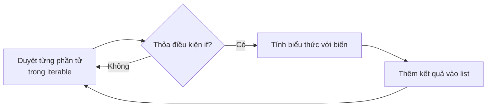
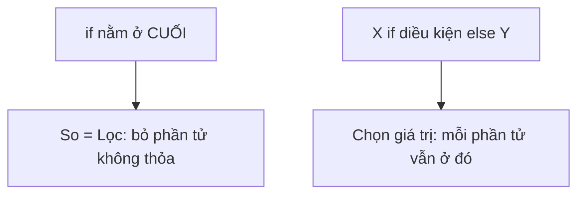

# Bài 26 — List Comprehension – Vòng Lặp "Viết Trong Một Dòng"

> 🎓 **Chương 5 – Lập trình hướng đối tượng & các công cụ nâng cao**

## 🧠 Điều kiện tiên quyết

- [Bài 10 — Vòng Lặp For – Lặp Lại Một Số Lần Biết Trước](../10-Vong-Lap-For/bai.md)
- [Bài 14 — Danh Sách (List) Trong Python](../14-List/bai.md)

---

## 🎯 Mục tiêu

Sau bài học này, học viên sẽ:

* ✅ Hiểu **list comprehension là gì** — viết vòng lặp sinh danh sách trong một dòng.
* ✅ Viết được cú pháp cơ bản `[bieuthuc for phantu in danhsach]`.
* ✅ Thêm được **bộ lọc `if`** để chỉ giữ phần tử thỏa điều kiện.
* ✅ Dùng được **`if...else`** để chọn giá trị khác nhau theo điều kiện.
* ✅ Viết được **set comprehension** và **dict comprehension** tương tự.
* ✅ Biết **lợi ích** (ngắn gọn, đẹp mắt) và **nhược điểm** (khó đọc khi phức tạp).

---

## 📖 Kiến thức

### 1. Vấn đề: tạo danh sách bình phương — cách dài

Ở bài 10 (vòng lặp `for`) và bài 14 (list), muốn tạo danh sách bình phương của các số 0..9 ta viết:

```python
binh_phuong = []                    # danh sách rỗng
for x in range(10):                 # duyệt từng số
    binh_phuong.append(x * x)       # thêm bình phương vào cuối
print(binh_phuong)                  # [0, 1, 4, 9, 16, 25, 36, 49, 64, 81]
```

4 dòng chỉ để "gom dữ liệu lại" — hơi dài dòng. Người Python "chế" ra cách viết **cả vòng lặp ngay trong dấu ngoặc vuông của list**:

```python
binh_phuong = [x * x for x in range(10)]
print(binh_phuong)   # [0, 1, 4, 9, 16, 25, 36, 49, 64, 81]
```

**Kết quả giống hệt, code ngắn hơn nhiều!** 🎉

> 💬 **Nói đơn giản:** List comprehension là "vòng lặp chạy trong dấu `[]`" — vừa duyệt, vừa tạo ra danh sách mới, hoàn toàn không cần `append`.

### 2. Cú pháp cơ bản (hình)

```python
[bieu_thuc for bien in iterable]
```



| Thành phần | Ý nghĩa | Ví dụ |
|---|---|---|
| `bieu_thuc` | Giá trị muốn có trong list mới | `x * x` |
| `for x in iterable` | Duyệt từng giá trị | `for x in range(10)` |
| `if dieu_kien` (tùy chọn) | Lọc — chỉ giữ phần tử thỏa điều kiện | `if x % 2 == 0` |

Cấu trúc chung đầy đủ:

```python
mang_moi = [bieu_thuc for bien in iterable if dieu_kien]
```

### 3. Bộ lọc `if`

Chỉ giữ những phần tử thỏa điều kiện — giống hệt `filter` ở bài 25 nhưng gọn hơn:

```python
so_chan = [x for x in range(1, 11) if x % 2 == 0]
print(so_chan)   # [2, 4, 6, 8, 10]
```

So sánh các cách viết:

| Cách viết | Code |
|---|---|
| Vòng lặp + `if` + `append` | `so_chan = []; for x in ...: if ...: append(...)` |
| `filter` + lambda (bài 25) | `list(filter(lambda x: x % 2 == 0, so))` |
| List comprehension | `[x for x in so if x % 2 == 0]` 👍 |

### 4. `if...else` bên trong biểu thức

Nếu cần **trả giá trị khác nhau tùy điều kiện**, đặt `if/else` vào phía trái (vị trí biểu thức) — KHÁC với bộ lọc:

```python
so = [1, 2, 3, 4, 5, 6]

# Số chẵn → "chan", số lẻ → "le"
nhan = ["chan" if x % 2 == 0 else "le" for x in so]
print(nhan)   # ['le', 'chan', 'le', 'chan', 'le', 'chan']
```

> ⚠️ **Điểm dễ nhầm nhất bài này:**
> * `[X for x in so if DIEU_KIEN]` — **LỌC**: phần tử không thỏa sẽ bị bỏ.
> * `[X if DIEU_KIEN else Y for x in so]` — **CHỌN GIÁ TRỊ**: mỗi phần tử vẫn được giữ, chỉ là chọn X hay Y.
> * "if đứng cuối" = lọc; "if đứng đầu (có else)" = chọn giá trị.



### 5. List comprehension lồng nhau (nested) — cơ bản

Khi cần duyệt "bảng trong bảng" (ví dụ ma trận), viết vòng ngoài trước, vòng trong sau:

```python
ket = [x + y for x in [1, 2] for y in [10, 20]]
print(ket)   # [11, 21, 12, 22]
```

Đọc nó như vòng lặp bình thường:

```python
ket = []
for x in [1, 2]:          # vòng NGOÀI
    for y in [10, 20]:    # vòng TRONG
        ket.append(x + y)
```

### 6. Set comprehension và dict comprehension

Nguyên tắc giống hệt, chỉ thay dấu ngoặc:

* **Set** `{bieu thuc for ...}` — kết quả **không trùng lặp**:

```python
chu_cai = {c for c in "hello"}
print(chu_cai)   # {'e', 'h', 'l', 'o'} — chữ 'l' chỉ xuất hiện 1 lần
```

* **Dict** `{key: value for ...}` — mỗi phần tử sinh một cặp **khóa: giá trị**:

```python
bp = {x: x * x for x in range(1, 6)}
print(bp)   # {1: 1, 2: 4, 3: 9, 4: 16, 5: 25}
```

### 7. Lợi ích và khả năng đọc (readability)

| Lợi ích | Nói rõ |
|---|---|
| ✂️ Ngắn gọn | Thay 3-4 dòng vòng lặp + append bằng 1 dòng |
| 🌿 Dễ đọc | Đọc kiểu tiếng Anh: "x*x cho từng x trong 1..10" |
| ⚡ Nhanh | Chạy nhanh hơn vòng lặp tay trong Python |
| 🧩 Đa dụng | Dùng được cho list, set, dict |

**Nhưng đừng dùng với nỗi sợ đọc:** PEP 8 khuyên comprehension chỉ nên có độ khó vừa phải. Nếu cần **nhiều `if`/`for` hay logic phức tạp** → quay lại vòng lặp `for`: "readable" (đọc được) quan trọng hơn "ngắn".

| Tình huống | Nên dùng cái nào |
|---|---|
| 1 biểu thức + 1 điều kiện đơn giản | ✅ List comprehension |
| Nhiều vòng lồng nhau, nhiều if | ✅ Vòng lặp `for` bình thường |

---

## 💡 Ví dụ minh họa

### Ví dụ 1: Bình phương các số 0..9

```python
# Biểu thức x*x; duyệt x trong range(10); không có bộ lọc
bp = [x * x for x in range(10)]
print(bp)   # [0, 1, 4, 9, 16, 25, 36, 49, 64, 81]
```

**Giải thích từng dòng:**

| Phần code | Ý nghĩa |
|---|---|
| `x * x` | Biểu thức — kết quả mỗi phần tử của list mới |
| `for x in range(10)` | Vòng lặp x chạy 0→9 |
| `[...]` | Bọc trong dấu list để tạo danh sách |
| `print(bp)` | Hiển thị toàn bộ danh sách kết quả |

### Ví dụ 2: Chỉ giữ số lẻ

```python
# Giữ nguyên giá trị x nếu nó là số lẻ
le = [x for x in range(1, 31) if x % 2 == 1]
print(le)   # [1, 3, 5, 7, ..., 29]
```

**Giải thích từng dòng:**
* `x` đứng đầu — giữ nguyên giá trị khi điều kiện đúng.
* `if x % 2 == 1` — bộ lọc cuối cùng: phải lẻ mới được giữ.
* Kết quả: mọi số lẻ từ 1 đến 29.

### Ví dụ 3: Lọc chẵn rồi bình phương

```python
so = [1, 2, 3, 4, 5, 6, 7, 8]
# Lọc chẵn trước, bình phương sau
ket = [x * x for x in so if x % 2 == 0]
print(ket)   # [4, 16, 36, 64]
```

**Giải thích từng dòng:**
* `if x % 2 == 0` — bộ lọc: chỉ số chẵn đi tiếp.
* `x * x` — biến đổi: số chẵn sau khi bình phương thành [4, 16, 36, 64].
* Thứ tự hoạt động: **duyệt → lọc → biến đổi → thêm vào list**.

---

## 🔬 Ví dụ nâng cao

### Ví dụ 1: Thống kê điểm học sinh (kết hợp dataclass bài 24)

```python
from dataclasses import dataclass

@dataclass
class HocSinh:
    ten: str
    diem: float

lop = [
    HocSinh("An", 8.5),
    HocSinh("Bình", 6.0),
    HocSinh("Cường", 9.0),
    HocSinh("Dung", 7.5),
]

# Danh sách tên học sinh giỏi (diem >= 8)
gioi = [hs.ten for hs in lop if hs.diem >= 8]
print("Hoc sinh gioi:", gioi)

# Trung bình của cả lớp bằng list comprehension
trung_binh = sum([hs.diem for hs in lop]) / len(lop)
print("Diem trung binh lop:", round(trung_binh, 2))
```

Kết quả:

```
Hoc sinh gioi: ['An', 'Cường']
Diem trung binh lop: 7.62
```

> 💡 Có thể bỏ ngoặc `[]` trong `sum(...)` để thành generator — chi tiết bài 27!

### Ví dụ 2: Dict comprehension đếm chữ cái (thống kê tần suất)

```python
cau = "python la ngon ngu tuyen voi"

# Đếm số lần xuất hiện mỗi chữ cái (bỏ khoảng trắng)
dem = {c: cau.lower().count(c) for c in set(cau) if c != " "}
print(dem)
```

Kết quả (ví dụ):

```
{'l': 2, 'n': 5, 'p': 1, ...}
```

> 🔎 Ý tưởng: với mỗi chữ cái duy nhất (lấy từ `set`), đếm bằng `count(c)`.

### Ví dụ 3: if/else chọn nhãn điểm

```python
so_diem = [8.5, 4.0, 6.0, 9.0]

# >=8 → "Dat" ngược lại → "Chua"
nhan = ["Dat" if d >= 8 else "Chua" for d in so_diem]
print(nhan)   # ['Dat', 'Chua', 'Chua', 'Dat']
```

> 🧠 Lưu ý cấu trúc: `"Dat" if d >= 8 else "Chua"` **nằm ở vị trí biểu thức** (đầu), không phải phần lọc.

### Ví dụ 4: Nested — bảng cửu chương nhỏ

```python
# Bảng nhân 3x3 không kẹp trong vòng lặp tay
bang = [f"{a} x {b} = {a * b}" for a in range(1, 4) for b in range(1, 4)]
for dong in bang:
    print(dong)
```

Kết quả:

```
1 x 1 = 1
1 x 2 = 2
...
3 x 3 = 9
```

---

## ⚠️ Lỗi thường gặp

### Lỗi 1: Viết sai điều kiện bộ lọc

```python
# Mục tiêu: lấy số chẵn
sai = [x for x in range(1, 6) if x]            # ❌ SAI — if x đúng với mọi số khác 0
dung = [x for x in range(1, 6) if x % 2 == 0]  # ✅ ĐÚNG
```

* **Nguyên nhân:** `if x` kiểm tra "khác 0" chứ không phải "chẵn".
* **Cách sửa:** viết đúng điều kiện `x % 2 == 0`.

### Lỗi 2: Nhầm vị trí `if/else` đứng đầu và cuối

```python
# ❌ SAI — sau vòng for chỉ được phép if (lọc), không được if...else
sai = [x if x > 2 for x in [1, 2, 3, 4]]
```

* **Kết quả báo:** `SyntaxError: invalid syntax`
* **Nguyên nhân:** phía sau `for ...` chỉ cho phép `if` lọc, không có `else`.
* **Cách sửa:** `[x if x > 2 else 0 for x in ...]` khi chọn giá trị; `[x for x in ... if x > 2]` khi lọc.

### Lỗi 3: Lẫn set/dict comprehension với list khi gõ `{}`

```python
# Đúng ý là list nhưng gõ ngoặc { }
sai = {x for x in [1, 2, 2, 3]}   # kết quả là set: {1, 2, 3} — mất lặp, mất thứ tự
```

* **Nguyên nhân:** `{...}` tạo **set** (không trùng), không phải list.
* **Cách sửa:** dùng `[...]` nếu muốn list bảo toàn thứ tự và cho phép lặp.

### Lỗi 4: Comprehension quá phức tạp — không đọc nổi

```python
# ❌ Khó đọc — ba vòng lồng nhau + nhiều if trong một dòng
phuc_tap = [a + b + c for a in A for b in B for c in C if a > b if b < c]
```

* **Nguyên nhân:** một dòng cố nuốt cả thuật toán.
* **Cách sửa:** tách bằng vòng lặp `for` bình thường hoặc viết hàm `def` riêng.

### Lỗi 5: Gõ ngoặc `{}` khi muốn list — nhận được set

```python
danh_sach = {x for x in [1, 2, 2, 3]}   # ❌ tạo ra set {1, 2, 3} — bị loại lặp, thứ tự không đảm bảo
danh_sach = [x for x in [1, 2, 2, 3]]   # ✅ list giữ nguyên: [1, 2, 2, 3]
```

* **Nguyên nhân:** ngoặc `{}` luôn tạo **set**, không phải list.
* **Cách sửa:** dùng `[...]` khi muốn giữ thứ tự và cho phép trùng.

---

## 💎 Mẹo

* 🧮 **Áp dụng cho list + set + dict** chỉ đổi dấu ngoặc — học một được ba.
* 🔤 **Đặt tên biến vòng ngắn** (`x`, `i`, `c`, `hs`) — đừng đặt biến dài lòi cả dòng.
* 🧹 **Kết hợp với `sum`/`max`:** `sum([x*x for x in so])` — tính nhanh tổng, max có điều kiện.
* 🚦 **if lọc (cuối) và if/else chọn (đầu)** — phân biệt sẽ hết lỗi vị trí.
* 📏 **Giới hạn 1-2 điều kiện.** Nếu dòng bị dài/tối nghĩa → dùng vòng lặp `for` + biến ai nói gì cũng không đẹp bằng.
* 🪞 **Viết lại 3-4 dòng append cũ thành comprehension** để dần quen mắt.

---

## 📝 Tóm tắt

| Khái niệm | Cú pháp / Ghi chú |
|---|---|
| 📋 Cơ bản | `[bieu_thuc for x in iterable]` |
| 🧯 Lọc | `[x for x in iterable if dieu_kien]` |
| 🎭 Chọn giá trị | `[X if dk else Y for x in iterable]` |
| 🪆 Lồng nhau | `[... for x in A for y in B]` — ngoài trước, trong sau |
| 🗂️ Set | `{x for x in ...}` — không trùng lặp |
| 🗺️ Dict | `{k: v for ...}` — cặp khóa/giá trị |
| ⚖️ Ưu | Ngắn, đẹp, nhanh |
| ⚠️ Nhược | Khó đọc khi quá phức tạp → xê dùng vòng lặp |

---

## 🧪 Kiểm tra nhanh

1. ❓ Viết comprehension lấy bình phương các số 1..5.
2. ❓ `[x for x in data if x % 2 == 1]` giữ lại loại số gì?
3. ❓ Phân biệt: `if` cuối **lọc** hay **chọn giá trị**?
4. ❓ Viết comprehension lấy các số ≥ 10 trong `[3, 12, 7, 20]`.
5. ❓ Dict comprehension `{x: x**2 for x in range(1,4)}` cho ra gì?
6. ❓ Set comprehension có đặc điểm gì so với list?
7. ❓ Khi nào nên tránh dùng comprehension?
8. ❓ Viết `if/else` trong comprehension đổi số chẵn thành `"E"`, lẻ thành `"O"` cho [1..5].

<details>
<summary>🔍 Xem đáp án</summary>

1. `[x * x for x in range(1, 6)]`.
2. Số lẻ.
3. Lọc — bỏ phần tử không thỏa.
4. `[x for x in [3, 5, 7, 20] if x >= 10]` → `[20]`.
5. `{1: 1, 2: 4, 3: 9}` — (chú ý x: x**2 với x ∈ {1,2,3}).
6. Không trùng lặp, không theo thứ tự cố định.
7. Khi logic phức tạp, nhiều vòng/điều kiện, đọc rối → dùng `for`.
8. `["E" if x % 2 == 0 else "O" for x in range(1, 6)]` → `['O', 'E', 'O', 'E', 'O']`.

</details>

---

## 📚 Bài đọc thêm

* [Python.org – Lis[] display (tài liệu chính thức)](https://docs.python.org/3/tutorial/datastructures.html#list-comprehensions)
* [Real Python – When to Use a List Comprehension](https://realpython.com/list-comprehension-python/)
* [W3Schools – List Comprehension](https://www.w3schools.com/python/python_lists_comprehension.asp)

---

---

## 🧩 Bài tập

> 📝 🎯 **Chủ đề:** Vòng lặp sinh danh sách một dòng: cú pháp cơ bản, bộ lọc `if`, `if/else`, lồng nhau, set/dict comprehension.

## 🟢 Dễ (Bài 1 – 7)

### Bài 1: Bình phương các số 0–9

* **Đề bài:** Dùng list comprehension tạo danh sách bình phương của các số `0, 1, 2, ..., 9` và in ra.
* **Input:** Không có.
* **Output:**
  ```
  [0, 1, 4, 9, 16, 25, 36, 49, 64, 81]
  ```
* **Gợi ý:** `[x * x for x in range(10)]`.

### Bài 2: Danh sách số chẵn 1–20

* **Đề bài:** Dùng comprehension lấy các số chẵn từ 1 đến 20 và in.
* **Input:** Không có.
* **Output:**
  ```
  [2, 4, 6, 8, 10, 12, 14, 16, 18, 20]
  ```
* **Gợi ý:** `[x for x in range(1, 21) if x % 2 == 0]`.

### Bài 3: Viết hoa tên học sinh

* **Đề bài:** Cho `ten = ["an", "binh", "cuong"]`. Dùng comprehension tạo danh sách các tên **viết hoa** và in.
* **Input:** Không có.
* **Output:**
  ```
  ['AN', 'BINH', 'CUONG']
  ```
* **Gợi ý:** `[t.upper() for t in ten]`.

### Bài 4: Nhân đôi và cộng thêm 1

* **Đề bài:** Cho `so = [1, 2, 3, 4]`. Tạo list mới mỗi phần tử bằng `x * 2 + 1` và in.
* **Input:** Không có.
* **Output:**
  ```
  [3, 5, 7, 9]
  ```
* **Gợi ý:** `[x * 2 + 1 for x in so]`.

### Bài 5: Chữ cái của một chuỗi

* **Đề bài:** Cho `tu = "python"`. Dùng comprehension tạo danh sách từng ký tự của chuỗi và in.
* **Input:** Không có.
* **Output:**
  ```
  ['p', 'y', 't', 'h', 'o', 'n']
  ```
* **Gợi ý:** duyệt `for c in tu` — chuỗi cũng là iterable.

### Bài 6: Số lớn hơn 10

* **Đề bài:** Cho `data = [3, 12, 7, 20, 1, 15]`. Lọc các số **lớn hơn 10** và in.
* **Input:** Không có.
* **Output:**
  ```
  [12, 20, 15]
  ```
* **Gợi ý:** `[x for x in data if x > 10]`.

### Bài 7: Độ dài từng tên

* **Đề bài:** Cho `ten = ["An", "Binh", "Cuong"]`. Tạo list chứa **độ dài** của mỗi tên và in.
* **Input:** Không có.
* **Output:**
  ```
  [2, 4, 5]
  ```
* **Gợi ý:** `[len(t) for t in ten]`.

---

## 🟡 Trung bình (Bài 8 – 14)

### Bài 8: Lọc chẵn rồi bình phương

* **Đề bài:** Cho `so = list(range(1, 11))`. Dùng comprehension lọc số chẵn rồi **bình phương** chúng, in kết quả.
* **Input:** Không có.
* **Output:**
  ```
  [4, 16, 36, 64, 100]
  ```
* **Gợi ý:** `[x * x for x in so if x % 2 == 0]`.

### Bài 9: Nhãn chẵn/lẻ (if/else)

* **Đề bài:** Cho `so = [1, 2, 3, 4, 5]`. Dùng if/else trong comprehension tạo list các chuỗi `"E"` (chẵn) hoặc `"O"` (lẻ) và in.
* **Input:** Không có.
* **Output:**
  ```
  ['O', 'E', 'O', 'E', 'O']
  ```
* **Gợi ý:** `["E" if x % 2 == 0 else "O" for x in so]`.

### Bài 10: Set comprehension – bình phương tập số

* **Đề bài:** Cho `so = [1, 2, 2, 3, 3, 4]`. Dùng set comprehension tạo tập bình phương của các số (không trùng) và in.
* **Input:** Không có.
* **Output:**
  ```
  {16, 1, 9, 4}
  ```
* **Gợi ý:** `{x * x for x in so}` — set tự loại trùng.

### Bài 11: Dict comprehension – khóa và bình phương

* **Đề bài:** Dùng dict comprehension tạo từ điển `{số: bình phương}` cho các số 1..5 và in.
* **Input:** Không có.
* **Output:**
  ```
  {1: 1, 2: 4, 3: 9, 4: 16, 5: 25}
  ```
* **Gợi ý:** `{x: x * x for x in range(1, 6)}`.

### Bài 12: Bảng cửu chương nhân 5

* **Đề bài:** Dùng comprehension tạo danh sách các chuỗi `"5 x k = kq"` cho k = 1..10, in mỗi dòng một phép tính.
* **Input:** Không có.
* **Output:**
  ```
  5 x 1 = 5
  5 x 2 = 10
  ...
  5 x 10 = 50
  ```
* **Gợi ý:** `[f"5 x {k} = {5 * k}" for k in range(1, 11)]` rồi vòng lặp in.

### Bài 13: Đếm số chẵn bằng comprehension

* **Đề bài:** Cho `so = [3, 8, 12, 7, 20, 1, 24]`. Dùng comprehension + `len()` để **đếm số chẵn** và in ra số đếm.
* **Input:** Không có.
* **Output:**
  ```
  4
  ```
* **Gợi ý:** `len([x for x in so if x % 2 == 0])`.

### Bài 14: Làm phẳng ma trận (nested cơ bản)

* **Đề bài:** Cho `ma_tran = [[1, 2], [3, 4], [5, 6]]`. Dùng comprehension lồng nhau để gom tất cả phần tử thành **một list phẳng** và in.
* **Input:** Không có.
* **Output:**
  ```
  [1, 2, 3, 4, 5, 6]
  ```
* **Gợi ý:** `[x for hang in ma_tran for x in hang]` — vòng ngoài duyệt hàng, vòng trong duyệt phần tử.

---

## 🔴 Khó (Bài 15 – 20)

### Bài 15: Điểm trung bình lớp bằng comprehension

* **Đề bài:** Cho `diem = [8.5, 6.0, 9.0, 7.5]`. Dùng comprehension + `sum()` để tính trung bình cộng và in kết quả 2 chữ số thập phân.
* **Input:** Không có.
* **Output:**
  ```
  7.75
  ```
* **Gợi ý:** `sum([d for d in diem]) / len(diem)` — đơn giản hóa: `sum(diem) / len(diem)`, rồi `round(..., 2)`.

### Bài 16: Đếm tần suất chữ cái (dict comprehension)

* **Đề bài:** Cho `cau = "hoc hoc nua hoc mai"`. Dùng dict comprehension tạo từ điển đếm **số lần xuất hiện** mỗi chữ cái (bỏ khoảng trắng) và in từ điển.
* **Input:** Không có.
* **Output:** Ví dụ:
  ```
  {'h': 4, 'o': 4, 'c': 3, 'n': 1, 'u': 1, 'a': 2, 'm': 1, 'i': 1}
  ```
* **Gợi ý:** `{c: cau.count(c) for c in set(cau) if c != " "}`.

### Bài 17: Số chính phương nhỏ hơn 50

* **Đề bài:** Tìm tất cả **số chính phương** (n = x² với x nguyên) nhỏ hơn 50 bằng comprehension lồng nhau (duyệt x từ 0 đến 7) và in.
* **Input:** Không có.
* **Output:**
  ```
  [0, 1, 4, 9, 16, 25, 36, 49]
  ```
* **Gợi ý:** `[x * x for x in range(8) if x * x < 50]`.

### Bài 18: Phân loại điểm học sinh (if/else phức tạp)

* **Đề bài:** Cho `diem = [9.0, 5.5, 7.0, 3.5, 8.0]`. Dùng if/else trong comprehension tạo list nhãn: `"Gioi"` (≥8), `"Kha"` (≥6.5), `"TB"` (còn lại) và in.
* **Input:** Không có.
* **Output:**
  ```
  ['Gioi', 'TB', 'Kha', 'TB', 'Gioi']
  ```
* **Gợi ý:** cần if/elif/else — viết bằng cách **lồng**: `"Gioi" if d >= 8 else ("Kha" if d >= 6.5 else "TB")`.

### Bài 19: Lọc sản phẩm theo giá + tổng

* **Đề bài:** Cho giá sản phẩm `gia = [50000, 120000, 30000, 250000, 80000]`. Dùng comprehension lọc những sản phẩm **giá trên 60000**, tính tổng chúng và in tổng.
* **Input:** Không có.
* **Output:**
  ```
  450000
  ```
* **Gợi ý:** `sum([g for g in gia if g > 60000])` → 120000 + 250000 + 80000.

### Bài 20: Bảng điểm chi tiết (tổng hợp)

* **Đề bài:** Cho danh sách tuple `(tên, điểm)`: `[("An", 8.5), ("Binh", 4.0), ("Cuong", 9.0), ("Dung", 6.5)]`. Viết chương trình: (1) danh sách tên học sinh đậu (điểm ≥ 5) bằng comprehension, (2) điểm cao nhất bằng `max`, (3) in kết quả.
* **Input:** Không có.
* **Output:**
  ```
  Hoc sinh dau: ['An', 'Cuong', 'Dung']
  Diem cao nhat: 9.0
  ```
* **Gợi ý:** `[hs[0] for hs in lop if hs[1] >= 5]` và `max(lop, key=lambda hs: hs[1])[1]`.

---

## 🎯 Tổng kết sau khi làm bài

Sau 20 bài tập, bạn đã:

* ✅ Viết thành thạo comprehension cơ bản, bộ lọc `if`, `if/else`.
* ✅ Làm quen set/dict comprehension và nested.
* ✅ Kết hợp comprehension với `sum`, `len`, `max` để xử lý dữ liệu thực tế.

> 💪 Chưa tự làm được bài nào thì đừng lo — hãy xem lại bài giảng rồi quay lại. **Lập trình là luyện tập!**

---

## ✅ Đáp án

> 💡 **Hãy tự làm bài tập trước** rồi mới mở đáp án.

## 🟢 Dễ (Bài 1 – 7)


<details>
<summary>✅ Bài 1: Bình phương các số 0–9</summary>


**Phân tích:** Tạo list mới bằng biểu thức đơn giản không cần append.

**Ý tưởng:** `[x * x for x in range(10)]` — biểu thức bên trái, vòng lặp bên phải.

**Thuật toán:**
1. Duyệt x từ 0 đến 9.
2. Tính x*x và nạp vào list.

**Code:**

```python
bp = [x * x for x in range(10)]
print(bp)
```

**Giải thích code:**
* `x * x` — thành phần giá trị.
* `for x in range(10)` — bộ duyệt.
* Kết quả: [0, 1, 4, 9, ... 81].

**Độ phức tạp:** O(n).

---

</details>

<details>
<summary>✅ Bài 2: Danh sách số chẵn 1–20</summary>


**Phân tích:** Duyệt + lọc điều kiện chẵn.

**Ý tưởng:** `[x for x in range(1, 21) if x % 2 == 0]`.

**Code:**

```python
so_chan = [x for x in range(1, 21) if x % 2 == 0]
print(so_chan)
```

**Giải thích code:**
* `if x % 2 == 0` — bộ lọc phía sau for: phần tử lẻ bị bỏ.
* `range(1, 21)` → 1..20.

**Độ phức tạp:** O(n).

---

</details>

<details>
<summary>✅ Bài 3: Viết hoa tên học sinh</summary>


**Phân tích:** Biến đổi từng chuỗi bằng `.upper()`.

**Ý tưởng:** `[t.upper() for t in ten]`.

**Code:**

```python
ten = ["an", "binh", "cuong"]
hoa = [t.upper() for t in ten]
print(hoa)
```

**Giải thích code:** mỗi `t` được gọi `.upper()` → `['AN', 'BINH', 'CUONG']`.

**Độ phức tạp:** O(n).

---

</details>

<details>
<summary>✅ Bài 4: Nhân đôi và cộng thêm 1</summary>


**Phân tích:** Biểu thức biến đổi phức hợp một bước.

**Ý tưởng:** `[x * 2 + 1 for x in so]`.

**Code:**

```python
so = [1, 2, 3, 4]
moi = [x * 2 + 1 for x in so]
print(moi)
```

**Giải thích code:** `1→3, 2→5, 3→7, 4→9`.

**Độ phức tạp:** O(n).

---

</details>

<details>
<summary>✅ Bài 5: Chữ cái của một chuỗi</summary>


**Phân tích:** Chuỗi là iterable nên duyệt trực tiếp từng ký tự.

**Ý tưởng:** `[c for c in "python"]`.

**Code:**

```python
ket = [c for c in "python"]
print(ket)
```

**Giải thích code:** `for c in "python"` — mỗi chữ cái thành một phần tử.

**Độ phức tạp:** O(n).

---

</details>

<details>
<summary>✅ Bài 6: Số lớn hơn 10</summary>


**Phân tích:** Lọc theo điều kiện > 10.

**Ý tưởng:** `[x for x in data if x > 10]`.

**Code:**

```python
data = [3, 12, 7, 20, 1, 15]
lon = [x for x in data if x > 10]
print(lon)
```

**Giải thích code:** 12, 20, 15 > 10 `d`ược giữ; 3, 7, 1 bị bỏ.

**Độ phức tạp:** O(n).

---

</details>

<details>
<summary>✅ Bài 7: Độ dài từng tên</summary>


**Phân tích:** Biến đổi tên → độ dài.

**Ý tưởng:** `[len(t) for t in ten]`.

**Code:**

```python
ten = ["An", "Binh", "Cuong"]
do_dai = [len(t) for t in ten]
print(do_dai)
```

**Giải thích code:** `len("An")=2`, `len("Binh")=4`, `len("Cuong")=5`.

**Độ phức tạp:** O(n).

---

</details>

## 🟡 Trung bình (Bài 8 – 14)


<details>
<summary>✅ Bài 8: Lọc chẵn rồi bình phương</summary>


**Phân tích:** Hai công việc trong một dòng: lọc + biến đổi.

**Ý tưởng:** đưa `if` (lọc) vào trước biến đổi: `[x * x for x in so if x % 2 == 0]`.

**Code:**

```python
so = list(range(1, 11))
bp_chan = [x * x for x in so if x % 2 == 0]
print(bp_chan)
```

**Giải thích code:** số chẵn trong 1..10 là 2,4,6,8,10 → bình phương → [4, 16, 36, 64, 100].

**Độ phức tạp:** O(n).

---

</details>

<details>
<summary>✅ Bài 9: Nhãn chẵn/lẻ (if/else)</summary>


**Phân tích:** Mỗi phần tử vẫn giữ, chỉ đổi giá trị → dùng if/else **ở vị trí biểu thức**.

**Ý tưởng:** `["E" if x % 2 == 0 else "O" for x in so]`.

**Code:**

```python
so = [1, 2, 3, 4, 5]
nhan = ["E" if x % 2 == 0 else "O" for x in so]
print(nhan)
```

**Giải thích code:** lẻ→"O", chẵn→"E" → `['O', 'E', 'O', 'E', 'O']`.

**Độ phức tạp:** O(n).

---

</details>

<details>
<summary>✅ Bài 10: Set comprehension – bình phương tập số</summary>


**Phân tích:** Set tự loại trùng và không theo thứ tự.

**Ý tưởng:** `{x * x for x in so}`.

**Code:**

```python
so = [1, 2, 2, 3, 3, 4]
bp = {x * x for x in so}
print(bp)
```

**Giải thích code:** các giá trị bình phương {16, 1, 9, 4} — ngoặc `{}` tự loại phần tử trùng.

**Độ phức tạp:** O(n).

---

</details>

<details>
<summary>✅ Bài 11: Dict comprehension – khóa và bình phương</summary>


**Phân tích:** Chỉ cần cặp khóa: giá trị.

**Ý tưởng:** `{x: x * x for x in range(1, 6)}`.

**Code:**

```python
bp = {x: x * x for x in range(1, 6)}
print(bp)
```

**Giải thích code:** mỗi x → cặp `x: x*x` — đầu ra {1:1, 2:4, 3:9, 4:16, 5:25}.

**Độ phức tạp:** O(n).

---

</details>

<details>
<summary>✅ Bài 12: Bảng cửu chương nhân 5</summary>


**Phân tích:** Tạo chuỗi có định dạng, sau đó in từng dòng.

**Ý tưởng:** comprehension sinh chuỗi, vòng `for` in.

**Code:**

```python
bang = [f"5 x {k} = {5 * k}" for k in range(1, 11)]
for dong in bang:
    print(dong)
```

**Giải thích code:** `f"..."` chèn k và kết quả `5*k` vào chuỗi; vòng lặp in 10 dòng.

**Độ phức tạp:** O(n).

---

</details>

<details>
<summary>✅ Bài 13: Đếm số chẵn bằng comprehension</summary>


**Phân tích:** đếm lượng phần tử thỏa điều kiện.

**Ý tưởng:** comprehension tạo list chứa số chẵn rồi đo `len`.

**Code:**

```python
so = [3, 8, 12, 7, 20, 1, 24]
dem = len([x for x in so if x % 2 == 0])
print(dem)
```

**Giải thích code:** list lọc là [8, 12, 20, 24] → len = 4.

**Độ phức tạp:** O(n).

---

</details>

<details>
<summary>✅ Bài 14: Làm phẳng ma trận (nested)</summary>


**Phân tích:** Vòng ngoài duyệt từng hàng, vòng trong duyệt từng phần tử trong hàng.

**Ý tưởng:** `[x for hang in ma_tran for x in hang]`.

**Code:**

```python
ma_tran = [[1, 2], [3, 4], [5, 6]]
phang = [x for hang in ma_tran for x in hang]
print(phang)
```

**Giải thích code:** thứ tự vòng: hang -> x; kết quả [1, 2, 3, 4, 5, 6].

**Độ phức tạp:** O(tổng số phần tử).

---

</details>

## 🔴 Khó (Bài 15 – 20)


<details>
<summary>✅ Bài 15: Điểm trung bình lớp bằng comprehension</summary>


**Phân tích:** Điểm trung bình = tổng / số lượng.

**Ý tưởng:** comprehension tạo list điểm, dùng `sum` + `len`, làm tròn 2 chữ số.

**Thuật toán:**
1. Tính tổng danh sách điểm bằng `sum`.
2. Chia cho số lượng `len`.
3. Làm tròn và in.

**Code:**

```python
diem = [8.5, 6.0, 9.0, 7.5]

tong = sum([d for d in diem])
trung_binh = round(tong / len(diem), 2)
print(trung_binh)
```

**Giải thích code:**
* `sum([d for d in diem])` — comprehension rõ ý: "d cho từng d trong diem".
* `31.0 / 4 = 7.75` → 2 chữ số thập phân.

**Độ phức tạp:** O(n).

---

</details>

<details>
<summary>✅ Bài 16: Đếm tần suất chữ cái</summary>


**Phân tích:** Dict comprehension đếm tần suất; `set` để có danh sách chữ cái duy nhất.

**Ý tưởng:** `{c: cau.count(c) for c in set(cau) if c != " "}`.

**Code:**

```python
cau = "hoc hoc nua hoc mai"

dem = {c: cau.count(c) for c in set(cau) if c != " "}
print(dem)
```

**Giải thích code:**
* `set(cau)` — các chữ cái duy nhất.
* `cau.count(c)` — số lần chữ cái xuất hiện.
* `if c != " "` — bỏ khoảng trắng.

**Độ phức tạp:** O(n²) khi dùng `count(c)` nhiều lần (n nhỏ thì chấp nhận).

---

</details>

<details>
<summary>✅ Bài 17: Số chính phương nhỏ hơn 50</summary>


**Phân tích:** Lọc những bình phương thỏa điều kiện.

**Ý tưởng:** duyệt x từ 0 đến 7, giữ khi `x*x < 50`.

**Code:**

```python
cp = [x * x for x in range(8) if x * x < 50]
print(cp)
```

**Giải thích code:** 0,1,…,7 bình phương: 0,1,4,9,16,25,36,49 đều <50.

**Độ phức tạp:** O(k).

---

</details>

<details>
<summary>✅ Bài 18: Phân loại điểm học sinh</summary>


**Phân tích:** Cần 3 nhãn → dùng if/else lồng trong biểu thức.

**Ý tưởng:** `"Gioi" if d >= 8 else ("Kha" if d >= 6.5 else "TB")`.

**Code:**

```python
diem = [9.0, 5.5, 7.0, 3.5, 8.0]

nhan = [
    "Gioi" if d >= 8 else ("Kha" if d >= 6.5 else "TB")
    for d in diem
]
print(nhan)
```

**Giải thích code:**
* if/else đầu — chọn giá trị mọi phần tử.
* lồng `Kha`/`TB` cho trường hợp 6.5 > d.

**Độ phức tạp:** O(n).

---

</details>

<details>
<summary>✅ Bài 19: Lọc sản phẩm theo giá + tổng</summary>


**Phân tích:** Lọc giá > 60000 rồi sum.

**Ý tưởng:** `sum([g for g in gia if g > 60000])`.

**Code:**

```python
gia = [50000, 120000, 30000, 250000, 80000]

tong = sum([g for g in gia if g > 60000])
print(tong)
```

**Giải thích code:** 120000 + 250000 + 80000 = 450000 (bỏ 50000, 30000).

**Độ phức tạp:** O(n).

---

</details>

<details>
<summary>✅ Bài 20: Bảng điểm chi tiết (tổng hợp)</summary>


**Phân tích:** Kết hợp comprehension (danh sách tên) và `max` với key lambda.

**Ý tưởng:** lọc đậu trước, rồi `max` theo điểm.

**Code:**

```python
lop = [("An", 8.5), ("Binh", 4.0), ("Cuong", 9.0), ("Dung", 6.5)]

dau = [hs[0] for hs in lop if hs[1] >= 5]
cao_nhat = max(lop, key=lambda hs: hs[1])[1]

print("Hoc sinh dau:", dau)
print("Diem cao nhat:", cao_nhat)
```

**Giải thích code:**
* `[hs[0] for hs in lop if hs[1] >= 5]` — tên những người điểm ≥ 5.
* `max(lop, key=lambda hs: hs[1])` — tuple có điểm lớn nhất `("Cuong",9.0)`, `[1]` lấy điểm.

**Độ phức tạp:** O(n log n).

---

</details>

## 📌 Lời khuyên cuối


* Luôn nhớ: **if cuối = lọc**, **if/else đầu = chọn giá trị**.
* Comprehension ngắn mới đẹp — phức tạp quá hãy tách vòng lặp `for`.
* Kết hợp comprehension với `sum`, `len`, `max`, `min` xử lý thống kê rất nhanh gọn.
* Bài tiếp theo dùng **trình tự nạp từng phần tử một** (generator) — sẽ thấy comprehension có "anh em sinh đôi" đó.

👉 Tiếp theo: **[Bài 27: Generator](../27-Generator/bai.md)**

---

## ➡️ Điều hướng

**Vị trí:** `01-Co-Ban/26-List-Comprehension/bai.md`

**Bài tiếp theo:** [Bài 27 — Generator – Sinh Dữ Liệu "Từng Phần Một"](../27-Generator/bai.md)
