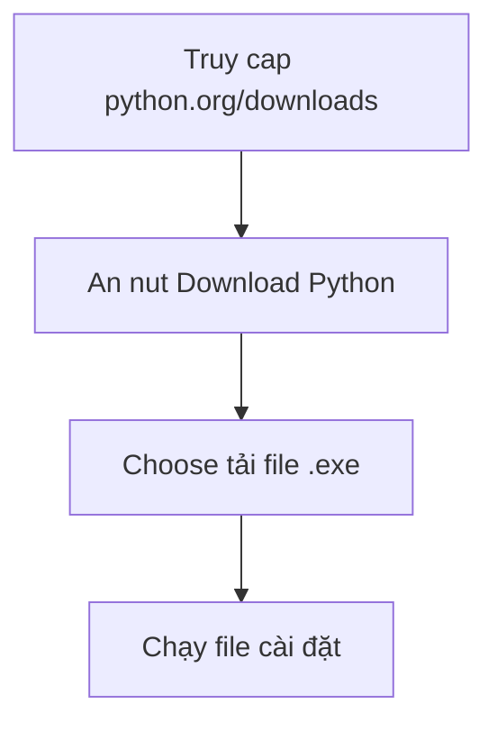

<!-- TỰ ĐỘNG ĐỒNG BỘ từ 01-Co-Ban/02-Cai-Dat-Python/bai.md — đừng sửa trực tiếp, sửa bản chính rồi chạy tools/sync_tracks.py -->

# Bài 2 — Cài Đặt Python

> 🎓 **Chương 1 – Khởi đầu hành trình lập trình**

## 🧠 Điều kiện tiên quyết

- [Bài 1 — Giới Thiệu Python](../01-Gioi-Thieu/bai.md)

---

## 🎯 Mục tiêu

Sau bài học này, học viên sẽ:

* ✅ Tải được bộ cài Python **mới nhất** từ trang chủ của Python.
* ✅ Cài đặt Python thành công trên Windows, đặc biệt là **tích chọn "Add Python to PATH"**.
* ✅ Kiểm tra phiên bản Python đã cài bằng lệnh `python --version`.
* ✅ Hiểu được **PATH là gì** và vì sao nó quan trọng.
* ✅ Viết và chạy thử chương trình Python đầu tiên từ dòng lệnh (`Command Prompt` / `Terminal`).

---

## 📖 Kiến thức

### 1. PowerShell / Command Prompt / Terminal là gì?

Đây là **cửa sổ dòng lệnh** — nơi bạn **gõ lệnh chữ** thay vì bấm nút để điều khiển máy tính.

> 💬 **Ví dụ đời thực:** Cửa sổ dòng lệnh giống như **sân ga xe lửa** — thay vì mua vé qua cửa sổ, bạn gõ lệnh để "đặt vé" trực tiếp. Lập trình viên dùng dòng lệnh mỗi ngày.

### 2. Chọn hướng cài đặt

| Cách | Phù hợp với | Ưu điểm |
|---|---|---|
| 🪟 Cài **Python trực tiếp** (bài này) | Tất cả người học | Đơn giản, kiểm soát rõ |
| 📦 Dùng **Anaconda** | Khoa học dữ liệu | Kèm sẵn nhiều thư viện |
| ☁️ Dùng online (Replit, Colab) | Làm quen ban đầu | Không cần cài |

> Trong giáo trình này chúng ta dùng cách **cài trực tiếp** — đơn giản và phổ biến nhất.

### 3. Bước 1 – Tải bộ cài Python

1. Mở trình duyệt, vào trang chính thức: **https://www.python.org/downloads/**
2. Bấm nút **Download Python 3.x.x** (phiên bản mới nhất hiển thị to màu vàng).
3. Đợi file `.exe` tải xong.

> ⚠️ Luôn tải từ **python.org** — tránh tải từ trang lạ vì có thể chứa mã độc.



### 4. Bước 2 — Cài đặt

1. Mở file `.exe` vừa tải.
2. **QUAN TRỌNG NHẤT:** Tích chọn ô **"Add Python to PATH"** nằm ở cuối màn hình đầu tiên. 3. Màn hình đầu tiên sẽ hiện 2 lựa chọn:
   * `Install Now` — cài nhanh với thiết lập mặc định (khuyên dùng cho người mới).
   * `Customize installation` — tùy chỉnh (nâng cao).

> ⚠️ **Nếu quên chọn "Add Python to PATH",** về sau bạn không thể gõ `python` trong dòng lệnh. Cách khắc phục ở phần "Lỗi thường gặp".

### 5. PATH là gì?

**PATH** là một danh sách các thư mục mà máy tính sẽ tìm kiếm **khi bạn gõ lệnh**.

> 💬 **Ví dụ đời thực:** Giống như danh bạ điện thoại — khi bạn gõ tên "python", máy tính lục trong PATH để tìm file `python.exe` và chạy nó. Không có PATH → máy nói "không tìm thấy lệnh".

### 6. Bước 3 — Kiểm tra cài đặt thành công

Mở cửa sổ dòng lệnh:

* **Windows:** nhấn `Windows + R`, gõ `cmd`, Enter. (Hoặc tìm "Command Prompt".)
* **macOS / Linux:** mở Terminal.

Gõ lệnh:

```bash
python --version
```

Kết quả mong đợi (con số có thể khác):

```
Python 3.14.2
```

> ✔️ Nếu thấy chữ Python kèm số là **đã cài thành công**.

### 7. Viết chương trình đầu tiên bằng dòng lệnh

Có hai kiểu làm việc Python: **chế độ tương tác** và **chạy file**.

**a) Chế độ tương tác (Interactive Shell / REPL):**

Gõ lệnh `python` trong Command Prompt:

```bash
python
```

Bạn sẽ thấy dấu nhắc `>>>`. Giờ gõ từng dòng:

```python
>>> print("Xin chào Python")
Xin chào Python
>>> 5 + 3
8
>>> exit()
```

* Mỗi lần gõ xong, Python "trả lời" ngay lập tức.
* Gõ `exit()` để thoát.

**b) Chạy file `.py`:**

Tạo file `hello.py` với nội dung:

```python
print("Hello, Python!")
```

Chạy trong Command Prompt (nhớ di chuyển đúng thư mục chứa file):

```bash
python hello.py
```

Kết quả:

```
Hello, Python!
```

---

## 💡 Ví dụ minh họa

### Ví dụ 1: Câu chuyện "không tìm thấy python"

Gõ `python` trong Command Prompt và thấy:

```
'python' is not recognized as an internal or external command
          (tiếng Việt: không tìm thấy lệnh python)
```

* **Nguyên nhân:** Bạn quên chọn **"Add Python to PATH"** khi cài.
* **Cách khắc phục:** Làm lại phần "Lỗi thường gặp" dưới đây.

### Ví dụ 2: Chạy trong thư mục khác

Giả sử file `hello.py` nằm ở `D:\hoc_python`. Trong Command Prompt:

```bash
cd D:\hoc_python
python hello.py
```

> `cd` (change directory) = đổi thư mục.

---

## 🔬 Ví dụ nâng cao

### Ví dụ: Kiểm tra cấu hình Python đầy đủ

```bash
python --version
python --help
```

* `python --version` → xem phiên bản.
* `python --help` → xem toàn bộ lệnh hỗ trợ.

### Ví dụ: Sử dụng pip cơ bản (học kỹ ở bài 31)

```bash
python -m pip --version
```

Kết quả dạng:

```
pip 26.1.2 from C:\Python314\Lib\site-packages\pip
```

> `pip` là công cụ cài thư viện — mặc định đi kèm khi cài Python.

---

## ⚠️ Lỗi thường gặp

### Lỗi 1: `'python' is not recognized`

* **Nguyên nhân:** Quên tích **Add Python to PATH**.
* **Cách sửa:**
  1. Mở Menu Start → gõ "path" → chọn **Edit the system environment variables**.
  2. Bấm **Environment Variables**.
  3. Trong **System variables**, chọn `Path` → **Edit** → **New**.
  4. Dán đường dẫn thư mục chứa `python.exe` (ví dụ `C:\Users\...\AppData\Local\Programs\Python\Python314\`).
  5. Bấm OK và **mở lại** Command Prompt.
* **Cách sửa nhanh hơn:** Cài lại Python và nhớ **tích "Add Python to PATH"**.

### Lỗi 2: Cài xong nhưng lệnh `python` mở Microsoft Store

* **Nguyên nhân:** Windows "App execution aliases" chặn lệnh `python`.
* **Cách sửa:** Settings → Apps → Advanced app settings → App execution aliases → **tắt** `python.exe` và `python3.exe`.

### Lỗi 3: Nhập `python3` thay vì `python`

* **Nguyên nhân:** Trên Windows, lệnh đúng là `python` (không có số 3).
* **Cách sửa:** Gõ `python`, không gõ `python3` (trên Linux mới dùng `python3`).

### Lỗi 4: Cài hai phiên bản Python bị loạn

* **Nguyên nhân:** Cài nhiều phiên bản, không biết lệnh `python` trỏ tới bản nào.
* **Cách sửa:** Gõ `python --version` để cóểu. Dùng `py -3 --version` (Windows) để chọn bản 3 cụ thể.

---

## 💎 Mẹo

* ✅ **Luôn tích "Add Python to PATH"** — ghi nhớ như "chìa khóa" để mở được Python.
* 📁 Đặt file `.py` trong một thư mục riêng để dễ quản lý (ví dụ `D:\Python_Bai`).
* 🔄 Sau khi sửa PATH, **phải đóng và mở lại** cửa sổ dòng lệnh mới có hiệu lực.
* 📚 Mọi bài học về sau đều chạy theo cú pháp: `python ten_file.py`.
* 🔍 Gõ `where python` (Windows) để xem Python đang nằm ở đâu.

---

## 📝 Tóm tắt

| Bước | Thao tác |
|---|---|
| 1 | Vào python.org → Download |
| 2 | Chạy file `.exe` → **tích Add to PATH** → Install Now |
| 3 | Mở cmd/terminal → `python --version` |
| 4 | Tạo file `hello.py` → `python hello.py` |

* Bạn có 2 chế độ làm việc: **REPL tương tác** (`>>>`) và **chạy file**.
* `cd` để di chuyển thư mục, `python tên_file.py` để chạy.

---

## 🧪 Kiểm tra nhanh

1. ❓ Trang web chính thức để tải Python là gì?
2. ❓ Câu nói nào quan trọng nhất phải chọn trong lúc cài?
3. ❓ PATH dùng để làm gì?
4. ❓ Lệnh kiểm tra phiên bản Python?
5. ❓ Lệnh để chạy file `hello.py`?
6. ❓ Lỗi 'python' is not recognized nghĩa là gì và cách sửa?
7. ❓ REPL (chế độ `>>>`) dùng để làm gì?
8. ❓ Trên Windows lệnh đúng là `python` hay `python3`?
9. ❓ Pip là gì?
10. ❓ Sau khi sửa PATH, điều gì cần làm trước khi dùng lại?

<details>
<summary>🔍 Xem đáp án</summary>

1. https://www.python.org/downloads/
2. "Add python.exe to PATH".
3. Danh sách thư mục máy tính tìm kiếm khi bạn gõ lệnh.
4. `python --version`.
5. `python hello.py`.
6. Chưa thêm PATH; sửa bằng Environment Variables hoặc cài lại và tích PATH.
7. Gõ từng lệnh và Python trả lời ngay — thử nghiệm nhanh.
8. `python`.
9. Công cụ cài thư viện đi kèm Python.
10. Đóng lại và mở lại cửa sổ dòng lệnh.

</details>

---

## 📚 Bài đọc thêm

* [Python.org – Downloads](https://www.python.org/downloads/)
* [Real Python – Installing Python](https://realpython.com/installing-python/)
* [Python documentation – Using Python on Windows](https://docs.python.org/3/using/windows.html)
* [Video: Cách cài Python cho người mới (tìm trên YouTube)](https://www.youtube.com/results?search_query=cach+cai+dat+python+cho+nguoi+moi)

---

---

## 🧩 Bài tập

> 📝 🎯 **Chủ đề:** Cài đặt Python, kiểm tra phiên bản, chạy chương trình từ dòng lệnh.

## 🟢 Dễ (Bài 1 – 7)

### Bài 1: Kiểm tra Python đã cài chưa

* **Đề bài:** Mở cửa sổ dòng lệnh (Command Prompt) và kiểm tra Python đã cài chưa.
* **Input:** Gõ lệnh `python --version`.
* **Output:** Chương trình hiện ra phiên bản, ví dụ `Python 3.14.2`.
* **Gợi ý:** Nhấn `Windows + R`, gõ `cmd`, Enter rồi gõ lệnh.

### Bài 2: Kiểm tra thư mục chứa Python

* **Đề bài:** Tìm đường dẫn chính xác nơi `python.exe` đang được cài.
* **Input:** Gõ lệnh `where python`.
* **Output:** Một hoặc nhiều đường dẫn tới `python.exe`.
* **Gợi ý:** Lệnh này chỉ hoạt động khi PATH đã được thiết lập đúng.

### Bài 3: Kiểm tra pip

* **Đề bài:** Kiểm tra công cụ cài thư viện pip đã sẵn sàng chưa.
* **Input:** Gõ `python -m pip --version`.
* **Output:** Dòng chữ bắt đầu bằng `pip 2x.x.x`.
* **Gợi ý:** Pip đi kèm Python khi cài đặt.

### Bài 4: Vào chế độ tương tác

* **Đề bài:** Mở chế độ REPL (dấu nhắc `>>>`) và in ra dòng chữ `Chao mung`.
* **Input:** Gõ `python` rồi gõ `print("Chao mung")`.
* **Output:**
  ```
  >>> print("Chao mung")
  Chao mung
  ```
* **Gợi ý:** Sau đó gõ `exit()` để thoát.

### Bài 5: Tính toán trong REPL

* **Đề bài:** Trong chế độ `>>>`, tính `15 * 4` và `100 // 7`.
* **Input:** Lần lượt gõ hai phép tính.
* **Output:**
  ```
  >>> 15 * 4
  60
  >>> 100 // 7
  14
  ```
* **Gợi ý:** `//` là phép chia lấy phần nguyên.

### Bài 6: Tạo file đầu tiên

* **Đề bài:** Tạo file `hello.py` (dùng Notepad hoặc trình soạn thảo) chứa đúng 2 dòng: in tên bạn và in tuổi bạn.
* **Input:** Nội dung file `hello.py`.
* **Output khi chạy:**
  ```
  Ten toi la An
  Toi 15 tuoi
  ```
* **Gợi ý:** Nhớ lưu file với phần mở rộng `.py`, dấu nháy thẳng `"`.

### Bài 7: Chạy file hello.py

* **Đề bài:** Dùng Command Prompt chạy file `hello.py` vừa tạo.
* **Input:** Lệnh `python hello.py`.
* **Output:** In ra 2 dòng trong file.
* **Gợi ý:** Nếu báo "not recognized", hãy `cd` vào thư mục chứa file.

---

## 🟡 Trung bình (Bài 8 – 14)

### Bài 8: Di chuyển thư mục trong dòng lệnh

* **Đề bài:** Giả sử file `hello.py` nằm ở `D:\hoc_python`. Hãy gõ các lệnh để di chuyển tới thư mục đó và chạy file.
* **Input:**
  ```bash
  cd D:\hoc_python
  python hello.py
  ```
* **Output:** Nội dung in ra từ file.
* **Gợi ý:** Lệnh `cd` = change directory (đổi thư mục).

### Bài 9: Xem danh sách file trong thư mục

* **Đề bài:** Trong Command Prompt, gõ lệnh xem danh sách file.
* **Input:** Gõ `dir`.
* **Output:** Danh sách file/thư mục trong thư mục hiện tại.
* **Gợi ý:** Trên Linux gõ `ls`.

### Bài 10: Kiểm tra cả python và pip cùng lúc

* **Đề bài:** Viết ra giấy (hoặc gõ) lệnh kiểm tra phiên bản của **cả Python và pip** — tức 2 lệnh riêng.
* **Input:** 2 lệnh `python --version` và `python -m pip --version`.
* **Output:** 2 dòng kết quả.
* **Gợi ý:** Lệnh `python -m pip` đảm bảo dùng pip của đúng phiên bản Python.

### Bài 11: Gợi ý lệnh trong REPL

* **Đề bài:** Trong REPL, gõ `5 +` rồi nhấn Tab. Mô tả những gì xảy ra.
* **Input:** Gõ `5 +` + Tab trong REPL.
* **Output:** Python liệt kê các phương thức mà đối tượng số hỗ trợ.
* **Gợi ý:** Đây là tính năng **autocomplete** — gõ thử để trải nghiệm.

### Bài 12: Xem tài liệu của hàm print

* **Đề bài:** Trong REPL, gõ `help(print)` và quan sát.
* **Input:** Gõ `help(print)` trong REPL, sau đó gõ `q` để thoát.
* **Output:** Tài liệu mô tả chức năng của hàm `print`.
* **Gợi ý:** `help()` là công cụ xem tài liệu ngay trong Python.

### Bài 13: Sửa lỗi "not recognized"

* **Đề bài:** Bạn mở Command Prompt mới nhưng gõ `python` vẫn báo lỗi. Ghi ra **3 lý do có thể** và cách kiểm tra từng lý do.
* **Input:** Không có.
* **Output:** Liệt kê đủ 3 lý do + cách kiểm tra.
* **Gợi ý:** Nhớ lại: PATH, App execution aliases, cửa sổ chưa mở lại.

### Bài 14: Chạy nhiều file trong cùng một ngày

* **Đề bài:** Tạo thêm file `chao.py` in ra `Chao ban den voi Python`. Chạy lần lượt cả `hello.py` và `chao.py` trong cùng một phiên dòng lệnh.
* **Input:** 2 lệnh chạy file.
* **Output:** Kết quả của cả 2 file.
* **Gợi ý:** Hai lệnh gõ liên tiếp, cùng thư mục.

---

## 🔴 Khó (Bài 15 – 20)

### Bài 15: Tạo báo cáo cấu hình máy (script tự viết)

* **Đề bài:** Trong REPL, lần lượt gõ `import sys`, rồi gõ `sys.version` để xem thông tin phiên bản chi tiết. Viết lại kết quả nhận được.
* **Input:**
  ```python
  import sys
  sys.version
  ```
* **Output:** Một đoạn mô tả chi tiết phiên bản Python.
* **Gợi ý:** `sys` là module hệ thống đi kèm Python.

### Bài 16: Vòng tránh lỗi khi cài đặt

* **Đề bài:** Một bạn mới cài Python quên "Add to PATH". Viết ra **danh sách 4 bước sửa lỗi** bằng cách chỉnh biến môi trường `Path`.
* **Input:** Không có.
* **Output:** Danh sách đủ 4 bước.
* **Gợi ý:** Environment Variables → System variables → Path → Edit.

### Bài 17: Chạy chương trình với đối số dòng lệnh

* **Đề bài:** Tạo file `tinhtuoi.py` tính hiệu số giữa năm 2030 và năm sinh 2010, in kết quả ra màn hình, rồi chạy file đó.
* **Input:** Lệnh `python tinhtuoi.py`.
* **Output:**
  ```
  Nam 2030 ban se 20 tuoi
  ```
* **Gợi ý:** Dùng phép tính `2030 - 2010` trong lệnh `print()`.

### Bài 18: Kiểm tra phiên bản bị trùng

* **Đề bài:** Máy bạn có 2 phiên bản Python. Gõ `where python` để xem danh sách, rồi viết ra **cách xác định phiên bản nào được ưu tiên chạy**.
* **Input:** Lệnh `where python`.
* **Output:** Danh sách đường dẫn + giải thích ngắn (mục nào xuất hiện trước được ưu tiên).
* **Gợi ý:** Thứ tự trong PATH quyết định thứ tự ưu tiên.

### Bài 19: Tạo menu chạy thử

* **Đề bài:** Viết file `thuc_hanh.py` gồm 4 lệnh in ra: `1) Chay REPL`, `2) Tao file .py`, `3) Chay file .py`, `4) Xem help`. Chạy file và quan sát.
* **Input:** Lệnh `python thuc_hanh.py`.
* **Output:** 4 dòng chữ như trên.
* **Gợi ý:** Bốn lệnh `print()`.

### Bài 20: Tự kiểm tra toàn bộ kiến thức

* **Đề bài:** Viết ra một **bảng kiểm tra (checklist)** gồm 6 mục sau, mỗi mục đánh dấu ✔️ nếu bạn làm được: (1) `python --version` ra số; (2) pip hoạt động; (3) REPL in chữ; (4) tạo file `.py`; (5) chạy file `.py`; (6) di chuyển thư mục bằng `cd`.
* **Input:** Không có.
* **Output:** Checklist 6 mục với dấu ✔️.
* **Gợi ý:** Nếu thiếu mục nào, hãy làm lại đúng phần đó trước khi sang bài 3.

---

## 🎯 Tổng kết sau khi làm bài

* ✅ Kiểm tra được Python và pip đã cài đúng.
* ✅ Thao tác thành thạo REPL và chạy file `.py`.
* ✅ Tự sửa được lỗi PATH phổ biến.
* ✅ Sẵn sàng sử dụng công cụ viết code chuyên nghiệp.

---

## ✅ Đáp án

> 💡 **Hãy tự làm bài tập trước** rồi mới mở đáp án.

## 🟢 Dễ (Bài 1 – 7)


<details>
<summary>✅ Bài 1: Kiểm tra Python đã cài chưa</summary>


**Phân tích:** Cách nhanh nhất để biết Python có hoạt động là gõ lệnh kiểm tra phiên bản.

**Ý tưởng:** Dùng lệnh `python --version`.

**Thuật toán:**
1. Mở Command Prompt.
2. Gõ lệnh kiểm tra.

**Code:**

```bash
python --version
```

**Kết quả mong đợi:**

```
Python 3.14.2
```

**Giải thích code:**
* `python` — gọi chương trình Python đã cài.
* `--version` — yêu cầu Python in số phiên bản ra màn hình.
* Nếu báo `'python' is not recognized`, xem lại phần PATH (bài giảng).

**Độ phức tạp:** O(1).

---

</details>

<details>
<summary>✅ Bài 2: Kiểm tra thư mục chứa Python</summary>


**Phân tích:** Cần biết máy đang dùng file `python.exe` ở đâu.

**Ý tưởng:** Lệnh `where` trả về đường dẫn tuyệt đối của chương trình.

**Thuật toán:**
1. Gõ lệnh `where python`.
2. Đọc đường dẫn trả về.

**Code:**

```bash
where python
```

**Kết quả mong đợi (ví dụ):**

```
C:\Users\An\AppData\Local\Programs\Python\Python314\python.exe
```

**Giải thích code:**
* `where` — lệnh Windows tìm vị trí chương trình.
* Kết quả cho biết Python nằm trong thư mục `...\Programs\Python\Python314\`.

**Độ phức tạp:** O(1).

---

</details>

<details>
<summary>✅ Bài 3: Kiểm tra pip</summary>


**Phân tích:** Pip cần hoạt động vì hầu hết thư viện sẽ cài qua pip ở các bài sau.

**Ý tưởng:** Gọi pip thông qua Python để chắc chắn dùng đúng phiên bản.

**Thuật toán:**
1. Chạy `python -m pip --version`.

**Code:**

```bash
python -m pip --version
```

**Kết quả mong đợi:**

```
pip 26.1.2 from C:\Python314\Lib\site-packages\pip (python 3.14)
```

**Giải thích code:**
* `-m` — chạy pip như một module của Python.
* Biết dùng `python -m pip` thay vì gõ `pip` trực tiếp để tránh lệnh nhầm phiên bản.

**Độ phức tạp:** O(1).

---

</details>

<details>
<summary>✅ Bài 4: Vào chế độ tương tác</summary>


**Phân tích:** REPL cho phép gõ lệnh và xem kết quả tức thì.

**Ý tưởng:** Gõ lệnh `python` để vào REPL, rồi gõ `print(...)`.

**Code:**

```bash
python
```

```python
>>> print("Chao mung")
Chao mung
>>> exit()
```

**Giải thích code:**
* `python` — mở trình phiên dịch tương tác, dấu nhắc đổi thành `>>>`.
* `print("Chao mung")` — in ngay dòng chữ.
* `exit()` — thoát khỏi REPL.

**Độ phức tạp:** O(1).

---

</details>

<details>
<summary>✅ Bài 5: Tính toán trong REPL</summary>


**Phân tích:** REPL như chiếc máy tính cầm tay — gõ phép tính và Enter ngay kết quả.

**Ý tưởng:** Gõ trực tiếp biểu thức.

**Code:**

```python
>>> 15 * 4
60
>>> 100 // 7
14
```

**Giải thích code:**
* `*` — phép nhân: `15 * 4 = 60`.
* `//` — chia lấy phần nguyên: `100 // 7 = 14` (100 chia 7 được 14 dư 2).

**Độ phức tạp:** O(1).

---

</details>

<details>
<summary>✅ Bài 6: Tạo file đầu tiên</summary>


**Phân tích:** Viết chương trình bằng file giúp lưu trữ và chạy lại nhiều lần.

**Ý tưởng:** Dùng Notepad tạo `hello.py` với 2 lệnh `print()`.

**Code:**

```python
print("Ten toi la An")
print("Toi 15 tuoi")
```

**Kết quả khi chạy:**

```
Ten toi la An
Toi 15 tuoi
```

**Giải thích code:**
* File phải có phần mở rộng `.py`.
* Dấu nháy thẳng `"` — nếu dùng nháy cong sẽ báo `SyntaxError`.

**Độ phức tạp:** O(1).

---

</details>

<details>
<summary>✅ Bài 7: Chạy file hello.py</summary>


**Phân tích:** Lệnh chạy file là nền tảng cho toàn bộ khóa học.

**Ý tưởng:** Di chuyển đúng thư mục rồi gọi `python ten_file.py`.

**Code:**

```bash
cd D:\hoc_python
python hello.py
```

**Kết quả:**
```
Ten toi la An
Toi 15 tuoi
```

**Giải thích code:**
* `cd D:\hoc_python` — di chuyển tới thư mục chứa file.
* `python hello.py` — Python đọc file, chạy từng dòng rồi in ra.

**Độ phức tạp:** O(n) với n là số dòng trong file.

---

</details>

## 🟡 Trung bình (Bài 8 – 14)


<details>
<summary>✅ Bài 8: Di chuyển thư mục trong dòng lệnh</summary>


**Phân tích:** Hầu hết file sẽ nằm trong thư mục chứ không ở màn hình Command Prompt.

**Ý tưởng:** Dùng `cd` để vào đúng thư mục trước khi chạy.

**Code:**

```bash
cd D:\hoc_python
python hello.py
```

**Giải thích code:**
* `cd` (change directory) — đổi thư mục hiện tại.
* Sau khi vào đúng thư mục, lệnh `python hello.py` hoạt động vì đã tìm thấy file.

**Độ phức tạp:** O(1).

---

</details>

<details>
<summary>✅ Bài 9: Xem danh sách file trong thư mục</summary>


**Phân tích:** Muốn biết trong thư mục hiện tại có những file nào thì dùng `dir`.

**Code:**

```bash
dir
```

**Kết quả mong đợi (ví dụ):**

```
Directory of D:\hoc_python

hello.py            chao.py          ...
```

**Giải thích code:**
* `dir` — liệt kê file trong thư mục hiện tại (Windows).
* Trên macOS/Linux dùng `ls`.

**Độ phức tạp:** O(n) với n là số file.

---

</details>

<details>
<summary>✅ Bài 10: Kiểm tra cả python và pip cùng lúc</summary>


**Phân tích:** Khi nghi ngờ cấu hình máy, kiểm tra cả hai.

**Ý tưởng:** Chạy 2 lệnh liên tiếp.

**Code:**

```bash
python --version
python -m pip --version
```

**Kết quả mong đợi:**

```
Python 3.14.2
pip 26.1.2 ...
```

**Giải thích code:** cả hai lệnh đều dùng đối số `--version` để in phiên bản tương ứng.

**Độ phức tạp:** O(1).

---

</details>

<details>
<summary>✅ Bài 11: Gợi ý lệnh trong REPL</summary>


**Phân tích:** REPL hỗ trợ gõ Tab để gợi ý phương thức.

**Code:**

```python
>>> 5 +
       +  add  bitwise AND  ...  (danh sách phương thức hiện ra)
```

**Giải thích code:**
* Nhấn Tab sau toán tử sẽ mở bảng gợi ý **autocomplete**.
* Đây là tính năng khám phá thư viện cực hữu ích cho người mới.

---

</details>

<details>
<summary>✅ Bài 12: Xem tài liệu của hàm print</summary>


**Phân tích:** Python có tài liệu ngay trong máy — không cần internet.

**Code:**

```python
>>> help(print)
```

**Kết quả:** Màn hình hiện tài liệu mô tả `print(*args, sep=' ', end='\n')...`

**Giải thích code:**
* `help(đối tượng)` — hiển thị docstring của đối tượng.
* Nhấn `q` để thoát khỏi màn hình help.

---

</details>

<details>
<summary>✅ Bài 13: Sửa lỗi "not recognized"</summary>


**Thao tác:** Sửa biến môi trường PAT.

**Các bước:**

1. Mở Menu Start → gõ **"path"** → chọn **Edit the system environment variables**.
2. Bấm **Environment Variables**.
3. Tìm biến `Path` trong **System variables** → **Edit**.
4. Nhấn **New** và dán đường dẫn thư mục chứa `python.exe`.
5. Nhấn OK và **đóng/mở lại** Command Prompt.

**Các lý do kiểm tra:**
* PATH chưa có Python.
* Window App execution aliases đang ưu tiên store.
* Cửa sổ dòng lệnh chưa được mở lại sau khi sửa PATH.

---

</details>

<details>
<summary>✅ Bài 14: Chạy nhiều file trong cùng một ngày</summary>


**Ý tưởng:** Mở Command Prompt một lần, chạy lần lượt nhiều file.

**Code:**

```bash
python hello.py
python chao.py
```

**Kết quả mong đợi:**

```
Ten toi la An
Toi 15 tuoi
Chao ban den voi Python
```

**Giải thích code:** mỗi lệnh là một lần khởi động Python riêng phan — không cần thoát giữa chừng.

---

</details>

## 🔴 Khó (Bài 15 – 20)


<details>
<summary>✅ Bài 15: Tạo báo cáo cấu hình máy</summary>


**Ý tưởng:** Dùng module `sys` đi kèm Python để có thông tin chi tiết.

**Code:**

```python
import sys
sys.version
```

Kết quả dạng: `'3.14.2 (tags/v3.14.2:...)[MSC v.1940 64 bit (AMD64)]'`

**Giải thích code:**
* `import sys` — nạp module hệ thống.
* `sys.version` — chuỗi mô tả chi tiết phiên bản và thông tin trình dịch..

---

</details>

<details>
<summary>✅ Bài 16: Vòng tránh lỗi khi cài đặt</summary>


**Quy trình sửa:**

1. Bấm Start → gõ "path".
2. Chọn **Edit the system environment variables**.
3. Trong **System variables** chọn `Path` → **Edit**.
4. Nhấn **New**, dán đường dẫn `python.exe`, bấm OK.

---

</details>

<details>
<summary>✅ Bài 17: Chạy chương trình với đối số dòng lệnh</summary>


**Code file `tinhtuoi.py`:**

```python
# Tính tuổi vào năm 2030
tuoi = 2030 - 2010
print("Nam 2030 ban se", tuoi, "tuoi")
```

**Cách chạy:**

```bash
python tinhtuoi.py
```

**Kết quả:**

```
Nam 2030 ban se 20 tuoi
```

**Giải thích code:**
* `2030 - 2010` → `20`, lưu vào biến `tuoi`.
* `print("...", tuoi, "tuoi")` — in kết hợp chữ và số.

---

</details>

<details>
<summary>✅ Bài 18: Kiểm tra phiên bản bị trùng</summary>


**Thao tác:**

```bash
where python
```

**Kết quả (ví dụ 2 dòng):**

```
C:\Program Files\Python312\python.exe
C:\Users\An\AppData\Local\...\Python313\python.exe
```

**Giải thích:**
* Danh sách trên → xuống: mục đầu tiên được dùng trước.
* Nếu disable bản không mong muốn, đổi thứ tự `Path` hoặc xóa bản cũ.

---

</details>

<details>
<summary>✅ Bài 19: Tạo menu chạy thử</summary>


**Code:**

```python
print("1) Chay REPL")
print("2) Tao file .py")
print("3) Chay file .py")
print("4) Xem help")
```

**Kết quả khi chạy `python thuc_hanh.py` như đề bài.**

---

</details>

<details>
<summary>✅ Bài 20: Tự kiểm tra toàn bộ</summary>


**Checklist mẫu:**

- [x] `python --version` → ra số phiên bản
- [x] `python -m pip --version` → pip hoạt động
- [x] REPL in được chữ
- [x] Tạo được file `.py`
- [x] Chạy được file `.py`
- [ ] Di chuyển thư mục bằng `cd`

**Giải thích:** nếu mục nào chưa tick, quay lại làm đúng phần đó rồi mới chuyển sang bài 3.

---

</details>

## 📌 Lời khuyên cuối


* Luôn luôn nhớ lệnh `python ten_file.py` — sẽ dùng suốt khóa học.
* Ghi nhớ cách sửa PATH — lỗi kinh điển của người mới.
* Đừng lo nếu thấy nhiều lệnh mới: chúng sẽ lặp lại và bạn sớm nhớ thôi!

👉 Tiếp theo: **[Bài 3: Biến Trong Python](../03-Bien/bai.md)**

---

## ➡️ Điều hướng

**Vị trí:** `02-Thuat-Toan/02-Cai-Dat-Python/bai.md`

**Bài tiếp theo:** [Bài 3 — Biến Trong Python](../03-Bien/bai.md)