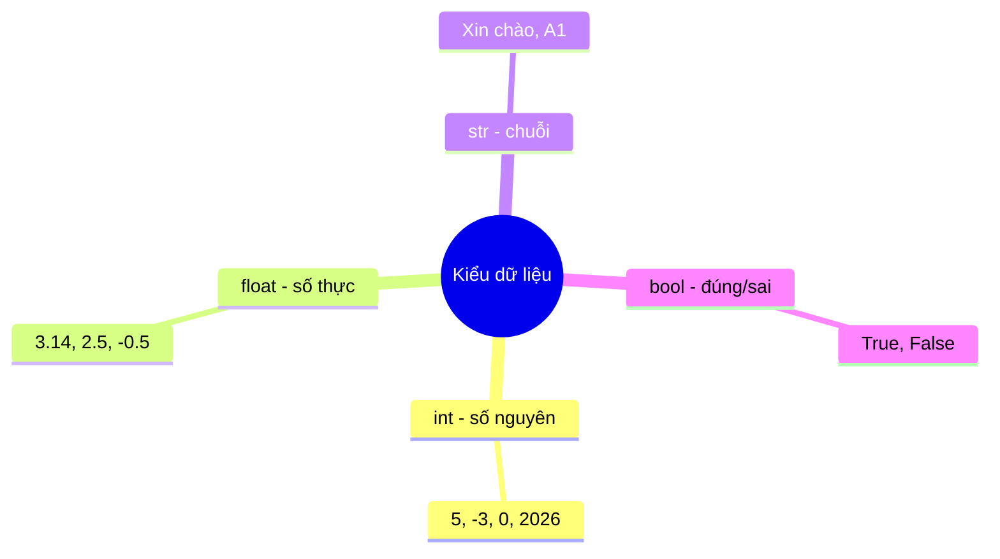

<!-- TỰ ĐỘNG ĐỒNG BỘ từ 01-Co-Ban/05-Kieu-Du-Lieu/bai.md — đừng sửa trực tiếp, sửa bản chính rồi chạy tools/sync_tracks.py -->

# Bài 4 — Kiểu Dữ Liệu Cơ Bản

> 🎓 **Chương 2 – Nền tảng lập trình**

## 🧠 Điều kiện tiên quyết

- [Bài 3 — Biến Trong Python](../03-Bien/bai.md)

---

## 🎯 Mục tiêu

Sau bài học này, học viên sẽ:

* ✅ Nhận biết 4 kiểu dữ liệu cơ bản: `int`, `float`, `str`, `bool`.
* ✅ Dùng hàm `type()` để **kiểm tra kiểu dữ liệu** của một giá trị.
* ✅ **Ép kiểu** (chuyển đổi) giữa các kiểu bằng `int()`, `float()`, `str()`, `bool()`.
* ✅ Phân biệt rõ **`"5"` và `5`** — số hay chữ, cái nào tính được.
* ✅ Biết vì sao phải ép kiểu và tránh được các lỗi `TypeError`, `ValueError`.

---

## 📖 Kiến thức

### 1. Vì sao cần "kiểu dữ liệu"?

Ở bài 4, biến là **chiếc hộp** lưu dữ liệu. Nhưng dữ liệu không chỉ có một loại: số nguyên, số thập phân, đoạn chữ, câu trả lời đúng/sai... Python cần **phân loại dữ liệu** để biết cách xử lý: số thì cộng trừ được, chữ thì nối lại được, chứ không thể trộn lung tung.

> 💬 **Ví dụ đời thực:** Kho đồ vật cũng phân khu: kệ đựng sách, tủ lạnh đựng thực phẩm, két sắt đựng tiền. Nếu nhét sách vào két sắt thì không sao, nhưng "cộng" một quyển sách với một cái bánh thì vô nghĩa — Python cũng vậy!



### 2. Bốn kiểu dữ liệu cơ bản

| Kiểu | Tên gọi | Ví dụ | Dùng khi nào |
|---|---|---|---|
| `int` | Số nguyên | `5`, `-3`, `0`, `2026` | Đếm, số thứ tự, tuổi, số lượng |
| `float` | Số thực (thập phân) | `3.14`, `2.5`, `-0.75` | Đo lường, điểm số, giá tiền |
| `str` | Chuỗi ký tự (chữ) | `"Xin chào"`, `"A1"` | Tên, địa chỉ, câu chữ |
| `bool` | Đúng / Sai | `True`, `False` | Kết quả so sánh, cờ trạng thái |

**Vài lưu ý nhỏ:**

* Số thực viết dấu chấm, không viết dấu phẩy: `3.14` chứ không phải `3,14`.
* Chuỗi phải nằm trong dấu nháy thẳng `"..."` hoặc `'...'`.
* `True` và `False` — viết hoa chữ cái đầu tiên, không có dấu nháy.

```python
so_nguyen = 5        # int
so_thuc = 3.14       # float
chuoi = "Xin chào"   # str
dung_sai = True      # bool
```

### 3. Kiểm tra kiểu bằng type()

Hàm `type(gia_tri)` trả về **kiểu dữ liệu** của giá trị đó:

```python
print(type(5))         # <class 'int'>
print(type(3.14))      # <class 'float'>
print(type("Xin chào"))# <class 'str'>
print(type(True))      # <class 'bool'>
```

> 💡 Đọc kết quả: `'int'`, `'float'`, `'str'`, `'bool'` là tên kiểu. Khi muốn biết biến chứa kiểu gì, hãy gõ `type(bien)`.

```python
so = 10
print(type(so))        # <class 'int'>
so = "mười"            # gán kiểu khác - Python cho phép!
print(type(so))        # <class 'str'>
```

> ⚠️ Python là ngôn ngữ **định kiểu động**: biến không bị khóa vào một kiểu, bạn có thể gán kiểu khác cho nó sau đó (khác với C/Java).

### 4. Phân biệt `"5"` và `5` — chữ khác số!

Nhìn giống nhau, nhưng bản chất khác hẳn:

| | `5` | `"5"` |
|---|---|---|
| Kiểu | `int` | `str` |
| Ý nghĩa | Số năm | Ký tự số 5 |
| Tính toán? | ✅ `5 + 3 = 8` | ❌ `"5" + 3` → `TypeError` |
| Cộng với chữ | ❌ | ✅ `"5" + "3" = "53"` |

**Thí nghiệm trực tiếp:**

```python
a = 5
b = "5"
print(type(a))          # <class 'int'>
print(type(b))          # <class 'str'>
print(a + 3)            # 8  - số thì cộng được
print(b + "3")          # 53 - chữ thì nối được
# print(b + 3)          # ❌ TypeError: can only concatenate str
```

> 💬 **Ví dụ đời thực:** "5" là chữ số bạn viết lên bảng, còn 5 là số lượng bạn đếm được. Viết "5" + "3" thành "53" giống như ghép hai chữ; còn 5 + 3 = 8 là cộng hai số lượng.

### 5. Ép kiểu — "dịch" dữ liệu sang kiểu khác

Đôi khi dữ liệu không đúng kiểu như mong muốn, ta dùng hàm **ép kiểu**:

| Hàm | Chuyển thành | Ví dụ |
|---|---|---|
| `int(x)` | Số nguyên | `int("5")` → `5`; `int(3.9)` → `3` |
| `float(x)` | Số thực | `float("2.5")` → `2.5`; `float(5)` → `5.0` |
| `str(x)` | Chuỗi | `str(5)` → `"5"`; `str(3.14)` → `"3.14"` |
| `bool(x)` | Đúng/Sai | `bool(0)` → `False`; `bool(5)` → `True` |

**Một số quy tắc cần nhớ:**

* `int("3.9")` → **lỗi `ValueError`** — chuỗi có dấu chấm không ép trực tiếp thành int được; phải `int(float("3.9"))`.
* `int(3.9)` → `3` (cắt phần thập phân, không làm tròn).
* `bool` của `0`, `0.0`, `""`, `None` → `False`; mọi giá trị khác → `True`.

```python
# Ép kiểu số thành chuỗi để nối chữ
tuoi = 15
cau = "Nam nay toi " + str(tuoi) + " tuoi"
print(cau)              # Nam nay toi 15 tuoi

# Ép chuỗi thành số để tính toán
diem = "8.5"
diem_moi = float(diem) + 0.5
print(diem_moi)         # 9.0
```

### 6. Khi nào cần ép kiểu?

Nếu bạn nhập liệu từ bàn phím (Bài 6), `input()` luôn trả về **chuỗi** — muốn tính toán phải ép kiểu. Nhưng ngay bây giờ, bạn sẽ thấy ép kiểu xuất hiện ở 3 tình huống:

1. **Nối chuỗi với số:** `"Tôi " + str(15) + " tuổi"`.
2. **Tính toán với dữ liệu dạng chữ:** chuỗi `"8.5"` phải thành `float` mới cộng được.
3. **Làm tròn kiểu lỏng:** `int(3.99)` cho `3` khi cần số nguyên.

---

## 💡 Ví dụ minh họa

### Ví dụ 1: Điều tra "kiểu dữ liệu"

```python
# Lần lượt kiểm tra kiểu của các giá trị
print(type(10))            # int
print(type(10.0))          # float - có dấu chấm là số thực
print(type("10"))          # str - nằm trong dấu nháy là chữ
print(type(True))          # bool
print(type(10 > 5))        # bool - kết quả so sánh
```

**Giải thích từng dòng:**

| Dòng code | Ý nghĩa |
|---|---|
| `print(type(10))` | `10` không có dấu chấm, không nháy → `int` |
| `print(type(10.0))` | Có dấu chấm → `float` |
| `print(type("10"))` | Có dấu nháy → `str`, dù bên trong là số |
| `print(type(True))` | `bool` — hai giá trị `True`/`False` |
| `print(type(10 > 5))` | Phép so sánh trả về `bool` |

### Ví dụ 2: "5" với 5 — một phen bối rối

```python
so = 5
chu = "5"
# Thử cộng số
print(so + 5)          # 10 - số cộng số bình thường
# Thử cộng chữ
print(chu + "5")       # 55 - chữ nối chữ
# Ép chữ thành số rồi mới cộng
print(int(chu) + 5)    # 10 - đã "dịch" chữ ra số
```

**Giải thích từng dòng:**

* `so + 5` — phép cộng số, kết quả `10`.
* `chu + "5"` — phép **nối chuỗi**, kết quả `"55"` (không phải 10!).
* `int(chu) + 5` — ép `"5"` thành số `5` rồi cộng, kết quả `10`.

### Ví dụ 3: Xưởng chế tạo số

```python
# Ép kiểu theo nhiều hướng khác nhau
a = int("2026")        # chuỗi số nguyên -> số 2026
b = float("3.14")      # chuỗi thập phân -> số 3.14
c = str(99)            # số -> chuỗi "99"
d = bool("")           # chuỗi rỗng -> False
e = int(7.99)          # số thực -> 7 (cắt phần lẻ)
print(a, b, c, d, e)
```

Kết quả: `2026 3.14 99 False 7`.

---

## 🔬 Ví dụ nâng cao

### Ví dụ 1: Tính BMI — câu chuyện của các loại dữ liệu

Công thức: `BMI = cân nặng (kg) / chiều cao² (m)`. Chương trình kết hợp `float`, `str`, phép lũy thừa:

```python
# Cân nặng (kg) và chiều cao (m) - số thực
can_nang = 60.5
chieu_cao = 1.65
# Tính BMI: chiều cao bình phương
bmi = can_nang / (chieu_cao ** 2)
# Ép kết quả về chuỗi để nối vào câu thông báo
thong_bao = "BMI cua ban la: " + str(round(bmi, 2))
print(thong_bao)
```

Kết quả: `BMI cua ban la: 22.22`.

* `round(bmi, 2)` — làm tròn 2 chữ số thập phân (giá trị vẫn là số).
* `str(...)` — bắt buộc ép thành chuỗi trước khi `+` với chuỗi thông báo, nếu không bị `TypeError`.

### Ví dụ 2: Phòng khám "điều tra" kiểu dữ liệu

Một chương trình nhỏ kiểm tra xem biến đang mang kiểu gì sau từng bước gán:

```python
# Một biến, nhiều kiểu qua các lần gán
du_lieu = 100
print(type(du_lieu))        # int
du_lieu = 100.5
print(type(du_lieu))        # float
du_lieu = "100"
print(type(du_lieu))        # str
du_lieu = 100 == 100
print(type(du_lieu))        # bool
print(du_lieu)              # True
```

> 💡 Điều này chứng minh Python **định kiểu động**: biến có thể "đổi kiểu" sau mỗi lần gán.

### Ví dụ 3: Máy đếm điểm chữ trong chuỗi (dùng str + int)

```python
# Số ký tự trong một chuỗi (kể cả khoảng trắng)
chuoi = "Python la tuyet voi"
do_dai = len(chuoi)             # len() trả về số nguyên int
print("So ky tu:", do_dai)      # 21
print("Kieu du lieu:", type(do_dai))  # int
```

---

## ⚠️ Lỗi thường gặp

### Lỗi 1: Cộng chuỗi với số

```python
tuoi = 15
print("Toi " + tuoi + " tuoi")   # ❌ SAI
```

* **Kết quả báo:** `TypeError: can only concatenate str (not "int") to str`
* **Nguyên nhân:** không thể nối chuỗi với số trực tiếp.
* **Cách sửa:** ép số thành chuỗi: `print("Toi " + str(tuoi) + " tuoi")`.

### Lỗi 2: Ép chuỗi thập phân sang int

```python
x = int("3.9")   # ❌ SAI
```

* **Kết quả báo:** `ValueError: invalid literal for int() with base 10: '3.9'`
* **Nguyên nhân:** `int()` chỉ chấp nhận chuỗi dạng số nguyên.
* **Cách sửa:** qua trung gian: `int(float("3.9"))` → `3`.

### Lỗi 3: Ép chuỗi không phải số

```python
so = int("xin chao")   # ❌ SAI
```

* **Kết quả báo:** `ValueError: invalid literal for int()`
* **Nguyên nhân:** chuỗi chữ không chứa số thì không ép được.
* **Cách sửa:** chỉ ép kiểu khi chắc chắn dữ liệu hợp lệ; kiểm tra trước bằng `isnumeric()` nếu cần.

### Lỗi 4: Viết hoa sai tên kiểu

```python
print(type(5))      # ✅
print(Type(5))      # ❌ SAI
```

* **Kết quả báo:** `NameError: name 'Type' is not defined`
* **Nguyên nhân:** tên hàm đúng là `type` — viết thường; `Type` là tên khác.
* **Cách sửa:** gõ đúng `type(...)`; tương tự `int`, `float`, `str`, `bool` đều viết thường.

### Lỗi 5: Viết `True` / `False` sai cách

```python
dung = true    # ❌ SAI
dung = True    # ✅ ĐÚNG
```

* **Kết quả báo:** `NameError: name 'true' is not defined`
* **Nguyên nhân:** hai giá trị bool phải viết hoa chữ cái đầu.
* **Cách sửa:** `True` và `False` — đúng chuẩn.

---

## 💎 Mẹo

* 🏷️ **Hỏi `type()` bất cứ lúc nào nghi ngờ:** gõ `print(type(x))` là cách nhanh nhất biết x đang là gì.
* 🧮 **Số thập phân viết bằng dấu chấm:** `3.5` đúng, `3,5` sai.
* 🔤 **Chuỗi luôn có dấu nháy:** nhìn dấu nháy là biết ngay đó là chữ.
* 🧪 **`int(3.9)` cắt chứ không làm tròn:** muốn làm tròn dùng `round(3.9)` → `4`.
* 🚦 **Bool là "cờ hiệu":** dùng `bool` để đánh dấu trạng thái như "đã đăng nhập", "số dư âm"...
* 💡 **Ép kiểu khi nghi ngờ:** trước phép toán, hãy chắc cả hai vế cùng kiểu số, hoặc cùng kiểu chuỗi.

---

## 📝 Tóm tắt

| Kiểu | Tên | Ví dụ | Ép kiểu |
|---|---|---|---|
| `int` | Số nguyên | `5`, `-3`, `2026` | `int(x)` |
| `float` | Số thực | `3.14`, `2.5` | `float(x)` |
| `str` | Chuỗi chữ | `"Xin chào"` | `str(x)` |
| `bool` | Đúng/Sai | `True`, `False` | `bool(x)` |
| 🔍 `type(x)` | Kiểm tra kiểu | `type(5)` → `<class 'int'>` | — |
| ⚠️ Ghi nhớ | `"5"` là chữ, `5` là số | `"5"+"3"` = `"53"`, `5+3` = `8` | — |

---

## 🧪 Kiểm tra nhanh

1. ❓ Kể tên 4 kiểu dữ liệu cơ bản của Python.
2. ❓ `type(3.14)` trả về kết quả gì?
3. ❓ `"5"` là kiểu gì? `5` là kiểu gì?
4. ❓ Kết quả của `"5" + "3"` và `5 + 3` là bao nhiêu?
5. ❓ Viết lệnh ép chuỗi `"2026"` thành số nguyên.
6. ❓ Vì sao `int("3.9")` bị lỗi? Cách sửa?
7. ❓ `int(7.9)` cho kết quả nào — 7 hay 8?
8. ❓ `bool(0)` và `bool(5)` cho kết quả gì?
9. ❓ Lỗi gì xảy ra khi nối chuỗi với số bằng `+`?
10. ❓ Viết biểu thức in ra chuỗi `"Toi 15 tuoi"` từ biến `tuoi = 15`.

<details>
<summary>🔍 Xem đáp án</summary>

1. `int`, `float`, `str`, `bool`.
2. `<class 'float'>`.
3. `"5"` là chuỗi `str`, `5` là số nguyên `int`.
4. `"53"` (nối chữ) và `8` (cộng số).
5. `int("2026")`.
6. Vì chuỗi chứa dấu chấm không phải dạng số nguyên; sửa bằng `int(float("3.9"))`.
7. `7` — `int()` cắt phần thập phân.
8. `False` và `True`.
9. `TypeError: can only concatenate str (not "int") to str`.
10. `print("Toi " + str(tuoi) + " tuoi")` hoặc `print(f"Toi {tuoi} tuoi")` (f-string học ở Bài 6).

</details>

---

## 📚 Bài đọc thêm

* [Python.org – Kiểu dữ liệu có sẵn (Built-in Types)](https://docs.python.org/3/library/stdtypes.html)
* [Python.org – Hàm dựng sẵn: type, int, float, str, bool](https://docs.python.org/3/library/functions.html)
* [W3Schools – Python Data Types](https://www.w3schools.com/python/python_datatypes.asp)
* [Real Python – Basic Data Types in Python](https://realpython.com/python-data-types/)

---

---

## 🧩 Bài tập

> 📝 🎯 **Chủ đề:** Nhận biết `int`, `float`, `str`, `bool`; dùng `type()`; ép kiểu và phân biệt số với chuỗi.

## 🟢 Dễ (Bài 1 – 7)

### Bài 1: Nhận diện kiểu dữ liệu

* **Đề bài:** Viết chương trình in ra kiểu dữ liệu của các giá trị: `7`, `7.0`, `"7"`, `True`.
* **Input:** Không có.
* **Output:**
  ```
  <class 'int'>
  <class 'float'>
  <class 'str'>
  <class 'bool'>
  ```
* **Gợi ý:** Dùng `print(type(gia_tri))` cho từng giá trị.

### Bài 2: Khai báo đủ 4 loại

* **Đề bài:** Tạo 4 biến thuộc 4 kiểu `int`, `float`, `str`, `bool` (tự chọn giá trị), rồi in cả 4 ra màn hình.
* **Input:** Không có.
* **Output:**
  ```
  2026 8.5 Python True
  ```
* **Gợi ý:** `print(bien_int, bien_float, bien_str, bien_bool)`.

### Bài 3: Số hay chữ?

* **Đề bài:** In ra hai kết quả: `5 + 3` và `"5" + "3"`.
* **Input:** Không có.
* **Output:**
  ```
  8
  53
  ```
* **Gợi ý:** `print(5 + 3)`; `print("5" + "3")`.

### Bài 4: Đếm ký tự

* **Đề bài:** Đếm số ký tự của chuỗi `"Python"` bằng `len()` (kể từ bài trước đã dùng) và in ra kèm kiểu dữ liệu của kết quả.
* **Input:** Không có.
* **Output:**
  ```
  6
  <class 'int'>
  ```
* **Gợi ý:** `so_ky_tu = len("Python")`; in `so_ky_tu` và `type(so_ky_tu)`.

### Bài 5: Nối chuỗi và số

* **Đề bài:** Biến `ten = "Mai"`. In câu `Chao ban Mai` bằng cách nối chuỗi với biến `ten`.
* **Input:** Không có.
* **Output:**
  ```
  Chao ban Mai
  ```
* **Gợi ý:** `print("Chao ban " + ten)` — Chuỗi có sẵn dấu cách cuối.

### Bài 6: Ép chuỗi thành số

* **Đề bài:** Biến `so = "10"`. Dùng `int()` ép thành số rồi tính `so + 5`, in kết quả.
* **Input:** Không có.
* **Output:**
  ```
  15
  ```
* **Gợi ý:** `print(int(so) + 5)`.

### Bài 7: Ép số thành chuỗi

* **Đề bài:** Biến `nam = 2026`. Nối `nam` vào câu `Nam 2026 la nam moi` bằng `str()`.
* **Input:** Không có.
* **Output:**
  ```
  Nam 2026 la nam moi
  ```
* **Gợi ý:** `print("Nam " + str(nam) + ". Nam moi")`.

---

## 🟨 Trung bình (Bài 8 – 14)

### Bài 8: Toàn cảnh kiểu dữ liệu

* **Đề bài:** Với mỗi giá trị sau, in ra kiểu bằng `type()`: `10 > 3`, `float(7)`, `int("9")`, `str(3.14)`.
* **Input:** Không có.
* **Output:**
  ```
  <class 'bool'>
  <class 'float'>
  <class 'int'>
  <class 'str'>
  ```
* **Gợi ý:** Gõ trực tiếp giá trị trong `type()`; chú ý `10 > 3` là phép so sánh trả về `bool`.

### Bài 9: Bmis sai của học sinh

* **Đề bài:** Hai bạn `diem_so = "8.5"` (dạng chuỗi) và muốn cộng thêm `0.5` (điểm thưởng). Ép kiểu đúng rồi in: `Diem moi: 9.0`.
* **Input:** Không có.
* **Output:**
  ```
  Diem moi: 9.0
  ```
* **Gợi ý:** `float(diem_so) + 0.5` — chuỗi thập phân nên ép `float` chứ không phải `int`.

### Bài 10: Cắt phần thập phân

* **Đề bài:** Biến `gia = 19.99` (đơn vị nghìn đồng). In ra phần nguyên của giá bằng `int()`: `Gia nguyen: 19`.
* **Input:** Không có.
* **Output:**
  ```
  Gia nguyen: 19
  ```
* **Gợi ý:** `print("Gia nguyen:", int(gia))`.

### Bài 11: Kiểm tra hàm `bool`

* **Đề bài:** In ra kết quả `bool()` của các giá trị: `0`, `1`, `""`, `"Python"`, `0.0` kèm nhãn từng dòng.
* **Input:** Không có.
* **Output:**
  ```
  bool(0) = False
  bool(1) = True
  bool("") = False
  bool("Python") = True
  bool(0.0) = False
  ```
* **Gợi ý:** `print("bool(0) =", bool(0))` … viết đủ 5 dòng.

### Bài 12: Ghép chuỗi số tuổi

* **Đề bài:** Biến `tuoi = 15`. Viết chương trình in dòng `Toi 15 tuoi, hoc lop 10` — mỗi con số phải xuất phát từ biến (ép `str` để nối).
* **Input:** Không có.
* **Output:**
  ```
  Toi 15 tuoi, hoc lop 10
  ```
* **Gợi ý:** Tạo thêm biến `lop = 10`; dùng `str(tuoi)`, `str(lop)`.

### Bài 13: Hé lộ lỗi TypeError

* **Đề bài:** Chương trình sau bị lỗi. Đoán lỗi gì, sửa để in đúng:

  ```python
  diem = 8
  print("Diem cua toi: " + diem)
  ```
* **Output mong đợi:**
  ```
  Diem cua toi: 8
  ```
* **Gợi ý:** `diem` là `int`, chuỗi không thể `+` trực tiếp với `int` — phải `str(diem)`.

### Bài 14: Độ dài của số hay chữ?

* **Đề bài:** `len("2026")` là số mấy? `len(str(2026))` là số mấy? In cả hai kèm giải thích ngắn bằng dòng `print` thông báo.
* **Input:** Không có.
* **Output:**
  ```
  len("2026") = 4
  len(str(2026)) = 4
  ```
* **Gợi ý:** `len` đếm số ký tự trong chuỗi; `"2026"` có 4 ký tự, `str(2026)` cũng thành `"2026"`.

---

## 🟥 Khó (Bài 15 – 20)

### Bài 15: Chuyển đổi linh hoạt qua trung gian

* **Đề bài:** Biến `gia_tri = "7.8"` (chuỗi). File muốn giá trị nguyên (kiểu `int`) của nó. Ép qua 2 bước rồi in kết quả và kiểu.
* **Input:** Không có.
* **Output:**
  ```
  Gia tri: 7 - Kieu: <class 'int'>
  ```
* **Gợi ý:** `int(float("7.8"))` — qua `float` trung gian.

### Bài 16: Kiểm tra "True / False" của phép so sánh

* **Đề bài:** In ra kết quả và kiểu dữ liệu của biểu thức `(10 > 5) and (10 < 20)`. Nhớ `and` là toán tử logic (học ở bài 6) — lần này chỉ cần in kết quả và ghi chú.
* **Input:** Không có.
* **Output:**
  ```
  Ket qua: True
  Kieu: <class 'bool'>
  ```
* **Gợi ý:** `ket_qua = 10 > 5 and 10 < 20`; in `ket_qua` và `type(ket_qua)`. (Ghi chú: `and` sẽ học kỹ ở bài sau.)

### Bài 17: Máy tách phần nguyên – phần thập phân

* **Đề bài:** Biến `so_thuc = 12.68`. Dùng `int()` và phép trừ để tách thành `phan_nguyen = 12` và `phan_thap_phan = 0.68` (làm tròn 2 chữ số bằng `round`). In kết quả kèm kiểu.
* **Input:** Không có.
* **Output:**
  ```
  Phan nguyen: 12 (int)
  Phan thap phan: 0.68 (float)
  ```
* **Gợi ý:** `phan_nguyen = int(so_thuc)`; `phan_thap_phan = round(so_thuc - phan_nguyen, 2)`.

### Bài 18: Bảng tóm tắt — in và kiểu

* **Đề bài:** Từ `str(123)`, `int("45")`, `float("6.5")`, `bool("0")` — In từng kết quả và kiểu của nó dạng một bảng đẹp bằng `print` nhiều dòng.
* **Input:** Không có.
* **Output:**
  ```
  Gia tri: 123 - Kieu: <class 'str'>
  Gia tri: 45 - Kieu: <class 'int'>
  Gia tri: 6.5 - Kieu: <class 'float'>
  Gia tri: True - Kieu: <class 'bool'>
  ```
* **Gợi ý:** `bool("0")` — chuỗi "0" khác số `0`! Chuỗi không rỗng → `True`. In từng dòng với `str(...)` để nối được.

### Bài 19: Giá trị trung bình "trộn kiểu"

* **Đề bài:** Biến `diem1 = "7"`, `diem2 = "8.5"`, trung bình 2 môn. Ép kiểu phù hợp (một cái `int`, một cái `float`) rồi tính trung bình và in kết quả kèm kiểu dữ liệu đã ép.
* **Input:** Không có.
* **Output:**
  ```
  Trung binh: 7.75
  Kieu ket qua: <class 'float'>
  ```
* **Gợi ý:** `(int(diem1) + float(diem2)) / 2`.

### Bài 20: Chương trình "thay đồ" cho biến

* **Đề bài:** Biến `x` bắt đầu là `10`. Lần lượt: biến thành `"mot"`, thành `10.0`, thành `False`, thành `"10.0"`. Ở mỗi bước in giá trị và kiểu. Cuối cùng, thử ép `x` (đang là `"10.0"`) về `float` và in kết quả so sánh xem `float(x) == 10.0` hay không.
* **Input:** Không có.
* **Output:** giống dạng:
  ```
  10 <class 'int'>
  mot <class 'str'>
  10.0 <class 'float'>
  False <class 'bool'>
  10.0 <class 'str'>
  float(x) == 10.0: True
  ```
* **Gợi ý:** Gán và in `x` + `type(x)` sau mỗi dòng; phép so sánh `==` trả về `bool`.

---

## 🎯 Tổng kết sau khi làm bài

Sau 20 bài tập, bạn đã:

* ✅ Phân biệt rõ 4 kiểu dữ liệu và dùng `type()` thành thạo.
* ✅ Ép kiểu theo mọi hướng: số → chuỗi, chuỗi → số, boole.
* ✅ Hiểu vì sao `"5"` khác `5` và tránh lỗi `TypeError`, `ValueError`.

> 💪 Mẹo vàng: nghi ngờ kiểu gì thì cứ `print(type(...))` mà kiểm chứng. **Lập trình là luyện tập!**

---

## ✅ Đáp án

> 💡 **Hãy tự làm bài tập trước** rồi mới mở đáp án.

## 🟢 Dễ (Bài 1 – 7)


<details>
<summary>✅ Bài 1: Nhận diện kiểu dữ liệu</summary>


**Phân tích:** Cần in kiểu của 4 giá trị thuộc 4 kiểu khác nhau.

**Ý tưởng:** `type()` cho từng giá trị; chú ý `7.0` có dấu chấm là `float`, `"7"` có nháy là `str`.

**Thuật toán:**
1. In `type(7)`.
2. In `type(7.0)`.
3. In `type("7")`.
4. In `type(True)`.

**Code:**

```python
print(type(7))       # int
print(type(7.0))     # float
print(type("7"))     # str
print(type(True))    # bool
```

**Giải thích code:**

* `7` — không dấu chấm, không nháy → `int`.
* `7.0` — có dấu chấm → `float`.
* `"7"` — nằm trong dấu nháy → `str`, kể cả khi nội dung là chữ số.
* `True` — viết hoa, không nháy → `bool`.

**Độ phức tạp:** O(1).

---

</details>

<details>
<summary>✅ Bài 2: Khai báo đủ 4 loại</summary>


**Phân tích:** Khai báo biến 4 kiểu và in đồng loạt.

**Ý tưởng:** Gán giá trị phù hợp từng kiểu; `print` nhiều đối số.

**Thuật toán:**
1. Gán 4 biến.
2. In cả 4.

**Code:**

```python
nam = 2026          # int
diem = 8.5          # float
mon_hoc = "Python"  # str
da_hoc = True       # bool
print(nam, diem, mon_hoc, da_hoc)
```

**Giải thích code:**

* Mỗi biến mang đúng kiểu của giá trị được gán.
* `print` với dấu phẩy in các giá trị cách nhau khoảng trắng trên một dòng.

**Độ phức tạp:** O(1).

---

</details>

<details>
<summary>✅ Bài 3: Số hay chữ?</summary>


**Phân tích:** Phân biệt phép cộng số và phép nối chuỗi.

**Ý tưởng:** `5 + 3` là cộng số → `8`; `"5" + "3"` là nối chữ → `"53"`.

**Thuật toán:**
1. In `5 + 3`.
2. In `"5" + "3"`.

**Code:**

```python
print(5 + 3)       # số cộng số
print("5" + "3")   # chữ nối chữ
```

**Giải thích code:**

* Dấu `+` với hai số → phép cộng.
* Dấu `+` với hai chuỗi → phép nối chuỗi.
* Kết quả khác hẳn nhau: `8` và `53` — đây là lý do phải phân biệt kiểu dữ liệu.

**Độ phức tạp:** O(1).

---

</details>

<details>
<summary>✅ Bài 4: Đếm ký tự</summary>


**Phân tích:** `len()` trả về số nguyên dù nguồn là chuỗi.

**Ý tưởng:** `so_ky_tu = len("Python")` — `"Python"` có 6 ký tự.

**Thuật toán:**
1. Gán `so_ky_tu = len("Python")`.
2. In giá trị và kiểu.

**Code:**

```python
so_ky_tu = len("Python")
print(so_ky_tu)
print(type(so_ky_tu))
```

**Giải thích code:**

* `len()` đếm ký tự: `P-y-t-h-o-n` → 6.
* Kết quả là số nguyên nên `type()` cho `<class 'int'>`.

**Độ phức tạp:** O(1).

---

</details>

<details>
<summary>✅ Bài 5: Nối chuỗi và số</summary>


**Phân tích:** Nối chuỗi chữ với biến chuỗi bằng `+`.

**Ý tưởng:** `"Chao ban " + ten` — chú ý khoảng trắng cuối chuỗi đầu.

**Thuật toán:**
1. Gán `ten = "Mai"`.
2. Nối và in.

**Code:**

```python
ten = "Mai"
print("Chao ban " + ten)
```

**Giải thích code:**

* Chuỗi `"Chao ban "` có sẵn một khoảng trắng ở cuối nên câu in ra là `Chao ban Mai` đẹp mắt.
* Cả hai vế đều là `str` nên phép `+` là nối chuỗi.

**Độ phức tạp:** O(1).

---

</details>

<details>
<summary>✅ Bài 6: Ép chuỗi thành số</summary>


**Phân tích:** `"10"` là chuỗi — phải ép `int` mới cộng được với số.

**Ý tưởng:** `int("10")` → `10`; cộng `5` → `15`.

**Thuật toán:**
1. Gán `so = "10"`.
2. Ép kiểu rồi cộng và in.

**Code:**

```python
so = "10"
print(int(so) + 5)
```

**Giải thích code:**

* `int(so)` biến chuỗi `"10"` thành số `10`.
* `10 + 5 = 15`.
* Nếu quên ép kiểu, `"10" + 5` sẽ báo `TypeError`.

**Độ phức tạp:** O(1).

---

</details>

<details>
<summary>✅ Bài 7: Ép số thành chuỗi</summary>


**Phân tích:** Cần nối số vào chuỗi — phải `str()` số đó trước.

**Ý tưởng:** `"Nam " + str(nam) + " la nam moi"`.

**Thuật toán:**
1. Gán `nam = 2026`.
2. Ép `str` và nối rồi in.

**Code:**

```python
nam = 2026
print("Nam " + str(nam) + " la nam moi")
```

**Giải thích code:**

* `str(nam)` biến số 2026 thành chuỗi `"2026"` để có thể `+` với chuỗi khác.
* Thiếu bước này sẽ báo `TypeError`.

**Độ phức tạp:** O(1).

---

</details>

## 🟡 Trung bình (Bài 8 – 14)


<details>
<summary>✅ Bài 8: Toàn cảnh kiểu dữ liệu</summary>


**Phân tích:** Kiểm tra kiểu của kết quả phép so sánh và các phép ép kiểu.

**Ý tưởng:** Đặt từng biểu thức vào `type()`.

**Thuật toán:**
1. `type(10 > 3)` → bool.
2. `type(float(7))` → float.
3. `type(int("9"))` → int.
4. `type(str(3.14))` → str.

**Code:**

```python
print(type(10 > 3))    # kết quả so sánh là bool
print(type(float(7)))  # ép số nguyên thành số thực
print(type(int("9")))  # ép chuỗi thành số nguyên
print(type(str(3.14))) # ép số thực thành chuỗi
```

**Giải thích code:**

* `10 > 3` là `True` — phép so sánh luôn cho `bool`.
* `float(7)` → `7.0` (`float`); `int("9")` → `9` (`int`); `str(3.14)` → `"3.14"` (`str`).

**Độ phức tạp:** O(1).

---

</details>

<details>
<summary>✅ Bài 9: Điểm mới của học sinh</summary>


**Phân tích:** Điểm dạng chuỗi `"8.5"` chứa dấu chấm → ép `float`, không ép `int`.

**Ý tưởng:** `float("8.5")` → `8.5`; cộng `0.5` → `9.0`.

**Thuật toán:**
1. Gán `diem_so = "8.5"`.
2. Ép float, cộng thưởng.
3. In kết quả.

**Code:**

```python
diem_so = "8.5"
# Chuỗi thập phân phải ép float
diem_moi = float(diem_so) + 0.5
print("Diem moi:", diem_moi)
```

**Giải thích code:**

* Nếu ép `int("8.5")` sẽ báo `ValueError` vì chuỗi không phải dạng số nguyên.
* `8.5 + 0.5 = 9.0` — kiểu float.

**Độ phức tạp:** O(1).

---

</details>

<details>
<summary>✅ Bài 10: Cắt phần thập phân</summary>


**Phân tích:** Lấy phần nguyên của giá trị thập phân.

**Ý tưởng:** `int(19.99)` cắt phần lẻ → `19` (không làm tròn).

**Thuật toán:**
1. Gán `gia = 19.99`.
2. `int(gia)` và in.

**Code:**

```python
gia = 19.99
print("Gia nguyen:", int(gia))
```

**Giải thích code:**

* `int(19.99)` → `19`: hàm `int` với số thực sẽ **cắt bỏ** phần thập phân.
* Để làm tròn lên 20 phải dùng `round(19.99)` — nhưng bài này yêu cầu cắt.

**Độ phức tạp:** O(1).

---

</details>

<details>
<summary>✅ Bài 11: Kiểm tra hàm `bool`</summary>


**Phân tích:** `bool()` trả về `True`/`False` theo quy tắc: giá trị "rỗng" và 0 → `False`.

**Ý tưởng:** In từng trường hợp với nhãn.

**Thuật toán:**
1. In `bool(0)`.
2. In `bool(1)`.
3. In `bool("")`.
4. In `bool("Python")`.
5. In `bool(0.0)`.

**Code:**

```python
print("bool(0) =", bool(0))
print("bool(1) =", bool(1))
print('bool("") =', bool(""))
print('bool("Python") =', bool("Python"))
print("bool(0.0) =", bool(0.0))
```

**Giải thích code:**

* `0`, `0.0`, `""` (chuỗi rỗng) → `False`.
* `1`, chuỗi khác rỗng → `True`.
* Lưu ý: `""` là chuỗi rỗng (không ký tự nào) — khác với `" "` (một khoảng trắng, vẫn là `True`).

**Độ phức tạp:** O(1).

---

</details>

<details>
<summary>✅ Bài 12: Ghép chuỗi số tuổi</summary>


**Phân tích:** Nối nhiều biến số vào câu chữ — cần ép `str` từng số.

**Ý tưởng:** `"Toi " + str(tuoi) + " tuoi, hoc lop " + str(lop)`.

**Thuật toán:**
1. Gán `tuoi`, `lop`.
2. Ép `str` và nối.
3. In.

**Code:**

```python
tuoi = 15
lop = 10
# Ép cả hai số thành chuỗi rồi nối
cau = "Toi " + str(tuoi) + " tuoi, hoc lop " + str(lop)
print(cau)
```

**Giải thích code:**

* `str(tuoi)` → `"15"`, `str(lop)` → `"10"`.
* Toàn bộ vế phải là chuỗi nên `+` thực hiện nối thành câu hoàn chỉnh.

**Độ phức tạp:** O(1).

---

</details>

<details>
<summary>✅ Bài 13: Hé lộ lỗi TypeError</summary>


**Phân tích:** `"Diem cua toi: " + diem` nối chuỗi với `int` → `TypeError`.

**Ý tưởng:** Ép `str(diem)` trước khi nối.

**Thuật toán:**
1. Gán `diem = 8`.
2. Nối với `str(diem)`.
3. In.

**Code:**

```python
diem = 8
print("Diem cua toi: " + str(diem))
```

**Giải thích code:**

* Code gốc báo `TypeError: can only concatenate str (not "int") to str`.
* Sau khi ép `str(diem)`, hai vế cùng là chuỗi, phép `+` nối thành công.

**Độ phức tạp:** O(1).

---

</details>

<details>
<summary>✅ Bài 14: Độ dài của số hay chữ?</summary>


**Phân tích:** `len` chỉ đếm chuỗi. `"2026"` có 4 ký tự; `str(2026)` cũng ra `"2026"` nên cả hai cùng 4.

**Ý tưởng:** Tính hai lần và in so sánh.

**Thuật toán:**
1. In `len("2026")`.
2. In `len(str(2026))`.

**Code:**

```python
print('len("2026") =', len("2026"))
print("len(str(2026)) =", len(str(2026)))
```

**Giải thích code:**

* `len("2026")` → 4.
* `str(2026)` → `"2026"` → `len` = 4.
* Hai cách cho cùng kết quả vì cả hai đều đếm chuỗi 4 ký tự.

**Độ phức tạp:** O(1).

---

</details>

## 🔴 Khó (Bài 15 – 20)


<details>
<summary>✅ Bài 15: Chuyển đổi linh hoạt qua trung gian</summary>


**Phân tích:** Chuỗi thập phân không ép thẳng sang `int` được — phải qua `float`.

**Ý tưởng:** `int(float("7.8"))` → `int(7.8)` → `7`.

**Thuật toán:**
1. Ép `"7.8"` thành `float`.
2. Ép `float` thành `int`.
3. In giá trị và kiểu.

**Code:**

```python
gia_tri = "7.8"
# Qua float trung gian rồi mới sang int
ket_qua = int(float(gia_tri))
print("Gia tri:", ket_qua, "- Kieu:", type(ket_qua))
```

**Giải thích code:**

* `float("7.8")` → `7.8`.
* `int(7.8)` → `7` (cắt phần lẻ).
* Nếu viết thẳng `int("7.8")` sẽ bị `ValueError`.

**Độ phức tạp:** O(1).

---

</details>

<details>
<summary>✅ Bài 16: Kiểm tra True/False của phép so sánh</summary>


**Phân tích:** Biểu thức kết hợp so sánh và logic `and` trả về `bool`.

**Ý tưởng:** Tính `10 > 5 and 10 < 20` — cả hai đều đúng nên kết quả `True`.

**Thuật toán:**
1. Gán `ket_qua`.
2. In giá trị và kiểu.

**Code:**

```python
# Cả hai vế đều đúng nên kết quả True
ket_qua = 10 > 5 and 10 < 20
print("Ket qua:", ket_qua)
print("Kieu:", type(ket_qua))
```

**Giải thích code:**

* `10 > 5` → `True`, `10 < 20` → `True`; `and` đúng khi cả hai đúng → `True`.
* Kết quả phép so sánh/logic luôn là `bool`.

**Độ phức tạp:** O(1).

---

</details>

<details>
<summary>✅ Bài 17: Máy tách phần nguyên – phần thập phân</summary>


**Phân tích:** Tách `12.68` thành `12` và `0.68` bằng phép ép kiểu và trừ.

**Ý tưởng:** Phần nguyên = `int(so_thuc)`; phần thập phân = số gốc trừ phần nguyên, làm tròn để tránh sai số máy tính.

**Thuật toán:**
1. Gán `so_thuc = 12.68`.
2. Tính `phan_nguyen = int(so_thuc)`.
3. Tính `phan_thap_phan = round(so_thuc - phan_nguyen, 2)`.
4. In kèm kiểu.

**Code:**

```python
so_thuc = 12.68
# Phần nguyên là phần bị cắt bởi int()
phan_nguyen = int(so_thuc)
# Phần thập phân = số gốc trừ phần nguyên
phan_thap_phan = round(so_thuc - phan_nguyen, 2)
print("Phan nguyen:", phan_nguyen, "(int)")
print("Phan thap phan:", phan_thap_phan, "(float)")
```

**Giải thích code:**

* `int(12.68)` → `12`.
* `12.68 - 12 = 0.679999...` — máy tính biểu diễn số thập phân không chính xác tuyệt đối, nên `round(..., 2)` cho lại `0.68`.

**Độ phức tạp:** O(1).

---

</details>

<details>
<summary>✅ Bài 18: Bảng tóm tắt — in và kiểu</summary>


**Phân tích:** Ép kiểu 4 hướng khác nhau, đặc biệt `bool("0")` — chuỗi khác số.

**Ý tưởng:** `"0"` là chuỗi không rỗng → `bool` là `True` dù nội dung là chữ số 0.

**Thuật toán:**
1. Tính và ép từng giá trị.
2. In từng dòng với `str()` và `type()`.

**Code:**

```python
g1 = str(123)          # chuỗi "123"
g2 = int("45")         # số 45
g3 = float("6.5")      # số 6.5
g4 = bool("0")         # chuỗi "0" khác rỗng -> True
print("Gia tri:", g1, "- Kieu:", type(g1))
print("Gia tri:", g2, "- Kieu:", type(g2))
print("Gia tri:", g3, "- Kieu:", type(g3))
print("Gia tri:", g4, "- Kieu:", type(g4))
```

**Giải thích code:**

* `str(123)` → `"123"` (`str`); `int("45")` → `45` (`int`); `float("6.5")` → `6.5` (`float`).
* `bool("0")` → `True`: chuỗi "0" không rỗng; chỉ chuỗi `""` mới là `False`. Đây là bẫy kinh điển dễ nhầm với `bool(0)`.

**Độ phức tạp:** O(1).

---

</details>

<details>
<summary>✅ Bài 19: Giá trị trung bình "trộn kiểu"</summary>


**Phân tích:** Hai điểm dạng chuỗi khác nhau — một cái ép `int`, một cái ép `float`.

**Ý tưởng:** `(int("7") + float("8.5")) / 2` → `(7 + 8.5) / 2` → `7.75`.

**Thuật toán:**
1. Gán hai điểm chuỗi.
2. Ép kiểu phù hợp từng biến.
3. Tính trung bình và in.

**Code:**

```python
diem1 = "7"
diem2 = "8.5"
# Ép từng chuỗi về đúng kiểu số
tong = int(diem1) + float(diem2)
trung_binh = tong / 2
print("Trung binh:", trung_binh)
print("Kieu ket qua:", type(trung_binh))
```

**Giải thích code:**

* `int("7")` → 7, `float("8.5")` → 8.5 — tổng là 15.5.
* Chia 2 → `7.75` kiểu `float` (phép `/` luôn cho float).

**Độ phức tạp:** O(1).

---

</details>

<details>
<summary>✅ Bài 20: Chương trình "thay đồ" cho biến</summary>


**Phân tích:** Một biến trải qua nhiều kiểu dữ liệu — minh họa định kiểu động của Python.

**Ý tưởng:** Gán và in từng bước; cuối cùng ép `"10.0"` về float và so sánh.

**Thuật toán:**
1. `x = 10`, in + type.
2. `x = "mot"`, in + type.
3. `x = 10.0`, in + type.
4. `x = False`, in + type.
5. `x = "10.0"`, in + type.
6. So sánh `float(x) == 10.0`.

**Code:**

```python
x = 10
print(x, type(x))
x = "mot"
print(x, type(x))
x = 10.0
print(x, type(x))
x = False
print(x, type(x))
x = "10.0"
print(x, type(x))
# Ép chuỗi "10.0" về số thực rồi so sánh
print("float(x) == 10.0:", float(x) == 10.0)
```

**Giải thích code:**

* Mỗi lần gán, biến `x` mang kiểu của giá trị mới — Python không khóa kiểu cho biến.
* `float("10.0")` → `10.0`, so sánh `==` với `10.0` → `True`.
* Đây là nền tảng để hiểu cơ chế "gán lại" mà chương trình thực tế thường dùng.

**Độ phức tạp:** O(1).

---

</details>

## 📌 Lời khuyên cuối


* Muốn biết biến mang kiểu gì → `print(type(bien))`.
* Muốn tính toán với dữ liệu nhập vào → **ép kiểu trước, tính sau**.
* `int()` cắt phần lẻ, không làm tròn — muốn làm tròn dùng `round()`.
* Chữ số trong dấu nháy vẫn là chữ: `"5"` ≠ `5`.

👉 Tiếp theo: **[Bài 5: Toán Tử](../05-Toan-Tu/bai.md)**

---

## ➡️ Điều hướng

**Vị trí:** `02-Thuat-Toan/04-Kieu-Du-Lieu/bai.md`

**Bài tiếp theo:** [Bài 5 — Toán Tử Trong Python](../05-Toan-Tu/bai.md)