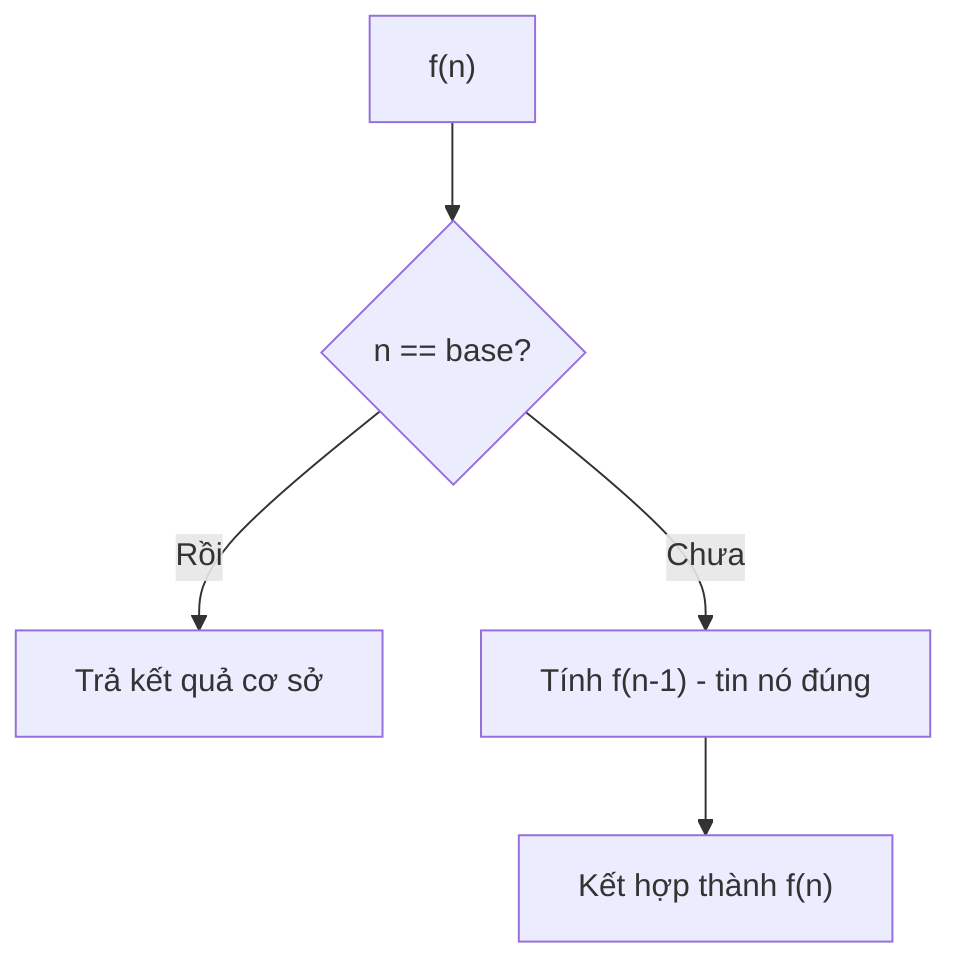
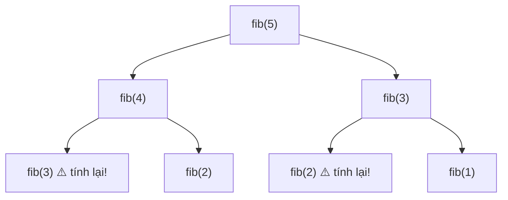

# Bài 6 — Đệ Quy

> 🧮 **Nhánh 02 — Thuật Toán (HSG / Competitive Programming)**

---

## 🧠 Điều kiện tiên quyết

- [Bài 12 — Hàm](../../01-Co-Ban/12-Ham/bai.md)
- [Bài 5 — Stack, Queue & Hashing](../05-Stack-Queue-Hashing/bai.md)
- [Bài 4 — Sắp Xếp](../04-Sap-Xep/bai.md) (đã thấy merge sort đệ quy)

---

## 🎯 Mục tiêu

Sau bài học này, học viên sẽ:

* ✅ Hiểu đệ quy qua "niềm tin quy nạp": tin hàm con làm đúng, chỉ lo bước hiện tại + điều kiện dừng.
* ✅ Viết được 3 công thức đệ quy chuẩn: giai thừa/tổng, Fibonacci (và vì sao nó chậm), lũy thừa nhanh.
* ✅ Hiểu ngăn xếp gọi (call stack), giới hạn đệ quy Python, và lỗi `RecursionError`.
* ✅ Biết memoization (đệ quy có nhớ) biến O(2ⁿ) thành O(n) — cầu nối sang Quy hoạch động (Bài 10).
* ✅ Phân biệt khi nào đệ quy đẹp và khi nào vòng lặp an toàn hơn.

---

## 📖 Mở đầu

Đệ quy là kỹ thuật "hack não" nhất khi mới học: hàm gọi chính nó nghe như
vòng lặp vô hạn. Nhưng một khi hiểu, bạn mở khóa được: duyệt cây/đồ thị,
quay lui (Bài 7), chia để trị (Bài 4, 9), và toàn bộ Quy hoạch động (Bài 10).

Bí quyết: **đừng cố chạy toàn bộ trong đầu**. Chỉ cần đúng 2 thứ:
(1) điều kiện dừng đúng, (2) mỗi lần gọi tiến gần hơn tới điều kiện dừng.

---

## 💡 Ý tưởng trực quan

* **Búp bê Nga (matryoshka):** mở con lớn thấy con nhỏ hơn, mở tiếp... đến con
  đặc cuối cùng (điều kiện dừng). Đóng lại từng con = các lệnh sau cuộc gọi đệ quy.
* **Niềm tin quy nạp:** "giả sử hàm `f(n-1)` trả đúng, tôi chỉ cần lo bước từ
  `n-1` lên `n`". Giống leo thang: tin bậc dưới vững, chỉ bước một bậc.
* **Ngăn xếp gọi:** mỗi cuộc gọi là một tờ giấy note chồng lên; xong việc thì
  bóc ra. Chồng quá cao (>1000 tờ) → đổ (`RecursionError`).



---

## 📚 Kiến thức

### 1. Khung chuẩn của mọi hàm đệ quy

```python
def f(n):
    if <điều kiện dừng>:     # base case — KHÔNG gọi đệ quy nữa
        return <giá trị cơ sở>
    return <kết hợp>(f(n - 1))  # bước đệ quy — tiến gần base hơn
```

Thiếu điều kiện dừng → `RecursionError`. Bước đệ quy không tiến gần base →
treo/crash. Mọi bug đệ quy đều thuộc 2 loại này.

**Ví dụ mẫu — tổng 1..n:**

```python
def tong(n):
    if n <= 1:          # base
        return n
    return n + tong(n - 1)   # tin tong(n-1) đúng

print(tong(5))   # 15
```

Chạy bằng tay `tong(3)`: `3 + tong(2)` → `3 + (2 + tong(1))` → `3 + (2 + 1)` = 6.
Mỗi cuộc gọi "treo" chờ kết quả con — đó là ngăn xếp gọi.

### 2. Ngăn xếp gọi và giới hạn Python

Mỗi cuộc gọi đệ quy tốn 1 frame (biến địa phương + địa chỉ quay về).
Python mặc định cho ~1000 frame:

```python
import sys
print(sys.getrecursionlimit())   # 1000
sys.setrecursionlimit(300000)    # nới khi cần (ví dụ merge sort n lớn)
```

> ⚠️ Nới limit quá đà + đệ quy sâu thật → tràn stack của hệ điều hành →
> **crash luôn trình thông dịch** (không phải exception bắt được).
> Quy tắc: sâu ≤ vài chục nghìn thì nới limit; sâu ~10⁵ trở lên → viết vòng lặp.

### 3. Fibonacci naive — ví dụ đắt giá nhất về O(2ⁿ)

```python
def fib(n):
    if n <= 1:
        return n
    return fib(n - 1) + fib(n - 2)
```

Đúng nhưng `fib(40)` chạy hàng giây, `fib(100)` lâu hơn tuổi vũ trụ.
Vì sao? Cây gọi phình mũ — `fib(5)` đã tính `fib(3)` hai lần, `fib(2)` ba lần:

```
                  fib(5)
            fib(4)       fib(3)
        fib(3)  fib(2)  fib(2)  fib(1)
       ... (lặp lại khắp nơi)
```

Số node ≈ 2ⁿ. Bài học: **đệ quy + bài toán con lặp lại = thảm họa** nếu không nhớ.

### 4. Memoization — đệ quy có nhớ (O(2ⁿ) → O(n))

Lưu kết quả đã tính vào dict; gặp lại thì lấy ra, không tính nữa.
Mỗi giá trị 0..n tính đúng 1 lần → O(n) thời gian, O(n) bộ nhớ.

```python
def fib_nho(n, nho=None):
    if nho is None:
        nho = {}
    if n in nho:
        return nho[n]
    if n <= 1:
        nho[n] = n
    else:
        nho[n] = fib_nho(n - 1, nho) + fib_nho(n - 2, nho)
    return nho[n]

# Cách gọn với thư viện chuẩn:
from functools import lru_cache

@lru_cache(maxsize=None)
def fib2(n):
    if n <= 1:
        return n
    return fib2(n - 1) + fib2(n - 2)

print(fib2(500))   # chớp mắt (số có 105 chữ số!)
```

> `@lru_cache` tự ghi nhớ kết quả hàm — một dòng decorator biến đệ quy mũ
> thành tuyến tính. Đây chính là linh hồn của Quy hoạch động top-down (Bài 10).

### 5. Lũy thừa nhanh — đệ quy O(log n)

Tính xⁿ: nhân n lần thì O(n); chia đôi số mũ thì O(log n):

* n chẵn: xⁿ = (x^(n/2))²
* n lẻ: xⁿ = x · x^(n−1)

```python
def luy_thua(x, n):
    if n == 0:
        return 1
    if n % 2 == 0:
        nua = luy_thua(x, n // 2)
        return nua * nua
    return x * luy_thua(x, n - 1)
```

Mỗi 2 bước, n giảm một nửa → O(log n) phép nhân. Với n = 10¹⁸: ~60 bước
thay vì 10¹⁸. Mẫu này dùng cho lũy thừa ma trận (Fibonacci n khổng lồ),
nghịch đảo modulo (Bài 11).

### 6. Đệ quy vs vòng lặp — chọn sao cho đúng

| Tình huống | Chọn |
|---|---|
| Duyệt cây/đồ thị, quay lui, chia để trị | Đệ quy (tự nhiên hơn hẳn) |
| Sâu ≤ vài nghìn, code thi cử | Đệ quy + nới limit nếu cần |
| Sâu ~10⁵+ (duyệt dãy dài) | Vòng lặp (tránh crash) |
| Python thuần cần tốc độ tối đa | Vòng lặp (gọi hàm tốn hằng số) |
| Bài toán con lặp lại | Đệ quy + memo (= DP top-down) |

---

## 💻 Ví dụ

### Ví dụ 1 — Dễ: giai thừa + đếm số chữ số

```python
def giai_thua(n):
    if n <= 1:
        return 1
    return n * giai_thua(n - 1)

def dem_chu_so(n):
    if n < 10:
        return 1
    return 1 + dem_chu_so(n // 10)

print(giai_thua(5))      # 120
print(dem_chu_so(2026))  # 4
```

**Phân tích:** `dem_chu_so` mỗi lần gọi bỏ đi 1 chữ số cuối (`n // 10`) —
tiến gần base (`n < 10`) rõ ràng. Độ sâu = số chữ số, rất nông, an toàn.

### Ví dụ 2 — Thực tế: duyệt thư mục đệ quy (ứng dụng thật)

```python
from pathlib import Path

def liet_ke_py(thu_muc, sau=0):
    p = Path(thu_muc)
    for con in sorted(p.iterdir()):
        print("  " * sau + con.name)
        if con.is_dir():
            liet_ke_py(con, sau + 1)   # đệ quy vào thư mục con

liet_ke_py(".")
```

**Giải thích:** cây thư mục là cấu trúc đệ quy tự nhiên (thư mục chứa thư mục).
Vòng lặp xử lý danh sách phẳng không thể làm gọn thế này — đệ quy là công cụ
đúng cho dữ liệu lồng nhau (file, JSON, HTML DOM...).

### Ví dụ 3 — Khó: Tháp Hà Nội (bài đệ quy "quốc dân")

> Chuyển n đĩa từ cọc A sang C (qua B), mỗi lần 1 đĩa, đĩa lớn không nằm trên đĩa nhỏ.

```python
def hanoi(n, tu, den, trung_gian):
    if n == 1:
        print(f"Chuyen dia 1 tu {tu} sang {den}")
        return
    hanoi(n - 1, tu, trung_gian, den)   # chuyển n-1 đĩa sang trung gian
    print(f"Chuyen dia {n} tu {tu} sang {den}")  # chuyển đĩa lớn nhất
    hanoi(n - 1, trung_gian, den, tu)   # chuyển n-1 đĩa lên trên nó

hanoi(3, "A", "C", "B")
```

Output (7 bước = 2³ − 1):

```
Chuyen dia 1 tu A sang C
Chuyen dia 2 tu A sang B
Chuyen dia 1 tu C sang B
Chuyen dia 3 tu A sang C
Chuyen dia 1 tu B sang A
Chuyen dia 2 tu B sang C
Chuyen dia 1 tu A sang C
```

**Trực giác "niềm tin":** muốn chuyển n đĩa A→C: (1) tin rằng chuyển được n−1
đĩa A→B, (2) chuyển đĩa lớn nhất A→C (1 bước hiển nhiên), (3) tin rằng chuyển
được n−1 đĩa B→C. Không cần hình dung cả cây — chỉ cần tin 2 cuộc gọi con.
Số bước T(n) = 2T(n−1) + 1 → T(n) = 2ⁿ − 1 (chứng minh bằng quy nạp — và đó
cũng là số bước tối ưu, không thể ít hơn).

---

## 📊 Minh họa

Ngăn xếp gọi của `tong(3)`:

```
tong(3) → cần tong(2)
  tong(2) → cần tong(1)
    tong(1) → base, trả 1
  ← 2 + 1 = 3
← 3 + 3 = 6
```

Cây gọi của `fib(5)` naive (thấy ngay sự lặp lại):



---

## ⚠️ Những lỗi thường gặp

### Lỗi 1: Quên điều kiện dừng

```python
def tong(n):
    return n + tong(n - 1)   # ❌ chạy đến RecursionError
```

### Lỗi 2: Bước đệ quy không tiến về base

```python
def la(n):
    if n == 0:
        return 0
    return la(n)   # ❌ n không đổi → vô hạn
```

### Lỗi 3: Đệ quy sâu trên dãy dài (ví dụ duyệt list 10⁵ phần tử)

* Crash hoặc `RecursionError` dù logic đúng → viết vòng lặp thay thế.

### Lỗi 4: Fibonacci naive cho n lớn trong bài thi

* `fib(100)` naive không bao giờ xong → memo/`lru_cache`/vòng lặp.

### Lỗi 5: Hiểu sai thứ tự lệnh quanh cuộc gọi đệ quy

Lệnh **trước** gọi đệ quy chạy khi "đi xuống"; lệnh **sau** chạy khi "đi lên"
(quay về). In nhầm chỗ cho output ngược — vẽ ngăn xếp ra giấy để kiểm tra.

---

## 🧪 Trường hợp đặc biệt

* **n = 0 / âm**: `tong(0)` với base `n <= 1` trả 0 ✔; base `n == 1` sẽ treo
  với n = 0 → base nên "bao" cả miền biên (`<=`), không "chạm" đúng một điểm.
* **`lru_cache` với đối số không băm được** (list): báo lỗi — đổi sang tuple.
* **Đệ quy tương hỗ** (f gọi g, g gọi f): hợp lệ nhưng khó debug — vẽ sơ đồ gọi.
* **Python không tối ưu đệ quy đuôi** (không như Scheme/Haskell): `return f(...)`
  cuối hàm vẫn tốn frame — đừng trông chờ "tail-call optimization".

---

## 🚀 Ứng dụng thực tế

* Duyệt cây thư mục, JSON lồng nhau, DOM, AST trình biên dịch.
* Thuật toán đồ thị (DFS), quay lui, chia để trị, DP top-down.
* `os.walk`, `pathlib.rglob` là đệ quy "đóng gói sẵn".

---

## 🧩 Bài tập

### 🟢 Cơ bản (1–3)

**Bài 1 — Chạy tay ngăn xếp.** Vẽ ngăn xếp gọi và kết quả từng bước quay về
của `giai_thua(4)`.

**Bài 2 — Đảo chuỗi.** Viết `dao(s)` đệ quy trả chuỗi đảo ngược (không dùng
`[::-1]` để luyện). Base là gì? Bước đệ quy là gì?

**Bài 3 — Đếm node.** Cây thư mục mini: root chứa file a, thư mục X (chứa file
b, c). Dùng tư duy đệ quy đếm tổng số file (không code, viết pseudocode).

### 🟡 Hiểu sâu (4–6)

**Bài 4 — Đếm bước fib naive.** Gọi C(n) là số cuộc gọi hàm khi tính `fib(n)`
naive. Lập công thức truy hồi của C(n), tính C(6) bằng tay (đáp án: 25).

**Bài 5 — Lũy thừa modulo.** Viết `pow_mod(x, n, m)` đệ quy O(log n) tính
xⁿ mod m (n ≤ 10¹⁸, m ≤ 10⁹). *Chú ý: `(a*b) % m` an toàn trong Python
(int vô hạn); lấy mod sau mỗi phép nhân để số không phình.*

**Bài 6 — Palindrome đệ quy.** Viết `doi_xung(s)` kiểm tra chuỗi đối xứng bằng
đệ quy (so hai đầu, thu hẹp dần). Phân tích độ sâu đệ quy.

### 🔴 Vận dụng (7–8)

**Bài 7 — Tổ hợp C(n,k) đệ quy + memo.** Dùng công thức Pascal
C(n,k) = C(n−1,k−1) + C(n−1,k) với base C(n,0) = C(n,n) = 1, thêm `lru_cache`.
Tính C(100, 50) (kết quả ~10²⁹ — naive không memo sẽ treo). Giải thích vì sao
memo cứu được (mỗi cặp (n,k) tính 1 lần → O(n·k)).

**Bài 8 — Độ sâu an toàn.** Merge sort đệ quy sâu bao nhiêu với n = 10⁶?
Duyệt list bằng đệ quy sâu bao nhiêu? Kết luận cái nào an toàn với limit 1000,
cái nào phải viết vòng lặp.

---

## ✅ Đáp án

> 💡 **Hãy tự làm bài tập trước** rồi mới mở đáp án.

<details>
<summary>✅ Bài 1: Chạy tay ngăn xếp</summary>

```
giai_thua(4) → 4 × giai_thua(3)
  giai_thua(3) → 3 × giai_thua(2)
    giai_thua(2) → 2 × giai_thua(1)
      giai_thua(1) → base → 1
    ← 2 × 1 = 2
  ← 3 × 2 = 6
← 4 × 6 = 24
```

Kết quả 24. Độ sâu tối đa 4 frame.

</details>

<details>
<summary>✅ Bài 2: Đảo chuỗi</summary>

```python
def dao(s):
    if len(s) <= 1:      # base: rỗng hoặc 1 ký tự
        return s
    return dao(s[1:]) + s[0]   # đảo phần đuôi rồi gắn đầu ra cuối
```

* Base `<= 1` bao cả chuỗi rỗng (tránh treo với `s = ""`).
* Nhược điểm: `s[1:]` tạo chuỗi mới mỗi lần → O(n²) tổng. Cách O(n):
  dùng chỉ số `dao(s, l, r)` hoặc... vòng lặp/hai con trỏ trong thi thật.

</details>

<details>
<summary>✅ Bài 3: Đếm node</summary>

```
dem(node):
  nếu node là file: trả 1
  nếu node là thư mục: trả tổng dem(con) với mọi con
```

root: dem(a)=1 + dem(X); dem(X) = dem(b)+dem(c) = 2 → tổng **3**.

</details>

<details>
<summary>✅ Bài 4: Đếm bước fib naive</summary>

C(n) = 1 + C(n−1) + C(n−2) (1 cho chính cuộc gọi hiện tại), C(0) = C(1) = 1.
Tính dần: C(2) = 3, C(3) = 5, C(4) = 9, C(5) = 15, C(6) = **25**.
Tăng gần gấp đôi mỗi lần tăng n — đúng dáng 2ⁿ.

</details>

<details>
<summary>✅ Bài 5: Lũy thừa modulo</summary>

```python
def pow_mod(x, n, m):
    if n == 0:
        return 1 % m
    if n % 2 == 0:
        nua = pow_mod(x, n // 2, m)
        return (nua * nua) % m
    return (x * pow_mod(x, n - 1, m)) % m

# Thực tế thi dùng luôn hàm có sẵn (viết bằng C, nhanh hơn):
# pow(x, n, m)
```

O(log n) phép nhân, số luôn < m² nhờ mod mỗi bước. Python có sẵn `pow(x, n, m)`
— trong thi dùng luôn, tự cài chỉ để hiểu.

</details>

<details>
<summary>✅ Bài 6: Palindrome đệ quy</summary>

```python
def doi_xung(s, l=0, r=None):
    if r is None:
        r = len(s) - 1
    if l >= r:
        return True
    return s[l] == s[r] and doi_xung(s, l + 1, r - 1)
```

Độ sâu ≈ n/2 (mỗi lần gọi thu hẹp 2 đầu). Với chuỗi 10⁵ ký tự → sâu 5×10⁴ →
**vượt limit** → thi thật dùng hai con trỏ vòng lặp.

</details>

<details>
<summary>✅ Bài 7: Tổ hợp C(n,k) đệ quy + memo</summary>

```python
from functools import lru_cache

@lru_cache(maxsize=None)
def C(n, k):
    if k == 0 or k == n:
        return 1
    return C(n - 1, k - 1) + C(n - 1, k)

print(C(100, 50))   # 100891344545564193334812497256
```

Naive tính lại cùng cặp (n,k) hàng triệu lần (cây gọi chồng lấp như fib).
Memo: mỗi cặp tính đúng 1 lần, số cặp ≤ (n+1)(k+1) ≈ 5.000 → O(n·k).
Đây chính là DP top-down — Bài 10 sẽ hệ thống hóa.

</details>

<details>
<summary>✅ Bài 8: Độ sâu an toàn</summary>

* Merge sort: sâu log₂n ≈ 20 với n = 10⁶ → **an toàn** (≪ 1000).
* Duyệt list đệ quy `f(i) → f(i+1)`: sâu n = 10⁶ → **crash** → phải vòng lặp.
* Quy tắc: sâu logarit thì đệ quy thoải mái; sâu tuyến tính theo n thì vòng lặp.

</details>

---

## 🧠 Thử thách

**Thử thách HSG:** Viết hàm đệ quy in mọi xâu nhị phân độ dài n (2ⁿ xâu) theo
thứ tự từ điển, dùng đúng O(n) bộ nhớ phụ (không lưu list kết quả).
*Gợi ý: mẫu quay lui sơ khai — ở mỗi vị trí thử '0' rồi '1' (Bài 7 mở rộng).*

---

## 📝 Tóm tắt

| Khái niệm | Nội dung |
|---|---|
| 🔁 Khung đệ quy | Base đúng + bước tiến về base |
| 📚 Call stack | Mỗi gọi 1 frame; limit ~1000; sâu tuyến tính → vòng lặp |
| 🐢 Fib naive | O(2ⁿ) vì tính lại — bài học đắt giá |
| 🧠 Memo | Dict/`lru_cache` → O(n); cầu sang DP |
| ⚡ Lũy thừa nhanh | Chia đôi mũ → O(log n); mẫu cho mod/matrận |

---

## ➡️ Điều hướng

**Vị trí:** `02-Thuat-Toan/06-De-Quy/bai.md`

**Bài tiếp theo:** [Bài 7 — Quay Lui (Backtracking)](../07-Quay-Lui/bai.md)
