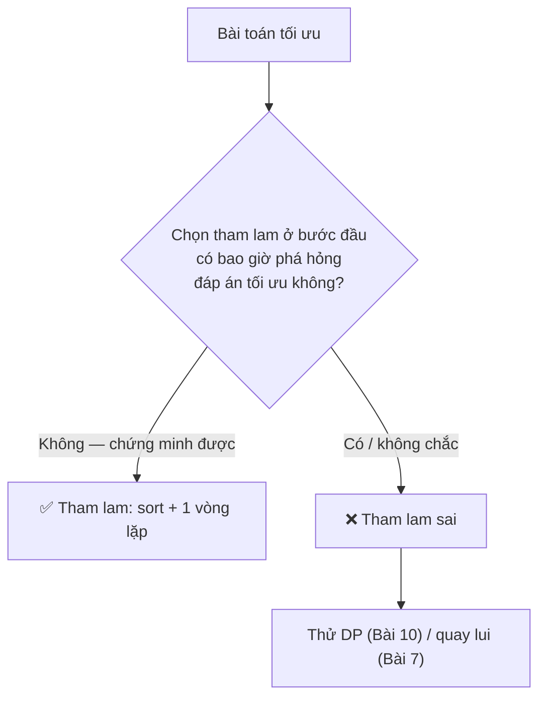

# Bài 9 — Tham Lam (Greedy)

> 🧮 **Nhánh 02 — Thuật Toán (HSG / Competitive Programming)**

---

## 🧠 Điều kiện tiên quyết

- [Bài 4 — Sắp Xếp](../04-Sap-Xep/bai.md)
- [Bài 2 — Độ Phức Tạp](../02-Do-Phuc-Tap/bai.md)
- [Bài 1 — Tư Duy Thuật Toán](../01-Tu-Duy-Thuat-Toan/bai.md)

---

## 🎯 Mục tiêu

Sau bài học này, học viên sẽ:

* ✅ Hiểu tư tưởng tham lam: mỗi bước chọn tốt nhất cục bộ, không bao giờ quay lui.
* ✅ Biết 2 điều kiện để tham lam đúng: tính chất lựa chọn tham lam + cấu trúc con tối ưu.
* ✅ Giải được 4 bài mẫu: đổi tiền chuẩn, xếp lịch, nối cáp (Huffman mini), phân kẹo.
* ✅ Nhận ra **bẫy tham lam**: bài đổi tiền mệnh giá lạ, bài túi đồ 0/1 — tham lam sai!
* ✅ Biết cách "chứng minh nhanh" bằng đối chứng trao đổi (exchange argument).

---

## 📖 Mở đầu

Tham lam là chiến lược "sống cho hiện tại": mỗi bước chọn cái tốt nhất
trước mắt, không hối hận, không quay lui. Khi nó đúng, code ngắn đến ngỡ
ngàng (thường chỉ là sort + một vòng lặp). Khi nó sai, nó sai âm thầm —
chạy đúng ví dụ, trượt test ẩn.

Vì vậy bài này có hai nửa bằng nhau: **khi nào tham lam đúng** (mẫu + chứng
minh trực giác) và **khi nào nó sai** (phản ví dụ + thuật toán thay thế).

---

## 💡 Ý tưởng trực quan

* **Tham lam đúng:** leo núi trong sương mù nhưng đường chỉ lên không xuống —
  cứ bước lên chỗ cao nhất cạnh mình, chắc chắn tới đỉnh. (Địa hình "lồi".)
* **Tham lam sai:** leo dãy núi nhấp nhô — bước lên đỉnh gần nhất có thể kẹt
  ở đỉnh thấp, bỏ lỡ đỉnh cao thật sau thung lũng. (Địa hình "lõm".)
* Công việc của bạn: trước khi code, xác định địa hình bài toán thuộc loại nào.



---

## 📚 Kiến thức

### 1. Hai điều kiện để tham lam đúng

1. **Tính chất lựa chọn tham lam:** tồn tại đáp án tối ưu chứa lựa chọn tham
   lam ở bước đầu. (Nói dễ hiểu: "chọn tốt nhất hiện tại không bao giờ là sai
   lầm không sửa được".)
2. **Cấu trúc con tối ưu:** sau khi chọn, phần còn lại cũng là bài toán tối ưu
   cùng dạng (đệ quy/tiếp tục tham lam được).

> Không cần chứng minh hình thức trong thi (trừ vấn đáp HSG quốc gia) —
> nhưng phải có **lập luận trực giác thuyết phục** trước khi code.
> Quy tắc thực chiến: nghĩ ra phản ví dụ trong 5 phút mà không được → tham lam
> có khả năng đúng; tìm được phản ví dụ → bỏ ngay.

### 2. Mẫu 1 — Xếp lịch (activity selection): tham lam kinh điển nhất

> n công việc, mỗi việc [bắt đầu, kết thúc). Làm được nhiều việc nhất?
> (Không làm 2 việc trùng giờ.)

**Lựa chọn tham lam:** luôn làm việc **kết thúc sớm nhất** trong số còn lại
(tương thích với việc trước). Trực giác: việc kết thúc sớm để lại nhiều thời
gian nhất cho các việc sau — không bao giờ tệ hơn chọn việc khác.

```python
def xep_lich(cong_viec):
    # mỗi việc (bat_dau, ket_thuc); sắp theo giờ kết thúc tăng dần
    viec = sorted(cong_viec, key=lambda v: v[1])
    dem, het_truoc = 0, -1
    for bd, kt in viec:
        if bd >= het_truoc:   # tương thích → làm
            dem += 1
            het_truoc = kt
    return dem
```

O(n log n) do sort. **Biến thể hay gặp:** mỗi việc có deadline + lợi nhuận,
làm tối đa lợi nhuận → sort lợi nhuận giảm dần + kiểm tra slot trống (dùng
DSU hoặc... tham lam với heap — mẫu "lịch trình có trọng số").

### 3. Mẫu 2 — Đổi tiền với mệnh giá chuẩn

Tiền Việt (1, 2, 5, 10, 20, 50, 100, 200, 500 nghìn): trả S sao cho **ít tờ
nhất** → cứ lấy tờ lớn nhất có thể (tham lam đúng vì mệnh giá "chuẩn" —
mỗi mệnh giá là bội của mệnh giá nhỏ hơn, trừ cặp 1-2-5... vẫn đúng do thiết kế).

```python
def doi_tien(s, menh_gia):
    menh_gia = sorted(menh_gia, reverse=True)
    dem = 0
    for m in menh_gia:
        dem += s // m
        s %= m
    return dem if s == 0 else -1   # -1: không đổi được chính xác
```

### 4. ⚠️ Bẫy tham lam — đổi tiền mệnh giá lạ (tham lam SAI)

Mệnh giá [1, 3, 4], đổi S = 6:

* Tham lam: 4 + 1 + 1 = **3 tờ**.
* Tối ưu: 3 + 3 = **2 tờ**. ❌ Tham lam sai!

> Bài học xương máu: **cùng đề bài, khác dữ liệu → tham lam đúng thành sai.**
> Đổi tiền tổng quát phải dùng DP (Bài 10). Trong phòng thi, trước khi nộp bài
> tham lam, hãy tự hỏi: "mệnh giá/tình huống nào phá được cách này?"

### 5. ⚠️ Bẫy tham lam — túi đồ 0/1 (tham lam SAI, nhưng túi phân số thì ĐÚNG)

> n món, mỗi món (giá trị v, khối lượng w), túi chịu W. Lấy nguyên món
> (0/1) để tổng giá trị lớn nhất.

Tham lam "tỉ số v/w cao nhất": món A (v=60, w=51), B (v=60, w=50), C (v=60,
w=50), W = 100. Tham lam lấy A (tỉ số cao nhất 60/51) → đầy 51, còn 49 không
đủ món nào → tổng **60**. Tối ưu: B + C = **120**. ❌ Sai gấp đôi!

Nhưng nếu được **xẻ nhỏ** món (túi phân số — fractional knapsack), tham lam
tỉ số lại ĐÚNG. Cùng câu chuyện, khác một chữ → đúng thành sai. (Cả hai bản
DP ở Bài 10.)

### 6. Mẫu 3 — Nối cáp tốn ít nhất (Huffman mini)

> n sợi cáp độ dài khác nhau. Nối 2 sợi tốn chi phí = tổng độ dài; nối dần
> thành 1 sợi. Tổng chi phí nhỏ nhất?

Tham lam: luôn nối 2 sợi **ngắn nhất** (dùng min-heap). Trực giác: sợi ngắn
được cộng nhiều lần nhất trong tổng chi phí → ưu tiên "giấu" sợi dài, nối
sợi ngắn trước.

```python
import heapq

def noi_cap(a):
    heapq.heapify(a)
    tong = 0
    while len(a) > 1:
        x = heapq.heappop(a)
        y = heapq.heappop(a)
        tong += x + y
        heapq.heappush(a, x + y)
    return tong
```

O(n log n). Chạy tay [4, 3, 2, 6]: nối 2+3=5 (tổng 5), heap [4, 5, 6];
nối 4+5=9 (tổng 14), heap [6, 9]; nối 6+9=15 (tổng 29) → **29**.

### 7. Chứng minh nhanh bằng "đối chứng trao đổi" (exchange argument)

Kỹ thuật lập luận: giả sử có đáp án tối ưu OPT không dùng lựa chọn tham lam
đầu tiên → đổi lựa chọn đó thành lựa chọn tham lam → đáp án không tệ đi →
tồn tại OPT chứa lựa chọn tham lam. Áp dụng:

* **Xếp lịch:** OPT có việc đầu tiên X ≠ việc kết thúc sớm nhất G. Đổi X
  thành G: G kết thúc không muộn hơn X nên vẫn tương thích với phần còn lại,
  số việc không đổi → OPT mới chứa G. ✔
* **Đổi tiền chuẩn:** (bỏ qua chi tiết) mệnh giá bội nhau đảm bảo đổi tờ nhỏ
  thành tờ lớn không tăng số tờ.

> Trong thi viết/vấn đáp, trình bày được đoạn này là điểm tối đa phần chứng minh.

---

## 💻 Ví dụ

### Ví dụ 1 — Dễ: phân kẹo (mẫu "khớp tham lam")

> n trẻ em, mỗi em cần ít nhất g[i] viên kẹo mới vui; m gói kẹo cỡ s[j].
> Mỗi em tối đa 1 gói. Làm vui được nhiều em nhất?

Tham lam: em dễ tính nhất (g nhỏ) nhận gói vừa đủ nhỏ nhất (sort cả hai +
hai con trỏ):

```python
import sys

def main():
    data = sys.stdin.read().strip().split()
    if not data:
        return
    it = iter(data)
    n, m = int(next(it)), int(next(it))
    g = sorted(int(next(it)) for _ in range(n))
    s = sorted(int(next(it)) for _ in range(m))
    i = dem = 0
    for goi in s:
        if i < n and goi >= g[i]:
            dem += 1
            i += 1
    print(dem)

main()
```

Trực giác: gói nhỏ mà em khó tính không ăn được thì gói lớn cũng phí; em dễ
tính ăn gói nhỏ là tiết kiệm nhất → không bao giờ sai.

### Ví dụ 2 — Thực tế: xếp lịch phòng họp + in lịch

```python
import sys

def main():
    data = sys.stdin.read().strip().split()
    if not data:
        return
    n = int(data[0])
    viec = [(int(data[i]), int(data[i + 1])) for i in range(1, 2 * n, 2)]
    viec.sort(key=lambda v: v[1])
    chon, het = [], -1
    for bd, kt in viec:
        if bd >= het:
            chon.append((bd, kt))
            het = kt
    print(len(chon))
    for bd, kt in chon:
        print(bd, kt)

main()
```

Input `4\n1 3\n2 4\n3 5\n0 6` → sort theo kết thúc: (1,3), (2,4), (3,5), (0,6).
Chọn (1,3) [het=3], bỏ (2,4) [2<3], chọn (3,5) [het=5], bỏ (0,6) → **2 việc**:
(1,3), (3,5). ✔

### Ví dụ 3 — Khó: trạm xăng tối thiểu (tham lam + chứng minh)

> Xe đi từ 0 đến D, bình chạy tối đa K km. Có n trạm ở vị trí cho trước.
> Dừng đổ ít lần nhất (giả sử đủ xăng xuất phát và trạm cuối ≤ D)?

Tham lam: từ vị trí hiện tại, đi đến trạm **xa nhất trong tầm K**, đổ, lặp lại.

```python
import sys

def main():
    data = sys.stdin.read().strip().split()
    if not data:
        return
    it = iter(data)
    d, k, n = int(next(it)), int(next(it)), int(next(it))
    tram = sorted(int(next(it)) for _ in range(n)) + [d]
    hien_tai, dem, i = 0, 0, 0
    while hien_tai + k < d:
        xa_nhat = hien_tai
        while i < len(tram) and tram[i] - hien_tai <= k:
            xa_nhat = tram[i]
            i += 1
        if xa_nhat == hien_tai:
            print(-1)   # có đoạn dài hơn K → không tới được
            return
        hien_tai = xa_nhat
        dem += 1
    print(dem)

main()
```

**Chứng minh trực giác (exchange):** xét đáp án tối ưu, lần dừng đầu ở trạm T.
Trạm tham lam G xa nhất trong tầm → G ≥ T. Đổi T thành G: từ G vẫn tới được
mọi chỗ từ T tới được (vì G ở xa hơn, phía trước) → số lần dừng không tăng. ✔

---

## 📊 Minh họa

Xếp lịch: các việc `A[1,4), B[3,5), C[0,6), D[5,7), E[6,9)`:

```
Thời gian: 0  1  2  3  4  5  6  7  8  9
A:            [=====]
B:               [=====]
C:         [===========]
D:                        [=====]
E:                           [========]
Sort theo kết thúc: A(4), B(5), C(6), D(7), E(9)
Chọn A [het=4] → bỏ B → bỏ C → chọn D [het=7] → chọn E → 3 việc ✔
```

---

## ⚠️ Những lỗi thường gặp

### Lỗi 1: Tham lam mà không tự kiểm phản ví dụ

* Quy trình bắt buộc: code tham lam → dành 5 phút tìm phản ví dụ nhỏ
  (n = 3–4, số lẻ, biên) → tìm được thì bỏ, không thì mới nộp.

### Lỗi 2: Sort sai tiêu chí (xếp lịch sort theo bắt đầu)

```python
# ❌ sort theo bắt đầu → chọn việc bắt đầu sớm nhưng kéo dài, chặn nhiều việc
viec.sort(key=lambda v: v[0])
# ✅ sort theo KẾT THÚC
viec.sort(key=lambda v: v[1])
```

### Lỗi 3: Túi 0/1 dùng tham lam tỉ số

* Đã phân tích mục 5 — sai có thể gấp nhiều lần. Túi 0/1 → DP (Bài 10).

### Lỗi 4: Quên sắp xếp trước khi tham lam

* Hầu hết tham lam bắt đầu bằng sort. Quên sort mà duyệt thứ tự input →
  kết quả phụ thuộc input → sai.

### Lỗi 5: Tràn/cộng sai trong nối cáp với số lớn

* Python int vô hạn nên an toàn; trong C++ cần long long. Biết để đọc editorial.

---

## 🧪 Trường hợp đặc biệt

* **Không việc nào tương thích nổi** (xếp lịch): đáp án 0 — code trả 0 tự nhiên.
* **S = 0** (đổi tiền): 0 tờ — vòng lặp không chạy, `s == 0` → trả 0. ✔
* **Không đổi được chính xác** (đổi tiền): `s != 0` cuối → trả −1 (quy ước đề).
* **K = 0 / bình rỗng** (trạm xăng): không đi được mét nào → −1 trừ khi D = 0.
* **Mệnh giá có 1**: đổi tiền luôn đổi được chính xác (không cần nhánh −1).

---

## 🚀 Ứng dụng thực tế

* Lập lịch CPU/OS (shortest-job-first), nén Huffman (nén file ZIP!), định tuyến.
* "Tham lam + chứng minh" là tư duy thiết kế hệ thống: chọn tối ưu cục bộ có
  giữ được tối ưu toàn cục không?

---

## 🧩 Bài tập

### 🟢 Cơ bản (1–3)

**Bài 1 — Chạy tay.** Việc: (1,4), (3,5), (0,6), (5,7), (8,9), (5,9). Xếp lịch
tham lam: sort theo kết thúc, ghi việc được chọn và `het` sau mỗi bước.

**Bài 2 — Đổi tiền Việt.** S = 576 (nghìn), mệnh giá chuẩn Việt Nam. Chạy tay
tham lam, ghi số tờ mỗi mệnh giá và tổng số tờ.

**Bài 3 — Phản ví dụ.** Mệnh giá [1, 3, 4], S = 6. Chạy tay tham lam (3 tờ) và
chỉ ra đáp án tối ưu (2 tờ). Kết luận.

### 🟡 Hiểu sâu (4–6)

**Bài 4 — Nối cáp.** `[4, 3, 2, 6]`. Chạy tay heap từng bước (ghi heap + tổng),
kiểm chứng đáp án 29.

**Bài 5 — Lịch có lợi nhuận.** Mỗi việc (deadline, lợi nhuận), mỗi việc tốn 1
đơn vị thời gian. n ≤ 10⁵, tối đa hóa lợi nhuận. *Gợi ý: sort lợi nhuận giảm
dần; mỗi việc đặt vào slot trống muộn nhất ≤ deadline (dùng set các slot trống
hoặc DSU). Vì sao tham lam này đúng?*

**Bài 6 — Số lượng trạm xăng.** D = 100, K = 30, trạm [20, 40, 50, 70, 90].
Chạy tay thuật toán ví dụ 3. Đáp án mấy lần dừng? (Đáp án: 4 — 20? Không!
Chạy đúng: từ 0 tầm tới 30 → xa nhất là 20 → từ 20 tầm tới 50 → xa nhất 50 →
từ 50 tầm tới 80 → xa nhất 70 → từ 70 tầm tới 100 = D → dừng. Tổng 4 lần
tại 20, 50, 70... kiểm lại: 0→20 (1), 20→50 (2), 50→70? tầm 50+30=80, xa nhất
≤ 80 là 70 (3), 70+30=100 ≥ D → xong. Tổng **3 lần** tại 20, 50, 70.)

### 🔴 Vận dụng (7–8)

**Bài 7 — Phủ đoạn.** Cho đoạn [0, M] và n đoạn con [lᵢ, rᵢ]. Dùng ít đoạn con
nhất để phủ kín [0, M] (được nối tiếp: đoạn sau bắt đầu ≤ điểm đang phủ tới).
*Gợi ý: tham lam — trong các đoạn bắt đầu ≤ điểm phủ, chọn đoạn vươn xa nhất;
lặp lại. Chứng minh bằng exchange như trạm xăng.*

**Bài 8 — Xóa k chữ số.** Cho chuỗi số dài n ≤ 10⁵ và k, xóa đúng k chữ số để
số còn lại **nhỏ nhất** (giữ thứ tự). *Gợi ý: stack đơn điệu — duyệt từng chữ
số, trong khi k > 0 và đỉnh stack > chữ số hiện tại thì pop (xóa) đỉnh;
đẩy chữ số hiện tại; cuối còn dư k thì cắt đuôi. Vì sao đúng? (Xóa chữ số trái
lớn hơn chữ số phải luôn tốt hơn — exchange tại vị trí đầu tiên khác nhau.)*

---

## ✅ Đáp án

> 💡 **Hãy tự làm bài tập trước** rồi mới mở đáp án.

<details>
<summary>✅ Bài 1: Chạy tay</summary>

Sort theo kết thúc: (1,4), (3,5), (0,6), (5,7), (5,9), (8,9).
Chọn (1,4) [het=4] → bỏ (3,5), (0,6) → chọn (5,7) [het=7] → bỏ (5,9) [5<7] →
chọn (8,9) → **3 việc**: (1,4), (5,7), (8,9).

</details>

<details>
<summary>✅ Bài 2: Đổi tiền Việt</summary>

Mệnh giá: 500, 200, 100, 50, 20, 10, 5, 2, 1.
576 = 1×500 + 1×50 + 1×20 + 0×10 + 1×5 + 0×2 + 1×1 → còn 576−576 = 0.
Tổng **5 tờ**: 500, 50, 20, 5, 1.

</details>

<details>
<summary>✅ Bài 3: Phản ví dụ</summary>

Tham lam: 6 → lấy 4 (lớn nhất ≤ 6), còn 2 → 1+1 → **3 tờ** (4,1,1).
Tối ưu: 3+3 = **2 tờ**. Tham lam sai vì mệnh giá 4 "phá" cặp 3+3 —
mệnh giá không chuẩn (4 không phải bội của 3) nên tính chất tham lam vỡ.

</details>

<details>
<summary>✅ Bài 4: Nối cáp</summary>

| Heap | Lấy | Tổng cộng dồn |
|---|---|---|
| [2, 3, 4, 6] | 2+3=5 | 5 |
| [4, 5, 6] | 4+5=9 | 14 |
| [6, 9] | 6+9=15 | **29** |

</details>

<details>
<summary>✅ Bài 5: Lịch có lợi nhuận</summary>

```python
def max_loi_nhuan(viec):
    # viec: [(deadline, loi_nhuan)]
    viec.sort(key=lambda v: -v[1])   # lợi nhuận giảm dần
    max_d = max(d for d, _ in viec)
    trong = set(range(1, max_d + 1))  # slot trống
    tong = 0
    for d, p in viec:
        # slot muộn nhất ≤ d còn trống
        hop = [s for s in trong if s <= d]
        if hop:
            s = max(hop)
            trong.remove(s)
            tong += p
    return tong
```

*(Bản tối ưu dùng DSU "disjoint set union" tìm slot trống trong α(n) —
chuẩn editorial; bản set ở trên O(n²) worst case, chỉ dùng để hiểu ý tưởng.)*

Vì sao đúng: việc lợi nhuận cao nhất xứng đáng một slot; đặt nó muộn nhất có
thể để dành slot sớm cho việc khác — exchange argument tương tự xếp lịch.

</details>

<details>
<summary>✅ Bài 6: Số lượng trạm xăng</summary>

Từ 0, tầm tới 30 → trạm xa nhất ≤ 30 là **20** (1). Từ 20, tầm tới 50 → xa
nhất là **50** (2). Từ 50, tầm tới 80 → xa nhất là **70** (3). Từ 70,
70+30 = 100 ≥ D → tới đích. Tổng **3 lần dừng** (20, 50, 70).

</details>

<details>
<summary>✅ Bài 7: Phủ đoạn</summary>

```python
def phu_doan(segs, m):
    segs.sort()
    phu_toi, i, dem, n = 0, 0, 0, len(segs)
    while phu_toi < m:
        xa_nhat = phu_toi
        while i < n and segs[i][0] <= phu_toi:
            xa_nhat = max(xa_nhat, segs[i][1])
            i += 1
        if xa_nhat == phu_toi:
            return -1   # có khe hở → không phủ được
        phu_toi = xa_nhat
        dem += 1
    return dem
```

Giống trạm xăng 1D: mỗi bước vươn xa nhất có thể từ vùng đã phủ. Exchange:
đáp án tối ưu bước đầu tới X ≤ G (G tham lam) → đổi thành G không tệ đi.

</details>

<details>
<summary>✅ Bài 8: Xóa k chữ số</summary>

```python
def so_nho_nhat(s, k):
    st = []
    for ch in s:
        while k > 0 and st and st[-1] > ch:
            st.pop()
            k -= 1
        st.append(ch)
    if k > 0:          # chuỗi tăng dần → xóa đuôi
        st = st[:-k]
    return "".join(st).lstrip("0") or "0"
```

Ví dụ "1432219", k = 3: duyệt 1→[1]; 4→[1,4]; 3<4 pop 4 (k=2)→[1,3];
2<3 pop 3 (k=1)→[1,2]; 2→[1,2,2]; 1<2 pop 2 (k=0)→[1,2,1]; 9→[1,2,1,9] →
"1219". ✔ (Số 0 đầu: lstrip + `or "0"` cho trường hợp toàn 0.)

</details>

---

## 🧠 Thử thách

**Thử thách HSG:** Cho n ≤ 10⁵ đoạn [lᵢ, rᵢ]. Chọn nhiều đoạn nhất sao cho
không hai đoạn nào giao nhau (chạm biên được tính là không giao).
Chứng minh đây chính là bài xếp lịch (ánh xạ thế nào?) và cài đặt.
Sau đó xét biến thể: mỗi đoạn có trọng số wᵢ, tối đa hóa tổng trọng số —
tham lam còn đúng không? (Trả lời: không — phải DP. Tìm phản ví dụ.)

---

## 📝 Tóm tắt

| Khái niệm | Nội dung |
|---|---|
| 💰 Tham lam | Chọn tốt nhất cục bộ, không quay lui |
| ✅ Khi đúng | Lựa chọn tham lam + con tối ưu (exchange) |
| 📅 Mẫu chuẩn | Xếp lịch (kết thúc sớm), đổi tiền chuẩn, nối cáp (heap) |
| ❌ Bẫy | Mệnh giá lạ, túi 0/1, trọng số — phải DP/quay lui |
| 🔍 Thực chiến | 5 phút tìm phản ví dụ trước khi nộp |

---

## ➡️ Điều hướng

**Vị trí:** `02-Thuat-Toan/09-Tham-Lam/bai.md`

**Bài tiếp theo:** [Bài 10 — Quy Hoạch Động](../10-Quy-Hoach-Dong/bai.md)
