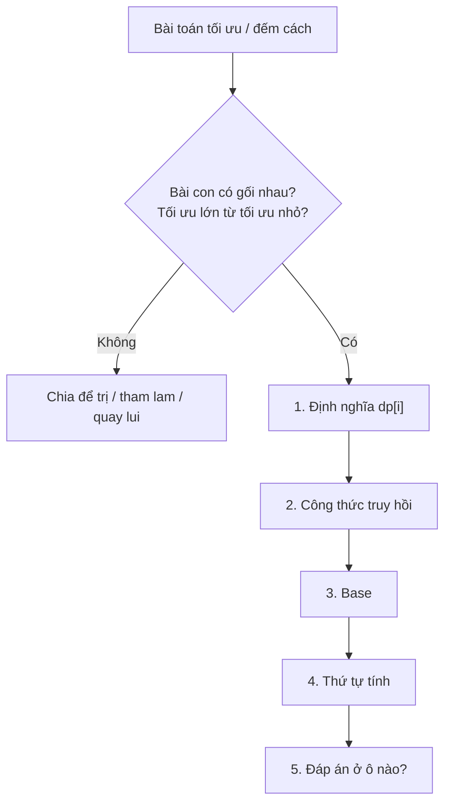
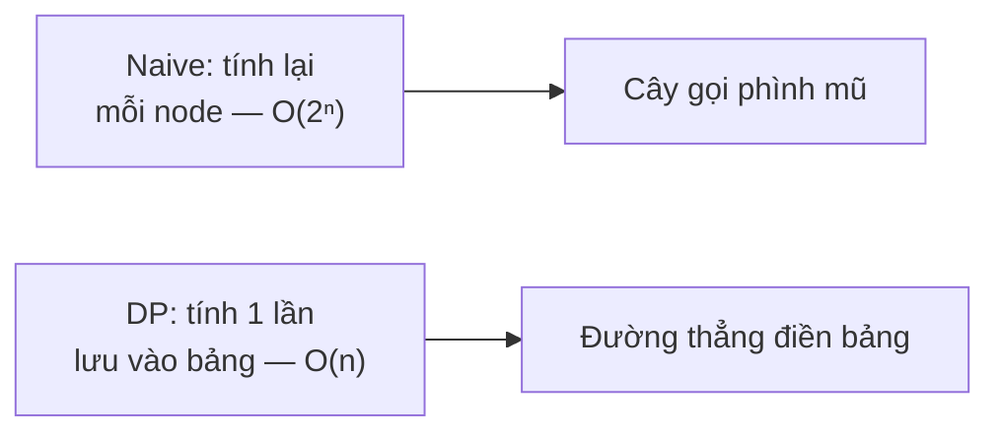

# Bài 10 — Quy Hoạch Động (Dynamic Programming)

> 🧮 **Nhánh 02 — Thuật Toán (HSG / Competitive Programming)**

---

## 🧠 Điều kiện tiên quyết

- [Bài 6 — Đệ Quy](../06-De-Quy/bai.md) (đặc biệt memoization + `lru_cache`)
- [Bài 7 — Quay Lui](../07-Quay-Lui/bai.md)
- [Bài 9 — Tham Lam](../09-Tham-Lam/bai.md) (biết khi tham lam sai → DP)
- [Bài 14 — List](../../01-Co-Ban/14-List/bai.md)

---

## 🎯 Mục tiêu

Sau bài học này, học viên sẽ:

* ✅ Hiểu DP: bài toán con gối nhau + cấu trúc con tối ưu → lưu kết quả, không tính lại.
* ✅ Phân biệt top-down (đệ quy + memo) và bottom-up (vòng lặp + bảng), chuyển đổi qua lại.
* ✅ Viết được công thức truy hồi cho 5 bài mẫu: Fibonacci, bậc thang, túi 0/1, LIS, LCS.
* ✅ Tối ưu bộ nhớ DP (lăn mảng) khi bảng quá lớn.
* ✅ Nhận diện đề DP ("tối ưu/đếm cách", "lựa chọn từng bước", tham lam sai).

---

## 📖 Mở đầu

Quy hoạch động là kỹ thuật **ăn điểm nhất** trong HSG: một khi nhận ra bài
toán có cấu trúc DP, đáp án gần như "rơi ra" từ công thức truy hồi.
Ngược lại, không nhận ra thì dù code giỏi đến đâu cũng TLE/WA.

Tin tốt: DP có công thức học thuộc — 5 bước chuẩn áp dụng cho mọi bài.
Bài này dạy công thức đó qua 5 bài mẫu từ dễ đến khó.

---

## 💡 Ý tưởng trực quan

* **Chia để trị (Bài 4)** chia bài toán thành bài con *rời nhau*; **DP** xử lý
  bài con *gối nhau* (chồng lấp) — khác nhau đúng một chữ, khác nhau một trời
  một vực về hiệu quả nếu xử lý sai.
* **Memo (nháp):** làm toán mà kết quả trung gian đã tính thì nhìn vào nháp,
  không tính lại. DP = "cuốn nháp có hệ thống".
* **Truy hồi:** đáp án bài lớn diễn đạt qua đáp án bài nhỏ hơn —
  "muốn biết hôm nay, hỏi hôm qua".



---

## 📚 Kiến thức

### 1. Năm bước chuẩn của mọi bài DP

Học thuộc khung này, áp cho mọi bài:

```
1. ĐỊNH NGHĨA: dp[i] (hoặc dp[i][j]) là gì — bằng tiếng Việt, một câu chính xác.
2. TRUY HỒI:  dp[lớn] tính từ dp[nhỏ] thế nào (công thức).
3. BASE:      dp[nhỏ nhất] bằng bao nhiêu (không cần tính).
4. THỨ TỰ:   tính từ nhỏ đến lớn (bottom-up) hoặc đệ quy + memo (top-down).
5. ĐÁP ÁN:   nằm ở ô nào của bảng.
```

> 90% bài DP sai là sai ở bước 1 (định nghĩa mơ hồ) — công thức truy hồi
> không thể đúng nếu không biết dp[i] nghĩa là gì.

### 2. Top-down vs bottom-up

| | Top-down (đệ quy + memo) | Bottom-up (vòng lặp + bảng) |
|---|---|---|
| Cách viết | Hàm đệ quy + `lru_cache` | Vòng lặp điền bảng |
| Tính gì | Chỉ bài con **cần thiết** | **Mọi** ô (kể cả không cần) |
| Rủi ro | Sâu đệ quy, chậm hơn chút | Phải nghĩ đúng thứ tự |
| Khi dùng | Trạng thái thưa, công thức phức tạp | Thi cử chuẩn, n lớn, cần tối ưu nhớ |

Hai cách cho cùng đáp án — thi HSG thường dùng bottom-up (nhanh, không lo
recursion limit), lúc nghĩ dùng top-down (tự nhiên hơn).

### 3. Bài mẫu 1 — Bậc thang (DP vỡ lòng)

> Lên cầu thang n bậc, mỗi bước đi 1 hoặc 2 bậc. Bao nhiêu cách?

1. **Định nghĩa:** `dp[i]` = số cách lên đến bậc i.
2. **Truy hồi:** muốn đến bậc i thì từ i−1 (bước 1) hoặc i−2 (bước 2) →
   `dp[i] = dp[i−1] + dp[i−2]`.
3. **Base:** `dp[0] = 1` (đứng yên 1 cách), `dp[1] = 1`.
4. **Thứ tự:** i = 2..n.
5. **Đáp án:** `dp[n]`.

```python
def dem_cach(n):
    if n <= 1:
        return 1
    truoc, hien = 1, 1   # dp[0], dp[1] — chỉ giữ 2 số (lăn mảng!)
    for _ in range(2, n + 1):
        truoc, hien = hien, truoc + hien
    return hien
```

> Đây chính là Fibonacci trá hình — và code chỉ giữ 2 biến thay vì cả mảng:
> **lăn mảng** (rolling array), mẫu tối ưu nhớ dùng hoài ở mục 7.

### 4. Bài mẫu 2 — Túi đồ 0/1 (tham lam sai → DP đúng, ôn Bài 9)

> n món (w[i], v[i]), túi chịu W. Lấy nguyên món, tổng giá trị lớn nhất?

1. **Định nghĩa:** `dp[i][w]` = giá trị lớn nhất dùng i món đầu với sức chứa w.
2. **Truy hồi:** với món i (1-based): không lấy → `dp[i−1][w]`; lấy (nếu vừa:
   w[i] ≤ w) → `dp[i−1][w−w[i]] + v[i]`; lấy max hai cách.
3. **Base:** `dp[0][w] = 0` (không món nào → giá trị 0).
4. **Thứ tự:** i tăng dần, w tăng dần.
5. **Đáp án:** `dp[n][W]`.

```python
def tui_01(w, v, W):
    n = len(w)
    dp = [0] * (W + 1)          # lăn mảng: chỉ giữ hàng trước
    for i in range(n):
        for c in range(W, w[i] - 1, -1):   # duyệt NGƯỢC để không dùng lại món
            if dp[c - w[i]] + v[i] > dp[c]:
                dp[c] = dp[c - w[i]] + v[i]
    return dp[W]
```

> **Chi tiết sống còn:** duyệt sức chứa **ngược** (W → w[i]). Duyệt xuôi thì
> `dp[c−w[i]]` có thể đã chứa món i (vừa cập nhật) → thành lấy món i nhiều lần
> (unbounded — bài khác!). Một chiều vòng lặp quyết định đúng/sai cả bài.

### 5. Bài mẫu 3 — Dãy con tăng dài nhất (LIS) O(n²)

> Tìm độ dài dãy con (không cần liên tiếp) tăng nghiêm ngặt dài nhất.

1. **Định nghĩa:** `dp[i]` = độ dài LIS **kết thúc tại** a[i] (a[i] được lấy).
2. **Truy hồi:** `dp[i] = 1 + max(dp[j])` với mọi j < i mà a[j] < a[i];
   không có j nào → 1.
3. **Base:** mọi `dp[i]` khởi đầu 1.
4. **Thứ tự:** i từ 0..n−1 (j < i đã tính xong).
5. **Đáp án:** `max(dp)` — vì LIS có thể kết thúc ở bất kỳ đâu!

```python
def lis(a):
    n = len(a)
    dp = [1] * n
    for i in range(n):
        for j in range(i):
            if a[j] < a[i] and dp[j] + 1 > dp[i]:
                dp[i] = dp[j] + 1
    return max(dp) if dp else 0
```

O(n²) — đủ với n ≤ 5.000. Bản O(n log n) dùng "đuôi nhỏ nhất + nhị phân"
(đáp án bài tập). Chữ "kết thúc tại" trong định nghĩa là chìa khóa —
định nghĩa `dp[i]` = "LIS trong i phần tử đầu" thì không viết được truy hồi!

### 6. Bài mẫu 4 — Xâu con chung dài nhất (LCS) — DP 2 chiều

> Hai xâu s (dài n), t (dài m). Tìm độ dài xâu con chung (không cần liên tiếp)
> dài nhất.

1. **Định nghĩa:** `dp[i][j]` = LCS của tiền tố s[:i] và t[:j].
2. **Truy hồi:** nếu s[i−1] == t[j−1] → `dp[i−1][j−1] + 1` (lấy cặp này);
   không thì `max(dp[i−1][j], dp[i][j−1])` (bỏ một đầu).
3. **Base:** hàng 0 / cột 0 = 0 (xâu rỗng).
4. **Thứ tự:** i, j tăng dần.
5. **Đáp án:** `dp[n][m]`.

```python
def lcs(s, t):
    n, m = len(s), len(t)
    truoc = [0] * (m + 1)      # lăn mảng: chỉ 2 hàng
    for i in range(1, n + 1):
        hien = [0] * (m + 1)
        for j in range(1, m + 1):
            if s[i - 1] == t[j - 1]:
                hien[j] = truoc[j - 1] + 1
            else:
                hien[j] = max(truoc[j], hien[j - 1])
        truoc = hien
    return truoc[m]
```

O(n·m) thời gian, O(m) nhớ (lăn mảng). n, m ≤ 5.000 → 25×10⁶ ô: Python vòng
lặp thuần ~10–20s → TLE! Thực tế n, m ≤ 1.000–2.000 cho Python, hoặc dùng PyPy
+ tối ưu. **Biết giới hạn công cụ là một phần của đáp án.**

### 7. Lăn mảng (tối ưu bộ nhớ) — công thức chung

Khi `dp[i]` chỉ cần k hàng trước → giữ k+1 hàng, dùng `i % (k+1)`:

* Fibonacci/bậc thang: cần 2 số → 2 biến (mục 3).
* Túi 0/1: cần hàng trước → 1 mảng + duyệt ngược (mục 4).
* LCS: cần hàng trước → 2 hàng (mục 6).

> Muốn **truy vết** (in ra đáp án cụ thể, không chỉ độ dài/giá trị) thì phải
> giữ cả bảng hoặc lưu "hướng đi" — đánh đổi nhớ lấy khả năng dựng đáp án.

---

## 💻 Ví dụ

### Ví dụ 1 — Dễ: đổi tiền ít tờ nhất (DP sửa sai tham lam — ôn Bài 9)

> Mệnh giá [1, 3, 4], S ≤ 10⁴. Ít tờ nhất để đổi đúng S?

1. `dp[x]` = ít tờ nhất để đổi x.
2. `dp[x] = 1 + min(dp[x−c])` với mọi mệnh giá c ≤ x.
3. `dp[0] = 0`.
4. x tăng dần. 5. `dp[S]`.

```python
import sys

def main():
    data = sys.stdin.read().strip().split()
    if not data:
        return
    s = int(data[0])
    menh_gia = [1, 3, 4]
    INF = 10 ** 9
    dp = [0] + [INF] * s
    for x in range(1, s + 1):
        tot = INF
        for c in menh_gia:
            if c <= x and dp[x - c] + 1 < tot:
                tot = dp[x - c] + 1
        dp[x] = tot
    print(dp[s] if dp[s] != INF else -1)

main()
```

S = 6: dp[6] = 1 + min(dp[5], dp[3], dp[2]) = 1 + dp[3] = 1 + 1 = **2**
(3+3) — DP sửa đúng cái tham lam sai ở Bài 9. ✔

### Ví dụ 2 — Thực tế: LIS + truy vết (in ra dãy, không chỉ độ dài)

```python
import sys

def main():
    data = sys.stdin.read().strip().split()
    if not data:
        return
    n = int(data[0])
    a = list(map(int, data[1:1 + n]))
    dp = [1] * n
    truoc = [-1] * n          # truoc[i] = j nối vào i trong LIS tốt nhất
    for i in range(n):
        for j in range(i):
            if a[j] < a[i] and dp[j] + 1 > dp[i]:
                dp[i] = dp[j] + 1
                truoc[i] = j
    ket = max(range(n), key=lambda i: dp[i])
    day = []
    while ket != -1:          # đi ngược vết
        day.append(a[ket])
        ket = truoc[ket]
    print(dp[max(range(n), key=lambda i: dp[i])])
    print(" ".join(map(str, reversed(day))))

main()
```

Mảng `truoc` lưu "đi từ đâu tới" — truy vết bằng cách đi ngược. Mẫu truy vết
dùng cho mọi bài DP cần dựng đáp án (đường đi, cách chọn...).

### Ví dụ 3 — Khó: dãy con đối xứng dài nhất (LPS — tổng hợp)

> Tìm độ dài xâu con (không cần liên tiếp) đối xứng dài nhất. n ≤ 10³.

1. `dp[l][r]` = LPS của đoạn s[l..r].
2. Nếu s[l] == s[r] → `dp[l+1][r−1] + 2` (lấy cả hai đầu);
   không thì `max(dp[l+1][r], dp[l][r−1])` (bỏ một đầu).
3. `dp[i][i] = 1` (1 ký tự), đoạn rỗng = 0.
4. **Thứ tự đặc biệt:** độ dài đoạn tăng dần (đoạn ngắn trước) — vì dp[l][r]
   cần đoạn NGẮN hơn (bên trong), không phải "hàng trước".
5. `dp[0][n−1]`.

```python
import sys

def main():
    s = sys.stdin.read().strip().split()
    s = s[0] if s else ""
    n = len(s)
    if n == 0:
        print(0)
        return
    dp = [[0] * n for _ in range(n)]
    for i in range(n):
        dp[i][i] = 1
    for dai in range(2, n + 1):          # độ dài đoạn tăng dần
        for l in range(n - dai + 1):
            r = l + dai - 1
            if s[l] == s[r]:
                dp[l][r] = 2 if dai == 2 else dp[l + 1][r - 1] + 2
            else:
                dp[l][r] = max(dp[l + 1][r], dp[l][r - 1])
    print(dp[0][n - 1])

main()
```

Chạy tay "abca": dp[0][3]: s[0]==s[3]=='a' → dp[1][2]+2; "bc" khác nhau →
max(dp[2][2], dp[1][1]) = 1 → tổng **3** ("aba" hoặc "aca"). ✔

---

## 📊 Minh họa

DP bậc thang n = 4 (mỗi bậc = tổng 2 bậc trước):

```
dp[0] = 1  (đứng yên)
dp[1] = 1  (1)
dp[2] = dp[1] + dp[0] = 2         (1+1, 2)
dp[3] = dp[2] + dp[1] = 3         (1+1+1, 1+2, 2+1)
dp[4] = dp[3] + dp[2] = 5  ✔
```

So sánh cây gọi fib naive vs DP (Bài 6 đã vẽ cây lặp lại):



---

## ⚠️ Những lỗi thường gặp

### Lỗi 1: Định nghĩa dp mơ hồ → truy hồi sai

* Dành 50% thời gian nghĩ bước 1. Viết định nghĩa thành câu, kiểm tra:
  "công thức có dùng đúng định nghĩa đó không?"

### Lỗi 2: Sai thứ tự tính (dùng ô chưa tính)

```python
# ❌ duyệt xuôi trong túi 0/1 → dùng lại món (thành unbounded)
for c in range(w[i], W + 1):
```

### Lỗi 3: Quên base / base sai

* `dp[0]` túi = 0, đổi tiền `dp[0] = 0`, LIS khởi 1 — mỗi bài base khác nhau,
  suy từ định nghĩa chứ không đoán.

### Lỗi 4: Đáp án không ở ô cuối (LIS: max cả mảng, không phải dp[n−1])

* Luôn hỏi bước 5: đáp án ở ô nào? Cuối mảng / max / ô [n][m]?

### Lỗi 5: DP O(n·m) quá lớn cho Python mà không nhận ra

* 5.000×5.000 = 25M vòng lặp Python → TLE/MLE. Tính trước, lăn mảng,
  hoặc nhận ra cần thuật toán khác (như LIS O(n log n)).

### Lỗi 6: Tham lam trá hình DP (và ngược lại)

* Kiểm tra: bài con có gối nhau không? Lựa chọn hiện tại có ảnh hưởng tương
  lai không? Có → DP; không → tham lam được.

---

## 🧪 Trường hợp đặc biệt

* **n = 0 / rỗng**: LIS rỗng → 0 (`max(dp) if dp else 0`); LCS rỗng → 0;
  bậc thang n = 0 → 1 (quy ước "đứng yên 1 cách" — phải khớp truy hồi).
* **Không đổi được** (đổi tiền): `dp[S] = INF` → in −1 (quy ước đề).
* **W = 0** (túi): đáp án 0 — vòng lặp trong không chạy.
* **Số âm trong LIS**: so sánh `<` vẫn đúng — DP không đòi số dương
  (khác cửa sổ trượt!).
* **Đệ quy + lru_cache sâu**: C(n,k) với n = 10⁵ → sâu 10⁵ → crash;
  DP tổ hợp lớn phải bottom-up hoặc công thức.

---

## 🚀 Ứng dụng thực tế

* So sánh gen (LCS/align), gợi ý sửa lỗi chính tả (edit distance — bài tập),
  phân đoạn ảnh/văn bản, tối ưu tồn kho, lập lịch có ràng buộc.

---

## 🧩 Bài tập

### 🟢 Cơ bản (1–3)

**Bài 1 — Bậc thang biến thể.** Mỗi bước đi 1, 2 hoặc 3 bậc. Viết truy hồi +
code O(n). Tính dp[4] tay (đáp án: 7 — 1111, 112, 121, 211, 22, 13, 31).

**Bài 2 — Top-down vs bottom-up.** Viết `fib` cả hai cách (lru_cache và vòng
lặp lăn mảng). Đo thời gian n = 10.000, giải thích chênh lệch.

**Bài 3 — Dãy con liên tiếp tổng lớn nhất (ôn Bài 1).** Viết lại bằng ngôn ngữ
DP: định nghĩa dp[i], truy hồi, base. (Đáp án: dp[i] = tổng lớn nhất của đoạn
kết thúc tại i; dp[i] = max(a[i], dp[i−1] + a[i]).)

### 🟡 Hiểu sâu (4–6)

**Bài 4 — Edit distance.** Biến xâu s thành t bằng chèn/xóa/thay (mỗi phép tốn
1). Viết truy hồi dp[i][j] + code lăn mảng. Test "kitten" → "sitting" (đáp án 3).

**Bài 5 — Túi unbounded.** Mỗi món lấy **nhiều lần** tùy thích. Sửa code túi 0/1
thành unbounded (đổi chiều vòng lặp!) và giải thích vì sao một chiều vòng lặp
đổi cả bài toán.

**Bài 6 — LIS O(n log n).** Duy trì mảng `duoi` (đuôi nhỏ nhất của LIS độ dài
k+1); mỗi a[i] nhị phân tìm vị trí thay thế. Cài đặt + test. Giải thích vì sao
`duoi` luôn tăng (bất biến cốt lõi).

### 🔴 Vận dụng (7–8)

**Bài 7 — Xâu con đối xứng (ôn ví dụ 3).** Cài + test với "character" (LPS = 5:
"carac"). Sau đó truy vết in ra xâu đối xứng (dùng bảng dp đầy đủ, không lăn).

**Bài 8 — Chia kẹo công bằng (partition).** n ≤ 100, a[i] ≤ 10³. Hỏi có chia
được 2 nhóm bằng nhau không? *Gợi ý: DP túi — dp[s] = có tạo được tổng s?
dp[s] |= dp[s − a[i]] (duyệt ngược!); đáp án dp[tong//2] khi tổng chẵn.
O(n·tổng) — "giả đa thức", đủ với tổng ≤ 10⁵.*

---

## ✅ Đáp án

> 💡 **Hãy tự làm bài tập trước** rồi mới mở đáp án.

<details>
<summary>✅ Bài 1: Bậc thang biến thể</summary>

`dp[i] = dp[i−1] + dp[i−2] + dp[i−3]`; base dp[0] = 1, dp[1] = 1, dp[2] = 2.
dp[3] = 2+1+1 = 4; dp[4] = 4+2+1 = **7**. ✔

```python
def dem_cach(n):
    dp = [0] * (n + 1)
    dp[0] = 1
    for i in range(1, n + 1):
        dp[i] = dp[i - 1] + (dp[i - 2] if i >= 2 else 0) + (dp[i - 3] if i >= 3 else 0)
    return dp[n]
```

</details>

<details>
<summary>✅ Bài 2: Top-down vs bottom-up</summary>

```python
import time
from functools import lru_cache

@lru_cache(maxsize=None)
def fib_top(n):
    return n if n <= 1 else fib_top(n - 1) + fib_top(n - 2)

def fib_bot(n):
    a, b = 0, 1
    for _ in range(n):
        a, b = b, a + b
    return a

for f in (fib_top, fib_bot):
    t0 = time.perf_counter(); f(10000); t1 = time.perf_counter()
    print(t1 - t0)
```

Bottom-up nhanh hơn ~5–20 lần (không tốn gọi hàm + dict lookup).
Top-down sâu 10.000 → **vượt recursion limit mặc định** (phải nới + tốn RAM
frame) — lý do thi cử chuộng bottom-up.

</details>

<details>
<summary>✅ Bài 3: Dãy con liên tiếp tổng lớn nhất</summary>

`dp[i]` = tổng lớn nhất của đoạn **kết thúc tại** i.
Truy hồi: `dp[i] = max(a[i], dp[i−1] + a[i])` (bắt đầu mới hoặc nối dài).
Base `dp[0] = a[0]`; đáp án `max(dp)`. Đúng là thuật toán Kadane ở Bài 1 —
giờ bạn thấy nó là DP.

</details>

<details>
<summary>✅ Bài 4: Edit distance</summary>

`dp[i][j]` = ít phép nhất biến s[:i] thành t[:j].
s[i−1] == t[j−1] → `dp[i−1][j−1]` (khỏi làm gì);
không thì 1 + min(xóa `dp[i−1][j]`, chèn `dp[i][j−1]`, thay `dp[i−1][j−1]`).

```python
def edit(s, t):
    n, m = len(s), len(t)
    truoc = list(range(m + 1))
    for i in range(1, n + 1):
        hien = [i] + [0] * m
        for j in range(1, m + 1):
            if s[i - 1] == t[j - 1]:
                hien[j] = truoc[j - 1]
            else:
                hien[j] = 1 + min(truoc[j], hien[j - 1], truoc[j - 1])
        truoc = hien
    return truoc[m]

assert edit("kitten", "sitting") == 3
```

(kitten→sitten (thay k→s), sitten→sittin (thay e→i), sittin→sitting (chèn g).)

</details>

<details>
<summary>✅ Bài 5: Túi unbounded</summary>

```python
def tui_unbounded(w, v, W):
    dp = [0] * (W + 1)
    for i in range(len(w)):
        for c in range(w[i], W + 1):   # XUÔI (ngược với 0/1!)
            if dp[c - w[i]] + v[i] > dp[c]:
                dp[c] = dp[c - w[i]] + v[i]
    return dp[W]
```

Vì sao: duyệt xuôi, `dp[c−w[i]]` có thể đã chứa món i (cập nhật cùng vòng i)
→ cho phép lấy lại → unbounded. Duyệt ngược thì `dp[c−w[i]]` còn là hàng cũ
(chưa có món i) → 0/1. Một chiều lặp, hai bài toán.

</details>

<details>
<summary>✅ Bài 6: LIS O(n log n)</summary>

```python
from bisect import bisect_left

def lis_nhanh(a):
    duoi = []   # duoi[k] = đuôi NHỎ NHẤT của mọi LIS độ dài k+1
    for x in a:
        i = bisect_left(duoi, x)   # vị trí đầu tiên ≥ x
        if i == len(duoi):
            duoi.append(x)
        else:
            duoi[i] = x            # thay đuôi bằng x nhỏ hơn → tốt hơn
    return len(duoi)
```

Bất biến: `duoi` tăng nghiêm ngặt (chứng minh: thay thế giữ thứ tự + append
cuối luôn lớn nhất) → nhị phân được. `len(duoi)` = độ dài LIS (nhưng `duoi`
KHÔNG phải một LIS thật — muốn dãy thật phải truy vết bản O(n²)).

</details>

<details>
<summary>✅ Bài 7: Xâu con đối xứng</summary>

Code ví dụ 3 + truy vết:

```python
def lps_trace(s):
    n = len(s)
    dp = [[0] * n for _ in range(n)]
    for i in range(n):
        dp[i][i] = 1
    for dai in range(2, n + 1):
        for l in range(n - dai + 1):
            r = l + dai - 1
            if s[l] == s[r]:
                dp[l][r] = 2 if dai == 2 else dp[l + 1][r - 1] + 2
            else:
                dp[l][r] = max(dp[l + 1][r], dp[l][r - 1])
    # truy vết
    l, r, trai, phai = 0, n - 1, [], []
    while l <= r:
        if l == r:
            trai.append(s[l]); break
        if s[l] == s[r]:
            trai.append(s[l]); phai.append(s[r]); l += 1; r -= 1
        elif dp[l + 1][r] >= dp[l][r - 1]:
            l += 1
        else:
            r -= 1
    return "".join(trai + phai[::-1])
```

"character" → LPS dài 5 ("carac"). ✔ Muốn truy vết phải giữ **cả bảng**
(không lăn) — đánh đổi nhớ lấy đáp án cụ thể.

</details>

<details>
<summary>✅ Bài 8: Chia kẹo công bằng</summary>

```python
import sys

def main():
    data = sys.stdin.read().strip().split()
    if not data:
        return
    n = int(data[0])
    a = list(map(int, data[1:1 + n]))
    tong = sum(a)
    if tong % 2 == 1:
        print("KHONG")
        return
    muc = tong // 2
    dp = [False] * (muc + 1)
    dp[0] = True
    for x in a:
        for s in range(muc, x - 1, -1):   # ngược → mỗi số dùng 1 lần
            if dp[s - x]:
                dp[s] = True
    print("CO" if dp[muc] else "KHONG")

main()
```

`dp[s]` = "tạo được tổng s từ các số đã xét". Mỗi số cập nhật ngược → dùng 1
lần (đúng túi 0/1). Tổng chẵn và tạo được nửa tổng ⟺ chia đôi được. O(n·tổng).

</details>

---

## 🧠 Thử thách

**Thử thách HSG:** Dãy n ≤ 10⁵, tìm số lượng LIS (đếm có bao nhiêu dãy con
tăng dài nhất, không liệt kê). *Gợi ý: DP đôi — len[i] (độ dài) + cnt[i]
(số cách); cnt[i] = tổng cnt[j] với j < i, a[j] < a[i], len[j] + 1 == len[i];
cẩn thận đếm trùng khi có số bằng nhau (chỉ `<`, không `<=`).*

---

## 📝 Tóm tắt

| Khái niệm | Nội dung |
|---|---|
| 📋 5 bước | Định nghĩa → truy hồi → base → thứ tự → ô đáp án |
| ⬇️ Top-down | Đệ quy + memo; tự nhiên, lo sâu đệ quy |
| ⬆️ Bottom-up | Vòng lặp + bảng; chuẩn thi cử |
| 🎒 Mẫu phải thuộc | Bậc thang, đổi tiền, túi 0/1, LIS, LCS |
| 🌀 Lăn mảng | Giữ k hàng cần thiết; ngược/xuôi quyết định đúng sai |

---

## ➡️ Điều hướng

**Vị trí:** `02-Thuat-Toan/10-Quy-Hoach-Dong/bai.md`

**Bài tiếp theo:** [Bài 11 — Toán Học & Số Học](../11-Toan-Hoc-So-Hoc/bai.md)
