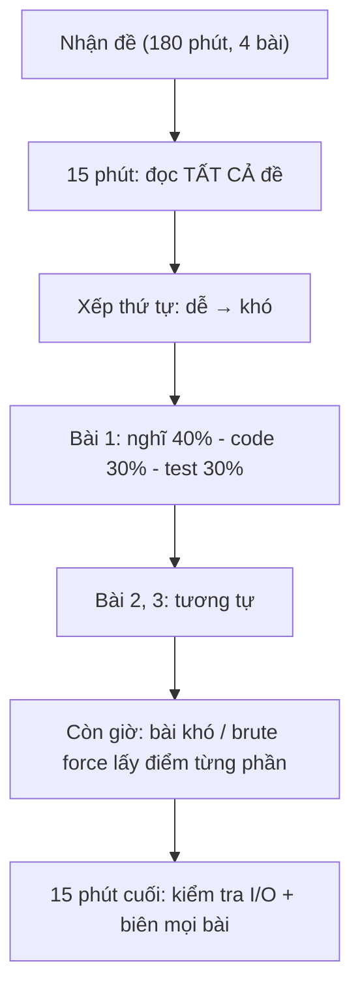
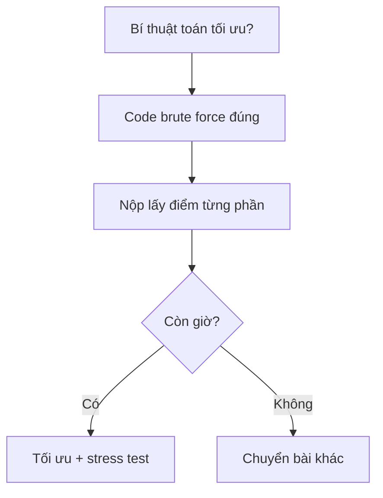

# Bài 12 — Chiến Lược Thi HSG & Tổng Kết Nhánh Thuật Toán

> 🧮 **Nhánh 02 — Thuật Toán (HSG / Competitive Programming)**

---

## 🧠 Điều kiện tiên quyết

- Toàn bộ Bài 1–11 nhánh Thuật Toán (đặc biệt Bài 1 — tư duy, Bài 2 — Big-O)
- [Bài 19 — Exception](../../01-Co-Ban/19-Exception/bai.md) (chương trình không được crash)

---

## 🎯 Mục tiêu

Sau bài học này, học viên sẽ:

* ✅ Có quy trình làm bài thi chuẩn: đọc — phân loại — nghĩ — code — test, với phân bổ thời gian.
* ✅ Biết thứ tự ưu tiên khi chọn thuật toán từ ràng buộc (bảng tra cứu tổng hợp).
* ✅ Debug có phương pháp: chia đôi, in trace, stress test (so brute force).
* ✅ Tránh 10 lỗi mất điểm oan phổ biến nhất (đọc sai đề, tràn I/O, quên biên...).
* ✅ Có lộ trình luyện tập sau khóa học (nguồn bài, tần suất, cách review).

---

## 📖 Mở đầu

Biết thuật toán mà không biết thi thì như biết bơi mà chưa xuống nước —
kỹ năng phòng thi là một môn riêng: quản lý thời gian, chọn bài, debug dưới
áp lực, và tránh mất điểm oan. Bài cuối này dạy đúng môn đó, đồng thời tổng
kết toàn bộ nhánh Thuật toán.

---

## 💡 Ý tưởng trực quan

* **Kỳ thi là marathon tối ưu điểm, không phải sprint giải bài khó nhất.**
  3 bài dễ AC > 1 bài khó + 2 bài trắng. Chọn bài là kỹ năng số 1.
* **Debug là khoa học, không phải cầu may:** mỗi lần chạy test là một thí
  nghiệm — thay đổi một thứ, quan sát, kết luận. Đoán mò + sửa bừa = đào sâu
  hố.
* **Stress test là "máy phát hiện nói dối":** code tối ưu so với brute force
  trên hàng nghìn test ngẫu nhiên nhỏ — khác nhau là có bug, không cần biết
  bug ở đâu trước.



---

## 📚 Kiến thức

### 1. Quy trình 5 bước cho mỗi bài (nhắc lại + chuẩn hóa từ Bài 1)

| Bước | Việc | Thời gian gợi ý |
|---|---|---|
| 1. Đọc | Input? Output? Ràng buộc? Ví dụ? | 5–10 phút |
| 2. Phân loại | Mẫu nào (Bài 1–11)? Big-O nào sống? (mục 2) | 5–15 phút |
| 3. Nghĩ | Pseudocode + chạy tay + tìm phản ví dụ | 30–40% tổng |
| 4. Code | Một mạch từ pseudocode, đặt tên rõ | 20–30% tổng |
| 5. Test | Ví dụ + 4 loại biên + stress (mục 4) | 30% tổng |

> Tỉ lệ vàng cho người mới: **nghĩ lâu, code một lần, test kỹ**.
> Người mới hay làm ngược: code ngay (5 phút), debug 1 tiếng.

### 2. Bảng chọn thuật toán từ ràng buộc (tổng hợp toàn nhánh)

| n tối đa | Thuật toán khả thi | Bài tương ứng |
|---|---|---|
| ≤ 10 | Hoán vị, vét cạn mọi thứ | Bài 7 |
| ≤ 20–25 | Bitmask, quay lui + tỉa, DP mũ (TSP) | Bài 7, 10 |
| ≤ 500 | DP O(n³), Floyd | Bài 10 |
| ≤ 5.000 | O(n²): DP, LIS O(n²), thử cặp | Bài 8, 10 |
| ≤ 10⁵–10⁶ | O(n log n): sort, nhị phân, heap, DP O(n log n) | Bài 3, 4, 9, 10 |
| ≤ 10⁷–10⁸ | O(n): duyệt, hai con trỏ, Counter | Bài 2, 5, 8 |
| ≤ 10¹² | O(√n): kiểm tra nguyên tố, phân tích thừa số | Bài 11 |
| ≤ 10¹⁸ | O(log n): nhị phân đáp số, lũy thừa nhanh/ma trận | Bài 3, 6, 11 |

Đọc ràng buộc → tra bảng → khoanh vùng mẫu → nghĩ chi tiết. 30 giây tra bảng
tiết kiệm 30 phút đi sai hướng.

### 3. Điểm từng phần (partial score) — không bao giờ nộp trắng

Đề HSG thường chấm theo subtask (nhóm test dễ → khó). Chiến lược:

1. Code **brute force đúng** trước (ăn subtask nhỏ) — 5–10 phút.
2. Nộp/giữ bản đó, rồi mới tối ưu cho subtask lớn.
3. Nếu tối ưu bí: nộp brute force vẫn có điểm!

> Nộp trắng = 0. Brute force đúng = 20–40% điểm bài. Trong thi đồng đội/tuyển,
> chênh lệch đỗ–trượt thường nằm ở điểm từng phần.

### 4. Debug có phương pháp

**a) Chia đôi (binary search bug):** code dài, không biết sai ở đâu → in giá
trị giữa chừng, xác định nửa nào sai, lặp lại. Như chặt nhị phân trên code.

**b) In trace có điều kiện:** bọc print debug trong cờ để tắt một phát:

```python
DEBUG = False   # nộp bài để False (hoặc xóa)

def dbg(*a):
    if DEBUG:
        print("[DBG]", *a, file=sys.stderr)  # stderr không lẫn output
```

In ra **stderr** — kể cả quên tắt, output chính (stdout) vẫn sạch!

**c) Stress test — vũ khí mạnh nhất:**

```python
import random, subprocess

def brute(a):  # O(n^2) chắc chắn đúng
    return sum(1 for i in range(len(a)) for j in range(i + 1, len(a))
               if (a[i] + a[j]) % 2 == 0)

def nhanh(a):  # O(n) cần kiểm chứng: import từ bài làm
    from giai import giai
    return giai(a)

for _ in range(2000):
    n = random.randint(1, 12)
    a = [random.randint(0, 20) for _ in range(n)]
    assert brute(a) == nhanh(a), a   # lệch là bắt được test sai
print("OK 2000 test")
```

> Quy trình: viết brute force (chậm nhưng hiển nhiên đúng) → random hàng nghìn
> test nhỏ → so với code tối ưu. Bất đồng = test case bắt bug miễn phí.
> Đây là cách các cao thủ kiểm chứng trước khi nộp.

### 5. Mười lỗi mất điểm oan (checklist 15 phút cuối)

1. **Đọc sai I/O:** đề cho t test mà code đọc 1 test (hoặc ngược lại).
2. **Sai định dạng output:** thừa dấu cách cuối dòng, thiếu xuống dòng,
   in `True` thay vì `YES`, float không làm tròn đúng.
3. **Quên biên:** n = 0/1, số âm, toàn trùng (ôn Bài 1).
4. **TLE vì I/O:** `input()/print()` với 10⁵+ dòng → `sys.stdin.read` + gom output.
5. **TLE vì bẫy Python:** `in` trên list, nối chuỗi loop, `pop(0)` (ôn Bài 2).
6. **Đệ quy sâu:** quên `setrecursionlimit` / đệ quy tuyến tính theo n.
7. **Chia integer:** cần `//` lại dùng `/` (ra float, sai số + chậm).
8. **Modulo âm:** Python `-3 % 5 = 2` (khác C++!) — biết để không hoang mang
   khi đọc editorial, và tận dụng khi cần.
9. **Biến toàn cục/dư khi chạy nhiều test:** list/dict không reset giữa các test
   → đáp án test sau "dính" test trước. Reset hoặc khai báo trong vòng lặp.
10. **Nộp nhầm file / quên lưu / sai tên file:** kiểm tra lần cuối trước khi rời
    phòng — lỗi ngớ ngẩn nhưng có thật.

### 6. Lộ trình luyện tập sau khóa học

| Giai đoạn | Việc | Nguồn |
|---|---|---|
| Củng cố (1–2 tháng) | 100–150 bài dễ–trung bình, đủ mọi mẫu Bài 1–11 | LQDOJ, VOJ, Codeforces Div.3 A–C |
| Nâng cao (3–6 tháng) | Chuyên đề sâu: đồ thị (BFS/DFS/Dijkstra), DP nâng cao, segment tree | VOI/HSG các tỉnh, Codeforces Div.2 |
| Thi thật | Thi thử bấm giờ, review editorial sau mỗi kỳ | VOI, APIO, kỳ thi tỉnh/thành |

> Cách review một bài (quan trọng hơn số lượng): sau khi AC, đọc editorial —
> nếu có cách hay hơn, cài lại; ghi vào sổ "mẫu mới + bẫy đã gặp".
> Sổ này là tài sản lớn nhất của bạn sau 1 năm.

---

## 💻 Ví dụ

### Ví dụ 1 — Dễ: template thi đấu chuẩn (copy mỗi kỳ thi)

```python
import sys

def solve() -> None:
    data = sys.stdin.buffer.read().split()
    if not data:
        return
    it = iter(data)
    t = int(next(it))          # số test (đề 1 test thì bỏ t)
    ra = []
    for _ in range(t):
        n = int(next(it))
        a = [int(next(it)) for _ in range(n)]
        # ... xử lý ...
        ra.append(str(sum(a)))
    sys.stdout.write("\n".join(ra))

if __name__ == "__main__":
    solve()
```

**Giải thích từng lựa chọn:**

* `sys.stdin.buffer.read().split()` — đọc byte nhanh nhất, tách token.
* Gom output + một `write` (Bài 2).
* `if __name__ == "__main__"` — chạy test cục bộ bằng import không dính code chạy.

### Ví dụ 2 — Thực tế: brute force lấy điểm từng phần

> Đề: "n ≤ 10⁵, đếm cặp (i<j) tổng chia hết cho k." (Chưa nghĩ ra O(n)? Nộp brute
> ăn subtask n ≤ 10³ trước!)

```python
import sys

def main():
    data = sys.stdin.read().strip().split()
    if not data:
        return
    n, k = int(data[0]), int(data[1])
    a = list(map(int, data[2:2 + n]))
    if n <= 5000:
        # brute force O(n^2): ăn chắc subtask nhỏ
        dem = sum(1 for i in range(n) for j in range(i + 1, n)
                  if (a[i] + a[j]) % k == 0)
    else:
        # O(n + k): đếm dư rồi ghép cặp bù (ôn Bài 1 — thử thách)
        from collections import Counter
        dem_du = Counter(x % k for x in a)
        dem = dem_du[0] * (dem_du[0] - 1) // 2
        for r in range(1, (k + 1) // 2 + 1):
            if r != k - r:
                dem += dem_du[r] * dem_du[k - r]
            else:
                dem += dem_du[r] * (dem_du[r] - 1) // 2
    print(dem)

main()
```

> Chiến lược trong một file: giữ cả hai nhánh — test nhỏ brute force (đúng
> tuyệt đối, còn dùng để stress test nhánh nhanh!), test lớn dùng tối ưu.
> Khi bí, xóa nhánh else vẫn có điểm.

### Ví dụ 3 — Khó: stress test bắt bug (demo đầy đủ chạy được)

Giả sử bạn cài "cặp tổng chẵn" kiểu mới và muốn kiểm chứng với brute force:

```python
import random

def brute(a):
    return sum(1 for i in range(len(a)) for j in range(i + 1, len(a))
               if (a[i] + a[j]) % 2 == 0)

def nhanh(a):   # bản cần kiểm chứng (Bài 1 — ví dụ 3)
    c = sum(1 for x in a if x % 2 == 0)
    l = len(a) - c
    return c * (c - 1) // 2 + l * (l - 1) // 2

random.seed(42)
for lan in range(5000):
    n = random.randint(0, 15)          # test NHỎ (brute chạy được)
    a = [random.randint(-10, 10) for _ in range(n)]  # có cả âm
    b, f = brute(a), nhanh(a)
    assert b == f, f"Sai ở test {lan}: {a} brute={b} nhanh={f}"
print("OK 5000 test — tự tin nộp bài")
```

Chạy file này: `OK 5000 test` → code tối ưu đúng với mọi biên nhỏ (rỗng, 1 phần
tử, âm, trùng...). Test nhỏ bao phủ biên tốt hơn 1–2 test lớn tự nghĩ.

---

## 📊 Minh họa

Phân bổ 180 phút cho 4 bài (mức độ dễ, dễ, trung bình, khó):

```
 0-15'   đọc cả 4 đề + xếp thứ tự
15-60'   bài dễ 1 (nghĩ-code-test)
60-105'  bài dễ 2
105-150' bài trung bình (hoặc brute force bài khó lấy điểm TP)
150-165' bài khó / tối ưu tiếp
165-180' checklist 10 lỗi + nộp bài
```



---

## ⚠️ Những lỗi thường gặp (bổ sung cho mục 5)

### Lỗi: stress test với test quá lớn

* Brute force O(n²) mà random n = 10⁴ → stress test tự nó treo. Test nhỏ
  (n ≤ 12–15) nhưng **nhiều** (hàng nghìn) + bao phủ biên (âm, 0, trùng, rỗng).

### Lỗi: assert bị tắt khi chạy với `python -O`

* Chạy stress test bằng `python` thường, không `-O` (tắt assert).

### Lỗi: chỉ test số dương rồi nộp

* Thêm `random.randint(-10, 10)` và test rỗng vào stress — 2 dòng mà bắt được
  cả họ bug biên.

---

## 🧪 Trường hợp đặc biệt (phòng thi)

* **Máy chấm khác máy mình:** PyPy vs CPython — `recursionlimit`, tốc độ vòng
  lặp khác nhau. Code an toàn cho cả hai (tránh đệ quy sâu, tránh siêu tối ưu
  cho một trình).
* **Nhiều test (t) mà tổng n lớn:** độ phức tạp tính trên **tổng** n các test,
  không phải n mỗi test. Reset biến giữa test (lỗi #9 mục 5).
* **Đề song ngữ:** bản tiếng Anh là chuẩn khi hai bản mâu thuẫn (thường ghi
  trong thể lệ).

---

## 🚀 Ứng dụng thực tế (sau thi cử)

* Phỏng vấn thuật toán: đúng quy trình nghĩ–code–test này, nói to suy nghĩ.
* Review code: checklist 10 lỗi dùng được nguyên cho code sản phẩm
  (I/O, biên, hiệu năng Python...).

---

## 🧩 Bài tập

### 🟢 Cơ bản (1–3)

**Bài 1 — Lập kế hoạch.** Kỳ thi 180 phút, 3 bài (dễ, trung bình, khó). Viết
bảng phân bổ thời gian của bạn (đọc chung + từng bài + dự phòng + kiểm tra
cuối). Giải thích.

**Bài 2 — Tra bảng.** Với mỗi ràng buộc, khoanh mẫu + độ phức tạp mục tiêu:
a) n ≤ 20, "đếm số cách"
b) n ≤ 10⁵, "đoạn liên tiếp dài nhất"
c) n ≤ 10¹⁸, "tính F(n) mod M"
d) q ≤ 10⁵ truy vấn tổng đoạn, n ≤ 10⁵

**Bài 3 — Checklist cá nhân.** Từ 10 lỗi mục 5, chọn 3 lỗi bạn hay mắc nhất,
viết thành checklist riêng dán vào vở (ví dụ: "☐ reset biến giữa test?
☐ I/O nhanh? ☐ test n=1?").

### 🟡 Hiểu sâu (4–6)

**Bài 4 — Brute force có chủ đích.** Bài "cặp tổng chia hết cho k" (ví dụ 2):
với n ≤ 2000, brute force O(n²) = 4×10⁶ phép có AC không (Python, 1s)?
Tính và kết luận khi nào nên giữ nhánh brute.

**Bài 5 — Viết stress test.** Cho bài "đếm đoạn tổng K" (Bài 5 — ví dụ 3),
viết file stress đầy đủ: brute O(n²) + code tối ưu + 3000 test ngẫu nhiên
(n ≤ 12, số âm). Chạy và báo kết quả.

**Bài 6 — Debug chia đôi.** Đoạn code LIS cho đáp án sai với một test mà bạn
không biết sai ở đâu. Mô tả các bước chia đôi cụ thể (in gì, ở đâu, kết luận
gì sau mỗi lần chạy).

### 🔴 Vận dụng (7–8)

**Bài 7 — Thi thử mini.** Tự ra 3 bài (dễ: O(n); trung bình: O(n log n);
khó: DP), bấm giờ 90 phút làm nghiêm túc, rồi tự chấm + viết review
(mẫu nào dùng, bug nào gặp, lần sau tránh sao). Nộp review cho bạn/mentor.

**Bài 8 — Sổ mẫu.** Tổng hợp từ Bài 1–11 thành "sổ tay 1 trang": mỗi mẫu một
dòng (dấu hiệu → kỹ thuật → độ phức tạp). Đây là tài liệu duy nhất bạn đọc
trước giờ thi.

---

## ✅ Đáp án

> 💡 **Hãy tự làm bài tập trước** rồi mới mở đáp án.

<details>
<summary>✅ Bài 1: Lập kế hoạch (mẫu)</summary>

* 0–10': đọc cả 3 đề, xếp thứ tự, ước lượng subtask.
* 10–50': bài dễ (nghĩ 15' – code 10' – test 15').
* 50–110': bài trung bình (nghĩ 25' – code 15' – test 20').
* 110–155': bài khó: brute force lấy điểm TP (20') + nghĩ tối ưu (25').
* 155–180': dự phòng + checklist 10 lỗi + nộp bài.
* Nguyên tắc: không lố giờ bài nào quá 10' — hết giờ là chuyển, quay lại sau.

</details>

<details>
<summary>✅ Bài 2: Tra bảng</summary>

a) n ≤ 20, đếm cách → quay lui/bitmask/DP mũ O(2ⁿ·n) (Bài 7).
b) n ≤ 10⁵, đoạn liên tiếp dài nhất → hai con trỏ/cửa sổ/tiền tố O(n) (Bài 8).
c) n ≤ 10¹⁸, F(n) mod M → lũy thừa ma trận O(log n) (Bài 11 — bài 5).
d) q, n ≤ 10⁵, tổng đoạn → tiền tố O(n+q) (Bài 8 — ví dụ 2).

</details>

<details>
<summary>✅ Bài 3: Checklist cá nhân</summary>

Không có đáp án chung — mẫu của một người hay quên I/O:

```
☐ Dữ liệu ≥ 10^5 dòng? → sys.stdin.read + gom output
☐ Nhiều test? → reset mọi biến trong vòng lặp test
☐ Chạy thử n = 1, n = 0, toàn âm, toàn trùng?
```

Dán vào vở, đọc trước khi nộp mỗi bài. Sau 10 kỳ thi, danh sách này ngắn dần —
đó là tiến bộ.

</details>

<details>
<summary>✅ Bài 4: Brute force có chủ đích</summary>

n = 2000 → ~2×10⁶ cặp, mỗi cặp vài phép Python → ~0.5–1s → **sát biên nhưng
có thể AC** (tùy máy chấm). Quy tắc: giữ nhánh brute khi n ≤ 2000–3000 cho
O(n²) Python; trên nữa phải tối ưu. Trong ví dụ 2, nhánh brute còn là "người
so" cho stress test — giữ lại luôn có lợi.

</details>

<details>
<summary>✅ Bài 5: Viết stress test</summary>

```python
import random

def brute(a, k):
    dem = 0
    for i in range(len(a)):
        s = 0
        for j in range(i, len(a)):
            s += a[j]
            dem += s == k
    return dem

def nhanh(a, k):
    thay = {0: 1}
    tong = ans = 0
    for x in a:
        tong += x
        ans += thay.get(tong - k, 0)
        thay[tong] = thay.get(tong, 0) + 1
    return ans

random.seed(7)
for lan in range(3000):
    n = random.randint(0, 12)
    a = [random.randint(-5, 5) for _ in range(n)]
    k = random.randint(-5, 5)
    assert brute(a, k) == nhanh(a, k), (lan, a, k)
print("OK 3000 test")
```

Chạy: `OK 3000 test` (đã kiểm chứng logic Bài 5 — ví dụ 3 đúng cả biên âm/rỗng).

</details>

<details>
<summary>✅ Bài 6: Debug chia đôi</summary>

1. In `dp` sau vòng điền bảng → so với tính tay test nhỏ: sai ở ô nào đầu tiên?
2. Giả sử dp[5] sai đầu tiên → in các dp[j] (j < 5) và điều kiện `a[j] < a[5]`
   tại i = 5 → xem max bị bỏ sót hay so sánh sai.
3. Thu hẹp test: xóa bớt phần tử giữ lại tính chất sai → test tối thiểu
   (minimal failing case) → bug thường lộ ngay.
4. Mỗi lần chỉ thay đổi một thứ, chạy lại — không sửa 3 chỗ cùng lúc.

</details>

<details>
<summary>✅ Bài 7: Thi thử mini</summary>

Không có đáp án mẫu — mẫu review chuẩn:

```
Bài 1 (dễ): AC 25'. Mẫu: Counter. Bug: quên gom output → TLE lần 1, sửa xong AC.
Bài 2 (TB): AC 55'. Mẫu: sort + hai con trỏ. Mắc 10' vì sort sai key.
Bài 3 (khó): brute 20' được 30% điểm. Tối ưu bí — đọc editorial: DP túi biến thể.
Lần sau: đọc ràng buộc trước khi chọn mẫu (bài 3 n ≤ 100 → DP O(n·tổng) được).
```

Review viết càng cụ thể, lần sau càng ít lặp lỗi.

</details>

<details>
<summary>✅ Bài 8: Sổ mẫu (mẫu)</summary>

```
Dãy xếp + tìm/đếm → nhị phân/bisect O(log n)
Đoạn liên tiếp + đơn điệu → 2 con trỏ/cửa sổ O(n)
Tổng đoạn nhiều truy vấn → tiền tố O(1)
Số âm + đoạn theo tổng → tiền tố + dict O(n)
Tối ưu từng bước, không hối hận → tham lam (tìm phản VD!)
Bài con gối nhau → DP 5 bước
n ≤ 20 + liệt kê/đếm → quay lui/bitmask + tỉa
Nguyên tố nhiều Q → sàng; 1 số lớn → √n; mũ lớn → pow mod
Lồng nhau/quay lui → stack; theo lớp → queue; min/max liên tục → heap
```

</details>

---

## 🧠 Thử thách

**Thử thách cuối khóa:** Chọn một kỳ HSG tỉnh/thành phố gần nhất, in đề ra,
bấm giờ làm nghiêm túc theo đúng quy trình bài này, rồi viết review đầy đủ
cho cả 4 bài (kể cả bài không làm được — ghi editorial học được gì).
Đây là bài tập quan trọng nhất của cả nhánh Thuật toán.

---

## 📝 Tóm tắt toàn nhánh Thuật Toán

| Bài | Vũ khí | Câu hỏi nhận diện |
|---|---|---|
| 1. Tư duy | Phân rã, mẫu, pseudocode, test 5 loại | "Bắt đầu từ đâu?" |
| 2. Big-O | Đếm, bảng ràng buộc, bẫy Python | "Có đủ nhanh không?" |
| 3. Tìm kiếm | Tuyến tính, nhị phân, bisect, chặt đáp số | "Tìm trong dãy xếp?" |
| 4. Sắp xếp | `sorted` + key, merge, nghịch thế | "Xếp rồi làm gì?" |
| 5. Stack/Queue/Hash | Ngoặc, deque đơn điệu, Counter, heap | "Lồng/đếm/min liên tục?" |
| 6. Đệ quy | Base + niềm tin, memo, lũy thừa nhanh | "Bài con giống bài cha?" |
| 7. Quay lui | Chọn–thử–hoàn tác, tỉa | "n ≤ 25, liệt kê cách?" |
| 8. Hai con trỏ | Trỏ đôi, trượt, tiền tố (+dict) | "Đoạn liên tiếp?" |
| 9. Tham lam | Sort + 1 vòng, exchange, phản VD | "Chọn tốt nhất có an toàn?" |
| 10. DP | 5 bước, top-down/bottom-up, lăn mảng | "Bài con gối nhau?" |
| 11. Số học | Sàng, Euclid, pow mod, Fermat, C(n,k) | "Ước/nguyên tố/mod?" |
| 12. Thi cử | Quy trình, subtask, stress, checklist | "Làm sao AC dưới áp lực?" |

---

## ➡️ Điều hướng

**Vị trí:** `02-Thuat-Toan/12-Chien-Luoc-Thi-HSG/bai.md`

🎉 **Bạn đã hoàn thành nhánh Thuật Toán!** Hai hướng đi tiếp:
- 🚀 [Nhánh 03 — Thực Chiến (API/Package/Project)](../../03-Thuc-Chien/01-Virtual-Environment/bai.md)
- 🔁 Ôn lại [Bài 1 — Tư Duy Thuật Toán](../01-Tu-Duy-Thuat-Toan/bai.md) với con mắt mới — bạn sẽ thấy mọi bài sâu hơn lần đọc đầu.
