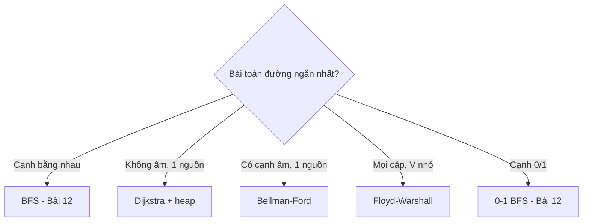

# Bài 13 — Đường Đi Ngắn Nhất

> 🧮 **Nhánh 02 — Thuật Toán (HSG / Competitive Programming)**

---

## 🧠 Điều kiện tiên quyết

- [Bài 12 — Đồ Thị: BFS & DFS](../12-Do-Thi-BFS-DFS/bai.md)
- [Bài 5 — Stack, Queue & Hashing](../05-Stack-Queue-Hashing/bai.md) (heapq, deque)
- [Bài 2 — Độ Phức Tạp](../02-Do-Phuc-Tap/bai.md)

---

## 🎯 Mục tiêu

Sau bài học này, học viên sẽ:

* ✅ Hiểu vì sao BFS "chết" khi cạnh có trọng số khác nhau.
* ✅ Cài Dijkstra bằng heapq O((V+E) log V) — thuật toán đường ngắn nhất dùng nhiều nhất.
* ✅ Biết khi nào cần Bellman-Ford (cạnh âm, phát hiện chu trình âm).
* ✅ Dùng Floyd-Warshall cho "mọi cặp đỉnh" với V nhỏ (≤ 400–500).
* ✅ Xử lý đồ thị lưới có trọng số và bẫy "số đỉnh ảo" (mô hình hóa trạng thái).

---

## 📖 Mở đầu

Bài 12 cho đường ngắn nhất khi mọi bước tốn như nhau. Thực tế mỗi con đường
dài ngắn khác nhau — cần "BFS có cân": luôn mở rộng đỉnh **rẻ nhất chưa chốt**,
dùng heap để lấy đỉnh rẻ nhất trong O(log V). Đó là Dijkstra — và khi có cạnh
âm, cần Bellman-Ford; khi cần mọi cặp, cần Floyd.

---

## 💡 Ý tưởng trực quan

* **Dijkstra:** đội cứu hộ tỏa đi từ trạm — luôn cử người tới **điểm gần nhất
  chưa tới** (heap). Điểm nào đã tới thì không có đường nào rẻ hơn nữa
  (vì mọi cạnh không âm — đường vòng chỉ đắt thêm).
* **Bellman-Ford:** tin đồn lan truyền — mỗi vòng, mọi đỉnh cập nhật giá rẻ
  nhất nghe được từ hàng xóm; sau V−1 vòng, tin đã lan hết (đường ngắn nhất
  có tối đa V−1 cạnh). Vòng thứ V mà còn rẻ hơn → có "vòng lặp giảm giá vô hạn"
  (chu trình âm).
* **Floyd:** hỏi từng người trung gian k: "đi qua tớ có rẻ hơn không?" —
  thử hết mọi k, mọi cặp (i, j).



---

## 📚 Kiến thức

### 1. Vì sao BFS sai với trọng số khác nhau

Đồ thị: 0→1 (tốn 1), 0→2 (tốn 5), 1→2 (tốn 1). BFS thăm 2 trước qua cạnh 0→2
(tốn 5) và "chốt" dist[2] = 5 — nhưng đường 0→1→2 chỉ tốn 2. BFS chốt theo
**số cạnh**, không theo **tổng trọng số**. Cần chốt theo tổng rẻ nhất → Dijkstra.

### 2. Dijkstra — O((V + E) log V), cạnh không âm

```python
import heapq

def dijkstra(ke, nguon):
    INF = 10 ** 18
    dist = [INF] * len(ke)
    dist[nguon] = 0
    heap = [(0, nguon)]          # (khoảng cách, đỉnh)
    while heap:
        d, u = heapq.heappop(heap)
        if d != dist[u]:
            continue             # mục heap cũ (đã có đường rẻ hơn) → bỏ
        for v, w in ke[u]:
            if dist[u] + w < dist[v]:
                dist[v] = dist[u] + w
                heapq.heappush(heap, (dist[v], v))
    return dist
```

**Trực giác đúng đắn (không chứng minh hình thức):** heap luôn cho đỉnh chưa
chốt rẻ nhất u. Mọi đường khác tới u phải qua một đỉnh chưa chốt v' có
dist ≥ dist[u], cộng thêm cạnh không âm → không rẻ hơn dist[u]. Vậy chốt u
là an toàn. Cạnh âm phá vỡ lập luận này (đường vòng có thể rẻ hơn!) → cấm
Dijkstra với cạnh âm.

**Chi tiết `if d != dist[u]: continue`** — "lazy deletion": một đỉnh có thể
nằm trong heap nhiều lần (mỗi lần nới lỏng đẩy một mục); khi pop ra mục cũ
(d lớn hơn dist hiện tại) thì bỏ. Không có dòng này vẫn đúng nhưng chậm hơn;
có dòng này là chuẩn editorial.

### 3. Bellman-Ford — O(V·E), chịu cạnh âm, bắt chu trình âm

```python
def bellman_ford(n, canh, nguon):
    INF = 10 ** 18
    dist = [INF] * n
    dist[nguon] = 0
    for _ in range(n - 1):            # nới lỏng toàn bộ n−1 vòng
        doi = False
        for u, v, w in canh:
            if dist[u] + INF > 0 and dist[u] + w < dist[v]:
                dist[v] = dist[u] + w
                doi = True
        if not doi:
            break                     # dừng sớm
    for u, v, w in canh:              # vòng n: còn nới được → chu trình âm
        if dist[u] + w < dist[v]:
            return None               # báo chu trình âm tới được
    return dist
```

> `dist[u] + INF > 0` — bảo vệ khi dist[u] = INF (đỉnh chưa tới được):
> INF + w (âm) có thể < INF gây cập nhật ma! Trong Python số nguyên vô hạn
> nên `INF + (−5) < INF` đúng là True → **bug âm thầm**. Phải kiểm tra
> `dist[u] != INF` trước. (Chi tiết nhỏ, bắt được khối bài WA.)

Dùng khi: có cạnh âm (giảm giá, lợi nhuận), hoặc cần phát hiện chu trình âm
(arbitrage tiền tệ!). Không âm → Dijkstra nhanh hơn hẳn.

### 4. Floyd-Warshall — mọi cặp, O(V³), V ≤ 400–500

```python
def floyd(n, canh):
    INF = 10 ** 18
    d = [[INF] * n for _ in range(n)]
    for i in range(n):
        d[i][i] = 0
    for u, v, w in canh:
        if w < d[u][v]:
            d[u][v] = w               # song cạnh: giữ rẻ nhất
    for k in range(n):                # trung gian k NGOÀI CÙNG
        dk = d[k]
        for i in range(n):
            dik = d[i][k]
            if dik == INF:
                continue
            di = d[i]
            for j in range(n):
                if dk[j] != INF and dik + dk[j] < di[j]:
                    di[j] = dik + dk[j]
    return d
```

> **Thứ tự vòng lặp k-i-j là bắt buộc** (k ngoài cùng): sau vòng k, d[i][j] là
> đường tốt nhất chỉ dùng đỉnh trung gian trong {0..k}. Đảo thứ tự (i-j-k)
> cho kết quả sai — bẫy kinh điển. Tối ưu `dik`/`dk` tránh index lặp
> (Python chậm với 3 vòng lồng — V ≤ 400 thực tế).

### 5. Mô hình hóa trạng thái — kỹ năng HSG thực sự

Nhiều bài không cho đồ thị sẵn — bạn phải **dựng đỉnh = trạng thái**:

* Mê cung có chìa khóa: đỉnh = (r, c, bộ chìa đang có) — BFS/Dijkstra trên
  không gian trạng thái.
* Xe tốn xăng theo đoạn: đỉnh = (điểm, xăng còn lại).
* "Ít lần chuyển xe nhất" vs "thời gian ít nhất": trọng số khác nhau trên cùng
  bản đồ → 2 bài toán khác nhau.

> Khi đề có "mang theo", "đã qua", "còn lại" — nghĩ ngay đỉnh trạng thái mở rộng.

---

## 💻 Ví dụ

### Ví dụ 1 — Dễ: Dijkstra cơ bản + chạy tay

> n = 5, cạnh vô hướng: (0,1,4), (0,2,1), (2,1,2), (1,3,1), (2,3,5), (3,4,3).
> Khoảng cách từ 0 đến mọi đỉnh?

```python
import sys, heapq

def dijkstra(ke, nguon):
    INF = 10 ** 18
    dist = [INF] * len(ke)
    dist[nguon] = 0
    heap = [(0, nguon)]
    while heap:
        d, u = heapq.heappop(heap)
        if d != dist[u]:
            continue
        for v, w in ke[u]:
            if dist[u] + w < dist[v]:
                dist[v] = dist[u] + w
                heapq.heappush(heap, (dist[v], v))
    return dist

def main():
    data = sys.stdin.read().strip().split()
    if not data:
        return
    it = iter(data)
    n, m = int(next(it)), int(next(it))
    ke = [[] for _ in range(n)]
    for _ in range(m):
        u, v, w = int(next(it)), int(next(it)), int(next(it))
        ke[u].append((v, w))
        ke[v].append((u, w))
    print(" ".join(map(str, dijkstra(ke, 0))))

main()
```

Chạy tay (pop theo thứ tự heap):

| Pop (d,u) | Nới lỏng | dist |
|---|---|---|
| (0,0) | 1→4, 2→1 | [0,4,1,∞,∞] |
| (1,2) | 1→min(4,3)=3, 3→6 | [0,3,1,6,∞] |
| (3,1) | 3→min(6,4)=4 | [0,3,1,4,∞] |
| (4,3) | 4→7 | [0,3,1,4,7] |
| (7,4) | hết | xong |

Đáp án: `0 3 1 4 7`. ✔ (Đường tới 1 là 0→2→1 tốn 3, không phải cạnh trực tiếp 4.)

### Ví dụ 2 — Thực tế: lưới chi phí (mỗi ô tốn tiền đi vào)

> Lưới n×m, vào ô (r,c) tốn a[r][c]. Từ (0,0) đến (n−1,m−1) rẻ nhất?
> (BFS thường sai vì chi phí khác nhau!)

```python
import sys, heapq

def main():
    data = sys.stdin.read().strip().split()
    if not data:
        return
    it = iter(data)
    n, m = int(next(it)), int(next(it))
    a = [[int(next(it)) for _ in range(m)] for _ in range(n)]
    INF = 10 ** 18
    dist = [[INF] * m for _ in range(n)]
    dist[0][0] = a[0][0]
    heap = [(a[0][0], 0, 0)]
    while heap:
        d, x, y = heapq.heappop(heap)
        if d != dist[x][y]:
            continue
        if (x, y) == (n - 1, m - 1):
            break
        for dx, dy in ((1, 0), (-1, 0), (0, 1), (0, -1)):
            nx, ny = x + dx, y + dy
            if 0 <= nx < n and 0 <= ny < m and d + a[nx][ny] < dist[nx][ny]:
                dist[nx][ny] = d + a[nx][ny]
                heapq.heappush(heap, (dist[nx][ny], nx, ny))
    print(dist[n - 1][m - 1])

main()
```

Dijkstra trên đồ thị lưới ngầm (đỉnh = ô, cạnh = 4 hướng, trọng số = chi phí
ô đích). O(n·m log(n·m)).

### Ví dụ 3 — Khó: arbitrage (chu trình âm = in tiền vô hạn)

> n loại tiền, m tỉ giá (u→v: 1 đơn vị u đổi được r đơn vị v). Hỏi có cách
> đổi một vòng để tiền **tăng** lên không?

Biến đổi: đặt w = −log(r). Vòng u→...→u có tích tỉ giá > 1 ⟺ tổng w < 0 =
**chu trình âm**! Bellman-Ford bắt:

```python
import sys, math

def main():
    data = sys.stdin.read().strip().split()
    if not data:
        return
    it = iter(data)
    n, m = int(next(it)), int(next(it))
    canh = []
    for _ in range(m):
        u, v = int(next(it)), int(next(it))
        r = float(next(it))
        canh.append((u, v, -math.log(r)))
    # siêu nguồn: dist khởi 0 hết để bắt chu trình ở mọi thành phần
    dist = [0.0] * n
    am = False
    for lan in range(n):
        doi = False
        for u, v, w in canh:
            if dist[u] + w < dist[v] - 1e-12:
                dist[v] = dist[u] + w
                doi = True
                if lan == n - 1:
                    am = True
        if not doi:
            break
    print("YES" if am else "NO")

main()
```

**Giải thích:**

* `dist` khởi 0 hết = thêm siêu nguồn nối 0 tới mọi đỉnh → phát hiện chu trình
  âm ở **bất kỳ** thành phần nào (không cần biết bắt đầu từ đâu).
* `-1e-12` epsilon cho float (log gây sai số; không epsilon → false positive).
* Tích tỉ giá > 1 ⟺ tổng −log < 0 — log biến "nhân" thành "cộng" để dùng
  thuật toán đường đi. Mẹo log này gặp trong ML, tài chính, sinh học.

---

## 📊 Minh họa

Dijkstra ví dụ 1 — thứ tự "chốt" đỉnh (số trong ngoặc là dist khi chốt):

```
        4
    0 ----- 1
    | \     | 1
    1  \2   3
    |   \   | \ 3
    2 ----- +  4
        5
Chốt: 0(0) → 2(1) → 1(3) → 3(4) → 4(7)
```

---

## ⚠️ Những lỗi thường gặp

### Lỗi 1: Dijkstra với cạnh âm — sai âm thầm

* Triệu chứng: đúng test mẫu, WA test ẩn. Sửa: thấy số âm → Bellman-Ford.

### Lỗi 2: Quên `if d != dist[u]: continue` → TLE

* Heap phình với mục cũ; đồ thị lớn (10⁵ đỉnh, 10⁶ cạnh) TLE rõ rệt.

### Lỗi 3: INF + w âm < INF (Bellman-Ford Python)

* Kiểm tra `dist[u] != INF` trước khi nới lỏng. Đã phân tích mục 3.

### Lỗi 4: Floyd sai thứ tự vòng lặp (k phải ngoài cùng)

### Lỗi 5: Nhập nhằng có hướng/vô hướng khi thêm cạnh

* Dijkstra/Bellman-Ford trên cạnh sai hướng cho đáp án sai hoàn toàn.

### Lỗi 6: Không dùng heap mà quét tìm min mỗi lần — O(V²)

* `min()` trên list chưa chốt mỗi vòng → Dijkstra O(V²): chỉ ổn khi V ≤ 5000.

---

## 🧪 Trường hợp đặc biệt

* **Đỉnh không tới được**: dist = INF → in −1/`INF` theo quy ước đề (đừng in 10¹⁸!).
* **n = 1**: dist[nguồn] = 0, xong ngay.
* **Song cạnh / tự khuyên**: giữ cạnh rẻ nhất (Floyd); tự khuyên dương vô hại
  với Dijkstra (không bao giờ nới được gì).
* **Trọng số 0**: Dijkstra vẫn đúng (không âm là được); BFS sai!
* **Chu trình âm không tới được từ nguồn**: Bellman-Ford chuẩn (nguồn đơn)
  không báo — muốn bắt mọi nơi thì siêu nguồn (ví dụ 3).

---

## 🚀 Ứng dụng thực tế

* Google Maps/Grab (đường ngắn nhất + traffic = trọng số động).
* Định tuyến mạng (OSPF = Dijkstra, BGP ~ Bellman-Ford).
* Arbitrage crypto/forex (chu trình âm/dương).

---

## 🧩 Bài tập

### 🟢 Cơ bản (1–3)

**Bài 1 — Chạy tay.** Đồ thị ví dụ 1 nhưng thêm cạnh (0,3,2). Chạy tay Dijkstra
từ 0, ghi thứ tự pop và dist. Đáp án đổi thế nào? (Đáp án: dist = [0,3,1,2,5].)

**Bài 2 — BFS vs Dijkstra.** Lưới 3×3 toàn chi phí 1, trừ ô giữa chi phí 100.
BFS (đếm bước) và Dijkstra cho đáp án khác nhau thế nào? Vẽ 2 đường.

**Bài 3 — Floyd tay.** 3 đỉnh, cạnh: 0→1 (5), 1→2 (3), 0→2 (10). Chạy 3 vòng k
(k = 0, 1, 2), ghi ma trận d sau mỗi vòng. (Đáp án cuối d[0][2] = 8.)

### 🟡 Hiểu sâu (4–6)

**Bài 4 — Đường thứ hai.** Tìm đường ngắn thứ hai (có thể lặp đỉnh) từ s đến t,
cạnh không âm. *Gợi ý: Dijkstra mở rộng — mỗi đỉnh lưu 2 dist tốt nhất
(dist1, dist2); nới lỏng lan cả hai. Vì sao đủ? (Đường thứ hai chỉ rẽ khỏi
đường nhất tại một chỗ.)*

**Bài 5 — Đổi chuyến ít nhất.** n tuyến xe, mỗi tuyến là danh sách trạm (lên
bất kỳ trạm nào của tuyến = "lên tuyến đó", đi miễn phí trong tuyến, đổi tuyến
tốn 1). Từ trạm A đến B ít lần đổi nhất? *Gợi ý: đồ thị 2 lớp (trạm–tuyến):
trạm→tuyến tốn 1 (lên xe), tuyến→trạm tốn 0 (xuống/xe chạy) — 0-1 BFS (Bài 12)!*

**Bài 6 — Chu trình âm cụ thể.** Sửa Bellman-Ford để không chỉ báo CÓ mà còn
in ra một chu trình âm (danh sách đỉnh). *Gợi ý: vòng n ghi lại `cha[v] = u`
mỗi lần nới; đỉnh bị nới ở vòng n nằm trên/gần chu trình — đi ngược cha n lần
để chắc chắn vào vòng, rồi đi tiếp đến lặp.*

### 🔴 Vận dụng (7–8)

**Bài 7 — K cạnh rẻ nhất.** Đồ thị không âm, tìm đường từ s đến t dùng **không
quá K cạnh** (K ≤ 100, V ≤ 10⁴). *Gợi ý: DP kiểu Bellman-Ford giới hạn vòng:
dp[k][v] = rẻ nhất đến v dùng ≤ k cạnh; dp[k][v] = min(dp[k−1][v],
min(dp[k−1][u] + w)). O(K·E). Vì sao Dijkstra thường không ép được số cạnh?*

**Bài 8 — Min-max (minimax path).** Tìm đường từ s đến t sao cho cạnh **lớn
nhất** trên đường là nhỏ nhất có thể (đường ống chịu áp lực). *Gợi ý: Dijkstra
biến thể — dist[v] = min độ cao cực đại; nới lỏng: max(dist[u], w) thay vì
dist[u] + w. Chứng minh: tính đơn điệu max vẫn giữ bất biến heap. (Còn gọi là
"đường minimax" — ra đề HSG rất nhiều.)*

---

## ✅ Đáp án

> 💡 **Hãy tự làm bài tập trước** rồi mới mở đáp án.

<details>
<summary>✅ Bài 1: Chạy tay</summary>

Thêm cạnh (0,3,2): pop (0,0) → 3 được dist 2. Thứ tự pop: (0,0), (1,2)? —
heap sau pop 0: [(1,2),(2,3),(4,1)] → pop (1,2): nới 1→3? dist[1]=4 > 1+2=3 →
3 về 3 (nhưng đã có 2, giữ 2)... tiếp pop (2,3): nới 3→5? dist[3]=2 giữ.
Pop (4,1) [mục cũ? dist[1]=3 ≠ 4 → bỏ qua — đúng tác dụng lazy deletion!].
Pop (3... dist[3]=2: nới 4→5. dist cuối [0,3,1,2,5]. Đáp án đổi: 3→2, 4→5.

</details>

<details>
<summary>✅ Bài 2: BFS vs Dijkstra</summary>

* BFS (đếm bước): đường ngắn nhất 4 bước, ví dụ đi qua ô giữa: chi phí
  1+1+100+1+1 = 104 (tính cả ô xuất phát) — BFS không thấy đắt!
* Dijkstra: đi vòng qua biên: 5 ô × 1 = 5. Đáp án 5 vs 104 — khác nhau 20 lần.
* Bài học vẽ được: trọng số thay đổi mọi thứ.

</details>

<details>
<summary>✅ Bài 3: Floyd tay</summary>

* Ban đầu: d[0][2] = 10.
* k = 0: không cải thiện gì (không có đường qua 0 tốt hơn).
* k = 1: d[0][2] = min(10, d[0][1] + d[1][2]) = min(10, 8) = **8**.
* k = 2: không đổi. Ma trận cuối: hàng 0 = [0, 5, 8].

</details>

<details>
<summary>✅ Bài 4: Đường thứ hai</summary>

```python
import heapq

def hai_duong(ke, s, t):
    INF = 10 ** 18
    d1 = [INF] * len(ke)
    d2 = [INF] * len(ke)
    d1[s] = 0
    heap = [(0, s)]
    while heap:
        d, u = heapq.heappop(heap)
        if d > d2[u]:
            continue
        for v, w in ke[u]:
            nd = d + w
            if nd < d1[v]:
                d1[v], nd = nd, d1[v]
                heapq.heappush(heap, (d1[v], v))
            if d1[v] < nd < d2[v]:
                d2[v] = nd
                heapq.heappush(heap, (nd, v))
    return d2[t]
```

Mỗi đỉnh giữ 2 giá trị tốt nhất; mục pop thứ hai của t là đáp án.
Đường thứ hai có thể lặp đỉnh (đi qua đường nhất rồi vòng lại) — code trên
cho phép vì không cấm thăm lại.

</details>

<details>
<summary>✅ Bài 5: Đổi chuyến ít nhất</summary>

Dựng đồ thị 2 lớp: node trạm (0..n−1) + node tuyến (n..n+m−1).
Cạnh trạm→tuyến (lên xe) tốn **1**, tuyến→trạm tốn **0** (đi trong tuyến +
xuống xe miễn phí). Đáp án = dist[B] − 1? Kiểm tra: A→tuyến (1) →B (1+0=1)...
Hmm — lên 1 tuyến tốn 1, đáp án số tuyến = dist[B] (mỗi tuyến đóng góp đúng 1
qua cạnh trạm→tuyến). 0-1 BFS (Bài 12 — bài 4) giải O(trạm + lượt đi).
Nếu A == B → 0 (không lên xe nào).

</details>

<details>
<summary>✅ Bài 6: Chu trình âm cụ thể</summary>

```python
def chu_trinh_am(n, canh, nguon=0):
    INF = 10 ** 18
    dist = [INF] * n
    cha = [-1] * n
    dist[nguon] = 0
    dinh_nới = -1
    for lan in range(n):
        dinh_nới = -1
        for u, v, w in canh:
            if dist[u] != INF and dist[u] + w < dist[v]:
                dist[v] = dist[u] + w
                cha[v] = u
                dinh_nới = v
    if dinh_nới == -1:
        return None
    v = dinh_nới
    for _ in range(n):      # đi ngược n bước → chắc chắn trong vòng
        v = cha[v]
    vong = [v]
    u = cha[v]
    while u != v:
        vong.append(u)
        u = cha[u]
    return vong[::-1]
```

Đi ngược cha n lần: đường từ nguồn dài tối đa n−1 cạnh mới không lặp, nên sau
n bước chắc chắn đã vào chu trình. Rồi đi tiếp đến khi quay lại điểm xuất phát.

</details>

<details>
<summary>✅ Bài 7: K cạnh rẻ nhất</summary>

```python
def k_canh(n, canh, s, t, k):
    INF = 10 ** 18
    dp_cu = [INF] * n
    dp_cu[s] = 0
    for _ in range(k):
        dp_moi = dp_cu[:]              # dùng ≤ số cạnh hiện tại (được ở yên)
        for u, v, w in canh:
            if dp_cu[u] + w < dp_moi[v]:
                dp_moi[v] = dp_cu[u] + w
        dp_cu = dp_moi
    return dp_cu[t]
```

Mỗi vòng = thêm tối đa 1 cạnh (đúng 1 vòng Bellman-Ford); k vòng = ≤ k cạnh.
O(K·E) = 100 × E — rẻ. Dijkstra không ép số cạnh được vì thứ tự pop theo dist,
không theo số cạnh (đường rẻ có thể dùng nhiều cạnh).

</details>

<details>
<summary>✅ Bài 8: Min-max (minimax path)</summary>

```python
import heapq

def minimax(ke, s, t):
    INF = 10 ** 18
    best = [INF] * len(ke)
    best[s] = 0
    heap = [(0, s)]
    while heap:
        d, u = heapq.heappop(heap)
        if d != best[u]:
            continue
        if u == t:
            break
        for v, w in ke[u]:
            nd = max(d, w)             # ← khác duy nhất so với Dijkstra
            if nd < best[v]:
                best[v] = nd
                heapq.heappush(heap, (nd, v))
    return best[t]
```

Đúng vì phép `max` đơn điệu: mọi đường khác tới u qua đỉnh chưa chốt đều có
max ≥ best[u] (đỉnh đó best ≥ best[u], max với cạnh không âm chỉ tăng).
Cùng khung Dijkstra, đổi phép kết hợp — mẫu "Dijkstra tổng quát" (phép kết
hợp đơn điệu + có thứ tự đều dùng được).

</details>

---

## 🧠 Thử thách

**Thử thách HSG:** Đồ thị vô hướng n ≤ 10⁵, m ≤ 2×10⁵, cạnh không âm.
Tìm đường từ s đến t sao cho **tích** trọng số trên đường là **lớn nhất**.
*Gợi ý: log biến tích thành tổng (ôn ví dụ 3), nhưng dấu max→min đảo chiều —
viết Dijkstra trên −log(w) hay log(w) với heap max? Cẩn thận w = 0 (log vô
định — xử lý riêng: tích 0 trừ khi mọi đường đều có cạnh 0...).*

---

## 📝 Tóm tắt

| Khái niệm | Nội dung |
|---|---|
| 🚫 BFS + trọng số | Sai — chốt theo số cạnh, không theo tổng |
| 🏆 Dijkstra | Heap + lazy deletion; cấm cạnh âm; O((V+E) log V) |
| ➖ Bellman-Ford | n−1 vòng + vòng bắt chu trình âm; coi chừng INF + âm |
| 🔢 Floyd | k ngoài cùng; V ≤ 400; song cạnh giữ min |
| 🧩 Mô hình hóa | Đỉnh = trạng thái (vị trí + mang theo + còn lại) |

---

## ➡️ Điều hướng

**Vị trí:** `02-Thuat-Toan/13-Duong-Di-Ngan-Nhat/bai.md`

**Bài tiếp theo:** [Bài 14 — Cây & DSU](../14-Cay-Va-DSU/bai.md)
