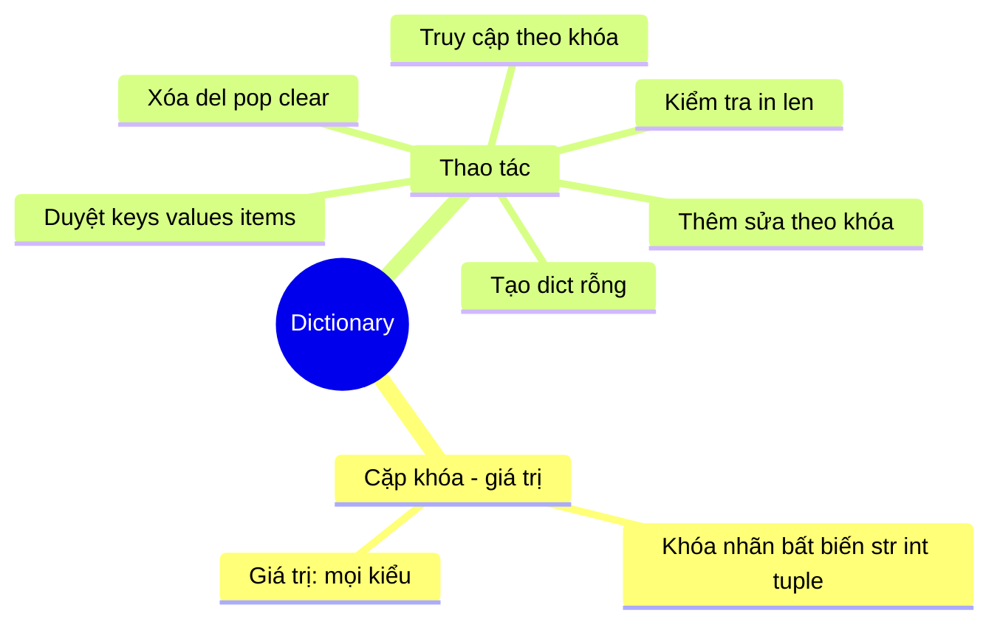

<!-- TỰ ĐỘNG ĐỒNG BỘ từ 01-Co-Ban/17-Dictionary/bai.md — đừng sửa trực tiếp, sửa bản chính rồi chạy tools/sync_tracks.py -->

# Bài 15 — Dictionary (Từ Điển) Trong Python

> 🎓 **Chương 5 – Cấu trúc dữ liệu: List, Tuple, Set và Dictionary**

## 🧠 Điều kiện tiên quyết

- [Bài 12 — Danh Sách (List) Trong Python](../12-List/bai.md)

---

## 🎯 Mục tiêu

Sau bài học này, học viên sẽ:

* ✅ Hiểu **Dictionary là gì**, vì sao cần nó thay vì list.
* ✅ **Tạo** từ điển bằng `{}` và hàm `dict()`.
* ✅ **Truy cập** giá trị qua khóa với `x['key']` và `get()`.
* ✅ **Thêm, sửa, xóa** phần tử bằng `del`, `pop`, `clear`.
* ✅ **Duyệt** từ điển với `keys()`, `values()`, `items()`.
* ✅ **Kiểm tra** khóa bằng toán tử `in` và lấy số phần tử bằng `len()`.
* ✅ Làm quen **dict comprehension** cơ bản (sẽ học sâu ở bài 26).

---

## 📖 Kiến thức

### 1. Dictionary là gì?

> 💬 **Nói đơn giản:** Dictionary là **hộp lưu dữ liệu theo cặp "khóa – giá trị" (key – value)**. Muốn lấy dữ liệu, chỉ cần gọi đúng **tên khóa** — nhanh như tra từ điển.

**Ví dụ đời thực:** 📒 sổ liên lạc (tên → số điện thoại), 🏫 bảng điểm (môn → điểm), 🍜 menu quán ăn (món → giá tiền).

So sánh với **list**:

```python
mon_hoc = ["Toan", "Van", "Anh"]
diem     = [8.5, 7.0, 9.0]              # ❌ điểm và môn tách rời, dễ nhầm
diem     = {"Toan": 8.5, "Van": 7.0, "Anh": 9.0}   # ✅ gói gọn, tra cứu nhanh
```



### 2. Tạo dictionary

| Cách | Cú pháp | Ví dụ |
|---|---|---|
| Có sẵn dữ liệu | `{khóa: giá_trị, ...}` | `diem = {"Toan": 8.5}` |
| Từ khóa | `dict(...)` | `diem = dict(Toan=8.5)` |
| Rỗng | `{}` hoặc `dict()` | `diem = {}` |

```python
diem = {}                  # từ điển rỗng
diem["ten"] = "Nguyen An"  # thêm khóa "ten" với giá trị "Nguyen An"
```

> ⚠️ **Khóa (key) phải là kiểu bất biến** — thường là chuỗi, số hoặc tuple. Không được dùng **list** làm khóa.

### 3. Truy cập giá trị

```python
diem = {"Toan": 8.5, "Van": 7.0, "Anh": 9.0}

print(diem["Toan"])          # 8.5 — nếu khóa không có sẽ báo KeyError!
print(diem.get("Ly"))        # None — an toàn, không lỗi
print(diem.get("Ly", 0))     # 0 — khóa không có thì trả giá trị mặc định
print(diem.get("Anh", 0))    # 9.0 — khóa có thì lấy giá trị thật
```

> 💡 **`get()` an toàn hơn `diem["khóa"]`**: không báo lỗi khi khóa không tồn tại — dùng cho dữ liệu nhập từ bên ngoài.

### 4. Thêm và sửa phần tử

```python
diem = {"Toan": 8.5}
diem["Van"] = 7.0    # khóa "Van" chưa có → THÊM mới
diem["Toan"] = 9.0   # khóa "Toan" đã có  → SỬA thành 9.0
print(diem)          # {'Toan': 9.0, 'Van': 7.0}
```

> 💡 **Ghi nhớ:** Cùng cú pháp `diem[key] = value` — khóa chưa tồn tại là **thêm**, đã tồn tại là **sửa**.

### 5. Xóa phần tử

| Lệnh | Công dụng |
|---|---|
| `del dic["khóa"]` | Xóa cặp có khóa đó |
| `dic.pop("khóa")` | Xóa và **trả về giá trị** vừa xóa |
| `dic.pop("khóa", mặc_định)` | An toàn: không có khóa thì trả về mặc định |
| `dic.clear()` | Xóa **toàn bộ** từ điển |

### 6. Duyệt từ điển

```python
diem = {"Toan": 8.5, "Van": 7.0, "Anh": 9.0}

for mon in diem:                # duyệt qua các KHÓA
    print(mon)                  # Toan / Van / Anh

for d in diem.values():         # duyệt qua các GIÁ TRỊ
    print(d)                    # 8.5 / 7.0 / 9.0

for mon, d in diem.items():     # duyệt CẢ cặp khóa – giá trị (hay dùng nhất)
    print(mon, "->", d)         # Toan -> 8.5 ...
```

> 💡 `items()` trả về từng cặp; cú pháp `for mon, d in ...` gọi là **giải nén (unpacking)**.

### 7. Kiểm tra và số lượng

```python
diem = {"Toan": 8.5}

print("Toan" in diem)   # True  — khóa tồn tại
print("Ly" in diem)     # False — khóa không tồn tại
print(len(diem))        # 1 — số cặp khóa – giá trị
```

### 8. Dict comprehension (giới thiệu)

```python
diem = {"Toan": 4, "Van": 5, "Anh": 6}
binh_phuong = {mon: d * d for mon, d in diem.items()}
print(binh_phuong)   # {'Toan': 16, 'Van': 25, 'Anh': 36}
```

> 📌 Chỉ cần biết khái niệm ở bài này; bài **26_List_Comprehension** sẽ học chi tiết.

### 9. List hay Dictionary — khi nào dùng gì?

| Tiêu chí | List | Dictionary |
|---|---|---|
| Ý nghĩa | Danh sách có thứ tự | Bảng tra cứu theo nhãn |
| Truy cập | Theo **vị trí** `ds[0]` | Theo **khóa** `dic["ten"]` |
| Tốc độ tìm kiếm | Chậm khi list lớn | Rất nhanh (bảng băm) |
| Khi nào dùng | Danh sách hạng mục | Thông tin có nhãn: điểm môn, hồ sơ, menu |

---

## 💡 Ví dụ minh họa

### Ví dụ 1: Tạo từ điển điểm và tra cứu

```python
# Bước 1: tạo từ điển điểm 3 môn
diem = {"Toan": 8.5, "Van": 7.0, "Anh": 9.0}
# Bước 2: tra cứu điểm Toán
print("Diem Toan:", diem["Toan"])
# Bước 3: tra cứu an toàn môn chưa có
print("Diem Ly:", diem.get("Ly", "Chua co diem"))
```

Kết quả: `Diem Toan: 8.5` và `Diem Ly: Chua co diem`.

| Dòng code | Ý nghĩa |
|---|---|
| `diem = {...}` | Tạo từ điển với 3 cặp khóa – giá trị |
| `diem["Toan"]` | Lấy điểm môn Toán theo khóa |
| `diem.get("Ly", "Chua co diem")` | Không có môn Lý → trả về chuỗi mặc định |

### Ví dụ 2: Menu quán ăn — thêm, sửa, xóa

```python
menu = {"Pho": 45, "Bun": 30, "Com": 25}   # món -> giá (nghìn đồng)
menu["My xao"] = 35     # THÊM món mới
menu["Pho"] = 50        # SỬA giá phở
menu.pop("Com")         # XÓA món cơm (bán hết)

for mon, gia in menu.items():          # duyệt toàn bộ menu
    print(f"{mon}: {gia}k")
```

Kết quả:

```
Pho: 50k
Bun: 30k
My xao: 35k
```

---

## 🔬 Ví dụ nâng cao

### Ví dụ 1: Quản lý điểm học sinh 🏫

```python
diem = {"Toan": 8.5, "Van": 7.0, "Anh": 9.0}

for mon, d in diem.items():            # in bảng điểm
    print(f"{mon}: {d}")

tong = sum(diem.values())              # cộng toàn bộ giá trị
print("Diem trung binh:", round(tong / len(diem), 2))

mon_max = max(diem, key=diem.get)      # so sánh bằng giá trị để lấy khóa
print("Mon cao nhat:", mon_max, "-", diem[mon_max])
```

Kết quả: bảng 3 môn, `Diem trung binh: 8.17`, `Mon cao nhat: Anh - 9.0`.

### Ví dụ 2: Đếm tần suất xuất hiện của chữ cái 🔡

```python
cau = "hello python"
dem = {}                              # từ điển rỗng: chữ -> số lần

for chu in cau:
    if chu != " ":                    # bỏ qua dấu cách
        dem[chu] = dem.get(chu, 0) + 1   # lấy số cũ (mặc định 0) rồi cộng 1

for chu, so_lan in dem.items():
    print(f"{chu}: {so_lan}")
```

> 💡 Kỹ thuật kinh điển `dem.get(chu, 0) + 1` dùng nhiều trong phân tích văn bản.

### Ví dụ 3: Máy tính tiền quán ăn 🍜

```python
menu = {"Pho": 45, "Bun": 30, "Com": 25, "My xao": 35}
goi = ["Pho", "Com"]                   # khách gọi 2 món

tong = 0
for mon in goi:
    tien = menu.get(mon, 0)            # món không có trong menu thì tính 0
    tong += tien
    print(f"{mon}: {tien}k")
print("Tong tien:", tong, "k")
```

Kết quả: `Pho: 45k`, `Com: 25k`, `Tong tien: 70k`.

---

## ⚠️ Lỗi thường gặp

### Lỗi 1: Truy cập khóa không tồn tại — KeyError

```python
diem = {"Toan": 8.5}
print(diem["Ly"])   # ❌ SAI — KeyError: 'Ly', chương trình dừng đột ngột
```

* **Cách sửa:** `diem.get("Ly", 0)` hoặc kiểm tra `if "Ly" in diem:` trước.

### Lỗi 2: Quên dấu phẩy giữa các cặp

```python
diem = {"Toan": 8.5 "Van": 7.0}   # ❌ SAI — SyntaxError
diem = {"Toan": 8.5, "Van": 7.0}  # ✅ ĐÚNG
```

### Lỗi 3: Khóa bị trùng — cặp sau "nuốt" cặp trước

```python
diem = {"Toan": 8.5, "Toan": 9.0}  # chỉ còn {'Toan': 9.0}
```

* **Nguyên nhân:** khóa phải **duy nhất** — mỗi khóa chỉ xuất hiện một lần.

### Lỗi 4: Dùng list làm khóa

```python
diem = {["Toan"]: 8.5}   # ❌ SAI — TypeError: unhashable type: 'list'
```

* **Cách sửa:** dùng khóa bất biến: chuỗi, số, tuple.

### Lỗi 5: Sửa từ điển khi đang duyệt

```python
diem = {"Toan": 8.5, "Van": 7.0, "Anh": 9.0}
for mon in diem:
    del diem[mon]   # ❌ SAI — RuntimeError: dictionary changed size
```

* **Cách sửa:** duyệt bản sao danh sách khóa: `for mon in list(diem):`.

---

## 💎 Mẹo

* 🛡️ **Ưu tiên `get()`** khi truy cập dữ liệu từ bên ngoài — tránh sập chương trình vì `KeyError`.
* ⚡ **`items()` là bạn thân** khi duyệt cả khóa lẫn giá trị.
* 🔑 **Khóa phải bất biến** (str, int, tuple) — đừng dùng list hay dict làm khóa.
* 🧮 **`sum(dic.values())`** tính tổng nhanh; kết hợp `len()` ra trung bình cộng.
* ✨ **f-string + items()** in bảng rất đẹp: `print(f"{mon}: {d}")`.
* 💾 `setdefault(k, v)` vừa đọc vừa tự thêm khóa nếu chưa có — tiện khởi tạo bộ đếm.

---

## 📝 Tóm tắt

| Thao tác | Cú pháp | Ghi chú |
|---|---|---|
| Tạo | `{...}` hoặc `dict()` | Khóa phải bất biến |
| Truy cập | `dic["khóa"]` | Lỗi `KeyError` nếu không có |
| Truy cập an toàn | `dic.get("khóa", mặc_định)` | Trả mặc định thay vì lỗi |
| Thêm / sửa | `dic["khóa"] = giá_trị` | Có thì sửa, không có thì thêm |
| Xóa | `del`, `pop`, `clear` | `pop` trả về giá trị đã xóa |
| Duyệt | `keys()`, `values()`, `items()` | `items()` cho cặp khóa – giá trị |
| Kiểm tra | `"khóa" in dic` | Tránh được `KeyError` |
| Số lượng | `len(dic)` | Số cặp khóa – giá trị |
| Comprehension | `{k: v for k, v in ...}` | Tạo từ điển từ vòng lặp |

---

## 🧪 Kiểm tra nhanh

1. ❓ Dictionary lưu dữ liệu theo cặp gì?
2. ❓ Viết cú pháp tạo từ điển điểm môn Toán bằng `{}`.
3. ❓ Truy cập `dic["khóa"]` mà khóa không tồn tại báo lỗi gì?
4. ❓ Làm sao truy cập an toàn không bị lỗi?
5. ❓ `dic["Toan"] = 9.0` khi khóa "Toan" đã có giá trị thì làm gì?
6. ❓ Lệnh nào xóa toàn bộ từ điển?
7. ❓ `for mon, d in dic.items():` — `mon` và `d` là gì?
8. ❓ Viết biểu thức kiểm tra khóa "Van" có trong `dic` không.
9. ❓ Khi nào gán giá trị cho khóa là **thêm mới**? Khi nào là **sửa**?
10. ❓ Vì sao không thể dùng list làm khóa?

<details>
<summary>🔍 Xem đáp án</summary>

1. Cặp **khóa – giá trị** (key – value).
2. `diem = {"Toan": 8.5}`.
3. `KeyError`.
4. Dùng `dic.get("khóa", giá_trị_mặc_định)` hoặc kiểm tra `in` trước.
5. **Sửa** giá trị cũ thành 9.0 (khóa đã tồn tại).
6. `dic.clear()`.
7. `mon` là khóa (môn học), `d` là giá trị (điểm).
8. `"Van" in dic`.
9. Thêm mới khi khóa **chưa tồn tại**; sửa khi khóa **đã tồn tại**.
10. Vì list là kiểu **có thể thay đổi** — Python yêu cầu khóa bất biến để tra cứu nhanh.

</details>

---

## 📚 Bài đọc thêm

* [Python.org – Dictionaries](https://docs.python.org/3/tutorial/datastructures.html#dictionaries)
* [W3Schools – Python Dictionaries](https://www.w3schools.com/python/python_dictionaries.asp)
* [Python.org – dict type](https://docs.python.org/3/library/stdtypes.html#dict)

---

---

## 🧩 Bài tập

> 📝 🎯 **Chủ đề:** Tạo, truy cập, thêm, sửa, xóa, duyệt dictionary; kiểm tra khóa; dict comprehension cơ bản.

## 🟢 Dễ (Bài 1 – 7)

### Bài 1: Tạo từ điển điểm môn học

* **Đề bài:** Tạo từ điển `diem` gồm 3 môn: `Toan: 8.5`, `Van: 7.0`, `Anh: 9.0` rồi in ra màn hình.
* **Input:** (không cần nhập gì)
* **Output:**
  ```
  {'Toan': 8.5, 'Van': 7.0, 'Anh': 9.0}
  ```
* **Gợi ý:** Dùng cặp ngoặc nhọn `{}` với cú pháp `{khóa: giá_trị, ...}`.

### Bài 2: Tra cứu điểm

* **Đề bài:** Với từ điển `diem` (Toan, Van, Anh), in ra điểm môn Toán và điểm môn Anh.
* **Input:** (không cần nhập gì)
* **Output:**
  ```
  Diem Toan: 8.5
  Diem Anh: 9.0
  ```
* **Gợi ý:** Truy cập bằng cú pháp `diem["Toan"]`.

### Bài 3: Tra cứu an toàn với get()

* **Đề bài:** Với menu món ăn `{"Pho": 45, "Bun": 30}`, in giá của món `Pho` và món `Ga ran` (không có trong menu) — món không có phải trả về giá mặc định `0`.
* **Input:** (không cần nhập gì)
* **Output:**
  ```
  Pho: 45
  Ga ran: 0
  ```
* **Gợi ý:** Dùng `menu.get(món, 0)`.

### Bài 4: Thêm môn học mới

* **Đề bài:** Bắt đầu với `diem = {"Toan": 8.5}`, thêm môn `Van: 7.0` và `Anh: 9.0` rồi in kết quả.
* **Input:** (không cần nhập gì)
* **Output:**
  ```
  {'Toan': 8.5, 'Van': 7.0, 'Anh': 9.0}
  ```
* **Gợi ý:** Gán `diem["Van"] = 7.0` — khóa chưa có nên được thêm mới.

### Bài 5: Sửa điểm

* **Đề bài:** `diem = {"Toan": 8.5, "Van": 7.0}` — cô giáo sửa điểm Toán thành `9.0`. In lại từ điển.
* **Input:** (không cần nhập gì)
* **Output:**
  ```
  {'Toan': 9.0, 'Van': 7.0}
  ```
* **Gợi ý:** Gán `diem["Toan"] = 9.0` — khóa đã tồn tại nên giá trị được thay thế.

### Bài 6: Xóa món khỏi menu bằng pop()

* **Đề bài:** `menu = {"Pho": 45, "Bun": 30, "Com": 25}` — món Cơm hết nên xóa khỏi menu. In giá vừa xóa và menu còn lại.
* **Input:** (không cần nhập gì)
* **Output:**
  ```
  Da xoa: 25
  {'Pho': 45, 'Bun': 30}
  ```
* **Gợi ý:** `gia = menu.pop("Com")` — vừa xóa vừa lấy giá trị.

### Bài 7: Kiểm tra khóa tồn tại

* **Đề bài:** `diem = {"Toan": 8.5, "Anh": 9.0}` — kiểm tra xem môn `Toan` và môn `Ly` có trong từ điển không, in `True`/`False`.
* **Input:** (không cần nhập gì)
* **Output:**
  ```
  Toan: True
  Ly: False
  ```
* **Gợi ý:** Dùng toán tử `"Toan" in diem`.

---

## 🟡 Trung bình (Bài 8 – 14)

### Bài 8: Duyệt khóa và in từng môn

* **Đề bài:** Với `diem = {"Toan": 8.5, "Van": 7.0, "Anh": 9.0}`, dùng vòng lặp in ra tên từng môn học.
* **Input:** (không cần nhập gì)
* **Output:**
  ```
  Toan
  Van
  Anh
  ```
* **Gợi ý:** `for mon in diem:` — vòng lặp tự duyệt qua các khóa.

### Bài 9: Tính tổng và trung bình điểm

* **Đề bài:** Với `diem` 3 môn, in tổng điểm và điểm trung bình (làm tròn 2 chữ số).
* **Input:** (không cần nhập gì)
* **Output:**
  ```
  Tong: 24.5
  Trung binh: 8.17
  ```
* **Gợi ý:** `sum(diem.values())` cộng toàn bộ giá trị; trung bình = tổng chia `len(diem)`.

### Bài 10: Duyệt cặp khóa – giá trị

* **Đề bài:** In bảng điểm dạng `Mon: Diem` cho từng môn bằng `items()`.
* **Input:** (không cần nhập gì)
* **Output:**
  ```
  Toan: 8.5
  Van: 7.0
  Anh: 9.0
  ```
* **Gợi ý:** `for mon, d in diem.items():`.

### Bài 11: Đếm số phần tử

* **Đề bài:** Sổ tay từ vựng `tu_vung = {"apple": "qua tao", "book": "quyen sach", "pen": "cay but"}` — in ra số từ đang học.
* **Input:** (không cần nhập gì)
* **Output:**
  ```
  So tu dang hoc: 3
  ```
* **Gợi ý:** Dùng `len(tu_vung)`.

### Bài 12: Bảng tuổi của bạn bè

* **Đề bài:** `ban_be = {"An": 15, "Binh": 16, "Chi": 15}` — in ra bảng dạng `Ten: tuoi tuoi` đẹp mắt bằng f-string.
* **Input:** (không cần nhập gì)
* **Output:**
  ```
  An 15 tuoi
  Binh 16 tuoi
  Chi 15 tuoi
  ```
* **Gợi ý:** Kết hợp `items()` với f-string: `print(f"{ten} {tuoi} tuoi")`.

### Bài 13: get() với giá trị mặc định khi điểm danh

* **Đề bài:** Lớp có điểm `{"An": 8, "Binh": 7}`. Tra điểm của `An`, `Chi` (chưa có → mặc định 0) và in ra.
* **Input:** (không cần nhập gì)
* **Output:**
  ```
  An: 8
  Chi: 0
  ```
* **Gợi ý:** `diem.get("Chi", 0)`.

### Bài 14: Xóa bằng del và clear()

* **Đề bài:** Bắt đầu với `menu = {"Pho": 45, "Bun": 30, "Com": 25, "My xao": 35}`. Xóa món `Bun` bằng `del`, sau đó dùng `clear()` xóa hết và in kết quả từng bước.
* **Input:** (không cần nhập gì)
* **Output:**
  ```
  Sau khi del: {'Pho': 45, 'Com': 25, 'My xao': 35}
  Sau khi clear: {}
  ```
* **Gợi ý:** `del menu["Bun"]` xóa 1 phần tử; `menu.clear()` xóa sạch.

---

## 🔴 Khó (Bài 15 – 20)

### Bài 15: Đếm tần suất chữ cái

* **Đề bài:** Cho câu `"python la ngon ngu tuyen voi"`. Đếm mỗi chữ cái (không tính dấu cách) xuất hiện bao nhiêu lần và in kết quả dạng `chu: so_lan`.
* **Input:** (không cần nhập gì)
* **Output (một phần ví dụ):**
  ```
  p: 1
  y: 2
  t: 2
  ...
  ```
* **Gợi ý:** Từ điển rỗng, mỗi chữ: `dem[chu] = dem.get(chu, 0) + 1`.

### Bài 16: Máy tính tiền quán ăn

* **Đề bài:** Menu `{"Pho": 45, "Bun": 30, "Com": 25, "My xao": 35}`. Nhập tên món ăn khách gọi (có thể nhiều món, nhập `xong` để dừng), in giá từng món và tổng tiền. Món không có trong menu thì báo `Khong co mon nay!`.
* **Input:**
  ```
  Nhap mon (xong de dung): Pho
  Nhap mon (xong de dung): Bun
  Nhap mon (xong de dung): xong
  ```
* **Output:**
  ```
  Pho: 45k
  Bun: 30k
  Tong tien: 75k
  ```
* **Gợi ý:** Vòng lặp `while`, kiểm tra `mon in menu` hoặc dùng `get()`.

### Bài 17: Quản lý điểm — thêm, sửa, xóa

* **Đề bài:** Bắt đầu `diem = {"Toan": 8.5, "Van": 7.0}`. Thực hiện lần lượt: thêm `Anh: 9.0`, sửa `Toan` thành `9.5`, xóa `Van`, rồi in bảng điểm cuối cùng dạng `Mon: Diem`.
* **Input:** (không cần nhập gì)
* **Output:**
  ```
  Toan: 9.5
  Anh: 9.0
  ```
* **Gợi ý:** Lần lượt gán và `pop`; in bằng `items()`.

### Bài 18: Tìm môn điểm cao nhất

* **Đề bài:** `diem = {"Toan": 7.5, "Van": 9.0, "Anh": 8.0, "Ly": 9.0}`. Tìm và in môn có điểm cao nhất cùng điểm số đó.
* **Input:** (không cần nhập gì)
* **Output:**
  ```
  Mon cao nhat: Van, diem: 9.0
  ```
* **Gợi ý:** Duyệt `items()` để so sánh; nếu điểm bằng nhau, chọn môn gặp trước. (Môn `Van` gặp trước `Ly`.)

### Bài 19: Dict comprehension nhân đôi điểm

* **Đề bài:** `diem = {"Toan": 4, "Van": 5, "Anh": 6}`. Dùng dict comprehension tạo từ điển mới với điểm gấp đôi, in kết quả.
* **Input:** (không cần nhập gì)
* **Output:**
  ```
  {'Toan': 8, 'Van': 10, 'Anh': 12}
  ```
* **Gợi ý:** `{mon: d * 2 for mon, d in diem.items()}`.

### Bài 20: Tổng hợp — xếp loại học sinh

* **Đề bài:** Cho `diem = {"Toan": 8.5, "Van": 7.0, "Anh": 9.0, "Ly": 6.5}`. Viết chương trình:
  1. In bảng điểm từng môn.
  2. Tính điểm trung bình (làm tròn 2 chữ số).
  3. Xếp loại: ≥ 8.0 → `Gioi`, ≥ 6.5 → `Kha`, ≥ 5.0 → `Trung binh`, còn lại → `Yeu`.
* **Input:** (không cần nhập gì)
* **Output:**
  ```
  Toan: 8.5
  Van: 7.0
  Anh: 9.0
  Ly: 6.5
  Trung binh: 7.75
  Xep loai: Kha
  ```
* **Gợi ý:** Kết hợp `items()`, `sum()`/`len()` và chuỗi `if...elif...else`.

---

## 🎯 Tổng kết sau khi làm bài

Sau 20 bài tập, bạn đã:

* ✅ Thành thạo tạo, truy cập (kể cả `get()` an toàn), thêm, sửa, xóa dictionary.
* ✅ Duyệt từ điển bằng `keys()`, `values()`, `items()` và dùng `in`, `len()`.
* ✅ Xây dựng các chương trình thực tế: điểm học, menu, đếm tần suất, dict comprehension.

> 💪 Chưa tự làm được bài nào thì đừng lo — xem lại bài giảng rồi quay lại. **Lập trình là luyện tập!**

---

## ✅ Đáp án

> 💡 **Hãy tự làm bài tập trước** rồi mới mở đáp án.

## 🟢 Dễ (Bài 1 – 7)


<details>
<summary>✅ Bài 1: Tạo từ điển điểm môn học</summary>


**Phân tích:** Tạo dictionary 3 cặp khóa – giá trị rồi in ra.

**Ý tưởng:** Dùng ngoặc nhọn `{}` với cú pháp `{khóa: giá_trị, ...}`.

**Thuật toán:**
1. Tạo từ điển `diem` với 3 môn.
2. In từ điển ra màn hình.

**Code:**

```python
# Tạo từ điển điểm 3 môn
diem = {"Toan": 8.5, "Van": 7.0, "Anh": 9.0}
# In toàn bộ từ điển
print(diem)
```

**Giải thích code:**
* `diem = {...}` — tạo dictionary; mỗi môn là một **khóa**, điểm là **giá trị**.
* `print(diem)` — in cả từ điển, Python hiển thị dạng `{'Toan': 8.5, ...}`.

**Độ phức tạp:** O(1).

---

</details>

<details>
<summary>✅ Bài 2: Tra cứu điểm</summary>


**Phân tích:** Cần lấy đúng giá trị của hai khóa cụ thể.

**Ý tưởng:** Dùng cú pháp ngoặc vuông `diem["Toan"]`.

**Thuật toán:**
1. Tạo từ điển `diem`.
2. In giá trị của khóa `"Toan"` và `"Anh"`.

**Code:**

```python
diem = {"Toan": 8.5, "Van": 7.0, "Anh": 9.0}

# Tra cứu điểm theo khóa
print("Diem Toan:", diem["Toan"])
print("Diem Anh:", diem["Anh"])
```

**Giải thích code:**
* `diem["Toan"]` — trả về `8.5`, giá trị ứng với khóa `"Toan"`.
* `diem["Anh"]` — trả về `9.0`.

**Độ phức tạp:** O(1) — truy cập theo khóa rất nhanh.

---

</details>

<details>
<summary>✅ Bài 3: Tra cứu an toàn với get()</summary>


**Phân tích:** Món `Ga ran` không có trong menu — nếu dùng `menu["Ga ran"]` sẽ báo `KeyError`.

**Ý tưởng:** Dùng `get(khóa, mặc_định)` để trả về `0` khi không tìm thấy.

**Thuật toán:**
1. Tạo menu.
2. In giá món `Pho` bằng `get` với mặc định 0.
3. In giá món `Ga ran` bằng `get` với mặc định 0.

**Code:**

```python
menu = {"Pho": 45, "Bun": 30}

# get(key, default): không có khóa thì trả về mặc định
print("Pho:", menu.get("Pho", 0))
print("Ga ran:", menu.get("Ga ran", 0))
```

**Giải thích code:**
* `menu.get("Pho", 0)` — khóa có tồn tại → trả về `45`.
* `menu.get("Ga ran", 0)` — khóa không tồn tại → trả về `0`, không báo lỗi.

**Độ phức tạp:** O(1).

---

</details>

<details>
<summary>✅ Bài 4: Thêm môn học mới</summary>


**Phân tích:** Khóa chưa tồn tại nên gán giá trị sẽ thêm cặp mới.

**Ý tưởng:** `diem["Van"] = 7.0` — Python tự thêm nếu khóa chưa có.

**Thuật toán:**
1. Tạo từ điển có 1 môn.
2. Gán lần lượt 2 môn còn lại.
3. In kết quả.

**Code:**

```python
# Từ điển ban đầu chỉ có môn Toán
diem = {"Toan": 8.5}

# Gán cho khóa chưa tồn tại => THÊM mới
diem["Van"] = 7.0
diem["Anh"] = 9.0

print(diem)
```

**Giải thích code:**
* `diem["Van"] = 7.0` — khóa `"Van"` chưa có trong từ điển → cặp mới được thêm vào.
* Thứ tự in ra giữ nguyên thứ tự thêm.

**Độ phức tạp:** O(1) mỗi lần thêm.

---

</details>

<details>
<summary>✅ Bài 5: Sửa điểm</summary>


**Phân tích:** Khóa `"Toan"` đã tồn tại nên gán giá trị sẽ **thay thế** giá trị cũ.

**Ý tưởng:** `diem["Toan"] = 9.0`.

**Thuật toán:**
1. Tạo từ điển 2 môn.
2. Gán giá trị mới cho khóa `"Toan"`.
3. In kết quả.

**Code:**

```python
diem = {"Toan": 8.5, "Van": 7.0}

# Khóa "Toan" đã tồn tại => SỬA giá trị cũ thành 9.0
diem["Toan"] = 9.0

print(diem)
```

**Giải thích code:**
* Cùng cú pháp gán như bài 4, nhưng khóa đã có nên đây là **sửa** chứ không phải thêm.

**Độ phức tạp:** O(1).

---

</details>

<details>
<summary>✅ Bài 6: Xóa món khỏi menu bằng pop()</summary>


**Phân tích:** Cần vừa xóa vừa lấy giá trị của món đã xóa.

**Ý tưởng:** `pop("Com")` trả về giá trị `25` đồng thời xóa cặp đó.

**Thuật toán:**
1. Tạo menu.
2. `pop` món "Com" và lưu giá trị.
3. In giá trị vừa xóa và menu còn lại.

**Code:**

```python
menu = {"Pho": 45, "Bun": 30, "Com": 25}

# pop vừa xóa vừa trả về giá trị của khóa bị xóa
gia = menu.pop("Com")

print("Da xoa:", gia)
print(menu)
```

**Giải thích code:**
* `menu.pop("Com")` — xóa cặp `"Com": 25` và trả về `25`.
* Sau `pop`, menu chỉ còn `{'Pho': 45, 'Bun': 30}`.

**Độ phức tạp:** O(1).

---

</details>

<details>
<summary>✅ Bài 7: Kiểm tra khóa tồn tại</summary>


**Phân tích:** Cần biết khóa có tồn tại hay không trước khi truy cập.

**Ý tưởng:** Toán tử `in` trả về `True`/`False`.

**Thuật toán:**
1. Tạo từ điển.
2. Kiểm tra `"Toan" in diem`.
3. Kiểm tra `"Ly" in diem`.

**Code:**

```python
diem = {"Toan": 8.5, "Anh": 9.0}

# in: kiểm tra khóa có tồn tại không
print("Toan:", "Toan" in diem)   # True
print("Ly:", "Ly" in diem)       # False
```

**Giải thích code:**
* `"Toan" in diem` — khóa tồn tại → `True`.
* `"Ly" in diem` — khóa không tồn tại → `False`.

**Độ phức tạp:** O(1).

---

</details>

## 🟡 Trung bình (Bài 8 – 14)


<details>
<summary>✅ Bài 8: Duyệt khóa và in từng môn</summary>


**Phân tích:** Vòng lặp `for` trên dictionary mặc định duyệt qua các **khóa**.

**Ý tưởng:** `for mon in diem:` — `mon` lần lượt nhận từng khóa.

**Thuật toán:**
1. Tạo từ điển.
2. Vòng lặp in từng khóa.

**Code:**

```python
diem = {"Toan": 8.5, "Van": 7.0, "Anh": 9.0}

# Duyệt từ điển: biến mon nhận từng KHÓA
for mon in diem:
    print(mon)
```

**Giải thích code:**
* `for mon in diem:` — viết tắt của `for mon in diem.keys()`.
* Ba lần lặp ứng với ba khóa: `Toan`, `Van`, `Anh`.

**Độ phức tạp:** O(n) với n là số cặp khóa–giá trị.

---

</details>

<details>
<summary>✅ Bài 9: Tính tổng và trung bình điểm</summary>


**Phân tích:** Cần cộng toàn bộ giá trị và chia cho số môn.

**Ý tưởng:** `sum(diem.values())` và `len(diem)`.

**Thuật toán:**
1. Tính tổng giá trị.
2. Trung bình = tổng / số môn.
3. Làm tròn 2 chữ số và in.

**Code:**

```python
diem = {"Toan": 8.5, "Van": 7.0, "Anh": 9.0}

tong = sum(diem.values())          # tổng các giá trị: 8.5 + 7.0 + 9.0
trung_binh = tong / len(diem)      # chia cho số môn

print("Tong:", tong)
print("Trung binh:", round(trung_binh, 2))
```

**Giải thích code:**
* `diem.values()` — tập hợp toàn bộ giá trị (điểm).
* `sum(...)` — hàm cộng tất cả phần tử.
* `round(trung_binh, 2)` — giữ 2 chữ số sau dấu phẩy: `8.17`.

**Độ phức tạp:** O(n).

---

</details>

<details>
<summary>✅ Bài 10: Duyệt cặp khóa – giá trị</summary>


**Phân tích:** Cần cả khóa lẫn giá trị trong mỗi vòng lặp.

**Ý tưởng:** `items()` trả về từng cặp; viết `for mon, d in diem.items()` để giải nén.

**Thuật toán:**
1. Tạo từ điển.
2. Vòng lặp in `khóa: giá_trị`.

**Code:**

```python
diem = {"Toan": 8.5, "Van": 7.0, "Anh": 9.0}

# items() cho từng cặp (khóa, giá trị); giải nén vào 2 biến
for mon, d in diem.items():
    print(mon, ": ", d, sep="")
```

**Giải thích code:**
* `diem.items()` — danh sách các cặp như `("Toan", 8.5)`.
* `for mon, d in ...` — `mon` nhận khóa, `d` nhận giá trị.
* `sep=""` — không thêm khoảng trắng giữa các đối số.

**Độ phức tạp:** O(n).

---

</details>

<details>
<summary>✅ Bài 11: Đếm số phần tử</summary>


**Phân tích:** Số phần tử của dictionary là số cặp khóa – giá trị.

**Ý tưởng:** Dùng `len()`.

**Thuật toán:**
1. Tạo từ điển từ vựng.
2. In `len(tu_vung)`.

**Code:**

```python
tu_vung = {"apple": "qua tao", "book": "quyen sach", "pen": "cay but"}

# len() đếm số cặp khóa - giá trị
print("So tu dang hoc:", len(tu_vung))
```

**Giải thích code:**
* `len(tu_vung)` — trả về `3` vì có 3 cặp khóa – giá trị.

**Độ phức tạp:** O(1).

---

</details>

<details>
<summary>✅ Bài 12: Bảng tuổi của bạn bè</summary>


**Phân tích:** In đẹp mắt từng cặp tên – tuổi.

**Ý tưởng:** Kết hợp `items()` với f-string.

**Thuật toán:**
1. Tạo từ điển `ban_be`.
2. Duyệt `items()`, in dạng f-string.

**Code:**

```python
ban_be = {"An": 15, "Binh": 16, "Chi": 15}

# f-string: nhúng biến trực tiếp vào chuỗi
for ten, tuoi in ban_be.items():
    print(f"{ten} {tuoi} tuoi")
```

**Giải thích code:**
* `f"{ten} {tuoi} tuoi"` — Python thay `{ten}` bằng tên, `{tuoi}` bằng số tuổi.

**Độ phức tạp:** O(n).

---

</details>

<details>
<summary>✅ Bài 13: get() với giá trị mặc định khi điểm danh</summary>


**Phân tích:** `Chi` chưa có điểm — cần giá trị mặc định thay vì lỗi.

**Ý tưởng:** `get("Chi", 0)` trả về 0.

**Thuật toán:**
1. Tạo từ điển điểm danh.
2. In điểm `An` (có sẵn).
3. In điểm `Chi` với mặc định 0.

**Code:**

```python
diem = {"An": 8, "Binh": 7}

# Khóa "An" tồn tại => lấy giá trị thật
print("An:", diem.get("An", 0))
# Khóa "Chi" không tồn tại => trả về 0
print("Chi:", diem.get("Chi", 0))
```

**Giải thích code:**
* `diem.get("An", 0)` — có khóa → trả về `8`.
* `diem.get("Chi", 0)` — không có khóa → trả về `0`.

**Độ phức tạp:** O(1).

---

</details>

<details>
<summary>✅ Bài 14: Xóa bằng del và clear()</summary>


**Phân tích:** Hai cách xóa: xóa 1 phần tử (`del`) và xóa tất cả (`clear`).

**Ý tưởng:** Dùng `del` trước, in kết quả; rồi `clear()` và in tiếp.

**Thuật toán:**
1. Tạo menu 4 món.
2. `del menu["Bun"]` — xóa 1 món, in kết quả.
3. `menu.clear()` — xóa hết, in kết quả.

**Code:**

```python
menu = {"Pho": 45, "Bun": 30, "Com": 25, "My xao": 35}

# del xóa cặp có khóa "Bun"
del menu["Bun"]
print("Sau khi del:", menu)

# clear xóa toàn bộ từ điển
menu.clear()
print("Sau khi clear:", menu)
```

**Giải thích code:**
* `del menu["Bun"]` — xóa đúng cặp `"Bun": 30`, các món khác còn nguyên.
* `menu.clear()` — từ điển trở thành rỗng `{}`.

**Độ phức tạp:** `del` là O(1); `clear` là O(1).

---

</details>

## 🔴 Khó (Bài 15 – 20)


<details>
<summary>✅ Bài 15: Đếm tần suất chữ cái</summary>


**Phân tích:** Mỗi chữ cái là một khóa, số lần xuất hiện là giá trị.

**Ý tưởng:** Công thức kinh điển `dem[chu] = dem.get(chu, 0) + 1` — lấy số lần cũ (mặc định 0) rồi cộng 1.

**Thuật toán:**
1. Khởi tạo từ điển rỗng `dem`.
2. Duyệt từng ký tự: bỏ qua dấu cách, tăng bộ đếm.
3. In từng cặp chữ – số lần.

**Code:**

```python
cau = "python la ngon ngu tuyen voi"
dem = {}                            # từ điển rỗng: chữ -> số lần

for chu in cau:
    if chu != " ":                  # bỏ qua dấu cách
        dem[chu] = dem.get(chu, 0) + 1

# In kết quả theo thứ tự xuất hiện
for chu, so_lan in dem.items():
    print(f"{chu}: {so_lan}")
```

**Giải thích code:**
* `dem.get(chu, 0)` — số lần xuất hiện cũ của chữ đó (0 nếu mới gặp lần đầu).
* `+ 1` — tăng thêm một lần.
* Kết quả ví dụ: `t` xuất hiện 2 lần ("python", "tuyen"), `o` xuất hiện 3 lần ("python", "ngon", "voi").

**Độ phức tạp:** O(m) với m là số ký tự của câu.

---

</details>

<details>
<summary>✅ Bài 16: Máy tính tiền quán ăn</summary>


**Phân tích:** Nhập nhiều món cho tới khi gõ `xong`; tra giá từng món và cộng dồn.

**Ý tưởng:** Vòng lặp `while True`; kiểm tra khóa bằng `in`; `break` khi gõ `xong`.

**Thuật toán:**
1. Tạo menu.
2. Lặp: nhập tên món; nếu `xong` thì thoát; nếu món có trong menu thì cộng giá, ngược lại báo không có.
3. In tổng tiền.

**Code:**

```python
menu = {"Pho": 45, "Bun": 30, "Com": 25, "My xao": 35}
tong = 0

while True:
    mon = input("Nhap mon (xong de dung): ")   # Nhập: Pho
    if mon == "xong":                          # gõ xong => dừng
        break
    if mon in menu:                            # món có trong menu
        tien = menu[mon]
        tong += tien
        print(f"{mon}: {tien}k")
    else:
        print("Khong co mon nay!")

print("Tong tien:", tong, "k")
```

**Giải thích code:**
* `while True:` — vòng lặp vô hạn có điều kiện thoát.
* `mon in menu` — kiểm tra món tồn tại trước khi truy cập, tránh `KeyError`.
* `break` — thoát vòng lặp khi khách gõ `xong`.

**Độ phức tạp:** O(k × n) với k là số món khách gọi, mỗi lần kiểm tra `in` là O(1) trung bình → thực tế gần O(k).

---

</details>

<details>
<summary>✅ Bài 17: Quản lý điểm — thêm, sửa, xóa</summary>


**Phân tích:** Kết hợp các thao tác: thêm, sửa, xóa trên cùng một từ điển.

**Ý tưởng:** Gán để thêm/sửa, `pop` để xóa, `items()` để in.

**Thuật toán:**
1. Tạo từ điển 2 môn.
2. Thêm `Anh: 9.0`.
3. Sửa `Toan` thành `9.5`.
4. Xóa `Van` bằng `pop`.
5. In bảng điểm cuối cùng.

**Code:**

```python
diem = {"Toan": 8.5, "Van": 7.0}

diem["Anh"] = 9.0      # THÊM môn mới
diem["Toan"] = 9.5     # SỬA điểm Toán
diem.pop("Van")        # XÓA môn Văn

# In bảng điểm cuối cùng
for mon, d in diem.items():
    print(f"{mon}: {d}")
```

**Giải thích code:**
* `diem["Anh"] = 9.0` — khóa mới → thêm.
* `diem["Toan"] = 9.5` — khóa cũ → sửa.
* `diem.pop("Van")` — xóa môn Văn.
* Kết quả chỉ còn `Toan: 9.5` và `Anh: 9.0`.

**Độ phức tạp:** O(n) với n là số môn còn lại (do bước in).

---

</details>

<details>
<summary>✅ Bài 18: Tìm môn điểm cao nhất</summary>


**Phân tích:** Duyệt toàn bộ cặp, lưu môn có điểm cao nhất; nếu bằng điểm thì giữ môn gặp trước (chỉ dùng `>`).

**Ý tưởng:** Khởi tạo `mon_max`, `diem_max`; cập nhật khi gặp điểm lớn hơn.

**Thuật toán:**
1. Khởi tạo với môn đầu tiên.
2. Duyệt `items()`, nếu điểm lớn hơn `diem_max` thì cập nhật.
3. In kết quả.

**Code:**

```python
diem = {"Toan": 7.5, "Van": 9.0, "Anh": 8.0, "Ly": 9.0}

# Khởi tạo với cặp đầu tiên
mon_max = ""
diem_max = -1

for mon, d in diem.items():
    if d > diem_max:          # dùng ">" nên gặp điểm bằng nhau giữ môn cũ
        mon_max = mon
        diem_max = d

print(f"Mon cao nhat: {mon_max}, diem: {diem_max}")
```

**Giải thích code:**
* `diem_max = -1` — điểm khởi tạo nhỏ hơn mọi điểm thật nên vòng lặp chắc chắn cập nhật ít nhất một lần.
* Điều kiện `>` giữ môn gặp trước khi hai môn bằng điểm (Van gặp trước Ly) → kết quả `Van`.

**Độ phức tạp:** O(n).

---

</details>

<details>
<summary>✅ Bài 19: Dict comprehension nhân đôi điểm</summary>


**Phân tích:** Tạo từ điển mới từ từ điển cũ với giá trị biến đổi.

**Ý tưởng:** `{mon: d * 2 for mon, d in diem.items()}`.

**Thuật toán:**
1. Tạo từ điển gốc.
2. Dùng dict comprehension tạo từ điển mới.
3. In kết quả.

**Code:**

```python
diem = {"Toan": 4, "Van": 5, "Anh": 6}

# Dict comprehension: với mỗi cặp (môn, điểm) => (môn, điểm*2)
diem_moi = {mon: d * 2 for mon, d in diem.items()}

print(diem_moi)
```

**Giải thích code:**
* `for mon, d in diem.items()` — duyệt từng cặp.
* `mon: d * 2` — khóa giữ nguyên, giá trị nhân đôi.
* Kết quả: `{'Toan': 8, 'Van': 10, 'Anh': 12}`.

**Độ phức tạp:** O(n).

---

</details>

<details>
<summary>✅ Bài 20: Tổng hợp — xếp loại học sinh</summary>


**Phân tích:** Gồm 3 phần: in bảng điểm, tính trung bình, xếp loại theo quy tắc.

**Ý tưởng:** Kết hợp `items()`, `sum()`/`len()` và chuỗi `if...elif...else`.

**Thuật toán:**
1. In bảng điểm từng môn.
2. Tính trung bình: tổng chia số môn, làm tròn 2 chữ số.
3. Xếp loại theo mốc: ≥ 8.0 → Giỏi; ≥ 6.5 → Khá; ≥ 5.0 → Trung bình; còn lại → Yếu.

**Code:**

```python
diem = {"Toan": 8.5, "Van": 7.0, "Anh": 9.0, "Ly": 6.5}

# Bước 1: in bảng điểm
for mon, d in diem.items():
    print(f"{mon}: {d}")

# Bước 2: tính điểm trung bình
tb = round(sum(diem.values()) / len(diem), 2)
print("Trung binh:", tb)

# Bước 3: xếp loại
if tb >= 8.0:
    loai = "Gioi"
elif tb >= 6.5:
    loai = "Kha"
elif tb >= 5.0:
    loai = "Trung binh"
else:
    loai = "Yeu"

print("Xep loai:", loai)
```

**Giải thích code:**
* `sum(diem.values())` — tổng điểm `8.5 + 7.0 + 9.0 + 6.5 = 31.0`.
* `31.0 / 4 = 7.75` → làm tròn giữ nguyên `7.75`.
* `7.75 >= 6.5` nhưng `< 8.0` → rơi vào nhánh `Kha`.

**Độ phức tạp:** O(n).

---

</details>

## 📌 Lời khuyên cuối


* Luôn dùng `get()` hoặc `in` trước khi truy cập dữ liệu nhập từ bên ngoài để tránh `KeyError`.
* Nhớ sự khác biệt: gán khóa **chưa có** = thêm, khóa **đã có** = sửa.
* `items()` là cách duyệt từ điển sạch đẹp nhất — hãy dùng thường xuyên.

👉 Tiếp theo: **[Bài 16: Chuỗi (String)](../16-String/bai.md)**

---

## ➡️ Điều hướng

**Vị trí:** `02-Thuat-Toan/15-Dictionary/bai.md`

**Bài tiếp theo:** [Bài 16 — Chuỗi (String) Trong Python](../16-String/bai.md)