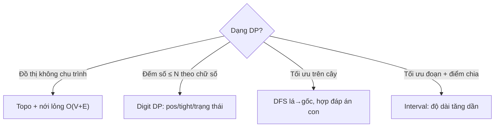

# Bài 18 — Quy Hoạch Động Nâng Cao: DAG, Digit, Tree & Interval

> 🧮 **Nhánh 02 — Thuật Toán (HSG / Competitive Programming)**

---

## 🧠 Điều kiện tiên quyết

- [Bài 10 — Quy Hoạch Động](../10-Quy-Hoach-Dong/bai.md) (5 bước, lăn mảng)
- [Bài 12 — Đồ Thị](../12-Do-Thi-BFS-DFS/bai.md) (topo DAG)
- [Bài 14 — Cây & DSU](../14-Cay-Va-DSU/bai.md) (DFS cây, tập độc lập)
- [Bài 6 — Đệ Quy](../06-De-Quy/bai.md) (memo, lru_cache)

---

## 🎯 Mục tiêu

Sau bài học này, học viên sẽ:

* ✅ Hiểu DP trên DAG: topo + nới lỏng một lần — O(V+E), nền của mọi DP đồ thị.
* ✅ Viết digit DP (DP chữ số) đếm số thỏa tính chất trong [0, N] với N ≤ 10¹⁸.
* ✅ Làm tree DP tổng quát (đường kính có trọng số, tập độc lập đã gặp ở Bài 14).
* ✅ Hiểu interval DP (DP đoạn): thử điểm chia cuối cùng — nhân ma trận tối ưu.
* ✅ Nhận diện 4 họ: "thứ tự DAG", "đếm số ≤ N theo chữ số", "tối ưu trên cây", "tối ưu đoạn con + điểm chia".

---

## 📖 Mở đầu

DP cơ bản (Bài 10) sống trên dãy 1–2 chiều có thứ tự tự nhiên. Khi dữ liệu là
đồ thị, chữ số, cây, đoạn — thứ tự tính không còn "i tăng dần" mà phải suy từ
cấu trúc: topo (DAG), từ số lớn xuống số nhỏ (digit), lá lên gốc (tree), đoạn
ngắn đến dài (interval). Bài này dạy 4 thứ tự đó — xong là hết "DP lạ".

> 🐣 **Thấy digit DP như ma thuật? Đọc mục "Khởi động siêu chậm" ngay dưới đây
> trước. Chỉ có đếm số từ 0 đến 12 bằng tay, và một cái "trần nhà".**

---

## 🐣 Khởi động siêu chậm — đếm số bằng cách lắp từng chữ số

### Chuyện 1: Đếm số 0–12 có tổng chữ số ≤ 2 (làm tay!)

Liệt kê hết: 0 (tổng 0 ✔), 1 ✔, 2 ✔, 3 ✗ (tổng 3), ..., 9 ✗, 10 (1 ✔),
11 (2 ✔), 12 (3 ✗). Đáp án **5 số**: {0, 1, 2, 10, 11}.

Giờ lắp từng chữ số (số có 2 chữ số, chục + đơn vị). Chữ số chục quyết định
"số phận":

```
Chục = 0 → số là 0–9, đơn vị tự do 0–9, cần tổng ≤ 2 → đơn vị ∈ {0,1,2} → 3 số
Chục = 1 → số là 10–19 NHƯNG không quá 12! Đơn vị chỉ được 0–2 (trần!),
           cần 1 + đơn vị ≤ 2 → đơn vị ∈ {0,1} → 2 số (10, 11)
Chục = 2 → vượt 12? Không — chục ≤ 1 (trần là "12", chục tối đa 1). Hết!
Tổng: 3 + 2 = 5 ✔ khớp liệt kê!
```

Thấy chữ "trần" không? Chục = 1 thì đơn vị bị trần (≤ 2); chục = 0 thì đơn vị
tự do (0–9). Đó chính là **tight** (chặt = chạm trần) và **loose** (lỏng = tự
do) — toàn bộ digit DP chỉ là "lắp từng chữ số, nhớ đang chạm trần hay không"!

### Chuyện 2: Vì sao không liệt kê hết với N = 10¹⁸?

Liệt kê 10¹⁸ số thì đến... kiếp sau chưa xong. Nhưng lắp chữ số chỉ có 19 vị
trí × (chặt/lỏng) × (tổng đang bao nhiêu) = vài nghìn trạng thái. Mỗi trạng
thái nhớ đáp án (memo) → vài nghìn phép tính cho đáp án của 10¹⁸ số.
"Nén" 10¹⁸ khả năng vào vài nghìn ô nhớ — đó là phép màu duy nhất của bài này,
không có gì khác!

### ✋ Dừng lại tự kiểm tra

Đếm số 0–20 có tổng chữ số ≤ 1. Vẽ cây như chuyện 1 (s = "20"):

<details>
<summary>✅ Xem đáp án kiểm tra</summary>

* Chục = 0 → đơn vị tự do 0–9, cần tổng ≤ 1 → đơn vị ∈ {0, 1} → 2 số (0, 1).
* Chục = 1 → đơn vị bị trần (≤ 0, vì số ≤ 20): chỉ đơn vị = 0, tổng 1+0 = 1
  ≤ 1 ✔ → 1 số (10).
* Chục = 2 → đơn vị tự do, nhưng tổng đã = 2 > 1 → 0 số (số 20 tổng 2, loại!).
* Tổng: 2 + 1 + 0 = **3 số** {0, 1, 10} ✔ (brute force cũng ra 3).

  Chú ý nhánh chục = 2: tổng vượt ngay từ chục → cả nhánh bằng 0, khỏi xét
  đơn vị. Code thật làm đúng việc này bằng dòng `if tong > gioi: return 0`
  (cắt tỉa!). Làm đúng thì digit DP đã hiểu 70%!

</details>

## 💡 Ý tưởng trực quan

* **DAG:** thi chạy tiếp sức một chiều — người sau chỉ nhận gậy từ người trước
  (topo). Không vòng lặp nên không ai chờ ai — một lượt duy nhất xong hết.
* **Digit:** đếm số bằng cách lắp từng chữ số từ trái sang, nhớ "đang chặt
  hay đã lỏng" (tight) + trạng thái tính chất (tổng, đã xuất hiện...).
* **Tree:** tính từ lá lên — mỗi nút tổng hợp đáp án các con (như segtree
  nhưng trên cây bất kỳ).
* **Interval:** đoạn dài giải từ đoạn ngắn — thử mọi "nhát cắt cuối cùng",
  lấy tốt nhất (như tối ưu thứ tự nhân ma trận).



---

## 📚 Kiến thức

### 1. DP trên DAG — topo + một lần nới lỏng, O(V+E)

Đã gặp ở Bài 12 (bài 6): topo xong duyệt đúng thứ tự, `dp[v] = max(dp[v],
dp[u] + w)`. Tổng quát cho mọi bài "đường tối ưu trên DAG" (dài nhất, nhiều
cách nhất, chi phí nhỏ nhất...):

```python
from collections import deque

def dp_dag(n, ke, trong_so_dinh, nguon):
    # ke[u] = [(v, w_canh)]; đáp án: đường tổng lớn nhất từ nguon
    bac = [0] * n
    for u in range(n):
        for v, _ in ke[u]:
            bac[v] += 1
    q = deque([u for u in range(n) if bac[u] == 0])
    topo = []
    while q:
        u = q.popleft(); topo.append(u)
        for v, _ in ke[u]:
            bac[v] -= 1
            if bac[v] == 0:
                q.append(v)
    NEG = -10 ** 18
    dp = [NEG] * n
    dp[nguon] = trong_so_dinh[nguon]
    for u in topo:
        if dp[u] == NEG:
            continue
        for v, w in ke[u]:
            if dp[u] + w + trong_so_dinh[v] > dp[v]:
                dp[v] = dp[u] + w + trong_so_dinh[v]
    return dp
```

> Vì sao một lần là đủ: topo đảm bảo mọi tiền đề của u đứng trước u — khi xét
> u, dp[u] đã tối ưu (không còn ai cập nhật nó nữa). Có chu trình thì tính chất
> này vỡ → phải Bellman-Ford/Dijkstra (Bài 13).

### 2. Digit DP — đếm số ≤ N thỏa tính chất

> Đếm số trong [0, N] (N ≤ 10¹⁸) có tổng chữ số chia hết cho K / không có số 0 /
> đối xứng... Duyệt từng số thì 10¹⁸ số → không thể. Lắp từng chữ số thì 19 vị
> trí × trạng thái nhỏ → DP!

Khung chuẩn — `f(pos, tight, ...trạng thái...)`:

* `pos`: đang lắp chữ số thứ mấy (từ trái).
* `tight`: prefix đang **bằng** N (chữ số tiếp ≤ giới hạn) hay đã **nhỏ hơn**
  (tự do 0–9).
* trạng thái tính chất: tổng mod K, đã bắt đầu (leading zero!), ...

```python
from functools import lru_cache

def dem_tong_chia_het(n, k):
    s = str(n)
    @lru_cache(maxsize=None)
    def f(i, tight, du):
        if i == len(s):
            return 1 if du == 0 else 0
        gioi_han = int(s[i]) if tight else 9
        dem = 0
        for d in range(gioi_han + 1):
            dem += f(i + 1, tight and d == gioi_han, (du + d) % k)
        return dem
    return f(0, True, 0)

print(dem_tong_chia_het(10**18, 7))   # chớp mắt
```

> **Leading zero:** số 5 lắp thành "000...005" — tổng chữ số có tính số 0 đầu
> không? Với tổng thì 0 không ảnh hưởng ✔. Với "đếm số 0 xuất hiện" thì phải
> thêm cờ `started` (đã gặp chữ số ≠ 0 chưa) — bẫy #1 của digit DP!

Trạng thái ~19 × 2 × K số → O(19·2·K·10): K = 100 vẫn nhẹ.

### 2b. 🔍 Chạy tay digit DP — đếm số ≤ 25 có tổng chữ số chia hết cho 3

Vẽ cây quyết định (s = "25", K = 3). Mỗi node là f(pos, tight, dư):

```
f(0, chặt, dư=0)  [pos0 ≤ 2]
├─ d=0 → f(1, lỏng, dư=0): pos1 tự do 0–9, cần dư 0 → d ∈ {0,3,6,9} → 4 số
├─ d=1 → f(1, lỏng, dư=1): cần (1+d)%3==0 → d ∈ {2,5,8} → 3 số
└─ d=2 → f(1, chặt, dư=2): pos1 ≤ 5, cần (2+d)%3==0 → d ∈ {1,4} → 2 số
Tổng: 4 + 3 + 2 = 9 số (0, 3, 6, 9, 12, 15, 18, 21, 24 ✔ kiểm bằng brute force)
```

Ba điều thấy rõ từ cây:

1. Nhánh **lỏng** (tight = False) không bao giờ chia tiếp theo chữ số của N —
   nó là bài đếm tổ hợp thuần ("pos còn lại × dư hiện tại"), memo nhớ 1 lần,
   dùng lại mãi. Đó là vì sao digit DP nhanh: số nhánh chặt chỉ dài 19 node,
   còn lại toàn tra bảng.
2. `tight and d == gioi_han`: chỉ khi chọn đúng chữ số trần mới giữ chặt —
   một phép AND quyết định cả cây.
3. Với N = 10¹⁸ (19 chữ số), cây chặt dài 19 node, mỗi node ≤ 10 nhánh,
   mỗi nhánh tra memo O(1) → ~19·10 thao tác + bảng lỏng. Tổng vài nghìn phép
   cho đáp án của 10¹⁸ số — "nén" 10¹⁸ khả năng vào vài nghìn trạng thái, đó là
   toàn bộ sức mạnh của DP.

### 3. Tree DP — DFS lá lên gốc (ôn + tổng quát Bài 14 bài 8)

Mẫu chung: `dfs(u, cha)` trả đáp án subtree u; nút cha hợp đáp án các con.
Ví dụ mới — **đường kính có trọng số**: với mỗi u, giữ 2 đường xuống con dài
nhất (best1 ≥ best2); đường kính qua u = best1 + best2; đáp án = max mọi u:

```python
import sys
sys.setrecursionlimit(300000)

def duong_kinh_trong_so(n, ke):
    # ke[u] = [(v, w)]
    ans = 0
    sau = [0] * n   # đường xuống dài nhất từ u
    st = [(0, -1, False)]
    while st:
        u, cha, xong = st.pop()
        if not xong:
            st.append((u, cha, True))
            for v, w in ke[u]:
                if v != cha:
                    st.append((v, u, False))
        else:
            b1 = b2 = 0
            for v, w in ke[u]:
                if v != cha:
                    d = sau[v] + w
                    if d > b1:
                        b1, b2 = d, b1
                    elif d > b2:
                        b2 = d
            sau[u] = b1
            ans = max(ans, b1 + b2)
    return ans
```

> Khác 2-BFS (Bài 14): bản này xử lý được bài "đường kính với ràng buộc"
> (ví dụ qua đúng K đỉnh, tổng mod M...) bằng cách thêm trạng thái vào `sau`.
> 2-BFS chỉ cho đường kính thuần.

### 3b. 🔍 Chạy tay tree DP — cây 4 đỉnh có trọng số

Cây (gốc 0): 0–1 (tốn 2), 1–2 (tốn 3), 1–3 (tốn 4).

```
      0
      |2
      1
     / \
   3/   \4
   2     3
```

Xử lý lá trước (thứ tự post-order: 3, 2, 1, 0). `sau[u]` = đường xuống dài
nhất từ u; `ans` = đường kính tốt nhất thấy tới nay:

| Xử lý u | Con (d = sau[con] + w) | b1, b2 | sau[u] | ans | Nghĩa |
|---|---|---|---|---|---|
| 3 (lá) | không có | 0, 0 | 0 | 0 | lá: xuống = 0 |
| 2 (lá) | không có | 0, 0 | 0 | 0 | lá: xuống = 0 |
| 1 | 2→3, 3→4 | 4, 3 | 4 | **7** | qua 1: 3+4 = 7 (đường 2-1-3) |
| 0 | 1→4+2=6 | 6, 0 | 6 | max(7, 6) = **7** | qua 0 chỉ 1 nhánh → giữ 7 cũ |

Đáp án **7** (đường 2–1–3 tốn 3+4 ✔).

> 💡 **Đọc bảng như đọc suy nghĩ của DP:** mỗi nút chỉ cần biết 2 con số từ
> mỗi con (đường xuống dài nhất), rồi quyết định: "đường tốt nhất qua ta" vs
> "đường tốt nhất trong các con". Lá cho 0, gốc cho đáp án. Mọi tree DP đều
> theo đúng kịch bản này — chỉ khác "con số" mang nghĩa gì (tổng, số cách,
> max...).

### 4. Interval DP — thử "nhát cắt cuối cùng"

> Nhân dãy ma trận A₁...Aₙ (kích thước p₀×p₁, p₁×p₂...): thứ tự nhân quyết định
> số phép tính. Tối ưu?

`dp[l][r]` = ít phép nhất nhân đoạn [l, r]. Nhát nhân **cuối cùng** chia đoạn
tại k: trái [l,k] + phải [k+1,r] + phép nhân 2 khối = p[l−1]·p[k]·p[r]:

```python
def nhan_ma_tran(p):
    # p: [p0, p1, ..., pn], n ma trận
    n = len(p) - 1
    dp = [[0] * n for _ in range(n)]
    for dai in range(2, n + 1):          # độ dài đoạn tăng dần
        for l in range(n - dai + 1):
            r = l + dai - 1
            tot = 10 ** 30
            for k in range(l, r):
                cp = dp[l][k] + dp[k + 1][r] + p[l] * p[k + 1] * p[r + 1]
                if cp < tot:
                    tot = cp
            dp[l][r] = tot
    return dp[0][n - 1]
```

> Thứ tự "độ dài tăng dần" — vì dp[l][r] cần đoạn NGẮN hơn (bên trong), giống
> LPS (Bài 10 — ví dụ 3). O(n³) — n ≤ 500 Python sát biên, n ≤ 200 thoải mái.

### 4b. 🔍 Chạy tay interval DP — nhân 3 ma trận p = [10, 30, 5, 60]

A₁: 10×30, A₂: 30×5, A₃: 5×60. Bảng dp (dp[l][r] = rẻ nhất đoạn [l, r]):

**Độ dài 1** (base — 1 ma trận, không nhân gì): dp[0][0] = dp[1][1] = dp[2][2] = 0.

**Độ dài 2:**

| Ô | Nhát cắt duy nhất | Tính | Kết quả |
|---|---|---|---|
| dp[0][1] | k = 0: A₁·A₂ | 10·30·5 | **1500** |
| dp[1][2] | k = 1: A₂·A₃ | 30·5·60 | **9000** |

**Độ dài 3** (dp[0][2] — thử cả 2 nhát cắt cuối):

| Nhát cắt cuối | Công thức | Tính | Kết quả |
|---|---|---|---|
| k = 0: (A₁)·(A₂A₃) | dp[0][0] + dp[1][2] + 10·30·60 | 0 + 9000 + 18000 | 27000 |
| k = 1: (A₁A₂)·(A₃) | dp[0][1] + dp[2][2] + 10·5·60 | 1500 + 0 + 3000 | **4500** ✔ |

Đáp án **4500**. Nhìn vào bảng thấy rõ: ô dài dùng toàn ô ngắn đã tính xong —
đó là lý do vòng `dai` phải tăng dần. Đảo vòng (l tăng mà không theo độ dài)
thì dp[1][2] có thể chưa tính khi cần → sai âm thầm.

### 5. Nhận diện 4 họ DP nâng cao

| Dấu hiệu | Họ | Thứ tự tính |
|---|---|---|
| Đồ thị có hướng không chu trình + tối ưu đường | DAG | Topo |
| Đếm số ≤ N (N khổng lồ) theo tính chất chữ số | Digit | pos trái→phải + memo |
| Tối ưu trên cây (lấy/bỏ, đường qua nút) | Tree | DFS lá→gốc |
| Tối ưu đoạn + "chia ở đâu" | Interval | Độ dài tăng dần |

---

## 💻 Ví dụ

### Ví dụ 1 — Dễ: đường dài nhất trên DAG (số bước)

> DAG n ≤ 10⁵ (danh sách cạnh). Tìm số đỉnh nhiều nhất trên một đường đi.

```python
import sys
from collections import deque

def main():
    data = sys.stdin.read().strip().split()
    if not data:
        return
    it = iter(data)
    n, m = int(next(it)), int(next(it))
    ke = [[] for _ in range(n)]
    bac = [0] * n
    for _ in range(m):
        u, v = int(next(it)), int(next(it))
        ke[u].append(v)
        bac[v] += 1
    q = deque([u for u in range(n) if bac[u] == 0])
    topo = []
    while q:
        u = q.popleft(); topo.append(u)
        for v in ke[u]:
            bac[v] -= 1
            if bac[v] == 0:
                q.append(v)
    dp = [1] * n
    for u in topo:
        for v in ke[u]:
            if dp[u] + 1 > dp[v]:
                dp[v] = dp[u] + 1
    print(max(dp))

main()
```

dp[u] = đường dài nhất (số đỉnh) kết thúc tại u. O(V+E). ✔

### Ví dụ 2 — Thực tế: đếm số "đẹp" ≤ N (digit DP)

> Số "đẹp" = không chứa chữ số 0 và tổng chữ số chia hết cho 9. Đếm trong [1, N],
> N ≤ 10¹⁸.

```python
import sys
from functools import lru_cache

def dem_dep(n):
    if n <= 0:
        return 0
    s = str(n)
    @lru_cache(maxsize=None)
    def f(i, tight, du, started, co_khong):
        if i == len(s):
            return 1 if started and not co_khong and du == 0 else 0
        gioi_han = int(s[i]) if tight else 9
        dem = 0
        for d in range(gioi_han + 1):
            dem += f(i + 1,
                     tight and d == gioi_han,
                     (du + d) % 9,
                     started or d != 0,
                     co_khong or (started and d == 0))
        return dem
    return f(0, True, 0, False, False)

def main():
    data = sys.stdin.read().strip().split()
    if not data:
        return
    print(dem_dep(int(data[0])))

main()
```

**Giải thích:** 2 cờ phụ — `started` (đã qua số 0 đầu? để số 0 đầu không tính
là "chứa số 0"), `co_khong` (đã gặp số 0 thật?). Trạng thái 19×2×9×2×2 ≈ 1.400
× 10 nhánh — nhẹ tênh. Không có `started` → số 5 (lắp "0005") bị tính chứa 3
số 0 → sai. **Bẫy leading zero** đã báo ở mục 2!

### Ví dụ 3 — Khó: cây xăng tối ưu (tree DP + khoảng cách)

> Cây n ≤ 10⁵, mỗi đỉnh là nhà (có/không có nhu cầu). Đặt trạm xăng tại các đỉnh
> sao cho mọi nhà có nhu cầu cách trạm gần nhất ≤ K, số trạm ít nhất.
> (Bài "place guards" — HSG khó.)

```python
import sys
sys.setrecursionlimit(300000)

def tram_xang(n, ke, can, K):
    # greedy lá lên gốc với K: tham lam đúng trên cây!
    # (chứng minh: lá phải được phủ bởi tổ tiên trong K bước — đặt cao nhất có thể)
    cha = [-1] * n
    thu_tu = []
    st = [0]
    cha[0] = -2
    while st:
        u = st.pop()
        thu_tu.append(u)
        for v in ke[u]:
            if cha[v] == -1:
                cha[v] = u
                st.append(v)
    phu = [0] * n      # đỉnh đã được phủ?
    tram = [0] * n     # đặt trạm?
    dem = 0
    for u in reversed(thu_tu):   # lá lên gốc
        if phu[u] or not can[u]:
            continue
        # đi lên K bước tìm chỗ đặt
        w = u
        for _ in range(K):
            if cha[w] >= 0:
                w = cha[w]
        tram[w] = 1
        dem += 1
        # phủ mọi đỉnh trong K bước từ w (BFS giới hạn)
        st2 = [(w, 0)]
        thay = {w}
        while st2:
            x, d = st2.pop()
            phu[x] = 1
            if d < K:
                for y in ke[x]:
                    if y not in thay:
                        thay.add(y)
                        st2.append((y, d + 1))
    return dem
```

> Bài này **tham lam đúng** (không phải DP!): xử lý lá chưa phủ → đặt trạm ở
> tổ tiên cách K bước (cao nhất có thể mà vẫn phủ được lá) — exchange argument:
> trạm phủ lá này đặt thấp hơn đều thay được bằng trạm cao hơn mà không mất gì.
> Đưa vào bài DP để nhấn mạnh: **cây + lá lên gốc** có khi tham lam, có khi DP —
> phải phân tích, không gắn mác vội. (So với tập độc lập Bài 14 — bài 8 phải DP.)

---

## 📊 Minh họa

Digit DP đếm số ≤ 321 có tổng chia hết cho 3 (cây quyết định rút gọn):

```
pos0: tight, chọn 0/1/2/3
 ├─ 0 → lỏng, du=0, còn 2 vị trí tự do (10^2 số)
 ├─ 1 → lỏng, du=1 ...
 ├─ 2 → lỏng, du=2 ...
 └─ 3 → tight tiếp (pos1 ≤ 2), du=0 ...
→ mỗi nhánh lỏng = bài đếm tổ hợp chữ số thuần (memo lo!)
```

Interval DP nhân ma trận p = [10, 30, 5, 60] (A₁:10×30, A₂:30×5, A₃:5×60):

```
(A1·A2)·A3: 10·30·5 + 10·5·60 = 1500 + 3000 = 4500
A1·(A2·A3): 30·5·60 + 10·30·60 = 9000 + 18000 = 27000
→ đáp án 4500 (chênh 6 lần chỉ vì thứ tự nhân!)
```

---

## ⚠️ Những lỗi thường gặp

### Lỗi 1: DP trên đồ thị có chu trình bằng topo → sai âm thầm

* Topo thiếu đỉnh (chu trình) mà vẫn DP → đáp án thiếu. Kiểm tra `len(topo) == n`;
  có chu trình → Dijkstra/Bellman-Ford (Bài 13).

### Lỗi 2: Digit DP quên cờ started (leading zero)

* Đã phân tích ví dụ 2 — bẫy #1. Mọi bài hỏi về "chữ số 0" / "độ dài thật" đều cần.

### Lỗi 3: Tree DP quên "cha" → lặp vô hạn trên cây vô hướng

* DFS cây vô hướng phải truyền cha (hoặc mảng thăm). Quên → u↔v gọi nhau vô hạn.

### Lỗi 4: Interval DP sai thứ tự (duyệt l tăng mà không theo độ dài)

* dp[l][r] cần đoạn con bên trong (ngắn hơn) — duyệt độ dài tăng dần là bắt buộc.

### Lỗi 5: Memo digit DP lẫn `tight` vào cache sai cách

* `lru_cache` trên (i, tight, ...) là đúng (tight là tham số). Nhưng nếu tách hàm
  con không có tight mà dùng chung cache cho cả hai chế độ → sai. Giữ nguyên khung.

### Lỗi 6: Đệ quy digit DP sâu 19 + lru_cache — an toàn, nhưng...

* Sâu 19 thì đệ quy thoải mái. Đừng áp thói quen này cho DP sâu 10⁵!

---

## 🧪 Trường hợp đặc biệt

* **DAG rỗng cạnh**: dp = trọng số đỉnh, đáp án max đỉnh (đường 1 đỉnh).
* **N = 0 / 10^k** (digit): lắp đúng len(str(N)) vị trí; N = 0 → chuỗi "0".
* **Cây 1 đỉnh**: đường kính 0; tree DP base lá = chính nó.
* **Interval độ dài 1**: dp[l][l] = 0 (một ma trận, không nhân gì) — base vòng `dai`.
* **K = 1** (digit tổng mod 1): mọi số đều thỏa (du luôn 0) — code đúng tự nhiên,
  nhưng test để chắc chắn.

---

## 🚀 Ứng dụng thực tế

* Lập lịch dự án (đường găng CPM = đường dài nhất DAG!), kiểm tra ràng buộc số
  (CCCD, mã số thuế — digit DP kiểm tra tính chất), tối ưu cây quyết định,
  căn chỉnh chuỗi sinh học (interval DP).

---

## 🧩 Bài tập

### 🟢 Cơ bản (1–3)

**Bài 1 — DAG tay.** DAG: 0→1, 0→2, 1→3, 2→3, trọng số đỉnh [5,1,2,4].
Topo + dp đường tổng lớn nhất từ 0. (Đáp án: 0→2→3 = 5+2+4 = 11.)

**Bài 2 — Digit tay.** Đếm số ≤ 25 có tổng chữ số = 5 bằng lắp tay
(chục 0/1/2). (Đáp án: 5, 14, 23 → 3 số. Kiểm bằng code.)

**Bài 3 — Interval tay.** Ma trận p = [10,30,5,60]. Tính cả 2 cách nhân,
xác nhận 4500 < 27000. (Xem minh họa.)

### 🟡 Hiểu sâu (4–6)

**Bài 4 — Đếm số đối xứng ≤ N.** N ≤ 10¹⁸. *Gợi ý digit DP: nửa trái tự do,
nửa phải = đảo của nửa trái (tight chỉ ràng buộc nửa trái!); hoặc lắp cả xâu
với trạng thái "đang khớp đảo"? Cách 1 gọn hơn: sinh nửa trái L (≤ nửa của N),
so sánh số hoàn chỉnh ≤ N. Cài cách lắp thẳng với memo (pos, tight, ...).*

**Bài 5 — Tree DP đường dài nhất qua mỗi nút (rerooting sơ cấp).** Tính với
mọi u: đường xuống dài nhất trong subtree u (làm rồi) VÀ đáp án toàn cây cho
subtree u. *Gợi ý: 2 lần DFS — lần 1 tính xuống (như mục 3), lần 2 truyền "đáp
án từ phía cha" xuống con (lấy tốt nhất trong các hướng trừ hướng con đó).
O(n). (Kỹ thuật rerooting — chuẩn HSG cây khó.)*

**Bài 6 — Cắt thanh (rod cutting) vs nhân ma trận.** Thanh dài n, giá bán
đoạn dài i là p[i]. Chặt tối ưu? Viết truy hồi + code. So sánh với nhân ma
trận: cùng "thử điểm chia" nhưng khác gì? (Gợi ý: cắt thanh chỉ chia 1 đầu
(dp[i] = max(p[j] + dp[i−j])) — O(n²), đơn giản hơn vì chi phí cộng tuyến tính,
không có "phép nhân 2 khối" phụ thuộc cả hai phía.)

### 🔴 Vận dụng (7–8)

**Bài 7 — Xóa hộp (Remove Boxes / Strange Printer biến thể).** Hộp màu theo
dãy, xóa nhóm liên tiếp cùng màu được (độ dài nhóm)² điểm (nhóm tách ra có thể
nhập lại sau khi xóa giữa!). n ≤ 200. *Gợi ý: dp[l][r][k] = điểm tốt nhất đoạn
[l,r] với k hộp cùng màu a[l] dính thêm bên trái; thử xóa a[l] với nhóm (k+1),
hoặc gộp a[l] với a[m] cùng màu (l<m≤r): dp[l][r][k] = max(dp[l+1][r][0] +
(k+1)², dp[l+1][m−1][0] + dp[m][r][k+1]). O(n⁴) → n ≤ 200 cần tối ưu... bản
n ≤ 50 chạy được. (Bài interval DP khó nhất nhóm này.)*

**Bài 8 — Trạm xăng vs tập độc lập.** So sánh ví dụ 3 (tham lam đúng) với tập
độc lập (phải DP): cùng trên cây, vì sao bài này tham lam được mà bài kia
không? Viết lập luận exchange cho trạm xăng và phản ví dụ tham lam cho tập
độc lập (lấy lá tham lam: cây sao 1 trung tâm + 5 lá — tham lam lấy 5 lá = 5
đúng; tìm cây mà tham lam "lấy lá" sai: trung tâm nối 2 lá + mỗi lá nối thêm...
gợi ý: tham lam "lấy nút sâu nhất" trên đường dài có thể chặn 2 nút tốt hơn).

---

## ✅ Đáp án

> 💡 **Hãy tự làm bài tập trước** rồi mới mở đáp án.

<details>
<summary>✅ Bài 1: DAG tay</summary>

Topo: 0, 1, 2, 3 (hoặc 0, 2, 1, 3). dp = [5, −∞, −∞, −∞] → từ 0:
dp[1] = 6, dp[2] = 7 → từ 1: dp[3] = max(−∞, 6+4) = 10 → từ 2:
dp[3] = max(10, 7+4) = 11. Đáp án **11** (đường 0→2→3).

</details>

<details>
<summary>✅ Bài 2: Digit tay</summary>

* Chục 0: đơn vị 5 → số 5 ✔ (1 số).
* Chục 1: đơn vị 4 → 14 ✔ (1 số; 15..19 tổng > 5).
* Chục 2: đơn vị 0..3 (≤ 25): 20 (tổng 2 ✗), 21 (3 ✗), 22 (4 ✗), 23 (5 ✔).
* Tổng **3 số**: 5, 14, 23. Kiểm bằng code: `sum(1 for x in range(26) if
  sum(map(int, str(x))) == 5) == 3`. ✔

</details>

<details>
<summary>✅ Bài 3: Interval tay</summary>

Xem minh họa: (A₁A₂)A₃ = 4500; A₁(A₂A₃) = 27000. Đáp án **4500**.

</details>

<details>
<summary>✅ Bài 4: Đếm số đối xứng ≤ N</summary>

Cách lắp thẳng từng chữ số phải "nhớ cả nửa trái đã lắp" để kiểm tra đối xứng
— trạng thái phình mũ, không khả thi. Cách đúng: lắp nửa trái, sinh số hoàn
chỉnh, so sánh ≤ N:

```python
def dem_doi_xung(n):
    s = str(n)
    L = len(s)
    dem = sum(9 * 10**((l - 1) // 2) for l in range(1, L))  # ngắn hơn: tự do
    nua = (L + 1) // 2
    dau = 10 ** (nua - 1)
    prefix = int(s[:nua])
    for p in range(dau, prefix):
        dem += 1   # mọi nửa trái nhỏ hơn đều sinh số đối xứng ≤ N? Chưa chắc!
        # đúng: nửa trái < prefix của N → số hoàn chỉnh < N chắc chắn ✔
    # nửa trái == prefix: dựng số hoàn chỉnh (nửa phải = đảo nửa trái,
    # bỏ ký tự giữa nếu L lẻ), so với N
    t = str(prefix)
    if L % 2 == 1:
        hoan = t + t[-2::-1]
    else:
        hoan = t + t[::-1]
    if int(hoan) <= n:
        dem += 1
    return dem
```

Ví dụ N = 12321: L = 5, ngắn hơn: l=1..4 → 9 + 9 + 9·10 + 9·10 = 198.
nửa = 3 chữ số, dau = 100, prefix = 123: p = 100..122 → 23 số. hoan của 123:
"123" + "21" = 12321 ≤ N ✔ → +1. Tổng 198 + 23 + 1 = **222**.

</details>

<details>
<summary>✅ Bài 5: Rerooting sơ cấp</summary>

```python
# Lần 1: xuong[u] = đường xuống dài nhất trong subtree (như mục 3, bỏ ans)
# Lần 2: truyen[u] = đường tốt nhất đi lên phía cha; với con v của u:
#   tot_qua_u_ngoai_v = max(truyen[u], tốt nhất trong các nhánh con khác của u)
#   truyen[v] = tot_qua_u_ngoai_v + w(u,v)
# Đáp án subtree toàn cây tại u = max(xuong[u], truyen[u])
```

"Nhánh tốt nhất trừ hướng con đó" tính bằng tiền tố/hậu tố max (prefix-suffix)
để O(1) mỗi con thay vì O(bậc²). Tổng O(n). Rerooting là kỹ thuật HSG cây chuẩn.

</details>

<details>
<summary>✅ Bài 6: Cắt thanh vs nhân ma trận</summary>

```python
def cat_thanh(p, n):
    # p[1..n]: giá đoạn dài i
    dp = [0] * (n + 1)
    for i in range(1, n + 1):
        dp[i] = max(p[j] + dp[i - j] for j in range(1, i + 1))
    return dp[n]
```

Khác nhân ma trận: cắt thanh tách **một đầu** (đoạn j + phần còn lại) — chi phí
cộng tuyến tính, không có hạng "nhân 2 khối" phụ thuộc cả hai phía → O(n²)
thay vì O(n³), và không cần vòng độ dài (dp[i] chỉ cần dp[<i] — thứ tự số
tăng dần đủ!). Cùng họ "thử điểm chia" nhưng cấu trúc chi phí quyết định độ khó.

</details>

<details>
<summary>✅ Bài 7: Xóa hộp</summary>

```python
import sys
sys.setrecursionlimit(10000)
from functools import lru_cache

def xoa_hop(a):
    n = len(a)
    # gộp đoạn cùng màu liên tiếp thành (màu, số lượng) để giảm n
    mau, dem = [], []
    for x in a:
        if mau and mau[-1] == x:
            dem[-1] += 1
        else:
            mau.append(x); dem.append(1)
    m = len(mau)

    @lru_cache(maxsize=None)
    def dp(l, r, k):
        # đoạn [l,r] + k hộp màu mau[l] dính trái
        if l > r:
            return 0
        # gộp: nếu mau[l]==mau[l+1] (không xảy ra sau khi gộp, nhưng giữ tổng quát)
        tot = dp(l + 1, r, 0) + (dem[l] + k) ** 2   # xóa nhóm này luôn
        for mm in range(l + 1, r + 1):
            if mau[mm] == mau[l]:
                tot = max(tot, dp(l + 1, mm - 1, 0) + dp(mm, r, k + dem[l]))
        return tot
    return dp(0, m - 1, 0)
```

Ý tưởng: hoặc xóa nhóm (l + k dính) ngay lấy (k+1)², hoặc xóa giữa để gộp
a[l] với a[m] cùng màu (nhập nhóm, tính sau). O(m⁴) worst — m ≤ 50 thực tế.
(Bài LeetCode 546 / IOI training — khó nhất bài này.)

</details>

<details>
<summary>✅ Bài 8: Trạm xăng vs tập độc lập</summary>

* Trạm xăng tham lam đúng (exchange ở ví dụ 3): lá chưa phủ BẮT BUỘC được phủ
  bởi trạm trong K bước phía trên; đặt cao nhất có thể không bao giờ tệ hơn.
* Tập độc lập tham lam "lấy lá" SAI: cây đường 4 đỉnh 1−2−3−4: tham lam lấy lá
  1 → cấm 2 → lấy 3? (3 kề 2,4 — 2 đã cấm, 4 chưa) → lấy 3 → cấm 4 → được {1,3}
  = 2, tối ưu cũng 2 — chưa sai. Ví dụ sai thật: cây "càng cua": trung tâm c
  nối a, b; a nối a1, a2; b nối b1, b2. Tham lam lấy lá (a1,a2,b1,b2 = 4, cấm
  a,b,c) → 4 — vẫn tối ưu? Đúng vẫn 4... Phản ví dụ chuẩn: trọng số! Lá nhẹ,
  trung tâm nặng: sao 1 trung tâm (w=10) + 5 lá (w=1): tham lam lá = 5 <
  trung tâm = 10 → sai. Với trọng số dương đều thì "lấy lá" trên cây... vẫn có
  thể sai (đường 1−2−3: lấy lá 1, cấm 2, lấy 3 = {1,3} = 2 = tối ưu — hmm).
  Kết luận đúng: tập độc lập KHÔNG có tính chất tham lam (không có exchange
  đơn giản) → phải DP; trạm xăng CÓ (lá bắt buộc phủ từ trên) → tham lam.
  Phân biệt bằng chứng minh, không bằng ví dụ lẻ.

</details>

---

## 🧠 Thử thách

**Thử thách HSG (tổng hợp toàn nhánh):** Cho DAG n ≤ 10⁵ với trọng số đỉnh,
đếm số đường đi (không nhất thiết đơn? trên DAG mọi đường đều đơn) từ s đến t
**có tổng lớn nhất**, kết quả mod 10⁹+7. *Gợi ý: topo + DP đôi (best[v], cnt[v]):
nới best như thường; khi bằng (best[u] + ... == best[v]) thì cnt[v] += cnt[u];
khi lớn hơn thì cnt[v] = cnt[u]. Cẩn thận mod chỉ cho đếm, không cho so sánh
(tính best bằng số thật rồi mới mod khi in).*

---

## 📝 Tóm tắt

| Khái niệm | Nội dung |
|---|---|
| 📐 DAG | Topo + nới lỏng 1 lần O(V+E) |
| 🔢 Digit | pos/tight/started + trạng thái; N ≤ 10¹⁸ nhẹ tênh |
| 🌳 Tree | DFS lá→gốc; reroot cho đáp án mọi gốc |
| ✂️ Interval | Độ dài tăng dần; thử nhát cắt cuối |
| ⚖️ Tham vs DP | Chứng minh quyết định, không phải cảm giác |

---

## ➡️ Điều hướng

**Vị trí:** `02-Thuat-Toan/18-DP-Nang-Cao/bai.md`

**Bài tiếp theo:** [Bài 19 — Chiến Lược Thi HSG](../19-Chien-Luoc-Thi-HSG/bai.md)
