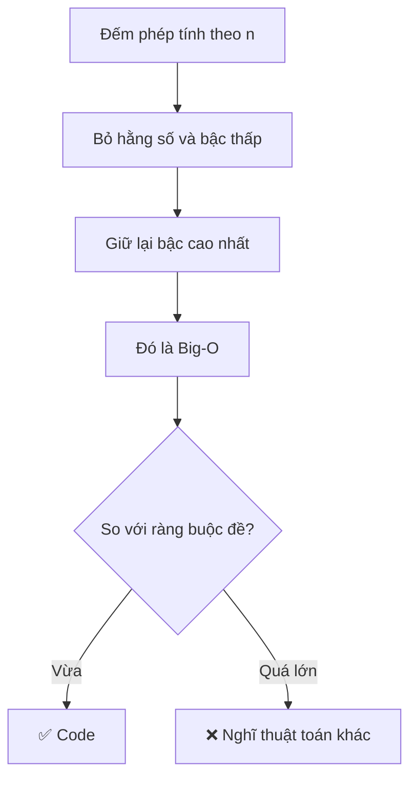
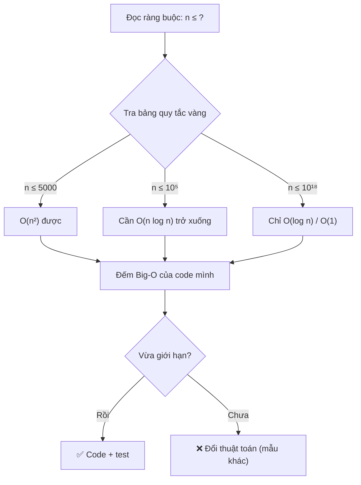

# Bài 24 — Độ Phức Tạp & Big-O

> 🧮 **Nhánh 02 — Thuật Toán (HSG / Competitive Programming)**

---

## 🧠 Điều kiện tiên quyết

- [Bài 23 — Tư Duy Thuật Toán](../23-Tu-Duy-Thuat-Toan/bai.md)
- [Bài 10 — Hàm (Function)](../10-Ham/bai.md)
- [Bài 8 — Vòng Lặp For](../08-Vong-Lap-For/bai.md)

---

## 🎯 Mục tiêu

Sau bài học này, học viên sẽ:

* ✅ Hiểu độ phức tạp là "đồng hồ đo" của thuật toán — đoán được code chạy nhanh hay chậm **trước khi bấm chạy**.
* ✅ Đọc và phân tích được Big-O của vòng lặp đơn, lồng nhau, và các hàm Python thường dùng.
* ✅ Áp dụng quy tắc vàng: với n ≤ 10⁵ và 1 giây, chỉ O(n log n) trở xuống mới sống sót.
* ✅ Biết độ phức tạp bộ nhớ và khi nào nó thành vấn đề.
* ✅ Tránh các "bẫy hiệu năng" trong Python: nối chuỗi trong vòng lặp, `in` trên list lớn, `list.insert(0, ...)`.

---

## 📖 Mở đầu

Bài trước bạn học cách *nghĩ ra* thuật toán. Bài này học cách *đánh giá*
thuật toán: hai cách giải cùng đúng, cách nào nhanh hơn — và nhanh hơn
**bao nhiêu** khi dữ liệu phình to gấp ngàn lần?

Câu trả lời nằm ở ký hiệu O-lớn (Big-O): ngôn ngữ chung của mọi kỳ thi
HSG, mọi vòng phỏng vấn thuật toán, mọi tài liệu giải thuật trên thế giới.

---

## 💡 Ý tưởng trực quan

Tưởng tượng bạn cần tìm một cái tên trong danh bạ:

* **Cách A (lật từng trang):** danh bạ dày gấp đôi → thời gian tìm **gấp đôi**.
* **Cách B (chia đôi mỗi lần — danh bạ đã xếp ABC):** danh bạ dày gấp đôi →
  thời gian tìm chỉ **thêm 1 bước** (chia thêm một lần).

Cách A "tăng theo" dữ liệu — O(n). Cách B "tăng rất chậm" — O(log n).
Big-O chính là cách nói chính xác cảm nhận "tăng theo / tăng rất chậm" đó.



---

## 📚 Kiến thức

### 1. Big-O là gì — định nghĩa đủ dùng cho thi cử

**Độ phức tạp thời gian** T(n) = số phép tính cơ bản khi input cỡ n.
**Big-O** giữ lại *dáng tăng trưởng*, bỏ hằng số và chi tiết máy:

| Viết | Đọc | Ví dụ |
|---|---|---|
| O(1) | Hằng số — nhanh như nhau với mọi n | `a[0]`, `d[k]`, `len(a)` |
| O(log n) | Logarit — n tăng gấp đôi, +1 bước | Tìm kiếm nhị phân |
| O(n) | Tuyến tính — n tăng gấp đôi, việc gấp đôi | Duyệt list một lần |
| O(n log n) | "n log n" — chuẩn của sắp xếp tốt | `sorted()`, merge sort |
| O(n²) | Bình phương — 2 vòng lặp lồng | Bubble sort, thử mọi cặp |
| O(2ⁿ) | Mũ — thử mọi tập con | Đệ quy sinh tập con naive |

> 💡 **Trực giác số học:** với n = 10⁵:
> n² = 10¹⁰ (hàng giờ), n log n ≈ 1.7×10⁶ (chớp mắt).
> Cùng n đó, O(n²) và O(n log n) khác nhau **hàng triệu lần**.

### 2. Cách đếm Big-O trong 30 giây

Ba quy tắc duy nhất bạn cần:

1. **Vòng lặp đơn chạy n lần → O(n).** Lồng k tầng → O(nᵏ).
2. **Nối tiếp thì lấy max:** O(n) rồi O(n²) → chung cuộc O(n²).
3. **Bỏ hằng số:** O(2n + 100) → O(n). O(n/2) → O(n).

```python
# O(n): một vòng lặp
for x in a:
    ...

# O(n²): hai vòng lồng
for i in range(n):
    for j in range(n):
        ...

# O(n²) chung cuộc: O(n) + O(n²) lấy max
for x in a:      # O(n)
    ...
for i in range(n):       # O(n²)
    for j in range(n):
        ...
```

### 3. Quy tắc vàng cho thi HSG (1 giây, Python)

Máy chấm thường cho Python ~1–2 giây, tốc độ ≈ 5×10⁷ phép tính đơn giản/giây.
Bảng tra cứu nhanh:

| n tối đa | Thuật toán sống sót |
|---|---|
| n ≤ 10 | O(n!), O(2ⁿ) được (thử mọi thứ) |
| n ≤ 20–25 | O(2ⁿ) được (sinh tập con, quay lui + cắt tỉa) |
| n ≤ 500 | O(n³) được (Floyd, DP 3 chiều nhỏ) |
| n ≤ 5.000 | O(n²) được (~2.5×10⁷ phép) |
| n ≤ 10⁵–10⁶ | O(n log n) trở xuống (sắp xếp + 1 lần duyệt) |
| n ≤ 10⁷–10⁸ | Chỉ O(n) với hằng số nhỏ |
| n ≤ 10¹⁸ | Chỉ O(log n) hoặc O(1) (công thức, nhị phân, lũy thừa nhanh) |

> ⚠️ **Lưu ý Python:** hằng số của Python lớn hơn C++ ~10–50 lần.
> O(n²) với n = 5.000 trong C++ qua được, trong Python có thể TLE —
> hãy để biên an toàn, ưu tiên O(n log n) sớm.

### 4. Độ phức tạp của các thao tác Python thường dùng

Học thuộc bảng này — nó quyết định code bạn nhanh hay chậm:

| Thao tác | Độ phức tạp | Ghi chú |
|---|---|---|
| `a[i]`, `a[i] = v` | O(1) | Truy cập trực tiếp |
| `a.append(v)` | O(1)* | *trung bình (thỉnh thoảng cấp phát lại) |
| `a.pop()` (cuối) | O(1) | |
| `a.pop(0)`, `a.insert(0, v)` | **O(n)** | Phải dời cả dãy! Dùng `deque` thay thế |
| `x in a` (list) | **O(n)** | Quét tuyến tính — bẫy phổ biến nhất |
| `x in s` (set/dict) | O(1)* | Băm — trung bình |
| `a + b` (nối list) | O(n+m) | Tạo list mới |
| `s += t` (nối chuỗi trong vòng lặp) | **O(n²)** tổng | Chuỗi bất biến → mỗi lần nối chép lại; dùng `"".join()` |
| `sorted(a)` | O(n log n) | Timsort |
| `a.sort()` | O(n log n) | Sắp xếp tại chỗ, nhanh hơn `sorted` một chút |
| `sum / min / max / len` | O(n) / O(1) | `len` là O(1) (lưu sẵn độ dài) |

### 5. Độ phức tạp bộ nhớ

Quy tắc tương tự, đếm *bộ nhớ phụ* theo n:

* Biến đơn, vài con trỏ → O(1).
* List/dict cỡ n → O(n).
* Bảng DP n×m → O(n·m) — với n, m ≤ 5.000 là 25×10⁶ số ≈ 200MB → có thể MLE
  (vượt bộ nhớ)! Khi đó phải tối ưu "lăn mảng" (chỉ giữ 2 hàng) xuống O(m).

Giới hạn bộ nhớ thi HSG thường 256–1024 MB. Python mỗi số nguyên tốn ~28 byte
(đối tượng!), nên list 10⁶ số ≈ 30–40MB — vẫn ổn, nhưng ma trận 10⁴×10⁴ thì không.

### 6. Trường hợp tốt / trung bình / xấu

* **Xấu nhất (worst case):** điều giám khảo quan tâm — code phải qua được
  test khó nhất.
* Ví dụ: tìm kiếm tuyến tính O(n) xấu nhất (không thấy), O(1) tốt nhất
  (thấy ngay đầu). Khi phân tích, **luôn lấy xấu nhất**.

---

## 🔤 Cú pháp phân tích (mẫu ghi trong vở)

```
Thuật toán: <tên>
- Vòng ngoài: ... lần
- Vòng trong: ... lần mỗi vòng ngoài
- Công việc trong cùng: O(...)
→ Tổng: O(...)
- Bộ nhớ phụ: O(...)
- Với n ≤ ...: ✅ sống / ❌ chết (vì ... phép > giới hạn)
```

---

## 💻 Ví dụ

### Ví dụ 1 — Dễ: đếm Big-O của 3 đoạn code

```python
# (a) O(n)
tong = 0
for x in a:
    tong += x

# (b) O(n²): n = 5000 → 25 triệu phép → Python "thở oxy", C++ vẫn qua
dem = 0
for i in range(n):
    for j in range(i + 1, n):
        if a[i] == a[j]:
            dem += 1

# (c) O(n): hai vòng NỐI TIẾP lấy max(O(n), O(n)) = O(n)
for x in a:
    print(x)
for x in a:
    print(x * 2)
```

**Phân tích từng bước (b):** vòng ngoài n lần; vòng trong trung bình n/2 lần;
công việc trong cùng O(1) → n × n/2 = n²/2 → bỏ hằng số 1/2 → **O(n²)**.

### Ví dụ 2 — Thực tế: bẫy `in` trên list

> Đề: "Cho n ≤ 10⁵ tên đã bầu và m ≤ 10⁵ tên cần kiểm tra, mỗi tên kiểm tra
> in ra YES/NO."

**Cách sai (nhìn đúng, chạy chết):**

```python
# ❌ O(n × m) = 10^10 → TLE
for ten in can_kiem_tra:
    print("YES" if ten in da_bau else "NO")  # `in` trên list: O(n) mỗi lần!
```

**Cách đúng:**

```python
# ✅ O(n + m): đưa vào set một lần, tra cứu O(1) mỗi lần
import sys

def main():
    data = sys.stdin.read().strip().split()
    if not data:
        return
    n = int(data[0])
    da_bau = set(data[1:1 + n])
    m = int(data[1 + n])
    kiem_tra = data[2 + n:2 + n + m]
    ra = ["YES" if ten in da_bau else "NO" for ten in kiem_tra]
    sys.stdout.write("\n".join(ra))

main()
```

**Giải thích:**

* `set(data[...])` — xây set O(n) một lần duy nhất.
* `ten in da_bau` trên set là O(1) trung bình → tổng O(n + m) ≈ 2×10⁵. ✔
* Gom output vào list rồi `"\n".join` + **một** lần `write` — nhanh hơn
  `print` trong vòng lặp hàng chục lần với output lớn (bẫy I/O!).

### Ví dụ 3 — Khó: nối chuỗi trong vòng lặp (bẫy O(n²) ẩn)

```python
# ❌ Nhìn O(n) nhưng thật O(n²): mỗi lần += chép lại cả chuỗi
s = ""
for i in range(n):
    s += str(i)   # lần thứ k chép k ký tự → tổng 1+2+...+n

# ✅ O(n): gom vào list rồi join một lần
parts = []
for i in range(n):
    parts.append(str(i))
s = "".join(parts)
```

**Phân tích từng bước:** lần lặp thứ k, chuỗi dài ~k ký tự, phép `+=` chép
lại k ký tự → tổng 1+2+...+n = n(n+1)/2 → **O(n²)**. Với n = 10⁵: 10¹⁰ ký tự
được chép → treo máy. Cách `join` mỗi phần tử xử lý đúng 1 lần → O(n).

> 💡 Cùng logic áp dụng cho **output lớn**: không `print` trong vòng lặp
> 10⁵ lần — gom vào list, `join`, in một lần (như ví dụ 2).

---

## 📊 Minh họa

So sánh tốc độ tăng (n = 1.000 → 100.000, gấp 100 lần):

```
O(1):       █  →  █            (không đổi)
O(log n):   █  →  █▌           (+~7 bước)
O(n):       █  →  ██████████... (gấp 100 lần)
O(n log n): █  →  ██████████... (gấp ~170 lần)
O(n²):      █  →  ██████████... (gấp 10.000 lần — ra ngoài màn hình!)
O(2ⁿ):      █  →  ☠️            (n = 100 đã là 10³⁰)
```



---

## ⚠️ Những lỗi thường gặp

### Lỗi 1: Nhầm "chạy nhanh với ví dụ nhỏ" là "thuật toán nhanh"

* Code O(n²) với n = 100 chạy trong 0.001s — tưởng ổn, nộp bài n = 10⁵ → TLE.
* **Cách sửa:** không đo bằng cảm giác — đếm Big-O rồi tra bảng ràng buộc.

### Lỗi 2: `x in list_lớn` trong vòng lặp — bẫy #1 của Python

```python
# ❌ O(n·m)
ket_qua = [x for x in a if x not in b]   # b là list 10^5 phần tử!

# ✅ O(n+m): đổi b thành set TRƯỚC vòng lặp
s = set(b)
ket_qua = [x for x in a if x not in s]
```

### Lỗi 3: `pop(0)` / `insert(0, ...)` trong vòng lặp

```python
# ❌ O(n²): mỗi pop(0) dời cả dãy
while q:
    x = q.pop(0)

# ✅ O(n): deque.popleft() là O(1)
from collections import deque
q = deque(q)
while q:
    x = q.popleft()
```

### Lỗi 4: Quên chi phí của hàm "tiện tay"

`sorted(a)` trong vòng lặp n lần → O(n² log n) chứ không phải O(n²)!
`max(a)` mỗi vòng lặp → thêm một O(n) ẩn. Luôn hỏi: "hàm này tốn bao nhiêu?"

### Lỗi 5: Tính Big-O theo trường hợp tốt nhất

"Trung bình nó chạy nhanh mà!" — giám khảo chấm trường hợp xấu nhất.
Phân tích luôn lấy worst case.

---

## 🧪 Trường hợp đặc biệt

* **`append` là O(1) "trung bình"**: thỉnh thoảng list hết chỗ, Python cấp
  phát vùng lớn hơn và chép lại (O(n) cho lần đó) — nhưng tổng n lần append
  vẫn O(n) (phân tích khấu hao). Trong thi cử cứ coi là O(1).
* **Set/dict xấu nhất O(n)** (va chạm băm) nhưng thực tế luôn O(1) —
  trừ khi ai đó cố tình tấn công (không gặp trong HSG).
* **Đệ quy**: cộng thêm O(độ sâu) bộ nhớ cho ngăn xếp gọi; Python giới hạn
  ~1000 frame → đệ quy sâu hơn crash (`RecursionError`) — xem Bài 28.
* **Hằng số vẫn quan trọng khi cùng Big-O**: hai thuật toán O(n), cái ít phép
  tính hơn thắng. Trong Python: list comprehension nhanh hơn vòng lặp +
  append ~2 lần; `sum(a)` (viết bằng C) nhanh hơn vòng lặp Python ~5–10 lần.

---

## 🚀 Ứng dụng thực tế

* **Chọn cấu trúc dữ liệu**: cần tra cứu nhanh → set/dict; cần FIFO → deque;
  cần min/max liên tục → heap. Mỗi lựa chọn đúng là một lần tránh TLE.
* **Review code thực tế**: "vòng lặp này có `in` trên list không?",
  "có nối chuỗi trong loop không?" — cùng câu hỏi như khi thi.

---

## 🧩 Bài tập

### 🟢 Cơ bản (1–3)

**Bài 1 — Đếm nhanh.** Cho Big-O của từng đoạn (giải thích 1 dòng):
a) `for i in range(n): print(i)`
b) `for i in range(n): for j in range(n): print(i, j)`
c) `for i in range(n): print(i)` rồi `for j in range(n): for k in range(n): print(j, k)`
d) `x = a[n // 2]`

**Bài 2 — Tra bảng.** Với giới hạn 1 giây (Python), thuật toán nào sống sót?
a) O(n²), n = 2.000
b) O(n²), n = 50.000
c) O(n log n), n = 10⁶
d) O(2ⁿ), n = 30

**Bài 3 — Sửa bẫy.** Đoạn code đếm số chung của hai list (mỗi list 10⁵ phần tử)
dùng `if x in b` (b là list) → TLE. Viết lại để AC, nêu Big-O trước/sau.

### 🟡 Hiểu sâu (4–6)

**Bài 4 — Chi phí ẩn.** Tính Big-O của:
```python
for i in range(n):
    a.append(sorted(b)[0])   # b dài n
```
Giải thích vì sao "nhìn O(n) mà thật O(n² log n)".

**Bài 5 — Bộ nhớ.** Thuật toán tạo ma trận `dp[n][n]` số nguyên (n = 5.000).
Ước tính bộ nhớ (Python) và kết luận có MLE không (giới hạn 256MB).
*Gợi ý: mỗi int Python ~28 byte + overhead list.*

**Bài 6 — So sánh thực nghiệm.** Viết script đo thời gian `s += str(i)` vs
`"".join(...)` với n = 20.000. Ghi nhận tỉ số tốc độ và giải thích.

### 🔴 Vận dụng (7–8)

**Bài 7 — Chọn thuật toán.** Đề: n ≤ 10⁵, đếm cặp (i < j) có `a[i] == a[j]`.
Cách A: 2 vòng lặp O(n²). Cách B: `Counter` + công thức tổ hợp O(n).
Tính số phép tính mỗi cách, kết luận cách nào AC và cài đặt cách đó.

**Bài 8 — Tối ưu I/O.** Chương trình đọc n ≤ 10⁶ số và in ra các số chẵn.
So sánh 2 phiên bản: (a) `input()` + `print` từng số; (b) `sys.stdin.read` +
gom output + một lần `write`. Đo thời gian, giải thích vì sao (b) nhanh hơn
hàng chục lần. *Gợi ý: mỗi lần gọi print/input tốn syscall + flush.*
### ➕ Bài tập bổ sung (Bài 9–12)

**Bài 9 — Tốt nhất vs xấu nhất.** Hàm tìm phần tử đầu tiên > 0 trong list.
Phân tích Big-O trường hợp tốt nhất, xấu nhất. Khi phân tích để nộp bài thì
lấy trường hợp nào? Vì sao? Cho ví dụ dãy khiến mỗi trường hợp xảy ra.

**Bài 10 — Đếm bước Euclid.** Thuật toán Euclid tìm GCD lặp lại phép `%`.
Đếm số vòng lặp với (1071, 462) và với cặp Fibonacci liên tiếp (6765, 10946).
Giải thích vì sao cặp Fibonacci là trường hợp xấu nhất (số giảm chậm nhất).

**Bài 11 — Thực nghiệm tra cứu.** n = 10⁵ tên trong list, m = 10⁴ tên cần tra.
Đo thời gian 2 cách: (a) `x in list`, (b) đổi sang `set` rồi tra. Tính tỉ số,
đối chiếu với lý thuyết O(n·m) vs O(n+m).

**Bài 12 — Khi nào segment tree thắng.** n, q ≤ 10⁵ truy vấn "tổng đoạn [l, r]"
**kèm cập nhật điểm**. So sánh 3 cách: quét O(n)/truy vấn, tiền tố O(1) hỏi +
O(n) cập nhật, segment tree O(log n) cả hai. Tính tổng phép tính khi nửa số
truy vấn là cập nhật, kết luận và giải thích.

---

## ✅ Đáp án

> 💡 **Hãy tự làm bài tập trước** rồi mới mở đáp án.

<details>
<summary>✅ Bài 1: Đếm nhanh</summary>

a) O(n) — một vòng n lần.
b) O(n²) — hai vòng lồng.
c) O(n²) — nối tiếp lấy max(O(n), O(n²)) = O(n²).
d) O(1) — truy cập trực tiếp theo chỉ số.

</details>

<details>
<summary>✅ Bài 2: Tra bảng</summary>

a) O(n²), n = 2.000 → 4×10⁶ phép ≈ 0.1s → ✅ sống.
b) O(n²), n = 50.000 → 2.5×10⁹ phép ≈ 50s → ❌ TLE.
c) O(n log n), n = 10⁶ → ~2×10⁷ phép ≈ 0.5s → ✅ sống (sát biên, code phải gọn).
d) O(2ⁿ), n = 30 → ~10⁹ phép ≈ 20s → ❌ TLE (2ⁿ chỉ sống với n ≤ ~22 trong Python).

</details>

<details>
<summary>✅ Bài 3: Sửa bẫy</summary>

Trước: mỗi `x in b` quét list O(n) → tổng O(n·m) = 10¹⁰ → TLE.

```python
# Sau: O(n + m)
s = set(b)
chung = [x for x in a if x in s]
```

Xây set O(m) một lần + n lần tra O(1) → ~2×10⁵ thao tác → AC.

</details>

<details>
<summary>✅ Bài 4: Chi phí ẩn</summary>

Vòng lặp n lần, mỗi lần `sorted(b)` tốn O(n log n) → tổng **O(n² log n)**.
Quy tắc: Big-O của hàm gọi trong vòng lặp phải **nhân** với số lần lặp,
không được bỏ qua. Sửa: `m = min(b)` tính **một lần** ngoài vòng lặp
(O(n)), vòng lặp còn O(n) → tổng O(n).

</details>

<details>
<summary>✅ Bài 5: Bộ nhớ</summary>

Ma trận 5.000×5.000 = 25×10⁶ số × ~28 byte ≈ **700MB** (chưa kể overhead của
25.000 list con) → vượt xa 256MB → **MLE chắc chắn**. Sửa: nếu DP chỉ cần hàng
trước (mẫu rất phổ biến), "lăn mảng" giữ 2 hàng → O(m) ≈ 5.000 số ≈ vài trăm KB.

</details>

<details>
<summary>✅ Bài 6: So sánh thực nghiệm</summary>

```python
import time

n = 20000
t0 = time.perf_counter()
s = ""
for i in range(n):
    s += str(i)
t1 = time.perf_counter()

t2 = time.perf_counter()
s2 = "".join(str(i) for i in range(n))
t3 = time.perf_counter()

print(f"Cong chuoi: {t1 - t0:.3f}s")
print(f"Join:       {t3 - t2:.3f}s")
assert s == s2
```

Kết quả điển hình: cộng chuỗi ~0.05–0.2s, join ~0.005s — join nhanh hơn
**10–50 lần** ở n = 20.000, và khoảng cách tăng theo n (O(n²) vs O(n)).

</details>

<details>
<summary>✅ Bài 7: Chọn thuật toán</summary>

* Cách A: ~n²/2 ≈ 5×10⁹ phép → hàng trăm giây → TLE.
* Cách B: một lần duyệt đếm (O(n)) + công thức → ~10⁵ phép → AC.

```python
import sys
from collections import Counter

def main():
    data = sys.stdin.read().strip().split()
    if not data:
        return
    n = int(data[0])
    a = list(map(int, data[1:1 + n]))
    dem = Counter(a)
    ans = sum(c * (c - 1) // 2 for c in dem.values())
    print(ans)

main()
```

Mỗi giá trị xuất hiện c lần → đóng góp C(c,2) cặp. Tổng qua mọi giá trị
là đáp án — O(n) thời gian, O(số giá trị phân biệt) bộ nhớ.

</details>

<details>
<summary>✅ Bài 8: Tối ưu I/O</summary>

```python
import sys, time

data = sys.stdin.read().strip().split()
n = int(data[0]) if data else 0
a = list(map(int, data[1:1 + n]))

# (b) nhanh
t0 = time.perf_counter()
chan = [str(x) for x in a if x % 2 == 0]
sys.stdout.write("\n".join(chan))
t1 = time.perf_counter()
print(f"\n(b): {t1 - t0:.3f}s", file=sys.stderr)
```

Vì sao (b) nhanh hơn hàng chục lần: `print` mỗi lần gọi tốn syscall ghi +
xử lý flush/encoding; `input()` cũng vậy. Gom lại: **1 syscall** cho toàn bộ
output. Với n = 10⁶, (a) có thể TLE chỉ vì I/O dù thuật toán đã O(n) —
bài học: **thuật toán nhanh + I/O chậm = vẫn TLE**.

</details>

<details>
<summary>✅ Bài 9: Tốt nhất vs xấu nhất</summary>

```python
def tim_duong_dau(a):
    for x in a:
        if x > 0:
            return x
    return None
```

* Tốt nhất O(1): phần tử đầu đã > 0 (ví dụ `[5, -1, -2]`) — 1 phép so sánh.
* Xấu nhất O(n): không có số dương (ví dụ `[-3, -1]`) — duyệt hết.
* Nộp bài lấy **xấu nhất** O(n): giám khảo chấm test khó nhất, không chấm may mắn.

</details>

<details>
<summary>✅ Bài 10: Đếm bước Euclid</summary>

```python
def dem_euclid(a, b):
    dem = 0
    while b:
        a, b = b, a % b
        dem += 1
    return dem

assert dem_euclid(1071, 462) == 3
assert dem_euclid(6765, 10946) == 20
```

(1071, 462): 1071 % 462 = 147 → 462 % 147 = 21 → 147 % 21 = 0 → **3 bước**.
Cặp Fibonacci liên tiếp (6765, 10946) cần **20 bước** — vì mỗi lần `%` chỉ bớt
đi một số Fibonacci (thương luôn = 1), số giảm chậm nhất có thể. Đây chính là
trường hợp xấu nhất của Euclid: O(log min(a, b)) với hằng số lớn nhất khi là
2 số Fibonacci liên tiếp.

</details>

<details>
<summary>✅ Bài 11: Thực nghiệm tra cứu</summary>

```python
import random, time

n, m = 100000, 10000
ds = [f"ten{i}" for i in range(n)]
hoi = [f"ten{random.randint(0, n - 1)}" for _ in range(m)]

t0 = time.perf_counter()
kq1 = [x in ds for x in hoi]
t1 = time.perf_counter()

s = set(ds)
kq2 = [x in s for x in hoi]
t2 = time.perf_counter()
assert kq1 == kq2
print(f"List: {t1 - t0:.2f}s, Set: {t2 - t1:.4f}s")
```

Điển hình: list ~10–30s (10⁵ × 10⁴ quét), set ~0.01s — nhanh hơn **hàng nghìn
lần**, khớp lý thuyết O(n·m) = 10⁹ vs O(n+m) ≈ 10⁵.

</details>

<details>
<summary>✅ Bài 12: Khi nào segment tree thắng</summary>

Giả sử q/2 truy vấn hỏi + q/2 cập nhật, q = 10⁵:

* Quét: 10⁵ × 10⁵ = **10¹⁰** → chết.
* Tiền tố: hỏi O(1) nhưng mỗi cập nhật xây lại O(n) → 5×10⁴ × 10⁵ = **5×10⁹** → chết.
* Segment tree: 10⁵ × log(10⁵) ≈ 10⁵ × 17 = **1.7×10⁶** → sống khỏe.

Kết luận: **có cập nhật xen kẽ thì tiền tố thua**, segment tree/Fenwick
(Bài 37) thắng. Không cập nhật thì tiền tố đơn giản nhất — chọn công cụ theo
đề, không học vẹt "cái nào xịn hơn".

</details>

---

## 🧠 Thử thách

**Thử thách HSG:** Chứng minh (bằng thực nghiệm + lập luận) rằng `sorted(a)`
nhanh hơn `a.sort()` copy-then-sort trong trường hợp nào và chậm hơn trong
trường hợp nào? Đo với n = 10⁶ và giải thích chênh lệch hằng số (không phải
Big-O — cả hai đều O(n log n)).

---

## 📝 Tóm tắt

| Khái niệm | Nội dung |
|---|---|
| ⏱️ Big-O | Dáng tăng trưởng khi n lớn; bỏ hằng số |
| 📏 Quy tắc vàng | n ≤ 10⁵/1s → chỉ O(n log n) trở xuống |
| 🪤 Bẫy Python | `in` trên list, nối chuỗi trong loop, `pop(0)`, `print` trong loop lớn |
| 💾 Bộ nhớ | List/dict cỡ n → O(n); ma trận lớn → lăn mảng |
| 📥📤 I/O | Đọc một lần + ghi một lần cho dữ liệu lớn |

---

## ➡️ Điều hướng

**Vị trí:** `02-Thuat-Toan/24-Do-Phuc-Tap/bai.md`

**Bài tiếp theo:** [Bài 25 — Tìm Kiếm Tuyến Tính & Nhị Phân](../25-Tim-Kiem/bai.md)
