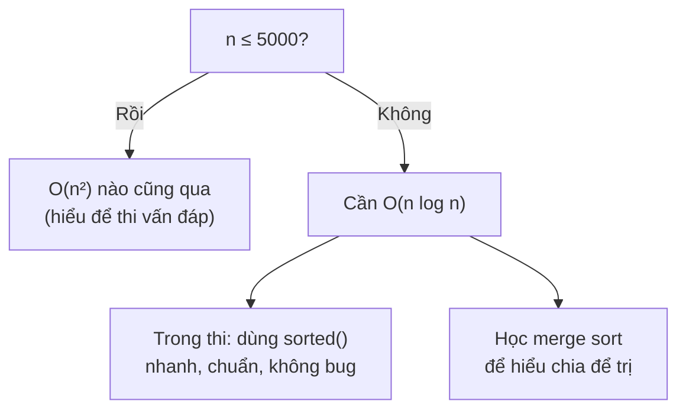
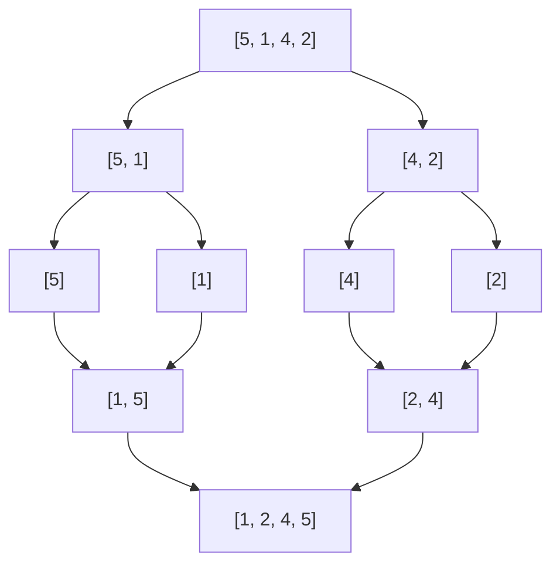

# Bài 26 — Sắp Xếp

> 🧮 **Nhánh 02 — Thuật Toán (HSG / Competitive Programming)**

---

## 🧠 Điều kiện tiên quyết

- [Bài 25 — Tìm Kiếm](../25-Tim-Kiem/bai.md)
- [Bài 24 — Độ Phức Tạp](../24-Do-Phuc-Tap/bai.md)
- [Bài 8 — Vòng Lặp For](../08-Vong-Lap-For/bai.md)
- [Bài 12 — List](../12-List/bai.md)

---

## 🎯 Mục tiêu

Sau bài học này, học viên sẽ:

* ✅ Cài được 3 thuật toán sắp xếp cơ bản (nổi bọt, chọn, chèn) và hiểu vì sao chúng đều O(n²).
* ✅ Hiểu tư tưởng chia để trị qua merge sort O(n log n).
* ✅ Dùng thành thạo `sorted()` / `.sort()` với `key` (sắp xếp theo tiêu chí phức tạp).
* ✅ Biết tính ổn định (stability) và khi nào nó quan trọng.
* ✅ Hiểu quy tắc thi thật: **hiểu thuật toán, dùng hàm có sẵn** — không bao giờ tự cài sắp xếp O(n²) để nộp bài.

---

## 📖 Mở đầu

Sắp xếp là "cửa ngõ" của gần nửa số bài HSG: dãy đã sắp xếp thì tìm kiếm
nhị phân được (Bài 25), hiệu nhỏ nhất nằm ở cặp kề nhau (Bài 25 — bài 8),
tham lam thường đòi sắp xếp trước (Bài 31)... Nắm sắp xếp = nắm tiền đề
của cả nhánh Thuật toán.

---

## 💡 Ý tưởng trực quan

* **Nổi bọt (bubble):** bọt khí trong nước — bọt to nổi lên mặt trước. Mỗi lượt
  duyệt, "bọt" lớn nhất nổi về cuối. Lặp đến khi hết bọt.
* **Chọn (selection):** chọn học sinh cao nhất xếp cuối hàng, rồi cao nhất
  trong số còn lại... mỗi lượt "chốt" một vị trí.
* **Chèn (insertion):** xếp bài trên tay — rút lá mới, chèn vào đúng chỗ trong
  dãy đã xếp. Tay trái luôn gọn gàng.
* **Trộn (merge):** chia lớp thành từng cặp, mỗi cặp tự xếp; rồi trộn các nhóm
  đã xếp thành nhóm lớn hơn — "chia để trị".



---

## 📚 Kiến thức

### 1. Ba thuật toán O(n²) — học để hiểu, không để nộp

**a) Nổi bọt (Bubble sort):** so sánh từng cặp kề nhau, sai thứ tự thì đổi.
Sau lượt i, phần tử lớn thứ i đã "nổi" về cuối.

```python
def bubble_sort(a):
    n = len(a)
    for i in range(n):
        doi = False
        for j in range(n - 1 - i):
            if a[j] > a[j + 1]:
                a[j], a[j + 1] = a[j + 1], a[j]
                doi = True
        if not doi:      # một lượt không đổi gì → đã xong, dừng sớm
            break
    return a
```

Cờ `doi` là tối ưu "dừng sớm": dãy đã sắp xếp chỉ cần **1 lượt** O(n).

**b) Chọn (Selection sort):** mỗi lượt tìm min trong phần chưa xếp, đổi về đầu.

```python
def selection_sort(a):
    n = len(a)
    for i in range(n):
        m = i
        for j in range(i + 1, n):
            if a[j] < a[m]:
                m = j
        a[i], a[m] = a[m], a[i]
    return a
```

Luôn đúng n(n−1)/2 so sánh — không có "dừng sớm", ngay cả dãy đã xếp.

**c) Chèn (Insertion sort):** mỗi lượt chèn a[i] vào đúng chỗ trong đoạn
đầu đã xếp (dời các phần tử lớn hơn sang phải).

```python
def insertion_sort(a):
    for i in range(1, len(a)):
        key = a[i]
        j = i - 1
        while j >= 0 and a[j] > key:
            a[j + 1] = a[j]
            j -= 1
        a[j + 1] = key
    return a
```

Nhanh nhất trong 3 anh em với dãy **gần như đã xếp** (mỗi phần tử dời ít bước).

So sánh:

| Thuật toán | Thời gian TB/xấu | Tốt nhất | Đổi chỗ | Ổn định |
|---|---|---|---|---|
| Nổi bọt (+dừng sớm) | O(n²) | O(n) | Nhiều | Có |
| Chọn | O(n²) | O(n²) | Ít (n lần) | Không |
| Chèn | O(n²) | O(n) | Vừa | Có |

### 2. Merge sort — chia để trị O(n log n)

**Tư tưởng:** muốn xếp dãy lớn → xếp hai nửa (đệ quy) → **trộn** hai nửa đã
xếp trong O(n). Độ sâu đệ quy log n tầng, mỗi tầng trộn hết O(n) →
tổng O(n log n). (Đệ quy học kỹ ở Bài 28; ở đây hiểu ý tưởng là đủ.)

```python
def merge_sort(a):
    if len(a) <= 1:
        return a
    mid = len(a) // 2
    trai = merge_sort(a[:mid])
    phai = merge_sort(a[mid:])
    return tron(trai, phai)

def tron(x, y):
    kq, i, j = [], 0, 0
    while i < len(x) and j < len(y):
        if x[i] <= y[j]:
            kq.append(x[i]); i += 1
        else:
            kq.append(y[j]); j += 1
    return kq + x[i:] + y[j:]
```

Cái giá của O(n log n): bộ nhớ phụ O(n) (tạo list mới khi trộn).

### 3. `sorted()` và `.sort()` — vũ khí thi thật

Python dùng **Timsort** (lai merge + insertion, O(n log n), ổn định):

```python
a = [3, 1, 2]
sorted(a)          # [1, 2, 3] — TRẢ list mới, a không đổi
a.sort()           # sắp TẠI CHỖ, nhanh hơn một chút, a đổi luôn
sorted(a, reverse=True)   # giảm dần
```

**Sắp xếp theo tiêu chí (`key`)** — kỹ năng HSG dùng hằng ngày:

```python
hs = [("An", 8.5), ("Binh", 9.0), ("Chi", 8.5)]

# Điểm giảm dần, tên tăng dần (xử lý hòa)
xep = sorted(hs, key=lambda s: (-s[1], s[0]))
# [('Binh', 9.0), ('An', 8.5), ('Chi', 8.5)]

# Sắp xếp chuỗi số theo "giá trị ghép lớn nhất" (bài kinh điển)
so = ["9", "34", "30", "5"]
lon_nhat = sorted(so, key=lambda s: s * 10, reverse=True)
# mẹo: key=s*10 so sánh lặp chuỗi để mô phỏng ghép
```

> 💡 **Mẹo `-s[1]`:** muốn số giảm dần mà `reverse=True` sẽ đảo luôn tiêu chí
> phụ → dùng số âm cho tiêu chí số, giữ `reverse=False`. Mẹo nhỏ, dùng hoài.

### 4. Tính ổn định (stability) — khi nào quan trọng?

Sắp xếp **ổn định** giữ nguyên thứ tự ban đầu của các phần tử **bằng nhau**.
Python `sorted` ổn định — nhờ đó sắp xếp nhiều tiêu chí bằng nhiều lần sort
ngược thứ tự ưu tiên:

```python
# Muốn: điểm giảm dần, ai điểm bằng nhau thì tên A→Z
# Cách 1 (một lần sort): key=(-diem, ten)
# Cách 2 (hai lần sort, nhờ ổn định): sort tên trước, rồi sort điểm giảm dần
ds = sorted(ds, key=lambda s: s[0])            # tên A→Z
ds = sorted(ds, key=lambda s: -s[1])           # điểm giảm; hòa → giữ thứ tự tên
```

Selection sort **không** ổn định (đổi chỗ nhảy cóc) — một lý do nữa để không
dùng nó khi thứ tự phần tử bằng nhau có ý nghĩa.

---

## 💻 Ví dụ

### Ví dụ 1 — Dễ: sắp xếp điểm thi

```python
import sys

def main():
    data = sys.stdin.read().strip().split()
    if not data:
        return
    n = int(data[0])
    a = list(map(int, data[1:1 + n]))
    a.sort()
    print(" ".join(map(str, a)))

main()
```

Input `5\n3 1 4 1 5` → `1 1 3 4 5`. O(n log n). Xong — thi thật chỉ cần thế này.

### Ví dụ 2 — Thực tế: top-k học sinh (sắp xếp + cắt lát)

> Đề: "n ≤ 10⁵ học sinh (tên, điểm). In tên của 3 bạn điểm cao nhất;
> điểm bằng nhau thì tên A→Z trước; vẫn hòa thì ai cũng được."

```python
import sys

def main():
    data = sys.stdin.read().strip().split()
    if not data:
        return
    n = int(data[0])
    hs = [(data[i], float(data[i + 1])) for i in range(1, 2 * n, 2)]
    hs.sort(key=lambda s: (-s[1], s[0]))
    for ten, diem in hs[:3]:
        print(ten)

main()
```

**Giải thích:**

* `key=lambda s: (-s[1], s[0])` — tuple key: so sánh điểm trước (âm = giảm
  dần), hòa điểm so tên. Một dòng giải quyết "đa tiêu chí".
* `hs[:3]` — cắt top-3 sau khi xếp (O(1)). Không cần heap khi k cố định nhỏ
  và n vừa phải; với n khổng lồ + k nhỏ mới cần `heapq.nlargest`.

### Ví dụ 3 — Khó: đếm nghịch thế bằng merge sort

> Đề: "Cặp (i < j) mà a[i] > a[j] gọi là một nghịch thế. Đếm số nghịch thế
> (n ≤ 10⁵)." — Thử mọi cặp O(n²) → TLE. Trong lúc merge sort, mỗi khi lấy
> phần tử từ nửa phải trước, nó tạo nghịch thế với **toàn bộ** phần còn lại
> của nửa trái → đếm luôn, tổng O(n log n).

```python
import sys
sys.setrecursionlimit(300000)

def merge_dem(a):
    if len(a) <= 1:
        return a, 0
    mid = len(a) // 2
    trai, d1 = merge_dem(a[:mid])
    phai, d2 = merge_dem(a[mid:])
    kq, i, j, d = [], 0, 0, d1 + d2
    while i < len(trai) and j < len(phai):
        if trai[i] <= phai[j]:
            kq.append(trai[i]); i += 1
        else:
            kq.append(phai[j]); j += 1
            d += len(trai) - i   # phai[j] nhỏ hơn TẤT CẢ trai[i:]
    return kq + trai[i:] + phai[j:], d

def main():
    data = sys.stdin.read().strip().split()
    if not data:
        return
    n = int(data[0])
    a = list(map(int, data[1:1 + n]))
    _, ans = merge_dem(a)
    print(ans)

main()
```

**Chạy tay** `[3, 1, 2]`: chia `[3]` và `[1, 2]`; trộn: 1 < 3 → lấy 1,
`d += 1` (cặp (3,1)); 2 < 3 → lấy 2, `d += 1` (cặp (3,2)); còn 3 → đáp án **2**. ✔

---

## 📊 Minh họa

Bubble sort với `[5, 1, 4, 2]`:

```
Lượt 1: [5,1,4,2] → [1,5,4,2] → [1,4,5,2] → [1,4,2,5]  (5 nổi về cuối)
Lượt 2: [1,4,2,5] → [1,4,2,5] → [1,2,4,5]              (4 về chỗ)
Lượt 3: [1,2,4,5] → không đổi gì → DỪNG (cờ doi)
```

Merge sort với `[5, 1, 4, 2]`:



---

## ⚠️ Những lỗi thường gặp

### Lỗi 1: Tự cài bubble sort để nộp bài với n = 10⁵

* **Nguyên nhân:** "em hiểu bubble nhất nên dùng".
* **Cách sửa:** hiểu để thi vấn đáp; nộp bài luôn dùng `sorted()`.

### Lỗi 2: `a.sort()` rồi dùng `a` cũ — hoặc ngược lại

```python
b = a.sort()   # ❌ sort() trả None! b = None
b = sorted(a)  # ✅ b là list mới đã xếp
```

### Lỗi 3: `reverse=True` phá tiêu chí phụ

```python
# ❌ Muốn điểm giảm, tên tăng — reverse đảo CẢ HAI
sorted(hs, key=lambda s: (s[1], s[0]), reverse=True)
# ✅ Số âm cho tiêu chí giảm dần
sorted(hs, key=lambda s: (-s[1], s[0]))
```

### Lỗi 4: So sánh chuỗi số như số

`sorted(["9", "34", "5"])` → `['34', '5', '9']` (so theo ký tự!).
Muốn theo giá trị: `key=int` hoặc đổi sang int trước.

### Lỗi 5: Đệ quy merge sort vượt giới hạn với n lớn

Python mặc định ~1000 frame; merge sort sâu log₂n (~17 với 10⁵) nên **an
toàn**, nhưng ví dụ 3 vẫn đặt `setrecursionlimit` phòng hờ. (Quick sort tự
cài kiểu xấu nhất O(n) sâu mới nguy hiểm — lý do nữa để dùng `sorted`.)

---

## 🧪 Trường hợp đặc biệt

* **Dãy rỗng / 1 phần tử**: mọi thuật toán trên đều đúng ngay (vòng lặp không
  chạy / `len <= 1` return).
* **Đã sắp xếp**: bubble + cờ dừng → O(n); insertion → O(n); selection vẫn O(n²).
* **Sắp ngược**: xấu nhất của bubble/insertion O(n²) "đậm đặc".
* **Phần tử trùng nhiều**: merge sort và Timsort xử lý tốt; quick sort tự cài
  kiểu naive có thể suy biến — thêm một lý do dùng hàm có sẵn.

---

## 🚀 Ứng dụng thực tế

* Mọi bảng xếp hạng, trang kết quả tìm kiếm, báo cáo "top bán chạy"...
* `ORDER BY` trong SQL chính là sắp xếp + ổn định nhiều tiêu chí.

---

## 🧩 Bài tập

### 🟢 Cơ bản (1–3)

**Bài 1 — Chạy tay.** Sắp xếp `[4, 2, 5, 1, 3]` bằng insertion sort, ghi dãy sau
mỗi lượt chèn (i = 1..4).

**Bài 2 — Đếm so sánh.** Selection sort với n = 100 thực hiện bao nhiêu phép
so sánh? Bubble sort có cờ dừng, dãy đã xếp cần bao nhiêu lượt?

**Bài 3 — Key đa tiêu chí.** Danh sách `(tên, toán, văn)`. Sắp xếp tổng điểm
giảm dần; hòa thì toán cao hơn trước; vẫn hòa thì tên A→Z. Viết đúng một dòng
`key`.

### 🟡 Hiểu sâu (4–6)

**Bài 4 — Ổn định.** Dãy `[(B, 1), (A, 1), (C, 0)]` (tên, nhóm). Dùng selection
sort sắp theo nhóm tăng dần, ghi kết quả. So với `sorted` ổn định — khác nhau
ở đâu? Vì sao?

**Bài 5 — Top-k.** n ≤ 10⁶ điểm thi, in 10 điểm cao nhất (kèm số lần xuất hiện).
So sánh 2 cách: `sorted` toàn bộ rồi cắt vs `heapq.nlargest(10, ...)`.
Khi nào cách 2 thắng?

**Bài 6 — Ghép số lớn nhất.** Cho các chuỗi số (n ≤ 100), sắp xếp để khi ghép
lại thành số lớn nhất có thể (ví dụ `["9","34","30","5"]` → `"953430"`).
*Gợi ý: so sánh x+y vs y+x — quan hệ này không phải thứ tự số học thông thường;
dùng `functools.cmp_to_key`.*

### 🔴 Vận dụng (7–8)

**Bài 7 — Khoảng cách kề nhỏ nhất (ôn Bài 3).** Chứng minh lại: sau khi sắp xếp,
hiệu nhỏ nhất luôn ở cặp kề nhau. Cài đặt O(n log n) hoàn chỉnh.

**Bài 8 — Đếm nghịch thế (ôn ví dụ 3).** Dãy `[2, 3, 8, 6, 1]` có bao nhiêu
nghịch thế? Chạy tay merge_dem, ghi `d` sau mỗi lần lấy từ nửa phải.
(Đáp án: 5 — các cặp (2,1), (3,1), (8,6), (8,1), (6,1).)
### ➕ Bài tập bổ sung (Bài 9–12)

**Bài 9 — Sắp xếp chuỗi 2 tiêu chí.** Cho list tên, sắp xếp theo độ dài tăng
dần, cùng độ dài thì A→Z. Code bằng `key` tuple + test (kể cả chuỗi rỗng và
hoa/thường lẫn lộn — có phân biệt hoa thường không? Vì sao?).

**Bài 10 — Sắp xếp ổn định 2 lượt.** Điểm thi (tên, điểm). Muốn điểm giảm dần,
hòa điểm thì tên A→Z. Làm bằng 2 lần `sorted` (nhờ tính ổn định, ôn Bài 4 đáp
án) rồi so với 1 lần `key` tuple. Khi nào 2 lượt hữu ích hơn?

**Bài 11 — Counting sort.** n ≤ 10⁶ số nguyên trong [0, 100]. Sắp xếp O(n) bằng
đếm tần suất (không dùng `sorted`). So sánh thời gian với `sorted` và giải thích
khi nào counting sort thắng/thua (gợi ý: miền giá trị to thì sao?).

**Bài 12 — Sắp xếp phân số không float.** Cho list phân số (tử, mẫu) dương.
Sắp xếp tăng dần mà **không** đổi sang float (sai số!). Dùng `cmp_to_key` so
chéo `a*d` vs `c*b`. Test với [(1,2),(1,3),(2,3),(3,4)].

---

## ✅ Đáp án

> 💡 **Hãy tự làm bài tập trước** rồi mới mở đáp án.

<details>
<summary>✅ Bài 1: Chạy tay insertion</summary>

| Lượt (i) | key | Dãy sau lượt |
|---|---|---|
| đầu | — | [4, 2, 5, 1, 3] |
| 1 | 2 | [2, 4, 5, 1, 3] |
| 2 | 5 | [2, 4, 5, 1, 3] (đúng chỗ) |
| 3 | 1 | [1, 2, 4, 5, 3] |
| 4 | 3 | [1, 2, 3, 4, 5] |

</details>

<details>
<summary>✅ Bài 2: Đếm so sánh</summary>

* Selection n = 100: 99 + 98 + ... + 1 = **4.950** so sánh (luôn đúng con số này).
* Bubble + cờ dừng, dãy đã xếp: lượt 1 không đổi gì → **dừng sau 1 lượt**,
  n − 1 = 99 so sánh → O(n).

</details>

<details>
<summary>✅ Bài 3: Key đa tiêu chí</summary>

```python
ds.sort(key=lambda s: (-(s[1] + s[2]), -s[1], s[0]))
```

Tuple key so sánh lần lượt: tổng giảm → toán giảm → tên tăng.

</details>

<details>
<summary>✅ Bài 4: Ổn định</summary>

Selection sort: lượt 1 tìm min là (C, 0) ở cuối, đổi với (B, 1) đầu →
`[(C,0), (A,1), (B,1)]`. Kết quả đúng thứ tự nhóm, nhưng trong nhóm 1,
**B đứng trước A** — đảo so với ban đầu (A trước B).

`sorted` ổn định cho `[(C,0), (A,1), (B,1)]` — A vẫn trước B. Khác nhau vì
selection đổi chỗ "nhảy cóc" qua nhiều vị trí, phá thứ tự tương đối của phần
tử bằng nhau.

</details>

<details>
<summary>✅ Bài 5: Top-k</summary>

* `sorted` hết: O(n log n) ≈ 2×10⁷ phép với n = 10⁶ — vẫn AC thoải mái.
* `heapq.nlargest(10, a)`: O(n log 10) ≈ O(n) — nhanh hơn ~10–20 lần, ít RAM hơn.
* Cách 2 thắng khi n rất lớn và k rất nhỏ. Với n = 10⁵ và k = 10, chênh lệch
  không đáng kể — chọn cách nào đọc hiểu dễ hơn.

</details>

<details>
<summary>✅ Bài 6: Ghép số lớn nhất</summary>

```python
from functools import cmp_to_key

def sosanh(x, y):
    if x + y > y + x:
        return -1   # x đứng trước y
    elif x + y < y + x:
        return 1
    return 0

so = ["9", "34", "30", "5"]
kq = sorted(so, key=cmp_to_key(sosanh))
print("".join(kq))   # 953430
```

Vì sao: "9" vs "34" — ghép "934" > "349" nên 9 đứng trước. Tiêu chí so sánh
là **thứ tự ghép**, không phải giá trị số — `key` thường không biểu diễn được,
phải dùng `cmp_to_key`. Trường hợp biên: toàn số 0 → kết quả "000..." —
nên rút gọn thành "0".

</details>

<details>
<summary>✅ Bài 7: Khoảng cách kề nhỏ nhất</summary>

Xem đáp án Bài 8 — Bài 25 (đã chứng minh + cài đặt). Ý tưởng chứng minh:
với i < k < j trong dãy đã xếp, a[j] − a[i] = (a[j] − a[k]) + (a[k] − a[i])
≥ a[j] − a[k] và ≥ a[k] − a[i] — nên hiệu của cặp không kề không bao giờ nhỏ
hơn hiệu kề nhỏ nhất.

</details>

<details>
<summary>✅ Bài 8: Đếm nghịch thế</summary>

Chia `[2, 3, 8, 6, 1]` → `[2, 3]` và `[8, 6, 1]` (đệ quy tiếp). Giả sử hai nửa
đã xếp + đếm xong: trái `[2, 3]` (d=0), phải `[1, 6, 8]` (d=2 từ các cặp
(8,6)? — thực tế đệ quy: `[8]` vs `[6,1]`→`[1,6]` d=1 ((6,1)); trộn 8 với
[1,6]: lấy 1 (d+=1: (8,1)), lấy 6 (d+=1: (8,6)), lấy 8 → d=3).

Trộn cuối `[2,3]` vs `[1,6,8]`: lấy 1 (d += 2: (2,1), (3,1)); lấy 2, 3; lấy
6, 8 → tổng d = 3 + 2 = **5**. ✔

</details>

<details>
<summary>✅ Bài 9: Sắp xếp chuỗi 2 tiêu chí</summary>

```python
ten = ["An", "binh", "Chi", "A", "Duc", ""]
xep = sorted(ten, key=lambda s: (len(s), s))
print(xep)   # ['', 'A', 'An', 'Chi', 'Duc', 'binh']
```

* `(len(s), s)`: so độ dài trước, hòa thì so chuỗi.
* `"binh"` (thường b) đứng sau `"Duc"` vì Python so theo mã Unicode:
  chữ hoa (65–90) < chữ thường (97–122)! Muốn không phân biệt:
  `key=lambda s: (len(s), s.lower())`.

</details>

<details>
<summary>✅ Bài 10: Sắp xếp ổn định 2 lượt</summary>

```python
hs = [("An", 8.5), ("Binh", 9.0), ("Chi", 8.5)]
b1 = sorted(hs, key=lambda s: s[0])    # tên A->Z trước
b2 = sorted(b1, key=lambda s: -s[1])   # điểm giảm; hòa giữ thứ tự tên (ổn định!)
assert b2 == [("Binh", 9.0), ("An", 8.5), ("Chi", 8.5)]
```

2 lượt hữu ích khi tiêu chí phức tạp khó gói 1 tuple (ví dụ cần hàm so sánh
riêng từng lượt), hoặc khi tái dùng kết quả trung gian. Còn không, 1 lần
`key` tuple gọn hơn.

</details>

<details>
<summary>✅ Bài 11: Counting sort</summary>

```python
def counting_sort(a, k=100):
    dem = [0] * (k + 1)
    for x in a:
        dem[x] += 1
    ra = []
    for v in range(k + 1):
        ra.extend([v] * dem[v])
    return ra
```

O(n + k) thời gian, O(k) nhớ. Thắng `sorted` khi k nhỏ (k = 100, n = 10⁶:
~10⁶ phép vs ~2×10⁷). Thua thảm khi k lớn (k = 10⁹ → mảng đếm 10⁹ ô → MLE!)
hoặc phần tử không phải số nguyên nhỏ. Quy tắc: **miền hẹp → đếm, miền rộng
→ so sánh**.

</details>

<details>
<summary>✅ Bài 12: Sắp xếp phân số không float</summary>

```python
from functools import cmp_to_key

def sap_phan_so(ps):
    def cmp(x, y):   # x=(a,b), y=(c,d): so a/b với c/d qua a*d ? c*b
        trai, phai = x[0] * y[1], y[0] * x[1]
        return -1 if trai < phai else (1 if trai > phai else 0)
    return sorted(ps, key=cmp_to_key(cmp))

assert sap_phan_so([(1, 2), (1, 3), (2, 3), (3, 4)]) == [(1, 3), (1, 2), (2, 3), (3, 4)]
```

Vì sao không float: 1/3 = 0.3333333333333333 (mất chính xác ở chữ số ~16),
so sánh 2 phân số gần nhau có thể đảo ngược. So chéo số nguyên thì chính xác
tuyệt đối (Python int vô hạn).

</details>

---

## 🧠 Thử thách

**Thử thách HSG:** Sắp xếp dãy n ≤ 10⁵ số nguyên **chỉ dùng O(1) bộ nhớ phụ**
(không tạo list mới, không dùng `sorted` vì nó tạo list mới) và vẫn O(n log n)
trung bình — cài **heap sort** tại chỗ. *Gợi ý: xây max-heap trong O(n) bằng
sift-down từ n//2 về 0, rồi lặp lấy gốc đổi về cuối + sift-down lại.*

---

## 📝 Tóm tắt

| Khái niệm | Nội dung |
|---|---|
| 🫧 Bubble/Chọn/Chèn | O(n²) — hiểu để vấn đáp, không nộp bài |
| ✂️ Merge sort | Chia để trị O(n log n), nhớ phụ O(n) |
| 🐍 `sorted` / `.sort` | Timsort O(n log n) ổn định — vũ khí thi thật |
| 🔑 key | Tuple key + số âm cho đa tiêu chí |
| ⚖️ Ổn định | sorted ổn định; selection không |

---

## ➡️ Điều hướng

**Vị trí:** `02-Thuat-Toan/26-Sap-Xep/bai.md`

**Bài tiếp theo:** [Bài 27 — Stack, Queue & Hashing](../27-Stack-Queue-Hashing/bai.md)
