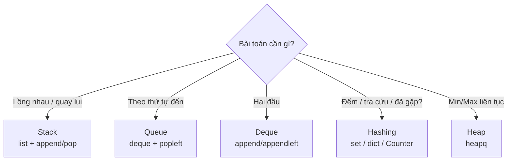

# Bài 27 — Stack, Queue & Hashing

> 🧮 **Nhánh 02 — Thuật Toán (HSG / Competitive Programming)**

---

## 🧠 Điều kiện tiên quyết

- [Bài 24 — Độ Phức Tạp](../24-Do-Phuc-Tap/bai.md)
- [Bài 12 — List](../12-List/bai.md)
- [Bài 15 — Dictionary](../15-Dictionary/bai.md)

---

## 🎯 Mục tiêu

Sau bài học này, học viên sẽ:

* ✅ Hiểu stack (LIFO) và queue (FIFO) — không phải định nghĩa, mà là "khi nào bài toán cần nó".
* ✅ Dùng `list` làm stack, `deque` làm queue đúng chuẩn hiệu năng.
* ✅ Hiểu hashing: vì sao tra cứu dict/set là O(1), và khi nào dùng đếm tần suất.
* ✅ Giải được 3 mẫu kinh điển: ngoặc hợp lệ (stack), cửa sổ trượt min/max (deque), đếm tần suất (Counter).
* ✅ Biết `heapq` cho bài "luôn cần min/max" mà sắp xếp lại mỗi lần thì quá chậm.

---

## 📖 Mở đầu

Ba cấu trúc trong bài này là "đồ nghề" xuất hiện trong **mọi** kỳ thi:

* Dấu ngoặc lồng nhau? → stack.
* Xếp hàng, lan truyền theo lớp? → queue.
* Đếm, tra cứu, "đã gặp chưa"? → hashing (set/dict).

Học xong bài này, bạn sẽ thấy chúng "hiện hình" trong đề bài mà trước đây
trông hoàn toàn xa lạ.

---

## 💡 Ý tưởng trực quan

* **Stack (ngăn xếp):** chồng bát — úp bát mới lên trên cùng, lấy cũng lấy từ
  trên cùng. Vào sau ra trước (**LIFO**). Tác vụ: kiểm tra ngoặc, "quay lui",
  undo.
* **Queue (hàng đợi):** xếp hàng mua vé — đến trước phục vụ trước (**FIFO**).
  Tác vụ: xử lý theo thứ tự đến, lan truyền từng lớp (BFS).
* **Deque:** hàng đợi hai đầu — chen/lấy cả hai đầu O(1). "Siêu hàng đợi".
* **Hashing:** tủ đồ có đánh số thông minh — bỏ đồ vào ô tính từ tên đồ, lấy
  ra cũng tính từ tên → không cần tìm, **tính là ra** (O(1)).



---

## 📚 Kiến thức

### 1. Stack — list trong Python đã là stack chuẩn

`append()` đẩy vào đỉnh, `pop()` lấy ra khỏi đỉnh — cả hai O(1) trung bình.
Không cần class riêng trong thi cử.

```python
s = []
s.append(1); s.append(2); s.append(3)
s.pop()    # 3 — vào sau ra trước (LIFO)
s[-1]      # 2 — "nhìn" đỉnh không lấy ra
```

**Mẫu ngoặc hợp lệ** — bài stack kinh điển nhất:

```python
def ngoac_hop_le(s):
    cap = {")": "(", "]": "[", "}": "{"}
    st = []
    for ch in s:
        if ch in "([{":
            st.append(ch)                 # mở → đẩy vào
        elif not st or st.pop() != cap[ch]:  # đóng → phải khớp đỉnh
            return False
    return not st                          # hết mà stack rỗng mới hợp lệ
```

> Vì sao phải stack mà không đếm số lượng? `([)]` có đủ số mở/đóng nhưng
> **lồng sai** — chỉ stack mới kiểm tra được *thứ tự lồng nhau*.

### 2. Queue — phải dùng `deque`, cấm `pop(0)` trên list

```python
from collections import deque

q = deque()
q.append("A"); q.append("B")   # vào đuôi
q.popleft()                    # 'A' — ra đầu (FIFO), O(1)
```

> Ôn Bài 24: `list.pop(0)` là O(n) (dời cả dãy). Queue bằng list trong vòng
> lặp n lần → O(n²) → TLE. `deque.popleft()` O(1) → O(n). Một import cứu cả bài.

### 3. Deque cho "cửa sổ trượt min/max" — mẫu HSG hay ra

> Đề: "Dãy n số, cửa sổ rộng k trượt từ đầu đến cuối. In max mỗi cửa sổ."
> Naive: mỗi cửa sổ quét k số → O(n·k). Với deque đơn điệu: O(n).

**Tư tưởng:** deque lưu *chỉ số* theo thứ tự giảm dần của giá trị; đầu deque
luôn là max cửa sổ hiện tại; phần tử nhỏ hơn phần tử mới vào thì "vô dụng
mãi mãi" → loại.

```python
from collections import deque
import sys

def max_cua_so(a, k):
    dq = deque()   # chỉ số, giá trị giảm dần
    ra = []
    for i, x in enumerate(a):
        while dq and a[dq[-1]] <= x:   # nhỏ hơn lính mới → loại
            dq.pop()
        dq.append(i)
        if dq[0] <= i - k:             # ra khỏi cửa sổ → loại đầu
            dq.popleft()
        if i >= k - 1:
            ra.append(a[dq[0]])
    return ra
```

Mỗi chỉ số vào/ra deque đúng 1 lần → **O(n)** tổng. Đây là một trong những
thuật toán "nhìn code ngắn mà nghĩ ra khó" — học thuộc mẫu.

### 4. Hashing — set/dict/Counter

**Tư tưởng băm (đủ dùng):** hàm băm biến key thành số ô; key nào vào ô nấy;
lấy ra tính lại ô → O(1) trung bình. Python lo hết — bạn chỉ cần biết:

| Nhu cầu | Công cụ | Ví dụ |
|---|---|---|
| Đã gặp chưa? / loại trùng | `set` | `da_thay = set()` |
| Đếm tần suất | `Counter` / `dict` | `Counter(a)` |
| Ánh xạ key → value | `dict` | bảng điểm, từ điển |
| Phần tử phân biệt + thứ tự chèn | `dict.fromkeys` | `list(dict.fromkeys(a))` xóa trùng giữ thứ tự |

```python
from collections import Counter

a = [1, 2, 2, 3, 3, 3]
dem = Counter(a)          # {3: 3, 2: 2, 1: 1}
dem.most_common(1)        # [(3, 3)]
```

**Mẫu "tổng tiền tố + dict"** (đã gặp ở Bài 23 — bài 8): đếm dãy con có tổng
bằng K trong O(n) — thay vì O(n²) thử mọi cặp:

```python
def dem_day_con_tong_k(a, k):
    thay = {0: 1}   # tổng tiền tố 0 đã thấy 1 lần (trước khi bắt đầu)
    tong = ans = 0
    for x in a:
        tong += x
        ans += thay.get(tong - k, 0)  # cần tiền tố cũ = tong - k
        thay[tong] = thay.get(tong, 0) + 1
    return ans
```

> Trực giác: dãy con (j+1..i) tổng K ⟺ prefix[i] − prefix[j] = K ⟺ đã từng
> thấy prefix = tong − k. Dict nhớ "đã thấy tổng nào bao nhiêu lần".

### 5. Heap — khi cần min/max liên tục

Sắp xếp lại mỗi lần lấy min là O(n log n) mỗi lần; heap lấy min O(log n):

```python
import heapq

h = []
heapq.heappush(h, 5); heapq.heappush(h, 1); heapq.heappush(h, 3)
heapq.heappop(h)    # 1 — luôn ra phần tử NHỎ nhất
h[0]                # nhìn min không lấy ra
```

* Max-heap trong Python: đẩy số âm (`-x`) — mẹo chuẩn vì `heapq` chỉ có min-heap.
* Mẫu "top-k": giữ heap cỡ k, phần tử mới lớn hơn min thì thay → O(n log k).

---

## 💻 Ví dụ

### Ví dụ 1 — Dễ: ngoặc hợp lệ + đếm tần suất

```python
import sys
from collections import Counter

def ngoac_hop_le(s):
    cap = {")": "(", "]": "[", "}": "{"}
    st = []
    for ch in s:
        if ch in "([{":
            st.append(ch)
        elif not st or st.pop() != cap[ch]:
            return False
    return not st

def main():
    data = sys.stdin.read().strip().split()
    if not data:
        return
    s = data[0]
    print("YES" if ngoac_hop_le(s) else "NO")
    dem = Counter(s)
    print(dem.most_common(1)[0][0])   # ký tự xuất hiện nhiều nhất

main()
```

Input `([{}])` → `YES` rồi ký tự nhiều nhất. O(n).

### Ví dụ 2 — Thực tế: max cửa sổ trượt (code mục 3 + driver)

```python
import sys
from collections import deque

def max_cua_so(a, k):
    dq, ra = deque(), []
    for i, x in enumerate(a):
        while dq and a[dq[-1]] <= x:
            dq.pop()
        dq.append(i)
        if dq[0] <= i - k:
            dq.popleft()
        if i >= k - 1:
            ra.append(str(a[dq[0]]))
    return ra

def main():
    data = sys.stdin.read().strip().split()
    if not data:
        return
    n, k = int(data[0]), int(data[1])
    a = list(map(int, data[2:2 + n]))
    sys.stdout.write(" ".join(max_cua_so(a, k)))

main()
```

Chạy tay `a = [1, 3, 2, 5, 4]`, `k = 3`:

| i | x | dq (chỉ số) | ra |
|---|---|---|---|
| 0 | 1 | [0] | — |
| 1 | 3 | [1] (loại 0 vì 1 ≤ 3) | — |
| 2 | 2 | [1, 2] | max = a[1] = **3** |
| 3 | 5 | [3] (loại 1, 2) | max = **5** |
| 4 | 4 | [3, 4] (loại đầu? 3 > 4−3=1 → giữ) | max = **5** |

Kết quả: `3 5 5`. ✔

### Ví dụ 3 — Khó: dãy con tổng bằng K

> Đề: "n ≤ 10⁵, đếm dãy con liên tiếp có tổng đúng bằng K (số có thể âm)."

```python
import sys

def main():
    data = sys.stdin.read().strip().split()
    if not data:
        return
    n, k = int(data[0]), int(data[1])
    a = list(map(int, data[2:2 + n]))
    thay = {0: 1}
    tong = ans = 0
    for x in a:
        tong += x
        ans += thay.get(tong - k, 0)
        thay[tong] = thay.get(tong, 0) + 1
    print(ans)

main()
```

**Vì sao đúng:** mọi dãy con kết thúc tại i có tổng K đều ứng với một tiền tố
cũ `tong − k`; dict đếm có bao nhiêu tiền tố như vậy → cộng dồn. O(n).

**Edge case tinh vi:** `{0: 1}` khởi tạo — dãy con bắt đầu từ đầu dãy (tiền tố
rỗng tổng 0). Quên nó → mất các đáp án "từ đầu". Thử `a = [2, 3]`, `K = 5`:
tong = 5 ở i = 1, cần `thay[0]` = 1 → ans = 1 ✔ (không có khởi tạo → ans = 0 ❌).

---

## 📊 Minh họa

Stack với `({[]})`:

```
'(' → đẩy  | ( |
'{' → đẩy  | ( { |
'[' → đẩy  | ( { [ |
']' → khớp [ → lấy ra | ( { |
'}' → khớp { → lấy ra | ( |
')' → khớp ( → lấy ra | (rỗng) → HỢP LỆ ✔
```

Queue BFS lan truyền (xem trước tư tưởng đồ thị):

```
Lớp 0: [A]
Lớp 1: [B, C]      (hàng xóm của A)
Lớp 2: [D, E, F]   (hàng xóm của B, C)
→ popleft từng lớp = "lan theo sóng"
```

---

## ⚠️ Những lỗi thường gặp

### Lỗi 1: `pop(0)` trên list trong vòng lặp lớn → TLE âm thầm

* Nhận diện: code đúng hết test nhỏ, TLE test lớn, "không hiểu vì sao".
* Sửa: `from collections import deque`.

### Lỗi 2: Quên `not st` rỗng trong ngoặc hợp lệ

```python
# ❌ IndexError với input ")(" : pop trên stack rỗng
elif st.pop() != cap[ch]:
# ✅ kiểm tra rỗng trước (short-circuit: `not st` True → dừng, không pop)
elif not st or st.pop() != cap[ch]:
```

### Lỗi 3: Dict với key không băm được

`{[1, 2]: "x"}` → `TypeError: unhashable type: 'list'`. List/dict/set không
làm key được — đổi sang tuple: `{(1, 2): "x"}`.

### Lỗi 4: Dùng `list` đếm tần suất bằng `.count()` trong vòng lặp

`[a.count(x) for x in set(a)]` vẫn O(n × số loại) — dùng `Counter` một lần.

### Lỗi 5: Heap nhầm min/max

`heapq` là min-heap. Cần max → đẩy `-x`, lấy ra đổi dấu lại. Quên đổi dấu
là bug "âm thầm cho số âm".

---

## 🧪 Trường hợp đặc biệt

* **Ngoặc rỗng** `""` → hợp lệ (stack rỗng cuối cùng) — đúng quy ước.
* **Cửa sổ k = 1** → kết quả là chính dãy; **k = n** → một số duy nhất là max.
* **Dict `{0: 1}`** trong bài tổng K — đã giải thích ở ví dụ 3.
* **Heap rỗng** `heappop` → `IndexError` — kiểm tra `if h` trước như stack.

---

## 🚀 Ứng dụng thực tế

* Stack: undo/redo, nút Back trình duyệt, khớp thẻ HTML, tính biểu thức.
* Queue: hàng đợi tác vụ, chat, streaming, BFS tìm đường.
* Hashing: cache, session, đếm từ, phát hiện trùng.
* Deque đơn điệu: giá max 7 ngày qua (tài chính), giám sát hệ thống.

---

## 🧩 Bài tập

### 🟢 Cơ bản (1–3)

**Bài 1 — Chạy tay stack.** Chuỗi `([]{})`. Ghi nội dung stack sau mỗi ký tự.
Hợp lệ không?

**Bài 2 — Xóa trùng giữ thứ tự.** Dãy `[3, 1, 3, 2, 1, 4]`. Dùng `dict.fromkeys`
cho kết quả gì? Vì sao nhanh hơn vòng lặp + `not in` trên list?

**Bài 3 — Hàng đợi.** Mô phỏng: khách đến theo thứ tự A, B, C; phục vụ 1 người
rồi có D đến, phục vụ tiếp 2 người. Dùng `deque`, ghi thứ tự phục vụ.

### 🟡 Hiểu sâu (4–6)

**Bài 4 — Min-stack.** Thiết kế stack hỗ trợ `push`, `pop`, `get_min` đều O(1).
*Gợi ý: stack phụ lưu min từng thời điểm; push x thì đẩy min(min_cũ, x).*

**Bài 5 — Cửa sổ min.** Sửa code max cửa sổ thành min cửa sổ. Chỉ đổi đúng một
toán tử so sánh — là toán tử nào? Giải thích.

**Bài 6 — Hai tổng.** Cho dãy n ≤ 10⁵ và K, hỏi có tồn tại i < j sao cho
a[i] + a[j] == K không? *Gợi ý: duyệt một lần, set nhớ "đã thấy"; với mỗi x,
cần K − x đã xuất hiện chưa — O(n).*

### 🔴 Vận dụng (7–8)

**Bài 7 — Dãy con dài nhất tổng K (nâng cấp ví dụ 3).** Không chỉ đếm mà tìm
độ dài lớn nhất của dãy con có tổng K. *Gợi ý: dict lưu lần ĐẦU thấy mỗi tổng
tiền tố (giống Bài 23 — bài 8); gặp lại thì cập nhật độ dài.*

**Bài 8 — Top-k phổ biến.** n ≤ 10⁶ số, tìm k = 10 số xuất hiện nhiều
nhất. *Gợi ý: Counter O(n) + heapq.nlargest(10, dem.items(), key=...) —
O(n + m log k). So với sort toàn bộ O(m log m).*
### ➕ Bài tập bổ sung (Bài 9–12)

**Bài 9 — Đảo chuỗi bằng stack.** Đảo `"Python"` thành `"nohtyP"` chỉ dùng
`append`/`pop` (không dùng `[::-1]` để luyện LIFO). Vẽ stack sau mỗi bước với
input `"ab"`. Khi nào dùng stack, khi nào dùng `[::-1]`?

**Bài 10 — Josephus mini.** n người xếp vòng tròn, đếm k thì loại 1 người, lặp
đến khi còn 1. Mô phỏng bằng `deque` (`rotate` + `popleft`). Test n=7, k=3
(đáp án 4) và n=5, k=2 (đáp án 3). Phân tích Big-O.

**Bài 11 — Nhóm anagram.** Cho list từ, nhóm các từ là anagram của nhau
(cùng chữ cái, khác thứ tự). Dùng dict với key = chuỗi đã sắp xếp. Test với
`["an", "na", "binh", "hbin", "abc"]`.

**Bài 12 — Làm phẳng 1 cấp bằng stack.** `[1, [2, 3], 4, [5]]` thành
`[1, 2, 3, 4, 5]` dùng stack tường minh (không đệ quy). *Chú ý thứ tự: đẩy ngược
(`reversed`) thì pop ra mới đúng thứ tự!*

---

## ✅ Đáp án

> 💡 **Hãy tự làm bài tập trước** rồi mới mở đáp án.

<details>
<summary>✅ Bài 1: Chạy tay stack</summary>

| Ký tự | Stack sau bước |
|---|---|
| `(` | `(` |
| `[` | `( [` |
| `]` | `(` (khớp `[`) |
| `{` | `( {` |
| `}` | `(` (khớp `{`) |
| `)` | rỗng (khớp `(`) |

Cuối rỗng → **hợp lệ**.

</details>

<details>
<summary>✅ Bài 2: Xóa trùng giữ thứ tự</summary>

```python
a = [3, 1, 3, 2, 1, 4]
print(list(dict.fromkeys(a)))   # [3, 1, 2, 4]
```

* Dict (Python 3.7+) giữ thứ tự chèn; key trùng bị ghi đè (giữ vị trí đầu) →
  còn lại các giá trị phân biệt theo thứ tự xuất hiện đầu tiên.
* O(n) vì mỗi tra/chèn dict O(1); vòng lặp + `x not in ket_qua` (list) là
  O(n²) — với n = 10⁵ thì 10¹⁰ vs 10⁵.

</details>

<details>
<summary>✅ Bài 3: Hàng đợi</summary>

```python
from collections import deque
q = deque(["A", "B", "C"])
print(q.popleft())   # A (phục vụ 1)
q.append("D")
print(q.popleft())   # B (phục vụ 2)
print(q.popleft())   # C (phục vụ 3)
```

Thứ tự phục vụ: A, B, C (D chờ lượt sau). FIFO nghiêm ngặt.

</details>

<details>
<summary>✅ Bài 4: Min-stack</summary>

```python
class MinStack:
    def __init__(self):
        self.s = []    # stack chính
        self.m = []    # m[-1] = min của toàn bộ s hiện tại

    def push(self, x):
        self.s.append(x)
        self.m.append(x if not self.m else min(x, self.m[-1]))

    def pop(self):
        self.m.pop()
        return self.s.pop()

    def get_min(self):
        return self.m[-1]
```

Mỗi `push` ghi lại "min đến thời điểm này"; `pop` xóa cả hai → `get_min`
luôn O(1). Đánh đổi O(n) bộ nhớ phụ — mẫu "đánh đổi nhớ lấy tốc độ" điển hình.

</details>

<details>
<summary>✅ Bài 5: Cửa sổ min</summary>

Đổi `<=` thành `>=`:

```python
while dq and a[dq[-1]] >= x:
    dq.pop()
```

Lúc này deque giữ thứ tự **tăng dần**, đầu là min cửa sổ. Logic "loại kẻ vô
dụng": phần tử lớn hơn lính mới thì không bao giờ thành min → loại.
Mọi thứ khác giữ nguyên (loại đầu hết hạn, ghi khi đủ k).

</details>

<details>
<summary>✅ Bài 6: Hai tổng</summary>

```python
def co_cap_tong_k(a, k):
    thay = set()
    for x in a:
        if k - x in thay:
            return True
        thay.add(x)
    return False
```

Với mỗi x, bạn cần của nó là `k − x` — nếu đã thấy trước đó → xong.
Một lần duyệt O(n), set O(n). Khác bài "đếm cặp" ở chỗ chỉ cần tồn tại
(dừng sớm được).

</details>

<details>
<summary>✅ Bài 7: Dãy con dài nhất tổng K</summary>

```python
def day_con_dai_nhat_tong_k(a, k):
    thay_lan_dau = {0: -1}
    tong = dai_nhat = 0
    for i, x in enumerate(a):
        tong += x
        if tong - k in thay_lan_dau:
            dai_nhat = max(dai_nhat, i - thay_lan_dau[tong - k])
        if tong not in thay_lan_dau:   # chỉ lưu LẦN ĐẦU → đoạn dài nhất
            thay_lan_dau[tong] = i
    return dai_nhat
```

Khác bài đếm (lưu số lần) ở chỗ lưu **lần đầu** — vì đoạn càng dài càng tốt,
tiền tố xuất hiện sớm nhất cho đoạn dài nhất. Điều kiện `if tong not in`
là linh hồn của đáp án.

</details>

<details>
<summary>✅ Bài 8: Top-k phổ biến</summary>

```python
import heapq
from collections import Counter

dem = Counter(a)   # O(n)
top = heapq.nlargest(10, dem.items(), key=lambda kv: kv[1])  # O(m log 10)
```

`nlargest(k, ...)` dùng heap cỡ k bên trong — O(m log k) thay vì sort hết
O(m log m). Với m = 10⁶ loại phân biệt: sort ~2×10⁷ phép, heap ~4×10⁶ —
nhanh hơn ~5 lần và ít RAM hơn.

</details>

<details>
<summary>✅ Bài 9: Đảo chuỗi bằng stack</summary>

```python
def dao_stack(s):
    st = []
    for ch in s:
        st.append(ch)      # đẩy hết vào
    ra = ""
    while st:
        ra += st.pop()     # lấy ngược ra
    return ra

assert dao_stack("Python") == "nohtyP"
```

Với `"ab"`: stack [] → [a] → [a, b], rồi pop b, pop a → "ba".
Dùng stack khi **minh họa/mô phỏng LIFO** hoặc xử lý luồng vào–ra; code thật
dùng `[::-1]` (viết bằng C, nhanh hơn ~10 lần).

</details>

<details>
<summary>✅ Bài 10: Josephus mini</summary>

```python
from collections import deque

def josephus(n, k):
    q = deque(range(1, n + 1))
    while len(q) > 1:
        q.rotate(-(k - 1))   # xoay người bị loại ra đầu
        q.popleft()          # loại
    return q[0]

assert josephus(7, 3) == 4
assert josephus(5, 2) == 3
```

`rotate(-(k-1))` đưa người thứ k ra đầu hàng trong O(k) — tổng O(n·k).
Với n ≤ 10⁵, k lớn thì TLE → cần công thức truy hồi O(n):
`J(n) = (J(n-1) + k) % n` (đánh số 0-based). Mô phỏng để hiểu, công thức để AC!

</details>

<details>
<summary>✅ Bài 11: Nhóm anagram</summary>

```python
from collections import defaultdict

def nhom_anagram(tu):
    nhom = defaultdict(list)
    for w in tu:
        nhom["".join(sorted(w))].append(w)   # key chuẩn hóa
    return sorted([sorted(v) for v in nhom.values()])

assert nhom_anagram(["an", "na", "binh", "hbin", "abc"]) == [
    ["abc"], ["an", "na"], ["binh", "hbin"]]
```

Hai từ anagram ⟺ sort ký tự giống nhau. O(T·L log L) với T từ, L dài nhất.
Mẫu "chuẩn hóa rồi nhóm bằng dict" dùng cho mọi bài gom nhóm theo dạng.

</details>

<details>
<summary>✅ Bài 12: Làm phẳng 1 cấp bằng stack</summary>

```python
def phang(a):
    ra = []
    st = list(reversed(a))   # đảo để pop ra đúng thứ tự gốc!
    while st:
        x = st.pop()
        if isinstance(x, list):
            st.extend(reversed(x))   # chẻ list con, đẩy ngược vào
        else:
            ra.append(x)
    return ra

assert phang([1, [2, 3], 4, [5]]) == [1, 2, 3, 4, 5]
```

Vì stack lấy ngược (LIFO) nên phải đẩy ngược mới giữ thứ tự — chi tiết nhỏ
quyết định đúng/sai. Muốn phẳng **mọi cấp** (lồng sâu)? Code trên đã làm được
(vì list con chẻ ra lại được xét tiếp) — thử với `[1, [2, [3]]]`!

</details>

---

## 🧠 Thử thách

**Thử thách HSG:** Cài hàng đợi bằng **hai stack** (chỉ dùng `append`/`pop`,
không dùng `deque`): `enqueue` O(1) trung bình, `dequeue` O(1) trung bình.
*Gợi ý: stack vào (in) + stack ra (out); dequeue khi out rỗng thì đổ toàn bộ
in sang out (đảo thứ tự đúng thành FIFO). Phân tích khấu hao vì sao trung bình O(1).*

---

## 📝 Tóm tắt

| Khái niệm | Nội dung |
|---|---|
| 📚 Stack | LIFO — `list` + append/pop; ngoặc, quay lui |
| 🚶 Queue | FIFO — `deque` + popleft; theo thứ tự, BFS |
| ↔️ Deque đơn điệu | Cửa sổ trượt min/max O(n) |
| #️⃣ Hashing | set/dict/Counter O(1); đếm, tra cứu, tiền tố |
| ⛰️ Heap | `heapq` min-heap; max bằng số âm; top-k |

---

## ➡️ Điều hướng

**Vị trí:** `02-Thuat-Toan/27-Stack-Queue-Hashing/bai.md`

**Bài tiếp theo:** [Bài 28 — Đệ Quy](../28-De-Quy/bai.md)
