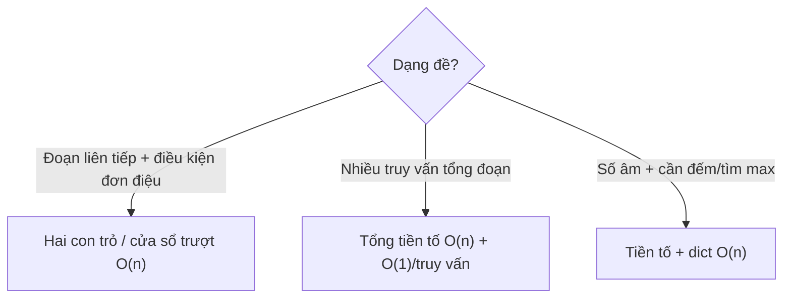

# Bài 30 — Hai Con Trỏ, Cửa Sổ Trượt & Tổng Tiền Tố

> 🧮 **Nhánh 02 — Thuật Toán (HSG / Competitive Programming)**

---

## 🧠 Điều kiện tiên quyết

- [Bài 25 — Tìm Kiếm](../25-Tim-Kiem/bai.md)
- [Bài 26 — Sắp Xếp](../26-Sap-Xep/bai.md)
- [Bài 27 — Stack, Queue & Hashing](../27-Stack-Queue-Hashing/bai.md)

---

## 🎯 Mục tiêu

Sau bài học này, học viên sẽ:

* ✅ Hiểu hai con trỏ: hai chỉ số chạy với tốc độ/quy luật khác nhau, mỗi phần tử thăm O(1) lần.
* ✅ Dùng cửa sổ trượt cho bài "đoạn liên tiếp tối ưu" trong O(n).
* ✅ Dùng tổng tiền tố để trả lời "tổng đoạn [l, r]" trong O(1) sau tiền xử lý O(n).
* ✅ Kết hợp tiền tố + dict để xử lý dãy có số âm (ôn Bài 27, mở rộng).
* ✅ Nhận diện đề nào thuộc họ này ("liên tiếp", "đoạn", "nhiều truy vấn tổng").

---

## 📖 Mở đầu

Một họ lớn bài HSG hỏi về **đoạn liên tiếp**: tổng lớn nhất, đoạn ngắn nhất,
đếm đoạn thỏa điều kiện... Thử mọi cặp (l, r) là O(n²) — chết với n = 10⁵.
Ba kỹ thuật trong bài này đưa về O(n) hoặc O(1) mỗi truy vấn:

* Hai con trỏ: đoạn co giãn linh hoạt.
* Cửa sổ trượt: đoạn rộng cố định (hoặc co giãn theo điều kiện đơn điệu).
* Tổng tiền tố: hỏi tổng bất kỳ đoạn nào trong O(1).

---

## 💡 Ý tưởng trực quan

* **Hai con trỏ:** hai người đi bộ trên một con đường — người phải bước tới,
  người trái đuổi theo khi cần. Không ai quay lui → mỗi người đi tối đa n bước.
* **Cửa sổ trượt:** khung ảnh trượt trên phim — khung rộng k thì mỗi bước
  "bỏ 1 đầu trái, thêm 1 đầu phải", cập nhật O(1) thay vì đếm lại cả khung.
* **Tổng tiền tố:** thước dây đã đánh dấu — muốn biết đoạn [l, r] dài bao nhiêu,
  lấy vạch r trừ vạch l−1, khỏi đo lại.



---

## 📚 Kiến thức

### 1. Hai con trỏ trên dãy đã sắp xếp — mẫu "cặp tổng S"

> Đề: "Dãy đã sắp xếp tăng dần, hỏi có cặp i < j sao cho a[i] + a[j] == S?"

Đặt trái ở đầu, phải ở cuối: tổng nhỏ → trái tiến (tăng tổng); tổng lớn →
phải lùi (giảm tổng). Mỗi bước loại một đầu → O(n), O(1) nhớ.

```python
def cap_tong_s(a, s):
    l, r = 0, len(a) - 1
    while l < r:
        t = a[l] + a[r]
        if t == s:
            return True
        elif t < s:
            l += 1
        else:
            r -= 1
    return False
```

> Vì sao đúng? Nếu a[l] + a[r] < S thì mọi cặp (l, k) với k < r đều nhỏ hơn S
> (dãy tăng) → loại l an toàn. Đối xứng với trường hợp lớn hơn. Mỗi bước loại
> đúng 1 đầu mà không mất đáp án — đó là tính đơn điệu làm nên O(n).

### 2. Cửa sổ trượt rộng cố định — max/tổng mỗi đoạn k phần tử

Thay vì tính lại mỗi cửa sổ O(k), cập nhật trượt O(1):

```python
def tong_cua_so(a, k):
    # tổng của từng cửa sổ rộng k
    s = sum(a[:k])
    ra = [s]
    for i in range(k, len(a)):
        s += a[i] - a[i - k]   # thêm phải, bớt trái
        ra.append(s)
    return ra
```

Tổng n = 10⁵, k = 10⁴: naive O(n·k) = 10⁹ → TLE; trượt O(n) → AC.
(Max cửa sổ dùng deque đơn điệu — đã học Bài 27.)

### 3. Cửa sổ co giãn — đoạn ngắn nhất thỏa điều kiện (số dương)

> Đề: "Dãy số dương, tìm đoạn liên tiếp ngắn nhất có tổng ≥ S."

Phải mở rộng đến khi đủ, rồi co trái để ngắn lại — trái chỉ tiến, phải chỉ
tiến → mỗi chỉ số thăm 2 lần → O(n):

```python
def doan_ngan_nhat(a, s):
    l = tong = 0
    tot = float("inf")
    for r, x in enumerate(a):
        tong += x
        while tong >= s:          # đủ rồi → co trái cho ngắn
            tot = min(tot, r - l + 1)
            tong -= a[l]
            l += 1
    return tot if tot != float("inf") else 0
```

> Điều kiện "số dương" là bắt buộc: co trái làm tổng giảm (đơn điệu) nên vòng
> while an toàn. Số âm thì co trái có thể làm tổng TĂNG → mẫu này sai → dùng
> tiền tố + dict (mục 5).

### 4. Tổng tiền tố — O(1) mỗi truy vấn tổng đoạn

Tiền xử lý `p[0] = 0`, `p[i] = a[0] + ... + a[i−1]`; tổng [l, r] (0-based,
bao cả hai đầu) = `p[r+1] − p[l]`:

```python
def tien_to(a):
    p = [0]
    for x in a:
        p.append(p[-1] + x)
    return p

a = [2, 1, 5, 3, 4]
p = tien_to(a)          # [0, 2, 3, 8, 11, 15]
# tổng a[1..3] = p[4] - p[1] = 11 - 2 = 9  (1+5+3 ✔)
```

m truy vấn trên dãy n số: naive O(m·n) → tiền tố O(n + m). Với n, m ≤ 10⁵:
10¹⁰ → 2×10⁵. (Mở rộng 2D cho bảng — ma trận tiền tố — gặp trong đề hình chữ nhật.)

### 5. Tiền tố + dict — khi có số âm

Đã gặp ở Bài 23 (bài 8) và Bài 27 (ví dụ 3, bài 7). Tổng quát:

* Đếm đoạn tổng K: `ans += thay.get(tong − k, 0)` (Bài 27).
* Đoạn dài nhất tổng K: lưu lần ĐẦU mỗi tổng (Bài 27 — bài 7).
* Đoạn 0-1 cân bằng: đổi 0 → −1, tìm đoạn tổng 0 dài nhất (Bài 23 — bài 8).

> Ba bài ba vẻ nhưng cùng một gốc: **tổng đoạn = hiệu hai tiền tố**.
> Nắm gốc này, bạn tự suy ra cả ba trong phòng thi.

### 6. Bảng quyết định nhanh

| Dấu hiệu đề | Kỹ thuật |
|---|---|
| Dãy đã sắp xếp + cặp/tổng | Hai con trỏ hai đầu O(n) |
| Số dương + đoạn ngắn/dài nhất thỏa điều kiện | Cửa sổ co giãn O(n) |
| Cửa sổ rộng k cố định | Trượt cập nhật O(1)/bước |
| Nhiều truy vấn tổng đoạn | Tiền tố O(n) + O(1) |
| Số âm + đếm/tìm đoạn theo tổng | Tiền tố + dict O(n) |

---

## 💻 Ví dụ

### Ví dụ 1 — Dễ: cặp tổng S trên dãy đã sắp xếp

```python
import sys

def main():
    data = sys.stdin.read().strip().split()
    if not data:
        return
    n, s = int(data[0]), int(data[1])
    a = list(map(int, data[2:2 + n]))
    l, r = 0, n - 1
    while l < r:
        t = a[l] + a[r]
        if t == s:
            print("YES")
            return
        elif t < s:
            l += 1
        else:
            r -= 1
    print("NO")

main()
```

Chạy tay `a = [1, 2, 4, 7, 11]`, S = 9: (1,11)=12 lớn → r=3; (1,7)=8 nhỏ →
l=1; (2,7)=9 ✔ → YES. 3 bước thay vì thử 10 cặp.

### Ví dụ 2 — Thực tế: nhiều truy vấn tổng đoạn

> Đề: "n, m ≤ 10⁵. m truy vấn, mỗi truy vấn [l, r] (1-based), in tổng đoạn."

```python
import sys

def main():
    data = sys.stdin.read().strip().split()
    if not data:
        return
    it = iter(data)
    n, m = int(next(it)), int(next(it))
    p = [0]
    for _ in range(n):
        p.append(p[-1] + int(next(it)))
    ra = []
    for _ in range(m):
        l = int(next(it)); r = int(next(it))
        ra.append(str(p[r] - p[l - 1]))   # 1-based → p[r] − p[l−1]
    sys.stdout.write("\n".join(ra))

main()
```

**Giải thích:** `p[r] − p[l−1]` — chỉ số tiền tố lệch 1 so với đề 1-based,
nguồn off-by-one phổ biến nhất của mẫu này. Mẹo nhớ: "tổng đến r trừ tổng
đến trước l".

### Ví dụ 3 — Khó: đoạn dài nhất tổng K (có số âm)

> Đề: "n ≤ 10⁵, số có thể âm. Tìm độ dài đoạn liên tiếp dài nhất có tổng
> đúng bằng K. Không có thì in 0."

```python
import sys

def main():
    data = sys.stdin.read().strip().split()
    if not data:
        return
    n, k = int(data[0]), int(data[1])
    a = list(map(int, data[2:2 + n]))
    thay_lan_dau = {0: -1}
    tong = dai_nhat = 0
    for i, x in enumerate(a):
        tong += x
        can = tong - k
        if can in thay_lan_dau:
            dai_nhat = max(dai_nhat, i - thay_lan_dau[can])
        if tong not in thay_lan_dau:
            thay_lan_dau[tong] = i
    print(dai_nhat)

main()
```

Chạy tay `a = [1, -1, 5, -2, 3]`, K = 3: tiền tố: 0, 1, 0, 5, 3, 6.

| i | tong | cần (tong−3) | thay có? | dài |
|---|---|---|---|---|
| 0 | 1 | −2 | không (lưu 1→0) | 0 |
| 1 | 0 | −3 | không (0 đã có từ đầu, giữ −1) | 0 |
| 2 | 5 | 2 | không (lưu 5→2) | 0 |
| 3 | 3 | 0 | có (−1) → dài 3−(−1) = 4 | 4 |
| 4 | 6 | 3 | có (3→lưu ở i=3) → dài 4−3 = 1 | 4 |

Đáp án **4** (đoạn [1,−1,5,−2] tổng 3). ✔

---

## 📊 Minh họa

Cửa sổ co giãn, `a = [2, 3, 1, 2, 4, 3]`, S = 7:

```
r=0: [2] tổng 2 < 7
r=1: [2,3] tổng 5 < 7
r=2: [2,3,1] tổng 7 ✔ dài 3 → co: [3,1] tổng 4
r=3: [3,1,2] tổng 6 < 7
r=4: [3,1,2,4] tổng 10 ✔ dài 4 → co: [1,2,4]=7 ✔ dài 3 → co: [2,4]=6
r=5: [2,4,3] tổng 9 ✔ dài 3 → co: [4,3]=7 ✔ dài 2 → co: [3]=3
→ đáp án 2 (đoạn [4,3])
```

Tiền tố `a = [2, 1, 5, 3, 4]`:

```
chỉ số:  0  1  2  3  4
a:       2  1  5  3  4
p:    0  2  3  8 11 15
         └──┬──┘
   tổng a[1..3] = p[4] − p[1] = 11 − 2 = 9
```

---

## ⚠️ Những lỗi thường gặp

### Lỗi 1: Hai con trỏ trên dãy chưa sắp xếp

* Mẫu hai đầu đòi dãy tăng dần. Chưa xếp → `sort()` trước (O(n log n)),
  hoặc bài toán không thuộc mẫu này.

### Lỗi 2: Cửa sổ co giãn với số âm

```python
# ❌ SAI khi có số âm: co trái không đảm bảo tổng giảm
```

* Kiểm tra dấu của dữ liệu trước khi chọn mẫu: âm → tiền tố + dict.

### Lỗi 3: Lệch chỉ số tiền tố (off-by-one)

* `p` dài n+1, `p[i]` = tổng a[0..i−1]. Tổng [l, r] 0-based = `p[r+1] − p[l]`.
  Viết test nhỏ `[5]` + truy vấn [0,0] để kiểm chứng ngay.

### Lỗi 4: Quên `{0: -1}` / `{0: 1}` khởi tạo dict tiền tố

* Mất mọi đáp án "bắt đầu từ đầu dãy" — đã phân tích ở Bài 27.

### Lỗi 5: Cập nhật trượt sai dấu

`s += a[i] - a[i-k]` — thêm phải, bớt trái. Viết ngược thành trừ phải cộng
trái cho kết quả âm thầm sai. Test với k = 1 (kết quả phải bằng chính dãy).

---

## 🧪 Trường hợp đặc biệt

* **k > n** (cửa sổ cố định): không có cửa sổ nào → kết quả rỗng; kiểm tra
  `if k > n` trước.
* **S ≤ 0** với dãy dương (đoạn tổng ≥ S): đoạn rỗng đã thỏa → quy ước đề
  (thường S > 0, nhưng hãy đọc kỹ).
* **K = 0** (đếm đoạn tổng 0): khởi tạo `{0: 1}` quyết định đúng/sai.
* **Số 0 trong dãy** (cửa sổ co giãn): 0 không làm tổng tăng — while vẫn dừng
  vì mỗi lần co l tăng; không lặp vô hạn.

---

## 🚀 Ứng dụng thực tế

* Trung bình động, max 7 ngày (chứng khoán, giám sát).
* Prefix sum trong xử lý ảnh (tính tổng vùng chữ nhật O(1) — integral image).
* Two pointers trong merge, dedup, phân trang.

---

## 🧩 Bài tập

### 🟢 Cơ bản (1–3)

**Bài 1 — Chạy tay.** `a = [2, 1, 5, 3, 4]`. Tính mảng tiền tố p. Dùng p tính
tổng đoạn [0, 2] và [2, 4] (0-based). Kiểm chứng bằng cộng tay.

**Bài 2 — Trượt cố định.** `a = [4, 2, 6, 1, 5]`, k = 2. Chạy tay thuật toán
trượt, ghi s sau mỗi bước. Tổng các cửa sổ là gì?

**Bài 3 — Cặp tổng S.** Dãy đã xếp `[1, 3, 5, 7, 9]`, S = 12. Chạy tay hai con
trỏ, ghi (l, r, tổng) mỗi bước.

### 🟡 Hiểu sâu (4–6)

**Bài 4 — Ba tổng 0.** Cho dãy n ≤ 10³, đếm bộ ba (i < j < k) có tổng bằng 0.
*Gợi ý: sort O(n log n), cố định i, hai con trỏ trên phần còn lại — O(n²)
tổng. Vì sao không O(n³)?*

**Bài 5 — Đoạn nhiều nhất K phân biệt.** Dãy số nguyên dương, tìm độ dài đoạn
liên tiếp dài nhất chứa **không quá K** giá trị phân biệt. *Gợi ý: cửa sổ co
giãn + dict đếm trong cửa sổ; vượt K thì co trái đến khi đủ.*

**Bài 6 — Ma trận tiền tố.** Bảng n×m (≤ 500×500), q ≤ 10⁵ truy vấn tổng hình
chữ nhật con. *Gợi ý: P[i][j] = tổng từ (0,0) đến (i−1,j−1); công thức cộng–trừ
4 góc: S = P[x2][y2] − P[x1−1][y2] − P[x2][y1−1] + P[x1−1][y1−1].*

### 🔴 Vận dụng (7–8)

**Bài 7 — Đoạn 0-1 cân bằng (ôn Bài 1).** Cài lại bằng tiền tố + dict với n ≤
10⁵, test với dãy xen kẽ dài và dãy toàn 0. Giải thích vì sao cửa sổ co giãn
không giải được bài này.

**Bài 8 — Đếm đoạn có không quá K số lẻ.** Dãy n ≤ 10⁵ số nguyên, đếm số đoạn
liên tiếp chứa **không quá K** số lẻ. *Gợi ý: với mỗi r, tìm l nhỏ nhất sao cho
đoạn [l, r] thỏa → mọi l' ≥ l đều thỏa → cộng (r − l + 1). Cửa sổ co giãn đếm
thay vì tìm max.*

---

## ✅ Đáp án

> 💡 **Hãy tự làm bài tập trước** rồi mới mở đáp án.

<details>
<summary>✅ Bài 1: Chạy tay</summary>

p = [0, 2, 3, 8, 11, 15].
* Tổng [0, 2] = p[3] − p[0] = 8 − 0 = 8 (2+1+5 ✔).
* Tổng [2, 4] = p[5] − p[2] = 15 − 3 = 12 (5+3+4 ✔).

</details>

<details>
<summary>✅ Bài 2: Trượt cố định</summary>

s = 4+2 = 6 → ra [6]; i=2: s += 6−4 = 8 → [6, 8]; i=3: s += 1−2 = 7 →
[6, 8, 7]; i=4: s += 5−6 = 6 → [6, 8, 7, 6]. Tổng các cửa sổ rộng 2:
(4+2), (2+6), (6+1), (1+5) = 6, 8, 7, 6. ✔

</details>

<details>
<summary>✅ Bài 3: Cặp tổng S</summary>

| l | r | tổng | kết luận |
|---|---|---|---|
| 0 | 4 | 1+9 = 10 < 12 | l = 1 |
| 1 | 4 | 3+9 = 12 | ✔ YES |

2 bước. (Đáp án cặp (3, 9).)

</details>

<details>
<summary>✅ Bài 4: Ba tổng 0</summary>

```python
def dem_bo_ba(a):
    a = sorted(a)
    n, dem = len(a), 0
    for i in range(n - 2):
        if i > 0 and a[i] == a[i - 1]:
            continue          # bỏ i trùng → tránh đếm lặp
        l, r = i + 1, n - 1
        while l < r:
            t = a[i] + a[l] + a[r]
            if t == 0:
                dem += 1
                l += 1; r -= 1
            elif t < 0:
                l += 1
            else:
                r -= 1
    return dem
```

Vòng ngoài n lần × hai con trỏ O(n) = **O(n²)** tổng (cộng sort O(n log n)
không đổi bậc). Naive 3 vòng lồng là O(n³) — với n = 10³: 10⁹ (chết) vs
10⁶ (sống).

</details>

<details>
<summary>✅ Bài 5: Đoạn nhiều nhất K phân biệt</summary>

```python
def dai_nhat_k_phan_biet(a, k):
    from collections import defaultdict
    dem = defaultdict(int)
    l = phan_biet = tot = 0
    for r, x in enumerate(a):
        if dem[x] == 0:
            phan_biet += 1
        dem[x] += 1
        while phan_biet > k:
            dem[a[l]] -= 1
            if dem[a[l]] == 0:
                phan_biet -= 1
            l += 1
        tot = max(tot, r - l + 1)
    return tot
```

Cửa sổ co giãn + dict đếm: mở phải, vượt K thì co trái đến khi đủ.
Mỗi chỉ số vào/ra 1 lần → O(n).

</details>

<details>
<summary>✅ Bài 6: Ma trận tiền tố</summary>

```python
# P[i][j] = tổng hình chữ nhật (0,0)..(i-1,j-1), P có cỡ (n+1)x(m+1)
P = [[0] * (m + 1) for _ in range(n + 1)]
for i in range(1, n + 1):
    hang = 0
    for j in range(1, m + 1):
        hang += a[i - 1][j - 1]
        P[i][j] = P[i - 1][j] + hang

# Truy vấn [x1..x2]x[y1..y2] (1-based, bao cả biên):
s = P[x2][y2] - P[x1 - 1][y2] - P[x2][y1 - 1] + P[x1 - 1][y1 - 1]
```

Trực giác công thức: lấy cả khối lớn, trừ dải trên và dải trái (phần giao bị
trừ 2 lần nên cộng lại 1 lần). Mỗi truy vấn O(1) sau tiền xử lý O(n·m).

</details>

<details>
<summary>✅ Bài 7: Đoạn 0-1 cân bằng</summary>

Xem đáp án Bài 8 — Bài 23 (code đầy đủ). Cửa sổ co giãn **không** giải được vì
điều kiện "số 0 bằng số 1" không đơn điệu: co trái có thể làm mất cân bằng
hoặc tạo cân bằng — không có hướng "càng co càng gần đáp án". Tiền tố + dict
không cần đơn điệu nên xử lý được số âm/bất kỳ.

</details>

<details>
<summary>✅ Bài 8: Đếm đoạn có không quá K số lẻ</summary>

```python
def dem_doan_k_le(a, k):
    l = le = ans = 0
    for r, x in enumerate(a):
        le += x % 2
        while le > k:
            le -= a[l] % 2
            l += 1
        ans += r - l + 1   # mọi đoạn [l'..r] với l' ≥ l đều thỏa
    return ans
```

Điểm mấu chốt: khi cửa sổ [l, r] thỏa, mọi đoạn con kết thúc tại r và bắt đầu
từ l..r đều thỏa → có đúng (r − l + 1) đoạn. Đếm gộp thay vì liệt kê → O(n).

</details>

---

## 🧠 Thử thách

**Thử thách HSG:** Cho dãy n ≤ 10⁵ (có số âm), đếm số đoạn liên tiếp có tổng
**nhỏ hơn hoặc bằng K**. *Gợi ý khó: tiền tố + cấu trúc cây (Fenwick/segment
tree) đếm số tiền tố cũ ≥ tong − K trong O(log n) mỗi bước — tổng O(n log n).
Đây là bước đệm sang cấu trúc dữ liệu nâng cao.*

---

## 📝 Tóm tắt

| Khái niệm | Nội dung |
|---|---|
| ↔️ Hai con trỏ | Hai đầu / cùng chiều, mỗi phần tử O(1) lần |
| 🪟 Cửa sổ trượt | Cố định: cập nhật O(1); co giãn: số dương + đơn điệu |
| 📏 Tiền tố | Tổng đoạn O(1); mở rộng 2D cho bảng |
| ➕ Tiền tố + dict | Số âm: đếm/tìm max đoạn theo tổng O(n) |

---

## ➡️ Điều hướng

**Vị trí:** `02-Thuat-Toan/30-Hai-Con-Tro/bai.md`

**Bài tiếp theo:** [Bài 31 — Tham Lam (Greedy)](../31-Tham-Lam/bai.md)
