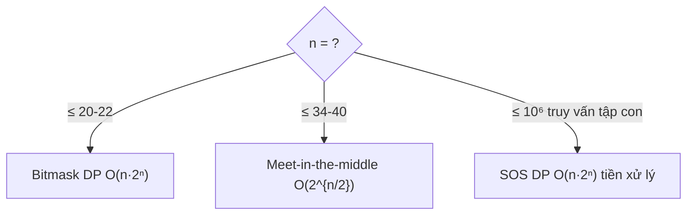

# Bài 39 — Bitmask & Tối Ưu Trên Tập Hợp

> 🧮 **Nhánh 02 — Thuật Toán (HSG / Competitive Programming)**

---

## 🧠 Điều kiện tiên quyết

- [Bài 29 — Quay Lui](../29-Quay-Lui/bai.md) (bitmask duyệt tập con)
- [Bài 32 — Quy Hoạch Động](../32-Quy-Hoach-Dong/bai.md)
- [Bài 24 — Độ Phức Tạp](../24-Do-Phuc-Tap/bai.md)

---

## 🎯 Mục tiêu

Sau bài học này, học viên sẽ:

* ✅ Dùng thành thạo 10 thủ thuật bit (bật/tắt/kiểm tra bit, bit thấp nhất, đếm bit).
* ✅ Hiểu khi nào 2ⁿ khả thi (n ≤ 20–25) và khi nào phải chia đôi (meet-in-the-middle).
* ✅ Cài DP bitmask TSP O(n²·2ⁿ) — bài DP bitmask chuẩn nhất.
* ✅ Giải bài phân công (assignment) bằng DP bitmask O(n·2ⁿ).
* ✅ Biết SOS DP (tổng trên tập con) cho bài đếm nâng cao.

---

## 📖 Mở đầu

Khi n ≤ 20, "tập hợp" nhét vừa một số nguyên (bit i = 1 nghĩa là phần tử i
được chọn). Mọi thao tác tập hợp thành phép tính bit O(1): hợp = OR, giao =
AND, thêm = OR bit, bỏ = AND phủ định... DP trên mặt nạ bit (bitmask DP)
giải được TSP, phân công, chia nhóm — những bài NP-khó mà n nhỏ.

> 🐣 **Thấy số nhị phân đáng sợ? Đọc mục "Khởi động siêu chậm" ngay dưới đây
> trước. Chỉ có công tắc đèn, giỏ trái cây, và đếm bằng tay.**

---

## 🐣 Khởi động siêu chậm — công tắc đèn và giỏ trái cây

### Chuyện 1: Ba công tắc đèn

Phòng có 3 đèn (đèn 0, 1, 2). Mỗi đèn hoặc tắt (0) hoặc bật (1).
Có bao nhiêu trạng thái? 2×2×2 = **8** trạng thái:

```
000 (tắt hết), 001 (bật đèn 0), 010 (bật đèn 1), 011 (bật 0+1),
100 (bật đèn 2), 101, 110, 111 (bật hết)
```

Đọc từ **phải sang trái**: bit phải nhất = đèn 0. Số `101` nghĩa là đèn 0 bật,
đèn 1 tắt, đèn 2 bật. Mỗi số nguyên 0–7 là một "ảnh chụp" trạng thái phòng —
đó chính là **mask** (mặt nạ bit)!

Muốn bật thêm đèn 1 khi đang ở trạng thái `101`? `101 OR 010 = 111`
(phép OR = "bật thêm, cái đang bật giữ nguyên"). Muốn hỏi "đèn 2 có đang bật
không ở trạng thái 5 (`101`)"? Nhìn bit số 2: là 1 → đang bật.
Mọi "thao tác tập hợp" chỉ là bật/tắt/nhìn công tắc.

### Chuyện 2: Giỏ trái cây

Giỏ có 4 loại: 0-táo, 1-chuối, 2-cam, 3-xoài. Bạn chọn bỏ vào túi một số loại.
Cách ghi "đã chọn gì" gọn nhất: một số!

* Túi có táo + cam + xoài (0, 2, 3) → bật bit 0, 2, 3 → `1101` nhị phân = **13**.
* Muốn biết túi 13 có chuối (bit 1) không? Bit 1 của 13 là 0 → không có.
* Túi {chuối, xoài} = bit 1 + bit 3 = `1010` = **10**.

Liệt kê **mọi** túi con của [táo, chuối, cam]? 2³ = 8 túi — chính là 8 số 0–7!
Muốn tổng giá trị từng túi? Duyệt mask 0–7, cộng giá các bit bật (xem bảng
tổng tập con của [2, 3, 5] ở mục 1 — cùng một việc!).

### ✋ Dừng lại tự kiểm tra

a) Túi mask = 13 (`1101`) trong giỏ [táo, chuối, cam, xoài] có những gì?
b) Viết mask (thập phân + nhị phân) của túi {chuối, xoài}.
c) Liệt kê tổng mọi túi con của [2, 3, 5] (8 túi).

<details>
<summary>✅ Xem đáp án kiểm tra</summary>

a) Bit 0, 2, 3 bật → **táo, cam, xoài** (không có chuối).

b) Bit 1 + bit 3 = `1010` nhị phân = **10** thập phân.

c) 000→[] = 0; 001→[2] = 2; 010→[3] = 3; 011→[2,3] = 5;
   100→[5] = 5; 101→[2,5] = 7; 110→[3,5] = 8; 111→[2,3,5] = 10.
   (Chú ý 011 và 100 cùng tổng 5 — túi khác nhau, tổng trùng nhau là bình thường!)

   Làm đúng cả 3 câu thì "số nguyên = tập hợp" đã ngấm — DP bitmask (TSP,
   phân công) chỉ là "ghi đáp án tốt nhất cho từng túi"!

</details>

## 💡 Ý tưởng trực quan

* **Mặt nạ bit:** dãy công tắc đèn — bit 1 = bật (chọn), 0 = tắt. Số nguyên
  `mask = 13` (1101₂) nghĩa là chọn phần tử {0, 2, 3}.
* **DP bitmask:** bảng tra "tập đã chọn → kết quả tốt nhất". Thêm từng phần tử
  (bật từng công tắc), lan đáp án từ tập nhỏ sang tập lớn.
* **Meet-in-the-middle:** 2³⁴ quá lớn, nhưng 2¹⁷ + 2¹⁷ thì nhỏ — chia đôi,
  liệt kê mỗi nửa, ghép kết quả ở giữa (gặp nhau + sort/nhị phân).



---

## 📚 Kiến thức

### 1. Mười thủ thuật bit phải thuộc

```python
# bit thứ i (0-based) của mask
bat   = lambda mask, i: mask | (1 << i)     # bật
tat   = lambda mask, i: mask & ~(1 << i)    # tắt
dao   = lambda mask, i: mask ^ (1 << i)     # đảo
co    = lambda mask, i: (mask >> i) & 1     # kiểm tra (0/1)

thap_nhat = lambda mask: mask & -mask       # bit 1 thấp nhất (giá trị)
bo_thap   = lambda mask: mask & (mask - 1)  # tắt bit 1 thấp nhất

# đếm bit 1: Python 3.8+: bin(mask).count("1"); 3.10+: mask.bit_count()
# lũy thừa của 2? (đúng 1 bit 1): mask and not (mask & (mask - 1))
# tập con của mask: sub = mask; sub = (sub - 1) & mask  (duyệt mọi tập con!)
```

> `mask & -mask` tách bit thấp nhất (số âm bù 2: `-mask = ~mask + 1`).
> Duyệt tập con `sub = (sub-1) & mask` liệt kê đúng 2^k tập con của mask k bit —
> O(3ⁿ) tổng khi lồng trong duyệt mask (mỗi phần tử: ngoài/không/trong).

### 2. DP bitmask TSP — O(n²·2ⁿ), n ≤ 16–20

> Người bán hàng: thăm n thành phố (ma trận khoảng cách), về điểm xuất phát,
> đường ngắn nhất. Thử mọi hoán vị O(n!) chết từ n = 12.

`dp[mask][i]` = đường ngắn nhất xuất phát từ 0, thăm đúng tập mask, đang ở i:

```python
def tsp(c):
    n = len(c)
    INF = 10 ** 18
    dp = [[INF] * n for _ in range(1 << n)]
    dp[1][0] = 0                          # mask {0}, ở 0
    for mask in range(1 << n):
        for i in range(n):
            if not (mask >> i & 1) or dp[mask][i] == INF:
                continue
            for j in range(n):
                if mask >> j & 1:
                    continue              # đã thăm
                nmask = mask | (1 << j)
                if dp[mask][i] + c[i][j] < dp[nmask][j]:
                    dp[nmask][j] = dp[mask][i] + c[i][j]
    full = (1 << n) - 1
    return min(dp[full][i] + c[i][0] for i in range(n))
```

> n = 16: 16²·2¹⁶ ≈ 1.7×10⁷ — Python sát biên (~5–10s), PyPy/C++ thoải mái.
> n = 20: 4×10⁸ — Python TLE, cần PyPy tối ưu hoặc C++. **Biết giới hạn ngôn
> ngữ là một phần đáp án** (ôn Bài 32 — lỗi 5).

### 2b. 🔍 Chạy tay TSP 4 thành phố trên bảng dp

Ma trận ví dụ 3 (đối xứng): c[0][1]=10, c[0][2]=15, c[0][3]=20, c[1][2]=35,
c[1][3]=25, c[2][3]=30. `dp[mask][i]` = đường rẻ nhất từ 0, thăm đúng tập mask,
đang ở i (− = không tới được):

| mask (tập đã thăm) | i=0 | i=1 | i=2 | i=3 | Giải thích chuyển |
|---|---|---|---|---|---|
| {0} | 0 | − | − | − | xuất phát |
| {0,1} | − | 10 | − | − | 0→1 |
| {0,2} | − | − | 15 | − | 0→2 |
| {0,3} | − | − | − | 20 | 0→3 |
| {0,1,2} | − | 50 | 45 | − | tới 1 qua 2: 15+35=50; tới 2 qua 1: 10+35=45 |
| {0,1,3} | − | 45 | − | 35 | tới 1 qua 3: 20+25=45; tới 3 qua 1: 10+25=35 |
| {0,2,3} | − | − | 50 | 45 | tới 2 qua 3: 20+30=50; tới 3 qua 2: 15+30=45 |
| {0,1,2,3} | − | 70 | 65 | 75 | tới 1: min(50+35, 45+25)=70; tới 2: min(45+35, 35+30)=65... |

Đọc hàng cuối + đường về 0: i=1: 70+10 = 80; i=2: 65+15 = 80; i=3: 75+20 = 95.
Đáp án **80** (tour 0→1→3→2→0: 10+25+30+15 ✔).

> 💡 **Cách đọc bảng:** mỗi hàng là một "trạng thái tập hợp", mỗi ô là "đang
> đứng ở đâu với chi phí rẻ nhất". Chuyển trạng thái = bật thêm 1 bit
> (thăm thêm 1 thành phố). Số hàng = 2ⁿ, mỗi hàng n ô, mỗi ô thử n lối đi —
> đó chính là O(n²·2ⁿ). Hiểu bảng này là hiểu mọi DP bitmask.

### 3. Phân công (assignment) — O(n·2ⁿ)

> n người, n việc; cost[i][j] = người i làm việc j tốn bao nhiêu. Mỗi người
> đúng 1 việc, tổng nhỏ nhất?

`dp[mask]` = chi phí nhỏ nhất khi các việc trong mask đã có người; người tiếp
theo là `k = popcount(mask)` (số bit 1 = số việc đã giao = chỉ số người kế):

```python
def phan_cong(cost):
    n = len(cost)
    INF = 10 ** 18
    dp = [INF] * (1 << n)
    dp[0] = 0
    for mask in range(1 << n):
        k = bin(mask).count("1")          # người thứ k (0-based)
        if k >= n:
            continue
        for j in range(n):
            if not (mask >> j & 1):
                nmask = mask | (1 << j)
                if dp[mask] + cost[k][j] < dp[nmask]:
                    dp[nmask] = dp[mask] + cost[k][j]
    return dp[(1 << n) - 1]
```

> Mẹo `k = popcount(mask)`: không cần chiều thứ hai cho "người" — số việc đã
> giao ngầm định người kế tiếp. Giảm O(n²·2ⁿ) xuống O(n·2ⁿ). Dạng "trạng thái
> ẩn trong mask" này là kỹ thuật DP bitmask quan trọng nhất.

### 4. Meet-in-the-middle — n ≤ 34–40

> Đếm tập con có tổng = S, n ≤ 34. 2³⁴ = 1.7×10¹⁰ → không vét hết được.

Chia đôi (17 + 17): liệt kê mọi tổng nửa trái (2¹⁷), mọi tổng nửa phải (2¹⁷);
với mỗi tổng trái t, cần tổng phải S − t → sort nửa phải + nhị phân đếm:

```python
from bisect import bisect_left, bisect_right

def dem_tap_con_tong_s(a, s):
    n = len(a)
    giua = n // 2
    trai = a[:giua]
    phai = a[giua:]
    tong_trai = []
    for mask in range(1 << len(trai)):
        tong_trai.append(sum(trai[i] for i in range(len(trai)) if mask >> i & 1))
    tong_phai = []
    for mask in range(1 << len(phai)):
        tong_phai.append(sum(phai[i] for i in range(len(phai)) if mask >> i & 1))
    tong_phai.sort()
    dem = 0
    for t in tong_trai:
        can = s - t
        dem += bisect_right(tong_phai, can) - bisect_left(tong_phai, can)
    return dem
```

O(2^(n/2) · n) liệt kê + O(2^(n/2) log) sort/ghép. n = 34: ~2×17M phép —
Python vài giây, sát biên nhưng qua được với tối ưu (dùng itertools?). n = 40
cần PyPy/C++.

### 4b. 🐢 Hiểu chậm meet-in-the-middle bằng ví dụ nhỏ

Đếm tập con của [1, 2, 3, 4, 5, 6] có tổng = 10. Chia đôi [1,2,3] và [4,5,6],
liệt kê **mọi** tổng mỗi nửa (2³ = 8 tổng mỗi bên):

```
Nửa trái:  0, 1, 2, 3, 3, 4, 5, 6        (vd: 3 = {1,2} hoặc {3})
Nửa phải:  0, 4, 5, 6, 9, 10, 11, 15     (đã sort)
```

Với mỗi tổng trái t, cần tổng phải = 10 − t. Đếm bằng nhị phân trên nửa phải:

| t (trái) | cần (phải) | số lượng trong nửa phải | Tập tương ứng |
|---|---|---|---|
| 0 | 10 | 1 ({}) | {} + {4,6} |
| 1 | 9 | 1 | {1} + {4,5} |
| 2 | 8 | 0 | — |
| 3 | 7 | 0 | — |
| 3 | 7 | 0 | — |
| 4 | 6 | 1 | {1,3} + {6} |
| 5 | 5 | 1 | {2,3} + {5} |
| 6 | 4 | 1 | {1,2,3} + {4} |

Tổng **5** tập con: {4,6}, {1,4,5}, {1,3,6}, {2,3,5}, {1,2,3,4} ✔ (brute force
2⁶ = 64 tập cũng ra 5).

> 💡 **Vì sao phải sort nửa phải?** Vì mỗi t cần đếm nhanh "có bao nhiêu tổng
> phải bằng 10−t" — sort một lần O(2^(n/2) log), rồi mỗi t nhị phân O(log).
> Không sort mà quét tuyến tính mỗi lần → O(2^n) — mất hết ý nghĩa chia đôi!

### 5. SOS DP — tổng trên mọi tập con, O(n·2ⁿ)

> n ≤ 20, mảng f[mask]. Tính g[mask] = Σ f[sub] với mọi sub ⊆ mask
> (tổng trên mọi tập con). q ≤ 10⁶ truy vấn.

Naive mỗi truy vấn duyệt 2^popcount → TLE. SOS: DP theo từng bit — vòng bit i,
mọi mask có bit i thì cộng từ mask tắt bit i:

```python
def sos(f, n):
    g = f[:]
    for i in range(n):
        for mask in range(1 << n):
            if mask >> i & 1:
                g[mask] += g[mask ^ (1 << i)]
    return g
```

> Sau vòng i, g[mask] = tổng trên tập con chỉ dùng bit 0..i. Xong n vòng =
> mọi tập con. O(n·2ⁿ) tiền xử lý, O(1) mỗi truy vấn. Ứng dụng: đếm cặp
> AND/OR, bài "tần suất siêu tập" (superset query).

---

## 💻 Ví dụ

### Ví dụ 1 — Dễ: thao tác bit + liệt kê tập con

```python
def liet_ke_tap_con(a):
    n = len(a)
    for mask in range(1 << n):
        tap = [a[i] for i in range(n) if mask >> i & 1]
        print(f"{mask:0{n}b} -> {tap}")

liet_ke_tap_con(["x", "y", "z"])
# 000 -> [] | 001 -> ['x'] | 010 -> ['y'] | ... | 111 -> ['x','y','z']
```

`f"{mask:0{n}b}"` in nhị phân đủ n chữ số — debug bitmask không thể thiếu.

### Ví dụ 2 — Thực tế: phân công 4×4 (chạy tay + code)

Chi phí:

```
        V0  V1  V2  V3
N0       9   2   7   8
N1       6   4   3   7
N2       5   8   1   8
N3       7   6   9   4
```

```python
import sys

def phan_cong(cost):
    n = len(cost)
    INF = 10 ** 18
    dp = [INF] * (1 << n)
    dp[0] = 0
    for mask in range(1 << n):
        k = bin(mask).count("1")
        if k >= n or dp[mask] == INF:
            continue
        for j in range(n):
            if not (mask >> j & 1):
                nmask = mask | (1 << j)
                if dp[mask] + cost[k][j] < dp[nmask]:
                    dp[nmask] = dp[mask] + cost[k][j]
    return dp[(1 << n) - 1]

def main():
    data = sys.stdin.read().strip().split()
    if not data:
        return
    n = int(data[0])
    vals = list(map(int, data[1:1 + n * n]))
    cost = [vals[i * n:(i + 1) * n] for i in range(n)]
    print(phan_cong(cost))

main()
```

Đáp án: N0→V1 (2), N1→V0 (6)? Thử tối ưu: N0-V1 (2), N1-V2 (3), N2-V0 (5),
N3-V3 (4) = 14? Kiểm tra phân công khác: N0-V1(2), N1-V0(6), N2-V2(1),
N3-V3(4) = **13**. ✔ Code cho 13.

### Ví dụ 3 — Khó: TSP nhỏ + meet-in-the-middle đếm

TSP n = 4, ma trận đối xứng:

```
    0   1   2   3
0   0  10  15  20
1  10   0  35  25
2  15  35   0  30
3  20  25  30   0
```

Tour tốt nhất: 0→1→3→2→0 = 10+25+30+15 = **80**. (Thử tay: 0-1-2-3-0 =
10+35+30+20 = 95; 0-2-3-1-0 = 15+30+25+10 = 80 ✔.)

```python
# dùng hàm tsp mục 2
assert tsp([[0,10,15,20],[10,0,35,25],[15,35,0,30],[20,25,30,0]]) == 80
```

---

## 📊 Minh họa

DP phân công n = 3 (mask → người kế → lan):

```
dp[000]=0 (người 0)
 ├─ việc 0 → dp[001] = c[0][0]
 ├─ việc 1 → dp[010] = c[0][1]
 └─ việc 2 → dp[100] = c[0][2]
dp[001] (người 1): + việc 1 → dp[011], + việc 2 → dp[101]
...
dp[111] = đáp án (cả 3 việc đã giao)
```

---

## ⚠️ Những lỗi thường gặp

### Lỗi 1: `1 << n` với n lớn (n = 100) → số khổng lồ + treo

* Bitmask chỉ cho n ≤ 20–25 (DP) hoặc ≤ 34 (MITM). n lớn hơn → sai họ thuật toán.

### Lỗi 2: Quên `mask` đã thăm/không thăm khi chuyển

```python
if mask >> j & 1: continue   # đã thăm → bỏ (TSP)
if not (mask >> j & 1): ...  # chưa thăm → xét
```

Đảo điều kiện là bug phổ biến nhất khi viết vội.

### Lỗi 3: `bin(mask).count("1")` trong vòng lặp nóng

* O(n) mỗi lần đếm → DP thành O(n²·2ⁿ). Tối ưu: tiền xử lý popcount mọi mask
  O(2ⁿ), hoặc lan `k+1` theo chuyển (dp[mask] → người k+1 ngầm định... vẫn cần
  k — tiền xử lý mảng pop là chuẩn).

### Lỗi 4: TSP quên đường về (`+ c[i][0]`)

* `dp[full][i]` mới là "đã thăm hết, đang ở i" — chưa về! Đáp án = min(dp + về).

### Lỗi 5: Meet-in-the-middle liệt kê bằng sum() O(n) mỗi mask

* Tổng liệt kê O(n·2^(n/2)) — với n = 40 thành 40·2²⁰ ≈ 4×10¹⁰ → TLE.
  Tối ưu: Gray code (mỗi mask kế chỉ đổi 1 bit → cập nhật O(1)) hoặc DP theo bit
  thấp nhất: `tong[mask] = tong[mask bỏ bit thấp] + a[bit]`.

---

## 🧪 Trường hợp đặc biệt

* **n = 1** (TSP): full = 1, dp[1][0] = 0, đáp án c[0][0] = 0 ✔.
* **Chi phí âm** (phân công): DP vẫn đúng (không phụ thuộc dấu) ✔ — khác Dijkstra!
* **Không đủ người/việc**: phân công vuông (n×n) theo định nghĩa; chữ nhật →
  thêm người/việc giả chi phí 0.
* **mask = 0**: dp[0] = 0 (chưa giao việc nào, tốn 0) — base của mọi DP bitmask.
* **SOS với f rỗng**: g = f copy — không crash, trả đúng.

---

## 🚀 Ứng dụng thực tế

* Lập lịch, phân công, định tuyến xe (VRP nhỏ), thiết kế mạch (TSP placement),
  game AI (trạng thái bàn cờ nhỏ), tối ưu tổ hợp n nhỏ.

---

## 🧩 Bài tập

### 🟢 Cơ bản (1–3)

**Bài 1 — Bit tay.** mask = 0b10110 (22). Tính: bật bit 0, tắt bit 4, kiểm tra
bit 2, `mask & -mask`, `mask & (mask-1)`, số bit 1. (Đáp án: 23, 6, có (=1),
2, 20, 3.)

**Bài 2 — Liệt kê.** n = 4, liệt kê mọi mask có đúng 2 bit 1 (C(4,2) = 6 mask).
Viết vòng lặp + kiểm tra popcount.

**Bài 3 — TSP tay.** Ma trận ví dụ 3. Chạy tay dp: dp[{0,1}][1] = ?, dp[{0,1,3}][3]
= ? (Đáp án: 10; min qua 1: 10+25 = 35.)

### 🟡 Hiểu sâu (4–6)

**Bài 4 — Popcount nhanh.** Tiền xử lý mảng `pop[mask]` mọi mask < 2ⁿ trong
O(2ⁿ) bằng truy hồi `pop[mask] = pop[mask >> 1] + (mask & 1)`. Cài + dùng cho
phân công (thay `bin().count()`).

**Bài 5 — Chia nhóm chênh lệch bằng bitmask (ôn Bài 7).** n ≤ 20. So sánh 2
cách: đệ quy quay lui vs duyệt mask + tính tổng bằng DP bit thấp
(`tong[mask] = tong[mask ^ lowbit] + a[bit]`). Cài bản nhanh, đo thời gian.

**Bài 6 — Đếm tập con tổng S với n = 34.** Cài meet-in-the-middle hoàn chỉnh
+ test với brute force ở n = 20 (so đáp án). *Chú ý tối ưu liệt kê (lỗi 5).*

### 🔴 Vận dụng (7–8)

**Bài 7 — TSP có deadline.** n ≤ 15 thành phố, mỗi thành phố có deadline d[i]
(phải thăm không muộn hơn d[i], xuất phát giờ 0). Đường ngắn nhất thỏa deadline?
*Gợi ý: dp[mask][i] = giờ đến SỚM nhất (thay vì đường ngắn nhất); chuyển chỉ
khi đến ≤ deadline[j]. Đáp án min giờ về. Vì sao "sớm nhất" đúng mà "ngắn nhất"
sai? (Đến sớm luôn tốt hơn cho tương lai — tính đơn điệu thời gian.)*

**Bài 8 — SOS đếm cặp AND bằng 0.** Cho n ≤ 20 bit, mảng a (m ≤ 10⁵ số).
Đếm cặp (i < j) sao cho (a[i] & a[j]) == 0. *Gợi ý: freq[mask] = số lần xuất
hiện; SOS trên freq → g[mask] = số phần tử là tập con của mask; với mỗi x,
số y sao cho x & y == 0 = g[~x & ((1<<n)−1)]; cộng dồn / 2 (đếm đôi) và trừ
tự cặp (0 & 0 == 0 — cặp (i,i) bị tính!). O(n·2ⁿ + m).*
### ➕ Bài tập bổ sung (Bài 9–12)

**Bài 9 — Khoảng cách Hamming.** Đếm số bit khác nhau giữa 2 số (XOR rồi đếm
bit 1). Viết 3 cách (bin.count, bit_count, vòng lowbit) + test (0b10110 vs
0b10001 → 3). Ứng dụng: so sánh chuỗi DNA, phát hiện lỗi truyền tin!

**Bài 10 — Liệt kê tập con của mask.** Cho mask (ví dụ 0b1010), liệt kê mọi tập
con bằng `sub = (sub-1) & mask`. Code + test (ra [0, 2, 8, 10]). Giải thích vì
sao công thức này vét đúng hết mà không sót/trùng.

**Bài 11 — TSP đường (không về).** Sửa code TSP (ví dụ 3): thăm hết n thành phố
nhưng **không cần quay về** điểm xuất phát. Đáp án = min dp[full][i] (không cộng
đường về). Code + test (ma trận cũ → 65, thay vì 80). Khi nào bản đường hữu ích
hơn bản vòng? (Gợi ý: giao hàng 1 chiều!)

**Bài 12 — Mã Gray.** Sinh mọi số n bit sao cho 2 số liên tiếp khác đúng 1 bit,
bằng công thức `g[i] = i ^ (i >> 1)`. Code + test (n=3 ra 8 số, kiểm tra tính
kề). Ứng dụng thật: encoder quay (xoay 1 nấc chỉ đổi 1 bit → không đọc nhầm
trạng thái trung gian!).

---

## ✅ Đáp án

> 💡 **Hãy tự làm bài tập trước** rồi mới mở đáp án.

<details>
<summary>✅ Bài 1: Bit tay</summary>

mask = 22 = 10110₂.
* Bật bit 0: 22 | 1 = 10111₂ = **23**.
* Tắt bit 4: 22 & ~16 = 00110₂ = **6**.
* Bit 2: (22 >> 2) & 1 = 5 & 1 = **1** (có).
* `22 & -22`: −22 = ...11101010₂ (bù 2), AND = 00010₂ = **2**.
* `22 & 21`: 10110 & 10101 = 10100₂ = **20** (tắt bit thấp nhất).
* Bit 1: 3 bit (vị trí 1, 2, 4).

</details>

<details>
<summary>✅ Bài 2: Liệt kê</summary>

```python
n = 4
masks = [m for m in range(1 << n) if bin(m).count("1") == 2]
print([f"{m:04b}" for m in masks])
# ['0011', '0101', '0110', '1001', '1010', '1100'] — đúng 6
```

</details>

<details>
<summary>✅ Bài 3: TSP tay</summary>

* dp[{0,1}][1] = dp[{0}][0] + c[0][1] = **10**.
* dp[{0,1,3}][3]: từ dp[{0,1}][1] + c[1][3] = 10 + 25 = **35**
  (không có đường khác tới {0,1,3} kết ở 3 vì phải qua 1 — mask {0,3}→3:
  dp = c[0][3] = 20, rồi +? mask {0,1,3} kết 3 chỉ từ {0,1}: 35 ✔).

</details>

<details>
<summary>✅ Bài 4: Popcount nhanh</summary>

```python
def popcount_tien_xu_ly(n):
    pop = [0] * (1 << n)
    for mask in range(1, 1 << n):
        pop[mask] = pop[mask >> 1] + (mask & 1)
    return pop
```

Bỏ bit cuối (>>) + cộng bit cuối — mỗi mask O(1) → tổng O(2ⁿ).
Dùng trong phân công: `k = pop[mask]` thay `bin(mask).count("1")`.

</details>

<details>
<summary>✅ Bài 5: Chia nhóm chênh lệch</summary>

```python
def chia_nhom(a):
    n = len(a)
    tong = [0] * (1 << n)
    for mask in range(1, 1 << n):
        bit = (mask & -mask).bit_length() - 1   # vị trí bit thấp nhất
        tong[mask] = tong[mask ^ (1 << bit)] + a[bit]
    s = sum(a)
    return min(abs(s - 2 * tong[mask]) for mask in range(1 << n))
```

Mỗi mask tính O(1) từ mask bỏ 1 bit → tổng O(2ⁿ) thay vì O(n·2ⁿ) tính lại.
Nhanh hơn quay lui khi không tỉa được gì (số xấu).

</details>

<details>
<summary>✅ Bài 6: Đếm tập con tổng S</summary>

Dùng nguyên code mục 4 + test:

```python
import random
from bisect import bisect_left, bisect_right
# (hàm dem_tap_con_tong_s ở mục 4)

def brute(a, s):
    dem = 0
    for mask in range(1 << len(a)):
        if sum(a[i] for i in range(len(a)) if mask >> i & 1) == s:
            dem += 1
    return dem

for _ in range(20):
    a = [random.randint(0, 10) for _ in range(18)]
    s = random.randint(0, 50)
    assert dem_tap_con_tong_s(a, s) == brute(a, s)
print("OK")
```

(Tối ưu liệt kê: với n = 34 bản `sum()` mỗi mask ~34 phép × 2×2¹⁷ ≈ 9×10⁹...
quá chậm! Phải dùng DP bit thấp O(1)/mask như bài 5. Đây chính là lỗi 5 —
bản mục 4 viết gọn để hiểu, bản nộp phải tối ưu liệt kê.)

</details>

<details>
<summary>✅ Bài 7: TSP có deadline</summary>

```python
def tsp_deadline(c, deadline):
    n = len(c)
    INF = 10 ** 18
    dp = [[INF] * n for _ in range(1 << n)]
    dp[1][0] = 0
    for mask in range(1 << n):
        for i in range(n):
            if not (mask >> i & 1) or dp[mask][i] == INF:
                continue
            for j in range(n):
                if mask >> j & 1:
                    continue
                den = dp[mask][i] + c[i][j]
                if den <= deadline[j] and den < dp[mask | (1 << j)][j]:
                    dp[mask | (1 << j)][j] = den
    full = (1 << n) - 1
    ans = min(dp[full][i] + c[i][0] for i in range(n))
    return ans if ans < INF else -1
```

"Giờ đến sớm nhất" đúng vì: với cùng (mask, i), đến sớm hơn luôn tốt hơn cho
mọi bước sau (ràng buộc deadline chỉ quan tâm "đến trước hạn"). Đây là tính
đơn điệu làm nên DP — giống "đường ngắn nhất" nhưng theo thời gian đến.

</details>

<details>
<summary>✅ Bài 8: SOS đếm cặp AND bằng 0</summary>

```python
def dem_cap_and_0(a, n):
    N = 1 << n
    freq = [0] * N
    for x in a:
        freq[x] += 1
    g = freq[:]
    for i in range(n):
        for mask in range(N):
            if mask >> i & 1:
                g[mask] += g[mask ^ (1 << i)]
    full = N - 1
    tong = 0
    for x in a:
        tong += g[full ^ x]   # y ⊆ ~x ⟺ x & y == 0
    tong -= freq[0]           # trừ cặp (i,i) với a[i] == 0 (0&0==0 tự đếm!)
    return tong // 2
```

y thỏa x & y == 0 ⟺ y ⊆ (~x) (trong n bit) ⟺ y được đếm trong g[~x & full].
Mỗi x cộng số y (kể cả chính nó) → trừ tự cặp của số 0 → chia 2 (đếm đôi).
O(n·2ⁿ + m) — m = 10⁵, n = 20: ~2×10⁷ + 10⁵, Python sát biên, PyPy qua.

</details>

<details>
<summary>✅ Bài 9: Khoảng cách Hamming</summary>

```python
def hamming_1(a, b):
    return bin(a ^ b).count("1")


def hamming_2(a, b):
    return (a ^ b).bit_count()   # Python 3.8+: nhanh nhất (lệnh CPU)


def hamming_3(a, b):
    x, dem = a ^ b, 0
    while x:
        dem += 1
        x &= x - 1               # tắt bit 1 thấp nhất mỗi vòng
    return dem

assert hamming_1(0b10110, 0b10001) == 3
assert hamming_2(0b10110, 0b10001) == 3
assert hamming_3(0b10110, 0b10001) == 3
```

Kiểm tay 22 vs 17: 10110 vs 10001 → khác ở bit 0, 1, 2 → **3** ✔.
(bit_count nhanh nhất vì là 1 lệnh máy; vòng lowbit chạy đúng bằng số bit 1.)

</details>

<details>
<summary>✅ Bài 10: Liệt kê tập con của mask</summary>

```python
def tap_con_cua(mask):
    ra = []
    sub = mask
    while True:
        ra.append(sub)
        if sub == 0:
            break
        sub = (sub - 1) & mask   # trừ 1 rồi "lọc" lại trong mask
    return sorted(ra)

assert tap_con_cua(0b1010) == [0, 2, 8, 10]
```

Vì sao đúng: `sub - 1` lật bit 0 cuối thành 1 và tắt bit 1 cuối; `& mask` giữ
lại những bit thuộc mask. Mỗi lần lặp ra đúng 1 tập con khác nhau, đi từ mask
xuống 0 — đủ 2^k tập (k = số bit 1). Tổng thời gian trên mọi mask là O(3ⁿ) —
đắt, chỉ dùng khi thật cần duyệt tập con của tập con!

</details>

<details>
<summary>✅ Bài 11: TSP đường (không về)</summary>

```python
def tsp_duong(c):
    n = len(c)
    INF = 10 ** 18
    dp = [[INF] * n for _ in range(1 << n)]
    dp[1][0] = 0
    for mask in range(1 << n):
        for i in range(n):
            if not (mask >> i & 1) or dp[mask][i] == INF:
                continue
            for j in range(n):
                if mask >> j & 1:
                    continue
                nmask = mask | (1 << j)
                if dp[mask][i] + c[i][j] < dp[nmask][j]:
                    dp[nmask][j] = dp[mask][i] + c[i][j]
    return min(dp[(1 << n) - 1])   # KHÁC bản vòng: không cộng đường về!

assert tsp_duong([[0, 10, 15, 20], [10, 0, 35, 25],
                  [15, 35, 0, 30], [20, 25, 30, 0]]) == 65
```

Đáp án 65 (đường 0→1→3→2: 10+25+30) thay vì 80 (vòng về tốn thêm 15). Khác đúng
**1 dòng** so với TSP vòng — nhưng ý nghĩa khác hẳn (giao hàng 1 chiều vs tuần
tra về kho). Đọc đề kỹ: "có cần về không" quyết định công thức cuối!

</details>

<details>
<summary>✅ Bài 12: Mã Gray</summary>

```python
def gray(n):
    return [i ^ (i >> 1) for i in range(1 << n)]

g = gray(3)
assert len(g) == 8
assert all(bin(g[i] ^ g[i + 1]).count("1") == 1 for i in range(7))
# 000, 001, 011, 010, 110, 111, 101, 100
```

Công thức `i ^ (i>>1)`: bit thứ k của Gray = bit k XOR bit k+1 của i —
chỉ 1 phép tính mỗi số, O(2ⁿ) tổng (tối ưu, vì output đã dài 2ⁿ).
Ứng dụng thật: encoder vòng quay — xoay 1 nấc chỉ đổi 1 bit nên không bao giờ
đọc nhầm trạng thái "giữa chừng" (khác mã nhị phân thường có thể đổi nhiều bit
cùng lúc → đọc sai tai hại trong phần cứng!).

</details>

---

## 🧠 Thử thách

**Thử thách HSG:** Bài toán "đội quân" (IOI 2002 Utopia biến thể): n ≤ 15 đảo,
mỗi cặp đảo có chi phí cầu. Xây cầu nối TẤT CẢ đảo với tổng rẻ nhất, nhưng mỗi
đảo có giới hạn bậc (số cầu tối đa)? *Gợi ý: DP bitmask Steiner-tree:
dp[mask][i] = rẻ nhất nối tập mask (i là gốc cây Steiner)... mở rộng từ TSP DP.
Đây là DP bitmask khó nhất nhóm này — làm được thì bitmask của bạn đã max.*

---

## 📝 Tóm tắt

| Khái niệm | Nội dung |
|---|---|
| 🔢 Bit tricks | OR/AND/XOR bật-tắt, lowbit, duyệt tập con |
| 🧳 TSP bitmask | dp[mask][i], O(n²·2ⁿ); nhớ +c về |
| 👷 Phân công | dp[mask], k = popcount ẩn; O(n·2ⁿ) |
| ✂️ MITM | Chia đôi + sort + nhị phân; n ≤ 34–40 |
| 📊 SOS | Tổng tập con O(n·2ⁿ); đếm AND/OR |

---

## ➡️ Điều hướng

**Vị trí:** `02-Thuat-Toan/39-Bitmask/bai.md`

**Bài tiếp theo:** [Bài 40 — Quy Hoạch Động Nâng Cao](../40-DP-Nang-Cao/bai.md)
