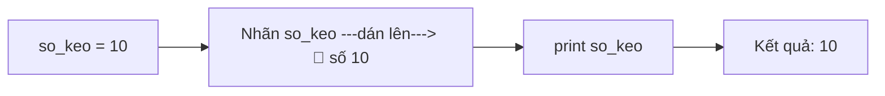
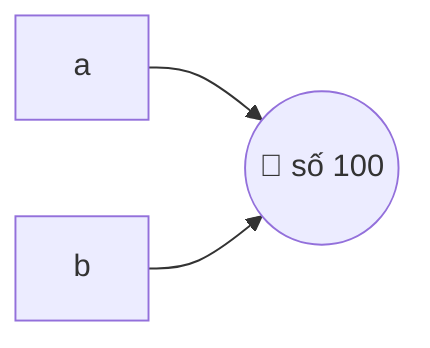

<!-- TỰ ĐỘNG ĐỒNG BỘ từ 01-Co-Ban/04-Bien/bai.md — đừng sửa trực tiếp, sửa bản chính rồi chạy tools/sync_tracks.py -->

# Bài 4 — Biến Trong Python

> 🎓 **Chương 2 – Nền tảng lập trình**

## 🧠 Điều kiện tiên quyết

- [Bài 1 — Giới Thiệu Python](../01-Gioi-Thieu/bai.md)
- [Bài 2 — Cài Đặt Python](../02-Cai-Dat-Python/bai.md)
---

## 🎯 Mục tiêu

Sau bài học này, học viên sẽ:

* ✅ Hiểu **biến là gì** — "cái nhãn có tên" dán lên giá trị để gọi ra dùng.
* ✅ Hiểu `b = a` là dán thêm nhãn (không copy), nền tảng để không bị sốc ở Bài 14 (List).
* ✅ Gán giá trị cho biến bằng dấu `=` và **gán lại giá trị mới** cho biến.
* ✅ Nắm vững **quy tắc đặt tên biến** (chữ cái, số, `_`, không bắt đầu bằng số, không trùng từ khóa).
* ✅ Đặt được **tên biến có nghĩa** theo chuẩn `snake_case`.
* ✅ Dùng hàm `id()` để kiểm tra vùng nhớ của biến.
* ✅ **Gán nhiều biến cùng lúc** và **đổi giá trị 2 biến** (hoán vị).

---

## 📖 Kiến thức

### 1. Biến là gì?

> 💬 **Nói đơn giản:** Biến (variable) là một **cái nhãn có tên** dán lên một
> giá trị, để sau này bạn gọi tên là lấy được giá trị đó ra dùng.

**Ví dụ đời thực:** Trong kho có thùng hàng chứa 10 viên kẹo. Bạn dán lên thùng
một tờ nhãn ghi `so_keo`. Mỗi lần cần biết có bao nhiêu kẹo, bạn chỉ cần đọc
nhãn `so_keo` — không cần mở thùng ra đếm lại. Trong Python cũng vậy:

```python
so_keo = 10   # dán nhãn "so_keo" lên số 10
print(so_keo) # đọc nhãn so_keo => in ra 10
```



* **Trước khi có biến:** muốn dùng số 10 ở nhiều nơi, bạn phải gõ đi gõ lại số 10.
* **Sau khi có biến:** chỉ cần gõ tên biến — và khi nhãn được dán sang giá trị
  mới, mọi nơi dùng biến đều tự động thấy giá trị mới.

> 🧠 **Nhớ kỹ hình ảnh "nhãn dán", đừng hình dung "hộp chứa".**
> Hộp chứa (bỏ đồ vào hộp) nghe quen nhưng sẽ làm bạn **hiểu sai** ở bài sau:
> một giá trị có thể được dán **nhiều nhãn cùng lúc** (`b = a`), và với list
> (Bài 14) thì sửa qua một nhãn sẽ thấy đổi ở nhãn kia. Mô hình "nhãn dán"
> giải thích đúng mọi trường hợp — hộp chứa thì không.

### 2. Gán giá trị cho biến

Cú pháp gán giá trị:

```python
ten_bien = gia_tri
```

> ⚠️ Dấu `=` ở đây **KHÔNG phải "bằng"** trong toán học. Nó có nghĩa là **"gán"** — dán nhãn bên trái lên giá trị bên phải. Nói cách khác: **"nhãn bên trái dán vào giá trị bên phải"**.

| Viết | Nghĩa |
|---|---|
| `tuoi = 15` | Dán nhãn `tuoi` lên số 15 |
| `ten = "Mai"` | Dán nhãn `ten` lên chuỗi "Mai" |
| `diem = 8.5` | Dán nhãn `diem` lên số 8.5 |

Python rất "thông minh": bạn **không cần khai báo kiểu dữ liệu** trước như các ngôn ngữ khác (C, Java). Cứ gán là có.

### 3. Gán lại giá trị — gỡ nhãn, dán sang chỗ mới

Điểm đặc biệt của biến: nhãn có thể được **dán sang giá trị khác**:

```python
diem = 7          # nhãn diem đang dán lên số 7
print(diem)       # 7
diem = 9          # gỡ nhãn diem khỏi số 7, dán sang số 9
print(diem)       # 9
```

Chú ý thứ tự các lệnh: Python chạy từ trên xuống, lệnh gán sau dán nhãn sang
chỗ mới (số 7 cũ vẫn nằm đó, chỉ là không còn nhãn nào dán nó thì Python sẽ
tự dọn đi — bạn không cần quan tâm).

### 3b. Một giá trị có thể mang nhiều nhãn — `b = a` nghĩa là gì?

Đây là điểm quan trọng nhất bài này, đọc chậm:

```python
a = 100     # dán nhãn "a" lên số 100
b = a       # dán THÊM nhãn "b" lên ĐÚNG số 100 đó (không copy gì cả!)
```



Cả hai nhãn cùng trỏ một giá trị. Với **số và chuỗi**, bạn không thể "sửa tại
chỗ" giá trị 100 (số thì chỉ có gán lại số khác) — nên muốn đổi `b` thì bắt
buộc gán lại (`b = 200` là dán nhãn `b` sang số 200), nhãn `a` vẫn dán số 100.
Đó là lý do "sửa b mà a không đổi" **trong bài này**.

> ⚠️ **Nhá hàng quan trọng:** với **list** (Bài 14) thì khác — list SỬA ĐƯỢC
> tại chỗ (`append`, gán phần tử...), nên `b = a` rồi `b.append(99)` thì nhìn
> qua nhãn `a` cũng thấy 99! Đừng gọi đó là "lỗi" — đó chính là mô hình nhãn
> dán hoạt động đúng. Tới Bài 14 bạn sẽ thấy tận mắt, giờ chỉ cần nhớ:
> **`b = a` không copy gì cả, chỉ dán thêm nhãn**.

### 4. Quy tắc đặt tên biến

Python quy định **tên biến chỉ được phép** gồm:

| Được dùng | Ví dụ |
|---|---|
| ✅ Chữ cái (a–z, A–Z) | `ten`, `Tuoi`, `x` |
| ✅ Chữ số (0–9) — **không được đứng đầu** | `lop10` ✅, `10lop` ❌ |
| ✅ Dấu gạch dưới `_` | `so_dien_thoai` |

**Các quy tắc bắt buộc:**

1. **Không bắt đầu bằng chữ số:** `2ten` ❌ → `ten2` ✅
2. **Không chứa dấu cách:** `ho va ten` ❌ → `ho_va_ten` ✅
3. **Không trùng từ khóa của Python:** `if`, `for`, `while`, `class`, `def`, `print`... đều là từ khóa dành riêng.
4. **Không dùng ký tự đặc biệt:** `$`, `%`, `@`, `-`, dấu `đ`... đều không được.
5. **Phân biệt chữ hoa – chữ thường:** `Ten` và `ten` là **hai biến khác nhau**.

**Danh sách từ khóa (một số từ khóa hay gặp):**

```text
False  None  True  and  as  assert  break  class  continue  def
del  elif  else  except  finally  for  from  global  if  import
in  is  lambda  not  or  pass  raise  return  try  while  with  yield
```

> 🧪 **Mẹo kiểm tra:** gõ `import keyword; print(keyword.kwlist)` để xem toàn bộ từ khóa.

### 5. Đặt tên có nghĩa và chuẩn snake_case

* **Tên có nghĩa:** thay vì `a = 15`, hãy viết `tuoi = 15`. Sau 1 tuần đọc lại code, bạn vẫn hiểu `tuoi` là gì, còn `a` thì không ai biết.
* **snake_case:** nhiều từ thì nối nhau bằng dấu gạch dưới, **tất cả chữ thường**:

| ❌ Tên xấu | ✅ Tên đẹp (snake_case) |
|---|---|
| `tbt` | `trung_binh_cong` |
| `HoVaTen` | `ho_va_ten` |
| `SODU` | `so_du_tai_khoan` |
| `tongtien2nguoi` | `tong_tien_2_nguoi` |

### 6. Kiểm tra "mã số" của giá trị bằng id()

Mỗi **giá trị** trong Python có một **mã số định danh**. Hàm `id(...)` trả về
mã số của giá trị mà nhãn đang dán lên — **không phải** mã số của biến:

```python
a = 100
b = a          # dán thêm nhãn "b" lên ĐÚNG số 100 đó (không copy!)
print(id(a))   # ví dụ: 2387456344528
print(id(b))   # giống hệt id(a) — đương nhiên, vì cùng một số 100!
```

> 💡 **Đọc kết quả:** `id` giống nhau chứng minh hai nhãn đang dán **cùng một
> giá trị** — khớp 100% với mô hình nhãn dán ở mục 3b. Với số và chuỗi, muốn
> "đổi" `b` thì chỉ có cách gán lại (`b = 200` — dán nhãn sang số mới), nên
> nhãn `a` không bị ảnh hưởng. Còn với list thì khác — hẹn gặp ở Bài 14!

### 7. Gán nhiều biến cùng lúc

Python cho phép gán nhiều biến trên **một dòng duy nhất**:

```python
a, b, c = 1, 2, 3        # a=1, b=2, c=3
x = y = z = 0            # cả 3 biến cùng bằng 0
print(a, b, c)           # 1 2 3
```

### 8. Đổi giá trị 2 biến (hoán vị)

Tình huống: `a = 3`, `b = 5`, muốn đổi cho `a = 5`, `b = 3`.

**Cách thủ công — dùng biến tạm** (giống mượn cốc thứ 3 để rót nước):

```python
a = 3
b = 5
tam = a     # 1. đổ a vào cốc tạm
a = b       # 2. đổ b vào a
b = tam     # 3. đổ cốc tạm vào b
print(a, b) # 5 3
```

**Cách thần tốc của Python:**

```python
a = 3
b = 5
a, b = b, a
print(a, b) # 5 3
```

> Python tự làm việc "mượn cốc" giúp bạn — một câu lệnh ngắn gọn mà cực kỳ hữu dụng.

---

## 💡 Ví dụ minh họa

### Ví dụ 1: Ba nhãn lưu điểm số

```python
# Dán 3 nhãn lên 3 điểm số
toan = 8
van = 7
anh = 9
# In ra từng điểm
print("Điểm Toán:", toan)
print("Điểm Văn:", van)
print("Điểm Anh:", anh)
```

Kết quả:

```
Điểm Toán: 8
Điểm Văn: 7
Điểm Anh: 9
```

**Giải thích từng dòng:**

| Dòng code | Ý nghĩa |
|---|---|
| `toan = 8` | Dán nhãn `toan` lên số 8 |
| `van = 7`, `anh = 9` | Tương tự cho hai môn còn lại |
| `print("Điểm Toán:", toan)` | In chữ "Điểm Toán:" rồi đọc giá trị nhãn `toan` |

### Ví dụ 2: Biến thay đổi theo thời gian

```python
# Một ngày "vật lộn" với ví tiền
tien = 100000           # Sáng có 100.000 đồng
tien = tien - 35000     # Mua bánh mì trứng
print("Sau bữa sáng:", tien, "đồng")
tien = tien - 20000     # Mua trà sữa
print("Sau trà sữa:", tien, "đồng")
tien = tien + 50000     # Mẹ cho thêm
print("Cuối ngày:", tien, "đồng")
```

Kết quả:

```
Sau bữa sáng: 65000 đồng
Sau trà sữa: 45000 đồng
Cuối ngày: 95000 đồng
```

**Giải thích từng dòng:**

* `tien = tien - 35000` — đọc giá trị nhãn `tien` đang dán (100000), trừ 35000
  được 65000, rồi **dán nhãn `tien` sang số mới 65000** (gỡ khỏi số cũ).
* Mỗi nhãn tại một thời điểm chỉ dán **đúng một giá trị** — gán mới là dán sang
  chỗ mới, không phải "sửa số cũ".

### Ví dụ 3: Hoán đổi hai "cốc nước"

```python
# Hai cốc nước: cốc a có trà, cốc b có sữa
a = "trà"
b = "sữa"
print("Trước:", a, "-", b)
# Dùng một cốc tạm để hoán đổi
tam = a
a = b
b = tam
print("Sau:", a, "-", b)
```

Kết quả:

```
Trước: trà - sữa
Sau: sữa - trà
```

---

## 🔬 Ví dụ nâng cao

### Ví dụ 1: Máy tính điểm trung bình môn

Chương trình dùng biến để lưu điểm, tính tổng và trung bình — tình huống quen thuộc của học sinh:

```python
# Lưu điểm 3 môn học
diem_toan = 8
diem_ly = 7
diem_hoa = 6
# Tính tổng điểm bằng biến trung gian
tong = diem_toan + diem_ly + diem_hoa
# Trung bình = tổng chia cho số môn
trung_binh = tong / 3
# In kết quả
print("Tổng điểm:", tong)
print("Trung bình:", trung_binh)
```

Kết quả: `Tổng điểm: 21` và `Trung bình: 7.0`.

* Nhờ có biến, nếu điểm đổi thì chỉ cần sửa **một chỗ** — mọi tính toán phía sau tự cập nhật.

### Ví dụ 2: Hóa đơn quán trà sữa

Tính tiền cho khách mua nhiều ly — tình huống thực tế ở cửa hàng:

```python
# Giá mỗi ly trà sữa và số lượng
gia_ly = 30000
so_ly = 3
# Tính thành tiền
thanh_tien = gia_ly * so_ly
# Giảm giá 10% cho học sinh
giam_gia = thanh_tien * 0.1
# Tiền phải trả = thành tiền - giảm giá
tien_phai_tra = thanh_tien - giam_gia
# In hóa đơn
print("Thành tiền:", thanh_tien)
print("Giảm giá:", giam_gia)
print("Phải trả:", tien_phai_tra)
```

Kết quả:

```
Thành tiền: 90000
Giảm giá: 9000.0
Phải trả: 81000.0
```

### Ví dụ 3: Tính vận tốc xe máy

Dùng biến lưu quãng đường và thời gian (công thức quen thuộc: `v = s / t`):

```python
# Quãng đường (km) và thời gian (giờ)
quang_duong = 120
thoi_gian = 2.5
# Vận tốc trung bình (km/h)
van_toc = quang_duong / thoi_gian
print("Vận tốc trung bình:", van_toc, "km/h")
```

Kết quả: `Vận tốc trung bình: 48.0 km/h`.

> 💡 Cả 3 ví dụ trên đều theo công thức chung của lập trình: **dữ liệu → biến → xử lý → in kết quả**.

---

## ⚠️ Lỗi thường gặp

### Lỗi 1: Dùng biến chưa được gán

```python
print(so_keo)   # ❌ chưa gán so_keo bao giờ
```

* **Kết quả báo:** `NameError: name 'so_keo' is not defined`
* **Nguyên nhân:** Python không tìm thấy nhãn `so_keo` — bạn quên gán `so_keo = ...` trước đó.
* **Cách sửa:** gán giá trị trước khi dùng: `so_keo = 10` rồi mới `print(so_keo)`.

### Lỗi 2: Tên biến bắt đầu bằng số

```python
2ten = "Mai"   # ❌ SAI
```

* **Kết quả báo:** `SyntaxError: invalid decimal literal`
* **Nguyên nhân:** tên biến không được bắt đầu bằng chữ số.
* **Cách sửa:** `ten2 = "Mai"` — đưa số về cuối tên.

### Lỗi 3: Trùng từ khóa Python

```python
if = 5   # ❌ SAI — if là từ khóa
```

* **Kết quả báo:** `SyntaxError: invalid syntax`
* **Nguyên nhân:** `if` là từ khóa dành riêng cho câu lệnh điều kiện.
* **Cách sửa:** đổi tên: `dieu_kien = 5` hoặc `if_so = 5`.

### Lỗi 4: Nhầm lẫn chữ hoa – chữ thường

```python
Diem = 8
print(diem)   # ❌ SAI — dùng sai chữ hoa
```

* **Kết quả báo:** `NameError: name 'diem' is not defined`
* **Nguyên nhân:** Python coi `Diem` và `diem` là hai biến khác nhau.
* **Cách sửa:** dùng nhất quán một kiểu viết: tất cả chữ thường theo chuẩn `snake_case`.

### Lỗi 5: Dùng một dấu `=` để so sánh

```python
a = 5
if a = 5:   # ❌ SAI — một dấu = là gán, so sánh phải là ==
    print("Đúng")
```

* **Kết quả báo:** `SyntaxError: invalid syntax`
* **Nguyên nhân:** `=` là toán tử **gán**, toán tử **so sánh bằng** là `==` (sẽ học kỹ ở Bài 6).
* **Cách sửa:** viết `if a == 5:`.

---

## 💎 Mẹo

* 🏷️ **Hình dung biến như nhãn dán:** tên biến là tờ nhãn, giá trị là đồ vật;
  gán là dán nhãn lên đồ vật, gán lại là gỡ ra dán sang đồ vật khác,
  `b = a` là dán thêm một nhãn lên cùng đồ vật.
* 🏷️ **Đặt tên có nghĩa:** `diem_toan` tốt hơn `x`; sau này đọc lại code sẽ không phải "giải mã".
* 🐍 **Chuẩn snake_case:** chữ thường + gạch dưới: `tong_tien`, `so_luong_hoc_sinh`.
* 🔢 **Không bao giờ viết hoa đầu tên biến** — chuẩn đó dành riêng cho lớp (học ở Bài 23 OOP).
* 🧪 **Debug bằng print():** khi kết quả sai, hãy in giá trị biến ra để xem từng bước — kỹ thuật của mọi lập trình viên.
* 📝 **Gán một lần mỗi biến khi mới bắt đầu:** chia code thành "đọc → gán → in" sẽ dễ hiểu hơn.

---

## 📝 Tóm tắt

| Khái niệm | Nội dung |
|---|---|
| 🏷️ Biến | Cái nhãn có tên dán lên giá trị để gọi ra dùng |
| ✍️ Gán giá trị | `ten_bien = gia_tri` — dán nhãn trái lên giá trị phải (`=` là gán, không phải so sánh) |
| 🔄 Gán lại | Gỡ nhãn khỏi giá trị cũ, dán sang giá trị mới |
| 👯 `b = a` | Dán thêm nhãn (không copy); số/chuỗi thì a không ảnh hưởng, list thì có (Bài 14) |
| 📛 Quy tắc tên | Chữ cái, số (không đứng đầu), `_`; không trùng từ khóa; không dấu cách |
| 🔤 Hoa – thường | Phân biệt: `Ten` ≠ `ten` |
| 🐍 snake_case | `ho_va_ten`, `so_du` — dễ đọc, chuẩn Python |
| 📍 `id()` | Trả về địa chỉ vùng nhớ của biến |
| ✌️ Nhiều biến | `a, b, c = 1, 2, 3` hoặc `x = y = 0` |
| 🔁 Hoán đổi | `a, b = b, a` — đổi giá trị 2 biến |

---

## 🧪 Kiểm tra nhanh

1. ❓ Biến là gì? Vì sao cần dùng biến?
2. ❓ Dấu `=` trong Python có nghĩa là gì?
3. ❓ Viết lệnh gán số 2026 cho biến `nam_hien_tai`.
4. ❓ Tên biến nào sau đây hợp lệ: `lop10`, `10lop`, `ho va ten`, `ho_va_ten`?
5. ❓ Vì sao không thể đặt tên biến là `for` hay `if`?
6. ❓ `Ten` và `ten` có phải là một biến không?
7. ❓ Lệnh `a, b, c = 1, 2, 3` cho kết quả gì?
8. ❓ Viết một dòng lệnh hoán đổi giá trị 2 biến `x` và `y`.
9. ❓ `id()` dùng để làm gì?
10. ❓ Khi gán `b = a` (với `a` là số) rồi gán lại `b = 200`, nhãn `a` còn dán số cũ không? Vì sao? Với list thì sao (đón đọc Bài 14)?

<details>
<summary>🔍 Xem đáp án</summary>

1. Biến là "nhãn có tên" dán lên giá trị; dùng để tái sử dụng và cập nhật dữ liệu một chỗ.
2. Dấu gán — dán nhãn tên bên trái lên giá trị bên phải.
3. `nam_hien_tai = 2026`.
4. `lop10` và `ho_va_ten` hợp lệ; `10lop` sai (bắt đầu bằng số), `ho va ten` sai (có dấu cách).
5. Vì chúng là từ khóa dành riêng của Python.
6. Không — Python phân biệt chữ hoa chữ thường.
7. `a = 1`, `b = 2`, `c = 3`.
8. `x, y = y, x`.
9. Trả về địa chỉ vùng nhớ của biến.
10. Nhãn `a` vẫn dán số cũ — vì `b = a` chỉ dán thêm nhãn `b` lên cùng giá trị,
   còn `b = 200` là dán nhãn `b` sang số mới, không động tới nhãn `a`.
   Với list thì khác: list sửa được tại chỗ nên `b.append(...)` sẽ thấy đổi
   qua cả nhãn `a` — chi tiết ở Bài 14.

</details>

---

## 📚 Bài đọc thêm

* [Python.org – Hướng dẫn chính thức: khai báo biến (W3Schools)](https://www.w3schools.com/python/python_variables.asp)
* [Python.org – Từ khóa dành riêng](https://docs.python.org/3/reference/lexical_analysis.html#keywords)
* [PEP 8 – Quy ước đặt tên biến (section Naming Conventions)](https://peps.python.org/pep-0008/#naming-conventions)
* [Python Tutor – chạy từng bước để xem nhãn biến đổi chỗ dán](https://pythontutor.com/)

---

---

## 🧩 Bài tập

> 📝 🎯 **Chủ đề:** Khai báo biến, gán và gán lại giá trị, quy tắc đặt tên, gán nhiều biến, hoán đổi giá trị.

## 🟢 Dễ (Bài 1 – 7)

### Bài 1: Chiếc nhãn đầu tiên

* **Đề bài:** Tạo biến `lop` chứa chuỗi `"10A1"` và in giá trị của nó ra màn hình.
* **Input:** Không có.
* **Output:**
  ```
  10A1
  ```
* **Gợi ý:** Gán `lop = "10A1"` rồi `print(lop)`.

### Bài 2: Điểm môn học

* **Đề bài:** Tạo biến `diem` có giá trị `8.5`, rồi in ra câu `Diem cua toi la: 8.5`.
* **Input:** Không có.
* **Output:**
  ```
  Diem cua toi la: 8.5
  ```
* **Gợi ý:** `print("Diem cua toi la:", diem)`.

### Bài 3: Dán nhãn sang chỗ mới

* **Đề bài:** Biến `so` đầu tiên được gán `5`, sau đó gán lại `10`. In ra giá trị cuối cùng của `so`.
* **Input:** Không có.
* **Output:**
  ```
  10
  ```
* **Gợi ý:** Lệnh gán sau sẽ ghi đè lệnh gán trước.

### Bài 4: Đặt tên đúng hay sai

* **Đề bài:** Chương trình sau bị lỗi. Hãy sửa để chạy được:

  ```python
  1ten = "An"
  print(1ten)
  ```
* **Output mong đợi:**
  ```
  An
  ```
* **Gợi ý:** Tên biến không được bắt đầu bằng chữ số.

### Bài 5: Ba biến, ba món quà

* **Đề bài:** Dùng một dòng lệnh gán 3 biến `a`, `b`, `c` lần lượt cho `1`, `2`, `3`, rồi in cả ba giá trị.
* **Input:** Không có.
* **Output:**
  ```
  1 2 3
  ```
* **Gợi ý:** `a, b, c = 1, 2, 3`.

### Bài 6: Tổng hai số

* **Đề bài:** Tạo hai biến `x = 12` và `y = 30`, tính tổng lưu vào biến `tong`, in ra câu `Tong la: 42`.
* **Input:** Không có.
* **Output:**
  ```
  Tong la: 42
  ```
* **Gợi ý:** `tong = x + y` rồi in.

### Bài 7: Tên biến viết thường

* **Đề bài:** Tạo biến `TenTruong` chứa `"THPT Python"`. Viết lại bằng chuẩn snake_case rồi in giá trị.
* **Input:** Không có.
* **Output:**
  ```
  THPT Python
  ```
* **Gợi ý:** Tên đẹp là `ten_truong`, tất cả chữ thường, dùng dấu `_`.

---

## 🟡 Trung bình (Bài 8 – 14)

### Bài 8: Hoán đổi bằng biến tạm

* **Đề bài:** Cho `a = 3` và `b = 7`. Dùng **một biến tạm** để đổi giá trị hai biến cho nhau, in kết quả.
* **Input:** Không có.
* **Output:**
  ```
  7 3
  ```
* **Gợi ý:** Mượn "cốc thứ ba" để rót: `tam = a`, `a = b`, `b = tam`.

### Bài 9: Hoán đổi kiểu Python

* **Đề bài:** Cho `x = "banh mi"` và `y = "pho"`. Đổi giá trị hai biến **không dùng biến tạm**, in kết quả.
* **Input:** Không có.
* **Output:**
  ```
  pho banh mi
  ```
* **Gợi ý:** `x, y = y, x` — một dòng duy nhất.

### Bài 10: Ví tiền trong một ngày

* **Đề bài:** Sáng có `tien = 200000`. Buổi trưa mua cơm hết `45000`, chiều mua sách hết `80000`, tối mẹ cho thêm `100000`. Dùng biến `tien` cập nhật liên tiếp, in số tiền cuối ngày.
* **Input:** Không có.
* **Output:**
  ```
  So tien con lai: 175000
  ```
* **Gợi ý:** `tien = tien - 45000`, rồi `tien = tien - 80000`, rồi `tien = tien + 100000`.

### Bài 11: Điểm trung bình hai môn

* **Đề bài:** Biến `diem_toan = 9`, `diem_van = 7`. Tính trung bình cộng hai môn lưu vào biến `trung_binh`, in ra câu `Trung binh: 8.0`.
* **Input:** Không có.
* **Output:**
  ```
  Trung binh: 8.0
  ```
* **Gợi ý:** `trung_binh = (diem_toan + diem_van) / 2`.

### Bài 12: Chỉnh sửa chỗ sai

* **Đề bài:** Tìm và sửa lỗi trong chương trình:

  ```python
  so qua = 5
  print(so_qua)
  ```
* **Output mong đợi:**
  ```
  5
  ```
* **Gợi ý:** Tên biến không được chứa dấu cách; còn có một lỗi in không khớp tên.

### Bài 13: Tìm ra con số lớn hơn

* **Đề bài:** Cho hai biến `m = 15`, `n = 9`. Dùng hàm `max(m, n)` gán cho biến `lon_nhat`, in câu `So lon hon: 15`.
* **Input:** Không có.
* **Output:**
  ```
  So lon hon: 15
  ```
* **Gợi ý:** `lon_nhat = max(m, n)` — `max` là hàm lấy giá trị lớn nhất.

### Bài 14: Đổi đơn vị giờ – phút

* **Đề bài:** Biến `phut = 135`. Tính xem 135 phút bằng bao nhiêu giờ và bao nhiêu phút còn thừa, lưu vào `gio` và `phut_con`, in kết quả.
* **Input:** Không có.
* **Output:**
  ```
  135 phut = 2 gio 15 phut
  ```
* **Gợi ý:** `gio = phut // 60`, `phut_con = phut % 60` — phép chia lấy nguyên và lấy dư (học kỹ ở Bài 6).

---

## 🔴 Khó (Bài 15 – 20)

### Bài 15: Hoán đổi không cần biến tạm (phiên bản tay đôi)

* **Đề bài:** Cho `a = 4`, `b = 9`. Đổi giá trị cho nhau **chỉ dùng phép toán cộng/trừ, không dùng biến tạm, không dùng `a, b = b, a`**, in kết quả.
* **Input:** Không có.
* **Output:**
  ```
  a = 9, b = 4
  ```
* **Gợi ý:** Thử `a = a + b` (a trở thành 13), rồi `b = a - b`, rồi `a = a - b`. Giải thích vì sao cách này không nên dùng cho chuỗi.

### Bài 16: Kiểm tra `id()` của biến

* **Đề bài:** Tạo `x = 1000` và `y = x`. In `id(x)` và `id(y)`, so sánh xem chúng có bằng nhau không. Sau đó gán `y = 2000` và in lại `id(y)` kèm câu kết luận ngắn.
* **Input:** Không có.
* **Output:**
  ```
  id(x) = ... 
  id(y) = ...
  id(x) == id(y): True
  Sau khi y doi gia tri...
  ```
* **Gợi ý:** `id(x) == id(y)` so sánh hai địa chỉ. Khi `y` nhận giá trị mới, nó chuyển sang vùng nhớ khác.

### Bài 17: Hóa đơn mua kẹo

* **Đề bài:** Cửa hàng bán `so_goi_keo = 4` gói, mỗi gói `gia_goi = 12000`. Mua thêm 1 gói sau đó. Tính tổng tiền lưu vào biến `tong_tien` và in ra câu `Tong tien: 60000`.
* **Input:** Không có.
* **Output:**
  ```
  Tong tien: 60000
  ```
* **Gợi ý:** Cập nhật `so_goi_keo = so_goi_keo + 1` trước khi tính, hoặc tính `tong_tien = (so_goi_keo + 1) * gia_goi`.

### Bài 18: Thời khóa biểu dùng biến

* **Đề bài:** Tạo 3 biến `mon1`, `mon2`, `mon3` lần lượt chứa `"Toan"`, `"Van"`, `"Tin"`. Hoán đổi để `mon1` thành `"Tin"`, `mon3` thành `"Toan"` (chỉ đổi `mon1` và `mon3`), in cả ba.
* **Input:** Không có.
* **Output:**
  ```
  Tin Van Toan
  ```
* **Gợi ý:** Đổi hai biến bằng `mon1, mon3 = mon3, mon1`.

### Bài 19: Chương trình nhập điểm kiểu "sắp hàng"

* **Đề bài:** Biến `diem1 = 5`, `diem2 = 8`. Vì điểm 2 cao hơn, bạn muốn xếp `cao` chứa điểm lớn hơn và `thap` chứa điểm nhỏ hơn. Không dùng hàm `max/min`, hãy dùng biến tạm và phép so sánh `if` để gán đúng (có thể dùng `if` đơn giản).
* **Input:** Không có.
* **Output:**
  ```
  Cao: 8 - Thap: 5
  ```
* **Gợi ý:** Gán `cao = diem1`, `thap = diem2`; nếu `diem1 < diem2` thì đổi ngược lại bằng biến tạm.

### Bài 20: Mô phỏng "chia đôi kẹo"

* **Đề bài:** Bạn có `so_keo = 25` viên kẹo. Mỗi ngày bạn ăn hết 3 viên và nhận thêm 2 viên từ bạn bè. Mô phỏng 3 ngày bằng biến `so_keo` (cập nhật liên tiếp), mỗi ngày in số kẹo còn lại. Ngày nào số kẹo còn lại là số chẵn thì gán `so_le = False`, ngược lại `so_le = True` (chỉ cần gán ở ngày cuối).
* **Input:** Không có.
* **Output:**
  ```
  Ngay 1: 24
  Ngay 2: 23
  Ngay 3: 22
  So keo con lai la so chan: True
  ```
* **Gợi ý:** Mỗi ngày `so_keo = so_keo - 3 + 2`; số chẵn kiểm tra bằng `so_keo % 2 == 0` (học kỹ ở Bài 6).

---

## 🎯 Tổng kết sau khi làm bài

Sau 20 bài tập, bạn đã:

* ✅ Khai báo, gán và gán lại biến thành thạo.
* ✅ Nắm vững quy tắc đặt tên biến và chuẩn `snake_case`.
* ✅ Gán nhiều biến cùng lúc, hoán đổi giá trị bằng nhiều cách.
* ✅ Biết kiểm tra mã số giá trị bằng `id()` và hiểu `b = a` là dán thêm nhãn.

> 💪 Khi gặp `NameError`, hãy kiểm tra: biến đã được gán trước khi dùng chưa? Tên viết đúng hoa – thường chưa? **Lập trình là luyện tập!**

---

## ✅ Đáp án

> 💡 **Hãy tự làm bài tập trước** rồi mới mở đáp án.

## 🟢 Dễ (Bài 1 – 7)


<details>
<summary>✅ Bài 1: Chiếc nhãn đầu tiên</summary>


**Phân tích:** Khai báo biến và in giá trị ra màn hình.

**Ý tưởng:** Gán chuỗi vào biến `lop`, rồi dùng `print()`.

**Thuật toán:**
1. Gán `"10A1"` cho biến `lop`.
2. In biến `lop`.

**Code:**

```python
# Gán chuỗi cho biến lop
lop = "10A1"
# In giá trị trong biến lop
print(lop)
```

**Giải thích code:**

* `lop = "10A1"` — dán nhãn `lop` lên chuỗi `"10A1"`.
* `print(lop)` — đọc giá trị nhãn dán nên kết quả là `10A1` (không có dấu nháy).

**Độ phức tạp:** O(1).

---

</details>

<details>
<summary>✅ Bài 2: Điểm môn học</summary>


**Phân tích:** In nhãn chữ kèm giá trị biến số thực.

**Ý tưởng:** `print()` với hai đối số cách nhau dấu phẩy.

**Thuật toán:**
1. Gán `8.5` cho `diem`.
2. In nhãn và giá trị.

**Code:**

```python
# Gán điểm cho biến diem
diem = 8.5
# In nhãn rồi in giá trị biến
print("Diem cua toi la:", diem)
```

**Giải thích code:**

* `diem = 8.5` — số thực (`float`), viết dấu chấm chứ không phải dấu phẩy.
* Dấu phẩy trong `print()` giúp in chuỗi nhãn và giá trị biến trên cùng dòng, có khoảng trắng giữa chúng.

**Độ phức tạp:** O(1).

---

</details>

<details>
<summary>✅ Bài 3: Dán nhãn sang chỗ mới</summary>


**Phân tích:** Biến được gán hai lần — giá trị sau ghi đè giá trị trước.

**Ý tưởng:** Gán `5` cho `so`, rồi gán lại `10`; in ra giá trị mới nhất.

**Thuật toán:**
1. Gán `so = 5`.
2. Gán lại `so = 10`.
3. In `so`.

**Code:**

```python
so = 5       # lần gán thứ nhất
so = 10      # lần gán thứ hai - ghi đè giá trị cũ
print(so)    # in giá trị mới nhất
```

**Giải thích code:**

* Sau lệnh thứ hai, nhãn `so` dán sang `10` (gỡ khỏi `5`).
* Python in ra giá trị **hiện tại cuối cùng** của biến.

**Độ phức tạp:** O(1).

---

</details>

<details>
<summary>✅ Bài 4: Đặt tên đúng hay sai</summary>


**Phân tích:** Tên biến bắt đầu bằng chữ số nên bị `SyntaxError`.

**Ý tưởng:** Đưa chữ số về cuối tên hoặc dùng gạch dưới.

**Thuật toán:**
1. Đổi `1ten` thành `ten1`.
2. Sửa cả ở lệnh `print`.

**Code:**

```python
ten1 = "An"      # tên biến tận cùng bằng số là hợp lệ
print(ten1)
```

**Giải thích code:**

* `ten1` — chữ số đứng sau chữ cái nên hợp lệ.
* Cả khai báo và in phải dùng cùng một tên, cùng kiểu viết hoa – thường.

**Độ phức tạp:** O(1).

---

</details>

<details>
<summary>✅ Bài 5: Ba biến, ba món quà</summary>


**Phân tích:** Gán nhiều biến cùng lúc trên một dòng.

**Ý tưởng:** Dùng cú pháp `a, b, c = 1, 2, 3`.

**Thuật toán:**
1. Gán ba biến.
2. In cả ba.

**Code:**

```python
# Gán 3 biến cùng lúc
a, b, c = 1, 2, 3
# In cả ba giá trị
print(a, b, c)
```

**Giải thích code:**

* `a, b, c = 1, 2, 3` — Python gán lần lượt theo thứ tự: `a=1`, `b=2`, `c=3`.
* `print(a, b, c)` in ba số trên một dòng, ngăn cách bởi khoảng trắng.

**Độ phức tạp:** O(1).

---

</details>

<details>
<summary>✅ Bài 6: Tổng hai số</summary>


**Phân tích:** Tính tổng hai biến rồi lưu vào biến thứ ba.

**Ý tưởng:** `tong = x + y` — Python tính `12 + 30` trước, rồi gán `42` cho `tong`.

**Thuật toán:**
1. Gán `x`, `y`.
2. Tính và gán `tong`.
3. In câu kết quả.

**Code:**

```python
x = 12
y = 30
# Tính tổng và gán cho biến tong
tong = x + y
print("Tong la:", tong)
```

**Giải thích code:**

* `tong = x + y` — vế phải được tính trước (`42`), sau đó mới gán vào biến `tong`.
* Nhờ biến `tong`, giá trị tổng được lưu lại để dùng ở lệnh in.

**Độ phức tạp:** O(1).

---

</details>

<details>
<summary>✅ Bài 7: Tên biến viết thường</summary>


**Phân tích:** Luyện chuẩn `snake_case` — chữ thường và dấu gạch dưới.

**Ý tưởng:** `TenTruong` → `ten_truong`.

**Thuật toán:**
1. Gán giá trị cho `ten_truong`.
2. In biến.

**Code:**

```python
# Tên biến theo chuẩn snake_case
ten_truong = "THPT Python"
print(ten_truong)
```

**Giải thích code:**

* `snake_case`: chữ thường, nhiều từ nối bằng `_`.
* Giá trị chuỗi giữ nguyên chữ hoa trong nội dung — chỉ tên biến mới viết thường.

**Độ phức tạp:** O(1).

---

</details>

## 🟡 Trung bình (Bài 8 – 14)


<details>
<summary>✅ Bài 8: Hoán đổi bằng biến tạm</summary>


**Phân tích:** Đổi giá trị hai biến cần "cốc thứ ba" để không mất dữ liệu.

**Ý tưởng:** Sao chép `a` sang `tam`, đổ `b` vào `a`, đổ `tam` vào `b`.

**Thuật toán:**
1. `tam = a` — giữ giá trị cũ của `a`.
2. `a = b` — `a` nhận giá trị của `b`.
3. `b = tam` — `b` nhận giá trị cũ của `a`.

**Code:**

```python
a = 3
b = 7
# Dùng biến tạm để hoán đổi
tam = a
a = b
b = tam
print(a, b)
```

**Giải thích code:**

* Nếu viết `a = b` trước thì giá trị `a = 3` sẽ biến mất — nên phải giữ ở `tam`.
* Sau ba lệnh gán, `a = 7`, `b = 3`.

**Độ phức tạp:** O(1).

---

</details>

<details>
<summary>✅ Bài 9: Hoán đổi kiểu Python</summary>


**Phân tích:** Hoán đổi hai biến trong một dòng duy nhất.

**Ý tưởng:** `x, y = y, x` — Python tự xử lý việc "mượn cốc" bên trong.

**Thuật toán:**
1. Gán `x`, `y`.
2. Hoán đổi bằng `x, y = y, x`.
3. In kết quả.

**Code:**

```python
x = "banh mi"
y = "pho"
# Hoán đổi hai biến - một dòng duy nhất
x, y = y, x
print(x, y)
```

**Giải thích code:**

* `x, y = y, x` — vế phải được đánh giá trước (`"pho", "banh mi"`), sau đó mới gán lần lượt cho `x`, `y`.
* Kết quả in ra: `pho banh mi`.

**Độ phức tạp:** O(1).

---

</details>

<details>
<summary>✅ Bài 10: Ví tiền trong một ngày</summary>


**Phân tích:** Cập nhật biến liên tục theo các sự kiện trong ngày.

**Ý tưởng:** Mỗi lần chi tiêu hoặc nhận tiền, gán lại `tien = tien ± số tiền`.

**Thuật toán:**
1. `tien = 200000` — khởi tạo.
2. Trừ tiền mua cơm.
3. Trừ tiền mua sách.
4. Cộng tiền mẹ cho.
5. In kết quả.

**Code:**

```python
tien = 200000              # sáng có 200.000 đồng
tien = tien - 45000        # mua cơm trưa
tien = tien - 80000        # mua sách chiều
tien = tien + 100000       # mẹ cho thêm buổi tối
print("So tien con lai:", tien)
```

**Giải thích code:**

* `tien = tien - 45000` — lấy giá trị hiện tại (200000) trừ 45000, dán nhãn `tien` sang kết quả mới (155000).
* Qua mỗi lần gán, nhãn `tien` dán sang số mới: 200000 → 155000 → 75000 → 175000.

**Độ phức tạp:** O(1).

---

</details>

<details>
<summary>✅ Bài 11: Điểm trung bình hai môn</summary>


**Phân tích:** Trung bình cộng hai số = tổng chia 2.

**Ý tưởng:** `(diem_toan + diem_van) / 2` — dấu ngoặc đảm bảo tính tổng trước.

**Thuật toán:**
1. Gán hai điểm.
2. Tính trung bình.
3. In kết quả.

**Code:**

```python
diem_toan = 9
diem_van = 7
# Trung bình cộng hai môn
trung_binh = (diem_toan + diem_van) / 2
print("Trung binh:", trung_binh)
```

**Giải thích code:**

* `(9 + 7) / 2 = 16 / 2 = 8.0`.
* Phép chia `/` luôn cho số thực nên kết quả in ra là `8.0`.

**Độ phức tạp:** O(1).

---

</details>

<details>
<summary>✅ Bài 12: Chỉnh sửa chỗ sai</summary>


**Phân tích:** Hai lỗi: tên biến chứa dấu cách và lệnh `print` dùng sai tên.

**Ý tưởng:** Chuẩn hóa tên theo `snake_case` cho cả khai báo và in.

**Thuật toán:**
1. Đổi `so qua` thành `so_qua`.
2. Sửa `print` dùng đúng `so_qua`.

**Code:**

```python
so_qua = 5        # tên biến không chứa dấu cách
print(so_qua)
```

**Giải thích code:**

* `so_qua` — dấu gạch dưới thay cho dấu cách.
* Code gốc viết `print(so_qua)` nhưng khai báo `so qua` (có dấu cách) nên Python báo `SyntaxError` ngay ở dòng khai báo; sau khi sửa, in ra `5`.

**Độ phức tạp:** O(1).

---

</details>

<details>
<summary>✅ Bài 13: Tìm ra con số lớn hơn</summary>


**Phân tích:** Dùng hàm có sẵn `max()` để chọn giá trị lớn nhất.

**Ý tưởng:** `lon_nhat = max(m, n)`.

**Thuật toán:**
1. Gán `m`, `n`.
2. Gán `lon_nhat = max(m, n)`.
3. In câu kết quả.

**Code:**

```python
m = 15
n = 9
# max() trả về giá trị lớn nhất giữa hai số
lon_nhat = max(m, n)
print("So lon hon:", lon_nhat)
```

**Giải thích code:**

* `max(15, 9)` trả về `15`.
* Kết quả lưu vào biến `lon_nhat` rồi mới in — tách bạch tính toán và hiển thị.

**Độ phức tạp:** O(1).

---

</details>

<details>
<summary>✅ Bài 14: Đổi đơn vị giờ – phút</summary>


**Phân tích:** 135 phút = số giờ nguyên + phút thừa. Dùng phép chia lấy nguyên `//` và lấy dư `%`.

**Ý tưởng:** `gio = phut // 60`, `phut_con = phut % 60`.

**Thuật toán:**
1. Khởi tạo `phut = 135`.
2. Tính số giờ.
3. Tính số phút thừa.
4. In kết quả.

**Code:**

```python
phut = 135
# 1 giờ = 60 phút: chia lấy nguyên để ra số giờ
gio = phut // 60
# Phần dư là số phút còn thừa
phut_con = phut % 60
print("135 phut =", gio, "gio", phut_con, "phut")
```

**Giải thích code:**

* `135 // 60 = 2` (bỏ phần lẻ).
* `135 % 60 = 15` (phần dư).
* `print` với nhiều đối số tạo dòng kết quả hoàn chỉnh.

**Độ phức tạp:** O(1).

---

</details>

## 🔴 Khó (Bài 15 – 20)


<details>
<summary>✅ Bài 15: Hoán đổi không cần biến tạm (phiên bản tay đôi)</summary>


**Phân tích:** Dùng phép cộng – trừ để hoán đổi hai số mà không cần biến phụ.

**Ý tưởng:** Gộp hai giá trị vào `a`, sau đó khôi phục lần lượt từng biến.

**Thuật toán:**
1. `a = a + b` → `a = 13`.
2. `b = a - b` → `b = 13 - 9 = 4` (giá trị cũ của b đã được lưu trong `a`).
3. `a = a - b` → `a = 13 - 4 = 9`.

**Code:**

```python
a = 4
b = 9
# Hoán đổi bằng phép cộng và trừ
a = a + b    # a = 4 + 9 = 13
b = a - b    # b = 13 - 9 = 4
a = a - b    # a = 13 - 4 = 9
print("a =", a, ", b =", b)
```

**Giải thích code:**

* Ở bước 2, `b` vẫn giữ giá trị gốc `9` khi được dùng trong phép trừ, vì phép tính lấy giá trị trước khi gán.
* Kết quả: `a = 9, b = 4`.
* ⚠️ Hạn chế: cách này chỉ đúng với **số**; với chuỗi ký tự thì phép `+ -` không dùng được — vì vậy cách an toàn nhất vẫn là `a, b = b, a` hoặc biến tạm.

**Độ phức tạp:** O(1).

---

</details>

<details>
<summary>✅ Bài 16: Kiểm tra `id()` của biến</summary>


**Phân tích:** `id(...)` trả về mã số của giá trị. `y = x` dán thêm nhãn `y` lên cùng giá trị nên hai nhãn trỏ tới cùng một đối tượng ban đầu.

**Ý tưởng:** So sánh `id(x)` và `id(y)` trước và sau khi đổi giá trị `y`.

**Thuật toán:**
1. Gán `x = 1000`, `y = x`.
2. In `id` của cả hai và so sánh.
3. Gán `y = 2000`, in lại.

**Code:**

```python
x = 1000
y = x                 # dán thêm nhãn y lên cùng số 1000 (không copy!)
print("id(x) =", id(x))
print("id(y) =", id(y))
print("id(x) == id(y):", id(x) == id(y))
# Đổi giá trị y
y = 2000
print("Sau khi y doi gia tri:")
print("id(y) =", id(y))
print("id(x) == id(y):", id(x) == id(y))
```

**Giải thích code:**

* Ban đầu `x` và `y` cùng trỏ tới đối tượng `1000` nên `id` bằng nhau.
* Sau khi `y` nhận giá trị mới `2000` (dán nhãn `y` sang số mới), mã số của `y` đổi còn `x` vẫn như cũ. Điều này chứng minh `b = a` chỉ dán thêm nhãn chứ không "dính" hai biến vào nhau — muốn đổi `b` thì gán lại, nhãn `a` không ảnh hưởng (với số và chuỗi).

**Độ phức tạp:** O(1).

---

</details>

<details>
<summary>✅ Bài 17: Hóa đơn mua kẹo</summary>


**Phân tích:** Mua 4 gói, sau đó mua thêm 1 gói — tổng 5 gói, mỗi gói 12000.

**Ý tưởng:** Cập nhật số gói trước khi tính tiền, hoặc cộng trực tiếp vào số lượng.

**Thuật toán:**
1. Khởi tạo `so_goi_keo = 4`, `gia_goi = 12000`.
2. Cập nhật `so_goi_keo = so_goi_keo + 1`.
3. Tính `tong_tien = so_goi_keo * gia_goi`.
4. In kết quả.

**Code:**

```python
so_goi_keo = 4
gia_goi = 12000
# Mua thêm 1 gói nữa
so_goi_keo = so_goi_keo + 1
# Tính tổng tiền
tong_tien = so_goi_keo * gia_goi
print("Tong tien:", tong_tien)
```

**Giải thích code:**

* `so_goi_keo + 1` → `5`, gán lại vào biến.
* `5 * 12000 = 60000`.
* Nếu không cập nhật biến mà vẫn dùng giá trị cũ thì kết quả sẽ nhầm (40000).

**Độ phức tạp:** O(1).

---

</details>

<details>
<summary>✅ Bài 18: Thời khóa biểu dùng biến</summary>


**Phân tích:** Hoán đổi `mon1` và `mon3`, giữ nguyên `mon2`.

**Ý tưởng:** `mon1, mon3 = mon3, mon1`.

**Thuật toán:**
1. Khởi tạo 3 biến.
2. Hoán đổi `mon1` và `mon3`.
3. In cả ba.

**Code:**

```python
mon1 = "Toan"
mon2 = "Van"
mon3 = "Tin"
# Hoán đổi môn thứ 1 và thứ 3
mon1, mon3 = mon3, mon1
print(mon1, mon2, mon3)
```

**Giải thích code:**

* Trước: `mon1="Toan"`, `mon3="Tin"`. Sau hoán đổi: `mon1="Tin"`, `mon3="Toan"`.
* `mon2` không đổi nên dòng in ra `Tin Van Toan`.

**Độ phức tạp:** O(1).

---

</details>

<details>
<summary>✅ Bài 19: Chương trình "sắp hàng" điểm số</summary>


**Phân tích:** Xếp hai điểm thành `cao` và `thap` bằng phép so sánh `if` đơn giản.

**Ý tưởng:** Giả định `cao = diem1`, nếu `diem1` nhỏ hơn `diem2` thì hoán đổi bằng biến tạm.

**Thuật toán:**
1. Gán `cao = diem1`, `thap = diem2`.
2. Nếu `diem1 < diem2` → dùng biến tạm hoán đổi hai biến.
3. In kết quả.

**Code:**

```python
diem1 = 5
diem2 = 8
cao = diem1
thap = diem2
# Nếu điểm 1 nhỏ hơn điểm 2 thì phải hoán đổi
if cao < thap:
    tam = cao
    cao = thap
    thap = tam
print("Cao:", cao, "- Thap:", thap)
```

**Giải thích code:**

* Câu lệnh `if cao < thap:` — nếu điều kiện đúng thì chạy khối phía dưới (thụt lề 4 dấu cách).
* Vì `5 < 8` nên hoán đổi: `cao = 8`, `thap = 5`.
* Đây là bước đệm cho Bài 8 – câu lệnh rẽ nhánh `if`.

**Độ phức tạp:** O(1).

---

</details>

<details>
<summary>✅ Bài 20: Mô phỏng "chia đôi kẹo"</summary>


**Phân tích:** Mỗi ngày số kẹo giảm 3 và tăng 2 → mạng lại lưới biết trước mỗi ngày.

**Ý tưởng:** Cập nhật `so_keo` liên tiếp 3 lần, mỗi lần in; cuối cùng kiểm tra số chẵn bằng `% 2 == 0`.

**Thuật toán:**
1. `so_keo = 25`.
2. Ngày 1: `so_keo = so_keo - 3 + 2` → 24, in.
3. Ngày 2: tiếp tục trừ 3 cộng 2 → 23, in.
4. Ngày 3: → 22, in và kiểm tra chẵn lẻ.

**Code:**

```python
so_keo = 25
# Ngày 1: ăn 3 viên, nhận thêm 2 viên
so_keo = so_keo - 3 + 2
print("Ngay 1:", so_keo)
# Ngày 2
so_keo = so_keo - 3 + 2
print("Ngay 2:", so_keo)
# Ngày 3
so_keo = so_keo - 3 + 2
print("Ngay 3:", so_keo)
# Kiểm tra số chẵn bằng phép chia lấy dư
so_le = not (so_keo % 2 == 0)
print("So keo con lai la so chan:", not so_le)
```

**Giải thích code:**

* `so_keo - 3 + 2` — Python tính trái sang phải: trừ trước rồi cộng (cũng tương đương `-1` mỗi ngày).
* `22 % 2 == 0` là `True` nên cờ số chẵn là `True`.
* Kết quả in ra lần lượt `24`, `23`, `22` và `True`.

**Độ phức tạp:** O(1).

---

</details>

## 📌 Lời khuyên cuối


* Mỗi biến nên có **một mục đích rõ ràng** và tên gọi dễ hiểu.
* Gặp `NameError` → kiểm tra đã gán biến chưa, tên có khớp hoa – thường không.
* Chuẩn `snake_case` là "nét chữ" của người viết Python chuyên nghiệp.
* `a, b = b, a` là câu thần chú hoán đổi — hãy dùng thoải mái.

👉 Tiếp theo: **[Bài 5: Kiểu Dữ Liệu Cơ Bản](../05-Kieu-Du-Lieu/bai.md)**

---

## ➡️ Điều hướng

**Vị trí:** `02-Thuat-Toan/Phan-1-Co-Ban/04-Bien/bai.md`

**Bài tiếp theo:** [Bài 5 — Kiểu Dữ Liệu Cơ Bản](../05-Kieu-Du-Lieu/bai.md)
