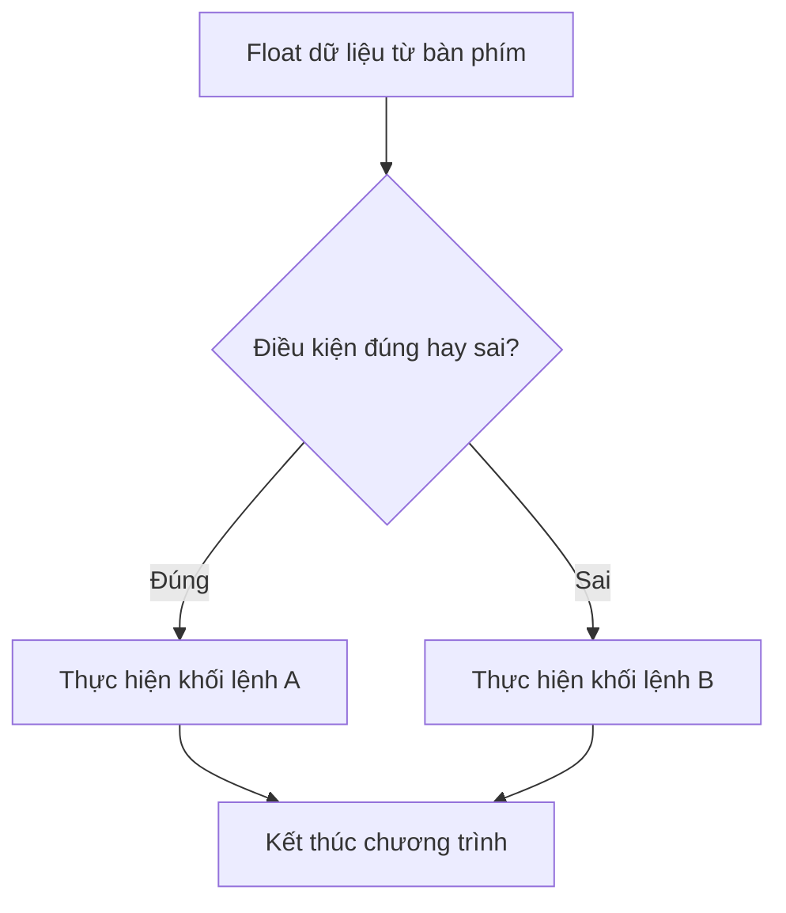
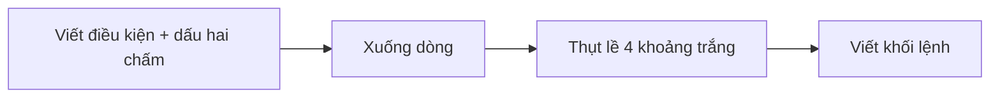
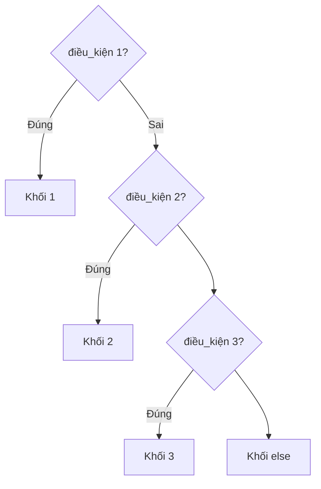

<!-- TỰ ĐỘNG ĐỒNG BỘ từ 01-Co-Ban/08-Cau-Lenh-If/bai.md — đừng sửa trực tiếp, sửa bản chính rồi chạy tools/sync_tracks.py -->

# Bài 8 — Câu Lệnh If – Cấu Trúc Rẽ Nhánh

> 🎓 **Chương 2 – Nền tảng lập trình**

## 🧠 Điều kiện tiên quyết

- [Bài 6 — Toán Tử Trong Python](../06-Toan-Tu/bai.md)
- [Bài 7 — Nhập và Xuất Dữ Liệu](../07-Input-Output/bai.md)

---

## 🎯 Mục tiêu

Sau bài học này, học viên sẽ:

* ✅ Hiểu vì sao cần **rẽ nhánh** — cho máy tính tự đưa ra quyết định.
* ✅ Viết được câu lệnh `if` đơn giản để xử lý một điều kiện.
* ✅ Dùng `if - else` cho **hai** tình huống ngược nhau.
* ✅ Dùng `if - elif - else` cho **nhiều** tình huống theo thứ tự.
* ✅ Nắm vững quy tắc **thụt lề** (indentation) — bắt buộc và cực kỳ quan trọng trong Python.
* ✅ Vận dụng giải bài toán thực tế: xếp loại điểm, tiền điện bậc thang, máy ATM, kiểm tra chẵn lẻ, tuổi...

---

## 📖 Kiến thức

### 1. Vì sao cần rẽ nhánh?

Các chương trình bạn viết từ bài 1 đến bài 7 chạy **thẳng một mạch từ trên xuống** — mọi dòng lệnh đều được thực hiện. Nhưng cuộc sống không phải lúc nào cũng vậy:

> 💬 **Ví dụ đời thực:** Buổi sáng, bạn nhìn ra ngoài:
> * Nếu trời mưa → mang ô.
> * Nếu không mưa → đi không.
>
> Máy tính cũng cần đúng "khả năng" đó: đọc dữ liệu, **kiểm tra điều kiện**, rồi chọn đường đi phù hợp. Đó gọi là **cấu trúc rẽ nhánh**.



### 2. Điều kiện là gì?

**Điều kiện** là một biểu thức mà kết quả thuộc kiểu `bool` — `True` (đúng) hoặc `False` (sai). Ta đã học ở bài 6:

```python
diem = 8.5
so = 6
tuoi = 15
diem >= 5     # True  - biểu thức so sánh
so % 2 == 0   # True  - kiểm tra chẵn
tuoi < 18     # ...   - tùy giá trị tuoi
```

Các điều kiện thường được tạo từ **toán tử so sánh** (`== != > < >= <=`) và **toán tử logic** (`and or not`).

### 3. Thụt lề — "ngôn ngữ cơ thể" của Python

Khác với C/Java (dùng dấu `{}`), Python dùng **thụt lề** để xác định **khối lệnh** (block).

```python
if diem >= 5:
    print("Đậu")          # thụt lề -> thuộc khối if
    print("Chúc mừng!")   # vẫn thụt lề -> vẫn trong khối if
print("Kết thúc")         # không thụt lề -> ngoài khối if
```

* Tiêu chuẩn dùng **4 khoảng trắng** (hoặc **1 phím Tab**) cho một cấp.
* **KHÔNG được trộn lẫn** Tab và dấu cách trong cùng một khối.
* Thụt lề sai → chương trình báo `IndentationError` hoặc chạy sai ý nghĩa.



### 4. `if` — kiểm tra điều kiện đơn

```python
if điều_kiện:
    # khối lệnh chạy khi điều kiện đúng
```

Chỉ có **một nhánh**: đúng thì chạy khối lệnh bên trong, sai thì **bỏ qua** và chạy tiếp phía sau.

```python
# Nhập: 75
tuoi = int(input("Nhập tuổi của bạn: "))
if tuoi >= 18:
    print("Bạn đủ tuổi lái xe máy.")
print("Chương trình kết thúc.")
```

Nếu nhập 75 → in cả hai dòng. Nếu nhập 15 → chỉ in dòng cuối, dòng trong `if` bị bỏ qua.

### 5. `if - else` — hai nhánh ngược nhau

Khi cần xử lý cả trường hợp đúng **và** sai:

```python
if điều_ki:
    # khối lệnh khi đúng
else:
    # khối lệnh khi SAI
```

> **Nếu** điều kiện đúng → chạy nhánh `if`. **Ngược lại (else)** → chạy nhánh `else`. Không bao giờ cả hai cùng chạy.

```python
# Kiểm tra chẵn lẻ
so = int(input("Nhập một số nguyên: "))
if so % 2 == 0:
    print(f"{so} là số chẵn.")
else:
    print(f"{so} là số lẻ.")
```

### 6. `if - elif - else` — nhiều nhánh theo thứ tự

Khi có **nhiều khả năng**, dùng `elif` (viết tắt của *else if*):

```python
if cond_1:
    # khi cond_1 đúng
elif cond_2:
    # khi cond_1 SAI nhưng cond_2 đúng
elif cond_3:
    # khi cond_1, cond_2 sai nhưng cond_3 đúng
else:
    # khi tất cả đều sai
```

> ⚠️ **Nguyên tắc vàng:** Python duyệt **từ trên xuống**, chỉ chạy **nhánh đầu tiên có điều kiện đúng** — nhánh nào đúng trước thì thắng, các nhánh sau không được xét nữa.



**Ví dụ xếp loại điểm theo thang phổ thông:**

```python
diem = int(input("Nhập điểm trung bình: "))
if diem >= 8:
    loai = "Giỏi"
elif diem >= 6.5:
    loai = "Khá"
elif diem >= 5:
    loai = "Trung bình"
else:
    loai = "Yếu"
print(f"Xếp loại: {loai}")
```

> 🌳 **Mẹo ghi nhớ thứ tự:** xếp loại luôn đi từ **cao xuống thấp**. Khi đã lọt vào `elif diem >= 6.5`, nghĩa là `diem < 8` chắc chắn đúng — không cần viết lại `and diem < 8`.

### 7. `if` lồng bên trong `if`

Một câu `if` có thể nằm bên trong nhánh của câu `if` khác — gọi là **if lồng nhau**:

```python
tuoi = 16
co_the = True
if tuoi >= 15:                  # ngoài: tuổi đủ chưa?
    if co_the:                  # trong: có thẻ không?
        print("Vào cổng VIP.")
    else:
        print("Vào cổng thường.")
else:
    print("Chưa đủ tuổi.")
```

> 💬 **Khi nào dùng?** Khi điều kiện phụ chỉ **có nghĩa** khi điều kiện chính đã đúng. Nếu điều kiện độc lập, nên dùng `and` cho gọn hơn: `if tuoi >= 15 and co_the:`.

### 8. Nhận diện đầu vào nhờ `if`

Ở bài 7, ta gán dữ liệu ngay sau khi nhập. Kết hợp với `if`, chương trình trở nên thông minh: **kiểm tra tính hợp lệ của dữ liệu** trước khi xử lý.

```python
diem = float(input("Nhập điểm (0 - 10): "))
if diem >= 0 and diem <= 10:
    print(f"Điểm hợp lệ: {diem}")
else:
    print("Điểm không hợp lệ!")
```

---

## 💡 Ví dụ minh họa

### Ví dụ 1: Kiểm tra chẵn lẻ (`if - else`)

```python
# Nhập một số nguyên từ bàn phím
so = int(input("Nhập một số nguyên: "))
# Số chẵn chia hết cho 2 (phần dư bằng 0)
if so % 2 == 0:
    print("Đây là số chẵn.")
else:
    print("Đây là số lẻ.")
```

**Giải thích từng dòng:**

| Dòng code | Ý nghĩa |
|---|---|
| `if so % 2 == 0:` | Kiểm tra "phần dư khi chia cho 2 có bằng 0 không" — nếu đúng là chẵn |
| `print("Đây là số chẵn.")` | Chỉ chạy khi điều kiện đúng |
| `else:` | Nhánh ngược lại — số lẻ |

### Ví dụ 2: Kiểm tra tuổi xem phim (`if - else`)

```python
tuoi = int(input("Nhập tuổi của bạn: "))
if tuoi >= 18:
    print("Bạn được xem phim người lớn.")
else:
    print("Bạn cần người lớn đi kèm.")
```

**Giải thích từng dòng:**

* `tuoi >= 18` — biểu thức so sánh trả về `True` hoặc `False`.
* Nhánh `if` — chỉ một trong hai nhánh được chọn, cả hai không bao giờ cùng chạy.
* Đây là mẫu "rẽ hai ngả" đơn giản nhất mà bạn sẽ gặp đi gặp lại.

### Ví dụ 3: Xếp loại điểm theo 4 mức (`if - elif - else`)

```python
diem = float(input("Nhập điểm trung bình: "))
if diem >= 8.5:
    loai = "Giỏi"
elif diem >= 6.5:
    loai = "Khá"
elif diem >= 5:
    loai = "Trung bình"
else:
    loai = "Yếu"
print(f"Học lực: {loai}")
```

**Giải thích từng dòng:**

* Điều kiện được kiểm tra **từ trên xuống**: 8.5 → 6.5 → 5.
* Giả sử `diem = 7.2`: lần lượt rơi vào nhánh `eloif diem >= 6.5` → `"Khá"`.
- Nếu tất cả đều sai (`diem < 5`) → `else` luôn chạy.

---

## 🔬 Ví dụ nâng cao

### Ví dụ 1: Xếp loại học lực đầy đủ + kiểm tra điểm hợp lệ

> 💡 Bài toán từ PDF: nhập điểm 0–10, xếp loại Xuất sắc/Giỏi/Khá/TB/Yếu; nếu điểm ngoài 0–10 thì báo lỗi.

```python
# Nhập điểm trung bình (thang 10)
diem = float(input("Nhập điểm trung bình (0 - 10): "))

# Bước 1: kiểm tra điểm có hợp lệ không
if diem < 0 or diem > 10:
    print("Điểm không hợp lệ.")
else:
    # Bước 2: điểm hợp lệ mới xếp loại
    if diem >= 9:
        loai = "Xuất sắc"
    elif diem >= 8:
        loai = "Giỏi"
    elif diem >= 6.5:
        loai = "Khá"
    elif diem >= 5:
        loai = "Trung bình"
    else:
        loai = "Yếu"
    print(f"Xếp loại: {loai}")
```

> 💡 **Cấu trúc tổng quát:** kiểm tra **đầu vào** (input validation) trước, rồi mới xử lý chuyển nhánh bên trong — đây là thói quen tốt của lập trình viên chuyên nghiệp.

### Ví dụ 2: Tiền điện bậc thang

> 💡 Bài toán từ PDF: 0–50 kWh giá 2000đ/kWh; 51–100 kWh giá 2500đ/kWh; trên 100 kWh giá 3000đ/kWh.

```python
# Nhập số kWh đã tiêu thụ
kwh = float(input("Nhập số điện tiêu thụ (kWh): "))
# Xác định đơn giá theo bậc
if kwh <= 50:
    don_gia = 2000          # bậc 1
elif kwh <= 100:
    don_gia = 2500          # bậc 2
else:
    don_gia = 3000          # bậc 3
# Tính tiền theo đơn giá của bậc tương ứng
tien = kwh * don_gia
print(f"Số tiền phải trả: {tien} đồng")
```

> 💬 Chạy thử `65 kWh`: không đạt điều kiện `<= 50`, lọt vào `elif kwh <= 100` → giá 2500 → `162.500đ`, khớp đúng với ví dụ trong giáo trình.

### Ví dụ 3: Máy ATM cơ bản

> 💬 Bài toán từ PDF: chương trình nhận mã chức năng, thực hiện xem số dư / nạp tiền / rút tiền. (Đây là phiên bản một lượt — vòng lặp sẽ học ở bài 10, 11.)

```python
# Số dư khởi tạo
so_du = 1000000
# Nhập lựa chọn chức năng
lua_chon = int(input("1. Xem số dư | 2. Nạp tiền | 3. Rút tiền\nChọn: "))
if lua_chon == 1:
    print(f"Số dư hiện tại: {so_du} VND")
elif lua_chon == 2:
    so_nap = float(input("Nhập số tiền muốn nạp: "))
    so_du += so_nap          # dùng toán tử += của bài 6
    print(f"Nạp thành công. Số dư mới: {so_du} VND")
elif lua_chon == 3:
    so_rut = float(input("Nhập số tiền muốn rút: "))
    if so_rut <= so_du:        # if lồng: kiểm tra đủ tiền không
        so_du -= so_rut
        print(f"Rút thành công. Số dư còn lại: {so_du} VND")
    else:
        print("Số dư không đủ để rút!")
else:
    print("Lựa chọn không hợp lệ.")
```

> 💡 Bạn thấy sức mạnh tổng hợp của 3 bài học: **nhập - ép kiểu** (bài 7), **toán tử** (bài 6), và **rẽ nhánh** (bài này). Chỉ cần thêm vòng lặp (bài 10, 11) là có một cây ATM hoàn chỉnh!

---

## ⚠️ Lỗi thường gặp

### Lỗi 1: Quên dấu hai chấm

```python
if so > 10   # ❌ SAI - thiếu ':'
```

* **Kết quả báo:** `SyntaxError: invalid syntax`.
* **Cách sửa:** mọi `if`, `elif`, `else` đều kết thúc dòng bằng dấu hai chấm `:`.

### Lỗi 2: Thụt lề sai / trộn lẫn Tab và khoảng trắng

```python
if so > 5:
print("Lớn hơn 5")      # ❌ SAI: không thụt
```

* **Kết quả báo:** `IndentationError: expected an indented block`.
* **Cách sửa:** thống nhất **4 dấu cách** cho mỗi cấp thụt lề; không trộn Tab với khoảng trắng.

### Lỗi 3: Dùng `=` thay vì `==` trong điều kiện

```python
if lua_chon = 1:       # ❌ SAI: gán chứ không so sánh
```

* **Kết quả báo:** `SyntaxError` (một dấu `=` trong điều kiện).
* **Cách sửa:** hỏi "có bằng không" phải dùng `==`.

### Lỗi 4: Thứ tự `elif` sai làm kết quả sai ngầm

```python
diem = 9
if diem >= 6.5:     # nhánh NÀY đúng 9 >= 6.5
    loai = "Khá"
elif diem >= 8:     # ⚠️ không bao giờ chạy!
    loai = "Giỏi"
```

* **Nguyên nhân:** Python chạy nhánh **đầu tiên** đúng; viết điều kiện rộng trước sẽ "nuốt" các trường hợp hẹp phía sau.
* **Cách sửa:** xếp điều kiện từ **chặt/hẹp trước, rộng sau** (Giỏi → Khá → TB → Yếu).

### Lỗi 5: Thụt lề sai làm đổi ý nghĩa chương trình

```python
# Dòng "Chúc mừng" không thụt lề - nằm NGOÀI khối if
if tuoi >= 18:
    print("Đủ tuổi")
print("Chúc mừng!")     # LUÔN chạy, dù tuổi có dưới 18!
```

* **Nguyên nhân:** Python dựa vào thụt lề để biết lệnh "thuộc về ai"; mất thụt lề = tách khỏi khối `if`.
* **Cách sửa:** trước khi viết lệnh kế tiếp, hãy nhìn kỹ căp lề — lệnh muốn nằm trong khối `if` phải thụt đúng 4 khoảng trắng.

---

## 💎 Mẹo

* 🧠 **Thứ tự `elif` từ chặt - rộng:** đếm "Xuất sắc → Giỏi → Khá → ..." nghe như thang điểm tự nhiên.
* 🔢 **Kiểm tra đầu vào trước:** dùng `if diem < 0 or diem > 10` để chặn dữ liệu rác sớm.
* 🥓 **`if ... and ...` thay cho if lồng** khi hai điều kiện độc lập — gọn hơn.
* ✏️ **Khối lệnh ngắn gọn:** mỗi nhánh chỉ 1-3 dòng là lý tưởng; dài quá nghĩ cách tách hàm (bài 12).
* 🔍 **Tự in **test** với các giá trị biên:** 49, 50, 51, 100, 101 kWh để chắc chắn ranh giới bậc tiền điện không sai.
* ☝️ **Dấu hai chấm là "mạch điện":** dòng nào kết thúc bằng `:` thì dòng kế tiếp **nhất định** phải thụt vào.

---

## 📝 Tóm tắt

| Cấu trúc | Khi nào dùng | Ghi nhớ |
|---|---|---|
| `if` | Chỉ cần kiểm tra 1 điều kiện, phải sai thì bỏ qua | Đúng → chạy, sai → nhảy tiếp |
| `if ... else` | Hai khả năng ngược nhau | Đúng → không sai thì `else` |
| `if ... elif ... else` | Nhiều khả năng | Chỉ nhánh đầu tiên đúng được chạy |
| `if` lồng nhau | Điều kiện phụ chỉ có ý nghĩa khi điều chính | Thụt lề thêm 1 cấp |

* Thụt lề = **khối lệnh** trong Python — bắt buộc, thống nhất 4 khoảng trắng.
* Điều kiện luôn là biểu thức `bool` — tạo từ so sánh và `and`/`or`/`not`.

---

## 🧪 Kiểm tra nhanh

1. ❓ Python dùng gì để xác định khối lệnh? Dấu `{}` hay thụt lề?
2. ❓ Sau dòng `if diem >= 5` phải có ký tự gì?
3. ❓ Viết điều kiện kiểm tra một số âm hay không (*nhỏ hơn 0*).
4. ❓ Trong `if - elif - else`, khi `elif 1` đúng, các `elif` sau có chạy không?
5. ❓ Lỗi gì khi viết `if so > 10` mà không có `:`?
6. ❓ Trong Python, thụt lề thường là bao nhiêu khoảng trắng?
7. ❓ `if a == b` và `if a = b` khác nhau thế nào?
8. ❓ Với `diem = 9.2`, theo ví dụ xếp loại: `>= 8.5` → Giỏi, `>= 6.5` → Khá... kết quả sẽ là gì?
9. ❓ Điều kiện "điểm hợp lệ từ 0 đến 10" viết bằng bạn `and` như thế nào?
10. ❓ Khi muốn kiểm tra 5 thể loại mức, ta dùng `if - elif - else` hay nhiều `if` rời nhau thích hợp hơn? Vì sao?

<details>
<summary>🔍 Xem đáp án</summary>

1. Thụt lề (indentation).
2. Dấu hai chấm `:`.
3. `if so < 0:` (hoặc `if so < 0 and True` — không cần thêm).
4. Không — chỉ nhánh đầu tiên có điều kiện đúng được chạy.
5. `SyntaxError`.
6. 4 khoảng trắng (hoặc 1 Tab nhất quán).
7. `==` so sánh bằng; `=` là gán — trong điều kiện dùng `==`.
8. `"Giỏi"`.
9. `if diem >= 0 and diem <= 10:`.
10. `if - elif - else`: kiểm tra tuần tự, dừng ở nhánh đúng như đầu — nhiều `if` sẽ chạy tất cả, rối và dễ sai.

</details>

---

## 📚 Bài đọc thêm

* [Python.org – Control Flow (if statements)](https://docs.python.org/3/tutorial/controlflow.html)
* [W3Schools – Python If ... Else](https://www.w3schools.com/python/python_conditions.asp)
* [Real Python – Conditional Statements in Python](https://realpython.com/python-conditional-statements/)
* [Python.org – Operator precedence (so sánh trong điều kiện)](https://docs.python.org/3/reference/expressions.html#operator-precedence)

---

---

## 🧩 Bài tập

> 📝 🎯 **Chủ đề:** `if`, `if - else`, `if - elif - else`, if lồng nhau; kiểm tra chẵn lẻ, xếp loại điểm, tiền điện bậc thang, ATM, game đoán số...

## 🟢 Dễ (Bài 1 – 7)

### Bài 1: Chẵn hay lẻ?

* **Đề bài:** Nhập một số nguyên, in `Chan` nếu số chẵn, ngược lại in `Le`.
* **Input:** Một dòng là số nguyên.
* **Output:** `Chan` hoặc `Le`.
* **Ví dụ:**
  ```
  Nhập một số nguyên: 42
  Chan
  ```
* **Gợi ý:** Số chẵn khi `so % 2 == 0` (chia hết cho 2).

### Bài 2: Số dương hay số âm?

* **Đề bài:** Nhập một số thực, in `So duong` nếu lớn hơn 0, `So am` nếu nhỏ hơn 0, còn lại in `So khong`.
* **Input:** Một dòng số thực.
* **Output:** Một trong ba kết quả trên.
* **Ví dụ:**
  ```
  Nhập một số: -3.5
  So am
  ```
* **Gợi ý:** Số bằng 0 là trường hợp "còn lại" — dùng `else`.

### Bài 3: Kiểm tra tuổi xem phim

* **Đề bài:** Nhập tuổi, in `Duoc xem phim nguoi lon` nếu đủ 18, ngược lại in `Can nguoi lon di kem`.
* **Input:** Một dòng số nguyên.
* **Output:** Một trong hai câu trên.
* **Ví dụ:**
  ```
  Nhập tuổi: 16
  Can nguoi lon di kem
  ```
* **Gợi ý:** Điều kiện `tuoi >= 18`.

### Bài 4: Đậu hay rớt?

* **Đề bài:** Nhập điểm trung bình (thang 10), in `Dau` nếu điểm từ 5 trở lên, ngược lại in `Rot`.
* **Input:** Một dòng điểm (số thực).
* **Output:** `Dau` hoặc `Rot`.
* **Ví dụ:**
  ```
  Nhập điểm: 4.5
  Rot
  ```
* **Gợi ý:** `diem >= 5` — điểm có thể là số thập phân nên dùng `float`.

### Bài 5: Số nào lớn hơn?

* **Đề bài:** Nhập hai số nguyên `a`, `b`. Nếu `a > b` in `a lon hon b`, nếu ngược lại in `b lon hon hoac bang a`.
* **Input:** Hai dòng số nguyên.
* **Output:** Một trong hai kết quả trên.
* **Ví dụ:**
  ```
  Nhập a: 10
  Nhập b: 3
  a lon hon b
  ```
* **Gợi ý:** Chỉ cần một câu `if - else` với `a > b`.

### Bài 6: Số chia hết cho 3?

* **Đề bài:** Nhập một số nguyên, in `Chia het cho 3` nếu số đó chia hết cho 3, ngược lại in `Khong chia het cho 3`.
* **Input:** Một dòng số nguyên.
* **Output:** Một trong hai dòng trên.
* **Ví dụ:**
  ```
  Nhập một số: 15
  Chia het cho 3
  ```
* **Gợi ý:** Chia hết khi `so % 3 == 0`.

### Bài 7: Chào theo buổi

* **Đề bài:** Nhập giờ (số nguyên 0–23). Nếu giờ < 12 in `Chao buoi sang`, ngược lại in `Chao buoi chieu`.
* **Input:** Một dòng số nguyên.
* **Output:** Một trong hai câu chào trên.
* **Ví dụ:**
  ```
  Nhập giờ: 9
  Chao buoi sang
  ```
* **Gợi ý:** Điều kiện `gio < 12`.

---

## 🟡 Trung bình (Bài 8 – 14)

### Bài 8: Số lớn nhất trong ba số

* **Đề bài:** Nhập ba số thực `a`, `b`, `c`. In ra số lớn nhất (không dùng hàm `max()`).
* **Input:** Ba dòng số thực.
* **Output:** Một dòng là số lớn nhất.
* **Ví dụ:**
  ```
  Nhập a: 5
  Nhập b: 9.5
  Nhập c: 3
  9.5
  ```
* **Gợi ý:** `if a >= b and a >= c` thì `a` lớn nhất; dùng `elif` cho `b`, `c`; hãy suy nghĩ điều kiện nào đến trước.

### Bài 9: Xếp loại điểm 4 mức

* **Đề bài:** Nhập điểm trung bình (thang 10), xếp loại: từ 8 trở lên `Gioi`, từ 6.5 `Kha`, từ 5 `Trung binh`, còn lại `Yeu`.
* **Input:** Một dòng điểm (số thực).
* **Output:** Một trong bốn mức trên.
* **Ví dụ:**
  ```
  Nhập điểm: 7.2
  Kha
  ```
* **Gợi ý:** Xét từ cao xuống thấp: 8 → 6.5 → 5 → else.

### Bài 10: Tiền điện bậc thang

* **Đề bài:** Nhập số kWh tiêu thụ. Giá: 0–50 kWh là 2000đ/kWh; 51–100 kWh là 2500đ/kWh; trên 100 kWh là 3000đ/kWh. In số tiền phải trả.
* **Input:** Một dòng số kWh (số thực).
* **Output:** `So tien phai tra la: <kết quả> VND`
* **Ví dụ:**
  ```
  Nhập số điện tiêu thụ (kWh): 65
  So tien phai tra la: 162500.0 VND
  ```
* **Gợi ý:** Xác định `don_gia` theo bậc rồi mới nhân với kWh.

### Bài 11: Năm nhuận

* **Đề bài:** Nhập một năm (số nguyên). In `Nam nhuan` nếu năm đó nhuận, ngược lại in `Khong phai nam nhuan`. Quy tắc: chia hết cho 4, không chia hết cho 100, **trừ khi** chia hết cho 400.
* **Input:** Một dòng năm.
* **Output:** Một trong hai dòng trên.
* **Ví dụ:**
  ```
  Nhập năm: 2024
  Nam nhuan
  ```
* **Gợi ý:** Điều kiện `nam % 4 == 0 and (nam % 100 != 0 or nam % 400 == 0)` (công thức từ bài 6).

### Bài 12: Máy ATM rút tiền

* **Đề bài:** Số dư khởi tạo `1000000`. Nhập số tiền cần rút. Nếu số tiền ≤ số dư, in `Rut thanh cong. So du con lai: <kết quả> VND`; ngược lại in `So du khong du!`.
* **Input:** Một dòng số tiền rút (số thực).
* **Output:** Một trong hai dòng trên.
* **Ví dụ:**
  ```
  Nhập số tiền muốn rút: 500000
  Rut thanh cong. So du con lai: 500000.0 VND
  ```
* **Gợi ý:** Kiểm tra `so_rut <= so_du` trước; trong nhánh đúng mới trừ `so_du -= so_rut`.

### Bài 13: Phân loại tam giác

* **Đề bài:** Nhập ba cạnh `a`, `b`, `c` (số thực). Nếu cả ba bằng nhau in `Tam giac deu`; nếu có đúng hai cạnh bằng nhau in `Tam giac can`; ngược lại in `Tam giac thuong`.
* **Input:** Ba dòng số thực.
* **Output:** Một trong ba kết quả trên.
* **Ví dụ:**
  ```
  Nhập cạnh a: 5
  Nhập cạnh b: 5
  Nhập cạnh c: 3
  Tam giac can
  ```
* **Gợi ý:** `a == b and b == c` cho tam giác đều; `a == b or b == c or a == c` cho tam giác cân. Xét đều **trước** rồi mới cân.

### Bài 14: Tiền vé tham quan

* **Đề bài:** Nhập tuổi. Vé: dưới 6 tuổi miễn phí (0đ); 6–12 tuổi 20.000đ; 13–17 tuổi 40.000đ; từ 18 tuổi trở lên 60.000đ. In số tiền vé phải trả.
* **Input:** Một dòng tuổi (số nguyên).
* **Output:** `Tien ve: <kết quả> VND`
* **Ví dụ:**
  ```
  Nhập tuổi: 14
  Tien ve: 40000 VND
  ```
* **Gợi ý:** Xét từ trường hợp miễn phí đến đắt dần: `< 6`, `<= 12`, `<= 17`, còn lại 60000.

---

## 🔴 Khó (Bài 15 – 20)

### Bài 15: Xếp loại học lực 5 mức + kiểm tra điểm hợp lệ

* **Đề bài:** Nhập điểm trung bình (thang 10). Xếp loại: 9–10 `Xuat sac`; 8–8.9 `Gioi`; 6.5–7.9 `Kha`; 5–6.4 `Trung binh`; dưới 5 `Yeu`. Nếu điểm nhỏ hơn 0 hoặc lớn hơn 10, in `Diem khong hop le`.
* **Input:** Một dòng điểm (số thực).
* **Output:** Một trong các kết quả trên.
* **Ví dụ:**
  ```
  Nhập điểm trung bình (0 - 10): 8.4
  Gioi
  ```
  ```
  Nhập điểm trung bình (0 - 10): 15
  Diem khong hop le
  ```
* **Gợi ý:** Dùng `if diem < 0 or diem > 10` để chặn điểm rác trước, rồi mới xếp loại trong `else`; nhớ 8.4 phải rơi vào nhánh `>= 8`.

### Bài 16: Máy tính bốn phép tính

* **Đề bài:** Nhập hai số thực `a`, `b` và lựa chọn phép tính (nhập `1` cộng, `2` trừ, `3` nhân, `4` chia). In kết quả. Nếu chọn phép chia mà `b = 0`, in `Khong the chia cho 0`.
* **Input:** Ba dòng: a, b, lựa chọn (số nguyên).
* **Output:** `Ket qua: <kết quả>` hoặc thông báo lỗi chia 0.
* **Ví dụ:**
  ```
  Nhập a: 10
  Nhập b: 3
  Chọn phép tính (1 cộng, 2 trừ, 3 nhân, 4 chia): 4
  Ket qua: 3.3333333333333335
  ```
* **Gợi ý:** Kiểm tra lựa chọn bằng `if - elif - else`; trong nhánh chia, kiểm tra tiếp `b != 0` bằng `if` lồng.

### Bài 17: Số ngày trong tháng

* **Đề bài:** Nhập tháng (1–12) và năm (số nguyên). In số ngày của tháng đó. Tháng 2: 29 ngày nếu năm nhuận, ngược lại 28 ngày. Tháng 4, 6, 9, 11 có 30 ngày. Các tháng còn lại có 31 ngày. Nếu tháng không hợp lệ, in `Thang khong hop le`.
* **Input:** Hai dòng: tháng, năm.
* **Output:** `Thang <tháng>/<năm> có <số ngày> ngày` hoặc báo lỗi.
* **Ví dụ:**
  ```
  Nhập tháng: 2
  Nhập năm: 2024
  Thang 2/2024 có 29 ngày
  ```
* **Gợi ý:** Dùng `if thang == 2` → xét nhuận bằng `if` lồng; tháng 4, 6, 9, 11 tạo một nhóm bằng `or`.

### Bài 18: Tiền nước sinh hoạt (bậc thang + thuế)

* **Đề bài:** Nhập số m³ nước tiêu thụ. Giá: 0–10 m³ là 6000đ/m³; 11–20 m³ là 8000đ/m³; 21–30 m³ là 10000đ/m³; trên 30 m³ là 12000đ/m³. Sau đó cộng thêm thuế VAT 10%. In tổng tiền.
* **Input:** Một dòng số m³ (số thực).
* **Output:** `Tong tien nuoc: <kết quả> VND` (2 chữ số thập phân).
* **Ví dụ:**
  ```
  Nhập số m3 nước tiêu thụ: 25
  Tong tien nuoc: 275000.00 VND
  ```
* **Gợi ý:** Bốn bậc giá; đơn giá = 6000/8000/10000/12000; tiền = m³ × đơn giá; tổng = tiền + tiền × 0.1; dùng `{:.2f}`.

### Bài 19: Điểm trung bình có trọng số + xếp loại

* **Đề bài:** Nhập điểm Toán, Văn, Anh (thang 10). Điểm trung bình = `(Toán*2 + Văn + Anh) / 4`. Xếp loại: `Xuat sac` nếu trung bình ≥ 8.5, `Gioi` nếu ≥ 7, `Kha` nếu ≥ 5.5, `Trung binh` nếu ≥ 4, còn lại `Yeu`. In cả điểm trung bình và xếp loại.
* **Input:** Ba dòng điểm từng môn.
* **Output:** `Diem trung binh: <kết quả>` (2 chữ số) và `Xep loai: <loại>`.
* **Ví dụ:**
  ```
  Nhập điểm Toán: 8
  Nhập điểm Văn: 6
  Nhập điểm Anh: 9
  Diem trung binh: 7.75
  Xep loai: Gioi
  ```
* **Gợi ý:** Tính trung bình trước (bài 7), rồi dùng `if - elif - else` xếp loại từ 8.5 → 7 → 5.5 → 4 → else.

### Bài 20: Trò chơi đoán số bí mật

* **Đề bài:** Chương trình giữ bí mật con số `7`. Nhập một số nguyên dự đoán. Nếu đúng, in `Chuc mung! Ban da doan dung.` Nếu nhập lớn hơn bí mật, in `So ban nhap lon hon dap an. Thu lai nhe!` Nếu nhỏ hơn, in `So ban nhap nho hon dap an. Thu lai nhe!`
* **Input:** Một dòng số nguyên.
* **Output:** Một trong ba câu trên.
* **Ví dụ:**
  ```
  Đoán con số bí mật (1 - 10): 9
  So ban nhap lon hon dap an. Thu lai nhe!
  ```
* **Gợi ý:** Kiểm tra `n == bi_mat` trước; hai trường hợp còn lại là `n > bi_mat` và `n < bi_mat` — suy nghĩ dùng `elif` hay `else`.

---

## 🎯 Tổng kết sau khi làm bài

Sau 20 bài tập, bạn đã:

* ✅ Viết thành thạo `if`, `if - else`, `if - elif - else` theo đúng thứ tự ưu tiên.
* ✅ Kiểm soát thụt lề và tránh các lỗi `SyntaxError`, `IndentationError` điển hình.
* ✅ Xây dựng chương trình ra quyết định thực tế: xếp loại, tính tiền, ATM, game đoán số.
* ✅ Kết hợp bài 6 (toán tử) + bài 7 (nhập - ép kiểu) vào các bài toán đời thực.

> 💪 `if` là "bộ não" của mọi chương trình. Càng luyện nhiều tình huống, bạn càng phản xạ nhanh khi đọc yêu cầu: *"Nếu... thì..., ngược lại..."*.

---

## ✅ Đáp án

> 💡 **Hãy tự làm bài tập trước** rồi mới mở đáp án.

## 🟢 Dễ (Bài 1 – 7)


<details>
<summary>✅ Bài 1: Chẵn hay lẻ?</summary>


**Phân tích:** Số chẵn chia hết cho 2 — phần dư khi chia cho 2 bằng 0.

**Ý tưởng:** Dùng `so % 2 == 0` làm điều kiện cho `if - else`.

**Thuật toán:**
1. Nhập số nguyên.
2. Nếu `so % 2 == 0` → in `Chan`, ngược lại in `Le`.

**Code:**

```python
# Nhập: 42
# Nhập số nguyên cần kiểm tra
so = int(input("Nhập một số nguyên: "))
# Số chẵn khi phần dư chia cho 2 bằng 0
if so % 2 == 0:
    print("Chan")
else:
    print("Le")
```

**Giải thích code:**
* `so % 2` cho phần dư: 0 (chẵn) hoặc 1 (lẻ).
* `so % 2 == 0` — biểu thức so sánh trả về `True`/`False` điều khiển nhánh rẽ.
* `42 % 2 = 0` → điều kiện đúng → in `Chan`.

**Độ phức tạp:** O(1).

---

</details>

<details>
<summary>✅ Bài 2: Số dương hay số âm?</summary>


**Phân tích:** Ba trường hợp: lớn hơn 0, nhỏ hơn 0, bằng 0.

**Ý tưởng:** Xét dương/âm bằng `if - elif`, trường hợp còn lại (bằng 0) nằm trong `else`.

**Thuật toán:**
1. Nhập số thực.
2. Nếu `x > 0` → in `So duong`.
3. Ngược lại nếu `x < 0` → in `So am`.
4. Ngược lại (bằng 0) → in `So khong`.

**Code:**

```python
# Nhập: -3.5
# Nhập số cần phân loại
x = float(input("Nhập một số: "))
if x > 0:
    print("So duong")
elif x < 0:
    print("So am")
else:
    print("So khong")
```

**Giải thích code:**
* `-3.5 > 0` sai → chuyển sang `elif x < 0` → `-3.5 < 0` đúng → in `So am`.
* `else` chỉ nhận các giá trị còn lại — chính là số 0.
* Thứ tự dương → âm → không quan trọng ở bài này vì ba trường hợp rời nhau.

**Độ phức tạp:** O(1).

---

</details>

<details>
<summary>✅ Bài 3: Kiểm tra tuổi xem phim</summary>


**Phân tích:** Hai trường hợp ngược nhau: đủ 18 tuổi và chưa đủ.

**Ý tưởng:** `if - else` với điều kiện `tuoi >= 18`.

**Thuật toán:**
1. Nhập tuổi (số nguyên).
2. Nếu `tuoi >= 18` → in câu thứ nhất, ngược lại in câu thứ hai.

**Code:**

```python
# Nhập: 16
# Nhập tuổi người xem
tuoi = int(input("Nhập tuổi: "))
if tuoi >= 18:
    print("Duoc xem phim nguoi lon")
else:
    print("Can nguoi lon di kem")
```

**Giải thích code:**
* `16 >= 18` sai → chạy nhánh `else`.
* Mỗi lần chạy chỉ **một** nhánh được chọn — không bao giờ cả hai.

**Độ phức tạp:** O(1).

---

</details>

<details>
<summary>✅ Bài 4: Đậu hay rớt?</summary>


**Phân tích:** Điểm từ 5 trở lên là đậu — điểm có thể là số thập phân.

**Ý tưởng:** Ép `float` cho điểm, so sánh với 5.

**Thuật toán:**
1. Nhập điểm dạng số thực.
2. Nếu `diem >= 5` → `Dau`, ngược lại → `Rot`.

**Code:**

```python
# Nhập: 4.5
# Nhập điểm trung bình
diem = float(input("Nhập điểm: "))
if diem >= 5:
    print("Dau")
else:
    print("Rot")
```

**Giải thích code:**
* Dùng `float` vì điểm như `4.5`, `7.25` rất phổ biến.
* `4.5 >= 5` sai → in `Rot`.

**Độ phức tạp:** O(1).

---

</details>

<details>
<summary>✅ Bài 5: Số nào lớn hơn?</summary>


**Phân tích:** So sánh hai số `a` và `b`, in kết quả theo từng trường hợp.

**Ý tưởng:** `if a > b`; trường hợp còn lại là `a <= b`.

**Thuật toán:**
1. Nhập `a`, `b`.
2. Nếu `a > b` → in `a lon hon b`, ngược lại in `b lon hon hoac bang a`.

**Code:**

```python
# Nhập: 10, 3
# Nhập hai số nguyên
a = int(input("Nhập a: "))
b = int(input("Nhập b: "))
if a > b:
    print("a lon hon b")
else:
    print("b lon hon hoac bang a")
```

**Giải thích code:**
* `10 > 3` đúng → in nhánh `if`.
* Vì đề bài chỉ hỏi `a > b` hay không, nhánh `else` đại diện toàn bộ trường hợp còn lại (`a <= b`).

**Độ phức tạp:** O(1).

---

</details>

<details>
<summary>✅ Bài 6: Số chia hết cho 3?</summary>


**Phân tích:** Kiểm tra tính chia hết bằng phép `%`.

**Ý tưởng:** Điều kiện `so % 3 == 0`.

**Thuật toán:**
1. Nhập số nguyên.
2. Nếu `so % 3 == 0` → in `Chia het cho 3`, ngược lại in `Khong chia het cho 3`.

**Code:**

```python
# Nhập: 15
# Nhập số cần kiểm tra
so = int(input("Nhập một số: "))
if so % 3 == 0:
    print("Chia het cho 3")
else:
    print("Khong chia het cho 3")
```

**Giải thích code:**
* `15 % 3 = 0` → điều kiện `0 == 0` đúng → in `Chia het cho 3`.
* Mẫu câu này dùng được cho mọi ước số: đổi `3` thành `5`, `7`...

**Độ phức tạp:** O(1).

---

</details>

<details>
<summary>✅ Bài 7: Chào theo buổi</summary>


**Phân tích:** Dựa vào giờ (0–23) quyết định câu chào.

**Ý tưởng:** `gio < 12` là buổi sáng, còn lại là buổi chiều.

**Thuật toán:**
1. Nhập giờ (số nguyên).
2. Nếu `gio < 12` → `Chao buoi sang`, ngược lại → `Chao buoi chieu`.

**Code:**

```python
# Nhập: 9
# Nhập giờ hiện tại
gio = int(input("Nhập giờ: "))
if gio < 12:
    print("Chao buoi sang")
else:
    print("Chao buoi chieu")
```

**Giải thích code:**
* `9 < 12` đúng → in `Chao buoi sang`.
* Nếu muốn thêm buổi tối, thêm `elif gio >= 18` — bài 9 sẽ là nơi thử điều đó với `match`.

**Độ phức tạp:** O(1).

---

</details>

## 🟡 Trung bình (Bài 8 – 14)


<details>
<summary>✅ Bài 8: Số lớn nhất trong ba số</summary>


**Phân tích:** Tìm số lớn nhất giữa `a`, `b`, `c` bằng so sánh, không dùng hàm `max()`.

**Ý tưởng:** `a` lớn nhất khi `a >= b and a >= c`; tương tự cho `b`, `c`; trường hợp còn lại thì `c` lớn nhất.

**Thuật toán:**
1. Nhập `a`, `b`, `c` dạng số thực.
2. Nếu `a >= b and a >= c` → in `a`.
3. Ngược lại nếu `b >= a and b >= c` → in `b`.
4. Ngược lại → in `c`.

**Code:**

```python
# Nhập: 5, 9.5, 3
# Nhập ba số thực
a = float(input("Nhập a: "))
b = float(input("Nhập b: "))
c = float(input("Nhập c: "))
# a lớn nhất khi lớn hơn hoặc bằng cả b và c
if a >= b and a >= c:
    print(a)
# b lớn nhất khi lớn hơn hoặc bằng cả a và c
elif b >= a and b >= c:
    print(b)
# trường hợp còn lại c chính là số lớn nhất
else:
    print(c)
```

**Giải thích code:**
* `and` kết hợp hai điều kiện: `a >= b` **và** `a >= c`.
* Nếu `a` và `b` bằng nhau và đều lớn nhất, nhánh `a` được chọn trước — kết quả vẫn đúng (in `a`).
* Với `5, 9.5, 3`: nhánh `a` sai, nhánh `b` đúng → in `9.5`.

**Độ phức tạp:** O(1).

---

</details>

<details>
<summary>✅ Bài 9: Xếp loại điểm 4 mức</summary>


**Phân tích:** Bốn mức theo thang điểm 8 / 6.5 / 5.

**Ý tưởng:** Xét **từ cao xuống thấp** — nhánh nào đúng trước thì thắng.

**Thuật toán:**
1. Nhập điểm (float).
2. Nếu `>= 8` → `Gioi`; `elif >= 6.5` → `Kha`; `elif >= 5` → `Trung binh`; còn lại → `Yeu`.
3. In kết quả.

**Code:**

```python
# Nhập: 7.2
# Nhập điểm trung bình
diem = float(input("Nhập điểm: "))
# Xét từ cao xuống thấp - nhánh đầu tiên đúng sẽ được chọn
if diem >= 8:
    loai = "Gioi"
elif diem >= 6.5:
    loai = "Kha"
elif diem >= 5:
    loai = "Trung binh"
else:
    loai = "Yeu"
print(loai)
```

**Giải thích code:**
* `7.2 >= 8` sai → `7.2 >= 6.5` đúng → `Kha`.
* Lọt tới `elif diem >= 6.5` nghĩa là `diem < 8` — không cần viết lại điều kiện này.
* Nếu đảo thứ tự (để `>= 5` lên trước) thì mọi điểm đều ra `Trung binh` — sai ngầm khó phát hiện.

**Độ phức tạp:** O(1).

---

</details>

<details>
<summary>✅ Bài 10: Tiền điện bậc thang</summary>


**Phân tích:** 65 kWh thuộc bậc 2 (51–100) → đơn giá 2500đ → 162.500đ.

**Ý tưởng:** Xác định `don_gia` theo bậc rồi nhân với số kWh.

**Thuật toán:**
1. Nhập số kWh (float).
2. Nếu `<= 50` → giá 2000; `elif <= 100` → 2500; còn lại → 3000.
3. Tính và in tiền.

**Code:**

```python
# Nhập: 65
# Nhập số kWh tiêu thụ
kwh = float(input("Nhập số điện tiêu thụ (kWh): "))
# Xác định đơn giá theo bậc
if kwh <= 50:
    don_gia = 2000      # bậc 1: 0 - 50 kWh
elif kwh <= 100:
    don_gia = 2500      # bậc 2: 51 - 100 kWh
else:
    don_gia = 3000      # bậc 3: trên 100 kWh
# Số tiền phải trả
tien = kwh * don_gia
print(f"So tien phai tra la: {tien} VND")
```

**Giải thích code:**
* `65 <= 50` sai → `65 <= 100` đúng → `don_gia = 2500`.
* `65 * 2500 = 162500.0` — kết quả số thực vì `kwh` là `float`.
* Đây là bảng giá **đơn giản** (toàn bộ số kWh tính cùng giá); bảng giá lũy tiến từng phần sẽ khó hơn, chờ vòng lặp ở bài 10–11.

**Độ phức tạp:** O(1).

---

</details>

<details>
<summary>✅ Bài 11: Năm nhuận</summary>


**Phân tích:** Năm nhuận: chia hết cho 4, không chia hết cho 100, trừ khi chia hết cho 400.

**Ý tưởng:** Dùng đúng biểu thức từ bài 6: `nam % 4 == 0 and (nam % 100 != 0 or nam % 400 == 0)`.

**Thuật toán:**
1. Nhập năm (int).
2. Kiểm tra biểu thức năm nhuận.
3. In kết quả tương ứng.

**Code:**

```python
# Nhập: 2024
# Nhập năm cần kiểm tra
nam = int(input("Nhập năm: "))
# Quy tắc năm nhuận
if nam % 4 == 0 and (nam % 100 != 0 or nam % 400 == 0):
    print("Nam nhuan")
else:
    print("Khong phai nam nhuan")
```

**Giải thích code:**
* 2024: `2024 % 4 == 0` (True) `and` `2024 % 100 != 0` (True) → `True` → năm nhuận.
* 1900: chia hết cho 4 và 100 nhưng không chia hết cho 400 → không nhuận — biểu thức xử lý đúng quy tắc "trừ khi".
* 2000: chia hết cho 400 → nhánh `or` đúng → nhuận.

**Độ phức tạp:** O(1).

---

</details>

<details>
<summary>✅ Bài 12: Máy ATM rút tiền</summary>


**Phân tích:** Kiểm tra số tiền rút có vượt quá số dư không trước khi trừ.

**Ý tưởng:** `if so_rut <= so_du` → trừ và in kết quả; ngược lại báo lỗi.

**Thuật toán:**
1. Khởi tạo `so_du = 1000000`.
2. Nhập số tiền rút.
3. Nếu đủ tiền → trừ, in số dư mới; ngược lại in thông báo.

**Code:**

```python
# Nhập: 500000
# Số dư khởi tạo
so_du = 1000000
# Nhập số tiền muốn rút
so_rut = float(input("Nhập số tiền muốn rút: "))
# Kiểm tra số dư đủ hay không
if so_rut <= so_du:
    so_du -= so_rut          # trừ tiền vào số dư
    print(f"Rut thanh cong. So du con lai: {so_du} VND")
else:
    print("So du khong du!")
```

**Giải thích code:**
* `500000 <= 1000000` đúng → thực hiện rút: `so_du = 1000000 - 500000 = 500000.0`.
* `so_du -= so_rut` là toán tử gán kết hợp của bài 6 — ngắn gọn cho "cập nhật số dư".
* Nếu nhập `2000000`, điều kiện sai → không trừ tiền, in `So du khong du!`.

**Độ phức tạp:** O(1).

---

</details>

<details>
<summary>✅ Bài 13: Phân loại tam giác</summary>


**Phân tích:** Phân biệt tam giác đều (3 cạnh bằng), cân (2 cạnh bằng), thường.

**Ý tưởng:** Kiểm tra đều trước (điều kiện hẹp nhất), rồi cân, còn lại là thường.

**Thuật toán:**
1. Nhập ba cạnh.
2. Nếu `a == b and b == c` → đều.
3. Ngược lại nếu có hai cạnh bằng → cân.
4. Ngược lại → thường.

**Code:**

```python
# Nhập: 5, 5, 3
# Nhập ba cạnh của tam giác
a = float(input("Nhập cạnh a: "))
b = float(input("Nhập cạnh b: "))
c = float(input("Nhập cạnh c: "))
# Tam giác đều: cả ba cạnh bằng nhau (kiểm tra trước)
if a == b and b == c:
    print("Tam giac deu")
# Tam giác cân: ít nhất hai cạnh bằng nhau
elif a == b or b == c or a == c:
    print("Tam giac can")
else:
    print("Tam giac thuong")
```

**Giải thích code:**
* `5 == 5 and 5 == 3` sai (vế sau) → chuyển `elif`.
* `a == b` đúng → in `Tam giac can`.
* Quan trọng: kiểm tra **đều trước** — nếu để nhánh cân trước, tam giác đều cũng rơi vào nhánh cân, kết quả sai.

**Độ phức tạp:** O(1).

---

</details>

<details>
<summary>✅ Bài 14: Tiền vé tham quan</summary>


**Phân tích:** Bốn nhóm tuổi với bốn mức giá, xét từ trẻ nhất.

**Ý tưởng:** Xét `tuoi < 6` → 0đ; `tuoi <= 12` → 20.000đ; `tuoi <= 17` → 40.000đ; còn lại 60.000đ.

**Thuật toán:**
1. Nhập tuổi (int).
2. Xét lần lượt các khoảng tuổi.
3. In tiền vé.

**Code:**

```python
# Nhập: 14
# Nhập tuổi khách
tuoi = int(input("Nhập tuổi: "))
# Xét các mức giá từ thấp tuổi nhất
if tuoi < 6:
    tien_ve = 0          # trẻ em dưới 6 tuổi miễn phí
elif tuoi <= 12:
    tien_ve = 20000      # 6 - 12 tuổi
elif tuoi <= 17:
    tien_ve = 40000      # 13 - 17 tuổi
else:
    tien_ve = 60000      # từ 18 tuổi
print(f"Tien ve: {tien_ve} VND")
```

**Giải thích code:**
* Lọt tới `elif tuoi <= 12` nghĩa là `tuoi >= 6` — không cần ghi lại chặn dưới.
* `14`: không < 6, không <= 12, `14 <= 17` đúng → `40000`.
* Mô hình "bảng giá theo tuổi" này dùng được cho vé máy bay, vé tàu, vé khu vui chơi...

**Độ phức tạp:** O(1).

---

</details>

## 🔴 Khó (Bài 15 – 20)


<details>
<summary>✅ Bài 15: Xếp loại học lực 5 mức + kiểm tra điểm hợp lệ</summary>


**Phân tích:** Vừa kiểm tra dữ liệu hợp lệ (0–10), vừa xếp loại 5 mức theo PDF. (Thử thêm với `15` để xem nhánh báo lỗi.)

**Ý tưởng:** Chặn điểm rác trước bằng `or`; nếu hợp lệ mới xếp loại từ 9 → 8 → 6.5 → 5.

**Thuật toán:**
1. Nhập điểm (float).
2. Nếu điểm ngoài 0–10 → báo `Diem khong hop le`.
3. Ngược lại: xếp loại theo thang 9 / 8 / 6.5 / 5.
4. In xếp loại.

**Code:**

```python
# Nhập: 8.4
# Nhập điểm trung bình
diem = float(input("Nhập điểm trung bình (0 - 10): "))
# Bước 1: kiểm tra điểm có hợp lệ không
if diem < 0 or diem > 10:
    print("Diem khong hop le")
else:
    # Bước 2: điểm hợp lệ mới xếp loại (từ cao xuống thấp)
    if diem >= 9:
        loai = "Xuat sac"
    elif diem >= 8:
        loai = "Gioi"
    elif diem >= 6.5:
        loai = "Kha"
    elif diem >= 5:
        loai = "Trung binh"
    else:
        loai = "Yeu"
    print(loai)
```

**Giải thích code:**
* `8.4 < 0 or 8.4 > 10` đều sai → vào `else`; `8.4 >= 9` sai, `8.4 >= 8` đúng → `Gioi`.
* `15 > 10` đúng → in `Diem khong hop le`, không rơi vào xếp loại.
* Chú ý thứ tự: `>= 8` đứng trước `>= 6.5` để 8.4 không bị xếp nhầm thành `Kha`.

**Độ phức tạp:** O(1).

---

</details>

<details>
<summary>✅ Bài 16: Máy tính bốn phép tính</summary>


**Phân tích:** Điều khiển 4 phép toán bằng mã lựa chọn; phép chia cần xử lý thêm trường hợp `b = 0`.

**Ý tưởng:** `if - elif - else` cho lựa chọn; `if` lồng bên trong nhánh chia để kiểm tra mẫu số.

**Thuật toán:**
1. Nhập `a`, `b`, lựa chọn.
2. Nhánh 1: cộng; nhánh 2: trừ; nhánh 3: nhân; nhánh 4: chia (kiểm tra `b != 0`); còn lại báo lỗi chọn.

**Code:**

```python
# Nhập: 10, 3, 4
# Nhập hai số và lựa chọn phép tính
a = float(input("Nhập a: "))
b = float(input("Nhập b: "))
lua_chon = int(input("Chọn phép tính (1 cộng, 2 trừ, 3 nhân, 4 chia): "))

if lua_chon == 1:
    print(f"Ket qua: {a + b}")
elif lua_chon == 2:
    print(f"Ket qua: {a - b}")
elif lua_chon == 3:
    print(f"Ket qua: {a * b}")
elif lua_chon == 4:
    # if lồng: kiểm tra mẫu số trước khi chia
    if b != 0:
        print(f"Ket qua: {a / b}")
    else:
        print("Khong the chia cho 0")
else:
    print("Lua chon khong hop le")
```

**Giải thích code:**
* `lua_chon == 4` → nhánh chia; `b != 0` (3) đúng → `10 / 3 = 3.3333333333333335`.
* Nếu nhập `b = 0` và chọn phép chia → nhánh lồng sai → in `Khong the chia cho 0`, không gây lỗi chương trình.
* Nếu lựa chọn không nằm trong 1–4, `else` cuối cùng báo lỗi — mô hình này giống đúng menu của máy ATM.

**Độ phức tạp:** O(1).

---

</details>

<details>
<summary>✅ Bài 17: Số ngày trong tháng</summary>


**Phân tích:** Tháng 2 phụ thuộc năm nhuận; tháng 4, 6, 9, 11 có 30 ngày; còn lại 31 ngày.

**Ý tưởng:** Xét `thang == 2` với `if` lồng kiểm tra nhuận; nhóm tháng 30 ngày bằng `or`.

**Thuật toán:**
1. Nhập tháng, năm.
2. Nếu tháng ngoài 1–12 → báo lỗi.
3. Nếu tháng 2 → kiểm tra nhuận: 29 hoặc 28 ngày.
4. Ngược lại nếu tháng thuộc nhóm 30 ngày → 30.
5. Còn lại → 31.
6. In kết quả.

**Code:**

```python
# Nhập: 2, 2024
# Nhập tháng và năm
thang = int(input("Nhập tháng: "))
nam = int(input("Nhập năm: "))

# Tháng phải nằm trong khoảng 1 - 12
if thang < 1 or thang > 12:
    print("Thang khong hop le")
elif thang == 2:
    # Kiểm tra năm nhuận cho riêng tháng 2
    if nam % 4 == 0 and (nam % 100 != 0 or nam % 400 == 0):
        so_ngay = 29
    else:
        so_ngay = 28
    print(f"Thang {thang}/{nam} có {so_ngay} ngày")
elif thang == 4 or thang == 6 or thang == 9 or thang == 11:
    print(f"Thang {thang}/{nam} có 30 ngày")
else:
    print(f"Thang {thang}/{nam} có 31 ngày")
```

**Giải thích code:**
* 2024 nhuận → `so_ngay = 29` — `if` lồng chỉ xét khi đã chắc chắn tháng 2.
* Nhóm `thang == 4 or 6 or 9 or 11` gộp bốn tháng 30 ngày vào một nhánh.
* Thứ tự quan trọng: kiểm tra tháng hợp lệ trước khi tính ngày.

**Độ phức tạp:** O(1).

---

</details>

<details>
<summary>✅ Bài 18: Tiền nước sinh hoạt (bậc thang + thuế)</summary>


**Phân tích:** 25 m³ thuộc bậc 21–30 (10000đ/m³) → tiền 250.000đ; cộng 10% VAT → 275.000đ.

**Ý tưởng:** Bốn bậc đơn giá bằng `if - elif - else`, nhân với m³, cộng thuế 10%.

**Thuật toán:**
1. Nhập số m³.
2. Xác định đơn giá theo bậc.
3. Tính tiền nước = m³ × đơn giá.
4. Cộng thuế 10% → in tổng.

**Code:**

```python
# Nhập: 25
# Nhập số mét khối nước tiêu thụ
m3 = float(input("Nhập số m3 nước tiêu thụ: "))
# Xác định đơn giá theo bậc
if m3 <= 10:
    don_gia = 6000       # bậc 1: 0 - 10 m3
elif m3 <= 20:
    don_gia = 8000       # bậc 2: 11 - 20 m3
elif m3 <= 30:
    don_gia = 10000      # bậc 3: 21 - 30 m3
else:
    don_gia = 12000      # bậc 4: trên 30 m3
# Tiền nước chưa thuế
tien_nuoc = m3 * don_gia
# Cộng thuế VAT 10%
tong_tien = tien_nuoc + tien_nuoc * 0.1
# In kết quả 2 chữ số thập phân
print(f"Tong tien nuoc: {tong_tien:.2f} VND")
```

**Giải thích code:**
* `25 <= 20` sai → `25 <= 30` đúng → `don_gia = 10000`.
* `25 * 10000 = 250000`; thuế `250000 * 0.1 = 25000`; tổng `275000.00`.
* `{:.2f}` đảm bảo hiển thị đúng định dạng tiền tệ như hóa đơn.

**Độ phức tạp:** O(1).

---

</details>

<details>
<summary>✅ Bài 19: Điểm trung bình có trọng số + xếp loại</summary>


**Phân tích:** Vừa tính trung bình theo hệ số (bài 7), vừa xếp loại 5 mức (bài này).

**Ý tưởng:** Tính `tb` trước, rồi `if - elif - else` xếp loại theo 8.5 / 7 / 5.5 / 4.

**Thuật toán:**
1. Nhập ba môn.
2. Tính `tb = (toan*2 + van + anh) / 4`.
3. Xếp loại từ cao xuống thấp.
4. In trung bình và loại.

**Code:**

```python
# Nhập: 8, 6, 9
# Nhập điểm ba môn
diem_toan = float(input("Nhập điểm Toán: "))
diem_van = float(input("Nhập điểm Văn: "))
diem_anh = float(input("Nhập điểm Anh: "))
# Điểm trung bình (Toán hệ số 2)
tb = (diem_toan * 2 + diem_van + diem_anh) / 4
# Xếp loại từ cao xuống thấp
if tb >= 8.5:
    loai = "Xuat sac"
elif tb >= 7:
    loai = "Gioi"
elif tb >= 5.5:
    loai = "Kha"
elif tb >= 4:
    loai = "Trung binh"
else:
    loai = "Yeu"
# In kết quả
print(f"Diem trung binh: {tb:.2f}")
print(f"Xep loai: {loai}")
```

**Giải thích code:**
* `(8*2 + 6 + 9) / 4 = 31 / 4 = 7.75` → in `7.75`.
* `7.75 >= 8.5` sai, `7.75 >= 7` đúng → `Gioi`.
* Cấu trúc "tính trước, phân loại sau" rất điển hình trong các ứng dụng quản lý điểm.

**Độ phức tạp:** O(1).

---

</details>

<details>
<summary>✅ Bài 20: Trò chơi đoán số bí mật</summary>


**Phân tích:** So khớp dự đoán với số bí mật 7: đúng / lớn hơn / nhỏ hơn.

**Ý tưởng:** Kiểm tra bằng trước; hai nhánh còn lại dùng `elif` rõ ràng cho cả hai chiều.

**Thuật toán:**
1. Nhập số dự đoán.
2. Nếu bằng 7 → chúc mừng.
3. Ngược lại nếu lớn hơn → gợi ý lớn hơn.
4. Ngược lại (nhỏ hơn) → gợi ý nhỏ hơn.

**Code:**

```python
# Nhập: 9
# Số bí mật do chương trình giữ
bi_mat = 7
# Nhập dự đoán của người chơi
n = int(input("Đoán con số bí mật (1 - 10): "))
# So sánh dự đoán với số bí mật
if n == bi_mat:
    print("Chuc mung! Ban da doan dung.")
elif n > bi_mat:
    print("So ban nhap lon hon dap an. Thu lai nhe!")
else:
    print("So ban nhap nho hon dap an. Thu lai nhe!")
```

**Giải thích code:**
* `9 == 7` sai → `9 > 7` đúng → in câu gợi ý "lớn hơn".
* Nếu `n < 7`, cả hai nhánh trước đều sai → `else` in gợi ý "nhỏ hơn".
* Khi học vòng lặp (bài 10, 11), thêm `while` quanh khối này là bạn có một trò chơi chơi được nhiều lượt — đây là khởi đầu của một mini game thực thụ!

**Độ phức tạp:** O(1).

---

</details>

## 📌 Lời khuyên cuối


* 🧠 **Đọc yêu cầu theo công thức:** "Nếu A → làm X, còn lại → làm Y" chính là `if - else`; "nhiều mức A, B, C" chính là `if - elif - else`.
* 📏 **Thứ tự `elif` từ chặt đến rộng** — sai thứ tự là sai kết quả dù code chạy trơn tru.
* 🛡️ **Luôn kiểm tra dữ liệu đầu vào** (điểm 0–10, tiền rút ≤ số dư, mẫu số ≠ 0) trước khi xử lý.
* 🧪 **Thử các giá trị biên:** 49/50/51 kWh, 7.99/8.0 điểm, năm 1900/2000 — đây là nơi các lỗi ẩn nấp.
* 🚦 `if` là nền tảng của mọi thuật toán ra quyết định — bài sau sẽ giới thiệu `match - case`, bản "nâng cấp" gọn gàng khi cần so khớp nhiều giá trị cố định.

👉 Tiếp theo: **[Bài 9: Match Case – Cấu Trúc Phân Rẽ Mẫu](../09-Match-Case/bai.md)**

---

## ➡️ Điều hướng

**Vị trí:** `02-Thuat-Toan/Phan-1-Co-Ban/08-Cau-Lenh-If/bai.md`

**Bài tiếp theo:** [Bài 9 — Câu Lệnh Match – Case](../09-Match-Case/bai.md)
