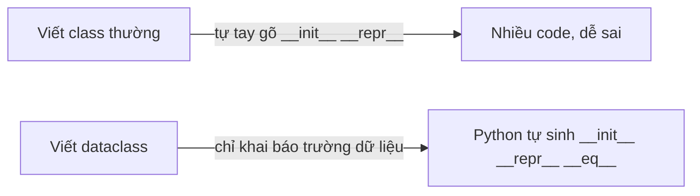
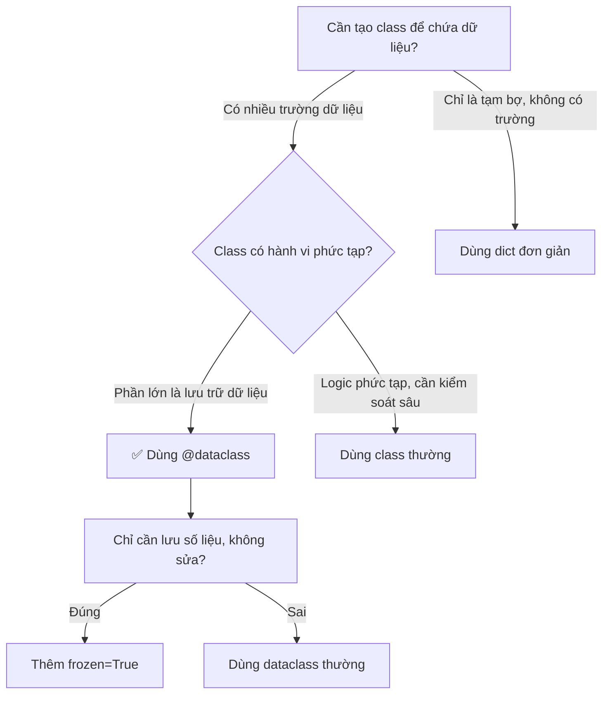

<!-- TỰ ĐỘNG ĐỒNG BỘ từ 01-Co-Ban/24-Dataclass/bai.md — đừng sửa trực tiếp, sửa bản chính rồi chạy tools/sync_tracks.py -->

# Bài 24 — Dataclass – Dữ Liệu "Tự Biết" Khai Báo

> 🎓 **Chương 5 – Lập trình hướng đối tượng & các công cụ nâng cao**

## 🧠 Điều kiện tiên quyết

- [Bài 23 — Lập Trình Hướng Đối Tượng (OOP)](../23-OOP/bai.md)

---

## 🎯 Mục tiêu

Sau bài học này, học viên sẽ:

* ✅ Hiểu **Dataclass là gì** và vì sao nó ra đời để "đỡ đần" class thường.
* ✅ Biết dùng `@dataclass` để tạo class **nhanh, ngắn, tự động** có `__init__`, `__repr__`, `__eq__`.
* ✅ Nắm được cách đặt **giá trị mặc định** và dùng `field(default_factory=list)` cho dữ liệu kiểu list/dict.
* ✅ Biết dùng **`frozen=True`** để tạo dữ liệu "bất biến" (không sửa được).
* ✅ Lập được **bảng so sánh** Dataclass với class thường để biết khi nào dùng cái nào.
* ✅ Ứng dụng Dataclass vào các bài toán thực tế: quản lý sản phẩm, học sinh, điểm số.

---

## 📖 Kiến thức

### 1. Nhắc lại bài 23: class thường "viết tay"

Ở [Bài 23 – OOP](../23-OOP/bai.md), muốn tạo một class "sản phẩm" ta phải **tự tay viết**:

```python
class SanPham:
    def __init__(self, ten, gia):          # tự tay viết hàm khởi tạo
        self.ten = ten
        self.gia = gia
    def __repr__(self):                    # tự tay viết hàm in đối tượng
        return f"SanPham(ten={self.ten}, gia={self.gia})"
```

Cứ mỗi class lại phải gõ lại y hệt 2 khối lệnh trên — **nhàm chán và dễ sai**. Hãy tưởng tượng một lớp học có 40 học sinh, thầy giáo phải chép tên 40 lần vào sổ — nếu có máy in danh sách thì đỡ biết bao! 🖨️

### 2. Dataclass là gì?

> 💬 **Nói đơn giản:** Dataclass là một **"máy in danh sách học sinh"** — bạn chỉ cần *khai báo* các trường (tên, tuổi, điểm...), Python sẽ **tự động viết giúp** `__init__`, `__repr__`, `__eq__` và nhiều hàm khác.

Dataclass nằm trong **thư viện chuẩn** (có sẵn từ Python 3.7, không cần cài gì thêm) — chỉ cần một dòng `from dataclasses import dataclass` ở đầu file.



### 3. Cú pháp cơ bản của @dataclass

```python
from dataclasses import dataclass      # 1. Nhập khẩu "máy in" từ thư viện chuẩn

@dataclass                             # 2. Trang trí (decorator) cho class
class SanPham:                         # 3. Khai báo class như bình thường
    ten: str                           # 4. Khai báo trường: tên (kiểu chữ)
    gia: float                         # 5. Khai báo trường: giá (kiểu số thực)
```

Chỉ cần vậy thôi! Python **tự sinh**:

| Python tự tạo | Công dụng |
|---|---|
| `__init__(self, ten, gia)` | Tạo đối tượng: `SanPham("Bút", 5000)` |
| `__repr__(self)` | In ra `SanPham(ten='Bút', gia=5000.0)` đẹp mắt |
| `__eq__(self, other)` | So sánh `sp1 == sp2` theo từng trường |

> 🔎 **Chú ý phần khai báo kiểu:** `ten: str` — dấu hai chấm là **chú thích kiểu (type hint)**, giúp con người đọc hiểu rõ ràng và giúp máy phát hiện lỗi. Dataclass **không bắt buộc** dữ liệu phải đúng kiểu đó khi chạy, nhưng ta NÊN tôn trọng nó.

### 4. Giá trị mặc định (default)

Trường có thể có **giá trị mặc định** — như "màu xe mặc định là trắng":

```python
@dataclass
class Xe:
    ten: str
    mau: str = "Trắng"      # nếu không truyền mau, tự động là "Trắng"
```

```python
xe1 = Xe("Honda Vision")        # không truyền mau -> mau = "Trắng"
xe2 = Xe("Yamaha Sirius", "Đỏ") # truyền rõ màu
```

> ⚠️ **Luật bất biến:** trường có mặc định phải **đứng SAU** trường không có mặc định (không được viết `mau: str = "Trắng"` rồi mới đến `ten: str`).

### 5. field(default_factory=list) – bẫy kinh điển

Thử đặt mặc định là list trực tiếp:

```python
@dataclass
class LopHoc:
    ten: str
    hoc_sinh: list = []   # ❌ SAI — Python báo lỗi ngay!
```

Python **cấm** dùng list/dict làm giá trị mặc định trực tiếp vì mọi đối tượng sẽ **dùng chung một list**. Đúng cách là:

```python
from dataclasses import field          # nhập thêm field

@dataclass
class LopHoc:
    ten: str
    hoc_sinh: list = field(default_factory=list)   # ✅ mỗi đối tượng có list RIÊNG
```

> 💬 **Giải thích dễ hiểu:** `default_factory=list` nghĩa là "mỗi lần tạo đối tượng mới, hãy gọi `list()` để làm một danh sách trống mới tinh". Giống như mỗi học sinh tự có một quyển vở riêng, không ai dùng chung vở của ai.

### 6. frozen=True – dữ liệu bất biến

Thêm `frozen=True` vào dấu ngoặc của `@dataclass`:

```python
@dataclass(frozen=True)
class DiemThi:
    mon: str
    diem: float
```

Khi đó mọi thuộc tính **không thể thay đổi** sau khi tạo — cố sửa sẽ báo `FrozenInstanceError`:

```python
d = DiemThi("Toán", 9.5)
d.diem = 10      # ❌ Lỗi: FrozenInstanceError — điểm thi đã "đóng khung"
```

> 💬 **Khi nào dùng?** Khi dữ liệu là **sự thật không thay đổi**: điểm thi đã chấm xong, ngày sinh, số CCCD, giá trị cấu hình... Dữ liệu bất biến giúp chương trình **an toàn hơn**, tránh sửa nhầm.

### 7. Bảng tổng so sánh: Dataclass vs Class thường

| Tiêu chí | 🐍 Class thường | 📦 Dataclass |
|---|---|---|
| Viết `__init__` | Tự tay gõ từng dòng | Tự động sinh |
| Viết `__repr__` | Tự tay gõ | Tự động sinh, in đẹp |
| So sánh `==` | Mặc định so địa chỉ ô nhớ | Tự động so từng trường |
| Sắp xếp được | Phải tự viết `__lt__` | Thêm `order=True` là xong |
| Độ dài code | Dài, trùng lặp | Ngắn gọn, tập trung vào dữ liệu |
| Linh hoạt hành vi riêng | Cao (tự kiểm soát mọi thứ) | Vẫn viết method được bình thường |
| Phù hợp | Class có logic/hành vi phức tạp | Class chỉ chứa dữ liệu + vài thao tác |

### 8. Khi nào dùng Dataclass?



**Quy tắc vàng:** Nếu class của bạn 90% là *chứa dữ liệu* và 10% là *thao tác* → Dataclass. Nếu là class điều khiển hệ thống (như ATM, Game Engine) → class thường.

---

## 💡 Ví dụ minh họa

### Ví dụ 1: Quản lý sản phẩm đơn giản

```python
from dataclasses import dataclass

@dataclass                # trang trí: biến class thành dataclass
class SanPham:            # khai báo class như bình thường
    ten: str              # trường: tên sản phẩm, kiểu chữ
    gia: float            # trường: giá sản phẩm, kiểu số thực

sp = SanPham("Bút bi", 5000)     # tạo sản phẩm, Python tự sinh __init__
print(sp)                        # in đối tượng -> dùng __repr__ tự sinh
print(sp.ten, sp.gia)            # truy cập thuộc tính như class thường
```

Kết quả:

```
SanPham(ten='Bút bi', gia=5000.0)
Bút bi 5000.0
```

**Giải thích từng dòng:**

| Dòng code | Ý nghĩa |
|---|---|
| `from dataclasses import dataclass` | Nhập "máy in" `@dataclass` từ thư viện chuẩn |
| `@dataclass` | Trang trí cho Python biết: hãy tự sinh các hàm cho class này |
| `ten: str` / `gia: float` | Khai báo trường dữ liệu kèm chú thích kiểu |
| `SanPham("Bút bi", 5000)` | Gọi `__init__` tự sinh, đúng thứ tự khai báo |
| `print(sp)` | Gọi `__repr__` tự sinh -> hiển thị đẹp, đủ thông tin |
| `sp.ten` | Truy cập như thuộc tính bình thường |

### Ví dụ 2: Học sinh với giá trị mặc định

```python
from dataclasses import dataclass

@dataclass
class HocSinh:
    ten: str                    # bắt buộc truyền
    lop: str = "10A1"           # mặc định: 10A1 nếu không truyền
    diem_tb: float = 0.0        # mặc định: 0.0

hs1 = HocSinh("An")                       # chỉ truyền tên
hs2 = HocSinh("Bình", "10A2", 8.5)        # truyền đủ cả 3
print(hs1)
print(hs2)
```

Kết quả:

```
HocSinh(ten='An', lop='10A1', diem_tb=0.0)
HocSinh(ten='Bình', lop='10A2', diem_tb=8.5)
```

**Giải thích từng dòng:**

| Dòng code | Ý nghĩa |
|---|---|
| `ten: str` | Trường bắt buộc — không có mặc định |
| `lop: str = "10A1"` | Trường mặc định — nhập liệu thiếu vẫn chạy |
| `diem_tb: float = 0.0` | Mặc định 0.0 — hợp lý cho học sinh chưa có điểm |
| `HocSinh("An")` | Chỉ truyền 1 đối số, hai trường còn lại lấy mặc định |
| `print(hs1)` | `__repr__` tự sinh hiển thị đầy đủ cả giá trị mặc định |

### Ví dụ 3: Danh sách môn học với field

```python
from dataclasses import dataclass, field

@dataclass
class HocSinh:
    ten: str
    mon_hoc: list = field(default_factory=list)   # mỗi hs có list riêng

hs1 = HocSinh("An")
hs2 = HocSinh("Bình")
hs1.mon_hoc.append("Toán")     # chỉ An học Toán
print(hs1)
print(hs2)                      # Bình vẫn trống — không dính lỗi chung list
```

Kết quả:

```
HocSinh(ten='An', mon_hoc=['Toán'])
HocSinh(ten='Bình', mon_hoc=[])
```

**Giải thích từng dòng:**

| Dòng code | Ý nghĩa |
|---|---|
| `from dataclasses import dataclass, field` | Nhập cả `field` để khai báo factory |
| `list = field(default_factory=list)` | Mỗi đối tượng mới được "sản xuất" một `list` mới |
| `hs1.mon_hoc.append("Toán")` | Thêm môn học cho riêng hs1 |
| `print(hs2)` | hs2 có list **riêng trống** — không bị hs1 "làm phiền" |

---

## 🔬 Ví dụ nâng cao

### Ví dụ 1: Quản lý cửa hàng

```python
from dataclasses import dataclass

@dataclass
class SanPham:
    ten: str
    gia: float
    ton_kho: int = 0

    def gia_tri_ton(self):              # phương thức bình thường
        return self.gia * self.ton_kho  # giá trị hàng tồn kho

    def giam_gia(self, phan_tram):
        self.gia = self.gia * (1 - phan_tram / 100)   # giảm giá %

# Tạo giỏ hàng
sp1 = SanPham("Laptop", 15000000, 10)
sp2 = SanPham("Chuột", 200000, 50)

print(sp1)                                  # repr tự sinh
print(f"Giá trị tồn kho Laptop: {sp1.gia_tri_ton()}")   # 15tr * 10
sp2.giam_gia(20)                            # giảm 20%
print(f"Chuột sau giảm giá: {sp2.gia} đồng")
```

Kết quả:

```
SanPham(ten='Laptop', gia=15000000.0, ton_kho=10)
Giá trị tồn kho Laptop: 150000000.0
Chuột sau giảm giá: 160000.0 đồng
```

> 💡 Dataclass vẫn cho phép viết **phương thức** như class thường — chỉ là phần dữ liệu thì tự động.

### Ví dụ 2: Quản lý điểm học sinh & sắp xếp

```python
from dataclasses import dataclass

@dataclass
class HocSinh:
    ten: str
    diem: float

    def xep_loai(self):                     # xếp loại theo điểm
        if self.diem >= 8: return "Giỏi"
        if self.diem >= 6.5: return "Khá"
        return "Trung bình"

# Danh sách học sinh
lop = [
    HocSinh("An", 8.5),
    HocSinh("Bình", 6.0),
    HocSinh("Cường", 9.0),
]

# Sắp xếp giảm dần theo điểm, dùng sorted + key=lambda (học ở bài 25)
lop_sx = sorted(lop, key=lambda hs: hs.diem, reverse=True)

for hs in lop_sx:
    print(hs.ten, hs.diem, hs.xep_loai())   # in danh sách đã sắp xếp
```

Kết quả:

```
Cường 9.0 Giỏi
An 8.5 Giỏi
Bình 6.0 Trung bình
```

### Ví dụ 3: frozen=True cho điểm thi

```python
from dataclasses import dataclass, FrozenInstanceError

@dataclass(frozen=True)
class DiemThi:
    mon: str
    diem: float

d = DiemThi("Toán", 9.0)
print(d)                          # repr tự sinh
try:
    d.diem = 10                   # cố sửa điểm
except FrozenInstanceError:
    print("❌ Không thể sửa điểm thi sau khi đã chấm!")
```

Kết quả:

```
DiemThi(mon='Toán', diem=9.0)
❌ Không thể sửa điểm thi sau khi đã chấm!
```

### Ví dụ 4: So sánh `==` tự động

```python
from dataclasses import dataclass

@dataclass
class ToaDo:
    x: int
    y: int

a = ToaDo(3, 4)
b = ToaDo(3, 4)
c = ToaDo(4, 3)

print(a == b)    # ✅ True — dataclass tự so từng trường
print(a == c)    # ❌ False — khác tọa độ
```

> 🧠 Nếu là class thường, `a == b` sẽ trả về `False` vì Python so **địa chỉ ô nhớ**. Dataclass so **giá trị** — đúng ý nghĩa con người mong đợi.

---

## ⚠️ Lỗi thường gặp

### Lỗi 1: Quên import `dataclass`

```python
@dataclass          # ❌ SAI
class SanPham:
    ten: str
```

* **Kết quả báo:** `NameError: name 'dataclass' is not defined`
* **Nguyên nhân:** chưa nhập `from dataclasses import dataclass` ở đầu file.
* **Cách sửa:** thêm dòng import ở đầu file — dataclass là **thư viện chuẩn**, không cần cài đặt.

### Lỗi 2: `list = []` làm mặc định

```python
@dataclass
class Lop:
    ten: str
    hs: list = []       # ❌ SAI
```

* **Kết quả báo:** `ValueError: mutable default <class 'list'> for field hs is not allowed`
* **Nguyên nhân:** list là dữ liệu "thay đổi được" (mutable), dùng làm mặc định sẽ khiến mọi đối tượng dùng chung một list.
* **Cách sửa:** `hs: list = field(default_factory=list)`.

### Lỗi 3: Sửa thuộc tính của dataclass frozen

```python
@dataclass(frozen=True)
class DiemThi:
    mon: str
    diem: float

d = DiemThi("Toán", 9.0)
d.diem = 10        # ❌ SAI
```

* **Kết quả báo:** `dataclasses.FrozenInstanceError: cannot assign to field 'diem'`
* **Nguyên nhân:** `frozen=True` đóng băng mọi thuộc tính.
* **Cách sửa:** nếu muốn thay đổi, bỏ `frozen=True`; nếu muốn giữ bất biến, tạo đối tượng mới: `d = DiemThi("Toán", 10)`.

### Lỗi 4: Truyền sai số đối số khi tạo đối tượng

```python
sp = SanPham("Bút bi")        # ❌ SAI — thiếu tham số gia
```

* **Kết quả báo:** `TypeError: __init__() missing 1 required positional argument: 'gia'`
* **Nguyên nhân:** `__init__` tự sinh yêu cầu đúng số tham số như khai báo.
* **Cách sửa:** truyền đủ tham số, hoặc đặt mặc định cho trường: `gia: float = 0.0`.

### Lỗi 5: Viết trường có mặc định trước trường không mặc định

```python
@dataclass
class Xe:
    mau: str = "Trắng"    # ❌ SAI — có mặc định đứng trước
    ten: str
```

* **Kết quả báo:** `TypeError: non-default argument 'ten' follows default argument`
* **Nguyên nhân:** Python không biết xử lý tham số bắt buộc đứng sau tham số tùy chọn.
* **Cách sửa:** đổi thứ tự — trường bắt buộc trước, trường mặc định sau.

---

## 💎 Mẹo

* ✨ **Quy tắc vàng khi khai báo:** trường nào cũng nên ghi **chú thích kiểu** (`ten: str`) — đọc code lên là hiểu ngay dữ liệu hình dạng ra sao.
* 🧰 **Thêm `order=True`** để sắp xếp luôn: `@dataclass(order=True)` giúp `sorted()` hoạt động trực tiếp trên danh sách đối tượng mà không cần viết `key`.
* 🔒 **Dùng `frozen=True` cho dữ liệu lịch sử** (điểm thi, hóa đơn, log) — bảo vệ dữ liệu khỏi sửa nhầm.
* 🏭 **`default_factory` còn làm được nhiều hơn `list`:** `field(default_factory=dict)`, `field(default_factory=lambda: [0, 0])`... — đều là "công thức sản xuất" giá trị mặc định mới mỗi lần.
* 📋 **In danh sách nhiều đối tượng:** vòng lặp `for` + `print(sp)` hiển thị rất đẹp nhờ `__repr__` tự sinh — không cần viết hàm in riêng.
* 🧪 **Kết hợp với bài 22 (File):** dataclass là nơi lý tưởng chứa dữ liệu đọc từ file CSV/JSON — bài 32, 33 sẽ dùng rất nhiều.
* 🔍 **Đừng lạm dụng:** class chỉ có 1-2 trường thì dùng tuple/dict cho gọn; dataclass phát huy khi từ 3 trường trở lên.

---

## 📝 Tóm tắt

| Khái niệm | Nội dung chính |
|---|---|
| 📦 `@dataclass` | Trang trí class để Python tự sinh `__init__`, `__repr__`, `__eq__` |
| 🔤 Khai báo trường | `ten: str` — tên + chú thích kiểu |
| 🎯 Giá trị mặc định | `lop: str = "10A1"` — trường tùy chọn, phải đứng sau trường bắt buộc |
| 🏭 `field(default_factory=list)` | Mỗi đối tượng có list/dict **riêng biệt** |
| ❄️ `frozen=True` | Dữ liệu bất biến — sửa sẽ báo `FrozenInstanceError` |
| 🧮 `order=True` | Cho phép sắp xếp trực tiếp bằng `sorted()` |
| ⚖️ So với class thường | Class thường: tự kiểm soát mọi thứ; Dataclass: ngắn gọn, hợp dữ liệu |
| ✅ Khi nào dùng | Class chứa dữ liệu thuần túy → Dataclass; logic phức tạp → class thường |

---

## 🧪 Kiểm tra nhanh

1. ❓ `@dataclass` nằm trong thư viện nào? Có cần `pip install` không?
2. ❓ Kể tên 3 hàm mà Python tự động sinh khi dùng `@dataclass`.
3. ❓ Trong khai báo `ten: str`, phần `: str` dùng để làm gì?
4. ❓ Vì sao không được viết `hoc_sinh: list = []` mà phải dùng `field(default_factory=list)`?
5. ❓ `frozen=True` có tác dụng gì? Khi cố sửa thuộc tính sẽ báo lỗi gì?
6. ❓ Viết dataclass `Sach` có 2 trường: `tua` (str), `gia` (float, mặc định 0).
7. ❓ Đúng hay sai: trường có giá trị mặc định phải khai báo trước trường không mặc định?
8. ❓ Hai đối tượng dataclass có cùng giá trị mọi trường, so `==` trả về gì?

<details>
<summary>🔍 Xem đáp án</summary>

1. Thư viện `dataclasses` — là **thư viện chuẩn** (Python 3.7+), không cần cài thêm.
2. `__init__`, `__repr__`, `__eq__` (và `__lt__`... nếu `order=True`).
3. Chú thích kiểu (type hint) — ghi rõ trường đó lưu dữ liệu kiểu gì.
4. Vì list là dữ liệu mutable — nếu dùng trực tiếp, mọi đối tượng dùng chung một list, sửa cái này ảnh hưởng cái kia.
5. Đóng băng dữ liệu, không sửa được; báo `FrozenInstanceError`.
6. `@dataclass` + `class Sach:` + `tua: str` + `gia: float = 0`.
7. Sai — trường mặc định phải đứng **sau** trường bắt buộc.
8. `True` — dataclass tự sinh `__eq__` so từng trường.

</details>

---

## 📚 Bài đọc thêm

* [Python.org – dataclasses (tài liệu chính thức)](https://docs.python.org/3/library/dataclasses.html)
* [Real Python – Data Classes in Python](https://realpython.com/python-data-classes/)
* [GeeksforGeeks – Data Classes](https://www.geeksforgeeks.org/data-classes-in-python-an-introduction/)

---

---

## 🧩 Bài tập

> 📝 🎯 **Chủ đề:** Tạo class chứa dữ liệu tự động với `@dataclass` — giá trị mặc định, `field(default_factory=list)`, `frozen=True`.

## 🟢 Dễ (Bài 1 – 7)

### Bài 1: Dataclass Sản phẩm đầu tiên

* **Đề bài:** Tạo dataclass `SanPham` có 2 trường `ten` (str) và `gia` (float). Tạo sản phẩm `"Bút bi"` giá `5000` rồi in đối tượng ra màn hình.
* **Input:** Không có.
* **Output:**
  ```
  SanPham(ten='Bút bi', gia=5000.0)
  ```
* **Gợi ý:** Dùng `@dataclass` + khai báo trường kèm kiểu; `print(sp)` hiển thị nhờ `__repr__` tự sinh.

### Bài 2: Học sinh và lớp

* **Đề bài:** Tạo dataclass `HocSinh` có trường `ten` (str) và `lop` (str). Tạo 2 học sinh `"An"` lớp `"10A1"`, `"Bình"` lớp `"10A2"` và in lần lượt từng học sinh.
* **Input:** Không có.
* **Output:**
  ```
  HocSinh(ten='An', lop='10A1')
  HocSinh(ten='Bình', lop='10A2')
  ```
* **Gợi ý:** Mỗi đối tượng một `print()`, thứ tự tham số đúng thứ tự khai báo.

### Bài 3: Truy cập thuộc tính sách

* **Đề bài:** Tạo dataclass `Sach` gồm `tua` (str) và `tac_gia` (str). Tạo sách `"Đắc Nhân Tâm"` của `"Dale Carnegie"`, sau đó in riêng tên sách và tác giả bằng cách truy cập thuộc tính.
* **Input:** Không có.
* **Output:**
  ```
  Tua: Đắc Nhân Tâm
  Tac gia: Dale Carnegie
  ```
* **Gợi ý:** Dùng `s.tua`, `s.tac_gia` như thuộc tính class thường.

### Bài 4: Xe có màu mặc định

* **Đề bài:** Tạo dataclass `Xe` gồm `ten` (str) và `mau` (str, **mặc định** `"Trắng"`). Tạo xe `"Honda Vision"` không truyền màu, in ra; rồi tạo xe `"Sirius"` màu `"Đỏ"`, in ra.
* **Input:** Không có.
* **Output:**
  ```
  Xe(ten='Honda Vision', mau='Trắng')
  Xe(ten='Sirius', mau='Đỏ')
  ```
* **Gợi ý:** Trường có mặc định đứng sau trường bắt buộc; không truyền thì lấy mặc định.

### Bài 5: Điểm thi hai môn

* **Đề bài:** Tạo dataclass `Diem` có 2 trường `toan` (float), `van` (float). Tạo đối tượng `Diem(9.0, 8.0)` và in tổng điểm ra màn hình dạng: `Tong diem: 17.0`.
* **Input:** Không có.
* **Output:**
  ```
  Tong diem: 17.0
  ```
* **Gợi ý:** `d.toan + d.van` — truy cập như thuộc tính bình thường.

### Bài 6: So sánh hai sản phẩm

* **Đề bài:** Tạo dataclass `SanPham` (ten, gia). Tạo `sp1 = SanPham("Chuột", 200000)` và `sp2 = SanPham("Chuột", 200000)`, `sp3 = SanPham("Bàn phím", 350000)`. In kết quả `sp1 == sp2` và `sp1 == sp3`.
* **Input:** Không có.
* **Output:**
  ```
  True
  False
  ```
* **Gợi ý:** Dataclass tự sinh `__eq__` — so giá trị từng trường.

### Bài 7: Danh sách môn học trống

* **Đề bài:** Tạo dataclass `HocSinh` gồm `ten` (str) và `mon_hoc` (list) với `field(default_factory=list)`. Tạo học sinh `"An"` và in ra.
* **Input:** Không có.
* **Output:**
  ```
  HocSinh(ten='An', mon_hoc=[])
  ```
* **Gợi ý:** Nhớ `from dataclasses import field`; không gán `= []` trực tiếp.

---

## 🟡 Trung bình (Bài 8 – 14)

### Bài 8: Danh sách học sinh trong lớp

* **Đề bài:** Tạo dataclass `LopHoc` gồm `ten` (str) và `hoc_sinh` (list, `field(default_factory=list)`). Tạo lớp `"10A1"`, thêm `"An"`, `"Bình"`, `"Cường"` vào `hoc_sinh` rồi in lớp ra.
* **Input:** Không có.
* **Output:**
  ```
  LopHoc(ten='10A1', hoc_sinh=['An', 'Bình', 'Cường'])
  ```
* **Gợi ý:** Dùng `lop.hoc_sinh.append(...)` để thêm từng người.

### Bài 9: In toàn bộ sản phẩm

* **Đề bài:** Tạo dataclass `SanPham` (ten, gia). Tạo danh sách 3 sản phẩm (Laptop 15 triệu, Chuột 200k, Bàn phím 350k) rồi dùng vòng lặp `for` in từng sản phẩm.
* **Input:** Không có.
* **Output:**
  ```
  SanPham(ten='Laptop', gia=15000000.0)
  SanPham(ten='Chuột', gia=200000.0)
  SanPham(ten='Bàn phím', gia=350000.0)
  ```
* **Gợi ý:** `for sp in danh_sach: print(sp)`.

### Bài 10: Sản phẩm đắt nhất

* **Đề bài:** Dùng dataclass `SanPham` (ten, gia) với danh sách 4 sản phẩm bất kỳ. Tìm và in sản phẩm **có giá cao nhất**.
* **Input:** Không có.
* **Output:**
  ```
  Sản phẩm đắt nhất: SanPham(ten='Laptop', gia=15000000.0)
  ```
* **Gợi ý:** Dùng `max(danh_sach, key=lambda sp: sp.gia)` — lambda học ở bài 25, hoặc tự duyệt so sánh.

### Bài 11: Học sinh đạt học bổng

* **Đề bài:** Tạo dataclass `HocSinh` gồm `ten` (str) và `diem` (float). Cho danh sách 5 học sinh, in ra những học sinh có **điểm từ 8.0 trở lên** (đủ điều kiện học bổng).
* **Input:** Không có.
* **Output:** Ví dụ:
  ```
  An 8.5
  Cường 9.0
  ```
* **Gợi ý:** Duyệt `for`, kiểm tra `if hs.diem >= 8`.

### Bài 12: Phương thức tính trung bình

* **Đề bài:** Tạo dataclass `HocSinh` gồm `ten` (str), `diem_toan` (float), `diem_van` (float) kèm phương thức `trung_binh()` trả về trung bình cộng 2 môn. Tạo học sinh `"An"` (9.0, 7.0) và in kết quả `An co diem trung binh: 8.0`.
* **Input:** Không có.
* **Output:**
  ```
  An co diem trung binh: 8.0
  ```
* **Gợi ý:** Phương thức viết trong class như bình thường: `return (self.diem_toan + self.diem_van) / 2`.

### Bài 13: Thống kê sản phẩm rẻ

* **Đề bài:** Dataclass `SanPham` (ten, gia). Cho danh sách 5 sản phẩm, đếm xem có **bao nhiêu sản phẩm giá dưới 100.000 đồng** và in kết quả.
* **Input:** Không có.
* **Output:** Ví dụ:
  ```
  So san pham re (duoi 100000): 3
  ```
* **Gợi ý:** Đếm bằng biến `dem`, tăng khi `sp.gia < 100000`.

### Bài 14: Sắp xếp sản phẩm theo giá

* **Đề bài:** Dataclass `SanPham` (ten, gia). Cho danh sách 4 sản phẩm, in danh sách **sau khi sắp xếp tăng dần theo giá** (mỗi sản phẩm một dòng).
* **Input:** Không có.
* **Output:** Ví dụ:
  ```
  SanPham(ten='Chuột', gia=200000.0)
  SanPham(ten='Bàn phím', gia=350000.0)
  ```
* **Gợi ý:** `sorted(danh_sach, key=lambda sp: sp.gia)` rồi duyệt in.

---

## 🔴 Khó (Bài 15 – 20)

### Bài 15: Điểm thi bất biến

* **Đề bài:** Tạo dataclass `DiemThi` với `frozen=True`, gồm `mon` (str) và `diem` (float). Tạo điểm thi Toán 9.5, in ra; cố gắng sửa `diem` thành 10 và **bắt lỗi** để in ra thông báo `Khong the sua diem thi!`.
* **Input:** Không có.
* **Output:**
  ```
  DiemThi(mon='Toan', diem=9.5)
  Khong the sua diem thi!
  ```
* **Gợi ý:** Bọc phép gán trong `try...except FrozenInstanceError` (nhập từ `dataclasses`).

### Bài 16: Quản lý cửa hàng mini

* **Đề bài:** Tạo dataclass `SanPham` (ten, gia, `so_luong` int = 0) có phương thức `gia_tri()` trả về `gia * so_luong`. Tạo 3 sản phẩm với số lượng khác nhau, in tổng giá trị kho.
* **Input:** Không có.
* **Output:**
  ```
  Tong gia tri kho: 12300000.0
  ```
* **Gợi ý:** Cộng dồn `sp.gia_tri()` trong vòng lặp.

### Bài 17: Học sinh và danh sách điểm

* **Đề bài:** Tạo dataclass `HocSinh` gồm `ten` (str) và `diem` (list, `field(default_factory=list)`) kèm phương thức `trung_binh()` tính trung bình các điểm trong list. Học sinh `"An"` có điểm `[8, 9, 10]` — in ra trung bình 2 chữ số thập phân.
* **Input:** Không có.
* **Output:**
  ```
  Trung binh cua An: 9.0
  ```
* **Gợi ý:** `sum(self.diem) / len(self.diem)`; dùng `round(..., 2)` nếu cần.

### Bài 18: Bảng xếp hạng học sinh

* **Đề bài:** Dataclass `HocSinh` (ten, diem). Cho danh sách 5 học sinh, in **bảng xếp hạng giảm dần theo điểm** kèm thứ hạng (1, 2, 3...). Ví dụ: `1. An - 9.0`.
* **Input:** Không có.
* **Output:** Ví dụ:
  ```
  1. Cường - 9.0
  2. An - 8.5
  3. Bình - 6.0
  ```
* **Gợi ý:** Sắp xếp `reverse=True` rồi dùng vòng lặp `enumerate(danh_sach, start=1)`.

### Bài 19: Giảm giá thông minh

* **Đề bài:** Dataclass `SanPham` (ten, gia) có phương thức `giam_gia(phan_tram)` làm giảm `gia` đi `phan_tram`%. Tạo sản phẩm `"Áo thun"` giá 200000, giảm 25%, in giá mới và in đối tượng sau khi giảm.
* **Input:** Không có.
* **Output:**
  ```
  Gia moi: 150000.0
  SanPham(ten='Áo thun', gia=150000.0)
  ```
* **Gợi ý:** `self.gia = self.gia * (1 - phan_tram / 100)`; phương thức không cần trả về gì.

### Bài 20: Chương trình thống kê kho hàng

* **Đề bài:** Tạo dataclass `SanPham` (ten, gia, `ton_kho` int = 0). Viết hàm `thong_ke(danh_sach)` in ra: (1) tổng số mặt hàng, (2) tổng giá trị kho (tổng `gia * ton_kho`), (3) mặt hàng có số lượng tồn ít nhất. Cho 4 sản phẩm mẫu và gọi hàm.
* **Input:** Không có.
* **Output:**
  ```
  Tong so mat hang: 4
  Tong gia tri kho: 15550000.0
  Hang ton it nhat: SanPham(ten='Tai nghe', gia=500000.0, ton_kho=2)
  ```
* **Gợi ý:** Dùng `len()`, vòng lặp cộng dồn, và `min(danh_sach, key=lambda sp: sp.ton_kho)`.

---

## 🎯 Tổng kết sau khi làm bài

Sau 20 bài tập, bạn đã:

* ✅ Tạo dataclass tự động có `__init__`, `__repr__`, `__eq__`.
* ✅ Dùng giá trị mặc định và `field(default_factory=list)` đúng cách.
* ✅ Bảo vệ dữ liệu bằng `frozen=True`.
* ✅ Viết phương thức và xử lý danh sách đối tượng (sắp xếp, thống kê, tìm kiếm).

> 💪 Chưa tự làm được bài nào thì đừng lo — hãy xem lại bài giảng rồi quay lại. **Lập trình là luyện tập!**

---

## ✅ Đáp án

> 💡 **Hãy tự làm bài tập trước** rồi mới mở đáp án.

## 🟢 Dễ (Bài 1 – 7)


<details>
<summary>✅ Bài 1: Dataclass Sản phẩm đầu tiên</summary>


**Phân tích:** Cần một class chỉ chứa 2 trường dữ liệu — đây là trường hợp dùng `@dataclass` hoàn hảo.

**Ý tưởng:** Khai báo `@dataclass` với 2 trường kèm kiểu; Python tự sinh `__init__` và `__repr__`.

**Thuật toán:**
1. Import `dataclass`.
2. Khai báo class với 2 trường.
3. Tạo đối tượng và in.

**Code:**

```python
from dataclasses import dataclass

@dataclass
class SanPham:
    ten: str
    gia: float

sp = SanPham("Bút bi", 5000)
print(sp)
```

**Giải thích code:**
* `@dataclass` — Python tự sinh `__init__` (nhận `ten`, `gia`) và `__repr__` (in đẹp).
* `SanPham("Bút bi", 5000)` — gọi `__init__` tự sinh.
* `print(sp)` — hiển thị `SanPham(ten='Bút bi', gia=5000.0)`.

**Độ phức tạp:** O(1).

---

</details>

<details>
<summary>✅ Bài 2: Học sinh và lớp</summary>


**Phân tích:** Tạo nhiều đối tượng cùng class rồi in từng cái.

**Ý tưởng:** Hai lần gọi tạo đối tượng với đối số khác nhau; mỗi `print()` in một đối tượng.

**Thuật toán:**
1. Khai báo dataclass `HocSinh`.
2. Tạo `hs1`, `hs2`.
3. In lần lượt.

**Code:**

```python
from dataclasses import dataclass

@dataclass
class HocSinh:
    ten: str
    lop: str

hs1 = HocSinh("An", "10A1")
hs2 = HocSinh("Bình", "10A2")
print(hs1)
print(hs2)
```

**Giải thích code:**
* `HocSinh("An", "10A1")` — đối số theo đúng thứ tự khai báo: tên trước, lớp sau.
* Hai `print()` tạo hai dòng riêng biệt.

**Độ phức tạp:** O(1).

---

</details>

<details>
<summary>✅ Bài 3: Truy cập thuộc tính sách</summary>


**Phân tích:** Sau khi tạo đối tượng, cần lấy từng thuộc tính riêng lẻ.

**Ý tưởng:** Dùng cú pháp chấm `đối_tượng.thuộc_tính` như class thường.

**Thuật toán:**
1. Khai báo dataclass `Sach`.
2. Tạo sách.
3. In tên và tác giả riêng.

**Code:**

```python
from dataclasses import dataclass

@dataclass
class Sach:
    tua: str
    tac_gia: str

s = Sach("Đắc Nhân Tâm", "Dale Carnegie")
print("Tua:", s.tua)
print("Tac gia:", s.tac_gia)
```

**Giải thích code:**
* `s.tua` — lấy giá trị trường `tua` của đối tượng `s`.
* Dataclass không khác gì class thường khi **truy cập** thuộc tính — chỉ khác ở phần tự sinh.

**Độ phức tạp:** O(1).

---

</details>

<details>
<summary>✅ Bài 4: Xe có màu mặc định</summary>


**Phân tích:** Trường `mau` có mặc định nên khi tạo xe thứ nhất không cần truyền.

**Ý tưởng:** Khai báo `mau: str = "Trắng"` — trường mặc định đứng sau trường bắt buộc.

**Thuật toán:**
1. Khai báo class với trường mặc định.
2. Tạo xe không truyền màu và xe truyền màu.
3. In cả hai.

**Code:**

```python
from dataclasses import dataclass

@dataclass
class Xe:
    ten: str
    mau: str = "Trắng"

xe1 = Xe("Honda Vision")
xe2 = Xe("Sirius", "Đỏ")
print(xe1)
print(xe2)
```

**Giải thích code:**
* `mau: str = "Trắng"` — nếu bỏ qua đối số, Python dùng `"Trắng"`.
* `Xe("Sirius", "Đỏ")` — truyền rõ màu sẽ thay thế mặc định.

**Độ phức tạp:** O(1).

---

</details>

<details>
<summary>✅ Bài 5: Điểm thi hai môn</summary>


**Phân tích:** Cần tính tổng hai trường số thực của đối tượng.

**Ý tưởng:** Truy cập `toan`, `van` rồi cộng, đưa vào `print`.

**Thuật toán:**
1. Khai báo dataclass `Diem`.
2. Tạo đối tượng.
3. In tổng.

**Code:**

```python
from dataclasses import dataclass

@dataclass
class Diem:
    toan: float
    van: float

d = Diem(9.0, 8.0)
print("Tong diem:", d.toan + d.van)
```

**Giải thích code:**
* `d.toan + d.van` — `9.0 + 8.0 = 17.0`, kết quả kiểu `float` nên có `.0`.

**Độ phức tạp:** O(1).

---

</details>

<details>
<summary>✅ Bài 6: So sánh hai sản phẩm</summary>


**Phân tích:** Dataclass tự sinh `__eq__` so từng trường.

**Ý tưởng:** Tạo 3 đối tượng; `sp1 == sp2` so 2 trường bằng nhau, `sp1 == sp3` khác nhau.

**Thuật toán:**
1. Khai báo dataclass.
2. Tạo 3 sản phẩm.
3. In kết quả so sánh.

**Code:**

```python
from dataclasses import dataclass

@dataclass
class SanPham:
    ten: str
    gia: float

sp1 = SanPham("Chuột", 200000)
sp2 = SanPham("Chuột", 200000)
sp3 = SanPham("Bàn phím", 350000)

print(sp1 == sp2)
print(sp1 == sp3)
```

**Giải thích code:**
* `sp1 == sp2` — cùng tên và cùng giá → `True`.
* `sp1 == sp3` — khác tên, khác giá → `False`.
* Với class thường, kết quả sẽ luôn là `False` vì Python so địa chỉ ô nhớ.

**Độ phức tạp:** O(1).

---

</details>

<details>
<summary>✅ Bài 7: Danh sách môn học trống</summary>


**Phân tích:** Trường list phải dùng `field(default_factory=list)` — không được gán `= []` trực tiếp.

**Ý tưởng:** Khai báo đúng factory; khi tạo đối tượng, list tự động là `[]`.

**Thuật toán:**
1. Import cả `field`.
2. Khai báo trường list với `default_factory=list`.
3. Tạo và in.

**Code:**

```python
from dataclasses import dataclass, field

@dataclass
class HocSinh:
    ten: str
    mon_hoc: list = field(default_factory=list)

hs = HocSinh("An")
print(hs)
```

**Giải thích code:**
* `field(default_factory=list)` — mỗi lần tạo đối tượng, Python gọi `list()` tạo danh sách mới.
* `mon_hoc` in ra `[]` — danh sách trống chưa có môn nào.

**Độ phức tạp:** O(1).

---

</details>

## 🟡 Trung bình (Bài 8 – 14)


<details>
<summary>✅ Bài 8: Danh sách học sinh trong lớp</summary>


**Phân tích:** Cần "chứa trong chứa" — class `LopHoc` có một list đối tượng/danh sách tên.

**Ý tưởng:** Dùng `field(default_factory=list)` rồi `append` từng học sinh.

**Thuật toán:**
1. Khai báo dataclass với trường list.
2. Tạo lớp và thêm 3 tên.
3. In lớp.

**Code:**

```python
from dataclasses import dataclass, field

@dataclass
class LopHoc:
    ten: str
    hoc_sinh: list = field(default_factory=list)

lop = LopHoc("10A1")
lop.hoc_sinh.append("An")
lop.hoc_sinh.append("Bình")
lop.hoc_sinh.append("Cường")
print(lop)
```

**Giải thích code:**
* `lop.hoc_sinh.append(...)` — thêm tên vào danh sách riêng của lớp.
* `print(lop)` — `__repr__` tự sinh hiển thị cả danh sách bên trong.

**Độ phức tạp:** O(n) với n là số học sinh thêm vào.

---

</details>

<details>
<summary>✅ Bài 9: In toàn bộ sản phẩm</summary>


**Phân tích:** Kết hợp dataclass với vòng lặp `for` để in danh sách đối tượng.

**Ý tưởng:** Dựng list literal chứa các đối tượng, duyệt và in từng cái.

**Thuật toán:**
1. Khai báo dataclass.
2. Tạo danh sách 3 sản phẩm.
3. Vòng lặp in.

**Code:**

```python
from dataclasses import dataclass

@dataclass
class SanPham:
    ten: str
    gia: float

danh_sach = [
    SanPham("Laptop", 15000000),
    SanPham("Chuột", 200000),
    SanPham("Bàn phím", 350000),
]

for sp in danh_sach:
    print(sp)
```

**Giải thích code:**
* List literal chứa trực tiếp các đối tượng `SanPham`.
* `print(sp)` — mỗi dòng một sản phẩm nhờ `__repr__` tự sinh.

**Độ phức tạp:** O(n).

---

</details>

<details>
<summary>✅ Bài 10: Sản phẩm đắt nhất</summary>


**Phân tích:** Tìm phần tử lớn nhất theo tiêu chí `gia`.

**Ý tưởng:** Dùng `max(danh_sach, key=lambda sp: sp.gia)` — `key` cho biết "so sánh theo giá trị nào".

**Thuật toán:**
1. Tạo danh sách sản phẩm.
2. Gọi `max` với `key`.
3. In kết quả.

**Code:**

```python
from dataclasses import dataclass

@dataclass
class SanPham:
    ten: str
    gia: float

danh_sach = [
    SanPham("Chuột", 200000),
    SanPham("Bàn phím", 350000),
    SanPham("Laptop", 15000000),
    SanPham("Tai nghe", 500000),
]

sp_dat_nhat = max(danh_sach, key=lambda sp: sp.gia)
print("Sản phẩm đắt nhất:", sp_dat_nhat)
```

**Giải thích code:**
* `key=lambda sp: sp.gia` — mỗi sản phẩm quy về giá để so sánh (lambda học chi tiết bài 25).
* `max` trả về chính đối tượng có giá lớn nhất.

**Độ phức tạp:** O(n).

---

</details>

<details>
<summary>✅ Bài 11: Học sinh đạt học bổng</summary>


**Phân tích:** Lọc danh sách theo điều kiện điểm.

**Ý tưởng:** Duyệt từng học sinh, kiểm tra `diem >= 8` rồi in.

**Thuật toán:**
1. Tạo danh sách học sinh.
2. Duyệt và kiểm tra điều kiện.
3. In học sinh đạt.

**Code:**

```python
from dataclasses import dataclass

@dataclass
class HocSinh:
    ten: str
    diem: float

lop = [
    HocSinh("An", 8.5),
    HocSinh("Bình", 6.0),
    HocSinh("Cường", 9.0),
    HocSinh("Dung", 7.5),
    HocSinh("Em", 8.0),
]

for hs in lop:
    if hs.diem >= 8:
        print(hs.ten, hs.diem)
```

**Giải thích code:**
* `if hs.diem >= 8` — điều kiện học bổng.
* Chỉ những học sinh thỏa mãn mới được in.

**Độ phức tạp:** O(n).

---

</details>

<details>
<summary>✅ Bài 12: Phương thức tính trung bình</summary>


**Phân tích:** Dataclass vẫn viết phương thức như class thường.

**Ý tưởng:** Định nghĩa `trung_binh()` trong class, dùng `self` để truy cập dữ liệu.

**Thuật toán:**
1. Khai báo class với 3 trường.
2. Viết phương thức `trung_binh()`.
3. Tạo đối tượng và in kết quả.

**Code:**

```python
from dataclasses import dataclass

@dataclass
class HocSinh:
    ten: str
    diem_toan: float
    diem_van: float

    def trung_binh(self):
        return (self.diem_toan + self.diem_van) / 2

hs = HocSinh("An", 9.0, 7.0)
print(f"{hs.ten} co diem trung binh: {hs.trung_binh()}")
```

**Giải thích code:**
* `def trung_binh(self)` — phương thức thường, đối số đầu tiên là `self`.
* `(self.diem_toan + self.diem_van) / 2` — `(9.0 + 7.0) / 2 = 8.0`.
* f-string nhúng kết quả trực tiếp vào chuỗi in.

**Độ phức tạp:** O(1).

---

</details>

<details>
<summary>✅ Bài 13: Thống kê sản phẩm rẻ</summary>


**Phân tích:** Đếm số phần tử thỏa điều kiện giá.

**Ý tưởng:** Biến đếm khởi tạo 0, tăng khi gặp sản phẩm giá dưới 100.000.

**Thuật toán:**
1. Tạo danh sách 5 sản phẩm.
2. Khởi tạo `dem = 0`.
3. Duyệt, tăng `dem` khi thỏa điều kiện.
4. In kết quả.

**Code:**

```python
from dataclasses import dataclass

@dataclass
class SanPham:
    ten: str
    gia: float

danh_sach = [
    SanPham("Bút bi", 5000),
    SanPham("Vở", 15000),
    SanPham("Thước", 8000),
    SanPham("Balô", 250000),
    SanPham("Bình nước", 90000),
]

dem = 0
for sp in danh_sach:
    if sp.gia < 100000:
        dem += 1

print(f"So san pham re (duoi 100000): {dem}")
```

**Giải thích code:**
* `dem = 0` — khởi tạo bộ đếm.
* `dem += 1` — tăng đếm mỗi lần gặp sản phẩm rẻ.
* Bút bi, Vở, Thước, Bình nước (4 sản phẩm) đều dưới 100k.

**Độ phức tạp:** O(n).

---

</details>

<details>
<summary>✅ Bài 14: Sắp xếp sản phẩm theo giá</summary>


**Phân tích:** Cần sắp xếp danh sách đối tượng theo một thuộc tính.

**Ý tưởng:** `sorted(danh_sach, key=lambda sp: sp.gia)` trả về danh sách mới đã sắp xếp.

**Thuật toán:**
1. Tạo danh sách.
2. Sắp xếp bằng `sorted` với `key`.
3. Duyệt in.

**Code:**

```python
from dataclasses import dataclass

@dataclass
class SanPham:
    ten: str
    gia: float

danh_sach = [
    SanPham("Laptop", 15000000),
    SanPham("Chuột", 200000),
    SanPham("Bàn phím", 350000),
    SanPham("Tai nghe", 500000),
]

danh_sach_sx = sorted(danh_sach, key=lambda sp: sp.gia)

for sp in danh_sach_sx:
    print(sp)
```

**Giải thích code:**
* `sorted` **không sửa** danh sách gốc mà trả về danh sách mới.
* `key=lambda sp: sp.gia` — lấy giá làm chìa khóa so sánh.
* Thứ tự in: Chuột → Bàn phím → Tai nghe → Laptop.

**Độ phức tạp:** O(n log n).

---

</details>

## 🔴 Khó (Bài 15 – 20)


<details>
<summary>✅ Bài 15: Điểm thi bất biến</summary>


**Phân tích:** `frozen=True` chặn mọi thay đổi thuộc tính; lỗi phát sinh là `FrozenInstanceError`.

**Ý tưởng:** Khai báo `@dataclass(frozen=True)`, bọc phép gán sai trong `try...except`.

**Thuật toán:**
1. Import `FrozenInstanceError`.
2. Khai báo dataclass frozen.
3. In đối tượng, thử sửa và bắt lỗi.

**Code:**

```python
from dataclasses import dataclass, FrozenInstanceError

@dataclass(frozen=True)
class DiemThi:
    mon: str
    diem: float

d = DiemThi("Toan", 9.5)
print(d)

try:
    d.diem = 10
except FrozenInstanceError:
    print("Khong the sua diem thi!")
```

**Giải thích code:**
* `@dataclass(frozen=True)` — mọi trường trở thành "đóng băng".
* `d.diem = 10` — ném `FrozenInstanceError`.
* `except FrozenInstanceError` — bắt đúng lỗi và in thông báo thân thiện.

**Độ phức tạp:** O(1).

---

</details>

<details>
<summary>✅ Bài 16: Quản lý cửa hàng mini</summary>


**Phân tích:** Cần phương thức tính giá trị theo số lượng, sau đó cộng dồn cả kho.

**Ý tưởng:** Phương thức `gia_tri()` trả `gia * so_luong`; vòng lặp cộng dồn.

**Thuật toán:**
1. Khai báo class có phương thức `gia_tri()`.
2. Tạo 3 sản phẩm với số lượng.
3. Cộng dồn và in tổng.

**Code:**

```python
from dataclasses import dataclass

@dataclass
class SanPham:
    ten: str
    gia: float
    so_luong: int = 0

    def gia_tri(self):
        return self.gia * self.so_luong

kho = [
    SanPham("Laptop", 15000000, 3),
    SanPham("Chuột", 200000, 20),
    SanPham("Bàn phím", 350000, 10),
]

tong = 0
for sp in kho:
    tong += sp.gia_tri()

print(f"Tong gia tri kho: {tong}")
```

**Giải thích code:**
* `so_luong: int = 0` — trường mặc định đứng sau trường bắt buộc.
* `sp.gia_tri()` — `15000000*3 + 200000*20 + 350000*10 = 12300000.0`.
* `tong += ...` — cộng dồn giá trị từng sản phẩm.

**Độ phức tạp:** O(n).

---

</details>

<details>
<summary>✅ Bài 17: Học sinh và danh sách điểm</summary>


**Phân tích:** Mỗi học sinh sở hữu một list điểm riêng — dùng `default_factory=list`.

**Ý tưởng:** Phương thức `trung_binh()` tính `sum(diem) / len(diem)`.

**Thuật toán:**
1. Khai báo class với trường list.
2. Viết phương thức trung bình.
3. Tạo học sinh, thêm điểm, in kết quả.

**Code:**

```python
from dataclasses import dataclass, field

@dataclass
class HocSinh:
    ten: str
    diem: list = field(default_factory=list)

    def trung_binh(self):
        return sum(self.diem) / len(self.diem)

hs = HocSinh("An")
hs.diem = [8, 9, 10]
print(f"Trung binh cua {hs.ten}: {hs.trung_binh()}")
```

**Giải thích code:**
* `sum(self.diem)` — `8 + 9 + 10 = 27`.
* `len(self.diem)` — `3`.
* `27 / 3 = 9.0` — trung bình của An.

**Độ phức tạp:** O(k) với k là số môn học.

---

</details>

<details>
<summary>✅ Bài 18: Bảng xếp hạng học sinh</summary>


**Phân tích:** Sắp xếp giảm dần rồi đánh số thứ hạng.

**Ý tưởng:** `sorted(..., reverse=True)` + `enumerate(danh_sach, start=1)` để có thứ hạng.

**Thuật toán:**
1. Tạo danh sách học sinh.
2. Sắp xếp giảm dần theo điểm.
3. Duyệt với `enumerate` và in thứ hạng.

**Code:**

```python
from dataclasses import dataclass

@dataclass
class HocSinh:
    ten: str
    diem: float

lop = [
    HocSinh("An", 8.5),
    HocSinh("Bình", 6.0),
    HocSinh("Cường", 9.0),
    HocSinh("Dung", 7.5),
    HocSinh("Em", 8.0),
]

bang_xep_hang = sorted(lop, key=lambda hs: hs.diem, reverse=True)

for thu_hang, hs in enumerate(bang_xep_hang, start=1):
    print(f"{thu_hang}. {hs.ten} - {hs.diem}")
```

**Giải thích code:**
* `reverse=True` — từ cao xuống thấp.
* `enumerate(danh_sach, start=1)` — trả cặp (thứ hạng, học sinh), bắt đầu từ 1.
* f-string định dạng `1. Cường - 9.0`.

**Độ phức tạp:** O(n log n).

---

</details>

<details>
<summary>✅ Bài 19: Giảm giá thông minh</summary>


**Phân tích:** Phương thức thay đổi chính thuộc tính `gia` của đối tượng.

**Ý tưởng:** `self.gia = self.gia * (1 - phan_tram / 100)` — giảm phần trăm.

**Thuật toán:**
1. Khai báo class với phương thức `giam_gia`.
2. Tạo áo thun 200.000.
3. Giảm 25%, in giá mới và đối tượng.

**Code:**

```python
from dataclasses import dataclass

@dataclass
class SanPham:
    ten: str
    gia: float

    def giam_gia(self, phan_tram):
        self.gia = self.gia * (1 - phan_tram / 100)

ao = SanPham("Áo thun", 200000)
ao.giam_gia(25)
print("Gia moi:", ao.gia)
print(ao)
```

**Giải thích code:**
* `1 - 25 / 100 = 0.75` — giữ lại 75% giá.
* `200000 * 0.75 = 150000.0`.
* `print(ao)` — `__repr__` tự sinh cập nhật đúng giá mới.

**Độ phức tạp:** O(1).

---

</details>

<details>
<summary>✅ Bài 20: Chương trình thống kê kho hàng</summary>


**Phân tích:** Bài tổng hợp: đếm, cộng dồn, tìm cực trị trên danh sách đối tượng.

**Ý tưởng:** Viết hàm `thong_ke()` nhận danh sách; dùng `len`, vòng lặp, `min` với `key`.

**Thuật toán:**
1. Khai báo dataclass `SanPham` có `ton_kho`.
2. Viết hàm thống kê (đếm, tổng giá trị, tìm tồn ít nhất).
3. Tạo 4 sản phẩm và gọi hàm.

**Code:**

```python
from dataclasses import dataclass

@dataclass
class SanPham:
    ten: str
    gia: float
    ton_kho: int = 0


def thong_ke(danh_sach):
    tong_gia_tri = 0
    for sp in danh_sach:
        tong_gia_tri += sp.gia * sp.ton_kho

    it_nhat = min(danh_sach, key=lambda sp: sp.ton_kho)

    print(f"Tong so mat hang: {len(danh_sach)}")
    print(f"Tong gia tri kho: {tong_gia_tri}")
    print(f"Hang ton it nhat: {it_nhat}")


kho = [
    SanPham("Laptop", 15000000, 3),
    SanPham("Chuột", 200000, 20),
    SanPham("Bàn phím", 350000, 5),
    SanPham("Tai nghe", 500000, 2),
]

thong_ke(kho)
```

**Giải thích code:**
* `tong_gia_tri += sp.gia * sp.ton_kho` — giá trị từng mặt hàng.
* `min(..., key=lambda sp: sp.ton_kho)` — mặt hàng tồn ít nhất (Tai nghe, 2 cái).
* `len(danh_sach)` — tổng số mặt hàng là 4.
* Hàm `thong_ke` giúp tái sử dụng cho bất kỳ kho nào.

**Độ phức tạp:** O(n).

---

</details>

## 📌 Lời khuyên cuối


* Luôn nhớ `from dataclasses import dataclass` — thiếu là `NameError`.
* Trường kiểu list/dict bắt buộc dùng `field(default_factory=...)`.
* `frozen=True` cho dữ liệu "sự thật" (điểm thi, hóa đơn), dataclass thường cho dữ liệu hay thay đổi.
* Kết hợp dataclass với `sorted`, `max`, `min` + `key=lambda` sẽ cực kỳ hiệu quả — chuẩn bị tinh thần học **lambda**!

👉 Tiếp theo: **[Bài 25: Lambda](../25-Lambda/bai.md)**

---

## ➡️ Điều hướng

**Vị trí:** `02-Thuat-Toan/Phan-1-Co-Ban/24-Dataclass/bai.md`

**Bài tiếp theo:** [Bài 25 — Lambda – Hàm Vô Danh Siêu Ngắn Gọn](../25-Lambda/bai.md)
