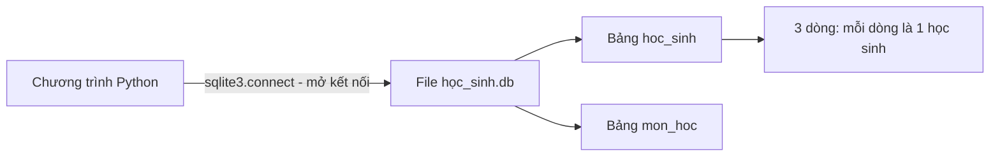
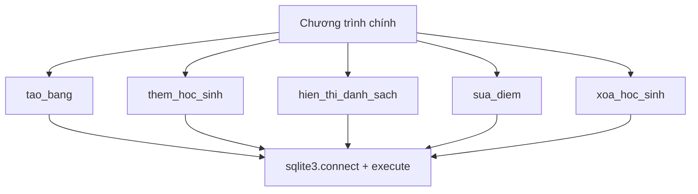

# Bài 36 — SQLite – Lưu Trữ Dữ Liệu Với Cơ Sở Dữ Liệu

> 🎓 **Chương 8 – Lập trình ứng dụng chuyên sâu**

## 🧠 Điều kiện tiên quyết

- [Bài 22 — Đọc Và Ghi File Trong Python](../../01-Co-Ban/22-File/bai.md)
- [Bài 32 — JSON – Ngôn Ngữ Lưu Trữ Dữ Liệu](../03-JSON/bai.md)

---

## 🎯 Mục tiêu

Sau bài học này, học viên sẽ:

* ✅ Hiểu **cơ sở dữ liệu là gì**, khi nào cần dùng thay vì file JSON/CSV.
* ✅ Biết **SQLite là gì**, file `.db` hoạt động ra sao (không cần server).
* ✅ Dùng module **`sqlite3`** trong thư viện chuẩn: `connect()`, `cursor()`.
* ✅ Viết được các câu lệnh **SQL**: `CREATE TABLE`, `INSERT`, `SELECT`, `WHERE`, `UPDATE`, `DELETE`.
* ✅ Hiểu rõ vai trò của `commit()`, `close()` và cách dùng **`with` statement**.
* ✅ Dùng **tham số `?`** để tránh lỗ hổng SQL injection.
* ✅ Xây dựng chương trình **CRUD quản lý học sinh** hoàn chỉnh.

---

## 📖 Kiến thức

> 🔁 **Nhắc lại bài trước:** Ở bài 35, chúng ta dùng `requests` để **lấy dữ liệu từ API** (ví dụ thời tiết). Nhưng dữ liệu đó chỉ tồn tại trong bộ nhớ lúc chương trình chạy — đóng chương trình là mất. Hôm nay chúng ta học cách **lưu trữ dữ liệu lâu dài** trong cơ sở dữ liệu.

### 1. Cơ sở dữ liệu là gì?

> 💬 **Nói đơn giản:** Cơ sở dữ liệu (database – DB) là nơi **cất giữ dữ liệu có tổ chức**, giống như một **tủ hồ sơ** gồm nhiều **ngăn kéo** (bảng), mỗi ngăn có nhiều **phiếu** (dòng) được điền theo **mẫu cột** cố định.

**Ví dụ đời thực:** Cô giáo lưu điểm bằng sổ tay (giống viết tay — dễ mất), rồi chuyển sang Excel (giống file CSV — tốt hơn nhưng vẫn rời rạc). Khi trường có **5.000 học sinh** và cần hỏi "ai có điểm Toán trên 8?", cô cần một hệ thống truy vấn nhanh — đó là lúc cần **cơ sở dữ liệu**.

### 2. Vì sao cần DB thay vì file JSON/CSV?

| Tiêu chí | File JSON/CSV (bài 32, 33) | Cơ sở dữ liệu |
|---|---|---|
| 📦 Lượng dữ liệu | Vài trăm – vài ngàn bản ghi | Hàng triệu bản ghi vẫn nhanh |
| 🔍 Truy vấn | Phải đọc hết file rồi tự lọc | Có ngôn ngữ SQL chuyên dụng |
| 🔒 An toàn dữ liệu | Dễ ghi hỏng, trùng lặp | Có ràng buộc (NOT NULL, khóa chính) |
| 👥 Nhiều người cùng dùng | Không hỗ trợ | Hỗ trợ tốt |
| ⚙️ Độ phức tạp | Đơn giản | Phức tạp hơn nhưng mạnh mẽ |

> 💡 **Quy tắc thực tế:** Dữ liệu ít, cấu trúc đơn giản → JSON/CSV. Dữ liệu nhiều, cần truy vấn, cần an toàn → **SQLite**.

### 3. SQLite là gì? File `.db` là gì?

* **SQLite** là một **hệ quản trị cơ sở dữ liệu nhỏ gọn** được nhúng thẳng vào Python (không cần cài thêm, không cần server chạy riêng).
* Toàn bộ dữ liệu nằm trong **một file duy nhất** có đuôi `.db` — bạn chỉ cần copy file là mang theo cả cơ sở dữ liệu.
* Các hệ DB khác như **MySQL, PostgreSQL** cần cài một chương trình server riêng và kết nối qua mạng — mạnh hơn nhưng phức tạp hơn nhiều. SQLite đủ tốt cho ứng dụng nhỏ, phần mềm máy tính, ứng dụng điện thoại (điện thoại Android cũng dùng SQLite!).

> 💬 **Ví dụ đời thực:** File `.db` giống như **một cuốn sổ đóng sẵn giấy trắng** — mở là ghi được ngay. MySQL giống **tòa nhà văn phòng có lễ tân** — muốn ghi chép phải đi qua lễ tân (server).



### 4. SQL – ngôn ngữ nói chuyện với cơ sở dữ liệu

**SQL** (Structured Query Language) là ngôn ngữ để hỏi và thao tác dữ liệu. Python chỉ là "người đưa thư" — gửi câu SQL cho SQLite qua `execute()`:

| Câu lệnh SQL | Chức năng |
|---|---|
| `CREATE TABLE ten_bang (...)` | Tạo bảng mới |
| `INSERT INTO ten_bang (...) VALUES (...)` | Thêm dòng mới |
| `SELECT ... FROM ten_bang` | Lấy dữ liệu ra xem |
| `UPDATE ten_bang SET ... WHERE ...` | Sửa dữ liệu |
| `DELETE FROM ten_bang WHERE ...` | Xóa dữ liệu |

### 5. Bước 1 – Kết nối: `connect()` và `cursor()`

```python
import sqlite3

# Mở kết nối — nếu file chưa tồn tại, Python tự tạo mới
conn = sqlite3.connect("hoc_sinh.db")

# Tạo "con trỏ" — chiếc bút dùng để gửi lệnh SQL
cur = conn.cursor()
```

| Thành phần | Ý nghĩa |
|---|---|
| `sqlite3.connect("ten.db")` | Mở file cơ sở dữ liệu; chưa có thì **tự tạo file** |
| `conn` (connection) | **Cầu nối** giữa Python và file `.db` |
| `cur` (cursor) | **Con trỏ thao tác** — dùng `cur.execute(sql)` để chạy lệnh |

### 6. `CREATE TABLE` – tạo bảng

```python
cur.execute("""
    CREATE TABLE IF NOT EXISTS hoc_sinh (
        id   INTEGER PRIMARY KEY AUTOINCREMENT,
        ten  TEXT    NOT NULL,
        toan REAL,
        van  REAL
    )
""")
```

* `id INTEGER PRIMARY KEY AUTOINCREMENT` — cột **khóa chính** tự tăng: mỗi học sinh có số hiệu riêng 1, 2, 3...
* `ten TEXT NOT NULL` — kiểu chữ, **bắt buộc phải có** (không được để trống).
* `toan REAL`, `van REAL` — kiểu số thực, lưu điểm.
* `IF NOT EXISTS` — chỉ tạo nếu bảng chưa có, giúp chạy lại không bị lỗi.

> ⚠️ **Quan trọng:** SQL viết **chữ hoa hay thường đều được** (`SELECT` hay `select` đều chạy), nhưng thói quen viết hoa từ khóa SQL giúp code dễ đọc.

### 7. `INSERT` – thêm dữ liệu

```python
cur.execute(
    "INSERT INTO hoc_sinh (ten, toan, van) VALUES (?, ?, ?)",
    ("Nguyễn Văn An", 8.5, 7.0)
)
```

* Dấu `?` là **vị trí dành chỗ** — giá trị thật được truyền ở đối số thứ hai dạng **tuple** `(...)`.
* **Không bao giờ** nhúng giá trị trực tiếp vào chuỗi SQL (xem phần Lỗi thường gặp về SQL injection).

### 8. `commit()` và `close()` – bước không thể quên!

```python
# LƯU mọi thay đổi (INSERT/UPDATE/DELETE) vào file .db
conn.commit()

# Đóng kết nối khi xong việc
conn.close()
```

> 💬 **Ví dụ đời thực:** `commit()` giống như **bấm nút "Lưu"** trong Word — nếu không bấm, đóng file là mất hết. `close()` giống như **đóng hộp tủ hồ sơ** lại cho sạch sẽ.

### 9. `SELECT` và `WHERE` – đọc dữ liệu

```python
# Lấy TẤT CẢ học sinh
cur.execute("SELECT * FROM hoc_sinh")
rows = cur.fetchall()

# Lấy học sinh có điểm toán >= 8
cur.execute("SELECT ten, toan FROM hoc_sinh WHERE toan >= 8")
rows2 = cur.fetchall()
```

Các hàm đọc kết quả:

| Hàm | Trả về |
|---|---|
| `cur.fetchall()` | **Danh sách** tất cả các dòng, mỗi dòng là một tuple |
| `cur.fetchone()` | **Một dòng** duy nhất (hoặc `None` nếu hết) |
| `cur.fetchmany(n)` | n dòng đầu tiên |

### 10. `UPDATE` và `DELETE`

```python
# Sửa điểm Toán của học sinh id = 1
cur.execute("UPDATE hoc_sinh SET toan = 9.0 WHERE id = 1")

# Xóa học sinh id = 3
cur.execute("DELETE FROM hoc_sinh WHERE id = 3")

conn.commit()
```

> ⚠️ **Cảnh báo:** Nếu quên `WHERE`, câu `UPDATE` sẽ sửa **tất cả** các dòng, câu `DELETE` sẽ xóa **sạch** bảng! Luôn viết `WHERE` trước khi chạy.

### 11. `with` statement – đóng kết nối tự động

```python
with sqlite3.connect("hoc_sinh.db") as conn:
    cur = conn.cursor()
    cur.execute("INSERT INTO hoc_sinh (ten, toan, van) VALUES (?, ?, ?)",
                ("Trần Thị Bình", 9.5, 8.0))
    conn.commit()
```

* Khối `with` sẽ **tự đóng kết nối** khi thoát khối lệnh, kể cả khi có lỗi xảy ra.
* Hơn nữa, trong `with sqlite3.connect(...)` mà có lỗi, giao dịch sẽ **tự động hủy** — rất an toàn.
* Vẫn phải gọi `conn.commit()` khi muốn lưu thay đổi.

### 12. Tham số `?` – vũ khí chống SQL injection

**SQL injection** là kỹ thuật hacker nhét code SQL vào chỗ dữ liệu nhập. Ví dụ nguy hiểm:

```python
# ❌ NGUY HIỂM: gõ tên:  x'); DROP TABLE hoc_sinh; --
ten = input("Tên học sinh: ")
cur.execute("INSERT INTO hoc_sinh (ten) VALUES ('" + ten + "')")
```

Nếu ai đó gõ `x'); DROP TABLE hoc_sinh; --` thì bảng bị xóa sạch!

```python
# ✅ AN TOÀN: ? chỉ nhận GIÁ TRỊ, không bao giờ bị hiểu là lệnh SQL
cur.execute("INSERT INTO hoc_sinh (ten) VALUES (?)", (ten,))
```

> 💎 **Nguyên tắc vàng:** **Mọi** giá trị do người dùng nhập hoặc từ bên ngoài đều phải đi qua tham số `?`, không bao giờ nối chuỗi vào câu SQL.

### 13. Các thông tin bổ sung hữu ích

* `cur.lastrowid` — id của dòng vừa INSERT (thường được dùng để thông báo "đã thêm học sinh mã số X").
* `cur.rowcount` — số dòng bị ảnh hưởng bởi INSERT/UPDATE/DELETE.
* Kết quả `SELECT` là **tuple** — truy cập theo vị trí: `row[0]` là cột đầu (id), `row[1]` là cột thứ hai...

---

## 💡 Ví dụ minh họa

### Ví dụ 1: Tạo bảng và thêm học sinh đầu tiên

```python
import sqlite3

# 1. Kết nối (tự tạo file vi_du_1.db)
conn = sqlite3.connect("vi_du_1.db")
cur = conn.cursor()

# 2. Tạo bảng
cur.execute("""
    CREATE TABLE IF NOT EXISTS hoc_sinh (
        id  INTEGER PRIMARY KEY AUTOINCREMENT,
        ten TEXT NOT NULL,
        diem REAL
    )
""")

# 3. Thêm 2 học sinh bằng tham số ?
cur.execute("INSERT INTO hoc_sinh (ten, diem) VALUES (?, ?)", ("An", 8.5))
cur.execute("INSERT INTO hoc_sinh (ten, diem) VALUES (?, ?)", ("Binh", 7.0))

# 4. LƯU lại
conn.commit()

# 5. Đọc lại và in ra
cur.execute("SELECT * FROM hoc_sinh")
for row in cur.fetchall():
    print(row)

# 6. Đóng kết nối
conn.close()
```

Kết quả:

```
(1, 'An', 8.5)
(2, 'Binh', 7.0)
```

**Giải thích từng dòng:**

| Dòng code | Ý nghĩa |
|---|---|
| `conn = sqlite3.connect("vi_du_1.db")` | Mở file DB; chưa có thì tự tạo |
| `cur.execute("""CREATE TABLE IF NOT EXISTS...""")` | Tạo bảng 3 cột: id tự tăng, tên, điểm |
| `cur.execute("INSERT ... (?, ?)", ("An", 8.5))` | Chèn 1 dòng, `?` được thay bằng "An" và 8.5 |
| `conn.commit()` | Lưu thay đổi xuống file — **không thể thiếu** |
| `cur.fetchall()` | Lấy toàn bộ kết quả: danh sách các tuple |
| `conn.close()` | Đóng kết nối |

### Ví dụ 2: Lọc học sinh giỏi bằng `WHERE`

```python
import sqlite3

with sqlite3.connect("vi_du_1.db") as conn:
    cur = conn.cursor()
    # Chỉ lấy những bạn điểm >= 8, chỉ lấy cột tên và điểm
    cur.execute("SELECT ten, diem FROM hoc_sinh WHERE diem >= 8")
    for row in cur.fetchall():
        print(f"{row[0]} - {row[1]}")
```

Kết quả:

```
An - 8.5
```

**Giải thích từng dòng:**

| Dòng code | Ý nghĩa |
|---|---|
| `with sqlite3.connect(...) as conn:` | Mở kết nối, tự đóng khi hết khối — không cần `close()` |
| `SELECT ten, diem FROM hoc_sinh WHERE diem >= 8` | Chọn 2 cột, chỉ giữ dòng có điểm từ 8 trở lên |
| `row[0]` | Cột đầu tiên của dòng kết quả (tên) |
| `f"{row[0]} - {row[1]}"` | f-string (học ở bài 18) để ghép chữ và số |

### Ví dụ 3: Sửa và xóa

```python
import sqlite3

with sqlite3.connect("vi_du_1.db") as conn:
    cur = conn.cursor()

    # Sửa: nâng điểm Binh lên 9.0
    cur.execute("UPDATE hoc_sinh SET diem = 9.0 WHERE ten = ?", ("Binh",))
    print("Số dòng đã sửa:", cur.rowcount)

    # Xóa: học sinh tên An
    cur.execute("DELETE FROM hoc_sinh WHERE ten = ?", ("An",))
    print("Số dòng đã xóa:", cur.rowcount)

    conn.commit()
```

Kết quả:

```
Số dòng đã sửa: 1
Số dòng đã xóa: 1
```

**Giải thích từng dòng:**

| Dòng code | Ý nghĩa |
|---|---|
| `WHERE ten = ?` | Chỉ tác động đúng dòng có tên khớp |
| `cur.rowcount` | Số dòng bị ảnh hưởng — kiểm tra xem đã sửa/xóa đúng chưa |
| `conn.commit()` | Bắt buộc để lưu thay đổi |

---

## 🔬 Ví dụ nâng cao

### Ví dụ: Chương trình CRUD quản lý học sinh hoàn chỉnh

Đây là chương trình có đủ 4 thao tác cơ bản của cơ sở dữ liệu: **C**reate (thêm), **R**ead (xem), **U**pdate (sửa), **D**elete (xóa).

```python
import sqlite3

DB_FILE = "quan_ly_hoc_sinh.db"


def tao_bang():
    """Tạo bảng hoc_sinh nếu chưa tồn tại."""
    with sqlite3.connect(DB_FILE) as conn:
        cur = conn.cursor()
        cur.execute("""
            CREATE TABLE IF NOT EXISTS hoc_sinh (
                id   INTEGER PRIMARY KEY AUTOINCREMENT,
                ten  TEXT NOT NULL,
                toan REAL,
                van  REAL
            )
        """)
        conn.commit()


def them_hoc_sinh(ten, toan, van):
    """Thêm một học sinh mới."""
    with sqlite3.connect(DB_FILE) as conn:
        cur = conn.cursor()
        cur.execute(
            "INSERT INTO hoc_sinh (ten, toan, van) VALUES (?, ?, ?)",
            (ten, toan, van),
        )
        conn.commit()
        print(f"Đã thêm học sinh {ten} (mã số {cur.lastrowid}).")


def hien_thi_danh_sach():
    """In ra danh sách tất cả học sinh."""
    with sqlite3.connect(DB_FILE) as conn:
        cur = conn.cursor()
        cur.execute("SELECT * FROM hoc_sinh")
        rows = cur.fetchall()
    if not rows:
        print("Chưa có học sinh nào.")
        return
    print("--- DANH SÁCH HỌC SINH ---")
    for row in rows:
        print(f"Mã {row[0]}: {row[1]} - Toán {row[2]} - Văn {row[3]}")


def sua_diem(ma_hs, mon, diem_moi):
    """Sửa điểm một môn của học sinh theo mã số."""
    cot = "toan" if mon == "toan" else "van"
    with sqlite3.connect(DB_FILE) as conn:
        cur = conn.cursor()
        cur.execute(
            f"UPDATE hoc_sinh SET {cot} = ? WHERE id = ?", (diem_moi, ma_hs)
        )
        conn.commit()
        print("Số dòng đã sửa:", cur.rowcount)


def xoa_hoc_sinh(ma_hs):
    """Xóa học sinh theo mã số."""
    with sqlite3.connect(DB_FILE) as conn:
        cur = conn.cursor()
        cur.execute("DELETE FROM hoc_sinh WHERE id = ?", (ma_hs,))
        conn.commit()
        print("Số dòng đã xóa:", cur.rowcount)


# --- Chạy thử chương trình ---
if __name__ == "__main__":
    tao_bang()
    them_hoc_sinh("Nguyễn Văn An", 8.5, 7.0)
    them_hoc_sinh("Trần Thị Bình", 9.0, 8.5)
    them_hoc_sinh("Lê Văn Cường", 6.5, 7.5)
    hien_thi_danh_sach()
    sua_diem(1, "toan", 10.0)
    xoa_hoc_sinh(3)
    hien_thi_danh_sach()
```

Kết quả:

```
Đã thêm học sinh Nguyễn Văn An (mã số 1).
Đã thêm học sinh Trần Thị Bình (mã số 2).
Đã thêm học sinh Lê Văn Cường (mã số 3).
--- DANH SÁCH HỌC SINH ---
Mã 1: Nguyễn Văn An - Toán 8.5 - Văn 7.0
Mã 2: Trần Thị Bình - Toán 9.0 - Văn 8.5
Mã 3: Lê Văn Cường - Toán 6.5 - Văn 7.5
Số dòng đã sửa: 1
Số dòng đã xóa: 1
--- DANH SÁCH HỌC SINH ---
Mã 1: Nguyễn Văn An - Toán 10.0 - Văn 7.0
Mã 2: Trần Thị Bình - Toán 9.0 - Văn 8.5
```

**Phân tích chương trình:**

* Mỗi chức năng là **một hàm riêng** — dễ đọc, dễ bảo trì (kỹ năng từ bài 12).
* Mỗi hàm **tự mở kết nối bằng `with`** rồi đóng — không lo rò rỉ kết nối.
* `sua_diem()` dùng biến `cot` để chọn cột cần sửa — lưu ý biến `cot` là tên do chính mình đặt (an toàn), còn **giá trị người dùng nhập luôn qua `?`**.
* `cur.lastrowid` giúp biết mã số vừa được cấp tự động.



---

## ⚠️ Lỗi thường gặp

### Lỗi 1: Quên `commit()` — dữ liệu "biến mất"

```python
conn = sqlite3.connect("hoc_sinh.db")
cur = conn.cursor()
cur.execute("INSERT INTO hoc_sinh (ten) VALUES (?)", ("An",))
conn.close()          # ❌ Không commit: dữ liệu không được lưu!
```

* **Nguyên nhân:** Mọi thay đổi chỉ nằm trong bộ nhớ; phải `commit()` mới ghi xuống file.
* **Cách sửa:** Gọi `conn.commit()` trước `close()`, hoặc dùng `with sqlite3.connect(...)` kèm commit trong khối.

### Lỗi 2: `sqlite3.OperationalError: no such table: hoc_sinh`

* **Nguyên nhân:** Câu lệnh `SELECT`/`INSERT` chạy trước lệnh `CREATE TABLE` (hoặc bảng tên sai, ví dụ gõ `hoc_sinh` khi bảng là `hs`).
* **Cách sửa:** Kiểm tra thứ tự: **tạo bảng trước, thao tác sau**; đối chiếu chính xác tên bảng và tên cột.

### Lỗi 3: Nối chuỗi vào câu SQL — nguy cơ SQL injection

```python
ten = input("Tên: ")
cur.execute("INSERT INTO hoc_sinh (ten) VALUES ('" + ten + "')")   # ❌ RẤT NGUY HIỂM
cur.execute("INSERT INTO hoc_sinh (ten) VALUES (?)", (ten,))       # ✅ An toàn
```

* **Nguyên nhân:** Giá trị nhập trở thành một phần của lệnh SQL.
* **Cách sửa:** Luôn dùng tham số `?` với tuple chứa giá trị.

### Lỗi 4: Quên `WHERE` — xóa/sửa sạch bảng

```python
cur.execute("DELETE FROM hoc_sinh")    # ❌ Xóa toàn bộ!
cur.execute("DELETE FROM hoc_sinh WHERE id = 1")    # ✅ Chỉ xóa 1 dòng
```

* **Cách sửa:** Trước khi chạy `UPDATE`/`DELETE`, tự hỏi "câu lệnh này tác động đến những dòng nào?" — luôn kèm `WHERE`.

### Lỗi 5: Truy cập kết quả sai kiểu

```python
rows = cur.fetchall()      # rows là danh sách các TUPLE
print(rows[0]["ten"])      # ❌ TypeError: tuple indices must be integers
print(rows[0][1])          # ✅ Dòng đầu, cột thứ 2 (ten)
```

* **Nguyên nhân:** Kết quả mặc định là tuple, truy cập theo vị trí chứ không theo tên cột.
* **Cách sửa:** Dùng vị trí `row[0]`, `row[1]`... hoặc `conn.row_factory = sqlite3.Row` để truy cập theo tên.

---

## 💎 Mẹo

* 💾 **Luôn `commit()`** sau INSERT/UPDATE/DELETE — coi như phản xạ tự nhiên.
* 📦 **Dùng `with sqlite3.connect(...)`** để tự đóng kết nối, tránh lỗi `database is locked`.
* 🛡️ **Mọi dữ liệu ngoài vào đều qua `?`** — không bao giờ nối chuỗi vào SQL.
* 📝 Đặt tên bảng/cột **viết thường, không dấu, dùng `_`**: `ten_hoc_sinh`, `diem_toan`.
* 🔍 Nên in `cur.rowcount` sau UPDATE/DELETE để chắc chắn tác động đúng số dòng mong muốn.
* 🛠️ Tải **DB Browser for SQLite** (miễn phí) để nhìn thấy dữ liệu trong file `.db` bằng giao diện.
* 🚫 Không xóa file `.db` khi đang có kết nối mở — đóng chương trình rồi mới xóa.

---

## 📝 Tóm tắt

| Khái niệm | Nội dung |
|---|---|
| 🗄️ Cơ sở dữ liệu | Nơi lưu dữ liệu có tổ chức thành bảng – dòng – cột |
| 📄 SQLite | Hệ DB nhúng, 1 file `.db`, không cần server, có sẵn trong Python |
| 🔌 `connect()` | Mở (hoặc tự tạo) file `.db` |
| 🖊️ `cursor()` | Con trỏ để gửi lệnh SQL |
| 🏗️ `CREATE TABLE` | Tạo bảng, khóa chính `PRIMARY KEY AUTOINCREMENT` |
| ➕ `INSERT` | Thêm dòng mới |
| 📖 `SELECT ... WHERE` | Đọc dữ liệu có điều kiện |
| ✏️ `UPDATE ... SET ... WHERE` | Sửa dữ liệu |
| 🗑️ `DELETE ... WHERE` | Xóa dữ liệu |
| 💾 `commit()` | Lưu thay đổi xuống file |
| 🔒 `?` | Tham số an toàn, chống SQL injection |

---

## 🧪 Kiểm tra nhanh

1. ❓ SQLite có cần cài đặt server riêng không? Dữ liệu nằm ở đâu?
2. ❓ Hàm nào dùng để mở kết nối file `data.db`?
3. ❓ Lệnh SQL nào tạo bảng mới?
4. ❓ Điều gì xảy ra nếu quên gọi `commit()` sau khi INSERT?
5. ❓ `fetchall()` trả về kiểu dữ liệu gì?
6. ❓ Viết câu lệnh SQL lấy tất cả học sinh có điểm Toán từ 8 trở lên.
7. ❓ Câu lệnh sửa điểm Văn thành 9 cho học sinh mã số 2?
8. ❓ Điều gì xảy ra nếu `DELETE FROM hoc_sinh` không có `WHERE`?
9. ❓ Vì sao nên dùng tham số `?` thay vì nối chuỗi?
10. ❓ Lệnh nào trả về id tự động của dòng vừa INSERT?

<details>
<summary>🔍 Xem đáp án</summary>

1. Không cần server; toàn bộ dữ liệu nằm trong một file `.db`.
2. `sqlite3.connect("data.db")`.
3. `CREATE TABLE`.
4. Dữ liệu chỉ ở bộ nhớ, đóng kết nối là mất.
5. Danh sách các tuple (mỗi tuple là một dòng).
6. `SELECT * FROM hoc_sinh WHERE toan >= 8`.
7. `UPDATE hoc_sinh SET van = 9 WHERE id = 2`.
8. Xóa sạch toàn bộ dữ liệu trong bảng.
9. Chống SQL injection và đảm bảo dữ liệu luôn được coi là giá trị.
10. `cur.lastrowid`.

</details>

---

## 📚 Bài đọc thêm

* [Python docs – sqlite3 (SQLite Database)](https://docs.python.org/3/library/sqlite3.html)
* [SQLite chính thức – About](https://www.sqlite.org/about.html)
* [W3Schools – SQL Tutorial](https://www.w3schools.com/sql/)
* [DB Browser for SQLite (công cụ xem file .db)](https://sqlitebrowser.org/)

---

---

## 🧩 Bài tập

> 📝 🎯 **Chủ đề:** Làm quen cơ sở dữ liệu SQLite với module `sqlite3` — tạo bảng, thêm, sửa, xóa, tìm kiếm dữ liệu.

## 🟢 Dễ (Bài 1 – 7)

### Bài 1: Tạo cơ sở dữ liệu và bảng học sinh

* **Đề bài:** Viết chương trình kết nối file `bai_tap_36.db` và tạo bảng `hoc_sinh` gồm các cột: `id` (số nguyên, khóa chính, tự tăng), `ten` (chữ, không để trống), `toan`, `van` (số thực).
* **Input:** Không có.
* **Output:** Không in gì (hoặc in "Đã tạo bảng hoc_sinh."). Sau khi chạy, trong thư mục có file `bai_tap_36.db`.
* **Ví dụ:**
  ```
  Đã tạo bảng hoc_sinh.
  ```
* **Gợi ý:** `sqlite3.connect("bai_tap_36.db")`, dùng `cur.execute("""CREATE TABLE IF NOT EXISTS ...""")`.

### Bài 2: Thêm ba học sinh đầu tiên

* **Đề bài:** Dùng lại bảng `hoc_sinh` ở bài 1, thêm 3 học sinh: An (Toán 8.5, Văn 7.0), Bình (Toán 9.0, Văn 8.5), Cường (Toán 6.5, Văn 7.5). Chạy chương trình **2 lần** và quan sát kết quả đếm dòng.
* **Input:** Không có.
* **Output:**
  ```
  Đã thêm học sinh Nguyễn Văn An (mã số 1).
  Đã thêm học sinh Trần Thị Bình (mã số 2).
  Đã thêm học sinh Lê Văn Cường (mã số 3).
  ```
* **Gợi ý:** `INSERT INTO hoc_sinh (ten, toan, van) VALUES (?, ?, ?)` và đừng quên `conn.commit()`; in `cur.lastrowid`.

### Bài 3: Xem toàn bộ danh sách học sinh

* **Đề bài:** Viết chương trình đọc và in ra **tất cả** học sinh trong bảng `hoc_sinh` dạng `Mã X: Tên - Toán Y - Văn Z`.
* **Input:** Không có (dùng dữ liệu đã thêm ở bài 2).
* **Output:**
  ```
  Mã 1: Nguyễn Văn An - Toán 8.5 - Văn 7.0
  Mã 2: Trần Thị Bình - Toán 9.0 - Văn 8.5
  Mã 3: Lê Văn Cường - Toán 6.5 - Văn 7.5
  ```
* **Gợi ý:** `SELECT * FROM hoc_sinh` rồi `fetchall()` và duyệt bằng `for`.

### Bài 4: Lọc học sinh có điểm Văn trên 7.0

* **Đề bài:** Viết chương trình in ra tên các học sinh có điểm Văn **lớn hơn 7.0**, kèm điểm Văn.
* **Input:** Không có (dùng dữ liệu ở bài 2).
* **Output:**
  ```
  Trần Thị Bình - Van 8.5
  Lê Văn Cường - Van 7.5
  ```
* **Gợi ý:** `SELECT ten, van FROM hoc_sinh WHERE van > 7.0`.

### Bài 5: Cập nhật điểm Toán

* **Đề bài:** Cập nhật điểm Toán của học sinh mã số 1 lên `10.0`, rồi in ra số dòng đã sửa.
* **Input:** Không có.
* **Output:**
  ```
  So dong da sua: 1
  ```
* **Gợi ý:** `UPDATE hoc_sinh SET toan = ? WHERE id = ?`, in `cur.rowcount`, nhớ `commit()`.

### Bài 6: Xóa một học sinh

* **Đề bài:** Xóa học sinh có `id = 3` khỏi bảng, in ra số dòng đã xóa, sau đó in lại toàn bộ danh sách để kiểm tra.
* **Input:** Không có.
* **Output:**
  ```
  So dong da xoa: 1
  Mã 1: Nguyễn Văn An - Toán 10.0 - Văn 7.0
  Mã 2: Trần Thị Bình - Toán 9.0 - Văn 8.5
  ```
* **Gợi ý:** `DELETE FROM hoc_sinh WHERE id = ?` + `commit()`.

### Bài 7: Đếm số lượng học sinh

* **Đề bài:** Viết chương trình đếm và in ra **tổng số học sinh** hiện có trong bảng (dùng câu lệnh SQL `COUNT`).
* **Input:** Không có.
* **Output:**
  ```
  Tong so hoc sinh: 2
  ```
* **Gợi ý:** `SELECT COUNT(*) FROM hoc_sinh`, kết quả là `rows[0][0]`.

---

## 🟡 Trung bình (Bài 8 – 14)

### Bài 8: Tìm học sinh theo đúng tên

* **Đề bài:** Viết chương trình tìm học sinh có tên `Trần Thị Bình` và in ra đầy đủ thông tin. Nếu không tìm thấy, in `Khong tim thay.` Dùng tham số `?` cho tên.
* **Input:** Không có (gán trực tiếp `ten_can_tim = "Trần Thị Bình"`).
* **Output:**
  ```
  Tim thay: Mã 2 - Trần Thị Bình - Toán 9.0 - Văn 8.5
  ```
* **Gợi ý:** `SELECT * FROM hoc_sinh WHERE ten = ?`; dùng `fetchone()` vì chỉ cần 1 dòng.

### Bài 9: Tìm học sinh theo từ khóa trong tên

* **Đề bài:** Viết chương trình tìm tất cả học sinh có tên **chứa chữ** `An` (ví dụ "Nguyễn Văn An", "Anh") và in ra danh sách.
* **Input:** Không có.
* **Output:**
  ```
  Mã 1: Nguyễn Văn An
  ```
* **Gợi ý:** Dùng `WHERE ten LIKE ?` với tham số `"%An%"`.

### Bài 10: Sắp xếp theo điểm Toán giảm dần

* **Đề bài:** In danh sách học sinh (mã, tên, điểm Toán) **sắp xếp theo điểm Toán giảm dần** — học sinh giỏi Toán đứng đầu.
* **Input:** Không có.
* **Output:**
  ```
  1: Nguyễn Văn An - 10.0
  2: Trần Thị Bình - 9.0
  ```
* **Gợi ý:** `ORDER BY toan DESC`.

### Bài 11: Trung bình cộng hai môn của từng học sinh

* **Đề bài:** In ra tên và **điểm trung bình** của từng học sinh (tính trung bình Toán – Văn ngay trong Python), làm tròn 2 chữ số.
* **Input:** Không có.
* **Output:**
  ```
  Nguyễn Văn An - 8.5
  Trần Thị Bình - 8.75
  ```
* **Gợi ý:** Tính `(row[2] + row[3]) / 2` rồi `round(x, 2)`.

### Bài 12: Điểm trung bình toàn lớp

* **Đề bài:** Dùng câu lệnh SQL để tính **điểm Toán trung bình** của cả lớp và in ra kết quả làm tròn 2 chữ số.
* **Input:** Không có.
* **Output:**
  ```
  Diem toan trung binh: 9.5
  ```
* **Gợi ý:** `SELECT AVG(toan) FROM hoc_sinh`.

### Bài 13: Lọc theo khoảng điểm

* **Đề bài:** In ra danh sách học sinh có điểm Văn **từ 7.0 đến 8.5** (bao gồm cả hai giá trị), mỗi dòng: tên và điểm Văn.
* **Input:** Không có.
* **Output:**
  ```
  Nguyễn Văn An - Van 7.0
  Trần Thị Bình - Van 8.5
  ```
* **Gợi ý:** Dùng `BETWEEN ? AND ?` hoặc `van >= ? AND van <= ?`.

### Bài 14: Cập nhật nhiều bản ghi cùng lúc

* **Đề bài:** Tăng điểm Văn lên `1.0` cho **tất cả** học sinh có điểm Văn dưới 8.0, in số dòng đã sửa, rồi in lại danh sách.
* **Input:** Không có.
* **Output:**
  ```
  So dong da sua: 1
  Mã 1: Nguyễn Văn An - Văn 8.0
  Mã 2: Trần Thị Bình - Văn 8.5
  ```
* **Gợi ý:** `UPDATE hoc_sinh SET van = van + ? WHERE van < ?`.

---

## 🔴 Khó (Bài 15 – 20)

### Bài 15: Bảng sản phẩm với CRUD đầy đủ

* **Đề bài:** Tạo bảng `san_pham` (id, ten, gia REAL) trong file `cua_hang.db`. Thêm 4 sản phẩm, in danh sách, sửa giá sản phẩm mã 2 thành 15.000, xóa sản phẩm giá dưới 20.000, in danh sách lần cuối.
* **Input:** Không có (gán dữ liệu trực tiếp).
* **Output:**
  ```
  --- Sau khi thêm ---
  1: Sách Python - 120000.0
  2: Bút bi - 5000.0
  3: Vở ô ly - 8000.0
  4: Balo - 250000.0
  --- Sau khi sửa và xóa ---
  1: Sách Python - 120000.0
  4: Balo - 250000.0
  ```
* **Gợi ý:** Viết các hàm `them_san_pham`, `hien_thi`, `sua_gia`, `xoa_duoi_gia`.

### Bài 16: Chương trình menu quản lý học sinh

* **Đề bài:** Viết chương trình menu vòng lặp cho phép người dùng chọn: `1. Thêm`, `2. Xem`, `3. Sửa điểm`, `4. Xóa`, `5. Thoát`. Mỗi thao tác là một hàm. Dữ liệu lưu vào `ql_hs.db`. Tự chạy thử với các thao tác mẫu.
* **Input:** Số chọn menu và dữ liệu từ `input()`.
* **Output:** Ví dụ chạy với lựa chọn `1`, `2`, `5`:
  ```
  ===== QUAN LY HOC SINH =====
  1. Them hoc sinh
  2. Xem danh sach
  3. Sua diem
  4. Xoa hoc sinh
  5. Thoat
  Chon: 1
  Ten: An
  Diem toan: 8.5
  Diem van: 7.0
  Da them hoc sinh An (ma 1).
  Chon: 2
  Ma 1: An - Toan 8.5 - Van 7.0
  Chon: 5
  Tam biet!
  ```
* **Gợi ý:** Dùng `while True`, `if/elif` cho menu; mỗi chức năng tách hàm riêng.

### Bài 17: Chống SQL injection

* **Đề bài:** Viết chương trình hỏi tên học sinh qua `input()`, thêm vào bảng `hoc_sinh` **bằng tham số `?`**, rồi tự kiểm tra: nhập thử giá trị `x'); DROP TABLE hoc_sinh; --` và in ra xem bảng còn tồn tại không.
* **Input:** `x'); DROP TABLE hoc_sinh; --` (nhập làm thử nghiệm).
* **Output:**
  ```
  Da them hoc sinh co ten la: x'); DROP TABLE hoc_sinh; --
  So dong hien co: 3
  ```
  (Bảng vẫn còn nguyên — dữ liệu chưa bị xóa.)
* **Gợi ý:** `cur.execute("INSERT INTO hoc_sinh (ten) VALUES (?)", (ten,))` — tham số `?` biến chuỗi đó thành giá trị thuần túy.

### Bài 18: Thống kê toàn diện lớp học

* **Đề bài:** Viết chương trình in báo cáo lớp: số học sinh, điểm Toán cao nhất, thấp nhất, trung bình. Dùng các hàm SQL `COUNT`, `MAX`, `MIN`, `AVG`.
* **Input:** Không có.
* **Output:**
  ```
  So hoc sinh: 2
  Toan cao nhat: 10.0
  Toan thap nhat: 9.0
  Toan trung binh: 9.5
  ```
* **Gợi ý:** Mỗi thống kê là một `SELECT` riêng, đọc `fetchone()[0]`.

### Bài 19: Thêm cột và cập nhật dữ liệu cũ

* **Đề bài:** Bảng `hoc_sinh` hiện chưa có cột `email`. Viết chương trình: thêm cột `email TEXT`, cập nhật email cho từng học sinh theo mã số, rồi in bảng `id | ten | email`.
* **Input:** Không có.
* **Output:**
  ```
  1 | Nguyễn Văn An | an.nguyen@gmail.com
  2 | Trần Thị Bình | binh.tran@gmail.com
  ```
* **Gợi ý:** `ALTER TABLE hoc_sinh ADD COLUMN email TEXT` (chạy 1 lần; nếu chạy lại báo lỗi, có thể bỏ qua bằng try/except).

### Bài 20: Chương trình quản lý thư viện mini

* **Đề bài:** Tạo bảng `sach` (id, ten_sach, tac_gia, nam, so_luong) trong `thu_vien.db`. Viết chương trình menu: `1. Thêm sách`, `2. Xem sách`, `3. Tìm theo tên`, `4. Mượn sách` (giảm `so_luong` đi 1, nếu còn 0 thì báo "Hết sách"), `5. Thoát`. Mỗi chức năng là một hàm.
* **Input:** Số menu và dữ liệu từ `input()`.
* **Output:** Ví dụ: thêm "Python cơ bản", mượn sách đó:
  ```
  1. Them sach
  2. Xem sach
  3. Tim sach
  4. Muon sach
  5. Thoat
  Chon: 1
  Ten sach: Python co ban
  Tac gia: Nguyen Van A
  Nam: 2024
  So luong: 2
  Da them sach Python co ban.
  Chon: 4
  Ten sach can muon: Python co ban
  Da muon thanh cong. Con 1 quyen.
  Chon: 5
  Tam biet!
  ```
* **Gợi ý:** Mượn sách = `UPDATE sach SET so_luong = so_luong - 1 WHERE ten_sach = ? AND so_luong > 0`; kiểm tra `rowcount` để báo kết quả.

---

## 🎯 Tổng kết sau khi làm bài

Sau 20 bài tập, bạn đã:

* ✅ Tạo cơ sở dữ liệu, tạo bảng, thêm sửa xóa dữ liệu bằng SQL.
* ✅ Truy vấn với `WHERE`, `LIKE`, `ORDER BY`, `BETWEEN`, hàm `COUNT/AVG/MAX/MIN`.
* ✅ Dùng tham số `?` an toàn, `commit()`, `with` statement, `rowcount`, `lastrowid`.
* ✅ Xây dựng chương trình menu CRUD hoàn chỉnh.

> 💪 **Lập trình là luyện tập!** Chạy lại các chương trình nhiều lần, xóa file `.db` và thử lại từ đầu để hiểu sâu.

---

## ✅ Đáp án

> 💡 **Hãy tự làm bài tập trước** rồi mới mở đáp án.

## 🟢 Dễ (Bài 1 – 7)


<details>
<summary>✅ Bài 1: Tạo cơ sở dữ liệu và bảng học sinh</summary>


**Phân tích:** Cần kết nối file `.db` (tự tạo nếu chưa có) và tạo bảng với khóa chính tự tăng.

**Ý tưởng:** Dùng `sqlite3.connect()` + `CREATE TABLE IF NOT EXISTS`.

**Thuật toán:**
1. Mở kết nối `bai_tap_36.db`.
2. Tạo con trỏ `cur`.
3. Chạy lệnh tạo bảng với đầy đủ kiểu dữ liệu cột.
4. Commit và đóng.

**Code:**

```python
import sqlite3

# Mở kết nối — file chưa có sẽ được tự tạo
conn = sqlite3.connect("bai_tap_36.db")
cur = conn.cursor()

# Tạo bảng hoc_sinh
cur.execute("""
    CREATE TABLE IF NOT EXISTS hoc_sinh (
        id  INTEGER PRIMARY KEY AUTOINCREMENT,
        ten TEXT NOT NULL,
        toan REAL,
        van  REAL
    )
""")

# Lưu thay đổi và đóng kết nối
conn.commit()
conn.close()

print("Đã tạo bảng hoc_sinh.")
```

**Giải thích code:**
* `INTEGER PRIMARY KEY AUTOINCREMENT` — cột id tự tăng 1, 2, 3...
* `TEXT NOT NULL` — cột tên bắt buộc có giá trị.
* `REAL` — kiểu số thực cho điểm.
* `IF NOT EXISTS` — nếu chạy lại lần hai, bảng không bị tạo trùng.

**Độ phức tạp:** O(1).

---

</details>

<details>
<summary>✅ Bài 2: Thêm ba học sinh đầu tiên</summary>


**Phân tích:** Bảng đã có; chỉ cần INSERT 3 dòng bằng tham số `?`.

**Ý tưởng:** Mỗi học sinh một câu INSERT, dùng `cur.lastrowid` để biết mã số.

**Thuật toán:**
1. Mở kết nối, con trỏ.
2. INSERT từng học sinh.
3. In mã số tự tăng của từng dòng.
4. Commit rồi đóng.

**Code:**

```python
import sqlite3

conn = sqlite3.connect("bai_tap_36.db")
cur = conn.cursor()

danh_sach = [
    ("Nguyễn Văn An", 8.5, 7.0),
    ("Trần Thị Bình", 9.0, 8.5),
    ("Lê Văn Cường", 6.5, 7.5),
]

for ten, toan, van in danh_sach:
    cur.execute(
        "INSERT INTO hoc_sinh (ten, toan, van) VALUES (?, ?, ?)",
        (ten, toan, van),
    )
    print(f"Đã thêm học sinh {ten} (mã số {cur.lastrowid}).")

conn.commit()
conn.close()
```

**Giải thích code:**
* `danh_sach` — list chứa 3 tuple `(ten, toan, van)`.
* Vòng `for` duyệt từng tuple, `?` nhận từng giá trị — an toàn, gọn gàng.
* `cur.lastrowid` trả về id vừa được cấp cho lần INSERT đó.
* Nếu chạy chương trình **lần 2**, sẽ thấy mã số 4, 5, 6 vì 3 học sinh cũ vẫn còn — đây chính là hành vi đúng của DB (dữ liệu đã được lưu lâu dài).

**Độ phức tạp:** O(n) với n là số học sinh thêm (ở đây n = 3).

---

</details>

<details>
<summary>✅ Bài 3: Xem toàn bộ danh sách học sinh</summary>


**Phân tích:** Đọc toàn bộ bảng và in đúng định dạng.

**Ý tưởng:** `SELECT *` + `fetchall()` + vòng lặp.

**Thuật toán:**
1. Đọc toàn bộ hàng dữ liệu.
2. Duyệt từng dòng và in định dạng.

**Code:**

```python
import sqlite3

conn = sqlite3.connect("bai_tap_36.db")
cur = conn.cursor()

cur.execute("SELECT * FROM hoc_sinh")
rows = cur.fetchall()

for row in rows:
    print(f"Mã {row[0]}: {row[1]} - Toán {row[2]} - Văn {row[3]}")

conn.close()
```

**Giải thích code:**
- `fetchall()` trả về `[(1, 'Nguyễn Văn An', 8.5, 7.0), ...]`.
- Mỗi `row` là một tuple; `row[0]`=id, `row[1]`=tên, `row[2]`=toán, `row[3]`=văn.
- f-string giúp ghép chữ và số dễ đọc.

**Độ phức tạp:** O(n) với n là số dòng.

---

</details>

<details>
<summary>✅ Bài 4: Lọc học sinh có điểm Văn trên 7.0</summary>


**Phân tích:** Câu hỏi cần điều kiện lọc (`WHERE`) trên cột văn.

**Ý tưởng:** `SELECT ten, van ... WHERE van > 7.0`.

**Thuật toán:**
1. Chạy truy vấn có điều kiện.
2. Duyệt và in kết quả.

**Code:**

```python
import sqlite3

conn = sqlite3.connect("bai_tap_36.db")
cur = conn.cursor()

cur.execute("SELECT ten, van FROM hoc_sinh WHERE van > 7.0")
for ten, van in cur.fetchall():
    print(f"{ten} - Van {van}")

conn.close()
```

**Giải thích code:**
- `SELECT ten, van` — chỉ lấy 2 cột cần thiết (không lấy *).
- `WHERE van > 7.0` — bộ lọc tại cơ sở dữ liệu, nhanh hơn lọc trong Python.
- Vòng lặp tuần tự giải nén tuple trực tiếp vào `ten, van`.

**Độ phức tạp:** O(n).

---

</details>

<details>
<summary>✅ Bài 5: Cập nhật điểm Toán</summary>


**Phân tích:** Sửa 1 dòng theo điều kiện id, kiểm tra bằng `rowcount`.

**Ý tưởng:** `UPDATE ... SET ... WHERE id = ?`.

**Thuật toán:**
1. Chạy lệnh UPDATE.
2. In số dòng bị ảnh hưởng.
3. Commit.

**Code:**

```python
import sqlite3

conn = sqlite3.connect("bai_tap_36.db")
cur = conn.cursor()

cur.execute("UPDATE hoc_sinh SET toan = ? WHERE id = ?", (10.0, 1))
print("So dong da sua:", cur.rowcount)

conn.commit()
conn.close()
```

**Giải thích code:**
- `SET toan = ?` — giá trị mới đi qua tham số an toàn.
- `WHERE id = ?` — chỉ nhắm đúng mã số 1.
- `rowcount` = 1 chứng tỏ đã nhắm đúng 1 dòng. Nếu id không tồn tại, `rowcount` = 0.

**Độ phức tạp:** O(log n) nếu SQLite dùng index khóa chính, thực tế O(1).

---

</details>

<details>
<summary>✅ Bài 6: Xóa một học sinh</summary>


**Phân tích:** Xóa theo id rồi xem lại danh sách để kiểm chứng.

**Ý tưởng:** `DELETE ... WHERE id = ?` + in lại bằng bài đã làm.

**Code:**

```python
import sqlite3

conn = sqlite3.connect("bai_tap_36.db")
cur = conn.cursor()

cur.execute("DELETE FROM hoc_sinh WHERE id = ?", (3,))
print("So dong da xoa:", cur.rowcount)
conn.commit()

# In lại danh sách để kiểm tra
cur.execute("SELECT * FROM hoc_sinh")
for row in cur.fetchall():
    print(f"Mã {row[0]}: {row[1]} - Toán {row[2]} - Văn {row[3]}")

conn.close()
```

**Giải thích code:**
- `DELETE` chỉ tác động đúng dòng id = 3 nhờ `WHERE`.
- `rowcount` xác nhận 1 dòng đã bị xóa.
- Bước in lại danh sách chính là cách kiểm tra thủ công ("manual test").

**Độ phức tạp:** O(n) với n là số dòng.

---

</details>

<details>
<summary>✅ Bài 7: Đếm số lượng học sinh</summary>


**Phân tích:** Cần hàm SUM của SQL: `COUNT`.

**Ý tưởng:** `SELECT COUNT(*) FROM hoc_sinh`; kết quả nằm ở `rows[0]`.

**Code:**

```python
import sqlite3

conn = sqlite3.connect("bai_tap_36.db")
cur = conn.cursor()

cur.execute("SELECT COUNT(*) FROM hoc_sinh")
ket_qua = cur.fetchone()
print("Tong so hoc sinh:", ket_qua[0])

conn.close()
```

**Giải thích code:**
- `fetchone()` trả về tuple `(count,)` — truy cập `ket_qua[0]`.
- `COUNT(*)` đếm toàn bộ dòng, xử lý tại DB nên rất nhanh.
- Kết quả sẽ là `2` (sau khi xóa học sinh mã 3 ở bài 6).

**Độ phức tạp:** O(n) nhưng chạy cực nhanh ngay trong SQL.

---

</details>

## 🟡 Trung bình (Bài 8 – 14)


<details>
<summary>✅ Bài 8: Tìm học sinh theo đúng tên</summary>


**Phân tích:** Tìm đúng chuỗi tên, chỉ cần 1 bản ghi → `fetchone()`.

**Ý tưởng:** `WHERE ten = ?` kết hợp `fetchone()` và xử lý trường hợp `None`.

**Code:**

```python
import sqlite3

conn = sqlite3.connect("bai_tap_36.db")
cur = conn.cursor()

ten_can_tim = "Trần Thị Bình"
cur.execute("SELECT * FROM hoc_sinh WHERE ten = ?", (ten_can_tim,))
row = cur.fetchone()

if row is None:
    print("Khong tim thay.")
else:
    print(f"Tim thay: Mã {row[0]} - {row[1]} - Toán {row[2]} - Văn {row[3]}")

conn.close()
```

**Giải thích code:**
- `ten_can_tim` được đẩy qua tham số `?` — chuẩn chống SQL injection.
- `fetchone()` trả `None` nếu không khớp → kiểm tra trước khi dùng.
- Đây là khuôn mẫu quan trọng: **luôn xử lý trường hợp không tìm thấy**.

**Độ phức tạp:** O(n) , `WHERE` trên cột không index sẽ duyệt toàn bảng.

---

</details>

<details>
<summary>✅ Bài 9: Tìm học sinh theo từ khóa trong tên</summary>


**Phân tích:** Tìm một phần chữ xuất hiện trong tên → dùng `LIKE` với dấu `%`.

**Ý tưởng:** `WHERE ten LIKE ?` với `"%An%"`.

**Code:**

```python
import sqlite3

conn = sqlite3.connect("bai_tap_36.db")
cur = conn.cursor()

tu_khoa = "%An%"
cur.execute("SELECT id, ten FROM hoc_sinh WHERE ten LIKE ?", (tu_khoa,))

for ma, ten in cur.fetchall():
    print(f"Mã {ma}: {ten}")

conn.close()
```

**Giải thích code:**
- `%` trong LIKE là "bao nhiêu ký tự tùy ý": `%An%` = có chữ "An" ở giữa chuỗi.
- Tham số `?` vẫn được dùng — `%` nằm trong **giá trị**, không phải câu SQL.

**Độ phức tạp:** O(n).

---

</details>

<details>
<summary>✅ Bài 10: Sắp xếp theo điểm Môn giảm dần</summary>


**Phân tích:** Cần thứ tự kết quả → `ORDER BY`.

**Ý tưởng:** `ORDER BY toan DESC` để giảm dần.

**Code:**

```python
import sqlite3

conn = sqlite3.connect("bai_tap_36.db")
cur = conn.cursor()

cur.execute("SELECT id, ten, toan FROM hoc_sinh ORDER BY toan DESC")
for id, ten, toan in cur.fetchall():
    print(f"{id}: {ten} - {toan}")

conn.close()
```

**Giải thích code:**
- `DESC` = giảm dần; bỏ qua `DESC` sẽ là `ASC` tăng dần.
- Việc sắp xếp thực hiện tại SQL — nhanh hơn sort trong Python khi dữ liệu lớn.

**Độ phức tạp:** O(n log n).

---

</details>

<details>
<summary>✅ Bài 11: Trung bình cộng hai môn của từng học sinh</summary>


**Phân tích:** Mỗi học sinh tính trung bình hai cột ngay trong Python.

**Ý tưởng:** Lấy toàn bộ, tính `(toan + van) / 2`, làm tròn.

**Code:**

```python
import sqlite3

conn = sqlite3.connect("bai_tap_36.db")
cur = conn.cursor()

cur.execute("SELECT ten, toan, van FROM hoc_sinh")
for ten, toan, van in cur.fetchall():
    diem_tb = (toan + van) / 2
    print(f"{ten} - {round(diem_tb, 2)}")

conn.close()
```

**Giải thích code:**
- `cur.fetchall()` trả các tuple; vòng lặp giải nén ra `ten, toan, van`.
- `(toan + van)` có thể là số thực → trung bình ra `.0` hoặc `.5`, `round(x, 2)` giữ 2 chữ số.
- (Nếu về sau dùng tới, phép tổng hợp `AVG` của SQL cũng làm được tương tự.)

**Độ phức tạp:** O(n).

---

</details>

<details>
<summary>✅ Bài 12: Điểm trung bình toàn lớp</summary>


**Phân tích:** Dùng đúng hàm tổng hợp của SQL `AVG`.

**Ý tưởng:** `SELECT AVG(toan)` → `fetchone()[0]`.

**Code:**

```python
import sqlite3

conn = sqlite3.connect("bai_tap_36.db")
cur = conn.cursor()

cur.execute("SELECT AVG(toan) FROM hoc_sinh")
trung_binh = cur.fetchone()[0]
print("Diem toan trung binh:", round(trung_binh, 2))

conn.close()
```

**Giải thích code:**
- `AVG(toan)` trả điểm trung bình của toàn cột Toán về một giá trị duy nhất.
- `round(..., 2)` làm gọn kết quả kiểu `9.5`.
- Đây là cách truy vấn tổng hợp — không cần kéo toàn bộ dữ liệu về Python.

**Độ phức tạp:** O(n).

---

</details>

<details>
<summary>✅ Bài 13: Lọc theo khoảng điểm</summary>


**Phân tích:** Lấy các dòng thuộc khoảng điểm nhất định.

**Ý tưởng:** Dùng `BETWEEN ? AND ?`.

**Code:**

```python
import sqlite3

conn = sqlite3.connect("bai_tap_36.db")
cur = conn.cursor()

diem_min, diem_max = 7.0, 8.5
cur.execute(
    "SELECT ten, van FROM hoc_sinh WHERE van BETWEEN ? AND ?",
    (diem_min, diem_max),
)
for ten, van in cur.fetchall():
    print(f"{ten} - Van {van}")

conn.close()
```

**Giải thích code:**
- `BETWEEN 7.0 AND 8.5` là bao gồm cả hai đầu mút (≥ và ≤).
- Có thể thay bằng `van >= ? AND van <= ?` — cùng kết quả, dịch ra tương tự.

**Độ phức tạp:** O(n).

---

</details>

<details>
<summary>✅ Bài 14: Cập nhật nhiều bản ghi cùng lúc</summary>


**Phân tích:** Một câu UPDATE tác động nhiều dòng, dùng phép cộng ngay trong SQL.

**Ý tưởng:** Dùng `SET van = van + 1` trong phạm vi `WHERE van < 8`.

**Code:**

```python
import sqlite3

conn = sqlite3.connect("bai_tap_36.db")
cur = conn.cursor()

cur.execute("UPDATE hoc_sinh SET van = van + ? WHERE van < ?", (1.0, 8.0))
print("So dong da sua:", cur.rowcount)
conn.commit()

# In lại để kiểm chứng
cur.execute("SELECT id, ten, van FROM hoc_sinh ORDER BY id")
for id, ten, van in cur.fetchall():
    print(f"Mã {id}: {ten} - Văn {van}")

conn.close()
```

**Giải thích code:**
- `van = van + 1` — tăng mỗi dòng đang trong điều kiện lên 1.0.
- Trong ví dụ này chỉ bạn An có văn 7.0 nên nâng lên 8.0 → `rowcount` = 1.
- Đây là cách cập nhật **hàng loạt** một cách an toàn và nhanh.

**Độ phức tạp:** O(n).

---

</details>

## 🔴 Khó (Bài 15 – 20)


<details>
<summary>✅ Bài 15: Bảng sản phẩm với CRUD đầy đủ</summary>


**Phân tích:** Ứng dụng CRUD trên thực thể khác — sách sản phẩm, hàm hóa mọi bước.

**Ý tưởng:** tạo DB riêng `cua_hang.db`, viết các hàm thêm/xem/sửa/xóa.

**Thuật toán:**
1. Tạo bảng `san_pham` có cột `gia REAL`.
2. Thêm 4 sản phẩm.
3. In danh sách.
4. Sửa giá sản phẩm mã 2.
5. Xóa sản phẩm có `gia < 10000`.
6. In lại danh sách.

**Code:**

```python
import sqlite3

DB = "cua_hang.db"


def tao_bang():
    """Tạo bảng san_pham nếu chưa có."""
    with sqlite3.connect(DB) as conn:
        conn.execute("""
            CREATE TABLE IF NOT EXISTS san_pham (
                id  INTEGER PRIMARY KEY AUTOINCREMENT,
                ten TEXT NOT NULL,
                gia REAL
            )
        """)
        conn.commit()


def them_san_pham(ten, gia):
    """Thêm một sản phẩm."""
    with sqlite3.connect(DB) as conn:
        conn.execute(
            "INSERT INTO san_pham (ten, gia) VALUES (?, ?)", (ten, gia)
        )
        conn.commit()


def hien_thi(tieu_de):
    """In danh sách sản phẩm kèm tiêu đề."""
    print(f"--- {tieu_de} ---")
    with sqlite3.connect(DB) as conn:
        rows = conn.execute("SELECT * FROM san_pham").fetchall()
    for id, ten, gia in rows:
        print(f"{id}: {ten} - {gia}")


def sua_gia(ma, gia_moi):
    """Sửa giá sản phẩm theo mã."""
    with sqlite3.connect(DB) as conn:
        r = conn.execute(
            "UPDATE san_pham SET gia = ? WHERE id = ?", (gia_moi, ma)
        )
        conn.commit()
        print(f"Đã sửa {r.rowcount} sản phẩm.")


def xoa_duoi_gia(nguong):
    """Xóa sản phẩm có giá dưới ngưỡng."""
    with sqlite3.connect(DB) as conn:
        r = conn.execute("DELETE FROM san_pham WHERE gia < ?", (nguong,))
        conn.commit()
        print(f"Đã xóa {r.rowcount} sản phẩm.")


if __name__ == "__main__":
    tao_bang()
    them_san_pham("Sách Python", 120000)
    them_san_pham("Bút bi", 5000)
    them_san_pham("Vở ô ly", 8000)
    them_san_pham("Balo", 250000)
    hien_thi("Sau khi thêm")
    sua_gia(2, 15000)
    xoa_duoi_gia(20000)
    hien_thi("Sau khi sửa và xóa")
```

**Giải thích code:**
- Dùng `conn.execute()` trực tiếp từ connection (vẫn cho phép SQL như cursor, chỉ ngắn gọn hơn — kết quả trả về có `.fetchall()`, `.rowcount`).
- Hàm `hien_thi(tieu)` nhận tên tiêu đề — tái sử dụng cho nhiều lần in.
- `rowcount` giúp màn báo đúng số dòng bị tác động.
- File `cua_hang.db` được tạo trong thư mục chạy.

**Độ phức tạp:** O(n) mỗi thao tác duyệt bảng.

---

</details>

<details>
<summary>✅ Bài 16: Chương trình menu quản lý học sinh</summary>


**Phân tích:** Tách 4 chức năng CRUD thành hàm, menu lặp bằng `while True`.

**Ý tưởng:** Mỗi lựa chọn gọi đúng hàm tương ứng; trường hợp `5` thoát vòng lặp.

**Thuật toán:**
1. Tạo bảng.
2. Vòng lặp in menu và đọc lựa chọn.
3. Rẽ nhánh theo lựa chọn: `1` nhập tên, điểm rồi thêm; `2` in danh sách; `3` chọn mã, môn, điểm mới rồi sửa; `4` nhập mã rồi xóa; `5` thoát vòng lặp.
4. Đóng chương trình.

**Code:**

```python
import sqlite3

DB = "ql_hs.db"


def tao_bang():
    with sqlite3.connect(DB) as conn:
        conn.execute("""
            CREATE TABLE IF NOT EXISTS hoc_sinh (
                id  INTEGER PRIMARY KEY AUTOINCREMENT,
                ten TEXT NOT NULL,
                toan REAL,
                van  REAL
            )
        """)
        conn.commit()


def them():
    ten = input("Ten: ")
    toan = float(input("Diem toan: "))
    van = float(input("Diem van: "))
    with sqlite3.connect(DB) as conn:
        cur = conn.execute(
            "INSERT INTO hoc_sinh (ten, toan, van) VALUES (?, ?, ?)",
            (ten, toan, van),
        )
        conn.commit()
        print(f"Da them hoc sinh {ten} (ma {cur.lastrowid}).")


def xem():
    with sqlite3.connect(DB) as conn:
        rows = conn.execute("SELECT * FROM hoc_sinh").fetchall()
    if not rows:
        print("Chưa có học sinh nào.")
        return
    for id, ten, toan, van in rows:
        print(f"Ma {id}: {ten} - Toan {toan} - Van {van}")


def sua():
    ma = int(input("Ma hoc sinh: "))
    mon = input("Mon (toan/van): ")
    diem = float(input("Diem moi: "))
    cot = "toan" if mon == "toan" else "van"
    with sqlite3.connect(DB) as conn:
        r = conn.execute(
            f"UPDATE hoc_sinh SET {cot} = ? WHERE id = ?", (diem, ma)
        )
        conn.commit()
    print("So dong da sua:", r.rowcount)


def xoa():
    ma = int(input("Ma hoc sinh: "))
    with sqlite3.connect(DB) as conn:
        r = conn.execute("DELETE FROM hoc_sinh WHERE id = ?", (ma,))
        conn.commit()
    print("So dong da xoa:", r.rowcount)


def menu():
    """Giao diện menu chạy liên tục."""
    tao_bang()
    while True:
        print("\n===== QUAN LY HOC SINH =====")
        print("1. Them hoc sinh")
        print("2. Xem danh sach")
        print("3. Sua diem")
        print("4. Xoa hoc sinh")
        print("5. Thoat")
        chon = input("Chon: ")
        if chon == "1":
            them()
        elif chon == "2":
            xem()
        elif chon == "3":
            sua()
        elif chon == "4":
            xoa()
        elif chon == "5":
            print("Tam biet!")
            break
        else:
            print("Lua chon khong hop le.")


if __name__ == "__main__":
    menu()
```

**Giải thích code:**
- Mọi truy vấn cố gắng dùng `?`; duy nhất tên cột `cot` được ghép vào câu SQL — an toàn vì `cot` chỉ nhận hai giá trị "toan"/"van" do chính mình đặt, không bao giờ là input trực tiếp.
- `float(input(...))` chuyển dữ liệu nhập sang số.
- Nhánh `else` thông báo chọn sai để người dùng không bối rối khi gõ nhầm.
- Khi chọn `5`, `break` thoát khỏi vòng **while** — chỉ thoát một vòng nên phải dùng tại mức menu.

**Độ phức tạp:** O(1) cho một số thao tác, toàn bộ phụ thuộc vào thao tác đang dùng.

---

</details>

<details>
<summary>✅ Bài 17: Chứng minh tham số an toàn</summary>


**Phân tích:** Thử gõ chuỗi nguy hiểm `x'); DROP TABLE hoc_sinh; --` để chứng minh tham số `?` vô hiệu hóa SQL injection.

**Ý tưởng:** Chèn chuỗi tấn công bằng tham số `?`, sau đó đếm lại số dòng để chứng tỏ bảng còn nguyên vẹn.

**Thuật toán:**
1. Kết nối `bai_tap_36.db` — bảng `hoc_sinh` đã có dữ liệu từ các bài trước.
2. Chèn chuỗi tấn công qua tham số `?`.
3. Đếm số dòng: kết quả = số dòng cũ + 1 chứng tỏ chuỗi chỉ là giá trị, không phá bảng.

**Code:**

```python
import sqlite3

conn = sqlite3.connect("bai_tap_36.db")
cur = conn.cursor()

# Ví dụ nhập: x'); DROP TABLE hoc_sinh; --
chuoi_tan_cong = "x'); DROP TABLE hoc_sinh; --"

# Dùng tham số ? — an toàn tuyệt đối
cur.execute(
    "INSERT INTO hoc_sinh (ten, toan, van) VALUES (?, ?, ?)",
    (chuoi_tan_cong, 0.0, 0.0),
)
conn.commit()

print("Da them hoc sinh co ten la:", chuoi_tan_cong)

# Kiểm tra bảng còn tồn tại và đếm dòng
cur.execute("SELECT COUNT(*) FROM hoc_sinh")  # không lỗi -> bảng còn
print("So dong hien co:", cur.fetchone()[0])

# Dọn dẹp: xóa dòng thử nghiệm để không ảnh hưởng các bài sau
cur.execute("DELETE FROM hoc_sinh WHERE ten = ?", (chuoi_tan_cong,))
conn.commit()
conn.close()
```

**Giải thích code:**
- Nếu nối chuỗi `"... VALUES ('" + ten + "')"`, chuỗi `x'); DROP TABLE hoc_sinh; --` sẽ làm câu lệnh trở thành `INSERT ... VALUES ('x'); DROP TABLE hoc_sinh; --')` — câu lệnh DROP chạy và xóa sạch bảng!
- Với `?`, SQLite coi toàn bộ chuỗi là **giá trị của cột tên** → không bị phân tích thành lệnh.
- `COUNT(*)` vẫn chạy được và bằng số dòng cũ cộng 1 (tức 3) → bằng chứng bảng còn nguyên.
- Cuối chương trình **dọn dẹp dòng thử nghiệm** bằng DELETE — thói quen tốt để dữ liệu thử không "bẩn" bảng cho các bài sau.

**Độ phức tạp:** O(1).

---

</details>

<details>
<summary>✅ Bài 18: Báo cáo thống kê toàn diện</summary>


**Phân tích:** Tổng hợp số liệu lớp qua 4 câu `SELECT`.

**Ý tưởng:** Dùng `COUNT`, `MAX`, `MIN`, `AVG` — mỗi câu trả 1 giá trị.

**Code:**

```python
import sqlite3

conn = sqlite3.connect("bai_tap_36.db")
cur = conn.cursor()

cur.execute("SELECT COUNT(*) FROM hoc_sinh")
so_hs = cur.fetchone()[0]

cur.execute("SELECT MAX(toan) FROM hoc_sinh")
cao_nhat = cur.fetchone()[0]

cur.execute("SELECT MIN(toan) FROM hoc_sinh")
thap_nhat = cur.fetchone()[0]

cur.execute("SELECT AVG(toan) FROM hoc_sinh")
trung_binh = cur.fetchone()[0]

print("So hoc sinh:", so_hs)
print("Toan cao nhat:", cao_nhat)
print("Toan thap nhat:", thap_nhat)
print("Toan trung binh:", round(trung_binh, 2))

conn.close()
```

**Giải thích code:**

- COUNT/MAX/MIN/AVG đều xử lý trong SQL — đỡ tải cho Python khi dữ liệu lớn.
- `fetchone()[0]` mỗi lần chìa về một số duy nhất.

**Độ phức tạp:** O(n) cho mỗi câu truy vấn.

---

</details>

<details>
<summary>✅ Bài 19: Thêm cột và nhập dữ liệu cũ</summary>


**Phân tích:** Bảng cần thêm cột sau khi tạo — dùng `ALTER TABLE`, chú ý chỉ chạy một lần.

**Ý tưởng:** `ALTER TABLE ... ADD COLUMN`, rồi cập nhật email từng mã, cuối cùng in bảng mới.

**Code:**

```python
import sqlite3

conn = sqlite3.connect("bai_tap_36.db")
cur = conn.cursor()

# Bước 1: thêm cột (chạy lần đầu duy nhất; chạy lại sẽ lỗi nên bọc try/except)
try:
    cur.execute("ALTER TABLE hoc_sinh ADD COLUMN email TEXT")
    conn.commit()
    print("Đã thêm cột email.")
except Exception:
    print("Cột email đã tồn tại, tiếp tục.")

# Bước 2: cập nhật email từng học sinh theo mã
for ma, email in [(1, "an.nguyen@gmail.com"), (2, "binh.tran@gmail.com")]:
    cur.execute("UPDATE hoc_sinh SET email = ? WHERE id = ?", (email, ma))
conn.commit()

# Bước 3: in bảng mới
cur.execute("SELECT id, ten, email FROM hoc_sinh ORDER BY id")
for id, ten, email in cur.fetchall():
    print(f"{id} | {ten} | {email}")

conn.close()
```

**Giải thích code:**
- Một số thao tác DDL (`ALTER TABLE`) bên SQLite — chạy lại sẽ báo lỗi "duplicate column", vậy `try/except` là chuẩn mực.
- Cập nhật email từng dòng theo id — mỗi UPDATE nhắm đúng vào id.
- Câu in cuối cùng đóng vai trò kiểm tra dữ liệu vừa chuyển thành.

**Độ phức tạp:** O(n) khi in lại bảng.

---

</details>

<details>
<summary>✅ Bài 20 — Chương trình quản lý thư viện mini</summary>


**Phân tích:** Kết hợp toàn bộ kiến thức: CRUD + điều kiện `so_luong > 0` + logic mượn-trả giảm số.

**Ý tưởng:** Bảng sách; mượn một quyển là giảm count 1 nếu còn; dùng `rowcount` báo trạng thái.

**Thuật toán:**
1. Tạo bảng `sach` (id, ten_sach, tac_gia, nam, so_luong).
2. Menu 5 lựa chọn.
3. Mượn sách: `UPDATE ... SET so_luong = so_luong - 1 WHERE ten_sach = ? AND so_luong > 0`.

**Code:**

```python
import sqlite3

DB = "thu_vien.db"


def tao_bang():
    with sqlite3.connect(DB) as conn:
        conn.execute("""
            CREATE TABLE IF NOT EXISTS sach (
                id       INTEGER PRIMARY KEY AUTOINCREMENT,
                ten_sach TEXT NOT NULL,
                tac_gia  TEXT,
                nam      INTEGER,
                so_luong INTEGER DEFAULT 0
            )
        """)
        conn.commit()


def them_sach():
    ten = input("Ten sach: ")
    tac_gia = input("Tac gia: ")
    nam = int(input("Nam: "))
    so_luong = int(input("So luong: "))
    with sqlite3.connect(DB) as conn:
        cur = conn.execute(
            "INSERT INTO sach (ten_sach, tac_gia, nam, so_luong) VALUES (?, ?, ?, ?)",
            (ten, tac_gia, nam, so_luong),
        )
        conn.commit()
        print(f"Da them sach {ten}.")


def xem_sach():
    with sqlite3.connect(DB) as conn:
        rows = conn.execute("SELECT * FROM sach").fetchall()
    if not rows:
        print("Thu vien trong.")
        return
    print("--- DANH SACH SACH ---")
    for id, ten, tac_gia, nam, so in rows:
        print(f"{id}: {ten} - {tac_gia} ({nam}) - con {so} quyen")


def tim_sach():
    tu_khoa = input("Tu khoa ten sach: ")
    with sqlite3.connect(DB) as conn:
        rows = conn.execute(
            "SELECT * FROM sach WHERE ten_sach LIKE ?", (f"%{tu_khoa}%",)
        ).fetchall()
    if not rows:
        print("Khong tim thay sach nao.")
        return
    for id, ten, tac_gia, nam, so in rows:
        print(f"{id}: {ten} - con {so} quyen")


def muon_sach():
    ten = input("Ten sach can muon: ")
    with sqlite3.connect(DB) as conn:
        r = conn.execute(
            "UPDATE sach SET so_luong = so_luong - 1 "
            "WHERE ten_sach = ? AND so_luong > 0",
            (ten,),
        )
        conn.commit()
    if r.rowcount == 1:
        with sqlite3.connect(DB) as conn:
            so = conn.execute(
                "SELECT so_luong FROM sach WHERE ten_sach = ?", (ten,)
            ).fetchone()[0]
        print(f"Da muon thanh cong. Con {so} quyen.")
    else:
        print("Muon that bai: khong co sach hoac het sach.")


def menu():
    tao_bang()
    while True:
        print("===== THU VIEN =====")
        print("1. Them sach")
        print("2. Xem sach")
        print("3. Tim sach")
        print("4. Muon sach")
        print("5. Thoat")
        chon = input("Chon: ")
        if chon == "1":
            them_sach()
        elif chon == "2":
            xem_sach()
        elif chon == "3":
            tim_sach()
        elif chon == "4":
            muon_sach()
        elif chon == "5":
            print("Tam biet!")
            break
        else:
            print("Chua hon le.")


if __name__ == "__main__":
    menu()
```

**Giải thích code:**
- `muon_sach()` dùng câu SQL có điều kiện kèm deadline: `AND so_luong > 0` — nếu hết sách, 0 dòng bị đổi → `rowcount` = 0 → thông báo đúng.
- Sau khi mượn thành công, mọi ô còn lại được đặt lại tạo 1 lần truy vấn mới — hiển thị cho người dùng.
- `DEFAULT 0` khi thiết lập cột cho `so_luong`.

**Độ phức tạp:** O(n) cho tìm kiếm `SQL` lượt.

---

</details>

## 📌 Lời khuyên cuối


* Khi thao tác ghi (INSERT/UPDATE/DELETE) **luôn commit()** — nếu quên, chương trình vẫn "thành công" nhưng dữ liệu không lưu.
* Dữ liệu đầu vào bắt buộc qua **`?`** — không ngoại trừ vào trường hợp nào.
* Sau UPDATE/DELETE, nhìn rowcount để xác nhận số hàng đã tác động.
* Muốn "reset" để chạy lại từ đầu, **thả file `.db` cũ** — một trong những lý do file DB nhỏ dễ thao tác này.

📌 Xem tiếp: **[Bài 37: Logging – Bài tập](../08-Logging/bai.md)** | **[Bài 37: Logging – Bài giảng](../08-Logging/bai.md)**

---

## ➡️ Điều hướng

**Vị trí:** `03-Thuc-Chien/07-SQLite/bai.md`

**Bài tiếp theo:** [Bài 37 — Logging – Ghi Nhật Ký Hoạt Động Chương Trình](../08-Logging/bai.md)
