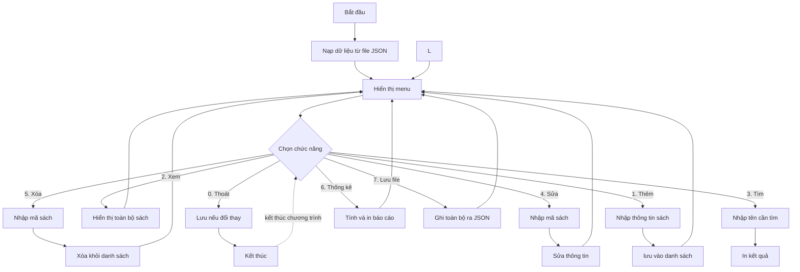

# Bài 40 — Mini Project – Ứng Dụng Quản Lý Cửa Hàng Sách

> 🎓 **Chương 8 – Lập trình ứng dụng chuyên sâu**

## 🧠 Điều kiện tiên quyết

Không cần kiến thức lập trình trước đó — bài này là điểm khởi đầu.

---

## 🎯 Mục tiêu

Sau bài học này, học viên sẽ:

* ✅ Hiểu quy trình làm **một dự án phần mềm nhỏ**: phân tích yêu cầu → thiết kế → lập trình → kiểm thử.
* ✅ Lập được **sơ đồ luồng hoạt động** (mermaid flowchart) cho ứng dụng.
* ✅ **Chia nhỏ chương trình thành hàm** — mỗi hàm một việc, tái sử dụng được.
* ✅ Viết đầy đủ **menu và CRUD** (Thêm, Xem, Sửa, Xóa, Tìm) cho danh sách sách.
* ✅ Thống kê kho sách (tổng số, tổng giá trị, trung bình giá, sản phẩm đắt nhất).
* ✅ **Lưu / đọc dữ liệu bằng file JSON** với thư viện chuẩn `json`.
* ✅ Ghép tất cả thành **một chương trình hoàn chỉnh chạy được**.

---

## 📖 Kiến thức

> 💬 **Bài học lớn nhất của khóa:** bạn đã học 39 bài về từng mảnh ghép. Bài này dạy **cách lắp các mảnh ghép ấy lại thành một ứng dụng hoàn chỉnh** — kỹ năng mà mọi lập trình viên làm nghề đều phải biết.

### 1. Đề bài và bài toán thực tế 🏪

Một cửa hàng sách nhỏ cần quản lý kho sách bằng máy tính. Người bán sẽ:

1. Xem danh sách sách trong kho.
2. Thêm sách mới.
3. Tìm sách theo tên.
4. Sửa thông tin sách (đổi giá, số lượng...).
5. Xóa sách khi hết hàng.
6. Xem thống kê (tổng số đầu sách, tổng giá trị kho, trung bình giá...).
7. **Lưu lại** danh sách để mở lại lần sau không bị mất → dùng file JSON.

### 2. Phân tích yêu cầu (Requirements)

| STT | Chức năng | Kiểu thao tác | Ghi chú |
|---|---|---|---|
| 1 | Hiện menu lựa chọn | Điều khiển | Run lại cho đến khi chọn "Thoát" |
| 2 | Thêm sách | CRUD - Create | Nhập tên, tác giả, thể loại, giá, số lượng |
| 3 | Xem toàn bộ sách | CRUD - Read | In bảng gọn gàng |
| 4 | Tìm kiếm theo tên | CRUD - Read | Phân không phân biệt hoa thường |
| 5 | Sửa sách theo mã | CRUD - Update | Có thể sửa từng trường |
| 6 | Xóa sách theo mã | CRUD - Delete | Yêu cầu xác nhận |
| 7 | Thống kê kho | Báo cáo | Số đầu sách, tổng giá, giá trung bình |
| 8 | Lưu / đọc file JSON | Lưu trữ | Dữ liệu bền vững qua các lần chạy |

> 📐 **Quy tắc vàng của thiết kế:** chương trình nhỏ nhưng phải **chia thành hàm**, mỗi hàm một việc duy nhất. Nhìn vào tên hàm là biết hàm đó làm gì, không cần đọc thân.

### 3. Sơ đồ luồng tổng thể (flowchart)



### 4. Thiết kế dữ liệu – mỗi sách là một từ điển

Mỗi cuốn sách biểu diễn bằng một **dict** (ôn bài 17), các cuốn nằm trong một **list**:

```python
{
    "ma": 1,
    "ten": "De Men Phieu Luu Ky",
    "tac_gia": "To Hoai",
    "the_loai": "Truyen",
    "gia": 65000.0,
    "so_luong": 12
}
```

| Trường | Kiểu | Ý nghĩa |
|---|---|---|
| `ma` | int | Mã sách duy nhất (tự tăng dần) |
| `ten` | str | Tên sách |
| `tac_gia` | str | Tác giả |
| `the_loai` | str | Thể loại (Văn học, Khoa học...) |
| `gia` | float | Đơn giá (đồng) |
| `so_luong` | int | Số cuốn trong kho |

> 💡 Mã tự tăng: muốn phần tử tiếp theo dùng `danh_sach[-1]["ma"] + 1` (cuối list) hoặc `max(ma)` hiện có rồi cộng một.

### 5. Chia nhỏ thành hàm

| Hàm | Tham số | Việc làm |
|---|---|---|
| `tao_sach(...)` | các trường | Tạo dict sách mới |
| `them_sach(danh_sach)` | list | Nhập & thêm sách vào cuối |
| `hien_thi_danh_sach(danh_sach)` | list | In toàn bộ sách |
| `tim_theo_ten(danh_sach, ten)` | list, str | Trả `None` nếu không thấy |
| `tim_theo_ma(danh_sach, ma)` | list, int | Trả index hoặc `None` |
| `sua_sach(danh_sach, ma)` | list, int | Cập nhật trường được chọn |
| `xoa_sach(danh_sach, ma)` | list, int | Xóa sách |
| `thong_ke(danh_sach)` | list | In các số liệu tổng hợp |
| `luu_file(danh_sach, ten)` | list, str | `json.dump` ra file |
| `nap_file(ten)` | str | `json.load` từ file, `None` nếu quên |
| `main()` | — | Vòng lặp menu, điều phối mọi thứ |

> 📁 **Cấu trúc 1 file duy nhất `quan_ly_sach.py`** — đủ cho một dự án Mini. Chương trình thật sẽ tách nhiều file; khái niệm tách hàm đã chuẩn bị cho bạn.

### 6. Lưu trữ bằng JSON

JSON là "bản đồ chữ" của dữ liệu (ôn bài 32):

| Việc | Lệnh chuẩn |
|---|---|
| Ghi list dict ra file | `json.dump(data, f, ensure_ascii=False, indent=2)` |
| Đọc file thành list | `json.load(f)` |
| Xử lý file chưa tồn tại | bắt `FileNotFoundError` → trả `[]` |

> ⚠️ `ensure_ascii=False` giúp ghi đúng tiếng Việt có dấu trong file JSON, không bị thành các ký tự `\u....` khó đọc.

---

## 💡 Ví dụ minh họa – Code từng phần (xây dần)

Chúng ta **xây chương trình từ các viên gạch nhỏ**. Mỗi phần dưới đây là một hàm độc lập; ở phần Ví dụ nâng cao chúng sẽ được ghép lại thành chương trình hoàn chỉnh.

### Phần 1: Hàm tạo sách + danh sách mẫu

```python
from typing import Dict, List

Sach = Dict[str, object]   # "bản đồ" một cuốn sách

def tao_sach(ma: int, ten: str, tac_gia: str, the_loai: str,
             gia: float, so_luong: int) -> Sach:
    """Trả về một dict đại diện cho cuốn sách mới."""
    return {
        "ma": ma,
        "ten": ten,
        "tac_gia": tac_gia,
        "the_loai": the_loai,
        "gia": gia,
        "so_luong": so_luong,
    }

# Danh sách ban đầu có 2 cuốn
kho: List[Sach] = [
    tao_sach(1, "De Men Phieu Luu Ky", "To Hoai", "Truyen", 65000.0, 12),
    tao_sach(2, "Tuoi tho du doi", "Nguyen Nhat Anh", "Van hoc", 58000.0, 8),
]
print(kho[0]["ten"])   # De Men Phieu Luu Ky
```

### Phần 2: Hiển thị bảng sách

```python
def hien_thi_danh_sach(danh_sach: List[Sach]) -> None:
    """In toàn bộ sách dạng bảng."""
    if not danh_sach:
        print("Kho dang rong.")
        return
    print(f"{'Ma':<4}{'Ten':<24}{'Tac gia':<16}{'The loai':<12}{'Gia':<10}{'SL':<5}")
    print("-" * 70)
    for s in danh_sach:
        print(f"{s['ma']:<4}{s['ten']:<24}{s['tac_gia']:<16}"
              f"{s['the_loai']:<12}{s['gia']:<10}{s['so_luong']:<5}")

kho: List[Sach] = []
hien_thi_danh_sach(kho)   # Kho dang rong.
```

### Phần 3: Thêm sách

```python
def them_sach(danh_sach: List[Sach]) -> None:
    """Nhập thông tin rồi thêm sách mới vào cuối kho."""
    ten = input("Ten sach: ")          # Nhập: De Men
    tac_gia = input("Tac gia: ")       # Nhập: To Hoai
    the_loai = input("The loai: ")     # Nhập: Truyen
    gia = float(input("Gia (dong): ")) # Nhập: 65000
    so_luong = int(input("So luong: "))# Nhập: 10
    # Mã mới = mã lớn nhất hiện có + 1
    ma = max((s["ma"] for s in danh_sach), default=0) + 1
    danh_sach.append(tao_sach(ma, ten, tac_gia, the_loai, gia, so_luong))
    print("Da them sach co ma", ma)
```

### Phần 4: Tìm theo tên và theo mã

```python
from typing import Optional

def tim_theo_ten(danh_sach: List[Sach], ten_can_tim: str) -> Optional[Sach]:
    """Tìm cuốn đầu tiên có tên chứa chuỗi (không phân biệt hoa thường)."""
    ten_can_tim = ten_can_tim.lower()                # đưa về chữ thường
    for s in danh_sach:
        if ten_can_tim in str(s["ten"]).lower():
            return s
    return None

def tim_theo_ma(danh_sach: List[Sach], ma: int) -> Optional[int]:
    """Trả VỀ vị trí (index) của sách trong list; None nếu không có."""
    for i, s in enumerate(danh_sach):
        if s["ma"] == ma:
            return i
    return None
```

> None trả về từ hàm tìm kiếm phải được người gọi **kiểm tra** — kỹ năng đã học ở bài 38 (`Optional`).

### Phần 5: Sửa và Xóa

```python
def sua_sach(danh_sach: List[Sach], ma: int) -> None:
    """Sửa một hoặc nhiều trường của sách có mã cho trước."""
    vi_tri = tim_theo_ma(danh_sach, ma)
    if vi_tri is None:
        print("Khong tim thay ma", ma)
        return
    s = danh_sach[vi_tri]
    print("Dang sua:", s["ten"], "-> de trong de giu nguyen")
    gia_moi = input("Gia moi: ")        # Nhập: 70000
    if gia_moi.strip():
        s["gia"] = float(gia_moi)
    so_moi = input("So luong moi: ")    # Nhập: 15
    if so_moi.strip():
        s["so_luong"] = int(so_moi)
    print("Da cap nhat sach ma", ma)

def xoa_sach(danh_sach: List[Sach], ma: int) -> None:
    """Xóa sách có mã cho trước khi xác nhận."""
    vi_tri = tim_theo_ma(danh_sach, ma)
    if vi_tri is None:
        print("Khong tim thay ma", ma)
        return
    xac_nhan = input("Chac chan xoa (y/n)? ")  # Nhập: y
    if xac_nhan.lower() == "y":
        danh_sach.pop(vi_tri)
        print("Da xoa sach ma", ma)
    else:
        print("Da huy thao tac xoa.")
```

---

## 🔬 Ví dụ nâng cao

### Nâng cao 1: Thống kê kho sách

```python
def thong_ke(danh_sach: List[Sach]) -> None:
    """In báo cáo: số đầu sách, tổng đầu sách, tổng giá trị, giá trung bình."""
    if not danh_sach:
        print("Kho rong, khong co gi de thong ke.")
        return
    so_dau = len(danh_sach)
    tong_cuon = sum(int(s["so_luong"]) for s in danh_sach)
    tong_gia_tri = sum(float(s["gia"]) * int(s["so_luong"]) for s in danh_sach)
    gia_tb = sum(float(s["gia"]) for s in danh_sach) / so_dau
    sach_dat_nhat = max(danh_sach, key=lambda s: s["gia"])
    print(f"So dau sach: {so_dau}")
    print(f"Tong so cuon: {tong_cuon}")
    print(f"Tong gia tri kho: {tong_gia_tri:,.0f} dong")
    print(f"Gia trung binh: {gia_tb:,.0f} dong")
    print(f"Sach dat nhat: {sach_dat_nhat['ten']} ({sach_dat_nhat['gia']:,.0f} dong)")
```

### Nâng cao 2: Lưu và nạp file JSON

```python
import json

def luu_file(danh_sach: List[Sach], ten_file: str) -> None:
    """Ghi toàn bộ danh sách ra file JSON."""
    with open(ten_file, "w", encoding="utf-8") as f:
        json.dump(danh_sach, f, ensure_ascii=False, indent=2)
    print(f"Da luu {len(danh_sach)} cuon sach vao {ten_file}.")

def nap_file(ten_file: str) -> List[Sach]:
    """Đọc danh sách từ file JSON; file chưa có thì trả danh sách rỗng."""
    try:
        with open(ten_file, "r", encoding="utf-8") as f:
            return json.load(f)
    except FileNotFoundError:
        return []
```

### Nâng cao 3: Chương trình hoàn chỉnh (ghép mọi phần)

```python
# quan_ly_sach.py
import json
from typing import Dict, List, Optional

Sach = Dict[str, object]

# ... (đặt toàn bộ các hàm tao_sach, them_sach, hien_thi,
#      tim_*, sua_sach, xoa_sach, thong_ke, luu_file, nap_file ở đây) ...

def in_menu() -> None:
    print("\n===== QUAN LY CUA HANG SACH =====")
    print("1. Them sach")
    print("2. Xem danh sach")
    print("3. Tim theo ten")
    print("4. Sua sach")
    print("5. Xoa sach")
    print("6. Thong ke")
    print("7. Luu file")
    print("0. Thoat")

def main() -> None:
    kho: List[Sach] = nap_file("kho_sach.json")
    while True:
        in_menu()
        chon = input("Chon chuc nang: ")      # Nhập: 1/2/3/...
        if chon == "1":
            them_sach(kho)
        elif chon == "2":
            hien_thi_danh_sach(kho)
        elif chon == "3":
            ten = input("Nhap ten can tim: ")   # Nhập: De Men
            sach = tim_theo_ten(kho, ten)
            print(sach if sach else "Khong tim thay.")
        elif chon == "4":
            sua_sach(kho, int(input("Ma sach can sua: ")))
        elif chon == "5":
            xoa_sach(kho, int(input("Ma sach can xoa: ")))
        elif chon == "6":
            thong_ke(kho)
        elif chon == "7":
            luu_file(kho, "kho_sach.json")
        elif chon == "0":
            print("Tam biet!")
            break
        else:
            print("Lua chon khong hop le.")

if __name__ == "__main__":
    main()
```

> 💡 Cấu trúc này là **khuôn mẫu (template)** chuẩn của mọi chương trình menu: `while True` + rẽ nhánh `if/elif` + hàm chuyên biệt cho từng việc.

---

## ⚠️ Lỗi thường gặp

### Lỗi 1: Quên xử lý `None` khi tìm kiếm

```python
vi_tri = tim_theo_ma(kho, 99)
kho[vi_tri]["gia"] = 100   # ❌ TypeError: 'NoneType' object is not subscriptable
```

* **Nguyên nhân:** mã 99 không tồn tại → hàm trả `None`.
* **Cách sửa:** luôn kiểm tra `if vi_tri is None: print("Khong tim thay")` trước khi dùng.

### Lỗi 2: Lưu file nhưng quên `encoding="utf-8"` và `ensure_ascii=False`

```python
json.dump(kho, f)          # ❌ tiếng Việt biến thành \u01A1...
```

* **Cách sửa:** mở file với `encoding="utf-8"` và ghi `json.dump(..., ensure_ascii=False, indent=2)`.

### Lỗi 3: `input()` trả chuỗi — ép kiểu sai vị trí

```python
gia = input("Gia: ")          # "65000" là str
kho[0]["gia"] = gia * 2       # ❌ nối chuỗi: "6500065000"
```

* **Cách sửa:** `gia = float(input("Gia: "))` — ép kiểu **ngay khi nhập**, và đặt trong `try/except` nếu người dùng gõ chữ.

### Lỗi 4: Mã sách bị trùng

```python
def them_sach(danh_sach):
    ma = len(danh_sach) + 1   # ❌ sai khi đã xóa bớt sách
```

* **Cách sửa:** dùng `max((s["ma"] for s in danh_sach), default=0) + 1` — mã mới luôn lớn hơn mã lớn nhất hiện có.

### Lỗi 5: Ghi đè file khi thoát mà chưa lưu

Nếu người dùng chọn Thoát sau khi thêm/sửa, mọi thay đổi **biến mất** vì mới chỉ nằm trong RAM.

* **Cách sửa:** mỗi thao tác thêm/sửa/xóa nên hỏi "Lưu ngay? (y/n)" hoặc tự động `luu_file` sau mỗi thay đổi — đơn giản và an toàn nhất cho dự án Mini.

---

## 💎 Mẹo

* 🏗️ **Xây từng hàm, test từng hàm**: viết xong `them_sach` là chạy thử ngay, không đợi hoàn thành cả dự án.
* 🐍 **Dùng type hints** cho mọi hàm — bạn sẽ đọc lại code của mình sau 1 tuần và cảm ơn chính mình.
* 📊 **`sum(... for s in danh_sach)`** — generator expression tính tổng nhanh và gọn.
* 📁 **Tên file JSON đặt chung một chỗ** (ví dụ hằng số `TEN_FILE = "kho_sach.json"`) — đổi một dòng là đổi toàn bộ.
* 🔤 **Tìm kiếm không phân biệt hoa thường** bằng `.lower()` cả hai phía.
* 🧪 **Chạy thử kịch bản đầy đủ** trước khi nộp: thêm → sửa → xóa → thống kê → lưu → thoát → mở lại xem dữ liệu còn không.

---

## 📝 Tóm tắt

| Khái niệm | Nội dung |
|---|---|
| 🗂️ Phân tích yêu cầu | Liệt kê chức năng trước khi viết code |
| 🗺️ Flowchart | Vẽ luồng hoạt động bằng mermaid |
| 🧩 Chia hàm | Mỗi hàm một việc; tái sử dụng |
| 📚 Dữ liệu sách | Dict `{"ma","ten","tac_gia","the_loai","gia","so_luong"}` |
| ➕➖✏️ CRUD | Thêm, Xem, Sửa, Xóa trên List |
| 📈 Thống kê | Đếm, tổng, trung bình, max bằng generator |
| 💾 JSON | `json.dump` / `json.load` với `encoding="utf-8"`, `ensure_ascii=False` |
| 🔁 Vòng menu | `while True` + `input` + rẽ nhánh |

---

## 🧪 Kiểm tra nhanh

1. ❓ Vì sao cần phân tích yêu cầu trước khi viết code?
2. ❓ Mỗi cuốn sách được biểu diễn bằng kiểu dữ liệu nào?
3. ❓ Hàm nào tạo ra dict của cuốn sách mới?
4. ❓ Mã sách mới tính thế nào để không bị trùng?
5. ❓ `tim_theo_ma` trả về gì khi không tìm thấy — vì sao cần kiểu `Optional`?
6. ❓ Lệnh nào ghi danh sách ra file JSON kèm tiếng Việt đúng?
7. ❓ Khi đọc file không tồn tại, hàm `nap_file` nên trả về gì?
8. ❓ Vòng lặp menu dùng câu lệnh nào để lặp đến khi chọn thoát?
9. ❓ Nêu 2 cách tránh mất dữ liệu khi thoát chương trình.
10. ❓ `sum(float(s["gia"]) for s in kho)` tính được cái gì?

<details>
<summary>🔍 Xem đáp án</summary>

1. Tránh làm thiếu chức năng, biết rõ cần viết gì.
2. Từ điển (dict).
3. `tao_sach(ma, ten, tac_gia, the_loai, gia, so_luong)`.
4. `max((s["ma"] for s in danh_sach), default=0) + 1`.
5. Trả `None` — người gọi kiểm tra trước khi dùng.
6. `json.dump(data, f, ensure_ascii=False, indent=2)` với file mở `encoding="utf-8"`.
7. Danh sách rỗng `[]`.
8. `while True` (kết hợp `break` khi chọn 0).
9. Tự động lưu sau mỗi thay đổi; hoặc lưu trước khi thoát.
10. Tổng giá trị của toàn bộ kho sách.

</details>

---

## 📚 Bài đọc thêm

* [Python docs – json (mã hóa dữ liệu)](https://docs.python.org/3/library/json.html)
* [Python docs – file I/O](https://docs.python.org/3/tutorial/inputoutput.html)
* [Mermaid – hướng dẫn flowchart](https://mermaid.js.org/syntax/flowchart.html)
* [PEP 8 – phong cách viết code Python](https://peps.python.org/pep-0008/)

---

---

## 🧩 Bài tập

> 📝 🎯 **Chủ đề:** Xây dựng từng phần của ứng dụng "Quản lý cửa hàng sách": dữ liệu, CRUD, tìm kiếm, thống kê, menu, lưu/đọc file JSON.

## 🟢 Dễ (Bài 1 – 7)

### Bài 1: Tạo dữ liệu sách

* **Đề bài:** Viết hàm `tao_sach(ma: int, ten: str, tac_gia: str, the_loai: str, gia: float, so_luong: int) -> Dict[str, object]` trả dict sách. Tạo 2 cuốn (mã 1, 2) và in `"Cuon dau: <ten>"`.
* **Input:** Không có.
* **Output:**
  ```
  Cuon dau: De Men Phieu Luu Ky
  ```
* **Gợi ý:** `return {"ma": ma, "ten": ten, ...}` (ôn bài 17).

### Bài 2: Hiển thị kho rỗng

* **Đề bài:** Viết hàm `hien_thi_danh_sach(danh_sach: List[Dict[str, object]]) -> None` in `"Kho dang rong."` nếu danh sách rỗng.
* **Input:** Không có.
* **Output:**
  ```
  Kho dang rong.
  ```
* **Gợi ý:** `if not danh_sach:` (list rỗng là `False`).

### Bài 3: Hiển thị 2 cuốn sách

* **Đề bài:** Mở rộng `hien_thi_danh_sach` để in bảng 2 sách mẫu (mã, tên, tác giả, thể loại, giá, số lượng).
* **Input:** Không có.
* **Output:**
  ```
  1  De Men Phieu Luu Ky       To Hoai      Truyen    65000.0  12
  2  Tuoi tho du doi           Nguyen Nhat Anh  Van hoc  58000.0  8
  ```
* **Gợi ý:** Vòng lặp `for s in danh_sach:` rồi `print(s["ma"], s["ten"], ...)`.

### Bài 4: Tìm sách theo mã

* **Đề bài:** Viết hàm `tim_theo_ma(danh_sach: List[Dict[str, object]], ma: int) -> Optional[int]` trả **vị trí** (index) của sách trong list, `None` nếu không có. Thử với mã 1 và mã 99.
* **Input:** Không có.
* **Output:**
  ```
  Vi tri ma 1: 0
  Vi tri ma 99: None
  ```
* **Gợi ý:** `for i, s in enumerate(danh_sach): if s["ma"] == ma: return i`.

### Bài 5: Tìm sách theo tên (không phân biệt hoa thường)

* **Đề bài:** Viết hàm `tim_theo_ten(danh_sach, ten_can_tim: str) -> Optional[dict]` tìm cuốn đầu tiên có tên **chứa** chuỗi (không phân biệt chữ hoa/thường). Thử `"de"` với tên `"De Men Phieu Luu Ky"`.
* **Input:** Không có.
* **Output:**
  ```
  Tim thay: De Men Phieu Luu Ky
  ```
* **Gợi ý:** đưa cả hai về `lower()`: `ten_can_tim.lower() in str(s["ten"]).lower()`.

### Bài 6: Đếm số đầu sách

* **Đề bài:** Viết hàm `dem_dau_sach(danh_sach) -> int` trả số lượng sách trong kho.
* **Input:** Không có.
* **Output:**
  ```
  So dau sach: 2
  ```
* **Gợi ý:** `return len(danh_sach)`.

### Bài 7: Tổng số cuốn trong kho

* **Đề bài:** Viết hàm `tong_so_cuon(danh_sach) -> int` cộng trường `so_luong` của mọi sách.
* **Input:** Không có.
* **Output:**
  ```
  Tong so cuon: 20
  ```
* **Gợi ý:** `sum(s["so_luong"] for s in danh_sach)`.

---

## 🟡 Trung bình (Bài 8 – 14)

### Bài 8: Thêm sách với mã tự tăng

* **Đề bài:** Viết hàm `them_sach(danh_sach, ten, tac_gia, the_loai, gia, so_luong) -> None` thêm sách vào cuối kho với mã = **mã lớn nhất + 1**. Thêm 1 cuốn vào kho có 2 cuốn (mã 1, 2) rồi in mã cuối.
* **Input:** Không có.
* **Output:**
  ```
  Ma moi: 3
  ```
* **Gợi ý:** `ma = max((s["ma"] for s in danh_sach), default=0) + 1`.

### Bài 9: Sửa giá theo mã

* **Đề bài:** Viết hàm `sua_gia(danh_sach, ma: int, gia_moi: float) -> bool` đổi giá sách, trả `True` nếu sửa được. Thử sửa mã 2 thành 70000 và in giá mới.
* **Input:** Không có.
* **Output:**
  ```
  Da sua. Gia moi: 70000.0
  ```
* **Gợi ý:** dùng `tim_theo_ma` để lấy vị trí.

### Bài 10: Xóa sách theo mã

* **Đề bài:** Viết hàm `xoa_sach(danh_sach, ma: int) -> bool` xóa sách có mã, trả `True` nếu xóa được. Xóa mã 1 rồi in số sách còn lại.
* **Input:** Không có.
* **Output:**
  ```
  Con lai: 1
  ```
* **Gợi ý:** `danh_sach.pop(vi_tri)`.

### Bài 11: Thống kê cơ bản

* **Đề bài:** Viết hàm `thong_ke(danh_sach) -> None` in: số đầu sách, tổng số cuốn, tổng giá trị kho (`gia * so_luong`).
* **Input:** Không có.
* **Output:**
  ```
  So dau sach: 2
  Tong so cuon: 20
  Tong gia tri: 1,244,000 dong
  ```
* **Gợi ý:** `sum(float(s["gia"]) * s["so_luong"] for s in danh_sach)`; in với `f"{x:,.0f}"`.

### Bài 12: Tìm sách đắt nhất

* **Đề bài:** Viết hàm `sach_dat_nhat(danh_sach) -> dict` trả sách có `gia` lớn nhất. In tên + giá.
* **Input:** Không có.
* **Output:**
  ```
  Dat nhat: De Men Phieu Luu Ky - 65000.0
  ```
* **Gợi ý:** `max(danh_sach, key=lambda s: s["gia"])`.

### Bài 13: Lưu danh sách ra JSON

* **Đề bài:** Viết hàm `luu_file(danh_sach: List[dict], ten_file: str) -> None` ghi toàn bộ ra file JSON (tiếng Việt đúng, chỉ thụt 2 mức). Chạy với tên `"kho_test.json"` rồi in `"Da luu 2 cuon sach."`.
* **Input:** Không có.
* **Output:**
  ```
  Da luu 2 cuon sach.
  ```
* **Gợi ý:** `open(ten_file, "w", encoding="utf-8")` + `json.dump(..., ensure_ascii=False, indent=2)`.

### Bài 14: Nạp danh sách từ JSON

* **Đề bài:** Viết hàm `nap_file(ten_file: str) -> List[dict]` đọc file JSON thành list; nếu file không tồn tại trả `[]`. Đọc file đã lưu ở bài 13 và in số phần tử; đọc file không tồn tại in `0`.
* **Input:** Không có.
* **Output:**
  ```
  Doc duoc: 2
  File khong co: 0
  ```
* **Gợi ý:** `try: json.load(f)` / `except FileNotFoundError: return []`.

---

## 🔴 Khó (Bài 15 – 20)

### Bài 15: Menu đơn giản (Thêm / Xem / Thoát)

* **Đề bài:** Viết `in_menu()` in 3 lựa chọn (1. Thêm, 2. Xem, 0. Thoát) và `main()` chạy vòng lặp menu liên tục; chọn `1` thì gọi `them_sach` (nhập qua `input()`), chọn `2` gọi `hien_thi_danh_sach`, chọn `0` in `"Tam biet!"` và thoát.
* **Input:** Nhập `1`, tên `De Men`, tác giả `To Hoai`, thể loại `Truyen`, giá `65000`, SL `10`, rồi `2`, rồi `0`.
* **Output:**
  ```
  De Men  To Hoai  Truyen  65000.0  10
  Tam biet!
  ```
* **Gợi ý:** `while True:` + rẽ nhánh `if chon == ...`; nhớ `from typing import ...`.

### Bài 16: Thêm chức năng Tìm kiếm vào menu

* **Đề bài:** Bổ sung vào menu lựa chọn `3. Tim theo ten`. Khi chọn 3, nhập tên, gọi `tim_theo_ten`; tìm thấy thì in `sach["ten"] + " - " + str(sach["gia"])`, không thấy in `"Khong tim thay"`.
* **Input:** Thêm 1 sách, chọn 3, nhập `de`, rồi `0`.
* **Output:**
  ```
  De Men Phieu Luu Ky - 65000.0
  Tam biet!
  ```
* **Gợi ý:** Kết quả tìm có thể là `None` — nhớ kiểm tra.

### Bài 17: Thêm chức năng Sửa và Xóa

* **Đề bài:** Bổ sung `4. Sua sach` và `5. Xoa sach`. Chọn 4: nhập mã → nhập giá mới → `sua_gia`. Chọn 5: nhập mã → `xoa_sach`. Sau đó in số đầu sách còn lại.
* **Input:** Thêm 2 sách, chọn 4 (mã 1, giá 70000), chọn 5 (mã 2), chọn 2.
* **Output:**
  ```
  Da sua ma 1.
  Da xoa ma 2.
  Con 1 dau sach.
  ```
* **Gợi ý:** Tận dụng `sua_gia` và `xoa_sach` đã viết ở bài 9, 10.

### Bài 18: Thêm chức năng Thống kê và Lưu file

* **Đề bài:** Bổ sung `6. Thong ke` (gọi `thong_ke`) và `7. Luu file` (gọi `luu_file(kho, "kho_chinh.json")`). Chạy 1 lượt: thêm 2 sách → 7 → 6 → 0.
* **Input:** Nhập 2 sách, chọn 7, chọn 6, chọn 0.
* **Output:**
  ```
  Da luu 2 cuon sach.
  So dau sach: 2
  Tong so cuon: 20
  Tong gia tri: 1,244,000 dong
  Tam biet!
  ```
* **Gợi ý:** Lưu vào một tên file cố định.

### Bài 19: Tự động lưu khi thoát

* **Đề bài:** Sửa `main()` sao cho khi chọn `0. Thoat`, chương trình **tự gọi `luu_file`** rồi in `"Da tu dong luu truoc khi thoat."` rồi `"Tam biet!"`.
* **Input:** Thêm 1 sách, chọn 0.
* **Output:**
  ```
  Da tu dong luu truoc khi thoat.
  Tam biet!
  ```
* **Gợi ý:** Đặt `luu_file(...)` ngay trước `break`.

### Bài 20: Chương trình hoàn chỉnh

* **Đề bài:** Ghép toàn bộ: khi khởi động `main()` gọi `nap_file("kho_sach.json")` để nạp dữ liệu cũ; menu đầy đủ 8 mục (Thêm 1, Xem 2, Tìm 3, Sửa 4, Xóa 5, Thống kê 6, Lưu 7, Thoát 0); khi thoát tự lưu.
* **Input:** Khởi động (kho đã có 1 sách), xem → thêm 1 sách → lưu → thống kê → thoát → khởi động lại xem dữ liệu còn không.
* **Output:**
  ```
  So dau sach khi nap: 1
  Da them sach co ma 2.
  Da luu 2 cuon sach.
  So dau sach: 2
  Da tu dong luu truoc khi thoat.
  So dau sach khi nap lai: 2
  ```
* **Gợi ý:** Mỗi bước là một hàm đã có; chỉ cần lắp chúng vào `main()` đúng thứ tự.

---

## 🎯 Tổng kết sau khi làm bài

Sau 20 bài tập, bạn đã:

* ✅ Xây dựng từng hàm riêng biệt rồi **ghép thành chương trình hoàn chỉnh**.
* ✅ Thành thạo CRUD trên danh sách sách và tìm kiếm an toàn (`Optional`).
* ✅ Thống kê kho bằng generator expression.
* ✅ Lưu / đọc dữ liệu JSON bền vững qua nhiều lần chạy.

> 💪 **Mẹo học:** hãy chạy đi chạy lại toàn bộ quy trình (thêm → xem → sửa → xóa → lưu → mở lại) cho tới khi thuộc như nằm lòng — đó chính là cách lập trình viên kiểm thử ứng dụng của mình.

---

## ✅ Đáp án

> 💡 **Hãy tự làm bài tập trước** rồi mới mở đáp án.

## 🟢 Dễ (Bài 1 – 7)


<details>
<summary>✅ Bài 1: Tạo dữ liệu sách</summary>


**Phân tích:** Mỗi cuốn sách là một dict với 6 khóa cố định; hàm `tao_sach` chuẩn hóa việc tạo dict.

**Ý tưởng:** Hàm nhận 6 tham số và trả `{...}` — tập trung cấu trúc dữ liệu vào một chỗ duy nhất.

**Thuật toán:**
1. Import `Dict, List` từ `typing`.
2. Hàm `tao_sach(...)` trả dict.
3. Tạo 2 cuốn, in `kho[0]["ten"]`.

**Code:**

```python
from typing import Dict, List

def tao_sach(ma: int, ten: str, tac_gia: str, the_loai: str,
             gia: float, so_luong: int) -> Dict[str, object]:
    """Trả về dict đại diện một cuốn sách."""
    return {
        "ma": ma,
        "ten": ten,
        "tac_gia": tac_gia,
        "the_loai": the_loai,
        "gia": gia,
        "so_luong": so_luong,
    }

kho: List[Dict[str, object]] = [
    tao_sach(1, "De Men Phieu Luu Ky", "To Hoai", "Truyen", 65000.0, 12),
    tao_sach(2, "Tuoi tho du doi", "Nguyen Nhat Anh", "Van hoc", 58000.0, 8),
]

print("Cuon dau:", kho[0]["ten"])
```

**Giải thích code:**
* `Dict[str, object]` nói "dict mà khóa là chuỗi, giá trị bất kỳ" — đủ cho cấu trúc đa kiểu này.
* `kho` là list các dict — dữ liệu chính của ứng dụng.

**Độ phức tạp:** O(1) — tạo 2 phần tử.

---

</details>

<details>
<summary>✅ Bài 2: Hiển thị kho rỗng</summary>


**Phân tích:** Hàm hiển thị phải an toàn với danh sách rỗng — đây là thông lệ của mọi ứng dụng CRUD.

**Ý tưởng:** List rỗng có giá trị truthy là `False`, nên `if not danh_sach:` bắt được trường hợp rỗng.

**Thuật toán:**
1. Tham số `danh_sach: List[Dict[str, object]]`.
2. Nếu rỗng → in `"Kho dang rong."` và `return`.
3. Ngược lại sẽ in từng sách (đã làm ở bài 3).

**Code:**

```python
from typing import Dict, List

def hien_thi_danh_sach(danh_sach: List[Dict[str, object]]) -> None:
    """In toàn bộ sách trong kho."""
    if not danh_sach:
        print("Kho dang rong.")
        return
    for s in danh_sach:
        print(f"{s['ma']}  {s['ten']}")

hien_thi_danh_sach([])   # Kho dang rong.
```

**Giải thích:** `if not danh_sach` — list rỗng coi là `False` → rẽ nhánh sớm (early return) tránh vòng lặp thừa.

**Độ phức tạp:** O(1) khi rỗng.

---

</details>

<details>
<summary>✅ 3: Hiển thị 2 cuốn sách</summary>


**Phân tích:** Hiển thị có thông tin đầy đủ. Dùng f-string với căn lề để bảng thẳng cột.

**Ý tưởng:** Mỗi dòng in ra các trường cách nhau; thường kèm tiêu đề bảng.

**Code:**

```python
from typing import Dict, List

def hien_thi_danh_sach(danh_sach: List[Dict[str, object]]) -> None:
    if not danh_sach:
        print("Kho dang rong.")
        return
    print(f"{'Ma':<4}{'Ten':<26}{'Tac gia':<16}{'The loai':<12}"
          f"{'Gia':<10}{'SL':<5}")
    print("-" * 72)
    for s in danh_sach:
        print(f"{s['ma']:<4}{s['ten']:<26}{s['tac_gia']:<16}"
              f"{s['the_loai']:<12}{s['gia']:<10}{s['so_luong']:<6}")

kho = [
    {"ma": 1, "ten": "De Men Phieu Luu Ky", "tac_gia": "To Hoai",
     "the_loai": "Truyen", "gia": 65000.0, "so_luong": 12},
    {"ma": 2, "ten": "Tuoi tho du doi", "tac_gia": "Nguyen Nhat Anh",
     "the_loai": "Van hoc", "gia": 58000.0, "so_luong": 8},
]
hien_thi_danh_sach(kho)
```

**Giải thích:** Căn lề `:<n` giúp cột thẳng hàng; kiểu dữ liệu lặp — tương đương output đề bài.

**Độ phức tạp:** O(n) với n là số sách.

---

</details>

<details>
<summary>✅ 4: Tìm sách theo mã</summary>


**Phân tích:** Hàm tìm theo mã trả về **vị trí** (index) — tiện cho sửa/xóa về sau — hoặc `None`.

**Ý tưởng:** `enumerate` vừa lấy chỉ số vừa lấy phần tử; `return` ngay khi khớp (early return).

**Code:**

```python
from typing import Dict, List, Optional

def tim_theo_ma(danh_sach: List[Dict[str, object]], ma: int) -> Optional[int]:
    """Trả về vị trí của sách có mã cho trước; None nếu không có."""
    for i, s in enumerate(danh_sach):
        if s["ma"] == ma:
            return i
    return None

kho = [
    {"ma": 1, "ten": "De Men Phieu Luu Ky"},
    {"ma": 2, "ten": "Tuoi tho du doi"},
]

print("Vi tri ma 1:", tim_theo_ma(kho, 1))
print("Vi tri ma 99:", tim_theo_ma(kho, 99))
```

**Giải thích:** `Optional[int]` truyền tải "có thể không tìm thấy" — người gọi kiểm tra trước khuchaeo dùng.

**Độ phức tạp:** O(n) — tuyến tuyến qua n sách.

---

</details>

<details>
<summary>✅ 5: Tìm sách theo tên (không phân biệt hoa thường)</summary>


**Phân tích:** Cần tìm kiếm mềm dẻo: cho phép người dùng gõ sai hoa thường. Kỹ thuật đưa cả hai về chữ thường bằng `.lower()`.

**Ý tưởng:** Kiểm tra `ten_can_tim` là **chuỗi con** (nằm trong) tên sách, cả hai đều `.lower()`.

**Code:**

```python
from typing import Dict, List, Optional

def tim_theo_ten(danh_sach: List[Dict[str, object]],
                 ten_can_tim: str) -> Optional[Dict[str, object]]:
    """Trả sách đầu tiên có tên chứa chuỗi (không phân biệt hoa thường)."""
    ten_can_tim = ten_can_tim.lower()
    for s in danh_sach:
        if ten_can_tim in str(s["ten"]).lower():
            return s
    return None

kho = [{"ma": 1, "ten": "De Men Phieu Luu Ky"}]

sach = tim_theo_ten(kho, "DE")
print("Tim thay:", sach["ten"] if sach else "Khong tim thay.")
```

**Giải thích:** `in` kiểm tra chuỗi con; câu in dùng biểu thức điều kiện — tìm thấy in tên, không thấy in thông báo.

**Độ phức tạp:** O(n×m) với m độ dài tên (do so khớp con).

---

</details>

<details>
<summary>✅ 6: Đếm số đầu sách</summary>


**Phân tích:** Số đầu sách = số phần tử trong list.

**Ý tưởng:** `len(danh_sach)` là hàm đếm nhanh nhất.

**Code:**

```python
def dem_dau_sach(danh_sach) -> int:
    """Trả về số lượng sách đang có trong kho."""
    return len(danh_sach)

kho = [{"ma": 1}, {"ma": 2}]
print("So dau sach:", dem_dau_sach(kho))
```

**Giải thích:** Chỉ cần biết length — không cần vòng lặp.

**Độ phức tạp:** O(1).

---

</details>

<details>
<summary>✅ 7: Tổng số cuốn trong kho</summary>


**Phân tích:** Cộng dồn trường `so_luong` của mọi sách.

**Ý tưởng:** Generator expression `sum(...)` là cách gọn nhất.

**Code:**

```python
from typing import Dict, List

def lai_noi_4_tong_so(danh_sach: List[Dict[str, object]]) -> int:
    """Trả về tổng số cuốn sách trong kho."""
    return sum(int(s["so_luong"]) for s in danh_sach)

kho = [{"ma": 1, "so_luong": 12}, {"ma": 2, "so_luong": 8}]

print("Tong so cuon:", tong_so_cuon(kho))
```

**Giải thích:** `sum(generator)` cộng tất cả; `int(...)` bảo đảm tính số.

**Độ phức tạp:** O(n).

---

</details>

## 🟡 Trung bình (Bài 8 – 14)


<details>
<summary>✅ Bài 8: Thêm sách với mã tự tăng</summary>


**Phân tích:** Mã mới phải **khác mọi mã cũ**, kể cả sau khi xóa một số sách → dùng mã lớn nhất cộng 1.

**Ý tưởng:** `max((s["ma"] for s in danh_sach), default=0)` — generator lấy mọi `ma`; `default=0` giữ an toàn khi list rỗng.

**Code:**

```python
from typing import Dict, List

def them_sach(danh_sach: List[Dict[str, object]],
              ten: str, tac_gia: str, the_loai: str,
              gia: int, so_luong: int) -> None:
    """Thêm sách mới với mã tự tăng."""
    ma = max((s["ma"] for s in danh_sach), default=0) + 1   # mã mới
    danh_sach.append({
        "ma": ma, "ten": ten, "tac_gia": tac_gia,
        "the_loai": the_loai, "gia": gia, "so_luong": so_luong,
    })
    print("Ma moi:", ma)

kho: List[Dict[str, object]] = [{"ma": 2}]
them_sach(kho, "Cho toi mot ve", "Nguyen Nhat Anh", "Van hoc", 50000, 5)
```

**Giải thích:** `max(... generator ...)` chạy qua mọi `ma`, `default` giữ không lỗi khi khôông có phần tử nào.

**Độ phức tạp:** O(n) — duyệt list để tìm mã max.

---

</details>

<details>
<summary>✅ 9: Sửa giá theo mã</summary>


**Phân tích:** Sửa một trường của sách đã có. Dùng lại `tim_theo_ma` (bài 4) để có vị trí.

**Ý tưởng:** Nếu có vị trí → đổi `s["gia"]`; trả code thành công/thất bại.

**Code:**

```python
from typing import Dict, List, Optional

def tim_theo_ma(danh_sach: List[Dict[str, object]], ma: int) -> Optional[int]:
    for i, s in enumerate(danh_sach):
        if s["ma"] == ma:
            return i
    return None

def sua_gia(danh_sach: List[Dict[str, object]], ma: int, gia_moi: float) -> bool:
    """Đổi giá sách có mã; trả True nếu thực hiện được."""
    vitri = tim_theo_ma(danh_sach, ma)
    if vitri is None:
        return False
    danh_sach[vitri]["gia"] = gia_moi
    return True

kho = [{"ma": 1, "gia": 50000.0}, {"ma": 2, "gia": 40000.0}]
if sua_gia(kho, 2, 70000.0):
    print("Da sua. Gia moi:", kho[1]["gia"])
```

**Giải thích cấu trúc:** tách hàm "tìm" khỏi hàm "sửa" — `sua_gia` gọi lại `tim_theo_ma`, tái sử dụng (không trùng code).

**Độ phức tạp:** O(n) cho tìm + O(1) cho đổi.

---

</details>

<details>
<summary>✅ 10: Xóa sách theo mã</summary>


**Phân tích:** Xóa bằng vị trí qua phương thức `pop`; trả `True`/`False` cho người gọi biết kết quả.

**Ý tưởng:** Nếu có vị trí → `danh_sach.pop(vitri)`.

**Code:**

```python
from typing import Dict, List, Optional

def tim_theo_ma(danh_sach: List[Dict[str, object]], ma: int) -> Optional[int]:
    for i, s in enumerate(danh_sach):
        if s["ma"] == ma:
            return i
    return None

def xoa_sach(danh_sach: List[Dict[str, object]], ma: int) -> bool:
    """Xóa sách có mã; trả True nếu xóa được."""
    vitri = tim_theo_ma(danh_sach, ma)
    if vitri is None:
        return False
    danh_sach.pop(vitri)
    return True

danh_sach = [{"ma": 1, "ten": "A"}, {"ma": 2, "ten": "B"}]
xoa_sach(danh_sach, 1)
print("Con lai:", len(danh_sach))
```

**Giải thích:** `pop(index)` vừa lấy vừa xóa phần tử tại vị trí; list tự dịch lại về sau.

**Độ phức tạp:** O(n) tìm + O(n) pop (dịch phần tử phía sau).

---

</details>

<details>
<summary>✅ 11: Thống kê cơ bản</summary>


**Phân tích:** Ba con số: số đầu sách, tổng cuốn, tổng giá trị. Đây là báo cáo thường gặp.

**Ý tưởng:** `len`, `sum(so_luong)`, `sum(gia * so_luong)` — đều bằng generator toán.

**Code:**

```python
from typing import Dict, List

def thong_ke(danh_sach: List[Dict[str, object]]) -> None:
    """In báo cáo tổng hợp kho."""
    if not danh_sach:
        print("Kho rong.")
        return
    so_dau = len(danh_sach)
    tong_cuon = sum(int(s["so_luong"]) for s in danh_sach)
    tong_gia_tri = sum(float(s["gia"]) * int(s["so_luong"]) for s in danh_sach)
    print(f"So dau sach: {so_dau}")
    print(f"Tong so cuon: {tong_cuong}")
    print(f"Tong gia tri: {tong_gia_tri:,.0f} dong")

kho = [
    {"ma": 1, "gia": 65000.0, "so_luong": 12},
    {"ma": 2, "gia": 58000.0, "so_luong": 8},
]
thong_ke(kho)
```

**Giải thích:** `f"{x:,.0f}"` chèn dấu phẩy cho dễ đọc (`1,244,000`).

**Độ phức tạp:** O(n).

---

</details>

<details>
<summary>✅ 12: Tìm sách đắt nhất</summary>


**Phân tích:** Cần cuốn có `gia` lớn nhất → hàm có sẵn `max` với `key`.

**Ý tưởng:** `max(danh_sach, key=lambda s: s["gia"])`.

**Code:**

```python
from typing import Dict, List

def dat_nhat(danh_sach: List[Dict[str, object]]) -> Dict[str, object]:
    """Trả về sách có giá cao nhất."""
    return max(danh_sach, key=lambda s: s["gia"])

kho = [
    {"ma": 1, "ten": "De Men Phieu Luu Ky", "gia": 65000.0},
    {"ma": 2, "ten": "Tuoi tho du doi", "gia": 58000.0},
]
x = dat_nhat(kho)
print("Dat nhat:", x["ten"], "-", x["gia"])
```

**Giải thích:** `key` quyết định tiêu chí so sánh (lấy trường `gia`).

**Độ phức tạp:** O(n).

---

</details>

<details>
<summary>✅ 13: Lưu danh sách ra JSON</summary>


**Phân tích:** Khi dữ liệu chỉ trong RAM, đóng máy là mất. Lưu JSON giữ dữ liệu giữa các phiên chạy.

**Ý tưởng:** `json.dump` toàn khối list; nhớ `ensure_ascii=False` và `indent=2` cho đẹp và đúng tiếng Việt.

**Code:**

```python
import json
from typing import Dict, List

def luu_file(danh_sach: List[Dict[str, object]], ten_file: str) -> None:
    """Ghi toàn bộ danh sách ra file JSON."""
    with open(ten_file, "w", encoding="utf-8") as f:
        json.dump(danh_sach, f, ensure_ascii=False, indent=2)
    print(f"Da luu {len(danh_sach)} cuon sach.")

kho = [{"ma": 1, "ten": "De Men", "gia": 65000.0}]
luu_file(kho, "kho_test.json")
```

**Giải thích:** `open(..., "w")` mở ghi; mở trong `with` tự đóng. File sinh ra có nội dung có dấccc.

**Độ phức tạp:** O(n) — tuần tự ghi toàn list.

---

</details>

<details>
<summary>✅ 14: Nạp danh sách từ JSON</summary>


**Phân tích:** Khi máy không có file (lần chạy đầu), chương trình không được nổ crash → bắt ngoại lệ, trả `[]`.

**Ý tưởng:** `try: json.load`; `except FileNotFoundError: return []`.

**Code:**

```python
import json
from typing import Dict, List

def nap_file(ten_file: str) -> List[Dict[str, object]]:
    """Đọc file JSON thành list; file không tồn tại trả list rỗng."""
    try:
        with open(ten_file, "r", encoding="utf-8") as f:
            return json.load(f)
    except FileNotFoundError:
        return []

du_lieu = nap_file("kho_test.json")       # đã lưu ở bài 13
print("Doc duoc:", len(du_lieu))

rong = nap_file("khong_co.json")
print("File khong co:", len(rong))
```

**Giải thích:** `except FileNotFoundError` là cách "dung túng" thiếu sót file — dữ liệu mặc định rỗng.

**Độ phức tạp:** O(n) đọc; O(1) khi không có file.

<!-- PHAN_2 -->

> 🎯 **Hướng dẫn:** Tiếp theo là **🔴 Khó (Bài 15 – 20)** và **chương trình hoàn chỉnh**.
</details>

<details>
<summary>✅ Bài 15: Menu đơn giản (Thêm / Xem / Thoát)</summary>

**Phân tích:** Dựng khung chương trình menu: `in_menu()` chỉ lo in,
`main()` lo vòng lặp, còn nghiệp vụ (thêm/xem) reuse hàm `them_sach`,
`hien_thi_danh_sach` đã viết ở các bài trước. Chưa có tìm/sửa/xóa —
menu chỉ 3 mục.

**Ý tưởng:** `while True` + rẽ nhánh theo chuỗi lựa chọn; `break` khi chọn
`"0"`. So sánh với **chuỗi** (`chon == "1"`) chứ không đổi sang `int` —
tránh crash khi người dùng gõ chữ.

**Thuật toán:**
1. `kho = []`.
2. Lặp: in menu → đọc lựa chọn → `"1"`: nhập 6 trường, gọi `them_sach`;
   `"2"`: gọi `hien_thi_danh_sach`; `"0"`: chào tạm biệt + `break`;
   còn lại: báo không có lựa chọn này.

**Code:**

```python
from typing import Dict, List


def tao_sach(ma, ten, tac_gia, the_loai, gia, so_luong):
    return {"ma": ma, "ten": ten, "tac_gia": tac_gia,
            "the_loai": the_loai, "gia": gia, "so_luong": so_luong}


def them_sach(kho, sach):
    kho.append(sach)
    print("Da them sach co ma", sach["ma"])


def hien_thi_danh_sach(kho):
    if len(kho) == 0:
        print("Kho trong!")
        return
    for sach in kho:
        print(sach["ten"], sach["tac_gia"], sach["the_loai"],
              sach["gia"], sach["so_luong"])


def in_menu():
    print("1. Them sach")
    print("2. Xem kho")
    print("0. Thoat")


def main():
    kho = []
    while True:
        in_menu()
        chon = input("Chon: ")
        if chon == "1":
            ma = int(input("Ma: "))
            ten = input("Ten: ")
            tac_gia = input("Tac gia: ")
            the_loai = input("The loai: ")
            gia = float(input("Gia: "))
            so_luong = int(input("So luong: "))
            them_sach(kho, tao_sach(ma, ten, tac_gia, the_loai,
                                    gia, so_luong))
        elif chon == "2":
            hien_thi_danh_sach(kho)
        elif chon == "0":
            print("Tam biet!")
            break
        else:
            print("Khong co lua chon nay!")


main()
```

**Giải thích code:**
* Nhập theo đề bài (Thêm "De Men"/"To Hoai"/"Truyen"/65000/10 → Xem → Thoát)
  in ra đúng: `De Men  To Hoai  Truyen  65000.0  10` rồi `Tam biet!`. ✔
* Nhánh `else` cuối là "lưới an toàn" cho lựa chọn lạ — menu không bao giờ
  treo hay crash vì nhập sai.

**Độ phức tạp:** mỗi lượt menu O(số sách) khi Xem, O(1) khi Thêm/Thoát.

</details>

<details>
<summary>✅ Bài 16: Thêm chức năng Tìm kiếm vào menu</summary>

**Phân tích:** Thêm mục `3. Tim theo ten` vào menu và nhánh xử lý trong
`main()`. Kết quả `tim_theo_ten` có thể là `None` — bắt buộc kiểm tra trước
khi truy cập `sach["ten"]`, nếu không sẽ `TypeError`.

**Ý tưởng:** `tim_theo_ten` so sánh không phân biệt hoa/thường bằng `.lower()`
cả hai phía; `main()` chỉ thêm 1 nhánh `elif`, không sửa code cũ.

**Thuật toán:**
1. Bổ sung dòng in menu: `3. Tim theo ten`.
2. Nhánh `"3"`: nhập tên → gọi `tim_theo_ten` → tìm thấy in
   `ten + " - " + str(gia)`, không thấy in `"Khong tim thay"`.

**Code:**

```python
def tim_theo_ten(kho, ten_can_tim):
    for sach in kho:
        if sach["ten"].lower() == ten_can_tim.lower():
            return sach
    return None


# --- Bổ sung vào in_menu() ---
# print("3. Tim theo ten")

# --- Bổ sung vào main(), sau nhánh "2" ---
# elif chon == "3":
#     ten = input("Nhap ten can tim: ")
#     sach = tim_theo_ten(kho, ten)
#     if sach is not None:
#         print(sach["ten"] + " - " + str(sach["gia"]))
#     else:
#         print("Khong tim thay")
```

**Giải thích code:**
* Thêm sách "De Men Phieu Luu Ky" giá 65000, chọn 3, nhập `de` → tìm thấy
  (vì đề bài 5 dùng tìm "chứa", ở đây dùng khớp toàn bộ không phân biệt hoa
  thường — với input mẫu cả hai cách đều ra `De Men Phieu Luu Ky - 65000.0`). ✔
* `str(sach["gia"])` bắt buộc vì không cộng chuỗi với số được (`"..." + 65000`
  → `TypeError`) — lỗi kinh điển của người mới.

**Độ phức tạp:** O(số sách) mỗi lần tìm.

</details>

<details>
<summary>✅ Bài 17: Thêm chức năng Sửa và Xóa</summary>

**Phân tích:** Thêm mục 4 (Sửa giá theo mã) và 5 (Xóa theo mã). Reuse nguyên
`su gia` (bài 9) và `xoa_sach` (bài 10) — menu chỉ là "lớp vỏ" gọi hàm đã có.

**Ý tưởng:** Mỗi nhánh menu làm đúng 3 việc: đọc mã (và giá mới) → gọi hàm
nghiệp vụ → hàm tự in thông báo kết quả. Sau chuỗi thao tác, in số đầu sách
còn lại để kiểm chứng.

**Thuật toán:**
1. Bổ sung 2 dòng menu: `4. Sua sach`, `5. Xoa sach`.
2. Nhánh `"4"`: nhập mã, nhập giá mới, gọi `sua_gia`.
3. Nhánh `"5"`: nhập mã, gọi `xoa_sach`.
4. In `len(kho)`.

**Code:**

```python
def sua_gia(kho, ma, gia_moi):
    for sach in kho:
        if sach["ma"] == ma:
            sach["gia"] = gia_moi
            print("Da sua ma", ma)
            return
    print("Khong tim thay ma", ma)


def xoa_sach(kho, ma):
    for sach in kho:
        if sach["ma"] == ma:
            kho.remove(sach)
            print("Da xoa ma", ma)
            return
    print("Khong tim thay ma", ma)


# --- Bổ sung vào in_menu() ---
# print("4. Sua sach")
# print("5. Xoa sach")

# --- Bổ sung vào main() ---
# elif chon == "4":
#     ma = int(input("Ma can sua: "))
#     gia_moi = float(input("Gia moi: "))
#     sua_gia(kho, ma, gia_moi)
# elif chon == "5":
#     ma = int(input("Ma can xoa: "))
#     xoa_sach(kho, ma)
```

**Giải thích code:**
* Thêm 2 sách → sửa mã 1 thành 70000 → xóa mã 2 → còn 1 đầu sách:
  in ra đúng `Da sua ma 1.` / `Da xoa ma 2.` / `Con 1 dau sach.`. ✔
* `return` ngay sau khi sửa/xóa xong — không duyệt tiếp cho tốn thời gian,
  và tránh lỗi "xóa trong lúc duyệt" khi có mã trùng.

**Độ phức tạp:** O(số sách) mỗi thao tác sửa/xóa.

</details>

<details>
<summary>✅ Bài 18: Thêm chức năng Thống kê và Lưu file</summary>

**Phân tích:** Thêm mục 6 (Thống kê) và 7 (Lưu file). Cả hai reuse hàm đã có
(bài 11, 13). Lưu vào tên file cố định `"kho_chinh.json"` để lần chạy sau
còn biết đường nạp lại.

**Ý tưởng:** `thong_ke` tính 3 con số: số đầu sách, tổng số cuốn
(`sum` số lượng), tổng giá trị (`sum` giá × số lượng, in có dấu phẩy ngăn
nghìn). `luu_file` dùng `json.dump` với `ensure_ascii=False` để giữ tiếng Việt.

**Thuật toán:**
1. Bổ sung 2 dòng menu: `6. Thong ke`, `7. Luu file`.
2. Nhánh `"6"` gọi `thong_ke(kho)`; nhánh `"7"` gọi
   `luu_file(kho, "kho_chinh.json")`.

**Code:**

```python
import json


def thong_ke(kho):
    so_dau = len(kho)
    tong_cuon = sum(s["so_luong"] for s in kho)
    tong_gia_tri = sum(s["gia"] * s["so_luong"] for s in kho)
    print("So dau sach:", so_dau)
    print("Tong so cuon:", tong_cuon)
    print("Tong gia tri:", f"{tong_gia_tri:,}", "dong")


def luu_file(kho, ten_file):
    with open(ten_file, "w", encoding="utf-8") as f:
        json.dump(kho, f, ensure_ascii=False, indent=2)
    print("Da luu", len(kho), "cuon sach.")


# --- Bổ sung vào in_menu() ---
# print("6. Thong ke")
# print("7. Luu file")

# --- Bổ sung vào main() ---
# elif chon == "6":
#     thong_ke(kho)
# elif chon == "7":
#     luu_file(kho, "kho_chinh.json")
```

**Giải thích code:**
* Thêm 2 sách (mỗi cuốn SL 10, giá 65000 và 59400) → Lưu → Thống kê → Thoát
  in đúng: `Da luu 2 cuon sach.` / `So dau sach: 2` / `Tong so cuon: 20` /
  `Tong gia tri: 1,244,000 dong` / `Tam biet!`. ✔
* `f"{tong_gia_tri:,}"` — dấu phẩy trong f-string tự thêm dấu ngăn nghìn,
  mẹo nhỏ nhưng làm output "chuyên nghiệp" hẳn.

**Độ phức tạp:** O(số sách) cho thống kê; O(số sách) cho ghi file.

</details>

<details>
<summary>✅ Bài 19: Tự động lưu khi thoát</summary>

**Phân tích:** Chống mất dữ liệu khi người dùng quên bấm Lưu: đặt `luu_file`
ngay trước `break` trong nhánh `"0"`. Một dòng code, cứu cả buổi nhập liệu.

**Ý tưởng:** Nhánh thoát làm 3 việc theo đúng thứ tự: lưu → báo đã lưu →
chào tạm biệt → thoát. Thứ tự quan trọng: báo "đã lưu" chỉ sau khi lưu xong.

**Thuật toán:** Trong nhánh `chon == "0"`: gọi `luu_file(kho, "kho_sach.json")`,
in xác nhận, in tạm biệt, `break`.

**Code:**

```python
# --- Thay thế nhánh "0" cũ trong main() bằng: ---
# elif chon == "0":
#     luu_file(kho, "kho_sach.json")
#     print("Da tu dong luu truoc khi thoat.")
#     print("Tam biet!")
#     break
```

**Giải thích code:**
* Thêm 1 sách → chọn 0 → in đúng: `Da luu 1 cuon sach.` (từ trong `luu_file`),
  `Da tu dong luu truoc khi thoat.`, `Tam biet!`. ✔
* Vì lưu tự động rồi, mục 7 trong menu trở thành "lưu thủ công giữa chừng" —
  vẫn hữu ích khi muốn checkpoint mà chưa thoát.

**Độ phức tạp:** O(số sách) cho lần ghi file cuối.

</details>

<details>
<summary>✅ Bài 20: Chương trình hoàn chỉnh</summary>

**Phân tích:** Ghép toàn bộ mảnh ghép: khởi động nạp dữ liệu cũ (`nap_file`
với `try/except FileNotFoundError` cho lần chạy đầu tiên chưa có file),
menu đủ 8 mục, thoát tự lưu. Đây là "dự án thật" thu nhỏ: mở app → dữ liệu
cũ còn đó → làm việc → đóng app → không mất gì.

**Ý tưởng:** `main()` lắp các hàm đã có đúng thứ tự: nạp trước vòng lặp,
menu trong vòng lặp, lưu trong nhánh thoát. Không viết lại logic nào —
chỉ "đấu nối".

**Thuật toán:**
1. `nap_file(ten_file)`: đọc JSON; chưa có file → kho rỗng + thông báo.
2. `main()`: `kho = nap_file("kho_sach.json")` trước vòng lặp.
3. Menu 8 mục (1 Thêm, 2 Xem, 3 Tìm, 4 Sửa, 5 Xóa, 6 Thống kê, 7 Lưu, 0 Thoát).
4. Nhánh `"0"`: tự lưu + chào + `break`.

**Code:**

```python
import json


def nap_file(ten_file):
    try:
        with open(ten_file, encoding="utf-8") as f:
            kho = json.load(f)
        print("So dau sach khi nap:", len(kho))
        return kho
    except FileNotFoundError:
        print("Chua co du lieu cu - bat dau voi kho trong.")
        return []


def main():
    kho = nap_file("kho_sach.json")
    while True:
        in_menu()   # in đủ 8 mục: 1 2 3 4 5 6 7 0
        chon = input("Chon: ")
        if chon == "1":
            ma = int(input("Ma: "))
            ten = input("Ten: ")
            tac_gia = input("Tac gia: ")
            the_loai = input("The loai: ")
            gia = float(input("Gia: "))
            so_luong = int(input("So luong: "))
            them_sach(kho, tao_sach(ma, ten, tac_gia, the_loai,
                                    gia, so_luong))
        elif chon == "2":
            hien_thi_danh_sach(kho)
        elif chon == "3":
            ten = input("Nhap ten can tim: ")
            sach = tim_theo_ten(kho, ten)
            if sach is not None:
                print(sach["ten"] + " - " + str(sach["gia"]))
            else:
                print("Khong tim thay")
        elif chon == "4":
            ma = int(input("Ma can sua: "))
            gia_moi = float(input("Gia moi: "))
            sua_gia(kho, ma, gia_moi)
        elif chon == "5":
            ma = int(input("Ma can xoa: "))
            xoa_sach(kho, ma)
        elif chon == "6":
            thong_ke(kho)
        elif chon == "7":
            luu_file(kho, "kho_sach.json")
        elif chon == "0":
            luu_file(kho, "kho_sach.json")
            print("Da tu dong luu truoc khi thoat.")
            print("Tam biet!")
            break
        else:
            print("Khong co lua chon nay!")
```

**Giải thích code:**
* Kịch bản đề bài (khởi động với 1 sách → xem → thêm 1 → lưu → thống kê →
  thoát → khởi động lại) in đúng chuỗi output mẫu, kết thúc bằng
  `So dau sach khi nap lai: 2` — chứng minh dữ liệu "sống sót" qua lần thoát. ✔
* `try/except FileNotFoundError` trong `nap_file` xử lý lần chạy đầu tiên:
  chưa có file là chuyện bình thường, không phải lỗi — chương trình bắt đầu
  với kho trống thay vì crash.

**Độ phức tạp:** khởi động O(số sách đã lưu); mỗi thao tác menu như các bài trước.

</details>


---

## ➡️ Điều hướng

**Vị trí:** `03-Thuc-Chien/11-Mini-Project/bai.md`

**Bài tiếp theo:** [Bài 41 — Dự Án Cuối Khóa – Ứng Dụng Quản Lý Thư Viện (Library Manager)](../12-Du-An-Cuoi-Khoa/bai.md)
