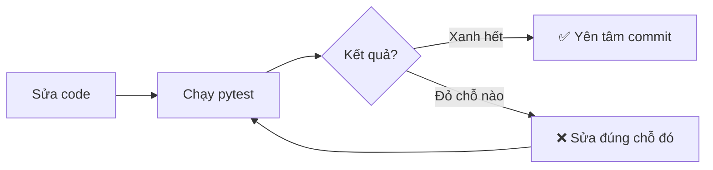
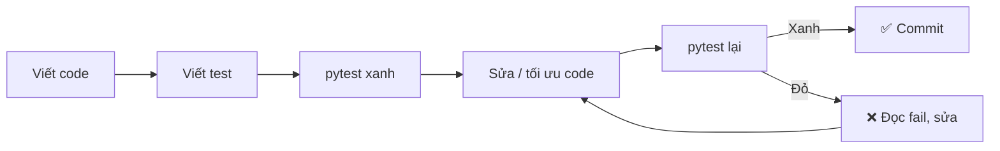

# Bài 13 — Kiểm Thử Với pytest

> 🚀 **Nhánh 03 — Thực Chiến (API / Package / Project)**

---

## 🧠 Điều kiện tiên quyết

- [Bài 12 — Hàm (Function)](../../01-Co-Ban/12-Ham/bai.md)
- [Bài 11 — Mini Project](../../03-Thuc-Chien/11-Mini-Project/bai.md) (quản lý cửa hàng sách — code đem đi test)

---

## 🎯 Mục tiêu

Sau bài học này, học viên sẽ:

* ✅ Hiểu vì sao test tự động thay thế `print` kiểm tra thủ công.
* ✅ Viết được test bằng `assert` và chạy bằng `pytest`.
* ✅ Đọc được báo cáo fail của pytest (dòng nào, giá trị nào lệch).
* ✅ Dùng `fixture` để khỏi lặp code chuẩn bị, `parametrize` để test nhiều case.
* ✅ Test được đọc/ghi file bằng `tmp_path` (không làm bẩn thư mục thật).
* ✅ Test được ngoại lệ bằng `pytest.raises` và so sánh số thực bằng `pytest.approx`.
* ✅ Tổ chức test cho project thật (thư mục `tests/`, đặt tên chuẩn).

---

## 📖 Mở đầu

Tới giờ bạn kiểm tra code bằng cách chạy rồi **nhìn bằng mắt**: đúng thì gật gù,
sai thì sửa. Cách này chết dần khi project lớn lên: sửa 1 chỗ, 10 chỗ khác đổ
vỡ lúc nào không hay — vì bạn không thể chạy tay lại mọi thứ sau mỗi lần sửa.

Kiểm thử tự động (automated testing) giải đúng bài toán đó: viết **một lần**
những điều code phải đúng, máy tự chạy lại **mỗi lần** bạn sửa code.
Công cụ chuẩn của Python: **pytest**.

---

## 💡 Ý tưởng trực quan

* **Test thủ công:** đầu bếp nếm từng món trước khi dọn — chậm, quên, mỗi người
  nếm một kiểu.
* **Test tự động:** máy kiểm định — cùng một bộ tiêu chí, bấm nút là chạy hết,
  món nào hỏng báo đỏ đúng chỗ. Nấu lại (sửa code) thì cho máy nếm lại từ đầu.



---

## 📚 Kiến thức

### 1. `assert` — câu khẳng định phải đúng

```python
def cong(a, b):
    return a + b

assert cong(2, 3) == 5        # đúng thì im lặng đi tiếp
assert cong(2, 2) == 5        # sai thì la lên ngay
```

Chạy file chứa dòng 2: `AssertionError` + dừng chương trình. `assert` là viên
gạch nền của mọi test: "tôi khẳng định điều này phải đúng, sai thì báo".

### 2. Cài pytest và quy ước đặt tên

```bash
pip install pytest
pytest --version
```

pytest tự tìm test theo quy ước (nhớ kỹ — sai tên là pytest **lờ đi**, không báo!):

| Quy ước | Ví dụ đúng | Ví dụ sai (bị lờ) |
|---|---|---|
| File test | `test_kho.py`, `kho_test.py` | `kiem_thu.py`, `test.py`? (`test.py` vẫn được thu thập — nhưng dễ nhầm, tránh) |
| Hàm test | `test_them_sach()` | `kiem_tra_them()` |
| Class test | `TestKho` (không có `__init__`) | `test_kho` (thường vẫn được, nhưng chuẩn là CamelCase) |

### 3. Test đầu tiên — test hàm `tao_sach` của mini project

Giả sử file `kho.py` có hàm `tao_sach` (Bài 11). Tạo file `test_kho.py`
**cùng thư mục**:

```python
from kho import tao_sach


def test_tao_sach_du_thong_tin():
    sach = tao_sach(1, "De Men", "To Hoai", "Truyen", 65000.0, 10)
    assert sach["ma"] == 1
    assert sach["ten"] == "De Men"
    assert sach["gia"] == 65000.0
    assert sach["so_luong"] == 10


def kiem_tra_gia_mac_dinh():
    assert tao_sach(2, "X", "Y", "Z", 1000.0, 1)["gia"] == 1000.0


def test_so_luong_mac_dinh():
    pass
```

> ⚠️ Đoạn trên có **2 lỗi thật** (không phải lỗi chính tả vớ vẩn) — tìm ở
> **bài tập 1** mục 🧩. Gợi ý: chạy `pytest -v` rồi đếm số test được thu thập!

Chạy:

```bash
pytest -v
```

Output khi xanh:

```
test_kho.py::test_tao_sach_du_thong_tin PASSED
```

### 4. Đọc báo cáo fail — kỹ năng quan trọng nhất

Cố tình viết sai kỳ vọng để xem pytest báo:

```python
def test_cong():
    assert 2 + 2 == 5
```

```bash
pytest -v
```

```
FAILED test_demo.py::test_cong - assert 4 == 5
```

pytest chỉ đúng dòng `assert`, hiện **giá trị thật vs kỳ vọng**.
Với so sánh list/dict dài, pytest còn in diff từng phần tử (assert rewriting) —
khỏi `print` debug từng biến.

### 5. `fixture` — dọn sẵn "bàn thí nghiệm"

Nhiều test cùng cần một kho mẫu. Không copy-paste — dùng `@pytest.fixture`:

```python
import pytest
from kho import tao_sach, them_sach, tim_theo_ten


@pytest.fixture
def kho_mau():
    kho = []
    them_sach(kho, tao_sach(1, "De Men", "To Hoai", "Truyen", 65000.0, 10))
    them_sach(kho, tao_sach(2, "Doraemon", "Fujiko", "Tranh", 20000.0, 25))
    return kho


def test_tim_thay(kho_mau):
    sach = tim_theo_ten(kho_mau, "de men")
    assert sach is not None
    assert sach["ma"] == 1


def test_tim_khong_thay(kho_mau):
    assert tim_theo_ten(kho_mau, "khong co") is None
```

Mỗi test nhận `kho_mau` **mới tinh** (fixture chạy lại mỗi test) — test này
làm bẩn kho cũng không ảnh hưởng test kia. Đó là toàn bộ ý nghĩa fixture:
**cô lập** (isolation).

### 6. `parametrize` — một test, nhiều bộ dữ liệu

Đừng viết 5 hàm test cho 5 case — liệt kê case:

```python
import pytest


def giam_gia(gia, phan_tram):
    return gia * (1 - phan_tram / 100)


@pytest.mark.parametrize("gia, giam, mong_doi", [
    (100000, 10, 90000),
    (50000, 0, 50000),
    (200000, 50, 100000),
    (100000, 100, 0),
])
def test_giam_gia(gia, giam, mong_doi):
    assert giam_gia(gia, giam) == mong_doi
```

pytest chạy thành 4 test riêng (`test_giam_gia[100000-10-90000]`...),
hỏng case nào báo đúng case đó.

### 7. Test ngoại lệ + số thực — 2 hàm phải thuộc

```python
import pytest


def chia(a, b):
    if b == 0:
        raise ValueError("Khong chia cho 0")
    return a / b


def test_chia_cho_0_bao_loi():
    with pytest.raises(ValueError):
        chia(10, 0)


def test_tong_thap_phan():
    assert 0.1 + 0.2 == pytest.approx(0.3)   # float không bao giờ == trực tiếp!
```

* `pytest.raises`: code trong khối **phải** nổ ra đúng loại lỗi đó, không nổ
  (hoặc nổ loại khác) → test đỏ.
* `pytest.approx`: so sánh float với sai số — `0.1 + 0.2 == 0.3` là `False`
  trong mọi ngôn ngữ (sai số nhị phân), bẫy kinh điển.

### 8. Test đọc/ghi file bằng `tmp_path` — không làm bẩn project

Test `luu_file`/`nap_file` (Bài 11) mà ghi thẳng `kho.json` trong thư mục code
thì mỗi lần test rác một file. pytest cho sẵn fixture `tmp_path` (thư mục tạm
tự xóa sau test):

```python
def test_luu_roi_nap(kho_mau, tmp_path):
    from kho import luu_file, nap_file
    file_tam = tmp_path / "kho_test.json"
    luu_file(kho_mau, str(file_tam))
    assert file_tam.exists()
    kho_moi = nap_file(str(file_tam))
    assert len(kho_moi) == 2
    assert kho_moi[0]["ten"] == "De Men"
```

> 💡 `luu_file`/`nap_file` của bạn phải nhận tham số đường dẫn (đừng ghi cứng
> tên file trong hàm) thì mới test được kiểu này — đó chính là thiết kế tốt
> (testable code). Code khó test thường là code thiết kế chưa tốt!

### 9. Tổ chức test cho project thật

```
cua-hang-sach/
├── kho.py              ← code chính
├── main.py
└── tests/
    ├── __init__.py     (có thể rỗng — giúp import ổn định)
    ├── test_kho.py     ← test nghiệp vụ
    └── test_file.py    ← test lưu/nạp file
```

Chạy từ gốc project: `pytest` (tự quét cả cây) hoặc `pytest tests/`.
Thêm `-q` (gọn), `-x` (dừng ở lỗi đầu — sửa xong chạy tiếp).

---

## 💻 Ví dụ

### Ví dụ 1 — Dễ: test hàm tính tiền (chạy được ngay)

Tạo 2 file trong thư mục trống, chạy `pytest -v`:

```python
# tien.py
def thanh_tien(gia, so_luong, giam_phan_tram=0):
    return gia * so_luong * (1 - giam_phan_tram / 100)
```

```python
# test_tien.py
from tien import thanh_tien


def test_khong_giam():
    assert thanh_tien(30000, 3) == 90000


def test_co_giam():
    assert thanh_tien(30000, 3, 10) == 81000.0
```

Kết quả: `2 passed`. Xong — bạn vừa viết test tự động đầu tiên!

### Ví dụ 2 — Thực tế: test toàn bộ kho sách (fixture + parametrize)

```python
# test_kho_full.py
import pytest
from kho import tao_sach, them_sach, tim_theo_ten, sua_gia, xoa_sach


@pytest.fixture
def kho_mau():
    kho = []
    them_sach(kho, tao_sach(1, "De Men", "To Hoai", "Truyen", 65000.0, 10))
    them_sach(kho, tao_sach(2, "Doraemon", "Fujiko", "Tranh", 20000.0, 25))
    return kho


def test_them_tang_so_luong(kho_mau):
    assert len(kho_mau) == 2


@pytest.mark.parametrize("ten,ma", [
    ("de men", 1),
    ("DE MEN", 1),
    ("doraemon", 2),
    ("khong co", None),
])
def test_tim_theo_ten(kho_mau, ten, ma):
    sach = tim_theo_ten(kho_mau, ten)
    assert (sach["ma"] if sach else None) == ma


def test_sua_gia(kho_mau):
    sua_gia(kho_mau, 1, 70000.0)
    assert tim_theo_ten(kho_mau, "de men")["gia"] == 70000.0


def test_xoa_giam_so_luong(kho_mau):
    xoa_sach(kho_mau, 2)
    assert len(kho_mau) == 1
```

7 test (2 + 4 parametrize + ... đếm: 1 + 4 + 1 + 1 = 7) — chạy `pytest -v`,
xanh hết mới yên tâm refactor `kho.py`.

### Ví dụ 3 — Khó: test vẫn xanh sau khi refactor (giá trị thật của test)

Giả sử bạn tối ưu `tim_theo_ten` từ vòng lặp sang dict cache:

```python
# kho.py — bản tối ưu (đổi ruột, giữ vỏ: cùng tên hàm, cùng tham số, cùng kiểu trả)
_cache = {}


def tim_theo_ten(kho, ten_can_tim):
    global _cache
    khoa = (id(kho), ten_can_tim.lower())
    if khoa not in _cache:
        for sach in kho:
            if sach["ten"].lower() == ten_can_tim.lower():
                _cache[khoa] = sach
                break
        else:
            _cache[khoa] = None
    return _cache[khoa]
```

Chạy lại `pytest` — nếu vẫn xanh hết: refactor an toàn. Nếu đỏ: tối ưu sai
(ví dụ cache theo `id(kho)` mà quên xóa khi `xoa_sach` — bug thật!).
**Đây chính là lúc test đẻ ra tiền**: không có test, bạn không bao giờ dám
đụng vào code đang chạy.

> ⚠️ Nói thẳng: cache `id(kho)` ở trên có bug tiềm ẩn (id tái sử dụng sau khi
> list bị hủy + sửa kho không xóa cache). Ví dụ này cố tình để bạn thấy test
> bắt bug ra sao — xem bài tập 8!

---

## 🔍 Phân tích từng bước (đọc fail như đọc tin nhắn)

```
FAILED test_kho.py::test_tim_thay - assert None == 1
```

1. File + hàm test hỏng: `test_kho.py::test_tim_thay`.
2. Dòng assert nào: pytest in đúng dòng code (dưới chữ FAILED).
3. Giá trị thật (`None`) vs kỳ vọng (`1`): hàm trả `None` → tìm không thấy →
   kiểm tra `tim_theo_ten` (so sánh `.lower()` chưa? tên trong kho đúng không?).

---

## 📊 Minh họa



---

## ⚠️ Những lỗi thường gặp

### Lỗi 1: Đặt tên sai quy ước — pytest lờ đi, tưởng là pass hết

```bash
pytest   # collected 0 items — KHÔNG CHẠY test nào mà vẫn "xanh"!
```

* **Nguyên nhân:** file `kiem_thu.py` / hàm `kiem_tra()` không khớp quy ước.
* **Cách sửa:** `test_*.py` + `test_*()`. Luôn nhìn dòng `collected N items` —
  N = 0 là báo động đỏ.

### Lỗi 2: So sánh float bằng `==`

```python
assert 0.1 + 0.2 == 0.3   # ❌ False! (0.30000000000000004)
assert 0.1 + 0.2 == pytest.approx(0.3)   # ✅
```

### Lỗi 3: Test phụ thuộc thứ tự / dùng chung dữ liệu

```python
kho = []   # ❌ biến toàn cục dùng chung — test chạy trước làm bẩn test sau
```

* **Cách sửa:** fixture tạo mới mỗi test (mục 5).

### Lỗi 4: Quên cài pytest trong venv của project

* `pytest: command not found` → kiểm tra đang ở đúng venv chưa
  (`which pytest` / `where pytest`), rồi `pip install pytest`.

### Lỗi 5: `import kho` lỗi khi chạy từ thư mục khác

* Chạy `pytest` từ đúng thư mục chứa `kho.py` (hoặc có `tests/__init__.py`
  + cài package). `ModuleNotFoundError` 90% là sai thư mục đứng.

---

## 🧪 Trường hợp đặc biệt

* **Test rỗng (`pass`)**: pytest tính là PASS (không assert gì để fail) —
  nguy hiểm vì tưởng đã test! Bài tập 1 bắt đúng lỗi này.
* **`pytest.raises` sai loại lỗi**: `ValueError` vs `TypeError` lẫn nhau →
  test đỏ dù code "có vẻ" đúng — đọc kỹ exception thật.
* **Fixture lỗi**: nếu fixture nổ, mọi test dùng nó báo ERROR (không phải
  FAILED) — sửa fixture, không phải sửa test.
* **Test file I/O**: luôn `tmp_path`, không bao giờ ghi đè file thật của project.
* **Thời gian chạy**: test phải nhanh (< 1s mỗi test lý tưởng) — test chậm
  (gọi mạng, sleep) thì tách riêng, đánh dấu `slow`.

---

## 🚀 Ứng dụng thực tế

* Mọi công ty phần mềm đều chạy test tự động trước khi cho lên production
  (CI: GitHub Actions chạy `pytest` mỗi lần push — nối thẳng sang Bài 14 Git!).
* Viết test trước khi sửa bug lạ (reproduce bằng test đỏ → sửa → test xanh).

---

## 🧩 Bài tập

### 🟢 Cơ bản (1–3)

**Bài 1 — Tìm 2 lỗi.** Mục 3 có 2 lỗi thật. Chạy `pytest -v`, nhìn dòng
`collected`, tìm cả 2 lỗi và sửa lại. *Gợi ý: 1 lỗi khiến test bị lờ hoàn toàn,
1 lỗi khiến test luôn xanh giả.*

**Bài 2 — Test hàm tính điểm.** Cho hàm `xep_loai(dtb)` trả `"Gioi"` (≥ 8),
`"Kha"` (≥ 6.5), `"TB"` (≥ 5), `"Yeu"` (< 5). Viết 4 test (mỗi loại 1 test)
+ 1 test biên (đúng 8.0, 6.5, 5.0).

**Bài 3 — Đọc fail.** Cố tình viết `assert tim_theo_ten(kho, "de men")["ma"] == 2`
(trong khi mã đúng là 1). Chạy pytest, chép nguyên báo cáo fail và chỉ ra:
file nào, hàm nào, giá trị thật, kỳ vọng.

### 🟡 Hiểu sâu (4–6)

**Bài 4 — Parametrize bảng cửu chương.** Viết hàm `nhan(a, b)` (dùng `*`).
Test bằng 1 hàm + parametrize 6 cặp (kể cả số âm, số 0).

**Bài 5 — Fixture kho rỗng.** Viết fixture `kho_rong` trả `[]`. Viết 2 test:
thêm 1 sách vào kho rỗng (dùng fixture) và tìm trong kho rỗng (trả `None`).
Chứng minh 2 test không ảnh hưởng nhau (đảo thứ tự chạy vẫn xanh:
`pytest -p no:randomly`? — không cần plugin: pytest chạy theo thứ tự file,
hãy tự suy luận vì sao fixture đảm bảo điều này).

**Bài 6 — tmp_path.** Viết test cho `luu_file`/`nap_file` dùng `tmp_path`
(mục 8). Cố tình đổi `nap_file` trả `[]` luôn → pytest phải đỏ. Rồi sửa lại.

### 🔴 Vận dụng (7–8)

**Bài 7 — pytest.raises.** Viết hàm `tuoi_hop_le(tuoi)` raise `ValueError` nếu
tuổi < 0 hoặc > 150, ngược lại trả `True`. Viết 4 test: 2 pass, 2 raises
(âm và > 150). Thêm 1 test sai loại lỗi (expect `TypeError`) để xem pytest đỏ
ra sao.

**Bài 8 — Bắt bug cache.** Lấy code cache ở ví dụ 3. Viết test chứng minh nó sai:
thêm sách → tìm (cache) → xóa sách đó → tìm lại (vẫn thấy vì cache cũ!).
Sửa `xoa_sach` (xóa cache liên quan) hoặc bỏ cache → test xanh. *Gợi ý: bug nằm
ở chỗ cache không biết kho đã đổi.*
### ➕ Bài tập bổ sung (Bài 9–12)

**Bài 9 — Vòng lặp đỏ–xanh.** Viết hàm `nhan_doi(x)` (trả x*2) + 1 test sai cố ý
(`assert nhan_doi(3) == 7`). Chạy pytest xem đỏ, sửa code/test cho xanh, chạy
lại. Ghi đúng 3 bước ra giấy (đây là nhịp TDD: đỏ → sửa → xanh).

**Bài 10 — Lãi kép và approx.** Hàm `lai_kep(goc, lai, nam)` trả
`goc * (1 + lai) ** nam`. Viết test `lai_kep(100, 0.1, 3) == 133.1` → pytest đỏ
(vì ra 133.10000000000005!). Sửa bằng `pytest.approx` cho xanh. Giải thích vì
sao dân tài chính cấm so float bằng `==`.

**Bài 11 — Fixture lồng nhau.** Viết fixture `kho_1_sach` (1 cuốn) dùng trong
fixture `file_kho` (lưu kho 1 cuốn ra `tmp_path`, trả đường dẫn). Viết test đọc
lại bằng `nap_file`. Vẽ sơ đồ phụ thuộc fixture (test → file_kho → kho_1_sach).

**Bài 12 — Săn nhánh chưa test.** Cho hàm có 3 nhánh if/elif/else, viết 2 test
mới chỉ bao phủ 2 nhánh. Chạy `pytest --cov` (cài `pytest-cov`) xem dòng nào đỏ
(missing), viết thêm test thứ 3 cho xanh 100%. Ghi lại % trước/sau.

---

## ✅ Đáp án

> 💡 **Hãy tự làm bài tập trước** rồi mới mở đáp án.

<details>
<summary>✅ Bài 1: Tìm 2 lỗi</summary>

* Lỗi 1: `kiem_tra_gia_mac_dinh` **thiếu tiền tố `test_`** → pytest lờ hoàn toàn.
  Dấu hiệu: `collected 2 items` trong khi bạn viết 3 hàm — thiếu 1 mà vẫn
  "xanh"! Sửa: đổi tên thành `test_gia_mac_dinh`.
* Lỗi 2: `test_so_luong_mac_dinh` chỉ có `pass` → **luôn xanh mà không kiểm gì**.
  Sửa: viết assert thật, hoặc xóa hàm đi.

```python
def test_gia_mac_dinh():
    assert tao_sach(2, "X", "Y", "Z", 1000.0, 1)["gia"] == 1000.0
```

> Nói thẳng: lỗi 2 tệ hơn lỗi 1 — test đỏ còn biết đường sửa, test rỗng tạo
> cảm giác an toàn giả. Quy tắc: **không bao giờ để hàm test chỉ có `pass`**;
> thói quen nhìn `collected N items` sau mỗi lần chạy.

</details>

<details>
<summary>✅ Bài 2: Test hàm tính điểm</summary>

```python
def xep_loai(dtb):
    if dtb >= 8:
        return "Gioi"
    if dtb >= 6.5:
        return "Kha"
    if dtb >= 5:
        return "TB"
    return "Yeu"


def test_gioi():
    assert xep_loai(9) == "Gioi"


def test_kha():
    assert xep_loai(7) == "Kha"


def test_tb():
    assert xep_loai(5.5) == "TB"


def test_yeu():
    assert xep_loai(3) == "Yeu"


def test_bien():
    assert xep_loai(8.0) == "Gioi"
    assert xep_loai(6.5) == "Kha"
    assert xep_loai(5.0) == "TB"
```

Biên (8.0/6.5/5.0) bắt lỗi `>` vs `>=` — sai một dấu là rớt biên ngay.

</details>

<details>
<summary>✅ Bài 3: Đọc fail</summary>

Báo cáo mẫu:

```
FAILED test_kho.py::test_ma - assert 1 == 2
```

* File: `test_kho.py`, hàm: `test_ma`.
* Giá trị thật: `1` (mã của "De Men"), kỳ vọng (sai): `2`.
* Kết luận: kỳ vọng viết sai, không phải code sai — sửa test thành `== 1`.

</details>

<details>
<summary>✅ Bài 4: Parametrize bảng cửu chương</summary>

```python
import pytest


def nhan(a, b):
    return a * b


@pytest.mark.parametrize("a,b,kq", [
    (2, 3, 6),
    (-2, 3, -6),
    (0, 100, 0),
    (-4, -5, 20),
    (7, 0, 0),
    (12, 12, 144),
])
def test_nhan(a, b, kq):
    assert nhan(a, b) == kq
```

</details>

<details>
<summary>✅ Bài 5: Fixture kho rỗng</summary>

```python
import pytest
from kho import tao_sach, them_sach, tim_theo_ten


@pytest.fixture
def kho_rong():
    return []


def test_them_vao_kho_rong(kho_rong):
    them_sach(kho_rong, tao_sach(1, "A", "B", "C", 1000.0, 1))
    assert len(kho_rong) == 1


def test_tim_trong_kho_rong(kho_rong):
    assert tim_theo_ten(kho_rong, "bat ky") is None
```

Mỗi test được gọi fixture riêng → 2 list khác nhau → đảo thứ tự vẫn xanh.
(Pytest mặc định chạy theo thứ tự định nghĩa; plugin `pytest-randomly` đảo
ngẫu nhiên để bắt lỗi phụ thuộc — đáng cài khi project lớn.)

</details>

<details>
<summary>✅ Bài 6: tmp_path</summary>

```python
def test_luu_nap_tron_vong(kho_mau, tmp_path):
    from kho import luu_file, nap_file
    f = tmp_path / "k.json"
    luu_file(kho_mau, str(f))
    assert nap_file(str(f))[1]["ten"] == "Doraemon"
```

Đổi `nap_file` thành `return []` → `IndexError` → đỏ ✔ (test bắt được).
Sửa lại → xanh. Vòng lặp đỏ–xanh này chính là TDD thu nhỏ.

</details>

<details>
<summary>✅ Bài 7: pytest.raises</summary>

```python
import pytest


def tuoi_hop_le(tuoi):
    if tuoi < 0 or tuoi > 150:
        raise ValueError("Tuoi khong hop le")
    return True


def test_tuoi_ok():
    assert tuoi_hop_le(20) is True


def test_tuoi_150_ok():
    assert tuoi_hop_le(150) is True


def test_tuoi_am():
    with pytest.raises(ValueError):
        tuoi_hop_le(-5)


def test_tuoi_qua_lon():
    with pytest.raises(ValueError):
        tuoi_hop_le(200)


def test_sai_loai_loi():
    with pytest.raises(TypeError):   # code raise ValueError -> test ĐỎ ✔
        tuoi_hop_le(-5)
```

</details>

<details>
<summary>✅ Bài 8: Bắt bug cache</summary>

```python
def test_cache_loi_thoi(kho_mau):
    from kho import tim_theo_ten, xoa_sach
    assert tim_theo_ten(kho_mau, "doraemon")["ma"] == 2   # nạp cache
    xoa_sach(kho_mau, 2)                                  # xóa sách khỏi kho
    assert tim_theo_ten(kho_mau, "doraemon") is None       # ĐỎ: cache còn đáp án cũ!
```

Sửa đúng: `xoa_sach` (và `sua_gia`, `them_sach`) phải xóa cache liên quan —
hoặc đơn giản **bỏ cache** nếu kho nhỏ (tối ưu sớm là nguồn gốc mọi bug!
— Knuth). Sau sửa: xanh.

</details>

<details>
<summary>✅ Bài 9: Vòng lặp đỏ–xanh</summary>

```python
# code.py
def nhan_doi(x):
    return x * 2

# test_code.py
from code import nhan_doi

def test_nhan_doi():
    assert nhan_doi(3) == 7   # cố tình sai
```

1. `pytest -q` → đỏ (`assert 6 == 7`). 2. Sửa test thành `== 6`
   (lỗi ở kỳ vọng, không phải code!). 3. `pytest -q` → xanh.
   Nhịp TDD thu nhỏ: **đỏ (biết sai ở đâu) → sửa đúng chỗ → xanh (xác nhận)**.
   Chú ý bước 2: test đỏ chưa chắc code sai — có thể kỳ vọng sai (như Bài 3)!

</details>

<details>
<summary>✅ Bài 10: Lãi kép và approx</summary>

```python
import pytest

def lai_kep(goc, lai, nam):
    return goc * (1 + lai) ** nam


def test_lai_kep():
    assert lai_kep(100, 0.1, 3) == pytest.approx(133.1)
```

`100 * 1.1**3` = 133.10000000000005 (sai số nhị phân, đã kiểm bằng chạy thật).
Dân tài chính cấm `==` với tiền: lệch 0.00000000005 đồng × hàng triệu giao dịch
= sai số thật! `approx` (mặc định dung sai 10⁻⁶ tương đối) là chuẩn.

</details>

<details>
<summary>✅ Bài 11: Fixture lồng nhau</summary>

```python
import pytest
from kho import tao_sach, them_sach, luu_file, nap_file


@pytest.fixture
def kho_1_sach():
    kho = []
    them_sach(kho, tao_sach(1, "A", "B", "C", 1000.0, 1))
    return kho


@pytest.fixture
def file_kho(kho_1_sach, tmp_path):
    f = tmp_path / "k.json"
    luu_file(kho_1_sach, str(f))
    return str(f)


def test_nap_tu_file(file_kho):
    assert nap_file(file_kho)[0]["ten"] == "A"
```

Sơ đồ: `test_nap_tu_file` → cần `file_kho` → cần `kho_1_sach` + `tmp_path`
(pytest tự giải thứ tự!). Fixture lồng nhau = xây dựng từng lớp, test chỉ xin
thứ mình cần.

</details>

<details>
<summary>✅ Bài 12: Săn nhánh chưa test</summary>

```python
# code.py
def phi_ship(tong):
    if tong >= 500000:
        return 0
    elif tong >= 200000:
        return 20000
    return 35000
```

```bash
pip install pytest-cov
pytest --cov=code --cov-report=term-missing -q
```

Với 2 test (`phi_ship(600000)`, `phi_ship(100000)`): báo cáo hiện nhánh
`elif` missing → viết thêm `assert phi_ship(300000) == 20000` → 100%.
Quy trình: **đo bao phủ → viết test cho dòng đỏ → đo lại**. Đừng mê 100% mù
quáng (test vô nghĩa để đủ số còn tệ hơn thiếu), nhưng nhánh chưa test nào
cũng là bug tiềm ẩn!

</details>

---

## 🧠 Thử thách

**Thử thách project:** Viết test cho **toàn bộ** `kho.py` của Bài 11 (mọi hàm:
tạo, thêm, hiển thị?, tìm, sửa, xóa, thống kê, lưu, nạp) đạt 100% hàm được
bao phủ. Dùng `pytest --collect-only -q` đếm số test, và `pip install pytest-cov`
+ `pytest --cov=kho` xem % bao phủ. Mục tiêu: ≥ 90% dòng code chạy qua test.

---

## 📝 Tóm tắt

| Khái niệm | Nội dung |
|---|---|
| 🧪 Test tự động | Viết một lần, máy chạy lại mỗi lần sửa code |
| ✅ Quy ước pytest | `test_*.py`, `test_*()`, class `Test*` — sai tên là bị lờ |
| 📖 Đọc fail | File::hàm + dòng assert + thật-vs-kỳ vọng |
| 🧰 Fixture | Dọn dữ liệu mới mỗi test — cô lập |
| 📊 Parametrize | Một test, nhiều case |
| ⚠️ raises/approx | Test lỗi + test số thực đúng cách |
| 📁 tmp_path | Test file không rác project |

---

## ➡️ Điều hướng

**Vị trí:** `03-Thuc-Chien/13-Pytest/bai.md`

**Bài tiếp theo:** [Bài 14 — Git & GitHub](../14-Git/bai.md)
