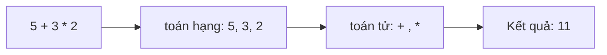
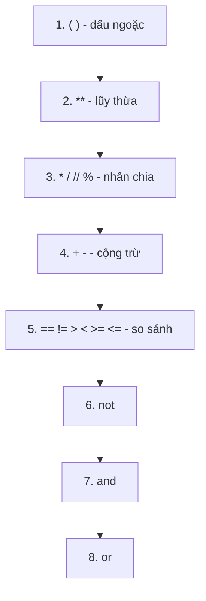

<!-- TỰ ĐỘNG ĐỒNG BỘ từ 01-Co-Ban/06-Toan-Tu/bai.md — đừng sửa trực tiếp, sửa bản chính rồi chạy tools/sync_tracks.py -->

# Bài 6 — Toán Tử Trong Python

> 🎓 **Chương 2 – Nền tảng lập trình**

## 🧠 Điều kiện tiên quyết

- [Bài 4 — Biến Trong Python](../04-Bien/bai.md)
- [Bài 5 — Kiểu Dữ Liệu Cơ Bản](../05-Kieu-Du-Lieu/bai.md)

---

## 🎯 Mục tiêu

Sau bài học này, học viên sẽ:

* ✅ Sử dụng thành thạo **toán tử số học**: `+ - * / // % **`.
* ✅ Nắm vững **toán tử gán** đơn và gán kết hợp: `= += -= *= /= //= %= **=`.
* ✅ Dùng **toán tử so sánh** để so sánh số và chuỗi: `== != > < >= <=`.
* ✅ Dùng **toán tử logic** `and`, `or`, `not` để kết hợp điều kiện.
* ✅ Hiểu **thứ tự ưu tiên** phép toán để viết biểu thức đúng.
* ✅ Vận dụng giải bài toán thực tế: tính tiền, chia tiền, kiểm tra chẵn lẻ.

---

## 📖 Kiến thức

### 1. Toán tử là gì?

> 💬 **Nói đơn giản:** Toán tử (operator) là những **ký hiệu thực hiện tính toán** trên dữ liệu. Bạn đã dùng `=` (gán) và `+`, `-`, `*`, `/` từ các bài trước — bài này sẽ trọn bộ "bộ dụng cụ" của người làm toán với Python.



### 2. Toán tử số học

| Toán tử | Ý nghĩa | Ví dụ `a = 10, b = 3` | Kết quả |
|---|---|---|---|
| `+` | Cộng | `a + b` | `13` |
| `-` | Trừ | `a - b` | `7` |
| `*` | Nhân | `a * b` | `30` |
| `/` | Chia (luôn ra số thực) | `a / b` | `3.333...` |
| `//` | Chia lấy **phần nguyên** | `a // b` | `3` |
| `%` | Chia lấy **phần dư** | `a % b` | `1` |
| `**` | Lũy thừa | `a ** 3` | `1000` |

**Hai toán tử "mới toanh" cần chú ý:**

* `//` — **chia lấy phần nguyên**: `17 // 5 = 3` (bỏ phần dư 2).
* `%` — **chia lấy phần dư**: `17 % 5 = 2`.
* `%` cực kỳ hữu ích để **kiểm tra chẵn lẻ**: số chẵn khi `so % 2 == 0`.

> 💬 **Ví dụ đời thực của `//` và `%`:** Có 17 viên kẹo chia đều cho 5 bạn: mỗi bạn được `17 // 5 = 3` viên, còn dư `17 % 5 = 2` viên. Hai câu hỏi "mỗi người mấy phần" và "còn thừa mấy" chính là `//` và `%`!

```python
# Kiểm chứng nhanh bằng Python
print(17 // 5)   # 3
print(17 % 5)    # 2
print(2 ** 10)   # 1024
```

### 3. Toán tử gán

Ngoài dấu `=` cơ bản, Python có các **toán tử gán kết hợp** — viết ngắn gọn cho phép "lấy giá trị hiện tại, biến đổi, gán lại":

```python
x = 10
x += 5    # x = x + 5   -> 15
x -= 3    # x = x - 3   -> 12
x *= 2    # x = x * 2   -> 24
x /= 4    # x = x / 4   -> 6.0
x //= 2   # x = x // 2  -> 3.0
x %= 2    # x = x % 2   -> 1.0
x **= 3   # x = x ** 3  -> 1.0
```

| Viết tắt | Tương đương | Ý nghĩa |
|---|---|---|
| `x += 5` | `x = x + 5` | Cộng thêm 5 vào x |
| `x -= 5` | `x = x - 5` | Trừ đi 5 |
| `x *= 5` | `x = x * 5` | Nhân lên 5 lần |
| `x /= 5` | `x = x / 5` | Chia cho 5 |
| `x //= 5` | `x = x // 5` | Chia nguyên cho 5 |
| `x %= 5` | `x = x % 5` | Lấy dư chia cho 5 |
| `x **= 2` | `x = x ** 2` | Bình phương |

> 💡 `+=` là toán tử được dùng **nhiều nhất** trong lập trình — đếm 1 đơn vị, cộng dồn điểm...

### 4. Toán tử so sánh

So sánh trả về kết quả **`True` hoặc `False`** (kiểu `bool`):

| Toán tử | Ý nghĩa | Ví dụ (`a = 5, b = 3`) |
|---|---|---|
| `==` | Bằng | `a == b` → `False` |
| `!=` | Khác | `a != b` → `True` |
| `>` | Lớn hơn | `a > b` → `True` |
| `<` | Nhỏ hơn | `a < b` → `False` |
| `>=` | Lớn hơn hoặc bằng | `a >= b` → `True` |
| `<=` | Nhỏ hơn hoặc bằng | `a <= b` → `False` |

> ⚠️ **Bẫy kinh điển:** dấu `==` (hai dấu bằng) mới là **so sánh**; một dấu `=` là **gán**. `a = 5` đặt a bằng 5; `a == 5` hỏi "a có bằng 5 không?"

**So sánh chuỗi:** Python so sánh chuỗi theo **thứ tự từ điển** (a < b < c ...):

```python
print("apple" < "banana")   # True - a đứng trước b
print("An" == "an")         # False - phân biệt hoa thường
print("abc" < "abd")        # True - so từng ký tự
```

### 5. Toán tử logic

Kết hợp nhiều điều kiện để tạo điều kiện phức hợp:

| Toán tử | Ý nghĩa | Kết quả |
|---|---|---|
| `and` | **Và** — đúng khi cả hai đều đúng | `True and True` → `True` |
| `or` | **Hoặc** — đúng khi ít nhất một đúng | `True or False` → `True` |
| `not` | **Phủ định** — đảo ngược | `not True` → `False` |

**Bảng chân trị (rút gọn):**

| A | B | `A and B` | `A or B` | `not A` |
|---|---|---|---|---|
| True | True | True | True | False |
| True | False | False | True | False |
| False | True | False | True | True |
| False | False | False | False | True |

```python
tuoi = 16
print(tuoi > 12 and tuoi < 18)   # True - tuổi "teen"
print(tuoi == 15 or tuoi == 16)  # True
print(not tuoi > 20)             # True
```

> 💬 **Ví dụ đời thực:** Đi chơi khi **và** bố mẹ đồng ý (and) — phải đủ cả hai; Được thưởng khi điểm cao **hoặc** có thành tích (or) — chỉ cần một.

### 6. Thứ tự ưu tiên phép toán

Python tính toán theo thứ tự ưu tiên từ **cao đến thấp**:



**Ví dụ kiểm chứng:**

```python
print(2 + 3 * 4)        # 14 - nhân trước, cộng sau
print((2 + 3) * 4)      # 20 - ngoặc đổi thứ tự
print(2 ** 3 ** 2)      # 512 - lũy thừa tính từ phải sang trái!
print(10 + 5 > 12 and 10 % 2 == 0)   # True and True = True
```

> 💡 **Mẹo thép:** Khi biểu thức phức tạp, đừng học thuộc thứ tự — cứ **dùng ngoặc tròn** cho phần muốn tính trước. Code dễ đọc hơn và không thể sai thứ tự.

---

## 💡 Ví dụ minh họa

### Ví dụ 1: Bộ sưu tập toán tử số học

```python
a = 10
b = 3
print("Cộng:", a + b)        # 13
print("Trừ:", a - b)         # 7
print("Nhân:", a * b)        # 30
print("Chia:", a / b)        # 3.3333333333333335
print("Chia nguyên:", a // b) # 3
print("Chia dư:", a % b)     # 1
print("Lũy thừa:", a ** b)   # 1000
```

**Giải thích từng dòng:**

| Dòng code | Ý nghĩa |
|---|---|
| `a / b` | Chia thường — kết quả luôn là số thực `3.33...` |
| `a // b` | Phần nguyên của thương: `3` |
| `a % b` | Phần dư: `10 = 3*3 + 1` nên dư `1` |
| `a ** b` | `10³ = 1000` |

### Ví dụ 2: Kiểm tra số chẵn lẻ

```python
# Số chẵn khi chia hết cho 2 (phần dư bằng 0)
so = 42
la_so_chan = so % 2 == 0
print("42 chia 2 du:", so % 2)
print("La so chan:", la_so_chan)   # True
```

**Giải thích từng dòng:**

* `so % 2` — lấy phần dư khi chia cho 2: chẵn → 0, lẻ → 1.
* `so % 2 == 0` — biểu thức so sánh trả về `bool` (`True` nếu chẵn).
* Đây là "câu thần chú" kiểm tra chẵn lẻ dùng ở rất nhiều bài toán sau này.

### Ví dụ 3: Chia đều bánh kẹo cho cả lớp

```python
# Lớp có 34 học sinh, cô giáo có 150 chiếc bánh
hoc_sinh = 34
banh = 150
moi_ban = banh // hoc_sinh      # mỗi bạn được bao nhiêu
con_lai = banh % hoc_sinh       # còn dư bao nhiêu
print("Moi ban duoc:", moi_ban, "chiec")
print("Con du:", con_lai, "chiec")
```

Kết quả: `Moi ban duoc: 4 chiec` và `Con du: 14 chiec`.

---

## 🔬 Ví dụ nâng cao

### Ví dụ 1: Tính tiền quán cà phê (có khuyến mãi)

```python
# Giá ly cà phê và số lượng
gia_ly = 35000
so_ly = 3
# Tổng trước khi giảm giá
tong = gia_ly * so_ly
# Giảm 15% cho đơn từ 100.000 trở lên
khuyen_mai = tong >= 100000
print("Khuyen mai:", khuyen_mai)
# Tiền phải trả: nếu đủ điều kiện thì trừ 15%
tien_phai_tra = tong - tong * 0.15 * int(khuyen_mai)
print("Tong:", tong, "-> Phai tra:", tien_phai_tra)
```

* `tong >= 100000` — phép so sánh ra `bool`.
* `int(khuyen_mai)` — đổi `True`/`False` thành `1`/`0` để toán học dễ dàng: đúng thì trừ 15%, sai thì trừ 0%.
* Cách này gọn nhưng có thể dùng `if` (Bài 8) cho rõ ràng hơn.

### Ví dụ 2: Máy tính quy đổi điểm thang 10

```python
# Điểm thang 10 -> thang 4 (đại học): diem_4 = diem_10 * 4 / 10
diem_10 = 8.5
diem_4 = diem_10 * 4 / 10
print("Diem thang 4:", round(diem_4, 2))   # 3.4
# Làm tròn lên 1 chữ số thập phân để xếp hạng
print("Lam tron:", round(diem_4, 1))       # 3.4
```

### Ví dụ 3: Kiểm tra điều kiện "tuổi teen và có thẻ"

```python
tuoi = 15
co_the = True
# and: cả hai điều kiện đều phải đúng
duoc_vao_cung = tuoi >= 13 and tuoi <= 19 and co_the
# or: chỉ cần một trong hai
duoc_uu_tien = tuoi == 15 or tuoi == 16
# not: phủ định
khong_duoc_vao = not duoc_vao_cung
print("Duoc vao cung:", duoc_vao_cung)     # True
print("Duoc uu tien:", duoc_uu_tien)       # True
print("Khong duoc vao:", khong_duoc_vao)   # False
```

---

## ⚠️ Lỗi thường gặp

### Lỗi 1: Nhầm `=` với `==`

```python
a = 5
print(a = 5)   # ❌ SAI
print(a == 5)  # ✅ ĐÚNG
```

* **Kết quả báo:** `SyntaxError: invalid syntax` (một dấu = trong biểu thức).
* **Nguyên nhân:** `=` là gán, không phải so sánh.
* **Cách sửa:** dùng `==` khi muốn hỏi "bằng nhau không?".

### Lỗi 2: Chia cho 0

```python
x = 10 / 0   # ❌ SAI
```

* **Kết quả báo:** `ZeroDivisionError: division by zero`.
* **Nguyên nhân:** toán học không có phép chia cho 0, Python cũng vậy (áp dụng cho `/`, `//`, `%`).
* **Cách sửa:** kiểm tra mẫu số khác 0 trước khi chia.

### Lỗi 3: So sánh sai kiểu

```python
print("5" > 3)   # ❌ SAI
```

* **Kết quả báo:** `TypeError: '>' not supported between instances of 'str' and 'int'`.
* **Nguyên nhân:** so sánh số với chuỗi vô nghĩa.
* **Cách sửa:** ép kiểu cho cùng loại: `int("5") > 3` hoặc dùng `5 > 3`.

### Lỗi 4: Nhầm toán tử `and` với dấu `&`

```python
print(5 > 3 & 2 < 4)   # ❌ SAI - & không phải "và" trong Python
print(5 > 3 and 2 < 4) # ✅ ĐÚNG
```

* **Kết quả báo:** `TypeError` hoặc kết quả sai lệch.
* **Nguyên nhân:** `&` là toán tử bit, dành riêng cho số nhị phân.
* **Cách sửa:** logic "và" phải dùng từ khóa `and`.

### Lỗi 5: Dùng dấu phẩy trong số thập phân

```python
pi = 3,14    # ❌ SAI - trở thành bộ dữ liệu (3, 14)
pi = 3.14    # ✅ ĐÚNG
```

* **Kết quả:** chương trình chạy nhưng `pi` lại là một tuple `(3, 14)` — mọi phép tính về sau sai bét.
* **Nguyên nhân:** dấu phẩy trong số không phải cách viết số thập phân của Python.
* **Cách sửa:** viết dấu chấm `3.14`.

---

## 💎 Mẹo

* 🧮 **`//` và `%` đi cặp với nhau:** `a = (a // b) * b + a % b` luôn đúng — "nguyên" và "dư" bổ sung nhau.
* ⚖️ **`==` để hỏi, `=` để gán:** đọc thành "bằng?" khi thấy hai dấu, "gán" khi thấy một dấu.
* 🔢 **Kiểm tra chẵn lẻ:** `x % 2 == 0` — thuộc lòng công thức này.
* 🧾 **Dùng `+=` khi cộng dồn:** `tong += diem` gọn và ít lỗi hơn `tong = tong + diem`.
* 📦 **Ngoặc tròn là bạn thân:** biểu thức khó hiểu thì thêm ngoặc, không cần nhớ thứ tự ưu tiên.
* 🔍 **`bool` là kết quả mọi phép so sánh:** cứ thấy `==`, `>`, `and`, `or` thì kết quả thuộc kiểu `bool`.

---

## 📝 Tóm tắt

| Nhóm | Toán tử | Ghi nhớ |
|---|---|---|
| ➕ Số học | `+ - * / // % **` | `//` nguyên, `%` dư, `**` lũy thừa |
| ✍️ Gán | `= += -= *= /= //= %= **=` | `x += 1` là cộng dồn |
| ⚖️ So sánh | `== != > < >= <=` | Trả về `True`/`False` |
| 🧠 Logic | `and or not` | Và / Hoặc / Phủ định |
| 🏗️ Ưu tiên | `( )` → `**` → `* / // %` → `+ -` → so sánh → `not` → `and` → `or` | Khi lưỡng lự, dùng ngoặc |

---

## 🧪 Kiểm tra nhanh

1. ❓ `17 // 5` và `17 % 5` bằng bao nhiêu?
2. ❓ `2 ** 3` bằng bao nhiêu? Còn `3 ** 2`?
3. ❓ Viết lệnh tăng biến `diem` thêm 2 đơn vị bằng toán tử gán kết hợp.
4. ❓ `10 / 4` khác `10 // 4` thế nào?
5. ❓ Kết quả của `5 == "5"` là gì?
6. ❓ `5 > 3 and 10 < 8` cho kết quả gì? Giải thích.
7. ❓ Dùng toán tử nào để kiểm tra một số là số chẵn?
8. ❓ Kết quả `2 + 3 * 4` là bao nhiêu? Muốn ra 20 phải viết sao?
9. ❓ Lỗi gì xảy ra khi viết `x = 10 / 0`?
10. ❓ `not (5 > 3)` bằng bao nhiêu?

<details>
<summary>🔍 Xem đáp án</summary>

1. `3` và `2`.
2. `8` và `9`.
3. `diem += 2`.
4. `10 / 4 = 2.5` (số thực), `10 // 4 = 2` (bỏ phần dư).
5. `False` — một số, một chuỗi.
6. `False` — vế sau `10 < 8` sai, `and` cần cả hai đúng.
7. `so % 2 == 0`.
8. `14` (nhân trước); viết `(2 + 3) * 4` để ra 20.
9. `ZeroDivisionError: division by zero`.
10. `False`.

</details>

---

## 📚 Bài đọc thêm

* [Python.org – Toán tử và biểu thức (đầy đủ, chính thức)](https://docs.python.org/3/reference/expressions.html)
* [Python.org – Thứ tự ưu tiên toán tử](https://docs.python.org/3/reference/expressions.html#operator-precedence)
* [W3Schools – Python Operators](https://www.w3schools.com/python/python_operators.asp)
* [Real Python – Python Operators and Expressions](https://realpython.com/python-operators-expressions/)

---

---

## 🧩 Bài tập

> 📝 🎯 **Chủ đề:** Toán tử số học, gán kết hợp, so sánh, logic; thứ tự ưu tiên; tính tiền, chia đều, kiểm tra chẵn lẻ.

## 🟢 Dễ (Bài 1 – 7)

### Bài 1: Năm phép tính cơ bản

* **Đề bài:** In kết quả `8 + 2`, `8 - 2`, `8 * 2`, `8 / 2`, `8 ** 2`.
* **Input:** Không có.
* **Output:**
  ```
  10
  6
  16
  4.0
  64
  ```
* **Gợi ý:** `8 / 2` ra `4.0` — phép chia luôn cho số thực.

### Bài 2: Chia nguyên và chia dư

* **Đề bài:** In kết quả `17 // 5` và `17 % 5`.
* **Input:** Không có.
* **Output:**
  ```
  3
  2
  ```
* **Gợi ý:** `//` lấy phần nguyên, `%` lấy phần dư.

### Bài 3: Chia bánh cho bạn

* **Đề bài:** Có `banh = 30` chiếc bánh chia cho `10` học sinh. In mỗi bạn được bao nhiêu và còn thừa bao nhiêu.
* **Input:** Không có.
* **Output:**
  ```
  Moi ban: 3
  Con du: 0
  ```
* **Gợi ý:** `so_ban = banh // hoc_sinh`, `con_du = banh % hoc_sinh`.

### Bài 4: Bình phương và lập phương

* **Đề bài:** Biến `x = 5`. In ra `x²` và `x³`.
* **Input:** Không có.
* **Output:**
  ```
  25
  125
  ```
* **Gợi ý:** `print(x ** 2)` và `print(x ** 3)`.

### Bài 5: Cộng dồn bằng `+=`

* **Đề bài:** Biến `tong = 0`. Cộng dần `5`, `8`, `3` vào `tong` bằng toán tử `+=`. In kết quả cuối.
* **Input:** Không có.
* **Output:**
  ```
  16
  ```
* **Gợi ý:** `tong += 5`, rồi `tong += 8`, rồi `tong += 3`.

### Bài 6: Kiểm tra số lớn hơn

* **Đề bài:** `a = 15`, `b = 6`. In kết quả `a > b` và `a < b`.
* **Input:** Không có.
* **Output:**
  ```
  True
  False
  ```
* **Gợi ý:** Hai phép so sánh đơn — kết quả thuộc kiểu `bool`.

### Bài 7: Đại hay sai?

* **Đề bài:** In kết quả `5 == 5`, `5 == "5"`, `5 != 4`.
* **Input:** Không có.
* **Output:**
  ```
  True
  False
  True
  ```
* **Gợi ý:** `"5"` là chuỗi nên không bằng số 5.

---

## 🟡 Trung bình (Bài 8 – 14)

### Bài 8: Thứ tự ưu tiên

* **Đề bài:** In kết quả `2 + 3 * 4`, `(2 + 3) * 4`, `10 // 2 + 2`.
* **Input:** Không có.
* **Output:**
  ```
  14
  20
  7
  ```
* **Gợi ý:** Nhân chia trước, dấu ngoặc tính đầu tiên.

### Bài 9: Đổi nhiệt độ C sang F

* **Đề bài:** `do_c = 20.5`. Đổi sang độ F bằng công thức `F = C * 9 / 5 + 32`, in kết quả làm tròn 1 chữ số.
* **Input:** Không có.
* **Output:**
  ```
  68.9
  ```
* **Gợi ý:** `round(do_c * 9 / 5 + 32, 1)`.

### Bài 10: Sấp giảm giá quần áo

* **Đề bài:** Áo giá `gia_goc = 200000`, giảm 40%. Tính số tiền được giảm và giá phải trả, in hai dòng.
* **Input:** Không có.
* **Output:**
  ```
  Duoc giam: 80000.0
  Gia moi: 120000.0
  ```
* **Gợi ý:** `tien_giam = gia_goc * 0.4`; `gia_moi = gia_goc - tien_giam`.

### Bài 11: Tuổi teen không?

* **Đề bài:** `tuoi = 14`. Dùng `and` kiểm tra tuổi trong khoảng 13–19, in tên kết quả.
* **Input:** Không có.
* **Output:**
  ```
  La tuoi teen: True
  ```
* **Gợi ý:** `tuoi >= 13 and tuoi <= 19`.

### Bài 12: Điểm thưởng hay nhắc nhở?

* **Đề bài:** `diem = 7`. Kiểm tra: "được thưởng" khi `diem >= 8` **hoặc** `diem == 10`; "bị nhắc" khi `not (diem >= 5)`. In cả hai.
* **Input:** Không có.
* **Output:**
  ```
  Duoc thuong: False
  Bi nhac: False
  ```
* **Gợi ý:** dùng `or` cho câu thứ nhất, `not` cho câu thứ hai.

### Bài 13: Kiểm tra tính chia hết

* **Đề bài:** `so = 24`. Kiểm tra `so` có chia hết cho `3` và cho `5` không.
* **Input:** Không có.
* **Output:**
  ```
  Chia het cho 3: True
  Chia het cho 5: False
  ```
* **Gợi ý:** `so % 3 == 0` và `so % 5 == 0`.

### Bài 14: So sánh chuỗi ký tự

* **Đề bài:** In kết quả so sánh `"abc" < "abd"` và `"An" == "an"`.
* **Input:** Không có.
* **Output:**
  ```
  True
  False
  ```
* **Gợi ý:** chuỗi so theo thứ tự từ điển; phân biệt chữ hoa – chữ thường.

---

## 🔴 Khó (Bài 15 – 20)

### Bài 15: Hóa đơn quán ăn

* **Đề bài:** Đơn hàng gồm `pho = 50000`, `tra = 15000`, `banh = 20000`. Cộng dồn vào biến `tong` bằng `+=`. Thêm phí dịch vụ 10% của đơn. In tổng trước và sau phí.
* **Input:** Không có.
* **Output:**
  ```
  Tong: 85000
  Tong co phi dich vu: 93500.0
  ```
* **Gợi ý:** `tong += ...` từng món; rồi `tong + tong * 0.1` cho phần phí.

### Bài 16: Đổi tiền USD

* **Đề bài:** `so_vnd = 2350000`, `1 USD = 25000 VND`. Tính số USD: `so_usd = so_vnd / 25000`. In số USD (2 chữ số thập phân) và phần nguyên của nó.
* **Input:** Không có.
* **Output:**
  ```
  So USD: 94.00
  Phan nguyen: 94
  ```
* **Gợi ý:** `round(so_usd, 2)` và `int(so_usd)`.

### Bài 17: Kiểm tra năm nhuận

> **Quy tắc:** Năm nhuận khi chia hết cho 4, nhưng không chia hết cho 100 (trừ khi chia hết cho 400).

* **Đề bài:** Kiểm tra hai năm `2024` và `2025` có phải năm nhuận. Dùng công thức `nam % 4 == 0 and (nam % 100 != 0 or nam % 400 == 0)`.
* **Input:** Không có.
* **Output:**
  ```
  2024: True
  2025: False
  ```
* **Gợi ý:** Viết một hàm kiểm tra đơn giản hoặc lưu kết quả vào biến rồi in hai lần.

### Bài 18: Điểm trung bình có trọng số

* **Đề bài:** Toán hệ số 2, Văn hệ số 1: `diem_toan = 8`, `diem_van = 7`. Trung bình = `(diem_toan * 2 + diem_van) / 3`. In kết quả làm tròn 2 chữ số.
* **Input:** Không có.
* **Output:**
  ```
  7.67
  ```
* **Gợi ý:** Chú ý dấu ngoặc — cộng tất cả rồi mới chia.

### Bài 19: Tiền lãi kép 3 tháng

* **Đề bài:** Vay `tien = 1000000` với lãi suất `1.2%/tháng`. Mỗi tháng `tien` tăng thêm `tien * 0.012` (làm dần bằng toán tử `+=`). In số tiền sau từng tháng (không làm tròn).
* **Input:** Không có.
* **Output:**
  ```
  Sau thang 1: 1012000.0
  Sau thang 2: 1024144.0
  Sau thang 3: 1036433.728
  ```
* **Gợi ý:** Dùng vòng tính `tien += tien * 0.012` ba lần — hoặc lặp cập đầy đủ sau mỗi tháng (chưa cần vòng lặp, viết 3 lần).

### Bài 20: Kiểm tra con số "may mắn"

* **Đề bài:** `so = 28`. Viết và in kết quả 5 biểu thức (kèm nhãn), dùng kết hợp `and`/`or`/`not` và `%`:
  1. Là số chẵn **và** nhỏ hơn 30.
  2. Lớn hơn 20 **hoặc** chia hết cho 7.
  3. `not (so < 10)` — tức không nhỏ hơn 10.
  4. Chia hết cho 4.
  5. Chia hết cho 4 **và** (chia hết cho 2 **hoặc** lớn hơn 30).
* **Input:** Không có.
* **Output:**
  ```
  Cau 1: True
  Cau 2: True
  Cau 3: True
  Cau 4: True
  Cau 5: True
  ```
* **Gợi ý:** Viết từng biểu thức với dấu ngoặc đầy đủ; in nhãn "Cau i" trước mỗi kết quả.

---

## 🎯 Tổng kết sau khi làm bài

Sau 20 bài tập, bạn đã:

* ✅ Nắm trọn 7 toán tử số học, hiểu rõ `//`, `%`, `**`.
* ✅ Dùng **cấm `+=` để cộng dồn** gọn gàng.
* ✅ Kết hợp so sánh và logic `and`/`or`/`not`.
* ✅ Trả về `bool` từ mọi phép so sánh để giải bài toán thực tế.

> 💪 Toán tử là "nguyên liệu" của mọi tính toán. Càng luyện càng phản xạ. **Lập trình là luyện tập!**

---

## ✅ Đáp án

> 💡 **Hãy tự làm bài tập trước** rồi mới mở đáp án.

## 🟢 Dễ (Bài 1 – 7)


<details>
<summary>✅ Bài 1: Năm phép tính cơ bản</summary>


**Phân tích:** Cần in kết quả 5 phép toán khác nhau của `8` và `2`.

**Ý tưởng:** Mỗi phép toán truyền trực tiếp vào `print()`; Python tự tính rồi in.

**Thuật toán:**
1. In `8 + 2`.
2. In `8 - 2`.
3. In `8 * 2`.
4. In `8 / 2`.
5. In `8 ** 2`.

**Code:**

```python
print(8 + 2)    # Cộng: 10
print(8 - 2)    # Trừ: 6
print(8 * 2)    # Nhân: 16
print(8 / 2)    # Chia: 4.0 (luôn ra số thực)
print(8 ** 2)   # Lũy thừa: 64
```

**Giải thích code:**
* `8 / 2` → `4.0` — phép `/` luôn cho kết quả số thực (`float`), kể cả khi chia hết.
* `8 ** 2` → đọc là "8 mũ 2", kết quả `64`.
* Mỗi lệnh `print()` in từng kết quả trên một dòng riêng.

**Độ phức tạp:** O(1).

---

</details>

<details>
<summary>✅ Bài 2: Chia nguyên và chia dư</summary>


**Phân tích:** Hai phép toán `//` (lấy phần nguyên) và `%` (lấy phần dư) khi chia 17 cho 5.

**Ý tưởng:** `17 = 5 * 3 + 2` nên phần nguyên là `3`, phần dư là `2`.

**Thuật toán:**
1. In `17 // 5`.
2. In `17 % 5`.

**Code:**

```python
# Chia lấy phần nguyên: 17 : 5 được 3 (dư 2)
print(17 // 5)   # 3
# Chia lấy phần dư
print(17 % 5)    # 2
```

**Giải thích code:**
* `//` — bỏ phần dư, chỉ giữ phần nguyên của thương.
* `%` — giữ đúng phần dư của phép chia.
* Hai toán tử này luôn đi cặp: `17 = (17 // 5) * 5 + (17 % 5)`.

**Độ phức tạp:** O(1).

---

</details>

<details>
<summary>✅ Bài 3: Chia bánh cho bạn</summary>


**Phân tích:** 30 chiếc bánh chia đều cho 10 học sinh — mỗi bạn 3 chiếc, không dư.

**Ý tưởng:** Dùng biến lưu số bánh và số học sinh, rồi áp dụng `//` và `%`.

**Thuật toán:**
1. Gán `banh = 30`, `hoc_sinh = 10`.
2. Tính `so_ban = banh // hoc_sinh`.
3. Tính `con_du = banh % hoc_sinh`.
4. In hai kết quả kèm nhãn.

**Code:**

```python
# Số bánh và số học sinh
banh = 30
hoc_sinh = 10
# Mỗi bạn được bao nhiêu chiếc (phần nguyên)
so_ban = banh // hoc_sinh
# Còn thừa bao nhiêu chiếc (phần dư)
con_du = banh % hoc_sinh
print("Moi ban:", so_ban)
print("Con du:", con_du)
```

**Giải thích code:**
* `30 // 10 = 3` — mỗi bạn 3 chiếc.
* `30 % 10 = 0` — chia hết nên không dư.
* Dùng biến trung gian giúp code dễ đọc hơn so với gộp phép tính vào `print()`.

**Độ phức tạp:** O(1).

---

</details>

<details>
<summary>✅ Bài 4: Bình phương và lập phương</summary>


**Phân tích:** Tính `x²` và `x³` khi `x = 5`.

**Ý tưởng:** Dùng toán tử lũy thừa `**` với số mũ 2 và 3.

**Thuật toán:**
1. Gán `x = 5`.
2. In `x ** 2`.
3. In `x ** 3`.

**Code:**

```python
# Biến cần tính lũy thừa
x = 5
# Bình phương (x mũ 2)
print(x ** 2)   # 25
# Lập phương (x mũ 3)
print(x ** 3)   # 125
```

**Giải thích code:**
* `x ** 2` ↔ `5 * 5 = 25`.
* `x ** 3` ↔ `5 * 5 * 5 = 125`.
* Toán tử `**` tiện hơn viết lặp nhiều phép nhân khi số mũ lớn.

**Độ phức tạp:** O(1).

---

</details>

<details>
<summary>✅ Bài 5: Cộng dồn bằng `+=`</summary>


**Phân tích:** Bắt đầu `tong = 0`, cộng dần 5, 8, 3 — kết quả cuối là 16.

**Ý tưởng:** Dùng toán tử gán kết hợp `+=` — ngắn gọn thay cho `tong = tong + ...`.

**Thuật toán:**
1. Khởi tạo `tong = 0`.
2. `tong += 5`.
3. `tong += 8`.
4. `tong += 3`.
5. In `tong`.

**Code:**

```python
# Khởi tạo tổng bằng 0
tong = 0
# Cộng dồn từng số vào biến tong
tong += 5   # tong = 0 + 5 = 5
tong += 8   # tong = 5 + 8 = 13
tong += 3   # tong = 13 + 3 = 16
print(tong)   # 16
```

**Giải thích code:**
* `tong += 5` tương đương `tong = tong + 5` — lấy giá trị hiện tại cộng thêm 5 rồi gán lại.
* `+=` giúp code gọn và ít lỗi hơn khi cần ghi biến nhiều lần.
* Đây là mẫu câu **tích lũy (accumulator)** — xuất hiện khắp nơi trong lập trình.

**Độ phức tạp:** O(1).

---

</details>

<details>
<summary>✅ Bài 6: Kiểm tra số lớn hơn</summary>


**Phân tích:** So sánh `a = 15` với `b = 6` bằng hai toán tử `>` và `<`.

**Ý tưởng:** Kết quả so sánh là kiểu `bool` — `True` hoặc `False`, in trực tiếp.

**Thuật toán:**
1. Gán `a = 15`, `b = 6`.
2. In `a > b`.
3. In `a < b`.

**Code:**

```python
# Hai số cần so sánh
a = 15
b = 6
print(a > b)   # 15 > 6 → True
print(a < b)   # 15 < 6 → False
```

**Giải thích code:**
* `>` hỏi "có lớn hơn không?" — kết quả `True`.
* `<` hỏi "có nhỏ hơn không?" — kết quả `False`.
* Mọi phép so sánh đều trả về kiểu `bool`, không phải số.

**Độ phức tạp:** O(1).

---

</details>

<details>
<summary>✅ Bài 7: Đại hay sai?</summary>


**Phân tích:** Kiểm tra ba biểu thức: `5 == 5`, `5 == "5"`, `5 != 4`.

**Ý tưởng:** Dùng `==` (bằng) và `!=` (khác nhau); chú ý `"5"` là chuỗi nên không bằng số `5`.

**Thuật toán:**
1. In `5 == 5`.
2. In `5 == "5"`.
3. In `5 != 4`.

**Code:**

```python
print(5 == 5)    # True - cùng là số 5
print(5 == "5")  # False - số khác chuỗi ký tự
print(5 != 4)    # True - khác nhau
```

**Giải thích code:**
* `==` — so sánh **giá trị** kèm kiểu: `5` (int) và `"5"` (str) không bao giờ bằng nhau.
* `!=` — phủ định của `==`: đúng khi hai giá trị khác nhau.
* Đây là lý do phải **ép kiểu** dữ liệu khi so sánh — kỹ năng sẽ học ở bài 7.

**Độ phức tạp:** O(1).

---

</details>

## 🟡 Trung bình (Bài 8 – 14)


<details>
<summary>✅ Bài 8: Thứ tự ưu tiên</summary>


**Phân tích:** Ba biểu thức kiểm tra thứ tự tính toán: nhân chia trước cộng trừ, ngoặc tính đầu tiên.

**Ý tưởng:** Viết trực tiếp ba biểu thức, so sánh kết quả với nhau.

**Thuật toán:**
1. In `2 + 3 * 4`.
2. In `(2 + 3) * 4`.
3. In `10 // 2 + 2`.

**Code:**

```python
print(2 + 3 * 4)   # 14 - nhân (3*4=12) trước, rồi cộng (2+12)
print((2 + 3) * 4) # 20 - ngoặc tính trước: (5)*4
print(10 // 2 + 2) # 7 - chia nguyên (5) trước, rồi cộng (5+2)
```

**Giải thích code:**
* Bước 1 → 3: nhân chia có **độ ưu tiên cao hơn** cộng trừ.
* Dấu ngoặc `( )` luôn được tính **đầu tiên**, đổi được thứ tự mặc định.
* `10 // 2 = 5` — chia nguyên vẫn thuộc nhóm nhân chia, tính trước `+`.

**Độ phức tạp:** O(1).

---

</details>

<details>
<summary>✅ Bài 9: Đổi nhiệt độ C sang F</summary>


**Phân tích:** Từ `do_c = 20.5`, áp dụng công thức `F = C * 9 / 5 + 32` → 68.9°F.

**Ý tưởng:** Tính liền biểu thức rồi dùng `round(x, 1)` giữ 1 chữ số thập phân.

**Thuật toán:**
1. Gán `do_c = 20.5`.
2. Tính `do_f = do_c * 9 / 5 + 32`.
3. Làm tròn 1 chữ số và in.

**Code:**

```python
# Nhiệt độ đầu vào theo độ C
do_c = 20.5
# Công thức chuyển đổi sang độ F
do_f = do_c * 9 / 5 + 32
# Làm tròn 1 chữ số thập phân rồi in
print(round(do_f, 1))
```

**Giải thích code:**
* `20.5 * 9 / 5 + 32` → nhân chia trước: `184.5 / 5 = 36.9`, cộng `32` → `68.9`.
* `round(do_f, 1)` — giữ đúng 1 chữ số sau dấu phẩy, kết quả `68.9`.
* Thứ tự phép tính của Python luôn tuân theo ưu tiên toán học.

**Độ phức tạp:** O(1).

---

</details>

<details>
<summary>✅ Bài 10: Sấp giảm giá quần áo</summary>


**Phân tích:** Giá gốc 200.000đ giảm 40% — số tiền giảm 80.000đ, phải trả 120.000đ.

**Ý tưởng:** Viết tỉ lệ giảm dưới dạng số thập phân `0.4`, tính tiền giảm rồi trừ đi.

**Thuật toán:**
1. Gán `gia_goc = 200000`.
2. Tính `tien_giam = gia_goc * 0.4`.
3. Tính `gia_moi = gia_goc - tien_giam`.
4. In hai dòng kết quả.

**Code:**

```python
# Giá gốc của sản phẩm
gia_goc = 200000
# Số tiền được giảm: 40% của giá gốc
tien_giam = gia_goc * 0.4
# Giá mới sau khi trừ tiền giảm
gia_moi = gia_goc - tien_giam
print("Duoc giam:", tien_giam)
print("Gia moi:", gia_moi)
```

**Giải thích code:**
* `200000 * 0.4 = 80000.0` — nhân số nguyên với số thực cho kết quả `float`.
* `200000 - 80000 = 120000.0`.
* Nhờ lưu biến trung gian, ta in được cả "được giảm" và "giá mới" mà không tính lại.

**Độ phức tạp:** O(1).

---

</details>

<details>
<summary>✅ Bài 11: Tuổi teen không?</summary>


**Phân tích:** `tuoi = 14` có nằm trong khoảng 13–19 hay không.

**Ý tưởng:** Dùng toán tử logic `and` để kết hợp hai điều kiện số học `>=` và `<=`.

**Thuật toán:**
1. Gán `tuoi = 14`.
2. Viết biểu thức `tuoi >= 13 and tuoi <= 19`.
3. In kết quả có nhãn.

**Code:**

```python
# Tuổi cần kiểm tra
tuoi = 14
# Cả hai điều kiện đều phải đúng (and)
la_teen = tuoi >= 13 and tuoi <= 19
print("La tuoi teen:", la_teen)   # True
```

**Giải thích code:**
* `14 >= 13` → `True`; `14 <= 19` → `True`.
* `and` yêu cầu **cả hai** đúng: `True and True = True`.
* Nếu chỉ một vế sai thì kết quả là `False`.

**Độ phức tạp:** O(1).

---

</details>

<details>
<summary>✅ Bài 12: Điểm thưởng hay nhắc nhở?</summary>


**Phân tích:** Với `diem = 7`: biểu thức "được thưởng" dùng `or`, biểu thức "bị nhắc" dùng `not`.

**Ý tưởng:** `diem >= 8 or diem == 10` → một trong hai đúng là đủ; `not (diem >= 5)` → phủ định.

**Thuật toán:**
1. Gán `diem = 7`.
2. Tính `duoc_thuong = diem >= 8 or diem == 10`.
3. Tính `bi_nhac = not (diem >= 5)`.
4. In hai kết quả.

**Code:**

```python
# Điểm của học sinh
diem = 7
# Được thưởng khi đạt 8 trở lên HOẶC đúng 10 điểm
duoc_thuong = diem >= 8 or diem == 10
# Bị nhắc khi KHÔNG đạt từ 5 điểm trở lên
bi_nhac = not (diem >= 5)
print("Duoc thuong:", duoc_thuong)   # False
print("Bi nhac:", bi_nhac)           # False
```

**Giải thích code:**
* `or` — chỉ cần **một** điều kiện đúng là đủ: `7 >= 8` (False) `or 7 == 10` (False) → `False`.
* `not (7 >= 5)` → `not True` → `False`.
* Hai kết quả cùng `False` nghĩa là: điểm 7 không đủ thưởng nhưng cũng không tới mức bị nhắc.

**Độ phức tạp:** O(1).

---

</details>

<details>
<summary>✅ Bài 13: Kiểm tra tính chia hết</summary>


**Phân tích:** Số 24 chia hết cho 3 (đúng) nhưng không chia hết cho 5 (sai).

**Ý tưởng:** Số chia hết khi phần dư bằng 0: `so % 3 == 0`.

**Thuật toán:**
1. Gán `so = 24`.
2. Kiểm tra `so % 3 == 0`.
3. Kiểm tra `so % 5 == 0`.
4. In hai kết quả kèm nhãn.

**Code:**

```python
# Số cần kiểm tra
so = 24
# Chia hết cho 3 khi phần dư = 0
print("Chia het cho 3:", so % 3 == 0)   # True
# Chia hết cho 5 khi phần dư = 0
print("Chia het cho 5:", so % 5 == 0)   # False
```

**Giải thích code:**
* `24 % 3 = 0` → biểu thức `0 == 0` đúng → `True`.
* `24 % 5 = 4` → biểu thức `4 == 0` sai → `False`.
* Nhớ quy tắc: **chia hết ⇔ phần dư bằng 0** — viết đủ `so % k == 0`, đừng bỏ sót `== 0`.

**Độ phức tạp:** O(1).

---

</details>

<details>
<summary>✅ Bài 14: So sánh chuỗi ký tự</summary>


**Phân tích:** `"abc" < "abd"` so theo thứ tự từ điển (True); `"An" == "an"` khác hoa-thường (False).

**Ý tưởng:** Chuỗi so sánh lần lượt từng ký tự; chữ hoa và chữ thường là khác nhau.

**Thuật toán:**
1. In `"abc" < "abd"`.
2. In `"An" == "an"`.

**Code:**

```python
print("abc" < "abd")   # True - so từng ký tự: abc... abd...
print("An" == "an")    # False - chữ hoa A khác chữ thường a
```

**Giải thích code:**
* Vị trí đầu `a` bằng nhau; so đến ký tự thứ ba: `c < d` → `True`.
* `"An"` và `"an"` khác nhau ở ký tự đầu (A hoa, a thường) → `False`.
* Python phân biệt chữ hoa – chữ thường nên chuỗi nhập vào cũng được so khớp chính xác.

**Độ phức tạp:** O(n) với n là độ dài chuỗi (ở đây rất ngắn nên xem như O(1)).

---

</details>

## 🔴 Khó (Bài 15 – 20)


<details>
<summary>✅ Bài 15: Hóa đơn quán ăn</summary>


**Phân tích:** Ba món 50.000 + 15.000 + 20.000 = 85.000đ; cộng 10% phí dịch vụ → 93.500đ.

**Ý tưởng:** Cộng dồn từng món bằng `+=`, sau đó nhân thêm 10% toàn đơn.

**Thuật toán:**
1. Khởi tạo `tong = 0`.
2. Cộng dồn `pho`, `tra`, `banh` bằng `+=`.
3. Tính `tong_phi = tong + tong * 0.1`.
4. In hai dòng kết quả.

**Code:**

```python
# Giá từng món trong đơn
pho = 50000
tra = 15000
banh = 20000
# Cộng dồn các món vào biến tong
tong = 0
tong += pho    # 50000
tong += tra    # 65000
tong += banh   # 85000
# Phí dịch vụ 10% của tổng đơn
tong_phi = tong + tong * 0.1
print("Tong:", tong)
print("Tong co phi dich vu:", tong_phi)
```

**Giải thích code:**
* `+=` giúp cộng dồn gọn; dễ thêm bớt món mà không phải sửa nhiều.
* `tong * 0.1` = 8.500đ phí dịch vụ.
* `85000 + 8500 = 93500.0` — kết quả số thực vì phép nhân với `0.1`.

**Độ phức tạp:** O(1).

---

</details>

<details>
<summary>✅ Bài 16: Đổi tiền USD</summary>


**Phân tích:** 2.350.000 VND với tỉ giá 1 USD = 25.000 VND → 94 USD.

**Ý tưởng:** Chia `so_vnd / 25000`; in với 2 chữ số thập phân (f-string) và phần nguyên (`int`).

**Thuật toán:**
1. Gán `so_vnd = 2350000`.
2. Tính `so_usd = so_vnd / 25000`.
3. In số USD với 2 chữ số thập phân.
4. In phần nguyên của nó.

**Code:**

```python
# Số tiền VND muốn đổi và tỉ giá
so_vnd = 2350000
ti_gia = 25000
# Quy đổi sang USD
so_usd = so_vnd / ti_gia
# In 2 chữ số thập phân bằng f-string (sẽ đọc kỹ ở bài 7)
print(f"So USD: {so_usd:.2f}")   # 94.00
# Phần nguyên của số USD
print("Phan nguyen:", int(so_usd))   # 94
```

**Giải thích code:**
* `2350000 / 25000 = 94.0`.
* `f"{so_usd:.2f}"` — định dạng đúng 2 chữ số thập phân: `"94.00"`.
* `int(so_usd)` — bỏ phần thập phân, giữ nguyên thương nguyên là `94`.

**Độ phức tạp:** O(1).

---

</details>

<details>
<summary>✅ Bài 17: Kiểm tra năm nhuận</summary>


**Phân tích:** Quy tắc năm nhuận: chia hết cho 4, **nhưng** không chia hết cho 100, trừ khi chia hết cho 400. Năm 2024 nhuận, 2025 không.

**Ý tưởng:** Viết gọn quy tắc thành một biểu thức `and`/`or`: `nam % 4 == 0 and (nam % 100 != 0 or nam % 400 == 0)`.

**Thuật toán:**
1. Kiểm tra năm 2024 (kết quả True).
2. Kiểm tra năm 2025 (kết quả False).
3. In hai kết quả kèm nhãn.

**Code:**

```python
# Quy tắc: chia hết cho 4 VÀ (không chia hết cho 100 HOẶC chia hết cho 400)
nam_2024 = 2024 % 4 == 0 and (2024 % 100 != 0 or 2024 % 400 == 0)
nam_2025 = 2025 % 4 == 0 and (2025 % 100 != 0 or 2025 % 400 == 0)
print("2024:", nam_2024)   # True
print("2025:", nam_2025)   # False
```

**Giải thích code:**
* Năm 2024: `2024 % 4 == 0` (True) `and` `2024 % 100 != 0` (True) → `True`.
* Năm 2025: `2025 % 4 = 1` → vế đầu sai, `and` cần cả hai nên → `False`.
* Dấu ngoặc quan trọng: nó gom nhóm "trừ khi..." trước khi kết hợp với `and`.

**Độ phức tạp:** O(1).

---

</details>

<details>
<summary>✅ Bài 18: Điểm trung bình có trọng số</summary>


**Phân tích:** Toán hệ số 2, Văn hệ số 1: `(8*2 + 7) / 3 = 23 / 3 = 7.666...` → 7.67.

**Ý tưởng:** Nhân hệ số, cộng tổng, rồi chia cho tổng hệ số; làm tròn 2 chữ số.

**Thuật toán:**
1. Gán `diem_toan = 8`, `diem_van = 7`.
2. Tính trung bình theo công thức `(diem_toan * 2 + diem_van) / 3`.
3. Làm tròn 2 chữ số và in.

**Code:**

```python
# Điểm từng môn
diem_toan = 8
diem_van = 7
# Toán hệ số 2, Văn hệ số 1 -> chia cho tổng hệ số (3)
tb = (diem_toan * 2 + diem_van) / 3
# Làm tròn 2 chữ số thập phân
print(round(tb, 2))   # 7.67
```

**Giải thích code:**
* `(8 * 2 + 7) / 3 = 23 / 3 = 7.6666666...`.
* `round(7.666..., 2) = 7.67` — làm tròn 2 chữ số sau dấu phẩy.
* Dấu ngoặc bao hết tử số: nếu thiếu ngoặc, Python sẽ tính `8 * 2 + 7 / 3` sai hoàn toàn.

**Độ phức tạp:** O(1).

---

</details>

<details>
<summary>✅ Bài 19: Tiền lãi kép 3 tháng</summary>


**Phân tích:** Gửi 1.000.000đ, mỗi tháng số dư tăng thêm 1,2% — lãi cộng dồn vào gốc (lãi kép).

**Ý tưởng:** Mỗi tháng thực hiện `tien += tien * 0.012`; gốc mới của tháng sau được tính trên gốc đã cộng lãi.

**Thuật toán:**
1. Khởi tạo `tien = 1000000`.
2. Tháng 1: `tien += tien * 0.012`, in.
3. Tháng 2: `tien += tien * 0.012`, in.
4. Tháng 3: `tien += tien * 0.012`, in.

**Code:**

```python
# Số tiền gửi ban đầu
tien = 1000000

# Tháng 1: cộng 1.2% của số dư hiện tại
tien += tien * 0.012
print("Sau thang 1:", tien)

# Tháng 2: lãi tính trên số dư đã tăng (lãi kép)
tien += tien * 0.012
print("Sau thang 2:", tien)

# Tháng 3
tien += tien * 0.012
print("Sau thang 3:", tien)
```

**Giải thích code:**
* Tháng 1: `1000000 + 12000 = 1012000.0`.
* Tháng 2: `1012000 + 12144 = 1024144.0`.
* Tháng 3: `1024144 + 12289.728 = 1036433.728`.
* Vì lãi tính trên **số dư mới** mỗi tháng nên số tiền tăng dần — đó chính là **lãi kép**, khác hẳn lãi đơn cố định 12.000đ/tháng.

**Độ phức tạp:** O(1).

---

</details>

<details>
<summary>✅ Bài 20: Kiểm tra con số "may mắn"</summary>


**Phân tích:** Số 28 cần kiểm tra qua 5 biểu thức kết hợp `and`/`or`/`not` và phép `%` — tất cả đều đúng (True).

**Ý tưởng:** Viết từng biểu thức vào biến riêng để dễ đọc, in kèm nhãn "Cau i".

**Thuật toán:**
1. Gán `so = 28`.
2. Tính và in lần lượt 5 biểu thức theo yêu cầu.

**Code:**

```python
# Con số cần kiểm tra
so = 28

# 1. Số chẵn VÀ nhỏ hơn 30
cau_1 = so % 2 == 0 and so < 30
# 2. Lớn hơn 20 HOẶC chia hết cho 7
cau_2 = so > 20 or so % 7 == 0
# 3. KHÔNG nhỏ hơn 10 (tức là lớn hơn hoặc bằng 10)
cau_3 = not (so < 10)
# 4. Chia hết cho 4
cau_4 = so % 4 == 0
# 5. Chia hết cho 4 VÀ (chia hết cho 2 HOẶC lớn hơn 30)
cau_5 = so % 4 == 0 and (so % 2 == 0 or so > 30)

print("Cau 1:", cau_1)
print("Cau 2:", cau_2)
print("Cau 3:", cau_3)
print("Cau 4:", cau_4)
print("Cau 5:", cau_5)
```

**Giải thích code:**
* Cau 1: `28 % 2 == 0` (True) `and 28 < 30` (True) → `True`.
* Cau 2: `28 > 20` (True) `or 28 % 7 == 0` (True) → `True`.
* Cau 3: `not (28 < 10)` → `not False` → `True`.
* Cau 4: `28 % 4 = 0` → `True`.
* Cau 5: trong ngoặc `28 % 2 == 0` (True) `or ...` (không cần xét) → `True`; `and` với `True` → `True`.
* Lưu ý thứ tự ưu tiên: `and` tính trước `or` nên dùng ngoặc để gom nhóm rõ ràng.

**Độ phức tạp:** O(1).

---

</details>

## 📌 Lời khuyên cuối


* **`//` và `%` là "cặp bài trùng":** cứ hỏi "bao nhiêu chẵn" thì `//`, "còn dư mấy" thì `%`.
* **`==` để hỏi, `=` để gán** — một trong những nhầm lẫn tốn thời gian nhất của người mới.
* **`and`/`or`/`not`** giúp gộp nhiều điều kiện; nhớ `and` yêu cầu tất cả, `or` chỉ cần một.
* **Khi biểu thức dài, hãy thêm ngoặc tròn** — vừa đúng, vừa dễ đọc, không cần học thuộc thứ tự ưu tiên.
* Bài tiếp theo bạn sẽ học **nhập dữ liệu** bằng `input()` — lúc đó mọi phép tính của bài này sẽ trở nên sống động hơn nhiều!

👉 Tiếp theo: **[Bài 7: Nhập Xuất Dữ Liệu](../07-Input-Output/bai.md)**

---

## ➡️ Điều hướng

**Vị trí:** `04-Full/Phan-1-Co-Ban/06-Toan-Tu/bai.md`

**Bài tiếp theo:** [Bài 7 — Nhập và Xuất Dữ Liệu](../07-Input-Output/bai.md)
