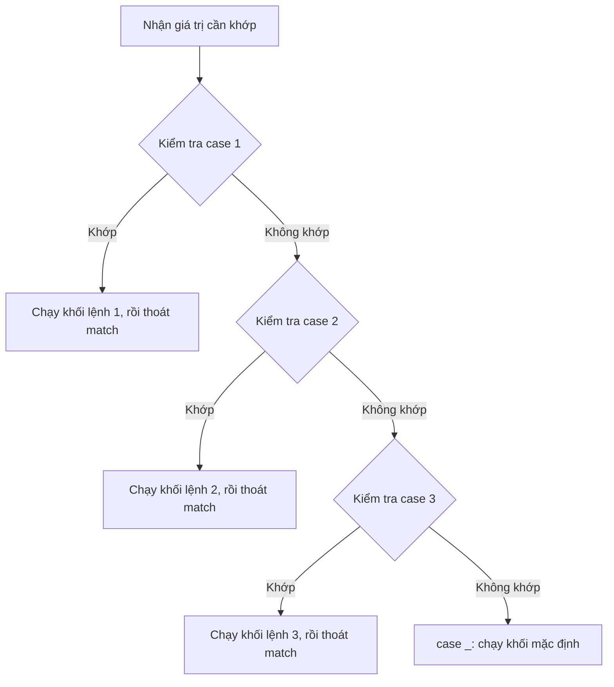

<!-- TỰ ĐỘNG ĐỒNG BỘ từ 01-Co-Ban/09-Match-Case/bai.md — đừng sửa trực tiếp, sửa bản chính rồi chạy tools/sync_tracks.py -->

# Bài 9 — Câu Lệnh Match – Case

> 🎓 **Chương 3 – Ra quyết định với câu lệnh điều kiện**

## 🧠 Điều kiện tiên quyết

- [Bài 8 — Câu Lệnh If – Cấu Trúc Rẽ Nhánh](../08-Cau-Lenh-If/bai.md)

---

## 🎯 Mục tiêu

Sau bài học này, học viên sẽ:

* ✅ Hiểu **match-case là gì** và khi nào nên dùng nó thay cho `if-elif-else`.
* ✅ Viết được câu lệnh `match ... case ...` cơ bản với đúng cú pháp.
* ✅ Dùng **`case _`** để xử lý trường hợp "không khớp gì cả" (mặc định).
* ✅ Dùng dấu **`|`** để khớp **một case với nhiều giá trị**.
* ✅ So sánh được ưu – nhược điểm của `match-case` với `if-elif-else` để chọn đúng công cụ.
* ✅ Biết **`match-case` chỉ chạy được trên Python 3.10 trở lên** và cách kiểm tra phiên bản.
* ✅ Vận dụng vào các bài toán thực tế: menu máy tính, số ngày trong tháng, trò oẳn tù tì.

> ⚠️ **Lưu ý quan trọng:** `match-case` là tính năng **mới từ Python 3.10**. Nếu bạn dùng Python 3.9 trở xuống, hãy cài bản mới hơn theo [Bài 2: Cài đặt Python](../02-Cai-Dat-Python/bai.md) hoặc kiểm tra bằng lệnh `python --version`.

---

## 📖 Kiến thức

### 1. Ôn nhanh bài trước: `if-elif-else`

Ở bài 8, chúng ta đã biết cách kiểm tra điều kiện bằng `if`, `elif`, `else`:

```python
thu = 3
if thu == 2:
    print("Thứ Hai")
elif thu == 3:
    print("Thứ Ba")
else:
    print("Ngày khác")
```

Cách này **linh hoạt** vì so sánh được mọi biểu thức (`>`, `<`, `and`, `or`...), nhưng khi phải kiểm tra **một biến với rất nhiều giá trị cụ thể**, chuỗi `if-elif` trở nên dài dòng và khó đọc.

### 2. Đặt vấn đề: vì sao cần match-case?

> 💬 **Ví dụ đời thực:** Điều tra viên nhận một **thẻ căn cước** và phải xác định tỉnh/thành theo mã số. Có 63 mã — nếu viết bằng 63 lệnh `if-elif` thì bảng điều tra dày như cuốn danh bạ điện thoại! `match-case` giống như một **bảng tra cứu** được thiết kế riêng cho việc này.

`match-case` (còn gọi là **structural pattern matching** — khớp mẫu cấu trúc) ra đời để giải quyết chính xác tình huống đó: **so khớp một giá trị với danh sách các mẫu cố định**, code gọn gàng hơn, dễ đọc hơn.

### 3. Cú pháp cơ bản

```python
gia_tri = 1          # giá trị bất kỳ để thử
match gia_tri:
    case 1:
        pass  # Khối lệnh khi gia_tri == 1
    case 2:
        pass  # Khối lệnh khi gia_tri == 2
    case _:
        pass  # Khối lệnh khi không khớp mẫu nào ở trên
```

**Giải thích các thành phần:**

| Thành phần | Ý nghĩa |
|---|---|
| `match gia_tri:` | Giá trị cần so khớp (số, chuỗi, biến...) — có thể là biểu thức |
| `case mau:` | Mỗi `case` là một **mẫu** (pattern) cần kiểm tra |
| `case _:` | Mẫu **mặc định** — khớp mọi giá trị, đặt **cuối cùng** như `else` |
| Thụt lề | Giống `if`, khối lệnh sau `case` phải thụt lề (1 tab hoặc 4 dấu cách) |

> 💡 **Không giống C/Java:** Python `match-case` **không cần `break`** ở cuối mỗi `case` — sau khi thực hiện xong khối lệnh, chương trình **tự động thoát khỏi câu match**. Điều này giúp tránh lỗi "tràn case" kinh điển của `switch` trong ngôn ngữ khác.



### 4. `case _` — mẫu mặc định

`case _` đóng vai trò như `else` trong `if-else`: chạy khi **không có mẫu nào ở trên khớp**.

> 💬 **Ví dụ đời thực:** Trong câu hỏi trắc nghiệm, đáp án nằm trong A, B, C, D — chọn X thì máy báo "Đáp án không hợp lệ". `case _` chính là câu báo đó.

```python
lua_chon = "X"
match lua_chon:
    case "A":
        print("Bạn chọn A")
    case "B":
        print("Bạn chọn B")
    case _:
        print("Lựa chọn không hợp lệ!")
```

### 5. Một case khớp nhiều giá trị bằng dấu `|`

Nếu nhiều giá trị cùng chung một hành động, gộp chúng lại bằng dấu **`|`** (đọc là "hoặc"):

```python
ky_tu = "a"          # Ví dụ: ký tự cần kiểm tra
match ky_tu:
    case "a" | "e" | "i" | "o" | "u":
        print("Đây là nguyên âm")
    case _:
        print("Đây là phụ âm")
```

> ⚠️ **Chú ý:** Dùng dấu `|` (dấu sổ thẳng trên bàn phím, phím `\` giữ `Shift`), **không phải** từ `or` của Python! `case "a" or "e":` sẽ **sai** và báo lỗi.

### 6. So sánh `if-elif` với `match-case`

| Tiêu chí | `if-elif-else` | `match-case` |
|---|---|---|
| Điều kiện | Mọi biểu thức so sánh (`>`, `<`, `and`...) | So khớp giá trị với mẫu cụ thể |
| Nhiều giá trị cùng nhánh | Phải viết `x == 2 or x == 3` hoặc `x in (2, 3)` | Gọn: `case 2 \| 3:` |
| Trường hợp mặc định | `else:` | `case _:` |
| Đọc code khi nhiều lựa chọn | Dài, dễ rối | Ngắn, "bảng tra cứu" trực quan |
| Phiên bản | Mọi Python 3 | **Chỉ Python 3.10+** |
| Ưu thế | Linh hoạt cho điều kiện phức tạp | Nhanh viết, dễ đọc khi so giá trị cố định |

> 💡 **Quy tắc vàng:** Nếu bạn đang viết **từ 3 `elif` trở lên** chỉ để so một biến với các **giá trị cụ thể** (số, chuỗi), hãy nghĩ đến `match-case`. Nếu điều kiện là khoảng giá trị (`x > 5`, `60 <= diem < 80`) thì cứ dùng `if-elif` — `match-case` không giỏi việc này (trừ khi dùng "guard", xem phần Ví dụ nâng cao).

### 7. Kiểm tra phiên bản Python của bạn

Gõ lệnh sau trong Command Prompt / Terminal:

```bash
python --version
```

* Nếu hiển thị `Python 3.10.x` trở lên → **dùng được** `match-case`.
* Nếu hiển thị `Python 3.9.x` hoặc thấp hơn → hãy cài đặt lại bản mới nhất theo bài 2.

---

## 💡 Ví dụ minh họa

### Ví dụ 1: Xác định thứ trong tuần

Nhập một số từ 1 đến 7, in ra thứ tương ứng (1 = Chủ nhật, 2 = Thứ Hai, ..., 7 = Thứ Bảy).

```python
# Nhập số thứ trong tuần (bài 7 đã học input + int)
so = int(input("Nhập số thứ trong tuần (1-7): "))

# So khớp số vừa nhập với các mẫu
match so:
    case 1:
        print("Chủ nhật")
    case 2:
        print("Thứ Hai")
    case 3:
        print("Thứ Ba")
    case 4:
        print("Thứ Tư")
    case 5:
        print("Thứ Năm")
    case 6:
        print("Thứ Sáu")
    case 7:
        print("Thứ Bảy")
    case _:
        print("Số không hợp lệ!")
```

**Giải thích từng dòng:**

| Dòng code | Ý nghĩa |
|---|---|
| `so = int(input(...))` | Nhập chữ từ bàn phím rồi đổi thành số nguyên |
| `match so:` | Bắt đầu khớp giá trị của biến `so` |
| `case 1: ... case 7:` | Mỗi số từ 1–7 có một mẫu và một câu trả lời riêng |
| `case _:` | Số ngoài 1–7 (ví dụ 0, 9) sẽ rơi vào đây |

> 💡 Nếu nhập `4`, Python kiểm tra `case 1`? Không khớp. `case 2`? Không. ... `case 4`? **Khớp** → in "Thứ Tư" → **thoát ngay**, không kiểm tra tiếp.

### Ví dụ 2: Số ngày trong tháng

In ra số ngày của tháng đã nhập (không tính năm nhuận).

```python
# Nhập tháng
thang = int(input("Nhập tháng (1-12): "))

# So khớp tháng với số ngày tương ứng
match thang:
    case 2:
        print("Tháng 2 có 28 ngày")
    case 4 | 6 | 9 | 11:   # Các tháng 30 ngày
        print(f"Tháng {thang} có 30 ngày")
    case 1 | 3 | 5 | 7 | 8 | 10 | 12:   # Các tháng 31 ngày
        print(f"Tháng {thang} có 31 ngày")
    case _:
        print("Tháng không hợp lệ!")
```

**Giải thích từng dòng:**

| Dòng code | Ý nghĩa |
|---|---|
| `case 4 \| 6 \| 9 \| 11:` | Gộp 4 tháng 30 ngày vào **một** case bằng dấu `\|` |
| `case 1 \| 3 \| 5 \| 7 \| 8 \| 10 \| 12:` | Gộp 7 tháng 31 ngày vào một case |
| `f"Tháng {thang}..."` | Chuỗi f-string — tự chèn giá trị `thang` vào trong chữ |
| `case _:` | Tháng 0 hoặc 13, 14... → báo lỗi |

> 💡 Nếu không có `|`, bài này cần **11 lệnh elif** — đúng lúc thấy sức mạnh của match-case!

### Ví dụ 3: Phân loại kích cỡ áo

```python
# Người dùng nhập tên kích cỡ
size = input("Nhập kích cỡ (S, M, L, XL, XXL): ").upper()

# So khớp chuỗi nhập vào
match size:
    case "S":
        print("Kích cỡ nhỏ — dành cho người gầy")
    case "M":
        print("Kích cỡ trung bình")
    case "L":
        print("Kích cỡ lớn")
    case "XL" | "XXL":
        print("Kích cỡ rất lớn")
    case _:
        print("Không có kích cỡ này trong kho!")
```

**Giải thích từng dòng:**

| Dòng code | Ý nghĩa |
|---|---|
| `.upper()` | Chuyển chữ thành **in hoa** để nhận cả `s`, `S` |
| `case "S":` | So khớp **chuỗi** — match-case làm việc tốt với cả số lẫn chữ |
| `case "XL" \| "XXL":` | Hai kích cỡ "rất lớn" dùng chung một nhánh |

---

## 🔬 Ví dụ nâng cao

### Ví dụ 1: Menu máy tính mini

Chương trình nhận phép toán `+`, `-`, `*`, `/` và hai số, in ra kết quả:

```python
# Nhập hai số và phép toán
a = float(input("Nhập số thứ nhất: "))
b = float(input("Nhập số thứ hai: "))
phep_toan = input("Nhập phép toán (+, -, *, /): ")

# So khớp ký tự phép toán
match phep_toan:
    case "+":
        print(f"{a} + {b} = {a + b}")
    case "-":
        print(f"{a} - {b} = {a - b}")
    case "*":
        print(f"{a} * {b} = {a * b}")
    case "/":
        if b == 0:  # Kiểm tra chia cho 0 bằng if bên trong case
            print("Không thể chia cho 0!")
        else:
            print(f"{a} / {b} = {a / b}")
    case _:
        print("Phép toán không hợp lệ!")
```

**Giải thích:**
* Mỗi `case` ứng với một phép toán — đọc menu như một "bảng điều khiển".
* Trong `case "/":` ta vẫn được **kết hợp với `if`** để chặn lỗi chia cho 0 — match-case không cấm dùng `if` bên trong khối lệnh.
* `case _` bắt mọi ký tự khác như `^`, `%`, chữ...

### Ví dụ 2: Trò oẳn tù tì (kéo – búa – bao)

Luật: `kéo` thắng `bao`, `bao` thắng `búa`, `búa` thắng `kéo`; chọn giống nhau là hòa.

```python
# Người chơi chọn; máy chọn cố định là "búa" để dễ kiểm tra
nguoi_choi = input("Bạn chọn: kéo, búa hay bao? ").lower()
may_choi = "búa"

print(f"Bạn chọn: {nguoi_choi} — Máy chọn: {may_choi}")

# So khớp cặp lựa chọn (bộ giá trị) để tìm người thắng
match (nguoi_choi, may_choi):
    case ("kéo", "búa") | ("búa", "bao") | ("bao", "kéo"):
        print("Bạn thua!")
    case ("kéo", "bao") | ("búa", "kéo") | ("bao", "búa"):
        print("Bạn thắng!")
    case ("kéo", "kéo") | ("búa", "búa") | ("bao", "bao"):
        print("Hòa nhau!")
    case _:
        print("Bạn nhập không đúng kéo/búa/bao!")
```

**Giải thích:**
* `match (nguoi_choi, may_choi):` — đây là **so khớp bộ giá trị (tuple)** — Python ghép hai biến thành một cặp rồi so mẫu.
* `case ("kéo", "búa")` — mẫu khớp đúng khi người chơi chọn kéo **và** máy chọn búa.
* Dấu `|` gộp 3 trường hợp thua / thắng / hòa lại — code chỉ 4 case mà giải quyết đủ 9 khả năng!
* Đây là kỹ thuật **so khớp cấu trúc** — điều mà `if-elif` viết rất rối (`if nguoi == "kéo" and may == "búa" or ...`).

### Ví dụ 3: Xếp loại điểm kèm "guard" (bộ lọc)

`case` có thể kèm điều kiện bổ sung bằng từ khóa `if` — gọi là **guard** (bộ lọc):

```python
# Nhập điểm trung bình
diem = float(input("Nhập điểm trung bình (0-10): "))

# Dùng match-case kèm guard để xử lý khoảng giá trị
match diem:
    case _ if diem >= 9:
        print("Xếp loại: Xuất sắc")
    case _ if diem >= 8:
        print("Xếp loại: Giỏi")
    case _ if diem >= 6.5:
        print("Xếp loại: Khá")
    case _ if diem >= 5:
        print("Xếp loại: Trung bình")
    case _ if diem >= 0:
        print("Xếp loại: Yếu")
    case _:
        print("Điểm không hợp lệ!")
```

**Giải thích:**
* `case _ if diem >= 9:` — mẫu `_` khớp mọi giá trị, nhưng **guard** `if diem >= 9` kiểm tra thêm; chỉ khi cả hai đều "đúng" thì case mới được chọn.
* Các case được xét **từ trên xuống**: điểm 8.5 không đạt guard đầu (≥9), rơi xuống guard `>= 8` → "Giỏi".
* Nhờ guard, match-case xử lý được cả **khoảng giá trị** — khi đó nó là cách viết gọn hơn của `elif` đơn giản.
* `case _` cuối cùng bắt điểm âm (dưới 0) hoặc trên 10.

> ⚠️ **Khi nào KHÔNG nên dùng match-case:** với điều kiện phức tạp kết hợp nhiều biến như `if tuoi >= 18 and gioi_tinh == "Nu"`, dùng `if-elif` vẫn sáng sủa hơn. Match-case tỏa sáng khi **một giá trị so với nhiều giá trị cố định** hoặc **so khớp cấu trúc**.

---

## ⚠️ Lỗi thường gặp

### Lỗi 1: Chạy trên Python 3.9 trở xuống

```python
match x:   # ❌ LỖI trên Python 3.9
    case 1:
        print("Một")
```

* **Nguyên nhân:** `match-case` chỉ xuất hiện từ **Python 3.10**.
* **Kết quả báo:** `SyntaxError: invalid syntax` ngay tại dòng `match`.
* **Cách sửa:** Cập nhật Python lên 3.10+ (xem lại bài 2), kiểm tra bằng `python --version`.

### Lỗi 2: Quên dấu hai chấm hoặc thụt lề sai

```python
match x     # ❌ Thiếu dấu :
    case 1   # ❌ Sai chỗ case
    print("Một")   # ❌ Thiếu thụt lề so với case
```

* **Nguyên nhân:** Cũng như `if`, `match` và `case` bắt buộc có `:` và khối lệnh con phải thụt lề đều.
* **Kết quả báo:** `SyntaxError: expected ':'` hoặc `IndentationError`.
* **Cách sửa:** Viết đúng:

```python
x = 1          # Giá trị cần kiểm tra
match x:
    case 1:
        print("Một")
```

### Lỗi 3: Dùng `or` thay vì `|`

```python
case "a" or "e":   # ❌ SAI — match-case không hiểu từ or
```

* **Nguyên nhân:** Trong mẫu, từ `or` không có ý nghĩa; phải dùng dấu **`|`** (phím sổ thẳng, giữ Shift + `\`).
* **Cách sửa:** `case "a" | "e":`

### Lỗi 4: Nhầm tưởng `case x:` so sánh với biến `x`

```python
tieu_chuan = 5
match so:
    case tieu_chuan:   # ❌ KHÔNG so sánh so == 5
        print("Đúng!")
```

* **Nguyên nhân:** Trong match-case, một **tên thường đứng một mình** là **biến mẫu (capture)** — nó *bắt lấy* giá trị bất kỳ và gán vào biến đó, chứ không so sánh!
* **Kết quả:** Case này khớp **mọi giá trị** — chương trình chạy sai lặng lẽ.
* **Cách sửa:** Nếu muốn so sánh với giá trị cố định, viết hằng số trực tiếp `case 5:` hoặc dùng guard `case _ if so == tieu_chuan:`.

### Lỗi 5: Quên `case _` khi giá trị không hợp lệ

```python
match thang:
    case 2:
        print("28 ngày")
    case 4 | 6 | 9 | 11:
        print("30 ngày")
    # ❌ Thiếu case _ — nhập tháng 13 sẽ "im lặng", không làm gì
```

* **Nguyên nhân:** Không có `case _` thì giá trị không khớp bị **bỏ qua âm thầm**.
* **Cách sửa:** Luôn đặt `case _:` ở cuối để báo lỗi hoặc xử lý mặc định — thói quen tốt như luôn viết `else`.

---

## 💎 Mẹo

* 🎯 **Đặt `case _` ở vị trí cuối cùng** — đặt sai giữa chừng thì các case phía sau không bao giờ chạy.
* 🔤 **Chuẩn hóa dữ liệu trước khi khớp:** dùng `.lower()` / `.upper()` / `.strip()` cho chuỗi nhập từ bàn phím để khớp chính xác.
* 🗂️ **Gộp nhóm bằng `|`:** từ 2 giá trị trở lên có cùng hành động → gộp một case, code giảm một nửa.
* 🧩 **Nghĩ đến bộ giá trị:** khi kết quả phụ thuộc **hai** yếu tố (người chơi & máy, tháng & ngày), hãy `match (a, b):` — mạnh hơn nhiều chuỗi `if and`.
* 📏 **Guard cho khoảng giá trị:** cần so sánh `>=`, `<` với match-case thì dùng `case _ if ...:`.
* ❓ **Hỏi mình trước khi viết:** "Mình có đang so một biến với nhiều giá trị cố định không?" Nếu **có** → match-case. Nếu là điều kiện phức tạp → if-elif.
* 🏷️ **Phân biệt:** `match` là *từ khóa mềm* — nó chỉ có nghĩa khi đứng đầu câu lệnh khối, vì vậy vẫn đặt được tên biến `match` (nhưng đừng lạm dụng cho dễ nhầm!).

---

## 📝 Tóm tắt

| Khái niệm | Nội dung |
|---|---|
| 🔀 `match gtri:` | Bắt đầu so khớp giá trị với các mẫu |
| 📦 `case mau:` | Một mẫu cần kiểm tra; khớp thì chạy khối lệnh rồi **thoát ngay** |
| ⬛ `case _:` | Mẫu mặc định (như `else`) — đặt cuối cùng |
| 🔗 `a \| b` | Một case khớp **nhiều giá trị** ("hoặc") |
| 🧱 `match (a, b):` | So khớp bộ giá trị (tuple) — kết hợp nhiều biến |
| 🚦 `case _ if đk:` | **Guard** — case chỉ chạy khi điều kiện bổ sung đúng |
| 🐍 Phiên bản | **Chỉ Python 3.10+** — kiểm tra bằng `python --version` |
| ⚖️ So với if-elif | Dùng khi so giá trị cố định; if-elif dùng khi điều kiện phức tạp |

---

## 🧪 Kiểm tra nhanh

1. ❓ `match-case` được giới thiệu từ phiên bản Python nào?
2. ❓ Viết cú pháp `match` cho biến `luachon` với 2 case `"A"`, `"B"` và 1 case mặc định.
3. ❓ `case _` có vai trò gì? Nó nên đặt ở đâu?
4. ❓ Dấu nào dùng để gộp nhiều giá trị trong một case?
5. ❓ Đúng hay sai: Sau mỗi case phải ghi `break` như trong C/Java?
6. ❓ `case "a" or "e":` đúng hay sai? Vì sao?
7. ❓ Lệnh nào kiểm tra phiên bản Python đang dùng?
8. ❓ Khi nào nên dùng `if-elif` thay vì `match-case`?
9. ❓ Điều gì xảy ra nếu nhập giá trị không khớp case nào mà không có `case _`?
10. ❓ Viết một case khớp các tháng có 30 ngày.

<details>
<summary>🔍 Xem đáp án</summary>

1. Python 3.10 (năm 2021).
2. `match luachon: case "A": ... case "B": ... case _: ...`
3. Xử lý "không khớp gì cả" (giống `else`); đặt ở cuối cùng.
4. Dấu `|` (sổ thẳng), ví dụ `case 2 | 4 | 6:`.
5. Sai — Python tự động thoát sau khi khối case chạy xong.
6. Sai — phải viết `case "a" | "e":`; từ `or` không có nghĩa trong mẫu.
7. `python --version`.
8. Khi điều kiện phức tạp (so sánh khoảng, kết hợp nhiều biến như `and`/`or`).
9. Chương trình không làm gì — im lặng bỏ qua.
10. `case 4 | 6 | 9 | 11:`.

</details>

---

## 📚 Bài đọc thêm

* [Python.org – PEP 634: Structural Pattern Matching (tài liệu gốc)](https://peps.python.org/pep-0634/)
* [Python.org – Tutorial: match statement](https://docs.python.org/3/tutorial/controlflow.html#match-statements)
* [Real Python – Structural Pattern Matching in Python](https://realpython.com/python310-new-features/#structural-pattern-matching)
* [GeeksforGeeks – Python match-case](https://www.geeksforgeeks.org/python-match-case-statement/)
* [Wikipedia – Structural pattern matching](https://en.wikipedia.org/wiki/Pattern_matching)

---

---

## 🧩 Bài tập

> 📝 🎯 **Chủ đề:** So khớp nhiều giá trị bằng `match-case`, dấu `|`, `case _`, guard, khớp bộ giá trị.

## 🟢 Dễ (Bài 1 – 7)

### Bài 1: Thứ trong tuần

* **Đề bài:** Nhập một số nguyên từ 1 đến 7, in ra thứ tương ứng (1 = Chủ nhật, 2 = Thứ Hai, ..., 7 = Thứ Bảy). Số khác thì in `So khong hop le!`.
* **Input:** Một số nguyên.
* **Output:** Tên thứ trong tuần.
* **Ví dụ:**
  ```
  Nhập số (1-7): 3
  Thứ Ba
  ```
* **Gợi ý:** Dùng `match so:` với 7 case, case cuối là `case _:`.

### Bài 2: Số ngày trong tháng

* **Đề bài:** Nhập một tháng (1–12), in ra số ngày của tháng đó (tháng 2 tính 28 ngày, không xét năm nhuận).
* **Input:** Một số nguyên từ 1 đến 12.
* **Output:** Số ngày của tháng.
* **Ví dụ:**
  ```
  Nhập tháng: 4
  Tháng 4 có 30 ngày
  ```
* **Gợi ý:** Gộp các tháng 30 ngày bằng `case 4 | 6 | 9 | 11:`.

### Bài 3: Điểm chữ

* **Đề bài:** Nhập một chữ cái A, B, C, D hoặc F, in ra nhận xét tương ứng (ví dụ A → `Xuat sac`, B → `Gioi`, C → `Kha`, D → `Trung binh`, F → `Khong dat`).
* **Input:** Một chữ cái (có thể viết thường).
* **Output:** Nhận xét xếp loại.
* **Ví dụ:**
  ```
  Nhập điểm chữ: b
  Gioi
  ```
* **Gợi ý:** Dùng `.upper()` để nhận cả chữ thường lẫn chữ hoa.

### Bài 4: Menu món ăn trưa

* **Đề bài:** Căn tin có menu: `1. Pho`, `2. Bun`, `3. Com`, `4. My xao`. Nhập số 1–4, in tên món đã chọn; nhập khác thì in `Mon khong co trong menu!`.
* **Input:** Số nguyên 1–4.
* **Output:** Tên món ăn.
* **Ví dụ:**
  ```
  Nhập lựa chọn (1-4): 2
  Ban chon: Bun
  ```
* **Gợi ý:** Mỗi case in ra một món.

### Bài 5: Kích cỡ áo

* **Đề bài:** Nhập kích cỡ `S`, `M`, `L`, `XL`, in ra số đo tương ứng: S = 36, M = 38, L = 40, XL = 42. Kích cỡ khác in `Khong co kich co nay`.
* **Input:** Chuỗi kích cỡ (có thể viết thường).
* **Output:** Số đo hoặc thông báo lỗi.
* **Ví dụ:**
  ```
  Nhập kích cỡ: l
  Kich co L - so do 40
  ```
* **Gợi ý:** `case "XL" | "xl":` hoặc chuẩn hóa bằng `.upper()` trước khi match.

### Bài 6: Chào hỏi bằng nhiều ngôn ngữ

* **Đề bài:** Nhập tên ngôn ngữ `viet`, `anh`, `phap`, `nhat`, in ra lời chào tương ứng (Xin chào / Hello / Bonjour / Konnichiwa). Khác → `Chua ho tro ngon ngu nay!`.
* **Input:** Tên ngôn ngữ.
* **Output:** Lời chào.
* **Ví dụ:**
  ```
  Nhập ngôn ngữ (viet/anh/phap/nhat): anh
  Hello!
  ```
* **Gợi ý:** Match trên chuỗi trực tiếp.

### Bài 7: Mùa trong năm

* **Đề bài:** Nhập tháng (1–12), in ra mùa: tháng 12, 1, 2 → Mùa đông; 3, 4, 5 → Mùa xuân; 6, 7, 8 → Mùa hè; 9, 10, 11 → Mùa thu. Khác → `Thang khong hop le!`.
* **Input:** Số nguyên.
* **Output:** Tên mùa.
* **Ví dụ:**
  ```
  Nhập tháng: 6
  Mùa hè
  ```
* **Gợi ý:** Mỗi mùa gộp 3 tháng bằng dấu `|`.

---

## 🟡 Trung bình (Bài 8 – 14)

### Bài 8: Máy tính hai số

* **Đề bài:** Nhập hai số và một phép toán (`+`, `-`, `*`, `/`), in ra kết quả. Nếu phép toán không hợp lệ → `Phep toan khong hop le!`. Nếu chia cho 0 → `Khong the chia cho 0!`.
* **Input:** Hai số thực và một ký tự phép toán.
* **Output:** Kết quả phép tính.
* **Ví dụ:**
  ```
  Nhập số thứ nhất: 10
  Nhập số thứ hai: 4
  Nhập phép toán (+, -, *, /): /
  10.0 / 4.0 = 2.5
  ```
* **Gợi ý:** Trong `case "/":` dùng `if b == 0` để kiểm tra.

### Bài 9: Xếp loại điểm trung bình

* **Đề bài:** Nhập điểm trung bình (0–10), xếp loại: >= 9 → `Xuat sac`, >= 8 → `Gioi`, >= 6.5 → `Kha`, >= 5 → `Trung binh`, >= 0 → `Yeu`, ngoài khoảng → `Diem khong hop le!`.
* **Input:** Số thực.
* **Output:** Xếp loại.
* **Ví dụ:**
  ```
  Nhập điểm trung bình: 8.2
  Gioi
  ```
* **Gợi ý:** Dùng guard: `case _ if diem >= 9:`.

### Bài 10: Số ngày trong tháng (có năm nhuận)

* **Đề bài:** Nhập tháng và năm, in số ngày. Tháng 2: 29 ngày nếu năm nhuận (chia hết cho 400, hoặc chia hết cho 4 mà không chia hết cho 100), ngược lại 28 ngày.
* **Input:** Tháng (1–12) và năm nguyên dương.
* **Output:** Số ngày của tháng đó.
* **Ví dụ:**
  ```
  Nhập tháng: 2
  Nhập năm: 2024
  Tháng 2 năm 2024 có 29 ngày
  ```
* **Gợi ý:** Trong `case 2:` dùng `if` kiểm tra năm nhuận; các tháng khác như bài 2.

### Bài 11: Đổi ngoại tệ

* **Đề bài:** Nhập mã tiền tệ `USD` (1 USD = 25 000 VND), `EUR` (1 EUR = 27 000 VND), `JPY` (1 JPY = 170 VND) và số tiền ngoại tệ; in ra số VND tương ứng. Mã khác → `Ma tien te khong hop le!`.
* **Input:** Mã tiền tệ và số tiền cần đổi.
* **Output:** Số tiền quy đổi ra VND.
* **Ví dụ:**
  ```
  Nhập mã tiền tệ: usd
  Nhập số tiền: 2
  2 USD = 50000 VND
  ```
* **Gợi ý:** Chuẩn hóa mã bằng `.upper()`; giá trị mỗi case là tỉ giá khác nhau.

### Bài 12: Xếp loại học lực (điểm + hạnh kiểm)

* **Đề bài:** Nhập điểm trung bình (0–10) và hạnh kiểm (`Tot`, `Kha`, `Yeu`). Xếp loại: hạnh kiểm Yếu → `Khen thuong: Khong`; hạnh kiểm Tốt và điểm >= 8 → `Khen thuong: Gioi`; hạnh kiểm Khá và điểm >= 8 → `Khen thuong: Kha`; còn lại → `Khen thuong: Trung binh`.
* **Input:** Điểm (float) và hạnh kiểm (chuỗi).
* **Output:** Mức khen thưởng.
* **Ví dụ:**
  ```
  Nhập điểm: 8.5
  Nhập hạnh kiểm: Tot
  Khen thuong: Gioi
  ```
* **Gợi ý:** `match (diem, hanh_kiem):` với mẫu `(_, "Yeu")` — dấu `_` trong bộ giá trị khớp mọi điểm.

### Bài 13: Vé máy bay

* **Đề bài:** Nhập hạng vé `economy`, `business`, `first` và số lượng vé. Giá: economy 1000, business 3500, first 8000 (ngàn đồng). In tổng tiền; hạng không hợp lệ → `Hang ve khong hop le!`.
* **Input:** Hạng vé (chuỗi) và số lượng (số nguyên).
* **Output:** Tổng tiền.
* **Ví dụ:**
  ```
  Nhập hạng vé: business
  Nhập số lượng vé: 2
  Tổng tiền: 7000 ngàn đồng
  ```
* **Gợi ý:** Gán giá trong từng case rồi in phép nhân; dùng `.lower()`.

### Bài 14: Cung hoàng đạo (theo tháng)

* **Đề bài:** Nhập tháng sinh (1–12), in cung hoàng đạo theo quy tắc đơn giản sau (chỉ theo tháng): tháng 1 → `Bao Binh`, tháng 2 → `Song Ngu`, tháng 3 → `Bach Duong`, tháng 4 → `Kim Nguu`, tháng 5 → `Song Tu`, tháng 6 → `Cu Giai`, tháng 7 → `Su Tu`, tháng 8 → `Xu Nu`, tháng 9 → `Thien Binh`, tháng 10 → `Thien Yet`, tháng 11 → `Nhan Ma`, tháng 12 → `Ma Ket`.
* **Input:** Số nguyên 1–12.
* **Output:** Tên cung hoàng đạo.
* **Ví dụ:**
  ```
  Nhập tháng sinh: 9
  Cung của bạn: Thien Binh
  ```
* **Gợi ý:** 12 case đơn giản, case cuối là `case _:`.

---

## 🔴 Khó (Bài 15 – 20)

### Bài 15: Oẳn tù tì

* **Đề bài:** Người chơi nhập `kéo`, `búa` hoặc `bao`; máy luôn chọn `búa`. In kết quả thắng/thua/hòa theo luật: kéo thắng bao, bao thắng búa, búa thắng kéo; giống nhau thì hòa. Nhập khác → `Nhap khong dung!`.
* **Input:** Chuỗi lựa chọn của người chơi.
* **Output:** Kết quả ván chơi.
* **Ví dụ:**
  ```
  Bạn chọn (kéo/búa/bao): bao
  Máy chọn: búa
  Bạn thắng!
  ```
* **Gợi ý:** `match (nguoi, "búa"):` với 3 cặp thua, 3 cặp thắng, 3 cặp hòa gộp bằng `|`.

### Bài 16: Cung hoàng đạo (theo ngày + tháng)

* **Đề bài:** Nhập ngày và tháng sinh, in đúng cung hoàng đạo theo ranh giới ngày:
  * Bảo Bình (20/1 – 18/2), Song Ngư (19/2 – 20/3), Bạch Dương (21/3 – 19/4), Kim Ngưu (20/4 – 20/5), Song Tử (21/5 – 21/6), Cự Giải (22/6 – 22/7), Sư Tử (23/7 – 22/8), Xử Nữ (23/8 – 22/9), Thiên Bình (23/9 – 22/10), Thiên Yết (23/10 – 21/11), Nhân Mã (22/11 – 21/12), Ma Kết (22/12 – 19/1).
* **Input:** Ngày và tháng sinh (giả định hợp lệ).
* **Output:** Tên cung hoàng đạo.
* **Ví dụ:**
  ```
  Nhập ngày sinh: 15
  Nhập tháng sinh: 8
  Cung của bạn: Su Tu
  ```
* **Gợi ý:** `match (thang, ngay):` — mỗi tháng 1–2 case kèm guard so sánh ngày, ví dụ `case (1, _) if ngay >= 20:`.

### Bài 17: Tiền điện bậc thang

* **Đề bài:** Nhập số kWh tiêu thụ, tính tiền điện theo bậc: 0–50 kWh: 2000đ/kWh; 51–100 kWh: 2500đ/kWh; trên 100 kWh: 3000đ/kWh. In tổng tiền; số âm → `So lieu khong hop le!`.
* **Input:** Số thực (kWh).
* **Output:** Số tiền phải trả (đồng).
* **Ví dụ:**
  ```
  Nhập số điện tiêu thụ (kWh): 65
  Số tiền phải trả: 162500.0 đồng
  ```
* **Gợi ý:** Dùng guard: `case _ if so_kwh <= 50:` (công thức: 50×2000 + (số còn lại)×2500).

### Bài 18: Máy tính nâng cao

* **Đề bài:** Nhập hai số và phép toán `+`, `-`, `*`, `/`, `//` (chia nguyên), `%` (chia dư), `**` (lũy thừa). In kết quả; phép toán khác → `Phep toan khong hop le!`; chia cho 0 → `Khong the chia cho 0!`.
* **Input:** Hai số và một chuỗi phép toán.
* **Output:** Kết quả.
* **Ví dụ:**
  ```
  Nhập số thứ nhất: 7
  Nhập số thứ hai: 3
  Nhập phép toán: //
  7 // 3 = 2
  ```
* **Gợi ý:** Match chuỗi phép toán; kiểm tra `b == 0` trong các case có chia.

### Bài 19: Đặt món tại nhà hàng

* **Đề bài:** Nhà hàng có menu: món chính (1. Phở 35k, 2. Cơm gà 40k, 3. Bún 30k), size (S = 1 lần, L = 1.5 lần giá), đồ uống (1. Trà đá 5k, 2. Nước ngọt 10k, 3. Cà phê 15k). Nhập lần lượt món chính, size, đồ uống; in tổng tiền hóa đơn.
* **Input:** Số món chính, chuỗi size, số đồ uống.
* **Output:** Tổng tiền.
* **Ví dụ:**
  ```
  Món chính (1-3): 2
  Size (S/L): L
  Đồ uống (1-3): 3
  Tổng tiền: 75.0 ngàn đồng
  ```
* **Gợi ý:** Ba khối `match` liên tiếp, mỗi khối gán giá tiền vào một biến, cuối cùng tính tổng.

### Bài 20: Máy bán nước tự động

* **Đề bài:** Máy bán nước có 4 sản phẩm: 1. Trà đá 5k, 2. Coca 10k, 3. Nước cam 15k, 4. Cà phê 12k. Người mua nhập số sản phẩm, nhập số tiền bỏ vào (chẵn nghìn). Nếu tiền không đủ → `Thieu tien!`; đủ thì in tên món, giá và tiền thừa; số sản phẩm sai → `San pham khong ton tai!`.
* **Input:** Số sản phẩm (1–4) và số tiền (số nguyên).
* **Output:** Kết quả giao dịch.
* **Ví dụ:**
  ```
  Chọn sản phẩm (1-4): 3
  Nhập số tiền: 20000
  Ban mua: Nuoc cam - 15000 đồng
  Tiền thừa: 5000 đồng
  ```
* **Gợi ý:** Gán giá vào biến trong từng case, `case _` bắt sản phẩm sai; sau match dùng `if` so sánh tiền với giá.

---

## 🎯 Tổng kết sau khi làm bài

Sau 20 bài tập, bạn đã:

* ✅ Viết thành thạo `match-case` với `case`, `case _`, dấu `|`.
* ✅ Xử lý được chuỗi nhập vào bằng `.upper()` / `.lower()`.
* ✅ Dùng guard `case _ if ...` cho bài toán khoảng giá trị.
* ✅ Khớp **bộ giá trị** `match (a, b):` để giải quyết bài toán nhiều biến.
* ✅ Kết hợp match-case với `if` bên trong case để kiểm tra thêm.

> 💪 Chưa tự làm được bài nào thì đừng lo — hãy xem lại bài giảng rồi quay lại. **Lập trình là luyện tập!**

---

## ✅ Đáp án

> 💡 **Hãy tự làm bài tập trước** rồi mới mở đáp án.

## 🟢 Dễ (Bài 1 – 7)


<details>
<summary>✅ Bài 1: Thứ trong tuần</summary>


**Phân tích:** Nhập số 1–7 và ánh xạ sang tên thứ — bài toán "so khớp giá trị cố định" kinh điển, rất hợp với match-case.

**Ý tưởng:** Một `match` với 7 case; case ngoài 1–7 rơi vào `case _`.

**Thuật toán:**
1. Nhập và ép kiểu số nguyên.
2. Match số với từng case.
3. Case cuối là `case _` báo lỗi.

**Code:**

```python
# Nhập số thứ trong tuần (ví dụ nhập: 3)
so = int(input("Nhập số (1-7): "))

# So khớp số với tên thứ tương ứng
match so:
    case 1:
        print("Chủ nhật")
    case 2:
        print("Thứ Hai")
    case 3:
        print("Thứ Ba")
    case 4:
        print("Thứ Tư")
    case 5:
        print("Thứ Năm")
    case 6:
        print("Thứ Sáu")
    case 7:
        print("Thứ Bảy")
    case _:
        print("So khong hop le!")
```

**Giải thích code:**
* `int(input(...))` — đổi chữ nhập vào thành số nguyên để so sánh.
* Các `case 1: ... case 7:` — mỗi mẫu là một hằng số; khớp cái nào chạy cái đó rồi thoát.
* `case _:` — bắt mọi số còn lại (0, 8, -3...) — giống `else`.

**Độ phức tạp:** O(1).

---

</details>

<details>
<summary>✅ Bài 2: Số ngày trong tháng</summary>


**Phân tích:** 12 tháng nhưng chỉ 3 nhóm số ngày (28, 30, 31) — tận dụng dấu `|` để gộp nhóm.

**Ý tưởng:** 3 case gộp nhóm + 1 case lỗi.

**Thuật toán:**
1. Nhập tháng.
2. Case 2 → 28 ngày.
3. Case `4 | 6 | 9 | 11` → 30 ngày.
4. Case các tháng còn lại (1, 3, 5, 7, 8, 10, 12) → 31 ngày.
5. `case _` → báo lỗi.

**Code:**

```python
# Nhập tháng (ví dụ nhập: 4)
thang = int(input("Nhập tháng: "))

# So khớp tháng với số ngày tương ứng
match thang:
    case 2:
        print(f"Tháng {thang} có 28 ngày")
    case 4 | 6 | 9 | 11:
        print(f"Tháng {thang} có 30 ngày")
    case 1 | 3 | 5 | 7 | 8 | 10 | 12:
        print(f"Tháng {thang} có 31 ngày")
    case _:
        print("Tháng không hợp lệ!")
```

**Giải thích code:**
* `case 4 | 6 | 9 | 11:` — dấu `|` cho phép một case khớp 4 giá trị khác nhau, giảm từ 12 case xuống còn 4.
* `f"Tháng {thang} có..."` — f-string chèn giá trị biến `thang` vào câu in.
* Thứ tự case không quan trọng ở bài này vì các nhóm không trùng nhau.

**Độ phức tạp:** O(1).

---

</details>

<details>
<summary>✅ Bài 3: Điểm chữ</summary>


**Phân tích:** Nhập chữ cái có thể thường/hoa — cần chuẩn hóa trước khi khớp.

**Ý tưởng:** Dùng `.upper()` chuyển về in hoa rồi match.

**Thuật toán:**
1. Nhập chữ cái, gọi `.upper()`.
2. Match chữ với 5 case.
3. `case _` cho ký tự khác.

**Code:**

```python
# Nhập điểm chữ, đổi về chữ hoa (ví dụ nhập: b)
chu = input("Nhập điểm chữ: ").upper()

# So khớp chữ cái với xếp loại
match chu:
    case "A":
        print("Xuat sac")
    case "B":
        print("Gioi")
    case "C":
        print("Kha")
    case "D":
        print("Trung binh")
    case "F":
        print("Khong dat")
    case _:
        print("Diem chu khong hop le!")
```

**Giải thích code:**
* `input(...).upper()` — ngay sau khi nhập, chữ được đổi sang in hoa: nhập `b` hay `B` đều thành `"B"`.
* 5 case tương ứng 5 mức xếp loại; `case _` bắt các ký tự như `E`, `G`, số...

**Độ phức tạp:** O(1).

---

</details>

<details>
<summary>✅ Bài 4: Menu món ăn trưa</summary>


**Phân tích:** Nhập số 1–4 để chọn món — mô hình menu đơn giản.

**Ý tưởng:** Mỗi case in tên món tương ứng.

**Thuật toán:**
1. In menu lên màn hình cho người dùng biết.
2. Nhập lựa chọn.
3. Match với 4 case.

**Code:**

```python
# Hiển thị menu cho người dùng
print("=== MENU TRƯA ===")
print("1. Pho")
print("2. Bun")
print("3. Com")
print("4. My xao")
print("================")

# Nhập lựa chọn (ví dụ nhập: 2)
lua_chon = int(input("Nhập lựa chọn (1-4): "))

# So khớp số với món ăn
match lua_chon:
    case 1:
        print("Ban chon: Pho")
    case 2:
        print("Ban chon: Bun")
    case 3:
        print("Ban chon: Com")
    case 4:
        print("Ban chon: My xao")
    case _:
        print("Mon khong co trong menu!")
```

**Giải thích code:**
* Các lệnh `print` menu giúp người dùng biết cần nhập gì — chương trình thân thiện hơn.
* `case _` xử lý nhập 5, 0, -1... thay vì chương trình im lặng.

**Độ phức tạp:** O(1).

---

</details>

<details>
<summary>✅ Bài 5: Kích cỡ áo</summary>


**Phân tích:** Nhập kích cỡ (thường/hoa) và in số đo.

**Ý tưởng:** Chuẩn hóa bằng `.upper()` rồi match.

**Thuật toán:**
1. Nhập kích cỡ, đổi in hoa.
2. Match 4 case + case lỗi.

**Code:**

```python
# Nhập kích cỡ, đổi về in hoa (ví dụ nhập: l)
size = input("Nhập kích cỡ: ").upper()

# So khớp kích cỡ với số đo
match size:
    case "S":
        print("Kich co S - so do 36")
    case "M":
        print("Kich co M - so do 38")
    case "L":
        print("Kich co L - so do 40")
    case "XL":
        print("Kich co XL - so do 42")
    case _:
        print("Khong co kich co nay")
```

**Giải thích code:**
* Nhập `l` → `.upper()` → `"L"` → khớp case L — người dùng không bị phiền vì quên viết hoa.
* Nếu không có `.upper()` thì phải viết thêm 4 case cho chữ thường, code dài gấp đôi.

**Độ phức tạp:** O(1).

---

</details>

<details>
<summary>✅ Bài 6: Chào hỏi bằng nhiều ngôn ngữ</summary>


**Phân tích:** Ánh xạ tên ngôn ngữ sang lời chào.

**Ý tưởng:** Match chuỗi ngôn ngữ, mỗi case in lời chào.

**Thuật toán:**
1. Nhập tên ngôn ngữ.
2. Match với 4 case + case mặc định.

**Code:**

```python
# Nhập tên ngôn ngữ (ví dụ nhập: anh)
ngon_ngu = input("Nhập ngôn ngữ (viet/anh/phap/nhat): ")

# So khớp ngôn ngữ với lời chào
match ngon_ngu:
    case "viet":
        print("Xin chào!")
    case "anh":
        print("Hello!")
    case "phap":
        print("Bonjour!")
    case "nhat":
        print("Konnichiwa!")
    case _:
        print("Chua ho tro ngon ngu nay!")
```

**Giải thích code:**
* Match-case làm việc tốt với chuỗi ký tự — mỗi case là một chuỗi cần khớp.
* `case _` thông báo khi nhập `han`, `trung`... — chương trình không "chết" vì đầu vào lạ.

**Độ phức tạp:** O(1).

---

</details>

<details>
<summary>✅ Bài 7: Mùa trong năm</summary>


**Phân tích:** 12 tháng gộp thành 4 mùa — mỗi mùa 3 tháng.

**Ý tưởng:** Dùng dấu `|` gộp 3 tháng cho mỗi mùa.

**Thuật toán:**
1. Nhập tháng.
2. Match: 4 case mùa + 1 case lỗi.

**Code:**

```python
# Nhập tháng (ví dụ nhập: 6)
thang = int(input("Nhập tháng: "))

# So khớp tháng với mùa trong năm
match thang:
    case 12 | 1 | 2:
        print("Mùa đông")
    case 3 | 4 | 5:
        print("Mùa xuân")
    case 6 | 7 | 8:
        print("Mùa hè")
    case 9 | 10 | 11:
        print("Mùa thu")
    case _:
        print("Thang khong hop le!")
```

**Giải thích code:**
* Thứ tự các case không quan trọng vì các nhóm tháng rời nhau.
* `case 12 | 1 | 2:` — đáng chú ý: tháng 12 nằm cùng nhóm với 1, 2 (mùa đông ở Bắc bán cầu).

**Độ phức tạp:** O(1).

---

</details>

## 🟡 Trung bình (Bài 8 – 14)


<details>
<summary>✅ Bài 8: Máy tính hai số</summary>


**Phân tích:** Chọn phép toán từ bàn phím và thực hiện — kết hợp match-case với `if` chống chia 0.

**Ý tưởng:** Match ký tự phép toán; trong `case "/"` kiểm tra mẫu số.

**Thuật toán:**
1. Nhập hai số và phép toán.
2. Match phép toán với 4 case.
3. Trong case chia: nếu `b == 0` báo lỗi.

**Code:**

```python
# Nhập hai số (ví dụ: 10 và 4)
a = float(input("Nhập số thứ nhất: "))
b = float(input("Nhập số thứ hai: "))

# Nhập phép toán (ví dụ nhập: /)
phep_toan = input("Nhập phép toán (+, -, *, /): ")

# So khớp ký tự phép toán
match phep_toan:
    case "+":
        print(f"{a} + {b} = {a + b}")
    case "-":
        print(f"{a} - {b} = {a - b}")
    case "*":
        print(f"{a} * {b} = {a * b}")
    case "/":
        # Kiểm tra mẫu số bằng 0 trước khi chia
        if b == 0:
            print("Khong the chia cho 0!")
        else:
            print(f"{a} / {b} = {a / b}")
    case _:
        print("Phep toan khong hop le!")
```

**Giải thích code:**
* Mỗi case thực hiện đúng một phép tính và in kết quả kèm f-string.
* `case "/":` chứa `if b == 0` — match-case không cấm dùng `if` bên trong khối lệnh; ngược lại đây là cách kết hợp đúng chỗ.
* `case _` bắt các ký tự lạ như `^`, `x`, chữ...

**Độ phức tạp:** O(1).

---

</details>

<details>
<summary>✅ Bài 9: Xếp loại điểm trung bình</summary>


**Phân tích:** Điểm là khoảng giá trị liên tục — dùng guard `case _ if ...` để match-case xử lý được.

**Ý tưởng:** Xét các case từ cao xuống thấp; case đầu tiên có guard đúng sẽ chạy.

**Thuật toán:**
1. Nhập điểm.
2. Guard theo thứ tự: >= 9, >= 8, >= 6.5, >= 5, >= 0.
3. `case _` cuối cùng bắt điểm âm/trên 10.

**Code:**

```python
# Nhập điểm trung bình (ví dụ nhập: 8.2)
diem = float(input("Nhập điểm trung bình: "))

# Dùng guard để xử lý khoảng giá trị
match diem:
    case _ if diem >= 9:
        print("Xuat sac")
    case _ if diem >= 8:
        print("Gioi")
    case _ if diem >= 6.5:
        print("Kha")
    case _ if diem >= 5:
        print("Trung binh")
    case _ if diem >= 0:
        print("Yeu")
    case _:
        print("Diem khong hop le!")
```

**Giải thích code:**
* `case _ if diem >= 8:` — mẫu `_` khớp mọi giá trị, guard `if diem >= 8` kiểm tra thêm.
* Các case xét **từ trên xuống**: điểm 8.2 không qua guard `>= 9`, rơi xuống `>= 8` → "Gioi".
* Điểm 11 hoặc -3 không qua guard nào (kể cả `>= 0`) → rơi vào `case _` cuối.

**Độ phức tạp:** O(1).

---

</details>

<details>
<summary>✅ Bài 10: Số ngày trong tháng (có năm nhuận)</summary>


**Phân tích:** Chỉ tháng 2 thay đổi theo năm nhuận — các tháng khác giữ nguyên như bài 2.

**Ý tưởng:** Match tháng; trong `case 2:` dùng `if` kiểm tra năm nhuận.

**Thuật toán:**
1. Nhập tháng và năm.
2. Match tháng như bài 2.
3. Trong case 2: năm nhuận (`% 400 == 0` hoặc `% 4 == 0` và `% 100 != 0`) → 29 ngày, ngược lại 28.

**Code:**

```python
# Nhập tháng và năm (ví dụ: 2 và 2024)
thang = int(input("Nhập tháng: "))
nam = int(input("Nhập năm: "))

# Kiểm tra năm nhuận cho tháng 2
nam_nhuan = (nam % 400 == 0) or (nam % 4 == 0 and nam % 100 != 0)

# So khớp tháng với số ngày
match thang:
    case 2:
        # Tháng 2 phụ thuộc vào năm nhuận
        if nam_nhuan:
            print(f"Tháng 2 năm {nam} có 29 ngày")
        else:
            print(f"Tháng 2 năm {nam} có 28 ngày")
    case 4 | 6 | 9 | 11:
        print(f"Tháng {thang} năm {nam} có 30 ngày")
    case 1 | 3 | 5 | 7 | 8 | 10 | 12:
        print(f"Tháng {thang} năm {nam} có 31 ngày")
    case _:
        print("Tháng không hợp lệ!")
```

**Giải thích code:**
* `nam_nhuan` — biểu thức logic: chia hết 400 **hoặc** (chia hết 4 **và không** chia hết 100) — đúng quy tắc lịch Gregory.
* Điều kiện năm nhuận tính **một lần** trước match — code case sạch hơn.
* Năm 2024 chia hết cho 4, không chia hết 100 → nhuận → 29 ngày. Năm 2100 không nhuận (chia hết 100 nhưng không chia hết 400).

**Độ phức tạp:** O(1).

---

</details>

<details>
<summary>✅ Bài 11: Đổi ngoại tệ</summary>


**Phân tích:** Mỗi mã tiền tệ có một tỉ giá riêng — match mã rồi nhân số tiền.

**Ý tưởng:** Chuẩn hóa mã bằng `.upper()`, mỗi case gán tỉ giá, sau đó in phép nhân.

**Thuật toán:**
1. Nhập mã tiền tệ (đổi in hoa) và số tiền.
2. Match mã: gán tỉ giá tương ứng.
3. In số VND = số tiền × tỉ giá.

**Code:**

```python
# Nhập mã tiền tệ và số tiền (ví dụ: usd và 2)
ma = input("Nhập mã tiền tệ: ").upper()
so_tien = float(input("Nhập số tiền: "))

# So khớp mã tiền tệ với tỉ giá (VND)
match ma:
    case "USD":
        ti_gia = 25000
    case "EUR":
        ti_gia = 27000
    case "JPY":
        ti_gia = 170
    case _:
        ti_gia = 0   # Mã không hợp lệ → tỉ giá 0 để phát hiện

# Nếu tỉ giá hợp lệ thì tính toán, ngược lại báo lỗi
if ti_gia > 0:
    print(f"{so_tien} {ma} = {so_tien * ti_gia} VND")
else:
    print("Ma tien te khong hop le!")
```

**Giải thích code:**
* Nhập `usd` → `.upper()` → `"USD"` → khớp case đầu.
* Mỗi case chỉ **gán tỉ giá** vào biến `ti_gia` — cách tổ chức gọn: match dùng để "tra bảng".
* Mã lạ → `ti_gia = 0` → `if ti_gia > 0` báo lỗi. Không cần đặt câu in lặp lại trong từng case.

**Độ phức tạp:** O(1).

---

</details>

<details>
<summary>✅ Bài 12: Xếp loại học lực (điểm + hạnh kiểm)</summary>


**Phân tích:** Kết quả phụ thuộc **hai** yếu tố — đúng lúc dùng so khớp bộ giá trị `match (diem, hanh_kiem):`.

**Ý tưởng:** Khớp cặp (điểm, hạnh kiểm); dùng `_` trong bộ giá trị cho "bất kể điểm".

**Thuật toán:**
1. Nhập điểm và hạnh kiểm (chuẩn hóa viết hoa chữ đầu).
2. Match bộ giá trị theo các quy tắc.
3. Case cuối là mặc định "Trung binh".

**Code:**

```python
# Nhập điểm và hạnh kiểm (ví dụ: 8.5 và Tot)
diem = float(input("Nhập điểm: "))
hanh_kiem = input("Nhập hạnh kiểm (Tot/Kha/Yeu): ").capitalize()

# So khớp bộ giá trị (điểm, hạnh kiểm)
match (diem, hanh_kiem):
    case (_, "Yeu"):
        print("Khen thuong: Khong")
    case (_, "Tot") if diem >= 8:
        print("Khen thuong: Gioi")
    case (_, "Kha") if diem >= 8:
        print("Khen thuong: Kha")
    case _:
        print("Khen thuong: Trung binh")
```

**Giải thích code:**
* `match (diem, hanh_kiem):` — Python ghép hai giá trị thành một cặp rồi so mẫu với cặp.
* `case (_, "Yeu"):` — `_` khớp **bất kỳ** điểm nào; chỉ cần hạnh kiểm là "Yeu" → không khen.
* `case (_, "Tot") if diem >= 8:` — guard xét thêm điểm >= 8.
* `case _` — mọi trường hợp còn lại (hạnh kiểm Tốt/Khá mà điểm < 8, hoặc hạnh kiểm không đúng chuẩn) → Trung binh.

**Độ phức tạp:** O(1).

---

</details>

<details>
<summary>✅ Bài 13: Vé máy bay</summary>


**Phân tích:** Hạng vé quyết định giá; tổng tiền = giá × số lượng.

**Ý tưởng:** Match hạng vé gán giá, rồi nhân với số lượng.

**Thuật toán:**
1. Nhập hạng vé (đổi thường) và số lượng.
2. Match hạng: gán giá.
3. Hạng lạ → báo lỗi; ngược lại in tổng tiền.

**Code:**

```python
# Nhập hạng vé và số lượng (ví dụ: business và 2)
hang_ve = input("Nhập hạng vé: ").lower()
so_luong = int(input("Nhập số lượng vé: "))

# So khớp hạng vé với đơn giá (ngàn đồng)
match hang_ve:
    case "economy":
        don_gia = 1000
    case "business":
        don_gia = 3500
    case "first":
        don_gia = 8000
    case _:
        don_gia = 0   # Hạng không hợp lệ

# Tính và in tổng tiền nếu giá hợp lệ
if don_gia > 0:
    print(f"Tổng tiền: {don_gia * so_luong} ngàn đồng")
else:
    print("Hang ve khong hop le!")
```

**Giải thích code:**
* `.lower()` giúp nhập `BUSINESS` hay `Business` đều khớp.
* Match chỉ gán giá; phép nhân `don_gia * so_luong` nằm sau match — tách bạch "tra bảng" và "tính toán".
* `don_gia = 0` làm cờ báo hiệu hạng không hợp lệ.

**Độ phức tạp:** O(1).

---

</details>

<details>
<summary>✅ Bài 14: Cung hoàng đạo (theo tháng)</summary>


**Phân tích:** 12 tháng → 12 cung — bài tập "bảng tra cứu" thuần túy.

**Ý tưởng:** 12 case đơn giản, mỗi case in một cung.

**Thuật toán:**
1. Nhập tháng.
2. Match với 12 case.
3. `case _` báo lỗi.

**Code:**

```python
# Nhập tháng sinh (ví dụ nhập: 9)
thang = int(input("Nhập tháng sinh: "))

# So khớp tháng với cung hoàng đạo
match thang:
    case 1:
        print("Cung của bạn: Bao Binh")
    case 2:
        print("Cung của bạn: Song Ngu")
    case 3:
        print("Cung của bạn: Bach Duong")
    case 4:
        print("Cung của bạn: Kim Nguu")
    case 5:
        print("Cung của bạn: Song Tu")
    case 6:
        print("Cung của bạn: Cu Giai")
    case 7:
        print("Cung của bạn: Su Tu")
    case 8:
        print("Cung của bạn: Xu Nu")
    case 9:
        print("Cung của bạn: Thien Binh")
    case 10:
        print("Cung của bạn: Thien Yet")
    case 11:
        print("Cung của bạn: Nhan Ma")
    case 12:
        print("Cung của bạn: Ma Ket")
    case _:
        print("Tháng sinh không hợp lệ!")
```

**Giải thích code:**
* Đây là dạng "bảng tra cứu" mà match-case xử lý gọn nhất — viết 12 lệnh `elif` cũng được nhưng dài và khó nhìn hơn.
* `case _` bắt tháng 0, 13... với câu thông báo rõ ràng.

**Độ phức tạp:** O(1).

---

</details>

## 🔴 Khó (Bài 15 – 20)


<details>
<summary>✅ Bài 15: Oẳn tù tì</summary>


**Phân tích:** 9 tổ hợp (3×3) nhưng chỉ 3 kết quả — dùng bộ giá trị + dấu `|` gom gọn.

**Ý tưởng:** Khớp cặp (người, máy); máy cố định "búa" nên chỉ cần liệt kê cặp người.

**Thuật toán:**
1. Nhập lựa chọn của người chơi.
2. Match cặp `(nguoi, "búa")` với các nhóm thắng/thua/hòa.
3. `case _` cho đầu vào không đúng.

**Code:**

```python
# Người chơi nhập (ví dụ nhập: bao)
nguoi = input("Bạn chọn (kéo/búa/bao): ").lower()
may = "búa"

print(f"Máy chọn: {may}")

# So khớp cặp (người, máy) để phân định thắng thua
match (nguoi, may):
    case ("kéo", "búa") | ("búa", "bao") | ("bao", "kéo"):
        print("Bạn thua!")
    case ("kéo", "bao") | ("búa", "kéo") | ("bao", "búa"):
        print("Bạn thắng!")
    case ("kéo", "kéo") | ("búa", "búa") | ("bao", "bao"):
        print("Hòa nhau!")
    case _:
        print("Nhap khong dung!")
```

**Giải thích code:**
* `match (nguoi, may):` — ghép hai lựa chọn thành một cặp để khớp.
* Nhóm thua gồm 3 cặp: kéo thua búa, búa thua bao, bao thua kéo — gộp bằng `|`.
* Mỗi case liệt kê đủ 3 cặp → tổng 9 khả năng được phủ hết bởi 4 case.
* `case _` bắt chuỗi không đúng như `keo` (thiếu dấu) hoặc chữ khác.

**Độ phức tạp:** O(1).

---

</details>

<details>
<summary>✅ Bài 16: Cung hoàng đạo (theo ngày + tháng)</summary>


**Phân tích:** Ranh giới cung nằm giữa tháng — cần khớp cặp (tháng, ngày) kèm guard so sánh ngày.

**Ý tưởng:** Mỗi tháng có 1–2 case: ngày >= ranh giới thuộc cung sau, ngược lại cung trước.

**Thuật toán:**
1. Nhập ngày và tháng.
2. Match cặp (tháng, ngày) với guard.
3. Tháng nào không chia ranh giới thì một case duy nhất.

**Code:**

```python
# Nhập ngày và tháng sinh (ví dụ: 15 và 8)
ngay = int(input("Nhập ngày sinh: "))
thang = int(input("Nhập tháng sinh: "))

# So khớp cặp (tháng, ngày) với guard cho ranh giới ngày
match (thang, ngay):
    case (1, _) if ngay >= 20:
        print("Cung của bạn: Bao Binh")
    case (2, _) if ngay <= 18:
        print("Cung của bạn: Bao Binh")
    case (2, _):
        print("Cung của bạn: Song Ngu")
    case (3, _) if ngay <= 20:
        print("Cung của bạn: Song Ngu")
    case (3, _):
        print("Cung của bạn: Bach Duong")
    case (4, _) if ngay <= 19:
        print("Cung của bạn: Bach Duong")
    case (4, _):
        print("Cung của bạn: Kim Nguu")
    case (5, _) if ngay <= 20:
        print("Cung của bạn: Kim Nguu")
    case (5, _):
        print("Cung của bạn: Song Tu")
    case (6, _) if ngay <= 21:
        print("Cung của bạn: Song Tu")
    case (6, _):
        print("Cung của bạn: Cu Giai")
    case (7, _) if ngay <= 22:
        print("Cung của bạn: Cu Giai")
    case (7, _):
        print("Cung của bạn: Su Tu")
    case (8, _) if ngay <= 22:
        print("Cung của bạn: Su Tu")
    case (8, _):
        print("Cung của bạn: Xu Nu")
    case (9, _) if ngay <= 22:
        print("Cung của bạn: Xu Nu")
    case (9, _):
        print("Cung của bạn: Thien Binh")
    case (10, _) if ngay <= 22:
        print("Cung của bạn: Thien Binh")
    case (10, _):
        print("Cung của bạn: Thien Yet")
    case (11, _) if ngay <= 21:
        print("Cung của bạn: Thien Yet")
    case (11, _):
        print("Cung của bạn: Nhan Ma")
    case (12, _) if ngay <= 21:
        print("Cung của bạn: Nhan Ma")
    case (12, _):
        print("Cung của bạn: Ma Ket")
    case (1, _):
        print("Cung của bạn: Ma Ket")
```

**Giải thích code:**
* `case (1, _) if ngay >= 20:` — tháng 1 từ ngày 20 trở đi là Bảo Bình; `_` khớp mọi ngày.
* Thứ tự case **quan trọng**: case có guard đặt trước, case thường đặt sau (tháng 2 ngày <= 18 → Bảo Bình, còn lại → Song Ngư).
* Ngày sinh giả định hợp lệ theo đề bài nên không cần case lỗi.

**Độ phức tạp:** O(1).

---

</details>

<details>
<summary>✅ Bài 17: Tiền điện bậc thang</summary>


**Phân tích:** Giá tiền theo bậc — với 3 bậc chỉ cần guard + công thức cộng dồn.

**Ý tưởng:** Chia 3 khoảng bằng guard; mỗi khoảng tính số kWh ở bậc cao nhất.

**Thuật toán:**
1. Nhập số kWh.
2. Guard theo khoảng: <= 50; <= 100; > 100.
3. Tính tiền theo công thức từng bậc; số âm → case cuối báo lỗi.

**Code:**

```python
# Nhập số điện tiêu thụ (ví dụ nhập: 65)
so_kwh = float(input("Nhập số điện tiêu thụ (kWh): "))

# Giá áp đồng loạt theo bậc của tổng số kWh (theo giáo trình)
match so_kwh:
    case _ if so_kwh <= 50:
        # Bậc 1: 2000 đồng/kWh
        tien = so_kwh * 2000
        print(f"Số tiền phải trả: {tien} đồng")
    case _ if so_kwh <= 100:
        # Bậc 2: 2500 đồng/kWh cho toàn bộ lượng điện
        tien = so_kwh * 2500
        print(f"Số tiền phải trả: {tien} đồng")
    case _ if so_kwh >= 0:
        # Bậc 3: 3000 đồng/kWh cho toàn bộ lượng điện
        tien = so_kwh * 3000
        print(f"Số tiền phải trả: {tien} đồng")
    case _:
        print("So lieu khong hop le!")
```

**Giải thích code:**
* Với 65 kWh → `65 * 2500 = 162500` — khớp ví dụ trong giáo trình (giá áp theo bậc của tổng lượng điện, không lũy tiến theo phần vượt).
* Các case xét theo thứ tự: `<= 50` → `<= 100` → `>= 0`; số âm không qua guard `>= 0` nên rơi xuống `case _` → báo `So lieu khong hop le!`.
* Nếu bạn muốn kiểu **lũy tiến** (bậc cao chỉ tính phần vượt), chỉ cần đổi công thức bậc 2 thành `50 * 2000 + (so_kwh - 50) * 2500` — tùy quy định áp dụng.

**Độ phức tạp:** O(1).

---

</details>

<details>
<summary>✅ Bài 18: Máy tính nâng cao</summary>


**Phân tích:** Mở rộng máy tính cơ bản với chia nguyên, chia dư, lũy thừa và chống chia 0.

**Ý tưởng:** Match chuỗi phép toán; các case chứa phép chia kiểm tra `b == 0`.

**Thuật toán:**
1. Nhập hai số và phép toán.
2. Match 7 phép toán.
3. Chia (cả `/`, `//`, `%`) kiểm tra mẫu số 0.

**Code:**

```python
# Nhập hai số (ví dụ: 7 và 3)
a = float(input("Nhập số thứ nhất: "))
b = float(input("Nhập số thứ hai: "))

# Nhập phép toán (ví dụ nhập: //)
phep_toan = input("Nhập phép toán: ")

# So khớp phép toán
match phep_toan:
    case "+":
        print(f"{a} + {b} = {a + b}")
    case "-":
        print(f"{a} - {b} = {a - b}")
    case "*":
        print(f"{a} * {b} = {a * b}")
    case "/":
        if b == 0:
            print("Khong the chia cho 0!")
        else:
            print(f"{a} / {b} = {a / b}")
    case "//":
        if b == 0:
            print("Khong the chia cho 0!")
        else:
            print(f"{a} // {b} = {a // b}")
    case "%":
        if b == 0:
            print("Khong the chia cho 0!")
        else:
            print(f"{a} % {b} = {a % b}")
    case "**":
        print(f"{a} ** {b} = {a ** b}")
    case _:
        print("Phep toan khong hop le!")
```

**Giải thích code:**
* `//` chia lấy phần nguyên: `7 // 3 = 2`; `%` chia lấy dư: `7 % 3 = 1`; `**` lũy thừa: `7 ** 3 = 343`.
* `b == 0` được kiểm tra ở cả ba case có chia — lũy thừa với số mũ âm/0 vẫn hợp lệ nên không cần kiểm tra.
* `a`, `b` là `float` nên `//` trả về `2.0`; muốn kết quả nguyên hãy nhập `int` — tùy yêu cầu.

**Độ phức tạp:** O(1).

---

</details>

<details>
<summary>✅ Bài 19: Đặt món tại nhà hàng</summary>


**Phân tích:** Hóa đơn gồm 3 lựa chọn độc lập — ba khối `match` liên tiếp, mỗi khối gán giá vào một biến.

**Ý tưởng:** Tính giá món chính (theo size), giá đồ uống, rồi cộng tổng.

**Thuật toán:**
1. In menu, nhập món chính, size, đồ uống.
2. Match món chính → giá cơ bản.
3. Match size → nhân hệ số 1 hoặc 1.5.
4. Match đồ uống → giá.
5. In tổng = (giá món × hệ số) + giá uống.

**Code:**

```python
# Hiển thị menu
print("=== NHÀ HÀNG ===")
print("Món chính: 1. Phở 35k | 2. Cơm gà 40k | 3. Bún 30k")
print("Size: S = 1 lần | L = 1.5 lần giá")
print("Đồ uống: 1. Trà đá 5k | 2. Nước ngọt 10k | 3. Cà phê 15k")

# Nhập lựa chọn (ví dụ: 2, L, 3)
mon = int(input("Món chính (1-3): "))
size = input("Size (S/L): ").upper()
do_uong = int(input("Đồ uống (1-3): "))

# Khối match 1: giá món chính
match mon:
    case 1:
        gia_mon = 35
    case 2:
        gia_mon = 40
    case 3:
        gia_mon = 30
    case _:
        gia_mon = 0   # Món không hợp lệ

# Khối match 2: hệ số size
match size:
    case "S":
        he_so = 1
    case "L":
        he_so = 1.5
    case _:
        he_so = 0   # Size không hợp lệ

# Khối match 3: giá đồ uống
match do_uong:
    case 1:
        gia_uong = 5
    case 2:
        gia_uong = 10
    case 3:
        gia_uong = 15
    case _:
        gia_uong = 0   # Đồ uống không hợp lệ

# Tính tổng tiền nếu mọi lựa chọn hợp lệ
if gia_mon > 0 and he_so > 0 and gia_uong > 0:
    tong = gia_mon * he_so + gia_uong
    print(f"Tổng tiền: {tong} ngàn đồng")
else:
    print("Lựa chọn không hợp lệ!")
```

**Giải thích code:**
* Ba khối `match` chạy tuần tự, mỗi khối **chỉ gán giá** vào biến — tách biệt "tra bảng" với "tính toán".
* Ví dụ: Cơm gà size L + cà phê → `40 * 1.5 + 15 = 75.0` ngàn đồng — khớp ví dụ đề bài.
* Các biến cờ `0` giúp `if` cuối cùng phát hiện lựa chọn sai — nếu dùng số âm làm cờ sẽ càng an toàn, nhưng 0 đủ dùng khi mọi giá > 0.

**Độ phức tạp:** O(1).

---

</details>

<details>
<summary>✅ Bài 20: Máy bán nước tự động</summary>


**Phân tích:** Giao dịch bán hàng: tra bảng sản phẩm, so sánh tiền nhận với giá, trả tiền thừa.

**Ý tưởng:** Match số sản phẩm → tên + giá; `case _` bắt sản phẩm sai; sau đó `if` xử lý tiền.

**Thuật toán:**
1. In danh sách sản phẩm.
2. Nhập số sản phẩm và số tiền.
3. Match sản phẩm: gán tên và giá.
4. Sản phẩm sai → báo lỗi; tiền thiếu → báo thiếu; đủ → in món, giá, tiền thừa.

**Code:**

```python
# In danh sách sản phẩm
print("=== MÁY BÁN NƯỚC ===")
print("1. Trà đá - 5000 đồng")
print("2. Coca - 10000 đồng")
print("3. Nước cam - 15000 đồng")
print("4. Cà phê - 12000 đồng")

# Nhập lựa chọn (ví dụ: 3 và 20000)
san_pham = int(input("Chọn sản phẩm (1-4): "))
tien = int(input("Nhập số tiền: "))

# So khớp sản phẩm với tên và giá
match san_pham:
    case 1:
        ten, gia = "Trà đá", 5000
    case 2:
        ten, gia = "Coca", 10000
    case 3:
        ten, gia = "Nước cam", 15000
    case 4:
        ten, gia = "Cà phê", 12000
    case _:
        ten, gia = "", 0   # Sản phẩm không tồn tại

# Xử lý giao dịch sau khi đã tra bảng
if gia == 0:
    print("San pham khong ton tai!")
elif tien < gia:
    print("Thieu tien!")
else:
    print(f"Ban mua: {ten} - {gia} đồng")
    print(f"Tiền thừa: {tien - gia} đồng")
```

**Giải thích code:**
* `ten, gia = "Trà đá", 5000` — gán **hai biến cùng lúc** từ cặp giá trị (giải nén tuple) — gọn hơn hai lệnh gán riêng.
* `case _:` gán cờ `gia = 0` → dòng `if gia == 0` phát hiện sản phẩm sai.
* Ví dụ: sản phẩm 3 giá 15000, đưa 20000 → thừa 5000 — đúng kết quả đề bài.
* Đây là mô hình thu nhỏ của máy bán hàng thật: tra bảng → kiểm tra tiền → trả hàng và tiền thừa.

**Độ phức tạp:** O(1).

---

</details>

## 📌 Lời khuyên cuối


* 🐍 Nhắc lại: mọi code bài này cần **Python 3.10+** — kiểm tra bằng `python --version`.
* 🔀 Hãy tự hỏi: "Mình có đang so một biến với nhiều giá trị cố định không?" → đúng thì match-case là lựa chọn gọn nhất.
* 📏 Nhớ thứ tự: các case đặc biệt (kèm guard) đặt **trước**, `case _` đặt **cuối cùng**.
* 🧪 Nếu kết quả phụ thuộc nhiều biến, thử `match (a, b):` — nó mạnh hơn bạn tưởng.

👉 Tiếp theo: **[Bài 10: Vòng Lặp For](../10-Vong-Lap-For/bai.md)**

---

## ➡️ Điều hướng

**Vị trí:** `04-Full/Phan-1-Co-Ban/09-Match-Case/bai.md`

**Bài tiếp theo:** [Bài 10 — Vòng Lặp For – Lặp Lại Một Số Lần Biết Trước](../10-Vong-Lap-For/bai.md)
