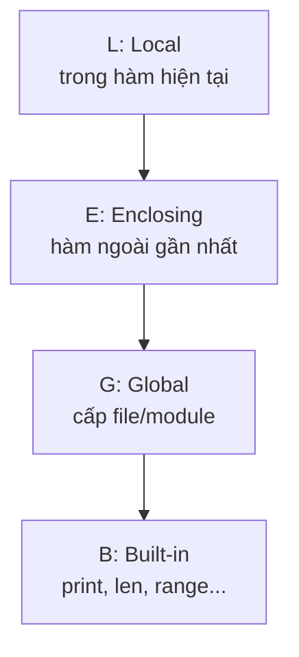

<!-- TỰ ĐỘNG ĐỒNG BỘ từ 01-Co-Ban/13-Scope/bai.md — đừng sửa trực tiếp, sửa bản chính rồi chạy tools/sync_tracks.py -->

# Bài 13 — Phạm Vi Biến (Scope) Trong Python

> 🎓 **Chương 4 – Tự động hóa công việc lặp lại**

## 🧠 Điều kiện tiên quyết

- [Bài 12 — Hàm (Function) Trong Python](../12-Ham/bai.md)

---

## 🎯 Mục tiêu

Sau bài học này, học viên sẽ:

* ✅ Hiểu **phạm vi biến (scope)** là gì — biến "sống" ở đâu trong chương trình.
* ✅ Phân biệt được **biến local** (trong hàm) và **biến global** (ngoài hàm).
* ✅ Biết cách dùng từ khóa **`global`** và **`nonlocal`** khi thực sự cần.
* ✅ Nắm vững **quy tắc LEGB** để biết biến được tìm theo thứ tự nào.
* ✅ Hiểu **khi nào nên dùng** và **tránh lạm dụng** biến global.
* ✅ Viết được chương trình nhiều hàm chạy đúng và an toàn về biến.

---

## 📖 Kiến thức

### 1. Phạm vi biến là gì?

> 💬 **Nói đơn giản:** Phạm vi biến là **"khu vực"** trong chương trình mà một biến **tồn tại và được nhìn thấy**.

**Ví dụ đời thực:** Mỗi phòng ngủ có **tủ quần áo riêng** của chủ nhân. Quần áo trong tủ phòng bạn thì **chỉ bạn lấy được** — người khác đứng ở phòng bên cạnh không lấy được. Biến trong hàm cũng vậy: nó "đóng khung" trong hàm, không tự dưng tràn ra ngoài.

Nhìn lại **Bài 12 (Hàm):** bạn đã dùng biến bên trong hàm. Câu hỏi lớn: nếu viết biến trùng tên ở chỗ khác thì Python lấy cái nào? Bài này giải đáp.

### 2. Hai phạm vi chính

| Phạm vi | Nằm ở đâu | Đặc điểm |
|---|---|---|
| 🏠 **Global** | Ngoài mọi hàm (đầu file) | Nhìn thấy ở toàn bộ chương trình |
| 🚪 **Local** | Bên trong một hàm | Chỉ tồn tại bên trong hàm đó |

```python
x = 10                  # x là biến GLOBAL

def ham_demo():
    y = 5               # y là biến LOCAL — chỉ trong ham_demo

print(x)                # ✅ 10 — global dùng được khắp nơi
# print(y)              # ❌ NameError — y không tồn tại ngoài hàm
```

> ⚠️ **Cách nhớ:** Biến tạo trong hàm là **local** — "ở đâu sinh ra, ở đó tồn tại", hết hàm là biến "chết".

### 3. Hàm có thể ĐỌC biến global

Biến global nằm "ngoài cùng", nên hàm **đọc được** giá trị của nó mà không cần làm gì đặc biệt:

```python
phi_giao_hang = 20000          # biến global

def tinh_tien(so_mon):
    return so_mon * 15000 + phi_giao_hang   # ✅ đọc được phi_giao_hang

print(tinh_tien(2))    # 50000
```

### 4. Hàm GÁN biến thì tạo biến local MỚI (bẫy kinh điển!)

Đây là **điểm gây lú nhất** với người mới: nếu trong hàm bạn **gán** giá trị cho một tên biến, Python coi đó là **biến local mới** — **không liên quan** gì tới biến global cùng tên:

```python
x = 10

def gan_moi():
    x = 99            # ✅ Đây là biến local x, KHÔNG sửa biến global x

gan_moi()
print(x)              # vẫn 10 — biến global KHÔNG bị đổi!
```

Và nếu bạn gán **sau khi đọc**, sẽ gặp lỗi:

```python
x = 10

def sai_roi():
    print(x)          # ❌ UnboundLocalError!
    x = 99            # Python đã biết x là local từ dòng này

sai_roi()
```

> 🧠 **Quy tắc:** Trong một hàm, chỉ cần **một lần gán** cho biến `x` → toàn bộ hàm coi `x` là local. Muốn sửa biến global phải khai báo `global`.

### 5. Từ khóa `global` — khai báo dùng biến toàn cục

Để gán/sửa giá trị của biến global từ bên trong hàm, dùng từ khóa `global`:

```python
diem = 0

def cong_diem(so):
    global diem      # "Nói" với Python: diem chính là biến toàn cục bên ngoài
    diem += so

cong_diem(5)
cong_diem(3)
print(diem)          # 8 — biến global đã bị hàm sửa
```

### 6. Hàm lồng trong hàm — từ khóa `nonlocal`

Python cho phép viết **hàm bên trong hàm**. Khi đó biến của hàm ngoài là biến **enclosing**, muốn gán cho nó từ hàm trong phải dùng `nonlocal`:

```python
def ham_ngoai():
    dem = 0

    def ham_trong():
        nonlocal dem   # sửa biến dem của hàm ngoài
        dem += 1

    ham_trong()
    ham_trong()
    print(dem)         # 2 — hàm trong đã sửa được biến dem

ham_ngoai()
```

### 7. Quy tắc LEGB

Khi Python cần tìm một tên biến, nó tìm theo thứ tự **LEGB** — từ trong ra ngoài, dừng ở mức đầu tiên tìm thấy:



| Viết tắt | Tên | Phạm vi tìm |
|---|---|---|
| **L** | Local | Biến khai báo trong hàm hiện tại |
| **E** | Enclosing | Biến của hàm ngoài (hàm lồng nhau) |
| **G** | Global | Biến khai báo ở cấp file |
| **B** | Built-in | Các hàm có sẵn như `print`, `len` |

```python
x = "global"

def ham_ngoai():
    x = "enclosing"

    def ham_trong():
        x = "local"
        print(x)    # tìm thấy "local" ở L → in "local"

    ham_trong()

ham_ngoai()
```

### 8. Khi nào dùng `global`? Vì sao tránh lạm dụng?

**Nên dùng khi:**
* Cần một **biến đếm / cấu hình chung** cho toàn chương trình (ví dụ hệ số phụ thu bán hàng).
* Viết các chương trình ngắn, script nhỏ, không quá phức tạp.

**Tránh lạm dụng vì:**
* Chương trình **khó theo dõi** — biến global bị sửa ở bất kỳ đâu, khó tìm chỗ gây lỗi.
* Hàm mất **tính độc lập** — kết quả phụ thuộc trạng thái bên ngoài, khó kiểm thử.
* Khi gọi cùng một hàm 2 lần, kết quả có thể **khác nhau** vì biến global đã đổi.

> 💡 **Nguyên tắc vàng:** **Ưu tiên truyền dữ liệu qua tham số và nhận lại qua `return`** thay vì `global`. Hàm giống **máy xay sinh tố**: đưa trái cây vào (tham số), bấm nút, nhận sinh tố ra (return) — không nên để máy tự "mò" xoài ngoài bàn.

```python
# ✅ CÁCH NÊN DÙNG: truyền qua tham số + return
def cong_vao(tong, so):
    return tong + so

tong = 0
tong = cong_vao(tong, 5)
tong = cong_vao(tong, 3)
print(tong)   # 8

# ❌ CÁCH DỄ LỖI: dùng global
tong_g = 0
def cong_vao_2(so):
    global tong_g
    tong_g += so
```

---

## 💡 Ví dụ minh họa

### Ví dụ 1: Đọc biến global trong hàm

```python
phu_thu = 2000                    # global

def tinh_tien(so_coc, gia_coc):
    """Tính tiền nước + phụ thu cốc."""
    return so_coc * gia_coc + phu_thu

print(tinh_tien(2, 15000))   # 32000
```

**Giải thích từng dòng:**

| Dòng | Ý nghĩa |
|---|---|
| `phu_thu = 2000` | Biến global, hàm đọc được |
| `return ... + phu_thu` | Hàm **chỉ đọc** nên không cần `global` |
| `tinh_tien(2, 15000)` | 2×15000 + 2000 = 32000 |

### Ví dụ 2: Gán biến trong hàm tạo local

```python
luong = 5000000    # global

def tinh_thuong(hang_xuat_sac):
    luong = 3000000          # local — trùm lên biến global cùng tên!
    if hang_xuat_sac:
        return luong + 1000000
    return luong

print(tinh_thuong(True))     # 4000000 (dùng local)
print(luong)                 # 5000000 — global vẫn nguyên vẹn
```

**Giải thích từng dòng:**

| Dòng | Ý nghĩa |
|---|---|
| `luong = 3000000` | Gán trong hàm → Python tạo biến **local** mới |
| `return luong + 1000000` | Dùng biến local = 4000000 |
| `print(luong)` cuối file | Vẫn in 5000000 — global không đổi |

### Ví dụ 3: `global` sửa biến toàn cục

```python
so_lan_chay = 0

def chay_buoi_tap():
    global so_lan_chay
    so_lan_chay += 1
    print(f"Hoàn thành buổi tập thứ {so_lan_chay}")

chay_buoi_tap()
chay_buoi_tap()
```

```
Hoàn thành buổi tập thứ 1
Hoàn thành buổi tập thứ 2
```

---

## 🔬 Ví dụ nâng cao

### Ví dụ 1: Bộ đếm theo lượt đúng cách — trả về để tránh global

```python
def doi_xu(hang):
    """Đổi 1.000đ thành 4 đồng xu 250đ. Trả về số xu nhận được."""
    return hang * 4

# Người chơi mỗi ngày nạp thêm và cộng dồn
tong_xu = 0
tong_xu += doi_xu(3)    # ngày 1: 12
tong_xu += doi_xu(2)    # ngày 2: +8 = 20
print("Tổng xu tích lũy:", tong_xu)
```

> Dùng `return` giúp mỗi hàm **không phụ thuộc trạng thái ngoài** — kết quả luôn tái lập, dễ kiểm tra.

### Ví dụ 2: Rút tiền ATM an toàn (khai báo `global` có chủ đích)

```python
so_du = 500000

def rut_tien(so_tien):
    """Rút tiền, cập nhật số dư toàn cục nếu đủ."""
    global so_du
    if so_tien > so_du:
        return "Số dư không đủ!"
    so_du -= so_tien
    return f"Rút {so_tien} — số dư còn: {so_du}"

print(rut_tien(200000))   # Rút 200000 — số dư còn: 300000
print(rut_tien(900000))   # Số dư không đủ!
print("Số dư cuối:", so_du)
```

### Ví dụ 3: Hàm lồng nhau với `nonlocal`

```python
def tao_so_ngau_nhien_co_nho():
    """Hàm trả về hàm trong — biến nhớ nằm ở hàm ngoài."""
    so_gan_day = 0

    def ra_so():
        nonlocal so_gan_day
        # Mô phỏng lấy số ngẫu nhiên, đơn giản là đếm lên
        so_gan_day = (so_gan_day * 7 + 3) % 10
        return so_gan_day

    return ra_so

may = tao_so_ngau_nhien_co_nho()
print(may())   # 3
print(may())   # 4
print(may())   # 1
```

> `nonlocal` cho phép hàm trong **ghi nhớ và cập nhật** biến của hàm ngoài — nền tảng của kỹ thuật *closure* mà bạn sẽ gặp ở bài **28_Decorator**.

### Ví dụ 4: LEGB qua ví dụ thực tế đặt món

```python
giam_gia = 0.1              # G: global

def tinh_hoa_don():
    giam_gia_them = 0.05    # E: dành cho hàm trong

    def chi_tiet(mon, gia):
        giam_gia_them = 0.0  # L: local được gán lại trong hàm trong
        return gia - gia * (giam_gia + giam_gia_them)

    return chi_tiet

tinh = tinh_hoa_don()
print(tinh("pho", 35000))   # 35000 - 10% = 31500
```

---

## ⚠️ Lỗi thường gặp

### Lỗi 1: `NameError: name 'x' is not defined` — dùng biến local ngoài hàm

```python
def tinh():
    ket_qua = 5 * 5

print(ket_qua)     # ❌ NameError — ket_qua là local, đã "chết" khi hết hàm
```

* **Nguyên nhân:** Biến tạo trong hàm chỉ tồn tại trong hàm.
* **Cách sửa:** Trả về bằng `return` rồi gán ra ngoài: `ket_qua = tinh()`.

### Lỗi 2: `UnboundLocalError` — gán biến sau khi đọc trong hàm

```python
x = 10
def ham():
    print(x)   # ❌ UnboundLocalError
    x = 5
```

* **Nguyên nhân:** Python thấy có lệnh gán `x = 5` nên coi `x` là local từ đầu; `print(x)` đọc biến local chưa gán.
* **Cách sửa:** Khai báo `global x` ở đầu hàm, hoặc đặt tên khác cho biến local.

### Lỗi 3: Tưởng hàm sửa được biến global khi không khai báo

```python
so_du = 100
def rut():
    so_du -= 50   # ❌ UnboundLocalError

rut()
```

* **Nguyên nhân:** Gán cho biến global trong hàm mà không khai báo `global`.
* **Cách sửa:** Thêm `global so_du`, hoặc dùng `return so_du - 50` và gán lại ở ngoài.

### Lỗi 4: Lạm dụng `global` — chương trình khó hiểu

```python
dem = 0
def r1():
    global dem
    dem += 1

def r2():
    global dem
    dem += 2

r1()
r2()
# Khi dem bất ngờ bằng 3, bạn không biết hàm nào đã sửa
```

* **Nguyên nhân:** Nhiều hàm cùng sửa biến global khiến việc tìm lỗi rất khó.
* **Cách sửa:** Ưu tiên truyền tham số và nhận `return`.

### Lỗi 5: Quên `nonlocal` trong hàm lồng nhau

```python
def ngoai():
    a = 1
    def trong():
        a += 1   # ❌ UnboundLocalError
    trong()

ngoai()
```

* **Nguyên nhân:** Gán `a` trong hàm trong mà không khai báo.
* **Cách sửa:** Thêm `nonlocal a` vào đầu hàm `trong`.

---

## 💎 Mẹo

* 🎯 **Mẹo ghi nhớ LEGB:** hình dung 4 chiếc hộp chồng lên nhau — nhìn trong hộp nhỏ nhất trước.
* 📦 **Mặc định "local-safe"**: Python tự bảo vệ biến global khỏi bị hàm "vô tình" sửa — đó là tính năng, không phải lỗi.
* 🔑 **Dùng `global` tối thiểu**: hằng số cấu hình (không sửa) thì không cần; chỉ khi hàm phải **cập nhật** biến toàn cục mới cần.
* 🔁 **Quy tắc "in – out"**: dữ liệu đi vào hàm qua **tham số**, đi ra qua **`return`**. Hàm đẹp = đọc như công thức nấu ăn.
* 🧪 **Kiểm thử dễ hơn**: hàm không dùng global gọi 2 lần ra 2 kết quả giống nhau — dễ kiểm tra, dễ chia sẻ.
* 📚 Nhớ lại bài 12: biến bên trong hàm không bao giờ "tràn ra" ngoài — muốn lấy kết quả phải `return`.

---

## 📝 Tóm tắt

| Khái niệm | Nội dung |
|---|---|
| Scope (phạm vi) | "Khu vực" biến tồn tại và được nhìn thấy |
| Biến local | Khai báo trong hàm, chỉ tồn tại trong hàm |
| Biến global | Khai báo ngoài hàm, dùng được khắp nơi |
| Đọc global | Hàm đọc tự nhiên, không cần khai báo |
| Gán trong hàm | Tạo biến local mới — KHÔNG sửa global |
| `global` | Cho phép hàm gán/sửa biến toàn cục |
| `nonlocal` | Cho phép hàm trong sửa biến của hàm ngoài |
| LEGB | Thứ tự tìm: Local → Enclosing → Global → Built-in |
| Nguyên tắc | Truyền tham số + `return`, hạn chế `global` |

---

## 🧪 Kiểm tra nhanh

1. ❓ Biến khai báo trong hàm gọi là biến gì?
2. ❓ Hàm gán biến trùng tên với biến global thì biến global có bị đổi không?
3. ❓ Từ khóa nào dùng để hàm được phép gán biến global?
4. ❓ Vì sao gán biến trong hàm sau khi `print` biến đó lại báo `UnboundLocalError`?
5. ❓ LEGB nghĩa là gì và thứ tự tìm như thế nào?
6. ❓ Trong hàm lồng nhau, muốn hàm trong sửa biến của hàm ngoài dùng từ khóa gì?
7. ❓ Kể 2 nhược điểm của việc lạm dụng `global`.
8. ❓ Cách "sạch sẽ" nhất để hàm cập nhật một con số toàn cục?
9. ❓ Biến khai báo ở đầu file (ngoài hàm) thuộc phạm vi nào?
10. ❓ `print` và `len` nằm ở mức nào trong LEGB?

<details>
<summary>🔍 Xem đáp án</summary>

1. Biến local.
2. Không — hàm tạo biến local mới, biến global giữ nguyên giá trị cũ.
3. `global`.
4. Vì Python xác định `x` là local ngay từ đầu hàm (do có lệnh gán phía dưới), nên dòng `print(x)` đọc biến local chưa có giá trị.
5. Thứ tự tìm tên: Local → Enclosing → Global → Built-in.
6. `nonlocal`.
7. Khó theo dõi/tìm lỗi; hàm mất tính độc lập, kết quả phụ thuộc trạng thái ngoài.
8. Truyền giá trị qua tham số và nhận kết quả mới qua `return`.
9. Phạm vi global.
10. Mức Built-in (B).

</details>

---

## 📚 Bài đọc thêm

* [Python.org – Naming and Binding (scope rules)](https://docs.python.org/3/reference/executionmodel.html#naming-and-binding)
* [Python.org – Nonlocal statement](https://docs.python.org/3/reference/simple_stmts.html#the-nonlocal-statement)
* [Real Python – Python Scope & the LEGB Rule](https://realpython.com/python-scope-legb-rule/)
* [W3Schools – Python Global Variables](https://www.w3schools.com/python/python_scope.asp)
* [Python Tutor – xem từng bước biến thay đổi](https://pythontutor.com/)

---

---

## 🧩 Bài tập

> 📝 🎯 **Chủ đề:** Biến local – global, từ khóa `global`, `nonlocal`, quy tắc LEGB, tránh lạm dụng biến toàn cục.

## 🟢 Dễ (Bài 1 – 7)

### Bài 1: Biến trong hàm là local

* **Đề bài:** Viết hàm `in_so()` bên trong tạo biến `so = 42` rồi in ra. Ở ngoài hàm, gọi `in_so()`. Giải thích: biến `so` có dùng được ngoài hàm không? In `so` ngoài hàm xem điều gì xảy ra.
* **Input:** (không cần nhập gì)
* **Output:**
  ```
  So trong ham: 42
  Traceback ... NameError: name 'so' is not defined
  ```
* **Gợi ý:** Biến tạo trong hàm chỉ tồn tại trong hàm — dùng ngoài sẽ lỗi `NameError`. Ghi chú bằng comment thay vì bắt buộc chạy lỗi.

### Bài 2: Đọc biến global trong hàm

* **Đề bài:** Khai báo biến global `phi_phuc_vu = 5000`. Viết hàm `tong_tien(mon)` trả về `mon * 30000 + phi_phuc_vu`. In kết quả cho `mon = 2`.
* **Input:** (không cần nhập gì)
* **Output:**
  ```
  65000
  ```
* **Gợi ý:** Hàm chỉ **đọc** biến global nên không cần từ khóa `global`.

### Bài 3: Hàm gán biến — có sửa global không?

* **Đề bài:** Khai báo `x = 10` ngoài hàm. Viết hàm `doi_x()` bên trong gán `x = 99` (không dùng `global`). Gọi hàm rồi in `x` ở ngoài. Kết quả là bao nhiêu?
* **Input:** (không cần nhập gì)
* **Output:**
  ```
  10
  ```
* **Gợi ý:** Gán trong hàm tạo biến **local mới** — biến global giữ nguyên.

### Bài 4: Dùng từ khóa `global`

* **Đề bài:** Khai báo `so_lan = 0`. Viết hàm `lap_mot_lan()` dùng `global so_lan` để tăng biến lên 1 và in ra `Lan lap: <so_lan>`. Gọi hàm 3 lần.
* **Input:** (không cần nhập gì)
* **Output:**
  ```
  Lan lap: 1
  Lan lap: 2
  Lan lap: 3
  ```
* **Gợi ý:** Nhớ khai báo `global` **trước** khi sửa biến.

### Bài 5: Trả về thay vì global

* **Đề bài:** Viết hàm `cong_mot(so)` trả về `so + 1` (không dùng `global`). Gọi hàm 3 lần, mỗi lần gán kết quả trở lại cho cùng biến `n`, rồi in `n`.
* **Input:** (không cần nhập gì)
* **Output:**
  ```
  3
  ```
* **Gợi ý:** `n = cong_mot(n)` — giá trị trả về "chảy ngược" về biến ngoài.

### Bài 6: Tìm mức LEGB

* **Đề bài:** Cho code:

  ```python
  ten = "G"
  def ham_ngoai():
      ten = "E"
      def ham_trong():
          ten = "L"
          print(ten)
      ham_trong()
  ham_ngoai()
  ```
  Viết chương trình này vào file và chạy. Kết quả in ra là gì?
* **Input:** (không cần nhập gì)
* **Output:**
  ```
  L
  ```
* **Gợi ý:** Python tìm theo LEGB — biến local tồn tại nên được dùng ngay, không nhìn ra ngoài.

### Bài 7: Hàm đọc biến global làm việc bình thường

* **Đề bài:** Khai báo `giam_gia = 0.2`. Viết hàm `gia_sau_giam(gia)` trả về `gia * (1 - giam_gia)`. In kết quả cho `gia = 100000`.
* **Input:** (không cần nhập gì)
* **Output:**
  ```
  80000.0
  ```
* **Gợi ý:** Đọc biến global không cần khai báo gì thêm.

---

## 🟡 Trung bình (Bài 8 – 14)

### Bài 8: Trước hay sau? Không thay đổi được

* **Đề bài:** Viết hàm `kho_dam(x)` có tham số tên `x`, bên trong gán `x = 999` rồi trả về `x`. Gọi `kho_dam(5)` và in kết quả. In giá trị của `x` ngoài hàm (nếu khai báo `x = 5` ngoài) — giá trị ngoài có đổi không?
* **Input:** (không cần nhập gì)
* **Output:**
  ```
  999
  5
  ```
* **Gợi ý:** Tham số cũng là biến local của hàm.

### Bài 9: Đếm lượt mở ứng dụng

* **Đề bài:** Khai báo `so_luot_mo = 0`. Viết hàm `mo_ung_dung()` dùng `global` để tăng số lượt và trả về chuỗi `Da mo ung dung lan thu <n>`. Gọi hàm 2 lần, in kết quả từng lần, rồi in `so_luot_mo`.
* **Input:** (không cần nhập gì)
* **Output:**
  ```
  Da mo ung dung lan thu 1
  Da mo ung dung lan thu 2
  Tong so luot mo: 2
  ```
* **Gợi ý:** Kết hợp `global` và `f-string`.

### Bài 10: Sửa lỗi UnboundLocalError

* **Đề bài:** Code sau bị lỗi `UnboundLocalError`. Hãy sửa để chạy đúng:

  ```python
  diem = 10
  def tang_diem():
      diem += 1
  tang_diem()
  print(diem)
  ```
* **Output mong đợi:**
  ```
  11
  ```
* **Gợi ý:** Có 2 cách sửa: thêm `global diem`, hoặc bỏ lệnh tăng và dùng `return diem + 1`.

### Bài 11: Vì sao lỗi? Giải thích bằng comment

* **Đề bài:** Viết hàm `ham_lu(flag)` với code sau và chạy với `flag = False`:

  ```python
  def ham_lu(flag):
      if flag:
          gia_tri = 1
      return gia_tri
  ```
* **Output:**
  ```
  Traceback ... UnboundLocalError: local variable 'gia_tri' referenced before assignment
  ```
* **Gợi ý:** `gia_tri` chỉ được gán khi `flag` đúng — khi sai, biến chưa từng tồn tại. Ghi chú giải thích trong comment.

### Bài 12: Hàm lồng nhau không dùng nonlocal

* **Đề bài:** Viết hàm `dem_ngoai()`: khai báo `n = 0`, bên trong định nghĩa `dem_trong()` thực hiện `n = n + 1` (KHÔNG có `nonlocal`) rồi gọi nó. Chạy thử — lỗi gì xảy ra? Sửa lại bằng `nonlocal` để chạy đúng, in `n` sau khi gọi 2 lần.
* **Input:** (không cần nhập gì)
* **Output:**
  ```
  2
  ```
* **Gợi ý:** Gán biến của hàm ngoài từ hàm trong bắt buộc khai báo `nonlocal`.

### Bài 13: Tách biến global — đặt tên khác

* **Đề bài:** Biến global `tong` đang dùng ở ngoài. Viết hàm `tinh_tong_cuc_bo(a, b)` dùng biến **local tên khác** `tong_local` và trả về kết quả. Gọi hàm với `7, 8` rồi in cả kết quả và `tong` global (khai báo `tong = 100` ngoài).
* **Input:** (không cần nhập gì)
* **Output:**
  ```
  15
  100
  ```
* **Gợi ý:** Đặt tên khác để tránh nhầm lẫn — không cần `global` lúc nào cũng có thể.

### Bài 14: Hóa đơn cửa hàng — tổng hợp scope

* **Đề bài:** Khai báo global `thue = 0.1`. Viết hàm `thanh_toan(gia_goc)`:
  * Nếu `gia_goc >= 100000` thì giảm thêm `giam_them = 0.05` (biến local), ngược lại `giam_them = 0`.
  * Trả về `gia_goc * (1 - giam_them) * (1 + thue)`.
  In kết quả cho `thanh_toan(120000)` và `thanh_toan(50000)` (làm tròn 0 chữ số thập phân).
* **Input:** (không cần nhập gì)
* **Output:**
  ```
  125400
  55000
  ```
* **Gợi ý:** `120000 * 0.95 * 1.1 = 125400`; `50000 * 1.1 = 55000`.

---

## 🔴 Khó (Bài 15 – 20)

### Bài 15: Máy rút tiền — lỗi kinh điển

* **Đề bài:** Chạy code sau:

  ```python
  so_du = 100000
  def rut(tien):
      so_du -= tien
      return so_du
  rut(20000)
  print(so_du)
  ```
  Dự đoán kết quả trước khi chạy, chạy thử để kiểm tra. Sửa bằng `global` để hàm cập nhật được số dư, sau đó in số dư.
* **Output mong đợi sau khi sửa:**
  ```
  80000
  ```
* **Gợi ý:** Phép `so_du -= tien` chính là `so_du = so_du - tien` — một phép gán.

### Bài 16: So sánh 2 cách cộng dồn

* **Đề bài:** Viết 2 phiên bản đếm: (a) dùng biến global + `global`, (b) dùng tham số + `return`. Cả hai in kết quả sau khi gọi 3 lần với `+2`. Chỉ rõ bằng comment cách nào dễ đọc hơn.
* **Input:** (không cần nhập gì)
* **Output:**
  ```
  Cach global: 6
  Cach return: 6
  ```
* **Gợi ý:** Phiên bản (b): `n = cong(n, 2)` lặp lại 3 lần.

### Bài 17: Đếm số lần gọi hàm — dùng nonlocal

* **Đề bài:** Viết hàm `tao_bo_dem()`: bên trong có biến `lan = 0` và hàm `goi()` dùng `nonlocal lan` để tăng và in `Lan goi thu: <n>`, trả về `lan`. Gán `bo_dem = tao_bo_dem()` và gọi `bo_dem()` 3 lần.
* **Input:** (không cần nhập gì)
* **Output:**
  ```
  Lan goi thu: 1
  Lan goi thu: 2
  Lan goi thu: 3
  ```
* **Gợi ý:** Biến `lan` "đóng gói" bên trong `tao_bo_dem` — nơi duy nhất sửa được là hàm `goi`.

### Bài 18: Game đoán số — tổng hợp global

* **Đề bài:** Khai báo global `diem = 0`. Viết hàm `choi_mot_van(dung_sai)` cộng 10 điểm nếu đúng, trừ 5 nếu sai (dùng `global`), trả về thông báo `Dung! +10 diem` hoặc `Sai! -5 diem`. Mô phỏng 1 ván đúng, 1 ván sai, 1 ván đúng và in điểm cuối.
* **Input:** (không cần nhập gì)
* **Output:**
  ```
  Dung! +10 diem
  Sai! -5 diem
  Dung! +10 diem
  Diem cuoi: 15
  ```
* **Gợi ý:** Điểm cuối = 10 - 5 + 10 = 15.

### Bài 19: Nhiều hàm cùng chia sẻ biến — cảnh giác

* **Đề bài:** Khai báo `quy = 1000`. Viết hàm `nap(tien)` cộng vào quỹ và hàm `tieu(tien)` trừ khỏi quỹ (cả hai dùng `global`, `tieu` chặn khi tiền không đủ, trả về chuỗi báo lỗi). Gọi: `nap(500)`, `tieu(200)`, `tieu(2000)`. In `quy` sau mỗi lần.
* **Input:** (không cần nhập gì)
* **Output:**
  ```
  Quy: 1500
  Quy: 1300
  Khong du tien!
  ```
* **Gợi ý:** Hai hàm cùng sửa một biến global — chú ý kiểm tra đủ tiền trước khi trừ.

### Bài 20: Dự đoán kết quả chương trình

* **Đề bài:** Đoán kết quả in ra của chương trình sau **trước khi chạy**, sau đó chạy để kiểm tra, ghi chú giải thích từng dòng bằng comment:

  ```python
  x = 1
  def f():
      y = 2
      def g():
          nonlocal y
          y += 1
          return y
      return g() + x
  print(f())
  print(x)
  ```
* **Output mong đợi:**
  ```
  4
  1
  ```
* **Gợi ý:** `g()` trả về `2 + 1 = 3`, `f()` trả về `3 + x(global) = 4`; `x` không bao giờ bị sửa nên vẫn `1`.

---

## 🎯 Tổng kết sau khi làm bài

Sau 20 bài tập, bạn đã:

* ✅ Phân biệt rõ biến local – global và cơ chế "gán trong hàm = tạo local".
* ✅ Dùng `global`, `nonlocal` đúng chỗ, hiểu vì sao hạn chế lạm dụng.
* ✅ Vận dụng LEGB để dự đoán chính xác kết quả chương trình.
* ✅ Viết hàm "sạch" theo nguyên tắc tham số vào – `return` ra.

> 💪 Chưa tự làm được bài nào thì đừng lo — hãy đọc lại bài giảng phần tương ứng rồi quay lại. **Phạm vi biến là kiến thức nền cho mọi bài sau!**

---

## ✅ Đáp án

> 💡 **Hãy tự làm bài tập trước** rồi mới mở đáp án.

## 🟢 Dễ (Bài 1 – 7)


<details>
<summary>✅ Bài 1: Biến trong hàm là local</summary>


**Phân tích:** Minh chứng trực quan rằng biến tạo trong hàm không tồn tại ngoài hàm.

**Ý tưởng:** In biến trong hàm thành công; in ngoài hàm sẽ lỗi `NameError` — dùng comment để ghi chú thay vì để chương trình chết.

**Thuật toán:**
1. Định nghĩa hàm tạo biến local và in.
2. Gọi hàm.
3. Thử in biến ở ngoài (kèm comment giải thích lỗi).

**Code:**

```python
def in_so():
    so = 42               # so là biến LOCAL của in_so
    print("So trong ham:", so)

in_so()
# print(so)  # ❌ Bỏ comment dòng này sẽ lỗi NameError:
#            #    name 'so' is not defined (biến đã "chết" khi hết hàm)
```

**Giải thích code:**
* `so = 42` nằm trong hàm → local, tồn tại khi hàm chạy.
* Khi hàm kết thúc, `so` biến mất — in ngoài hàm là lỗi.

**Độ phức tạp:** O(1).

---

</details>

<details>
<summary>✅ Bài 2: Đọc biến global trong hàm</summary>


**Phân tích:** Hàm chỉ đọc biến global — hành vi mặc định, không cần khai báo.

**Ý tưởng:** Dùng `phi_phuc_vu` trực tiếp trong biểu thức trả về.

**Thuật toán:**
1. Khai báo biến global.
2. Viết hàm dùng biến đó.
3. Gọi và in.

**Code:**

```python
phi_phuc_vu = 5000     # biến global

def tong_tien(mon):
    """Tính tiền món ăn cộng phí phục vụ."""
    return mon * 30000 + phi_phuc_vu

print(tong_tien(2))    # 2 * 30000 + 5000 = 65000
```

**Giải thích code:**
* Không có lệnh gán `phi_phuc_vu` trong hàm → Python tìm ở global và đọc được.
* Kết quả `65000`.

**Độ phức tạp:** O(1).

---

</details>

<details>
<summary>✅ Bài 3: Hàm gán biến — có sửa global không?</summary>


**Phân tích:** Gán biến trong hàm tạo local mới — global giữ nguyên.

**Ý tưởng:** `x = 99` trong hàm là biến local; in `x` ngoài hàm vẫn ra `10`.

**Thuật toán:**
1. Khai báo `x = 10`.
2. Hàm gán `x = 99` (không `global`).
3. Gọi hàm, in `x`.

**Code:**

```python
x = 10

def doi_x():
    x = 99    # local — chỉ tồn tại trong hàm
    print("x trong ham:", x)

doi_x()
print(x)      # vẫn 10
```

**Giải thích code:**
* Hai biến `x` khác nhau: local trong hàm và global ngoài.
* Lệnh gán trong hàm không bao giờ chạm tới biến global.

**Độ phức tạp:** O(1).

---

</details>

<details>
<summary>✅ Bài 4: Dùng từ khóa `global`</summary>


**Phân tích:** Cần sửa biến global từ trong hàm → khai báo `global`.

**Ý tưởng:** `global so_lan` cho phép `so_lan += 1` chạm đúng biến toàn cục.

**Thuật toán:**
1. Khai báo `so_lan = 0`.
2. Hàm khai báo `global` rồi tăng biến.
3. Gọi 3 lần.

**Code:**

```python
so_lan = 0

def lap_mot_lan():
    global so_lan
    so_lan += 1
    print(f"Lan lap: {so_lan}")

lap_mot_lan()
lap_mot_lan()
lap_mot_lan()
```

**Giải thích code:**
* Dòng `global so_lan` phải đặt **trước** khi dùng.
* Mỗi lần gọi, biến global tăng thêm 1 và giữ giá trị giữa các lần gọi.

**Độ phức tạp:** O(1).

---

</details>

<details>
<summary>✅ Bài 5: Trả về thay vì global</summary>


**Phân tích:** Cách "sạch" không cần `global`: dữ liệu vào qua tham số, ra qua `return`.

**Ý tưởng:** Gán kết quả trả về cho biến ngoài: `n = cong_mot(n)`.

**Thuật toán:**
1. Viết hàm `cong_mot(so)` trả về `so + 1`.
2. Khởi tạo `n = 0`.
3. Gán `n = cong_mot(n)` ba lần, in `n`.

**Code:**

```python
def cong_mot(so):
    """Trả về số đã cộng thêm 1."""
    return so + 1

n = 0
n = cong_mot(n)   # 1
n = cong_mot(n)   # 2
n = cong_mot(n)   # 3
print(n)
```

**Giải thích code:**
* Hàm không sửa biến ngoài — nó **tính và trả về**.
* Việc cập nhật biến do nơi gọi tự quyết định → dễ hiểu, dễ kiểm thử.

**Độ phức tạp:** O(1).

---

</details>

<details>
<summary>✅ Bài 6: Tìm mức LEGB</summary>


**Phân tích:** Áp dụng LEGB: biến local có sẵn thì dùng ngay.

**Ý tưởng:** Trong `ham_trong`, biến `ten` local được gán `"L"` → in `"L"`.

**Thuật toán:**
1. Sao chép code vào file.
2. Chạy và quan sát.

**Code:**

```python
ten = "G"

def ham_ngoai():
    ten = "E"

    def ham_trong():
        ten = "L"
        print(ten)   # L — mức Local thắng

    ham_trong()

ham_ngoai()
```

**Giải thích code:**
* Python tìm `ten` theo LEGB: tìm thấy ở mức **Local** trước tiên nên không cần nhìn ra Enclosing hay Global.
* Ba biến tên `ten` ở 3 mức khác nhau — hoàn toàn độc lập.

**Độ phức tạp:** O(1).

---

</details>

<details>
<summary>✅ Bài 7: Hàm đọc biến global làm việc bình thường</summary>


**Phân tích:** Đọc global là hành vi mặc định.

**Ý tưởng:** `gia * (1 - giam_gia)` với `giam_gia` là biến global.

**Thuật toán:**
1. Khai báo `giam_gia = 0.2`.
2. Viết hàm tính giá sau giảm.
3. Gọi và in.

**Code:**

```python
giam_gia = 0.2     # biến global

def gia_sau_giam(gia):
    """Tính giá sau khi giảm theo hệ số global."""
    return gia * (1 - giam_gia)

print(gia_sau_giam(100000))   # 100000 * 0.8 = 80000.0
```

**Giải thích code:**
* Hàm chỉ đọc `giam_gia`, không gán → không cần `global`.
* Kết quả float `80000.0`.

**Độ phức tạp:** O(1).

---

</details>

## 🟡 Trung bình (Bài 8 – 14)


<details>
<summary>✅ Bài 8: Trước hay sau? Không thay đổi được</summary>


**Phân tích:** Tham số của hàm cũng là biến local — gán lại bên trong không ảnh hưởng biến ngoài.

**Ý tưởng:** `x = 999` trong hàm ghi đè tham số local; `x` ngoài không đổi.

**Thuật toán:**
1. Khai báo `x = 5` ngoài.
2. Hàm nhận tham số `x`, gán `x = 999`, trả về.
3. In kết quả và biến ngoài.

**Code:**

```python
x = 5

def kho_dam(x):
    """Gán lại tham số rồi trả về."""
    x = 999
    return x

print(kho_dam(5))   # 999 — bên trong hàm
print(x)            # 5 — biến ngoài không đổi
```

**Giải thích code:**
* Tham số `x` là bản sao tên riêng trong hàm.
* Gán `x = 999` chỉ ảnh hưởng bản local.

**Độ phức tạp:** O(1).

---

</details>

<details>
<summary>✅ Bài 9: Đếm lượt mở ứng dụng</summary>


**Phân tích:** Kết hợp `global` với f-string để thông báo.

**Ý tưởng:** Tăng biến global rồi đọc giá trị mới để in.

**Thuật toán:**
1. Khai báo `so_luot_mo = 0`.
2. Hàm khai báo `global`, tăng, trả về chuỗi.
3. Gọi 2 lần, in tổng.

**Code:**

```python
so_luot_mo = 0

def mo_ung_dung():
    """Tăng số lượt mở và trả về thông báo."""
    global so_luot_mo
    so_luot_mo += 1
    return f"Da mo ung dung lan thu {so_luot_mo}"

print(mo_ung_dung())
print(mo_ung_dung())
print("Tong so luot mo:", so_luot_mo)
```

**Giải thích code:**
* Sau hai lần gọi, `so_luot_mo = 2` — giá trị tồn tại giữa các lần gọi nhờ `global`.

**Độ phức tạp:** O(1).

---

</details>

<details>
<summary>✅ Bài 10: Sửa lỗi UnboundLocalError</summary>


**Phân tích:** `diem += 1` là phép gán → Python coi `diem` là local → lỗi khi đọc trước khi gán.

**Ý tưởng:** Sửa bằng `global` — cách trực tiếp nhất với bài này.

**Thuật toán:**
1. Thêm `global diem` vào đầu hàm.
2. Chạy và in.

**Code:**

```python
diem = 10

def tang_diem():
    global diem
    diem += 1

tang_diem()
print(diem)   # 11
```

**Giải thích code:**
* `global diem` báo Python: dùng biến toàn cục, đừng tạo local.
* Cách khác: `return diem + 1` rồi `diem = tang_diem()` — cũng đúng và "sạch" hơn.

**Độ phức tạp:** O(1).

---

</details>

<details>
<summary>✅ Bài 11: Vì sao lỗi? Giải thích bằng comment</summary>


**Phân tích:** Biến chỉ được gán trong một nhánh `if` — khi nhánh không chạy, biến chưa tồn tại.

**Ý tưởng:** Chạy với `flag = False` để thấy lỗi, ghi chú nguyên nhân.

**Thuật toán:**
1. Định nghĩa hàm như đề.
2. Gọi với `flag = False`.
3. Nhận xét lỗi qua comment.

**Code:**

```python
def ham_lu(flag):
    if flag:
        gia_tri = 1          # gia_tri chỉ được tạo khi flag = True
    return gia_tri           # ❌ khi flag = False, biến chưa tồn tại
    # → UnboundLocalError: local variable 'gia_tri' referenced before assignment

# ham_lu(False)  # Bỏ comment để thấy lỗi
```

**Giải thích code:**
* Không phải lỗi scope mặc định — là biến **chưa được gán lần nào** khi `flag = False`.
* Cách khắc phục: gán `gia_tri = 0` trước `if`.

**Độ phức tạp:** O(1).

---

</details>

<details>
<summary>✅ Bài 12: Hàm lồng nhau không dùng nonlocal</summary>


**Phân tích:** Hàm trong gán biến của hàm ngoài → bắt buộc `nonlocal`.

**Ý tưởng:** Đầu tiên chạy bản lỗi để thấy `UnboundLocalError`, sau đó thêm `nonlocal`.

**Thuật toán:**
1. Viết bản chưa có `nonlocal`, chạy thử.
2. Thêm `nonlocal n`.
3. Gọi hàm trong 2 lần, in `n`.

**Code:**

```python
def dem_ngoai():
    n = 0

    def dem_trong():
        nonlocal n     # cho phép sửa biến n của hàm ngoài
        n = n + 1

    dem_trong()
    dem_trong()
    print(n)           # 2

dem_ngoai()
```

**Giải thích code:**
* Không có `nonlocal`: `n = n + 1` tạo biến local mới trong `dem_trong` → `UnboundLocalError`.
* Có `nonlocal`: Python hiểu `n` là biến của `dem_ngoai` và sửa đúng nó.

**Độ phức tạp:** O(1).

---

</details>

<details>
<summary>✅ Bài 13: Tách biến global — đặt tên khác</summary>


**Phân tích:** Tránh nhầm lẫn bằng cách đặt tên local khác — không cần `global`.

**Ý tưởng:** Dùng `tong_local` cho biến cục bộ, giữ `tong` cho biến toàn cục.

**Thuật toán:**
1. Khai báo `tong = 100`.
2. Hàm dùng `tong_local`.
3. In cả hai.

**Code:**

```python
tong = 100

def tinh_tong_cuc_bo(a, b):
    tong_local = a + b    # tên khác → không đụng biến global
    return tong_local

print(tinh_tong_cuc_bo(7, 8))   # 15
print(tong)                     # 100
```

**Giải thích code:**
* Đặt tên khác biệt giúp code rõ ràng, tránh tưởng lầm hai biến liên quan nhau.

**Độ phức tạp:** O(1).

---

</details>

<details>
<summary>✅ Bài 14: Hóa đơn cửa hàng — tổng hợp scope</summary>


**Phân tích:** Kết hợp đọc global (`thue`) và gán local (`giam_them`).

**Ý tưởng:** Tính giá sau giảm rồi cộng thuế.

**Thuật toán:**
1. Khai báo `thue = 0.1` global.
2. Hàm tính `giam_them` theo điều kiện.
3. Trả về giá sau giảm × (1 + thuế).

**Code:**

```python
thue = 0.1     # biến global — hàm chỉ đọc

def thanh_toan(gia_goc):
    """Tính tiền phải trả sau giảm giá và cộng thuế."""
    if gia_goc >= 100000:
        giam_them = 0.05          # local
    else:
        giam_them = 0             # local
    gia_sau_giam = gia_goc * (1 - giam_them)
    return round(gia_sau_giam * (1 + thue))

print(thanh_toan(120000))   # 120000 * 0.95 * 1.1 = 125400
print(thanh_toan(50000))    # 50000 * 1.1 = 55000
```

**Giải thích code:**
* `thue` đọc tự do vì hàm không gán nó.
* `giam_them`, `gia_sau_giam` là local — không ảnh hưởng ngoài hàm.

**Độ phức tạp:** O(1).

---

</details>

## 🔴 Khó (Bài 15 – 20)


<details>
<summary>✅ Bài 15: Máy rút tiền — lỗi kinh điển</summary>


**Phân tích:** `so_du -= tien` là phép gán → lỗi `UnboundLocalError`; phải `global`.

**Ý tưởng:** Thêm `global so_du` để hàm cập nhật đúng biến toàn cục.

**Thuật toán:**
1. Khai báo `so_du = 100000`.
2. Thêm `global so_du` trong hàm `rut`.
3. Gọi và in số dư.

**Code:**

```python
so_du = 100000

def rut(tien):
    """Rút tiền, cập nhật số dư toàn cục."""
    global so_du
    so_du -= tien
    return so_du

rut(20000)
print(so_du)   # 80000
```

**Giải thích code:**
* `so_du -= tien` ⟺ `so_du = so_du - tien` — có gán nên cần `global`.
* Sau khi sửa, biến global thực sự bị giảm.

**Độ phức tạp:** O(1).

---

</details>

<details>
<summary>✅ Bài 16: So sánh 2 cách cộng dồn</summary>


**Phân tích:** Hai phong cách: dùng `global` và dùng tham số + `return`.

**Ý tưởng:** Viết cả hai, cùng kết quả `6`, ghi chú đánh giá.

**Thuật toán:**
1. Cách (a): biến global, hàm dùng `global`.
2. Cách (b): hàm thuần, gán lại kết quả.
3. In kết quả hai cách.

**Code:**

```python
# Cách (a): dùng global — hàm gắn với trạng thái ngoài
n_a = 0

def cong_global(so):
    global n_a
    n_a += so

cong_global(2)
cong_global(2)
cong_global(2)
print("Cach global:", n_a)

# Cách (b): tham số vào - return ra — hàm độc lập, dễ kiểm thử
n_b = 0

def cong_thuan(so_hien_tai, them):
    return so_hien_tai + them

n_b = cong_thuan(n_b, 2)
n_b = cong_thuan(n_b, 2)
n_b = cong_thuan(n_b, 2)
print("Cach return:", n_b)
```

**Giải thích code:**
* Cách (b) đọc "sạch" hơn: dữ liệu đi vào – kết quả đi ra rõ ràng.
* Cách (a) ngắn hơn nhưng khó theo dõi khi nhiều hàm cùng dùng biến.

**Độ phức tạp:** O(1).

---

</details>

<details>
<summary>✅ Bài 17: Đếm số lần gọi hàm — dùng nonlocal</summary>


**Phân tích:** "Đóng gói" biến đếm bên trong hàm ngoài — kỹ thuật closure.

**Ý tưởng:** `tao_bo_dem()` trả về hàm `goi()`; `nonlocal lan` cho phép gọi nhiều lần liên tiếp.

**Thuật toán:**
1. Hàm ngoài khai báo `lan = 0`.
2. Hàm trong dùng `nonlocal lan`, tăng, in, trả về.
3. Gán hàm trong vào `bo_dem` và gọi 3 lần.

**Code:**

```python
def tao_bo_dem():
    """Trả về một hàm đếm có bộ nhớ riêng."""
    lan = 0

    def goi():
        nonlocal lan
        lan += 1
        print(f"Lan goi thu: {lan}")
        return lan

    return goi

bo_dem = tao_bo_dem()
bo_dem()
bo_dem()
bo_dem()
```

**Giải thích code:**
* `lan` chỉ tồn tại trong `tao_bo_dem` và được hàm `goi` "nhớ".
* Mỗi lần `bo_dem()` chạy, `lan` tăng 1 — như một bộ đếm riêng biệt.

**Độ phức tạp:** O(1).

---

</details>

<details>
<summary>✅ Bài 18: Game đoán số — tổng hợp global</summary>


**Phân tích:** Cộng trừ điểm vào biến global qua hàm.

**Ý tưởng:** `dung_sai=True` → +10, ngược lại -5, dùng `global`.

**Thuật toán:**
1. Khai báo `diem = 0`.
2. Hàm kiểm tra `dung_sai`, cập nhật `diem`.
3. Mô phỏng 3 ván, in điểm cuối.

**Code:**

```python
diem = 0

def choi_mot_van(dung_sai):
    """Cộng 10 nếu đúng, trừ 5 nếu sai."""
    global diem
    if dung_sai:
        diem += 10
        return "Dung! +10 diem"
    diem -= 5
    return "Sai! -5 diem"

print(choi_mot_van(True))
print(choi_mot_van(False))
print(choi_mot_van(True))
print("Diem cuoi:", diem)   # 10 - 5 + 10 = 15
```

**Giải thích code:**
* Điểm tích lũy qua nhiều ván nhờ biến global.
* Điểm cuối: `10 - 5 + 10 = 15`.

**Độ phức tạp:** O(1).

---

</details>

<details>
<summary>✅ Bài 19: Nhiều hàm cùng chia sẻ biến — cảnh giác</summary>


**Phân tích:** Hai hàm cùng sửa một biến global; cần kiểm tra số dư trước khi trừ.

**Ý tưởng:** `nap` cộng, `tieu` kiểm tra rồi trừ.

**Thuật toán:**
1. Khai báo `quy = 1000`.
2. `nap(tien)`: cộng dồn.
3. `tieu(tien)`: nếu đủ thì trừ, ngược lại báo lỗi.
4. Gọi theo kịch bản, in quỹ.

**Code:**

```python
quy = 1000

def nap(tien):
    """Nạp tiền vào quỹ chung."""
    global quy
    quy += tien

def tieu(tien):
    """Tiêu tiền từ quỹ, chặn khi không đủ."""
    global quy
    if tien > quy:
        return "Khong du tien!"
    quy -= tien
    return "Da tieu " + str(tien)

nap(500)
print("Quy:", quy)             # 1500
print(tieu(200))               # Da tieu 200
print("Quy:", quy)             # 1300
print(tieu(2000))              # Khong du tien!
print("Quy:", quy)             # vẫn 1300
```

**Giải thích code:**

```python
# (Nhắc lại phần lõi để giải thích rõ hơn)
quy = 1000

def nap(tien):
    global quy
    quy += tien

def tieu(tien):
    global quy
    if tien > quy:
        return "Khong du tien!"
    quy -= tien
    return "Da tieu " + str(tien)

nap(500)
print("Quy:", quy)             # 1500
print(tieu(200))
print("Quy:", quy)             # 1300
print(tieu(2000))              # Khong du tien!
print("Quy:", quy)             # vẫn 1300
```

**Giải thích code:**
* `tieu` kiểm tra đủ tiền trước khi trừ → quỹ không bao giờ âm.
* Cả hai hàm phải khai báo `global quy` để cùng thao tác một biến.

**Độ phức tạp:** O(1).

---

</details>

<details>
<summary>✅ Bài 20: Dự đoán kết quả chương trình</summary>


**Phân tích:** Vận dụng đủ LEGB + nonlocal.

**Ý tưởng:** `g()` sửa `y` qua `nonlocal` trả về 3; `f()` cộng thêm `x` global = 4.

**Thuật toán:**
1. Phân tích từng hàm.
2. Chạy để đối chiếu.

**Code:**

```python
x = 1                    # G: global

def f():
    y = 2                # E: enclosing với g

    def g():
        nonlocal y       # sửa y của f
        y += 1           # y = 3
        return y         # 3

    return g() + x       # 3 + x(global = 1) = 4

print(f())               # 4
print(x)                 # 1 — x không bao giờ bị sửa
```

**Giải thích code:**
* `g()` → `y = 2 + 1 = 3`, trả về 3.
* `f()` → `3 + x`. `x` không có ở Local/Enclosing → tìm ở Global thấy `1`.
* Kết quả: `4`, và `x` vẫn nguyên `1` vì không hàm nào gán nó.

**Độ phức tạp:** O(1).

---

</details>

## 📌 Lời khuyên cuối


* **Gán trong hàm = tạo local** — ghi nhớ câu này để tránh 90% lỗi scope.
* **`global` chỉ dùng khi hàm phải CẬP NHẬT biến toàn cục** — đọc thì không cần.
* **`nonlocal` chỉ xuất hiện trong hàm lồng nhau** — dùng đúng ngữ cảnh.
* **Ưu tiên tham số + `return`** — hàm độc lập, dễ kiểm thử, dễ tái sử dụng.

👉 Tiếp theo: **[Bài 14: List](../14-List/bai.md)**

---

## ➡️ Điều hướng

**Vị trí:** `04-Full/Phan-1-Co-Ban/13-Scope/bai.md`

**Bài tiếp theo:** [Bài 14 — Danh Sách (List) Trong Python](../14-List/bai.md)
