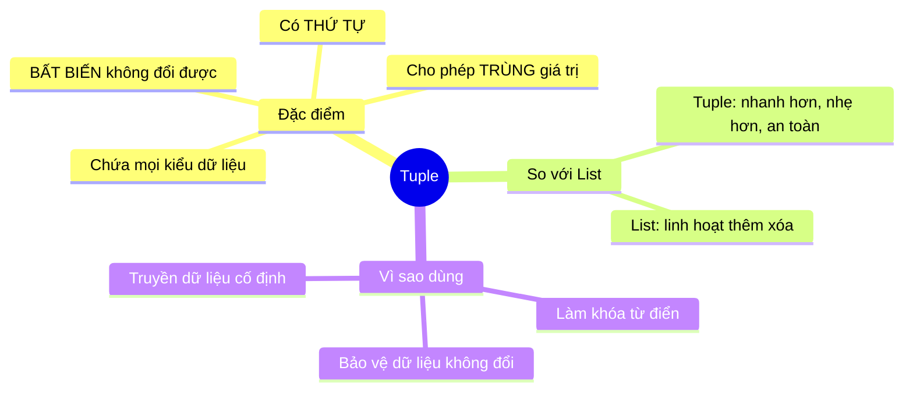

<!-- TỰ ĐỘNG ĐỒNG BỘ từ 01-Co-Ban/15-Tuple/bai.md — đừng sửa trực tiếp, sửa bản chính rồi chạy tools/sync_tracks.py -->

# Bài 15 — Tuple (Bộ Dữ Liệu) Trong Python

> 🎓 **Chương 5 – Cấu trúc dữ liệu: List, Tuple, Set và Dictionary**

## 🧠 Điều kiện tiên quyết

- [Bài 14 — Danh Sách (List) Trong Python](../14-List/bai.md)

---

## 🎯 Mục tiêu

Sau bài học này, học viên sẽ:

* ✅ Hiểu **Tuple là gì** và điểm khác biệt cốt lõi với list: **tính bất biến (immutable)**.
* ✅ **Tạo** tuple bằng `(...)` và hàm `tuple()`, kể cả tuple 1 phần tử.
* ✅ **Truy cập** phần tử bằng index, cắt slice giống list.
* ✅ **Duyệt** tuple bằng vòng lặp `for`.
* ✅ **Giải nén (unpacking)** tuple — đặc biệt là hoán đổi giá trị 2 biến trong một dòng.
* ✅ Dùng `count()`, `index()` và biết vì sao `sort()` không áp dụng được cho tuple bất biến.
* ✅ So sánh **List vs Tuple** và biết **khi nào nên dùng tuple**.

---

## 📖 Kiến thức

### 1. Tuple là gì?

> 💬 **Nói đơn giản:** Tuple giống như **bộ hồ sơ được niêm phong** — chứa đủ thông tin theo thứ tự cố định, nhưng **không thể sửa đổi** sau khi tạo.

**Ví dụ đời thực:** 📍 tọa độ `(21.0302, 105.8471)` cho Hà Nội, 📅 bộ `(thứ, ngày, tháng, năm)`, 🗓️ ba số đo một ngón chân trong cửa hàng giày dép...

```python
toa_do = (21.0302, 105.8471)   # kinh độ, vĩ độ — không nên đổi
```

**Tính bất biến (immutable) nghĩa là gì?**
Sau khi tạo, tuple **không có** các lệnh `append`, `remove`, `sort`, hay phép gán `tp[0] = ...`. Bất kỳ cố gắng nào cũng báo `TypeError`.

```python
tp = (1, 2, 3)
tp[0] = 99   # ❌ SAI — TypeError: 'tuple' object does not support item assignment
```



> 💡 **Ghi nhớ nhanh:** **List là "vở nháp"** (ghi xóa thoải mái), **Tuple là "văn bản đã đóng dấu"** (không sửa nữa).

### 2. Tạo tuple

| Cách | Cú pháp | Ví dụ |
|---|---|---|
| Có sẵn dữ liệu | `(giá_trị, ...)` | `tp = (1, 2, 3)` |
| Không cần dấu ngoặc | `giá_trị, giá_trị` | `tp = 1, 2, 3` ✅ đúng cú pháp |
| Từ list / chuỗi | `tuple(dữ liệu)` | `tuple("abc")` → `('a','b','c')` |
| Rỗng | `()` | `tp = ()` |
| **1 phần tử** | `(giá_trị,)` | `tp = (5,)` — **có dấu phẩy!** |

```python
toa_do = (21.03, 105.85)      # tuple 2 phần tử
ngay = 5, 8, 2026             # cũng là tuple (không cần dấu ngoặc!)
mo = ("An", "Binh", "Chi")    # tuple chuỗi
rong = ()                     # tuple rỗng
mot_phan_tu = (7,)            # ⚠️ THIẾU dấu phẩy là thành số 7, không phải tuple!
```

> ⚠️ **Bẫy số 1 trong tuple:** `(7)` không phải tuple mà là **số 7** — dấu ngoặc chỉ để nhóm phép tính. Muốn tuple 1 phần tử phải viết `(7,)` với **dấu phẩy đuôi**.

### 3. Truy cập phần tử

Tuple truy cập **giống hệt list**: index dương từ 0, index âm từ cuối, và cắt slice:

```python
ngay = ("thu hai", "thu ba", "thu tu", "thu nam", "thu sau")

print(ngay[0])      # thu hai   — phần tử đầu
print(ngay[-1])     # thu sau   — phần tử cuối
print(ngay[1:3])    # ("thu ba", "thu tu") — slice trả TUPLE mới
print(ngay[::-1])   # đảo ngược — vẫn là tuple
print(len(ngay))    # 5
```

> 💡 Slice của tuple trả về **tuple mới** (không phải list). List và tuple đều là **dãy (sequence)** nên dùng chung nhiều thao tác.

### 4. Duyệt tuple

```python
mon = ("Toan", "Van", "Anh")

for m in mon:                 # duyệt từng giá trị
    print("Mon:", m)

for i, m in enumerate(mon, start=1):   # kèm số thứ tự
    print(f"{i}. {m}")

print("Van" in mon)          # True — kiểm tra tồn tại
```

### 5. Unpacking — giải nén tuple ⭐

Tuple cho phép **gán đồng thời** các phần tử vào nhiều biến — gọi là **unpacking**. Đây là kỹ thuật cực kỳ hữu ích:

```python
toa_do = (21.03, 105.85)
kinh_do, vi_do = toa_do        # kinh_do = 21.03, vi_do = 105.85
print(kinh_do, vi_do)          # 21.03 105.85

ten, lop, diem = ("An", "10A1", 8.5)   # nhớ: trùng số lượng biến và phần tử
```

**Hoán đổi giá trị biến — Ứng dụng tuyệt đẹp của unpacking:**

```python
a = 1
b = 2

# Cách truyền thống: cần biến trung gian temp
temp = a
a = b
b = temp

# Cách của Python: unpacking trong MỘT dòng
a, b = b, a     # ⚡ hoán đổi ngay lập tức
print(a, b)     # 2 1
```

> 💡 `a, b = b, a` hoạt động vì vế phải `b, a` được **tạo thành tuple tạm** trước, sau đó mới giải nén trở lại vào `a`, `b`.

### 6. `count()` và `index()`

```python
diem = (9, 7, 9, 8, 9)

print(diem.count(9))     # 3 — đếm số lần giá trị 9 xuất hiện
print(diem.index(8))     # 3 — vị trí đầu tiên có giá trị 8
print(7 in diem)         # True
```

> ⚠️ `index()` mà không có giá trị → `ValueError`; kiểm tra `in` trước khi gọi.

### 7. List vs Tuple — So sánh chi tiết 📊

| Tiêu chí | 📋 List | 🔗 Tuple |
|---|---|---|
| Cú pháp | `[1, 2, 3]` | `(1, 2, 3)` |
| **Thay đổi được?** | ✅ Có (thêm/xóa/sửa) | ❌ **Không** (bất biến) |
| Tốc độ | Nhanh | **Nhanh hơn** một chút |
| Bộ nhớ | Nhiều hơn | **Ít hơn** (nhẹ hơn) |
| Hàm riêng | `append`, `extend`, `insert`, `remove`, `pop`, `reverse`, `sort`, `clear` | Chỉ `count`, `index` |
| Có đầy đủ thao tác dãy | ✅ | ✅ (truy cập, slice, duyệt, len...) |
| Làm khóa từ điển? | ❌ Không | ✅ **Được** (bất biến) |
| Dùng khi | Dữ liệu cần **thay đổi** | Dữ liệu **cố định**, bảo vệ khỏi sửa |

### 8. Khi nào dùng tuple?

* 📍 **Tọa độ / dữ liệu định vị:** `(lat, lon)` là một điểm — đổi một con số là "bay" sang nước khác.
* 🗓️ **Hằng số:** `(thu, ngay, thang, nam)`, cấu hình cố định, các giá trị mặc định.
* 🔐 **Khóa của từ điển:** chỉ kiểu bất biến mới làm khóa được (chi tiết bài 17).
* 🚀 **Trả về nhiều giá trị từ hàm:** hàm chỉ "trả về một thứ", nhưng thứ đó có thể là tuple (bài 12, 23 sẽ gặp).
* 🛡️ **Chống sửa đổi ngẫu nhiên:** dữ liệu đọc chỉ, không cho ai vô tình `append` vào.
* 📦 **Số lượng phần tử ngầm cố định:** như RGB `(255, 0, 0)` luôn 3 thành phần.

> ⚠️ **Mẹo quyết định:** nếu bạn **cần thêm/xóa/sắp xếp** → dùng **list**; nếu dữ liệu **cố định và cần bảo vệ** → dùng **tuple**. Đa số trường hợp lập trình thông thường vẫn dùng list nhiều hơn.

---

## 💡 Ví dụ minh họa

### Ví dụ 1: Tạo và truy cập tuple điểm

```python
# Tuple chứa điểm 3 môn — không cho phép sửa
diem = (8.5, 7.0, 9.0)

print("Mon dau:", diem[0])     # truy cập theo index
print("Mon cuoi:", diem[-1])   # index âm
print("Tong:", sum(diem))      # sum, len dùng được như list
print("TBC:", round(sum(diem) / len(diem), 2))
```

Kết quả: `Mon dau: 8.5`, `Mon cuoi: 9.0`, `Tong: 24.5`, `TBC: 8.17`.

| Dòng code | Ý nghĩa |
|---|---|
| `diem = (...)` | Tạo tuple 3 phần tử bằng ngoặc tròn |
| `diem[0]` / `diem[-1]` | Truy cập phần tử đầu / cuối |
| `sum(diem)` / `len(diem)` | Tổng và số lượng — dùng chung với list |

### Ví dụ 2: Unpacking tọa độ

```python
# Tọa độ một địa điểm: (vĩ độ, kinh độ)
toa_do = (10.7626, 106.6602)     # TP. Hồ Chí Minh
vi_do, kinh_do = toa_do          # giải nén vào 2 biến

print("Vi do:", vi_do)
print("Kinh do:", kinh_do)
```

Kết quả: `Vi do: 10.7626`, `Kinh do: 106.6602`.

### Ví dụ 3: Hoán đổi bằng tuple

```python
x = 100
y = 200
print("Truoc:", x, y)

# Hoán đổi mà không cần biến trung gian
x, y = y, x
print("Sau:", x, y)
```

Kết quả: `Truoc: 100 200` → `Sau: 200 100`.

---

## 🔬 Ví dụ nâng cao

### Ví dụ 1: Dữ liệu thời tiết cố định qua các ngày 🌤️

```python
# Tuple các ngày trong tuần — không thể thêm/bớt ngày
thu = ("T2", "T3", "T4", "T5", "T6", "T7", "CN")

# Mapping nhiệt độ cho từng ngày (lưu dạng tuple 2 phần tử)
nhiet_do = [
    ("T2", 28),
    ("T3", 30),
    ("T4", 26),
    ("T5", 31),
]

for ngay, nhiet in nhiet_do:     # unpacking ngay trong vòng lặp!
    print(f"{ngay}: {nhiet}°C")

print("Ngay dau tuan:", thu[0])
print("Ngay cuoi tuan:", thu[-1])
```

### Ví dụ 2: Tram ATM xử lý mệnh giá tiền 💵

```python
# Các mệnh giá được phép — cố định, không được thay đổi
menh_gia = (500, 200, 100, 50)

so_tien = 850
print(f"Rut {so_tien}k, khong duoc thoi lai:")

for menh in menh_gia:            # duyệt từ mệnh giá lớn xuống nhỏ
    so_to = so_tien // menh      # số tờ tối đa
    if so_to > 0:
        print(f"  {so_to} to {menh}k")
    so_tien %= menh              # số dư còn lại

if so_tien > 0:
    print("   (can le", so_tien, "k khong tra duoc)")
```

Kết quả:

```
Rut 850k, khong duoc thoi lai:
  1 to 500k
  1 to 200k
  1 to 100k
  1 to 50k
```

### Ví dụ 3: Điểm 3 môn cố định của giám khảo 🎤

```python
# Ba giám khảo chấm điểm — tuple bất biến bảo vệ điểm gốc
diem_giam_khao = (9.0, 8.5, 9.5)

tong = sum(diem_giam_khao)
diem_max = max(diem_giam_khao)     # tính cả max/min đều được
diem_min = min(diem_giam_khao)

print("Tong:", tong)
print("Max:", diem_max, "- Min:", diem_min)
print("Khong the append vao tuple!")   # nếu cố append sẽ gặp TypeError
```

### Ví dụ 4: Trả về nhiều kết quả bằng tuple 🧮

```python
# Hàm trả về tuple (diện tích, chu vi) — gọi tới "trả về 2 thứ"
def tinh_hinh_tron(ban_kinh):
    dien_tich = 3.14 * ban_kinh * ban_kinh
    chu_vi = 2 * 3.14 * ban_kinh
    return (dien_tich, chu_vi)     # trả về tuple 2 phần tử

dien_tich, chu_vi = tinh_hinh_tron(5)   # unpacking từ đầu ra hàm
print("Dien tich:", round(dien_tich, 2))
print("Chu vi:", round(chu_vi, 2))
```

Kết quả: `Dien tich: 78.5`, `Chu vi: 31.4`.

---

## ⚠️ Lỗi thường gặp

### Lỗi 1: Cố sửa tuple — TypeError

```python
tp = (1, 2, 3)
tp[0] = 99   # ❌ SAI — TypeError: 'tuple' object does not support item assignment
```

* **Nguyên nhân:** tuple **bất biến** (immutable) — không có thao tác sửa.
* **Cách sửa:** nếu cần sửa, hãy dùng **list** `[1, 2, 3]`; hoặc tạo tuple mới `(99,) + tp[1:]`.

### Lỗi 2: Quên dấu phẩy khi tạo tuple 1 phần tử

```python
tp = (5)        # ❌ SAI — đây là SỐ 5, không phải tuple!
tp = (5,)       # ✅ ĐÚNG — tuple chứa 1 phần tử 5
```

* **Nguyên nhân:** ngoặc tròn trong Python còn dùng để nhóm biểu thức.
* **Cách kiểm tra:** `print(type(tp))` — nếu in ra `<class 'tuple'>` là đúng.

### Lỗi 3: Gọi `sort()`, `append()` trên tuple — AttributeError

```python
tp = (3, 1, 2)
tp.sort()       # ❌ SAI — AttributeError: 'tuple' object has no attribute 'sort'
```

* **Nguyên nhân:** các phương thức chỉnh sửa chỉ thuộc về list.
* **Cách sửa:** dùng `sorted(tp)` (trả list mới) hoặc chuyển đổi: `list(tp).sort()`.

### Lỗi 4: Unpacking sai số lượng biến — ValueError

```python
mau = (255, 0, 0)
r, g = mau      # ❌ SAI — ValueError: too many values to unpack (expected 2)
```

* **Nguyên nhân:** số biến (2) không khớp số phần tử tuple (3).
* **Cách sửa:** đủ số biến `r, g, b = mau`, hoặc dùng dấu sao: `r, *con_lai = mau` (r=255, con_lai=[0,0]).

### Lỗi 5: Nhầm list khi cần cố định và ngược lại

```python
ngay_trong_dong_ho = [1, 2, 3, ...]   # ❌ ý tưởng tốt nhưng dùng sai kiểu
ngay_trong_dong_ho = (1, 2, 3, ...)   # ✅ tuple phù hợp hơn cho dữ liệu không đổi
```

* **Nguyên nhân:** chọn kiểu theo thói quen thay vì theo tính chất dữ liệu.
* **Cách sửa:** dữ liệu không đổi → tuple; cần thay đổi → list.

---

## 💎 Mẹo

* 🔄 **`a, b = b, a`** — bạn sẽ gặp lại trong thuật toán sắp xếp; nhớ tuple cho phép hoán đổi một dòng.
* 📦 **Nhớ dấu phẩy** khi tạo tuple 1 phần tử `(x,)` — đây là "câu đố" hay xuất hiện trong phỏng vấn.
* ⚡ **Tuple nhanh và nhẹ hơn list** — dùng tuple cho dữ liệu cố định vừa an toàn vừa tối ưu.
* 🔑 **Tuple có thể làm khóa từ điển**, còn list thì không (bài 17 sẽ thấy).
* 🎯 **Unpacking kết hợp vòng lặp:** `for ten, diem in ds:` rất hay gặp — hãy thành thạo.
* 🧪 **Kiểm tra kiểu:** `type(x)` in ra `<class 'tuple'>` để chắc chắn không tạo nhầm thành số.
* 📚 **Chuyển đổi linh hoạt:** `list(tuple)` và `tuple(list)` để đổi qua lại khi cần.

---

## 📝 Tóm tắt

| Khái niệm | Nội dung |
|---|---|
| Bản chất | Dãy có thứ tự, **bất biến** |
| Tạo | `(1, 2, 3)`, `1, 2, 3`, `tuple(...)`, `()` |
| 1 phần tử | `(5,)` — bắt buộc có dấu phẩy |
| Truy cập | `tp[0]`, `tp[-1]`, slice `tp[1:3]` |
| Duyệt | `for x in tp`, `enumerate` |
| Unpacking | `a, b = tp`; hoán đổi `a, b = b, a` |
| Hàm có sẵn | `count()`, `index()`, `len()`, `in` |
| Không có | `append`, `remove`, `sort`, gán `tp[0]=...` |
| Khi nào dùng | Tọa độ, hằng số, khóa dict, giá trị cố định, trả về nhiều giá trị |
| So với list | Nhẹ hơn, nhanh hơn, an toàn hơn; kém linh hoạt hơn |

---

## 🧪 Kiểm tra nhanh

1. ❓ Điểm khác biệt lớn nhất giữa tuple và list là gì?
2. ❓ Viết lệnh tạo tuple chứa 3 số nguyên.
3. ❓ `(5)` và `(5,)` khác nhau thế nào?
4. ❓ Làm sao truy cập phần tử cuối cùng của tuple?
5. ❓ Viết vòng lặp in từng phần tử của `tp = (1, 2, 3)`.
6. ❓ Dùng tuple để viết hoán đổi giá trị `x` và `y`.
7. ❓ `tp.sort()` hoạt động hay không? Vì sao?
8. ❓ Khi nào dùng tuple thay vì list?
9. ❓ Kết quả của `tp.count(9)` với `tp = (9, 7, 9, 8, 9)` là bao nhiêu?
10. ❓ Tuple có thể làm khóa của từ điển không? Vì sao?

<details>
<summary>🔍 Xem đáp án</summary>

1. Tuple **bất biến** (không sửa được), list **có thể thay đổi**.
2. `tp = (1, 2, 3)`.
3. `(5)` là **số 5** (dấu ngoặc chỉ nhóm phép tính); `(5,)` là **tuple 1 phần tử** nhờ dấu phẩy.
4. `tp[-1]`.
5. `for x in tp: print(x)`.
6. `x, y = y, x`.
7. Không → `AttributeError`, vì tuple bất biến không có phương thức `sort`.
8. Dữ liệu cố định không đổi: tọa độ, hằng số, khóa từ điển, trả về nhiều giá trị từ hàm.
9. 3.
10. Có — vì tuple là kiểu **bất biến (hashable)**, điều kiện cần để làm khóa của dictionary.

</details>

---

## 📚 Bài đọc thêm

* [Python.org – Data Structures: tuples](https://docs.python.org/3/tutorial/datastructures.html#tuples-and-sequences)
* [W3Schools – Python Tuples](https://www.w3schools.com/python/python_tuples.asp)
* [Real Python – Lists and Tuples in Python](https://realpython.com/python-lists-tuples/)
* [Python.org – Sequence types: tuple](https://docs.python.org/3/library/stdtypes.html#tuple)

---

---

## 🧩 Bài tập

> 📝 🎯 **Chủ đề:** Tạo tuple, tính bất biến, truy cập, duyệt, unpacking (hoán đổi biến), count/index và so sánh với list.

## 🟢 Dễ (Bài 1 – 7)

### Bài 1: Tạo tuple đầu tiên

* **Đề bài:** Tạo tuple `so` chứa `(10, 20, 30)` và in ra: phần tử đầu tiên và phần tử cuối cùng.
* **Input:** Không có.
* **Output:**
  ```
  10
  30
  ```
* **Gợi ý:** Truy cập bằng `so[0]` và `so[-1]`.

### Bài 2: In toàn bộ tuple

* **Đề bài:** Cho `mon = ("Toan", "Van", "Anh")`. Dùng vòng lặp in từng môn trên một dòng.
* **Input:** Không có.
* **Output:**
  ```
  Toan
  Van
  Anh
  ```
* **Gợi ý:** `for m in mon: print(m)`.

### Bài 3: Tuple một phần tử

* **Đề bài:** Tạo một **tuple** chứa đúng 1 phần tử là số `7` (không được tạo thành số `7`), rồi in `type()` của nó ra màn hình.
* **Input:** Không có.
* **Output:**
  ```
  <class 'tuple'>
  ```
* **Gợi ý:** Nhớ dấu phẩy đuôi: `(7,)`.

### Bài 4: Đếm và tìm vị trí

* **Đề bài:** Cho `diem = (9, 7, 9, 8, 9)`. In ra số lần xuất hiện của `9` và vị trí đầu tiên của `8`.
* **Input:** Không có.
* **Output:**
  ```
  3
  3
  ```
* **Gợi ý:** `diem.count(9)` và `diem.index(8)`.

### Bài 5: Kiểm tra phần tử

* **Đề bài:** Cho `trai_cay = ("tao", "chuoi", "cam")`. Kiểm tra xem `"tao"` có trong tuple không và `"xoai"` có trong tuple không, in cả hai kết quả.
* **Input:** Không có.
* **Output:**
  ```
  True
  False
  ```
* **Gợi ý:** Dùng toán tử `in`.

### Bài 6: Độ dài và tổng

* **Đề bài:** Cho `so = (4, 8, 15, 16, 23, 42)`. In ra số phần tử và tổng của tuple.
* **Input:** Không có.
* **Output:**
  ```
  6
  108
  ```
* **Gợi ý:** `len(so)` và `sum(so)`.

### Bài 7: Truy cập ngược từ cuối

* **Đề bài:** Cho `ngay = ("T2", "T3", "T4", "T5", "T6")`. In ra phần tử ở chỉ số âm `-2` và `-1`.
* **Input:** Không có.
* **Output:**
  ```
  T5
  T6
  ```
* **Gợi ý:** Index âm đếm từ cuối lên, `-1` là phần tử cuối.

---

## 🟡 Trung bình (Bài 8 – 14)

### Bài 8: Hoán đổi hai biến

* **Đề bài:** Cho `a = 5`, `b = 10`. Dùng kỹ thuật **unpacking tuple** để hoán đổi giá trị hai biến rồi in ra.
* **Input:** Không có.
* **Output:**
  ```
  a = 10, b = 5
  ```
* **Gợi ý:** `a, b = b, a`.

### Bài 9: Giải nén tọa độ

* **Đề bài:** Cho tuple `toa_do = (21.03, 105.85)`. Giải nén vào hai biến `vi_do` và `kinh_do` rồi in ra.
* **Input:** Không có.
* **Output:**
  ```
  Vi do: 21.03
  Kinh do: 105.85
  ```
* **Gợi ý:** `vi_do, kinh_do = toa_do`.

### Bài 10: Unpacking trong vòng lặp

* **Đề bài:** Cho list chứa các tuple 2 phần tử `ds = [("An", 8), ("Binh", 9)]`. Dùng vòng lặp giải nén để in ra `"An: 8 diem"` dạng tương tự.
* **Input:** Không có.
* **Output:**
  ```
  An: 8 diem
  Binh: 9 diem
  ```
* **Gợi ý:** `for ten, diem in ds:`.

### Bài 11: Cắt slice tuple

* **Đề bài:** Cho `so = (10, 20, 30, 40, 50, 60)`. In ra 3 phần tử đầu và đảo ngược toàn bộ tuple bằng slice.
* **Input:** Không có.
* **Output:**
  ```
  (10, 20, 30)
  (60, 50, 40, 30, 20, 10)
  ```
* **Gợi ý:** `so[:3]` và `so[::-1]`.

### Bài 12: Chuyển đổi list ↔ tuple

* **Đề bài:** Cho `tu = ("trung", "sua", "banh")`. Chuyển tuple thành list, thêm `"pho mai"` vào list, rồi chuyển lại thành tuple và in ra.
* **Input:** Không có.
* **Output:**
  ```
  ('trung', 'sua', 'banh', 'pho mai')
  ```
* **Gợi ý:** `list(tu)`, `append`, rồi `tuple(...)`.

### Bài 13: Trả về nhiều giá trị từ hàm

* **Đề bài:** Viết hàm `tinh_hcn(dai, rong)` trả về **tuple** `(dien_tich, chu_vi)` của hình chữ nhật. Dùng hàm với `dai = 5, rong = 3` và in cả hai kết quả.
* **Input:** Không có.
* **Output:**
  ```
  Dien tich: 15
  Chu vi: 16
  ```
* **Gợi ý:** Hàm dùng `return (dai * rong, (dai + rong) * 2)` rồi gán `d, c = tinh_hcn(5, 3)`.

### Bài 14: Điểm trung bình của tuple

* **Đề bài:** Cho `diem = (8, 9, 7, 6)`. Tính trung bình cộng (làm tròn 2 chữ số), điểm cao nhất và thấp nhất.
* **Input:** Không có.
* **Output:**
  ```
  Trung binh: 7.5
  Cao nhat: 9
  Thap nhat: 6
  ```
* **Gợi ý:** `sum`, `len`, `max`, `min` đều dùng được với tuple.

---

## 🔴 Khó (Bài 15 – 20)

### Bài 15: Bảo vệ dữ liệu khỏi sửa đổi

* **Đề bài:** Tạo tuple `cau_hinh = ("admin", 8080, "localhost")`. Viết chương trình chứng minh rằng **không thể gán giá trị** `cau_hinh[0] = "user"` — hãy bắt lỗi `TypeError` bằng `try...except` và in ra dòng thông báo.
* **Input:** Không có.
* **Output:**
  ```
  Loi: khong the sua doi tuple
  ```
* **Gợi ý:** Nhớ kiến thức ngoại lệ cơ bản: `try: ... except TypeError: ...`. Chỗ gán sai phải nằm trong `try`.

### Bài 16: Tìm phần tử lớn nhất (không dùng max)

* **Đề bài:** Cho `so = (12, 5, 27, 8, 19)`. Viết chương trình tìm và in ra **phần tử lớn nhất** của tuple **không dùng hàm `max`**, cùng vị trí (index) của nó.
* **Input:** Không có.
* **Output:**
  ```
  Lon nhat: 27
  Vi tri: 2
  ```
* **Gợi ý:** Duyệt bằng `enumerate`, giữ lại `gia_tri_max` và vị trí mỗi khi gặp giá trị lớn hơn.

### Bài 17: Đếm số ngày trong các tháng

* **Đề bài:** Tạo tuple `so_ngay = (31, 28, 31, 30, 31, 30, 31, 31, 30, 31, 30, 31)` cho 12 tháng. Với một danh sách tháng cần kiểm tra `[2, 4, 6]`, in ra tên tháng (kiểu `"Thang 2"`) và số ngày tương ứng.
* **Input:** Không có.
* **Output:**
  ```
  Thang 2: 28 ngay
  Thang 4: 30 ngay
  Thang 6: 30 ngay
  ```
* **Gợi ý:** `so_ngay[thang - 1]` vì index bắt đầu từ 0.

### Bài 18: Điểm của 3 giám khảo — bỏ điểm cao, thấp nhất

* **Đề bài:** Cho tuple điểm `(8.0, 9.5, 7.0, 9.5, 8.5)` của 5 giám khảo. Tính **điểm chung** theo quy tắc thi về nghệ thuật: bỏ **1 điểm cao nhất và 1 điểm thấp nhất**, rồi lấy trung bình các điểm còn lại (làm tròn 2 chữ số).
* **Input:** Không có.
* **Output:**
  ```
  Diem chung: 8.67
  ```
* **Gợi ý:** Chuyển tuple sang list để dùng `sort`; bỏ phần tử đầu và cuối sau khi sắp xếp, rồi tính trung bình phần còn lại.

### Bài 19: Sắp xếp tuple bằng vòng lặp (bubble sort)

* **Đề bài:** Cho tuple `so = (5, 2, 9, 1, 7)`. Viết chương trình **sắp xếp tăng dần NHẤT THIẾT không dùng `sorted`**: chuyển tuple sang list, dùng thuật toán sắp xếp nổi bọt (lặp so sánh hai phần tử liền kề và hoán đổi bằng tuple), rồi in ra list đã sắp xếp.
* **Input:** Không có.
* **Output:**
  ```
  [1, 2, 5, 7, 9]
  ```
* **Gợi ý:** Vòng lặp lồng nhau: vòng ngoài `n-1` lượt, vòng trong so sánh `ds[j]` với `ds[j+1]`, hoán đổi bằng `ds[j], ds[j+1] = ds[j+1], ds[j]` khi sai thứ tự.

### Bài 20: Quản lý kho cố định

* **Đề bài:** Cho tuple `kho = (("gao", 100), ("trung", 50), ("sua", 30))` — mỗi phần tử là tuple `(ten, so_luong)`. Viết chương trình:
  1. In ra tổng số mặt hàng.
  2. In ra tổng số lượng hàng (cộng tất cả `so_luong`).
  3. Kiểm tra và in ra `"SAP HET"` nếu có mặt hàng nào `so_luong < 40`, ngược lại in `"DU HANG"`.
* **Input:** Không có.
* **Output:**
  ```
  So mat hang: 3
  Tong so luong: 180
  SAP HET (trung)
  ```
* **Gợi ý:** Duyệt bằng `for ten, sl in kho:` — unpacking tuple lồng. Cộng dồn `sl`; kiểm tra `sl < 40` để in cảnh báo.

---

## 🎯 Tổng kết sau khi làm bài

Sau 20 bài tập, bạn đã:

* ✅ Tạo và truy cập tuple thuần thục.
* ✅ Dùng unpacking — từ hoán đổi biến đến trả về nhiều giá trị.
* ✅ Nhận diện tính bất biến và bảo vệ dữ liệu với tuple.
* ✅ Biết khi nào chọn tuple thay vì list.

---

## ✅ Đáp án

> 💡 **Hãy tự làm bài tập trước** rồi mới mở đáp án.

## 🟢 Dễ (Bài 1 – 7)


<details>
<summary>✅ Bài 1: Tạo tuple đầu tiên</summary>


**Phân tích:** Tạo tuple 3 số, in phần tử đầu và cuối.

**Ý tưởng:** Truy cập bằng index dương `0` và index âm `-1`.

**Thuật toán:**
1. Tạo tuple `so`.
2. In `so[0]`.
3. In `so[-1]`.

**Code:**

```python
# Tuple chứa 3 số nguyên
so = (10, 20, 30)
# Phần tử đầu tiên
print(so[0])
# Phần tử cuối cùng — dùng index âm
print(so[-1])
```

**Giải thích code:**
* `(10, 20, 30)` — tuple có index 0, 1, 2.
* `so[0]` → 10, `so[-1]` → 30.
* Index âm tiện vì không cần biết độ dài tuple.

**Độ phức tạp:** O(1).

---

</details>

<details>
<summary>✅ Bài 2: In toàn bộ tuple</summary>


**Phân tích:** Duyệt toàn bộ tuple và in từng phần tử.

**Ý tưởng:** Vòng lặp `for` duyệt tuple y hệt list — vì cả hai đều là dãy (sequence).

**Thuật toán:**
1. Tạo tuple `mon`.
2. Lặp qua từng môn và in.

**Code:**

```python
# Tuple các môn học
mon = ("Toan", "Van", "Anh")
# Duyệt từng phần tử và in ra
for m in mon:
    print(m)
```

**Giải thích code:**
* `for m in mon:` — lần lượt gán `m = "Toan"`, `"Van"`, `"Anh"`.
* `print(m)` — in từng môn lên một dòng riêng.

**Độ phức tạp:** O(n).

---

</details>

<details>
<summary>✅ Bài 3: Tuple một phần tử</summary>


**Phân tích:** Cần tạo tuple đúng 1 phần tử — dễ nhầm thành số thường.

**Ý tưởng:** Thêm **dấu phẩy đuôi** sau giá trị: `(7,)`.

**Thuật toán:**
1. Tạo `tp = (7,)`.
2. In `type(tp)` để kiểm chứng.

**Code:**

```python
# Dấu phẩy đuôi là yếu tố quyết định để tạo tuple 1 phần tử
tp = (7,)
# type() in ra loại dữ liệu của biến
print(type(tp))
```

**Giải thích code:**
* `(7)` — ngoặc tròn chỉ nhóm biểu thức → kết quả là **số 7**.
* `(7,)` — có dấu phẩy → Python hiểu đây là **tuple 1 phần tử**.
* `type(tp)` → `<class 'tuple'>`.

**Độ phức tạp:** O(1).

---

</details>

<details>
<summary>✅ Bài 4: Đếm và tìm vị trí</summary>


**Phân tích:** Đếm số lần xuất hiện và vị trí đầu tiên của giá trị trong tuple.

**Ý tưởng:** `count()` đếm; `index()` trả vị trí đầu tiên.

**Thuật toán:**
1. Tạo tuple `diem`.
2. In `diem.count(9)`.
3. In `diem.index(8)`.

**Code:**

```python
# Điểm thi — giá trị 9 xuất hiện nhiều lần
diem = (9, 7, 9, 8, 9)
# Đếm số lần xuất hiện của 9
print(diem.count(9))
# Vị trí đầu tiên của 8
print(diem.index(8))
```

**Giải thích code:**
* `diem.count(9)` → 3 (ba lần xuất hiện).
* `diem.index(8)` → 3 (index bắt đầu từ 0: 9→0, 7→1, 9→2, 8→3).
* Lưu ý: `index` báo `ValueError` nếu giá trị không tồn tại.

**Độ phức tạp:** O(n).

---

</details>

<details>
<summary>✅ Bài 5: Kiểm tra phần tử</summary>


**Phân tích:** Kiểm tra sự tồn tại của hai giá trị trong tuple.

**Ý tưởng:** Toán tử `in` trả về `True`/`False`.

**Thuật toán:**
1. Tạo tuple `trai_cay`.
2. In `"tao" in trai_cay`.
3. In `"xoai" in trai_cay`.

**Code:**

```python
# Tuple các loại trái cây
trai_cay = ("tao", "chuoi", "cam")
# "tao" có tồn tại không?
print("tao" in trai_cay)
# "xoai" có tồn tại không?
print("xoai" in trai_cay)
```

**Giải thích code:**
* `"tao" in trai_cay` → `True`.
* `"xoai" in trai_cay` → `False`.
* `in` dùng được cho cả list, tuple, set, dict (bài 16, 17 sẽ gặp lại).

**Độ phức tạp:** O(n) — duyệt qua tuple.

---

</details>

<details>
<summary>✅ Bài 6: Độ dài và tổng</summary>


**Phân tích:** Lấy số phần tử và tổng giá trị của tuple số.

**Ý tưởng:** `len()` và `sum()` hoạt động với tuple như list.

**Thuật toán:**
1. Tạo tuple `so`.
2. In `len(so)`.
3. In `sum(so)`.

**Code:**

```python
# Tuple 6 số
so = (4, 8, 15, 16, 23, 42)
# Số lượng phần tử
print(len(so))
# Tổng các giá trị
print(sum(so))
```

**Giải thích code:**
* `len(so)` → 6.
* `sum(so)` → 4 + 8 + 15 + 16 + 23 + 42 = 108.
* `sum` yêu cầu tuple toàn số.

**Độ phức tạp:** O(1) cho `len`, O(n) cho `sum`.

---

</details>

<details>
<summary>✅ Bài 7: Truy cập ngược từ cuối</summary>


**Phân tích:** Lấy phần tử bằng index âm.

**Ý tưởng:** Index âm đếm từ cuối: `-1` là cuối, `-2` là kế cuối.

**Thuật toán:**
1. Tạo tuple `ngay`.
2. In `ngay[-2]`.
3. In `ngay[-1]`.

**Code:**

```python
# Các ngày trong tuần làm việc
ngay = ("T2", "T3", "T4", "T5", "T6")
# Kế cuối — index âm -2
print(ngay[-2])
# Cuối cùng — index âm -1
print(ngay[-1])
```

**Giải thích code:**
* `ngay[-1]` → `"T6"` (phần tử cuối).
* `ngay[-2]` → `"T5"`.
* Index âm giúp lấy phần tử cuối mà không cần biết độ dài.

**Độ phức tạp:** O(1).

---

</details>

## 🟡 Trung bình (Bài 8 – 14)


<details>
<summary>✅ Bài 8: Hoán đổi hai biến</summary>


**Phân tích:** Hoán đổi giá trị 2 biến không cần biến trung gian.

**Ý tưởng:** Vế phải `b, a` tạo **tuple tạm** rồi được giải nén ngược vào `a`, `b`.

**Thuật toán:**
1. Gán `a = 5`, `b = 10`.
2. `a, b = b, a`.
3. In kết quả.

**Code:**

```python
# Hai biến ban đầu
a = 5
b = 10
# Hoán đổi bằng unpacking tuple — không cần biến trung gian
a, b = b, a
# In kết quả
print(f"a = {a}, b = {b}")
```

**Giải thích code:**
* `b, a` ở vế phải tạo tuple tạm `(10, 5)`.
* Unpacking gán `a = 10`, `b = 5`.
* Cách truyền thống cần biến `temp` — Python làm gọn hơn hẳn.

**Độ phức tạp:** O(1).

---

</details>

<details>
<summary>✅ Bài 9: Giải nén tọa độ</summary>


**Phân tích:** Tuple 2 phần tử được gán vào 2 biến riêng biệt.

**Ý tưởng:** Unpacking: `vi_do, kinh_do = toa_do`.

**Thuật toán:**
1. Tạo tuple `toa_do`.
2. Giải nén vào 2 biến.
3. In từng biến.

**Code:**

```python
# Tọa độ một điểm: (vĩ độ, kinh độ)
toa_do = (21.03, 105.85)
# Giải nén tuple vào hai biến — số biến phải khớp số phần tử
vi_do, kinh_do = toa_do
# In kết quả
print("Vi do:", vi_do)
print("Kinh do:", kinh_do)
```

**Giải thích code:**
* `vi_do, kinh_do = toa_do` — một dòng gán cả hai giá trị.
* Nếu số biến không khớp → `ValueError: too many values to unpack`.
* Unpacking là kỹ thuật nền cho nhiều mẫu code sau này.

**Độ phức tạp:** O(1).

---

</details>

<details>
<summary>✅ Bài 10: Unpacking trong vòng lặp</summary>


**Phân tích:** List chứa các tuple 2 phần tử; cần in từng cặp.

**Ý tưởng:** `for ten, diem in ds:` — mỗi vòng lặp tự động giải nén tuple.

**Thuật toán:**
1. Tạo list `ds` chứa các tuple.
2. Duyệt với `for ten, diem in ds`.
3. In chuỗi.

**Code:**

```python
# Danh sách học sinh: (tên, điểm)
ds = [("An", 8), ("Binh", 9)]
# Mỗi vòng lặp, tuple được giải nén vào ten và diem
for ten, diem in ds:
    print(f"{ten}: {diem} diem")
```

**Giải thích code:**
* Phần tử đầu tiên `("An", 8)` được gán `ten = "An"`, `diem = 8`.
* `f"{ten}: {diem} diem"` — f-string chèn biến vào chuỗi.
* Mẫu này gặp rất nhiều khi làm việc với danh sách dữ liệu.

**Độ phức tạp:** O(n).

---

</details>

<details>
<summary>✅ Bài 11: Cắt slice tuple</summary>


**Phân tích:** Lấy đoạn đầu và đảo ngược tuple bằng slice.

**Ý tưởng:** `[:3]` lấy 3 phần tử đầu; `[::-1]` đảo ngược — cả hai trả **tuple mới**.

**Thuật toán:**
1. Tạo tuple `so`.
2. In `so[:3]`.
3. In `so[::-1]`.

**Code:**

```python
# Tuple 6 số
so = (10, 20, 30, 40, 50, 60)
# Ba phần tử đầu — từ đầu tới trước index 3
print(so[:3])
# Đảo ngược toàn bộ — bước nhảy -1
print(so[::-1])
```

**Giải thích code:**
* `so[:3]` → `(10, 20, 30)`.
* `so[::-1]` → `(60, 50, 40, 30, 20, 10)`.
* Slice trả **tuple mới**, tuple gốc không đổi — phù hợp tính bất biến.

**Độ phức tạp:** O(k) với k là độ dài đoạn cắt.

---

</details>

<details>
<summary>✅ Bài 12: Chuyển đổi list ↔ tuple</summary>


**Phân tích:** Cần thêm phần tử vào tuple — bất biến nên phải "vòng qua" list.

**Ý tưởng:** `list(tu)` chuyển sang list → `append` → `tuple(...)` chuyển về.

**Thuật toán:**
1. Tạo tuple `tu`.
2. Chuyển sang list.
3. Thêm `"pho mai"`.
4. Chuyển ngược lại tuple và in.

**Code:**

```python
# Tuple ban đầu
tu = ("trung", "sua", "banh")
# Chuyển tuple sang list để có thể thêm phần tử
tam = list(tu)
# Thêm món mới vào list
tam.append("pho mai")
# Chuyển ngược lại tuple — bất biến nhưng có thể tạo tuple mới
tu_moi = tuple(tam)
# In kết quả
print(tu_moi)
```

**Giải thích code:**
* Tuple không có `append` — phải đi qua list tạm.
* `tuple(tam)` tạo **tuple mới** từ list đã cập nhật.
* Đây là cách "thêm phần tử" vào tuple một cách an toàn.

**Độ phức tạp:** O(n) — chuyển đổi duyệt toàn bộ.

---

</details>

<details>
<summary>✅ Bài 13: Trả về nhiều giá trị từ hàm</summary>


**Phân tích:** Hàm chỉ trả về "một giá trị" — nhưng giá trị đó có thể là tuple chứa nhiều kết quả.

**Ý tưởng:** `return (dien_tich, chu_vi)`; bên ngoài dùng unpacking nhận cả hai.

**Thuật toán:**
1. Định nghĩa hàm trả về tuple.
2. Gọi hàm với `dai = 5, rong = 3`.
3. Unpacking và in.

**Code:**

```python
# Hàm trả về tuple chứa diện tích và chu vi
def tinh_hcn(dai, rong):
    # Tính diện tích
    dien_tich = dai * rong
    # Tính chu vi
    chu_vi = (dai + rong) * 2
    # Trả về tuple 2 phần tử
    return (dien_tich, chu_vi)

# Nhận cả hai giá trị từ hàm bằng unpacking
dien_tich, chu_vi = tinh_hcn(5, 3)
# In kết quả
print("Dien tich:", dien_tich)
print("Chu vi:", chu_vi)
```

**Giải thích code:**
* `return (dien_tich, chu_vi)` — gói kết quả vào tuple.
* `dien_tich, chu_vi = tinh_hcn(5, 3)` — nhận trực tiếp từng giá trị.
* Dien tích = 15, chu vi = (5+3)*2 = 16.

**Độ phức tạp:** O(1).

---

</details>

<details>
<summary>✅ Bài 14: Điểm trung bình của tuple</summary>


**Phân tích:** Tính trung bình, max, min của tuple số.

**Ý tưởng:** `sum`/`len` cho trung bình; `max`/`min` cho cực trị — tất cả dùng được với tuple.

**Thuật toán:**
1. Tạo tuple `diem`.
2. Tính trung bình, làm tròn.
3. In trung bình, max, min.

**Code:**

```python
# Điểm 4 môn
diem = (8, 9, 7, 6)
# Trung bình cộng, làm tròn 2 chữ số
trung_binh = round(sum(diem) / len(diem), 2)
# In kết quả
print("Trung binh:", trung_binh)
print("Cao nhat:", max(diem))
print("Thap nhat:", min(diem))
```

**Giải thích code:**
* `sum(diem)` = 30, `len(diem)` = 4 → 7.5.
* `max(diem)` → 9, `min(diem)` → 6.
* Nhận xét: mọi hàm tính toán của list đều tương thích với tuple.

**Độ phức tạp:** O(n).

---

</details>

## 🔴 Khó (Bài 15 – 20)


<details>
<summary>✅ Bài 15: Bảo vệ dữ liệu khỏi sửa đổi</summary>


**Phân tích:** Tuple bất biến nên việc gán `cau_hinh[0] = "user"` sẽ báo `TypeError`; cần bắt lỗi để chương trình không dừng.

**Ý tưởng:** Đặt lệnh gán sai trong `try`, bắt `TypeError` trong `except`.

**Thuật toán:**
1. Tạo tuple `cau_hinh`.
2. `try`: gán `cau_hinh[0] = "user"`.
3. `except TypeError`: in thông báo.

**Code:**

```python
# Cấu hình cố định — không được sửa đổi
cau_hinh = ("admin", 8080, "localhost")
# Thử sửa tuple — sẽ báo TypeError
try:
    cau_hinh[0] = "user"
except TypeError:
    # Bắt lỗi để chương trình vẫn chạy tiếp
    print("Loi: khong the sua doi tuple")
```

**Giải thích code:**
* `cau_hinh[0] = "user"` — gán vào tuple → Python ném `TypeError`.
* `try...except TypeError` — bắt đúng loại lỗi, in thông báo thay vì dừng chương trình.
* Đây chính là "tấm khiên" mà tính bất biến mang lại.

**Độ phức tạp:** O(1).

---

</details>

<details>
<summary>✅ Bài 16: Tìm phần tử lớn nhất (không dùng max)</summary>


**Phân tích:** Cần tìm max và vị trí của nó bằng vòng lặp thủ công.

**Ý tưởng:** Duyệt `enumerate`; mỗi khi gặp giá trị lớn hơn, cập nhật cả giá trị lẫn vị trí.

**Thuật toán:**
1. Khởi tạo `gia_tri_max` bằng phần tử đầu tiên, `vi_tri = 0`.
2. Duyệt từng (index, giá trị).
3. Nếu giá trị lớn hơn max → cập nhật.
4. In kết quả.

**Code:**

```python
# Tuple số cần tìm
so = (12, 5, 27, 8, 19)
# Khởi tạo với phần tử đầu tiên
gia_tri_max = so[0]
vi_tri = 0
# Duyệt toàn bộ kèm vị trí
for i, gia_tri in enumerate(so):
    # Tìm thấy giá trị lớn hơn → cập nhật
    if gia_tri > gia_tri_max:
        gia_tri_max = gia_tri
        vi_tri = i
# In kết quả
print("Lon nhat:", gia_tri_max)
print("Vi tri:", vi_tri)
```

**Giải thích code:**
* `enumerate(so)` trả về cặp (index, giá trị).
* Khởi tạo bằng phần tử đầu đảm bảo luôn có giá trị so sánh.
* Kết quả: max = 27 tại vị trí 2.

**Độ phức tạp:** O(n).

---

</details>

<details>
<summary>✅ Bài 17: Đếm số ngày trong các tháng</summary>


**Phân tích:** Số ngày mỗi tháng là dữ liệu **cố định** — dùng tuple để bảo vệ khỏi sửa đổi.

**Ý tưởng:** Số ngày tháng `m` nằm ở `so_ngay[m - 1]` vì index bắt đầu từ 0.

**Thuật toán:**
1. Tạo tuple `so_ngay`.
2. Với mỗi tháng trong `[2, 4, 6]`: lấy số ngày theo index.
3. In tên tháng và số ngày.

**Code:**

```python
# Số ngày của 12 tháng — dữ liệu cố định dùng tuple
so_ngay = (31, 28, 31, 30, 31, 30, 31, 31, 30, 31, 30, 31)
# Các tháng cần kiểm tra
cac_thang = [2, 4, 6]
# Duyệt từng tháng
for thang in cac_thang:
    # Index của tháng = thang - 1 (vì index bắt đầu từ 0)
    ngay = so_ngay[thang - 1]
    print(f"Thang {thang}: {ngay} ngay")
```

**Giải thích code:**
* `so_ngay[2 - 1]` = `so_ngay[1]` = 28 (tháng 2).
* `so_ngay[4 - 1]` = 30, `so_ngay[6 - 1]` = 30.
* Tuple phù hợp vì số ngày các tháng không thay đổi (trừ năm nhuận — xử lý thêm bằng điều kiện).

**Độ phức tạp:** O(n) với n là số tháng cần kiểm tra.

---

</details>

<details>
<summary>✅ Bài 18: Điểm của 3 giám khảo — bỏ điểm cao, thấp nhất</summary>


**Phân tích:** Quy tắc chấm nghệ thuật: loại 1 điểm cao nhất và 1 thấp nhất rồi trung bình số còn lại.

**Ý tưởng:** Tuple không `sort` được → chuyển sang list, sắp xếp, bỏ đầu – cuối, tính trung bình.

**Thuật toán:**
1. Tạo tuple điểm.
2. `list(diem)` → `sort()`.
3. Cắt bỏ phần tử đầu và cuối: `diem_sau_khi_loai = tam[1:-1]`.
4. Trung bình phần còn lại, làm tròn 2 chữ số.

**Code:**

```python
# Điểm 5 giám khảo
diem = (8.0, 9.5, 7.0, 9.5, 8.5)
# Chuyển sang list để sắp xếp được
tam = list(diem)
# Sắp xếp tăng dần
tam.sort()
# Bỏ điểm thấp nhất (đầu) và cao nhất (cuối)
tam = tam[1:-1]
# Trung bình 3 điểm còn lại
diem_chung = round(sum(tam) / len(tam), 2)
# In kết quả
print("Diem chung:", diem_chung)
```

**Giải thích code:**
* Sau `sort()`: `[7.0, 8.0, 8.5, 9.5, 9.5]`.
* `tam[1:-1]` → `[8.0, 8.5, 9.5]`.
* Trung bình: 26.0 / 3 ≈ 8.67.
* Chỉ có 5 giám khảo trở lên quy tắc này mới có ý nghĩa — với 3 giám khảo sẽ chỉ còn 1 điểm.

**Độ phức tạp:** O(n log n) — chi phí của `sort`.

---

</details>

<details>
<summary>✅ Bài 19: Sắp xếp tuple bằng vòng lặp (bubble sort)</summary>


**Phân tích:** Bài toán yêu cầu hiểu bản chất sắp xếp, không dùng `sorted`.

**Ý tưởng:** **Bubble sort**: lặp nhiều lượt, mỗi lượt "nổi" phần tử lớn nhất về cuối bằng cách hoán đổi các cặp liền kề sai thứ tự.

**Thuật toán:**
1. Chuyển tuple sang list `ds`.
2. Vòng ngoài: `n - 1` lượt.
3. Vòng trong: so sánh `ds[j]` và `ds[j+1]`, hoán đổi nếu sai thứ tự (dùng tuple hoán đổi).
4. In kết quả.

**Code:**

```python
# Tuple chưa sắp xếp
so = (5, 2, 9, 1, 7)
# Chuyển sang list để sửa được
ds = list(so)
# Số phần tử
n = len(ds)
# Bubble sort: n-1 lượt
for i in range(n - 1):
    # Mỗi lượt đẩy phần tử lớn nhất về cuối
    for j in range(n - 1 - i):
        # Hai phần tử liền kề sai thứ tự → hoán đổi bằng tuple
        if ds[j] > ds[j + 1]:
            ds[j], ds[j + 1] = ds[j + 1], ds[j]
# In list đã sắp xếp
print(ds)
```

**Giải thích code:**
* Vòng ngoài chạy `n - 1` lượt; sau lượt `i`, `i + 1` phần tử cuối đã đúng chỗ.
* Vòng trong chỉ cần xét tới `n - 1 - i` — phần đuôi đã sắp xong.
* `ds[j], ds[j+1] = ds[j+1], ds[j]` — hoán đổi bằng unpacking tuple (kiến thức chính bài này).
* Kết quả: `[1, 2, 5, 7, 9]`.

**Độ phức tạp:** O(n²) trong trường hợp xấu — thuật toán đơn giản nhưng chậm với list lớn.

---

</details>

<details>
<summary>✅ Bài 20: Quản lý kho cố định</summary>


**Phân tích:** Tuple lồng nhau: mỗi phần tử là tuple `(tên, số lượng)`; cần tổng mặt hàng, tổng hàng và phát hiện mặt hàng sắp hết.

**Ý tưởng:** Duyệt `for ten, sl in kho:` (unpacking cặp), cộng dồn `sl`, kiểm tra ngưỡng `< 40`.

**Thuật toán:**
1. Tạo tuple `kho` lồng nhau.
2. Đếm `len(kho)` → số mặt hàng.
3. Vòng lặp: cộng dồn tổng, kiểm tra sắp hết.
4. In kết quả.

**Code:**

```python
# Kho hàng: mỗi phần tử là tuple (tên, số lượng)
kho = (("gao", 100), ("trung", 50), ("sua", 30))
# Số mặt hàng
print("So mat hang:", len(kho))
# Tổng số lượng hàng
tong = 0
# Duyệt và giải nén từng cặp (ten, so_luong)
for ten, so_luong in kho:
    tong += so_luong
print("Tong so luong:", tong)
# Kiểm tra mặt hàng sắp hết (dưới 40)
sap_het = ""
for ten, so_luong in kho:
    if so_luong < 40:
        sap_het = ten
# In trạng thái kho
if sap_het:
    print("SAP HET", f"({sap_het})")
else:
    print("DU HANG")
```

**Giải thích code:**
* `len(kho)` → 3 (số cặp = số mặt hàng).
* `for ten, so_luong in kho:` — tuple lồng được giải nén tự động.
* `sap_het` lưu tên mặt hàng đầu tiên dưới ngưỡng — ở đây `"sua"` (30 < 40).
* Nếu không có mặt hàng nào dưới ngưỡng, in `DU HANG`.

**Độ phức tạp:** O(n) với n là số mặt hàng.

---

</details>

## 📌 Lời khuyên cuối


* 🔗 Nhớ: tuple **bất biến** — đừng cố `append`/`sort`/gán phần tử, sẽ gặp `TypeError`/`AttributeError`.
* 🔄 **Unpacking** (`a, b = b, a`) là kỹ năng sống — dùng khắp nơi trong các bài sau.
* 📦 Muốn "thêm" vào tuple: đi qua list hoặc tạo tuple mới.
* 🧮 Trung bình cộng, max, min, sum đều dùng được cho tuple như list.

👉 Tiếp theo: **[Bài 16: Set (Tập hợp)](../16-Set/bai.md)**

---

## ➡️ Điều hướng

**Vị trí:** `04-Full/Phan-1-Co-Ban/15-Tuple/bai.md`

**Bài tiếp theo:** [Bài 16 — Set (Tập Hợp) Trong Python](../16-Set/bai.md)
