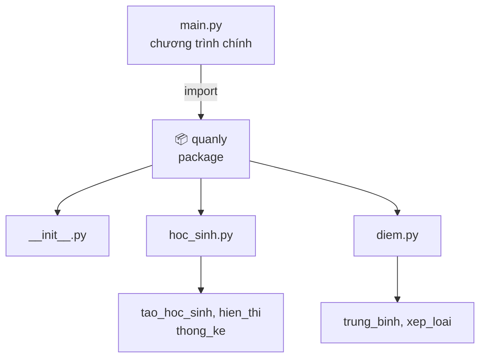

<!-- TỰ ĐỘNG ĐỒNG BỘ từ 01-Co-Ban/21-Package/bai.md — đừng sửa trực tiếp, sửa bản chính rồi chạy tools/sync_tracks.py -->

# Bài 21 — Package Trong Python

> 🎓 **Chương 6 – Tổ chức mã nguồn: Module, Package và File**

## 🧠 Điều kiện tiên quyết

- [Bài 20 — Module Trong Python](../20-Module/bai.md)

---

## 🎯 Mục tiêu

Sau bài học này, học viên sẽ:

* ✅ Hiểu **package là gì** và khác gì so với **module** đã học ở Bài 20.
* ✅ Biết vai trò của file đặc biệt **`__init__.py`** trong mỗi package.
* ✅ **Tự tạo được package** `quanly` gồm `hoc_sinh.py` và `diem.py`.
* ✅ Thành thạo **4 cách import** dữ liệu từ package.
* ✅ Hiểu được **lợi ích** của package khi dự án ngày càng lớn.
* ✅ Nắm được **cấu trúc thư mục chuẩn** của một dự án Python.

---

## 📖 Kiến thức

### 1. Nhắc lại Bài 20 — Module

Ở **Bài 20**, chúng ta học được: **module = một file `.py`** chứa hàm, biến, class. Muốn dùng lại thì `import`:

```python
# main.py — dùng module tien_ich.py cùng thư mục
import tien_ich

print(tien_ich.dien_tich_hinh_tron(5))   # 78.53975
```

Nhưng dự án càng lớn, số module càng nhiều: `hoc_sinh.py`, `diem.py`, `tinh_toan.py`, `xep_loai.py`... tất cả nằm chung một thư mục sẽ **rối như một ngăn bàn nhét đầy giấy tờ**. Vì thế Python có **package** — chiếc "ngăn kéo" để sắp xếp các module gọn gàng.

### 2. Package là gì?

> 💬 **Nói đơn giản:** Package là **một thư mục** chứa các module (file `.py`) và một file đặc biệt tên là **`__init__.py`**.

> 🏠 **Ví dụ đời thực:** Một **ngôi trường** gồm nhiều **khối lớp**: khối 10, khối 11, khối 12. Mỗi khối có nhiều **phòng học** (module). Nếu đặt 30 phòng học nằm lộn xộn ở sân trường thì không ai tìm được lớp — nhưng chia theo khối, theo tầng thì vô cùng rõ ràng. Package chính là "khối/tầng nhà", module là "phòng học".

**So sánh Module và Package:**

| | 📄 Module | 📦 Package |
|---|---|---|
| Là gì | Một file `.py` | Một **thư mục** chứa nhiều module |
| Điều kiện | Chỉ cần tên file `.py` | Chứa file `__init__.py` |
| Ví dụ | `hoc_sinh.py`, `diem.py` | `quanly/` chứa `hoc_sinh.py`, `diem.py` |
| Vai trò | Một bộ phận chức năng | Gom nhóm các bộ phận cùng chủ đề |

### 3. File `__init__.py` — "chìa khóa" của package

Mỗi package **phải** có file `__init__.py` để Python nhận diện "đây là một package, không phải thư mục tầm thường". File này có 3 vai trò:

* 🗝️ **Đánh dấu**: giúp Python biết thư mục đó là package.
* ⚙️ **Khởi tạo**: code trong `__init__.py` sẽ **chạy tự động** khi bạn import package — có thể để trống hoặc đặt biến chung ở đây.
* 🚪 **Mặt tiền**: nơi xuất những thứ "chính chủ" của package ra ngoài.

> 💡 Từ Python 3.3, thư mục thiếu `__init__.py` vẫn import được (gọi là *namespace package*), nhưng **người mới nên luôn tạo** `__init__.py` để rõ ràng và tương thích mọi phiên bản.

### 4. Cấu trúc package chuẩn



Cây thư mục cụ thể:

```
du_an/
├── main.py            ← file chạy chính, nằm cùng cấp với package
└── quanly/            ← package
    ├── __init__.py
    ├── hoc_sinh.py
    └── diem.py
```

### 5. Tạo package `quanly` — làm từng bước

**Bước 1:** Tạo thư mục tên `quanly`.

**Bước 2:** Trong thư mục đó, tạo file trống `__init__.py`:

```python
# __init__.py — file đặc biệt đánh dấu thư mục này là package
```

**Bước 3:** Tạo file `hoc_sinh.py`:

```python
# hoc_sinh.py — quản lý thông tin học sinh (dùng hàm, bài 23 mới học class)

def tao_hoc_sinh(ten, lop):
    """Tạo một học sinh dạng dict."""
    return {"ten": ten, "lop": lop}

def hien_thi(hs):
    """In thông tin một học sinh ra màn hình."""
    print(f"- {hs['ten']} (lớp {hs['lop']})")
```

**Bước 4:** Tạo file `diem.py`:

```python
# diem.py — xử lý điểm số

def trung_binh(danh_sach_diem):
    """Tính điểm trung bình của một danh sách điểm."""
    if len(danh_sach_diem) == 0:
        return 0.0
    return sum(danh_sach_diem) / len(danh_sach_diem)

def xep_loai(diem_tb):
    """Xếp loại theo điểm trung bình."""
    if diem_tb >= 8.0:
        return "Gioi"
    if diem_tb >= 6.5:
        return "Kha"
    if diem_tb >= 5.0:
        return "Trung binh"
    return "Yeu"
```

**Bước 5:** Tạo file `main.py` **cùng cấp** với thư mục `quanly` (không nằm trong) và chạy thử.

### 6. Các cách import từ package

| Cách viết | Cách gọi hàm | Khi nào dùng |
|---|---|---|
| `import quanly.hoc_sinh` | `quanly.hoc_sinh.tao_hoc_sinh(...)` | Muốn rõ nguồn gốc 100% |
| `from quanly import hoc_sinh` | `hoc_sinh.tao_hoc_sinh(...)` | Gõ ngắn, thường dùng nhất |
| `from quanly.hoc_sinh import tao_hoc_sinh` | `tao_hoc_sinh(...)` | Chỉ cần 1–2 hàm |
| `import quanly.hoc_sinh as hs` | `hs.tao_hoc_sinh(...)` | Đặt bí danh ngắn |

> ⚠️ **Lưu ý quan trọng:** Lệnh `import quanly` **không tự động** nạp các module con. Muốn dùng `hoc_sinh` thì phải import rõ tên module con: `import quanly.hoc_sinh` hoặc `from quanly import hoc_sinh`.

### 7. Lợi ích của package

| Lợi ích | Giải thích dễ hiểu |
|---|---|
| 🗂️ **Tổ chức rõ ràng** | Module cùng chủ đề nằm chung một nơi, dễ tìm như tủ hồ sơ |
| 🆔 **Tránh trùng tên** | Hai package khác nhau có thể cùng tên hàm `trung_binh` mà không đụng nhau |
| ♻️ **Tái sử dụng** | Copy cả thư mục package sang dự án khác là dùng được ngay |
| 👥 **Làm việc nhóm** | Mỗi người đảm trách một package, không ai sửa của ai |
| 🔍 **Dễ bảo trì** | Sửa chức năng chỉ cần sửa đúng file bên trong package |

### 8. Cấp bậc thư mục chuẩn của dự án Python

Một dự án Python thực tế thường phân cấp như sau:

```
du_an/
├── main.py                # điểm vào — người dùng chạy file này
├── quanly/                # package chính (chức năng cốt lõi)
│   ├── __init__.py
│   ├── hoc_sinh.py
│   └── diem.py
├── tien_ich/              # package phụ trợ (dùng chung)
│   ├── __init__.py
│   ├── tinh_toan.py
│   └── chuoi.py
├── data/                  # thư mục dữ liệu (Bài 22 sẽ đọc/ghi file)
└── README.md              # mô tả dự án
```

**Quy tắc vàng:** file chạy chính (`main.py`) đặt **cùng cấp** với các package và chỉ import package, không import lung tung.

---

## 💡 Ví dụ minh họa

### Ví dụ 1: Sử dụng package `quanly` vừa tạo

File `main.py`:

```python
# main.py — chạy chương trình chính
import quanly.hoc_sinh   # Cách 1: import cả module con
from quanly import diem  # Cách 2: import module con

# Tạo một học sinh
hs1 = quanly.hoc_sinh.tao_hoc_sinh("Nguyen Van An", "10A1")
quanly.hoc_sinh.hien_thi(hs1)

# Tính điểm trung bình và xếp loại
diem_toan = 8.5
diem_van = 7.0
diem_anh = 9.0
tb = diem.trung_binh([diem_toan, diem_van, diem_anh])
print("Diem trung binh:", tb, "-> Xep loai:", diem.xep_loai(tb))
```

Kết quả chạy:

```
- Nguyen Van An (lớp 10A1)
Diem trung binh: 8.166666666666666 -> Xep loai: Gioi
```

**Giải thích từng dòng:**

| Dòng code | Ý nghĩa |
|---|---|
| `import quanly.hoc_sinh` | Nạp module con, gọi qua tên đầy đủ `quanly.hoc_sinh.hien_thi(...)` |
| `from quanly import diem` | Nạp module con `diem`, gọi ngắn gọn `diem.trung_binh(...)` |
| `quanly.hoc_sinh.tao_hoc_sinh(...)` | Gọi hàm nằm trong package — dấu chấm phân cấp từng cấp |
| `diem.trung_binh([...])` | Truyền list điểm cho hàm tính trung bình |

### Ví dụ 2: `__init__.py` làm "mặt tiền" của package

Sửa `__init__.py` để người dùng package chỉ cần **một câu import**:

```python
# __init__.py — mặt tiền: xuất sẵn những hàm hay dùng nhất
from .hoc_sinh import tao_hoc_sinh, hien_thi
from .diem import trung_binh, xep_loai

TEN_PHAN_MEM = "Quan ly hoc sinh v1.0"
```

Khi đó `main.py`:

```python
# main.py — import gọn từ chính package
import quanly
from quanly import tao_hoc_sinh, xep_loai

print(quanly.TEN_PHAN_MEM)              # dùng biến trong __init__.py
hs = tao_hoc_sinh("Tran Thi Mai", "11B2")
print("Diem 7.5 ->", xep_loai(7.5))
```

**Giải thích từng dòng:**

| Dòng code | Ý nghĩa |
|---|---|
| `from .hoc_sinh import ...` | Dấu `.` nghĩa là "import từ **chính package này**" (import tương đối) |
| `TEN_PHAN_MEM = ...` | Biến chung đặt trong `__init__.py`, mọi nơi đọc qua `quanly.TEN_PHAN_MEM` |
| `import quanly` | Giờ chỉ cần import package là đã có mọi thứ được xuất ra |

### Ví dụ 3: Package con (package lồng package)

Tạo thư mục `quanly/giaovu/` — bên trong đặt thêm `__init__.py` và `lop_hoc.py`:

```python
# lop_hoc.py — bên trong quanly/giaovu/
def danh_sach_lop():
    """Trả về danh sách lớp của trường."""
    return ["10A1", "10A2", "11B1"]
```

File `main.py` gọi bằng đường dẫn đầy đủ từng cấp:

```python
# main.py — gọi package con bằng nhiều cấp
from quanly.giaovu import lop_hoc

for ten_lop in lop_hoc.danh_sach_lop():
    print("Lop:", ten_lop)
```

**Giải thích từng dòng:**

| Dòng code | Ý nghĩa |
|---|---|
| `from quanly.giaovu import lop_hoc` | Dấu chấm đi qua từng cấp: package `quanly` → package con `giaovu` → module `lop_hoc` |
| `for ten_lop in ...` | Duyệt list trả về từ hàm trong module con |

---

## 🔬 Ví dụ nâng cao

### Ví dụ 1: Chương trình quản lý điểm bằng package `quanly`

Tạo 3 học sinh, nhập điểm 3 môn, tính điểm trung bình và xếp loại từng bạn, in bảng tổng hợp:

```python
# main.py — dùng toàn bộ package quanly
import quanly.hoc_sinh as hs_mod
from quanly import diem

# Dữ liệu mẫu: ten, lop, diem 3 mon
danh_sach = [
    {"ten": "Nguyen Van An", "lop": "10A1", "diem": [8.5, 7.0, 9.0]},
    {"ten": "Tran Thi Mai", "lop": "10A1", "diem": [6.0, 6.5, 7.0]},
    {"ten": "Le Quang Binh", "lop": "10A2", "diem": [4.5, 5.0, 5.5]},
]

print("=== BANG DIEM LOP 10 ===")
for hs in danh_sach:
    tb = diem.trung_binh(hs["diem"])
    loai = diem.xep_loai(tb)
    print(f"{hs['ten']:<20} TB: {tb:<6.2f} -> {loai}")
```

Kết quả:

```
=== BANG DIEM LOP 10 ===
Nguyen Van An       TB: 8.17  -> Gioi
Tran Thi Mai        TB: 6.50  -> Kha
Le Quang Binh       TB: 5.00  -> Trung binh
```

### Ví dụ 2: Tránh trùng tên giữa hai package

Hai package độc lập `diem` và `danh_gia` đều có hàm `xep_loai` nhưng **không xung đột**:

```python
# diem/xep_loai.py  ->  def xep_loai(tb): chia theo thang điểm 10
# danh_gia/xep_loai.py -> def xep_loai(tb): đánh giá "Tot"/"Chua tot" theo thang 100

from diem import xep_loai as xep_loai_diem
from danh_gia import xep_loai as xep_loai_danh_gia

print(xep_loai_diem(8.0))          # Gioi
print(xep_loai_danh_gia(80))       # Tot
```

> 💡 Dùng `as` để đặt bí danh cho **hàm** cũng được — đây là cách xử lý trùng tên khéo léo nhất.

---

## ⚠️ Lỗi thường gặp

### Lỗi 1: `ModuleNotFoundError: No module named 'quanly'`

```python
import quanly   # ❌ báo lỗi
```

* **Nguyên nhân:** File `main.py` **không nằm cùng cấp** với thư mục `quanly`, hoặc thư mục chưa có `__init__.py`, hoặc gõ sai tên.
* **Cách sửa:** Kiểm tra cây thư mục: `main.py` và `quanly/` phải cùng một thư mục cha; đảm bảo có `__init__.py` bên trong `quanly/`.

### Lỗi 2: `AttributeError: module 'quanly' has no attribute 'hoc_sinh'`

```python
import quanly
quanly.hoc_sinh.tao_hoc_sinh("An", "10A1")   # ❌ báo AttributeError
```

* **Nguyên nhân:** `import quanly` chỉ nạp `__init__.py`, **không nạp** module con `hoc_sinh`.
* **Cách sửa:** Import đầy đủ: `import quanly.hoc_sinh` hoặc `from quanly import hoc_sinh`.

### Lỗi 3: `ImportError: cannot import name 'trung_binh' from 'quanly'`

```python
from quanly import trung_binh   # ❌ trung_binh nằm trong quanly.diem
```

* **Nguyên nhân:** Hàm nằm trong module con `diem.py`, không nằm trực tiếp trong package.
* **Cách sửa:** `from quanly.diem import trung_binh`, hoặc chủ động xuất hàm đó ra trong `__init__.py`.

### Lỗi 4: Quên mất `if __name__ == "__main__"` trong module con

```python
# hoc_sinh.py
print("Hoc sinh module dang chay!")   # ❌ in ra mỗi lần bị import
```

* **Nguyên nhân:** Code chạy thử viết thẳng trong module con nên bị chạy lại mỗi lần import.
* **Cách sửa:** Bọc phần chạy thử trong `if __name__ == "__main__":` (đã học Bài 20).

---

## 💎 Mẹo

* 📁 **Một package = một chủ đề lớn** (quản lý, tiện ích, dữ liệu...) — đừng gom tất cả vào một package "vạn năng".
* 🏷️ Đặt tên package **chữ thường, ngắn gọn**: `quanly`, `tien_ich`, `ngan_hang` — không dùng dấu gạch ngang.
* 🚪 Giữ `__init__.py` **gọn nhẹ**: chỉ xuất những thứ "chính chủ", tránh code xử lý nặng nề.
* 🔍 Sau khi import, gõ `dir(quanly)` hoặc `quanly.__dict__` để xem package chứa gì.
* 📚 Khi copy dự án cho người khác, copy **cả thư mục package** — đó là "gói hàng" hoàn chỉnh.

---

## 📝 Tóm tắt

| Khái niệm | Nội dung |
|---|---|
| 📦 Package | Thư mục chứa module + file `__init__.py` |
| 🗝️ `__init__.py` | Đánh dấu package; code trong đó chạy khi import |
| 🔗 Import | `import quanly.hoc_sinh`, `from quanly import hoc_sinh`, `from quanly.hoc_sinh import tao_hoc_sinh`, `import ... as ...` |
| ⚠️ Lưu ý | `import quanly` không tự nạp module con |
| 🗂️ Lợi ích | Tổ chức rõ ràng, tránh trùng tên, tái sử dụng, làm việc nhóm |
| 🌳 Cấp thư mục | `main.py` cùng cấp với các package; package con nằm lồng trong package cha |

---

## 🧪 Kiểm tra nhanh

1. ❓ Package khác module ở điểm nào?
2. ❓ File nào bắt buộc phải có trong một package?
3. ❓ `import quanly` có nạp sẵn `quanly.hoc_sinh` không?
4. ❓ Viết lệnh import để gọi thẳng hàm `xep_loai` nằm trong `quanly/diem.py`.
5. ❓ Dấu chấm `.` trong `from .diem import trung_binh` có nghĩa gì?
6. ❓ Hai package có thể có cùng tên hàm không? Vì sao?
7. ❓ File chạy chính `main.py` nên đặt ở đâu so với package?
8. ❓ Code trong `__init__.py` chạy khi nào?
9. ❓ Nếu gọi `quanly.hoc_sinh` sau lệnh `import quanly` thì gặp lỗi gì?
10. ❓ Nêu 2 cách xử lý khi hai package có hàm trùng tên.

<details>
<summary>🔍 Xem đáp án</summary>

1. Module là một file `.py`; package là thư mục chứa nhiều module và có `__init__.py`.
2. File `__init__.py`.
3. Không — cần `import quanly.hoc_sinh` hoặc `from quanly import hoc_sinh`.
4. `from quanly.diem import xep_loai`.
5. Import từ chính package hiện tại (import tương đối).
6. Có — vì gọi qua tên package nên không xung đột.
7. Cùng cấp (cùng thư mục cha) với các package.
8. Khi package được import.
9. `AttributeError: module 'quanly' has no attribute 'hoc_sinh'`.
10. Dùng `as` đặt bí danh, hoặc gọi đầy đủ tên package.

</details>

---

## 📚 Bài đọc thêm

* [Python.org – Packages](https://docs.python.org/3/tutorial/modules.html#packages)
* [Python.org – The import system](https://docs.python.org/3/reference/import.html)
* [Real Python – Python Modules and Packages](https://realpython.com/python-modules-packages/)
* [PEP 8 – đặt tên module và package](https://peps.python.org/pep-0008/#package-and-module-names)

---

---

## 🧩 Bài tập

> 📝 🎯 **Chủ đề:** Tạo package `quanly`, tổ chức module vào package, import từ package, sử dụng package trong `main.py`.

## 🟢 Dễ (Bài 1 – 7)

### Bài 1: Tạo package đầu tiên

* **Đề bài:** Tạo thư mục `quanly` chứa file `__init__.py` (để trống). Viết `main.py` cùng cấp, chạy thử `import quanly` và in ra `quanly.__name__`.
* **Input:** Không có.
* **Output:**
  ```
  quanly
  ```
* **Gợi ý:** `print(quanly.__name__)` cho ra tên package.

### Bài 2: Module đầu tiên trong package

* **Đề bài:** Trong `quanly`, tạo file `hoc_sinh.py` chứa hàm `chao_hoc_sinh(ten)` in lời chào: `Xin chao ban {ten}!`. Viết `main.py` import `quanly.hoc_sinh` và gọi hàm với tên "An".
* **Input:** Không có.
* **Output:**
  ```
  Xin chao ban An!
  ```
* **Gợi ý:** Gọi hàm bằng cú pháp `quanly.hoc_sinh.chao_hoc_sinh("An")`.

### Bài 3: Module thứ hai – điểm số

* **Đề bài:** Trong `quanly`, tạo file `diem.py` chứa hàm `trung_binh(danh_sach)` trả về trung bình cộng của list điểm (danh sách rỗng thì trả về 0.0). Viết `main.py` in kết quả của `[8, 7, 9]`.
* **Input:** Không có.
* **Output:**
  ```
  Diem trung binh: 8.0
  ```
* **Gợi ý:** Dùng `sum(danh_sach) / len(danh_sach)`.

### Bài 4: Import kiểu 1 – `import quanly.hoc_sinh`

* **Đề bài:** Dùng cấu trúc bài 2, viết `main.py` chỉ dùng lệnh `import quanly.hoc_sinh` (không dùng `from`), tạo học sinh bằng hàm `tao_hoc_sinh("Mai", "10A1")` trả về dict `{"ten": ..., "lop": ...}` rồi in ra tên.
* **Input:** Không có.
* **Output:**
  ```
  Mai
  ```
* **Gợi ý:** `hs = quanly.hoc_sinh.tao_hoc_sinh(...)` rồi `print(hs["ten"])`.

### Bài 5: Import kiểu 2 – `from quanly import diem`

* **Đề bài:** Viết `main.py` dùng `from quanly import diem` để gọi `diem.trung_binh([10, 10, 10])` và in kết quả.
* **Input:** Không có.
* **Output:**
  ```
  Trung binh: 10.0
  ```
* **Gợi ý:** Khác bài 3 là lệnh import, còn cách gọi tương tự nhau.

### Bài 6: Import kiểu 3 – lấy thẳng hàm

* **Đề bài:** Viết `main.py` dùng `from quanly.diem import trung_binh, xep_loai` (viết thêm hàm `xep_loai(tb)` theo thang: ≥8 Giỏi, ≥6.5 Khá, ≥5 Trung bình, còn lại Yếu). In xếp loại của điểm 6.8.
* **Input:** Không có.
* **Output:**
  ```
  Diem 6.8 -> Kha
  ```
* **Gợi ý:** Khi import thẳng tên thì gọi không cần tiền tố.

### Bài 7: Import kiểu 4 – bí danh `as`

* **Đề bài:** Viết `main.py` dùng `import quanly.hoc_sinh as hs` và `import quanly.diem as d`. Gọi `hs.chao_hoc_sinh("Binh")` và `d.trung_binh([5, 6])`, in cả hai kết quả.
* **Input:** Không có.
* **Output:**
  ```
  Xin chao ban Binh!
  Diem trung binh: 5.5
  ```
* **Gợi ý:** `as` chỉ đặt bí danh ngắn, cách dùng y như tên thật.

---

## 🟡 Trung bình (Bài 8 – 14)

### Bài 8: Học sinh dạng dict

* **Đề bài:** Trong `hoc_sinh.py`, viết hàm `tao_hoc_sinh(ten, lop)` trả về dict và hàm `hien_thi(hs)` in ra `- Ten (lop Lop)`. Viết `main.py` tạo 2 học sinh và hiển thị cả hai.
* **Input:** Không có.
* **Output:**
  ```
  - Nguyen Van An (lop 10A1)
  - Tran Thi Mai (lop 11B2)
  ```
* **Gợi ý:** Dùng f-string: `f"- {hs['ten']} (lop {hs['lop']})"`.

### Bài 9: Xếp loại học sinh

* **Đề bài:** Hoàn thiện `diem.py` với hàm `xep_loai(tb)` như bài 6. Viết `main.py` có list 5 điểm trung bình mẫu `[9.5, 7.0, 5.2, 4.0, 8.0]`, in từng cặp `diem -> loai`.
* **Input:** Không có.
* **Output:**
  ```
  9.5 -> Gioi
  7.0 -> Kha
  5.2 -> Trung binh
  4.0 -> Yeu
  8.0 -> Gioi
  ```
* **Gợi ý:** Dùng vòng lặp `for` duyệt list (kiến thức Bài 14).

### Bài 10: Kết hợp hai module

* **Đề bài:** Viết `main.py` kết hợp `hoc_sinh.py` và `diem.py`: tạo 3 học sinh, mỗi bạn gắn list điểm 3 môn, in ra `Ten: diem TB - Xep loai` cho từng bạn.
* **Input:** Không có.
* **Output:**
  ```
  Nguyen Van An: 8.17 - Gioi
  Tran Thi Mai: 6.50 - Kha
  Le Quang Binh: 5.00 - Trung binh
  ```
* **Gợi ý:** Tổ chức dữ liệu dạng list chứa dict: `{"ten": ..., "lop": ..., "diem": [...]}`.

### Bài 11: Package con

* **Đề bài:** Tạo package con `quanly/giaovu/` gồm `__init__.py` và `lop_hoc.py` chứa hàm `danh_sach_lop()` trả về `["10A1", "10A2", "11B1"]`. Viết `main.py` in từng lớp trong danh sách.
* **Input:** Không có.
* **Output:**
  ```
  Lop: 10A1
  Lop: 10A2
  Lop: 11B1
  ```
* **Gợi ý:** Import qua hai cấp: `from quanly.giaovu import lop_hoc`.

### Bài 12: `__init__.py` làm mặt tiền

* **Đề bài:** Sửa `__init__.py` để xuất sẵn `tao_hoc_sinh`, `trung_binh`, `xep_loai` (dùng import tương đối `from .ten_file import ...`), thêm biến `TEN_PHAN_MEM = "QuanLy v1.0"`. Viết `main.py` chỉ cần `import quanly` rồi dùng thẳng các hàm và in `quanly.TEN_PHAN_MEM`.
* **Input:** Không có.
* **Output:**
  ```
  QuanLy v1.0
  Trung binh: 7.0
  ```
* **Gợi ý:** Trong `__init__.py` dùng `from .hoc_sinh import tao_hoc_sinh`.

### Bài 13: Package tiện ích tự đặt

* **Đề bài:** Tạo package `tien_ich` gồm `__init__.py`, `tinh_toan.py` (hàm `giai_thua(n)`) và `chuoi.py` (hàm `dao_nguoc(s)`). Viết `main.py` in `giai_thua(5)` và `dao_nguoc("Python")`.
* **Input:** Không có.
* **Output:**
  ```
  Giai thua 5: 120
  Dao nguoc: nohtyP
  ```
* **Gợi ý:** `giai_thua` dùng vòng lặp `for` hoặc `while`; `dao_nguoc` dùng `s[::-1]`.

### Bài 14: Hai package, không đụng nhau

* **Đề bài:** Tạo 2 package độc lập: `diem` (hàm `xep_loai(tb)` thang 10) và `danh_gia` (hàm `xep_loai(tb)` thang 100: ≥80 "Tot", còn lại "Chua tot"). Viết `main.py` gọi cả hai và in kết quả của `8.0` và `80`.
* **Input:** Không có.
* **Output:**
  ```
  Diem 8.0 -> Gioi
  Danh gia 80 -> Tot
  ```
* **Gợi ý:** Dùng `as` cho một trong hai lệnh import để phân biệt.

---

## 🔴 Khó (Bài 15 – 20)

### Bài 15: Thống kê học sinh theo lớp

* **Đề bài:** Thêm vào `hoc_sinh.py` hàm `thong_ke(danh_sach)` nhận list học sinh dict, trả về dict `{lop: so_luong}`. Viết `main.py` với 4 học sinh (2 lớp khác nhau) và in kết quả thống kê.
* **Input:** Không có.
* **Output:**
  ```
  Thong ke theo lop:
  10A1: 2 hoc sinh
  10A2: 2 hoc sinh
  ```
* **Gợi ý:** Duyệt danh sách, nếu lớp chưa có trong dict thì khởi tạo 0, rồi `+1`.

### Bài 16: Tìm học sinh điểm cao nhất

* **Đề bài:** Dùng `quanly` (hoc_sinh + diem): tạo 3 học sinh kèm điểm 3 môn, tính điểm TB từng bạn, tìm và in tên bạn có điểm TB **cao nhất**.
* **Input:** Không có.
* **Output:**
  ```
  Hoc sinh cao diem nhat: Nguyen Van An (8.17)
  ```
* **Gợi ý:** Lưu `(ten, tb)` vào list, duyệt so sánh `max`, hoặc dùng hàm `max` với `key`.

### Bài 17: Module con sử dụng lẫn nhau

* **Đề bài:** Thêm file `bang_diem.py` vào `quanly`, bên trong **import từ chính package** (`from . import diem`) và có hàm `in_bang(danh_sach)` in bảng điểm 3 môn + TB của từng học sinh. Viết `main.py` gọi `in_bang`.
* **Input:** Không có.
* **Output:**
  ```
  Ten                Toan  Van  Anh   TB
  Nguyen Van An        8.5  7.0  9.0  8.17
  Tran Thi Mai         6.0  6.5  7.0  6.50
  ```
* **Gợi ý:** F-string canh cột: `f"{ten:<20} {t:<5} {v:<5} {a:<5} {tb:.2f}"`.

### Bài 18: Package mô phỏng ngân hàng

* **Đề bài:** Tạo package `ngan_hang` gồm `tai_khoan.py` (hàm `tao_tai_khoan(so_du)`, `nap(tk, tien)`, `rut(tk, tien)` trả về `True/False`) và `giao_dich.py` (hàm `ghi_giao_dich(lich_su, mo_ta)` thêm chuỗi vào list). Viết `main.py`: tạo tài khoản 500000, nạp 200000, rút 100000, in lịch sử giao dịch.
* **Input:** Không có.
* **Output:**
  ```
  So du: 600000
  Lich su giao dich:
  - Nap 200000
  - Rut 100000
  ```
* **Gợi ý:** `rut` cần kiểm tra `tien <= so_du`; `tk["so_du"]` cập nhật sau mỗi lệnh.

### Bài 19: Tái cấu trúc từ Bài 20

* **Đề bài:** Ở Bài 20 bạn có module `tien_ich.py` với `dien_tich_hinh_tron(r)` và `chu_vi_hinh_tron(r)`. Hãy chuyển thành package `tien_ich` gồm `hinh_tron.py` (2 hàm trên) và `hinh_chu_nhat.py` (`dien_tich(dai, rong)`, `chu_vi(dai, rong)`). Viết `main.py` mới dùng package, in kết quả cho `r = 5` và `dai = 4, rong = 3`.
* **Input:** Không có.
* **Output:**
  ```
  Hinh tron r=5: dien tich 78.54, chu vi 31.42
  Hinh chu nhat 4x3: dien tich 12, chu vi 14
  ```
* **Gợi ý:** `main.py` nằm cùng cấp với package `tien_ich`; gọi qua `tien_ich.hinh_tron.dien_tich_hinh_tron(5)`.

### Bài 20: Tiểu dự án – hệ thống quản lý điểm

* **Đề bài:** Hoàn thiện package `quanly` thành "hệ thống": `__init__.py` chứa `__version__ = "1.0"` và xuất sẵn các hàm chính; `hoc_sinh.py` có `tao_hoc_sinh`, `hien_thi`, `thong_ke`; `diem.py` có `trung_binh`, `xep_loai`. Viết `main.py`: tạo 4 học sinh (2 lớp), tính TB và xếp loại từng bạn, in bảng tổng hợp, in thống kê theo lớp và in `quanly.__version__`.
* **Input:** Không có.
* **Output:**
  ```
  Quan ly hoc sinh v1.0
  === BANG DIEM ===
  Nguyen Van An       TB: 8.17 - Gioi
  ...
  === THONG KE ===
  10A1: 2 hoc sinh
  10A2: 2 hoc sinh
  ```
* **Gợi ý:** Chia chương trình thành các khối rõ ràng; mọi hàm lấy từ package `quanly`.

---

## 🎯 Tổng kết sau khi làm bài

* ✅ Tự tạo được package gồm `__init__.py` và nhiều module.
* ✅ Thành thạo 4 kiểu import và biết khi nào dùng kiểu nào.
* ✅ Biết tổ chức package con, import tương đối, "mặt tiền" `__init__.py`.
* ✅ Hiểu vì sao package giúp dự án lớn vẫn gọn gàng.

> 💪 Làm xong 20 bài, bạn đã sẵn sàng cho **Bài 22: đọc/ghi file** để lưu dữ liệu lâu dài!

---

## ✅ Đáp án

> 💡 **Hãy tự làm bài tập trước** rồi mới mở đáp án.

## 🟢 Dễ (Bài 1 – 7)


<details>
<summary>✅ Bài 1: Tạo package đầu tiên</summary>


**Phân tích:** Package chỉ cần một thư mục + file `__init__.py`; kiểm chứng bằng cách import được.

**Ý tưởng:** Tạo thư mục `quanly`, đặt `__init__.py` trống, viết `main.py` import và in `__name__`.

**Thuật toán:**
1. Tạo thư mục `quanly`, trong đó tạo file `__init__.py` (trống).
2. Tạo `main.py` cùng cấp với `quanly`.
3. Import và in `quanly.__name__`.

**Code:**

Tạo `quanly/__init__.py` — để trống (mỗi `#` đều được):

```python
# __init__.py — đánh dấu thư mục quanly là package
```

Tạo `main.py`:

```python
# main.py — kiểm chứng package được import thành công
import quanly

print(quanly.__name__)
```

**Giải thích code:**
* `import quanly` — nạp package; nhờ có `__init__.py`, Python nhận diện thư mục là package.
* `quanly.__name__` — biến đặc biệt của mọi module/package, in ra tên `quanly`.

**Độ phức tạp:** O(1).

---

</details>

<details>
<summary>✅ Bài 2: Module đầu tiên trong package</summary>


**Phân tích:** Cần một module con trong package và gọi qua cú pháp chấm đầy đủ.

**Ý tưởng:** Viết hàm trong `hoc_sinh.py`; `main.py` import `quanly.hoc_sinh` rồi gọi.

**Thuật toán:**
1. Tạo `hoc_sinh.py` với hàm `chao_hoc_sinh(ten)`.
2. `main.py`: `import quanly.hoc_sinh`.
3. Gọi `quanly.hoc_sinh.chao_hoc_sinh("An")`.

**Code:**

Tạo `quanly/hoc_sinh.py`:

```python
# hoc_sinh.py — module quản lý học sinh

def chao_hoc_sinh(ten):
    """In lời chào đến một học sinh."""
    print(f"Xin chao ban {ten}!")
```

Tạo `main.py`:

```python
# main.py — dùng module trong package
import quanly.hoc_sinh

quanly.hoc_sinh.chao_hoc_sinh("An")
```

**Giải thích code:**
* `import quanly.hoc_sinh` — nạp module con; để gọi hàm phải đi qua **từng cấp**: `quanly` → `hoc_sinh` → hàm.
* f-string `f"Xin chao ban {ten}!"` — chèn giá trị `ten` vào chuỗi.

**Độ phức tạp:** O(1).

---

</details>

<details>
<summary>✅ Bài 3: Module thứ hai – điểm số</summary>


**Phân tích:** Hàm tính trung bình cộng list; xử lý cả trường hợp list rỗng.

**Ý tưởng:** `sum()` cộng toàn bộ, `len()` đếm số lượng; chia lấy trung bình.

**Thuật toán:**
1. Nếu list rỗng → trả về 0.0.
2. Trả về `sum(danh_sach) / len(danh_sach)`.

**Code:**

Tạo `quanly/diem.py`:

```python
# diem.py — module xử lý điểm số

def trung_binh(danh_sach):
    """Tính điểm trung bình của một list điểm."""
    if len(danh_sach) == 0:
        return 0.0
    return sum(danh_sach) / len(danh_sach)
```

Tạo `main.py`:

```python
# main.py — tính điểm trung bình
import quanly.diem

tb = quanly.diem.trung_binh([8, 7, 9])
print("Diem trung binh:", tb)
```

**Giải thích code:**
* `sum(danh_sach)` — tổng list `[8, 7, 9]` = 24.
* `24 / 3` = `8.0` — phép chia luôn trả về số thực.
* Kiểm tra `len == 0` tránh lỗi chia cho 0.

**Độ phức tạp:** O(n) với n là số phần tử list.

---

</details>

<details>
<summary>✅ Bài 4: Import kiểu 1 – `import quanly.hoc_sinh`</summary>


**Phân tích:** Dùng đúng cú pháp import module con và truy cập qua đầy đủ tên.

**Ý tưởng:** `tao_hoc_sinh` trả về dict; in `hs["ten"]`.

**Thuật toán:**
1. Import `quanly.hoc_sinh`.
2. Gọi `tao_hoc_sinh("Mai", "10A1")`.
3. In giá trị `ten` của dict.

**Code:**

Tạo `quanly/hoc_sinh.py`:

```python
# hoc_sinh.py — tạo và xử lý học sinh

def tao_hoc_sinh(ten, lop):
    """Tạo học sinh dạng dict."""
    return {"ten": ten, "lop": lop}
```

Tạo `main.py`:

```python
# main.py — import module con qua dấu chấm
import quanly.hoc_sinh

hs = quanly.hoc_sinh.tao_hoc_sinh("Mai", "10A1")
print(hs["ten"])
```

**Giải thích code:**
* `quanly.hoc_sinh.tao_hoc_sinh("Mai", "10A1")` — gọi qua đầy đủ 2 cấp; kết quả là dict `{"ten": "Mai", "lop": "10A1"}`.
* `hs["ten"]` — lấy giá trị theo khóa.

**Độ phức tạp:** O(1).

---

</details>

<details>
<summary>✅ Bài 5: Import kiểu 2 – `from quanly import diem`</summary>


**Phân tích:** Import module con bằng `from`, gọi ngắn gọn hơn.

**Ý tưởng:** `from quanly import diem` cho phép gọi `diem.trung_binh(...)`.

**Thuật toán:**
1. Import module `diem` từ package `quanly`.
2. Gọi hàm và in kết quả.

**Code:**

Tạo `quanly/diem.py` (như bài 3):

```python
# diem.py — module xử lý điểm số

def trung_binh(danh_sach):
    """Tính điểm trung bình của một list điểm."""
    if len(danh_sach) == 0:
        return 0.0
    return sum(danh_sach) / len(danh_sach)
```

Tạo `main.py`:

```python
# main.py — import module con bằng from
from quanly import diem

tb = diem.trung_binh([10, 10, 10])
print("Trung binh:", tb)
```

**Giải thích code:**
* `from quanly import diem` — lấy module `diem` ra, gọi thẳng `diem.trung_binh(...)` mà không cần tiền tố `quanly.`.
* `[10, 10, 10]` → tổng 30, chia 3 = `10.0`.

**Độ phức tạp:** O(n).

---

</details>

<details>
<summary>✅ Bài 6: Import kiểu 3 – lấy thẳng hàm</summary>


**Phân tích:** Import trực tiếp tên hàm giúp code ngắn nhất.

**Ý tưởng:** `from quanly.diem import trung_binh, xep_loai`; viết `xep_loai` theo thang điểm.

**Thuật toán:**
1. Viết `xep_loai(tb)` với các mốc 8.0 / 6.5 / 5.0.
2. Import thẳng hai hàm.
3. In xếp loại của 6.8.

**Code:**

Tạo `quanly/diem.py`:

```python
# diem.py — điểm số và xếp loại

def trung_binh(danh_sach):
    """Tính điểm trung bình của một list điểm."""
    if len(danh_sach) == 0:
        return 0.0
    return sum(danh_sach) / len(danh_sach)

def xep_loai(tb):
    """Xếp loại theo điểm trung bình (thang 10)."""
    if tb >= 8.0:
        return "Gioi"
    if tb >= 6.5:
        return "Kha"
    if tb >= 5.0:
        return "Trung binh"
    return "Yeu"
```

Tạo `main.py`:

```python
# main.py — import thẳng tên hàm
from quanly.diem import trung_binh, xep_loai

print("Diem 6.8 ->", xep_loai(6.8))
```

**Giải thích code:**
* Import thẳng tên → gọi `xep_loai(6.8)` không cần tiền tố.
* `6.8 >= 6.5` nên rơi vào nhánh "Kha" (thứ tự kiểm tra từ cao xuống thấp).

**Độ phức tạp:** O(1).

---

</details>

<details>
<summary>✅ Bài 7: Import kiểu 4 – bí danh `as`</summary>


**Phân tích:** Đặt bí danh ngắn giúp gõ nhanh; hành vi không đổi.

**Ý tưởng:** `import quanly.hoc_sinh as hs` và `import quanly.diem as d`.

**Thuật toán:**
1. Import hai module với bí danh.
2. Gọi hàm qua bí danh, in kết quả.

**Code:**

Tạo `quanly/hoc_sinh.py`:

```python
# hoc_sinh.py
def chao_hoc_sinh(ten):
    """In lời chào đến một học sinh."""
    print(f"Xin chao ban {ten}!")
```

Tạo `quanly/diem.py`:

```python
# diem.py
def trung_binh(danh_sach):
    """Tính điểm trung bình của một list điểm."""
    if len(danh_sach) == 0:
        return 0.0
    return sum(danh_sach) / len(danh_sach)
```

Tạo `main.py`:

```python
# main.py — bí danh as giúp code ngắn gọn
import quanly.hoc_sinh as hs
import quanly.diem as d

hs.chao_hoc_sinh("Binh")
print("Diem trung binh:", d.trung_binh([5, 6]))
```

**Giải thích code:**
* `as hs` — từ đây `hs` chính là `quanly.hoc_sinh`.
* `d.trung_binh([5, 6])` → tổng 11 / 2 = `5.5`.

**Độ phức tạp:** O(n).

---

</details>

## 🟡 Trung bình (Bài 8 – 14)


<details>
<summary>✅ Bài 8: Học sinh dạng dict</summary>


**Phân tích:** Mỗi học sinh là một dict; hàm `hien_thi` đọc khóa và in đẹp.

**Ý tưởng:** `tao_hoc_sinh` trả dict; `hien_thi` dùng f-string.

**Thuật toán:**
1. Tạo dict `{"ten": ..., "lop": ...}`.
2. Duyệt danh sách 2 học sinh, in từng bạn.

**Code:**

Tạo `quanly/hoc_sinh.py`:

```python
# hoc_sinh.py — tạo và hiển thị học sinh

def tao_hoc_sinh(ten, lop):
    """Tạo học sinh dạng dict."""
    return {"ten": ten, "lop": lop}

def hien_thi(hs):
    """In thông tin một học sinh."""
    print(f"- {hs['ten']} (lop {hs['lop']})")
```

Tạo `main.py`:

```python
# main.py — hiển thị danh sách học sinh
from quanly import hoc_sinh

danh_sach = [
    hoc_sinh.tao_hoc_sinh("Nguyen Van An", "10A1"),
    hoc_sinh.tao_hoc_sinh("Tran Thi Mai", "11B2"),
]

for hs in danh_sach:
    hoc_sinh.hien_thi(hs)
```

**Giải thích code:**
* `hoc_sinh.tao_hoc_sinh(...)` — tạo từng dict trong list.
* Vòng `for` duyệt list, mỗi lượt gọi `hien_thi` với một học sinh.
* f-string `{hs['ten']}` — truy cập khóa trong dict ngay trong chuỗi.

**Độ phức tạp:** O(n) với n số học sinh.

---

</details>

<details>
<summary>✅ Bài 9: Xếp loại học sinh</summary>


**Phân tích:** Áp dụng hàm `xep_loai` cho 5 giá trị mẫu, in cặp "diem -> loai".

**Ý tưởng:** Duyệt list điểm, gọi `xep_loai` từng phần tử.

**Thuật toán:**
1. Có list 5 điểm mẫu.
2. Với mỗi điểm, in `diem -> xep_loai(diem)`.

**Code:**

Tạo `quanly/diem.py`:

```python
# diem.py — điểm số và xếp loại

def trung_binh(danh_sach):
    """Tính điểm trung bình của một list điểm."""
    if len(danh_sach) == 0:
        return 0.0
    return sum(danh_sach) / len(danh_sach)

def xep_loai(tb):
    """Xếp loại theo điểm trung bình (thang 10)."""
    if tb >= 8.0:
        return "Gioi"
    if tb >= 6.5:
        return "Kha"
    if tb >= 5.0:
        return "Trung binh"
    return "Yeu"
```

Tạo `main.py`:

```python
# main.py — xếp loại hàng loạt điểm mẫu
from quanly.diem import xep_loai

diem_mau = [9.5, 7.0, 5.2, 4.0, 8.0]

for d in diem_mau:
    print(f"{d} -> {xep_loai(d)}")
```

**Giải thích code:**
* `9.5` ≥ 8 → "Gioi"; `7.0` ≥ 6.5 → "Kha"; `5.2` ≥ 5 → "Trung binh"; `4.0` → "Yeu"; `8.0` ≥ 8 → "Gioi".
* Thứ tự `if` quan trọng: kiểm tra mốc cao trước.

**Độ phức tạp:** O(n).

---

</details>

<details>
<summary>✅ Bài 10: Kết hợp hai module</summary>


**Phân tích:** Dữ liệu mỗi học sinh gồm tên, lớp, list 3 điểm; cần tính TB và xếp loại.

**Ý tưởng:** Dùng `trung_binh` từ `diem.py`, in f-string canh lề.

**Thuật toán:**
1. Tạo list dict 3 học sinh kèm điểm.
2. Với mỗi học sinh: tính TB, xếp loại, in.

**Code:**

Tạo `quanly/hoc_sinh.py` và `quanly/diem.py` như bài 9 (có `tao_hoc_sinh`, `trung_binh`, `xep_loai`).

Tạo `main.py`:

```python
# main.py — kết hợp module học sinh và điểm
from quanly import hoc_sinh, diem

danh_sach = [
    {"ten": "Nguyen Van An", "lop": "10A1", "diem": [8.5, 7.0, 9.0]},
    {"ten": "Tran Thi Mai", "lop": "10A1", "diem": [6.0, 6.5, 7.0]},
    {"ten": "Le Quang Binh", "lop": "10A2", "diem": [4.5, 5.0, 5.5]},
]

for hs in danh_sach:
    tb = diem.trung_binh(hs["diem"])
    print(f"{hs['ten']}: {tb:.2f} - {diem.xep_loai(tb)}")
```

**Giải thích code:**
* `hs["diem"]` — list điểm của từng học sinh.
* `{tb:.2f}` — làm tròn 2 chữ số thập phân khi in.
* Kết quả: An TB `8.17` → Gioi; Mai `6.50` → Kha; Binh `5.00` → Trung binh.

**Độ phức tạp:** O(n × m) với n học sinh, m điểm mỗi học sinh.

---

</details>

<details>
<summary>✅ Bài 11: Package con</summary>


**Phân tích:** Package con nằm lồng bên trong package cha; import qua nhiều cấp chấm.

**Ý tưởng:** Tạo `quanly/giaovu/` là package con; `main.py` import `from quanly.giaovu import lop_hoc`.

**Thuật toán:**
1. Tạo `quanly/giaovu/__init__.py` (trống).
2. Tạo `quanly/giaovu/lop_hoc.py` với hàm trả list lớp.
3. `main.py` duyệt list và in.

**Code:**

Tạo `quanly/giaovu/__init__.py` (trống):

```python
# __init__.py — package con giaovu
```

Tạo `quanly/giaovu/lop_hoc.py`:

```python
# lop_hoc.py — danh sách lớp học

def danh_sach_lop():
    """Trả về danh sách các lớp của trường."""
    return ["10A1", "10A2", "11B1"]
```

Tạo `main.py`:

```python
# main.py — dùng package con
from quanly.giaovu import lop_hoc

for ten_lop in lop_hoc.danh_sach_lop():
    print("Lop:", ten_lop)
```

**Giải thích code:**
* `from quanly.giaovu import lop_hoc` — đi qua 2 cấp: `quanly` → `giaovu` → module `lop_hoc`.
* Vòng `for` in lần lượt 3 lớp.

**Độ phức tạp:** O(n) với n số lớp.

---

</details>

<details>
<summary>✅ Bài 12: `__init__.py` làm mặt tiền</summary>


**Phân tích:** Xuất sẵn hàm trong `__init__.py` để `import quanly` là dùng được ngay.

**Ý tưởng:** Dùng import tương đối `from .ten_file import ...` trong `__init__.py`.

**Thuật toán:**
1. `__init__.py`: import các hàm từ module con + khai báo `TEN_PHAN_MEM`.
2. `main.py`: `import quanly`, dùng thẳng hàm và biến.

**Code:**

Tạo `quanly/__init__.py`:

```python
# __init__.py — mặt tiền của package
from .hoc_sinh import tao_hoc_sinh
from .diem import trung_binh, xep_loai

TEN_PHAN_MEM = "QuanLy v1.0"
```

Tạo `quanly/hoc_sinh.py` và `quanly/diem.py` (như bài 9).

Tạo `main.py`:

```python
# main.py — import gọn từ chính package
import quanly

print(quanly.TEN_PHAN_MEM)
print("Trung binh:", quanly.trung_binh([7.0, 7.0, 7.0]))
```

**Giải thích code:**
* `from .hoc_sinh import ...` — dấu `.` = "chính package đang xét" (import tương đối).
* Sau khi xuất ra, `quanly.trung_binh(...)` dùng thẳng mà không cần tên module con.
* `[7.0, 7.0, 7.0]` → TB `7.0`.

**Độ phức tạp:** O(n).

---

</details>

<details>
<summary>✅ Bài 13: Package tiện ích tự đặt</summary>


**Phân tích:** Package `tien_ich` gồm hai module độc lập: toán học và chuỗi.

**Ý tưởng:** `giai_thua` dùng vòng lặp nhân dồn; `dao_nguoc` dùng cắt chuỗi.

**Thuật toán:**
1. `tinh_toan.py`: vòng lặp từ 1 → n nhân dồn vào biến.
2. `chuoi.py`: trả về `s[::-1]`.
3. `main.py` gọi và in.

**Code:**

Tạo `tien_ich/__init__.py` (trống):

```python
# __init__.py — package tien_ich
```

Tạo `tien_ich/tinh_toan.py`:

```python
# tinh_toan.py — các hàm toán học

def giai_thua(n):
    """Tính n! = 1 * 2 * ... * n."""
    ket_qua = 1
    for i in range(1, n + 1):
        ket_qua *= i
    return ket_qua
```

Tạo `tien_ich/chuoi.py`:

```python
# chuoi.py — các hàm xử lý chuỗi

def dao_nguoc(s):
    """Đảo ngược chuỗi."""
    return s[::-1]
```

Tạo `main.py`:

```python
# main.py — dùng package tien_ich
from tien_ich import tinh_toan, chuoi

print("Giai thua 5:", tinh_toan.giai_thua(5))
print("Dao nguoc:", chuoi.dao_nguoc("Python"))
```

**Giải thích code:**
* `range(1, 6)` tạo `1,2,3,4,5`; `ket_qua` nhân dồn = 120.
* `s[::-1]` — cắt chuỗi bước -1 cho ra `nohtyP`.

**Độ phức tạp:** O(n) cho giai thừa, O(n) cho đảo chuỗi.

---

</details>

<details>
<summary>✅ Bài 14: Hai package, không đụng nhau</summary>


**Phân tích:** Hai package cùng tên hàm nhưng độc lập; dùng `as` để phân biệt.

**Ý tưởng:** Mỗi package có hàm `xep_loai`; vì file `xep_loai.py` trùng tên với hàm, cần **xuất hàm ra ở `__init__.py`** để `from diem import xep_loai` lấy đúng hàm (nếu không sẽ lấy nhầm *module*, gây lỗi khi gọi).

**Thuật toán:**
1. Tạo package `diem` với hàm `xep_loai` thang 10, xuất ra ở `__init__.py`.
2. Tạo package `danh_gia` với hàm `xep_loai` thang 100, xuất ra ở `__init__.py`.
3. `main.py` import cả hai với `as`, gọi và in.

**Code:**

Tạo `diem/__init__.py`:

```python
# __init__.py — xuất hàm xep_loai ra "mặt tiền" của package diem
from .xep_loai import xep_loai
```

Tạo `diem/xep_loai.py`:

```python
# xep_loai.py trong package diem — thang điểm 10

def xep_loai(tb):
    """Xếp loại theo thang điểm 10."""
    if tb >= 8.0:
        return "Gioi"
    if tb >= 6.5:
        return "Kha"
    if tb >= 5.0:
        return "Trung binh"
    return "Yeu"
```

Tạo `danh_gia/__init__.py`:

```python
# __init__.py — xuất hàm xep_loai ra "mặt tiền" của package danh_gia
from .xep_loai import xep_loai
```

Tạo `danh_gia/xep_loai.py`:

```python
# xep_loai.py trong package danh_gia — thang điểm 100

def xep_loai(tb):
    """Đánh giá theo thang điểm 100."""
    if tb >= 80:
        return "Tot"
    return "Chua tot"
```

Tạo `main.py`:

```python
# main.py — hai package cùng tên hàm, không xung đột
from diem import xep_loai as xep_loai_diem
from danh_gia import xep_loai as xep_loai_danh_gia

print("Diem 8.0 ->", xep_loai_diem(8.0))
print("Danh gia 80 ->", xep_loai_danh_gia(80))
```

**Giải thích code:**
* Vì trong package đã có module `xep_loai.py`, nếu `__init__.py` không xuất hàm, lệnh `from diem import xep_loai` sẽ lấy **nhầm module** (gọi sẽ báo `TypeError`). Nhờ `from .xep_loai import xep_loai` trong `__init__.py`, package "mặt tiền" trả đúng **hàm**.
* `as xep_loai_diem` — bí danh riêng cho hàm của package `diem`.
* Không có `as` thì hàm sau sẽ ghi đè hàm trước; có `as` thì cả hai sống chung.

**Độ phức tạp:** O(1).

---

</details>

## 🔴 Khó (Bài 15 – 20)


<details>
<summary>✅ Bài 15: Thống kê học sinh theo lớp</summary>


**Phân tích:** Đếm số học sinh mỗi lớp, lưu vào dict `{lop: so_luong}`.

**Ý tưởng:** Duyệt danh sách; lớp chưa có trong dict thì gán 0 rồi +1.

**Thuật toán:**
1. Khởi tạo dict rỗng.
2. Với mỗi học sinh: `lop = hs["lop"]`, nếu chưa có → `0`, rồi `+1`.
3. In từng cặp lớp – số lượng.

**Code:**

Tạo `quanly/hoc_sinh.py`:

```python
# hoc_sinh.py — tạo, hiển thị, thống kê học sinh

def tao_hoc_sinh(ten, lop):
    """Tạo học sinh dạng dict."""
    return {"ten": ten, "lop": lop}

def thong_ke(danh_sach):
    """Đếm số học sinh theo từng lớp."""
    ket_qua = {}
    for hs in danh_sach:
        lop = hs["lop"]
        if lop not in ket_qua:      # lớp gặp lần đầu
            ket_qua[lop] = 0
        ket_qua[lop] += 1
    return ket_qua
```

Tạo `main.py`:

```python
# main.py — thống kê học sinh theo lớp
from quanly.hoc_sinh import tao_hoc_sinh, thong_ke

danh_sach = [
    tao_hoc_sinh("Nguyen Van An", "10A1"),
    tao_hoc_sinh("Tran Thi Mai", "10A1"),
    tao_hoc_sinh("Le Quang Binh", "10A2"),
    tao_hoc_sinh("Pham Thu Ha", "10A2"),
]

print("Thong ke theo lop:")
for lop, so_luong in thong_ke(danh_sach).items():
    print(f"{lop}: {so_luong} hoc sinh")
```

**Giải thích code:**
* `if lop not in ket_qua` — kiểm tra khóa đã tồn tại chưa (kiến thức Bài 17).
* `dict.items()` — duyệt cặp (khóa, giá trị) để in.

**Độ phức tạp:** O(n) với n học sinh.

---

</details>

<details>
<summary>✅ Bài 16: Tìm học sinh điểm cao nhất</summary>


**Phân tích:** Cần tính TB từng học sinh rồi chọn bạn cao nhất.

**Ý tưởng:** Lưu cặp `(ten, tb)` vào list; duyệt so sánh lưu giá trị lớn nhất.

**Thuật toán:**
1. Với mỗi học sinh: tính TB bằng `trung_binh`.
2. So sánh và lưu `(ten, tb)` cao nhất.
3. In kết quả làm tròn 2 chữ số.

**Code:**

Tạo `quanly/diem.py` (hàm `trung_binh` như bài 9).

Tạo `main.py`:

```python
# main.py — tìm học sinh điểm trung bình cao nhất
from quanly.diem import trung_binh

danh_sach = [
    {"ten": "Nguyen Van An", "diem": [8.5, 7.0, 9.0]},
    {"ten": "Tran Thi Mai", "diem": [6.0, 6.5, 7.0]},
    {"ten": "Le Quang Binh", "diem": [9.0, 9.5, 8.5]},
]

ten_tot_nhat = ""
tb_tot_nhat = -1.0

for hs in danh_sach:
    tb = trung_binh(hs["diem"])
    if tb > tb_tot_nhat:        # tìm thấy bạn có điểm TB cao hơn
        tb_tot_nhat = tb
        ten_tot_nhat = hs["ten"]

print(f"Hoc sinh cao diem nhat: {ten_tot_nhat} ({tb_tot_nhat:.2f})")
```

**Giải thích code:**
* `tb_tot_nhat = -1.0` — khởi tạo nhỏ hơn mọi điểm hợp lệ để vòng lặp so sánh đúng.
* Mỗi lượt nếu TB lớn hơn thì cập nhật cả tên và TB.

**Độ phức tạp:** O(n × m) với n học sinh, m điểm mỗi học sinh.

---

</details>

<details>
<summary>✅ Bài 17: Module con sử dụng lẫn nhau</summary>


**Phân tích:** Module `bang_diem` dùng chính hàm của module `diem` trong cùng package.

**Ý tưởng:** Trong `bang_diem.py` dùng import tương đối `from . import diem`.

**Thuật toán:**
1. `bang_diem.py`: `from . import diem`, viết `in_bang(danh_sach)`.
2. In tiêu đề cột, mỗi hàng canh lề bằng f-string.
3. `main.py` gọi `in_bang`.

**Code:**

Tạo `quanly/bang_diem.py`:

```python
# bang_diem.py — in bảng điểm, dùng lại module diem

from . import diem      # import tương đối: module diem cùng package

def in_bang(danh_sach):
    """In bảng điểm 3 môn và điểm trung bình."""
    print(f"{'Ten':<20} {'Toan':<5} {'Van':<5} {'Anh':<5} {'TB':<6}")
    for hs in danh_sach:
        t, v, a = hs["diem"]            # gán ba môn
        tb = diem.trung_binh(hs["diem"])
        print(f"{hs['ten']:<20} {t:<5} {v:<5} {a:<5} {tb:.2f}")
```

Tạo `main.py`:

```python
# main.py — in bảng điểm qua module bang_diem
from quanly.bang_diem import in_bang

danh_sach = [
    {"ten": "Nguyen Van An", "diem": [8.5, 7.0, 9.0]},
    {"ten": "Tran Thi Mai", "diem": [6.0, 6.5, 7.0]},
]

in_bang(danh_sach)
```

**Giải thích code:**
* `from . import diem` — nạp module `diem` ngay trong package (không cần `quanly.`).
* `t, v, a = hs["diem"]` — giải nén list 3 phần tử vào 3 biến (kiến thức Bài 15).
* `:<20` căn trái với độ rộng 20 ký tự, giúp cột thẳng hàng.

**Độ phức tạp:** O(n) với n học sinh.

---

</details>

<details>
<summary>✅ Bài 18: Package mô phỏng ngân hàng</summary>


**Phân tích:** Hai module: tài khoản (số dư, nạp, rút) và lịch sử giao dịch.

**Ý tưởng:** Tài khoản là dict `{"so_du": ...}`; `rut` kiểm tra đủ tiền rồi mới trừ.

**Thuật toán:**
1. `tao_tai_khoan(so_du)` trả dict.
2. `nap`/`rut` cập nhật số dư; `rut` chặn khi thiếu tiền.
3. `ghi_giao_dich` thêm chuỗi mô tả vào list.
4. `main.py` chạy kịch bản và in lịch sử.

**Code:**

Tạo `ngan_hang/__init__.py` (trống).

Tạo `ngan_hang/tai_khoan.py`:

```python
# tai_khoan.py — thao tác số dư tài khoản

def tao_tai_khoan(so_du):
    """Tạo tài khoản với số dư ban đầu."""
    return {"so_du": so_du}

def nap(tk, tien):
    """Nạp tiền, cập nhật số dư."""
    tk["so_du"] += tien

def rut(tk, tien):
    """Rút tiền; trả về True nếu thành công, False nếu thiếu tiền."""
    if tien > tk["so_du"]:
        return False
    tk["so_du"] -= tien
    return True
```

Tạo `ngan_hang/giao_dich.py`:

```python
# giao_dich.py — lịch sử giao dịch

def ghi_giao_dich(lich_su, mo_ta):
    """Thêm một giao dịch vào lịch sử."""
    lich_su.append(mo_ta)
```

Tạo `main.py`:

```python
# main.py — mô phỏng giao dịch ngân hàng
from ngan_hang import tai_khoan, giao_dich

tk = tai_khoan.tao_tai_khoan(500000)
lich_su = []

giao_dich.ghi_giao_dich(lich_su, "Nap 200000")
tai_khoan.nap(tk, 200000)

giao_dich.ghi_giao_dich(lich_su, "Rut 100000")
tai_khoan.rut(tk, 100000)

print("So du:", tk["so_du"])
print("Lich su giao dich:")
for gd in lich_su:
    print("-", gd)
```

**Giải thích code:**
* `tk["so_du"] += tien` — cộng dồn vào khóa `so_du` của dict.
* Lịch sử là list chứa chuỗi mô tả — mỗi thao tác thêm một dòng.
* Số dư: 500000 + 200000 − 100000 = 600000.

**Độ phức tạp:** O(1) mỗi thao tác; O(k) khi in k giao dịch.

---

</details>

<details>
<summary>✅ Bài 19: Tái cấu trúc từ Bài 20</summary>


**Phân tích:** Chuyển module `tien_ich.py` (Bài 20) thành package gồm 2 module chuyên biệt.

**Ý tưởng:** Tách hàm hình tròn và hình chữ nhật thành 2 file; `main.py` dùng lại như cũ.

**Thuật toán:**
1. Tạo package `tien_ich` với `hinh_tron.py` và `hinh_chu_nhat.py`.
2. `main.py` import và in 4 kết quả (làm tròn hình tròn 2 chữ số).

**Code:**

Tạo `tien_ich/__init__.py` (trống).

Tạo `tien_ich/hinh_tron.py`:

```python
# hinh_tron.py — công thức hình tròn

PI = 3.14159

def dien_tich_hinh_tron(r):
    """Diện tích hình tròn: pi * r^2."""
    return PI * r * r

def chu_vi_hinh_tron(r):
    """Chu vi hình tròn: 2 * pi * r."""
    return 2 * PI * r
```

Tạo `tien_ich/hinh_chu_nhat.py`:

```python
# hinh_chu_nhat.py — công thức hình chữ nhật

def dien_tich(dai, rong):
    """Diện tích hình chữ nhật."""
    return dai * rong

def chu_vi(dai, rong):
    """Chu vi hình chữ nhật."""
    return 2 * (dai + rong)
```

Tạo `main.py`:

```python
# main.py — dùng package tien_ich tách từ Bài 20
from tien_ich import hinh_tron, hinh_chu_nhat

r = 5
dai, rong = 4, 3

print(f"Hinh tron r={r}: dien tich {hinh_tron.dien_tich_hinh_tron(r):.2f}, "
      f"chu vi {hinh_tron.chu_vi_hinh_tron(r):.2f}")
print(f"Hinh chu nhat {dai}x{rong}: dien tich {hinh_chu_nhat.dien_tich(dai, rong)}, "
      f"chu vi {hinh_chu_nhat.chu_vi(dai, rong)}")
```

**Giải thích code:**
* Hàm cũ không đổi — chỉ đổi "nơi ở": từ 1 file thành package 2 file.
* `:.2f` làm tròn diện tích 78.54 và chu vi 31.42.
* Tách module giúp sau này thêm `hinh_tam_giac.py` mà không đụng code cũ.

**Độ phức tạp:** O(1).

---

</details>

<details>
<summary>✅ Bài 20: Tiểu dự án – hệ thống quản lý điểm</summary>


**Phân tích:** Gói toàn bộ kiến thức: package chuẩn, mặt tiền `__init__.py`, thống kê, xếp loại.

**Ý tưởng:** Xây dựng `quanly` hoàn chỉnh rồi viết `main.py` dùng mọi thứ một lần.

**Thuật toán:**
1. `__init__.py`: xuất hàm chính + `__version__`.
2. `hoc_sinh.py`: `tao_hoc_sinh`, `hien_thi`, `thong_ke`.
3. `diem.py`: `trung_binh`, `xep_loai`.
4. `main.py`: tạo 4 học sinh → bảng điểm → thống kê → in phiên bản.

**Code:**

Tạo `quanly/__init__.py`:

```python
# __init__.py — mặt tiền của hệ thống
from .hoc_sinh import tao_hoc_sinh, hien_thi, thong_ke
from .diem import trung_binh, xep_loai

__version__ = "1.0"
```

Tạo `quanly/hoc_sinh.py`:

```python
# hoc_sinh.py — học sinh

def tao_hoc_sinh(ten, lop):
    """Tạo học sinh dạng dict."""
    return {"ten": ten, "lop": lop}

def hien_thi(hs):
    """In thông tin một học sinh."""
    print(f"- {hs['ten']} (lop {hs['lop']})")

def thong_ke(danh_sach):
    """Đếm số học sinh theo từng lớp."""
    ket_qua = {}
    for hs in danh_sach:
        lop = hs["lop"]
        if lop not in ket_qua:
            ket_qua[lop] = 0
        ket_qua[lop] += 1
    return ket_qua
```

Tạo `quanly/diem.py`:

```python
# diem.py — điểm số

def trung_binh(danh_sach):
    """Tính điểm trung bình của một list điểm."""
    if len(danh_sach) == 0:
        return 0.0
    return sum(danh_sach) / len(danh_sach)

def xep_loai(tb):
    """Xếp loại theo điểm trung bình (thang 10)."""
    if tb >= 8.0:
        return "Gioi"
    if tb >= 6.5:
        return "Kha"
    if tb >= 5.0:
        return "Trung binh"
    return "Yeu"
```

Tạo `main.py`:

```python
# main.py — chương trình chính của hệ thống quản lý điểm
import quanly

print("Quan ly hoc sinh v" + quanly.__version__)
print("=== BANG DIEM ===")

danh_sach = [
    {"ten": "Nguyen Van An", "lop": "10A1", "diem": [8.5, 7.0, 9.0]},
    {"ten": "Tran Thi Mai", "lop": "10A1", "diem": [6.0, 6.5, 7.0]},
    {"ten": "Le Quang Binh", "lop": "10A2", "diem": [4.5, 5.0, 5.5]},
    {"ten": "Pham Thu Ha", "lop": "10A2", "diem": [9.0, 8.5, 8.0]},
]

for hs in danh_sach:
    tb = quanly.trung_binh(hs["diem"])
    print(f"{hs['ten']:<20} TB: {tb:.2f} - {quanly.xep_loai(tb)}")

print("=== THONG KE ===")
for lop, so_luong in quanly.thong_ke(danh_sach).items():
    print(f"{lop}: {so_luong} hoc sinh")
```

**Giải thích code:**
* Chỉ cần `import quanly` — mọi hàm đã được xuất qua mặt tiền `__init__.py`.
* `quanly.__version__` — đọc phiên bản từ chính package.
* Mỗi khối in rõ ràng: bảng điểm → thống kê, dùng đúng hàm đã xây.

**Độ phức tạp:** O(n) cho bảng điểm, O(n) cho thống kê (n học sinh).

---

</details>

## 📌 Lời khuyên cuối


* Package giúp dự án "lớn mà không loạn" — hãy luôn đặt `__init__.py` và import đúng cấp.
* Khi gặp `ModuleNotFoundError`, kiểm tra **vị trí file** trước tiên, rồi mới kiểm tra tên.
* `import quanly` không nạp module con — đây là lỗi phổ biến nhất của người mới.
* Bài sau là **Đọc/Ghi file** — lưu dữ liệu ra đĩa để tắt máy không mất!

👉 Tiếp theo: **[Bài 22: Đọc Và Ghi File](../22-File/bai.md)**

---

## ➡️ Điều hướng

**Vị trí:** `04-Full/Phan-1-Co-Ban/21-Package/bai.md`

**Bài tiếp theo:** [Bài 22 — Đọc Và Ghi File Trong Python](../22-File/bai.md)
