<!-- TỰ ĐỘNG ĐỒNG BỘ từ 01-Co-Ban/29-Iterator/bai.md — đừng sửa trực tiếp, sửa bản chính rồi chạy tools/sync_tracks.py -->

# Bài 29 — Iterator – Vòng Lặp Hoạt Động Thế Nào?

> 🎓 **Chương 9 – Lập trình nâng cao**
> Ở bài 27 bạn đã học **generator** — hàm đặc biệt dùng `yield` để sản xuất từng giá trị một. Bài 28 là **decorator** — cách trang trí hàm. Bài này chúng ta mở nắp chiếc hộp bí ẩn cuối cùng của dòng họ này: **iterator** — "người chuyển phát từng món hàng" mà vòng lặp `for` dựa vào để chạy. Hóa ra, bạn đã dùng iterator từ bài 10 mà không hề hay biết!

## 🧠 Điều kiện tiên quyết

- [Bài 27 — Generator – Sinh Dữ Liệu "Từng Phần Một"](../27-Generator/bai.md)

---

## 🎯 Mục tiêu

Sau bài học này, học viên sẽ:

* ✅ Phân biệt được **iterable** và **iterator** — hai khái niệm dễ nhầm lẫn nhất của Python.
* ✅ Dùng thành thạo **`iter()`** và **`next()`** để điều khiển quá trình duyệt bằng tay.
* ✅ Hiểu **vòng lặp `for` chạy thế nào bên trong** — nhờ iterator mà không cần đếm vị trí.
* ✅ Hiểu **`StopIteration`** — tín hiệu "đã hết dữ liệu" của iterator.
* ✅ Tự tạo **class Iterator** với `__iter__` và `__next__`.
* ✅ Viết được iterator thực tế: dãy số chẵn vô hạn, đọc file theo từng dòng.

---

## 📖 Kiến thức

### 1. Nhắc nhẹ bài trước — mảnh ghép còn thiếu

Bài 27 dạy bạn generator qua `yield` và lệnh `for`. Bài này trả lời câu hỏi: **`for` thực sự làm gì?** Và generator có liên quan gì đến iterator? Câu trả lời ngắn gọn:

> 🐍 **Sự thật:** Generator là một loại iterator đặc biệt. Và vòng lặp `for` chỉ là "khuôn mặt" dễ nhìn của iterator. Học iterator là hiểu được cốt lõi của cả hai!

### 2. Iterable là gì?

**Iterable** (vật có thể duyệt) là đối tượng mà bạn có thể **duyệt qua từng phần tử** — tức là dùng được trong vòng lặp `for`.

Những iterable bạn đã quen thuộc:

| Iterable | Ví dụ | Có thứ tự không |
|---|---|---|
| 📋 List | `[3, 1, 4, 1]` | Có |
| 🧮 Tuple | `(5, 6, 7)` | Có |
| 🔤 String | `"Python"` | Có (từng ký tự) |
| 📚 Set | `{1, 2, 3}` | Không |
| 🗂️ Dict | `{"ten": "An", "tuoi": 15}` | Có (Python 3.7+) |
| 🎲 Range | `range(10)` | Có |

> 💬 **Ví dụ đời thực:** Iterable giống **thùng bánh kẹo** — bạn biết trong thùng có nhiều phần, và bạn có thể lấy ra từng chiếc bánh để ăn (duyệt). Nhưng cái thùng không tự đưa bánh ra; nó cần một "người đưa bánh".

### 3. Iterator là gì?

**Iterator** là "người đưa bánh" đó — một đối tượng có hai khả năng:

* 🎯 Nhớ **vị trí hiện tại** (đang đứng ở món nào).
* 🎁 Có thể **đưa ra món kế tiếp** khi được yêu cầu.

Mỗi khi bạn gọi `next(iterator)`, nó đưa món tiếp theo và tự nhích lên. Khi hết món, nó "báo hết" bằng **`StopIteration`**.

**Bảng so sánh:**

| Đặc điểm | Iterable | Iterator |
|---|---|---|
| 🏷️ Bản chất | Tập dữ liệu (list, str, dict...) | "Người duyệt" tập dữ liệu |
| 🔢 Nhớ vị trí | Không | Có |
| 🏭 Lấy bằng cách nào | `iter(iterable)` để lấy iterator | `next(iterator)` để lấy giá trị |
| 🚦 Dấu hiệu hết | Không có | Ném `StopIteration` |
| ♻️ Dùng lại được | Có, lấy iterator mới mãi được | Không — dùng hết là hết |

> ⚠️ **Lưu ý quan trọng:** Iterator dùng một lần là hết. Muốn duyệt lại phải tạo iterator mới từ iterable.

### 4. `iter()` và `next()` — điều khiển bằng tay

Hãy "giải phẫu" vòng lặp `for` bằng tay:

```python
danh_sach = [10, 20, 30]

# Bước 1: lấy iterator từ iterable
it = iter(danh_sach)

# Bước 2: gọi next() từng lần
print(next(it))   # 10
print(next(it))   # 20
print(next(it))   # 30

# Bước 3: hết dữ liệu → ném StopIteration
print(next(it))   # StopIteration (lỗi)
```

**Giải thích từng dòng:**

| Dòng | Ý nghĩa |
|---|---|
| `it = iter(danh_sach)` | Hàm `iter()` tạo ra iterator gắn với danh sách |
| `next(it)` | Trả giá trị hiện tại và nhảy đến giá trị kế tiếp |
| `next(it)` khi hết | Python ném ngoại lệ `StopIteration` — thông báo hết dữ liệu |

> 💬 **Ví dụ đời thực:** Iterator giống **thẻ gợi ý trong thư viện** — bạn rút từng tấm thẻ ghi tựa sách; hết thẻ thì hết sách để tìm. Không thể "rút lại" thẻ đã rút!

### 5. Vòng lặp `for` hoạt động thế nào bên trong?

Khi bạn viết:

```python
for phan_tu in danh_sach:
    print(phan_tu)
```

Python dịch thành:

```python
it = iter(danh_sach)          # 1. Lấy iterator
while True:                   # 2. Vòng lặp vô tận
    try:
        phan_tu = next(it)    # 3. Xin giá trị kế tiếp
    except StopIteration:     # 4. Hết dữ liệu?
        break                 # 5. Thoát vòng lặp
    print(phan_tu)            # 6. Chạy thân vòng lặp
```



```mermaid
flowchart TD
    A[Bắt đầu for] --> B[iter&#40;iterable&#41;<br/>lấy iterator]
    B --> C[next&#40;it&#41;<br/>xin giá trị]
    C --> D{Còn giá trị?}
    D -- Có --> E[Chạy thân vòng lặp]
    E --> C
    D -- Không → StopIteration --> F[Thoát vòng lặp]
```

> 💡 **Vì sao hiểu được điều này?** Vì giờ bạn biết vì sao `for` dùng được với mọi iterable (list, dict, file, generator...): chỉ cần iterable đó cung cấp được `iter()`. Đây là "hợp đồng" mà Python áp dụng cho mọi thứ.

### 6. `StopIteration` — tín hiệu hết hàng

`StopIteration` không phải "lỗi nghiêm trọng" — nó là **tín hiệu hết dữ liệu** mà vòng lặp dùng để thoát ra.

Bạn có thể "bắt" nó như mọi ngoại lệ khác (đã học ở bài 19):

```python
it = iter([1, 2])
print(next(it))   # 1
print(next(it))   # 2
try:
    next(it)      # đã hết
except StopIteration:
    print("Đã duyệt hết dữ liệu!")
```

Kết quả:

```
1
2
Đã duyệt hết dữ liệu!
```

### 7. Tự tạo class Iterator với `__iter__` và `__next__`

Đây là phần "đỉnh cao" — bạn tự xây một iterator riêng. Hợp đồng Python yêu cầu:

| Phương thức | Nhiệm vụ |
|---|---|
| `__iter__(self)` | Trả về chính iterator (thường là `return self`) |
| `__next__(self)` | Trả giá trị kế tiếp; nếu hết → `raise StopIteration` |

```python
class DemNguoc:
    """Iterator đếm ngược từ n về 1."""

    def __init__(self, n):
        self.hien_tai = n          # giá trị bắt đầu

    def __iter__(self):
        return self                # chính nó là iterator

    def __next__(self):
        if self.hien_tai < 1:      # đã đếm xong?
            raise StopIteration    # báo hết dữ liệu
        gia_tri = self.hien_tai
        self.hien_tai -= 1         # nhích xuống số kế tiếp
        return gia_tri

# Dùng với vòng lặp for
for so in DemNguoc(3):
    print(so)
```

Kết quả:

```
3
2
1
```

**Giải thích từng dòng:**

| Dòng | Ý nghĩa |
|---|---|
| `class DemNguoc:` | Định nghĩa lớp iterator |
| `self.hien_tai = n` | Lưu trạng thái "đang đứng ở số nào" |
| `return self` | Lớp vừa là iterable vừa là iterator — trả chính nó |
| `if self.hien_tai < 1: raise StopIteration` | Kiểm tra hết dữ liệu |
| `gia_tri = self.hien_tai; self.hien_tai -= 1` | Trả giá trị rồi nhích vị trí |

> 💡 Vòng lặp `for` chỉ cần `__iter__` (để lấy iterator). Vì `__iter__` trả `self` nên chính đối tượng cũng là iterator — dùng luôn `for` được!

### 8. Iterator có thể vô hạn — ví dụ dãy số chẵn

Vì iterator không lưu toàn bộ dữ liệu mà **tự sản xuất khi được hỏi**, nó có thể biểu diễn **dãy vô hạn**:

```python
class SoChan:
    """Iterator sinh ra số chẵn liên tiếp: 0, 2, 4, 6..."""

    def __init__(self):
        self.so = 0

    def __iter__(self):
        return self

    def __next__(self):
        ket_qua = self.so
        self.so += 2        # số chẵn kế tiếp
        return ket_qua

it = SoChan()
print(next(it))   # 0
print(next(it))   # 2
print(next(it))   # 4
```

> ⚠️ **Cảnh báo:** Đừng bao giờ viết `for x in SoChan():` — vì không bao giờ có `StopIteration`, vòng lặp sẽ chạy mãi mãi! Chỉ dùng `next()` với số lần giới hạn.

### 9. `iter()` với hàm gọi — `iter(ham, sentinel)`

Cú pháp ít biết: `iter(ham, gia_tri_dung)` — gọi `ham` liên tục cho đến khi kết quả bằng `gia_tri_dung`:

```python
# Đọc file theo từng dòng bằng iterator
with open("ghi_chu.txt", "r", encoding="utf-8") as f:
    for dong in iter(f.readline, ""):   # dừng khi readline trả ""
        print("Dòng:", dong.strip())
```

### 10. Iterator vs Generator — hai anh em

| Tiêu chí | Iterator (class) | Generator (hàm `yield`) |
|---|---|---|
| Cách viết | `__iter__` + `__next__` | Hàm với `yield` |
| Dòng code | Nhiều hơn | Ngắn gọn hơn |
| Giữ trạng thái | Biến trong `self` | Tự động (biến cục bộ) |
| Dùng khi nào | Cần logic phức tạp, nhiều trạng thái | Viết nhanh dãy giá trị |

> 💎 **Mẹo thực tế:** Thông thường hãy ưu tiên generator (ngắn, dễ đọc). Class iterator dành cho trường hợp cần logic phức tạp hoặc cần thêm phương thức khác.

---

## 💡 Ví dụ minh họa

### Ví dụ 1: Đọc file theo từng dòng bằng iterator tự chế

```python
class DocFileTheoDong:
    """Iterator đọc file, mỗi lần next() trả một dòng."""

    def __init__(self, ten_file):
        self.f = open(ten_file, "r", encoding="utf-8")

    def __iter__(self):
        return self

    def __next__(self):
        dong = self.f.readline()     # đọc một dòng
        if dong == "":               # hết file?
            self.f.close()           # đóng file sạch sẽ
            raise StopIteration
        return dong.rstrip("\n")     # bỏ ký tự xuống dòng

# Tạo file mẫu
with open("lop_hoc.txt", "w", encoding="utf-8") as f:
    f.write("An\nBinh\nChi\n")

# Duyệt file như một danh sách!
for ten in DocFileTheoDong("lop_hoc.txt"):
    print("Học sinh:", ten)
```

Kết quả:

```
Học sinh: An
Học sinh: Binh
Học sinh: Chi
```

**Giải thích từng dòng:**

| Dòng | Ý nghĩa |
|---|---|
| `self.f = open(...)` | Mở file ngay khi tạo iterator |
| `dong = self.f.readline()` | Đọc một dòng — nếu hết sẽ trả `""` |
| `if dong == "": raise StopIteration` | Báo hết dữ liệu khi chạm cuối file |
| `dong.rstrip("\n")` | Bỏ ký tự xuống dòng ở cuối dòng |
| `for ten in DocFileTheoDong(...)` | `for` tự gọi `next()` cho tới `StopIteration` |

### Ví dụ 2: Dãy Fibonacci vô hạn bằng iterator

```python
class Fibonacci:
    """Iterator sinh dãy Fibonacci: 0, 1, 1, 2, 3, 5, 8..."""

    def __init__(self):
        self.a, self.b = 0, 1

    def __iter__(self):
        return self

    def __next__(self):
        ket_qua = self.a
        self.a, self.b = self.b, self.a + self.b
        return ket_qua

fb = Fibonacci()
for _ in range(10):          # chỉ lấy 10 số đầu
    print(next(fb), end=" ")
```

Kết quả:

```
0 1 1 2 3 5 8 13 21 34
```

### Ví dụ 3: So sánh duyệt bằng `for` và `while + next`

```python
danh_sach = ["mưa", "nắng", "gió"]

# Cách 1: for — Python lo mọi thứ
for thoi_tiet in danh_sach:
    print("Thời tiết:", thoi_tiet)

# Cách 2: while + next — hiểu đúng cơ chế
it = iter(danh_sach)
while True:
    try:
        thoi_tiet = next(it)
    except StopIteration:
        break
    print("Thời tiết:", thoi_tiet)
```

Cả hai cách cho cùng kết quả — nhưng cách 1 gọn hơn rất nhiều!

---

## 🔬 Ví dụ nâng cao

### Ví dụ 1: Bàn cờ vua — sinh tọa độ từng ô

```python
class BanCo:
    """Iterator trả về tọa độ từng ô cờ theo hàng."""

    def __init__(self, kich_thuoc):
        self.kich_thuoc = kich_thuoc
        self.hang = 0
        self.cot = -1     # -1 để next() đầu tiên nhảy về 0

    def __iter__(self):
        return self

    def __next__(self):
        self.cot += 1
        if self.cot >= self.kich_thuoc:      # hết cột → xuống hàng
            self.cot = 0
            self.hang += 1
        if self.hang >= self.kich_thuoc:     # hết hàng → hết bàn cờ
            raise StopIteration
        return (self.hang, self.cot)

for o in BanCo(3):
    print(o, end=" ")
```

Kết quả:

```
(0, 0) (0, 1) (0, 2) (1, 0) (1, 1) (1, 2) (2, 0) (2, 1) (2, 2)
```

### Ví dụ 2: Bộ lọc điểm đậu — kiểm tra học sinh bằng iterator

```python
class DiemThi:
    """Iterator chỉ trả về các học sinh có điểm >= 5."""

    def __init__(self, danh_sach_diem):
        self.danh_sach = danh_sach_diem
        self.index = 0

    def __iter__(self):
        return self

    def __next__(self):
        while self.index < len(self.danh_sach):
            ten, diem = self.danh_sach[self.index]
            self.index += 1
            if diem >= 5:               # chỉ lấy học sinh đậu
                return (ten, diem)
        raise StopIteration

diem = [("An", 8), ("Binh", 4), ("Chi", 7), ("Dung", 3)]
print("Danh sách đậu:")
for ten, diem in DiemThi(diem):
    print(f"  {ten}: {diem} điểm")
```

Kết quả:

```
Danh sách đậu:
  An: 8 điểm
  Chi: 7 điểm
```

### Ví dụ 3: Kết hợp iterator với `zip` để duyệt song song

```python
ten = ["An", "Binh", "Chi"]
diem = [8.5, 6.0, 9.0]

# zip lấy iterator của từng danh sách và kéo song song
for hs, d in zip(ten, diem):
    print(f"{hs} được {d} điểm")
```

Kết quả:

```
An được 8.5 điểm
Binh được 6.0 điểm
Chi được 9.0 điểm
```

> 💡 `zip` chỉ lấy tới khi **iterator ngắn nhất** cạn — đây chính là hành vi điển hình khi làm việc với iterator.

---

## ⚠️ Lỗi thường gặp

### Lỗi 1: Gọi `next()` trên iterable thay vì iterator

```python
danh_sach = [1, 2, 3]
next(danh_sach)   # ❌ SAI
```

* **Kết quả báo:** `TypeError: 'list' object is not an iterator`.
* **Nguyên nhân:** List là iterable — phải qua `iter()` trước.
* **Cách sửa:** `it = iter(danh_sach); next(it)`.

### Lỗi 2: Dùng lại iterator đã cạn

```python
it = iter([1, 2])
next(it); next(it)
list(it)   # ❌ trả về [] — đã hết từ lâu
```

* **Nguyên nhân:** Iterator không quay lại đầu được.
* **Cách sửa:** Tạo iterator mới: `it = iter([1, 2])` lần nữa.

### Lỗi 3: Quên `raise StopIteration` trong `__next__`

```python
class Dem:
    def __init__(self, n):
        self.n = n
    def __iter__(self):
        return self
    def __next__(self):
        return self.n     # ❌ SAI: không bao giờ dừng → vòng lặp vô hạn
```

* **Nguyên nhân:** Không có tín hiệu dừng.
* **Cách sửa:** Kiểm tra điều kiện hết rồi `raise StopIteration`.

### Lỗi 4: Quên `return self` trong `__iter__`

* **Nguyên nhân:** `for` gọi `iter(obj)`; nếu `__iter__` trả `None`, chương trình báo lỗi.
* **Kết quả báo:** `TypeError: iter() returned non-iterator of type 'NoneType'`.
* **Cách sửa:** `__iter__` luôn trả về `self`.

### Lỗi 5: Tưởng iterator lưu hết dữ liệu trong bộ nhớ

* **Nguyên nhân:** Nhầm iterator với list.
* **Cách sửa:** Iterator (và generator) sinh giá trị "khi được hỏi" — đó là điểm mạnh giúp tiết kiệm bộ nhớ với dữ liệu lớn, hãy tận dụng thay vì đổi sang list.

---

## 💎 Mẹo

* 🎯 **Phân biệt nhanh:** `iterable` = "thùng hàng", `iterator` = "người giao hàng". Thùng không di chuyển, người giao hàng thì có.
* 🔁 **Muốn duyệt lại** → tạo iterator mới (`iter(x)` lần nữa); đừng cố "quay đầu" iterator cũ.
* 📦 **Tận dụng `for`**: 99% trường hợp bạn không cần `next()` thủ công — chỉ dùng khi muốn kiểm soát vị trí từng bước.
* ⚠️ **Cẩn thận iterator vô hạn**: luôn có điều kiện dừng (`range`, `break`, `next()` có số lần).
* 🧪 **`iter(ham, sentinel)`** rất tiện cho việc đọc file hoặc dữ liệu theo khối.
* 💡 **Nếu class iterator của bạn chỉ có `__iter__`/`__next__` trần trụi**, hãy cân nhắc viết generator cho ngắn gọn — bài 27 đã dạy rồi đó!

---

## 📝 Tóm tắt

| Khái niệm | Nội dung |
|---|---|
| 🏷️ **Iterable** | Đối tượng duyệt được (list, str, dict...) — cung cấp `iter()` |
| 🎯 **Iterator** | "Người duyệt" — nhớ vị trí, có `__next__()` |
| 🛠️ `iter(x)` | Lấy iterator từ iterable `x` |
| 🎁 `next(it)` | Lấy giá trị kế tiếp của iterator |
| 🚦 `StopIteration` | Tín hiệu hết dữ liệu |
| 🔄 Vòng `for` | `iter()` → lặp `next()` → bắt `StopIteration` → thoát |
| 🏗️ Tự tạo | `__iter__` (trả self) + `__next__` (trả giá trị, raise StopIteration khi hết) |
| ♾️ Vô hạn | Iterator sinh giá trị khi được hỏi — dãy chẵn, Fibonacci... |
| 🤝 Generator | Là iterator viết bằng `yield` — ngắn gọn hơn class |

---

## 🧪 Kiểm tra nhanh

1. ❓ Phân biệt iterable và iterator bằng một câu ngắn.
2. ❓ Lệnh nào tạo iterator từ một danh sách? Lệnh nào lấy giá trị kế tiếp?
3. ❓ Khi iterator hết dữ liệu, điều gì xảy ra?
4. ❓ Vòng lặp `for` bên trong làm gì ở bước đầu tiên?
5. ❓ `__iter__` thường trả về gì và `__next__` phải làm gì khi hết dữ liệu?
6. ❓ Vì sao iterator "một lần dùng" không duyệt lại được?
7. ❓ Viết class `SoLe` sinh số lẻ 1, 3, 5, 7...
8. ❓ `for x in SoChanVoTan():` có chạy xong không? Vì sao?
9. ❓ Iterator và generator giống và khác nhau ở điểm nào?
10. ❓ `zip` dừng khi nào và vì sao?

<details>
<summary>🔍 Xem đáp án</summary>

1. Iterable là tập dữ liệu duyệt được; iterator là "người duyệt" nhớ vị trí.
2. `iter(danh_sach)` tạo iterator; `next(it)` lấy giá trị kế tiếp.
3. Ném ngoại lệ `StopIteration`.
4. Gọi `iter(iterable)` để lấy iterator.
5. `__iter__` trả `self`; `__next__` `raise StopIteration` khi hết.
6. Iterator chỉ nhớ vị trí hiện tại, không lưu lại dữ liệu đã qua.
7. Class có `__init__` đặt `self.so = 1`, `__next__` trả rồi `+= 2`.
8. Không — không bao giờ có `StopIteration` nên chạy mãi.
9. Generator là iterator viết bằng `yield`; class dài dòng hơn, generator ngắn gọn hơn.
10. Dừng khi iterator ngắn nhất cạn dữ liệu — vì mỗi iterator tự báo hết riêng.

</details>

---

## 📚 Bài đọc thêm

* [Python.org – Iterator Types](https://docs.python.org/3/library/stdtypes.html#iterator-types)
* [Python.org – Iterators (tutorial)](https://docs.python.org/3/tutorial/classes.html#iterators)
* [Real Python – Iterators and Iterables](https://realpython.com/python-iterators-iterables/)
* [GeeksforGeeks – Iterators in Python](https://www.geeksforgeeks.org/iterators-in-python/)
* [Python Tutor](https://pythontutor.com/) — chạy từng bước xem iterator nhích thế nào

---

---

## 🧩 Bài tập

> 📝 🎯 **Chủ đề:** Iterable vs iterator, `iter()` / `next()`, `StopIteration`, tự tạo class Iterator (`__iter__` / `__next__`), iterator vô hạn, đọc file theo dòng.

## 🟢 Dễ (Bài 1 – 7)

### Bài 1: Duyệt danh sách bằng `next()`

* **Đề bài:** Tạo danh sách `["hoc", "tap", "vui"]`. Dùng `iter()` và `next()` in ra từng phần tử, mỗi phần tử một dòng.
* **Input:** Không có
* **Output:**
  ```
  hoc
  tap
  vui
  ```
* **Gợi ý:** `it = iter(danh_sach)` rồi gọi `next(it)` ba lần.

### Bài 2: Duyệt chuỗi ký tự

* **Đề bài:** Dùng `iter()` và `next()` in ra từng ký tự của chuỗi `"Py"` — mỗi ký tự một dòng.
* **Input:** Không có
* **Output:**
  ```
  P
  y
  ```
* **Gợi ý:** Chuỗi cũng là iterable.

### Bài 3: Nhận diện iterator

* **Đề bài:** Viết chương trình kiểm tra và in ra: `danh_sach = [1, 2, 3]` có phải iterator không; `it = iter(danh_sach)` có phải iterator không.
* **Input:** Không có
* **Output:**
  ```
  danh_sach: False
  it: True
  ```
* **Gợi ý:** Dùng `hasattr(x, "__next__")` để kiểm tra.

### Bài 4: Bắt `StopIteration`

* **Đề bài:** Tạo iterator từ `[7]`, gọi `next()` hai lần trong `try/except`, in `"Het du lieu!"` khi bắt được `StopIteration`.
* **Input:** Không có
* **Output:**
  ```
  7
  Het du lieu!
  ```
* **Gợi ý:** `except StopIteration:` — đã học ở bài 19.

### Bài 5: `__iter__` trả về gì?

* **Đề bài:** Tạo class `So1` — iterator trả về lần lượt `1, 2, 3` rồi dừng. Trong `__iter__` trả về `self`. Chạy `for` in ra 3 số.
* **Input:** Không có
* **Output:**
  ```
  1
  2
  3
  ```
* **Gợi ý:** Dùng biến `self.gia_tri` tăng dần, `raise StopIteration` khi `> 3`.

### Bài 6: Iterator dùng một lần

* **Đề bài:** Tạo `it = iter([5, 6])`. Gọi `next(it)` một lần rồi dùng `list(it)` và in ra. Giải thích kết quả.
* **Input:** Không có
* **Output:**
  ```
  [6]
  ```
* **Gợi ý:** `list(it)` gom các giá trị CÒN LẠI trong iterator.

### Bài 7: Duyệt từ điển theo khóa

* **Đề bài:** Tạo dict `diem = {"An": 8, "Binh": 9}`. Dùng `iter()` trên dict và `next()` in ra khóa của từng phần tử.
* **Input:** Không có
* **Output:**
  ```
  An
  Binh
  ```
* **Gợi ý:** `iter(dict)` trả iterator duyệt qua các **khóa**.

---

## 🟡 Trung bình (Bài 8 – 14)

### Bài 8: Class `DemNguoc`

* **Đề bài:** Viết class `DemNguoc(n)` đếm ngược từ `n` về `1`. Tạo đối tượng `DemNguoc(4)` và dùng `for` in ra.
* **Input:** Không có
* **Output:**
  ```
  4
  3
  2
  1
  ```
* **Gợi ý:** Giảm dần `self.hien_tai`, `raise StopIteration` khi nhỏ hơn 1.

### Bài 9: Class `SoChan` — số chẵn vô hạn

* **Đề bài:** Viết class `SoChan` sinh số chẵn: `0, 2, 4, 6...`. Dùng `next()` in ra **4 số đầu tiên** (KHÔNG dùng vòng lặp không giới hạn).
* **Input:** Không có
* **Output:**
  ```
  0
  2
  4
  6
  ```
* **Gợi ý:** `self.so += 2` mỗi lần gọi; chỉ gọi `next()` đúng 4 lần.

### Bài 10: Class `SoLe` có giới hạn

* **Đề bài:** Viết class `SoLe(so_luong)` sinh ra `so_luong` số lẻ đầu tiên: `1, 3, 5, 7, 9`. Tạo `SoLe(5)` duyệt bằng `for`.
* **Input:** Không có
* **Output:**
  ```
  1
  3
  5
  7
  9
  ```
* **Gợi ý:** Đếm số lần đã sinh; khi đủ thì `raise StopIteration`.

### Bài 11: Tạo iterator bằng `iter(ham, sentinel)`

* **Đề bài:** Viết hàm `sinh_so()` trả về lần lượt `1, 2, 3, 99`. Dùng `iter(sinh_so, 99)` để duyệt và in ra các số **trước khi gặp 99**.
* **Input:** Không có
* **Output:**
  ```
  1
  2
  3
  ```
* **Gợi ý:** `iter(sinh_so, 99)` dừng khi kết quả bằng `99`; giá trị `99` không được in.

### Bài 12: Class `BinhPhuong` — bình phương liên tiếp

* **Đề bài:** Viết class `BinhPhuong(n)` trả về `1², 2², ..., n²`. Duyệt `BinhPhuong(4)` in ra.
* **Input:** Không có
* **Output:**
  ```
  1
  4
  9
  16
  ```
* **Gợi ý:** `self.index` chạy từ 1 đến n, trả về `index * index`.

### Bài 13: Đọc file từng dòng

* **Đề bài:** Tạo file `lop.txt` chứa 3 dòng `An, Binh, Chi`. Viết class `DocFile` — mỗi lần `next()` trả một dòng (bỏ ký tự xuống dòng). Duyệt và in ra.
* **Input:** Tạo file trước khi chạy chương trình.
* **Output:**
  ```
  An
  Binh
  Chi
  ```
* **Gợi ý:** Dùng `readline()`, kiểm tra `""` để dừng.

### Bài 14: Iterator cộng dồn

* **Đề bài:** Viết class `CongDon` nhận danh sách số; `next()` trả về **tổng cộng dồn** đến phần tử hiện tại. Ví dụ `[2, 3, 4]` → `2, 5, 9`.
* **Input:** Không có
* **Output:**
  ```
  2
  5
  9
  ```
* **Gợi ý:** Biến `self.tong` cộng dồn từng phần tử; duyệt hết thì `raise StopIteration`.

---

## 🔴 Khó (Bài 15 – 20)

### Bài 15: Dãy Fibonacci bằng iterator

* **Đề bài:** Viết class `Fibonacci` sinh dãy `0, 1, 1, 2, 3, 5, 8...` (vô hạn). Dùng `next()` in ra **7 số đầu tiên**.
* **Input:** Không có
* **Output:**
  ```
  0
  1
  1
  2
  3
  5
  8
  ```
* **Gợi ý:** Giữ hai biến `a, b`; mỗi lần trả `a` rồi cập nhật `a, b = b, a + b`.

### Bài 16: Iterator lọc số nguyên tố

* **Đề bài:** Viết class `SoNguyenTo(so_luong)` sinh ra `so_luong` số nguyên tố đầu tiên: `2, 3, 5, 7, 11...`. Tạo `SoNguyenTo(4)` duyệt in ra.
* **Input:** Không có
* **Output:**
  ```
  2
  3
  5
  7
  ```
* **Gợi ý:** Viết hàm phụ `la_nguyen_to(n)`; thử từng số từ 2 trở đi.

### Bài 17: Đọc file — bỏ dòng trống

* **Đề bài:** Tạo file `tho.txt` có cả dòng trống. Viết class `DocDongKhongTrong` — chỉ trả về các dòng KHÔNG rỗng (đã bỏ khoảng trắng thừa).
* **Input:** File mẫu:
  ```
  Mua thu

  la dep
  ```
* **Output:**
  ```
  Mua thu
  la dep
  ```
* **Gợi ý:** `dong.strip()` bỏ khoảng trắng; bỏ qua khi `dong.strip() == ""`.

### Bài 18: Iterator đảo ngược danh sách

* **Đề bài:** Viết class `DaoNguoc` nhận một danh sách, duyệt từ **cuối về đầu**. Kiểm tra với `[1, 2, 3]`.
* **Input:** Không có
* **Output:**
  ```
  3
  2
  1
  ```
* **Gợi ý:** Khởi tạo chỉ số `len(danh_sach) - 1` rồi giảm dần.

### Bài 19: Iterator ghép hai danh sách (zigzag)

* **Đề bài:** Viết class `ZicZac` nhận hai danh sách, trả về luân phiên: phần tử 1 của list A, phần tử 1 của list B, phần tử 2 của A... Ví dụ `[1, 2]` và `["a", "b"]` → `1, "a", 2, "b"`. Dừng khi cả hai hết.
* **Input:** Không có
* **Output:**
  ```
  1
  a
  2
  b
  ```
* **Gợi ý:** Dùng `zip` đã học hoặc hai chỉ số `self.i, self.j`.

### Bài 20: Đồng hồ đếm ngược với thông báo

* **Đề bài:** Viết class `DongHoDemNguoc(n)`: mỗi lần `next()` in ra số còn lại kèm dòng `"Còn lại: x"`, khi hết số thì in `"Het gio!"` (dòng này chỉ in trong `__next__` khi hết) và ném `StopIteration`. Dùng `for` để duyệt `DongHoDemNguoc(3)`.
* **Input:** Không có
* **Output:**
  ```
  Còn lại: 3
  Còn lại: 2
  Còn lại: 1
  Het gio!
  ```
* **Gợi ý:** Khi `hien_tai < 1`: in `"Het gio!"` rồi `raise StopIteration`.

---

## 🎯 Tổng kết sau khi làm bài

Sau 20 bài tập, bạn đã:

* ✅ Phân biệt iterable và iterator, dùng thành thạo `iter()` / `next()`.
* ✅ Hiểu vòng lặp `for` dùng `StopIteration` để thoát.
* ✅ Tự xây class iterator với `__iter__` / `__next__` — kể cả dãy vô hạn!
* ✅ Ứng dụng iterator vào đọc file, lọc dữ liệu, dãy Fibonacci, đảo danh sách...

> 💪 Chưa tự làm được bài nào thì đừng lo — đọc lại bài giảng, vẽ lại sơ đồ vòng lặp, rồi thử lại. **Lập trình là luyện tập.**

---

## ✅ Đáp án

> 💡 **Hãy tự làm bài tập trước** rồi mới mở đáp án.

## 🟢 Dễ (Bài 1 – 7)


<details>
<summary>✅ Bài 1: Duyệt danh sách bằng `next()`</summary>


**Phân tích:** Bài tập làm quen `iter()` và `next()` — hai hàm điều khiển duyệt thủ công.

**Ý tưởng:** `iter(danh_sach)` tạo iterator; mỗi `next(it)` trả một phần tử.

**Thuật toán:**
1. Tạo danh sách.
2. Gọi `iter()` lấy iterator.
3. Gọi `next()` ba lần, in mỗi lần.

**Code:**

```python
# Danh sách cần duyệt
danh_sach = ["hoc", "tap", "vui"]

# Lấy iterator từ danh sách
it = iter(danh_sach)

# Xin từng giá trị một bằng next()
print(next(it))
print(next(it))
print(next(it))
```

**Giải thích code:**
* `iter(danh_sach)` — biến danh sách (iterable) thành iterator.
* Mỗi lần `next(it)` — lấy giá trị kế tiếp và nhích vị trí.
* Lần `next` thứ 4 sẽ ném `StopIteration` vì đã hết.

**Độ phức tạp:** O(1) mỗi lần next.

---

</details>

<details>
<summary>✅ Bài 2: Duyệt chuỗi ký tự</summary>


**Phân tích:** Chuỗi cũng là iterable — mỗi ký tự là một phần tử.

**Ý tưởng:** Áp dụng đúng cách duyệt của bài 1 cho chuỗi.

**Thuật toán:**
1. `it = iter("Py")`.
2. Gọi `next()` hai lần.

**Code:**

```python
# Chuỗi là iterable — duyệt từng ký tự
it = iter("Py")

print(next(it))   # ký tự đầu tiên
print(next(it))   # ký tự thứ hai
```

**Giải thích code:**
* `iter("Py")` tạo iterator duyệt chuỗi ký tự.
* `next(it)` lần lượt trả về `"P"` rồi `"y"`.

**Độ phức tạp:** O(1).

---

</details>

<details>
<summary>✅ Bài 3: Nhận diện iterator</summary>


**Phân tích:** Cần một cách kiểm tra khách quan xem đối tượng có phải iterator hay không.

**Ý tưởng:** Iterator bắt buộc có phương thức `__next__` — kiểm tra bằng `hasattr`.

**Thuật toán:**
1. Tạo danh sách và iterator của nó.
2. Kiểm tra `__next__` cho cả hai.

**Code:**

```python
# Danh sách và iterator của nó
danh_sach = [1, 2, 3]
it = iter(danh_sach)

# Iterator phải có phương thức __next__
print("danh_sach:", hasattr(danh_sach, "__next__"))
print("it:", hasattr(it, "__next__"))
```

**Giải thích code:**
* `hasattr(x, "__next__")` — trả `True` nếu đối tượng có phương thức `__next__`.
* List không có `__next__` → `False`; iterator có → `True`.

**Độ phức tạp:** O(1).

---

</details>

<details>
<summary>✅ Bài 4: Bắt `StopIteration`</summary>


**Phân tích:** `StopIteration` là ngoại lệ — có thể bắt bằng `try/except` như mọi ngoại lệ khác.

**Ý tưởng:** Gọi `next()` trong `try`; khi hết dữ liệu, `except StopIteration` in thông báo.

**Thuật toán:**
1. Tạo iterator từ `[7]`.
2. `next()` lần 1 — in `7`.
3. `next()` lần 2 — bắt `StopIteration`.

**Code:**

```python
# Iterator chỉ có 1 phần tử
it = iter([7])

print(next(it))   # lấy phần tử duy nhất

try:
    next(it)      # đã hết dữ liệu
except StopIteration:
    print("Het du lieu!")
```

**Giải thích code:**
* Lần `next` thứ hai không còn giá trị → Python ném `StopIteration`.
* `except StopIteration` bắt tín hiệu và in thông báo — vòng lặp `for` cũng làm y hệt vậy để thoát.

**Độ phức tạp:** O(1).

---

</details>

<details>
<summary>✅ Bài 5: `__iter__` trả về gì?</summary>


**Phân tích:** Class vừa là iterable vừa là iterator khi `__iter__` trả `self`.

**Ý tưởng:** Giữ biến đếm trong `self`, tăng dần; dừng khi vượt giới hạn.

**Thuật toán:**
1. `__init__` đặt `gia_tri = 1`.
2. `__iter__` trả `self`.
3. `__next__` trả giá trị, tăng lên; nếu `> 3` thì `raise StopIteration`.

**Code:**

```python
class So1:
    """Iterator trả về 1, 2, 3 rồi dừng."""

    def __init__(self):
        self.gia_tri = 1   # giá trị bắt đầu

    def __iter__(self):
        return self        # chính nó là iterator

    def __next__(self):
        if self.gia_tri > 3:      # đã phát hết 3 số?
            raise StopIteration
        ket_qua = self.gia_tri
        self.gia_tri += 1         # chuẩn bị số kế tiếp
        return ket_qua

for so in So1():
    print(so)
```

**Giải thích code:**
* `__iter__` trả `self` — vòng `for` gọi `iter(So1())` và nhận chính đối tượng đó.
* `__next__` kiểm tra điều kiện hết, trả giá trị rồi tăng biến đếm.

**Độ phức tạp:** O(1) mỗi lần next.

---

</details>

<details>
<summary>✅ Bài 6: Iterator dùng một lần</summary>


**Phân tích:** Chứng minh iterator "tiêu hao" — dữ liệu đã lấy không quay lại được.

**Ý tưởng:** `list(it)` gom toàn bộ phần còn lại của iterator.

**Thuật toán:**
1. Tạo iterator từ `[5, 6]`.
2. Gọi `next(it)` một lần (lấy `5`).
3. `list(it)` — chỉ còn `6`.

**Code:**

```python
# Iterator từ danh sách
it = iter([5, 6])

# Lấy mất 1 phần tử
next(it)

# list(it) gom phần CÒN LẠI
print(list(it))
```

**Giải thích code:**
* Sau khi `next(it)` lấy `5`, iterator chỉ còn `6`.
* `list(it)` đọc nốt phần còn lại → `[6]`.
* Nếu muốn cả `[5, 6]` thì phải tạo iterator mới.

**Độ phức tạp:** O(n) với n là số phần tử còn lại.

---

</details>

<details>
<summary>✅ Bài 7: Duyệt từ điển theo khóa</summary>


**Phân tích:** Dict là iterable nhưng iterator của nó duyệt qua **các khóa**.

**Ý tưởng:** `iter(dict)` rồi `next()` liên tiếp.

**Thuật toán:**
1. Tạo dict.
2. `iter(diem)` lấy iterator khóa.
3. Gọi `next()` hai lần.

**Code:**

```python
# Từ điển điểm của học sinh
diem = {"An": 8, "Binh": 9}

# iter(dict) duyệt qua các KHÓA
it = iter(diem)

print(next(it))   # An
print(next(it))   # Binh
```

**Giải thích code:**
* `iter(diem)` duyệt khóa, không duyệt giá trị.
* Muốn duyệt giá trị thì dùng `iter(diem.values())` — kỹ thuật tương tự.

**Độ phức tạp:** O(1) mỗi lần next.

---

</details>

## 🟡 Trung bình (Bài 8 – 14)


<details>
<summary>✅ Bài 8: Class `DemNguoc`</summary>


**Phân tích:** Iterator có trạng thái giảm dần — mỗi lần `next()` trả số nhỏ hơn 1.

**Ý tưởng:** Giữ `hien_tai` khởi đầu bằng `n`; trả rồi giảm; dừng khi dưới 1.

**Thuật toán:**
1. `__init__` nhận `n`, đặt `hien_tai = n`.
2. `__iter__` trả `self`.
3. `__next__`: nếu `hien_tai < 1` → `StopIteration`; ngược lại trả rồi giảm.

**Code:**

```python
class DemNguoc:
    """Iterator đếm ngược từ n về 1."""

    def __init__(self, n):
        self.hien_tai = n

    def __iter__(self):
        return self

    def __next__(self):
        if self.hien_tai < 1:
            raise StopIteration
        ket_qua = self.hien_tai
        self.hien_tai -= 1
        return ket_qua

for so in DemNguoc(4):
    print(so)
```

**Giải thích code:**
* `hien_tai` chính là "vị trí" của iterator — đặc điểm chỉ iterator mới có.
* Vòng `for` tự gọi `next()` cho tới khi gặp `StopIteration`.

**Độ phức tạp:** O(1) mỗi lần next; tổng O(n).

---

</details>

<details>
<summary>✅ Bài 9: Class `SoChan` — số chẵn vô hạn</summary>


**Phân tích:** Dãy vô hạn — KHÔNG có `StopIteration`, chỉ dùng `next()` có kiểm soát.

**Ý tưởng:** `self.so` bắt đầu 0, mỗi lần trả rồi `+= 2`.

**Thuật toán:**
1. `__init__` đặt `so = 0`.
2. `__next__` trả `so` rồi tăng 2.

**Code:**

```python
class SoChan:
    """Iterator sinh số chẵn: 0, 2, 4, 6..."""

    def __init__(self):
        self.so = 0

    def __iter__(self):
        return self

    def __next__(self):
        ket_qua = self.so
        self.so += 2
        return ket_qua

it = SoChan()
print(next(it))
print(next(it))
print(next(it))
print(next(it))
```

**Giải thích code:**
* Không có `raise StopIteration` → không thể dùng `for` vô hạn trên class này!
* Gọi `next()` đúng 4 lần để lấy 4 số chẵn đầu.

**Độ phức tạp:** O(1) mỗi lần next.

---

</details>

<details>
<summary>✅ Bài 10: Class `SoLe` có giới hạn</summary>


**Phân tích:** Biến thể có giới hạn: cần biến đếm số lượng đã phát.

**Ý tưởng:** `so_hien_tai` chạy `1, 3, 5...`; `dem` đếm số đã phát; dừng khi đủ.

**Thuật toán:**
1. `__init__` đặt `so = 1`, `dem = 0`, `so_luong = so_luong`.
2. `__next__`: nếu `dem == so_luong` → `StopIteration`; trả `so`, tăng cả `so` và `dem`.

**Code:**

```python
class SoLe:
    """Iterator sinh so_luong số lẻ đầu tiên."""

    def __init__(self, so_luong):
        self.so = 1
        self.dem = 0
        self.so_luong = so_luong

    def __iter__(self):
        return self

    def __next__(self):
        if self.dem == self.so_luong:
            raise StopIteration
        ket_qua = self.so
        self.so += 2        # số lẻ kế tiếp
        self.dem += 1       # đã phát thêm 1 số
        return ket_qua

for so in SoLe(5):
    print(so)
```

**Giải thích code:**
* `dem` đảm bảo dừng đúng sau 5 số — tránh vô hạn.
* `so += 2` nhảy qua các số lẻ.

**Độ phức tạp:** O(1) mỗi lần next.

---

</details>

<details>
<summary>✅ Bài 11: Tạo iterator bằng `iter(ham, sentinel)`</summary>


**Phân tích:** Cú pháp `iter(ham, sentinel)` gọi hàm liên tục đến khi kết quả bằng sentinel.

**Ý tưởng:** Hàm `sinh_so` trả `1, 2, 3, 99`; sentinel là `99` — vòng dừng trước `99`.

**Thuật toán:**
1. Viết hàm `sinh_so` với biến đếm ngoài.
2. `for x in iter(sinh_so, 99):` in `x`.

**Code:**

```python
# Biến đếm nằm ngoài hàm
dem = 0

def sinh_so():
    """Trả số tăng dần, kết thúc bằng 99."""
    global dem
    dem += 1
    return [1, 2, 3, 99][dem - 1]

# iter(ham, 99): gọi ham() tới khi gặp 99 rồi dừng (không in 99)
for so in iter(sinh_so, 99):
    print(so)
```

**Giải thích code:**
* `iter(sinh_so, 99)` — gọi `sinh_so()` từng lần; nếu kết quả bằng `99` thì dừng mà không trả về `99`.
* Đây là cách gọn để đọc theo "khối" đến khi gặp dấu kết thúc.

**Độ phức tạp:** O(1) mỗi lần gọi.

---

</details>

<details>
<summary>✅ Bài 12: Class `BinhPhuong`</summary>


**Phân tích:** Iterator tính toán giá trị khi được hỏi — không cần lưu sẵn.

**Ý tưởng:** `index` từ 1 đến n; trả `index * index`.

**Thuật toán:**
1. `__init__`: `index = 1`, `n = n`.
2. `__next__`: nếu `index > n` → dừng; trả `index²`, tăng index.

**Code:**

```python
class BinhPhuong:
    """Iterator trả về bình phương của 1..n."""

    def __init__(self, n):
        self.n = n
        self.index = 1

    def __iter__(self):
        return self

    def __next__(self):
        if self.index > self.n:
            raise StopIteration
        ket_qua = self.index * self.index
        self.index += 1
        return ket_qua

for so in BinhPhuong(4):
    print(so)
```

**Giải thích code:**
* `1*1 = 1`, `2*2 = 4`, `3*3 = 9`, `4*4 = 16`.
* Giá trị được **tính khi cần** — tiết kiệm bộ nhớ so với tạo list sẵn.

**Độ phức tạp:** O(1) mỗi lần next.

---

</details>

<details>
<summary>✅ Bài 13: Đọc file từng dòng</summary>


**Phân tích:** File là iterable; `readline()` trả `""` khi hết — dùng làm điều kiện dừng.

**Ý tưởng:** Class giữ đối tượng file; `__next__` đọc một dòng, xử lý rỗng.

**Thuật toán:**
1. `__init__` mở file.
2. `__next__`: `readline()`; nếu `""` → đóng file, `StopIteration`; trả dòng đã bỏ `\n`.

**Code:**

```python
class DocFile:
    """Iterator đọc từng dòng của file."""

    def __init__(self, ten_file):
        self.f = open(ten_file, "r", encoding="utf-8")

    def __iter__(self):
        return self

    def __next__(self):
        dong = self.f.readline()
        if dong == "":
            self.f.close()          # dọn dẹp khi hết
            raise StopIteration
        return dong.rstrip("\n")

# Tạo file mẫu
with open("lop.txt", "w", encoding="utf-8") as f:
    f.write("An\nBinh\nChi\n")

for ten in DocFile("lop.txt"):
    print(ten)
```

**Giải thích code:**
* `readline()` trả `""` ở cuối file — tín hiệu dừng.
* `rstrip("\n")` xóa ký tự xuống dòng để in sạch.
* Class này giống hệt cách file Python hoạt động trong vòng `for`!

**Độ phức tạp:** O(1) mỗi dòng (tổng O(số dòng)).

---

</details>

<details>
<summary>✅ Bài 14: Iterator cộng dồn</summary>


**Phân tích:** Mỗi `next()` trả tổng tích lũy — trạng thái nằm trong iterator.

**Ý tưởng:** `tong` cộng dần từng phần tử; `index` duyệt danh sách.

**Thuật toán:**
1. `__init__` nhận danh sách, đặt `index = 0`, `tong = 0`.
2. `__next__`: nếu hết → dừng; `tong += ds[index]`; trả `tong`; tăng index.

**Code:**

```python
class CongDon:
    """Iterator trả tổng cộng dồn đến phần tử hiện tại."""

    def __init__(self, danh_sach):
        self.danh_sach = danh_sach
        self.index = 0
        self.tong = 0

    def __iter__(self):
        return self

    def __next__(self):
        if self.index >= len(self.danh_sach):
            raise StopIteration
        self.tong += self.danh_sach[self.index]
        ket_qua = self.tong
        self.index += 1
        return ket_qua

for so in CongDon([2, 3, 4]):
    print(so)
```

**Giải thích code:**
* `tong` giữ giá trị cộng dồn: `2`, `2+3=5`, `5+4=9`.
* Kỹ thuật này hữu ích khi xử lý dữ liệu lớn từng phần (ví dụ điểm số tích lũy).

**Độ phức tạp:** O(1) mỗi lần next.

---

</details>

## 🔴 Khó (Bài 15 – 20)


<details>
<summary>✅ Bài 15: Dãy Fibonacci bằng iterator</summary>


**Phân tích:** Dãy Fibonacci: số sau = tổng hai số trước. Iterator giữ hai biến trạng thái.

**Ý tưởng:** `a, b = 0, 1`; mỗi lần trả `a` rồi cập nhật `a, b = b, a + b`.

**Thuật toán:**
1. `__init__`: `a = 0`, `b = 1`.
2. `__next__`: trả `a`, cập nhật cặp `a, b`.

**Code:**

```python
class Fibonacci:
    """Iterator sinh dãy Fibonacci vô hạn."""

    def __init__(self):
        self.a = 0
        self.b = 1

    def __iter__(self):
        return self

    def __next__(self):
        ket_qua = self.a
        self.a, self.b = self.b, self.a + self.b
        return ket_qua

it = Fibonacci()
for _ in range(7):
    print(next(it))
```

**Giải thích code:**
* Lượt 1: trả `0`, cập nhật `a, b = 1, 1`.
* Lượt 2: trả `1`, cập nhật `a, b = 1, 2`... đúng dãy `0, 1, 1, 2, 3, 5, 8`.
* Vô hạn nên phải dùng `next()` có số lần — giống bài 9.

**Độ phức tạp:** O(1) mỗi lần next.

---

</details>

<details>
<summary>✅ Bài 16: Iterator lọc số nguyên tố</summary>


**Phân tích:** Cần hàm kiểm tra nguyên tố (đã học bài 10) kết hợp với iterator.

**Ý tưởng:** Thử từng số từ 2; nếu là nguyên tố thì trả; dừng khi đủ số lượng.

**Thuật toán:**
1. Hàm phụ `la_nguyen_to(n)`.
2. `__next__`: tìm số nguyên tố kế tiếp từ `self.so`; trả về; tăng `dem`.

**Code:**

```python
def la_nguyen_to(n):
    """Trả True nếu n là số nguyên tố."""
    if n < 2:
        return False
    for i in range(2, int(n ** 0.5) + 1):
        if n % i == 0:
            return False
    return True


class SoNguyenTo:
    """Iterator sinh so_luong số nguyên tố đầu tiên."""

    def __init__(self, so_luong):
        self.so_luong = so_luong
        self.so = 2
        self.dem = 0

    def __iter__(self):
        return self

    def __next__(self):
        while self.dem < self.so_luong:
            if la_nguyen_to(self.so):
                ket_qua = self.so
                self.so += 1
                self.dem += 1
                return ket_qua
            self.so += 1
        raise StopIteration

for so in SoNguyenTo(4):
    print(so)
```

**Giải thích code:**
* `la_nguyen_to` kiểm tra đến `√n` — đủ và nhanh.
* `__next__` quét `while` tới số nguyên tố kế tiếp rồi trả về.
* Dừng khi `dem` đủ `so_luong`.

**Độ phức tạp:** O(√n) mỗi số, với n là số đang kiểm tra.

---

</details>

<details>
<summary>✅ Bài 17: Đọc file — bỏ dòng trống</summary>


**Phân tích:** Mở rộng bài 13: lọc dòng rỗng ngay trong `__next__`.

**Ý tưởng:** Vòng lặp `while` bên trong `__next__` bỏ qua dòng `strip() == ""`.

**Thuật toán:**
1. Mở file trong `__init__`.
2. `__next__`: đọc dòng; nếu hết → đóng file, dừng; nếu rỗng → đọc tiếp; ngược lại trả dòng.

**Code:**

```python
class DocDongKhongTrong:
    """Iterator chỉ trả dòng không rỗng của file."""

    def __init__(self, ten_file):
        self.f = open(ten_file, "r", encoding="utf-8")

    def __iter__(self):
        return self

    def __next__(self):
        while True:
            dong = self.f.readline()
            if dong == "":                  # hết file
                self.f.close()
                raise StopIteration
            noi_dung = dong.strip()
            if noi_dung != "":              # không rỗng → trả về
                return noi_dung

# Tạo file mẫu có dòng trống
with open("tho.txt", "w", encoding="utf-8") as f:
    f.write("Mua thu\n\nla dep\n")

for dong in DocDongKhongTrong("tho.txt"):
    print(dong)
```

**Giải thích code:**
* `strip()` xóa khoảng trắng hai đầu; nếu kết quả `""` thì dòng đó coi như trống.
* `while True` bên trong `__next__` giúp "nuốt" các dòng trống cho tới khi có dòng thật hoặc hết file.

**Độ phức tạp:** O(1) mỗi dòng thật (cộng số dòng trống phía trước).

---

</details>

<details>
<summary>✅ Bài 18: Iterator đảo ngược danh sách</summary>


**Phân tích:** Đảo hướng duyệt: bắt đầu từ chỉ số cuối, giảm dần.

**Ý tưởng:** `index = len(ds) - 1`; trả `ds[index]`; giảm index; dừng khi `< 0`.

**Thuật toán:**
1. `__init__` nhận danh sách, đặt `index` = vị trí cuối.
2. `__next__`: nếu `index < 0` → dừng; trả phần tử; giảm index.

**Code:**

```python
class DaoNguoc:
    """Iterator duyệt danh sách từ cuối về đầu."""

    def __init__(self, danh_sach):
        self.danh_sach = danh_sach
        self.index = len(danh_sach) - 1   # vị trí cuối cùng

    def __iter__(self):
        return self

    def __next__(self):
        if self.index < 0:
            raise StopIteration
        ket_qua = self.danh_sach[self.index]
        self.index -= 1
        return ket_qua

for so in DaoNguoc([1, 2, 3]):
    print(so)
```

**Giải thích code:**
* `index` đi từ 2 → 1 → 0 → -1 (dừng).
* Giá trị trả về: `3, 2, 1` — duyệt ngược hoàn toàn.
* Không cần tạo bản sao đảo `[::-1]` — tiết kiệm bộ nhớ với list lớn.

**Độ phức tạp:** O(1) mỗi lần next.

---

</details>

<details>
<summary>✅ Bài 19: Iterator ghép hai danh sách (zigzag)</summary>


**Phân tích:** Luân phiên lấy phần tử hai danh sách; dừng khi cả hai hết.

**Ý tưởng:** Dùng `zip` — vốn đã hoạt động nhờ iterator của từng list.

**Thuật toán:**
1. `__init__` lưu hai danh sách, `i = 0`, `j = 0`.
2. `__next__`: luân phiên lấy; nếu hết cả hai → dừng.

**Code:**

```python
class ZicZac:
    """Iterator trả phần tử luân phiên của hai danh sách."""

    def __init__(self, ds_a, ds_b):
        self.ds_a = ds_a
        self.ds_b = ds_b
        self.i = 0
        self.j = 0

    def __iter__(self):
        return self

    def __next__(self):
        # Ưu tiên lấy từ A, rồi B, luân phiên
        if self.i < len(self.ds_a) and self.i <= self.j:
            ket_qua = self.ds_a[self.i]
            self.i += 1
            return ket_qua
        if self.j < len(self.ds_b):
            ket_qua = self.ds_b[self.j]
            self.j += 1
            return ket_qua
        raise StopIteration

for phan_tu in ZicZac([1, 2], ["a", "b"]):
    print(phan_tu)
```

**Giải thích code:**
* Điều kiện `self.i <= self.j` giữ nhịp luân phiên: A trước (0 ≤ 0), B (1 > 0), A (1 ≤ 1), B (2 > 1).
* Khi A hết, chỉ còn B chạy nốt; hết cả hai thì `StopIteration`.
* Trong thực tế, `zip` đã làm việc này sẵn — nhưng tự viết giúp hiểu cơ chế sâu hơn.

**Độ phức tạp:** O(1) mỗi lần next.

---

</details>

<details>
<summary>✅ Bài 20: Đồng hồ đếm ngược với thông báo</summary>


**Phân tích:** `__next__` vừa trả dữ liệu vừa có tác dụng phụ (in), và báo hiệu kết thúc bằng thông báo + `StopIteration`.

**Ý tưởng:** In `"Còn lại: x"` khi còn số; khi hết in `"Het gio!"` rồi ném `StopIteration`.

**Thuật toán:**
1. `__init__` đặt `hien_tai = n`.
2. `__next__`: nếu `hien_tai < 1` → in `"Het gio!"`, `raise StopIteration`; ngược lại in `"Còn lại: x"`, giảm, trả.

**Code:**

```python
class DongHoDemNguoc:
    """Đồng hồ đếm ngược kèm thông báo."""

    def __init__(self, n):
        self.hien_tai = n

    def __iter__(self):
        return self

    def __next__(self):
        if self.hien_tai < 1:
            print("Het gio!")
            raise StopIteration
        print(f"Còn lại: {self.hien_tai}")
        ket_qua = self.hien_tai
        self.hien_tai -= 1
        return ket_qua

for giay in DongHoDemNguoc(3):
    pass   # thông báo đã in sẵn trong __next__
```

**Giải thích code:**
* Ở lần cuối, `hien_tai = 1` được in `"Còn lại: 1"`, giảm về 0.
* Lần gọi kế tiếp: `0 < 1` → in `"Het gio!"` và ném `StopIteration` — vòng `for` thoát đúng lúc.
* Đây là kiểu "iterator có tác dụng phụ" thường thấy trong game và hệ thống hẹn giờ.

**Độ phức tạp:** O(1) mỗi lần next.

---

</details>

## 📌 Lời khuyên cuối


* **Iterable** cung cấp iterator; **iterator** mới là kẻ thực sự duyệt dữ liệu.
* Cứ mở khung: `__iter__` trả `self`, `__next__` trả giá trị và `raise StopIteration` khi hết.
* Iterator vô hạn phải điều khiển bằng `next()` có số lần — đừng đưa vào `for` không giới hạn.
* Nếu class chỉ đơn thuần phát giá trị, generator (`yield`) sẽ ngắn hơn — bài 27 đã dạy.
* Kỹ năng tự tạo iterator chính là nền tảng để bạn đọc hiểu thư viện lớn (Pandas, SQLite...) trong các bài sau.

👉 Tiếp theo: **[Bài 30: Virtual Environment](../Phan-3-Thuc-Chien/01-Virtual-Environment/bai.md)**

---

## ➡️ Điều hướng

**Vị trí:** `04-Full/Phan-1-Co-Ban/29-Iterator/bai.md`

🎉 **Bạn đã hoàn thành lộ trình Cơ bản!** Giờ bạn có thể chọn nhánh:
- 🧮 [Nhánh 02 — Thuật Toán (HSG/CP)](../Phan-2-Thuat-Toan/01-Tu-Duy-Thuat-Toan/bai.md)
- 🚀 [Nhánh 03 — Thực Chiến (API/Package/Project)](../Phan-3-Thuc-Chien/01-Virtual-Environment/bai.md)
