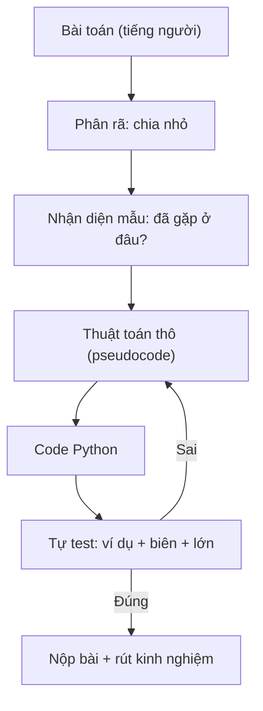
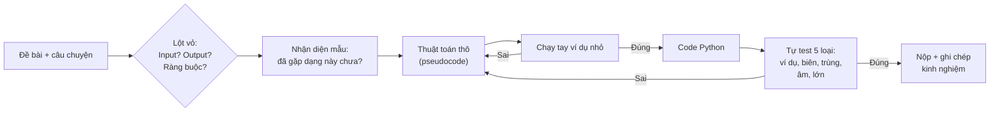

<!-- TỰ ĐỘNG ĐỒNG BỘ từ 02-Thuat-Toan/23-Tu-Duy-Thuat-Toan/bai.md — đừng sửa trực tiếp, sửa bản chính rồi chạy tools/sync_tracks.py -->

# Bài 1 — Tư Duy Thuật Toán

> 🧮 **Nhánh 02 — Thuật Toán (HSG / Competitive Programming)**

---

## 🧠 Điều kiện tiên quyết

- [Bài 12 — Hàm (Function)](../../Phan-1-Co-Ban/12-Ham/bai.md)
- [Bài 10 — Vòng Lặp For](../../Phan-1-Co-Ban/10-Vong-Lap-For/bai.md)
- [Bài 11 — Vòng Lặp While](../../Phan-1-Co-Ban/11-Vong-Lap-While/bai.md)
- [Bài 14 — List](../../Phan-1-Co-Ban/14-List/bai.md)

---

## 🎯 Mục tiêu

Sau bài học này, học viên sẽ:

* ✅ Hiểu thuật toán là gì — không phải định nghĩa sách vở, mà là "công thức giải quyết một lớp bài toán".
* ✅ Biết 4 thành phần của tư duy thuật toán: phân rã, nhận diện mẫu, trừu tượng hóa, thiết kế từng bước.
* ✅ Đọc đề HSG theo đúng trình tự: Input → Output → Ràng buộc → Ví dụ → Trường hợp biên.
* ✅ Viết được thuật toán thô (pseudocode) trước khi chạm vào bàn phím.
* ✅ Phân biệt "chạy đúng với ví dụ" và "chạy đúng với mọi test".

---

## 📖 Mở đầu

Ở nhánh Cơ bản, bạn học **ngôn ngữ** — cách nói chuyện với máy tính.
Ở nhánh này, bạn học **cách suy nghĩ** — cách biến một bài toán lạ thành
các bước mà máy tính làm được.

Tin buồn: không có công thức thần kỳ nào biến bạn thành cao thủ giải thuật
sau một đêm. Tin tốt: tư duy thuật toán là kỹ năng **luyện được**,
bằng đúng một phương pháp — giải nhiều bài, và giải **đúng cách**
(phân tích trước, code sau, rút kinh nghiệm sau mỗi bài).

Bài này là nền móng: cách đọc đề, cách nghĩ, cách viết thuật toán thô,
và cách tự kiểm tra trước khi nộp bài.

---

## 💡 Ý tưởng trực quan

Hãy tưởng tượng bạn cần hướng dẫn một người ngoài hành tinh nấu phở —
người này làm đúng **từng chữ** bạn nói, không tự suy luận, không "hiểu ý".

* "Cho gia vị vừa ăn" → họ đứng hình. Vừa ăn là bao nhiêu gram? Muối hay đường?
* "Nấu đến khi chín" → chín là trạng thái nào? Bao nhiêu phút? Nhiệt độ bao nhiêu?

Máy tính chính là người ngoài hành tinh đó. **Thuật toán** là bản hướng dẫn
chi tiết đến mức một cỗ máy "ngu ngơ" cũng làm đúng: từng bước rõ ràng,
không mơ hồ, và **dừng lại** sau hữu hạn bước.



---

## 📚 Kiến thức

### 1. Thuật toán là gì — định nghĩa của người làm bài thi

Một dãy các bước phải thỏa 3 tính chất:

| Tính chất | Nghĩa | Ví dụ vi phạm |
|---|---|---|
| **Rõ ràng** (xác định) | Mỗi bước làm đúng một việc, không hai nghĩa | "Sắp xếp cho đẹp" — đẹp là gì? |
| **Hữu hạn** | Chạy xong sau hữu hạn bước, luôn dừng | `while True` không có `break` |
| **Hiệu quả** | Chạy đủ nhanh trong giới hạn đề bài | Thử mọi hoán vị với n = 10⁵ |

> 💡 **Phân biệt:** *thuật toán* là ý tưởng (ngôn ngữ nào cũng cài được);
> *chương trình* là cài đặt cụ thể bằng Python. Một thuật toán tốt + code
> cẩu thả vẫn có thể TLE (quá thời gian); code đẹp không cứu được thuật toán sai.

### 2. Bốn trụ cột của tư duy thuật toán

**a) Phân rã (Decomposition) — chia để trị bài toán.**

Bài toán lớn luôn đáng sợ; các bước nhỏ thì không. Ví dụ "tính điểm trung bình
cả lớp, tìm học sinh giỏi nhất, in bảng xếp hạng" phân rã thành:

1. Đọc điểm từng học sinh → lưu list.
2. Tính trung bình = tổng / số lượng.
3. Tìm max.
4. Sắp xếp giảm dần → in.

Mỗi bước là một bài Cơ bản bạn đã biết. Thuật toán khó = nhiều bước dễ xếp
đúng thứ tự.

**b) Nhận diện mẫu (Pattern recognition) — "bài này giống bài nào mình biết?"**

90% bài HSG là biến thể của các mẫu quen thuộc:

| Thấy dấu hiệu này | Nghĩ ngay tới mẫu |
|---|---|
| Dãy đã sắp xếp + cần tìm nhanh | Tìm kiếm nhị phân (Bài 3) |
| "Dãy con liên tiếp" + tối ưu | Hai con trỏ / cửa sổ trượt (Bài 8) |
| Lựa chọn từng bước, không quay lui | Tham lam (Bài 9) |
| Bài toán con lặp lại, "tối ưu" | Quy hoạch động (Bài 10) |
| Lưới / mê cung / lan truyền | BFS/DFS trên đồ thị |
| Số nguyên tố, ước, chia hết | Số học (Bài 11) |

**c) Trừu tượng hóa (Abstraction) — bỏ chi tiết thừa, giữ cái cốt lõi.**

Đề bài HSG thường bọc bài toán trong câu chuyện (nông dân, bò, cánh đồng...).
Việc của bạn: lột vỏ câu chuyện, giữ lại "cho dãy n số, tìm...".

> Ví dụ: "Bác nông dân có n con bò, con thứ i cho a[i] lít sữa, cần chọn
> đoạn liên tiếp để tổng sữa lớn nhất" → **tìm tổng lớn nhất của dãy con
> liên tiếp** (bài toán kinh điển, giải bằng một lần duyệt).

**d) Thiết kế từng bước (Algorithmic steps) — viết thuật toán thô trước.**

Quy tắc vàng: **không code khi chưa biết mình sẽ code gì.**
Viết pseudocode bằng tiếng Việt/gạch đầu dòng, chạy thử bằng tay với ví dụ
nhỏ — chỉ khi chạy tay đúng mới mở trình soạn thảo.

### 3. Đọc đề HSG theo đúng trình tự

Một đề thi chuẩn có 5 phần. Đọc **theo thứ tự** này:

```
1. INPUT   — dữ liệu vào gồm gì, định dạng ra sao, đọc từ đâu (stdin/file)?
2. OUTPUT  — in ra cái gì, định dạng chính xác (dấu cách? xuống dòng?
             làm tròn mấy chữ số? chữ hoa/thường?)
3. RÀNG BUỘC — n ≤ ? , a[i] ≤ ? , giới hạn thời gian/bộ nhớ?
               → QUYẾT ĐỊNH thuật toán nào sống sót (xem Bài 24).
4. VÍ DỤ   — chạy tay theo ví dụ để xác nhận mình hiểu đúng đề.
5. BIÊN    — n = 0? n = 1? số âm? số bằng nhau? input rỗng?
```

> ⚠️ **Sai lầm đắt nhất:** code ngay sau khi đọc lướt ví dụ. Ví dụ chỉ là
> *một* trường hợp — code "vừa khít ví dụ" trượt hết test ẩn.

### 4. Chạy thử bằng tay (dry run) — kỹ năng bị đánh giá thấp nhất

Trước khi chạy máy, hãy làm máy bằng tay: lấy ví dụ nhỏ (n = 3, 4),
viết giá trị từng biến ra giấy sau mỗi bước. Chạy tay giúp:

* Phát hiện lỗi logic **trước** khi code (sửa pseudocode rẻ hơn sửa code).
* Hiểu vì sao thuật toán đúng — điều giám khảo HSG hỏi khi chấm vấn đáp.
* Tự tạo test: ví dụ nhỏ bạn chạy tay được chính là test đầu tiên.

### 5. "Đúng với ví dụ" ≠ "Đúng"

Một chương trình được gọi là đúng khi đúng với **mọi** input hợp lệ.
Bộ test tối thiểu bạn tự tạo trước khi nộp:

| Loại test | Ví dụ cho bài "tìm max" |
|---|---|
| Ví dụ đề cho | `[3, 1, 4, 1, 5]` → 5 |
| Nhỏ nhất (biên dưới) | `[7]` → 7 (1 phần tử!) |
| Biên đặc biệt | `[-5, -2, -9]` → -2 (toàn số âm) |
| Trùng lặp | `[4, 4, 4]` → 4 |
| Lớn nhất (hiệu năng) | n = 10⁵ số ngẫu nhiên — chạy đủ nhanh không? |

---

## 🔤 Mẫu pseudocode chuẩn

Không có chuẩn quốc tế bắt buộc; đây là quy ước dùng xuyên suốt nhánh này:

```
Thuật toán: <tên>
Input:  <mô tả dữ liệu vào>
Output: <mô tả kết quả>
1. <bước 1>
2. <bước 2>
   2.1 <bước con>
3. Trả về <kết quả>
```

Pseudocode tốt: người chưa học Python đọc vẫn hiểu; người đã học
chuyển thành code trong vài phút.

---

## 💻 Ví dụ

### Ví dụ 1 — Dễ: từ câu chuyện đến bài toán lõi

> Đề (dạng HSG): "Trường có n lớp, lớp thứ i trồng được a[i] cây xanh.
> Nhà trường muốn khen thưởng một số lớp **liên tiếp nhau** sao cho tổng
> số cây là lớn nhất. In ra tổng đó."

**Phân tích (lột vỏ câu chuyện):**

* Input: n, dãy a[1..n] (có thể âm — lớp bị trừ điểm?).
* Output: tổng lớn nhất của một đoạn liên tiếp.
* Đây là bài "dãy con liên tiếp có tổng lớn nhất" — mẫu kinh điển.

**Thuật toán thô:**

```
1. Đọc n và dãy a.
2. best = a[0]          # đáp án tốt nhất tính đến hiện tại
3. cur = a[0]           # tổng tốt nhất của đoạn KẾT THÚC tại vị trí đang xét
4. Với mỗi x trong a[1:]:
     cur = max(x, cur + x)   # hoặc bắt đầu đoạn mới tại x, hoặc nối dài
     best = max(best, cur)
5. In best.
```

**Code:**

```python
import sys

def main():
    data = sys.stdin.read().strip().split()
    if not data:
        return
    n = int(data[0])
    a = list(map(int, data[1:1 + n]))
    best = cur = a[0]
    for x in a[1:]:
        cur = max(x, cur + x)
        if cur > best:
            best = cur
    print(best)

main()
```

**Giải thích từng dòng:**

* `sys.stdin.read().strip().split()` — đọc **toàn bộ** input rồi tách token:
  cách đọc chuẩn cho thi HSG (nhanh, không lo xuống dòng thừa/thiếu).
* `cur = max(x, cur + x)` — quyết định cốt lõi: đoạn tốt nhất kết thúc tại x
  hoặc là chính x (bỏ đoạn cũ), hoặc là đoạn cũ nối thêm x.
* `best` ghi nhớ đáp án tốt nhất từng thấy — vì đoạn tối ưu có thể kết thúc
  ở bất kỳ đâu, không nhất thiết ở cuối dãy.

**Độ phức tạp:** O(n) thời gian, O(n) bộ nhớ (lưu dãy).

### Ví dụ 2 — Thực tế: đếm tần suất và tìm "kẻ trội"

> Đề: "Cho n phiếu bầu (tên ứng viên là chuỗi). Ứng viên nào được **hơn nửa**
> số phiếu thì in tên; nếu không có, in `KHONG CO`."

**Suy nghĩ theo mẫu:** "hơn nửa" + "tìm phần tử" → đếm tần suất bằng dict
(mẫu Hashing — Bài 5). Thuật toán "bỏ phiếu Boyer-Moore" nhanh hơn nhưng
dict là cách trực quan, đủ nhanh với n ≤ 10⁶.

```python
import sys
from collections import Counter

def main():
    data = sys.stdin.read().strip().split()
    if not data:
        return
    n = int(data[0])
    votes = data[1:1 + n]
    dem = Counter(votes)
    ten, so_phieu = dem.most_common(1)[0]
    if so_phieu * 2 > n:
        print(ten)
    else:
        print("KHONG CO")

main()
```

**Giải thích:**

* `Counter(votes)` — đếm tần suất trong một lần duyệt (O(n)).
* `most_common(1)[0]` — lấy (tên, số phiếu) của ứng viên dẫn đầu.
* `so_phieu * 2 > n` — kiểm tra "hơn nửa" **bằng số nguyên**, tránh chia
  (`so_phieu / n > 0.5` gặp sai số float với số lớn — chi tiết nhỏ nhưng
  là khác biệt giữa AC và WA trong thi thật).

### Ví dụ 3 — Khó hơn: thiết kế trước, code sau

> Đề: "Cho dãy n số. In ra số lượng **cặp** (i < j) sao cho
> a[i] + a[j] là số chẵn."

**Cách nghĩ naive (nghĩ ngay ra nhưng...):** hai vòng lặp thử mọi cặp —
O(n²). Với n ≤ 10⁵ thì 10¹⁰ phép tính → TLE chắc chắn.

**Quan sát mẫu:** tổng hai số chẵn ⟺ cùng tính chẵn/lẻ
(chẵn+chẵn=chẵn, lẻ+lẻ=chẵn). Vậy chỉ cần đếm: `c` số chẵn, `l` số lẻ.
Số cặp = C(c,2) + C(l,2) = c(c−1)/2 + l(l−1)/2 — **một lần duyệt**.

```python
import sys

def main():
    data = sys.stdin.read().strip().split()
    if not data:
        return
    n = int(data[0])
    a = list(map(int, data[1:1 + n]))
    c = sum(1 for x in a if x % 2 == 0)
    l = n - c
    print(c * (c - 1) // 2 + l * (l - 1) // 2)

main()
```

**Bài học:** cùng một bài toán, "nghĩ thêm 5 phút" biến O(n²) thành O(n).
Trong thi HSG, 5 phút suy nghĩ rẻ hơn 50 phút debug code brute-force.

---

## 🔍 Phân tích từng bước (ví dụ 3 chạy tay)

Input: `n = 5`, `a = [1, 2, 3, 4, 5]`.

| Bước | Biến | Giá trị |
|---|---|---|
| Đếm chẵn | `c` | 2 (số 2, 4) |
| Đếm lẻ | `l` | 5 − 2 = 3 |
| Cặp chẵn | `2·1/2` | 1 → cặp (2,4) |
| Cặp lẻ | `3·2/2` | 3 → (1,3), (1,5), (3,5) |
| Kết quả | in ra | **4** |

Kiểm chứng bằng liệt kê tay: các cặp tổng chẵn là (1,3), (1,5), (2,4), (3,5) —
đúng 4. ✔ Thuật toán đúng với ví dụ; tiếp tục test biên: n = 1 → c+l = 1 →
kết quả 0 (không có cặp nào — đúng).

---

## 📊 Minh họa



---

## ⚠️ Những lỗi thường gặp

### Lỗi 1: Code ngay khi vừa đọc đề

```python
# ❌ Đọc lướt ví dụ, code luôn → sai test ẩn, không biết sai ở đâu
```

* **Nguyên nhân:** chưa lột vỏ câu chuyện, chưa xác định ràng buộc.
* **Cách sửa:** viết pseudocode + chạy tay **trước**, code sau. Tỉ lệ thời
  gian hợp lý cho người mới: 40% nghĩ – 30% code – 30% test.

### Lỗi 2: Chỉ test bằng ví dụ đề cho

* **Nguyên nhân:** tưởng "chạy đúng ví dụ" là xong.
* **Cách sửa:** luôn tự tạo thêm 4 loại test: 1 phần tử, toàn số âm,
  toàn giá trị trùng nhau, input lớn nhất. 4 test này bắt được ~80% lỗi logic.

### Lỗi 3: Bỏ qua ràng buộc n

```python
# ❌ n ≤ 10^5 mà dùng 2 vòng lặp lồng nhau → TLE
for i in range(n):
    for j in range(n):
        ...
```

* **Nguyên nhân:** không đọc (hoặc đọc mà bỏ qua) giới hạn.
* **Cách sửa:** đọc ràng buộc **đầu tiên**, chọn thuật toán phù hợp
  (chi tiết ở Bài 2 — Độ phức tạp).

### Lỗi 4: Dùng float khi cần so sánh chính xác

```python
if so_phieu / n > 0.5:   # ⚠️ rủi ro sai số float với số rất lớn
if so_phieu * 2 > n:     # ✅ số nguyên, chính xác tuyệt đối
```

### Lỗi 5: Quên biên n = 0 / n = 1 / input rỗng

* Nhiều code `a[0]` crash ngay khi dãy rỗng. Luôn hỏi: "nếu input rỗng thì sao?"

---

## 🧪 Trường hợp đặc biệt

* **Input rỗng** (file trống): `sys.stdin.read().strip().split()` cho `[]` —
  kiểm tra `if not data: return` ngay đầu.
* **n = 1**: mọi bài "tìm cặp / đoạn" đều suy biến — `best = cur = a[0]`
  xử lý đúng mà không cần nhánh riêng.
* **Số âm toàn bộ**: bài "tổng lớn nhất" vẫn đúng (đáp án là số âm ít âm nhất);
  code khởi tạo `best = 0` thay vì `a[0]` sẽ **sai** — lỗi kinh điển.
* **Số cực lớn** (a[i] ≤ 10¹⁸): Python int không tràn số (khác C++),
  nhưng phép tính chậm hơn — vẫn AC nếu thuật toán O(n).

---

## 🚀 Ứng dụng thực tế

Tư duy phân rã + nhận diện mẫu không chỉ dùng trong thi:

* **Phỏng vấn việc làm** (thuật toán là vòng bắt buộc ở hầu hết công ty lớn).
* **Xử lý dữ liệu thật**: lọc log, thống kê, tìm bất thường — đều là
  "đọc input → biến đổi → kết quả".
* **Tự động hóa**: chia công việc lặp lại thành các bước máy làm được.

---

## 🧩 Bài tập

### 🟢 Cơ bản (1–3)

**Bài 1 — Lột vỏ câu chuyện.** Đề: "Bà Lan bán n rổ cam, rổ thứ i có a[i] quả.
Bà muốn chọn một số rổ liên tiếp để số cam là nhiều nhất." Viết lại đề bằng
ngôn ngữ Input/Output/Ràng buộc (giả sử n ≤ 10⁵, a[i] có thể âm). Không cần code.

**Bài 2 — Dry run.** Cho pseudocode tính tổng dãy bằng vòng lặp. Chạy tay với
`[5, -2, 7]`, ghi giá trị biến `tong` sau mỗi vòng lặp.

**Bài 3 — Bộ test tối thiểu.** Bài "tìm số lớn thứ hai trong dãy" (phân biệt).
Liệt kê 5 test bạn sẽ tự tạo (ví dụ + 4 loại), kèm kết quả mong đợi.

### 🟡 Hiểu sâu (4–6)

**Bài 4 — Nhận diện mẫu.** Mỗi đề sau thuộc mẫu nào (trong bảng mục 2b)?
a) Dãy đã sắp xếp, đếm số lần xuất hiện của x.
b) Chọn các công việc không trùng giờ để làm được nhiều nhất.
c) Tính số Fibonacci thứ n với n ≤ 10¹⁸.
d) Cho lưới ký tự, đếm số "ốc đảo" (vùng đất liền nhau).

**Bài 5 — Cặp tổng lẻ.** Sửa ví dụ 3: đếm cặp (i < j) sao cho a[i] + a[j] là
số **lẻ**. Viết pseudocode + code O(n), chạy tay với `[1, 2, 3, 4, 5]` (đáp án: 6).

**Bài 6 — Đọc ràng buộc.** Đề A: n ≤ 10³, giới hạn 1 giây. Đề B: n ≤ 10⁶,
giới hạn 1 giây. Với mỗi đề, thuật toán O(n²) có sống được không? Vì sao?
(Giả sử máy chạy ~10⁸ phép tính đơn giản/giây. Chi tiết ở Bài 2.)

### 🔴 Vận dụng (7–8)

**Bài 7 — Số trội (nâng cao ví dụ 2).** Không dùng `Counter`, chỉ dùng O(1)
bộ nhớ phụ (không dict, không list thêm): tìm phần tử xuất hiện hơn nửa dãy
(nếu có). *Gợi ý: thuật toán bỏ phiếu — giữ một ứng viên và một bộ đếm;
gặp giống ứng viên thì +1, khác thì −1; hết thì đổi ứng viên. Cuối cùng kiểm
tra lại ứng viên.*

**Bài 8 — Đoạn 0-1 cân bằng.** Cho dãy nhị phân (chỉ gồm 0 và 1), tìm độ dài
đoạn liên tiếp dài nhất có **số 0 bằng số 1**. *Gợi ý: đổi 0 thành −1, bài toán
thành "đoạn dài nhất có tổng bằng 0"; dùng tổng tiền tố + dict lưu lần đầu
thấy mỗi tổng (mẫu sẽ học ở Bài 8).*

---

## ✅ Đáp án

> 💡 **Hãy tự làm bài tập trước** rồi mới mở đáp án.

<details>
<summary>✅ Bài 1: Lột vỏ câu chuyện</summary>

* **Input:** n (1 ≤ n ≤ 10⁵), dãy a[1..n] số nguyên (có thể âm).
* **Output:** một số nguyên — tổng lớn nhất của một đoạn liên tiếp (ít nhất 1 phần tử).
* **Ràng buộc:** n ≤ 10⁵ → cần O(n) hoặc O(n log n); O(n²) sẽ TLE.
* Đây chính là bài "dãy con liên tiếp tổng lớn nhất" (ví dụ 1).

</details>

<details>
<summary>✅ Bài 2: Dry run</summary>

Pseudocode: `tong = 0; với mỗi x trong [5, -2, 7]: tong = tong + x`.

| Vòng | x | tong |
|---|---|---|
| 0 (khởi tạo) | — | 0 |
| 1 | 5 | 5 |
| 2 | −2 | 3 |
| 3 | 7 | **10** |

Kết quả: 10.

</details>

<details>
<summary>✅ Bài 3: Bộ test tối thiểu</summary>

Bài "số lớn thứ hai phân biệt", ví dụ dãy `[5, 1, 5, 3]` → 3.

1. Ví dụ: `[5, 1, 5, 3]` → 3.
2. Biên dưới: `[7]` → không tồn tại (quy ước in `KHONG CO` hoặc tương đương).
3. Toàn trùng: `[4, 4, 4]` → không tồn tại.
4. Toàn âm: `[-1, -5, -3]` → −3.
5. Lớn: n = 10⁵ ngẫu nhiên — kiểm tra tốc độ (phải O(n)).

</details>

<details>
<summary>✅ Bài 4: Nhận diện mẫu</summary>

a) Dãy đã sắp xếp + tìm/đếm → **tìm kiếm nhị phân** (Bài 3).
b) Chọn nhiều việc không trùng giờ → **tham lam** (Bài 9, bài toán xếp lịch).
c) Fibonacci n ≤ 10¹⁸ → **chia để trị + nhân ma trận** hoặc công thức
   (đệ quy naive O(2ⁿ) chết ngay; quy hoạch động O(n) vẫn quá chậm với 10¹⁸).
d) Đếm vùng liền nhau trên lưới → **DFS/BFS trên đồ thị lưới**.

</details>

<details>
<summary>✅ Bài 5: Cặp tổng lẻ</summary>

Tổng lẻ ⟺ một chẵn + một lẻ. Đếm `c` số chẵn, `l` số lẻ → đáp án `c × l`.

```python
import sys

def main():
    data = sys.stdin.read().strip().split()
    if not data:
        return
    n = int(data[0])
    a = list(map(int, data[1:1 + n]))
    c = sum(1 for x in a if x % 2 == 0)
    print(c * (n - c))

main()
```

Chạy tay `[1,2,3,4,5]`: c = 2, l = 3 → 2 × 3 = 6. ✔ Liệt kê kiểm chứng:
(1,2), (1,4), (2,3), (2,5), (3,4), (4,5) — đúng 6 cặp.

</details>

<details>
<summary>✅ Bài 6: Đọc ràng buộc</summary>

* Đề A (n ≤ 10³): O(n²) = 10⁶ phép tính ≈ 0.01 giây → sống khỏe.
* Đề B (n ≤ 10⁶): O(n²) = 10¹² phép tính ≈ 10.000 giây ≈ 2.8 giờ → TLE thảm hại.
* Cùng một code, đề khác nhau cho kết quả khác nhau — vì vậy ràng buộc phải
  đọc trước khi chọn thuật toán.

</details>

<details>
<summary>✅ Bài 7: Số trội O(1) bộ nhớ (Boyer-Moore)</summary>

```python
import sys

def main():
    data = sys.stdin.read().strip().split()
    if not data:
        return
    n = int(data[0])
    votes = data[1:1 + n]
    # Pha 1: tìm ứng viên
    ung_vien = None
    dem = 0
    for v in votes:
        if dem == 0:
            ung_vien, dem = v, 1
        elif v == ung_vien:
            dem += 1
        else:
            dem -= 1
    # Pha 2: kiểm chứng (bắt buộc! pha 1 chỉ cho ứng viên, chưa chắc đúng)
    if ung_vien is not None and sum(1 for v in votes if v == ung_vien) * 2 > n:
        print(ung_vien)
    else:
        print("KHONG CO")

main()
```

**Vì sao đúng (trực giác):** nếu tồn tại kẻ trội (> nửa), mỗi lần nó "đấu" với
kẻ khác thì cả hai cùng mất 1 phiếu — sau khi triệt tiêu hết, kẻ trội vẫn còn
sót lại nên thành ứng viên cuối. Pha 2 loại trường hợp không có kẻ trội
(ví dụ `[A, B, C]` cho ứng viên C nhưng C chỉ có 1/3 phiếu).

</details>

<details>
<summary>✅ Bài 8: Đoạn 0-1 cân bằng</summary>

Đổi 0 → −1. Đoạn có số 0 bằng số 1 ⟺ tổng đoạn bằng 0 ⟺ hai tổng tiền tố
bằng nhau. Duyệt một lần, dict lưu **lần đầu** thấy mỗi tổng tiền tố;
mỗi khi gặp lại tổng cũ, đoạn giữa chúng có tổng 0.

```python
import sys

def main():
    data = sys.stdin.read().strip().split()
    if not data:
        return
    n = int(data[0])
    a = [1 if int(x) == 1 else -1 for x in data[1:1 + n]]
    thay_lan_dau = {0: -1}
    tong = 0
    dai_nhat = 0
    for i, x in enumerate(a):
        tong += x
        if tong in thay_lan_dau:
            dai_nhat = max(dai_nhat, i - thay_lan_dau[tong])
        else:
            thay_lan_dau[tong] = i
    print(dai_nhat)

main()
```

Chạy tay `[0, 1, 0, 0, 1, 1]` → đổi thành `[−1, 1, −1, −1, 1, 1]`; tổng tiền tố:
0, −1, 0, −1, −2, −1, 0. Tổng 0 gặp lại ở vị trí 5 (lần đầu −1) → dài 6;
tổng −1 gặp lại ở 4 (lần đầu 0) → dài 4. Đáp án 6 (cả dãy cân bằng: 3 số 0,
3 số 1). ✔

</details>

---

## 🧠 Thử thách

**Thử thách HSG:** Cho dãy n số nguyên (n ≤ 10⁵), đếm số cặp (i < j) sao cho
`a[i] + a[j]` **chia hết cho k** (k cho trước). *Gợi ý: tổng chia hết cho k
⟺ (r1 + r2) % k == 0 với r là số dư; đếm tần suất từng số dư rồi ghép cặp dư bù
nhau — O(n + k).*

---

## 📝 Tóm tắt

| Khái niệm | Nội dung |
|---|---|
| 🧩 Thuật toán | Dãy bước rõ ràng, hữu hạn, hiệu quả |
| ✂️ Phân rã | Chia bài lớn thành bước nhỏ đã biết |
| 🔍 Nhận diện mẫu | Thấy dấu hiệu → nhớ mẫu đã học |
| 🧹 Trừu tượng hóa | Lột vỏ câu chuyện, giữ Input/Output/Ràng buộc |
| 📝 Pseudocode trước | Viết thô + chạy tay rồi mới code |
| 🧪 Bộ test tối thiểu | Ví dụ, biên, trùng, âm, lớn |

---

## ➡️ Điều hướng

**Vị trí:** `04-Full/Phan-2-Thuat-Toan/01-Tu-Duy-Thuat-Toan/bai.md`

**Bài tiếp theo:** [Bài 2 — Độ Phức Tạp & Big-O](../02-Do-Phuc-Tap/bai.md)