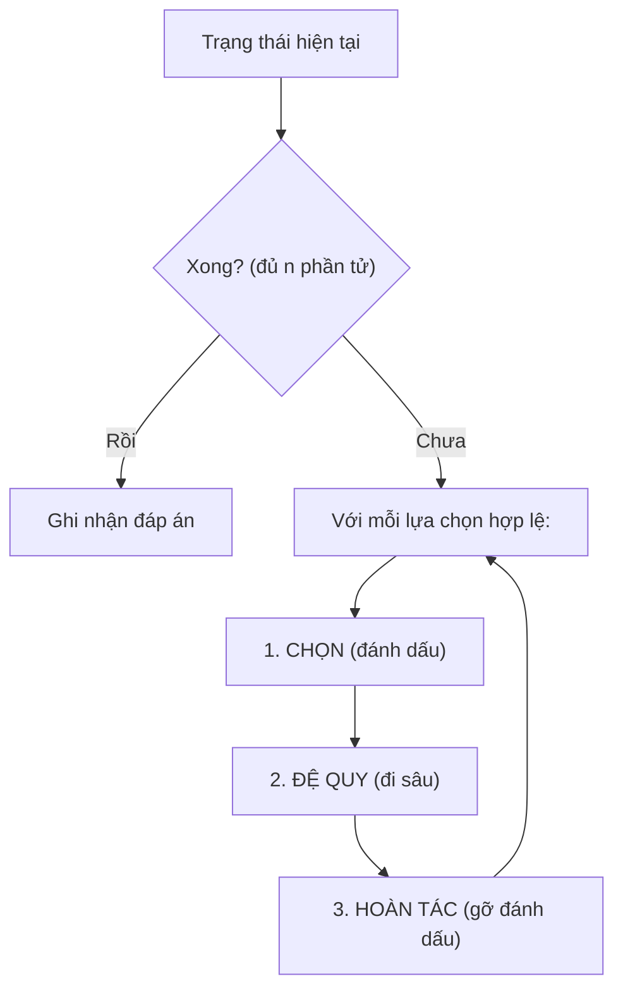
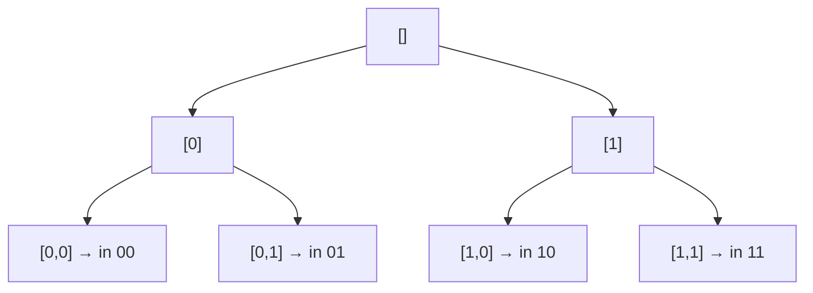

<!-- TỰ ĐỘNG ĐỒNG BỘ từ 02-Thuat-Toan/07-Quay-Lui/bai.md — đừng sửa trực tiếp, sửa bản chính rồi chạy tools/sync_tracks.py -->

# Bài 7 — Quay Lui (Backtracking)

> 🧮 **Nhánh 02 — Thuật Toán (HSG / Competitive Programming)**

---

## 🧠 Điều kiện tiên quyết

- [Bài 6 — Đệ Quy](../06-De-Quy/bai.md)
- [Bài 12 — Hàm](../../Phan-1-Co-Ban/12-Ham/bai.md)
- [Bài 14 — List](../../Phan-1-Co-Ban/14-List/bai.md)

---

## 🎯 Mục tiêu

Sau bài học này, học viên sẽ:

* ✅ Hiểu quay lui: thử — sai — quay lại — thử tiếp (vét cạn có trí khôn).
* ✅ Viết được khung quay lui chuẩn: chọn → đệ quy → hoàn tác (choose–explore–unchoose).
* ✅ Sinh được hoán vị, tổ hợp, tập con — 3 bài "gốc" của mọi bài quay lui.
* ✅ Biết cắt tỉa (pruning): bỏ nhánh vô vọng sớm để từ O(n!) xuống chạy được.
* ✅ Nhận diện đề HSG nào cần quay lui (n ≤ 10–25, "liệt kê mọi cách", "tồn tại cách?").

---

## 📖 Mở đầu

Nhiều bài toán không có công thức trực tiếp: xếp hậu, chia nhóm, tìm đường
trong mê cung... Cách duy nhất là **thử mọi khả năng** — nhưng thử khôn ngoan:
đi vào ngõ cụt thì quay lui ngay, đừng đi tiếp cho tốn thời gian.

Quay lui = vét cạn + quay đầu sớm. Với n nhỏ (≤ 20), nó là đáp án.
Với n lớn, nó là điểm xuất phát để nghĩ thuật toán tốt hơn.

---

## 💡 Ý tưởng trực quan

* **Mê cung:** đi đến ngã ba thì thử rẽ trái; cụt đường → quay lại ngã ba,
  thử rẽ phải. Dấu phấn đánh dấu đường đã đi = "trạng thái"; xóa dấu khi quay
  lại = "hoàn tác".
* **Cây quyết định:** mỗi nút là một lựa chọn; lá là đáp án hoặc ngõ cụt.
  Quay lui = duyệt cây theo chiều sâu (DFS), tỉa cành khô trên đường đi.



Bước 3 là linh hồn: không hoàn tác thì lựa chọn của nhánh này "dính" sang
nhánh khác → sai.

---

## 📚 Kiến thức

### 1. Khung quay lui chuẩn (học thuộc)

```python
def quay_lui(...):
    if xong():            # base: đã dựng xong một ứng viên
        ghi_nhan()
        return
    for lua_chon in cac_lua_chon_hop_le():
        chon(lua_chon)        # đánh dấu, thêm vào đáp án tạm
        quay_lui(...)         # đi sâu
        hoan_tac(lua_chon)    # gỡ đánh dấu — QUAN TRỌNG NHẤT
```

### 2. Sinh xâu nhị phân — bài quay lui đầu tiên nên viết

```python
def sinh_nhi_phan(n):
    xau = []
    def de_quy():
        if len(xau) == n:
            print("".join(xau))
            return
        for bit in "01":       # thử '0' rồi '1'
            xau.append(bit)    # CHỌN
            de_quy()           # ĐI SÂU
            xau.pop()          # HOÀN TÁC
    de_quy()

sinh_nhi_phan(3)
# 000 001 010 011 100 101 110 111
```

Chạy tay n = 2: `[] → [0] → [0,0]` in "00", pop → `[0,1]` in "01", pop →
`[]` → `[1] → [1,0]` in "10", pop → `[1,1]` in "11". Đủ 2² = 4 xâu, mỗi xâu
đúng một lần — hoàn tác đảm bảo không sót, không trùng.

### 3. Hoán vị — O(n!)

```python
def hoan_vi(a):
    n = len(a)
    dung = [False] * n
    duong_di = []
    def de_quy():
        if len(duong_di) == n:
            print(duong_di)
            return
        for i in range(n):
            if not dung[i]:
                dung[i] = True       # CHỌN
                duong_di.append(a[i])
                de_quy()
                duong_di.pop()       # HOÀN TÁC
                dung[i] = False
    de_quy()
```

Mảng `dung` là "dấu phấn": phần tử đã dùng thì nhánh con không dùng lại.
Quên hoàn tác `dung[i] = False` → sau nhánh đầu, mọi phần tử "dính" đã dùng
→ các nhánh sau rỗng → chỉ in được 1 hoán vị. **Bug #1 của quay lui.**

### 4. Tổ hợp chập k — O(C(n,k))

Khác hoán vị: thứ tự không quan trọng → ép "chỉ chọn phần tử đứng sau"
bằng chỉ số bắt đầu `bat_dau`, tránh sinh trùng (1,2) và (2,1):

```python
def to_hop(n, k):
    duong_di = []
    def de_quy(bat_dau):
        if len(duong_di) == k:
            print(duong_di)
            return
        for i in range(bat_dau, n + 1):
            duong_di.append(i)
            de_quy(i + 1)      # chỉ đi tiếp về phía trước
            duong_di.pop()
    de_quy(1)
```

### 5. Cắt tỉa (pruning) — từ "chạy không nổi" thành "chạy được"

Vét cạn thuần n = 25 đã 33 triệu nhánh. Cắt tỉa = phát hiện nhánh vô vọng
**sớm** và bỏ luôn cả cây con:

* **Tỉa theo ràng buộc:** đang xếp hậu, hai hậu đã ăn nhau → dừng nhánh ngay,
  đừng xếp tiếp 5 hậu còn lại cho đủ bộ mới kiểm tra.
* **Tỉa theo cận (bound):** đang tìm min, chi phí tạm đã ≥ đáp án tốt nhất →
  nhánh này không thể tốt hơn → bỏ.
* **Tỉa đối xứng:** các nhánh đối xứng nhau chỉ cần thử một.

> Trong thi HSG, "quay lui + cắt tỉa tốt" với n ≤ 20–25 thường đủ AC —
> đừng mặc cảm vì "chỉ là vét cạn".

### 6. Khi nào dùng quay lui — checklist nhận diện đề

* n nhỏ (≤ 10 với hoán vị, ≤ 20–25 với tập con/nhánh cận).
* Đề hỏi "liệt kê mọi...", "có tồn tại cách...?", "đếm số cách...".
* Không thấy công thức toán trực tiếp, không thấy cấu trúc DP/tham lam.
* Ràng buộc "vừa đủ nhỏ để vét cạn" chính là gợi ý của người ra đề!

---

## 💻 Ví dụ

### Ví dụ 1 — Dễ: tập con (mỗi phần tử lấy/không lấy)

```python
def tap_con(a):
    n = len(a)
    chon = []
    def de_quy(i):
        if i == n:
            print(chon)
            return
        chon.append(a[i])   # nhánh LẤY a[i]
        de_quy(i + 1)
        chon.pop()          # hoàn tác
        de_quy(i + 1)       # nhánh KHÔNG LẤY a[i]
    de_quy(0)

tap_con([1, 2, 3])
# [1, 2, 3] [1, 2] [1, 3] [1] [2, 3] [2] [3] []
```

2ⁿ = 8 tập con, đủ cả. Mẫu "lấy/không lấy" là khung của mọi bài chọn tập con
(túi đồ, chia nhóm...).

### Ví dụ 2 — Thực tế: N-Queens với cắt tỉa (bài HSG kinh điển)

> Xếp n hậu lên bàn n×n sao cho không hai hậu nào ăn nhau. Đếm số cách.

Không tỉa: thử mọi cách đặt (n² chọn n) — khổng lồ. Có tỉa: đặt từng hàng,
mỗi hàng chỉ thử cột không bị ăn → cây thu hẹp hàng triệu lần.

```python
import sys

def dem_hau(n):
    cot = [False] * n
    cheo1 = [False] * (2 * n)   # r + c
    cheo2 = [False] * (2 * n)   # r - c + n
    dem = 0
    def de_quy(r):
        nonlocal dem
        if r == n:
            dem += 1
            return
        for c in range(n):
            if not cot[c] and not cheo1[r + c] and not cheo2[r - c + n]:
                cot[c] = cheo1[r + c] = cheo2[r - c + n] = True
                de_quy(r + 1)
                cot[c] = cheo1[r + c] = cheo2[r - c + n] = False
    de_quy(0)
    return dem

def main():
    data = sys.stdin.read().strip().split()
    if data:
        print(dem_hau(int(data[0])))

main()
```

**Giải thích:**

* Mỗi hàng đặt đúng 1 hậu → chỉ cần quyết định **cột** mỗi hàng (giảm từ
  (n²)ⁿ nhánh xuống n! nhánh — tỉa cấu trúc).
* Ba mảng boolean kiểm tra cột + 2 đường chéo trong O(1) (thay vì quét lại
  bàn O(n) mỗi lần đặt — tỉa chi phí kiểm tra).
* `r + c` hằng trên đường chéo `/`, `r − c` hằng trên `\` — mẹo index chéo
  dùng trong mọi bài bàn cờ.
* n = 8 → 92 cách (chạy ~0.01s); n = 12 → ~14.000 cách (vài giây).

### Ví dụ 3 — Khó: chia dãy thành 2 nhóm chênh lệch nhỏ nhất

> Cho n ≤ 20 số, chia thành 2 nhóm sao cho |tổng nhóm 1 − tổng nhóm 2| nhỏ nhất.

```python
import sys

def main():
    data = sys.stdin.read().strip().split()
    if not data:
        return
    n = int(data[0])
    a = list(map(int, data[1:1 + n]))
    tong = sum(a)
    tot_nhat = tong
    # thử mọi tập con làm nhóm 1 (2^n, n ≤ 20 → ~1 triệu, ổn)
    for mask in range(1 << n):
        s = 0
        for i in range(n):
            if mask >> i & 1:
                s += a[i]
        tot_nhat = min(tot_nhat, abs(tong - 2 * s))
        if tot_nhat == 0:   # tỉa: không thể tốt hơn 0
            break
    print(tot_nhat)

main()
```

**Giải thích:**

* Đây là quay lui dạng "bitmask": mỗi số có 2 lựa chọn (nhóm 1/2) → 2ⁿ mask.
  Vòng lặp bitmask thay đệ quy khi chỉ cần duyệt, không cần ghi đường đi.
* `mask >> i & 1` kiểm tra bit i — kỹ thuật bitmask cơ bản (ôn Bài 11).
* Tỉa `tot_nhat == 0 → break`: chênh lệch 0 là tối ưu tuyệt đối, dừng luôn.
* Chạy tay `[1, 2, 3, 4]`, tổng 10: mask {1,4}=5 → |10−10| = 0 → đáp án **0**. ✔

---

## 📊 Minh họa

Cây quay lui sinh nhị phân n = 2 (DFS, trái trước):



Đường đi của thuật toán: xuống sâu hết nhánh trái ([0,0]), quay lui dần,
sang nhánh phải — đúng thứ tự in 00, 01, 10, 11.

---

## ⚠️ Những lỗi thường gặp

### Lỗi 1: Quên hoàn tác — bug #1

```python
dung[i] = True
de_quy()
# ❌ thiếu dung[i] = False → các nhánh sau thấy "đã dùng" hết
```

* Triệu chứng: chỉ ra 1 đáp án (hoặc thiếu rất nhiều).
* Sửa: mọi `chon` phải có `hoan_tac` đối xứng — viết hai dòng cùng lúc.

### Lỗi 2: Ghi nhận đáp án tham chiếu thay vì bản sao

```python
ket_qua.append(duong_di)        # ❌ lưu tham chiếu — về sau bị pop mất
ket_qua.append(duong_di.copy()) # ✅ chụp ảnh lại
```

### Lỗi 3: Không cắt tỉa — TLE với n = 20

* Vét cạn thuần 2²⁰ ≈ 1 triệu thì ổn; nhưng n! hoặc nhánh rộng mà không tỉa
  thì chết. Luôn hỏi: "kiểm tra sớm được không?"

### Lỗi 4: Đệ quy quá sâu

* Quay lui sâu n (n ≤ 25) an toàn. Sâu 10⁵ → crash — nhưng quay lui sâu thế
  cũng không bao giờ xong (cây quá lớn), nên thực tế ít gặp.

### Lỗi 5: Sinh trùng do không ép thứ tự (tổ hợp viết như hoán vị)

* Tổ hợp phải có `bat_dau` tăng dần; không thì (1,2) và (2,1) ra hai lần.

---

## 🧪 Trường hợp đặc biệt

* **n = 0**: tập con của rỗng là `[[]]` (1 tập) — base `i == n` xử lý đúng.
* **k = 0 / k = n** (tổ hợp): đúng 1 cách — vòng lặp không chạy, base ghi nhận ngay.
* **Không có đáp án** (N-Queens n = 2, 3): `dem = 0` — code trả 0 tự nhiên, không cần nhánh riêng.
* **Số đáp án khổng lồ** (hoán vị n = 12 → 479M dòng): đừng in hết — đếm thôi,
  hoặc đề chỉ hỏi "có tồn tại?" thì dừng ở đáp án đầu (`return True` lan truyền).

---

## 🚀 Ứng dụng thực tế

* Giải Sudoku, xếp lịch, tìm đường — đều là quay lui + tỉa.
* Regex engine, trình giải SAT, AI chơi cờ (minimax + alpha-beta = quay lui + tỉa cận).

---

## 🧩 Bài tập

### 🟢 Cơ bản (1–3)

**Bài 1 — Chạy tay.** Sinh nhị phân n = 3 bằng code mục 2. Ghi nội dung `xau`
sau mỗi lần append/pop (14 bước append, 7 lần in).

**Bài 2 — Hoán vị 3.** Chạy tay `hoan_vi([1, 2, 3])`, ghi 6 kết quả theo thứ tự
in. Chỉ ra thời điểm `dung` được hoàn tác.

**Bài 3 — Đếm nhánh.** Sinh nhị phân n = 10 có bao nhiêu node quyết định
(không tính lá)? Hoán vị n = 8 có bao nhiêu lá? (Đáp án: 2¹⁰−1 = 1023 node;
8! = 40320 lá.)

### 🟡 Hiểu sâu (4–6)

**Bài 4 — Tổ hợp có lặp.** Sinh các bộ (x₁ ≤ x₂ ≤ ... ≤ xₖ) với mỗi xᵢ ∈ [1, n]
(ví dụ n = 3, k = 2 → 6 bộ). *Gợi ý: sửa `de_quy(i + 1)` thành `de_quy(i)`
trong code tổ hợp — được chọn lại chính mình.*

**Bài 5 — Tổng bằng S.** Cho n ≤ 20 số dương và S, đếm số tập con có tổng đúng
S. *Gợi ý: khung lấy/không lấy + tỉa: tổng tạm > S thì dừng nhánh (số dương
nên tổng chỉ tăng).*

**Bài 6 — Sudoku 4×4.** Điền số 1–4 vào lưới 4×4 (mỗi hàng/cột/khối 2×2 đủ
1–4). Viết quay lui: tìm ô trống → thử 1–4 hợp lệ → đệ quy → hoàn tác.
*Đây là N-Queens phiên bản số học.*

### 🔴 Vận dụng (7–8)

**Bài 7 — Chia nhóm chênh lệch (ôn ví dụ 3).** Cài bản đệ quy (thay vì bitmask)
có tỉa: sắp xếp giảm dần trước (số lớn quyết định sớm → tỉa hiệu quả hơn),
theo dõi tổng nhóm 1, dừng nhánh khi chênh lệch tối thiểu có thể đã ≥ tốt nhất.
So sánh số node thăm với bản bitmask thuần. *Gợi ý: cận dưới = |tong − 2·s₁|.*

**Bài 8 — Đường đi trong mê cung.** Lưới n×m (≤ 6×6), ô 0 đi được, ô 1 tường.
Đếm số đường từ (0,0) đến (n−1,m−1), mỗi ô thăm tối đa 1 lần (4 hướng).
*Gợi ý: DFS + mảng đánh dấu + hoàn tác — đúng khung quay lui; tỉa: ô kẹt
(không lối ra trừ đường vào) thì dừng sớm.*

---

## ✅ Đáp án

> 💡 **Hãy tự làm bài tập trước** rồi mới mở đáp án.

<details>
<summary>✅ Bài 1: Chạy tay</summary>

`xau` biến đổi: `[]→[0]→[0,0]` in 000, pop→`[0]`→`[0,1]`... Thứ tự in:
000, 001, 010, 011, 100, 101, 110, 111. Mỗi lần in xong quay lui đúng 1–3 bước
pop để sang nhánh kế. Tổng 14 append + 14 pop + 8 in.

</details>

<details>
<summary>✅ Bài 2: Hoán vị 3</summary>

Thứ tự in: [1,2,3], [1,3,2], [2,1,3], [2,3,1], [3,1,2], [3,2,1].
Hoàn tác xảy ra sau mỗi lần `de_quy()` con trả về — ví dụ sau khi in [1,2,3],
pop 3, gỡ `dung[2]`, thử tiếp phần tử 3 ở vị trí 2...

</details>

<details>
<summary>✅ Bài 3: Đếm nhánh</summary>

* Nhị phân n = 10: cây nhị phân đầy cao 10 → node trong = 2¹⁰ − 1 = **1023**,
  lá = 2¹⁰ = 1024.
* Hoán vị n = 8: lá = 8! = **40320**.

</details>

<details>
<summary>✅ Bài 4: Tổ hợp có lặp</summary>

```python
def to_hop_lap(n, k):
    duong_di = []
    def de_quy(bat_dau):
        if len(duong_di) == k:
            print(duong_di)
            return
        for i in range(bat_dau, n + 1):
            duong_di.append(i)
            de_quy(i)        # ← khác tổ hợp thường: được lấy lại i
            duong_di.pop()
    de_quy(1)
```

n = 3, k = 2 → [1,1], [1,2], [1,3], [2,2], [2,3], [3,3]: 6 = C(3+2−1, 2). ✔

</details>

<details>
<summary>✅ Bài 5: Tổng bằng S</summary>

```python
def dem_tap_con_tong_s(a, s):
    a = sorted(a)
    dem = 0
    def de_quy(i, tong_tam):
        nonlocal dem
        if tong_tam == s:
            dem += 1
            return            # số dương → thêm nữa chỉ vượt, dừng nhánh
        if i == len(a) or tong_tam > s:
            return            # tỉa: vượt S hoặc hết phần tử
        de_quy(i + 1, tong_tam + a[i])   # lấy
        de_quy(i + 1, tong_tam)          # không lấy
    de_quy(0, 0)
    return dem
```

Tỉa `tong_tam > s → return` đúng vì số dương: tổng tạm chỉ tăng theo đường đi.
(Số âm thì không tỉa kiểu này được!)

</details>

<details>
<summary>✅ Bài 6: Sudoku 4×4</summary>

```python
def giai_sudoku(ban):
    o_trong = next(((r, c) for r in range(4) for c in range(4)
                    if ban[r][c] == 0), None)
    if o_trong is None:
        return True   # kín bảng → xong
    r, c = o_trong
    for so in range(1, 5):
        if hop_le(ban, r, c, so):
            ban[r][c] = so        # CHỌN
            if giai_sudoku(ban):
                return True
            ban[r][c] = 0         # HOÀN TÁC
    return False

def hop_le(ban, r, c, so):
    if any(ban[r][j] == so for j in range(4)): return False
    if any(ban[i][c] == so for i in range(4)): return False
    br, bc = r // 2 * 2, c // 2 * 2
    return all(ban[br + i][bc + j] != so for i in range(2) for j in range(2))
```

Khung quay lui chuẩn + lan truyền `True` khi xong (dừng ngay, không tìm tiếp).
Ô trống tìm theo thứ tự + thử số 1–4 — bản nâng cao: chọn ô ít ứng viên nhất
(MRV) để tỉa mạnh hơn.

</details>

<details>
<summary>✅ Bài 7: Chia nhóm chênh lệch</summary>

```python
import sys

def main():
    data = sys.stdin.read().strip().split()
    if not data:
        return
    n = int(data[0])
    a = sorted(map(int, data[1:1 + n]), reverse=True)  # lớn trước → tỉa sớm
    tong = sum(a)
    tot = tong
    def de_quy(i, s1):
        nonlocal tot
        if i == n:
            tot = min(tot, abs(tong - 2 * s1))
            return
        if abs(tong - 2 * s1) >= tot and s1 * 2 >= tong:
            pass  # (cận đơn giản; cận chặt hơn cần ước lượng phần còn lại)
        de_quy(i + 1, s1 + a[i])
        de_quy(i + 1, s1)
        if tot == 0:
            return
    de_quy(0, 0)
    print(tot)

main()
```

Sắp giảm dần giúp tổng nhóm 1 tăng nhanh → cận siết sớm → ít node hơn bitmask
thuần trong thực tế (dù cùng O(2ⁿ) worst case).

</details>

<details>
<summary>✅ Bài 8: Đường đi trong mê cung</summary>

```python
import sys
sys.setrecursionlimit(10000)

def dem_duong(luoi):
    n, m = len(luoi), len(luoi[0])
    tham = [[False] * m for _ in range(n)]
    dem = 0
    def dfs(r, c):
        nonlocal dem
        if r == n - 1 and c == m - 1:
            dem += 1
            return
        for dr, dc in ((1, 0), (-1, 0), (0, 1), (0, -1)):
            nr, nc = r + dr, c + dc
            if 0 <= nr < n and 0 <= nc < m and luoi[nr][nc] == 0 and not tham[nr][nc]:
                tham[nr][nc] = True    # CHỌN
                dfs(nr, nc)
                tham[nr][nc] = False   # HOÀN TÁC
    if luoi[0][0] == 0:
        tham[0][0] = True
        dfs(0, 0)
    return dem


def main():
    data = sys.stdin.read().strip().split()
    if not data:
        return
    it = iter(data)
    n, m = int(next(it)), int(next(it))
    luoi = [[int(next(it)) for _ in range(m)] for _ in range(n)]
    print(dem_duong(luoi))

main()
```

Đúng khung quay lui trên lưới: đánh dấu → DFS 4 hướng → gỡ đánh dấu.
Mỗi ô tối đa 1 lần mỗi đường đi → không lặp vô hạn.

</details>

---

## 🧠 Thử thách

**Thử thách HSG:** Xếp n ≤ 12 số vào 2 nhóm sao cho tổng bằng nhau (chia đôi
tập hợp — partition problem). Nếu không chia được thì in ra chênh lệch nhỏ
nhất. Dùng quay lui + tỉa đối xứng (nhóm 1 và 2 hoán đổi cho nhau là một —
ép phần tử đầu vào nhóm 1 để giảm một nửa cây). So sánh thời gian với bản
không tỉa đối xứng.

---

## 📝 Tóm tắt

| Khái niệm | Nội dung |
|---|---|
| 🔄 Khung quay lui | Chọn → đệ quy → hoàn tác (thiếu bước 3 là sai) |
| 🔢 3 bài gốc | Nhị phân (2ⁿ), hoán vị (n!), tổ hợp (C(n,k)) |
| ✂️ Cắt tỉa | Ràng buộc sớm, cận, đối xứng — cứu TLE |
| 🎯 Nhận diện | n ≤ 20–25, "liệt kê/tồn tại/đếm cách" |
| 🪤 Bug #1 | Quên hoàn tác; #2 lưu tham chiếu thay vì copy |

---

## ➡️ Điều hướng

**Vị trí:** `04-Full/Phan-2-Thuat-Toan/07-Quay-Lui/bai.md`

**Bài tiếp theo:** [Bài 8 — Hai Con Trỏ & Cửa Sổ Trượt](../08-Hai-Con-Tro/bai.md)
