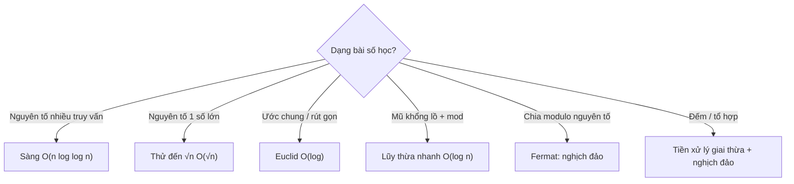

<!-- TỰ ĐỘNG ĐỒNG BỘ từ 02-Thuat-Toan/33-Toan-Hoc-So-Hoc/bai.md — đừng sửa trực tiếp, sửa bản chính rồi chạy tools/sync_tracks.py -->

# Bài 11 — Toán Học & Số Học Thuật Toán

> 🧮 **Nhánh 02 — Thuật Toán (HSG / Competitive Programming)**

---

## 🧠 Điều kiện tiên quyết

- [Bài 6 — Đệ Quy](../06-De-Quy/bai.md) (lũy thừa nhanh, Euclid đệ quy)
- [Bài 2 — Độ Phức Tạp](../02-Do-Phuc-Tap/bai.md)
- [Bài 10 — Vòng Lặp For](../../Phan-1-Co-Ban/10-Vong-Lap-For/bai.md)

---

## 🎯 Mục tiêu

Sau bài học này, học viên sẽ:

* ✅ Kiểm tra nguyên tố đúng cách: thử đến √n, và sàng Eratosthenes cho nhiều truy vấn.
* ✅ Hiểu và cài được thuật toán Euclid tìm GCD trong O(log min(a,b)).
* ✅ Dùng lũy thừa nhanh + modulo cho số mũ khổng lồ (n ≤ 10¹⁸).
* ✅ Biết định lý Fermat nhỏ để tính nghịch đảo modulo (mod nguyên tố).
* ✅ Xử lý được bài tổ hợp C(n,k) mod M và đếm ước.
* ✅ Tránh bẫy float với số lớn (dùng `//`, số nguyên, `math.isqrt`).

---

## 📖 Mở đầu

Rất nhiều bài HSG "trá hình số học": sàng, ước, chia hết, đồng dư, tổ hợp...
Chúng không đòi toán cao siêu — chỉ đòi 6 công cụ trong bài này, dùng đúng
chỗ. Nắm chắc, bạn "ăn miễn phí" 1–2 bài mỗi kỳ thi.

---

## 💡 Ý tưởng trực quan

* **Sàng Eratosthenes:** điểm danh lớp — gọi số 2, mọi bội của 2 đứng lên
  (hợp số, loại); gọi số tiếp theo còn ngồi (3), loại bội của 3... Cuối giờ,
  ai còn ngồi là nguyên tố.
* **Euclid:** GCD(a, b) = GCD(b, a mod b) — "cắt bớt" số lớn bằng phần dư,
  lặp đến khi một số bằng 0. Như cắt vải: cắt mảnh dài bớt đi đúng phần thừa.
* **Đồng dư:** đồng hồ 12 giờ — 15 giờ "đồng dư" 3 giờ (mod 12). Chỉ quan tâm
  phần dư, bỏ phần nguyên.



---

## 📚 Kiến thức

### 1. Kiểm tra nguyên tố một số — thử đến √n

n là hợp số → có ước d ≤ √n (vì nếu cả hai ước đều > √n thì tích > n).
Chỉ thử đến `isqrt(n)`:

```python
import math

def la_nguyen_to(n):
    if n < 2:
        return False
    if n % 2 == 0:
        return n == 2
    r = math.isqrt(n)
    for u in range(3, r + 1, 2):   # chỉ thử lẻ
        if n % u == 0:
            return False
    return True
```

O(√n). Đủ cho n ≤ 10¹² (~10⁶ vòng lặp, ~0.5s) và kiểm tra đơn lẻ.
`math.isqrt` trả căn nguyên chính xác (float `n**0.5` sai số với số lớn!).

> Bẫy float: `int(10**18 ** 0.5)` có thể lệch 1 → bỏ sót ước hoặc lặp thừa.
> Với số nguyên, luôn dùng `isqrt` và `//`.

### 2. Sàng Eratosthenes — nguyên tố đến N, nhiều truy vấn

Cần liệt kê/đếm nguyên tố đến N (N ≤ 10⁶–10⁷) hoặc trả lời nhiều truy vấn:
sàng một lần O(n log log n), mỗi truy vấn O(1):

```python
def sang(n):
    la_nt = [True] * (n + 1)
    la_nt[0] = la_nt[1] = False
    for i in range(2, math.isqrt(n) + 1):
        if la_nt[i]:
            buoc = i
            bat_dau = i * i          # bội nhỏ hơn đã bị sàng bởi ước nhỏ hơn
            la_nt[bat_dau:n + 1:buoc] = [False] * ((n - bat_dau) // buoc + 1)
    return la_nt

la_nt = sang(10**6)
print(sum(la_nt))   # 78498 số nguyên tố ≤ 10^6
```

Hai tối ưu quan trọng: chỉ sàng đến √n, và bắt đầu từ `i*i` (bội nhỏ hơn đã
bị loại bởi ước nhỏ hơn). Gán lát (slice) dùng code C bên dưới → nhanh gấp
hàng chục lần vòng lặp Python.

### 3. GCD & LCM — Euclid O(log min(a,b))

```python
import math

def gcd(a, b):
    while b:
        a, b = b, a % b
    return a

# Thực tế dùng luôn:
math.gcd(48, 18)      # 6
math.lcm(4, 6)        # 12 (Python 3.9+)
```

**Vì sao nhanh:** `a % b < a / 2` sau tối đa 2 bước (tính chất modulo) → số
giảm ít nhất một nửa mỗi 2 vòng → O(log). Ví dụ gcd(48, 18): (48,18) →
(18,12) → (12,6) → (6,0) → **6**, chỉ 3 bước.

Ứng dụng: rút gọn phân số, kiểm tra nguyên tố cùng nhau (`gcd == 1`),
chu kỳ lặp, LCM tính qua GCD: `lcm = a // gcd * b` (chia trước nhân sau
tránh số phình — trong Python không tràn nhưng vẫn nhanh hơn).

### 4. Lũy thừa nhanh + modulo (ôn Bài 6, bản vòng lặp)

Thi cử chuộng bản vòng lặp (không lo đệ quy, hằng số nhỏ):

```python
def pow_mod(x, n, m):
    kq = 1 % m
    x %= m
    while n:
        if n & 1:        # bit cuối = 1 → nhân x vào kết quả
            kq = kq * x % m
        x = x * x % m    # bình phương cơ số
        n >>= 1          # bỏ bit đã xử lý
    return kq

# Thực tế dùng luôn hàm có sẵn (C, nhanh nhất):
pow(2, 10**18, 10**9 + 7)
```

Mỗi vòng lặp xử lý 1 bit của n → O(log n) ≈ 60 bước với n = 10¹⁸.
`pow(x, n, m)` có sẵn — trong thi **dùng luôn**, tự cài chỉ để hiểu.

### 5. Nghịch đảo modulo & Fermat nhỏ

Muốn tính `(a / b) mod M` (M nguyên tố, b không chia hết cho M): không chia
trực tiếp được (modulo không có phép chia!) → nhân với nghịch đảo:
b⁻¹ ≡ b^(M−2) (mod M) theo Fermat nhỏ.

```python
MOD = 10**9 + 7   # số nguyên tố "quốc dân" trong thi cử

def nghich_dao(b):
    return pow(b, MOD - 2, MOD)

# (a / b) mod MOD = a * nghich_dao(b) % MOD
```

> Vì sao M = 10⁹+7 phổ biến: đủ lớn để đáp án ít va chạm, vừa trong int64
> (bình phương 2 số < M² ≈ 10¹�8 < 9.2×10¹8 = int64 max) cho C++, nguyên tố
> để dùng Fermat. Gặp M này trong đề → nghĩ ngay modular.

### 6. Tổ hợp C(n,k) mod M — tiền xử lý giai thừa

n ≤ 10⁶, nhiều truy vấn C(n,k) mod M: tiền xử lý `fact[i] = i! mod M` và
`inv_fact` (giai thừa nghịch đảo) một lần O(N), mỗi truy vấn O(1):

C(n,k) = fact[n] · inv_fact[k] · inv_fact[n−k] mod M.

```python
MOD = 10**9 + 7

def chuan_bi_to_hop(n_max):
    fact = [1] * (n_max + 1)
    for i in range(1, n_max + 1):
        fact[i] = fact[i - 1] * i % MOD
    inv_fact = [1] * (n_max + 1)
    inv_fact[n_max] = pow(fact[n_max], MOD - 2, MOD)
    for i in range(n_max, 0, -1):   # đi ngược từ nghịch đảo lớn nhất
        inv_fact[i - 1] = inv_fact[i] * i % MOD
    return fact, inv_fact

def C(n, k, fact, inv_fact):
    if k < 0 or k > n:
        return 0
    return fact[n] * inv_fact[k] % MOD * inv_fact[n - k] % MOD
```

Mẹo `inv_fact` ngược: từ (n!)⁻¹ suy ra ((n−1)!)⁻¹ = (n!)⁻¹ · n — chỉ 1 lần
lũy thừa thay vì n lần.

---

## 💻 Ví dụ

### Ví dụ 1 — Dễ: đếm nguyên tố trong đoạn + rút gọn phân số

```python
import sys, math

def sang(n):
    la_nt = bytearray(b"\x01") * (n + 1)   # bytearray: nhẹ hơn list bool
    la_nt[0:2] = b"\x00\x00"
    for i in range(2, math.isqrt(n) + 1):
        if la_nt[i]:
            la_nt[i * i:n + 1:i] = b"\x00" * ((n - i * i) // i + 1)
    return la_nt

def main():
    data = sys.stdin.read().strip().split()
    if not data:
        return
    l, r = int(data[0]), int(data[1])
    la_nt = sang(r)
    print(sum(la_nt[l:r + 1]))
    a, b = int(data[2]), int(data[3])
    u = math.gcd(a, b)
    print(f"{a // u}/{b // u}")

main()
```

Input `10 20\n48 18` → nguyên tố 11,13,17,19 = **4**; 48/18 rút gọn **8/3**.

### Ví dụ 2 — Thực tế: kiểm tra số nguyên tố lớn + lũy thừa mod

```python
import sys, math

def la_nguyen_to(n):
    if n < 2:
        return False
    nho = [2, 3, 5, 7, 11, 13, 17, 19, 23, 29, 31, 37]
    if n in nho:
        return True
    for p in nho:
        if n % p == 0:
            return False
    r = math.isqrt(n)
    f = 41
    while f <= r:
        if n % f == 0:
            return False
        f += 2
    return True

def main():
    data = sys.stdin.read().strip().split()
    if not data:
        return
    n = int(data[0])
    print("YES" if la_nguyen_to(n) else "NO")
    print(pow(2, n, 10**9 + 7))   # 2^n mod MOD — demo lũy thừa nhanh

main()
```

**Giải thích:** thử ước nhỏ trước (loại nhanh hợp số có ước nhỏ — đa số),
rồi vòng lẻ đến √n. Với n ≤ 10¹²: ~5×10⁵ vòng → ~0.3s. ✔

### Ví dụ 3 — Khó: đếm ước + tổng ước bằng phân tích thừa số

> n ≤ 10¹². Đếm số ước và tổng các ước của n.

Phân tích n = ∏ pᵢ^eᵢ (thử đến √n, còn dư > 1 là một nguyên tố mũ 1).
Số ước = ∏(eᵢ+1); tổng ước = ∏(pᵢ^(eᵢ+1) − 1)/(pᵢ − 1):

```python
import sys, math

def phan_tich(n):
    ts = {}
    d = 2
    while d * d <= n:
        while n % d == 0:
            ts[d] = ts.get(d, 0) + 1
            n //= d
        d += 1 if d == 2 else 2   # 2 rồi chỉ thử lẻ
    if n > 1:
        ts[n] = ts.get(n, 0) + 1
    return ts

def main():
    data = sys.stdin.read().strip().split()
    if not data:
        return
    n = int(data[0])
    ts = phan_tich(n)
    so_uoc = 1
    tong_uoc = 1
    for p, e in ts.items():
        so_uoc *= e + 1
        tong_uoc *= (p ** (e + 1) - 1) // (p - 1)
    print(so_uoc, tong_uoc)

main()
```

Chạy tay n = 36 = 2²·3²: số ước (2+1)(2+1) = **9**; tổng (2³−1)/(2−1) ×
(3³−1)/(3−1) = 7 × 13 = **91**. Kiểm chứng: ước của 36 là
1,2,3,4,6,9,12,18,36 → 9 ước, tổng 91. ✔

---

## 📊 Minh họa

Sàng đến 30 (chỉ ghi số còn lại sau mỗi bước):

```
Ban đầu: 2 3 4 5 6 7 8 9 10 11 12 13 14 15 16 17 18 19 20 21 22 23 24 25 26 27 28 29 30
Loại bội 2: 2 3 5 7 9 11 13 15 17 19 21 23 25 27 29
Loại bội 3: 2 3 5 7 11 13 17 19 23 25 29
Loại bội 5: 2 3 5 7 11 13 17 19 23 29  (25 bị loại; 7²=49 > 30 → dừng)
→ 10 số nguyên tố ≤ 30 ✔
```

Euclid gcd(1071, 462):

```
1071 % 462 = 147  → (462, 147)
462 % 147 = 21    → (147, 21)
147 % 21 = 0      → (21, 0) → đáp án 21 (3 bước!)
```

---

## ⚠️ Những lỗi thường gặp

### Lỗi 1: Dùng float cho số nguyên lớn

```python
r = int(n ** 0.5)   # ❌ lệch 1 với n ~ 10^18
r = math.isqrt(n)   # ✅ chính xác tuyệt đối
```

### Lỗi 2: Sàng bắt đầu từ `2*i` thay vì `i*i`

* Đúng nhưng chậm gấp nhiều lần (sàng lại bội đã bị loại). Với N = 10⁷,
  khác biệt giữa AC và TLE trong Python.

### Lỗi 3: Quên `n > 1` sau vòng phân tích (thừa số nguyên tố lớn còn lại)

```python
# n = 2 × 10^12+39... ví dụ n = 14: vòng lặp xong n còn 7 → phải ghi nhận
if n > 1:
    ts[n] = ts.get(n, 0) + 1
```

### Lỗi 4: Chia trước khi mod / chia trong modulo

```python
# ❌ (a // b) % M ≠ (a / b) mod M
# ✅ a * pow(b, M - 2, M) % M  (M nguyên tố)
```

### Lỗi 5: `gcd(0, x)` và số âm

* `math.gcd` xử lý đúng (gcd(0, x) = |x|); tự cài vòng `while b` cũng đúng.
  Nhưng `gcd` số âm trong C++ khác Python — biết khi đọc editorial nước ngoài.

---

## 🧪 Trường hợp đặc biệt

* **n < 2** không nguyên tố (kể cả 0, 1, số âm) — kiểm tra đầu hàm.
* **Sàng N < 2**: `la_nt[0:2]` lỗi nếu list ngắn — đảm bảo N ≥ 2 hoặc xử lý riêng.
* **mod = 1**: mọi thứ mod 1 = 0 — `pow(x, n, 1)` trả 0, code tự cài `1 % m`
  cũng ra 0. ✔
* **b chia hết cho M** (nghịch đảo không tồn tại): Fermat không áp dụng —
  đề chuẩn tránh trường hợp này hoặc yêu cầu xử lý riêng.
* **C(n,k) với k > n**: = 0 (không có cách) — kiểm tra biên trong hàm C.

---

## 🚀 Ứng dụng thực tế

* Mã hóa RSA (nguyên tố lớn, Euclid mở rộng, lũy thừa mod).
* Băm, checksum, sinh số ngẫu nhiên (đồng dư tuyến tính).
* Lịch, chu kỳ, đồng bộ (LCM).

---

## 🧩 Bài tập

### 🟢 Cơ bản (1–3)

**Bài 1 — Sàng tay.** Sàng đến 50, ghi các số bị loại ở bước p = 2, 3, 5, 7.
Có bao nhiêu số nguyên tố ≤ 50? (Đáp án: 15.)

**Bài 2 — Euclid tay.** Tính gcd(270, 192) từng bước. Viết lại bằng vòng lặp
`while` và kiểm chứng bằng `math.gcd`.

**Bài 3 — Rút gọn.** Rút gọn 1071/462 (dùng kết quả Euclid ở phần minh họa:
gcd = 21 → 51/22). Viết hàm `rut_gon(a, b)` trả chuỗi "tu/mau".

### 🟡 Hiểu sâu (4–6)

**Bài 4 — Đếm nguyên tố đoạn [l, r].** l, r ≤ 10¹² nhưng r − l ≤ 10⁶.
*Gợi ý: sàng đoạn (segmented sieve) — sàng bội của các nguyên tố ≤ √r trên
đoạn [l, r] thay vì từ 2. Vì sao chỉ cần nguyên tố ≤ √r?*

**Bài 5 — Fibonacci mod M.** Tính F(n) mod 10⁹+7 với n ≤ 10¹⁸.
*Gợi ý: nhân ma trận [[1,1],[1,0]]^n bằng lũy thừa nhanh ma trận 2×2 O(log n)
— F(n) nằm ở góc ma trận. (Mẫu "lũy thừa nhanh cấu trúc".)*

**Bài 6 — C(n,k) mod.** n ≤ 10⁶, q ≤ 10⁵ truy vấn. Cài tiền xử lý giai thừa +
trả lời O(1) (code mục 6). Test C(10, 3) = 120, C(100, 50) mod 10⁹+7.

### 🔴 Vận dụng (7–8)

**Bài 7 — Tổng ước (ôn ví dụ 3).** n = 360 = 2³·3²·5. Tính số ước và tổng ước
bằng công thức, kiểm chứng bằng liệt kê code (brute force đến √n).

**Bài 8 — Mũ tháp (power tower).** Tính 2^(2^(2^...)) (n số 2) mod M
(M không nguyên tố, n ≤ 10⁹). *Gợi ý khó: Euler totient + đệ quy "số mũ đủ
lớn thì cộng φ(M)" (khái niệm overflow-cap). Đây là bài HSG quốc gia —
làm được thì số học của bạn đã rất vững.*
### ➕ Bài tập bổ sung (Bài 9–12)

**Bài 9 — Gặp lại sau bao lâu.** 2 đèn: đèn A chớp mỗi a giây, đèn B mỗi b giây,
cùng chớp lúc 0. Sau bao nhiêu giây gặp lại (cùng chớp)? Mở rộng 3 đèn a, b, c.
Code dùng `math.gcd`/`math.lcm` + test (a=4, b=6 → 12; thêm c=8 → 24).

**Bài 10 — Đếm ước 2 cách.** Viết đếm ước bằng duyệt tới n và bằng duyệt tới
√n (+ cặp ước). Đo thời gian với n = 999983 × 999979 (≈ 10¹², tích 2 nguyên tố).
Giải thích vì sao cách 1 không bao giờ xong còn cách 2 chớp mắt.

**Bài 11 — Tổ hợp 1 truy vấn.** Không tiền xử lý cả bảng: tính C(n, k) mod
10⁹+7 cho 1 truy vấn bằng công thức tử/mẫu + `pow(mau, MOD-2, MOD)`. Code +
kiểm chứng với `math.comb` (n=100, k=50). Khi nào dùng cách này thay vì bảng
giai thừa? (Gợi ý: q nhỏ, n lớn.)

**Bài 12 — Hàm phi Euler.** Cài `phi(n)` bằng phân tích thừa số
(n = ∏p^e → phi = ∏p^(e−1)(p−1)). Test (phi(36) = 12, phi(10⁹+7) = 10⁹+6,
phi(1) = 1). Giải thích 1 dòng: phi đếm số 1 ≤ k ≤ n nguyên tố cùng nhau với n.

---

## ✅ Đáp án

> 💡 **Hãy tự làm bài tập trước** rồi mới mở đáp án.

<details>
<summary>✅ Bài 1: Sàng tay</summary>

* p=2: loại 4,6,...,50 (chẵn > 2).
* p=3: loại 9,15,21,27,33,39,45 (lẻ chưa bị loại).
* p=5: loại 25,35,49 (bắt đầu 25).
* p=7: loại đúng số 49 (bội 7 tiếp theo 77 > 50). Số 49 chưa bị loại ở các
  bước trước vì ước nguyên tố nhỏ nhất của nó chính là 7.
* Nguyên tố ≤ 50: 2,3,5,7,11,13,17,19,23,29,31,37,41,43,47 = **15 số**.

</details>

<details>
<summary>✅ Bài 2: Euclid tay</summary>

270 % 192 = 78 → (192, 78); 192 % 78 = 36 → (78, 36); 78 % 36 = 6 →
(36, 6); 36 % 6 = 0 → (6, 0) → **gcd = 6**.

```python
import math
assert math.gcd(270, 192) == 6
```

</details>

<details>
<summary>✅ Bài 3: Rút gọn</summary>

```python
import math

def rut_gon(a, b):
    u = math.gcd(a, b)
    return f"{a // u}/{b // u}"

print(rut_gon(1071, 462))  # 51/22
```

1071/21 = 51, 462/21 = 22 → **51/22**. ✔

</details>

<details>
<summary>✅ Bài 4: Sàng đoạn</summary>

```python
import math

def dem_nt_doan(l, r):
    la_nt = bytearray(b"\x01") * (r - l + 1)
    if l == 0:
        la_nt[0] = 0
    if l <= 1 <= r:
        la_nt[1 - l] = 0
    for p in range(2, math.isqrt(r) + 1):
        # bội nhỏ nhất của p mà ≥ l (và ≥ p*p)
        bat_dau = max(p * p, (l + p - 1) // p * p)
        for m in range(bat_dau, r + 1, p):
            la_nt[m - l] = 0
    return sum(la_nt)
```

Vì sao chỉ cần p ≤ √r: mọi hợp số ≤ r đều có ước nguyên tố ≤ √r (như mục 1).
Độ phức tạp O((r−l+1) log log r + √r) — sàng được đoạn tới 10¹².

</details>

<details>
<summary>✅ Bài 5: Fibonacci mod M</summary>

```python
MOD = 10**9 + 7

def nhan(a, b):
    return [[(a[0][0]*b[0][0] + a[0][1]*b[1][0]) % MOD,
             (a[0][0]*b[0][1] + a[0][1]*b[1][1]) % MOD],
            [(a[1][0]*b[0][0] + a[1][1]*b[1][0]) % MOD,
             (a[1][0]*b[0][1] + a[1][1]*b[1][1]) % MOD]]

def mu_mt(mt, n):
    kq = [[1, 0], [0, 1]]
    while n:
        if n & 1:
            kq = nhan(kq, mt)
        mt = nhan(mt, mt)
        n >>= 1
    return kq

def fib_mod(n):
    if n == 0:
        return 0
    return mu_mt([[1, 1], [1, 0]], n - 1)[0][0]
```

[[1,1],[1,0]]ⁿ chứa F(n+1), F(n)... nên F(n) = góc [0][0] của mũ (n−1).
O(log n) phép nhân ma trận 2×2 — n = 10¹⁸ chỉ ~60 bước.

</details>

<details>
<summary>✅ Bài 6: C(n,k) mod</summary>

Dùng nguyên code mục 6:

```python
MOD = 10**9 + 7
fact, inv_fact = chuan_bi_to_hop(10**6)
assert C(10, 3, fact, inv_fact) == 120
print(C(100, 50, fact, inv_fact))  # 538992043
```

C(100,50) = 100891344545564193334812497256, mod 10⁹+7 = 538992043
(kiểm chứng bằng `math.comb(100, 50) % MOD`).

</details>

<details>
<summary>✅ Bài 7: Tổng ước</summary>

360 = 2³·3²·5¹. Số ước = 4×3×2 = **24**. Tổng = (2⁴−1)/1 × (3³−1)/2 ×
(5²−1)/4 = 15 × 13 × 6 = **1170**. Kiểm chứng brute force:

```python
n = 360
uoc = [d for d in range(1, n + 1) if n % d == 0]
assert len(uoc) == 24 and sum(uoc) == 1170
```

</details>

<details>
<summary>✅ Bài 8: Mũ tháp (nâng cao)</summary>

Ý tưởng (Euler + overflow-cap): định nghĩa đệ quy f(k, m) = tháp k số 2 mod m.
Nếu m = 1 → 0. Ngược lại: φ = phi(m); e = f(k−1, φ); số mũ thật = e +
(φ nếu tháp con ≥ φ — "đủ lớn" thì cộng bù để Euler đúng); kết quả
pow(2, mũ_thật, m).

```python
import math

def phi(n):
    kq, x, p = n, n, 2
    while p * p <= x:
        if x % p == 0:
            while x % p == 0:
                x //= p
            kq -= kq // p
        p += 1 if p == 2 else 2
    if x > 1:
        kq -= kq // x
    return kq

def du_lon(k, gioi_han):
    # tháp k số 2 có ≥ gioi_han không? (tính có chặn trên)
    if gioi_han <= 1:
        return True
    if k == 1:
        return 2 >= gioi_han
    # 2^e ≥ G ⟺ e ≥ log2(G); đệ quy với log
    import math as mth
    return du_lon(k - 1, mth.log2(gioi_han))

def thap(k, m):
    if m == 1:
        return 0
    if k == 1:
        return 2 % m
    ph = phi(m)
    e = thap(k - 1, ph)
    if du_lon(k - 1, ph):
        e += ph
    return pow(2, e, m)
```

Đây là bài khó cấp quốc gia — hiểu được lời giải đã là thành công;
cài đúng + phân tích overflow-cap là xuất sắc.

</details>

<details>
<summary>✅ Bài 9: Gặp lại sau bao lâu</summary>

```python
import math

def gap_lai(*chu_ky):
    kq = 1
    for c in chu_ky:
        kq = kq // math.gcd(kq, c) * c   # lcm(a,b) = a*b/gcd (chia trước!)
    return kq

assert gap_lai(4, 6) == 12
assert gap_lai(4, 6, 8) == 24
```

Cùng chớp ⟺ thời gian là bội chung → đáp án là BCNN. `kq // gcd * c` (chia
trước nhân sau) tránh số phình trung gian — thói quen từ C++ vẫn tốt cho Python
(nhanh hơn với số khổng lồ).

</details>

<details>
<summary>✅ Bài 10: Đếm ước 2 cách</summary>

```python
import time

def dem_uoc_naive(n):
    return sum(1 for d in range(1, n + 1) if n % d == 0)

def dem_uoc_can(n):
    import math
    dem, r = 0, math.isqrt(n)
    for d in range(1, r + 1):
        if n % d == 0:
            dem += 2 if d * d != n else 1   # cặp (d, n//d), trừ chính phương
    return dem

n = 999983 * 999979
t0 = time.perf_counter()
assert dem_uoc_can(n) == 4
t1 = time.perf_counter()
print(f"Can bac 2: {t1 - t0:.3f}s")   # ~0.3s (10^6 vòng)
# dem_uoc_naive(n): 10^12 vòng ~ hàng giờ -> KHÔNG CHẠY, chỉ tính lý thuyết!
```

n = 999983 × 999979 có đúng 4 ước (1, 2 số nguyên tố, n). Cách naive 10¹² vòng
≈ hàng giờ/ngày; cách căn 10⁶ vòng ≈ 0.3s. Bài học: **đếm bằng cặp ước, không
bao giờ duyệt tới n** — và với n ≤ 10¹² thì O(√n) luôn đủ.

</details>

<details>
<summary>✅ Bài 11: Tổ hợp 1 truy vấn</summary>

```python
MOD = 10**9 + 7

def Cn_k_1_truy_van(n, k):
    if k < 0 or k > n:
        return 0
    k = min(k, n - k)          # C(n,k) = C(n,n-k): vòng lặp ngắn hơn!
    tu = mau = 1
    for i in range(k):
        tu = tu * (n - i) % MOD
        mau = mau * (i + 1) % MOD
    return tu * pow(mau, MOD - 2, MOD) % MOD

import math
assert Cn_k_1_truy_van(100, 50) == math.comb(100, 50) % MOD
assert Cn_k_1_truy_van(10, 3) == 120
```

O(k) mỗi truy vấn, O(1) nhớ. Dùng khi q nhỏ (vài truy vấn) hoặc n quá lớn
không tiền xử lý nổi. q ≥ 10⁵ → bảng giai thừa (Bài 6) thắng vì O(1)/truy vấn
sau O(N) một lần. Chọn công cụ theo q!

</details>

<details>
<summary>✅ Bài 12: Hàm phi Euler</summary>

```python
def phi(n):
    ket_qua, x, p = n, n, 2
    while p * p <= x:
        if x % p == 0:
            while x % p == 0:
                x //= p
            ket_qua -= ket_qua // p   # bỏ các bội của p
        p += 1 if p == 2 else 2
    if x > 1:
        ket_qua -= ket_qua // x
    return ket_qua

assert phi(36) == 12 and phi(10**9 + 7) == 10**9 + 6 and phi(1) == 1
```

Với n = ∏p^e: tỉ lệ số nguyên tố cùng nhau với n là ∏(1 − 1/p) → nhân với n.
Ứng dụng đã gặp: `pow(b, MOD-2, MOD)` (Bài 6) đúng vì phi(MOD) = MOD−1 khi MOD
nguyên tố (Fermat nhỏ là trường hợp riêng của Euler!). Hiểu phi = hiểu vì sao
nghịch đảo modular tồn tại.

</details>

---

## 🧠 Thử thách

**Thử thách HSG:** Đếm số nguyên tố ≤ 10¹¹ (π(10¹¹) = 4118054813) trong 2 giây
bằng **sàng Meissel-Lehmer** (đếm nguyên tố O(n^(2/3))). *Gợi ý: công thức truy
hồi π(x) = φ(x, a) + b − ... với a = π(x^(1/4)). Đây là thuật toán đếm nguyên tố
chuẩn cho n lớn — cài được thì không còn bài sàng nào làm khó bạn.*

---

## 📝 Tóm tắt

| Khái niệm | Nội dung |
|---|---|
| 🔢 Nguyên tố 1 số | Thử đến `isqrt`, chỉ lẻ — O(√n) |
| 🪤 Sàng | Eratosthenes O(n log log n); bắt đầu i²; slice gán |
| ➗ Euclid | GCD O(log); LCM qua GCD; `math.gcd` |
| ⚡ Mũ mod | Lũy thừa nhanh O(log n); `pow(x,n,m)` có sẵn |
| 🔄 Fermat | b⁻¹ = b^(M−2); C(n,k) bằng fact + inv_fact |
| ⚠️ Bẫy | Float với số lớn — `isqrt`, `//`, int |

---

## ➡️ Điều hướng

**Vị trí:** `04-Full/Phan-2-Thuat-Toan/11-Toan-Hoc-So-Hoc/bai.md`

**Bài tiếp theo:** [Bài 12 — Đồ Thị: BFS & DFS](../12-Do-Thi-BFS-DFS/bai.md)