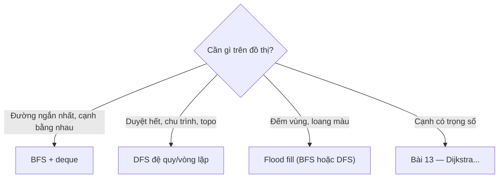
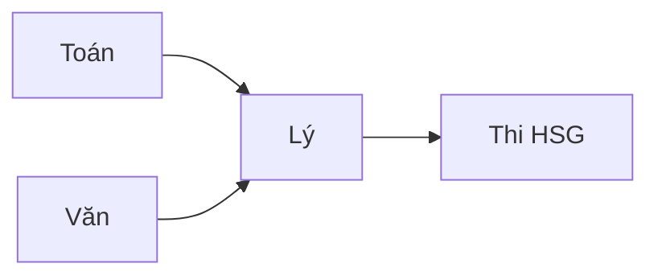

<!-- TỰ ĐỘNG ĐỒNG BỘ từ 02-Thuat-Toan/34-Do-Thi-BFS-DFS/bai.md — đừng sửa trực tiếp, sửa bản chính rồi chạy tools/sync_tracks.py -->

# Bài 12 — Đồ Thị: BFS & DFS

> 🧮 **Nhánh 02 — Thuật Toán (HSG / Competitive Programming)**

---

## 🧠 Điều kiện tiên quyết

- [Bài 5 — Stack, Queue & Hashing](../05-Stack-Queue-Hashing/bai.md) (deque, visited-set)
- [Bài 6 — Đệ Quy](../06-De-Quy/bai.md)
- [Bài 2 — Độ Phức Tạp](../02-Do-Phuc-Tap/bai.md)

---

## 🎯 Mục tiêu

Sau bài học này, học viên sẽ:

* ✅ Biểu diễn đồ thị bằng danh sách kề (adjacency list) — cách duy nhất nên dùng trong thi cử.
* ✅ Cài BFS bằng deque: đường ngắn nhất (cạnh bằng nhau), thành phần liên thông, kiểm tra hai phía.
* ✅ Cài DFS (đệ quy + vòng lặp): duyệt, phát hiện chu trình, sắp xếp topo, flood fill trên lưới.
* ✅ Phân tích O(V + E) và hiểu vì sao ma trận kề O(V²) giết chết bài lớn.
* ✅ Nhận diện đề đồ thị trá hình ("lưới", "mê cung", "quan hệ", "lan truyền").

---

## 📖 Mở đầu

Đồ thị là cấu trúc "mẹ" của gần nửa đề HSG khó: mê cung, mạng xã hội, bản đồ
đường đi, lịch thi, lan truyền virus... Mọi bài như vậy đều quy về: đỉnh
(vertex), cạnh (edge), và hai cách duyệt — BFS (theo lớp) và DFS (đi sâu).

Nắm bài này, bạn mở khóa Bài 13 (đường ngắn nhất có trọng số) và Bài 14
(cây, DSU) — vì cây chỉ là đồ thị không chu trình, và Dijkstra chỉ là
"BFS có cân".

> 🐣 **Mới học đồ thị? Đọc mục "Khởi động siêu chậm" ngay dưới đây trước,
> rồi mới đọc tiếp. Mục đó không có code khó, chỉ có kể chuyện + làm tay.**

---

## 🐣 Khởi động siêu chậm — đồ thị là gì? (10 phút, không cần code)

### Chuyện 1: Ba người bạn

An chơi thân với Bình. Bình chơi thân với Chi. An và Chi **không** chơi thân
trực tiếp.

Hỏi: An muốn nhắn cho Chi thì nhắn qua ai? — Qua Bình. Hỏi tiếp: Chi muốn nhắn
cho An? — Cũng qua Bình (tình bạn 2 chiều).

Vẽ ra giấy:

```
An --- Bình --- Chi
```

Đó chính là một **đồ thị**: 3 **đỉnh** (người), 2 **cạnh** (tình bạn).
Máy tính lưu nó bằng "danh sách bạn của từng người":

```
Bạn của An:   [Bình]
Bạn của Bình: [An, Chi]
Bạn của Chi:  [Bình]
```

Trong code, người ta đánh số 0, 1, 2 thay vì tên:

```python
ke = [[1], [0, 2], [1]]   # ke[0] = bạn của 0, ke[1] = bạn của 1...
```

Đọc `ke[1] = [0, 2]` thành tiếng: "1 chơi với 0 và 2". Chỉ vậy thôi —
**danh sách kề = danh sách bạn bè**. Mọi thứ phức tạp sau này đều xây trên
cái đơn giản này.

### Chuyện 2: Truyền tin theo hàng (đây chính là BFS!)

An có tin khẩn, muốn **mọi người** biết càng sớm càng tốt. Cách làm:

1. An nhắn cho tất cả bạn trực tiếp (Bình). — *Lớp 1 biết tin.*
2. Ai vừa biết tin thì nhắn tiếp cho bạn mình chưa biết (Bình nhắn Chi). — *Lớp 2 biết tin.*
3. Lặp lại đến khi không còn ai chưa biết.

Đó chính là BFS! "Hàng đợi" (queue) chỉ là cách nói sang của "xếp hàng chờ
đến lượt nhắn": ai biết tin trước thì nhắn trước (vào hàng trước, ra trước).

Chạy tay với 3 người trên: hàng đợi ban đầu [An] → lấy An ra, nhắn Bình
(hàng đợi [Bình]) → lấy Bình ra, nhắn Chi (hàng đợi [Chi]) → lấy Chi ra,
hết bạn mới → xong. Thứ tự biết tin: An, Bình, Chi.

### ✋ Dừng lại tự kiểm tra (che đáp án, làm trước!)

4 người đánh số 0, 1, 2, 3. Tình bạn: 0–1, 0–2, 2–3.

a) Viết danh sách kề `ke` (4 dòng).
b) BFS từ 0: thứ tự biết tin là gì? Ai ở "lớp" mấy?

<details>
<summary>✅ Xem đáp án kiểm tra</summary>

a) `ke = [[1, 2], [0], [0, 3], [2]]` — đọc: 0 chơi với 1, 2; 1 chỉ chơi với 0;
   2 chơi với 0, 3; 3 chỉ chơi với 2.

b) Hàng đợi [0] → lấy 0, nhắn 1, 2 (hàng đợi [1, 2]) → lấy 1, bạn 0 đã biết
   (bỏ qua) → lấy 2, nhắn 3 (hàng đợi [3]) → lấy 3, xong.
   Thứ tự: **0, 1, 2, 3**. Lớp: 0 ở lớp 0; 1, 2 ở lớp 1; 3 ở lớp 2
   (dist = [0, 1, 1, 2]).

   Nếu bạn làm đúng cả a và b thì đã hiểu 50% bài này — đọc tiếp sẽ nhẹ hẳn!

</details>

### Code chậm — BFS in từng bước (chạy thử!)

Code dưới đây làm **đúng** việc bạn vừa làm tay — hãy chạy nó và đối chiếu
từng dòng in với bảng tay của bạn:

```python
from collections import deque

def bfs_cham(ke, nguon):
    dist = [-1] * len(ke)   # -1 = chưa biết tin; số = lớp biết tin
    dist[nguon] = 0
    q = deque([nguon])      # hàng đợi: ai biết tin trước, nhắn trước
    print("Bắt đầu: hàng đợi =", list(q), "| dist =", dist)
    while q:
        u = q.popleft()     # lấy người đầu hàng ra nhắn tin
        print(f"Lấy {u} ra -> xét bạn của {u}: {ke[u]}")
        for v in ke[u]:     # nhắn cho từng bạn
            if dist[v] == -1:              # bạn chưa biết tin?
                dist[v] = dist[u] + 1      # lớp = lớp mình + 1
                q.append(v)                # xếp bạn vào cuối hàng
                print(f"  {v} chưa biết -> lớp {dist[v]}, hàng đợi: {list(q)}")
            else:
                print(f"  {v} đã biết rồi -> bỏ qua")
    return dist

print(bfs_cham([[1], [0, 2], [1]], 0))
```

Chạy với 3 người An–Bình–Chi, output:

```
Bắt đầu: hàng đợi = [0] | dist = [0, -1, -1]
Lấy 0 ra -> xét bạn của 0: [1]
  1 chưa biết -> lớp 1, hàng đợi: [1]
Lấy 1 ra -> xét bạn của 1: [0, 2]
  0 đã biết rồi -> bỏ qua
  2 chưa biết -> lớp 2, hàng đợi: [2]
Lấy 2 ra -> xét bạn của 2: [1]
  1 đã biết rồi -> bỏ qua
[0, 1, 2]
```

Khớp 100% với làm tay? Khớp thì bạn đã **thật sự** hiểu BFS — phần còn lại
của bài chỉ là "BFS mặc thêm quần áo" (lưới, nhiều nguồn, topo...).

---

## 💡 Ý tưởng trực quan

* **BFS (Breadth-First):** sóng lan từ hòn đá ném xuống ao — vòng tròn lan đều
  theo từng lớp. Đỉnh nào sóng chạm trước thì gần nguồn nhất → đường ngắn nhất
  (khi mọi cạnh bằng nhau).
* **DFS (Depth-First):** đi mê cung kiểu "tay trái chạm tường" — đâm sâu một
  nhánh đến cụt mới quay lui. Nhớ đường bằng ngăn xếp (đệ quy) hoặc stack tay.
* **Danh sách kề:** mỗi đỉnh giữ danh sách "hàng xóm" — như danh bạ: tên →
  list bạn bè. Tra hàng xóm O(bậc), duyệt toàn đồ thị O(V + E).



---

## 📚 Kiến thức

### 1. Biểu diễn đồ thị — danh sách kề (adjacency list)

```python
n = 5
ke = [[] for _ in range(n)]   # ke[u] = list đỉnh kề u (0-based)

def them_canh(u, v, co_huong=False):
    ke[u].append(v)
    if not co_huong:
        ke[v].append(u)
```

| Cách biểu diễn | Bộ nhớ | Duyệt hàng xóm của u | Khi dùng |
|---|---|---|---|
| Danh sách kề | O(V + E) | O(bậc(u)) | **Mọi bài thi** (đồ thị thưa) |
| Ma trận kề V×V | O(V²) | O(V) | V ≤ 500–2000, cần hỏi "u–v có cạnh?" O(1) |

> Với V = 10⁵, ma trận kề cần 10¹⁰ ô → MLE ngay. Danh sách kề là đáp án mặc
> định; chỉ dùng ma trận khi đề cho V nhỏ và cần Floyd (Bài 13).

Đồ thị **có hướng** thì chỉ thêm chiều u→v. **Trọng số** thì lưu tuple
`ke[u].append((v, w))` — dùng ở Bài 13.

### 1b. 🖼️ Vẽ đồ thị ra giấy — đọc hình, viết kề

Trước khi code, hãy vẽ. Ba loại hình bạn sẽ gặp:

**Vô hướng** (đường 2 chiều — tình bạn, đường làng):

```
    1 --- 2
   /       \
  0         4
   \       /
    3 -----
ke = [[1, 3], [0, 2], [1, 4], [0, 4], [2, 3]]
```

Đọc `ke[0] = [1, 3]` là "đỉnh 0 nối với 1 và 3". Mỗi cạnh xuất hiện 2 lần
(0→1 và 1→0) — đó là lý do duyệt toàn đồ thị tốn O(V + E) với E đếm cả 2 chiều.

**Có hướng** (đường 1 chiều — tiên quyết, follow):

```
  0 ---> 1 ---> 3
  |             ^
  +----> 2 -----+
ke = [[1, 2], [3], [3], []]
```

`ke[3] = []` — đỉnh 3 không đi đâu được (nhưng vẫn tới được từ 1, 2).
Đồ thị có hướng: "tới được" không đối xứng — BFS từ 3 chỉ thăm được {3}!

**Trọng số** (mỗi cạnh có giá — bản đồ, cước phí):

```
  0 --4-- 1
  | \     | 1
  1  \2   3
  |   \   | \ 3
  2 --5-- +  4
ke = [[(1, 4), (2, 1)], [(0, 4), (2, 2), (3, 1)], ...]
```

> 💡 **Mẹo đọc đề:** thấy "đường một chiều / tiên quyết / phụ thuộc" → có hướng.
> Thấy "chi phí / thời gian / độ dài" khác nhau → trọng số → Bài 13.
> Không nói gì → vô hướng, cạnh bằng nhau → BFS/DFS bài này.

### 2. BFS — loang theo lớp, đường ngắn nhất cạnh đơn vị

```python
from collections import deque

def bfs(nguon, ke):
    n = len(ke)
    dist = [-1] * n        # -1 = chưa thăm; dist[u] = khoảng cách từ nguồn
    dist[nguon] = 0
    q = deque([nguon])
    while q:
        u = q.popleft()
        for v in ke[u]:
            if dist[v] == -1:      # thăm lần đầu = đường ngắn nhất
                dist[v] = dist[u] + 1
                q.append(v)
    return dist
```

**Vì sao BFS cho đường ngắn nhất (cạnh bằng nhau):** queue FIFO nên đỉnh được
thăm theo thứ tự khoảng cách tăng dần không nghiêm ngặt — lần đầu chạm v là
qua đường ngắn nhất (mọi đường khác đến v đều không ngắn hơn, vì chúng phải
qua một đỉnh cùng lớp hoặc xa hơn). Chứng minh hình thức dùng bất biến queue;
trực giác "sóng lan đều" là đủ để dùng đúng.

O(V + E): mỗi đỉnh vào/ra queue 1 lần, mỗi cạnh xét 2 lần (vô hướng).

### 2b. 🔍 Chạy tay BFS từng bước — nhìn queue "thở"

Đồ thị mẫu (6 đỉnh):

```
    1 --- 2
    |     |
    0     3 --- 4 --- 5
    (0 nối 1; 1 nối 0,3; 2 nối 0,3; 3 nối 1,2,4; 4 nối 3,5; 5 nối 4)
```

BFS từ 0. Quy ước: pop đỉnh nào thì xét hết hàng xóm của nó, đỉnh mới thăm
được đẩy vào **đuôi** queue:

| Bước | Pop | Queue sau pop | Hàng xóm xét | Đẩy mới | dist |
|---|---|---|---|---|---|
| 0 (khởi tạo) | — | [0] | — | — | [0,·,·,·,·,·] |
| 1 | 0 | [] → [1, 2] | 1 ✔ mới, 2 ✔ mới | 1, 2 | [0,1,1,·,·,·] |
| 2 | 1 | [2] → [2, 3] | 0 cũ, 3 ✔ mới | 3 | [0,1,1,2,·,·] |
| 3 | 2 | [3] → [3] | 0 cũ, 3 cũ (đã thăm!) | — | không đổi |
| 4 | 3 | [] → [4] | 1 cũ, 2 cũ, 4 ✔ mới | 4 | [0,1,1,2,3,·] |
| 5 | 4 | [] → [5] | 3 cũ, 5 ✔ mới | 5 | [0,1,1,2,3,4] |
| 6 | 5 | [] | 4 cũ | — | xong |

Ba điều rút ra khi nhìn bảng:

1. **Queue luôn chứa các đỉnh cùng lớp hoặc lệch nhau đúng 1 lớp**
   (bước 2: [2(lớp 1), 3(lớp 2)]). Đây chính là "sóng lan đều" — và là lý do
   lần đầu chạm đỉnh nào thì đó là đường ngắn nhất: mọi đường khác tới nó đều
   phải đi qua lớp ≥ lớp hiện tại.
2. **Đỉnh 3 được phát hiện từ 1 nhưng cũng kề 2** — khi pop 2, thấy 3 đã thăm
   thì bỏ qua. Mỗi cạnh tuy xét 2 lần nhưng chỉ "đẩy mới" đúng 1 lần → O(V+E).
3. Thứ tự pop (0, 1, 2, 3, 4, 5) chính là thứ tự khoảng cách tăng dần —
   BFS "xếp hàng" đỉnh theo độ xa. Muốn in đường đi cụ thể? Lưu thêm mảng
   `cha[v] = u` lúc đẩy mới, rồi đi ngược từ đích về nguồn (xem bài tập).

### 3. DFS — đệ quy (tự nhiên) và vòng lặp (an toàn sâu)

```python
import sys
sys.setrecursionlimit(300000)

def dfs_de_quy(u, ke, tham):
    tham[u] = True
    for v in ke[u]:
        if not tham[v]:
            dfs_de_quy(v, ke, tham)

def dfs_vong_lap(nguon, ke):
    tham = [False] * len(ke)
    st = [nguon]
    tham[nguon] = True
    while st:
        u = st.pop()
        for v in ke[u]:
            if not tham[v]:
                tham[v] = True
                st.append(v)
    return tham
```

> ⚠️ Đệ quy sâu = sâu của đường đi dài nhất (xấu nhất V = 10⁵ → crash).
> Lưới/mê cung dài ngoằn → dùng BFS (queue, không sâu) hoặc DFS vòng lặp.
> Quy tắc: V ≤ ~10⁴ và đồ thị "bè" thì đệ quy ok; sâu tuyến tính → vòng lặp/BFS.

### 3b. 🔍 Chạy tay DFS — cùng đồ thị, thứ tự khác hẳn

Dùng đúng đồ thị 6 đỉnh ở mục 2b, DFS vòng lặp từ 0
(đẩy hàng xóm theo thứ tự trong `ke`, stack lấy từ **đỉnh**):

| Bước | Pop | Stack sau | Đẩy mới | Đã thăm |
|---|---|---|---|---|
| 0 | — | [0] | — | {0} |
| 1 | 0 | [1, 2] | 1, 2 | {0,1,2} |
| 2 | 2 | [1, 3] | 3 (0 cũ) | {0,1,2,3} |
| 3 | 3 | [1, 4] | 4 (1,2 cũ) | {0,1,2,3,4} |
| 4 | 4 | [1, 5] | 5 (3 cũ) | {0,...,5} |
| 5 | 5 | [1] | — (4 cũ) | đủ |
| 6 | 1 | [] | — (0,3 cũ) | xong |

So sánh với BFS ở mục 2b:

| | BFS (queue) | DFS (stack) |
|---|---|---|
| Thứ tự pop | 0, 1, 2, 3, 4, 5 | 0, 2, 3, 4, 5, 1 |
| Hình dung | Lan đều theo lớp | Đâm sâu một nhánh rồi quay lại |
| Đỉnh 1 | thăm ở bước 1 (lớp 1) | thăm ở bước 1 nhưng **xử lý cuối cùng** (bước 6) |
| dist | Có (đường ngắn nhất) | Không (chỉ biết tới được) |

> 💡 **Nhớ bằng hình:** BFS như nước ngập đồng đều — chỗ trũng (gần) ướt trước.
> DFS như chuột chũi đào hang — đào sâu một đường đến cụt mới quay lại đào
> nhánh khác. Cùng một hang (đồ thị), hai cách khám phá cho hai thông tin khác nhau.

### 4. Ba ứng dụng DFS/BFS phải thuộc

**a) Thành phần liên thông:** đếm số lần "khởi động" duyệt mới:

```python
def dem_thanh_phan(ke):
    tham = [False] * len(ke)
    dem = 0
    for u in range(len(ke)):
        if not tham[u]:
            dem += 1
            dfs_de_quy(u, ke, tham)   # hoặc BFS
    return dem
```

**b) Kiểm tra hai phía (bipartite):** tô 2 màu, kề nhau khác màu — BFS tô dần,
gặp cạnh nối cùng màu → không hai phía:

```python
from collections import deque

def hai_phia(ke):
    mau = [-1] * len(ke)
    for s in range(len(ke)):
        if mau[s] != -1:
            continue
        mau[s] = 0
        q = deque([s])
        while q:
            u = q.popleft()
            for v in ke[u]:
                if mau[v] == -1:
                    mau[v] = mau[u] ^ 1
                    q.append(v)
                elif mau[v] == mau[u]:
                    return False
    return True
```

**c) Sắp xếp topo (đồ thị có hướng không chu trình — DAG):** thứ tự sao cho mọi
cạnh u→v thì u đứng trước v (xếp môn học có tiên quyết). DFS + ghi thứ tự khi
quay lui (post-order đảo ngược), hoặc Kahn (BFS theo bậc vào):

```python
from collections import deque

def topo(ke):
    n = len(ke)
    bac_vao = [0] * n
    for u in range(n):
        for v in ke[u]:
            bac_vao[v] += 1
    q = deque([u for u in range(n) if bac_vao[u] == 0])
    thu_tu = []
    while q:
        u = q.popleft()
        thu_tu.append(u)
        for v in ke[u]:
            bac_vao[v] -= 1
            if bac_vao[v] == 0:
                q.append(v)
    return thu_tu if len(thu_tu) == n else None  # None = có chu trình
```

> Kahn vừa topo vừa phát hiện chu trình (còn đỉnh mà queue rỗng → chu trình).
> DP trên DAG (Bài 18) chạy trên đúng thứ tự này.

### 5. Flood fill trên lưới — đồ thị không cần xây danh sách kề

Lưới n×m là đồ thị ngầm: mỗi ô kề 4 ô xung quanh. Không xây `ke`, duyệt trực
tiếp bằng hướng `(dr, dc)`:

```python
from collections import deque

def dem_dao(luoi):
    n, m = len(luoi), len(luoi[0])
    tham = [[False] * m for _ in range(n)]
    dem = 0
    for r in range(n):
        for c in range(m):
            if luoi[r][c] == 1 and not tham[r][c]:
                dem += 1
                q = deque([(r, c)])
                tham[r][c] = True
                while q:
                    x, y = q.popleft()
                    for dx, dy in ((1, 0), (-1, 0), (0, 1), (0, -1)):
                        nx, ny = x + dx, y + dy
                        if (0 <= nx < n and 0 <= ny < m
                                and luoi[nx][ny] == 1 and not tham[nx][ny]):
                            tham[nx][ny] = True
                            q.append((nx, ny))
    return dem
```

> Đánh dấu `tham` **ngay khi đẩy vào queue** (không phải khi pop) — nếu không,
> cùng một ô bị đẩy nhiều lần → queue phình O(V·bậc) → TLE. Bug #1 của BFS lưới.

### 6. Nhận diện đề đồ thị trá hình

| Vỏ câu chuyện | Đồ thị thật |
|---|---|
| Mê cung, lưới, "đi từ A đến B ít bước nhất" | BFS lưới (cạnh đơn vị) |
| "Ốc đảo", "vùng đất", "tô màu lan" | Flood fill / thành phần |
| "Môn tiên quyết", "thứ tự thực hiện" | Topo DAG |
| "Chia 2 nhóm không xung đột" | Hai phía |
| "Lan truyền", "số ngày nhiễm cả mạng" | BFS đa nguồn (đẩy hết nguồn vào queue ban đầu!) |
| Quan hệ bạn bè, mạng | Đồ thị tổng quát BFS/DFS |

---

## 💻 Ví dụ

### Ví dụ 1 — Dễ: đường ngắn nhất trong mê cung (BFS lưới)

> Lưới n×m (`0` đi được, `1` tường). Từ (0,0) đến (n−1,m−1) ít bước nhất?
> Không tới được in −1.

```python
import sys
from collections import deque

def main():
    data = sys.stdin.read().strip().split()
    if not data:
        return
    it = iter(data)
    n, m = int(next(it)), int(next(it))
    luoi = [[int(next(it)) for _ in range(m)] for _ in range(n)]
    if luoi[0][0] == 1 or luoi[n - 1][m - 1] == 1:
        print(-1)
        return
    dist = [[-1] * m for _ in range(n)]
    dist[0][0] = 0
    q = deque([(0, 0)])
    while q:
        x, y = q.popleft()
        if (x, y) == (n - 1, m - 1):
            break
        for dx, dy in ((1, 0), (-1, 0), (0, 1), (0, -1)):
            nx, ny = x + dx, y + dy
            if 0 <= nx < n and 0 <= ny < m and luoi[nx][ny] == 0 and dist[nx][ny] == -1:
                dist[nx][ny] = dist[x][y] + 1
                q.append((nx, ny))
    print(dist[n - 1][m - 1])

main()
```

**Giải thích:** BFS từ nguồn trên lưới = sóng lan từng bước; `dist` vừa là
khoảng cách vừa là mảng thăm (−1 = chưa tới). Gặp đích thì `break` ngay
(BFS đảm bảo đó là ngắn nhất — không cần duyệt hết). O(n·m).

**🗺️ Chạy tay trên lưới mẫu 4×4** (S = xuất phát, E = đích, # = tường):

```
S . . #        dist sau BFS:
# # . #   →    0  1  2  X
. . . .        X  X  3  X
# . # .        6  5  4  5
               X  6  X  6
```

Đọc bảng dist như bản đồ "sóng lan": ô (0,2) = 2 (đi S→→), ô (1,2) = 3,
sóng vòng xuống hàng 2: (2,2) = 4, rồi tản ra (2,1) = 5, (2,3) = 5,
(2,0) = 6, (3,1) = 6, và đích E(3,3) = **6**. Đáp án 6 bước.

Dựng lại đường đi ngắn nhất: từ E đi ngược về ô kề có dist nhỏ hơn 1:
(3,3)=6 → (2,3)=5 → (2,2)=4 → (1,2)=3 → (0,2)=2 → (0,1)=1 → (0,0)=0.
Đường: →→↓↓↓→. Muốn code in đường đi? Lưu mảng `cha` khi đẩy vào queue
(như gợi ý ở mục 2b), rồi đi ngược từ đích — đúng 5 dòng thêm.

### Ví dụ 2 — Thực tế: lan truyền đa nguồn (covid trong siêu thị)

> Lưới n×m: `1` = đã nhiễm, `0` = khỏe. Mỗi ngày, ô nhiễm lan sang 4 ô kề khỏe.
> Sau bao nhiêu ngày cả lưới nhiễm? Ô nào không bao giờ nhiễm thì bỏ qua
> (tính max trên ô nhiễm được)?

BFS **đa nguồn**: đẩy TẤT CẢ ô nhiễm ban đầu vào queue với dist = 0 — tương
đương thêm "siêu nguồn" nối tới mọi nguồn:

```python
import sys
from collections import deque

def main():
    data = sys.stdin.read().strip().split()
    if not data:
        return
    it = iter(data)
    n, m = int(next(it)), int(next(it))
    luoi = [[int(next(it)) for _ in range(m)] for _ in range(n)]
    dist = [[-1] * m for _ in range(n)]
    q = deque()
    for r in range(n):
        for c in range(m):
            if luoi[r][c] == 1:
                dist[r][c] = 0
                q.append((r, c))
    while q:
        x, y = q.popleft()
        for dx, dy in ((1, 0), (-1, 0), (0, 1), (0, -1)):
            nx, ny = x + dx, y + dy
            if 0 <= nx < n and 0 <= ny < m and dist[nx][ny] == -1:
                dist[nx][ny] = dist[x][y] + 1
                q.append((nx, ny))
    print(max(max(hang) for hang in dist))

main()
```

**Giải thích:** mỗi ô khỏe lấy nhiễm từ nguồn **gần nhất** — đúng bản chất BFS
đa nguồn. Đáp án = dist lớn nhất. O(n·m) một lần duy nhất (naive: BFS từ từng
nguồn → O(k·n·m) → TLE).

### Ví dụ 3 — Khó: phát hiện chu trình + topo (xếp môn học)

> n môn (0..n−1), m ràng buộc (u, v): phải học u trước v. In một thứ tự hợp lệ,
> hoặc `KHONG THE` nếu có chu trình (tiên quyết vòng nhau).

```python
import sys
from collections import deque

def main():
    data = sys.stdin.read().strip().split()
    if not data:
        return
    it = iter(data)
    n, m = int(next(it)), int(next(it))
    ke = [[] for _ in range(n)]
    bac = [0] * n
    for _ in range(m):
        u, v = int(next(it)), int(next(it))
        ke[u].append(v)
        bac[v] += 1
    q = deque([u for u in range(n) if bac[u] == 0])
    thu_tu = []
    while q:
        u = q.popleft()
        thu_tu.append(u)
        for v in ke[u]:
            bac[v] -= 1
            if bac[v] == 0:
                q.append(v)
    if len(thu_tu) != n:
        print("KHONG THE")
    else:
        print(" ".join(map(str, thu_tu)))

main()
```

Chạy tay n = 4, ràng buộc (0,1), (0,2), (1,3), (2,3): bậc vào [0,1,1,2] →
queue [0] → lấy 0, bậc còn [0,0,0,1] → queue [1,2] → lấy 1 → [2] (bậc 3 còn 1)
→ lấy 2 → bậc 3 về 0 → [3] → lấy 3 → thứ tự **0 1 2 3**. ✔
Thêm ràng buộc (3,0) → chu trình → queue rỗng khi còn đỉnh → **KHONG THE**. ✔

---

## 📊 Minh họa

BFS trên đồ thị nhỏ (nguồn 0):

```
    1 --- 2
   /       \
  0         4
   \       /
    3 --- 5? (không — ví dụ lớp)
Lớp 0: [0]
Lớp 1: [1, 3]      (hàng xóm của 0)
Lớp 2: [2, ...]    (hàng xóm chưa thăm của lớp 1)
```

Thứ tự topo = "xếp hàng sao cho mọi mũi tên đi từ trước ra sau":



---

## ⚠️ Những lỗi thường gặp

### Lỗi 1: Đánh dấu thăm khi pop thay vì khi push → TLE/phình queue

```python
# ❌ ô bị đẩy vào queue nhiều lần
u = q.popleft()
tham[u] = True
# ✅ đánh dấu ngay khi phát hiện
if ... and not tham[nx][ny]:
    tham[nx][ny] = True
    q.append((nx, ny))
```

### Lỗi 2: Dùng ma trận kề với V = 10⁵ → MLE

### Lỗi 3: DFS đệ quy trên đường dài 10⁵ → RecursionError

* Dùng BFS hoặc DFS vòng lặp cho lưới/đường dài.

### Lỗi 4: Quên đồ thị có thể không liên thông

* BFS/DFS từ một nguồn chỉ bao phủ một thành phần → vòng lặp ngoài qua mọi
  đỉnh cho bài đếm thành phần/tô màu/hai phía.

### Lỗi 5: Nhập nhằng có hướng/vô hướng

* Thêm cạnh 2 chiều cho đồ thị có hướng → sai (đi ngược chiều cấm).
  Đọc đề: "đường một chiều" / "tiên quyết" = có hướng.

### Lỗi 6: BFS tìm đường ngắn nhất khi cạnh có trọng số khác nhau

* ❌ Sai — phải Dijkstra (Bài 13). BFS chỉ đúng khi mọi cạnh bằng nhau.

---

## 🧪 Trường hợp đặc biệt

* **Đồ thị rỗng / 1 đỉnh**: BFS trả dist = [0]; topo 1 đỉnh → chính nó.
* **Tự khuyên (self-loop)**: DFS phát hiện chu trình phải xử lý riêng
  (cạnh u→u); Kahn: bậc vào của u không bao giờ về 0 → báo chu trình ✔.
* **Song cạnh**: danh sách kề chứa trùng — BFS/DFS vẫn đúng (thăm rồi bỏ qua),
  nhưng đếm bậc/cạnh thì sai → hỏi đề có song cạnh không.
* **Lưới 1×1**: nguồn = đích → đáp án 0 (mê cung) — code ví dụ 1 đúng vì
  `dist[0][0] = 0` và `break` ngay... kiểm tra: vòng while pop (0,0),
  `(x,y) == (n−1,m−1)` → break → in 0 ✔.
* **Không tới được**: dist = −1 → in −1 (quy ước đề).

---

## 🚀 Ứng dụng thực tế

* Bản đồ (đường ngắn nhất — Bài 13), mạng xã hội (bạn chung, lan truyền),
  build system (topo phụ thuộc), garbage collector (duyệt tham chiếu),
  giải đố (Rubik BFS, Sudoku DFS — ôn Bài 7).

---

## 🧩 Bài tập

### 🟢 Cơ bản (1–3)

**Bài 1 — Chạy tay BFS.** Đồ thị: 0 nối 1, 2; 1 nối 3; 2 nối 3; 3 nối 4.
BFS từ 0: ghi thứ tự pop và dist mỗi đỉnh.

**Bài 2 — Đếm đảo.** Lưới 4×4 cho trước (tự vẽ 3 đảo). Chạy tay flood fill,
đếm = 3. Viết code hoàn chỉnh đọc input.

**Bài 3 — Hai phía?** Đồ thị tam giác (0-1-2-0) có hai phía không? Đồ thị vuông
(0-1-2-3-0) thì sao? Chạy tay thuật toán tô màu. Rút ra quy luật: chu trình lẻ
↔ không hai phía.

### 🟡 Hiểu sâu (4–6)

**Bài 4 — 0-1 BFS (mở rộng).** Cạnh trọng số chỉ 0 hoặc 1. BFS thường sai,
Dijkstra thì nặng — dùng deque: cạnh 0 → appendleft, cạnh 1 → appendright.
Cài đặt + giải thích vì sao đúng (bất biến deque đơn điệu theo dist).

**Bài 5 — Đảo lớn nhất.** Lưới nhị phân n×m ≤ 10³×10³. Tìm diện tích đảo
(ô 1 liền nhau 4 hướng) lớn nhất. *Chú ý bộ nhớ + tốc độ: BFS vòng lặp,
đánh dấu khi push.*

**Bài 6 — Topo + DP sơ khai.** DAG có trọng số đỉnh (điểm thưởng). Tìm đường
(tổng điểm) lớn nhất từ đỉnh 0. *Gợi ý: topo xong duyệt theo thứ tự,
dp[v] = max(dp[v], dp[u] + diem[v]) — tiền đề Bài 18 (DP trên DAG).*

### 🔴 Vận dụng (7–8)

**Bài 7 — Mê cung nhiều lối thoát.** Lưới n×m ≤ 10³×10³, nhiều điểm S (xuất
phát) và nhiều điểm E (thoát). Mỗi S tìm E gần nhất. *Gợi ý: đừng BFS từ từng
S — BFS đa nguồn từ TẤT CẢ E cùng lúc (đồ thị vô hướng, khoảng cách đối xứng),
mỗi ô ghi E gần nhất + dist. O(n·m) một lần.*

**Bài 8 — Chu trình trong đồ thị có hướng.** Cài DFS 3 màu (trắng/xám/đen):
gặp cạnh tới đỉnh xám → chu trình. So với Kahn: khi nào dùng cái nào?
*Gợi ý: cần liệt kê chu trình cụ thể → DFS 3 màu (truy vết qua stack);
chỉ cần thứ tự/kiểm tra → Kahn gọn hơn.*
### ➕ Bài tập bổ sung (Bài 9–12)

**Bài 9 — DFS tay + độ sâu.** Đồ thị: 0 nối 1, 2; 1 nối 3; 2 nối 3; 3 nối 4.
Chạy tay DFS đệ quy từ 0 (hàng xóm theo thứ tự tăng dần), ghi thứ tự thăm và
độ sâu ngăn xếp lớn nhất. So với thứ tự BFS (Bài 1 đáp án).

**Bài 10 — Thành phần lớn nhất.** Đồ thị vô hướng n ≤ 10⁵. Tìm kích thước thành
phần liên thông lớn nhất (số đỉnh). Code BFS/DFS + test (6 đỉnh, cạnh
(0,1),(1,2),(3,4) → 3). Phân tích Big-O.

**Bài 11 — Đảo 8 hướng.** Sửa flood fill 4 hướng thành 8 hướng (kể cả chéo).
Test lưới 3×3 (góc + tâm = 1, còn lại 0): 4 hướng → 5 đảo, 8 hướng → 1 đảo.
Giải thích vì sao đề phải ghi rõ 4 hay 8 hướng!

**Bài 12 — Có phải cây?** Cho n đỉnh và danh sách cạnh. Kiểm tra có phải cây
không (đủ n−1 cạnh + liên thông). Code + 3 test: cây thật, thiếu cạnh (rời),
đủ cạnh nhưng có chu trình (tam giác + đỉnh treo). Giải thích vì sao thiếu 1
trong 2 điều kiện là sai.

---

## ✅ Đáp án

> 💡 **Hãy tự làm bài tập trước** rồi mới mở đáp án.

<details>
<summary>✅ Bài 1: Chạy tay BFS</summary>

| Pop | Queue sau | dist mới |
|---|---|---|
| 0 | [1, 2] | d1=1, d2=1 |
| 1 | [2, 3] | d3=2 |
| 2 | [3] | (3 đã thăm) |
| 3 | [4] | d4=3 |
| 4 | [] | xong |

Thứ tự pop: 0, 1, 2, 3, 4. dist = [0, 1, 1, 2, 3].

</details>

<details>
<summary>✅ Bài 2: Đếm đảo</summary>

Đúng code `dem_dao` ở mục 5. Mỗi lần gặp ô 1 chưa thăm → dem += 1 + flood fill
cả đảo đó (đánh dấu hết để không đếm lại). Số lần khởi động = số đảo.

</details>

<details>
<summary>✅ Bài 3: Hai phía?</summary>

* Tam giác: tô 0→màu 0, 1→màu 1, 2 kề cả 0 và 1 → không còn màu → **không hai phía**.
* Vuông: 0→0, 1→1, 2→0, 3→1 — cạnh (3,0): màu 1 vs 0 khác nhau ✔ → **hai phía**.
* Quy luật: đồ thị **hai phía ⟺ không chứa chu trình lẻ** (định lý König —
  chuẩn HSG).

</details>

<details>
<summary>✅ Bài 4: 0-1 BFS</summary>

```python
from collections import deque

def bfs_01(ke, nguon):
    INF = 10 ** 18
    dist = [INF] * len(ke)
    dist[nguon] = 0
    dq = deque([nguon])
    while dq:
        u = dq.popleft()
        for v, w in ke[u]:
            if dist[u] + w < dist[v]:
                dist[v] = dist[u] + w
                if w == 0:
                    dq.appendleft(v)   # không tốn thêm → lên trước
                else:
                    dq.append(v)
    return dist
```

Bất biến: deque luôn sắp xếp theo dist tăng dần (không nghiêm ngặt) — cạnh 0
giữ nguyên dist nên xứng đáng lên đầu; cạnh 1 tăng dist nên xuống cuối.
O(V + E), nhẹ hơn Dijkstra O(E log V). Dùng cho lưới "đi thẳng tốn 0, rẽ tốn 1"...

</details>

<details>
<summary>✅ Bài 5: Đảo lớn nhất</summary>

```python
import sys
from collections import deque

def main():
    data = sys.stdin.read().strip().split()
    if not data:
        return
    it = iter(data)
    n, m = int(next(it)), int(next(it))
    luoi = [[int(next(it)) for _ in range(m)] for _ in range(n)]
    tham = [[False] * m for _ in range(n)]
    tot = 0
    for r in range(n):
        for c in range(m):
            if luoi[r][c] == 1 and not tham[r][c]:
                dien_tich, q = 0, deque([(r, c)])
                tham[r][c] = True
                while q:
                    x, y = q.popleft()
                    dien_tich += 1
                    for dx, dy in ((1, 0), (-1, 0), (0, 1), (0, -1)):
                        nx, ny = x + dx, y + dy
                        if (0 <= nx < n and 0 <= ny < m
                                and luoi[nx][ny] == 1 and not tham[nx][ny]):
                            tham[nx][ny] = True
                            q.append((nx, ny))
                tot = max(tot, dien_tich)
    print(tot)

main()
```

n·m ≤ 10⁶: `tham` + `luoi` dạng list-of-list tốn ~100MB+ trong Python —
sát biên nhưng thường qua (256MB). Muốn nhẹ: đọc chuỗi `"0101..."` thay vì
int từng ô.

</details>

<details>
<summary>✅ Bài 6: Topo + DP sơ khai</summary>

```python
from collections import deque

def duong_max_dag(n, ke, diem, nguon=0):
    bac = [0] * n
    for u in range(n):
        for v in ke[u]:
            bac[v] += 1
    q = deque([u for u in range(n) if bac[u] == 0])
    topo = []
    while q:
        u = q.popleft(); topo.append(u)
        for v in ke[u]:
            bac[v] -= 1
            if bac[v] == 0:
                q.append(v)
    NEG = -10 ** 18
    dp = [NEG] * n
    dp[nguon] = diem[nguon]
    for u in topo:
        if dp[u] == NEG:
            continue
        for v in ke[u]:
            if dp[u] + diem[v] > dp[v]:
                dp[v] = dp[u] + diem[v]
    return max(dp)
```

Duyệt đúng thứ tự topo → khi xét u, dp[u] đã tối ưu (mọi tiền đề đứng trước).
O(V + E). Đây là DP trên DAG — Bài 18 hệ thống hóa.

</details>

<details>
<summary>✅ Bài 7: Mê cung nhiều lối thoát</summary>

BFS đa nguồn từ mọi E (dist = 0, ghi nguồn E). Lan xong, mỗi S đọc dist +
E gần nhất của nó. Đồ thị vô hướng → khoảng cách S–E đối xứng nên BFS từ E
cho đúng đáp án từng S. Một lần O(n·m) thay vì (#S lần BFS).

</details>

<details>
<summary>✅ Bài 8: Chu trình trong đồ thị có hướng</summary>

```python
import sys
sys.setrecursionlimit(300000)

def co_chu_trinh(ke):
    TRANG, XAM, DEN = 0, 1, 2
    mau = [TRANG] * len(ke)
    def dfs(u):
        mau[u] = XAM
        for v in ke[u]:
            if mau[v] == XAM:
                return True    # cạnh ngược lên tổ tiên → chu trình
            if mau[v] == TRANG and dfs(v):
                return True
        mau[u] = DEN
        return False
    return any(mau[u] == TRANG and dfs(u) for u in range(len(ke)))
```

* Đỉnh XÁM = đang trên đường đi hiện tại (stack đệ quy). Cạnh tới đỉnh xám =
  quay lại tổ tiên = chu trình. Đỉnh ĐEN = xong, không cần xét lại.
* Chọn: cần **vết** chu trình → DFS 3 màu (lưu cha để dựng đường);
  chỉ cần có/không + thứ tự → Kahn ngắn gọn hơn.

</details>

<details>
<summary>✅ Bài 9: DFS tay + độ sâu</summary>

DFS đệ quy từ 0 (hàng xóm tăng dần): thăm 0 → 1 → 3 → (ke[3] = [1,2,4]:
1 thăm rồi, tới 2 chưa thăm!) → 2 → (2 hết đường mới) quay lui → 4.

* Thứ tự thăm: **0, 1, 3, 2, 4**. Ngăn xếp sâu nhất **4** (0→1→3→2).
* Bẫy tinh vi: tưởng sau 3 là 4 (vì 4 "mới"), nhưng vòng lặp hàng xóm duyệt
  theo thứ tự ke[3] = [1, 2, 4] nên **2 đi trước 4**! Chạy tay phải theo đúng
  thứ tự code, không theo cảm tính.
* So BFS (Bài 1): 0, 1, 2, 3, 4 — BFS theo lớp, DFS đâm sâu. Cùng đồ thị,
  2 thứ tự khác nhau, 2 thông tin khác nhau (khoảng cách vs cấu trúc sâu)!

</details>

<details>
<summary>✅ Bài 10: Thành phần lớn nhất</summary>

```python
from collections import deque

def thanh_phan_lon_nhat(n, canh):
    ke = [[] for _ in range(n)]
    for u, v in canh:
        ke[u].append(v)
        ke[v].append(u)
    tham = [False] * n
    tot = 0
    for s in range(n):
        if tham[s]:
            continue
        dem, q = 0, deque([s])
        tham[s] = True
        while q:
            u = q.popleft()
            dem += 1
            for v in ke[u]:
                if not tham[v]:
                    tham[v] = True
                    q.append(v)
        tot = max(tot, dem)
    return tot

assert thanh_phan_lon_nhat(6, [(0, 1), (1, 2), (3, 4)]) == 3
```

Vòng ngoài qua mọi đỉnh (đồ thị có thể rời!) + BFS mỗi thành phần. O(V+E).
Quên vòng ngoài là bug #1 (chỉ thăm được 1 thành phần).

</details>

<details>
<summary>✅ Bài 11: Đảo 8 hướng</summary>

Thêm 4 hướng chéo vào tuple hướng:

```python
HUONG_8 = ((1, 0), (-1, 0), (0, 1), (0, -1),
           (1, 1), (1, -1), (-1, 1), (-1, -1))
```

Lưới góc+tâm: 4 hướng → **5 đảo** (tâm + 4 góc riêng lẻ), 8 hướng → **1 đảo**
(góc chạm tâm qua đường chéo). Đề không ghi rõ là đề lỗi — khi làm bài mà đề
mập mờ, hãy hỏi/giả định rõ trong code comment!

</details>

<details>
<summary>✅ Bài 12: Có phải cây?</summary>

```python
from collections import deque

def la_cay(n, canh):
    if len(canh) != n - 1:      # điều kiện 1: đúng số cạnh
        return False
    ke = [[] for _ in range(n)]
    for u, v in canh:
        ke[u].append(v)
        ke[v].append(u)
    tham = [False] * n
    q, tham[0], dem = deque([0]), True, 0
    while q:
        u = q.popleft()
        dem += 1
        for v in ke[u]:
            if not tham[v]:
                tham[v] = True
                q.append(v)
    return dem == n              # điều kiện 2: liên thông
```

* Cây thật [(0,1),(1,2),(2,3)] → True ✔.
* Thiếu cạnh [(0,1),(2,3)] (2 ≠ 3 cạnh) → False (rời).
* Đủ 3 cạnh nhưng tam giác [(0,1),(1,2),(0,2)] + đỉnh 3 treo → BFS thăm 3/4 →
  False (có chu trình + rời).
* Thiếu 1 trong 2 là sai: n−1 cạnh mà rời (thừa chu trình chỗ khác), liên thông
  mà thừa cạnh (có chu trình). Cây ⟺ cả hai!

</details>

---

## 🧠 Thử thách

**Thử thách HSG:** Lưới n×m ≤ 10³×10³, mỗi ô có độ cao h. Nước mưa rơi vào ô
(r, c) sẽ chảy sang ô kề **thấp hơn** (nghiêm ngặt); nếu nhiều ô thấp hơn thì
chảy hết sang tất cả? Không — mỗi giọt chọn **một** trong các ô thấp nhất?
Đề chuẩn (Pacific-Atlantic / Trapping Rain Water II biến thể): tìm các ô mà
nước từ đó chảy được ra **cả hai biên** Đông và Tây. *Gợi ý: đảo ngược —
BFS/DFS từ biên vào trong (đi lên chỗ cao hơn hoặc bằng), giao hai tập.*

---

## 📝 Tóm tắt

| Khái niệm | Nội dung |
|---|---|
| 🗺️ Biểu diễn | Danh sách kề O(V+E); ma trận chỉ khi V nhỏ |
| 🌊 BFS | Theo lớp + deque; đường ngắn nhất cạnh đơn vị; đa nguồn |
| 🕳️ DFS | Đệ quy/vòng lặp; chu trình, topo, flood fill |
| 🎨 Tô màu | Hai phía (2 màu), thăm (đánh dấu khi push) |
| 📐 Topo | Kahn: bậc vào + queue; None = chu trình |

---

## ➡️ Điều hướng

**Vị trí:** `04-Full/Phan-2-Thuat-Toan/12-Do-Thi-BFS-DFS/bai.md`

**Bài tiếp theo:** [Bài 13 — Đường Đi Ngắn Nhất](../13-Duong-Di-Ngan-Nhat/bai.md)