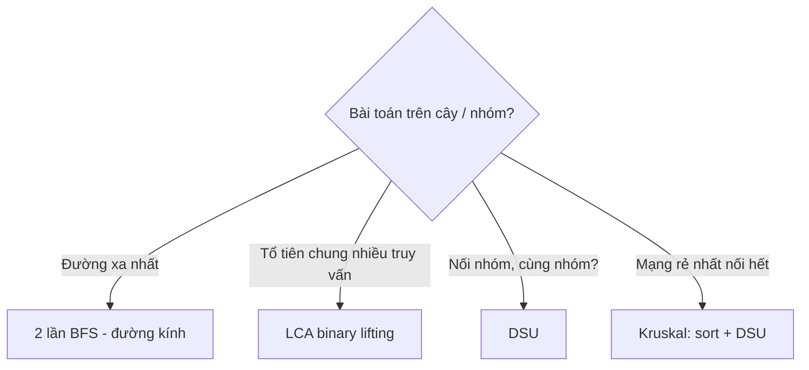

<!-- TỰ ĐỘNG ĐỒNG BỘ từ 02-Thuat-Toan/36-Cay-Va-DSU/bai.md — đừng sửa trực tiếp, sửa bản chính rồi chạy tools/sync_tracks.py -->

# Bài 14 — Cây & DSU (Hợp Nhất Tập Rời)

> 🧮 **Nhánh 02 — Thuật Toán (HSG / Competitive Programming)**

---

## 🧠 Điều kiện tiên quyết

- [Bài 12 — Đồ Thị: BFS & DFS](../12-Do-Thi-BFS-DFS/bai.md)
- [Bài 13 — Đường Đi Ngắn Nhất](../13-Duong-Di-Ngan-Nhat/bai.md) (Dijkstra, heap)
- [Bài 4 — Sắp Xếp](../04-Sap-Xep/bai.md)

---

## 🎯 Mục tiêu

Sau bài học này, học viên sẽ:

* ✅ Biết cây = đồ thị liên thông không chu trình (V đỉnh → đúng V−1 cạnh) và hệ quả của nó.
* ✅ Tìm đường kính cây bằng 2 lần BFS/DFS — mẹo O(V) kinh điển.
* ✅ Hiểu LCA (tổ tiên chung gần nhất) và binary lifting O(log V) mỗi truy vấn.
* ✅ Cài DSU (Union-Find) với nén đường + hợp theo hạng — gần như O(1) mỗi thao tác.
* ✅ Giải MST bằng Kruskal (sort cạnh + DSU) và đếm thành phần động.

---

## 📖 Mở đầu

Cây xuất hiện khắp nơi: thư mục, gia phả, mạng không dự phòng, cây khung của
đồ thị... Đặc biệt của cây: giữa hai đỉnh có **đúng một** đường đơn — không
chu trình nên mọi bài toán "đường đi" trở nên đơn giản (BFS/DFS một lần là đủ,
không cần Dijkstra).

DSU (Disjoint Set Union) là cấu trúc "hợp nhất nhóm" nhanh nhất: Kruskal,
đếm đảo động, mạng máy tính nối dần... — chỗ nào có "nối hai nhóm lại", chỗ đó
có DSU.

---

## 💡 Ý tưởng trực quan

* **Cây:** bản đồ đường không vòng — đi từ A đến B chỉ một cách, không sợ lạc
  vào vòng lặp. Chặt bất kỳ cạnh nào, cây tách làm đôi.
* **Đường kính:** hai thành phố xa nhau nhất — đứng ở một đầu, đi xa nhất có
  thể (lần 1) tới đầu kia của đường kính; từ đó đi xa nhất lần nữa (lần 2) đo
  đúng đường kính.
* **DSU:** mỗi nhóm có một "nhóm trưởng"; muốn biết hai người cùng nhóm không
  thì hỏi trưởng của mỗi người (nén đường: hỏi xong nhớ tắt để lần sau nhanh);
  hợp hai nhóm thì nhóm nhỏ sáp nhập vào nhóm lớn (hợp theo hạng).



---

## 📚 Kiến thức

### 1. Tính chất cây dùng trong thi cử

* V đỉnh liên thông + không chu trình ⟺ đúng V−1 cạnh.
* Hai đỉnh bất kỳ có **đúng một** đường đơn nối chúng.
* Thêm 1 cạnh bất kỳ → tạo đúng 1 chu trình. Bớt 1 cạnh → tách 2 thành phần.
* Hệ quả thi cử: BFS/DFS từ đâu cũng thăm hết (liên thông); đường đi duy nhất
  nên "đường ngắn nhất" = đường duy nhất (khỏi Dijkstra!).

### 2. Đường kính cây — 2 lần BFS O(V)

```python
from collections import deque

def bfs_xa_nhat(ke, nguon):
    dist = [-1] * len(ke)
    dist[nguon] = 0
    q = deque([nguon])
    xa = nguon
    while q:
        u = q.popleft()
        xa = u
        for v in ke[u]:
            if dist[v] == -1:
                dist[v] = dist[u] + 1
                q.append(v)
    return xa, dist

def duong_kinh(ke):
    a, _ = bfs_xa_nhat(ke, 0)      # lần 1: từ đâu cũng tới MỘT đầu đường kính
    b, dist = bfs_xa_nhat(ke, a)   # lần 2: từ đầu này tới đầu kia
    return dist[b]
```

**Vì sao đúng (trực giác):** trên cây, đỉnh xa nhất từ một đỉnh bất kỳ luôn là
một đầu của đường kính. (Chứng minh: giả sử đường kính là (x, y); đỉnh xa nhất
từ s là t ≠ x, y → xét giao của 3 đường s–t, s–x, s–y trên cây, dùng tính duy
nhất đường đi suy ra mâu thuẫn.) Cây có trọng số cạnh → thay BFS bằng Dijkstra
(vẫn 2 lần, vì đường duy nhất nên Dijkstra = BFS có cân).

### 2b. 🐢 Hiểu chậm: vì sao "đi xa nhất 2 lần" ra đường kính?

Lấy ví dụ cụ thể — cây 6 đỉnh, cạnh: 0-1, 0-2, 0-3, 2-4, 4-5.

```
        3
        |
    1 - 0 - 2 - 4 - 5
```

**Lần 1:** BFS từ 0 (đỉnh bất kỳ). dist từ 0: {0:0, 1:1, 2:1, 3:1, 4:2, 5:3} →
xa nhất là **5** (dist 3).

**Lần 2:** BFS từ 5: 5→4 (1), 4→2 (2), 2→0 (3), 0→1 (4), 0→3 (4) → xa nhất là
1 (hoặc 3), dist **4**. Đường kính = 4 (đường 5-4-2-0-1). ✔

Giờ hỏi: vì sao lần 1 (từ đỉnh bừa) luôn "rơi" vào một đầu đường kính? Tưởng
tượng đường kính là sợi dây dài nhất trong mạng nhện (cây). Bạn đứng ở điểm
bất kỳ s, đi xa nhất có thể → bạn sẽ đi về một trong hai đầu dây. Vì sao?
Mọi đường từ s đều phải "nhập" vào sợi dây ở điểm nào đó rồi đi dọc nó —
đi xa nhất nghĩa là đi dọc dây đến đầu xa hơn. (Trên cây chỉ có một đường giữa
hai điểm nên không có "đường tắt" phá vỡ lập luận — trên đồ thị có chu trình
thì sai ngay!) Lần 2 đo từ đầu này sang đầu kia = cả sợi dây. ✔

> ⚠️ Bẫy: 2-BFS **chỉ đúng trên cây** (không chu trình). Đồ thị tổng quát phải
> Floyd/all-pairs (Bài 13) — mang 2-BFS sang đồ thị có vòng là WA.

### 3. LCA bằng binary lifting — O((V+Q) log V)

**Bài toán:** q ≤ 10⁵ truy vấn (u, v): tìm tổ tiên chung sâu nhất của u, v
(trên cây có gốc). Naive leo từng bậc O(V) mỗi truy vấn → TLE.

**Tư tưởng:** tiền xử lý `up[k][v]` = tổ tiên 2^k bậc trên của v. Nhảy từ lũy
thừa lớn xuống nhỏ (như biểu diễn nhị phân khoảng cách):

```python
import sys
sys.setrecursionlimit(300000)

def chuan_bi_lca(ke, goc=0):
    n = len(ke)
    LOG = (n).bit_length()
    up = [[-1] * n for _ in range(LOG)]
    sau = [0] * n
    st = [(goc, -1, 0)]
    while st:
        u, cha, d = st.pop()
        up[0][u] = cha
        sau[u] = d
        for v in ke[u]:
            if v != cha:
                st.append((v, u, d + 1))
    for k in range(1, LOG):
        for v in range(n):
            if up[k - 1][v] != -1:
                up[k][v] = up[k - 1][up[k - 1][v]]
    return up, sau

def lca(u, v, up, sau):
    if sau[u] < sau[v]:
        u, v = v, u
    # đưa u lên cùng độ sâu với v
    lech = sau[u] - sau[v]
    k = 0
    while lech:
        if lech & 1:
            u = up[k][u]
        lech >>= 1
        k += 1
    if u == v:
        return u
    # cùng nhảy từ cao xuống thấp
    for k in range(len(up) - 1, -1, -1):
        if up[k][u] != up[k][v]:
            u, v = up[k][u], up[k][v]
    return up[0][u]
```

> Khoảng cách(u, v) = sau[u] + sau[v] − 2·sau[lca] — từ LCA suy ra khoảng cách
> O(1) sau mỗi truy vấn. Cạnh kề thứ k trên đường u–v cũng nhảy được (mở rộng).

### 3b. 🔍 Chạy tay binary lifting trên cây 8 đỉnh

Cây (gốc 0): 0 nối 1, 2; 1 nối 3, 4; 2 nối 5; 4 nối 6, 7.

```
        0
       / \
      1   2
     / \   \
    3   4   5
       / \
      6   7
```

Bảng tiền xử lý (sau = độ sâu; up[0] = cha; up[1] = ông (2 bậc); up[2] = cụ (4 bậc)):

| v | 0 | 1 | 2 | 3 | 4 | 5 | 6 | 7 |
|---|---|---|---|---|---|---|---|---|
| sau | 0 | 1 | 1 | 2 | 2 | 2 | 3 | 3 |
| up[0] (cha) | −1 | 0 | 0 | 1 | 1 | 2 | 4 | 4 |
| up[1] (ông) | −1 | −1 | −1 | 0 | 0 | 0 | 1 | 1 |
| up[2] (cụ) | −1 | −1 | −1 | −1 | −1 | −1 | −1 | −1 |

**Truy vấn lca(6, 5):**

1. sau[6] = 3 > sau[5] = 2 → đưa 6 lên 1 bậc: up[0][6] = 4. Giờ (4, 5) cùng sâu 2.
2. 4 ≠ 5. Nhảy từ cao: up[1][4] = 0, up[1][5] = 0 — bằng nhau → bỏ qua
   (nhảy là vượt quá LCA, tới gốc luôn — không được!).
3. Nhảy thấp: up[0][4] = 1, up[0][5] = 2 — khác nhau → u = 1, v = 2.
4. Trả up[0][1] = **0**. LCA(6, 5) = 0 ✔. Khoảng cách = 3 + 2 − 0 = 5
   (đường 6-4-1-0-2-5 đúng 5 cạnh ✔).

**Truy vấn lca(6, 7):** cùng sâu 3. up[1]: cả hai đều 1 → bằng nhau, bỏ qua.
up[0]: cả hai đều 4 → bằng nhau, bỏ qua. Trả up[0][6] = **4** ✔
(anh em ruột thì cha chung là LCA — code xử lý đúng mà không cần nhánh riêng!).

> 💡 **Hiểu vòng nhảy đôi:** ta muốn dừng **ngay dưới** LCA (con của LCA).
> Nhảy 2^k mà hai bên vẫn khác nhau → an toàn (chưa vượt LCA).
> Nhảy mà bằng nhau → đã vượt (hoặc tới) LCA → không nhảy.
> Cuối cùng cả hai đều là con của LCA → cha của chúng là đáp án.

### 4. DSU — nén đường + hợp theo hạng

```python
class DSU:
    def __init__(self, n):
        self.cha = list(range(n))
        self.hang = [0] * n       # chiều cao ước lượng của cây
        self.nhom = n             # số nhóm hiện tại

    def tim(self, x):
        while self.cha[x] != x:
            self.cha[x] = self.cha[self.cha[x]]  # nén nửa đường
            x = self.cha[x]
        return x

    def hop(self, a, b):
        a, b = self.tim(a), self.tim(b)
        if a == b:
            return False          # đã cùng nhóm (cạnh này tạo chu trình!)
        if self.hang[a] < self.hang[b]:
            a, b = b, a
        self.cha[b] = a
        if self.hang[a] == self.hang[b]:
            self.hang[a] += 1
        self.nhom -= 1
        return True
```

> Độ phức tạp gần như O(1) mỗi thao tác (hàm Ackermann ngược α(n) ≤ 5 với mọi
> n thực tế). `hop` trả False = hai đầu đã cùng nhóm → cạnh tạo chu trình —
> chính là kiểm tra dùng trong Kruskal.

### 4b. 🔍 Nhìn mảng `cha` biến đổi sau mỗi `hop` (n = 5)

Khởi tạo `cha = [0, 1, 2, 3, 4]` (ai cũng là trưởng của chính mình),
`hang = [0, 0, 0, 0, 0]`.

| Thao tác | cha sau | hang sau | Giải thích |
|---|---|---|---|
| hop(0,1) | [0,**0**,2,3,4] | [1,0,0,0,0] | Ngang hạng → 1 về 0, hang[0] = 1 |
| hop(2,3) | [0,0,2,**2**,4] | [1,0,1,0,0] | 3 về 2 |
| hop(1,2) | [0,0,**0**,2,4] | [2,0,1,0,0] | Trưởng 0 vs 2, ngang hạng → 2 về 0 |
| tim(3) | [0,0,0,**0**,4] | (không đổi) | 3→2→0, **nén**: 3 trỏ thẳng 0 |
| hop(3,4) | [0,0,0,0,**0**] | (không đổi) | Trưởng 0 (hạng 2) vs 4 (hạng 0) → 4 về 0 |
| hop(0,4) | (không đổi) | — | Cùng trưởng 0 → **False** |

Hai quan sát:

1. **Nén đường** ở `tim(3)`: trước đó tìm trưởng của 3 phải qua 2 (2 bước);
   sau khi nén, 3 trỏ thẳng 0 (1 bước) — mọi lần sau đều nhanh. Càng hỏi nhiều,
   cây càng "bẹt". Đó là vì sao DSU càng dùng càng nhanh (khấu hao).
2. **Hợp theo hạng**: cây thấp chui dưới cây cao (hop(3,4): nhóm {4} chui dưới
   nhóm {0,1,2,3}) — cây không bao giờ cao quá log n. Nén + hạng kết hợp cho
   α(n) ≈ hằng số.

### 5. Kruskal — cây khung nhỏ nhất (MST) O(E log E)

Sắp xếp cạnh tăng dần, duyệt: cạnh nối 2 nhóm khác nhau thì lấy (DSU kiểm tra),
bỏ qua cạnh tạo chu trình:

```python
def kruskal(n, canh):
    # canh: [(w, u, v)]
    dsu = DSU(n)
    tong = 0
    lay = []
    for w, u, v in sorted(canh):
        if dsu.hop(u, v):
            tong += w
            lay.append((u, v, w))
            if len(lay) == n - 1:
                break
    return tong if len(lay) == n - 1 else None  # None = đồ thị rời
```

**Trực giác đúng (cut property):** cạnh rẻ nhất nối hai phía của một lát cắt
luôn thuộc về một MST nào đó — Kruskal mỗi bước lấy cạnh rẻ nhất còn lại mà
không tạo chu trình, tức luôn an toàn. Sắp xếp O(E log E) là phần nặng nhất.

---

## 💻 Ví dụ

### Ví dụ 1 — Dễ: đường kính + kiểm tra cây

> Cho n đỉnh, n−1 cạnh vô hướng. Kiểm tra có phải cây không (liên thông)?
> Nếu phải, in đường kính.

```python
import sys
from collections import deque

def bfs(ke, nguon):
    dist = [-1] * len(ke)
    dist[nguon] = 0
    q = deque([nguon])
    xa = nguon
    while q:
        u = q.popleft()
        xa = u
        for v in ke[u]:
            if dist[v] == -1:
                dist[v] = dist[u] + 1
                q.append(v)
    return xa, dist

def main():
    data = sys.stdin.read().strip().split()
    if not data:
        return
    it = iter(data)
    n = int(next(it))
    ke = [[] for _ in range(n)]
    for _ in range(n - 1):
        u, v = int(next(it)), int(next(it))
        ke[u].append(v)
        ke[v].append(u)
    _, d0 = bfs(ke, 0)
    if any(d == -1 for d in d0):
        print("KHONG PHAI CAY")   # rời → không liên thông
        return
    a, _ = bfs(ke, 0)
    b, dist = bfs(ke, a)
    print(dist[b])

main()
```

**Giải thích:** n−1 cạnh + liên thông (BFS từ 0 thăm hết) ⟺ cây.
Rồi 2 BFS đo đường kính. O(n).

### Ví dụ 2 — Thực tế: mạng cáp rẻ nhất (Kruskal)

> n thành phố, m đường cáp tiềm năng (u, v, chi phí). Nối tất cả với chi phí
> nhỏ nhất? Không nối được in −1.

Dùng `kruskal` mục 5 + đọc input:

```python
import sys
sys.setrecursionlimit(300000)
# (class DSU và hàm kruskal như mục 4–5)

def main():
    data = sys.stdin.read().strip().split()
    if not data:
        return
    it = iter(data)
    n, m = int(next(it)), int(next(it))
    canh = [(int(next(it)), int(next(it)), int(next(it))) for _ in range(m)]
    # đọc theo (u, v, w) → đổi thành (w, u, v)
    canh = [(w, u, v) for u, v, w in canh]
    ans = kruskal(n, canh)
    print(ans if ans is not None else -1)

main()
```

### Ví dụ 3 — Khó: LCA nhiều truy vấn + khoảng cách

> Cây n ≤ 10⁵, q ≤ 10⁵ truy vấn (u, v): in khoảng cách giữa u và v.

```python
import sys

def main():
    data = sys.stdin.buffer.read().split()
    if not data:
        return
    it = iter(data)
    n, q = int(next(it)), int(next(it))
    ke = [[] for _ in range(n)]
    for _ in range(n - 1):
        u, v = int(next(it)) - 1, int(next(it)) - 1
        ke[u].append(v)
        ke[v].append(u)
    LOG = n.bit_length()
    up = [[-1] * n for _ in range(LOG)]
    sau = [0] * n
    st = [(0, -1, 0)]
    while st:
        u, cha, d = st.pop()
        up[0][u] = cha
        sau[u] = d
        for v in ke[u]:
            if v != cha:
                st.append((v, u, d + 1))
    for k in range(1, LOG):
        for v in range(n):
            if up[k - 1][v] != -1:
                up[k][v] = up[k - 1][up[k - 1][v]]

    def lca(u, v):
        if sau[u] < sau[v]:
            u, v = v, u
        lech, k = sau[u] - sau[v], 0
        while lech:
            if lech & 1:
                u = up[k][u]
            lech >>= 1
            k += 1
        if u == v:
            return u
        for k in range(LOG - 1, -1, -1):
            if up[k][u] != up[k][v]:
                u, v = up[k][u], up[k][v]
        return up[0][u]

    ra = []
    for _ in range(q):
        u, v = int(next(it)) - 1, int(next(it)) - 1
        w = lca(u, v)
        ra.append(str(sau[u] + sau[v] - 2 * sau[w]))
    sys.stdout.write("\n".join(ra))

main()
```

Tiền xử lý O(n log n), mỗi truy vấn O(log n) → tổng ~3×10⁶ với n, q = 10⁵. ✔
(Naive leo từng bậc: q·n = 10¹⁰ → TLE.)

---

## 📊 Minh họa

Đường kính cây (2 BFS):

```
        3
        |
    1 - 0 - 2 - 4 - 5
BFS từ 0: xa nhất là 3 hoặc 5 (dist 2)
BFS từ 5: xa nhất là 3 (5→4→2→0→3 dài 4) → đường kính 4 ✔
```

DSU hợp nhất (nén đường):

```
hop(0,1): 0←1 (trưởng 0)
hop(2,3): 2←3 (trưởng 2)
hop(1,2): trưởng(1)=0, trưởng(2)=2 → 0←2; cây: 0→{1, 2→3}
tim(3): 3→2→0, nén: 3→0 luôn (lần sau O(1))
```

---

## ⚠️ Những lỗi thường gặp

### Lỗi 1: DFS đệ quy trên cây sâu 10⁵ (cây suy biến thành đường)

* Cây "xấu" sâu n → RecursionError. Dùng BFS/stack vòng lặp (ví dụ 1, 3 dùng stack).

### Lỗi 2: Quên trừ gốc 0/1-based khi đọc đề

* Đề HSG đánh số từ 1; code 0-based → `- 1` khi đọc, `+ 1` khi in (nếu cần).

### Lỗi 3: DSU không nén đường / không hợp theo hạng → suy biến O(n)

* Chỉ một trong hai tối ưu vẫn có thể TLE với 10⁶ thao tác. Cài cả hai (code mẫu đã có).

### Lỗi 4: Kruskal quên sort / sort sai chiều

* `sorted(canh)` với tuple (w, u, v) sort theo w trước ✔. Sort theo u (để nguyên
  (u,v,w)) → sai hoàn toàn.

### Lỗi 5: LCA nhảy vượt gốc (up[k][u] = −1)

* Khi đưa u lên cùng độ sâu, lệch ≤ sâu(u) nên không vượt gốc nếu code đúng.
  Vòng nhảy đôi: kiểm tra `!=` trước khi nhảy (code mẫu đã có) — nhảy mù qua
  −1 rồi index âm → bug ma.

### Lỗi 6: Nhầm cây có hướng (cây gia phả cha→con) với vô hướng

* LCA/binary lifting cần quan hệ cha–con (BFS/DFS định hướng từ gốc).
  Đồ thị vô hướng + gốc 0 + mảng cha từ duyệt = cây có hướng ngầm.

---

## 🧪 Trường hợp đặc biệt

* **n = 1**: đường kính 0; LCA(u,u) = u; DSU 1 nhóm; Kruskal tổng 0 (0 cạnh lấy).
* **Đồ thị rời** (Kruskal): lấy < n−1 cạnh → trả None/−1 (quy ước đề).
* **Song cạnh**: Kruskal tự xử (cạnh đắt bị bỏ vì cùng nhóm); danh sách kề có
  trùng không ảnh hưởng BFS/DFS (thăm rồi bỏ qua).
* **Truy vấn (u, u)**: LCA = u, khoảng cách 0 — code đúng tự nhiên.
* **Cây có trọng số cạnh**: đường kính 2×Dijkstra; LCA lưu thêm dist từ gốc
  (dist_root) → khoảng cách = dist_root[u] + dist_root[v] − 2·dist_root[lca].

---

## 🚀 Ứng dụng thực tế

* Mạng viễn thông/khung tối thiểu (MST), phả hệ/git history (LCA),
  nhóm bạn bè/đảo động (DSU), định tuyến (cây khung).

---

## 🧩 Bài tập

### 🟢 Cơ bản (1–3)

**Bài 1 — Chạy tay đường kính.** Cây: 0-1, 0-2, 2-3, 2-4, 4-5. BFS từ 0 được
đỉnh xa nhất nào? BFS lần 2 từ đó, đường kính bao nhiêu? (Đáp án: lần 1 tới 5
(hoặc 3); lần 2 từ 5 tới 1 hoặc 3 dài 4 → đường kính 4.)

**Bài 2 — DSU tay.** n = 5. Thực hiện hop(0,1), hop(2,3), hop(1,2), tim(3),
hop(3,4), hop(0,4). Vẽ cây cha sau mỗi bước, ghi kết quả hop (True/False).

**Bài 3 — Kruskal tay.** 4 đỉnh, cạnh (w,u,v): (1,0,1), (4,0,2), (2,1,2),
(3,1,3), (5,2,3). Sort + duyệt, ghi cạnh lấy/bỏ và tổng MST. (Đáp án: lấy
1, 2, 3 → tổng 6.)

### 🟡 Hiểu sâu (4–6)

**Bài 4 — Kiểm tra cây.** Cho n đỉnh, m cạnh bất kỳ. Viết hàm trả True nếu là
cây. *Gợi ý: m == n−1 và liên thông (BFS đếm thăm hết). Thiếu một trong hai
đều sai — tìm phản ví dụ cho từng chiều.*

**Bài 5 — Đảo động.** Lưới n×m ban đầu toàn nước. Thêm từng ô đất (q ≤ 10⁵ lần).
Sau mỗi lần thêm, in số đảo (ô đất liền 4 hướng). *Gợi ý: DSU "thêm dần" —
mỗi ô mới là 1 nhóm, hợp với hàng xóm đất; số nhóm = số đảo. O(α) mỗi lần
thay vì flood fill lại O(n·m) — khác biệt giữa AC và TLE.*

**Bài 6 — LCA cạnh max.** Mỗi cạnh cây có trọng số. q truy vấn: cạnh lớn nhất
trên đường u–v? *Gợi ý: binary lifting mở rộng — up_max[k][v] = max cạnh trên
2^k bước từ v; nhảy đôi và gom max. O((n+q) log n).*

### 🔴 Vận dụng (7–8)

**Bài 7 — MST thứ hai.** Tìm cây khung nhỏ thứ hai (tổng lớn hơn MST tối thiểu).
*Gợi ý: với mỗi cạnh KHÔNG trong MST (u,v,w): thêm nó tạo đúng 1 chu trình;
bỏ cạnh lớn nhất trên đường u–v trong MST → ứng viên; đáp án = min ứng viên.
Cần max-cạnh trên đường đi → LCA max (bài 6) → O(E log V).*

**Bài 8 — Tree DP: tập độc lập lớn nhất.** Mỗi đỉnh có trọng số (có thể âm).
Chọn tập đỉnh không kề nhau sao cho tổng lớn nhất (cây n ≤ 10⁵).
*Gợi ý: dp0[u] = tốt nhất subtree u khi KHÔNG lấy u (= Σ max(dp0,dp1) con);
dp1[u] = tốt nhất khi LẤY u (= w[u] + Σ dp0 con). DFS từ gốc, đáp án
max(dp0,dp1) gốc. O(n). (Tiền đề Bài 18 — tree DP.)*

---

## ✅ Đáp án

> 💡 **Hãy tự làm bài tập trước** rồi mới mở đáp án.

<details>
<summary>✅ Bài 1: Chạy tay đường kính</summary>

BFS từ 0: dist = {0:0, 1:1, 2:1, 3:2, 4:2, 5:3} → xa nhất **5** (dist 3).
BFS từ 5: 5→4→2→{0,3}→1: dist[1] = dist[3] = 4 → đường kính **4**
(đường 5-4-2-0-1 hoặc 5-4-2-3... kiểm lại: 5→4 (1), 4→2 (2), 2→0 (3), 0→1 (4) ✔;
còn 5→4→2→3 dài 3 — ngắn hơn. Đường kính 4.)

</details>

<details>
<summary>✅ Bài 2: DSU tay</summary>

* hop(0,1) → True (0←1).
* hop(2,3) → True (2←3).
* hop(1,2) → trưởng 0 vs 2 → True (0←2; cây 0→{1,2→3}).
* tim(3) → 0 (đồng thời nén 3→0).
* hop(3,4) → trưởng 0 vs 4 → True.
* hop(0,4) → cùng trưởng 0 → **False**.
* Số nhóm cuối: 1.

</details>

<details>
<summary>✅ Bài 3: Kruskal tay</summary>

Sort: (1,0,1), (2,1,2), (3,1,3), (4,0,2), (5,2,3).
Lấy (1,0,1) [tổng 1] → lấy (2,1,2) [tổng 3] → lấy (3,1,3) [tổng 6, đủ 3 cạnh]
→ dừng. Bỏ (4,0,2) (0–2 đã nối qua 1), (5,2,3). MST = **6**.

</details>

<details>
<summary>✅ Bài 4: Kiểm tra cây</summary>

```python
from collections import deque

def la_cay(n, canh):
    if len(canh) != n - 1:
        return False
    ke = [[] for _ in range(n)]
    for u, v in canh:
        ke[u].append(v)
        ke[v].append(u)
    tham = [False] * n
    q = deque([0]); tham[0] = True; dem = 0
    while q:
        u = q.popleft(); dem += 1
        for v in ke[u]:
            if not tham[v]:
                tham[v] = True
                q.append(v)
    return dem == n
```

* Phản ví dụ "đủ cạnh nhưng rời": n = 4, cạnh (0,1),(1,0),(2,3)... (song cạnh +
  rời) — m = n−1 nhưng 2 thành phần → cần kiểm tra liên thông.
* Phản ví dụ "liên thông nhưng thừa cạnh": tam giác + 1 đỉnh treo (m = n) →
  cần kiểm tra số cạnh.

</details>

<details>
<summary>✅ Bài 5: Đảo động</summary>

```python
class DSU:
    def __init__(self, n):
        self.cha = list(range(n)); self.nhom = 0
    def tim(self, x):
        while self.cha[x] != x:
            self.cha[x] = self.cha[self.cha[x]]
            x = self.cha[x]
        return x
    def hop(self, a, b):
        a, b = self.tim(a), self.tim(b)
        if a == b: return False
        self.cha[b] = a; self.nhom -= 1
        return True

def dao_dong(n, m, them):
    dsu = DSU(n * m)
    dat = [[False] * m for _ in range(n)]
    ra = []
    for r, c in them:
        if dat[r][c]:
            ra.append(dsu.nhom); continue
        dat[r][c] = True
        dsu.nhom += 1
        for dr, dc in ((1,0),(-1,0),(0,1),(0,-1)):
            nr, nc = r+dr, c+dc
            if 0 <= nr < n and 0 <= nc < m and dat[nr][nc]:
                dsu.hop(r*m+c, nr*m+nc)
        ra.append(dsu.nhom)
    return ra
```

Mỗi ô đất mới: +1 nhóm, rồi hợp với hàng xóm đất (mỗi lần hợp −1 nhóm).
Flood fill lại sau mỗi lần thêm là O(q·n·m) → TLE; DSU O(q·α) → AC.

</details>

<details>
<summary>✅ Bài 6: LCA cạnh max</summary>

```python
# Mở rộng bảng up: up_max[k][v] = max cạnh trên 2^k bước từ v lên trên
# Dựng: up_max[0][v] = trọng số cạnh (v, cha); truy hồi max của 2 nửa
# Truy vấn: mỗi lần nhảy u lên 2^k thì ans = max(ans, up_max[k][u])
```

Khung nhảy giống LCA thường, thêm biến `ans` gom max. Tiền xử lý O(n log n),
truy vấn O(log n). Cùng mẫu áp dụng cho min, tổng, XOR... trên đường đi.

</details>

<details>
<summary>✅ Bài 7: MST thứ hai</summary>

1. Kruskal → MST tổng W + đánh dấu cạnh trong MST.
2. Tiền xử lý LCA max-cạnh trên MST (bài 6).
3. Với mỗi cạnh ngoài (u,v,w): maxE = max trên đường u–v trong MST;
   ứng viên = W − maxE + w (thay maxE bằng w). Đáp án = min ứng viên > W...
   chính xác: min ứng viên (ứng viên ≥ W luôn; nếu = W thì có nhiều MST).
4. O(E log V).

Trực giác: thêm 1 cạnh ngoài tạo đúng 1 chu trình (tính chất cây); muốn cây
khung khác rẻ nhất thì bỏ cạnh đắt nhất chu trình đó.

</details>

<details>
<summary>✅ Bài 8: Tree DP tập độc lập</summary>

```python
import sys
sys.setrecursionlimit(300000)

def tap_doc_lap(n, ke, w):
    dp0 = [0] * n   # không lấy u
    dp1 = [0] * n   # lấy u
    st = [(0, -1, False)]
    while st:
        u, cha, xong = st.pop()
        if not xong:
            st.append((u, cha, True))
            for v in ke[u]:
                if v != cha:
                    st.append((v, u, False))
        else:
            lay = w[u]
            khong = 0
            for v in ke[u]:
                if v != cha:
                    lay += dp0[v]              # lấy u → con không được lấy
                    khong += max(dp0[v], dp1[v])  # không lấy u → con tự do
            dp1[u] = lay
            dp0[u] = khong
    return max(dp0[0], dp1[0])
```

DFS thứ tự sau (post-order bằng stack tay 2 pha). Mỗi đỉnh xử lý 1 lần → O(n).
Trọng số âm: dp1 có thể âm → max chọn dp0 (không lấy) — đúng vì được chọn rỗng.

</details>

---

## 🧠 Thử thách

**Thử thách HSG:** Cây n ≤ 2×10⁵, mỗi cạnh có màu (đỏ/xanh). Đếm số cặp đỉnh
(u, v) sao cho đường u–v có **số cạnh đỏ chẵn**. *Gợi ý: đổi đỏ→1, xanh→0;
số đỏ chẵn trên đường u–v ⟺ dist_xor từ gốc của u và v bằng nhau (prefix XOR
trên cây!) → đếm tần suất mỗi giá trị prefix: C(cnt,2) từng nhóm. O(n).
(Mẫu "tiền tố trên cây" — tổng quát của tiền tố mảng.)*

---

## 📝 Tóm tắt

| Khái niệm | Nội dung |
|---|---|
| 🌳 Cây | V−1 cạnh + liên thông; đường duy nhất |
| 📏 Đường kính | 2 BFS (Dijkstra nếu có trọng số) |
| 👪 LCA | Binary lifting up[k][v]; khoảng cách qua LCA |
| 🤝 DSU | Nén đường + hợp theo hạng; hop False = chu trình |
| 🌐 Kruskal | Sort cạnh + DSU; cut property |

---

## ➡️ Điều hướng

**Vị trí:** `04-Full/Phan-2-Thuat-Toan/14-Cay-Va-DSU/bai.md`

**Bài tiếp theo:** [Bài 15 — Segment Tree & Fenwick](../15-Segment-Tree/bai.md)