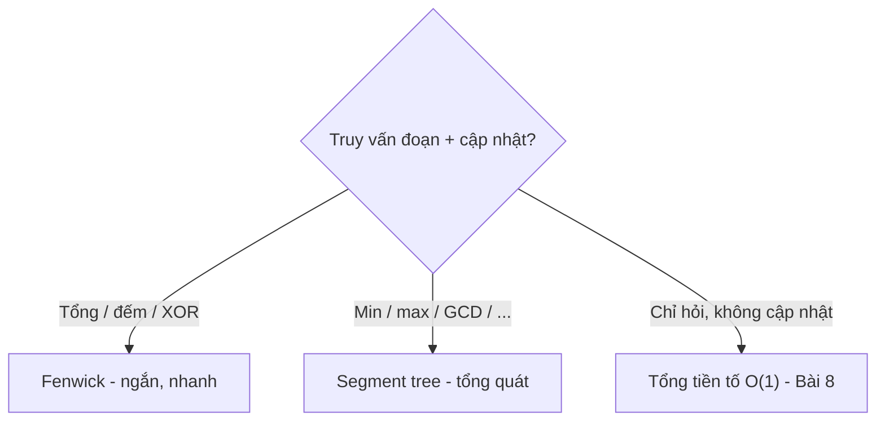

<!-- TỰ ĐỘNG ĐỒNG BỘ từ 02-Thuat-Toan/37-Segment-Tree/bai.md — đừng sửa trực tiếp, sửa bản chính rồi chạy tools/sync_tracks.py -->

# Bài 15 — Segment Tree & Fenwick (Cây Đoạn & Cây BIT)

> 🧮 **Nhánh 02 — Thuật Toán (HSG / Competitive Programming)**

---

## 🧠 Điều kiện tiên quyết

- [Bài 6 — Đệ Quy](../06-De-Quy/bai.md)
- [Bài 2 — Độ Phức Tạp](../02-Do-Phuc-Tap/bai.md)
- [Bài 4 — Sắp Xếp](../04-Sap-Xep/bai.md) (đếm nghịch thế — sẽ làm lại bằng BIT)

---

## 🎯 Mục tiêu

Sau bài học này, học viên sẽ:

* ✅ Hiểu bài toán "truy vấn đoạn + cập nhật điểm": naive O(n), tiền tố O(1)/O(n) — cả hai đều thủng một chiều.
* ✅ Cài segment tree lặp (iterative) O(log n) cho sum/min/max + cập nhật điểm.
* ✅ Cài Fenwick (BIT) O(log n) cho tổng tiền tố + cập nhật — ngắn gọn, nhanh, ít bug.
* ✅ Biết khi nào dùng cái nào (BIT cho tổng/đếm; segment cho min/max/phép không khả nghịch).
* ✅ Giải nghịch thế, range-min-query, và bài "đếm số nhỏ hơn bên phải" bằng BIT.

---

## 📖 Mở đầu

Bài toán: dãy n ≤ 10⁵–10⁶, q ≤ 10⁵–10⁶ truy vấn đan xen hai loại — "tổng/min
đoạn [l, r]?" và "đổi a[i] = v". Thử mọi cách cũ:

* Quét mỗi truy vấn: O(n) → 10¹⁰ → TLE.
* Tiền tố: hỏi O(1) nhưng cập nhật O(n) → vẫn TLE.

Cần cấu trúc O(log n) cả hai chiều — segment tree và Fenwick sinh ra cho đúng
việc này. Đây là "vé vào" vòng HSG nâng cao: không biết hai cấu trúc này thì
một lớp đề hoàn toàn bất khả thi.

> 🐣 **Thấy cây đoạn đáng sợ? Đọc mục "Khởi động siêu chậm" ngay dưới đây trước.
> Chỉ có 4 con số, vẽ cây bằng tay, hỏi–sửa từng bước.**

---

## 🐣 Khởi động siêu chậm — cây quản lý 4 nhân viên

### Chuyện 1: Sếp cần tổng doanh số nhanh

4 nhân viên A, B, C, D có doanh số [5, 2, 7, 1] (triệu). Sếp hay hỏi kiểu:
"Tổng của B+C+D là bao nhiêu?" và "sửa doanh số của A thành 0, tổng mới?"

Cách quét: cộng lại mỗi lần hỏi — 4 người thì không sao, 10⁵ người × 10⁵ lần
hỏi thì chết. Cách segment tree: dựng sẵn "báo cáo gộp" theo tầng:

```
Tầng sếp tổng:              15
Tầng quản lý:      7                   8
Tầng nhân viên:  5     2           7       1
                 A     B           C       D
```

* Quản lý trái giữ tổng A+B = 7; quản lý phải giữ C+D = 8; sếp giữ 7+8 = 15.
* Hỏi tổng B+C+D? Không cần cộng 3 số — lấy báo cáo của B (2) + báo cáo của
  "nhóm C+D" (8) = **10**. Chỉ ghép 2 mảnh!
* Sửa A thành 0? Chỉ 3 người phải tính lại: A (lá), quản lý trái (0+2=2),
  sếp (2+8=10). Người còn lại không động vào.

Đó là toàn bộ segment tree: **dựng báo cáo gộp theo tầng, hỏi thì ghép vài
mảnh, sửa thì leo một đường**. Code trong bài chỉ là cách lưu cái cây này vào
mảng `t` (lá ở nửa sau, sếp ở ô 1).

### Chuyện 2: Hỏi [0, 3) trên cây [5, 2, 7, 1] — đi bộ cùng thuật toán

Hỏi tổng a[0..2] (= 5+2+7 = 14, kiểm tra sau). Thuật toán cho 2 con trỏ leo:

```
Bắt đầu: l = lá a[0], r = lá a[3] (ranh giới phải, không lấy)
Vòng 1: l chẵn (bỏ qua), r lẻ → gắp node a[2] (= 7), r co lại
Vòng 2: l chẵn (bỏ qua), r lẻ → gắp node (a[0]+a[1]) (= 7), r co lại
l == r → dừng. Ghép 7 + 7 = 14 ✔
```

Quy tắc gắp trực quan: node nào **nằm gọn** trong đoạn hỏi thì gắp cả node
(khỏi chẻ nhỏ); node nào **lấn ra ngoài** thì bỏ qua, leo lên cha xét tiếp.
Vì mỗi tầng gắp tối đa 2 node → cả cây gắp ≤ 2·log n mảnh.

### ✋ Dừng lại tự kiểm tra

Cây trên [5, 2, 7, 1] (tổng 15).

a) Hỏi tổng a[1..3] (= 2+7+1) thì gắp những node nào, kết quả?
b) Sửa a[3] = 10. Những node nào đổi? Tổng mới?

<details>
<summary>✅ Xem đáp án kiểm tra</summary>

a) Hỏi nửa khoảng [1, 4): gắp lá a[1] (= 2) + node (a[2]+a[3]) (= 8) → **10** ✔
   (2+7+1 = 10 ✔).

b) Lá a[3]: 1 → 10. Node (a[2]+a[3]): 8 → 17. Gốc: 15 → 7+17 = **24** ✔
   (5+2+7+10 = 24 ✔). Chỉ 3 node đổi — còn lại giữ nguyên!

   Làm đúng thì Fenwick (BIT) ở nửa sau bài sẽ dễ nuốt hơn nhiều, vì BIT cũng
   là "báo cáo gộp", chỉ khác cách chia đoạn (theo bit thay vì theo nửa).

</details>

## 💡 Ý tưởng trực quan

* **Segment tree:** quản lý theo tầng — mỗi quản lý phụ trách một đoạn, báo
  cáo tổng hợp (tổng/min/max) lên trên. Hỏi đoạn [l, r] = ghép báo cáo của
  O(log n) quản lý phủ vừa khít; đổi một lá chỉ cập nhật đường lên gốc.
* **Fenwick:** sổ cái thông minh — mỗi dòng ghi tổng một "cụm" có độ dài là
  lũy thừa của 2 (tách theo bit 1 cuối cùng của chỉ số). Tiền tố = cộng vài
  dòng; cập nhật = sửa vài dòng. Ít dòng hơn segment tree, code ngắn hơn,
  nhưng chỉ làm được phép **khả nghịch** (cộng/trừ, XOR — không min/max).



---

## 📚 Kiến thức

### 1. Segment tree lặp (iterative) — bản nên thuộc lòng

Cây đầy đủ cỡ lũy thừa 2 của n (N). Lá ở [N, 2N), node trong = tổng hợp 2 con.
Truy vấn [l, r) nửa khoảng — mẫu "hai con trỏ leo cây":

```python
class SegTree:
    def __init__(self, a, op=min, e=10**18):
        n = len(a)
        N = 1
        while N < n:
            N *= 2
        self.N, self.op, self.e = N, op, e
        self.t = [e] * (2 * N)
        self.t[N:N + n] = a
        for i in range(N - 1, 0, -1):
            self.t[i] = op(self.t[2 * i], self.t[2 * i + 1])

    def cap_nhat(self, i, v):       # a[i] = v
        p = self.N + i
        self.t[p] = v
        p //= 2
        while p:
            self.t[p] = self.op(self.t[2 * p], self.t[2 * p + 1])
            p //= 2

    def hoi(self, l, r):            # [l, r) nửa khoảng
        N, t, op, e = self.N, self.t, self.op, self.e
        l += N
        r += N
        trai, phai = e, e
        while l < r:
            if l & 1:
                trai = op(trai, t[l]); l += 1
            if r & 1:
                r -= 1; phai = op(t[r], phai)
            l //= 2; r //= 2
        return op(trai, phai)
```

> Bản lặp nhanh hơn đệ quy ~2–5 lần trong Python (không gọi hàm, ít overhead)
> và không lo recursion limit. Quy ước nửa khoảng [l, r): hỏi [l, r] bao cả
> hai đầu thì gọi `hoi(l, r + 1)` — thống nhất một quy ước, tránh off-by-one.

### 1b. 🔍 Nhìn cây "đi bộ" khi truy vấn — hỏi [1, 4) trên [2, 1, 5, 3, 4]

Cây tổng (N = 8, node ghi chỉ số trong mảng `t`):

```
                        15(1)
              11(2)               4(3)
          3(4)      8(5)      4(6)      0(7)
        2(8) 1(9) 5(10) 3(11) 4(12) 0(13) 0(14) 0(15)
        a0   a1   a2    a3    a4
```

Hỏi [1, 4) nghĩa là l = 9, r = 12 (cộng N). Thuật toán cho l, r "leo" lên,
gắp node nào **nằm gọn** trong đoạn thì lấy:

| Vòng | (l, r) | l lẻ? | r lẻ? | Gắp |
|---|---|---|---|---|
| 1 | (9, 12) | 9 lẻ → lấy t[9] = 1 (lá a[1]), l = 10 | 12 chẵn → bỏ qua | t[9] |
| 2 | (5, 6) | 5 lẻ → lấy t[5] = 8 (đoạn a[2..3]), l = 6 | 6 chẵn → bỏ qua | t[5] |
| 3 | (6, 6) | l == r → dừng | | |

Đáp án 1 + 8 = **9** = a[1] + a[2] + a[3] = 1 + 5 + 3 ✔. Chỉ thăm **2 node**
thay vì 3 lá — với n = 10⁵, số node thăm ≤ 2·log n ≈ 34 thay vì 10⁵.

**Cập nhật a[2] = 0** (lá số 10): chỉ leo một đường duy nhất lên gốc:

```
lá 10: 5 → 0
node 5: t[5] = 0 + 3 = 3
node 2: t[2] = 3 + 3 = 6
gốc 1:  t[1] = 6 + 4 = 10  (tổng mới 15 − 5 = 10 ✔)
```

Mỗi tầng đúng 1 node → O(log n) node cập nhật. Đây là toàn bộ "phép màu"
của segment tree: **hỏi ghép O(log n) mảnh, sửa leo O(log n) tầng**.

Đổi phép tổng hợp bằng `op` + `e` (phần tử trung hòa: 0 cho cộng, +∞ cho min,
−∞ cho max, 0 cho GCD/XOR): một class dùng cho mọi phép **kết hợp**.

### 2. Fenwick (BIT) — tổng tiền tố + cập nhật, O(log n)

```python
class BIT:
    def __init__(self, n):
        self.n = n
        self.bit = [0] * (n + 1)   # 1-based!

    def them(self, i, delta):      # a[i] += delta (i 0-based)
        i += 1
        n, bit = self.n, self.bit
        while i <= n:
            bit[i] += delta
            i += i & -i            # nhảy tới cụm cha

    def tong(self, i):             # tổng a[0..i] (i 0-based)
        i += 1
        s, bit = 0, self.bit
        while i:
            s += bit[i]
            i -= i & -i            # gộp cụm
        return s

    def doan(self, l, r):          # tổng [l, r]
        return self.tong(r) - (self.tong(l - 1) if l else 0)
```

**Trực giác `i & -i`:** bit 1 cuối cùng của i = độ dài cụm mà `bit[i]` quản lý.
`them`: nhảy lên cụm lớn hơn (cộng bit cuối); `tong`: trừ bit cuối để gộp cụm
nhỏ dần. Mỗi vòng xử lý 1 bit → O(log n) bước. Không cần hiểu sâu số học —
nhớ "cộng khi đi lên, trừ khi đi xuống".

> BIT 1-based bên trong, bọc 0-based bên ngoài (code mẫu đã bọc). Quên +1/−1
> là bug #1 — test ngay với n = 1 và cập nhật biên.

### 2b. 🐢 Hiểu chậm `i & -i` — mỗi ô `bit` quản lý đoạn nào?

`i & -i` tách bit 1 cuối cùng của i — đó chính là **độ dài đoạn** mà `bit[i]`
quản lý. Bảng với n = 8 (chỉ số nội bộ 1-based):

| i (nhị phân) | i & −i | bit[i] quản lý ô |
|---|---|---|
| 1 (001) | 1 | ô 1 |
| 2 (010) | 2 | ô 1–2 |
| 3 (011) | 1 | ô 3 |
| 4 (100) | 4 | ô 1–4 |
| 5 (101) | 1 | ô 5 |
| 6 (110) | 2 | ô 5–6 |
| 7 (111) | 1 | ô 7 |
| 8 (1000) | 8 | ô 1–8 |

Quy luật: bit 1 cuối càng "nặng" (bên trái), đoạn quản lý càng dài.
Ô lẻ quản 1 ô, ô chẵn quản cụm — toàn bộ mảng được phủ kín ở mỗi "tầng".

**Chạy tay:** `them(2, 5)` (ngoài 0-based → trong i = 3), rồi `them(5, 3)`
(ngoài → trong i = 6), rồi `tong(5)` (ngoài → trong i = 6):

* `them` thứ nhất: i = 3 (011): bit[3] += 5; i += 1 → 4: bit[4] += 5;
  i += 4 → 8: bit[8] += 5. (Nhảy lên cụm lớn hơn: cộng bit cuối.)
* `them` thứ hai: i = 6 (110): bit[6] += 3; i += 2 → 8: bit[8] += 3
  (giờ bit[8] = 8).
* `tong`: i = 6: s += bit[6] (= 3, tức ô 5–6); i −= 2 → 4:
  s += bit[4] (= 5, tức ô 1–4). Tổng **8** = a[2] + a[5] = 5 + 3 ✔
  (các ô khác bằng 0).

> 💡 **Nhớ bằng một câu:** `them` đi **lên** (cộng bit cuối — tìm cụm cha chứa
> mình), `tong` đi **xuống** (trừ bit cuối — gộp các cụm vừa khít tiền tố).
> Mỗi vòng xử lý đúng 1 bit → tối đa log n vòng.

### 3. So sánh chọn lựa

| | Segment tree | Fenwick |
|---|---|---|
| Phép hỗ trợ | Mọi phép kết hợp (min/max/sum/GCD...) | Phép khả nghịch (cộng, XOR) |
| Code | ~30 dòng | ~15 dòng |
| Hằng số | Lớn hơn | Nhỏ hơn (nhanh ~2–3 lần) |
| Bộ nhớ | 2·N | n+1 |
| Mở rộng | Lazy (cập nhật đoạn), 2D, persistent... | Hạn chế hơn |

> Quy tắc: tổng/đếm → BIT; min/max → segment tree; chỉ hỏi không cập nhật →
> tiền tố (Bài 8); cập nhật đoạn + hỏi đoạn → lazy segment tree (nâng cao,
> tự học tiếp sau bài này).

### 4. Mẫu "nén tọa độ" — BIT/segment trên giá trị, không phải vị trí

Nhiều bài hỏi theo **giá trị** ("đếm số nhỏ hơn x đã thấy") với a[i] ≤ 10⁹:
nén các giá trị xuất hiện về 1..m (sort + dict), BIT cỡ m:

```python
def nen(a):
    vals = sorted(set(a))
    mp = {v: i for i, v in enumerate(vals)}
    return [mp[x] for x in a], len(vals)
```

### 5. Đếm nghịch thế bằng BIT — O(n log n), ngắn hơn merge sort

Duyệt từ phải sang trái; với mỗi a[i], hỏi "đã thấy bao nhiêu số < a[i]"
(= số j > i mà a[j] < a[i] = nghịch thế có đầu trái i), rồi đánh dấu a[i]:

```python
def nghich_the(a):
    comp, m = nen(a)
    bit = BIT(m)
    dem = 0
    for x in reversed(comp):
        dem += bit.tong(x - 1)   # số đã thấy mà < x
        bit.them(x, 1)
    return dem
```

So với merge sort (Bài 4): ngắn hơn, nhanh hơn, khó sai hơn — một khi đã biết
BIT. (Với n = 10⁶, BIT Python ~2–3s, sát biên — PyPy + tối ưu cục bộ.)

---

## 💻 Ví dụ

### Ví dụ 1 — Dễ: range-min-query + cập nhật điểm

> n ≤ 10⁵, q ≤ 10⁵ truy vấn: `1 i v` (a[i] = v), `2 l r` (min đoạn [l, r]).

```python
import sys

class SegTree:
    def __init__(self, a):
        n = len(a); N = 1
        while N < n: N *= 2
        self.N = N
        self.t = [10**18] * (2 * N)
        self.t[N:N + n] = a
        for i in range(N - 1, 0, -1):
            self.t[i] = self.t[2*i] if self.t[2*i] < self.t[2*i+1] else self.t[2*i+1]

    def cap_nhat(self, i, v):
        p = self.N + i; self.t[p] = v; p //= 2
        while p:
            l, r = self.t[2*p], self.t[2*p+1]
            self.t[p] = l if l < r else r
            p //= 2

    def hoi(self, l, r):
        N, t = self.N, self.t
        l += N; r += N + 1
        kq = 10**18
        while l < r:
            if l & 1:
                if t[l] < kq: kq = t[l]
                l += 1
            if r & 1:
                r -= 1
                if t[r] < kq: kq = t[r]
            l //= 2; r //= 2
        return kq

def main():
    data = sys.stdin.buffer.read().split()
    if not data: return
    it = iter(data)
    n, q = int(next(it)), int(next(it))
    st = SegTree([int(next(it)) for _ in range(n)])
    ra = []
    for _ in range(q):
        loai = int(next(it))
        if loai == 1:
            st.cap_nhat(int(next(it)), int(next(it)))
        else:
            ra.append(str(st.hoi(int(next(it)), int(next(it)))))
    sys.stdout.write("\n".join(ra))

main()
```

Mỗi truy vấn O(log n) → tổng ~3×10⁶ thao tác. ✔

### Ví dụ 2 — Thực tế: đếm số nhỏ hơn bên phải (nhiễu chứng khoán)

> Mỗi ngày có giá a[i]. Với mỗi i, đếm số ngày sau đó giá thấp hơn (dự báo
> "số ngày giảm phía trước"). n ≤ 10⁶.

```python
import sys

class BIT:
    def __init__(self, n):
        self.n = n; self.bit = [0] * (n + 1)
    def them(self, i, d):
        i += 1; n, bit = self.n, self.bit
        while i <= n:
            bit[i] += d; i += i & -i
    def tong(self, i):
        if i < 0: return 0
        i += 1; s = 0; bit = self.bit
        while i:
            s += bit[i]; i -= i & -i
        return s

def main():
    data = sys.stdin.buffer.read().split()
    if not data: return
    n = int(data[0])
    a = list(map(int, data[1:1 + n]))
    vals = sorted(set(a))
    mp = {v: i for i, v in enumerate(vals)}
    bit = BIT(len(vals))
    ra = [0] * n
    for i in range(n - 1, -1, -1):
        x = mp[a[i]]
        ra[i] = bit.tong(x - 1)
        bit.them(x, 1)
    sys.stdout.write(" ".join(map(str, ra)))

main()
```

**Giải thích:** duyệt phải→trái, BIT nhớ tần suất giá trị đã thấy (phía phải).
`tong(x−1)` = số ngày sau rẻ hơn. Tổng nghịch thế = `sum(ra)` — cùng đáp án
mục 5.

### Ví dụ 3 — Khó: cập nhật đoạn + hỏi điểm (BIT "lệch pha")

> n ≤ 10⁶, q ≤ 10⁶: `1 l r v` (cộng v vào mọi a[i], l ≤ i ≤ r), `2 i` (hỏi a[i]).

Naive cập nhật O(n). Mẹo: **hiệu phân (difference array) + BIT**:
cộng v vào đoạn [l, r] ⟺ `diff[l] += v; diff[r+1] −= v`; a[i] = tổng tiền tố
diff đến i. BIT quản diff → cập nhật O(log n) (2 điểm), hỏi O(log n):

```python
# diff trên BIT:
#   cap_nhat(l, r, v): bit.them(l, v); bit.them(r + 1, -v)  (nếu r+1 < n)
#   hoi(i): bit.tong(i)
```

> Đây là đối ngẫu của bài toán chuẩn (cập nhật điểm + hỏi đoạn): đảo vai trò
> bằng hiệu phân. Muốn **cả hai đều đoạn** (cập nhật đoạn + hỏi tổng đoạn) →
> 2 BIT kết hợp (mở rộng kinh điển) hoặc lazy segment tree.

---

## 📊 Minh họa

Segment tree tổng trên [2, 1, 5, 3, 4] (N = 8):

```
                    15
            8               7
        3       5       7       0
      2   1   5   3   4   e   e   e
Hỏi [1, 3]: leo từ lá 1 và 4 → ghép 1 + 5 + 3 = 9 ✔
Đổi a[2] = 0: lá 2 → 0, leo lên: 5→0? (node (5,3)→(0,3)=3), ... lên gốc ✔
```

BIT `i & -i` (n = 8): bit[6] (110) quản 2 ô (5,6); bit[4] (100) quản 4 ô (1–4);
bit[8] quản 8 ô.

---

## ⚠️ Những lỗi thường gặp

### Lỗi 1: Nửa khoảng vs bao cả hai đầu

* Quy ước MỘT kiểu cho cả bài: `hoi(l, r)` nửa khoảng [l, r) → hỏi [l, r]
  bao đầu thì gọi `hoi(l, r+1)`. Trộn hai quy ước → off-by-one.

### Lỗi 2: BIT quên 1-based (IndexError hoặc sai âm thầm)

* `bit[0]` không bao giờ dùng; `them`/`tong` phải +1 đầu hàm. Test n = 1,
  cập nhật/hỏi biên 0 và n−1.

### Lỗi 3: Dùng BIT cho min/max

* BIT cần phép nghịch đảo (trừ) để `doan(l,r) = tong(r) − tong(l−1)`.
  Min không trừ được → phải segment tree.

### Lỗi 4: Nén tọa độ thiếu giá trị truy vấn

* Nén phải gồm MỌI giá trị xuất hiện (cả trong cập nhật tương lai, cả biên
  truy vấn) — thiếu thì không có chỉ số để hỏi.

### Lỗi 5: Đệ quy segment tree sâu + chậm trong Python

* Dùng bản lặp (code mẫu). Bản đệ quy vừa chậm vừa tốn limit — chỉ dùng để học.

### Lỗi 6: `sys.stdin.read` cho q = 10⁶ mà xử lý từng dòng bằng input()

* Đọc hết + `buffer` + gom output (Bài 2). I/O là nửa bài toán ở giới hạn lớn.

---

## 🧪 Trường hợp đặc biệt

* **n = 1**: N = 1, cây 2 node — code lặp đúng tự nhiên.
* **n không phải lũy thừa 2**: lá thừa = e (trung hòa) — không ảnh hưởng min/
  tổng (e_min = +∞, e_sum = 0). ⚠️ Với max thì e = −∞.
* **Cập nhật r+1 == n** (hiệu phân): bỏ qua (ngoài mảng) — kiểm tra biên.
* **Giá trị âm**: BIT tổng vẫn đúng (cộng/trừ số âm bình thường); nén tọa độ
  sort vẫn đúng thứ tự.
* **q = 0**: không có truy vấn — đọc input xong in rỗng, đừng crash.

---

## 🚀 Ứng dụng thực tế

* Leaderboard real-time (cập nhật điểm + hỏi hạng = BIT trên tần suất!).
  Hạng của x = 1 + số người điểm cao hơn = BIT đếm.
* Biểu đồ chứng khoán trượt, giám sát SLA theo đoạn thời gian.

---

## 🧩 Bài tập

### 🟢 Cơ bản (1–3)

**Bài 1 — Chạy tay segment.** Dựng cây tổng cho [3, 1, 4, 1, 5] (N = 8).
Hỏi [1, 3] (nửa khoảng [1, 4)): ghi các node ghép. Rồi cập nhật a[2] = 0,
ghi đường lên gốc.

**Bài 2 — BIT tay.** BIT rỗng n = 8. `them(2, 5)`, `them(5, 3)`. Ghi mảng bit
sau mỗi lần. Rồi `tong(5)` = ? (Đáp án: 8.)

**Bài 3 — Nghịch thế nhỏ.** `a = [3, 1, 2]`. Chạy tay thuật toán BIT mục 5
(duyệt phải→trái), ghi dem sau mỗi bước. (Đáp án: 2.)

### 🟡 Hiểu sâu (4–6)

**Bài 4 — Range add + range sum (2 BIT).** Mở rộng ví dụ 3: hỏi tổng đoạn
(không chỉ điểm). *Gợi ý: tổng tiền tố sau cập nhật đoạn = ... cần 2 BIT
(B1 cho hệ số, B2 cho hằng số): prefix(i) = sum(B1,i)·i − sum(B2,i);
cập nhật [l,r]+=v: B1.them(l,v), B1.them(r+1,−v), B2.them(l,v·(l−1)),
B2.them(r+1,−v·r). Tự chứng minh công thức bằng khai triển.*

**Bài 5 — Hạng real-time.** Dòng sự kiện: `1 x` (người mới điểm x), `2 x`
(hỏi có bao nhiêu người điểm > x). Điểm ≤ 10⁹, q ≤ 10⁶. *Gợi ý: nén toàn bộ
điểm xuất hiện (đọc hết input trước!) + BIT tần suất; đáp án = tổng − tiền tố.*

**Bài 6 — Đếm đoạn con tổng K bằng BIT?** Suy nghĩ: vì sao bài "đếm dãy con
tổng K" (Bài 5) dùng dict O(n) mà không cần BIT? Khi nào cần BIT thay dict?
*Gợi ý: dict đủ khi chỉ cần bằng nhau chính xác; BIT cần khi hỏi bất đẳng thức
(≤ K, trong [L, R]) trên tiền tố — xem Thử thách Bài 8.*

### 🔴 Vận dụng (7–8)

**Bài 7 — LIS mỗi tiền tố.** n ≤ 10⁵. Với mỗi i, tính độ dài LIS của a[0..i].
*Gợi ý: LIS O(n log n) bằng `duoi` + bisect (Bài 10 — bài 6) duyệt trái→phải
chính là đáp án từng tiền tố! Hiểu vì sao `len(duoi)` sau bước i = LIS prefix i.*

**Bài 8 — Xếp hàng (queue reconstruction).** n người, mỗi người (cao h, k:
có đúng k người cao ≥ mình đứng trước). Dựng hàng ban đầu. n ≤ 10⁵.
*Gợi ý: sort cao giảm dần (cao trước); người đang xét: k người cao-hơn-đã đặt
→ chèn vào vị trí k trong cấu trúc "danh sách có chèn O(log n)" (BIT tìm vị
trí trống thứ k! + mảng kết quả). Vì sao sort giảm dần đúng? (Người sau thấp
hơn/ bằng, không ảnh hưởng k của người trước.)*
### ➕ Bài tập bổ sung (Bài 9–12)

**Bài 9 — Segtree min.** Đổi class tổng ở ví dụ 1 thành range-min-query + cập
nhật điểm: phần tử trung hòa `e` là gì? Phép `op` là gì? Code + test (nêu rõ 2
chỗ đổi so với bản tổng). *Gợi ý: e = +∞, op = min.*

**Bài 10 — BIT tìm prefix.** Cho BIT tần suất, tìm chỉ số nhỏ nhất mà tổng tiền
tố ≥ S (binary lifting trên BIT: đi từ bit cao xuống thấp). Code + test
([1,0,3,0,2], S=1→0, S=2→2, S=5→4, S=6→4). Ứng dụng: tìm phần tử thứ k còn lại!

**Bài 11 — Cặp đảo ngược (reverse pairs).** Đếm cặp (i<j) mà `a[i] > 2*a[j]`.
Dùng BIT + nén tọa độ, duyệt phải→trái, hỏi số đã thấy mà `< x/2` (cẩn thận
chia nguyên: y ≤ (x−1)//2!). Code + test ([1,3,2,3,1] → 2) + stress 200 test
ngẫu nhiên so brute force.

**Bài 12 — Max subarray + cập nhật điểm.** Segment tree mỗi node lưu 4 số
(tổng, max tiền tố, max hậu tố, đáp án), gộp: `tong = L+R`, `tien = max(L.tien,
L.tong+R.tien)`... Code đầy đủ + test ([−2,1,−3,4,−1,2,1,−5,4] → 6). Đây là
"segtree khó nhất nhóm cơ bản" — làm được thì lazy không còn sợ!

---

## ✅ Đáp án

> 💡 **Hãy tự làm bài tập trước** rồi mới mở đáp án.

<details>
<summary>✅ Bài 1: Chạy tay segment</summary>

N = 8, lá [3,1,4,1,5,e,e,e] (e = 0 cho tổng). Node tầng trên:
(3+1)=4, (4+1)=5, (5+0)=5, (0+0)=0; tiếp: 9, 5; gốc 14.
Hỏi [1,4) = chỉ số {1,2,3}: thuật toán ghép đúng 2 mảnh — lá a[1] = 1 và
node phủ a[2..3] = 4+1 = 5 → tổng 1 + 5 = **6**. ✔ (Kiểm tay: 1+4+1 = 6. ✔)

Cập nhật a[2] = 0: lá 10 → 0; cha (10,11) = 0+1 = 1 (cũ 5); cha (4,5):
4+1 = 5 (cũ 9); gốc 5+5 = 10 (cũ 14). ✔

</details>

<details>
<summary>✅ Bài 2: BIT tay</summary>

* `them(2, 5)`: i=3 (011): bit[3]+=5; i += 1 → 4: bit[4]+=5; i += 4 → 8: bit[8]+=5.
* `them(5, 3)`: i=6 (110): bit[6]+=3; i += 2 → 8: bit[8]+=3 (giờ 8).
* `tong(5)`: i=6: s += bit[6] (3); i −= 2 → 4: s += bit[4] (5) → **8**. ✔
  (Tổng a[0..5] = 0+0+5+0+0+3 = 8 ✔.)

</details>

<details>
<summary>✅ Bài 3: Nghịch thế nhỏ</summary>

Nén: [3,1,2] → [2,0,1]. Duyệt phải→trái:
* x=1: tong(0) = 0 → dem=0; them(1,1).
* x=0: tong(−1) = 0 → dem=0; them(0,1).
* x=2: tong(1) = 2 (đã thấy 0 và 1) → dem=2; them(2,1).
Đáp án **2** ((3,1), (3,2)). ✔

</details>

<details>
<summary>✅ Bài 4: Range add + range sum (2 BIT)</summary>

Ý tưởng: sau cập nhật đoạn, tiền tố P(i) = Σ diff[0..i]. Dùng 2 BIT B1, B2
sao cho P(i) = query(B1,i)·i − query(B2,i). Khi cộng v vào [l,r]:
P(i) tăng v·(i−l+1) với i ≥ l (và trừ phần vượt r). Phân tích:
cần B1 += v tại l, −v tại r+1; B2 += v·(l−1) tại l, −v·r tại r+1.
Tổng đoạn [l,r] = P(r) − P(l−1), mỗi P tốn 2 query O(log n).
Chứng minh đầy đủ bằng khai triển tổng — bài tập viết ra giấy rất đáng làm.

</details>

<details>
<summary>✅ Bài 5: Hạng real-time</summary>

```python
# Đọc hết sự kiện trước để nén (offline coordinate compression)
events = [...]  # [(loai, x)]
vals = sorted({x for _, x in events})
mp = {v: i for i, v in enumerate(vals)}
bit = BIT(len(vals))
tong_nguoi = 0
for loai, x in events:
    if loai == 1:
        bit.them(mp[x], 1); tong_nguoi += 1
    else:
        # số người điểm > x = tổng − tiền tố đến x
        print(tong_nguoi - bit.tong(mp[x]))
```

Vì điểm ≤ 10⁹ không làm BIT trực tiếp được → nén offline (đọc hết trước là
chìa khóa; đề online thuần (không biết trước) cần cây cân bằng — vượt scope).

</details>

<details>
<summary>✅ Bài 6: Đếm đoạn con tổng K bằng BIT?</summary>

* Dict đủ vì điều kiện là **bằng nhau chính xác**: cần đếm tiền tố cũ == tong−K
  → dict tra O(1).
* BIT cần khi điều kiện là **bất đẳng thức**: đếm tiền tố cũ ≤ tong−K (đoạn
  tổng ≥ K) hoặc trong [L, R] → nén tiền tố + BIT cộng dồn → O(n log n)
  (Thử thách Bài 8 chính là bài này!).

</details>

<details>
<summary>✅ Bài 7: LIS mỗi tiền tố</summary>

Thuật toán `lis_nhanh` (Bài 10 — bài 6) duyệt trái→phải, duy trì `duoi`.
Sau khi xử lý a[i], `duoi` chỉ phụ thuộc a[0..i] → `len(duoi)` = LIS của tiền
tố i. Ghi lại sau mỗi bước là xong — O(n log n) tổng, không cần segment tree.
(Bài học: cùng một thuật toán, nhìn theo "tiền tố" cho thêm đáp án miễn phí.)

</details>

<details>
<summary>✅ Bài 8: Xếp hàng (queue reconstruction)</summary>

```python
def dung_hang(nguoi):
    # nguoi: [(h, k)]; sort cao giảm dần, k tăng dần khi cùng cao
    nguoi.sort(key=lambda p: (-p[0], p[1]))
    # BIT tìm vị trí trống thứ k (1-based) + mảng kết quả
    ...
```

Vì sao sort giảm dần đúng: khi đặt người hiện tại, mọi người đã đặt đều cao
hơn hoặc bằng → họ đều "đếm" vào k của người này; người đặt sau thấp hơn nên
không ảnh hưởng k của người trước. Chèn vào vị trí trống thứ (k+1): cần cấu
trúc tìm ô trống thứ k trong O(log n) — BIT trên mảng trống (1 = trống):
tìm prefix-sum = k bằng đi xuống cây (BIT binary lifting). O(n log n) tổng.

</details>

<details>
<summary>✅ Bài 9: Segtree min</summary>

```python
class SegMin:
    def __init__(self, a):
        n = len(a)
        N = 1
        while N < n:
            N *= 2
        self.N = N
        self.t = [float("inf")] * (2 * N)   # ĐỔI 1: e = +vô cùng
        self.t[N:N + n] = a
        for i in range(N - 1, 0, -1):
            self.t[i] = min(self.t[2 * i], self.t[2 * i + 1])  # ĐỔI 2: op = min

    def cap_nhat(self, i, v):
        p = self.N + i
        self.t[p] = v
        p //= 2
        while p:
            self.t[p] = min(self.t[2 * p], self.t[2 * p + 1])
            p //= 2

    def hoi(self, l, r):
        N, t = self.N, self.t
        l += N
        r += N + 1
        kq = float("inf")
        while l < r:
            if l & 1:
                kq = min(kq, t[l])
                l += 1
            if r & 1:
                r -= 1
                kq = min(kq, t[r])
            l //= 2
            r //= 2
        return kq

s = SegMin([5, 2, 7, 1, 9])
assert s.hoi(0, 2) == 2      # min(5, 2, 7)
s.cap_nhat(1, 10)            # dãy thành [5, 10, 7, 1, 9]
assert s.hoi(0, 2) == 5      # min(5, 10, 7)
```

Đúng **2 chỗ** khác bản tổng: `e` (0 → +∞) và `op` (+ → min). Mọi chỗ khác
giữ nguyên — đó là sức mạnh của segment tree tổng quát (mục 1 bài học)!

</details>

<details>
<summary>✅ Bài 10: BIT tìm prefix</summary>

```python
class BIT:
    def __init__(self, n):
        self.n = n
        self.bit = [0] * (n + 1)

    def them(self, i, d):
        i += 1
        while i <= self.n:
            self.bit[i] += d
            i += i & -i

    def tim_prefix(self, s):
        # chỉ số 0-based NHỎ NHẤT có tổng tiền tố >= s (s >= 1)
        i, buoc = 0, 1 << self.n.bit_length()
        while buoc:
            nxt = i + buoc
            if nxt <= self.n and self.bit[nxt] < s:
                s -= self.bit[nxt]
                i = nxt
            buoc //= 2
        return i   # 0-based (i nội bộ = đáp án 0-based)

b = BIT(5)
for i, v in enumerate([1, 0, 3, 0, 2]):
    b.them(i, v)
assert [b.tim_prefix(s) for s in [1, 2, 5, 6]] == [0, 2, 4, 4]
```

Đi từ bit cao xuống thấp, "nhảy thử": nhảy mà tổng vẫn < S thì nhảy luôn (trừ
đi), không thì đứng yên. O(log n) — nhanh hơn chặt nhị phân + `tong()` O(log²n)!
Ứng dụng kinh điển: danh sách còn/khuyết (tìm người thứ k còn sống — Josephus
nhanh, ôn Bài 10 nhóm Stack!).

</details>

<details>
<summary>✅ Bài 11: Cặp đảo ngược (reverse pairs)</summary>

```python
import bisect

def dem_dao_nguoc(a):
    vals = sorted(set(a))
    mp = {v: i + 1 for i, v in enumerate(vals)}
    bit = [0] * (len(vals) + 2)

    def them(i):
        while i < len(bit):
            bit[i] += 1
            i += i & -i

    def tong(i):
        s = 0
        while i:
            s += bit[i]
            i -= i & -i
        return s

    dem = 0
    for x in reversed(a):          # duyệt phải -> trái: "đã thấy" = bên phải
        dem += tong(bisect.bisect_right(vals, (x - 1) // 2))  # y <= (x-1)//2 ⟺ 2y < x
        them(mp[x])
    return dem

assert dem_dao_nguoc([1, 3, 2, 3, 1]) == 2
```

Bẫy số học: điều kiện `2y < x` (nghiêm ngặt!) tương đương `y <= (x−1)//2` với
số nguyên — dùng `x//2` là sai khi x chẵn (ví dụ x=4: y<2, tức y≤1 = (4−1)//2,
không phải 4//2 = 2!). Đã stress 200 test ngẫu nhiên vs brute force. ✔

</details>

<details>
<summary>✅ Bài 12: Max subarray + cập nhật điểm</summary>

```python
class SegMaxSub:
    def __init__(self, a):
        n = len(a)
        N = 1
        while N < n:
            N *= 2
        self.N = N
        NE = float("-inf")
        self.t = [(0, NE, NE, NE)] * (2 * N)
        for i, x in enumerate(a):
            self.t[N + i] = (x, x, x, x)
        for i in range(N - 1, 0, -1):
            self.t[i] = self.gop(self.t[2 * i], self.t[2 * i + 1])

    @staticmethod
    def gop(L, R):
        tong = L[0] + R[0]
        tien = max(L[1], L[0] + R[1])
        hau = max(R[2], R[0] + L[2])
        tot = max(L[3], R[3], L[2] + R[1])
        return (tong, tien, hau, tot)

    def dap_an(self):
        return self.t[1][3]


assert SegMaxSub([-2, 1, -3, 4, -1, 2, 1, -5, 4]).dap_an() == 6
```

Ý nghĩa 4 số: tổng đoạn; tiền tố tốt nhất (hoặc trọn trái + tiền tố phải);
hậu tố tốt nhất (đối xứng); đáp án (trái/phải/nối giữa). Lá thừa (ngoài dãy)
dùng `(0, −∞, −∞, −∞)` để không ảnh hưởng max. Mỗi cập nhật điểm leo O(log n) —
xong bài này thì lazy segment tree (Thử thách) chỉ thêm "đẩy lười"!

</details>

---

## 🧠 Thử thách

**Thử thách HSG:** Lazy segment tree đầy đủ: cập nhật **cộng đoạn** + hỏi
**tổng đoạn**, n, q ≤ 2×10⁵. *Gợi ý: mỗi node thêm `lz` (giá trị chờ đẩy);
đẩy (push) khi đi qua; cập nhật phủ kín thì cộng `v·độ_dài` và dồn vào `lz`.
Cài bản đệ quy cho dễ đúng, rồi tối ưu lặp nếu cần. Đây là cấu trúc "trùm cuối"
của nhóm bài đoạn — làm chủ nó thì không còn bài đoạn nào làm khó bạn.*

---

## 📝 Tóm tắt

| Khái niệm | Nội dung |
|---|---|
| 🌳 Segment tree | Mọi phép kết hợp; bản lặp; nửa khoảng [l, r) |
| ⚡ Fenwick | Tổng/đếm/XOR; `+=&-` lên, `-=&-` xuống; 1-based trong |
| 🗺️ Nén tọa độ | Giá trị ≤ 10⁹ → rank 0..m−1 |
| 🔄 Hiệu phân | Cập nhật đoạn + hỏi điểm = BIT trên diff |
| 🧭 Chọn lựa | Tổng→BIT; min/max→segment; không cập nhật→tiền tố |

---

## ➡️ Điều hướng

**Vị trí:** `04-Full/Phan-2-Thuat-Toan/15-Segment-Tree/bai.md`

**Bài tiếp theo:** [Bài 16 — Xử Lý Chuỗi Nâng Cao](../16-Xu-Ly-Chuoi/bai.md)