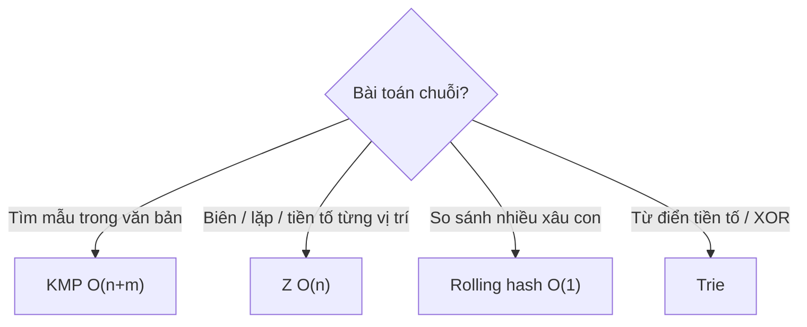

<!-- TỰ ĐỘNG ĐỒNG BỘ từ 02-Thuat-Toan/38-Xu-Ly-Chuoi/bai.md — đừng sửa trực tiếp, sửa bản chính rồi chạy tools/sync_tracks.py -->

# Bài 16 — Xử Lý Chuỗi Nâng Cao: KMP, Z, Hash & Trie

> 🧮 **Nhánh 02 — Thuật Toán (HSG / Competitive Programming)**

---

## 🧠 Điều kiện tiên quyết

- [Bài 18 — String](../../Phan-1-Co-Ban/18-String/bai.md) (cơ bản chuỗi Python)
- [Bài 2 — Độ Phức Tạp](../02-Do-Phuc-Tap/bai.md)
- [Bài 5 — Stack, Queue & Hashing](../05-Stack-Queue-Hashing/bai.md) (dict, hashing)

---

## 🎯 Mục tiêu

Sau bài học này, học viên sẽ:

* ✅ Hiểu vì sao tìm kiếm chuỗi naive O(n·m) chết với n, m ≤ 10⁶.
* ✅ Cài KMP qua hàm tiền tố (prefix function) O(n+m) và hiểu bất biến của nó.
* ✅ Cài thuật toán Z O(n) cho bài đếm/biên chuỗi.
* ✅ Dùng rolling hash (Rabin-Karp) so sánh xâu con O(1) sau tiền xử lý.
* ✅ Cài Trie cho bài tiền tố chung / từ điển / XOR lớn nhất.
* ✅ Nhận diện đề chuỗi ("tìm mẫu", "xâu con", "tiền tố", "đối xứng dài nhất").

---

## 📖 Mở đầu

Python có `in` và `find` cho chuỗi (viết bằng C, có thuật toán tốt bên dưới) —
nhưng thi HSG cấm dùng "hộp đen" cho chính thứ cần kiểm tra, và nhiều bài đòi
hơn "tìm ở đâu": đếm, biên dài nhất, tiền tố chung của nhiều xâu, XOR lớn nhất...
Bốn công cụ trong bài này là toàn bộ "vũ khí chuỗi" của competitive programming.

> 🐣 **Thấy KMP đáng sợ? Đọc mục "Khởi động siêu chậm" ngay dưới đây trước.
> Chỉ có tìm chữ bằng tay, 5 ký tự, và một câu hỏi "có phí không?".**

---

## 🐣 Khởi động siêu chậm — tìm chữ bằng tay trước khi học KMP

### Chuyện 1: Tìm "aba" trong "ababa" bằng mắt thường

Bạn làm thế này (cách naive — ngây thơ):

```
Văn bản:  a b a b a
Thử từ vị trí 0: a✔ b✔ a✔ → THẤY ở 0!
Thử từ vị trí 1: b✗ (cần a) → bỏ ngay (tốn 1 so sánh)
Thử từ vị trí 2: a✔ b✔ a✔ → THẤY ở 2!
Tổng: 3 + 1 + 3 = 7 lần so sánh.
```

Với văn bản dài 10⁶ và mẫu dài 10⁵, cách này tốn tới 10¹¹ so sánh → chết.
Nhưng hãy nhìn kỹ chỗ phí: ở vị trí 0, ta đã đọc "aba" rồi; khi thử vị trí 1
thất bại ngay, ta **quên sạch** 3 chữ vừa đọc. KMP sinh ra từ một câu hỏi:
**"chữ vừa đọc có dùng lại được không?"**

### Chuyện 2: Phát hiện "đuôi trùng đầu"

Nhìn mẫu "aba": đuôi "a" (1 chữ cuối) trùng đầu "a" (1 chữ đầu).
Khi đang khớp dở mà lệch, thay vì quay về đầu mẫu, ta **giữ lại phần đuôi
trùng đầu** — vì đoạn văn bản vừa đọc chắc chắn có đuôi đó!

Ví dụ khác — mẫu "aaaa": đang khớp tới chữ thứ 4 thì lệch. Naive quay về đầu
(quên 3 chữ 'a' vừa đọc — phí!). Nhưng 3 chữ 'a' đó cũng chính là 3 chữ đầu
mẫu → giữ nguyên, thử tiếp chữ thứ 4 luôn. Tiết kiệm 3 lần đọc lại.

Con số "giữ lại bao nhiêu" cho mỗi vị trí chính là mảng **pi** (hàm tiền tố):
pi[i] = "đang khớp tới i mà lệch thì giữ lại mấy chữ". Tính nó là xong 90% KMP.

### ✋ Dừng lại tự kiểm tra (làm tay!)

Tính pi cho "abcab" (5 ký tự). Quy tắc từng i (từ 1): nhìn pi[i−1] = j;
so s[i] với s[j]: khớp → j+1; lệch → co j về pi[j−1] rồi so lại; j = 0 mà vẫn
lệch → pi[i] = 0.

<details>
<summary>✅ Xem đáp án kiểm tra</summary>

* i=1 ('b'): j=0, 'b' vs 'a' lệch → pi[1] = **0**.
* i=2 ('c'): j=0, 'c' vs 'a' lệch → pi[2] = **0**.
* i=3 ('a'): j=0, 'a' = 'a' khớp → pi[3] = **1**.
* i=4 ('b'): j=1, 'b' = 'b' khớp → pi[4] = **2**.

Đáp án **[0, 0, 0, 1, 2]**. Đọc pi[4] = 2: xâu "abcab" có biên "ab" (đầu = đuôi).

Chưa cần co lần nào (vì chưa lệch khi j > 0) — bài tập co nhiều lần ở mục 1b
("aabaaab", i = 5 co 2 lần). Làm đúng bài này thì mục 1b chỉ là "nặng hơn",
không phải "mới hoàn toàn"!

</details>

## 💡 Ý tưởng trực quan

* **Naive:** so từng vị trí, lệch thì quay lại từ đầu mẫu + tiến 1 — như đọc
  sách mà mỗi lần vấp phải đọc lại cả câu từ đầu. O(n·m).
* **KMP:** đọc sách khôn ngoan — vấp ở chữ thứ k thì nhớ "đuôi vừa đọc trùng
  đầu mẫu dài bao nhiêu", nhảy tiếp không đọc lại. O(n+m).
* **Z:** với mỗi vị trí, hỏi "đoạn từ đây trùng tiền tố dài bao nhiêu" —
  dùng "hộp đã biết" [l, r] để khỏi so lại.
* **Rolling hash:** mã số từng xâu con (như mã vạch) — so mã O(1) thay vì so
  từng chữ. Va chạm cực hiếm với mod đôi.
* **Trie:** cây chữ cái — các từ chung tiền tố đi chung cành; tra cứu theo độ
  dài từ, không theo số từ trong từ điển.



---

## 📚 Kiến thức

### 1. Hàm tiền tố (prefix function) — trái tim KMP

`pi[i]` = độ dài tiền tố dài nhất của xâu (kết thúc tại i) mà đồng thời là hậu
tố của đoạn [0..i] (không tính cả đoạn). Tính O(n) bằng... chính tư tưởng KMP:

```python
def prefix_function(s):
    n = len(s)
    pi = [0] * n
    for i in range(1, n):
        j = pi[i - 1]
        while j > 0 and s[i] != s[j]:
            j = pi[j - 1]      # co lại theo biên đã biết
        if s[i] == s[j]:
            j += 1
        pi[i] = j
    return pi

print(prefix_function("aabaaab"))  # [0, 1, 0, 1, 2, 2, 3]
```

**Trực giác:** đang có biên dài j, thêm ký tự s[i]: khớp thì j+1; lệch thì co
về biên của biên (`pi[j−1]`) — vì biên ngắn hơn của "tiền tố-hậu tố" vẫn là
ứng viên. Mỗi lần co j giảm, mỗi lần khớp j tăng tối đa n lần → **O(n)** tổng
(dù có while lồng — phân tích khấu hao, giống Bài 8 cửa sổ trượt!).

### 1b. 🔍 Chạy tay pi từng bước trên "aabaaab"

Ghi j sau mỗi i — chú ý i = 5 phải co 2 lần (chỗ hay sai nhất):

| i | s[i] | j bắt đầu (= pi[i−1]) | Diễn biến | pi[i] |
|---|---|---|---|---|
| 1 | a | 0 | s[1] = s[0] khớp → +1 | 1 |
| 2 | b | 1 | s[2] vs s[1] lệch → co 1→0; s[2] vs s[0] vẫn lệch | 0 |
| 3 | a | 0 | s[3] = s[0] khớp → +1 | 1 |
| 4 | a | 1 | s[4] = s[1] khớp → +1 | 2 |
| 5 | a | 2 | s[5] vs s[2] ('a' vs 'b') lệch → co 2→1; s[5] = s[1] khớp → +1 | 2 |
| 6 | b | 2 | s[6] = s[2] khớp → +1 | 3 |

Kết quả [0, 1, 0, 1, 2, 2, 3]. Đọc pi[6] = 3: cả xâu "aabaaab" có biên dài 3
("aab" vừa là đầu vừa là đuôi). Đọc pi[5] = 2: đoạn "aabaaa" có biên "aa".

> 💡 **Vì sao co theo `pi[j−1]` mà không thử j−1, j−2...?** Vì ta cần biên
> **dài nhất** còn khả thi. Mọi biên ngắn hơn của biên-j đều là biên của biên-j
> (tính chất bắc cầu của biên) — nên nhảy thẳng tới `pi[j−1]` (biên dài nhất
> còn lại) thay vì thử từng độ dài. Đó là toàn bộ "phép màu" O(n).

### 2. KMP tìm mẫu — O(n + m)

Nối `mẫu + '#' + văn_bản`, tính pi: tại vị trí mà pi = len(mẫu) → tìm thấy
(kết thúc tại đó). `#` ngăn biên tràn qua ranh giới:

```python
def kmp_tim(van_ban, mau):
    if not mau:
        return []
    ghep = mau + "#" + van_ban
    pi = prefix_function(ghep)
    k = len(mau)
    return [i - 2 * k for i in range(len(ghep)) if pi[i] == k]
```

> Công thức vị trí: pi[i] = k tại chỉ số i trong xâu ghép → mẫu kết thúc tại i,
> bắt đầu tại i − k + 1 (trong ghép) → trừ (k+1) độ dài `mẫu + #` → i − 2k
> (trong văn bản). Kiểm chứng bằng test nhỏ luôn (mục 5 đáp án có assert).

### 3. Thuật toán Z — O(n)

`z[i]` = độ dài đoạn dài nhất bắt đầu tại i trùng với tiền tố. Giữ "hộp" [l, r]
(hộp phải nhất đã biết): i trong hộp thì copy từ vị trí gương, rồi nới hộp:

```python
def z_function(s):
    n = len(s)
    z = [0] * n
    l = r = 0
    for i in range(1, n):
        if i <= r:
            z[i] = min(r - i + 1, z[i - l])
        while i + z[i] < n and s[z[i]] == s[i + z[i]]:
            z[i] += 1
        if i + z[i] - 1 > r:
            l, r = i, i + z[i] - 1
    return z

print(z_function("aabaaab"))  # [0, 1, 0, 2, 3, 1, 0]
```

Ứng dụng: tìm mẫu (nối như KMP, z[i] == len(mẫu) → trúng), đếm xâu con trùng
tiền tố, kiểm tra tuần hoàn, biên dài nhất (pi[n−1] hoặc max z khớp cuối).

### 4. Rolling hash — so xâu con O(1)

Mã đa thức: H = s[0]·B^(n−1) + ... + s[n−1] (mod M). Tiền tố hash P;
hash đoạn [l, r] = P[r+1] − P[l]·B^(r−l+1) (mod M):

```python
class RollingHash:
    def __init__(self, s, base=9113823, mod1=10**9+7, mod2=10**9+9):
        n = len(s)
        self.p1, self.p2 = [0]*(n+1), [0]*(n+1)
        self.luy1, self.luy2 = [1]*(n+1), [1]*(n+1)
        for i, ch in enumerate(s):
            o = ord(ch)
            self.p1[i+1] = (self.p1[i]*base + o) % mod1
            self.p2[i+1] = (self.p2[i]*base + o) % mod2
            self.luy1[i+1] = self.luy1[i]*base % mod1
            self.luy2[i+1] = self.luy2[i]*base % mod2
        self.m1, self.m2 = mod1, mod2

    def doan(self, l, r):   # [l, r] bao cả hai đầu
        h1 = (self.p1[r+1] - self.p1[l]*self.luy1[r-l+1]) % self.m1
        h2 = (self.p2[r+1] - self.p2[l]*self.luy2[r-l+1]) % self.m2
        return (h1, h2)
```

> **Mod đôi** (2 mod khác nhau): xác suất va chạm ~1/M² ≈ 10⁻¹⁸ — an toàn thi cử.
> Mod đơn 10⁹+7 vẫn có test anti-hash (kẻ ra đề cố tình) — mod đôi + base ngẫu
> nhiên là chuẩn. Python `%` luôn không âm nên công thức trừ an toàn.

### 4b. 🔢 Hash bằng số nhỏ — tự tính tay một lần cho nhớ

Lấy base = 7, mod = 100 (số nhỏ để tính tay được; thi thật dùng mod lớn),
s = "ababa" (a = 97, b = 98 theo `ord`):

```
P[0] = 0
P[1] = 0·7 + 97 = 97
P[2] = 97·7 + 98 = 777 → mod 100 = 77
P[3] = 77·7 + 97 = 636 → mod 100 = 36
P[4] = 36·7 + 98 = 350 → mod 100 = 50
P[5] = 50·7 + 97 = 447 → mod 100 = 47
Lũy thừa: L = [1, 7, 49, 43, 1]  (7²=49, 7³=343→43, 7⁴→301→1)
```

Trích hash đoạn [l, r] = P[r+1] − P[l]·L[r−l+1] (mod 100):

* [0, 2] ("aba"): 36 − 0·43 = **36**.
* [2, 4] ("aba"): 47 − 77·43 = 47 − 3311 = 47 − 11 = **36**. ✔ Bằng nhau —
  hai xâu con giống hệt nhau cho cùng mã.
* [0, 1] ("ab"): 77 − 0 = **77**. [1, 2] ("ba"): 36 − 97·49 = 36 − 4753 =
  36 − 53 = −17 → mod 100 = **83**. ✔ Khác nhau.

Hiểu công thức trừ: P[r+1] chứa cả "đầu thừa" P[l] đã nhân thêm B^(độ dài) —
trừ đi đúng phần thừa là còn lại mã của đoạn. Giống đổi tiền: tổng đến r trừ
tổng đến trước l (tiền tố — Bài 8!), chỉ khác ở hệ số lũy thừa vì mỗi vị trí
có "trọng số" khác nhau.

Ứng dụng: đếm xâu con phân biệt (set hash O(n²) cặp? — vẫn O(n²), nhưng so O(1)
thay vì O(n) mỗi cặp), tìm xâu con chung dài nhất bằng chặt nhị phân + hash
(ôn Bài 3!), palindrome check O(1) (hash xuôi + ngược).

### 5. Trie — cây tiền tố

```python
class Nut:
    __slots__ = ("con", "cuoi")
    def __init__(self):
        self.con = {}
        self.cuoi = 0     # số từ kết thúc tại đây

class Trie:
    def __init__(self):
        self.goc = Nut()

    def chen(self, tu):
        nut = self.goc
        for ch in tu:
            nut = nut.con.setdefault(ch, Nut())
        nut.cuoi += 1

    def dem_tien_to(self, p):
        nut = self.goc
        for ch in p:
            nut = nut.con.get(ch)
            if nut is None:
                return 0
        return self._dem_cay(nut)

    def _dem_cay(self, nut):
        return nut.cuoi + sum(self._dem_cay(c) for c in nut.con.values())
```

Tra/chen O(độ dài từ) — không phụ thuộc số từ trong từ điển (khác sort + nhị
phân O(log N · L)). `__slots__` giảm RAM node (hàng triệu node trong bài lớn).

**Trie nhị phân cho XOR lớn nhất:** chèn số theo bit (31→0); truy vấn: mỗi bit
ưu tiên đi nhánh ngược (muốn XOR = 1) — O(32) mỗi số:

```python
class TrieNhiPhan:
    def __init__(self):
        self.con = [[-1, -1]]   # node 0 = gốc
    def chen(self, x):
        nut = 0
        for b in range(31, -1, -1):
            bit = (x >> b) & 1
            if self.con[nut][bit] == -1:
                self.con[nut][bit] = len(self.con)
                self.con.append([-1, -1])
            nut = self.con[nut][bit]
    def xor_max(self, x):
        nut, kq = 0, 0
        for b in range(31, -1, -1):
            bit = (x >> b) & 1
            muon = bit ^ 1
            if self.con[nut][muon] != -1:
                kq |= 1 << b
                nut = self.con[nut][muon]
            else:
                nut = self.con[nut][bit]
        return kq

def cap_xor_max(a):
    tr = TrieNhiPhan()
    tot = 0
    for x in a:
        tr.chen(x)
    for x in a:
        tot = max(tot, tr.xor_max(x))
    return tot
```

O(32n) — thay vì O(n²) thử mọi cặp. (Naive n = 10⁵ → 10¹⁰ → TLE; trie → 3×10⁶.)

---

## 💻 Ví dụ

### Ví dụ 1 — Dễ: đếm lần xuất hiện của mẫu (kể cả chồng lấn)

> văn bản T (|T| ≤ 10⁶), mẫu P (|P| ≤ 10⁵). Đếm số lần P xuất hiện (chồng lấn
> tính nhiều lần, ví dụ P = "aa" trong "aaa" = 2).

```python
import sys

def prefix_function(s):
    n = len(s)
    pi = [0] * n
    for i in range(1, n):
        j = pi[i - 1]
        while j > 0 and s[i] != s[j]:
            j = pi[j - 1]
        if s[i] == s[j]:
            j += 1
        pi[i] = j
    return pi

def main():
    data = sys.stdin.read().split("\n")
    t = data[0] if len(data) > 0 else ""
    p = data[1] if len(data) > 1 else ""
    if not p:
        print(0)
        return
    pi = prefix_function(p + "#" + t)
    print(sum(1 for v in pi if v == len(p)))

main()
```

**Giải thích:** mỗi vị trí pi == len(P) là một lần xuất hiện (kể cả chồng lấn,
vì pi quét liên tục không nhảy cóc). O(|T| + |P|). Naive O(|T|·|P|) → TLE.

### Ví dụ 2 — Thực tế: tiền tố chung dài nhất của nhiều xâu (autocomplete)

> n ≤ 10⁵ từ (tổng độ dài ≤ 10⁶). Tìm tiền tố chung dài nhất của TẤT CẢ các từ.

```python
import sys

def main():
    data = sys.stdin.read().strip().split()
    if not data:
        return
    n = int(data[0])
    tu = data[1:1 + n]
    ngan = min(tu, key=len)          # tiền tố chung không dài hơn từ ngắn nhất
    dai = len(ngan)
    for i, ch in enumerate(ngan):
        if any(w[i] != ch for w in tu):
            dai = i
            break
    print(ngan[:dai])

main()
```

**Giải thích:** so theo cột từ trái; cột đầu tiên khác nhau là điểm dừng.
O(tổng độ dài). (Bản Trie: chèn hết, đi xuống khi node có đúng 1 nhánh và mọi
từ đi qua — tương đương nhưng nặng hơn; cột-scan đơn giản thắng khi chỉ cần
tiền tố chung toàn bộ.)

### Ví dụ 3 — Khó: xâu con chung dài nhất 2 xâu (chặt nhị phân + hash)

> |A|, |B| ≤ 10⁵. Tìm độ dài xâu con chung (liên tiếp) dài nhất.

Kiểm tra "có xâu con chung dài L không?": hash mọi xâu con dài L của A vào set
(O(|A|)), duyệt xâu con dài L của B tra set (O(|B|)). Tính "tồn tại" đơn điệu
theo L (có chung dài L → có chung dài L−1: cắt bớt!) → chặt nhị phân L:

```python
import sys

class RH:
    def __init__(self, s, base=9113823, mod=10**9+7):
        n = len(s)
        self.p = [0]*(n+1); self.l = [1]*(n+1); self.m = mod
        for i, ch in enumerate(s):
            self.p[i+1] = (self.p[i]*base + ord(ch)) % mod
            self.l[i+1] = self.l[i]*base % mod
    def doan(self, l, r):
        return (self.p[r+1] - self.p[l]*self.l[r-l+1]) % self.m

def co_chung(ha, hb, la, lb, L):
    if L == 0:
        return True
    thay = {ha.doan(i, i+L-1) for i in range(la - L + 1)}
    return any(hb.doan(j, j+L-1) in thay for j in range(lb - L + 1))

def main():
    data = sys.stdin.read().split("\n")
    a = data[0] if len(data) > 0 else ""
    b = data[1] if len(data) > 1 else ""
    ha, hb = RH(a), RH(b)
    la, lb = len(a), len(b)
    l, r, ans = 0, min(la, lb), 0
    while l <= r:
        mid = (l + r) // 2
        if co_chung(ha, hb, la, lb, mid):
            ans, l = mid, mid + 1
        else:
            r = mid - 1
    print(ans)

main()
```

O((|A|+|B|) log min) — với 10⁵: ~3×10⁶ hash O(1). DP LCS O(n·m) = 10¹⁰ → TLE;
chú ý bài này là xâu con **liên tiếp** (substring), khác xâu con rời (subsequence
— Bài 10). Phân biệt substring/subsequence là điểm đọc đề sống còn!

---

## 📊 Minh họa

Prefix function "aabaaab":

```
i:        0 1 2 3 4 5 6
s:        a a b a a a b
pi:       0 1 0 1 2 2 3
Giải thích i=6: biên cũ 2 (aa), s[6]=b vs s[2]=b khớp → 3 (aab) ✔
```

Trie các từ {he, her, hi}:

```
      (gốc)
      /   \
     h ...
     |
     e(*)--r(*)
     |
     i(*)
(*) = kết thúc từ. "he" là tiền tố của "her" ✔
```

---

## ⚠️ Những lỗi thường gặp

### Lỗi 1: Quên `#` ngăn cách trong KMP nối chuỗi

* Không có `#`, biên có thể tràn qua ranh giới mẫu/văn bản → đếm sai.
  Ký tự ngăn phải là ký tự **không xuất hiện** trong input (đề chỉ a–z thì
  `#` an toàn).

### Lỗi 2: Công thức vị trí KMP tính sai

* Luôn test với ví dụ tay: mẫu "aa" trong "aaa" phải ra [0, 1] (chồng lấn!).
  Viết assert test nhỏ trước khi nộp.

### Lỗi 3: Rolling hash mod đơn bị anti-hash

* Dùng mod đôi + base ngẫu nhiên (code mẫu). Hoặc Python có `hash` ngẫu nhiên
  mỗi lần chạy — không ổn định để nộp bài chấm nhiều lần!

### Lỗi 4: So sánh `==` xâu con trong vòng lặp lớn (O(n) ẩn mỗi lần so)

* `"abc" == "abd"` tốn O(độ dài). Trong vòng lặp 10⁵ lần → O(n²) ẩn.
  Dùng hash O(1) hoặc so từ vị trí đã biết khác nhau.

### Lỗi 5: Trie không `__slots__` / dùng dict lồng list quá nặng

* 10⁶ node × overhead dict → MLE. `__slots__` + list con 2 phần tử (trie nhị
  phân) hoặc dict (trie chữ cái, bảng chữ nhỏ).

### Lỗi 6: Nhầm substring (liên tiếp) vs subsequence (rời)

* "Xâu con" trong đề Việt thường = liên tiếp (substring); "dãy con" = rời
  (subsequence). Đọc ví dụ để xác nhận — sai là làm sai cả bài.

---

## 🧪 Trường hợp đặc biệt

* **Mẫu rỗng**: quy ước 0 lần xuất hiện (code ví dụ 1 xử lý).
* **Mẫu dài hơn văn bản**: pi không bao giờ đạt len(mẫu) → 0 ✔ tự nhiên.
* **Chuỗi toàn ký tự giống nhau** ("aaa...a"): pi = [0,1,2,...] — KMP/Z vẫn O(n).
* **Hash âm sau trừ**: Python `%` luôn không âm ✔ (C++ phải +mod).
* **Trie rỗng / từ rỗng**: `chen("")` → goc.cuoi += 1 — định nghĩa rõ trước khi code.

---

## 🚀 Ứng dụng thực tế

* Tìm kiếm văn bản (Ctrl+F dùng BMH/KMP), phát hiện đạo văn (hash/winnowing),
  autocomplete + kiểm chính tả (Trie), sinh học (align gen — DP + hash),
  nén (LZ dùng match chuỗi).

---

## 🧩 Bài tập

### 🟢 Cơ bản (1–3)

**Bài 1 — Pi tay.** Tính pi cho "ababaca" từng bước (ghi j sau mỗi i).
(Chú ý vị trí i = 5 ('c') — co mấy lần? Đáp án kiểm bằng code ở phần đáp án.)

**Bài 2 — Z tay.** Tính z cho "aabxaayaab" (chỉ 5 vị trí đầu là đủ hiểu).
(Đáp án z[1]=1, z[4]=2 ("aa"), z[7]=3 ("aab")...)

**Bài 3 — Chồng lấn.** Mẫu "aba" trong "ababa" xuất hiện mấy lần?
Chạy tay KMP nối chuỗi, ghi các vị trí pi == 3. (Đáp án: 2 — tại 2 và 4.)

### 🟡 Hiểu sâu (4–6)

**Bài 4 — Biên dài nhất.** Cho xâu s, tìm tiền tố dài nhất (không phải cả xâu)
đồng thời là hậu tố. *Gợi ý: pi[n−1] chính là đáp án — giải thích vì sao.*

**Bài 5 — Tuần hoàn nhỏ nhất.** Tìm chu kỳ ngắn nhất lặp lại thành s
(|s| ≤ 10⁶). *Gợi ý: k = n − pi[n−1]; nếu n % k == 0 thì k là chu kỳ
(ví dụ "abcabc" → pi cuối 3, k = 3, 6 % 3 == 0 ✔). Chứng minh: biên dài n−k
nghĩa là s[i] = s[i+k] mọi i → tuần hoàn k; k nhỏ nhất vì biên dài nhất.*

**Bài 6 — Palindrome dài nhất (Manacher sơ cấp).** Xâu dài nhất đối xứng LIÊN
TIẾP, n ≤ 10⁶. *Gợi ý khó: Manacher O(n) — d1 (lẻ) + d2 (chẵn), giữ [l, r]
phải nhất, copy gương như Z. Hoặc hash + chặt nhị phân O(n log n) dễ cài hơn
(hash xuôi + hash đảo, chặt độ dài, kiểm tra palindrome O(1)). Chọn 1 trong 2
để cài.*

### 🔴 Vận dụng (7–8)

**Bài 7 — Đếm xâu con phân biệt.** Đếm số xâu con (liên tiếp) phân biệt của s
(|s| ≤ 10⁵). *Gợi ý: sort các hậu tố (suffix array O(n log²n) đơn giản hoặc
thư viện) + mảng LCP: đáp án = n(n+1)/2 − Σ LCP kề nhau. Mỗi hậu tố đóng góp
các tiền tố của nó, trừ phần trùng với hậu tố trước đó (= LCP).*

**Bài 8 — Từ điển + wildcard.** n ≤ 10⁵ từ (tổng dài ≤ 10⁶). q ≤ 10⁵ truy vấn
dạng "h?llo" (? = đúng 1 ký tự bất kỳ). Đếm từ khớp. *Gợi ý: Trie + DFS nhánh
khi gặp '?': mỗi '?' nhân nhánh ≤ 26... xấu nhất mũ! Tối ưu: tiền xử lý theo
độ dài + vị trí ký tự (dict (độ_dài, vị_trí, ký_tự) → bitset/set từ) — giao các
điều kiện. Vì sao Trie thuần + DFS có thể TLE với nhiều '?'?*

---

## ✅ Đáp án

> 💡 **Hãy tự làm bài tập trước** rồi mới mở đáp án.

<details>
<summary>✅ Bài 1: Pi tay</summary>

"a b a b a c a": i=1 'b' vs 'a' → 0; i=2 'a' khớp s[0] → 1; i=3 'b' khớp s[1]
→ 2; i=4 'a' khớp s[2] → 3. Điểm khó ở i=5 ('c'): j = pi[4] = 3, s[5] vs
s[3]='b' lệch → co j = pi[2] = 1, s[5] vs s[1]='b' lệch → co j = pi[0] = 0,
s[5] vs s[0]='a' lệch → pi[5] = **0** (co 3 lần!). i=6 ('a'): j = 0, khớp s[0]
→ pi[6] = 1. Đáp án: **[0,0,1,2,3,0,1]** — bẫy "co nhiều lần" chính là chỗ hay
sai nhất khi chạy tay pi.

```python
def prefix_function(s):
    n = len(s); pi = [0]*n
    for i in range(1, n):
        j = pi[i-1]
        while j > 0 and s[i] != s[j]:
            j = pi[j-1]
        if s[i] == s[j]:
            j += 1
        pi[i] = j
    return pi
assert prefix_function("ababaca") == [0,0,1,2,3,0,1]
```

</details>

<details>
<summary>✅ Bài 2: Z tay</summary>

"a a b x a a y a a b" (chỉ số 0..9): z[1]: s[1]='a' vs s[0] → khớp 1, s[2]='b'
vs s[1]='a' dừng → **1**. z[2], z[3] = 0. z[4]: "aayaab" vs "aabxaa..." —
s[4]='a' khớp, s[5]='a' vs s[1]='a' khớp, s[6]='y' vs s[2]='b' dừng → **2**.
z[7]: "aab" khớp tiền tố "aab" → **3** (rồi hết xâu? s dài 10, 7+3=10 vừa hết).

</details>

<details>
<summary>✅ Bài 3: Chồng lấn</summary>

Ghép "aba#ababa", pi tại các vị trí văn bản: ... pi == 3 tại kết thúc index
(tính trong văn bản) 2 và 4 → bắt đầu 0 và 2 → **2 lần** ("[aba]ba", "ab[aba]").
Naive quay lại sau lần đầu sẽ bỏ sót lần 2 — đúng cái KMP hơn naive.

</details>

<details>
<summary>✅ Bài 4: Biên dài nhất</summary>

pi[n−1] = độ dài tiền tố dài nhất (kết thúc tại cuối) đồng thời là hậu tố của
cả xâu — đúng định nghĩa biên (không tính cả xâu vì pi < n luôn). Ví dụ
"abcab": pi cuối = 2 ("ab"). ✔

</details>

<details>
<summary>✅ Bài 5: Tuần hoàn nhỏ nhất</summary>

k = n − pi[n−1] là chu kỳ nhỏ nhất *ứng viên*. Nếu s tuần hoàn chu kỳ k thì
n % k == 0 (xâu là k lặp đúng n/k lần). Ngược lại (n % k != 0, ví dụ "abababx"
pi cuối... n=7, pi=0? k=7, 7%7==0 → chu kỳ 7 = cả xâu — đúng, không tuần hoàn
nhỏ hơn). "abcabc": pi = [0,0,0,1,2,3], k = 6−3 = 3, 6%3==0 → chu kỳ **3**. ✔

</details>

<details>
<summary>✅ Bài 6: Palindrome dài nhất</summary>

Bản hash + chặt nhị phân (dễ cài, O(n log n)):

```python
class RH:
    def __init__(self, s, base=9113823, mod=10**9+7):
        n = len(s)
        self.p=[0]*(n+1); self.l=[1]*(n+1); self.m=mod
        for i,ch in enumerate(s):
            self.p[i+1]=(self.p[i]*base+ord(ch))%mod
            self.l[i+1]=self.l[i]*base%mod
    def doan(self,l,r):
        return (self.p[r+1]-self.p[l]*self.l[r-l+1])%self.m

def pal_dai_nhat(s):
    n = len(s)
    xuoi, nguoc = RH(s), RH(s[::-1])
    def la_pal(l, r):  # đoạn [l,r] đối xứng?
        return xuoi.doan(l,r) == nguoc.doan(n-1-r, n-1-l)
    # chặt độ dài lẻ + chẵn (ôn Bài 3)
    ...
```

Mỗi độ dài kiểm tra O(n) vị trí × O(1) hash → O(n log n) tổng. Manacher O(n)
nhanh hơn nhưng code khó gấp 3 — thi cử chọn hash+chặt trừ khi n ≥ 10⁷.

</details>

<details>
<summary>✅ Bài 7: Đếm xâu con phân biệt</summary>

```python
def dem_xau_con_pb(s):
    n = len(s)
    # suffix array naive O(n^2 log n) — chỉ demo ý tưởng với n nhỏ;
    # n = 10^5 cần SA O(n log n) (thuật toán tiền tố-nhân đôi)
    hau_to = sorted(range(n), key=lambda i: s[i:])
    tong = n*(n+1)//2
    trung = 0
    for k in range(1, n):
        i, j = hau_to[k-1], hau_to[k]
        l = 0
        while i+l < n and j+l < n and s[i+l] == s[j+l]:
            l += 1
        trung += l
    return tong - trung
```

Hậu tố thứ k đóng góp (n − i) tiền tố (xâu con bắt đầu tại i), nhưng LCP ký tự
đầu đã xuất hiện ở hậu tố trước (xếp kề) → trừ LCP. Tổng mọi xâu con trừ mọi
phần trùng = phân biệt. (Bản O(n log n) dùng prefix-doubling + Kasai LCP —
mở rộng tự học.)

</details>

<details>
<summary>✅ Bài 8: Từ điển + wildcard</summary>

```python
from collections import defaultdict

def chuan_bi(tu):
    # nhóm theo độ dài; với mỗi (độ dài, vị trí, ký tự) lưu SET từ
    bang = defaultdict(set)
    theo_dai = defaultdict(list)
    for w in tu:
        theo_dai[len(w)].append(w)
        for i, ch in enumerate(w):
            bang[(len(w), i, ch)].add(w)
    return theo_dai, bang

def hoi(mau, theo_dai, bang):
    ung = None
    for i, ch in enumerate(mau):
        if ch == '?':
            continue
        s = bang.get((len(mau), i, ch), set())
        ung = s if ung is None else (ung & s)
        if not ung:
            return 0
    if ung is None:  # toàn '?'
        return len(theo_dai[len(mau)])
    return len(ung)
```

Trie + DFS với k dấu '?' thăm tới 26^k nhánh → TLE khi k lớn (ví dụ "?????"
duyệt cả từ điển). Bản "giao tập hợp" trên chỉ xét vị trí cụ thể → mỗi điều
kiện là một set lookup + giao dần (giao sớm với set nhỏ nhất còn tối ưu hơn).

</details>

---

## 🧠 Thử thách

**Thử thách HSG:** Suffix automaton (SAM) — cấu trúc O(n) nhận biết MỌI xâu con
của s. Cài SAM cơ bản (mở rộng từng ký tự, link hậu tố), rồi giải: số xâu con
phân biệt = Σ (len[v] − len[link[v]]) trên mọi state. *Gợi ý: mỗi state tương
ứng một tập các xâu con (endpos tương đương); số xâu con mới state v đóng góp
= len[v] − len[link[v]]. Đây là "trùm cuối" xử lý chuỗi — xong bài này thì KMP/Z
trở thành đồ chơi.*

---

## 📝 Tóm tắt

| Khái niệm | Nội dung |
|---|---|
| π KMP | Biên dài nhất; co theo pi[j−1]; O(n) khấu hao |
| 🔍 KMP tìm | Nối mẫu+#văn bản; pi == len(mẫu) → trúng (kể chồng lấn) |
| Z | Hộp [l,r] + gương; biên/tuần hoàn/tìm mẫu |
| #️⃣ Rolling hash | Đa thức + tiền tố; mod đôi; so O(1); chặt + hash |
| 🌳 Trie | Tiền tố O(L); nhị phân cho XOR max O(32) |

---

## ➡️ Điều hướng

**Vị trí:** `04-Full/Phan-2-Thuat-Toan/16-Xu-Ly-Chuoi/bai.md`

**Bài tiếp theo:** [Bài 17 — Bitmask & Tối Ưu Tập Hợp](../17-Bitmask/bai.md)