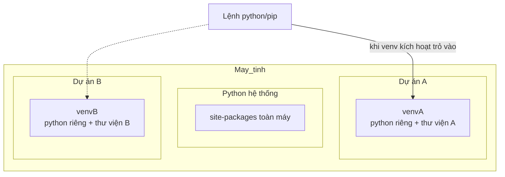

<!-- TỰ ĐỘNG ĐỒNG BỘ từ 03-Thuc-Chien/01-Virtual-Environment/bai.md — đừng sửa trực tiếp, sửa bản chính rồi chạy tools/sync_tracks.py -->

# Bài 30 — Virtual Environment – Môi Trường Ảo Cho Mỗi Dự Án

> 🎓 **Chương 10 – Làm việc như lập trình viên chuyên nghiệp**
> Bạn đã biết module (bài 20), package (bài 21), và sắp tới sẽ học cách cài thư viện bằng **pip** (bài 31). Nhưng làm việc theo kiểu chuyên nghiệp nghĩa là: mỗi dự án một **"môi trường sống" riêng biệt** — nơi chứa đúng các thư viện dự án đó cần, không đụng chạm gì tới dự án khác. Đó chính là **Virtual Environment (môi trường ảo)** — chủ đề của bài hôm nay.

## 🧠 Điều kiện tiên quyết

- [Bài 1 — Giới Thiệu Python](../Phan-1-Co-Ban/01-Gioi-Thieu/bai.md)
- [Bài 3 — Visual Studio Code – Môi Trường Viết Code](../Phan-1-Co-Ban/03-VSCode/bai.md)

---

## 🎯 Mục tiêu

Sau bài học này, học viên sẽ:

* ✅ Hiểu **vì sao cần môi trường ảo** — mỗi dự án dùng thư viện riêng, tránh xung đột phiên bản.
* ✅ Tạo được môi trường ảo bằng lệnh **`python -m venv ten_env`**.
* ✅ **Kích hoạt** môi trường trên Windows (PowerShell/CMD) và macOS/Linux.
* ✅ **Tắt** môi trường ảo bằng lệnh `deactivate`.
* ✅ Chọn môi trường ảo làm **interpreter trong VS Code**.
* ✅ Nắm được **bảng so sánh** và các lưu ý quan trọng (không commit thư mục `venv`).

---

## 📖 Kiến thức

### 1. Nhắc nhẹ bài trước — bài này đi theo hướng "thực chiến"

Từ bài 28, 29 bạn đã làm quen với kỹ thuật nâng cao. Từ bài 30 trở đi, chúng ta chuyển hẳn sang phong cách **làm việc như lập trình viên thật**: quản lý môi trường, cài thư viện, làm việc với dữ liệu và mạng. Môi trường ảo là "chiếc hộp trong suốt" đầu tiên bạn cần làm chủ.

### 2. Vấn đề: vì sao cần môi trường ảo?

Hãy tưởng tượng tình huống:

* 📦 Dự án A cần thư viện `numpy` **phiên bản 1.24**.
* 📦 Dự án B cần thư viện `numpy` **phiên bản 2.1** (phiên bản mới thay đổi cách dùng).
* Nếu cài chung vào một chỗ "toàn hệ thống", hai dự án sẽ **giành nhau một phiên bản** → một trong hai dự án hỏng.

> 💬 **Ví dụ đời thực:** Một căn phòng ở chung cho 5 sinh viên — mỗi người mang đồ trang trí khác nhau, xích mích liên miên. Giải pháp: **mỗi người một phòng riêng**. Mỗi dự án Python một "phòng" (= venv) riêng, đúng đồ dùng mình cần.

**Lợi ích rõ ràng:**

| Lợi ích | Giải thích |
|---|---|
| 🔒 **Cách ly** | Mỗi dự án có bộ thư viện riêng, không đụng nhau |
| 🕒 **Phiên bản đúng** | Khóa đúng phiên bản thư viện mỗi dự án cần |
| 📦 **Sạch sẽ** | Không làm ô nhiễm Python hệ thống |
| 🤝 **Chia sẻ dễ** | Xuất file `requirements.txt` để người khác dựng lại môi trường (học ở bài 31) |

### 3. Môi trường ảo là gì?

**Môi trường ảo (virtual environment)** là một **thư mục tự chứa** bên trong dự án, ví dụ tên `venv`, gồm:

* Một **bản sao Python** (interpreter) dành riêng cho dự án.
* Một **thư mục `Lib/site-packages`** — nơi cài riêng các thư viện của dự án.

Khi bạn bật môi trường này, mọi lệnh `python` và `pip` đều trỏ RIÊNG VỀ môi trường đó, không phải Python hệ thống.



### 4. Tạo môi trường ảo — `python -m venv ten_env`

Mở terminal/cmd ở **thư mục dự án** và gõ:

```bash
python -m venv ten_env
```

* `python -m venv` — chạy module `venv` của Python (bài 20 có giới thiệu cách chạy module qua `-m`).
* `ten_env` — **tên thư mục** chứa môi trường. Tên phổ biến nhất là `venv` hoặc `.venv`.

> 💡 **Giải thích hiệu quả:** Lệnh này tạo một thư mục mới trong dự án, bên trong có Python riêng và sẵn `pip`. Thư mục đó chính là "phòng riêng" của dự án.

**Kiểm tra đã tạo thành công:** bạn sẽ thấy thư mục `ten_env` xuất hiện, bên trong có các thư mục con như `Scripts` (Windows) hoặc `bin` (macOS/Linux), `Lib`, `include`.

### 5. Kích hoạt môi trường ảo (Activate)

**Kích hoạt cực kỳ quan trọng** — chưa kích hoạt thì vẫn dùng Python hệ thống!

> 💬 **Ví dụ đời thực:** Bạn vào phòng riêng của mình (venv) cần **quẹt thẻ ra vào** — đó là lệnh kích hoạt. Khi đã vào phòng, mọi đồ dùng (thư viện) trong phòng đều dùng được.

Lệnh phụ thuộc hệ điều hành:

| Hệ điều hành | Shell | Lệnh kích hoạt |
|---|---|---|
| Windows | Command Prompt (cmd) | `venv\Scripts\activate.bat` |
| Windows | **PowerShell** | `venv\Scripts\Activate.ps1` |
| Windows | Git Bash | `source venv/Scripts/activate` |
| macOS / Linux | Bash | `source venv/bin/activate` |

**Khi kích hoạt thành công**, ở đầu dòng lệnh sẽ hiện tên môi trường trong dấu ngoặc:

```bash
(venv) C:\Users\An\du_an_A>
```

> ✅ **Dấu hiệu nhận ra:** thấy `(venv)` trước dấu nhắc là môi trường ảo **đang hoạt động**. Kiểm tra chắc chắn bằng `python --version` / `where python` (Windows) hoặc `which python` (Linux) — đường dẫn phải trỏ vào thư mục venv.

### 6. Tắt môi trường ảo — `deactivate`

Khi làm xong việc trong dự án, bạn có thể tắt:

```bash
deactivate
```

* Trả về Python hệ thống bình thường.
* Thư mục `venv` vẫn còn — bạn có thể kích hoạt lại bất cứ lúc nào.
* Đóng cửa sổ terminal cũng tự động "tắt" môi trường.

> ⚠️ Muốn **xoá hẳn** môi trường thì xoá thư mục `venv` (Windows Explorer hoặc `rmdir /s venv` — cần thận trọng). Xoá thư mục venv không ảnh hưởng gì tới dự án hay Python.

### 7. Venv trong VS Code — chọn interpreter

VS Code tự đề xuất môi trường ảo khi bạn mở thư mục dự án. Cách chọn thủ công:

1. Mở dự án trong VS Code (thư mục chứa `venv`).
2. Mở Command Palette: `Ctrl + Shift + P` → gõ `Python: Select Interpreter`.
3. Chọn dự án: tự hiện tên môi trường dạng `.\venv\Scripts\python.exe` hoặc `.venv/bin/python`.
4. Trạng thái: góc đáy trái hiển thị tên interpreter đang dùng.

> 💡 Khi chạy file bằng nút ▶ hoặc mở terminal trong VS Code, nếu môi trường được chọn đúng, terminal tự động kích hoạt venv — bạn thấy `(venv)` ngay từ đầu.

### 8. Mỗi dự án một venv — quy tắc vàng

> 📏 **Quy tắc vàng:** Mỗi dự án Python → **một môi trường ảo riêng**. Không dùng chung venv giữa hai dự án, vì lại mang xung đột trở lại.

Mô hình khi làm việc:

1. Tạo thư mục dự án.
2. Vào thư mục dự án.
3. Tạo venv: `python -m venv venv`.
4. Kích hoạt: (lệnh theo OS).
5. Cài thư viện: `pip install ten_thu_vien`.
6. Làm việc: viết code, chạy chương trình.

### 9. Bảng so sánh: venv vs global

| Tiêu chí | Python hệ thống | venv |
|---|---|---|
| Thư viện | Chung toàn máy | Riêng từng dự án |
| Xung đột phiên bản | Thường xảy ra | Không xảy ra |
| Cần kích hoạt | Không | Có |
| Ô nhiễm cài đặt | Có | Không |
| Khi dự án lớn hoặc nhóm | Khó quản lý | Chuẩn chuyên nghiệp |

### 10. Lưu ý quan trọng: KHÔNG commit `venv` lên git

Thư mục `venv` rẤT lớn (200–500 MB trở lên) và **không nên đưa vào git** (nếu dự án dùng Git được quản lý ở bài 31/41):

* ✂️ Tạo file **`.gitignore`** trong dự án với dòng `venv/` (hoặc `env/`, `.venv/`) để git bỏ qua.
* 📄 Thay vào đó, xuất **`requirements.txt`** (bài 31) — người khác chỉ cần `pip install -r requirements.txt` là dựng lại môi trường y hệt.

> 💡 **Nguyên tắc:** "Không commit môi trường, chỉ commit **hướng dẫn xây môi trường**".

---

## 💡 Ví dụ minh họa (chạy theo từng bước thật)

### Ví dụ 1: Tạo và sử dụng venv cho dự án "quản_lý_lớp"

**Bước 1 — Tạo dự án và môi trường ảo:**

```bash
mkdir du_an_quan_ly_lop
cd du_an_quan_ly_lop
python -m venv venv
```

* `mkdir` — tạo thư mục dự án.
* `cd` — đi vào dự án.
* `python -m venv venv` — tạo môi trường ảo tên `venv`.

**Bước 2 — Kích hoạt (Windows PowerShell):**

```powershell
.\venv\Scripts\Activate.ps1
```

Nếu bị lỗi "running script is disabled":

```powershell
Set-ExecutionPolicy -Scope Process -ExecutionPolicy Bypass
# rồi chạy lại lệnh activate
```

**Bước 3 — Kiểm tra Python & pip của môi trường:**

```powershell
python --version
pip --version
where python
```

`where python` trả đường dẫn nằm trong `venv\Scripts\` → thành công.

**Bước 4 — Thoát:**

```powershell
deactivate
```

### Ví dụ 2: macOS / Linux (Terminal)

```bash
python3 -m venv venv
source venv/bin/activate
python --version
deactivate
```

> Trên Linux/macOS lệnh python có thể là `python3`.

---

## 🔬 Ví dụ nâng cao

### Ví dụ 1: Tạo venv cho "môi trường thực hành" có thư viện

```bash
python -m venv thuchanh
source thuchanh/bin/activate        # Windows: thuchanh\Scripts\activate
pip install requests                # cài thử thư viện (kiến thức bài 31)
python -c "import requests; print(requests.__version__)"
deactivate
```

* Lệnh `python -c "..."` chạy nhanh một dòng code không cần tạo file.
* Sau `deactivate`, môi trường `thuchanh` vẫn còn nguyên để dùng lại.

### Ví dụ 2: Kiểm tra venv hoạt động không bằng `pip show`

```powershell
# Sau khi kích hoạt venv vừa tạo
pip show pip | Select-Object -Property Location
```

Vị trí trả về nằm trong thư mục venv → đúng môi trường đang hoạt động.

### Ví dụ 3: "Phòng riêng" — hai dự án hai numpy khác phiên bản

```bash
# Dự án A
mkdir du_an_A && cd du_an_A
python -m venv venv
source venv/bin/activate
pip install "numpy==1.24.0"
deactivate

# Dự án B — trình tự giống, phiên bản khác
mkdir du_an_B && cd du_an_B
python -m venv venv
source venv/bin/activate
pip install "numpy==2.1.0"
deactivate
```

Hai dự án có hai numpy riêng biệt, không can thià nhau — chính là vì môi trường ảo.

---

## ⚠️ Lỗi thường gặp

### Lỗi 1: Gõ `pip install` mà không kích hoạt venv

* **Nguyên nhân:** thư viện cài vào **Python hệ thống**, không phải venv.
* **Dấu hiệu:** không thấy `(venv)` ở đầu dòng lệnh.
* **Cáach sửa:** chạy lệnh kích hoạt trước, nhìn thấy `(venv)` rồi mới `pip install`.

### Lỗi 2: PowerShell chặn lệnh `Activate.ps1`

* **Lỗi hiện:** `...running scripts is disabled on this system`.
* **Nguyên nhân:** chính sách ExecutionPolicy mặc định.
* **Cách sửa:** cho phiên hiện tại: `Set-ExecutionPolicy -Scope Process -ExecutionPolicy Bypass`. Hoặc dùng `cmd` với lệnh `venv\Scripts\activate.bat`.

### Lỗi 3: tưởng đã ở trong venv nhưng `where python` chỉ về hệ thống

* **Nguyên nhân:** chưa kích hoạt hoặc kích hoạt ở cửa ký khác.
* **Cá sửa:** chạy `where python` (Windows) hoặc `which python` (Linux) sau khi kích hoạt; đường dẫn phải có `venv`.

### Lỗi 4: Vì sao `python` không chạy dù venv tồn tại?

* **Nguyên nhân:** venv chưa được **kích hoạt** hoặc đang ở thư mục con khác.
* **Cách sửa:** di chuyển về thư mục cây dự án, kích hoạt, rồi chạy `python`.

### Lỗi 5: Commit nhầm thư mục `venv` lên Git

* **Nguyên nhân:** quên `.gitignore`.
* **Cách sửa:** tạo `.gitignore` chứa `venv/`, dùng Git để bỏ đã theo dõi (`git rm -r --cached venv`) — chi tiết học ở bài Git (Chương sau).

---

## 💎 Mẹo

* 🏠 **Đặt tên chuẩn:** `venv` (phổ dụng), hoặc `.venv` để VS Code ẩn.
* ⚡ **Chọn interpreter sớm:** mở VS Code → `Python: Select Interpreter` ngay khi tạo venv.
* 🧹 **Làm sạch trong chớp:** thử thư viện không dùng thì gỡ để dự án gọn.
* 📄 **Luôn kèm `requirements.txt`** khi chia sẻ dự án (sẽ học ai bài 31).
* 🚫 **Không bao giờ commit `venv`;** hãy coi nó như "đồ dùng sinh viên" — mỗi máy phải tự chuẩn bị lại.
* 🧠 **Tăng sức mạnh:** dùng `virtualenv` + `virtualenvwrapper` khi cần nhiều venv đồng thời (chỉ học upgrade sau).

---

## 📝 Tóm tắt

| Thao tác | Lệnh |
|---|---|
| Tạo môi trường ảo | `python -m venv venv` |
| Kích hoạt – Windows (PowerShell) | `venv\Scripts\Activate.ps1` |
| Kích hoạt – Windows (cmd) | `venv\Scripts\activate.bat` |
| Kích hoạt – macOS/Linux | `source venv/bin/activate` |
| Kiểm tra | `(venv)` hiện đầu dòng; `where python` trỏ về venv |
| Tắt môi trường | `deactivate` |
| Xoá môi trường | xoá thư mục `venv` |
| Chọn trong VS Code | `Ctrl+Shift+P` → `Python: Select Interpreter` |
| Git | **không commit venv** — dùng `.gitignore` |

---

## 🧪 Kiểm tra nhanh

1. ❓ Môi trường ảo là gì và vì sao cần?
2. ❓ Lệnh tạo venv là gì?
3. ❓ Lệnh kích thích trên Windows PowerShell? Trên macOS/Linux?
4. ❓ Dấu hiệu nào cho biết venv được kích thích?
5. ❓ Lệnh nào tắt môi trường ảo?
6. ❓ Vì sao mỗi dự án nên có venv riêng?
7. ❓ venv có nên đẩy lên Git không? Vì sao?
8. ❓ VS Code chọn interpreter thế nào?
9. ❓ `python -m venv ten_env` làm những gì?
10. ❓ Muốn cài thư viện vào đúng venv cần làm gì trước?

<details>
<summary>🔍 Xem đáp án</summary>

1. Thư mục chứa Python riêng và thư viện riêng cho dự án; tránh xung đột phiên bản thư viện.
2. `python -m venv ten_env` (tên thường là `venv`).
3. Windows PowerShell: `venv\Scripts\Activate.ps1`; macOS/Linux: `source venv/bin/activate`.
4. Thấy `(venv)` ở đầu dòng lệnh; và `where python`/`which python` chỉ vào venv.
5. `deactivate`.
6. Mỗi dự án dùng phiên bản thư viện khác; venv riêng tránh xung đột.
7. Không. vì nó khá lớn và tái tạo được; nguyên tắc "commit hướng dẫn môi tạo, không commit môi trường".
8. `Ctrl + Shift + P` → `Python: Select Interpreter` → chọn interpreter có `venv`.
9. Tạo thư mục chứa bản Python riêng, pip riêng và site-packages riêng.
10. Kích hoạt môi trường trước (để có `(venv)`), rồi mới dùng pip.

</details>

---

## 📚 Bài đọc thêm

* [Python.org – venv (tài liệu official)](https://docs.python.org/3/library/venv.html)
* [Real Python – Python Virtual Environments: A Primer](https://realpython.com/python-virtual-environments-a-primer/)
* [VS Code – Using Python environments](https://code.visualstudio.com/docs/python/environments)
* [pip – tài liệu cài đặt package (chuẩn bị bài 31)](https://pip.pypa.io/en/stable/)

---

---

## 🧩 Bài tập

> 📝 🎯 **Chủ đề:** Tạo venv, kích hoạt (Windows/macOS/Linux), deactivate, venv trong VS Code, không commit venv.

## 🟢 Dễ (Bài 1 – 7)

### Bài 1: Môi trường ảo là gì?

* **Đề bài:** Nêu khái niệm **môi trường ảo (virtual environment)** bằng 2-3 câu ngắn gọn theo cách hiểu của bạn.
* **Input:** Không có
* **Output:** Đoạn văn 2-3 câu.
* **Gợi ý:** Nhắc đến: thư mục tự chứa Python + thư viện riêng cho dự án.

### Bài 2: Vì sao cần môi trường ảo?

* **Đề bài:** Liệt kê ít nhất **3 lợi ích** của việc dùng môi trường ảo cho mỗi dự án.
* **Input:** Không có
* **Output:** Danh sách 3 lợi ích.
* **Gợi ý:** Nghĩ về: cách ly, phiên bản thư viện, sạch hệ thống, chia sẻ dễ.

### Bài 3: Nhận diện lệnh tạo venv

* **Đề bài:** Ghi lại **lệnh đầy đủ** tạo môi trường ảo tên `venv` trong thư mục dự án.
* **Input:** Không có
* **Output:** Một dòng lệnh.
* **Gợi ý:** Bắt đầu bằng `python -m`.

### Bài 4: Lệnh kích hoạt — Windows

* **Đề bài:** Ghi lệnh kích hoạt môi trường ảo `venv` trên **Windows** (dùng Command Prompt) và trên **Windows PowerShell**.
* **Input:** Không có
* **Output:** Hai dòng lệnh.
* **Gợi ý:** Thư mục `Scripts` — một bản `.bat`, một bản `.ps1`.

### Bài 5: Lệnh kích hoạt — macOS/Linux

* **Đề bài:** Ghi lệnh kích hoạt môi trường ảo `venv` trên **macOS/Linux**.
* **Input:** Không có
* **Output:** Một dòng lệnh.
* **Gợi ý:** Bắt đầu bằng `source` và thư mục `bin`.

### Bài 6: Dấu hiệu kích hoạt thành công

* **Đề bài:** Làm thao tác: tạo dự án `bai_tap_venv`, tạo venv, kích hoạt thành công. **Ghi lại dòng nhắc** bạn thấy sau khi kích hoạt (dòng đầu tiên của terminal).
* **Input:** Thao tác thật trên máy.
* **Output:** Dạng `(venv) C:\...>` hoặc `(venv) user@pc:...$`.
* **Gợi ý:** Sau khi kích hoạt, tên môi trường hiện trong ngoặc đơn đầu dòng.

### Bài 7: Lệnh tắt môi trường

* **Đề bài:** Sau khi kích hoạt thành công ở bài 6, ghi lệnh để **tắt** môi trường ảo.
* **Input:** Không có
* **Output:** Một dòng lệnh.
* **Gợi ý:** Chỉ một từ đơn giản, gõ xong thấy dấu `(venv)` biến mất.

---

## 🟡 Trung bình (Bài 8 – 14)

### Bài 8: Thực hành trọn quy trình — Windows

* **Đề bài:** Trên Windows (PowerShell): tạo thư mục `du_an_1` → tạo venv `venv` → kích hoạt → chạy `python --version` → `deactivate`. Ghi lại **toàn bộ lệnh** bạn đã gõ.
* **Input:** Thao tác thật.
* **Output:** 5 dòng lệnh theo đúng thứ tự.
* **Gợi ý:** Tuần tự: `mkdir`, `cd`, `python -m venv`, `.\venv\Scripts\Activate.ps1`, `deactivate`.

### Bài 9: Thực hành trọn quy trình — macOS/Linux

* **Đề bài:** Nếu bạn dùng macOS/Linux, ghi 5 lệnh tương ứng bài 8. Nếu dùng Windows, hãy **viết ra các lệnh** mà người dùng macOS/Linux cần gõ.
* **Input:** Không có
* **Output:** 5 dòng lệnh.
* **Gợi ý:** Kích hoạt bằng `source venv/bin/activate`; có thể dùng `python3`.

### Bài 10: Kiểm tra đường dẫn Python

* **Đề bài:** Trong venv đang kích hoạt, chạy `where python` (Windows) hoặc `which python` (Linux/macOS). Ghi lại kết quả và **kết luận**: đường dẫn có nằm trong thư mục venv không?
* **Input:** Thao tác thật.
* **Output:** Đường dẫn + câu kết luận.
* **Gợi ý:** `where`/`which` trả về đường dẫn thực thi; trong venv sẽ có chữ `venv` trong đường dẫn.

### Bài 11: Cài thử thư viện trong venv

* **Đề bài:** Trong venv, chạy `pip install requests` (bài 31 sẽ học sâu). Sau đó chạy `pip list` và ghi lại: `requests` có trong danh sách không? **Ghi lại 3 dòng đầu** của `pip list`.
* **Input:** Thao tác thật (cần internet).
* **Output:** Tên thư viện đã cài + 3 dòng đầu pip list.
* **Gợi ý:** `pip list` hiển thị bảng 2 cột: tên và phiên bản.

### Bài 12: Deactivate rồi kiểm tra lại

* **Đề bài:** Sau bài 11, gõ `deactivate`, rồi `where python` lần nữa. So sánh đường dẫn trước và sau — **kết luận gì** về thư mục pip list.
* **Input:** Thao tác thật.
* **Output:** 2 đường dẫn + câu kết luận.
* **Gợi ý:** Sau deactivate, đường dẫn trỏ về Python hệ thống.

### Bài 13: Chọn interpreter trong VS Code

* **Đề bài:** Mở VS Code vào thư mục `du_an_1`, mở Command Palette (`Ctrl+Shift+P`), chọn `Python: Select Interpreter`. Ghi lại: tên interpreter chứa `venv` bạn chọn là gì?
* **Input:** Thao tác thật.
* **Output:** Tên interpreter (dạng `Python 3.x.x ('venv': venv)`).
* **Gợi ý:** Ở góc dưới trái VS Code cũng hiện interpreter đang dùng.

### Bài 14: `.gitignore` — không commit venv

* **Đề bài:** Trong thư mục `du_an_1`, tạo file `.gitignore` với nội dung bỏ qua thư mục `venv`. Ghi lại nội dung file.
* **Input:** Thao tác thật.
* **Output:** Nội dung file `.gitignore` (1-2 dòng).
* **Gợi ý:** Dòng `venv/` đã đủ; có thể thêm `__pycache__/`.

---

## 🔴 Khó (Bài 15 – 20)

### Bài 15: Xung đột phiên bản — viết kịch bản minh họa

* **Đề bài:** Viết một **kịch bản (câu chuyện) 5-7 câu** giải thích vì sao hai dự án A và B cần hai venv riêng, dù cả hai cùng dùng thư viện `numpy`.
* **Input:** Không có
* **Output:** Đoạn văn kịch bản.
* **Gợi ý:** Dùng ví dụ "hai sinh viên một phòng" hoặc "phiên bản numpy 1.24 vs 2.1".

### Bài 16: So sánh global và venv

* **Đề bài:** Lập **bảng so sánh** (4-6 dòng) giữa Python hệ thống và venv theo các tiêu chí: thư viện, xung đột phiên bản, cần kích hoạt, mức chuyên nghiệp.
* **Input:** Không có
* **Output:** Bảng (dùng dấu `|` trong file txt hoặc bảng markdown).
* **Gợi ý:** Tham khảo bảng trong phần "Bảng so sánh" của bài giảng.

### Bài 17: Tạo script tạo venv tự động

* **Đề bài:** Viết file `tao_moi_truong.bat` (Windows) chạy: tạo venv, kích hoạt, cài `requests`, chạy `python -c "print('OK')"`. Ghi nội dung file.
* **Input:** Không có
* **Output:** Nội dung file `.bat` (3-4 dòng).
* **Gợi ý:** Dòng 1: `python -m venv venv`; dòng 2: `venv\Scripts\activate`; dòng 3: `pip install requests`; dòng 4: `python -c "print('OK')"`.

### Bài 18: Khôi phục môi trường từ danh sách

* **Đề bài:** Trong venv của `du_an_1`, chạy `pip freeze > requirements.txt`. Mở file và ghi lại **5 dòng đầu**. Giải thích một dòng bất kỳ.
* **Input:** Thao tác thật (đã cài `requests` ở bài 11).
* **Output:** 5 dòng đầu của `requirements.txt` + lời giải thích.
* **Gợi ý:** Định dạng `ten_thu_vien==phien_ban`.

### Bài 19: Bảo trì venv — gỡ thư viện

* **Đề bài:** Trong venv đang kích hoạt, chạy `pip uninstall requests -y` rồi `pip show requests` để kiểm tra. Ghi lại kết quả của `pip show` (lỗi hay thành công) và giải thích vì sao.
* **Input:** Thao tác thật.
* **Output:** Kết quả pip show + giải thích.
* **Gợi ý:** Sau khi gỡ, `pip show` trả thông báo lỗi "not found" — giải thích rằng thư viện không còn trong venv.

### Bài 20: Tổng kết "phiếu kiểm tra môi trường"

* **Đề bài:** Tạo file `kiem_tra_moi_truong.md` (hoặc `.txt`) gồm checklist 5 mục để kiểm tra trước khi chạy một dự án Python:
  1. Đã ở đúng thư mục dự án chưa?
  2. Đã kích hoạt venv chưa (thấy `(venv)`)?
  3. `where python` có trỏ vào venv không?
  4. Đã cài đủ thư viện theo `requirements.txt` chưa?
  5. Không commit `venv` lên git.
* **Input:** Không có
* **Output:** File checklist 5 mục (ghi lại nội dung).
* **Gợi ý:** Mỗi mục kèm lệnh/kiểm tra tương ứng trong ngoặc.

---

## 🎯 Tổng kết sau khi làm bài

Sau 20 bài tập, bạn đã:

* ✅ Giải thích được môi trường ảo là gì và vì sao mỗi dự án cần một venv.
* ✅ Tạo, kích hoạt (Windows + macOS/Linux), tắt và xoá venv thành thạo.
* ✅ Biết chọn interpreter venv trong VS Code.
* ✅ Biết nguyên tắc: **không commit venv**, chỉ commit "hướng dẫn xây môi trường".

> 💪 Chưa tự làm được bài nào thì đừng lo — mở lại bài giảng, thực hành lại từng lệnh trong terminal. **Môi trường ảo là kỹ năng dùng hàng ngày — luyện nhiều sẽ quen!**

---

## ✅ Đáp án

> 💡 **Hãy tự làm bài tập trước** rồi mới mở đáp án.

## 🟢 Dễ (Bài 1 – 7)


<details>
<summary>✅ Bài 1: Môi trường ảo là gì?</summary>


**Phân tích:** Kiểm tra khái niệm nền tảng.

**Ý tưởng:** Trả lời ngắn với 2-3 ý: thư mục tự chứa, Python riêng, thư viện riêng.

**Đáp án mẫu:**

> Môi trường ảo (virtual environment) là một **thư mục tự chứa** trong dự án, bao gồm một **bản Python riêng** và một **bộ thư viện riêng** (nằm trong `site-packages`). Khi môi trường được kích hoạt, mọi lệnh `python`, `pip` chỉ làm việc với bộ thư viện đó, hoàn toàn tách biệt với Python hệ thống.

---

</details>

<details>
<summary>✅ Bài 2: Vì sao cần môi trường ảo?</summary>


**Phân tích:** Kiểm tra lợi ích bằng liệt kê.

**Đáp án mẫu:**

1. 🔒 **Cách ly:** mỗi dự án có bộ thư viện riêng, dự án này không phá hỏng dự án kia.
2. 🕒 **Phiên bản đúng:** mỗi dự án dùng đúng phiên bản thư viện mình cần (ví dụ `numpy==1.24` vs `numpy==2.1`).
3. 🧹 **Sạch sẽ:** không làm ô nhiễm Python hệ thống bằng hàng tá thư viện lộn xộn.
4. 🤝 **Chia sẻ dễ:** xuất `requirements.txt` để nhóm phát triển dựng lại môi trường y hệt.

---

</details>

<details>
<summary>✅ Bài 3: Nhận diện lệnh tạo venv</summary>


**Đáp án:**

```bash
python -m venv venv
```

Giải thích: `python -m venv` chạy **module `venv`** của Python, đối số `venv` là tên thư mục môi trường.

---

</details>

<details>
<summary>✅ Bài 4: Lệnh kích hoạt — Windows</summary>


**Đáp án:**

* **Command Prompt (cmd):**
  ```
  venv\Scripts\activate.bat
  ```
* **PowerShell:**
  ```
  venv\Scripts\Activate.ps1
  ```

> 💡 Nếu PowerShell báo lỗi execution policy, chạy một lần:
> ```powershell
> Set-ExecutionPolicy -Scope Process -ExecutionPolicy Bypass
> ```

---

</details>

<details>
<summary>✅ Bài 5: Lệnh kích hoạt — macOS/Linux</summary>


**Đáp án:**

```bash
source venv/bin/activate
```

Giải thích: trên macOS/Linux, tập lệnh kích hoạt nằm trong thư mục `bin`. `source` chạy tập lệnh trong đúng shell hiện tại.

---

</details>

<details>
<summary>✅ Bài 6: Dấu hiệu kích hoạt thành công</summary>


**Đáp án mẫu (tuỳ hệ điều hành):**

```
(venv) C:\Users\An\bai_tap_venv>
(venv) an@pc:~/bai_tap_venv$
```

**Cách kiểm chứng:** thấy `(venv)` ở **đầu dòng nhắc** là môi trường ảo đang hoạt động. Muốn chắc chắn, gõ `where python` (Windows) hoặc `which python` (Linux) — đường dẫn có chứa `venv`.

---

</details>

<details>
<summary>✅ Bài 7: Lệnh tắt môi trường</summary>


**Đáp án:**

```bash
deactivate
```

Sau khi gõ, dấu `(venv)` biến mất → đã trở về Python hệ thống. Đóng cửa sổ terminal cũng tự "tắt" venv.

---

</details>

## 🟡 Trung bình (Bài 8 – 14)


<details>
<summary>✅ Bài 8: Thực hành trọn quy trình — Windows</summary>


**Đáp án (5 lệnh theo đúng thứ tự, chạy trong PowerShell):**

```powershell
mkdir du_an_1
cd du_an_1
python -m venv venv
.\venv\Scripts\Activate.ps1
deactivate
```

**Giải thích:**
* `mkdir du_an_1` — tạo thư mục dự án.
* `cd du_an_1` — đi vào dự án.
* `python -m venv venv` — tạo môi trường ảo tên `venv`.
* `.\venv\Scripts\Activate.ps1` — vào môi trường.
* `deactivate` — thoát môi trường.

---

</details>

<details>
<summary>✅ Bài 9: Thực hành trọn quy trình — macOS/Linux</summary>


**Đáp án:**

```bash
mkdir du_an_1
cd du_an_1
python3 -m venv venv
source venv/bin/activate
deactivate
```

**Giải thích:** trên macOS/Linux thường dùng `python3`; lệnh kích hoạt là `source venv/bin/activate`.

---

</details>

<details>
<summary>✅ Bài 10: Kiểm tra đường dẫn Python</summary>


**Đáp án mẫu (Windows):**

```
where python
C:\Users\An\du_an_1\venv\Scripts\python.exe
```

**Kết luận:** đường dẫn `...\venv\Scripts\python.exe` nằm **trong thư mục venv** → môi trường ảo đang hoạt động đúng. Trên Linux dùng `which python` và trả về `.../venv/bin/python`.

---

</details>

<details>
<summary>✅ Bài 11: Cài thử thư viện trong venv</summary>


**Các lệnh:**

```bash
pip install requests
pip list
```

**Đáp án mẫu (3 dòng đầu `pip list`):**

```
Package            Version
------------------ ---------
certifi            2025.5.15
charset-normalizer 3.4.1
```

* `requests` có trong danh sách → đã cài vào **venv** thành công. Bạn cũng thấy các **package phụ thuộc** (certifi...) mà pip tự cài kèm.

---

</details>

<details>
<summary>✅ Bài 12: Deactivate rồi kiểm tra lại</summary>


**Đáp án mẫu (Windows):**

```bash
deactivate
where python
```

Kết quả lúc này trỏ về Python hệ thống, ví dụ `C:\Users\An\AppData\Local\Programs\Python\Python314\python.exe` — **không** còn `venv` trong đường dẫn.

**Kết luận:** khi tắt môi trường, các lệnh quay về dùng Python hệ thống. Muốn dùng thư viện đã cài trong venv phải kích hoạt lại.

---

</details>

<details>
<summary>✅ Bài 13: Chọn interpreter trong VS Code</summary>


**Các bước:**
1. VS Code → mở thư mục `du_an_1`.
2. `Ctrl + Shift + P` → gõ `Python: Select Interpreter`.
3. Chọn mục có `venv`, dạng:
   ```
   'venv': venv
   ```
   hoặc
   ```
   Python 3.14.2 ('venv': venv)
   ```

**Ghi nhận:** góc dưới trái VS Code hiển thị tên interpreter đang dùng — chọn đúng `venv` thì terminal mới tự kích hoạt môi trường.

---

</details>

<details>
<summary>✅ Bài 14: `.gitignore` — không commit venv</summary>


**Đáp án nội dung file `.gitignore`:**

```gitignore
venv/
__pycache__/
```

**Giải thích:** dòng `venv/` yêu cầu Git bỏ qua toàn bộ thư mục `venv`; `__pycache__/` bỏ qua thư mục bytecode tự sinh khi chạy Python.

---

</details>

## 🔴 Khó (Bài 15 – 20)


<details>
<summary>✅ Bài 15: Xung đột phiên bản — kịch bản mẫu</summary>


**Đáp án mẫu:**

> Một công ty nhỏ có hai dự án. Dự án **A** (ứng dụng toán học) đang chạy ổn định với `numpy==1.24.0`. Dự án **B** (phân tích dữ liệu mới) lại cần `numpy==2.1.0` vì tính năng mới. Nếu cả hai cùng cài "xịn chung" vào Python hệ thống, một trong hai dự án sẽ dùng sai phiên bản: `numpy` 2.1 sẽ báo lỗi hàm mà dự án A đang dùng ở phiên bản 1.24. Không ai thắng trong xung đột này. Giải pháp: tạo **hai môi trường ảo riêng** — dự án A kích hoạt venv A (numpy 1.24), dự án B kích hoạt venv B (numpy 2.1). Cả hai cùng tồn tại song song, không đụng nhau, công ty làm việc thuận lợi.

---

</details>

<details>
<summary>✅ Bài 16: So sánh global và venv</summary>


**Đáp án dạng bảng:**

| Tiêu chí | Python hệ thống | venv |
|---|---|---|
| Thư viện | Chung toàn máy | Riêng cho từng dự án |
| Xung đột phiên bản | Thường xảy ra | Không xảy ra |
| Cần kích hoạt | Không | Có |
| Ô nhiễm cài đặt | Có (tích nhiều thư viện không dùng) | Không |
| Chia sẻ đồng đội | Khó tái tạo | Dễ (qua requirements.txt) |
| Mức độ chuyên nghiệp | Dùng cho việc khởi sự/thử nghiệm | Chuẩn cho mọi dự án thật |

---

</details>

<details>
<summary>✅ Bài 17: Script tạo môi trường tự động (`tao_moi_truong.bat`)</summary>


**Đáp án nội dung file:**

```bat
@echo off
python -m venv venv
venv\Scripts\activate
pip install requests
python -c "print('OK')"
```

**Giải thích:**
* `@echo off` — tắt in lệnh thừa.
* `python -m venv venv` — tạo môi trường.
* `venv\Scripts\activate` — kích hoạt.
* `pip install requests` — cài thư viện.
* `python -c "print('OK')"` — kiểm tra, in `OK`.

> 💡 Phiên bản cho Linux/macOS: file `tao_moi_truong.sh` với `python3 -m venv venv` và `source venv/bin/activate`, kèm `chmod +x` để chạy.

---

</details>

<details>
<summary>✅ Bài 18: Khôi phục môi trường từ danh sách</summary>


**Các lệnh:**

```bash
pip freeze > requirements.txt
```

**Đáp án mẫu (5 dòng đầu file `requirements.txt`):**

```
certifi==2025.1.15
charset-normalizer==3.4.1
idna==3.10
requests==2.32.3
urllib3==2.3.0
```

**Giải một dòng:** `requests==2.32.3` — tên thư viện `requests`, phiên bản chính xác `2.32.3`. File này cho người khác biết **cài gì, phiên bản nào** để khôi phục môi trường bằng `pip install -r requirements.txt` (bài 31).

---

</details>

<details>
<summary>✅ Bài 19: Bảo trì venv — gỡ thư viện</summary>


**Các lệnh:**

```bash
pip uninstall requests -y
pip show requests
```

**Đáp án:** sau khi gỡ, `pip show requests` in thông báo lỗi dạng:

```
WARNING: No metadata found for requests. ...
```

hoặc:

```
pip show requests
```

→ **không tìm thấy package**. Giải thích: thư viện đã được gỡ khỏi venv nên `pip show` không còn thông tin; thư mục `requests` cũng không còn trong `site-packages`.

---

</details>

<details>
<summary>✅ Bài 20: Phiếu kiểm tra môi trường</summary>


**Đáp án file `kiem_tra_moi_truong.md`:**

```markdown
# ✅ Phiếu kiểm tra trước khi chạy dự án Python

1. Đã ở đúng thư mục dự án chưa? (`pwd` / `cd`)
2. Đã kích hoạt venv chưa? (thấy `(venv)` đầu dòng)
3. `where python`/`which python` có trỏ vào thư mục venv không?
4. Đã cài đủ thư viện theo `requirements.txt` chưa? (`pip install -r requirements.txt`)
5. Không commit thư mục `venv` lên Git (có `.gitignore`) chưa?
```

**Giải thích:** mỗi mục kèm lệnh/con trỏ kiểm tra; tick từng ô giúp tránh lỗi "chạy không được vì thiếu thư viện hoặc sai môi trường".

---

</details>

## 📌 Lời khuyên cuối


* Kỹ năng venv được dùng **mỗi ngày** trong công việc lập trình — hãy tập quen quy trình: `python -m venv venv` → kích hoạt → cài thư viện → làm việc → `deactivate`.
* Nếu bị lỗi PowerShell script suppressed, đừng sợ — đó là chính sách hệ thống, `Set-ExecutionPolicy -Scope Process -ExecutionPolicy Bypass` giải quyết cho phiên làm việc.
* Mỗi dự án một venv, không nên đi chung — nhớ quy tắc vàng.
* Luôn xoá venv bằng cách xoá thư mục; không ảnh hưởng dự án hay Python.

👉 Tiếp theo: **[Bài 31: Pip](../02-Pip/bai.md)**

---

## ➡️ Điều hướng

**Vị trí:** `04-Full/Phan-3-Thuc-Chien/01-Virtual-Environment/bai.md`

**Bài tiếp theo:** [Bài 31 — Pip – Quản Lý Thư Viện](../02-Pip/bai.md)
