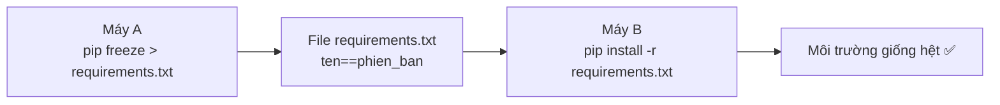

<!-- TỰ ĐỘNG ĐỒNG BỘ từ 03-Thuc-Chien/02-Pip/bai.md — đừng sửa trực tiếp, sửa bản chính rồi chạy tools/sync_tracks.py -->

# Bài 31 — Pip – Quản Lý Thư Viện

> 🎓 **Chương 10 – Làm việc như lập trình viên chuyên nghiệp**
> Bài 30 đã dạy bạn tạo "phòng riêng" cho dự án — **virtual environment**. Bài này dạy cách **mua sắm đồ đạc cho phòng đó**: cài thư viện, gỡ thư viện, xem danh sách, và quan trọng nhất là **xuất danh sách để chia sẻ**. Tất cả đều nhờ một công cụ nhỏ tên là **pip** — người bạn đồng hành của mọi lập trình viên Python.

## 🧠 Điều kiện tiên quyết

- [Bài 30 — Virtual Environment – Môi Trường Ảo Cho Mỗi Dự Án](../01-Virtual-Environment/bai.md)

---

## 🎯 Mục tiêu

Sau bài học này, học viên sẽ:

* ✅ Hiểu **pip là gì** và vai trò của nó trong hệ sinh thái Python.
* ✅ Dùng thành thạo **`pip install`**, **`pip uninstall`**, **`pip list`**, **`pip show`**.
* ✅ Xuất danh sách thư viện bằng **`pip freeze > requirements.txt`**.
* ✅ Cài toàn bộ thư viện từ danh sách bằng **`pip install -r requirements.txt`**.
* ✅ Cài đúng phiên bản thư viện (**`pip install requests==2.31.0`**).
* ✅ **Nâng cấp pip** và các thư viện khi cần.

---

## 📖 Kiến thức

### 1. Nhắc nhẹ bài trước — venv và pip đi đôi với nhau

Ở bài 30, bạn đã làm quen với môi trường ảo và chạy thử `pip install requests`. Câu hỏi đặt ra: pip hoạt động thế nào, có những lệnh nào, và vì sao phải cài thư viện qua pip thay vì tự tải về tay?

> 📦 **Câu trả lời ngắn:** pip là "siêu thị cài đặt" — bạn gọi tên món, pip tải món đó (kèm các món phụ thuộc) và bày vào đúng venv đang hoạt động.

### 2. Pip là gì?

**pip** (viết tắt của "Pip Installs Packages") là **trình quản lý thư viện** mặc định của Python, được cài sẵn từ Python 3.4 trở lên.

* 🔎 Tải thư viện từ **PyPI** (Python Package Index) — "chợ thư viện" chính thức của Python: https://pypi.org/.
* 📦 Tự động cài cả **thư viện phụ thuộc** (thư viện mà thư viện bạn cần dựa vào).
* 🧹 Gỡ cài đặt, cập nhật phiên bản, liệt kê mọi thứ đã cài.

> 💬 **Ví dụ đời thực:** PyPI giống **chợ trung tâm**, pip giống **shipper** — bạn báo món ("requests"), shipper chạy vào chợ lấy món và mang về tận nhà (venv), kèm cả "gia vị kèm theo" (thư viện phụ thuộc).

**Kiểm tra pip đã có chưa:**

```bash
python -m pip --version
```

Kết quả dạng:

```
pip 26.1.2 from C:\Python314\Lib\site-packages\pip (python 3.14)
```

> 💡 Mẹo: dùng `python -m pip` thay cho `pip` để chắc chắn chạy đúng pip của Python hiện tại (đặc biệt khi có nhiều Python trên máy).

### 3. Cài thư viện — `pip install`

```bash
pip install requests
```

* Không ghi phiên bản → pip cài **bản mới nhất**.
* Có thể cài nhiều thư viện cùng lúc: `pip install requests flask`.

**Cài đúng phiên bản cụ thể:**

```bash
pip install requests==2.31.0
```

| Cú pháp | Ý nghĩa |
|---|---|
| `pip install requests` | Bản mới nhất |
| `pip install requests==2.31.0` | Đúng phiên bản 2.31.0 |
| `pip install "requests>=2.31"` | Lớn hơn hoặc bằng 2.31 |
| `pip install requests==2.31.0 "flask<3"` | Nhiều ràng buộc cùng lúc |

> ⚠️ **Quan trọng:** khi cài thư viện phải **kích hoạt venv trước** — nếu không thư viện sẽ cài vào Python hệ thống, làm hỏng sự tách biệt (bài 30).

### 4. Xem thư viện đã cài — `pip list` và `pip show`

**`pip list`** — danh sách mọi thư viện trong môi trường hiện tại:

```bash
pip list
```

```
Package            Version
------------------ ----------
certifi            2025.5.15
charset-normalizer 3.4.1
idna              3.10
pip               26.1.2
requests          2.32.3
```

**`pip show ten_thu_vien`** — chi tiết một thư viện (tác giả, phiên bản, cần cho ai...):

```bash
pip show requests
```

```
Name: requests
Version: 2.32.3
Summary: Python HTTP for Humans.
Author: Kenneth Reitz
Requires: certifi, charset-normalizer, idna, urllib3
```

> 🔎 Nhìn mục `Requires` — bạn sẽ thấy các thư viện phụ thuộc mà pip tự cài kèm!

### 5. Gỡ thư viện — `pip uninstall`

```bash
pip uninstall requests
```

* Hỏi xác nhận `y/n`; dùng `-y` để xác nhận luôn: `pip uninstall requests -y`.

> ⚠️ Gỡ thư viện mà thư viện khác đang dùng có thể làm chương trình khác hỏng — hãy xem mục `Requires` trước khi gỡ.

### 6. Xuất danh sách — `pip freeze` và `requirements.txt`

**`pip freeze`** — in danh sách theo định dạng `ten==phiên_bản`:

```bash
pip freeze
```

```
certifi==2025.5.15
charset-normalizer==3.4.1
idna==3.10
requests==2.32.3
urllib3==2.3.0
```

**Lưu vào file `requirements.txt`:**

```bash
pip freeze > requirements.txt
```

**Người khác (hoặc máy khác) khôi phục môi trường y hệt:**

```bash
pip install -r requirements.txt
```

> 💬 **Ví dụ đời thực:** `requirements.txt` giống **thực đơn món ăn** — bạn không gửi thức ăn đi, bạn gửi thực đơn để nhà hàng khác nấu y hệt. Nguyên tắc này nối tiếp bài 30: không commit venv, chỉ commit `requirements.txt`.



### 7. Nâng cấp pip và thư viện

**Nâng cấp chính pip:**

```bash
python -m pip install --upgrade pip
```

**Nâng cấp một thư viện:**

```bash
pip install --upgrade requests
```

**Xem thư viện nào đã cũ (có phiên bản mới hơn):**

```bash
pip list --outdated
```

> 💡 Nâng cấp pip thỉnh thoảng thôi; pip cũ vẫn cài thư viện bình thường nhưng bản mới sửa lỗi và nhanh hơn.

### 8. Bảng lệnh thường dùng (tham khảo nhanh)

| Lệnh | Chức năng |
|---|---|
| `pip install ten_thu_vien` | Cài thư viện (bản mới nhất) |
| `pip install ten==1.2.3` | Cài đúng phiên bản |
| `pip uninstall ten` | Gỡ thư viện |
| `pip list` | Xem danh sách đã cài |
| `pip show ten` | Xem chi tiết thư viện |
| `pip freeze > requirements.txt` | Xuất danh sách ra file |
| `pip install -r requirements.txt` | Cài theo danh sách |
| `pip install --upgrade pip` | Nâng cấp pip |
| `pip list --outdated` | Xem thư viện có bản mới |
| `python -m pip --version` | Kiểm tra pip |

---

## 💡 Ví dụ minh họa

### Ví dụ 1: Tạo dự án hoàn chỉnh bằng pip (cài thư viện thật)

**Bước 1 — chuẩn bị venv (bài 30):**

```bash
mkdir vi_du_pip && cd vi_du_pip
python -m venv venv
venv\Scripts\activate        # Windows; macOS/Linux: source venv/bin/activate
```

**Bước 2 — cài hai thư viện:**

```bash
pip install requests flask
```

**Bước 3 — kiểm tra:**

```bash
pip list
```

**Giải thích từng dòng:**

| Lệnh | Ý nghĩa |
|---|---|
| `python -m venv venv` | Tạo môi trường ảo (bài 30) |
| `venv\Scripts\activate` | Kích hoạt venv — thấy `(venv)` đầu dòng |
| `pip install requests flask` | Cài 2 thư viện và mọi phụ thuộc của chúng |
| `pip list` | Xác nhận danh sách đã có requests, flask |

### Ví dụ 2: Xuất và khôi phục môi trường

**Xuất:**

```bash
pip freeze > requirements.txt
```

**Xem nội dung file:**

```bash
type requirements.txt      # Windows
cat requirements.txt       # macOS/Linux
```

**Khôi phục trên máy khác:**

```bash
pip install -r requirements.txt
```

> ✅ Sau lệnh cuối, máy khác có đúng bộ thư viện cùng phiên bản — không cần chỉnh tay từng thứ.

### Ví dụ 3: Cài phiên bản cụ thể và kiểm chứng

```bash
pip install requests==2.31.0
pip show requests | findstr Version        # Windows
pip show requests | grep Version           # macOS/Linux
```

Kết quả `Version: 2.31.0` — đúng phiên bản đã yêu cầu.

---

## 🔬 Ví dụ nâng cao

### Ví dụ 1: Cài thư viện "từ nguồn khác" — GitHub

```bash
pip install git+https://github.com/user/thu_vien.git
```

* Dùng khi thư viện chưa lên PyPI hoặc cần bản mới nhất trên GitHub.
* Đi kèm yêu cầu máy có Git.

### Ví dụ 2: Báo cáo "sức khỏe" môi trường

```bash
pip list --outdated
pip check
```

* `pip list --outdated` — thư viện nào có phiên bản mới hơn.
* `pip check` — phát hiện thư viện **thiếu phụ thuộc hoặc xung đột phiên bản**.

### Ví dụ 3: Tự động cài mọi thứ cho dự án mới

```bash
git clone https://github.com/ten_nhom/du_an.git
cd du_an
python -m venv venv
venv\Scripts\activate
pip install -r requirements.txt
python app.py
```

Quy trình 5 bước chuẩn "nhận việc về máy mới" của lập trình viên — bạn thấy vai trò pip rất rõ ở bước thứ tư.

---

## ⚠️ Lỗi thường gặp

### Lỗi 1: `pip is not recognized` (Windows)

* **Nguyên nhân:** pip chưa nằm trong PATH hoặc chưa kích hoạt venv.
* **Cách sửa:** thử `python -m pip` thay vì `pip`; hoặc kích hoạt venv trước; hoặc cài lại Python kèm "Add to PATH".

### Lỗi 2: Cài vào sai môi trường (không thấy `(venv)`)

* **Nguyên nhân:** quên kích hoạt venv → thư viện rơi vào Python hệ thống.
* **Cách sửa:** luôn kiểm tra `(venv)` ở đầu dòng lệnh trước khi `pip install`.

### Lỗi 3: `No matching distribution found for ten`

* **Nguyên nhân:** tên viết sai, hoặc thư viện không tồn tại trên PyPI.
* **Cách sửa:** kiểm tra chính tả tên thư viện trên https://pypi.org/.

### Lỗi 4: Xung đột phiên bản — `ResolutionImpossible`

* **Nguyên nhân:** hai thư viện đòi hai phiên bản khác nhau của cùng một thư viện con.
* **Cách sửa:** chọn bộ phiên bản tương thích hoặc cài từng thư viện vào từng venv khác nhau.

### Lỗi 5: Quên `> requirements.txt` — tưởng freeze đã ghi file

* **Nguyên nhân:** `pip freeze` chỉ in ra màn hình, không tự lưu file.
* **Cách sửa:** dùng `pip freeze > requirements.txt` — dấu `>` là **chuyển hướng in ra file**.

---

## 💎 Mẹo

* 🎯 **`python -m pip` an toàn hơn `pip`** — luôn dùng pip của đúng Python đang chạy.
* 📄 **Đặt `requirements.txt` ở gốc dự án** — chuẩn cộng đồng, dễ thấy.
* 🧹 **Sau khi gỡ thư viện**, chạy `pip check` để chắc không phá phụ thuộc.
* 🚀 **Cài nhiều lần một lúc:** `pip install a b c` tiết kiệm thời gian.
* ⚡ **Cài nhanh hơn** bằng gương (mirror) trong nước nếu tải chậm: `pip install -i https://pypi.tuna.tsinghua.edu.cn/simple ten_thu_vien` — tìm gương phù hợp nơi bạn ở.
* 🔐 **Cảnh giác lệnh cài từ trang lạ** — chỉ cài thư viện đã tin cậy từ PyPI.
* 💡 Lệnh hay quên nhất: `pip freeze > requirements.txt` — in ra nhớ ngay: **freeze (đóng băng) danh sách** → lưu file → chia sẻ.

---

## 📝 Tóm tắt

| Khái niệm | Nội dung |
|---|---|
| 📦 pip | Trình quản lý thư viện Python, cài từ PyPI |
| 🛒 PyPI | Chợ thư viện chính thức (pypi.org) |
| ⬇️ `pip install x` | Cài thư viện x |
| 🎯 `pip install x==1.2.3` | Cài đúng phiên bản |
| 🗑️ `pip uninstall x` | Gỡ thư viện x |
| 📋 `pip list` / `pip show x` | Xem danh sách / chi tiết |
| 🧾 `pip freeze > requirements.txt` | Xuất danh sách ra file |
| ♻️ `pip install -r requirements.txt` | Cài theo danh sách |
| ⬆️ `pip install --upgrade pip` | Nâng cấp pip |

---

## 🧪 Kiểm tra nhanh

1. ❓ pip là gì? Thư viện được tải từ đâu?
2. ❓ Lệnh cài thư viện `requests` phiên bản 2.31.0?
3. ❓ `pip list` và `pip show requests` khác nhau thế nào?
4. ❓ Lệnh gỡ thư viện và xác nhận tự động?
5. ❓ Làm sao để người khác dựng lại môi trường y hệt bạn?
6. ❓ `requirements.txt` có định dạng gì?
7. ❓ Trước khi `pip install` cần làm gì (về môi trường)?
8. ❓ Lệnh nâng cấp pip?
9. ❓ `pip freeze > requirements.txt` — dấu `>` làm gì?
10. ❓ Nếu cài nhầm phiên bản, lệnh nào thay đổi?

<details>
<summary>🔍 Xem đáp án</summary>

1. Trình quản lý thư viện Python; tải từ PyPI (pypi.org).
2. `pip install requests==2.31.0`.
3. `pip list` — danh sách tất cả; `pip show requests` — chi tiết một thư viện.
4. `pip uninstall requests -y`.
5. Xuất `pip freeze > requirements.txt`, người kia chạy `pip install -r requirements.txt`.
6. Dạng `ten_thu_vien==phien_ban` (mỗi dòng một thư viện).
7. Kích hoạt venv (thấy `(venv)` đầu dòng).
8. `python -m pip install --upgrade pip`.
9. Chuyển hướng (redirect) kết quả in vào file thay vì màn hình.
10. `pip install requests==phien_ban_moi` — pip sẽ gỡ bản cũ và cài bản mới.

</details>

---

## 📚 Bài đọc thêm

* [PyPI – Chợ thư viện chính thức](https://pypi.org/)
* [pip – Tài liệu chính thức](https://pip.pypa.io/en/stable/)
* [Python.org – Installing Packages](https://packaging.python.org/en/latest/tutorials/installing-packages/)
* [Real Python – What is Pip?](https://realpython.com/what-is-pip/)

---

---

## 🧩 Bài tập

> 📝 🎯 **Chủ đề:** `pip install`, `pip uninstall`, `pip list`, `pip show`, `pip freeze`, `requirements.txt`, phiên bản thư viện, nâng cấp pip.

## 🟢 Dễ (Bài 1 – 7)

### Bài 1: Pip là gì?

* **Đề bài:** Nêu vai trò của pip trong 1-2 câu. Thư viện Python được tải từ trang nào?
* **Input:** Không có
* **Output:** 1-2 câu trả lời.
* **Gợi ý:** pip = trình quản lý thư viện; nguồn chính thức là PyPI.

### Bài 2: Kiểm tra pip

* **Đề bài:** Chạy `python -m pip --version` và ghi lại kết quả (phiên bản pip và đường dẫn).
* **Input:** Thao tác thật.
* **Output:** Dòng kết quả của lệnh.
* **Gợi ý:** Nên chạy trong venv đã kích hoạt.

### Bài 3: Lệnh cài thư viện

* **Đề bài:** Ghi lệnh cài thư viện `requests` (bản mới nhất).
* **Input:** Không có
* **Output:** Một dòng lệnh.
* **Gợi ý:** `pip install` + tên thư viện.

### Bài 4: Cài đúng phiên bản

* **Đề bài:** Ghi lệnh cài `requests` **đúng phiên bản 2.31.0**.
* **Input:** Không có
* **Output:** Một dòng lệnh.
* **Gợi ý:** Thêm `==` và số phiên bản.

### Bài 5: Xem danh sách thư viện

* **Đề bài:** Chạy `pip list` trong venv (sau khi đã cài requests). Ghi lại **tên và phiên bản của 3 thư viện bất kỳ** trong danh sách.
* **Input:** Thao tác thật.
* **Output:** 3 dòng dạng `ten    phien_ban`.
* **Gợi ý:** Chú ý các thư viện phụ thuộc như certifi, charset-normalizer.

### Bài 6: Xem chi tiết thư viện

* **Đề bài:** Chạy `pip show requests` và ghi lại: **Version**, **Summary**, **Requires**.
* **Input:** Thao tác thật.
* **Output:** 3 dòng thông tin.
* **Gợi ý:** `Requires` cho biết thư viện phụ thuộc.

### Bài 7: Lệnh gỡ thư viện

* **Đề bài:** Ghi lệnh gỡ `requests` **không cần xác nhận** (tự động chọn y).
* **Input:** Không có
* **Output:** Một dòng lệnh.
* **Gợi ý:** Dùng cờ `-y`.

---

## 🟡 Trung bình (Bài 8 – 14)

### Bài 8: Cài nhiều thư viện cùng lúc

* **Đề bài:** Ghi lệnh cài cùng lúc hai thư viện `requests` và `flask`.
* **Input:** Không có
* **Output:** Một dòng lệnh.
* **Gợi ý:** Liệt kê tên cách nhau dấu cách.

### Bài 9: Thực hành trọn vòng đời

* **Đề bài:** Trong venv: cài `flask` → `pip list` → gỡ `flask -y` → `pip list` lần nữa. Ghi lại **số thư viện trước** và **sau** khi gỡ flask.
* **Input:** Thao tác thật.
* **Output:** 2 con số + nhận xét.
* **Gợi ý:** Đếm số dòng trong bảng `pip list` (trừ dòng tiêu đề).

### Bài 10: Xuất requirements.txt

* **Đề bài:** Sau khi cài `requests`, chạy `pip freeze > requirements.txt` rồi mở file ghi lại **toàn bộ nội dung**.
* **Input:** Thao tác thật.
* **Output:** Nội dung file (4-6 dòng).
* **Gợi ý:** Xem file bằng `type requirements.txt` (Windows) hoặc `cat requirements.txt`.

### Bài 11: Khôi phục từ requirements.txt

* **Đề bài:** Tạo venv **mới** tên `venv2` (trong cùng thư mục), kích hoạt, chạy `pip install -r requirements.txt`, rồi `pip list`. Kết luận: danh sách có giống venv ban đầu không?
* **Input:** Thao tác thật.
* **Output:** Kết luận + 3 dòng đầu `pip list` của venv2.
* **Gợi ý:** Các bước giống bài 30 (tạo venv + kích hoạt).

### Bài 12: Nâng cấp pip

* **Đề bài:** Chạy `python -m pip install --upgrade pip` và ghi lại phiên bản pip **sau khi** nâng cấp (nếu chưa mới).
* **Input:** Thao tác thật.
* **Output:** Phiên bản pip mới.
* **Gợi ý:** Lệnh tự báo `already up to date` nếu pip đã mới nhất.

### Bài 13: Kiểm tra thư viện cũ

* **Đề bài:** Chạy `pip list --outdated` và giải thích kết quả bạn nhận được (có danh sách hay không, vì sao).
* **Input:** Thao tác thật.
* **Output:** Kết quả + lời giải thích.
* **Gợi ý:** Lệnh chỉ hiện thư viện có phiên bản mới hơn trên PyPI.

### Bài 14: Tìm hiểu `pip check`

* **Đề bài:** Chạy `pip check` trong venv. Ghi lại kết quả và giải thích ý nghĩa.
* **Input:** Thao tác thật.
* **Output:** Kết quả lệnh + giải thích.
* **Gợi ý:** Kết quả "No broken requirements found" = môi trường lành mạnh.

---

## 🔴 Khó (Bài 15 – 20)

### Bài 15: Kịch bản xung đột phiên bản

* **Đề bài:** Viết 5-7 câu mô tả tình huống: dự án cần `numpy==1.24` nhưng bạn gõ `pip install numpy` vô tình cài bản 2.1. Điều gì xảy ra và giải pháp thế nào?
* **Input:** Không có
* **Output:** Đoạn văn 5-7 câu.
* **Gợi ý:** Nhắc đến `pip list` để kiểm tra, `pip install numpy==1.24` để hạ phiên bản, venv để cách ly.

### Bài 16: Script cài tự động theo file

* **Đề bài:** Viết file `cai_het.bat` (Windows) làm: kích hoạt venv, cài theo `requirements.txt`, chạy `pip check`, rồi `pause`. Ghi nội dung file.
* **Input:** Không có
* **Output:** Nội dung file `.bat` (4 dòng).
* **Gợi ý:** `venv\Scripts\activate` → `pip install -r requirements.txt` → `pip check` → `pause`.

### Bài 17: Báo cáo môi trường

* **Đề bài:** Tạo venv sạch mới `venv_sach`, kích hoạt, gõ `pip list`. Ghi lại: có bao nhiêu thư viện? Gồm những gì? Giải thích vì sao có `pip` mà không có `requests`.
* **Input:** Thao tác thật.
* **Output:** Bảng pip list + giải thích.
* **Gợi ý:** Môi trường mới chỉ có pip (và các công cụ cơ bản); thư viện chưa được cài thủ công.

### Bài 18: Cài thư viện và xem "ai dựa vào ai"

* **Đề bài:** Cài `flask`, rồi `pip show flask` ghi lại `Requires`. Sau đó với từng thư viện trong Requires, chạy `pip show` và ghi lại `Summary` của 2 thư viện bất kỳ.
* **Input:** Thao tác thật.
* **Output:** Dòng Requires của flask + 2 dòng Summary.
* **Gợi ý:** Flask phụ thuộc werkzeug, jinja2, click... — bạn thấy "cây phụ thuộc".

### Bài 19: Gỡ một thư viện phụ thuộc

* **Đề bài:** Trong venv đã cài `requests`, thử `pip uninstall urllib3 -y` (urllib3 là phụ thuộc của requests), rồi `python -c "import requests"`. Ghi lại lỗi (nếu có) và giải thích vì sao.
* **Input:** Thao tác thật.
* **Output:** Thông báo lỗi + giải thích.
* **Gợi ý:** requests gọi urllib3 bên trong; gỡ urllib3 → import requests có thể báo lỗi module.

### Bài 20: Dự án "checklist pip" hoàn chỉnh

* **Đề bài:** Viết file `huong_dan_cai_dat.md` (checklist 6 mục) cho bạn mới vào nhóm, gồm: tạo venv, kích hoạt, cài theo requirements.txt, kiểm tra pip list, pip check, chạy thử chương trình.
* **Input:** Không có
* **Output:** File checklist 6 mục (ghi lại nội dung).
* **Gợi ý:** Mỗi mục kèm lệnh tương ứng trong dấu `` ` ``.

---

## 🎯 Tổng kết sau khi làm bài

Sau 20 bài tập, bạn đã:

* ✅ Thành thạo các lệnh pip cơ bản: install, uninstall, list, show.
* ✅ Xuất và khôi phục môi trường bằng `requirements.txt`.
* ✅ Cài đúng phiên bản thư viện, nâng cấp pip.
* ✅ Hiểu "cây phụ thuộc" và biết cách kiểm tra sức khỏe môi trường.

> 💪 Chưa tự làm được bài nào thì đừng lo — mở lại bài giảng, gõ từng lệnh trong terminal rồi quan sát kết quả. **Quen tay thì chẳng còn khó!**

---

## ✅ Đáp án

> 💡 **Hãy tự làm bài tập trước** rồi mới mở đáp án.

## 🟢 Dễ (Bài 1 – 7)


<details>
<summary>✅ Bài 1: Pip là gì?</summary>


**Đáp án mẫu:**

> pip là **trình quản lý thư viện** của Python — công cụ cài đặt, gỡ bỏ, cập nhật và liệt kê các thư viện trong môi trường Python. Thư viện được tải từ **PyPI** (Python Package Index) tại https://pypi.org/ — "chợ thư viện" chính thức của cộng đồng Python.

---

</details>

<details>
<summary>✅ Bài 2: Kiểm tra pip</summary>


**Các lệnh:**

```bash
python -m pip --version
```

**Kết quả mẫu (số phiên bản có thể khác máy):**

```
pip 26.1.2 from C:\Users\An\bai_tap_pip\venv\Lib\site-packages\pip (python 3.14)
```

**Giải thích:** dòng kết quả cho biết phiên bản pip (`26.1.2`), vị trí đặt pip (đang nằm **trong venv** — chứng tỏ đã kích hoạt đúng môi trường) và phiên bản Python đi kèm.

---

</details>

<details>
<summary>✅ Bài 3: Lệnh cài thư viện</summary>


**Đáp án:**

```bash
pip install requests
```

Không ghi phiên bản → pip cài **bản mới nhất** của `requests` (kèm các thư viện phụ thuộc tự động).

---

</details>

<details>
<summary>✅ Bài 4: Cài đúng phiên bản</summary>


**Đáp án:**

```bash
pip install requests==2.31.0
```

Ký hiệu `==` nghĩa là "đúng phiên bản này". pip sẽ gỡ phiên bản khác (nếu có) và cài 2.31.0.

---

</details>

<details>
<summary>✅ Bài 5: Xem danh sách thư viện</summary>


**Lệnh:**

```bash
pip list
```

**Kết quả mẫu (3 thư viện bất kỳ):**

```
Package            Version
------------------ ----------
certifi            2025.5.15
charset-normalizer 3.4.1
idna               3.10
```

**Giải thích:** ngoài `requests`, pip tự cài các **thư viện phụ thuộc** (certifi, charset-normalizer, idna, urllib3) — bạn thấy chúng trong `pip list`.

---

</details>

<details>
<summary>✅ Bài 6: Xem chi tiết thư viện</summary>


**Lệnh:**

```bash
pip show requests
```

**Kết quả mẫu (3 dòng quan trọng):**

```
Name: requests
Version: 2.32.3
Summary: Python HTTP for Humans.
Requires: certifi, charset-normalizer, idna, urllib3
```

**Giải thích:** `Version` — phiên bản đang dùng; `Summary` — mô tả ngắn; `Requires` — danh sách thư viện mà requests cần (mục này rất hữu ích khi gỡ cài).

---

</details>

<details>
<summary>✅ Bài 7: Lệnh gỡ thư viện</summary>


**Đáp án:**

```bash
pip uninstall requests -y
```

Cờ `-y` tự trả lời "y" cho câu hỏi xác nhận → gỡ ngay không hỏi.

---

</details>

## 🟡 Trung bình (Bài 8 – 14)


<details>
<summary>✅ Bài 8: Cài nhiều thư viện cùng lúc</summary>


**Đáp án:**

```bash
pip install requests flask
```

Một lệnh cài cả hai — pip xử lý lần lượt từng thư viện và tự giải quyết phụ thuộc chung.

---

</details>

<details>
<summary>✅ Bài 9: Thực hành trọn vòng đời</summary>


**Các lệnh:**

```bash
pip install flask
pip list | findstr /C:"flask"      # Windows (kiểm tra có flask)
pip uninstall flask -y
pip list
```

**Nhận xét mẫu:** trước khi gỡ flask, `pip list` có thêm `flask` và các phụ thuộc như `click`, `itsdangerous`, `jinja2`, `markupsafe`, `werkzeug`; sau khi `pip uninstall flask -y`, **flask biến mất** nhưng các phụ thuộc có thể vẫn còn (pip không tự gỡ chúng). Số thư viện sau ít hơn trước đúng 1 (nếu không cài thứ khác xen vào).

---

</details>

<details>
<summary>✅ Bài 10: Xuất requirements.txt</summary>


**Các lệnh:**

```bash
pip freeze > requirements.txt
type requirements.txt
```

**Nội dung mẫu của file:**

```
certifi==2025.5.15
charset-normalizer==3.4.1
idna==3.10
requests==2.32.3
urllib3==2.3.0
```

**Giải thích:** định dạng `ten_thu_vien==phien_ban`, mỗi thư viện một dòng — đây là "thực đơn" để dựng lại môi trường.

---

</details>

<details>
<summary>✅ Bài 11: Khôi phục từ requirements.txt</summary>


**Các lệnh (từ thư mục dự án):**

```bash
python -m venv venv2
venv2\Scripts\activate            # macOS/Linux: source venv2/bin/activate
pip install -r requirements.txt
pip list
```

**Kết luận:** `pip list` của `venv2` giống hệt venv ban đầu (cùng tên thư viện và phiên bản) → chứng minh `requirements.txt` tái tạo môi trường chính xác.

---

</details>

<details>
<summary>✅ Bài 12: Nâng cấp pip</summary>


**Lệnh:**

```bash
python -m pip install --upgrade pip
```

**Kết quả mẫu:** nếu pip chưa mới, lệnh tải phiên bản mới và in phiên bản mới, ví dụ `pip 26.1.2`. Nếu đã mới: `Requirement already satisfied: pip ...` — nghĩa là đã là bản mới nhất, không cần nâng cấp.

---

</details>

<details>
<summary>✅ Bài 13: Kiểm tra thư viện cũ</summary>


**Lệnh:**

```bash
pip list --outdated
```

**Giải thích:** lệnh kết nối PyPI để so sánh; nếu có thư viện nào trên máy có bản mới hơn thì hiện ra kèm cột `Latest`. Nếu không có gì (hoặc không hiện thư viện nào), nghĩa là mọi thư viện đang dùng đều là bản mới nhất trên PyPI tại thời điểm kiểm tra.

---

</details>

<details>
<summary>✅ Bài 14: Tìm hiểu `pip check`</summary>


**Lệnh:**

```bash
pip check
```

**Kết quả mẫu:**

```
No broken requirements found.
```

**Giải thích:** pip rà soát mọi thư viện đã cài xem có thư viện nào thiếu phụ thuộc hoặc có yêu cầu phiên bản bị vi phạm không. Kết quả trên nghĩa là môi trường **lành mạnh, không thiếu sót**.

---

</details>

## 🔴 Khó (Bài 15 – 20)


<details>
<summary>✅ Bài 15: Kịch bản xung đột phiên bản</summary>


**Đáp án mẫu:**

> Dự án của tôi cần `numpy==1.24.0` vì toàn bộ code tính toán dựa trên hành vi phiên bản cũ. Tôi lơ đãng gõ `pip install numpy` — pip cài phiên bản **mới nhất là 2.1.0** và gỡ bản 1.24 cũ. Khi chạy dự án, các hàm dùng cú pháp cũ bắt đầu báo lỗi hoặc cho kết quả khác, chương trình trục trặc. Kiểm tra bằng `pip show numpy` tôi phát hiện phiên bản đã nhảy lên 2.1.0. Giải pháp: gõ lại `pip install numpy==1.24.0` để hạ về đúng phiên bản cần thiết. Rút kinh nghiệm: luôn ghi phiên bản rõ ràng trong `requirements.txt` và kiểm tra `pip list` sau mỗi lần cài. Về lâu dài, mỗi dự án dùng một venv riêng để không bao giờ đụng phiên bản của dự án khác.

---

</details>

<details>
<summary>✅ Bài 16: Script cài tự động theo file</summary>


**Nội dung file `cai_het.bat` (Windows):**

```bat
@echo off
venv\Scripts\activate
pip install -r requirements.txt
pip check
pause
```

**Giải thích:**
* `@echo off` — tắt in lệnh thừa.
* `venv\Scripts\activate` — kích hoạt môi trường.
* `pip install -r requirements.txt` — cài toàn bộ theo danh sách.
* `pip check` — kiểm tra môi trường lành mạnh.
* `pause` — giữ cửa sổ mở để đọc kết quả.

---

</details>

<details>
<summary>✅ Bài 17: Báo cáo môi trường</summary>


**Các lệnh:**

```bash
python -m venv venv_sach
venv_sach\Scripts\activate
pip list
```

**Kết quả mẫu:**

```
Package    Version
---------- -------
pip        26.1.2
```

**Giải thích:** môi trường mới chỉ có `pip` (và vài công cụ nền tảng) — **không có `requests`** vì chưa ai cài. Môi trường ảo khởi đầu "sạch bong"; bạn cài thư viện nào mới có thư viện đó. Đây chính là điểm mạnh của venv: không "nhiễm" sẵn thứ gì từ hệ thống.

---

</details>

<details>
<summary>✅ Bài 18: Cài thư viện và xem "ai dựa vào ai"</summary>


**Các lệnh:**

```bash
pip install flask
pip show flask
pip show werkzeug
pip show jinja2
```

**Kết quả mẫu:**

```
Requires của flask: click, itsdangerous, jinja2, markupsafe, werkzeug

Name: werkzeug
Summary: The comprehensive WSGI web application library.

Name: jinja2
Summary: A very fast and expressive template engine.
```

**Giải thích:** `Requires` của flask liệt kê "gia đình" thư viện con; mỗi thư viện con có chức năng riêng (werkzeug lo HTTP, jinja2 lo template...). Hiểu được "cây phụ thuộc" giúp bạn biết môi trường mình đang nắm giữ những gì.

---

</details>

<details>
<summary>✅ Bài 19: Gỡ một thư viện phụ thuộc</summary>


**Các lệnh:**

```bash
pip uninstall urllib3 -y
python -c "import requests"
```

**Kết quả mẫu (lỗi):**

```
ModuleNotFoundError: No module named 'urllib3'
```

**Giải thích:** `requests` bên trong dùng `urllib3` để gửi yêu cầu HTTP. Khi gỡ `urllib3`, lệnh `import requests` vẫn nạp được requests nhưng khi dùng mới vỡ lở — thậm chí bản requests mới báo lỗi ngay khi import. Bài học: **không tùy tiện gỡ thư viện phụ thuộc**; muốn gỡ requests thì gỡ cả cụm, hoặc xem `Requires` trước khi quyết định.

---

</details>

<details>
<summary>✅ Bài 20: Dự án "checklist pip" hoàn chỉnh</summary>


**Nội dung file `huong_dan_cai_dat.md` mẫu:**

```markdown
# 📌 Hướng dẫn cài đặt môi trường cho người mới

1. Tạo môi trường ảo: `python -m venv venv`
2. Kích hoạt: `venv\Scripts\activate` (Windows) / `source venv/bin/activate` (macOS/Linux)
3. Cài thư viện theo danh sách: `pip install -r requirements.txt`
4. Kiểm tra danh sách: `pip list` (so sánh với requirements.txt)
5. Kiểm tra môi trường lành mạnh: `pip check`
6. Chạy thử chương trình: `python main.py`
```

**Giải thích:** checklist 6 bước giúp người mới (và chính bạn sau này) dựng môi trường đúng và nhanh, tránh lỗi "chạy không được do thiếu thư viện".

---

</details>

## 📌 Lời khuyên cuối


* Luôn **kích hoạt venv** trước khi dùng pip — kiểm tra dấu `(venv)`.
* Ưu tiên `python -m pip` để dùng đúng pip của Python hiện hành.
* Mỗi dự án nên có `requirements.txt` ở gốc — đó là "giấy khai sinh" môi trường.
* Đọc `Requires` trước khi gỡ thư viện để tránh phá phụ thuộc.
* Cài đúng phiên bản bằng `==` khi dự án yêu cầu khắt khe.

👉 Tiếp theo: **[Bài 32: JSON](../03-JSON/bai.md)**

---

## ➡️ Điều hướng

**Vị trí:** `04-Full/Phan-3-Thuc-Chien/02-Pip/bai.md`

**Bài tiếp theo:** [Bài 32 — JSON – Ngôn Ngữ Lưu Trữ Dữ Liệu](../03-JSON/bai.md)
