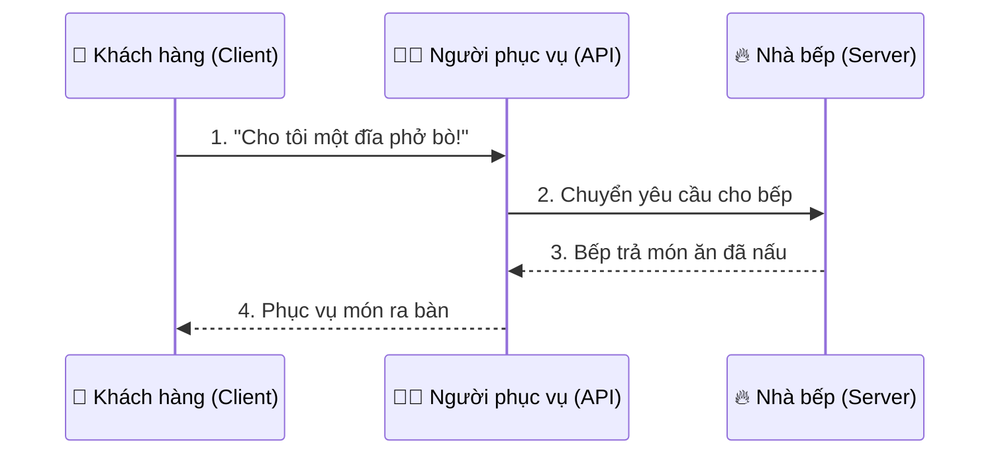
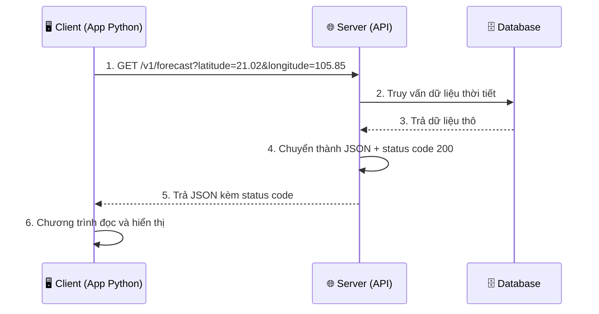

<!-- TỰ ĐỘNG ĐỒNG BỘ từ 03-Thuc-Chien/05-API/bai.md — đừng sửa trực tiếp, sửa bản chính rồi chạy tools/sync_tracks.py -->

# Bài 34 — API – Giao Tiếp Giữa Các Chương Trình

> 🎓 **Chương 10 – Dữ liệu và mạng**
> Bài 33 bạn đã học lưu dữ liệu vào file CSV — dữ liệu nằm ngay trên máy mình. Bài này mở ra cánh cửa lớn hơn: lấy dữ liệu từ **các dịch vụ trên Internet** qua **API**. Đây là kỹ thuật nền tảng để viết app thời tiết, chatbot, app đặt đồ ăn, gọi AI... Bài này **học lý thuyết**; bài 35 sẽ học cách thực sự gọi API bằng Python.

## 🧠 Điều kiện tiên quyết

- [Bài 20 — Module Trong Python](../../Phan-1-Co-Ban/20-Module/bai.md)
- [Bài 32 — JSON – Ngôn Ngữ Lưu Trữ Dữ Liệu](../03-JSON/bai.md)

---

## 🎯 Mục tiêu

Sau bài học này, học viên sẽ:

* ✅ Hiểu **API là gì** qua ví dụ đời thực (nhà hàng, thực đơn, người phục vụ).
* ✅ Biết **REST** là bộ quy ước giao tiếp phổ biến trên web.
* ✅ Phân biệt được 4 **phương thức HTTP**: `GET`, `POST`, `PUT`, `DELETE`.
* ✅ Đọc được **URL / endpoint** và hiểu ý nghĩa từng thành phần.
* ✅ Nhận biết các **mã trạng thái (status code)** thường gặp: 200, 201, 400, 404, 500...
* ✅ Hiểu **JSON** là định dạng phản hồi phổ biến của API.
* ✅ Mô tả được **luồng giao tiếp** Client → Server → Database qua sơ đồ.
* ✅ Nhận diện API thời tiết **Open-Meteo** — ví dụ thực tế dùng xuyên 2 bài tiếp.

---

## 📖 Kiến thức

### 1. Nhắc nhẹ bài trước — dữ liệu ở đâu?

Bài 32–33 bạn làm việc với **file cục bộ**: đọc JSON, ghi CSV ngay trên máy tính. Nhưng trong thực tế, dữ liệu thường ở **máy chủ xa** (server): thời tiết thuộc về trạm khí tượng, giá vàng thuộc về ngân hàng, tên lửa thuộc về NASA... Làm sao chương trình của bạn xin được dữ liệu đó? Câu trả lời: **gọi API**.

### 2. API là gì?

> 💬 **Nói đơn giản:** **API** (Application Programming Interface — Giao diện lập trình ứng dụng) là **người phục vụ trung gian** giúp hai chương trình nói chuyện với nhau mà không cần biết bên trong nhau hoạt động thế nào.

**🏪 Ví dụ đời thực — Nhà hàng:**

Bạn là **khách hàng (client)**, nhà bếp là **máy chủ (server)**:



* 🧑🍳 **Người phục vụ** chính là **API**: bạn không đi thẳng vào bếp, không cần biết bếp nấu bằng nồi gì.
* 📋 **Thực đơn** là **danh sách API** (endpoint): chỉ được gọi những món có trong thực đơn.
* 💬 **Ngôn ngữ chung** là **HTTP**: mọi nhà hàng, mọi khách đều hiểu quy ước này.

**Máy tính gọi API:**
* 📱 App thời tiết trên điện thoại gọi API của trạm khí tượng → nhận nhiệt độ.
* 🛒 App Shopee gọi API của ngân hàng để kiểm tra thanh toán.
* 🤖 ChatGPT gọi API để gửi câu hỏi và nhận câu trả lời.

### 3. REST là gì?

**REST** (Representational State Transfer) là **bộ quy tắc thiết kế API** được web dùng rộng rãi nhất. API tuân theo REST gọi là **RESTful API**.

| Quy tắc | Ý nghĩa |
|---|---|
| 📍 Mỗi tài nguyên có một **URL** riêng | `hoc_sinh`, `san_pham`, `don_hang` |
| 🔧 Tài nguyên được thao tác bằng **phương thức HTTP** | GET đọc, POST tạo, PUT sửa, DELETE xóa |
| 📦 Dữ liệu trao đổi bằng **JSON** | nhẹ, dễ đọc, ai cũng parse được |
| 🚦 Mỗi yêu cầu đều có **status code** báo kết quả | thành công hay thất bại |

> 🏪 Nhà hàng: thực đơn + người phục vụ + quy tắc đặt món chính là một "REST" của nhà hàng — quy tắc chung để mọi khách dùng được.

### 4. Phương thức HTTP — 4 hành động chính

| Phương thức | Hành động | Ví dụ nhà hàng | Dùng khi |
|---|---|---|---|
| **GET** | Lấy dữ liệu | "Cho xem thực đơn" | Đọc, không thay đổi gì |
| **POST** | Tạo dữ liệu mới | "Tạo đơn đặt món mới" | Thêm mới |
| **PUT** | Cập nhật toàn bộ | "Đổi toàn bộ món trong đơn" | Sửa |
| **DELETE** | Xóa dữ liệu | "Hủy đơn" | Xóa |

> 💡 Nhớ mẹo: **GET** giống người đưa **thư đi lấy hàng về**; **POST** giống người đưa **thư đi gửi hàng đi** — một cái kéo dữ liệu về, một cái đẩy dữ liệu lên.

### 5. URL và Endpoint

**Endpoint** = địa chỉ một "món ăn" cụ thể trong thực đơn API. **URL** là chuỗi địa chỉ đầy đủ để truy cập nó.

Ví dụ URL API thời tiết Open-Meteo (miễn phí, không cần khóa API):

```
https://api.open-meteo.com/v1/forecast?latitude=21.0285&longitude=105.8542&current_weather=true
```

| Thành phần | Trong ví dụ | Ý nghĩa |
|---|---|---|
| 🔒 Giao thức | `https://` | Hội thoại an toàn, mã hóa |
| 🌐 Tên miền | `api.open-meteo.com` | Máy chủ nào đang được gọi |
| 🛣️ Đường dẫn | `/v1/forecast` | Endpoint: "món" nào trong thực đơn |
| ❓ Dấu hỏi | `?` | Bắt đầu phần tham số |
| 🎛️ Tham số | `latitude=21.0285&longitude=105.8542&current_weather=true` | "Gia vị": tọa độ, muốn gì (các cặp `khóa=giá trị` ngăn cách bằng `&`) |

> 💬 **Ví dụ đời thực:** URL giống như **địa chỉ giao đồ ăn đầy đủ**: tên quán (tên miền) + tên món (endpoint) + ghi chú "ít cay, nhiều rau" (tham số).

### 6. Status code — "mã trạng thái" của phản hồi

Mỗi phản hồi từ máy chủ đều kèm một con số 3 chữ số báo kết quả. Giống như câu "món của bạn đang nấu" hay "món này hết rồi" của nhà hàng.

| Mã | Nhóm | Ý nghĩa | Ví dụ |
|---|---|---|---|
| **200** | ✅ 2xx – Thành công | OK, có dữ liệu | Lấy được thời tiết |
| **201** | ✅ 2xx – Thành công | Đã tạo mới | Tạo tài khoản thành công |
| **400** | ❌ 4xx – Lỗi của bạn | Yêu cầu sai cú pháp | Thiếu tham số bắt buộc |
| **401** | ❌ 4xx – Lỗi của bạn | Chưa đăng nhập | Thiếu API key |
| **403** | ❌ 4xx – Lỗi của bạn | Bị cấm truy cập | Thiếu User-Agent (bài 35!) |
| **404** | ❌ 4xx – Lỗi của bạn | Không tìm thấy | Sai endpoint, sai id |
| **500** | ❌ 5xx – Lỗi máy chủ | Server hỏng | Hệ thống ngân hàng sập |

> 🏪 Nhà hàng: `200` = "phở đây rồi", `201` = "đơn đã tạo", `400` = "bạn gọi món không có trong thực đơn", `404` = "quán không có món đó", `500` = "bếp đang cháy".

### 7. JSON response — câu trả lời của máy chủ

Máy chủ trả dữ liệu dạng **JSON** (đã học bài 32!) — chuỗi văn bản có cấu trúc. Ví dụ Open-Meteo trả về thời tiết Hà Nội:

```json
{
  "latitude": 21.0285,
  "longitude": 105.8542,
  "current_weather": {
    "temperature": 30.2,
    "windspeed": 11.5,
    "weathercode": 1,
    "time": "2026-08-05T09:00"
  }
}
```

* `temperature: 30.2` — nhiệt độ hiện tại 30.2°C.
* `windspeed: 11.5` — gió 11.5 km/h.
* `weathercode: 1` — mã thời tiết (1 = trời hơi có mây).
* Cấu trúc **lồng nhau**: `current_weather` chứa thêm các giá trị bên trong — giống dict trong dict (bài 17, 32).

### 8. Sơ đồ luồng gọi API đầy đủ



> 💡 **Client** = chương trình của bạn (điện thoại, app, trình duyệt...). **Server** = máy tính "biết" dữ liệu. **Database** = nơi cất giữ dữ liệu. Bạn chỉ "nói chuyện" với server; server lo phần kho dữ liệu của nó.

### 9. Ví dụ thực tế: Open-Meteo

**Open-Meteo** là dịch vụ thời tiết miễn phí, không cần đăng ký khóa (API key) — rất hợp để học:

* 📍 Cho tọa độ (vĩ độ `latitude`, kinh độ `longitude`) → nhận thời tiết tại đó.
* 🌏 Hà Nội: `latitude=21.0285`, `longitude=105.8542`.
* 🧪 Muốn thêm tham số `current_weather=true` để lấy thời tiết hiện tại.
* 🔗 Có thể thử ngay trên trình duyệt bằng cách dán URL vào thanh địa chỉ — trình duyệt chính là một "client".

> ⚠️ **Bài này chưa viết code gọi API** — bạn vừa thấy khái niệm URL, JSON, status code. Sang bài 35, ta sẽ dùng thư viện `requests` để gọi đúng URL trên từ Python và xử lý JSON.

### 10. Khái niệm bổ sung — headers và API key

* 📋 **Headers** — "phong bì thư" của yêu cầu: gửi kèm thông tin như tên client (`User-Agent`), loại dữ liệu chấp nhận... Một số server từ chối (403) yêu cầu không có `User-Agent`.
* 🔑 **API key** — "thẻ thành viên" nhà hàng: một số API (Google Maps, ChatGPT...) yêu cầu đăng ký để lấy khóa rồi gửi kèm mỗi yêu cầu. Open-Meteo **không cần** key — lý tưởng cho bài tập.

---

## 💡 Ví dụ minh họa

### Ví dụ 1: Đọc URL như đọc "thực đơn"

```python
# Một URL API thời tiết (bài 35 sẽ gọi thật)
url = "https://api.open-meteo.com/v1/forecast?latitude=21.0285&longitude=105.8542&current_weather=true"

# Tách URL thành 2 phần: địa chỉ và tham số
vi_tri_hoi = url.index("?")            # vị trí dấu chấm hỏi
phan_1, phan_2 = url.split("?")        # ["https://...forecast", "latitude=..."]

print("Endpoint:", phan_1)             # phần trước dấu ?
print("Tham so :", phan_2)             # phần sau dấu ?
```

Kết quả:

```
Endpoint: https://api.open-meteo.com/v1/forecast
Tham so : latitude=21.0285&longitude=105.8542&current_weather=true
```

**Giải thích từng dòng:**

| Dòng | Ý nghĩa |
|---|---|
| `url.split("?")` | Cắt URL tại dấu `?` thành 2 phần (chuỗi — bài 18) |
| `phan_1` | Địa chỉ endpoint: máy chủ + đường dẫn |
| `phan_2` | Chuỗi tham số: 3 cặp `khóa=giá trị` ngăn cách `&` |

### Ví dụ 2: Đọc phản hồi JSON bằng `json.loads`

```python
import json

# Chuỗi JSON mô phỏng phản hồi API thời tiết (bài 35 sẽ nhận thật từ server)
phong_hoi = '''{
    "current_weather": {
        "temperature": 30.2,
        "windspeed": 11.5,
        "weathercode": 1
    }
}'''

du_lieu = json.loads(phong_hoi)                      # chuỗi JSON -> dict

nhiet_do = du_lieu["current_weather"]["temperature"]  # truy cập tầng 1 -> tầng 2
print(f"Ha Noi: {nhiet_do}°C")
```

Kết quả:

```
Ha Noi: 30.2°C
```

**Giải thích từng dòng:**

| Dòng | Ý nghĩa |
|---|---|
| `json.loads(phong_hoi)` | Biến chuỗi JSON thành dict Python (bài 32) |
| `du_lieu["current_weather"]` | Lấy dict con — tầng thứ nhất |
| `["temperature"]` | Lấy giá trị bên trong dict con — tầng thứ hai |

### Ví dụ 3: Mô phỏng "người phục vụ API"

```python
# Mô phỏng máy chủ thời tiết: nhận tọa độ, trả dữ liệu (thật sẽ là gọi mạng)
def phuc_vu_thoi_tiet(kinh_do, vi_do):
    if not (-90 <= vi_do <= 90) or not (-180 <= kinh_do <= 180):
        return 400, {"error": "Toa do khong hop le"}     # mô phỏng status 400
    return 200, {"temperature": 30.2, "city": "Ha Noi"}  # mô phỏng status 200

status, du_lieu = phuc_vu_thoi_tiet(105.8542, 21.0285)
print("Status:", status)
print("Du lieu:", du_lieu)
```

Kết quả:

```
Status: 200
Du lieu: {'temperature': 30.2, 'city': 'Ha Noi'}
```

**Giải thích từng dòng:**

| Dòng | Ý nghĩa |
|---|---|
| `if not (-90 <= vi_do <= 90)...` | Kiểm tra tọa độ hợp lệ, nếu sai trả về 400 |
| `return 200, {...}` | Server luôn trả 2 thứ: status code + dữ liệu JSON |
| `status, du_lieu = ...` | Giải nén 2 giá trị trả về — kỹ thuật gặp lại ở bài 35 |

---

## 🔬 Ví dụ nâng cao

### Ví dụ 1: Phân tích phản hồi JSON lồng nhau đầy đủ

```python
import json

# Phản hồi mô phỏng (đúng định dạng Open-Meteo trả về)
phong_hoi = '''{
    "latitude": 21.0285,
    "longitude": 105.8542,
    "timezone": "Asia/Bangkok",
    "current_weather": {
        "temperature": 30.2,
        "windspeed": 11.5,
        "weathercode": 1,
        "time": "2026-08-05T09:00"
    }
}'''

thoi_tiet = json.loads(phong_hoi)
cw = thoi_tiet["current_weather"]          # rút gọn biến cục bộ
print(f"Thoi diem : {cw['time']}")
print(f"Nhiet do  : {cw['temperature']}°C")
print(f"Gio       : {cw['windspeed']} km/h")
print(f"Ma thoi tiet: {cw['weathercode']}")
```

> 🏪 **Tình huống thực tế:** App thời tiết không cần hiểu bảng dữ liệu khí tượng — chỉ cần gọi API, nhận JSON, rút các giá trị cần thiết và hiển thị. Toàn bộ kỹ năng đọc JSON bạn có từ bài 32–34 là đủ!

### Ví dụ 2: "Nhà hàng API" — mô phỏng đủ 4 phương thức

```python
# Cơ sở dữ liệu mô phỏng của nhà hàng
thuc_don = [
    {"id": 1, "ten": "Pho bo", "gia": 50000},
    {"id": 2, "ten": "Bun cha", "gia": 45000},
]

def phuc_vu(phuong_thuc, du_lieu=None):
    """Mô phỏng server xử lý theo phương thức HTTP."""
    if phuong_thuc == "GET":            # xem thực đơn
        return 200, thuc_don
    if phuong_thuc == "POST":           # thêm món mới
        mon_moi = {"id": len(thuc_don) + 1, **du_lieu}
        thuc_don.append(mon_moi)
        return 201, mon_moi
    if phuong_thuc == "DELETE":         # xóa món
        mon = du_lieu
        thuc_don.remove(mon)
        return 200, {"da_xoa": mon["ten"]}
    return 405, {"error": "Phuong thuc khong ho tro"}

print(phuc_vu("GET"))
print(phuc_vu("POST", {"ten": "Com tam", "gia": 60000}))
print(phuc_vu("DELETE", thuc_don[1]))
```

> 💡 Mỗi phương thức trả **status code khác nhau**: GET→200, POST→201 (created!), DELETE→200. Đây chính là "ngôn ngữ" server dùng để báo kết quả.

### Ví dụ 3: Kiểm tra status code trước khi đọc dữ liệu

```python
# Mô phỏng: server trả về status code + chuỗi JSON (thật sẽ từ requests)
def nhan_phong_hoi():
    return 404, '{"error": "Khong tim thay thanh pho"}'

status, chuoi_json = nhan_phong_hoi()
if status == 200:
    print("Thanh cong! Doc du lieu...")
else:
    print(f"Loi {status}: khong doc du lieu")
```

> ⚠️ **Nguyên tắc vàng:** luôn kiểm tra status code trước, đọc dữ liệu sau. Bài 35 sẽ dùng đúng nguyên tắc này với `response.status_code`.

---

## ⚠️ Lỗi thường gặp

### Lỗi 1: Nhầm lẫn API với website

* **Sai:** gọi `https://open-meteo.com` (trang chủ) và mong nhận JSON thời tiết.
* **Đúng:** endpoint dữ liệu là `https://api.open-meteo.com/v1/forecast?...` — phải đúng máy chủ `api.` và đúng đường dẫn `/v1/forecast`.
* **Cách sửa:** đọc kỹ tài liệu (documentation) của API — "thực đơn" chính thức.

### Lỗi 2: Quên dấu `?` và `&` khi nối tham số

* **Sai:** `...forecast&latitude=21.02` — phải có `?` trước tham số đầu tiên.
* **Đúng:** `...forecast?latitude=21.02&longitude=105.85` — `?` trước tham số đầu, `&` giữa các tham số sau.
* **Cách sửa:** dùng tham số `params` của thư viện requests (bài 35) — khỏi lo lỗi nối chuỗi.

### Lỗi 3: Không đọc status code

* **Sai:** nhận phản hồi 404 vẫn cố đọc dữ liệu JSON → sai vì 404 thường không có dữ liệu.
* **Đúng:** kiểm tra `status_code == 200` trước khi đọc nội dung.
* **Cách sửa:** luôn xử lý theo trạng thái, như ví dụ nâng cao 3.

### Lỗi 4: Giữ API key trong code công khai

* **Sai:** dán API key (nếu có) thẳng vào file code rồi đưa lên GitHub.
* **Đúng:** lưu trong biến môi trường hoặc file cấu hình bí mật.
* **Cách sửa:** không bao giờ commit khóa bí mật; học cách dùng `os.environ` (bài 38).

### Lỗi 5: Gọi API không có User-Agent

* **Nguyên nhân:** một số server (như httpbin) từ chối yêu cầu "vô danh", trả **403**.
* **Cách sửa:** gửi kèm header `User-Agent` — sẽ học chi tiết ở bài 35.

---

## 💎 Mẹo

* 🏪 **Nhà hàng = API:** thực đơn = danh sách endpoint, phục vụ = lời gọi API, món ăn = dữ liệu, câu trả lời của bếp = status code.
* 🔗 **Mẹo thử API ngay:** dán URL API vào **trình duyệt** — trình duyệt là client, bạn thấy JSON và status ngay mà không cần code.
* 📚 **Đọc tài liệu trước khi gọi:** mọi API đều có tài liệu (docs) liệt kê endpoint, tham số, status code — "thực đơn chính thức".
* 🚦 **Ghi nhớ status code quan trọng:** 200, 201, 400, 401, 403, 404, 500 — 7 con số này gặp hàng ngày.
* 🔑 **Ưu tiên API miễn phí không key khi học:** Open-Meteo là lựa chọn hoàn hảo để thực hành.
* 🌐 **Phân biệt:** API trả **dữ liệu** (JSON), website trả **giao diện** (HTML) — đừng mong API về trang đẹp.

---

## 📝 Tóm tắt

| Khái niệm | Ý nghĩa |
|---|---|
| 🌐 API | Người phục vụ trung gian giữa client và server |
| 🏪 Ví dụ nhà hàng | Khách đặt món → phục vụ → bếp → mang ra bàn |
| 🧱 REST | Bộ quy tắc thiết kế API phổ biến |
| 📖 GET | Lấy dữ liệu (đọc thực đơn) |
| ➕ POST | Tạo dữ liệu mới (đặt món) |
| ✏️ PUT | Cập nhật (đổi món) |
| 🗑️ DELETE | Xóa (hủy đơn) |
| 🔗 Endpoint | URL của một tài nguyên trong API |
| 🚦 Status code | Con số báo kết quả: 200, 201, 400, 404, 500... |
| 📦 JSON | Định dạng phản hồi của API |
| 🗄️ Luồng giao tiếp | Client → Server → Database → về Client |

---

## 🧪 Kiểm tra nhanh

1. ❓ API là gì? Giải thích qua ví dụ nhà hàng.
2. ❓ REST là gì? Kể 4 phương thức HTTP cơ bản.
3. ❓ GET và POST khác nhau thế nào?
4. ❓ Trong URL `https://api.open-meteo.com/v1/forecast?latitude=21.02&longitude=105.85`, đâu là endpoint, đâu là tham số?
5. ❓ Status code 200, 201, 400, 404, 500 lần lượt có nghĩa gì?
6. ❓ API trả dữ liệu ở định dạng nào?
7. ❓ Client và Server khác nhau ra sao?
8. ❓ Sắp xếp đúng luồng gọi API: Database trả dữ liệu, Client gửi yêu cầu, Server trả JSON, Server truy vấn Database.
9. ❓ Vì sao nói Open-Meteo rất hợp để học API?
10. ❓ Trước khi đọc dữ liệu phản hồi, ta nên kiểm tra gì trước?

<details>
<summary>🔍 Xem đáp án</summary>

1. API là người phục vụ trung gian giúp hai chương trình trao đổi dữ liệu; khách không cần biết bếp hoạt động thế nào.
2. Bộ quy tắc thiết kế API; GET, POST, PUT, DELETE.
3. GET lấy dữ liệu về, không thay đổi gì; POST đẩy dữ liệu lên để tạo mới.
4. Endpoint: `https://api.open-meteo.com/v1/forecast`; tham số: `latitude=21.02&longitude=105.85`.
5. 200 OK, 201 đã tạo mới, 400 lỗi yêu cầu của client, 404 không tìm thấy, 500 lỗi máy chủ.
6. JSON.
7. Client là chương trình gửi yêu cầu (app, trình duyệt); Server là máy chủ có dữ liệu và xử lý yêu cầu.
8. Client gửi yêu cầu → Server truy vấn Database → Database trả dữ liệu → Server trả JSON.
9. Miễn phí, không cần API key, dữ liệu thật có thể thử bằng trình duyệt.
10. Kiểm tra status code (thường là 200) trước khi đọc nội dung JSON.

</details>

---

## 📚 Bài đọc thêm

* [MDN – HTTP response status codes](https://developer.mozilla.org/en-US/docs/Web/HTTP/Status)
* [MDN – HTTP request methods](https://developer.mozilla.org/en-US/docs/Web/HTTP/Methods)
* [Wikipedia – API](https://vi.wikipedia.org/wiki/API)
* [Open-Meteo – tài liệu chính thức](https://open-meteo.com/en/docs)
* [REST API Tutorial](https://restfulapi.net/)

---

---

## 🧩 Bài tập

> 📝 🌐 **Chương 10 – Dữ liệu và mạng**

## 🟢 Dễ (Bài 1 – 7)

### Bài 1: In bảng 4 phương thức HTTP

* **Đề bài:** Viết chương trình in ra bảng 4 phương thức HTTP: `GET`, `POST`, `PUT`, `DELETE` kèm hành động tương ứng (Lấy, Tạo, Sửa, Xóa).
* **Input:** Không có.
* **Output:**
  ```
  GET - Lấy dữ liệu
  POST - Tạo dữ liệu mới
  PUT - Cập nhật dữ liệu
  DELETE - Xóa dữ liệu
  ```
* **Gợi ý:** Danh sách các tuple `(ten, hanh_dong)` + vòng lặp `for`.

### Bài 2: Tách URL thành endpoint và tham số

* **Đề bài:** Cho URL `"https://api.open-meteo.com/v1/forecast?latitude=21.0285&longitude=105.8542&current_weather=true"`. Dùng `split("?")` tách thành endpoint và phần tham số, in cả hai.
* **Input:** URL cho sẵn.
* **Output:** Hai dòng: `Endpoint: ...` và `Tham so: ...`.
* **Gợi ý:** `url.split("?")` trả list 2 phần tử; gán lần lượt cho hai biến.

### Bài 3: In thực đơn của "API nhà hàng"

* **Đề bài:** Mô phỏng thực đơn nhà hàng bằng list dict (khóa `ten`, `gia`). In từng món dạng `1. Pho bo - 50000 dong`.
* **Input:** 3 món: `Pho bo` 50000, `Bun cha` 45000, `Com tam` 60000.
* **Output:** 3 dòng thực đơn như trên.
* **Gợi ý:** `enumerate(mon_an, start=1)` để có số thứ tự.

### Bài 4: Giải thích status code

* **Đề bài:** Viết hàm `y_nghia(ma)` nhận một status code (int) và trả về chuỗi giải thích: `200` → `"Thanh cong (OK)"`, `201` → `"Da tao moi"`, `400` → `"Loi yeu cau"`, `404` → `"Khong tim thay"`, `500` → `"Loi may chu"`, còn lại → `"Khong ro"`. In kết quả của 6 mã.
* **Input:** Lần lượt gọi với `200, 201, 400, 404, 500, 302`.
* **Output:** 6 dòng giải thích tương ứng.
* **Gợi ý:** Dùng `if/elif/else`; 302 không nằm trong danh sách nên trả `"Khong ro"`.

### Bài 5: Đọc JSON mô phỏng phản hồi thời tiết

* **Đề bài:** Chuỗi JSON mô phỏng phản hồi của Open-Meteo chứa `temperature` và `windspeed`. Dùng `json.loads` để đọc, in nhiệt độ và tốc độ gió.
* **Input:** `'{"temperature": 30.2, "windspeed": 11.5}'`.
* **Output:**
  ```
  Nhiet do: 30.2°C
  Gio: 11.5 km/h
  ```
* **Gợi ý:** `import json`; `json.loads(chuoi)` trả dict, lấy theo khóa.

### Bài 6: Bắt lỗi JSON hỏng

* **Đề bài:** Cho chuỗi JSON hỏng `'{"ten": "An", "diem": }'` (thiếu giá trị). Viết chương trình dùng `try/except` bắt lỗi `json.JSONDecodeError` và in `"JSON loi"` thay vì để chương trình sập.
* **Input:** Chuỗi JSON hỏng cho sẵn.
* **Output:** `JSON loi: ...` (không được sập chương trình).
* **Gợi ý:** Đặt `json.loads(chuoi)` trong khối `try`, in thông báo trong `except`.

### Bài 7: Mô phỏng "máy chủ" trả dữ liệu có status code

* **Đề bài:** Viết hàm `phuc_vu(mon)` mô phỏng máy chủ nhà hàng: nếu món nằm trong thực đơn trả về `(200, "Co mon: <ten>")`, ngược lại trả về `(404, "Khong co mon: <ten>")`. In kết quả khi gọi với món có và món không có.
* **Input:** Thực đơn gồm `"Pho bo", "Bun cha"`; gọi với `"Pho bo"` và `"Banh my"`.
* **Output:** 2 dòng kèm status code 200 và 404.
* **Gợi ý:** Kiểm tra `mon in thuc_don`; trả tuple hai giá trị rồi giải nén khi in.

---

## 🟡 Trung bình (Bài 8 – 14)

### Bài 8: Mô phỏng GET — tìm học sinh theo mã số

* **Đề bài:** "Máy chủ" quản lý danh sách học sinh (list dict `id`, `ten`, `lop`). Viết hàm `get_hoc_sinh(id)` mô phỏng `GET`: tìm theo id, trả `(200, dict)` nếu có, `(404, None)` nếu không. In kết quả cho id có và id không có.
* **Input:** Danh sách 3 học sinh; gọi với `id=2` và `id=99`.
* **Output:** Kết quả 200 kèm thông tin, và 404.
* **Gợi ý:** Vòng `for` duyệt danh sách; `if hs["id"] == id: return 200, hs`.

### Bài 9: Mô phỏng POST — thêm học sinh mới

* **Đề bài:** Viết hàm `post_hoc_sinh(ds, ten, lop)` mô phỏng `POST`: tự sinh id mới (id lớn nhất + 1), thêm vào danh sách, trả về `(201, dict_moi)`. Gọi thử và in danh sách sau khi thêm.
* **Input:** Danh sách ban đầu 2 học sinh (id 1, 2); thêm `"Dung", "10A2"`.
* **Output:** Status `201` + thông tin học sinh mới (id 3), sau đó in lại toàn bộ danh sách.
* **Gợi ý:** `max(hs["id"] for hs in ds) + 1` để sinh id; dùng `append`.

### Bài 10: Mô phỏng PUT — cập nhật điểm

* **Đề bài:** Viết hàm `put_diem(ds, id, diem_moi)` mô phỏng `PUT`: tìm học sinh theo id, sửa điểm, trả `(200, hs)`; không tìm thấy trả `(404, None)`. Gọi thử với id có và không có.
* **Input:** Danh sách học sinh có cột `diem`; sửa id 1 thành 10.
* **Output:** In kết quả 200 kèm thông tin sau sửa, và 404 cho id lạ.
* **Gợi ý:** Sau khi tìm thấy, gán `hs["diem"] = diem_moi` rồi trả về — danh sách gốc tự thay đổi.

### Bài 11: Mô phỏng DELETE — xóa học sinh

* **Đề bài:** Viết hàm `delete_hoc_sinh(ds, id)` mô phỏng `DELETE`: tìm và xóa khỏi danh sách, trả `(200, "Da xoa")`; không tìm thấy trả `(404, None)`. Gọi thử và in danh sách còn lại.
* **Input:** Danh sách 3 học sinh; xóa id 2.
* **Output:** `200` kèm thông báo, sau đó in danh sách chỉ còn 2 học sinh.
* **Gợi ý:** Dùng `list.remove(hs)` sau khi tìm thấy; có thể tạo danh sách mới bằng comprehension.

### Bài 12: Mô phỏng API thời tiết với tọa độ không hợp lệ

* **Đề bài:** Viết hàm `thoi_tiet(kinh_do, vi_do)` mô phỏng Open-Meteo: nếu vĩ độ ngoài khoảng `-90..90` hoặc kinh độ ngoài `-180..180`, trả `(400, {"error": "Toa do khong hop le"})`; ngược lại trả `(200, {"temperature": 30.2})`. Gọi thử cả hai trường hợp.
* **Input:** `(105.85, 21.03)` và `(105.85, 91)`.
* **Output:** Status 200 và 400 kèm dữ liệu tương ứng.
* **Gợi ý:** Điều kiện: `not (-90 <= vi_do <= 90) or not (-180 <= kinh_do <= 180)`.

### Bài 13: Đọc JSON phản hồi lồng nhau

* **Đề bài:** Chuỗi JSON mô phỏng phản hồi Open-Meteo: `{"current_weather": {"temperature": 30.2, "windspeed": 11.5, "time": "2026-08-05T09:00"}, "timezone": "Asia/Bangkok"}`. Dùng `json.loads`, in thời điểm, nhiệt độ, gió và múi giờ.
* **Input:** Chuỗi JSON cho sẵn.
* **Output:** 4 dòng thông tin.
* **Gợi ý:** Truy cập hai tầng: `du_lieu["current_weather"]["temperature"]`.

### Bài 14: Kiểm tra status trước khi đọc dữ liệu

* **Đề bài:** Viết hàm `xu_ly(status, chuoi_json)` nhận status code và chuỗi JSON: nếu status là 200, dùng `json.loads` và in dữ liệu; nếu 400 in `"Loi: yeu cau sai"`; nếu 404 in `"Loi: khong tim thay"`; nếu 500 in `"Loi: may chu"`. Gọi thử với cả 4 trường hợp.
* **Input:** Lần lượt gọi với `(200, '{"ok": true}')`, `(400, "{}")`, `(404, "{}")`, `(500, "{}")`.
* **Output:** 4 dòng thông báo tương ứng.
* **Gợi ý:** Dùng `if/elif/else`; chỉ `json.loads` trong nhánh 200.

---

## 🔴 Khó (Bài 15 – 20)

### Bài 15: Xây dựng "mini API" quản lý thư viện

* **Đề bài:** Xây dựng "máy chủ thư viện" mô phỏng đủ 4 phương thức: `GET` trả danh sách sách; `POST` thêm sách (id tự tăng); `PUT` sửa giá theo id; `DELETE` xóa theo id. Viết hàm `phuc_vu(phuong_thuc, du_lieu)` xử lý cả bốn, mỗi thành công trả status đúng (GET 200, POST 201, PUT 200, DELETE 200), thất bại trả 404.
* **Input:** Danh sách 2 sách (`id`, `ten`, `gia`); gọi thử GET, POST, PUT, DELETE.
* **Output:** Kết quả từng lệnh kèm status; sau mỗi lệnh ghi chú trạng thái danh sách.
* **Gợi ý:** Dùng `if phuong_thuc == "GET":` cho từng nhánh; tách phần tìm theo id thành hàm nhỏ `tim_sach(ds, id)` để tái sử dụng.

### Bài 16: API thời tiết nâng cao — kiểm tra dữ liệu lỗi từ server

* **Đề bài:** Viết hàm `thoi_tiet_an_toan(chuoi_json)` nhận chuỗi JSON mô phỏng phản hồi. Dùng `try/except`: nếu JSON hỏng, trả `(500, "JSON loi")`; nếu JSON không có khóa `current_weather`, trả `(400, "Thieu current_weather")`; nếu hợp lệ, trả `(200, nhiet_do)`. Gọi thử 3 tình huống.
* **Input:** Chuỗi hợp lệ, chuỗi thiếu khóa, chuỗi JSON hỏng.
* **Output:** 3 kết quả tương ứng.
* **Gợi ý:** `if "current_weather" not in du_lieu:`; bắt `json.JSONDecodeError` trong `except`.

### Bài 17: Tự tạo URL từ tham số

* **Đề bài:** Viết hàm `tao_url(endpoint, tham_so)` nhận endpoint (str) và dict tham số (ví dụ `{"latitude": 21.03, "longitude": 105.85, "current_weather": True}`), trả về URL đúng chuẩn: endpoint + `?` + các cặp `khóa=giá trị` ngăn cách `&` (giá trị True chuyển thành `true`).
* **Input:** Endpoint `"https://api.open-meteo.com/v1/forecast"` và dict trên.
* **Output:** URL hoàn chỉnh đúng thứ tự khai báo.
* **Gợi ý:** Tạo list chuỗi `f"{k}={str(v).lower()}"` cho từng cặp, nối bằng `"&"`; giá trị boolean cần `str(...).lower()` để thành `true`.

### Bài 18: Phân tích phản hồi nhiều tầng và xử lý thiếu khóa

* **Đề bài:** Chuỗi JSON mô phỏng phản hồi Open-Meteo có thể **thiếu** khóa `daily` (ngày mưa). Viết chương trình đọc: nếu có `daily`, in tổng số ngày và nhiệt độ trung bình tối thiểu; nếu thiếu, in `"Khong co du lieu ngay"`. Dùng `.get()` để xử lý an toàn.
* **Input:**
  ```json
  {"daily": {"time": ["2026-08-01", "2026-08-02"], "temperature_2m_min": [25.1, 24.8]}}
  ```
  và bản thiếu `daily`.
* **Output:** Thông tin tính được hoặc thông báo thiếu.
* **Gợi ý:** `du_lieu.get("daily")` trả `None` khi thiếu; dùng `sum(...) / len(...)`.

### Bài 19: So sánh dữ liệu từ hai "API" thời tiết

* **Đề bài:** Viết hàm `lay_nhiet_do(chuoi_json)` nhận chuỗi JSON phản hồi mô phỏng của một thành phố, trả về `(ten_thanh_pho, nhiet_do)` hoặc `None` nếu lỗi. Dùng nó để so sánh nhiệt độ Hà Nội và TP.HCM (2 chuỗi JSON cho sẵn), in thành phố nào nóng hơn.
* **Input:** 2 chuỗi JSON: `{"city": "Ha Noi", "temperature": 30.2}` và `{"city": "TP HCM", "temperature": 33.5}`.
* **Output:** `TP HCM nong hon Ha Noi (33.5 vs 30.2)` hoặc tương tự.
* **Gợi ý:** Hàm trả tuple; so sánh `nhiet_do_1 > nhiet_do_2` và in câu phù hợp.

### Bài 20: Hệ thống "API quản lý điểm" hoàn chỉnh (Mini Project)

* **Đề bài:** Xây dựng hệ thống mô phỏng API quản lý điểm trường học:
  1. Danh sách ban đầu 4 học sinh (`id`, `ten`, `diem`).
  2. Hàm `phuc_vu(phuong_thuc, du_lieu)` hỗ trợ: `GET` danh sách, `GET id` một học sinh (404 nếu không có), `POST` thêm (201, id tự tăng), `PUT` sửa điểm (200/404), `DELETE` xóa (200/404).
  3. Sau đó chạy một "kịch bản" tuần tự: GET tất cả → GET id 2 → POST thêm → PUT sửa → DELETE → GET tất cả, in kết quả từng bước kèm status code.
* **Input:** Kịch bản như trên.
* **Output:** Báo cáo từng bước kèm status và dữ liệu; danh sách cuối cùng đúng 4 học sinh sau khi thêm/xóa.
* **Gợi ý:** Đưa "máy chủ" (danh sách + hàm xử lý) vào một khối; tách hàm nhỏ `tim_hoc_sinh`; mỗi nhánh phương thức trả `(status, du_lieu)`; dùng `enumerate`/`max` cho id.

---

## 🎯 Tổng kết

Chúc mừng bạn đã hoàn thành 20 bài tập về API! Bạn đã luyện:

* ✅ 4 phương thức HTTP: GET, POST, PUT, DELETE qua các hàm mô phỏng.
* ✅ Đọc và hiểu URL: endpoint, tham số, `?`, `&`.
* ✅ Xử lý status code: 200, 201, 400, 404, 500.
* ✅ Phân tích JSON response (phẳng và lồng nhau) bằng `json.loads`.
* ✅ Viết code an toàn với `try/except` khi dữ liệu lỗi.


Giờ đã nắm vững lý thuyết, bạn sẽ học cách **gọi API thật** từ Python bằng thư viện `requests`:

---

## ✅ Đáp án

> 💡 **Hãy tự làm bài tập trước** rồi mới mở đáp án.

## 🟢 Dễ (Bài 1 – 7)


<details>
<summary>✅ Bài 1: In bảng 4 phương thức HTTP</summary>


**Phân tích:** Bốn phương thức HTTP và hành động tương ứng là dữ liệu dạng cặp giá trị — lưu vào list tuple.

**Ý tưởng:** Duyệt list tuple và in theo định dạng.

**Thuật toán:**
1. Tạo list `(ten, hanh_dong)` cho 4 phương thức.
2. Vòng `for` in từng cặp.

**Code:**

```python
# Danh sách 4 phương thức HTTP kèm hành động
phuong_thuc = [
    ("GET", "Lay du lieu"),
    ("POST", "Tao du lieu moi"),
    ("PUT", "Cap nhat du lieu"),
    ("DELETE", "Xoa du lieu"),
]

for ten, hanh_dong in phuong_thuc:
    print(f"{ten} - {hanh_dong}")
```

**Giải thích code:**
* Mỗi phần tử là tuple `(ten, hanh_dong)` — nhớ 4 phương thức HTTP là kiến thức cốt lõi của bài.
* `for ten, hanh_dong in phuong_thuc` — giải nén tuple trong vòng lặp.
* `f"{ten} - {hanh_dong}"` — f-string nối chuỗi (bài 18).

**Độ phức tạp:** O(1) — chỉ 4 phần tử cố định.

---

</details>

<details>
<summary>✅ Bài 2: Tách URL thành endpoint và tham số</summary>


**Phân tích:** URL có cấu trúc `endpoint?thamso` — dấu `?` là ranh giới.

**Ý tưởng:** `split("?")` cắt chuỗi tại dấu `?`.

**Thuật toán:**
1. Khai báo URL.
2. `split("?")` → list 2 phần tử.
3. In endpoint và tham số.

**Code:**

```python
# URL API thời tiết (bài 35 sẽ gọi thật bằng requests)
url = "https://api.open-meteo.com/v1/forecast?latitude=21.0285&longitude=105.8542&current_weather=true"

endpoint, tham_so = url.split("?")   # cắt tại dấu chấm hỏi

print("Endpoint:", endpoint)
print("Tham so :", tham_so)
```

**Giải thích code:**
* `url.split("?")` — trả list `["https://...forecast", "latitude=21.0285&..."]`.
* `endpoint, tham_so = ...` — giải nén đúng 2 phần tử.
* Tham số gồm các cặp `khóa=giá trị` ngăn cách bằng `&` — kỹ năng đọc URL cần thiết để tự tra tài liệu API.

**Độ phức tạp:** O(n) với n là độ dài URL.

---

</details>

<details>
<summary>✅ Bài 3: In thực đơn của "API nhà hàng"</summary>


**Phân tích:** Thực đơn là list dict; cần in kèm số thứ tự bắt đầu từ 1.

**Ý tưởng:** `enumerate(list, start=1)` tạo số thứ tự.

**Thuật toán:**
1. Tạo list 3 dict món ăn.
2. `enumerate` từ 1, in `stt. ten - gia dong`.

**Code:**

```python
# Thực đơn nhà hàng (mô phỏng dữ liệu từ server)
thuc_don = [
    {"ten": "Pho bo", "gia": 50000},
    {"ten": "Bun cha", "gia": 45000},
    {"ten": "Com tam", "gia": 60000},
]

for stt, mon in enumerate(thuc_don, start=1):
    print(f"{stt}. {mon['ten']} - {mon['gia']} dong")
```

**Giải thích code:**
* `enumerate(thuc_don, start=1)` — trả cặp `(số thứ tự, món)`; mặc định bắt đầu 0 nên phải `start=1`.
* `mon['ten']`, `mon['gia']` — truy cập khóa của dict (bài 17).

**Độ phức tạp:** O(n) với n là số món.

---

</details>

<details>
<summary>✅ Bài 4: Giải thích status code</summary>


**Phân tích:** Ánh xạ số → chuỗi; một số mã có thể không nằm trong danh sách — cần nhánh mặc định.

**Ý tưởng:** Hàm `y_nghia(ma)` với `if/elif/else`.

**Thuật toán:**
1. Định nghĩa hàm trả về chuỗi theo mã.
2. Gọi hàm với 6 mã và in.

**Code:**

```python
def y_nghia(ma):
    """Tra cứu ý nghĩa của một status code."""
    if ma == 200:
        return "Thanh cong (OK)"
    if ma == 201:
        return "Da tao moi"
    if ma == 400:
        return "Loi yeu cau"
    if ma == 404:
        return "Khong tim thay"
    if ma == 500:
        return "Loi may chu"
    return "Khong ro"          # mã chưa biết

# Kiểm tra các mã quan trọng
for ma in [200, 201, 400, 404, 500, 302]:
    print(f"{ma}: {y_nghia(ma)}")
```

**Giải thích code:**
* Mỗi `if` trả về ngay — không cần `elif` cũng đúng vì mỗi mã khác nhau.
* `return "Khong ro"` cuối cùng — bẫy mọi mã không nằm trong danh sách (302, 503...).
* Vòng lặp in 6 dòng: 302 không có trong bảng nên ra `"Khong ro"`.

**Độ phức tạp:** O(1) mỗi lần tra cứu.

---

</details>

<details>
<summary>✅ Bài 5: Đọc JSON mô phỏng phản hồi thời tiết</summary>


**Phân tích:** Server trả dữ liệu dạng chuỗi JSON; Python cần `json.loads` để biến thành dict (bài 32).

**Ý tưởng:** Parse chuỗi, lấy khóa `temperature`, `windspeed`, in ra.

**Thuật toán:**
1. `import json`.
2. Khai báo chuỗi JSON.
3. `json.loads` → dict, in giá trị.

**Code:**

```python
import json

# Chuỗi JSON mô phỏng phản hồi API thời tiết
chuoi_json = '{"temperature": 30.2, "windspeed": 11.5}'

du_lieu = json.loads(chuoi_json)     # chuỗi JSON -> dict Python

print(f"Nhiet do: {du_lieu['temperature']}°C")
print(f"Gio: {du_lieu['windspeed']} km/h")
```

**Giải thích code:**
* `json.loads(chuoi_json)` — chuỗi → dict `{"temperature": 30.2, "windspeed": 11.5}`.
* `du_lieu['temperature']` — lấy giá trị theo khóa; `°C` là ký tự Unicode in trực tiếp.

**Độ phức tạp:** O(n) với n là độ dài chuỗi.

---

</details>

<details>
<summary>✅ Bài 6: Bắt lỗi JSON hỏng</summary>


**Phân tích:** Dữ liệu từ bên ngoài (mạng) có thể hỏng — chương trình phải tự bảo vệ bằng `try/except`.

**Ý tưởng:** Đặt `json.loads` trong `try`, bắt `json.JSONDecodeError` trong `except`.

**Thuật toán:**
1. Khai báo chuỗi JSON hỏng.
2. `try`: parse và in.
3. `except`: in thông báo lỗi.

**Code:**

```python
import json

# Chuỗi JSON hỏng: thiếu giá trị của khóa "diem"
chuoi_json = '{"ten": "An", "diem": }'

try:
    du_lieu = json.loads(chuoi_json)   # dòng này sẽ ném lỗi
    print("Dọc thanh cong:", du_lieu)
except json.JSONDecodeError:
    print("JSON loi: chuoi khong hop le")
```

**Giải thích code:**
* `json.loads` gặp chuỗi hỏng sẽ ném ngoại lệ `JSONDecodeError`.
* `except json.JSONDecodeError:` — bắt đúng loại lỗi, in thông báo thân thiện thay vì để chương trình sập.
* Kỹ thuật này là nền tảng cho bài 35 khi nhận dữ liệu từ API thật.

**Độ phức tạp:** O(n).

---

</details>

<details>
<summary>✅ Bài 7: Mô phỏng "máy chủ" trả dữ liệu có status code</summary>


**Phân tích:** Server trả về **2 thứ**: status code và dữ liệu — mô phỏng bằng tuple.

**Ý tưởng:** Hàm kiểm tra món có trong thực đơn hay không rồi trả tuple khác nhau.

**Thuật toán:**
1. Khai báo thực đơn.
2. Hàm `phuc_vu(mon)`: có → `(200, ...)`, không → `(404, ...)`.
3. Gọi với 2 món và in.

**Code:**

```python
# Thực đơn của "API nhà hàng"
thuc_don = ["Pho bo", "Bun cha"]

def phuc_vu(mon):
    """Mô phỏng server: trả (status code, thông báo)."""
    if mon in thuc_don:
        return 200, f"Co mon: {mon}"     # thành công
    return 404, f"Khong co mon: {mon}"   # không tìm thấy

for mon in ["Pho bo", "Banh my"]:
    status, thong_bao = phuc_vu(mon)     # giải nén tuple
    print(f"{status} - {thong_bao}")
```

**Giải thích code:**
* `mon in thuc_don` — kiểm tra tồn tại trong list (bài 14).
* `return 200, f"..."` — trả tuple 2 phần tử; `status, thong_bao = ...` giải nén.
* Đây là mô hình đúng của mọi API thật: luôn có status + dữ liệu.

**Độ phức tạp:** O(n) do `in` duyệt list.

---

</details>

## 🟡 Trung bình (Bài 8 – 14)


<details>
<summary>✅ Bài 8: Mô phỏng GET — tìm học sinh theo mã số</summary>


**Phân tích:** GET theo id: duyệt tìm khớp id; có → trả dữ liệu, không → 404.

**Ý tưởng:** Vòng `for` tìm `hs["id"] == id`, trả `(200, hs)` ngay khi thấy; hết vòng mà chưa thấy trả `(404, None)`.

**Thuật toán:**
1. Khai báo danh sách 3 học sinh.
2. Hàm `get_hoc_sinh(id)` duyệt tìm.
3. Gọi với id 2 và 99, in kết quả.

**Code:**

```python
# "Cơ sở dữ liệu" mô phỏng
hoc_sinh = [
    {"id": 1, "ten": "An", "lop": "10A1"},
    {"id": 2, "ten": "Binh", "lop": "10A2"},
    {"id": 3, "ten": "Chi", "lop": "10A1"},
]

def get_hoc_sinh(id):
    """Mô phỏng GET: trả (status, dữ liệu) theo id."""
    for hs in hoc_sinh:
        if hs["id"] == id:
            return 200, hs          # tìm thấy
    return 404, None                # không tìm thấy

for id_kiem_tra in [2, 99]:
    status, du_lieu = get_hoc_sinh(id_kiem_tra)
    print(f"GET id {id_kiem_tra}: status {status}, du lieu {du_lieu}")
```

**Giải thích code:**
* `return 200, hs` trong vòng lặp — dừng ngay khi tìm thấy, không duyệt tiếp.
* `return 404, None` sau vòng lặp — chỉ chạy khi không tìm thấy (không có return nào trước đó).
* `None` đại diện "không có dữ liệu" — giống phản hồi JSON rỗng của API thật.

**Độ phức tạp:** O(n) với n là số học sinh.

---

</details>

<details>
<summary>✅ Bài 9: Mô phỏng POST — thêm học sinh mới</summary>


**Phân tích:** POST tạo dữ liệu mới; server tự sinh id (id lớn nhất + 1) và trả status **201** — khác GET ở chỗ tài nguyên vừa được tạo.

**Ý tưởng:** `max(...)` tìm id lớn nhất, thêm dict mới bằng `append`, trả `(201, dict)`.

**Thuật toán:**
1. Khai báo danh sách 2 học sinh (id 1, 2).
2. Hàm `post_hoc_sinh(ten, lop)`: sinh id, thêm, trả 201.
3. Gọi thử, in danh sách sau khi thêm.

**Code:**

```python
hoc_sinh = [
    {"id": 1, "ten": "An", "lop": "10A1"},
    {"id": 2, "ten": "Binh", "lop": "10A2"},
]

def post_hoc_sinh(ten, lop):
    """Mô phỏng POST: tạo học sinh mới, trả (201, dữ liệu mới)."""
    id_moi = max(hs["id"] for hs in hoc_sinh) + 1   # id lớn nhất + 1
    hs_moi = {"id": id_moi, "ten": ten, "lop": lop}
    hoc_sinh.append(hs_moi)                          # thêm vào "cơ sở dữ liệu"
    return 201, hs_moi

status, hs_moi = post_hoc_sinh("Dung", "10A2")
print(f"Status: {status}, da them: {hs_moi}")

print("Danh sach sau khi them:")
for hs in hoc_sinh:
    print(hs)
```

**Giải thích code:**
* `max(hs["id"] for hs in hoc_sinh)` — generator duyệt lấy id lớn nhất; `+ 1` sinh id mới.
* `append(hs_moi)` — thêm dict vào list; danh sách gốc thay đổi vì list là tham chiếu.
* Status `201` — "Created": khác 200, báo hiệu đã tạo tài nguyên mới.

**Độ phức tạp:** O(n) (max duyệt toàn danh sách).

---

</details>

<details>
<summary>✅ Bài 10: Mô phỏng PUT — cập nhật điểm</summary>


**Phân tích:** PUT sửa dữ liệu theo id — tìm rồi gán giá trị mới cho cột.

**Ý tưởng:** Tìm thấy → sửa `hs["diem"]`, trả `(200, hs)`; không → `(404, None)`.

**Thuật toán:**
1. Khai báo danh sách có cột `diem`.
2. Hàm `put_diem(id, diem_moi)` tìm và sửa.
3. Gọi với id có và không có.

**Code:**

```python
hoc_sinh = [
    {"id": 1, "ten": "An", "diem": 8},
    {"id": 2, "ten": "Binh", "diem": 7},
]

def put_diem(id, diem_moi):
    """Mô phỏng PUT: cập nhật điểm theo id."""
    for hs in hoc_sinh:
        if hs["id"] == id:
            hs["diem"] = diem_moi      # sửa trực tiếp trên dict
            return 200, hs             # sửa thành công
    return 404, None                   # không tìm thấy id

for id_kiem_tra in [1, 99]:
    status, du_lieu = put_diem(id_kiem_tra, 10)
    print(f"PUT id {id_kiem_tra}: status {status}, du lieu {du_lieu}")

print("Sau khi sua:", hoc_sinh)
```

**Giải thích code:**
* `hs["diem"] = diem_moi` — gán giá trị mới ngay trên dict đang có trong list — thay đổi có hiệu lực ngay.
* Trả `hs` sau khi sửa để client thấy dữ liệu mới — giống API thật.
* id 99 không tồn tại → 404.

**Độ phức tạp:** O(n).

---

</details>

<details>
<summary>✅ Bài 11: Mô phỏng DELETE — xóa học sinh</summary>


**Phân tích:** DELETE xóa phần tử khỏi danh sách theo id; không có → 404.

**Ý tưởng:** Tìm đối tượng, `list.remove()`; hoặc tạo list mới bằng comprehension rồi so sánh độ dài.

**Thuật toán:**
1. Khai báo danh sách 3 học sinh.
2. Hàm `delete_hoc_sinh(id)`: tìm và `remove`, trả 200; không → 404.
3. In danh sách còn lại.

**Code:**

```python
hoc_sinh = [
    {"id": 1, "ten": "An", "lop": "10A1"},
    {"id": 2, "ten": "Binh", "lop": "10A2"},
    {"id": 3, "ten": "Chi", "lop": "10A1"},
]

def delete_hoc_sinh(id):
    """Mô phỏng DELETE: xóa học sinh theo id."""
    for hs in hoc_sinh:
        if hs["id"] == id:
            hoc_sinh.remove(hs)        # xóa đối tượng khỏi danh sách
            return 200, f"Da xoa hoc sinh id {id}"
    return 404, None

status, thong_bao = delete_hoc_sinh(2)
print(f"Status: {status}, {thong_bao}")

print("Danh sach con lai:")
for hs in hoc_sinh:
    print(hs)
```

**Giải thích code:**
* `hoc_sinh.remove(hs)` — xóa theo **giá trị** (đối tượng), không phải vị trí.
* `return 200, ...` ngay trong vòng lặp — đảm bảo chỉ xóa đúng một phần tử rồi dừng.
* Danh sách cuối còn đúng 2 học sinh: An và Chi.

**Độ phức tạp:** O(n).

---

</details>

<details>
<summary>✅ Bài 12: Mô phỏng API thời tiết với tọa độ không hợp lệ</summary>


**Phân tích:** Giống Open-Meteo thật: kiểm tra dữ liệu đầu vào, sai → **400** (lỗi do client gửi yêu cầu hỏng).

**Ý tưởng:** Kiểm tra phạm vi tọa độ trước; đúng → 200, sai → 400.

**Thuật toán:**
1. Hàm `thoi_tiet(kinh_do, vi_do)` kiểm tra phạm vi.
2. Trả `(400, error)` hoặc `(200, data)`.
3. Gọi thử 2 cặp tọa độ.

**Code:**

```python
def thoi_tiet(kinh_do, vi_do):
    """Mô phỏng Open-Meteo: kiểm tra tọa độ, trả (status, dữ liệu)."""
    if not (-90 <= vi_do <= 90) or not (-180 <= kinh_do <= 180):
        return 400, {"error": "Toa do khong hop le"}
    return 200, {"temperature": 30.2}    # dữ liệu mô phỏng

# Tọa độ Hà Nội: hợp lệ
status, du_lieu = thoi_tiet(105.85, 21.03)
print(f"Status {status}: {du_lieu}")

# Vĩ độ 91: ngoài phạm vi -90..90
status, du_lieu = thoi_tiet(105.85, 91)
print(f"Status {status}: {du_lieu}")
```

**Giải thích code:**
* `not (-90 <= vi_do <= 90)` — phép so sánh chuỗi kép trong Python; `not` đảo ngược.
* `or` — chỉ cần một tọa độ sai là trả 400.
* Status 400 báo client "bạn gửi sai" — server không lỗi gì cả.

**Độ phức tạp:** O(1).

---

</details>

<details>
<summary>✅ Bài 13: Đọc JSON phản hồi lồng nhau</summary>


**Phân tích:** Dữ liệu `current_weather` nằm **trong** đối tượng gốc — truy cập hai tầng khóa.

**Ý tưởng:** `du_lieu["current_weather"]["temperature"]` — lấy dict con trước, khóa trong sau.

**Thuật toán:**
1. Khai báo chuỗi JSON lồng nhau.
2. `json.loads`, truy cập hai tầng cho từng thông tin.
3. In 4 dòng.

**Code:**

```python
import json

# Phản hồi mô phỏng đúng cấu trúc Open-Meteo
chuoi_json = '''{
    "current_weather": {
        "temperature": 30.2,
        "windspeed": 11.5,
        "time": "2026-08-05T09:00"
    },
    "timezone": "Asia/Bangkok"
}'''

du_lieu = json.loads(chuoi_json)
cw = du_lieu["current_weather"]      # rút gọn: dict con

print(f"Thoi diem: {cw['time']}")
print(f"Nhiet do : {cw['temperature']}°C")
print(f"Gio      : {cw['windspeed']} km/h")
print(f"Musi gio : {du_lieu['timezone']}")
```

**Giải thích code:**
* `du_lieu["current_weather"]` — lấy dict con, gán biến `cw` cho gọn.
* `cw['time']` — lấy giá trị tầng thứ hai.
* `du_lieu['timezone']` — khóa nằm tầng ngoài, truy cập trực tiếp.

**Độ phức tạp:** O(n) với n là độ dài chuỗi.

---

</details>

<details>
<summary>✅ Bài 14: Kiểm tra status trước khi đọc dữ liệu</summary>


**Phân tích:** Đọc dữ liệu chỉ hợp lệ khi status 200 — xử lý từng trạng thái riêng, giống cách bài 35 sẽ làm với `response.status_code`.

**Ý tưởng:** `if/elif/else` theo status; chỉ `json.loads` ở nhánh 200.

**Thuật toán:**
1. Hàm `xu_ly(status, chuoi_json)`.
2. 200 → parse và in dữ liệu; các mã khác → in thông báo tương ứng.
3. Gọi với 4 trường hợp.

**Code:**

```python
import json

def xu_ly(status, chuoi_json):
    """Xử lý phản hồi: chỉ đọc dữ liệu khi status là 200."""
    if status == 200:
        du_lieu = json.loads(chuoi_json)   # thành công mới parse JSON
        print("Thanh cong:", du_lieu)
    elif status == 400:
        print("Loi: yeu cau sai")
    elif status == 404:
        print("Loi: khong tim thay")
    elif status == 500:
        print("Loi: may chu")

# Kiểm tra 4 tình huống
xu_ly(200, '{"ok": true}')
xu_ly(400, "{}")
xu_ly(404, "{}")
xu_ly(500, "{}")
```

**Giải thích code:**
* `json.loads` chỉ nằm trong nhánh 200 — tránh parse dữ liệu lỗi.
* Các nhánh khác in thông báo phù hợp từng mã.
* Nguyên tắc "kiểm tra status trước, đọc dữ liệu sau" sẽ dùng nguyên vẹn ở bài 35.

**Độ phức tạp:** O(1).

---

</details>

## 🔴 Khó (Bài 15 – 20)


<details>
<summary>✅ Bài 15: Xây dựng "mini API" quản lý thư viện</summary>


**Phân tích:** Bài tổng hợp 4 phương thức; tránh code trùng lặp bằng hàm nhỏ `tim_sach`.

**Ý tưởng:** Hàm `phuc_vu(phuong_thuc, du_lieu)` rẽ nhánh theo phương thức; mỗi nhánh trả `(status, dữ liệu)`.

**Thuật toán:**
1. Khai báo danh sách 2 sách.
2. Hàm `tim_sach(ds, id)` tái sử dụng cho PUT/DELETE.
3. `phuc_vu` xử lý GET (toàn bộ), POST, PUT, DELETE.
4. Chạy kịch bản kiểm tra.

**Code:**

```python
# "Cơ sở dữ liệu" thư viện
sach = [
    {"id": 1, "ten": "Dac Nhan Tam", "gia": 80000},
    {"id": 2, "ten": "Nha Gia Kim", "gia": 65000},
]

def tim_sach(ds, id):
    """Tìm sách theo id, trả dict hoặc None."""
    for cuon in ds:
        if cuon["id"] == id:
            return cuon
    return None

def phuc_vu(phuong_thuc, du_lieu=None):
    """Mô phỏng API thư viện: xử lý 4 phương thức HTTP."""
    if phuong_thuc == "GET":
        return 200, sach                          # trả toàn bộ danh sách

    if phuong_thuc == "POST":
        id_moi = max(c["id"] for c in sach) + 1   # sinh id tự tăng
        cuon_moi = {"id": id_moi, **du_lieu}
        sach.append(cuon_moi)
        return 201, cuon_moi                      # Created

    if phuong_thuc == "PUT":
        cuon = tim_sach(sach, du_lieu["id"])
        if cuon is None:
            return 404, None
        cuon["gia"] = du_lieu["gia"]              # cập nhật giá
        return 200, cuon

    if phuong_thuc == "DELETE":
        cuon = tim_sach(sach, du_lieu["id"])
        if cuon is None:
            return 404, None
        sach.remove(cuon)
        return 200, {"da_xoa": cuon["ten"]}

    return 405, {"error": "Phuong thuc khong ho tro"}

# Kịch bản kiểm tra
print("GET:", phuc_vu("GET"))
print("POST:", phuc_vu("POST", {"ten": "Truyen Kieu", "gia": 90000}))
print("PUT:", phuc_vu("PUT", {"id": 2, "gia": 70000}))
print("DELETE:", phuc_vu("DELETE", {"id": 1}))
print("GET cuoi:", phuc_vu("GET"))
```

**Giải thích code:**
* `{"id": id_moi, **du_lieu}` — nối dict: id mới + các khóa từ `du_lieu` (toán tử `**` — bài 17).
* `tim_sach` tái sử dụng 2 lần — tránh viết lại vòng tìm kiếm.
* Mỗi phương thức trả status đúng ngữ nghĩa: 200/201/404.
* `return 405` — "Method Not Allowed" cho phương thức lạ — chuẩn HTTP thật.

**Độ phức tạp:** O(n) cho các thao tác tìm kiếm.

---

</details>

<details>
<summary>✅ Bài 16: API thời tiết nâng cao — kiểm tra dữ liệu lỗi từ server</summary>


**Phân tích:** Dữ liệu từ server có thể hỏng theo nhiều cách: JSON vỡ, thiếu khóa — mỗi lỗi một status riêng.

**Ý tưởng:** `try/except` cho JSON hỏng (500), kiểm tra khóa bằng `in` cho thiếu dữ liệu (400).

**Thuật toán:**
1. Hàm `thoi_tiet_an_toan(chuoi_json)`.
2. `try` parse; `except JSONDecodeError` → 500.
3. Kiểm tra khóa `current_weather` → 400 nếu thiếu.
4. Hợp lệ → 200 kèm nhiệt độ.
5. Gọi thử 3 tình huống.

**Code:**

```python
import json

def thoi_tiet_an_toan(chuoi_json):
    """Phân tích phản hồi thời tiết, trả (status, kết quả) an toàn."""
    try:
        du_lieu = json.loads(chuoi_json)     # có thể ném JSONDecodeError
    except json.JSONDecodeError:
        return 500, "JSON loi"

    if "current_weather" not in du_lieu:
        return 400, "Thieu current_weather"  # dữ liệu không đủ cấu trúc

    nhiet_do = du_lieu["current_weather"]["temperature"]
    return 200, nhiet_do

# Tình huống 1: hợp lệ
print(thoi_tiet_an_toan('{"current_weather": {"temperature": 30.2}}'))
# Tình huống 2: thiếu khóa
print(thoi_tiet_an_toan('{"timezone": "Asia/Bangkok"}'))
# Tình huống 3: JSON hỏng
print(thoi_tiet_an_toan('{"current_weather": '))
```

**Giải thích code:**
* `try/except` bao quanh `json.loads` — lỗi văn bản → 500 (giống "server trả rác").
* `"current_weather" not in du_lieu` — kiểm tra cấu trúc → 400.
* Chỉ khi cả hai kiểm tra qua, mới đọc `temperature` và trả 200.
* Cách phân loại lỗi này giúp chương trình xử lý được dữ liệu xấu mà không sập.

**Độ phức tạp:** O(n).

---

</details>

<details>
<summary>✅ Bài 17: Tự tạo URL từ tham số</summary>


**Phân tích:** URL chuẩn: `endpoint?k1=v1&k2=v2`. Cần nối đúng dấu và chuyển `True` → `true` (JSON dùng chữ thường).

**Ý tưởng:** List comprehension tạo các đoạn `khóa=giá trị`, nối bằng `"&"`, ghép vào endpoint bằng `"?"`.

**Thuật toán:**
1. Hàm `tao_url(endpoint, tham_so)`.
2. Với mỗi cặp: `f"{k}={str(v).lower()}"`.
3. Nối list bằng `"&"`, ghép `endpoint + "?" + ...`.

**Code:**

```python
def tao_url(endpoint, tham_so):
    """Ghép endpoint với dict tham số thành URL chuẩn."""
    cac_doan = []
    for k, v in tham_so.items():
        gia_tri = str(v).lower()          # True -> "true" (đúng chuẩn JSON)
        cac_doan.append(f"{k}={gia_tri}")
    chuoi_tham_so = "&".join(cac_doan)    # nối các cặp bằng dấu &
    return f"{endpoint}?{chuoi_tham_so}"

endpoint = "https://api.open-meteo.com/v1/forecast"
tham_so = {"latitude": 21.03, "longitude": 105.85, "current_weather": True}

print(tao_url(endpoint, tham_so))
```

**Giải thích code:**
* `tham_so.items()` — duyệt cặp khóa-giá trị của dict (bài 17).
* `str(True).lower()` — `"True"` → `"true"`; URL/JSON dùng chữ thường.
* `"&".join(...)` — nối các đoạn đúng chuỗi ngăn cách.
* Kết quả đúng chuẩn: `...forecast?latitude=21.03&longitude=105.85&current_weather=true`.
* Bài 35 sẽ có thư viện `requests` làm việc này tự động qua `params`.

**Độ phức tạp:** O(m) với m là số tham số.

---

</details>

<details>
<summary>✅ Bài 18: Phân tích phản hồi nhiều tầng và xử lý thiếu khóa</summary>


**Phân tích:** Dữ liệu API không phải lúc nào cũng đầy đủ — `.get()` trả `None` khi thiếu khóa thay vì ném lỗi.

**Ý tưởng:** `du_lieu.get("daily")` kiểm tra sự tồn tại; nếu có, tính tổng/trung bình.

**Thuật toán:**
1. Hàm xử lý một dict (đã parse).
2. `daily = du_lieu.get("daily")`; `None` → in thông báo.
3. Có dữ liệu → in số ngày và nhiệt độ TB tối thiểu.

**Code:**

```python
import json

def phan_tich(chuoi_json):
    """Đọc phản hồi, xử lý an toàn khi thiếu khóa daily."""
    du_lieu = json.loads(chuoi_json)
    daily = du_lieu.get("daily")           # None nếu không có khóa daily
    if daily is None:
        print("Khong co du lieu ngay")
        return
    so_ngay = len(daily["time"])
    nhiet_min = daily["temperature_2m_min"]
    tb = sum(nhiet_min) / len(nhiet_min)
    print(f"So ngay: {so_ngay}")
    print(f"Nhiet do TB toi thieu: {round(tb, 2)}°C")

# Có dữ liệu daily
phan_tich('''{"daily": {
    "time": ["2026-08-01", "2026-08-02"],
    "temperature_2m_min": [25.1, 24.8]
}}''')

# Thiếu khóa daily
phan_tich('{"current_weather": {"temperature": 30.2}}')
```

**Giải thích code:**
* `du_lieu.get("daily")` — khóa thiếu trả `None`, không ném `KeyError` (bài 17).
* `if daily is None` — rẽ nhánh khi thiếu dữ liệu.
* `sum(nhiet_min) / len(nhiet_min)` — trung bình cộng; `round(..., 2)` làm tròn.

**Độ phức tạp:** O(m) với m là số ngày.

---

</details>

<details>
<summary>✅ Bài 19: So sánh dữ liệu từ hai "API" thời tiết</summary>


**Phân tích:** Gói gọn việc "gọi API và lấy nhiệt độ" vào một hàm trả tuple — gọi lại cho 2 thành phố rồi so sánh.

**Ý tưởng:** `lay_nhiet_do(chuoi_json)` trả `(ten, nhiet_do)`; so sánh và in câu kết luận.

**Thuật toán:**
1. Hàm `lay_nhiet_do` parse JSON, trả tuple.
2. Gọi cho Hà Nội và TP.HCM.
3. So sánh nhiệt độ, in kết luận.

**Code:**

```python
import json

def lay_nhiet_do(chuoi_json):
    """Mô phỏng gọi API: trả (tên thành phố, nhiệt độ) hoặc None nếu lỗi."""
    try:
        du_lieu = json.loads(chuoi_json)
        return du_lieu["city"], du_lieu["temperature"]
    except (json.JSONDecodeError, KeyError):
        return None

# "Phản hồi" của 2 thành phố
ha_noi = '{"city": "Ha Noi", "temperature": 30.2}'
tp_hcm = '{"city": "TP HCM", "temperature": 33.5}'

kq_1 = lay_nhiet_do(ha_noi)
kq_2 = lay_nhiet_do(tp_hcm)

if kq_1 is not None and kq_2 is not None:
    ten_1, nhiet_1 = kq_1
    ten_2, nhiet_2 = kq_2
    if nhiet_1 > nhiet_2:
        print(f"{ten_1} nong hon {ten_2} ({nhiet_1} vs {nhiet_2})")
    elif nhiet_1 < nhiet_2:
        print(f"{ten_2} nong hon {ten_1} ({nhiet_2} vs {nhiet_1})")
    else:
        print(f"{ten_1} va {ten_2} bang nhau ({nhiet_1})")
else:
    print("Khong lay duoc du lieu")
```

**Giải thích code:**
* `except (json.JSONDecodeError, KeyError)` — bắt nhiều loại lỗi trong một tuple — xử lý dữ liệu xấu gọn gàng.
* Hàm trả `None` khi lỗi — gọi 2 lần không sập chương trình.
* Ba nhánh so sánh: lớn hơn / nhỏ hơn / bằng nhau.

**Độ phức tạp:** O(n).

---

</details>

<details>
<summary>✅ Bài 20: Hệ thống "API quản lý điểm" hoàn chỉnh (Mini Project)</summary>


**Phân tích:** Tổng hợp toàn bộ bài học: một "server" có dữ liệu + hàm xử lý 4 phương thức + kịch bản kiểm tra tuần tự.

**Ý tưởng:** Dữ liệu là list dict toàn cục; `phuc_vu` rẽ nhánh; hỗ trợ GET danh sách và GET theo id qua một tham số `id`.

**Thuật toán:**
1. Khởi tạo 4 học sinh.
2. Hàm `tim_hoc_sinh(id)`.
3. `phuc_vu(phuong_thuc, du_lieu)`: GET (cả list hoặc theo id), POST, PUT, DELETE.
4. Chạy kịch bản: GET tất cả → GET id 2 → POST → PUT → DELETE → GET cuối.

**Code:**

```python
# "Cơ sở dữ liệu" trường học
hoc_sinh = [
    {"id": 1, "ten": "An", "diem": 8},
    {"id": 2, "ten": "Binh", "diem": 7},
    {"id": 3, "ten": "Chi", "diem": 9},
    {"id": 4, "ten": "Dung", "diem": 6},
]

def tim_hoc_sinh(id):
    """Tìm học sinh theo id."""
    for hs in hoc_sinh:
        if hs["id"] == id:
            return hs
    return None

def phuc_vu(phuong_thuc, du_lieu=None):
    """Mô phỏng API quản lý điểm — trả (status code, dữ liệu)."""
    if phuong_thuc == "GET":
        if du_lieu is None:
            return 200, hoc_sinh                     # GET toàn bộ
        hs = tim_hoc_sinh(du_lieu)
        return (200, hs) if hs else (404, None)      # GET theo id

    if phuong_thuc == "POST":
        id_moi = max(hs["id"] for hs in hoc_sinh) + 1
        hs_moi = {"id": id_moi, **du_lieu}
        hoc_sinh.append(hs_moi)
        return 201, hs_moi

    if phuong_thuc == "PUT":
        hs = tim_hoc_sinh(du_lieu["id"])
        if hs is None:
            return 404, None
        hs["diem"] = du_lieu["diem"]
        return 200, hs

    if phuong_thuc == "DELETE":
        hs = tim_hoc_sinh(du_lieu["id"])
        if hs is None:
            return 404, None
        hoc_sinh.remove(hs)
        return 200, {"da_xoa": hs["ten"]}

    return 405, {"error": "Phuong thuc khong ho tro"}

# Kịch bản kiểm tra tuần tự
print("1. GET tat ca:", phuc_vu("GET")[0], len(phuc_vu("GET")[1]), "hoc sinh")

status, hs = phuc_vu("GET", 2)
print("2. GET id 2:", status, hs)

status, hs_moi = phuc_vu("POST", {"ten": "Em", "diem": 10})
print("3. POST them:", status, hs_moi)

status, hs = phuc_vu("PUT", {"id": 3, "diem": 10})
print("4. PUT sua:", status, hs)

status, tb = phuc_vu("DELETE", {"id": 4})
print("5. DELETE:", status, tb)

print("6. GET cuoi:", [hs["ten"] for hs in phuc_vu("GET")[1]])
```

**Giải thích code:**
* `phuc_vu("GET", 2)` — khi `du_lieu` là số id, hiểu là GET một bản ghi; `None` → GET toàn bộ: thiết kế đơn giản cho mô phỏng.
* `(200, hs) if hs else (404, None)` — biểu thức điều kiện rút gọn.
* `{"id": id_moi, **du_lieu}` — ghép dict (bài 17): id tự tăng + dữ liệu mới.
* Kịch bản in ra đúng 4 học sinh cuối cùng: An, Binh, Chi (10 điểm sau PUT), Em (mới thêm).

**Độ phức tạp:** O(n) mỗi thao tác tìm kiếm.

---

</details>

## 📌 Lời khuyên cuối


* 🚦 **Status code là "ngôn ngữ" của API:** luôn kiểm tra trước khi đọc dữ liệu (200 mới đọc).
* 🏪 **Tư duy mô phỏng:** mọi API thật đều có thể mô phỏng bằng hàm + dict — hãy dùng cách này để luyện tập khi chưa có internet.
* 🔄 **Tách hàm nhỏ** (`tim_hoc_sinh`, `tim_sach`) để tái sử dụng — đúng phong cách lập trình chuyên nghiệp.
* 📦 **JSON hỏng / thiếu khóa:** luôn bảo vệ bằng `try/except` và `.get()`.

👉 Tiếp theo: **[Bài 35: Thư Viện Requests – Gọi API Từ Python](../06-Requests/bai.md)**

---

## ➡️ Điều hướng

**Vị trí:** `04-Full/Phan-3-Thuc-Chien/05-API/bai.md`

**Bài tiếp theo:** [Bài 35 — Thư Viện Requests – Gọi API Từ Python](../06-Requests/bai.md)
