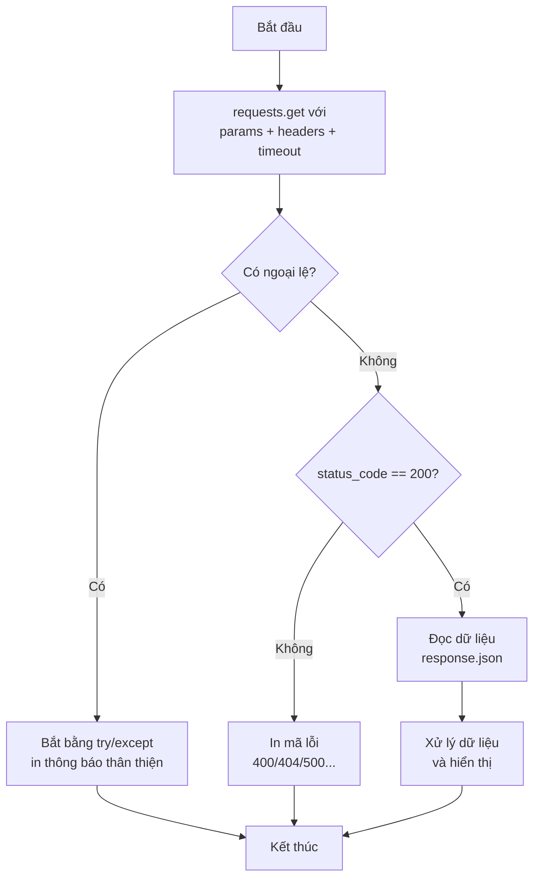

<!-- TỰ ĐỘNG ĐỒNG BỘ từ 03-Thuc-Chien/06-Requests/bai.md — đừng sửa trực tiếp, sửa bản chính rồi chạy tools/sync_tracks.py -->

# Bài 35 — Thư Viện Requests – Gọi API Từ Python

> 🎓 **Chương 10 – Dữ liệu và mạng**
> Bài 34 bạn đã hiểu API là gì: endpoint, phương thức HTTP, status code, JSON response — nhưng mới dừng ở mô phỏng. Bài này là **khoảnh khắc "chạm tay" vào thế giới thật**: dùng thư viện `requests` gọi API thật trên Internet, lấy thời tiết Hà Nội từ Open-Meteo (miễn phí, không cần khóa) và thử nghiệm với httpbin.org.

## 🧠 Điều kiện tiên quyết

- [Bài 34 — API – Giao Tiếp Giữa Các Chương Trình](../05-API/bai.md)

---

## 🎯 Mục tiêu

Sau bài học này, học viên sẽ:

* ✅ Cài đặt thư viện `requests` bằng `pip install requests`.
* ✅ Gửi yêu cầu **GET** với `requests.get()` và đọc phản hồi `.status_code`, `.text`, `.json()`.
* ✅ Truyền tham số qua **`params`** thay vì nối chuỗi thủ công.
* ✅ Gửi **headers** (User-Agent) — giải quyết lỗi 403.
* ✅ Gọi **POST** với dữ liệu JSON.
* ✅ Sử dụng **`timeout`** và bắt ngoại lệ bằng `try/except` — chương trình không bao giờ "treo" hay sập.
* ✅ Viết được chương trình **lấy thời tiết Hà Nội thật** từ Open-Meteo.

---

## 📖 Kiến thức

### 1. Nhắc nhẹ bài trước

Bài 34 bạn đã học "thực đơn" (endpoint), "người phục vụ" (API) và "ngôn ngữ" (HTTP + status code + JSON). Giờ chỉ còn một việc: **gửi yêu cầu thật** từ Python. Thư viện `requests` chính là "đôi chân" đưa lời gọi của bạn ra Internet.

### 2. Cài đặt thư viện `requests`

`requests` **không có sẵn** trong Python — phải cài từ kho thư viện PyPI:

```powershell
pip install requests
```

> 💡 Nhớ quy trình chuẩn từ bài 30–31: nên cài trong **môi trường ảo (venv)** của dự án, và dùng đúng Python đang chạy dự án. Kiểm tra cài đặt thành công:

```python
import requests          # không báo lỗi là đã cài xong
print(requests.__version__)
```

### 3. `requests.get` — yêu cầu lấy dữ liệu

```python
import requests

# Gửi yêu cầu GET tới dịch vụ httpbin (trả về chính yêu cầu của bạn)
phong_hoi = requests.get("https://httpbin.org/get")
print(phong_hoi.status_code)   # 200 — thành công
print(phong_hoi.text)          # nội dung thô (chuỗi)
```

> 🏪 Ví dụ nhà hàng: `requests.get(...)` giống bạn **gọi người phục vụ**: "Cho tôi xem thực đơn". Phản hồi (Response) là đĩa thức ăn được bưng ra: có mã trạng thái (200) và nội dung (dữ liệu).

**Đối tượng `Response`** — "đĩa thức ăn" chứa mọi thứ server trả về:

| Thuộc tính / phương thức | Ý nghĩa |
|---|---|
| `.status_code` | Mã trạng thái: 200, 201, 400, 404, 500... |
| `.text` | Nội dung thô dạng chuỗi (thường là JSON dạng chữ) |
| `.json()` | Tự phân tích nội dung thành dict/list Python |
| `.headers` | Tiêu đề phản hồi (server gửi kèm) |
| `.ok` | `True` nếu status_code < 400 |

### 4. Truyền tham số bằng `params`

URL tham số như `?latitude=21.0285&longitude=105.8542` **không cần tự nối chuỗi** — `requests` lo việc đó:

```python
import requests

# Cách sai: tự nối chuỗi, dễ sai dấu ? và &
# url = "https://httpbin.org/get?name=An&tuoi=15"

# Cách đúng: truyền dict cho params
tham_so = {"name": "An", "tuoi": 15}
phong_hoi = requests.get("https://httpbin.org/get", params=tham_so)
print(phong_hoi.url)    # xem URL thật đã được tạo
```

> 💡 `params` chính là hàm `tao_url` bạn tự viết ở bài 34 — giờ thư viện làm hộ. Tham số giá trị `True` cũng được chuyển thành `true` đúng chuẩn.

### 5. Headers — "phong bì" của yêu cầu và lỗi 403

Một số server muốn biết **ai** đang gọi. `User-Agent` là "danh thiếp" của chương trình bạn. Yêu cầu không có User-Agent có thể bị từ chối với **403 Forbidden**:

```python
import requests

# Thiếu User-Agent: một số server trả 403
phong_hoi = requests.get("https://httpbin.org/status/403")
print(phong_hoi.status_code)   # 403 — bị từ chối

# Gửi kèm headers: "xin chào, tôi là ứng dụng Python"
headers = {"User-Agent": "MyPythonApp/1.0"}
phong_hoi = requests.get("https://httpbin.org/get", headers=headers)
print(phong_hoi.status_code)   # 200
```

> 🏪 Nhà hàng: khách không tự giới thiệu (403) thì không được phục vụ; có danh thiếp (User-Agent) thì vào ngay.

### 6. Đọc dữ liệu JSON với `.json()`

Server trả chuỗi JSON (bài 32, 34). `.json()` phân tích chuỗi đó thành dict/list — **không cần `json.loads` nữa**:

```python
import requests

phong_hoi = requests.get("https://api.open-meteo.com/v1/forecast",
                         params={"latitude": 21.0285,
                                 "longitude": 105.8542,
                                 "current_weather": True})

du_lieu = phong_hoi.json()          # tự phân tích JSON -> dict
thoi_tiet = du_lieu["current_weather"]
print(f"Nhiet do Ha Noi: {thoi_tiet['temperature']}°C")
```

> ⚠️ **Quan trọng:** chỉ gọi `.json()` khi server **thực sự trả JSON** và status là 200. Nếu server trả lỗi (404, 500...) hoặc nội dung không phải JSON, `.json()` sẽ ném `JSONDecodeError` — cần xử lý (mục 9).

### 7. `timeout` và ngoại lệ — chương trình không bao giờ treo

**Mạng có thể chậm hoặc đứt.** Nếu không đặt thời gian chờ, chương trình có thể "đứng hình" hàng phút. Luôn đặt `timeout`:

```python
import requests

try:
    # timeout=10: chờ tối đa 10 giây rồi bỏ cuộc
    phong_hoi = requests.get("https://api.open-meteo.com/v1/forecast",
                             params={"latitude": 21.0285,
                                     "longitude": 105.8542,
                                     "current_weather": True},
                             timeout=10)
    phong_hoi.raise_for_status()        # 4xx/5xx sẽ ném lỗi HTTPError
    print(phong_hoi.status_code)
except requests.exceptions.Timeout:
    print("Het thoi gian cho — kiem tra mang!")
except requests.exceptions.ConnectionError:
    print("Khong ket noi duoc — may khong co mang?")
except requests.exceptions.RequestException as loi:
    print("Loi khac:", loi)
```

**Các ngoại lệ chính của `requests`:**

| Ngoại lệ | Khi nào xảy ra |
|---|---|
| `requests.exceptions.Timeout` | Chờ quá `timeout` giây vẫn không có phản hồi |
| `requests.exceptions.ConnectionError` | Không kết nối được (mất mạng, sai địa chỉ) |
| `requests.exceptions.HTTPError` | Server trả mã lỗi 4xx/5xx (khi dùng `raise_for_status()`) |
| `requests.exceptions.JSONDecodeError` | Nội dung không phải JSON nhưng bạn gọi `.json()` |
| `requests.exceptions.RequestException` | "Ông tổ" của mọi lỗi requests — bắt để chặn tất cả |

### 8. POST — gửi dữ liệu lên server

`POST` tạo dữ liệu mới (bài 34). Dùng tham số `json=` để gửi dữ liệu dạng JSON:

```python
import requests

du_lieu_moi = {"ten": "An", "lop": "10A1"}
phong_hoi = requests.post("https://httpbin.org/post", json=du_lieu_moi)

print(phong_hoi.status_code)        # 200 (httpbin luôn trả 200)
print(phong_hoi.json()["json"])     # httpbin "phản hồi lại" dữ liệu đã nhận
```

> 💡 `json=` tự chuyển dict thành chuỗi JSON, đặt header `Content-Type: application/json` — không cần tự `json.dumps`.

### 9. Quy trình gọi API an toàn — "nấu ăn" chuẩn



### 10. Ví dụ thực tế: thời tiết Hà Nội — Open-Meteo

API thời tiết miễn phí, không cần key (đã giới thiệu bài 34):

```python
import requests

# Hà Nội: vĩ độ 21.0285, kinh độ 105.8542
url = "https://api.open-meteo.com/v1/forecast"
tham_so = {
    "latitude": 21.0285,
    "longitude": 105.8542,
    "current_weather": True,
}

phong_hoi = requests.get(url, params=tham_so, timeout=10)
du_lieu = phong_hoi.json()          # dict chứa mọi dữ liệu

cw = du_lieu["current_weather"]     # rút dict con
print(f"Thoi diem  : {cw['time']}")
print(f"Nhiet do   : {cw['temperature']}°C")
print(f"Gio        : {cw['windspeed']} km/h")
```

> 🌏 Bạn có thể dán URL `https://api.open-meteo.com/v1/forecast?latitude=21.0285&longitude=105.8542&current_weather=true` vào trình duyệt để xem phản hồi JSON — chính xác thứ Python vừa nhận!

---

## 💡 Ví dụ minh họa

### Ví dụ 1: GET đơn giản — chào httpbin

```python
import requests

# httpbin.org/get trả về chính yêu cầu của bạn (miễn phí, dùng để học)
phong_hoi = requests.get("https://httpbin.org/get")

print("Status:", phong_hoi.status_code)   # 200
print("Text:", phong_hoi.text)            # toàn bộ nội dung thô
```

**Giải thích từng dòng:**

| Dòng | Ý nghĩa |
|---|---|
| `requests.get("https://httpbin.org/get")` | Gửi yêu cầu GET, trả đối tượng Response |
| `phong_hoi.status_code` | Mã trạng thái của phản hồi — 200 là thành công |
| `phong_hoi.text` | Nội dung thô dạng chuỗi (JSON dạng chữ) |

### Ví dụ 2: params và headers

```python
import requests

# Truyền tham số + headers cùng lúc
phong_hoi = requests.get(
    "https://httpbin.org/get",
    params={"name": "An", "tuoi": 15},
    headers={"User-Agent": "HocSinhPython/1.0"},
    timeout=10,
)

du_lieu = phong_hoi.json()          # phân tích JSON
print("URL da gui :", phong_hoi.url)     # ?name=An&tuoi=15
print("Tham so    :", du_lieu["args"])   # {"name": "An", "tuoi": "15"}
print("User-Agent :", du_lieu["headers"]["User-Agent"])
```

**Giải thích từng dòng:**

| Dòng | Ý nghĩa |
|---|---|
| `params={...}` | Dict tham số — requests tự nối thành `?name=An&tuoi=15` |
| `headers={...}` | Gửi kèm "danh thiếp" User-Agent — tránh 403 |
| `timeout=10` | Chờ tối đa 10 giây — không treo chương trình |
| `du_lieu["args"]` | httpbin phản hồi lại các tham số nó nhận được |

### Ví dụ 3: Xử lý status code trước khi đọc dữ liệu

```python
import requests

# httpbin.org/status/404 — server trả đúng mã 404
phong_hoi = requests.get("https://httpbin.org/status/404", timeout=10)

if phong_hoi.status_code == 200:
    print("Thanh cong:", phong_hoi.json())
else:
    print(f"Loi {phong_hoi.status_code} — khong doc duoc du lieu")
```

**Giải thích từng dòng:**

| Dòng | Ý nghĩa |
|---|---|
| `requests.get(".../status/404")` | httpbin có endpoint trả bất kỳ mã lỗi nào bạn muốn |
| `if phong_hoi.status_code == 200` | **Kiểm tra status trước**, đọc dữ liệu sau (bài 34!) |
| `else:` | 4xx/5xx chỉ in thông báo, không gọi `.json()` tránh sập |

---

## 🔬 Ví dụ nâng cao

### Ví dụ 1: Chương trình thời tiết Hà Nội hoàn chỉnh (chạy được!)

```python
import requests

# Hàm lấy thời tiết một thành phố theo tọa độ — an toàn với try/except
def lay_thoi_tiet(ten_thanh_pho, vi_do, kinh_do):
    """Gọi Open-Meteo, trả chuỗi mô tả thời tiết hoặc thông báo lỗi."""
    url = "https://api.open-meteo.com/v1/forecast"
    tham_so = {
        "latitude": vi_do,
        "longitude": kinh_do,
        "current_weather": True,
    }
    try:
        # timeout=10: chờ tối đa 10 giây
        phong_hoi = requests.get(url, params=tham_so, timeout=10)
        if phong_hoi.status_code != 200:
            return f"{ten_thanh_pho}: loi {phong_hoi.status_code}"

        cw = phong_hoi.json()["current_weather"]
        return (f"{ten_thanh_pho}: {cw['temperature']}°C, "
                f"gio {cw['windspeed']} km/h")
    except requests.exceptions.Timeout:
        return f"{ten_thanh_pho}: het thoi gian cho"
    except requests.exceptions.ConnectionError:
        return f"{ten_thanh_pho}: mat ket noi mang"
    except requests.exceptions.RequestException as loi:
        return f"{ten_thanh_pho}: loi {loi}"

# Hà Nội và TP.HCM
print(lay_thoi_tiet("Ha Noi", 21.0285, 105.8542))
print(lay_thoi_tiet("TP HCM", 10.8231, 106.6297))
```

**Giải thích từng phần:**

| Phần | Ý nghĩa |
|---|---|
| Hàm nhận 3 tham số | Tái sử dụng cho mọi thành phố — chỉ đổi tọa độ |
| `timeout=10` | Chống treo khi mạng chậm |
| `if status_code != 200` | Trả thông báo lỗi thay vì cố đọc JSON |
| `except Timeout / ConnectionError / RequestException` | Bắt 3 lớp lỗi phổ biến, ai cũng có thông báo riêng |
| Hàm luôn trả chuỗi | Gọi 2 lần, chương trình không bao giờ sập |

### Ví dụ 2: Kiểm tra dữ liệu trước khi `.json()`

```python
import requests

# Gọi thử: 404 sẽ không có JSON hợp lệ
phong_hoi = requests.get("https://httpbin.org/status/404", timeout=10)

try:
    du_lieu = phong_hoi.json()       # có thể ném JSONDecodeError
    print("OK:", du_lieu)
except requests.exceptions.JSONDecodeError:
    print(f"Khong phai JSON (status {phong_hoi.status_code}) — "
          f"noi dung: {phong_hoi.text}")
```

> 💡 Kết hợp cả 2 lớp bảo vệ: kiểm tra status + `try/except` quanh `.json()` — chương trình xử lý được mọi tình huống mạng thật.

### Ví dụ 3: POST với JSON — httpbin

```python
import requests

# Mô phỏng đăng ký học sinh (httpbin trả lại dữ liệu đã nhận)
du_lieu_dang_ky = {
    "ten": "Nguyen Van An",
    "lop": "10A1",
    "diem": 8,
}

phong_hoi = requests.post(
    "https://httpbin.org/post",
    json=du_lieu_dang_ky,
    timeout=10,
)

if phong_hoi.status_code == 200:
    phan_hoi = phong_hoi.json()
    print("Da gui:", phan_hoi["json"])        # dữ liệu server nhận được
    print("Content-Type:", phan_hoi["headers"]["Content-Type"])  # application/json
else:
    print("Loi:", phong_hoi.status_code)
```

> 🏪 Nhà hàng: POST giống đặt món — bạn gửi thông tin đơn hàng lên, server nhận và trả về xác nhận. httpbin giúp bạn "nhìn thấy" chính xác dữ liệu mình đã gửi.

---

## ⚠️ Lỗi thường gặp

### Lỗi 1: `ModuleNotFoundError: No module named 'requests'`

* **Nguyên nhân:** chưa cài thư viện.
* **Cách sửa:** chạy `pip install requests` trong đúng môi trường ảo (venv) đang dùng.

### Lỗi 2: Lỗi 403 Forbidden

* **Nguyên nhân:** server từ chối yêu cầu "vô danh" — thường do thiếu `User-Agent`.
* **Cách sửa:** gửi kèm `headers={"User-Agent": "..."}` (ví dụ tên ứng dụng của bạn).
* **Lưu ý:** một số API đòi **API key** (bài 34) — thiếu key cũng ra 401/403.

### Lỗi 3: Chương trình "đứng hình" mãi không trả kết quả

* **Nguyên nhân:** mạng chậm hoặc server không phản hồi, và bạn **quên `timeout`**.
* **Cách sửa:** luôn đặt `timeout=10` (hoặc số giây phù hợp).

### Lỗi 4: `JSONDecodeError: Expecting value` khi gọi `.json()`

* **Nguyên nhân:** nội dung không phải JSON — server trả 404/500, trang HTML, hoặc chuỗi rỗng.
* **Cách sửa:** kiểm tra `status_code == 200` trước; bọc `.json()` trong `try/except`.

### Lỗi 5: Cộng sai vì quên `int()`/`float()`

* **Nguyên nhân:** giá trị trong JSON có thể là chuỗi (ví dụ `"15"`) — cộng chuỗi cho kết quả sai.
* **Cách sửa:** `int(...)`/`float(...)` trước khi tính toán — giống bài 33 với CSV.

---

## 💎 Mẹo

* ⏱️ **Luôn `timeout`** — con số nhỏ (5–10 giây) đủ cho hầu hết API.
* 📦 **Kiểm tra status trước, `.json()` sau** — quy tắc vàng tránh mọi lỗi đọc dữ liệu.
* 🧪 **httpbin.org là "phòng thí nghiệm" tuyệt vời:** `/get`, `/post`, `/status/404`, `/status/500` — trả về đúng thứ bạn cần để luyện tập.
* 🌏 **Open-Meteo miễn phí, không key** — lý tưởng cho bài tập thời tiết thật.
* 🔧 **`raise_for_status()`** — một dòng thay cho `if status_code != 200`; ném HTTPError tự động.
* 🛡️ **Bắt `requests.exceptions.RequestException`** cuối cùng — "lưới an toàn" cho mọi lỗi còn lại.
* 📡 **Kiểm tra mạng trước khi đổ lỗi cho code:** thử dán URL vào trình duyệt xem có hoạt động không.
* 🐍 **`pip list`** — lệnh xem các thư viện đã cài, kiểm tra `requests` đã có chưa.

---

## 📝 Tóm tắt

| Thành phần | Chức năng |
|---|---|
| `pip install requests` | Cài thư viện |
| `requests.get(url, params=..., headers=..., timeout=...)` | Gửi yêu cầu GET |
| `requests.post(url, json={...})` | Gửi dữ liệu JSON lên server |
| `.status_code` | Mã trạng thái phản hồi |
| `.text` | Nội dung thô dạng chuỗi |
| `.json()` | Phân tích JSON thành dict/list |
| `params` | Tham số URL — tự nối chuỗi chuẩn |
| `headers` | "Danh thiếp" của yêu cầu — tránh 403 |
| `timeout=10` | Giới hạn thời gian chờ |
| `try/except` | Bắt Timeout, ConnectionError, JSONDecodeError... |
| Open-Meteo | API thời tiết miễn phí, không cần key |
| httpbin.org | Dịch vụ thử nghiệm requests miễn phí |

---

## 🧪 Kiểm tra nhanh

1. ❓ Lệnh nào cài thư viện requests?
2. ❓ `requests.get(...)` trả về đối tượng gì? Kể 3 thuộc tính/phương thức của nó.
3. ❓ Vì sao nên dùng `params` thay vì tự nối chuỗi `?name=An&...`?
4. ❓ Lỗi 403 xảy ra khi nào và sửa thế nào?
5. ❓ `timeout` dùng để làm gì? Nếu thiếu timeout có thể xảy ra điều gì?
6. ❓ Gọi `.json()` khi server trả 404 thường gặp lỗi gì?
7. ❓ `requests.post(url, json=du_lieu)` — tham số `json` làm gì?
8. ❓ Kể 3 ngoại lệ thường gặp của requests.
9. ❓ Thứ tự đúng: đọc `.json()` hay kiểm tra `.status_code` trước?
10. ❓ API nào dùng trong bài để lấy thời tiết Hà Nội? Có cần API key không?

<details>
<summary>🔍 Xem đáp án</summary>

1. `pip install requests`.
2. Đối tượng `Response`; `.status_code`, `.text`, `.json()`, `.headers`...
3. Vì requests tự nối đúng chuẩn (dấu `?`, `&`, chuyển `True` → `true`), không sợ lỗi chuỗi.
4. Khi server từ chối yêu cầu "vô danh" — thêm header `User-Agent`; có khi phải có API key.
5. Giới hạn thời gian chờ; không có timeout, chương trình có thể "đứng hình" rất lâu khi mạng chậm.
6. `JSONDecodeError` (nội dung không phải JSON).
7. Tự chuyển dict thành JSON, đặt `Content-Type: application/json`, gửi lên server.
8. `Timeout`, `ConnectionError`, `JSONDecodeError` (cùng `RequestException`).
9. Kiểm tra `.status_code` (200) trước, rồi mới gọi `.json()`.
10. Open-Meteo (`api.open-meteo.com`); không cần API key.

</details>

---

## 📚 Bài đọc thêm

* [Requests – Tài liệu chính thức](https://requests.readthedocs.io/en/latest/)
* [W3Schools – Python Requests](https://www.w3schools.com/python/module_requests.asp)
* [Open-Meteo – tài liệu API](https://open-meteo.com/en/docs)
* [httpbin.org – dịch vụ thử nghiệm](https://httpbin.org/)
* [Real Python – Requests library](https://realpython.com/python-requests/)

---

---

## 🧩 Bài tập

> 📝 📡 **Chương 10 – Dữ liệu và mạng**

## 🟢 Dễ (Bài 1 – 7)

### Bài 1: Kiểm tra thư viện requests

* **Đề bài:** Viết chương trình `import requests` và in ra số phiên bản của thư viện để kiểm tra đã cài đặt thành công.
* **Input:** Không có.
* **Output:** Một dòng số phiên bản, ví dụ `2.32.3`.
* **Gợi ý:** Sau khi `import requests`, in thuộc tính `requests.__version__`. (Nếu báo `ModuleNotFoundError` thì chạy `pip install requests`.)

### Bài 2: GET đơn giản — chào httpbin (chạy được)

* **Đề bài:** Gọi `requests.get("https://httpbin.org/get")` với `timeout=10`, in ra `status_code` và `text`.
* **Input:** Không có (cần internet).
* **Output:** Dòng `Status: 200` và nội dung text (JSON).
* **Gợi ý:** `phong_hoi.status_code`; `phong_hoi.text`.

### Bài 3: GET với params — httpbin (chạy được)

* **Đề bài:** Gọi `https://httpbin.org/get` với `params={"name": "An", "lop": "10A1"}`, in ra `status_code` và URL thực tế đã gửi (`phong_hoi.url`).
* **Input:** Không có (cần internet).
* **Output:** `Status: 200` và URL dạng `...get?name=An&lop=10A1`.
* **Gợi ý:** `requests` tự nối tham số — không tự dùng dấu `?`.

### Bài 4: Xử lý "phản hồi mô phỏng" (Mô phỏng)

* **Đề bài:** Bạn có dict mô phỏng phản hồi: `{"status_code": 200, "text": '{"ok": true}'}` và bản `{"status_code": 404, "text": "Not Found"}`. Viết hàm `xu_ly(phong_hoi)` nhận dict này: nếu `status_code == 200` in `"Thanh cong"` + text, ngược lại in `"Loi {status_code}"`.
* **Input:** Hai dict mô phỏng trên.
* **Output:** `Thanh cong {"ok": true}` và `Loi 404`.
* **Gợi ý:** Truy cập `phong_hoi["status_code"]`; nhớ tên khóa của dict giống hệt thuộc tính của Response thật.

### Bài 5: Đọc chuỗi JSON mô phỏng thời tiết (Mô phỏng)

* **Đề bài:** Chuỗi JSON mô phỏng phản hồi Open-Meteo: `'{"current_weather": {"temperature": 30.2, "windspeed": 11.5}}'`. Dùng `json.loads` (giống `.json()` của requests) để đọc và in nhiệt độ, tốc độ gió.
* **Input:** Chuỗi JSON cho sẵn.
* **Output:**
  ```
  Nhiet do: 30.2°C
  Gio: 11.5 km/h
  ```
* **Gợi ý:** `json.loads` trả dict; truy cập hai tầng `["current_weather"]["temperature"]`.

### Bài 6: Bắt lỗi JSON hỏng (Mô phỏng)

* **Đề bài:** Viết chương trình parse chuỗi JSON `'{"ten": "An", "diem": }'` (hỏng) bằng `json.loads`, dùng `try/except` bắt `json.JSONDecodeError` và in `"JSON loi"`. Chương trình phải chạy tiếp bình thường.
* **Input:** Chuỗi JSON hỏng cho sẵn.
* **Output:** `JSON loi: ...` (không sập chương trình).
* **Gợi ý:** `except json.JSONDecodeError:` — đây chính là loại lỗi `.json()` của requests cũng ném ra.

### Bài 7: POST với JSON — httpbin (chạy được)

* **Đề bài:** Gửi `requests.post("https://httpbin.org/post", json={"ten": "An", "diem": 8}, timeout=10)`, in `status_code` và phần dữ liệu server trả lại (trong JSON trả về, khóa `"json"`).
* **Input:** Không có (cần internet).
* **Output:** `Status: 200` và dòng chứa `{'ten': 'An', 'diem': 8}`.
* **Gợi ý:** `phong_hoi.json()["json"]` — httpbin "phản hồi lại" đúng dữ liệu đã nhận.

---

## 🟡 Trung bình (Bài 8 – 14)

### Bài 8: Tìm học viên trong JSON mô phỏng (Mô phỏng)

* **Đề bài:** Chuỗi JSON mô phỏng danh sách học viên (list dict `id`, `ten`, `diem`). Dùng `json.loads` đọc, tìm học viên có `id = 2` và in tên + điểm; nếu không có in `"Khong tim thay"`.
* **Input:**
  ```json
  [{"id": 1, "ten": "An", "diem": 8},
   {"id": 2, "ten": "Binh", "diem": 7},
   {"id": 3, "ten": "Chi", "diem": 9}]
  ```
* **Output:** `Binh - 7 diem` (tìm id 2), `Khong tim thay` (tìm id 99).
* **Gợi ý:** Duyệt list dict; giống bài 34 nhưng dữ liệu đến từ chuỗi JSON.

### Bài 9: Thời tiết Hà Nội — Open-Meteo (chạy được)

* **Đề bài:** Gọi Open-Meteo với `latitude=21.0285, longitude=105.8542, current_weather=True` (dùng `params` + `timeout=10`), in thời điểm, nhiệt độ và tốc độ gió từ `phong_hoi.json()["current_weather"]`.
* **Input:** Không có (cần internet).
* **Output:** 3 dòng: `Thoi diem`, `Nhiet do`, `Gio` (giá trị lấy từ API).
* **Gợi ý:** URL: `https://api.open-meteo.com/v1/forecast`; `True` trong params tự thành `true`.

### Bài 10: Tính tổng tiền đơn hàng từ JSON (Mô phỏng)

* **Đề bài:** Chuỗi JSON mô phỏng phản hồi API đơn hàng: list dict `ten`, `gia`, `so_luong`. Đọc và tính tổng tiền (`gia * so_luong`), in từng món và tổng cộng.
* **Input:**
  ```json
  [{"ten": "Vo", "gia": 5000, "so_luong": 3},
   {"ten": "But", "gia": 3000, "so_luong": 5},
   {"ten": "Sach", "gia": 25000, "so_luong": 1}]
  ```
* **Output:**
  ```
  Vo: 15000
  But: 15000
  Sach: 25000
  Tong: 55000
  ```
* **Gợi ý:** `float()` cho `gia`; cộng dồn biến `tong`.

### Bài 11: Xử lý lỗi mạng mô phỏng — timeout và mất kết nối (Mô phỏng)

* **Đề bài:** Viết hàm `goi_api_an_toan(url)` mô phỏng lời gọi requests: nếu URL chứa `"cham"`, nâng ngoại lệ `requests.exceptions.Timeout`; nếu chứa `"loi"`, nâng `requests.exceptions.ConnectionError`; ngược lại trả về `(200, {"ok": True})`. Bên ngoài dùng `try/except` in thông báo tương ứng. Gọi thử cả 3 URL.
* **Input:** `"https://api.example.com/nhanh"`, `".../cham"`, `".../loi"`.
* **Output:** Thông báo thành công, `Het thoi gian cho`, `Mat ket noi` — không sập.
* **Gợi ý:** Dùng `raise requests.exceptions.Timeout("...")` để giả lập; cấu trúc `try/except` giống hệt khi gọi mạng thật.

### Bài 12: Kiểm tra status trước khi đọc dữ liệu (Mô phỏng)

* **Đề bài:** Viết hàm `xu_ly_phong_hoi(status, chuoi_json)`: nếu status là 200 thì `json.loads(chuoi_json)` và in dữ liệu; nếu 400 in `"Loi: yeu cau sai"`; nếu 404 in `"Loi: khong tim thay"`; nếu 500 in `"Loi: may chu"`. Gọi thử 4 trường hợp.
* **Input:** `(200, '{"ok": true}')`, `(400, "{}")`, `(404, "{}")`, `(500, "{}")`.
* **Output:** 4 thông báo tương ứng.
* **Gợi ý:** Chỉ gọi `json.loads` trong nhánh 200 — đúng quy tắc "status trước, dữ liệu sau".

### Bài 13: Xử lý phản hồi lỗi của API (Mô phỏng)

* **Đề bài:** Một số API trả status 200 nhưng dữ liệu là lỗi: `'{"error": "Khong co du lieu"}'`. Viết chương trình đọc chuỗi JSON: nếu có khóa `"error"` in `"API bao loi: ..."`, ngược lại in nội dung. Gọi thử với chuỗi lỗi và chuỗi thường.
* **Input:** `'{"error": "Khong co du lieu"}'` và `'{"temperature": 30.2}'`.
* **Output:** `API bao loi: Khong co du lieu` và `Nhiet do: 30.2`.
* **Gợi ý:** Kiểm tra `if "error" in du_lieu:` — ứng dụng thực tế khi nhiều API trả lỗi qua JSON.

### Bài 14: Phân tích phản hồi Open-Meteo lồng nhau (Mô phỏng)

* **Đề bài:** Chuỗi JSON mô phỏng đầy đủ phản hồi Open-Meteo (có `current_weather` lồng bên trong). Đọc và in ra một "bảng" thời tiết gọn: thời điểm, nhiệt độ, gió, mã thời tiết.
* **Input:**
  ```json
  {"timezone": "Asia/Bangkok",
   "current_weather": {"time": "2026-08-05T09:00",
                       "temperature": 30.2, "windspeed": 11.5,
                       "weathercode": 1}}
  ```
* **Output:** 4 dòng thông tin (thời điểm, nhiệt độ, gió, mã thời tiết).
* **Gợi ý:** Rút biến con `cw = du_lieu["current_weather"]` cho gọn (giống bài giảng).

---

## 🔴 Khó (Bài 15 – 20)

### Bài 15: Hàm lấy thời tiết theo thành phố — Open-Meteo (chạy được)

* **Đề bài:** Viết hàm `lay_thoi_tiet(ten_thanh_pho, vi_do, kinh_do)` gọi Open-Meteo với `params`, `timeout=10`, dùng `try/except` bắt `Timeout` và `ConnectionError`, kiểm tra `status_code` trước khi đọc `.json()`. Hàm trả chuỗi mô tả (nhiệt độ, gió) hoặc thông báo lỗi — không bao giờ ném ngoại lệ. Gọi thử với Hà Nội.
* **Input:** Hà Nội: `(21.0285, 105.8542)`.
* **Output:** Chuỗi dạng `Ha Noi: 30.2°C, gio 11.5 km/h` hoặc thông báo lỗi thân thiện.
* **Gợi ý:** Cấu trúc: `try → get → kiểm tra status → json()` với 3 nhánh `except`.

### Bài 16: Nhiệt độ trung bình một tuần từ JSON (Mô phỏng)

* **Đề bài:** Chuỗi JSON mô phỏng phản hồi dạng `{"daily": {"time": [...], "temperature_2m_max": [...]}}` của 7 ngày. Đọc, tính nhiệt độ TB tối đa của tuần, tìm ngày nóng nhất và in ra.
* **Input:** 7 ngày: `2026-08-01` → `2026-08-07` với nhiệt độ max ví dụ `[30, 31, 29, 33, 32, 34, 28]`.
* **Output:** `Nhiet do TB tuan: 31.0°C` và `Ngay nong nhat: 2026-08-06 (34°C)`.
* **Gợi ý:** `sum(...) / len(...)`; tìm max bằng `max(nhiet)` và `nhiet.index(...)`.

### Bài 17: Chương trình kiểm tra kết nối — httpbin (chạy được)

* **Đề bài:** Viết chương trình gọi `https://httpbin.org/status/404` và `https://httpbin.org/status/500` với `timeout=10`, dùng `try/except` + `raise_for_status()` để xử lý: in `"OK"` khi 2xx, in mã lỗi và nội dung khi có `HTTPError`. Chương trình không được sập.
* **Input:** Không có (cần internet).
* **Output:** Với 404: `Loi 404: ...`; với 500: `Loi 500: ...` (không sập).
* **Gợi ý:** `phong_hoi.raise_for_status()` ném `requests.exceptions.HTTPError` cho mã 4xx/5xx; bắt và in `loi.response.status_code`.

### Bài 18: So sánh thời tiết Hà Nội và TP.HCM — Open-Meteo (chạy được)

* **Đề bài:** Dùng hàm ở bài 15 (hoặc viết lại) để lấy nhiệt độ Hà Nội `(21.0285, 105.8542)` và TP.HCM `(10.8231, 106.6297)`, in thành phố nào đang nóng hơn kèm nhiệt độ cả hai.
* **Input:** Không có (cần internet).
* **Output:** `TP HCM nong hon Ha Noi (33.5 vs 30.2)` hoặc ngược lại (dữ liệu tùy thời điểm).
* **Gợi ý:** Tách nhiệt độ ra số bằng cách tìm trong chuỗi trả về, hoặc viết hàm phụ trả số `float` riêng.

### Bài 19: Sắp xếp và lọc dữ liệu từ JSON mô phỏng (Mô phỏng)

* **Đề bài:** Chuỗi JSON mô phỏng phản hồi danh sách sản phẩm (`ten`, `gia`). Đọc dữ liệu, in các sản phẩm giá từ 5000 đến 20000, rồi in danh sách đã sắp xếp giảm dần theo giá (tên + giá).
* **Input:**
  ```json
  [{"ten": "Vo", "gia": 5000}, {"ten": "But", "gia": 3000},
   {"ten": "Sach", "gia": 25000}, {"ten": "Thuoc ke", "gia": 15000}]
  ```
* **Output:** 2 sản phẩm lọc được (Vo, Thuoc ke) và danh sách sắp xếp: Sach, Thuoc ke, Vo, But.
* **Gợi ý:** List comprehension để lọc; `sorted(..., key=lambda sp: sp["gia"], reverse=True)` (bài 25).

### Bài 20: Mini Project — Tra cứu thời tiết nhiều thành phố (chạy được)

* **Đề bài:** Xây dựng chương trình hoàn chỉnh:
  1. Dict thành phố: `"Ha Noi": (21.0285, 105.8542)`, `"TP HCM": (10.8231, 106.6297)`, `"Da Nang": (16.0544, 108.2022)`.
  2. Hàm `lay_thoi_tiet(ten, vi_do, kinh_do)` an toàn như bài 15 (params, timeout, status check, try/except).
  3. Vòng lặp gọi từng thành phố và in bảng thời tiết đẹp dạng `Ten | Nhiet do | Gio`.
  4. In thêm thành phố nóng nhất và lạnh nhất.
* **Input:** 3 thành phố trên (cần internet).
* **Output:** Bảng 3 dòng thời tiết + dòng kết luận nóng nhất/lạnh nhất.
* **Gợi ý:** Lưu kết quả mỗi thành phố vào list để dễ tìm max/min; dùng f-string canh cột `f"{ten:<8}"`.

---

## 🎯 Tổng kết

Chúc mừng bạn đã hoàn thành 20 bài tập về `requests`! Bạn đã luyện:

* ✅ Cài đặt và kiểm tra thư viện.
* ✅ GET/POST với `params`, `headers`, `timeout` — gọi API thật (httpbin, Open-Meteo).
* ✅ Đọc dữ liệu với `.status_code`, `.text`, `.json()`.
* ✅ Xử lý lỗi: `Timeout`, `ConnectionError`, `HTTPError`, `JSONDecodeError`.
* ✅ Phân tích phản hồi JSON thật và mô phỏng (không cần internet).


Dữ liệu từ API giờ đã nằm trong tay bạn — nhưng lưu trữ lâu dài thế nào? File CSV thô sơ, JSON rối — đã đến lúc học **cơ sở dữ liệu**:

---

## ✅ Đáp án

> 💡 **Hãy tự làm bài tập trước** rồi mới mở đáp án.

## 🟢 Dễ (Bài 1 – 7)


<details>
<summary>✅ Bài 1: Kiểm tra thư viện requests</summary>


**Phân tích:** Kiểm tra cài đặt bằng cách import rồi in phiên bản.

**Ý tưởng:** `import requests` không báo lỗi là đã cài xong; `requests.__version__` chứa số phiên bản.

**Thuật toán:**
1. Import requests.
2. In `requests.__version__`.

**Code:**

```python
# Cài đặt trước: pip install requests
import requests

# Kiểm tra phiên bản đã cài đặt
print(requests.__version__)
```

**Giải thích code:**
* `import requests` — nếu chưa cài sẽ báo `ModuleNotFoundError`; lúc đó chạy `pip install requests`.
* `requests.__version__` — thuộc tính lưu số phiên bản (ví dụ `2.32.3`).

**Độ phức tạp:** O(1).

---

</details>

<details>
<summary>✅ Bài 2: GET đơn giản — chào httpbin (chạy được)</summary>


**Phân tích:** Lời gọi GET đầu tiên tới httpbin — dịch vụ miễn phí trả về chính yêu cầu của bạn.

**Ý tưởng:** `requests.get(url, timeout=10)`; in `.status_code` và `.text`.

**Thuật toán:**
1. Import requests.
2. Gọi GET httpbin với timeout 10.
3. In status_code và text.

**Code:**

```python
# Cài đặt trước: pip install requests
import requests

# Gửi yêu cầu GET — cần internet
phong_hoi = requests.get("https://httpbin.org/get", timeout=10)

print("Status:", phong_hoi.status_code)   # 200 = thành công
print("Text:", phong_hoi.text)            # nội dung thô dạng chuỗi JSON
```

**Giải thích code:**
* `timeout=10` — chờ tối đa 10 giây, tránh treo chương trình.
* `.status_code` — mã trạng thái của phản hồi.
* `.text` — toàn bộ nội dung phản hồi ở dạng chuỗi.

**Độ phức tạp:** Phụ thuộc tốc độ mạng.

---

</details>

<details>
<summary>✅ Bài 3: GET với params — httpbin (chạy được)</summary>


**Phân tích:** Tham số URL phải được nối đúng chuẩn — requests làm hộ qua `params`.

**Ý tưởng:** Truyền dict `{"name": "An", "lop": "10A1"}` cho `params`; kiểm tra `.url` để thấy kết quả.

**Thuật toán:**
1. Import requests.
2. Gọi GET với `params` và `timeout`.
3. In status và URL đã tạo.

**Code:**

```python
# Cài đặt trước: pip install requests
import requests

# params: requests tự nối thành ?name=An&lop=10A1
phong_hoi = requests.get(
    "https://httpbin.org/get",
    params={"name": "An", "lop": "10A1"},
    timeout=10,
)

print("Status:", phong_hoi.status_code)
print("URL da gui:", phong_hoi.url)
```

**Giải thích code:**
* `params={...}` — dict tham số; requests xử lý dấu `?`, `&` và mã hóa URL.
* `.url` — URL thật đã gửi, cho phép kiểm tra `params` hoạt động đúng.
* So sánh với hàm `tao_url` tự viết ở bài 34 — đây chính là lý do dùng thư viện.

**Độ phức tạp:** Phụ thuộc mạng.

---

</details>

<details>
<summary>✅ Bài 4: Xử lý "phản hồi mô phỏng" (Mô phỏng)</summary>


**Phân tích:** Trước khi gọi API thật, luyện tư duy xử lý phản hồi — dict mô phỏng giống hệt `Response`.

**Ý tưởng:** Hàm nhận dict, kiểm tra `status_code` rồi hành xử tương ứng.

**Thuật toán:**
1. Định nghĩa hàm `xu_ly(phong_hoi)` nhận dict.
2. Nếu `status_code == 200`: in "Thanh cong" + text; ngược lại in lỗi.
3. Gọi với 2 dict mô phỏng.

**Code:**

```python
# Cài đặt trước: pip install requests
import requests

def xu_ly(phong_hoi):
    """Xử lý dict mô phỏng phản hồi (giống Response của requests)."""
    if phong_hoi["status_code"] == 200:
        print("Thanh cong", phong_hoi["text"])
    else:
        print("Loi", phong_hoi["status_code"])

# Hai "phản hồi" mô phỏng
phong_hoi_ok = {"status_code": 200, "text": '{"ok": true}'}
phong_hoi_loi = {"status_code": 404, "text": "Not Found"}

xu_ly(phong_hoi_ok)
xu_ly(phong_hoi_loi)
```

**Giải thích code:**
* Khóa của dict (`status_code`, `text`) trùng tên thuộc tính của Response thật — dễ chuyển sang dùng thật.
* `if phong_hoi["status_code"] == 200` — quy tắc "status trước, dữ liệu sau".

**Độ phức tạp:** O(1).

---

</details>

<details>
<summary>✅ Bài 5: Đọc chuỗi JSON mô phỏng thời tiết (Mô phỏng)</summary>


**Phân tích:** `.json()` của requests bên trong cũng là `json.loads` — luyện trực tiếp bằng chuỗi JSON không mạng.

**Ý tưởng:** `json.loads(chuoi)` → dict; truy cập hai tầng khóa.

**Thuật toán:**
1. Import json.
2. Parse chuỗi JSON.
3. Lấy `current_weather` rồi các giá trị, in ra.

**Code:**

```python
import json

# Chuỗi JSON mô phỏng đúng định dạng Open-Meteo trả về
chuoi_json = '{"current_weather": {"temperature": 30.2, "windspeed": 11.5}}'

# json.loads tương đương với .json() của requests
du_lieu = json.loads(chuoi_json)
cw = du_lieu["current_weather"]           # rút dict con

print(f"Nhiet do: {cw['temperature']}°C")
print(f"Gio: {cw['windspeed']} km/h")
```

**Giải thích code:**
* `json.loads` — chuỗi → dict; dữ liệu giống hệt khi gọi API thật.
* `cw = du_lieu["current_weather"]` — biến ngắn gọn, dễ đọc.

**Độ phức tạp:** O(n) với n là độ dài chuỗi.

---

</details>

<details>
<summary>✅ Bài 6: Bắt lỗi JSON hỏng (Mô phỏng)</summary>


**Phân tích:** Khi gọi API thật, server có thể trả nội dung không phải JSON → `.json()` ném `JSONDecodeError`. Tập bắt lỗi này bằng `json.loads`.

**Ý tưởng:** Đặt `json.loads` trong `try`, bắt `json.JSONDecodeError`.

**Thuật toán:**
1. Khai báo chuỗi JSON hỏng.
2. `try`: parse; `except json.JSONDecodeError`: in thông báo.
3. In dòng tiếp theo để chứng minh chương trình vẫn chạy.

**Code:**

```python
import json

# Chuỗi JSON hỏng: thiếu giá trị của khóa "diem"
chuoi_hong = '{"ten": "An", "diem": }'

try:
    du_lieu = json.loads(chuoi_hong)     # ném JSONDecodeError
    print("Doc thanh cong:", du_lieu)
except json.JSONDecodeError:
    print("JSON loi: chuoi khong hop le")

print("Chuong trinh van chay tiep binh thuong")
```

**Giải thích code:**
* `json.JSONDecodeError` — đúng loại lỗi `.json()` của requests ném.
* Bắt lỗi giúp chương trình không sập khi dữ liệu xấu — nền tảng cho mọi code gọi API.

**Độ phức tạp:** O(n).

---

</details>

<details>
<summary>✅ Bài 7: POST với JSON — httpbin (chạy được)</summary>


**Phân tích:** POST gửi dữ liệu lên server; `json=` tự chuyển dict thành JSON.

**Ý tưởng:** `requests.post(url, json=du_lieu, timeout=10)`; đọc lại từ `phong_hoi.json()["json"]`.

**Thuật toán:**
1. Khai báo dữ liệu cần gửi.
2. `requests.post` với `json`.
3. Kiểm tra status, in dữ liệu server trả lại.

**Code:**

```python
# Cài đặt trước: pip install requests
import requests

# Dữ liệu gửi lên server
du_lieu = {"ten": "An", "diem": 8}

phong_hoi = requests.post(
    "https://httpbin.org/post",
    json=du_lieu,          # tự chuyển dict -> JSON
    timeout=10,
)

if phong_hoi.status_code == 200:
    # httpbin trả về đúng dữ liệu nó nhận được ở khóa "json"
    print("Status:", phong_hoi.status_code)
    print("Server nhan:", phong_hoi.json()["json"])
else:
    print("Loi:", phong_hoi.status_code)
```

**Giải thích code:**
* `json=du_lieu` — requests tự `json.dumps`, đặt header `Content-Type: application/json`.
* `phong_hoi.json()["json"]` — httpbin lặp lại dữ liệu đã nhận — giúp ta "nhìn thấy" dữ liệu gửi đi.

**Độ phức tạp:** Phụ thuộc mạng.

---

</details>

## 🟡 Trung bình (Bài 8 – 14)


<details>
<summary>✅ Bài 8: Tìm học viên trong JSON mô phỏng (Mô phỏng)</summary>


**Phân tích:** Dữ liệu từ API là chuỗi JSON → chuyển list dict, tìm kiếm giống bài 34.

**Ý tưởng:** `json.loads` trả list; hàm tìm theo id; trả về hoặc in thông báo.

**Thuật toán:**
1. Parse chuỗi JSON → list dict.
2. Hàm tìm theo id.
3. Gọi với id 2 và 99.

**Code:**

```python
import json

# Chuỗi JSON mô phỏng danh sách học viên từ API
chuoi_json = '''[
    {"id": 1, "ten": "An", "diem": 8},
    {"id": 2, "ten": "Binh", "diem": 7},
    {"id": 3, "ten": "Chi", "diem": 9}
]'''

hoc_sinh = json.loads(chuoi_json)      # -> list dict

def tim_hoc_sinh(id):
    """Tìm học sinh theo id."""
    for hs in hoc_sinh:
        if hs["id"] == id:
            return hs                    # tìm thấy
    return None                          # không tìm thấy

hs = tim_hoc_sinh(2)
if hs:
    print(f"{hs['ten']} - {hs['diem']} diem")
else:
    print("Khong tim thay")

hs = tim_hoc_sinh(99)
if hs:
    print(f"{hs['ten']} - {hs['diem']} diem")
else:
    print("Khong tim thay")
```

**Giải thích code:**
* `json.loads` — dữ liệu API thành list dict sẵn sàng dùng.
* Hàm trả `None` khi không có — kiểm tra bằng `if hs:` (None là falsy, bài 6).
* Đây chính là bước "xử lý dữ liệu sau khi GET" trong thực tế.

**Độ phức tạp:** O(n) với n là số học viên.

---

</details>

<details>
<summary>✅ Bài 9: Thời tiết Hà Nội — Open-Meteo (chạy được)</summary>


**Phân tích:** Áp dụng đúng quy trình: GET + params + timeout + đọc JSON lồng nhau.

**Ý tưởng:** Gọi Open-Meteo với tọa độ Hà Nội, lấy `current_weather`.

**Thuật toán:**
1. Khai báo URL và params.
2. `requests.get` với params, timeout.
3. `.json()`, rút `current_weather`, in 3 thông tin.

**Code:**

```python
# Cài đặt trước: pip install requests
import requests

# Tọa độ Hà Nội
url = "https://api.open-meteo.com/v1/forecast"
tham_so = {
    "latitude": 21.0285,
    "longitude": 105.8542,
    "current_weather": True,     # True được chuyển thành true trong URL
}

phong_hoi = requests.get(url, params=tham_so, timeout=10)
du_lieu = phong_hoi.json()       # phân tích JSON

cw = du_lieu["current_weather"]  # dict con
print(f"Thoi diem: {cw['time']}")
print(f"Nhiet do : {cw['temperature']}°C")
print(f"Gio      : {cw['windspeed']} km/h")
```

**Giải thích code:**
* `params` — thay vì tự nối `?latitude=21.0285&...`, requests làm hộ.
* `phong_hoi.json()` — thay cho `json.loads` (khi server trả JSON hợp lệ).
* Truy cập 2 tầng: `du_lieu` → `current_weather` → giá trị.

**Độ phức tạp:** Phụ thuộc mạng.

---

</details>

<details>
<summary>✅ Bài 10: Tính tổng tiền đơn hàng từ JSON (Mô phỏng)</summary>


**Phân tích:** Đọc list dict từ chuỗi JSON, tính `gia * so_luong` và cộng dồn.

**Ý tưởng:** Vòng lặp từng món, ép `float` cho giá.

**Thuật toán:**
1. Parse chuỗi JSON → list.
2. Với mỗi món: tính thành tiền, in, cộng vào tổng.
3. In tổng cộng.

**Code:**

```python
import json

# Chuỗi JSON mô phỏng phản hồi API đơn hàng
chuoi_json = '''[
    {"ten": "Vo", "gia": 5000, "so_luong": 3},
    {"ten": "But", "gia": 3000, "so_luong": 5},
    {"ten": "Sach", "gia": 25000, "so_luong": 1}
]'''

don_hang = json.loads(chuoi_json)

tong = 0
for mon in don_hang:
    thanh_tien = float(mon["gia"]) * int(mon["so_luong"])   # ép kiểu
    print(f"{mon['ten']}: {thanh_tien}")
    tong += thanh_tien

print("Tong:", tong)
```

**Giải thích code:**
* `float(mon["gia"])` — JSON không phân biệt `5000` là số hay chữ; ép kiểu để chắc chắn (bài 33).
* `tong += thanh_tien` — cộng dồn.

**Độ phức tạp:** O(n) với n là số món.

---

</details>

<details>
<summary>✅ Bài 11: Xử lý lỗi mạng mô phỏng — timeout và mất kết nối (Mô phỏng)</summary>


**Phân tích:** Dạy đúng cấu trúc `try/except` của requests khi không có mạng — giả lập ngoại lệ bằng `raise`.

**Ý tưởng:** Hàm giả `requests.get`: tùy URL mà nâng `Timeout` hoặc `ConnectionError`; bên gọi bắt cả hai.

**Thuật toán:**
1. Định nghĩa `goi_api_an_toan(url)` mô phỏng.
2. Trong hàm: `raise` ngoại lệ tương ứng theo nội dung URL.
3. Bên ngoài `try/except` bắt lần lượt Timeout, ConnectionError.

**Code:**

```python
# Cài đặt trước: pip install requests
import requests

def goi_api_an_toan(url):
    """Mô phỏng lời gọi requests: URL chứa 'cham'/'loi' sẽ giả lập lỗi mạng."""
    if "cham" in url:
        raise requests.exceptions.Timeout("qua thoi gian cho 10 giay")
    if "loi" in url:
        raise requests.exceptions.ConnectionError("khong ket noi duoc")
    return 200, {"ok": True}

# Kiểm tra 3 tình huống
for url in ["https://api.example.com/nhanh",
            "https://api.example.com/cham",
            "https://api.example.com/loi"]:
    try:
        status, du_lieu = goi_api_an_toan(url)
        print(f"OK: {status} {du_lieu}")
    except requests.exceptions.Timeout:
        print("Het thoi gian cho (timeout)")
    except requests.exceptions.ConnectionError:
        print("Mat ket noi mang")
```

**Giải thích code:**
* `raise requests.exceptions.Timeout(...)` — tạo ngoại lệ đúng loại requests thật ném.
* Thứ tự `except` — bắt Timeout trước, ConnectionError sau; cả hai kế thừa `RequestException`.
* Cấu trúc này y hệt khi gọi mạng thật — chỉ khác nguồn ngoại lệ.

**Độ phức tạp:** O(1).

---

</details>

<details>
<summary>✅ Bài 12: Kiểm tra status trước khi đọc dữ liệu (Mô phỏng)</summary>


**Phân tích:** Nguyên tắc vàng bài 34–35: status trước, dữ liệu sau — không gọi `.json()` khi có lỗi.

**Ý tưởng:** Hàm `xu_ly_phong_hoi` rẽ nhánh theo status; chỉ parse JSON ở nhánh 200.

**Thuật toán:**
1. Định nghĩa hàm nhận `(status, chuoi_json)`.
2. `if/elif/else` theo 4 mã.
3. Gọi thử 4 trường hợp.

**Code:**

```python
import json

def xu_ly_phong_hoi(status, chuoi_json):
    """Xử lý phản hồi: chỉ parse chuỗi JSON khi status là 200."""
    if status == 200:
        du_lieu = json.loads(chuoi_json)
        print("Thanh cong:", du_lieu)
    elif status == 400:
        print("Loi: yeu cau sai")
    elif status == 404:
        print("Loi: khong tim thay")
    elif status == 500:
        print("Loi: may chu")

xu_ly_phong_hoi(200, '{"ok": true}')
xu_ly_phong_hoi(400, "{}")
xu_ly_phong_hoi(404, "{}")
xu_ly_phong_hoi(500, "{}")
```

**Giải thích code:**
* `json.loads` chỉ gọi khi 200 — tránh lỗi khi server trả HTML/lỗi.
* Đây chính là điều kiện `if response.status_code == 200` bạn sẽ viết trong ứng dụng thật.

**Độ phức tạp:** O(1).

---

</details>

<details>
<summary>✅ Bài 13: Xử lý phản hồi lỗi của API (Mô phỏng)</summary>


**Phân tích:** Nhiều API (kể cả Open-Meteo) trả status 200 kèm dữ liệu lỗi — phải kiểm tra nội dung JSON, không chỉ status.

**Ý tưởng:** Kiểm tra khóa `"error"` sau khi parse.

**Thuật toán:**
1. Parse chuỗi JSON.
2. `if "error" in du_lieu`: in thông báo lỗi; ngược lại in dữ liệu.
3. Gọi với 2 chuỗi.

**Code:**

```python
import json

def xu_ly(chuoi_json):
    """Xử lý JSON phản hồi — phát hiện lỗi do API báo qua khóa error."""
    du_lieu = json.loads(chuoi_json)
    if "error" in du_lieu:
        print(f"API bao loi: {du_lieu['error']}")
    elif "temperature" in du_lieu:
        print(f"Nhiet do: {du_lieu['temperature']}")
    else:
        print("Khong ro du lieu")

xu_ly('{"error": "Khong co du lieu"}')
xu_ly('{"temperature": 30.2}')
```

**Giải thích code:**
* `"error" in du_lieu` — kiểm tra khóa tồn tại trước khi truy cập (bài 17).
* Kiểm tra cả status **và** nội dung — hai lớp phòng thủ khi gọi API thật.

**Độ phức tạp:** O(n).

---

</details>

<details>
<summary>✅ Bài 14: Phân tích phản hồi Open-Meteo lồng nhau (Mô phỏng)</summary>


**Phân tích:** Dữ liệu thật của Open-Meteo có nhiều tầng; rút biến con cho gọn.

**Ý tưởng:** `json.loads` → `cw = du_lieu["current_weather"]` → in 4 thông tin.

**Thuật toán:**
1. Parse chuỗi JSON lồng nhau.
2. Rút dict con `current_weather`.
3. In thời điểm, nhiệt độ, gió, mã thời tiết.

**Code:**

```python
import json

chuoi_json = '''{
    "timezone": "Asia/Bangkok",
    "current_weather": {
        "time": "2026-08-05T09:00",
        "temperature": 30.2,
        "windspeed": 11.5,
        "weathercode": 1
    }
}'''

du_lieu = json.loads(chuoi_json)
cw = du_lieu["current_weather"]

print(f"Thoi diem: {cw['time']}")
print(f"Nhiet do : {cw['temperature']}°C")
print(f"Gio      : {cw['windspeed']} km/h")
print(f"Ma thoi tiet: {cw['weathercode']}")
```

**Giải thích code:**
* `cw = du_lieu["current_weather"]` — biến ngắn, tránh viết lặp chuỗi khóa dài.
* Cấu trúc này giống hệt khi gọi API thật — bài 15 sẽ dùng lại.

**Độ phức tạp:** O(n).

---

</details>

## 🔴 Khó (Bài 15 – 20)


<details>
<summary>✅ Bài 15: Hàm lấy thời tiết theo thành phố — Open-Meteo (chạy được)</summary>


**Phân tích:** Gói toàn bộ quy trình: params, timeout, kiểm tra status, try/except — vào một hàm tái sử dụng.

**Ý tưởng:** Hàm trả chuỗi mô tả hoặc thông báo lỗi; không bao giờ ném ngoại lệ ra ngoài.

**Thuật toán:**
1. Khai báo URL cố định.
2. `params` từ tọa độ.
3. `try`: GET với timeout; kiểm tra status; `.json()`; tạo chuỗi kết quả.
4. `except` 3 loại ngoại lệ → trả chuỗi lỗi.
5. Gọi với Hà Nội.

**Code:**

```python
# Cài đặt trước: pip install requests
import requests

def lay_thoi_tiet(ten_thanh_pho, vi_do, kinh_do):
    """Gọi Open-Meteo, trả chuỗi mô tả thời tiết hoặc thông báo lỗi."""
    url = "https://api.open-meteo.com/v1/forecast"
    tham_so = {
        "latitude": vi_do,
        "longitude": kinh_do,
        "current_weather": True,
    }
    try:
        phong_hoi = requests.get(url, params=tham_so, timeout=10)
        if phong_hoi.status_code != 200:                 # status trước
            return f"{ten_thanh_pho}: loi {phong_hoi.status_code}"

        cw = phong_hoi.json()["current_weather"]         # dữ liệu sau
        return (f"{ten_thanh_pho}: {cw['temperature']}°C, "
                f"gio {cw['windspeed']} km/h")
    except requests.exceptions.Timeout:
        return f"{ten_thanh_pho}: het thoi gian cho"
    except requests.exceptions.ConnectionError:
        return f"{ten_thanh_pho}: mat ket noi mang"
    except requests.exceptions.RequestException as loi:
        return f"{ten_thanh_pho}: loi khac {loi}"

# Gọi thử với Hà Nội
print(lay_thoi_tiet("Ha Noi", 21.0285, 105.8542))
```

**Giải thích code:**
* Kiểm tra `status_code != 200` trước khi chạm `.json()` — tránh JSONDecodeError.
* `except requests.exceptions.RequestException` cuối cùng — lưới an toàn mọi lỗi còn lại.
* Hàm luôn trả chuỗi — chương trình chính không bao giờ sập vì mạng.

**Độ phức tạp:** Phụ thuộc mạng.

---

</details>

<details>
<summary>✅ Bài 16: Nhiệt độ trung bình một tuần từ JSON (Mô phỏng)</summary>


**Phân tích:** Dữ liệu `daily` chứa hai list song song (time và nhiệt độ) — cần duyệt theo chỉ số chung.

**Ý tưởng:** Parse, tính TB của `temperature_2m_max`, tìm vị trí max và ngày tương ứng.

**Thuật toán:**
1. Parse chuỗi JSON → dict `daily`.
2. Tính TB của `temperature_2m_max`.
3. Tìm chỉ số ngày nóng nhất (hàm `index` của max).
4. In kết quả.

**Code:**

```python
import json

chuoi_json = '''{
    "daily": {
        "time": ["2026-08-01", "2026-08-02", "2026-08-03",
                 "2026-08-04", "2026-08-05", "2026-08-06", "2026-08-07"],
        "temperature_2m_max": [30, 31, 29, 33, 32, 34, 28]
    }
}'''

du_lieu = json.loads(chuoi_json)
daily = du_lieu["daily"]
nhiet = daily["temperature_2m_max"]

# Nhiệt độ trung bình
tb = sum(nhiet) / len(nhiet)
print(f"Nhiet do TB tuan: {round(tb, 1)}°C")

# Ngày nóng nhất
nhiet_max = max(nhiet)                        # giá trị cao nhất
chi_so = nhiet.index(nhiet_max)               # vị trí của giá trị đó
ngay_nong = daily["time"][chi_so]             # ngày tương ứng cùng vị trí
print(f"Ngay nong nhat: {ngay_nong} ({nhiet_max}°C)")
```

**Giải thích code:**
* `sum(nhiet) / len(nhiet)` — trung bình cộng; `round(x, 1)` giữ 1 chữ số.
* `nhiet.index(max(nhiet))` — tìm **vị trí** của giá trị lớn nhất, rồi lấy ngày cùng vị trí từ list `time`.

**Độ phức tạp:** O(n) với n = 7 ngày.

---

</details>

<details>
<summary>✅ Bài 17: Chương trình kiểm tra kết nối — httpbin (chạy được)</summary>


**Phân tích:** `raise_for_status()` giúp biến mã lỗi thành ngoại lệ `HTTPError` — xử lý gọn hơn if thủ công.

**Ý tưởng:** Gọi `requests.get`, gọi `raise_for_status()` trong try; bắt `HTTPError` và in mã lỗi từ `loi.response.status_code`.

**Thuật toán:**
1. Import requests.
2. Với mỗi URL 404, 500: gọi GET timeout.
3. `try`: `raise_for_status()`, in OK.
4. `except requests.exceptions.HTTPError`: in mã lỗi.

**Code:**

```python
# Cài đặt trước: pip install requests
import requests

urls = [
    "https://httpbin.org/status/404",
    "https://httpbin.org/status/500",
]

for url in urls:
    try:
        phong_hoi = requests.get(url, timeout=10)
        # Nếu mã 4xx/5xx, lệnh này ném HTTPError (chương trình không sập)
        phong_hoi.raise_for_status()
        print("OK:", url)
    except requests.exceptions.HTTPError as loi:
        # loi.response chứa phản hồi gốc -> lấy mã lỗi
        ma_loi = loi.response.status_code
        print(f"Loi {ma_loi}: {url}")
```

**Giải thích code:**
* `raise_for_status()` — không làm gì khi 2xx, ném `HTTPError` khi 4xx/5xx.
* `loi.response.status_code` — ngoại lệ chứa phản hồi gốc, lấy được mã lỗi chính xác.
* Chương trình in `Loi 404: ...` và `Loi 500: ...` rồi tiếp tục chạy.

**Độ phức tạp:** Phụ thuộc mạng.

---

</details>

<details>
<summary>✅ Bài 18: So sánh thời tiết Hà Nội và TP.HCM — Open-Meteo (chạy được)</summary>


**Phân tích:** Tái sử dụng hàm lấy thời tiết, nhưng cần nhiệt độ **dạng số** để so sánh.

**Ý tưởng:** Viết hàm phụ trả cặp `(ten, nhiet_do_float)`; so sánh và in kết luận.

**Thuật toán:**
1. Hàm `get_nhiet_do(ten, vi_do, kinh_do)` trả `(ten, float)` hoặc `None`.
2. Gọi cho Hà Nội và TP.HCM.
3. So sánh, in kết luận.

**Code:**

```python
# Cài đặt trước: pip install requests
import requests

def get_nhiet_do(ten, vi_do, kinh_do):
    """Gọi Open-Meteo, trả (tên thành phố, nhiệt độ float) hoặc None."""
    url = "https://api.open-meteo.com/v1/forecast"
    tham_so = {"latitude": vi_do, "longitude": kinh_do, "current_weather": True}
    try:
        phong_hoi = requests.get(url, params=tham_so, timeout=10)
        if phong_hoi.status_code != 200:
            return None
        nhiet_do = phong_hoi.json()["current_weather"]["temperature"]
        return ten, float(nhiet_do)
    except requests.exceptions.RequestException:
        return None

# Tọa độ hai thành phố
ha_noi = get_nhiet_do("Ha Noi", 21.0285, 105.8542)
tp_hcm = get_nhiet_do("TP HCM", 10.8231, 106.6297)

if ha_noi and tp_hcm:
    ten_1, nhiet_1 = ha_noi
    ten_2, nhiet_2 = tp_hcm
    if nhiet_1 > nhiet_2:
        print(f"{ten_1} nong hon {ten_2} ({nhiet_1} vs {nhiet_2})")
    elif nhiet_1 < nhiet_2:
        print(f"{ten_2} nong hon {ten_1} ({nhiet_2} vs {nhiet_1})")
    else:
        print(f"{ten_1} va {ten_2} bang nhau ({nhiet_1})")
else:
    print("Khong lay duoc du lieu thoi tiet")
```

**Giải thích code:**
* `float(nhiet_do)` — bảo đảm so sánh số, không so chuỗi.
* `if ha_noi and tp_hcm` — kết quả có thể là `None` khi mạng lỗi — kiểm tra trước khi giải nén.
* Kiểm tra `status_code`, bắt `RequestException` — hàm trả `None` thay vì sập.

**Độ phức tạp:** Phụ thuộc mạng (2 yêu cầu GET).

---

</details>

<details>
<summary>✅ Bài 19: Sắp xếp và lọc dữ liệu từ JSON mô phỏng (Mô phỏng)</summary>


**Phân tích:** Hai thao tác dữ liệu phổ biến sau khi GET: lọc theo điều kiện và sắp xếp theo khóa.

**Ý tưởng:** List comprehension lọc `5000 <= gia <= 20000`; `sorted` với `key=lambda`.

**Thuật toán:**
1. Parse chuỗi JSON → list dict.
2. Lọc và in các sản phẩm trong khoảng giá.
3. Sắp xếp giảm dần theo giá, in lại toàn bộ.

**Code:**

```python
import json

chuoi_json = '''[
    {"ten": "Vo", "gia": 5000}, {"ten": "But", "gia": 3000},
    {"ten": "Sach", "gia": 25000}, {"ten": "Thuoc ke", "gia": 15000}
]'''

san_pham = json.loads(chuoi_json)

# Lọc sản phẩm giá từ 5000 đến 20000
loc = [sp for sp in san_pham if 5000 <= int(sp["gia"]) <= 20000]
print("San pham trong khoang gia:")
for sp in loc:
    print(f"- {sp['ten']}: {sp['gia']}")

# Sắp xếp giảm dần theo giá
sap_xep = sorted(san_pham, key=lambda sp: int(sp["gia"]), reverse=True)
print("Sap xep giam dan theo gia:")
for sp in sap_xep:
    print(f"- {sp['ten']}: {sp['gia']}")
```

**Giải thích code:**
* List comprehension (bài 26) kết hợp điều kiện — lọc gọn một dòng.
* `sorted(..., key=lambda sp: int(sp["gia"]), reverse=True)` — sắp theo khóa, giảm dần (lambda — bài 25).
* Kết quả lọc: Vo, Thuoc ke; sắp xếp: Sach → Thuoc ke → Vo → But.

**Độ phức tạp:** O(n log n) do `sorted`.

---

</details>

<details>
<summary>✅ Bài 20: Mini Project — Tra cứu thời tiết nhiều thành phố (chạy được)</summary>


**Phân tích:** Bài tổng hợp toàn chương: dict thành phố, hàm gọi API an toàn, vòng lặp, tìm max/min, in bảng đẹp.

**Ý tưởng:** Mỗi lần gọi API lưu một dict kết quả vào list; sau vòng lặp phân tích để kết luận.

**Thuật toán:**
1. Dict thành phố (tên → tọa độ).
2. Hàm `lay_thoi_tiet` an toàn trả dict hoặc None.
3. Vòng lặp gọi từng thành phố, in bảng.
4. Lọc kết quả hợp lệ, tìm nóng nhất/lạnh nhất.

**Code:**

```python
# Cài đặt trước: pip install requests
import requests

# Dict thành phố: tên -> (vĩ độ, kinh độ)
thanh_pho = {
    "Ha Noi": (21.0285, 105.8542),
    "TP HCM": (10.8231, 106.6297),
    "Da Nang": (16.0544, 108.2022),
}

def lay_thoi_tiet(ten, vi_do, kinh_do):
    """Gọi Open-Meteo, trả dict {'ten', 'nhiet', 'gio'} hoặc None."""
    url = "https://api.open-meteo.com/v1/forecast"
    tham_so = {"latitude": vi_do, "longitude": kinh_do, "current_weather": True}
    try:
        phong_hoi = requests.get(url, params=tham_so, timeout=10)
        if phong_hoi.status_code != 200:
            return None
        cw = phong_hoi.json()["current_weather"]
        return {"ten": ten,
                "nhiet": float(cw["temperature"]),
                "gio": float(cw["windspeed"])}
    except requests.exceptions.RequestException:
        return None

# Gọi và in bảng thời tiết
ket_qua = []
print(f"{'Thanh pho':<10}{'Nhiet do':<10}{'Gio'}")
for ten, (vi_do, kinh_do) in thanh_pho.items():
    du_lieu = lay_thoi_tiet(ten, vi_do, kinh_do)
    if du_lieu:
        ket_qua.append(du_lieu)
        print(f"{du_lieu['ten']:<10}{du_lieu['nhiet']:<10.1f}{du_lieu['gio']} km/h")
    else:
        print(f"{ten:<10}LOI ket noi")

# Kết luận nóng nhất / lạnh nhất
if ket_qua:
    nong_nhat = max(ket_qua, key=lambda k: k["nhiet"])
    lanh_nhat = min(ket_qua, key=lambda k: k["nhiet"])
    print(f"Nong nhat: {nong_nhat['ten']} ({nong_nhat['nhiet']}°C)")
    print(f"Lanh nhat: {lanh_nhat['ten']} ({lanh_nhat['nhiet']}°C)")
else:
    print("Khong lay duoc du lieu thanh pho nao")
```

**Giải thích code:**
* `thanh_pho.items()` — duyệt tên và tọa độ cùng lúc (bài 17).
* `key=lambda k: k["nhiet"]` — tìm max/min theo khóa nhiệt độ (bài 25).
* `f"{du_lieu['ten']:<10}"` — canh trái 10 ký tự cho bảng thẳng hàng.
* Hàm trả `None` khi lỗi — vòng lặp in "LOI ket noi" thay vì sập chương trình.

**Độ phức tạp:** Phụ thuộc mạng (3 yêu cầu GET) + O(m) phân tích.

---

</details>

## 📌 Lời khuyên cuối


* ⏱️ **Luôn đặt `timeout`** (5–10 giây) — chương trình không bao giờ "đứng hình".
* 🚦 **Kiểm tra status trước, `.json()` sau** — tránh JSONDecodeError.
* 🛡️ **try/except là bắt buộc** khi chạm mạng: Timeout, ConnectionError, RequestException.
* 🧪 **Luyện offline bằng chuỗi JSON mô phỏng** — tư duy xử lý giống hệt dữ liệu thật.
* 🌏 **Open-Meteo miễn phí, không key** — cứ luyện thời tiết Hà Nội thỏa thích.

👉 Tiếp theo: **[Bài 36: SQLite – Cơ Sở Dữ Liệu Trong Python](../07-SQLite/bai.md)**

---

## ➡️ Điều hướng

**Vị trí:** `04-Full/Phan-3-Thuc-Chien/06-Requests/bai.md`

**Bài tiếp theo:** [Bài 36 — SQLite – Lưu Trữ Dữ Liệu Với Cơ Sở Dữ Liệu](../07-SQLite/bai.md)
