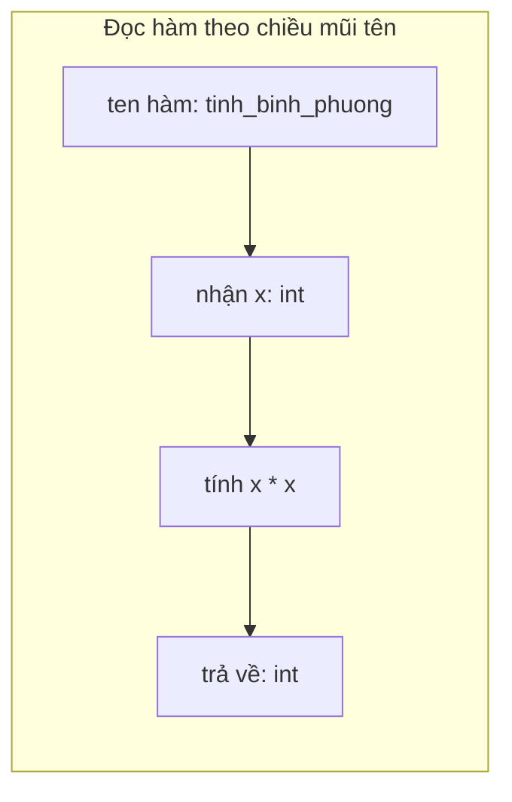

<!-- TỰ ĐỘNG ĐỒNG BỘ từ 03-Thuc-Chien/09-Typing/bai.md — đừng sửa trực tiếp, sửa bản chính rồi chạy tools/sync_tracks.py -->

# Bài 38 — Type Hints – Chú Thích Kiểu Dữ Liệu

> 🎓 **Chương 8 – Lập trình ứng dụng chuyên sâu**

## 🧠 Điều kiện tiên quyết

- [Bài 23 — Lập Trình Hướng Đối Tượng (OOP)](../Phan-1-Co-Ban/23-OOP/bai.md)
- [Bài 25 — Lambda – Hàm Vô Danh Siêu Ngắn Gọn](../Phan-1-Co-Ban/25-Lambda/bai.md)

---

## 🎯 Mục tiêu

Sau bài học này, học viên sẽ:

* ✅ Hiểu **kiểu dữ liệu động** của Python và vì sao cần **chú thích kiểu (type hints)**.
* ✅ Khai báo chú thích cho **biến**: `x: int = 5`.
* ✅ Chú thích **tham số và giá trị trả về** của hàm: `def f(x: int) -> str`.
* ✅ Dùng module **`typing`**: `List`, `Dict`, `Optional`, `Union`, `Tuple`, `Any`.
* ✅ Hiểu lợi ích: **đọc code tốt hơn, IDE gợi ý, ít bug**.
* ✅ Tạo **type alias** (bí danh kiểu) để code gọn và rõ ràng.

---

## 📖 Kiến thức

> 🔁 **Nhắc lại bài trước:** Bài 37 đã dạy bạn ghi log để "theo dõi" chương trình. Nhưng để một chương trình dễ bảo trì lâu dài, người đọc code phải hiểu **mỗi hàm nhận gì và trả về gì ngay từ cái nhìn đầu tiên**. Đó chính là việc của **Type Hints** trong bài này.

### 1. Kiểu dữ liệu động vs tĩnh

Python là ngôn ngữ **kiểu động (dynamic typing)** — bạn **không cần khai báo kiểu**; Python tự đoán:

```python
x = 10        # Python đoán x là số nguyên
x = "chao"    # đổi ý — x bây giờ là chuỗi
```

> 💬 **Ví dụ đời thực:** Kiểu dữ liệu động giống một **thùng đồ không dán nhãn** — bỏ gì vào cũng được. Kiểu tĩnh (như Java, C++) giống **hộp có dán nhãn "chỉ đựng ốc vít"** — rõ ràng nhưng gò bó hơn.

Kiểu động linh hoạt nhưng đi kèm rủi ro:

```python
def tinh_tong(a, b):
    return a + b

print(tinh_tong("10", "5"))   # "105" — nối chuỗi, không phải 15!
```

Chương trình **không báo lỗi** nhưng kết quả sai. **Type hints** không bắt buộc kiểu (Python interpretation vẫn chạy) nhưng **nói rõ ý định** và để IDE/tool gợi ý, soát lỗi.

### 2. Chú thích kiểu cho biến

Cú pháp đơn giản: `tên_biến: kiểu = giá_trị`

```python
ten: str = "An"          # biến ten phải là chuỗi
tuoi: int = 15           # biến tuoi phải là số nguyên
diem: float = 8.5        # số thực
da_thi: bool = True      # đúng/sai
```

> 💡 **Quan trọng:** Chú thích kiểu **chỉ là ghi chú** — Python không ép. Bạn vẫn có thể gán `tuoi = "mười lăm"` mà không gặp lỗi chạy (nhưng IDE sẽ cảnh báo). Type hints = "hợp đồng bằng văn bản" giữa người viết và người đọc.

### 3. Chú thích tham số và hàm trả về

```python
def tinh_binh_phuong(x: int) -> int:
    """Trả về bình phương của x."""
    return x * x
```

* `x: int` — tham số `x` có kiểu nguyên.
* `-> int` — hàm trả về giá trị kiểu nguyên.



Bạn có thể đọc: *"tăng_bình_phuong nhận một số nguyên, trả về một số nguyên"* — 3 giây để hiểu mục đích không cần đọc thân hàm.

### 4. Các kiểu cơ bản có sẵn

| Kiểu | Ý nghĩa | Ví dụ |
|---|---|---|
| `int` | Số nguyên | `tuoi: int` |
| `float` | Số thực | `diem: float` |
| `str` | Chuỗi ký tự | `ten: str` |
| `bool` | Đúng / Sai | `da_giam_gia: bool` |
| `bytes` | Dữ liệu thô (nhị phân) | `du_lieu: bytes` |
| `None` | Không có giá trị | hàm `print()` trả về None |

### 5. Module `typing` cho kiểu dữ liệu phức tạp

Với danh sách, từ điển... dùng module `typing`:

| Kiểu | Ý nghĩa | Ví dụ |
|---|---|---|
| `List[int]` | Danh sách các số nguyên | `diem: List[float]` |
| `Dict[str, int]` | Từ điển: khóa chuỗi, giá trị số nguyên | `bang_diem: Dict[str, float]` |
| `Tuple[str, int]` | Tuple 2 phần: chuỗi và số nguyên | `thong_tin: Tuple[str, int]` |
| `Set[str]` | Tập hợp chuỗi | `lop: Set[str]` |
| `Optional[int]` | Số nguyên hoặc `None` | `diem_khong_co: Optional[float]` |
| `Union[int, float]` | Số nguyên **hoặc** số thực | `so_luong: Union[int, float]` |
| `Any` | Bất kỳ kiểu nào | `du_lieu: Any` |

```python
from typing import List, Dict, Optional, Union, Tuple, Any

diem_so: List[float] = [8.5, 9.0, 7.5]          # danh sách điểm
bang_diem: Dict[str, float] = {"An": 8.5, "Binh": 9.0}   # tên -> điểm
thong_tin: Tuple[str, int] = ("An", 2008)       # tên + năm sinh
ho_so: Optional[str] = None                     # hoặc chuỗi, hoặc rỗng
so_: Union[int, float] = 10                     # cả hai kiểu số đều được nhận
thu_gi: Any = "bat ky"
```

### 6. `Optional` và `Union` – hai kiểu "có thể"

* **`Optional[int]`** = `int` **hoặc** `None` — cực kỳ phổ biến khi hàm **có thể không tìm thấy**:

  ```python
  def tim_diem(ten: str, bang_diem: Dict[str, float]) -> Optional[float]:
      """Trả điểm của tên; None nếu không có."""
      return bang_diem.get(ten)   # .get() trả None nếu khóa không tồn tại
  ```

* **`Union[int, float]`** = kiểu này **hoặc** kiểu kia — ví dụ hàm nhận cả số nguyên lẫn số thực.

> 💡 Trong Python 3.10+ có cú pháp ngắn gọn `int | None` và `int | float`. Giáo trình dùng cách `Optional[...]`/`Union[...]` vì chạy được ngay cả trên Python 3.9.

### 7. Vì sao type hints đáng dùng?

**a) Đọc code nhanh và chính xác:**

```python
# Không có type hints — phải đọc thân hàm mới biết:
def khuyen_mai(gia, phan_tram):
    return gia * (100 - phan_tram) / 100

# Có type hints — hiểu ngay:
def khuyen_mai(gia: float, phan_tram: int) -> float:
    """Trả về giá sau khi giảm phần trăm."""
    return gia * (100 - phan_tram) / 100
```

**b) IDE gợi ý tuyệt vời:** VS Code (Pyright/Pylance) hiển thị gợi ý thuộc tính, báo lỗi trước khi chạy.

**c) Ít bug hơn:** Tool `mypy` (hoặc gợi ý IDE) phát hiện ngay `tinh_diem("8.5", 2)` trong khi hàm khai báo `tinh_diem(diem: float, so_lan: int)` — dạng lỗi rất khó bắt.

**d) Tự động hoàn thành:** Khi viết `sach.` IDE của bạn đề xuất các thuộc tính của `Sach` — chỉ biết được nhờ kiểu.

### 9. Type alias – đặt tên cho kiểu

Khi kiểu dài hoặc dùng nhiều lần, đặt **bí danh (alias)**:

```python
from typing import List, Tuple

# Alias: "Diem" = danh sách các số thực
Diem = List[float]

# Alias: "HoSo" = tuple (tên, năm sinh, điểm)
HoSo = Tuple[str, int, float]

def trung_binh(diem_so: Diem) -> float:
    """Tính trung bình danh sách điểm."""
    return round(sum(diem_so) / len(diem_so), 2)

def in_ho_so(ho_so: HoSo) -> None:
    ten, nam_sinh, diem = ho_so
    print(f"{ten} - {nam_sinh} - {diem}")
```

* Tên alias **viết hoa chữ cái đầu** để phân biệt kiểu với biến.
* Alias giúp code ngắn, dễ thay đổi (đổi một chỗ là đổi toàn bộ).

---

## 💡 Ví dụ minh họa

### Ví dụ 1: Hàm chào mừng có type hints

```python
def chao(ten: str, tuoi: int) -> str:
    """Tạo câu chào cho người dùng."""
    return f"Xin chào {ten}, bạn {tuoi} tuổi!"

# Gọi thử
print(chao("Mai", 16))
```

Kết quả:

```
Xin chào Mai, bạn 16 tuổi!
```

**Giải thích từng dòng:**

| Dòng code | Ý nghĩa |
|---|---|
| `def chao(ten: str, tuoi: int)` | 2 tham số: `ten` phải là chuỗi, `tuoi` phải số nguyên |
| `-> str` | Hàm cam kết trả về một chuỗi |
| `f"..."` | f-string ghép dữ liệu |

* Nếu ai đó gõ `chao("Mai", "mười sáu")` — IDE cảnh báo ngay: `tuoi` phải là `int`.

### Ví dụ 2: Hàm tính điểm trung bình

```python
from typing import List

def trung_binh(diem: List[float]) -> float:
    """Tính trung bình danh sách điểm."""
    if not diem:
        return 0.0
    return round(sum(diem) / len(diem), 2)

print(trung_binh([8.0, 7.5, 9.0]))   # 8.17
print(trung_binh([]))                # 0.0
```

Kết quả:

```
8.17
0.0
```

**Giải thích từng dòng:**

| Dòng code | Ý nghĩa |
|---|---|
| `diem: List[float]` | Tham số là danh sách các số thực |
| `-> float` | Trả về một số thực |
| `if not diem:` | Tránh chia cho 0 khi danh sách rỗng |
| `sum/len`, `round(x, 2)` | Tổng rồi chia, làm tròn 2 chữ số |

### Ví dụ 3: Tìm sản phẩm — `Optional`

```python
from typing import Dict, Optional

def tim_gia(ten_sp: str, kho: Dict[str, float]) -> Optional[float]:
    """Trả về giá sản phẩm; None nếu sản phẩm không có."""
    return kho.get(ten_sp)

kho_hang = {"ban phim": 250.0, "chuot": 150.0}

print(tim_gia("chuot", kho_hang))
print(tim_gia("man hinh", kho_hang))
```

Kết quả:

```
150.0
None
```

**Giải thích từng dòng:**

| Dòng code | Ý nghĩa |
|---|---|
| `kho: Dict[str, float]` | Từ điển: tên sản phẩm (chuỗi) → giá (số thực) |
| `-> Optional[float]` | "Có thể về số thực, có thể là None" — đúng bản chất hàm tìm kiếm |
| `kho.get(ten_sp)` | Trả giá trị hoặc `None` nếu khóa không tồn tại |

---

## 🔬 Ví dụ nâng cao

### Ví dụ 1: Quản lý lớp học bằng type hints

```python
from typing import Dict, List, Optional

# Bảng ánh xạ: tên học sinh -> danh sách điểm
BangDiem = Dict[str, List[float]]
DiemTrungBinh = Dict[str, float]


def tinh_tb_cho_tat_ca(bang_diem: BangDiem) -> DiemTrungBinh:
    """Tính điểm trung bình cho từng học sinh."""
    ket_qua: DiemTrungBinh = {}
    for ten, diem_so in bang_diem.items():
        ket_qua[ten] = round(sum(diem_so) / len(diem_so), 2)
    return ket_qua


def hoc_sinh_gioi_nhat(tb: DiemTrungBinh) -> Optional[str]:
    """Trả về tên học sinh có điểm trung bình cao nhất."""
    if not tb:
        return None
    return max(tb, key=tb.get)


lop = {
    "An":   [8.5, 9.0, 7.0],
    "Binh": [9.0, 8.0, 9.5],
    "Cuong": [6.5, 7.0, 7.5],
}

print(tinh_tb_cho_tat_ca(lop))
print("Gioi nhat:", hoc_sinh_gioi_nhat(lop))
```

Kết quả:

```
{'An': 8.17, 'Binh': 8.83, 'Cuong': 7.0}
Gioi nhat: Binh
```

**Phân tích:**

* `BangDiem` và `DiemTrungBinh` là **type alias** — code không cần viết lại kiểu dài nhiều lần.
* Hai hàm có chữ ký rõ ràng: cái nào nhận gì, trả gì — đọc không cần đoán.
* Hàm trả `Optional[str]` vì có thể lớp trống → học sinh cao điểm nhất không tồn tại.

### Ví dụ 2: Hệ thống hóa đơn có kiểu dữ liệu rõ ràng

```python
from typing import List, Tuple

# Mỗi dòng hóa đơn: (tên sản phẩm, số lượng, đơn giá)
HoSo = Tuple[str, int, float]


def tinh_tong_hoa_don(cac_dong: List[HoSo]) -> float:
    """Tính tổng tiền của một hóa đơn."""
    tong = 0.0
    for ten, so_luong, don_gia in cac_dong:
        tong += so_luong * don_gia
    return tong


hoa_don = [
    ("Ban phim", 1, 350.0),
    ("Chuot", 1, 150.0),
    ("Tai nghe", 1, 200.0),
]

print("Tong tien:", tinh_tong_hoa_don(hoa_don))
```

Kết quả:

```
Tổng tiền: 700.0
```

**Phân tích:**

* `HoSo` alias mô tả cấu trúc một dòng hóa đơn — bất kỳ ai đọc đều biết dòng hóa đơn gồm bộ phận nào.
* Vòng lặp giải nén tuple trực tiếp: `ten, so_luong, don_gia`.

---

## ⚠️ Lỗi thường gặp

### Lỗi 1: Type hints không có tác dụng chạy

```python
def cong(a: int, b: int) -> int:
    return a + b

print(cong("3", "4"))     # ❌ KHÔNG báo lỗi, in ra "34"!
```

* **Nguyên nhân:** `int` ở đây **chỉ là ghi chú**; trình thông dịch Python bỏ qua trong lúc chạy.
* **Cách sửa:** Không lệ thuộc vào việc chạy thử — muốn chặn kiểu thật sự cần công cụ kiểm tra tĩnh như `mypy` (hoặc cảnh báo của IDE) trước khi chạy.

### Lỗi 2: Quên import từ `typing`

```python
diem: List[float] = [8.5]    # ❌ NameError: name 'List' is not defined
```

* **Nguyên nhân:** `List`, `Dict`... không có sẵn trong namespace mặc định.
* **Cách sửa:** Thêm dòng đầu: `from typing import List` (hoặc import đầy đủ các tên cần).

### Lỗi 3: Nhầm `List` kiểu với `list()` hàm

* `list([1, 2])` — gọi hàm biến đổi; `List[int]` — chú thích kiểu. Hai cái hoàn toàn khác nhau.
* **Cách sửa:** `List` (viết hoa) chỉ dùng trong **chú thích**; lúc tạo list dùng `[ ]` hoặc `list(...)`.

### Lỗi 4: Nhầm lẫn Union và Optional

```python
def ham(x: Optional[int]):   # x là int HOẶC None
def ham(x: Union[int, float])  # x là int HOẶC float (không có None)
```

* `Optional[T]` = `Union[T, None]` — **không phải** "tùy chọn không truyền".
* **Cách sửa:** Hàm trả về khóa hoặc `None` → `Optional[T]`; chấp nhận 2 kiểu không None → `Union[A, B]`.

### Lỗi 5: Type hints sai chỗ (đặt sau khi không có kiểu)

```python
def sai(x: int):          # ✅ tham số đúng cách
    return x

def sai2(x): return x     # ✅ cũng hợp lệ nhưng không có hints

# ❌ KHÔNG hợp lệ
def sai3(x) int:           # quên mũi tên
    return x
```

* **Cách sửa:** Chú thích giá trị trả về luôn đi sau `->`: `def f(x: int) -> int:`.

---

## 💎 Mẹo

* 📝 **Bắt đầu từ hàm**: chú thích tham số + `-> Kiểu trả về` trước; chú thích biến khai sau.
* 🎯 **Dùng `Optional`** cho mọi hàm "tìm kiếm có thể không thấy" — người đọc biết trước cách xử lý `None`.
* 🧪 **Điều nhìn thấy ngay tại IDE**: bật VS Code với extension Python và thử gõ `diem_so.` — danh sách gợi ý khổng lồ hữu ích.
* 📦 **Tái sử dụng alias** ở nhiều hàm trong cùng dự án — ít lỗi, đổi một lần.
* 🚀 **Python 3.10+**: dùng `X | None`, `int | float` thay `Optional`/`Union` nếu bạn chạy phiên bản mới (giáo trình này dùng tương thích 3.9).
* ⚠️ Type hints **không** là biện pháp ép kiểu lúc chạy — nó là "hợp đồng" đọc được bởi con người + công cụ.

---

## 📝 Tóm tắt

| Khái niệm | Nội dung |
|---|---|
| 🐍 Kiểu động | Python tự xác định kiểu — linh hoạt nhưng dễ sai ng |
| 🏷️ Type hints | Ghi chú kiểu: `x: int = 5` |
| → Dấu mũi tên | `-> int` khai báo kiểu hàm trả về |
| 📦 `typing.List/Dict/Tuple/Set` | Kiểu dữ liệu chứa các thành tố khác |
| 🎁 `Optional[T]` | `T` hoặc `None` |
| 🔀 `Union[A, B]` | kiểu A hoặc kiểu B |
| 🌐 `Any` | Bất kỳ kiểu nào |
| 🏷️ Type alias | Đặt tên cho một kiểu: `Diem = List[float]` |
| 💡 Lợi ích | Đọc nhanh, IDE gợi ý, BẮT bug sớm |

---

## 🧪 Kiểm tra nhanh

1. ❓ Type hints có tác dụng gì ở thời điểm chạy chương trình?
2. ❓ Viết chú thích kiểu cho biến `tuoi` số nguyên.
3. ❓ `-> str` trong `def f(x: int) -> str` nghĩa là gì?
4. ❓ `Optional[float]` bằng với `Union` và kiểu nào?
5. ❓ Kiểu nào giúp hàm "nhận int HOẶC float"?
6. ❓ Để dùng `List[float]` trong chú thích, cần làm gì đầu file?
7. ❓ Mục `typing` dùng để làm gì?
8. ❓ Type alias là gì? Ví dụ?
9. ❓ Nêu 3 lợi ích của type hints.
10. ❓ Python có cưỡng bộc kiểu theo type hints không?

<details>
<summary>🔍 Xem đáp án</summary>

1. Không làm gì — chỉ ghi chú; chương trình chạy bình thường.
2. `tuoi: int`.
3. Hàm trả về một chuỗi (str).
4. `Optional[float]` = `Union[float, None]`.
5. `Union[int, float]`.
6. Cần `from typing import List`.
7. Cung cấp kiểu dữ liệu phức hợp cho chú thích: List, Dict, Optional...
8. Đặt tên ngắn cho kiểu dài, viết hoa chữ đầu: `Diem = List[float]`.
9. Đọc code nhanh, IDE gợi ý/soát lỗi, hạn chế bug kiểu dữ liệu.
10. Không.

</details>

---

## 📚 Bài đọc thêm

* [Python docs – typing](https://docs.python.org/3/library/typing.html)
* [PEP 484 – Type Hints (tiêu chuẩn chính thức)](https://peps.python.org/pep-0484/)
* [Real Python – Python Type Checking](https://realpython.com/python-type-checking/)
* [mypy – công cụ kiểm tra type tương ứng](https://mypy.readthedocs.io/)

---

---

## 🧩 Bài tập

> 📝 🎯 **Chủ đề:** Chú thích kiểu dữ liệu cho biến, tham số, giá trị trả về; module `typing` (List, Dict, Optional, Union, Tuple, Any); type alias.

## 🟢 Dễ (Bài 1 – 7)

### Bài 1: Khai báo biến có chú thích

* **Đề bài:** Khai báo 4 biến kèm chú thích kiểu: `ten` (str), `tuoi` (int), `diem_tb` (float), `da_tot_nghiep` (bool) với giá trị tùy ý, rồi in cả 4 ra màn hình.
* **Input:** Không có.
* **Output:**
  ```
  An 15 8.5 True
  ```
* **Gợi ý:** `ten: str = "An"` ... rồi `print(ten, tuoi, diem_tb, da_tot_nghiep)`.

### Bài 2: Hàm chào có chú thích

* **Đề bài:** Viết hàm `chao(ten: str) -> str` trả về `"Xin chao, <ten>!"`. Gọi với tên `Mai` và in kết quả.
* **Input:** Không có.
* **Output:**
  ```
  Xin chao, Mai!
  ```
* **Gợi ý:** `return "Xin chao, " + ten + "!"`.

### Bài 3: Hàm cộng hai số

* **Đề bài:** Viết hàm `cong(a: int, b: int) -> int` trả về tổng, gọi với `cong(3, 4)` và in kết quả.
* **Input:** Không có.
* **Output:**
  ```
  7
  ```
* **Gợi ý:** `return a + b`.

### Bài 4: Hàm gấp đôi chuỗi

* **Đề bài:** Viết hàm `gap_doi(chuoi: str) -> str` trả về chuỗi lặp lại 2 lần, gọi với `"abc"`.
* **Input:** Không có.
* **Output:**
  ```
  abcabc
  ```
* **Gợi ý:** `return chuoi * 2` (toán tử `*` với chuỗi — học ở bài 18).

### Bài 5: Danh sách điểm

* **Đề bài:** Khai báo `diem: List[float] = [8.5, 9.0, 7.5]` (nhớ import), in từng điểm và in tổng.
* **Input:** Không có.
* **Output:**
  ```
  8.5
  9.0
  7.5
  Tong: 25.0
  ```
* **Gợi ý:** `from typing import List`; `sum(diem)`.

### Bài 6: Từ điển tên – điểm

* **Đề bài:** Khai báo `bang_diem: Dict[str, float]` với 2 cặp (An: 8.5, Binh: 9.0), in điểm của An.
* **Input:** Không có.
* **Output:**
  ```
  Diem cua An: 8.5
  ```
* **Gợi ý:** `from typing import Dict`; `bang_diem["An"]`.

### Bài 7: Tuple thông tin

* **Đề bài:** Khai báo `thong_tin: Tuple[str, int] = ("Mai", 16)` và in `Ten: Mai - Tuoi: 16`.
* **Input:** Không có.
* **Output:**
  ```
  Ten: Mai - Tuoi: 16
  ```
* **Gợi ý:** `from typing import Tuple`; giải nén `ten, tuoi = thong_tin`.

---

## 🟡 Trung bình (Bài 8 – 14)

### Bài 8: Hàm tìm điểm — Optional

* **Đề bài:** Viết hàm `tim_diem(ten: str, bang_diem: Dict[str, float]) -> Optional[float]` trả điểm hoặc `None`. Gọi với tên có trong bảng và tên không có; in kết quả.
* **Input:** Không có.
* **Output:**
  ```
  Diem An: 8.5
  Diem X: None
  ```
* **Gợi ý:** `return bang_diem.get(ten)`.

### Bài 9: Union hai kiểu số

* **Đề bài:** Viết hàm `nhan_doi(so: Union[int, float]) -> Union[int, float]` trả `so * 2`, gọi với `5` và `2.5`.
* **Input:** Không có.
* **Output:**
  ```
  10
  5.0
  ```
* **Gợi ý:** `from typing import Union`; chỉ cần `return so * 2`.

### Bài 10: Any — nhận bất kỳ

* **Đề bài:** Viết hàm `in_du_lieu(du_lieu: Any) -> None` in ra loại và giá trị: `Loai: <type> - Gia tri: <value>`. Gọi với số, chuỗi và list.
* **Input:** Không có.
* **Output:**
  ```
  Loai: <class 'int'> - Gia tri: 10
  Loai: <class 'str'> - Gia tri: chao
  Loai: <class 'list'> - Gia tri: [1, 2]
  ```
* **Gợi ý:** `type(du_lieu)` trả loại; `-> None` cho hàm chỉ in.

### Bài 11: Type alias đầu tiên

* **Đề bài:** Tạo alias `Diem = List[float]`. Viết hàm `tong_diem(diem: Diem) -> float` trả tổng. Gọi với `[1.5, 2.5, 3.0]`.
* **Input:** Không có.
* **Output:**
  ```
  Tong: 7.0
  ```
* **Gợi ý:** `Diem = List[float]` đặt ở đầu file.

### Bài 12: Hàm trả về danh sách

* **Đề bài:** Viết hàm `tao_danh_sach_so(n: int) -> List[int]` trả danh sách các số từ `1` đến `n`. Gọi với `n = 5`.
* **Input:** Không có.
* **Output:**
  ```
  [1, 2, 3, 4, 5]
  ```
* **Gợi ý:** `return list(range(1, n + 1))`.

### Bài 13: Dict chứa List

* **Đề bài:** Khai báo `lop: Dict[str, List[float]]` với 2 học sinh mỗi em 3 điểm. Viết hàm `in_lop(lop: Dict[str, List[float]]) -> None` in từng học sinh kèm điểm.
* **Input:** Không có.
* **Output:**
  ```
  An: [8.5, 9.0, 7.0]
  Binh: [9.0, 8.0, 9.5]
  ```
* **Gợi ý:** Vòng lặp `for ten, diem in lop.items():`.

### Bài 14: Hàm kiểm tra chuỗi

* **Đề bài:** Viết hàm `kiem_tra_ten(ten: str) -> bool` trả `True` nếu tên dài ít nhất 3 ký tự và không chứa số. Gọi với `"An"`, `"Mai"`, `"A1"`.
* **Input:** Không có.
* **Output:**
  ```
  An: False
  Mai: True
  A1: False
  ```
* **Gợi ý:** `len(ten) >= 3 and not any(c.isdigit() for c in ten)` (kỹ thuật `any()` có thể học thêm).

---

## 🔴 Khó (Bài 15 – 20)

### Bài 15: Optional với giá trị mặc định

* **Đề bài:** Viết hàm `tim_sinh_vien(ma: int, danh_sach: Dict[int, str]) -> Optional[str]` trả tên sinh viên theo mã; nếu không có trả `None`. Gọi với mã có và không có; với mã không có in thêm `Khong tim thay.`
* **Input:** Không có.
* **Output:**
  ```
  Ma 1: An
  Khong tim thay sinh vien ma 99.
  ```
* **Gợi ý:** Kiểm tra `if ma in danh_sach:`.

### Bài 16: Alias tuple hồ sơ

* **Đề bài:** Tạo alias `HoSo = Tuple[str, int, float]` (tên, năm sinh, điểm). Viết hàm `hien_ho_so(ho_so: HoSo) -> None` in `Ten - NamSinh - Diem`. Gọi với `("Mai", 2008, 8.75)`.
* **Input:** Không có.
* **Output:**
  ```
  Mai - 2008 - 8.75
  ```
* **Gợi ý:** Giải nén `ten, nam, diem = ho_so`.

### Bài 17: Thống kê lớp với Dict

* **Đề bài:** Viết hàm `thong_ke(bang_diem: Dict[str, List[float]]) -> Dict[str, float]` trả từ điển `ten -> điểm trung bình` (làm tròn 2 chữ số). Gọi với lớp 2 học sinh.
* **Input:** Không có.
* **Output:**
  ```
  {'An': 8.17, 'Binh': 8.83}
  ```
* **Gợi ý:** Duyệt `items()`, tính `round(sum(d) / len(d), 2)`.

### Bài 18: Danh sách Optional

* **Đề bài:** Khai báo `diem_thi: List[Optional[float]] = [8.5, None, 7.0, None]` (None = bỏ thi). Viết chương trình đếm số người thi, số người bỏ thi và in điểm trung bình của người thi.
* **Input:** Không có.
* **Output:**
  ```
  So nguoi thi: 2
  So nguoi bo thi: 2
  Diem trung binh: 7.75
  ```
* **Gợi ý:** `d is None` để nhận diện; lọc danh sách hợp lệ bằng list comprehension (bài 26) hoặc vòng lặp.

### Bài 19: Tìm sinh viên với Optional

* **Đề bài:** Viết hàm `tim_sv_theo_ten(ten: str, danh_sach: List[Tuple[int, str]]) -> Optional[int]` trả mã sinh viên đầu tiên khớp tên, `None` nếu không có. Gọi với tên có và tên không có.
* **Input:** Không có.
* **Output:**
  ```
  Ma cua Mai: 2
  Khong tim thay X.
  ```
* **Gợi ý:** Vòng lặp `for ma, ten_sv in danh_sach:` và `return` ngay khi khớp.

### Bài 20: Chương trình tiện ích đầy đủ type hints

* **Đề bài:** Viết chương trình quản lý sản phẩm nhỏ với đầy đủ type hints: alias `SanPham = Tuple[int, str, float]` (mã, tên, giá); hàm `them_san_pham(danh_sach: List[SanPham], ma: int, ten: str, gia: float) -> None`, `tim_san_pham(danh_sach: List[SanPham], ten: str) -> Optional[SanPham]`, `tong_gia_tri(danh_sach: List[SanPham]) -> float`. Khởi tạo 2 sản phẩm, thêm 1, tìm 1, in tổng giá trị.
* **Input:** Không có.
* **Output:**
  ```
  Tim thay: (2, 'Chuot', 150.0)
  Tong gia tri: 700.0
  ```
* **Gợi ý:** Mỗi hàm đều khai báo kiểu đầy đủ; `Optional[SanPham]` cho hàm tìm.

---

## 🎯 Tổng kết sau khi làm bài

Sau 20 bài tập, bạn đã:

* ✅ Khai báo chú thích kiểu cho biến, tham số và giá trị trả về.
* ✅ Dùng thành thạo `List`, `Dict`, `Tuple`, `Optional`, `Union`, `Any` từ module `typing`.
* ✅ Tạo type alias để code gọn gàng, dễ đọc.
* ✅ Viết hàm tìm kiếm đúng chuẩn trả về `Optional` khi có thể "không tìm thấy".

> 💪 **Mẹo học:** Hãy viết type hints cho **tất cả** các hàm bạn viết từ nay — kể cả ở các bài sau — để thành phản xạ.

---

## ✅ Đáp án

> 💡 **Hãy tự làm bài tập trước** rồi mới mở đáp án.

## 🟢 Dễ (Bài 1 – 7)


<details>
<summary>✅ Bài 1: Khai báo biến có chú thích</summary>


**Phân tích:** Cần khai báo 4 biến với 4 kiểu khác nhau (`str`, `int`, `float`, `bool`) rồi in chúng trên cùng một dòng.

**Ý tưởng:** Dùng cú pháp `tên: kiểu = giá_trị` cho từng biến; `print()` nhận nhiều đối số, tự động nối bằng dấu cách.

**Thuật toán:**
1. Khai báo `ten`, `tuoi`, `diem_tb`, `da_tot_nghiep` kèm chú thích kiểu.
2. Gọi `print(ten, tuoi, diem_tb, da_tot_nghiep)`.

**Code:**

```python
ten: str = "An"              # biến tên — phải là chuỗi
tuoi: int = 15               # biến tuổi — phải là số nguyên
diem_tb: float = 8.5         # điểm trung bình — phải là số thực
da_tot_nghiep: bool = True   # đã tốt nghiệp hay chưa — đúng/sai

print(ten, tuoi, diem_tb, da_tot_nghiep)
```

**Giải thích code:**
* Ký hiệu `: str`, `: int`, `: float`, `: bool` là **type hint** — ghi chú "biến này nên chứa kiểu gì".
* `print(a, b, c, d)` in liền 4 giá trị, giữa chúng có một khoảng trắng.
* Chú thích chỉ là ghi chú: dù bạn gán `tuoi = "mười lăm"` chương trình vẫn chạy, nhưng IDE sẽ cảnh báo.

**Độ phức tạp:** O(1) — chỉ khai báo và in 4 biến.

---

</details>

<details>
<summary>✅ Bài 2: Hàm chào có chú thích</summary>


**Phân tích:** Viết hàm nhận chuỗi `ten` và trả về câu chào có **tiền tố hậu tố** xung quanh tên.

**Ý tưởng:** Nối chuỗi bằng toán tử `+`; chú thích tham số `ten: str` và giá trị trả về `-> str`.

**Thuật toán:**
1. Định nghĩa hàm `chao(ten: str) -> str`.
2. Trả về `"Xin chao, " + ten + "!"`.
3. Gọi với `"Mai"` và in ra.

**Code:**

```python
def chao(ten: str) -> str:
    """Tạo câu chào lịch sự cho một cái tên."""
    return "Xin chao, " + ten + "!"

print(chao("Mai"))
```

**Giải thích code:**
* `ten: str` — tham số phải là chuỗi.
* `-> str` — hàm cam kết trả về một chuỗi (nối 3 xâu lại với nhau).
* Dấu `+` với chuỗi sẽ **ghép** (concatenate) chứ không cộng số.

**Độ phức tạp:** O(n) với n là độ dài chuỗi (do phép nối chuỗi).

---

</details>

<details>
<summary>✅ Bài 3: Hàm cộng hai số</summary>


**Phân tích:** Hàm nhận 2 số nguyên, trả về tổng — dạng bài đơn giản nhất của type hint.

**Ý tưởng:** Dùng `a + b`; đây là phép cộng số nguyên vì cả hai tham số khai báo `int`.

**Thuật toán:**
1. Định nghĩa `cong(a: int, b: int) -> int`.
2. `return a + b`.
3. Gọi `cong(3, 4)` và in.

**Code:**

```python
def cong(a: int, b: int) -> int:
    """Trả về tổng của hai số nguyên."""
    return a + b

print(cong(3, 4))
```

**Giải thích code:**
* Toàn bộ "hợp đồng" của hàm nằm ở **dòng khai báo**: nhận 2 số nguyên, trả 1 số nguyên — đọc là hiểu ngay.
* Gọi `cong("3", "4")` vẫn chạy nhưng trả `"34"` (nối chuỗi) — type hint không chặn chạy, chỉ để IDE/mypy cảnh báo.

**Độ phức tạp:** O(1).

---

</details>

<details>
<summary>✅ Bài 4: Hàm gấp đôi chuỗi</summary>


**Phân tích:** Dùng toán tử `*` trên chuỗi để lặp lại chuỗi 2 lần (học từ bài 18).

**Ý tưởng:** `chuoi * 2` tạo chuỗi mới = chuỗi gốc viết liền 2 lần.

**Thuật toán:**
1. Định nghĩa `gap_doi(chuoi: str) -> str`.
2. `return chuoi * 2`.
3. Gọi với `"abc"`.

**Code:**

```python
def gap_doi(chuoi: str) -> str:
    """Trả về chuỗi lặp lại hai lần liên tiếp."""
    return chuoi * 2

print(gap_doi("abc"))   # abc + abc = abcabc
```

**Giải thích code:**
* Toán tử `*` với số nguyên n trên chuỗi = lặp lại chuỗi n lần: `"abc" * 2` → `"abcabc"`.
* Kiểu trả về là `str` nên khi gọi hàm này gán cho biến khác, IDE vẫn biết đó là chuỗi.

**Độ phức tạp:** O(n) với n là độ dài chuỗi kết quả.

---

</details>

<details>
<summary>✅ Bài 5: Danh sách điểm</summary>


**Phân tích:** Sử dụng `List[float]` từ module `typing` — kiểu "danh sách chứa số thực". Cần **import trước khi dùng**.

**Ý tưởng:** In từng điểm bằng vòng lặp `for`, tính tổng bằng hàm chuẩn `sum()`.

**Thuật toán:**
1. `from typing import List`.
2. Khai báo `diem: List[float] = [...]`.
3. Vòng lặp in từng điểm; có dòng cuối in tổng.

**Code:**

```python
from typing import List

diem: List[float] = [8.5, 9.0, 7.5]   # danh sách các số thực

for d in diem:
    print(d)

print("Tong:", sum(diem))
```

**Giải thích code:**
* `List[float]` là kiểu tổng quát (generic): không chỉ nói "đây là list" mà còn nói rõ "**list chứa float**".
* `sum(diem)` cộng tất cả phần tử: `8.5 + 9.0 + 7.5 = 25.0`.
* Quên `from typing import List` sẽ báo `NameError: name 'List' is not defined`.

**Độ phức tạp:** O(n) — một vòng lặp duyệt hết danh sách.

---

</details>

<details>
<summary>✅ Bài 6: Từ điển tên – điểm</summary>


**Phân tích:** Dùng `Dict[str, float]`: khóa là tên học sinh (chuỗi), giá trị là điểm (số thực).

**Ý tưởng:** Truy cập điểm của An qua cặp ngoặc vuông `bang_diem["An"]`.

**Thuật toán:**
1. `from typing import Dict`.
2. Khai báo từ điển 2 cặp `"An": 8.5`, `"Binh": 9.0`.
3. In `bang_diem["An"]`.

**Code:**

```python
from typing import Dict

bang_diem: Dict[str, float] = {"An": 8.5, "Binh": 9.0}

print("Diem cua An:", bang_diem["An"])
```

**Giải thích code:**
* `Dict[str, float]` diễn giải: "từ điển ÁNH XẠ tên (str) → điểm (float)".
* `bang_diem["An"]` trả giá trị gắn với khóa `"An"` là `8.5`.
* Nếu khóa không tồn tại, `bang_diem["X"]` báo `KeyError` — bài 8 sẽ xử lý an toàn với `.get()`.

**Độ phức tạp:** O(1) — truy cập từ điển theo khóa.

---

</details>

<details>
<summary>✅ Bài 7: Tuple thông tin</summary>


**Phân tích:** Tuple `("Mai", 16)` bất biến, cố định 2 phần: tên chuỗi, tuổi nguyên. Dùng `Tuple[str, int]`.

**Ý tưởng:** **Giải nén (unpack)** tuple thành 2 biến rồi in theo định dạng.

**Thuật toán:**
1. `from typing import Tuple`.
2. Khai báo `thong_tin: Tuple[str, int] = ("Mai", 16)`.
3. Giải nén `ten, tuoi = thong_tin`.
4. In bằng f-string.

**Code:**

```python
from typing import Tuple

thong_tin: Tuple[str, int] = ("Mai", 16)   # cố định: tên + tuổi

ten, tuoi = thong_tin                      # giải nén tuple
print(f"Ten: {ten} - Tuoi: {tuoi}")
```

**Giải thích code:**
* `Tuple[str, int]` nói rõ **vị trí 0 là str, vị trí 1 là int** — số phần tử và thứ tự là hợp đồng bất thành văn.
* Dòng `ten, tuoi = thong_tin` gán `ten = "Mai"`, `tuoi = 16`.
* f-string `f"...{ten}..."` chèn biến vào chuỗi.

**Độ phức tạp:** O(1).

---

</details>

## 🟡 Trung bình (Bài 8 – 14)


<details>
<summary>✅ Bài 8: Hàm tìm điểm — Optional</summary>


**Phân tích:** Đây là bản chất của mọi hàm tìm kiếm: hoặc tìm thấy (có điểm) hoặc không (trả `None`). Kiểu phù hợp: `Optional[float]` = `float` **hoặc** `None`.

**Ý tưởng:** Dùng `.get(ten)` của từ điển — nó trả về giá trị nếu có khóa, ngược lại trả `None` mà không gây lỗi.

**Thuật toán:**
1. Định nghĩa hàm nhận tên và từ điển `Dict[str, float]`.
2. `return bang_diem.get(ten)`.
3. Gọi với tên có (`"An"`) và tên không có (`"X"`).

**Code:**

```python
from typing import Dict, Optional

def tim_diem(ten: str, bang_diem: Dict[str, float]) -> Optional[float]:
    """Trả về điểm của tên; None nếu không có trong bảng."""
    return bang_diem.get(ten)

bang = {"An": 8.5, "Binh": 9.0}

print("Diem An:", tim_diem("An", bang))
print("Diem X:", tim_diem("X", bang))
```

**Giải thích code:**
* `-> Optional[float]` truyền tải ý định: "**có thể không tìm thấy**" — người gọi biết phải xử lý trường hợp `None`.
* `bang_diem.get(ten)` an toàn hơn `bang_diem[ten]` (vốn báo `KeyError` khi thiếu khóa).
* Kết quả: `Diem An: 8.5` và `Diem X: None`.

**Độ phức tạp:** O(1) cho truy cập từ điển.

---

</details>

<details>
<summary>✅ Bài 9: Union hai kiểu số</summary>


**Phân tích:** Hàm vẫn dùng được cho cả số nguyên lẫn số thực — `Union[int, float]` nói rõ điều đó; Python 3.10+ có thể viết `int | float`.

**Ý tưởng:** Chỉ cần `so * 2` — Python tự giữ kiểu: int × 2 = int, float × 2 = float.

**Thuật toán:**
1. Import `Union`.
2. Định nghĩa hàm với tham số `Union[int, float]`.
3. Gọi với `5` và `2.5`.

**Code:**

```python
from typing import Union

def nhan_doi(so: Union[int, float]) -> Union[int, float]:
    """Trả về hai lần giá trị nhận vào."""
    return so * 2

print(nhan_doi(5))     # 5 * 2 = 10  (số nguyên)
print(nhan_doi(2.5))   # 2.5 * 2 = 5.0  (số thực)
```

**Giải thích code:**
* `Union[int, float]` = "chấp nhận một trong hai kiểu".
* Lưu ý `Union` **không** bao gồm `None`; muốn thêm `None` phải dùng `Optional` hoặc `Union[int, float, None]`.
* Kết quả in ra `10` và `5.0` — dấu `.0` cho thấy kiểu được giữ nguyên.

**Độ phức tạp:** O(1).

---

</details>

<details>
<summary>✅ Bài 10: Any — nhận bất kỳ</summary>


**Phân tích:** Khi một hàm thật sự xử lý mọi kiểu dữ liệu (in ra màn hình), ta dùng `Any` — "không hứa gì về kiểu". Kết hợp `-> None` vì hàm chỉ in, không trả về giá trị.

**Ý tưởng:** `type(x)` trả về đối tượng kiểu; nối chuỗi với f-string để in ra loại và giá trị.

**Thuật toán:**
1. Import `Any`.
2. Định nghĩa `in_du_lieu(du_lieu: Any) -> None`.
3. In `type(du_lieu)` và `du_lieu`.
4. Gọi với số, chuỗi và list.

**Code:**

```python
from typing import Any

def in_du_lieu(du_lieu: Any) -> None:
    """In ra loại dữ liệu và giá trị nhận được."""
    print(f"Loai: {type(du_lieu)} - Gia tri: {du_lieu}")

in_du_lieu(10)
in_du_lieu("chao")
in_du_lieu([1, 2])
```

**Giải thích code:**
* `Any` phá vỡ kiểm tra kiểu — chỉ dùng khi thật sự cần (ví dụ in log).
* `type(du_lieu)` in ra `<class 'int'>`, `<class 'str'>`, `<class 'list'>`.
* `-> None` là cách khai báo chuẩn cho hàm **chỉ thực hiện hành động, không trả về** (như `print`).

**Độ phức tạp:** O(1).

---

</details>

<details>
<summary>✅ Bài 11: Type alias đầu tiên</summary>


**Phân tích:** Kiểu `List[float]` xuất hiện nhiều lần trong chương trình → đặt **bí danh** `Diem` để code ngắn và thống nhất.

**Ý tưởng:** Gán `Diem = List[float]` ngay đầu file; dùng `Diem` trong mọi chú thích.

**Thuật toán:**
1. Import `List`.
2. Tạo alias `Diem = List[float]`.
3. Định nghĩa hàm `tong_diem(diem: Diem) -> float`.
4. Gọi với `[1.5, 2.5, 3.0]`.

**Code:**

```python
from typing import List

# Alias: "Diem" là rút gọn của "danh sách các số thực"
Diem = List[float]

def tong_diem(diem: Diem) -> float:
    """Trả về tổng các điểm trong danh sách."""
    return sum(diem)

print("Tong:", tong_diem([1.5, 2.5, 3.0]))
```

**Giải thích code:**
* Alias thường **viết hoa chữ cái đầu** để phân biệt với biến thường.
* Lợi ích lớn nhất: đổi định nghĩa **một chỗ** là tự động áp dụng cho mọi hàm — ví dụ đổi thành `Tuple[float, ...]` mà không cần sửa từng hàm.
* Tổng `1.5 + 2.5 + 3.0 = 7.0`.

**Độ phức tạp:** O(n) với n là số phần tử.

---

</details>

<details>
<summary>✅ Bài 12: Hàm trả về danh sách</summary>


**Phân tích:** Hàm không chỉ nhận kiểu phức tạp mà còn **trả về** kiểu phức tạp — ở đây là `List[int]`.

**Ý tưởng:** `range(1, n + 1)` sinh dãy số từ 1 đến n, `list(...)` biến thành danh sách.

**Thuật toán:**
1. Import `List`.
2. Định nghĩa `tao_danh_sach_so(n: int) -> List[int]`.
3. `return list(range(1, n + 1))`.
4. Gọi với `n = 5`.

**Code:**

```python
from typing import List

def tao_danh_sach_so(n: int) -> List[int]:
    """Trả về danh sách các số nguyên từ 1 đến n."""
    return list(range(1, n + 1))

print(tao_danh_sach_so(5))
```

**Giải thích code:**
* `range(1, 5 + 1)` = `range(1, 6)` sinh `1, 2, 3, 4, 5` — cần `+1` vì `range` dừng **trước** giá trị cuối.
* `-> List[int]` cho phép IDE gợi ý ngay các phương thức của list khi nhận kết quả hàm này.

**Độ phức tạp:** O(n).

---

</details>

<details>
<summary>✅ Bài 13: Dict chứa List</summary>


**Phân tích:** Kiểu **lồng nhau** `Dict[str, List[float]]`: khóa là tên học sinh, giá trị là một danh sách điểm. Bài này luyện kiểu lồng và vòng lặp trên items.

**Ý tưởng:** Vòng lặp `for ten, diem in lop.items()` lấy đồng thời khóa và giá trị; in bằng f-string.

**Thuật toán:**
1. Import `Dict`, `List`.
2. Định nghĩa `in_lop`.
3. Khai báo từ điển 2 học sinh.
4. Gọi và in.

**Code:**

```python
from typing import Dict, List

def in_lop(lop: Dict[str, List[float]]) -> None:
    """In tên từng học sinh kèm danh sách điểm của họ."""
    for ten, diem in lop.items():
        print(f"{ten}: {diem}")

lop: Dict[str, List[float]] = {
    "An":   [8.5, 9.0, 7.0],
    "Binh": [9.0, 8.0, 9.5],
}

in_lop(lop)
```

**Giải thích code:**
* `Dict[str, List[float]]` đọc từ ngoài vào: "một từ điển mà giá trị của mỗi khóa là một **danh sách** số thực".
* `.items()` trả từng cặp (khóa, giá trị); vòng lặp giải nén trực tiếp thành `ten, diem`.
* Kết quả in ra đúng 2 dòng như đề bài.

**Độ phức tạp:** O(n × m) với n học sinh, m điểm mỗi em.

---

</details>

<details>
<summary>✅ Bài 14: Hàm kiểm tra chuỗi</summary>


**Phân tích:** Hàm trả về `bool`. Điều kiện gồm 2 vế: độ dài ≥ 3 **và** không chứa chữ số nào.

**Ý tưởng:** `len(ten) >= 3` kiểm tra độ dài; `any(c.isdigit() for c in ten)` trả `True` nếu **có ít nhất một** ký tự là số → phủ định bằng `not` để "không chứa số".

**Thuật toán:**
1. Định nghĩa hàm với `ten: str -> bool`.
2. Trả về biểu thức logic kết hợp `and`.
3. Gọi với `"An"`, `"Mai"`, `"A1"`.

**Code:**

```python
def kiem_tra_ten(ten: str) -> bool:
    """Trả True nếu tên dài ít nhất 3 ký tự và không chứa chữ số."""
    du_dai = len(ten) >= 3
    khong_so = not any(c.isdigit() for c in ten)
    return du_dai and khong_so

print("An:", kiem_tra_ten("An"))
print("Mai:", kiem_tra_ten("Mai"))
print("A1:", kiem_tra_ten("A1"))
```

**Giải thích code:**
* Tách từng điều kiện ra biến giúp code tự chú thích được mình.
* `"An"` đủ điều kiện? `len = 2` → không đạt → `False`.
* `"A1"` dài 2, lại chứa `"1"` → `False`.
* Chỉ `"Mai"` thỏa mãn cả hai → `True`.

**Độ phức tạp:** O(n) với n là độ dài chuỗi (duyệt các ký tự).

---

</details>

## 🔴 Khó (Bài 15 – 20)


<details>
<summary>✅ Bài 15: Optional với giá trị mặc định</summary>


**Phân tích:** Khóa từ điển giờ là **số nguyên** (`ma` sinh viên), giá trị là tên chuỗi: `Dict[int, str]`. Bài luyện xử lý rẽ nhánh trước khi trả `Optional`.

**Ý tưởng:** Kiểm tra `if ma in danh_sach:` — tồn tại thì trả tên, ngược lại trả `None`; bên ngoài xử lý khi nhận được `None`.

**Thuật toán:**
1. Định nghĩa hàm với tham số `Dict[int, str]`, trả `Optional[str]`.
2. Rẽ nhánh theo sự tồn tại của khóa.
3. Gọi với mã `1` (có) và mã `99` (không); in thông báo khi `None`.

**Code:**

```python
from typing import Dict, Optional

def tim_sinh_vien(ma: int, danh_sach: Dict[int, str]) -> Optional[str]:
    """Trả tên sinh viên theo mã; None nếu không có mã đó."""
    if ma in danh_sach:
        return danh_sach[ma]
    return None

ds = {1: "An", 2: "Mai"}

print("Ma 1:", tim_sinh_vien(1, ds))

ket_qua = tim_sinh_vien(99, ds)
if ket_qua is None:
    print("Khong tim thay sinh vien ma 99.")
```

**Giải thích code:**
* `if ma in danh_sach:` kiểm tra khóa tồn tại mà không gây `KeyError`.
* Người gọi **bắt buộc** xử lý `None` vì chữ ký hàm đã hứa "có thể không tìm thấy".
* Nếu không kiểm tra `if`, code vẫn chạy nhưng in ra `None` một cách vô nghĩa.

**Độ phức tạp:** O(1) — kiểm tra sự tồn tại trong từ điển.

---

</details>

<details>
<summary>✅ Bài 16: Alias tuple hồ sơ</summary>


**Phân tích:** Tạo alias mô tả một **bản ghi bất biến**: tên + năm sinh + điểm. `HoSo = Tuple[str, int, float]`.

**Ý tưởng:** Giải nén tuple ra 3 biến rồi in theo định dạng chuẩn.

**Thuật toán:**
1. Import `Tuple`.
2. Tạo alias `HoSo`.
3. Định nghĩa hàm `hien_ho_so(ho_so: HoSo) -> None`.
4. Gọi với `("Mai", 2008, 8.75)`.

**Code:**

```python
from typing import Tuple

# Alias: một hồ sơ gồm (tên, năm sinh, điểm trung bình)
HoSo = Tuple[str, int, float]

def hien_ho_so(ho_so: HoSo) -> None:
    """In hồ sơ theo định dạng Ten - NamSinh - Diem."""
    ten, nam, diem = ho_so          # giải nén 3 phần tử
    print(f"{ten} - {nam} - {diem}")

hien_ho_so(("Mai", 2008, 8.75))
```

**Giải thích code:**
* Alias đóng vai trò "khuôn mẫu" — bất kỳ ai đọc `def f(ho_so: HoSo)` đều biết `ho_so` có 3 phần theo đúng thứ tự.
* Giải nén thẳng trong hàm làm code ngắn; vị trí khớp đúng với khai báo tuple.
* Kết quả: `Mai - 2008 - 8.75`.

**Độ phức tạp:** O(1).

---

</details>

<details>
<summary>✅ Bài 17: Thống kê lớp với Dict</summary>


**Phân tích:** Chuyển đổi kiểu dữ liệu: từ `Dict[str, List[float]]` (tên → các điểm) sang `Dict[str, float]` (tên → điểm trung bình). Đây chính là bài toán "biến đổi dữ liệu" quen thuộc trong báo cáo.

**Ý tưởng:** Duyệt từng học sinh, tính tổng/chia số lượng rồi làm tròn 2 chữ số bằng `round(x, 2)`; ghi vào từ điển kết quả.

**Thuật toán:**
1. Định nghĩa hàm với 2 kiểu `Dict[...]` ở đầu vào và trả về.
2. Khởi tạo từ điển kết quả rỗng.
3. Vòng lặp `items()`, tính trung bình, lưu vào kết quả.
4. Gọi với lớp 2 học sinh.

**Code:**

```python
from typing import Dict, List

def thong_ke(bang_diem: Dict[str, List[float]]) -> Dict[str, float]:
    """Trả về từ điển ten -> diem trung binh (làm tròn 2 chữ số)."""
    ket_qua: Dict[str, float] = {}
    for ten, diem in bang_diem.items():
        ket_qua[ten] = round(sum(diem) / len(diem), 2)
    return ket_qua

lop = {
    "An":   [8.5, 9.0, 7.0],
    "Binh": [9.0, 8.0, 9.5],
}

print(thong_ke(lop))
```

**Giải thích code:**
* `An`: `(8.5 + 9.0 + 7.0) / 3 = 8.166...` → `round(..., 2) = 8.17`.
* `Binh`: `26.5 / 3 = 8.833...` → `8.83`.
* `ket_qua: Dict[str, float]` chú thích biến cục bộ — đây là thói quen tốt cho biến chứa dữ liệu tổng hợp.

**Độ phức tạp:** O(n × m) với n học sinh, m điểm mỗi em.

---

</details>

<details>
<summary>✅ Bài 18: Danh sách Optional</summary>


**Phân tích:** Dữ liệu thực tế có "ô trống": học sinh bỏ thi nên điểm là `None`. Kiểu `List[Optional[float]]` phản ánh đúng thực tế. Cần tách hai nhóm và tính trung bình chỉ trên nhóm có điểm.

**Ý tưởng:** Dùng list comprehension lọc `None`: `[d for d in diem_thi if d is not None]`. Số người bỏ thi = tổng − số người thi.

**Thuật toán:**
1. Khai báo `diem_thi: List[Optional[float]]`.
2. Lọc danh sách người thi (bỏ `None`).
3. Tính số thi, số bỏ thi.
4. Tính và in trung bình.

**Code:**

```python
from typing import List, Optional

diem_thi: List[Optional[float]] = [8.5, None, 7.0, None]

# Lọc ra những người thật sự đi thi (giá trị khác None)
diem_hop_le = [d for d in diem_thi if d is not None]

so_thi = len(diem_hop_le)
so_bo_thi = len(diem_thi) - so_thi

trung_binh = round(sum(diem_hop_le) / so_thi, 2)

print("So nguoi thi:", so_thi)
print("So nguoi bo thi:", so_bo_thi)
print("Diem trung binh:", trung_binh)
```

**Giải thích code:**
* `d is not None` nhận diện người đi thi; so sánh với `None` phải dùng `is` (không phải `==`).
* `sum(diem_hop_le) / so_thi = (8.5 + 7.0) / 2 = 7.75`.
* Nếu dùng lọc trực tiếp trên `diem_thi` (không tách), `sum()` sẽ báo `TypeError` vì không cộng được `None`.

**Độ phức tạp:** O(n).

---

</details>

<details>
<summary>✅ Bài 19: Tìm sinh viên với Optional</summary>


**Phân tích:** Danh sách gồm các tuple `(ma, ten)`: `List[Tuple[int, str]]`. Cần trả về **mã** của sinh viên **đầu tiên** khớp tên — hoặc `None`.

**Ý tưởng:** Vòng lặp `for ma, ten_sv in danh_sach:` và **return ngay** khi tên khớp — kiểu vòng lặp "tìm và dừng".

**Thuật toán:**
1. Định nghĩa hàm với `List[Tuple[int, str]]`, trả `Optional[int]`.
2. Duyệt từng cặp; khi `ten_sv == ten` thì `return ma`.
3. Hết vòng lặp không tìm thấy → `return None`.
4. Gọi với tên có và tên không có.

**Code:**

```python
from typing import List, Optional, Tuple

def tim_sv_theo_ten(ten: str, danh_sach: List[Tuple[int, str]]) -> Optional[int]:
    """Trả về mã sinh viên đầu tiên khớp tên; None nếu không có."""
    for ma, ten_sv in danh_sach:
        if ten_sv == ten:
            return ma          # dừng ngay khi tìm thấy
    return None

ds = [(1, "An"), (2, "Mai"), (3, "An")]

print("Ma cua Mai:", tim_sv_theo_ten("Mai", ds))

ket_qua = tim_sv_theo_ten("X", ds)
if ket_qua is None:
    print("Khong tim thay X.")
```

**Giải thích code:**
* Vòng lặp **dừng sớm** (early return) — hiệu quả nhất khi phần tử cần tìm nằm gần đầu.
* Với tên trùng lặp (`"An"` xuất hiện 2 lần) chỉ trả mã **đầu tiên** = `1`.
* Kiểu trả về là mã số nguyên → `Optional[int]`, không phải `Optional[str]`.

**Độ phức tạp:** O(n) — trung bình O(n/2) nhờ dừng sớm.

---

</details>

<details>
<summary>✅ Bài 20: Chương trình tiện ích đầy đủ type hints</summary>


**Phân tích:** Tổng hợp toàn bộ bài: alias kiểu bản ghi `SanPham`, hàm thao tác danh sách, hàm tìm kiếm trả `Optional`, hàm tổng hợp. Đây là "hình mẫu" thu nhỏ của các chương trình quản lý sau này.

**Ý tưởng:** Mỗi sản phẩm là một tuple `(mã, tên, giá)`. Ba hàm độc lập: thêm (append), tìm (vòng lặp + return None), tổng (generator expression).

**Thuật toán:**
1. Tạo alias `SanPham = Tuple[int, str, float]`.
2. `them_san_pham`: `append((ma, ten, gia))` — trả `None`.
3. `tim_san_pham`: vòng lặp so sánh `sp[1] == ten`, nếu thấy trả cả tuple, không thấy trả `None`.
4. `tong_gia_tri`: `sum(sp[2] for sp in danh_sach)`.
5. Khởi tạo 2 sản phẩm, thêm 1, tìm 1, in tổng.

**Code:**

```python
from typing import List, Optional, Tuple

# Mỗi sản phẩm: (mã, tên, giá)
SanPham = Tuple[int, str, float]


def them_san_pham(danh_sach: List[SanPham], ma: int, ten: str, gia: float) -> None:
    """Thêm một sản phẩm mới vào cuối danh sách."""
    danh_sach.append((ma, ten, gia))


def tim_san_pham(danh_sach: List[SanPham], ten: str) -> Optional[SanPham]:
    """Trả về sản phẩm đầu tiên khớp tên; None nếu không có."""
    for sp in danh_sach:
        if sp[1] == ten:
            return sp
    return None


def tong_gia_tri(danh_sach: List[SanPham]) -> float:
    """Trả về tổng giá trị toàn bộ sản phẩm trong kho."""
    return sum(sp[2] for sp in danh_sach)


# --- Chương trình chính ---
kho: List[SanPham] = []
them_san_pham(kho, 1, "Ban phim", 350.0)
them_san_pham(kho, 2, "Chuot", 150.0)
them_san_pham(kho, 3, "Tai nghe", 200.0)

print("Tim thay:", tim_san_pham(kho, "Chuot"))
print("Tong gia tri:", tong_gia_tri(kho))
```

**Giải thích code:**
* `sp[1] == ten` so sánh vị trí tên trong tuple; vì tuple đã có alias nên theo thứ tự (mã, tên, giá).
* `sum(sp[2] for sp in danh_sach)` dùng generator — khai báo kiểu trả về `float` khớp với tổng của `350.0 + 150.0 + 200.0`.
* `tim_san_pham` trả `Optional[SanPham]` — đúng quy ước mọi hàm tìm kiếm.
* Kết quả: `Tim thay: (2, 'Chuot', 150.0)` và `Tong gia tri: 700.0`.

**Độ phức tạp:** thêm O(1); tìm O(n); tổng O(n).

---

</details>

## 🎯 Lời kết


Bạn đã hoàn thành **20 bài tập Type Hints** — từ khai báo biến đến viết cả một chương trình quản lý sản phẩm có chú thích đầy đủ. Từ bây giờ, hãy **tạo thói quen viết type hints cho mọi hàm**, nó sẽ giúp bạn đọc lại code của chính mình dễ dàng và khiến chương trình lớn ít lỗi hơn hẳn.

👉 Tiếp theo: **[Bài 39: Asyncio – Lập Trình Bất Đồng Bộ](../10-Asyncio/bai.md)**

---

## ➡️ Điều hướng

**Vị trí:** `04-Full/Phan-3-Thuc-Chien/09-Typing/bai.md`

**Bài tiếp theo:** [Bài 39 — Asyncio – Lập Trình Bất Đồng Bộ](../10-Asyncio/bai.md)
