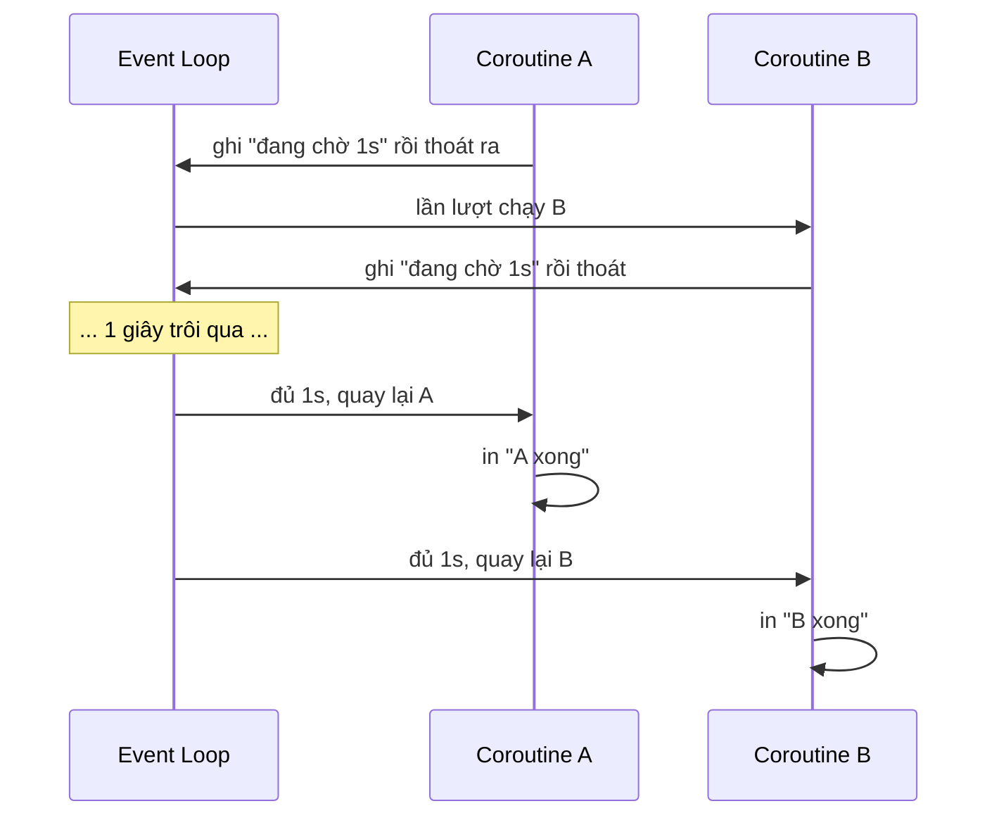

<!-- TỰ ĐỘNG ĐỒNG BỘ từ 03-Thuc-Chien/10-Asyncio/bai.md — đừng sửa trực tiếp, sửa bản chính rồi chạy tools/sync_tracks.py -->

# Bài 39 — Asyncio – Lập Trình Bất Đồng Bộ

> 🎓 **Chương 8 – Lập trình ứng dụng chuyên sâu**

## 🧠 Điều kiện tiên quyết

- [Bài 12 — Hàm (Function) Trong Python](../../Phan-1-Co-Ban/12-Ham/bai.md)
- [Bài 35 — Thư Viện Requests – Gọi API Từ Python](../06-Requests/bai.md)

---

## 🎯 Mục tiêu

Sau bài học này, học viên sẽ:

* ✅ Hiểu khác biệt **chương trình đồng bộ (synchronous)** và **bất đồng bộ (asynchronous)** qua ví dụ đời thực.
* ✅ Định nghĩa được **coroutine** – hàm `async def` – và dùng `await` để chờ.
* ✅ Chạy coroutine bằng **`asyncio.run()`**; tạm dừng bằng **`asyncio.sleep()`**.
* ✅ Chạy **nhiều tác vụ song song** bằng **`asyncio.gather()`**.
* ✅ **Đo và so sánh thời gian** chạy tuần tự so với song song.
* ✅ Biết các **hạn chế** của asyncio và khi nào không nên dùng nó.
* ✅ Áp dụng thực tế: mô phỏng tải nhiều trang web và gọi song song **API thời tiết Open-Meteo**.

---

## 📖 Kiến thức

> 🔁 **Nhắc lại bài trước:** Bài 38 dạy bạn "ký hợp đồng" về kiểu dữ liệu để code dễ đọc, hạn chế bug. Nhưng còn một thứ chậm hơn cả bug — đó là **thời gian chờ**. Khi chờ mạng, chờ ổ cứng, chương trình đứng im. Bài này dạy cách **dùng thời gian chờ đó để làm việc khác**.

### 1. Chương trình đồng bộ – "làm hết việc này rồi mới làm việc kia"

Mọi chương trình bạn viết từ bài 1 đến bài 38 đều **chạy từng dòng một**: dòng này xong rồi mới đến dòng sau.

```python
def tai_trang():
    # Giả sử tải một trang mất 2 giây
    time.sleep(2)
    return "Noi dung trang"

a = tai_trang()   # mất 2 giây
b = tai_trang()   # 2 giây <-- phải chờ a xong mới bắt đầu
# Tổng cộng: 4 giây
```

So sánh đời thường:

| Hình mẫu | Hành vi | Ví dụ |
|---|---|---|
| 🔵 **Đồng bộ** | Một người chỉ làm một việc, xong việc này mới đến việc kia | Đi mua nước: đứng xếp hàng đến lượt mới mua được |
| 🟢 **Bất đồng bộ** | Một người "để lịch chờ" nhiều việc chạy cùng lúc | Vừa nấu cơm vừa chờ máy giặt chạy xong |

`time.sleep(2)` làm **chương trình đông cứng** — máy tính chờ không làm gì trong 2 giây.

### 2. Ví dụ đời thực: Pha trà trong khi chờ nước sôi 🫖

Hãy so sánh hai cách pha trà:

**Cách đồng bộ (tốn thời gian):**

```
Bật ấm đun nước → ĐỨNG NHÌN ấm sôi (3 phút) → rót nước vào ấm trà (1 phút) → lấy bánh (1 phút)
Tổng cộng: 5 phút
```

Bạn đứng nhìn nước sôi mà không làm việc gì hữu ích — đó chính là `time.sleep` bên trong chương trình.

**Cách bất đồng bộ (nhanh):**

```
1. Bật ấm đun nước (nhanh).
2. Trong lúc chờ nước sôi → đi rửa ấm trà, lấy bánh ra bàn.   😴 KHÔNG đứng nhìn ấm
3. Nước sôi → rót nước vào ấm trà, đợi trà ngấm.
4. Hoàn tất, mang trà + bánh ra mời.
```

Tổng thời gian gần bằng **việc lâu nhất (chờ nước sôi)** mà thôi, chứ không phải tổng của tất cả việc.

> 💡 Đây chính là tư tưởng cốt lõi của **asyncio**: khi gặp thao tác **chờ chậm** (đọc file, lấy dữ liệu mạng), hãy **"làm việc khác" trong lúc chờ** thay vì đứng im.

### 3. Coroutine – hàm bất đồng bộ `async def`

Trong Python, hàm thường được khai báo bằng `def`. Hàm **bất đồng bộ (coroutine)** được khai báo bằng **`async def`**:

```python
async def chao():
    return "Xin chao!"
```

| Khai báo | Gọi là gì | Khi gọi xảy ra |
|---|---|---|
| `def` | Hàm thường (đồng bộ) | Thân hàm chạy ngay khi gọi |
| `async def` | **Coroutine** | Chỉ tạo **đối tượng coroutine**, chưa chạy |

> ⚠️ **Quan trọng:** Gọi một coroutine **không chạy nó**. `chao()` chỉ tạo đối tượng coroutine; muốn nó chạy phải **`await`** hoặc đưa vào event loop qua `asyncio.run()`.

### 4. `asyncio.run()` – nơi mọi coroutine bắt đầu

Cách đơn giản nhất để chạy một coroutine:

```python
import asyncio

async def chao():
    print("Bat dau...")
    await asyncio.sleep(1)   # nhường quyền điều phối 1 giây
    print("Xong!")
    return "OK"

asyncio.run(chao())
```

* `asyncio.run(main())` tạo **event loop** (vòng lặp điều phối), chạy coroutine đến khi hết, rồi đóng loop.
* Chỉ nên gọi **một lần duy nhất** trong chương trình — thường ở dòng cuối cùng.

### 5. `asyncio.sleep()` – tạm dừng nhưng không chặn chương trình

`time.sleep(2)` chặn cả chương trình không làm gì. Ngược lại, **`await asyncio.sleep(2)`** chỉ tạm dừng **coroutine hiện tại**; event loop sẽ chạy **coroutine khác** trong lúc chờ.



### 6. `asyncio.gather()` – chạy nhiều coroutine **song song**

Công cụ quan trọng nhất để "chạy cùng lúc":

```python
import asyncio

async def cong_viec(ten: str, so_giay: int) -> str:
    await asyncio.sleep(so_giay)          # tạm dừng, để loop làm việc khác
    return f"{ten} xong sau {so_giay}s"

async def main() -> None:
    # Cả 3 coroutine cùng đua vào loop, chạy gần như đồng thời
    ket_qua = await asyncio.gather(
        cong_viec("A", 2),
        cong_viec("B", 1),
        cong_viec("C", 3),
    )
    print(ket_qua)   # ['A xong sau 2s', 'B xong sau 1s', 'C xong sau 3s']

asyncio.run(main())
```

* `asyncio.gather(a, b, c, ...)` nhận **nhiều coroutine** và chạy **song song**.
* `await` trước `gather` nghĩa là chờ **tất cả** hoàn thành.
* Kết quả trả về là **danh sách theo đúng thứ tự đầu vào** (không phải thứ tự xong trước).
* Tổng thời gian = `max(2, 1, 3) = 3 giây`, chứ **không phải** `2 + 1 + 3 = 6 giây`.

### 7. Đồng bộ vs bất đồng bộ – bảng so sánh

| Tiêu chí | 🔵 Đồng bộ | 🟢 Bất đồng bộ |
|---|---|---|
| Cách thực thi | Từng tác vụ một, hết rồi mới tới tác vụ sau | Dừng ở chỗ chờ để chạy tác vụ khác |
| Ví dụ pha trà | Đứng nhìn ấm nước | Rửa tách trà trong lúc nước sôi |
| Thời gian 3 tác vụ 1s | 3 giây | ~1 giây |
| Độ khó viết | Dễ hiểu, ít sai | Phải hiểu rõ `await` để tránh sai sót |
| Phù hợp khi | I/O nhỏ, tính toán CPU | Chờ mạng, đọc file lớn, đồng bộ nhiều trang |

### 8. Đo và so sánh thời gian thực tế

Dùng `time.perf_counter()` để đo từng cách:

```python
import asyncio
import time

async def tai(n: int) -> int:
    """Giả lập tải nặng n giây."""
    await asyncio.sleep(n)
    return n

async def chay_song_song() -> float:
    bat = time.perf_counter()
    await asyncio.gather(tai(1), tai(1), tai(1))   # chạy đồng thời
    return time.perf_counter() - bat

async def chay_tuan_tu() -> float:
    bat = time.perf_counter()
    for _ in range(3):
        await tai(1)                               # tuần tự từng cái một
    return time.perf_counter() - bat

async def main() -> None:
    print(f"Song song: {await chay_song_song():.2f}s")
    print(f"Tuan tu:   {await chay_tuan_tu():.2f}s")

asyncio.run(main())
```

Kết quả điển hình: `Song song: 1.00s — Tuan tu: 3.00s`.

### 9. Ví dụ thực tế: chờ nhiều API song song với Open-Meteo

Python 3.9 có hàm tiện dụng **`asyncio.to_thread()`** — chạy một hàm đồng bộ (blocking) trong một luồng riêng, **không cần cài thêm thư viện**. Kết hợp với `gather`, ta tải nhiệt độ nhiều thành phố cùng lúc:

```python
import asyncio
import json
import urllib.request
from typing import Dict

def lay_nhiet_do(thanh_pho: str, vi_do: float, kinh_do: float) -> Dict[str, object]:
    """Chạy đồng bộ: gọi Open-Meteo, đọc JSON nhiệt độ hiện tại."""
    url = (f"https://api.open-meteo.com/v1/forecast?latitude={vi_do}"
           f"&longitude={kinh_do}&current_weather=true")
    with urllib.request.urlopen(url, timeout=10) as phan_hoi:
        du_lieu = json.loads(phan_hoi.read().decode("utf-8"))
    nhiet_do = du_lieu["current_weather"]["temperature"]
    return {"thanh_pho": thanh_pho, "nhiet_do": nhiet_do}

async def tai_nhiet_do(*args) -> Dict[str, object]:
    """Bọc công việc chặn vào luồng riêng — event loop KHÔNG bị chặn."""
    return await asyncio.to_thread(lay_nhiet_do, *args)

async def main() -> None:
    cac_thanh_pho = [
        ("Ha Noi", 21.03, 105.85),
        ("Da Nang", 16.07, 108.22),
        ("TP.HCM", 10.82, 106.63),
    ]
    ket_qua = await asyncio.gather(*(tai_nhiet_do(*tp) for tp in cac_thanh_pho))
    for kq in ket_qua:
        print(f"{kq['thanh_pho']}: {kq['nhiet_do']}°C")

asyncio.run(main())
```

* `lay_nhiet_do` là hàm đồng bộ (gọi HTTP truyền thống bằng `urllib`).
* `tai_nhiet_do` là coroutine — dùng `to_thread` để đẩy công việc "chờ mạng" ra **luồng riêng**, event loop tiếp tục điều phối các thành phố khác.
* Cả 3 thành phố được tải **cùng lúc**; tổng thời gian ≈ thời gian thành phố chậm nhất.

### 10. Hạn chế của asyncio – khi nào KHÔNG nên dùng?

`asyncio` **không thần thánh** — nó chạy trên **một luồng duy nhất** và chỉ tăng tốc khi chờ **I/O** (mạng, ổ đĩa, bàn phím...). Không tăng tốc được tác vụ nặng về CPU.

| Trường hợp | Nên dùng |
|---|---|
| Chờ mạng, tải nhiều trang | 🟢 **asyncio** (gather) |
| Đọc/ghi nhiều file lớn | 🟢 **asyncio.to_thread** |
| Tính toán nặng CPU (lặp tỷ lần, xử lý ảnh) | 🔴 **multiprocessing** (chạy đa lõi) |
| Cần chạy 2 hàm đều tốn CPU | 🔴 **threading** / `multiprocessing` |
| Chương trình I/O đơn lẻ, ít tác vụ | 🔵 Đồng bộ cũng đủ |

---

## 💡 Ví dụ minh họa

### Ví dụ 1: Chào hỏi bất đồng bộ

```python
import asyncio

async def chao(ten: str) -> str:
    """Tạo câu chào (mô phỏng một chờ nhỏ)."""
    await asyncio.sleep(0.5)      # một việc nhanh nhưng vẫn "nhường CPU"
    return f"Xin chao {ten}!"

async def main() -> None:
    loi_chao = await chao("Mai")  # await = chờ kết quả coroutine
    print(loi_chao)

asyncio.run(main())
```

| Dòng code | Ý nghĩa |
|---|---|
| `async def chao` | Khai báo coroutine |
| `await asyncio.sleep(0.5)` | Tạm dừng 0.5s, không chặn event loop |
| `await chao("Mai")` | Chờ kết quả của coroutine |
| `asyncio.run(main())` | Tạo event loop, chạy `main`, đóng loop |

### Ví dụ 2: Hai tác vụ song song + đo thời gian

```python
import asyncio
import time

async def tai_tin(ten: str, giay: float) -> str:
    await asyncio.sleep(giay)     # giả lập thời gian tải
    return f"{ten} tai xong sau {giay}s"

async def main() -> None:
    bat = time.perf_counter()
    ket_qua = await asyncio.gather(
        tai_tin("trang A", 2),
        tai_tin("trang B", 3),
    )
    print(ket_qua)
    # Song song: max(2,3) = 3 giây, KHÔNG phải 2+3=5 giây
    print(f"Tong: {time.perf_counter() - bat:.1f}s")

asyncio.run(main())
```

### Ví dụ 3: Mô phỏng tải nhiều trang web

```python
import asyncio
import time
import random

async def tai_trang(so_luot: int) -> str:
    giay = random.uniform(0.5, 1.5)   # thời gian tải "ngẫu nhiên"
    await asyncio.sleep(giay)
    return f"trang{so_luot} xong sau {giay:.1f}s"

async def main() -> None:
    bat = time.perf_counter()
    cac_trang = [tai_trang(i) for i in range(1, 6)]
    for ket in await asyncio.gather(*cac_trang):
        print(ket)
    print(f"Tong {time.perf_counter() - bat:.2f}s")   # ≈ trang chậm nhất

asyncio.run(main())
```

---

## 🔬 Ví dụ nâng cao

### Ví dụ 1: Giới hạn thời gian chờ với `asyncio.wait_for`

Khi một API quá chậm, đừng để chương trình treo vô hạn — đặt **timeout**:

```python
import asyncio

async def tai_nguon_teo() -> str:
    await asyncio.sleep(30)              # ví dụ thật sự chậm
    return "Du lieu"

async def main() -> None:
    try:
        du_lieu = await asyncio.wait_for(tai_nguon_teo(), timeout=2)
        print(du_lieu)
    except asyncio.TimeoutError:
        print("Qua han 2 giay — bo qua, khoi treo chuong trinh!")

asyncio.run(main())
```

### Ví dụ 2: Xử lý lỗi trong `gather` bằng `return_exceptions`

Nếu 1 task lỗi, mặc định `gather` ném lỗi và hủy các task còn lại. Dùng `return_exceptions=True` để tách riêng:

```python
import asyncio

async def go_api(duong_dan: str) -> str:
    await asyncio.sleep(1)
    if duong_dan == "fail":
        raise ValueError("Loi ket noi API!")
    return f"Du lieu {duong_dan}"

async def main() -> None:
    ket_qua = await asyncio.gather(
        go_api("user"),
        go_api("product"),
        go_api("fail"),
        return_exceptions=True,   # lỗi trở thành phần tử, không hủy toàn bộ
    )
    for kq in ket_qua:
        if isinstance(kq, BaseException):
            print("LOI:", kq)
        else:
            print(kq)

asyncio.run(main())
```

### Ví dụ 3: Báo cáo thời gian tải N trang

Ví dụ hoàn chỉnh: tải 8 trang song song rồi in tổng thời gian và danh sách kết quả.

```python
import asyncio
import random
import time

async def tai(ma: int) -> int:
    await asyncio.sleep(random.uniform(0.5, 2.0))
    return ma

async def main() -> None:
    bat = time.perf_counter()
    ket_qua = await asyncio.gather(*(tai(i) for i in range(1, 9)))
    print("Ket qua:", ket_qua)
    print(f"Tong {len(ket_qua)} trang, mat {time.perf_counter() - bat:.2f}s")

asyncio.run(main())
```

---

## ⚠️ Lỗi thường gặp

### Lỗi 1: Gọi coroutine nhưng không `await`

```python
async def chao():
    return "hi"

kq = chao()          # ❌ Chưa chạy — chỉ tạo coroutine
print(kq)            # <coroutine object chao at ...>
```

* **Nguyên nhân:** quên `await`.
* **Hệ quả:** `RuntimeWarning: coroutine 'chao' was never awaited`.
* **Cách sửa:** khai báo `async def main(): ...` và `await chao()` bên trong.

### Lỗi 2: Nhầm `time.sleep` với `asyncio.sleep` trong coroutine

```python
import time

async def xu_ly() -> None:
    time.sleep(2)   # ❌ chặn event loop — các tác vụ khác phải chờ
```

* **Nguyên nhân:** `time.sleep` là hàm đồng bộ, chặn thread chính → event loop đứng im.
* **Cách sửa:** dùng `await asyncio.sleep(2)` (hoặc nếu thật sự cần blocking → `asyncio.to_thread`).

### Lỗi 3: Gọi `asyncio.run()` lồng nhau

```python
async def inner():
    await asyncio.sleep(0)

async def main():
    asyncio.run(inner())   # ❌ RuntimeError: asyncio.run() cannot be called
                           #   from a running event loop
```

**Cách sửa:** Chỉ gọi `asyncio.run()` **một lần** ở dòng cuối. Bên trong coroutine chỉ dùng `await`.

### Lỗi 4: Tưởng asyncio sẽ tăng tốc các tác vụ tính toán nặng

```python
async def tinh_toan_nang():
    for i in range(10**8):
        pass
```

* **Nguyên nhân:** event loop chạy **1 luồng** — công CPU không được chia ra nhiều lõi.
* **Cách sửa:** với tác vụ CPU-bound dùng `multiprocessing`; asyncio chỉ phù hợp chờ I/O.

### Lỗi 5: Quên xử lý ngoại lệ trong `gather`

```python
# ❌ Một task lỗi → ném lỗi, hủy toàn bộ task còn lại
await asyncio.gather(task_ok, task_fail)
```

* **Cách sửa:** dùng `return_exceptions=True` hoặc bọc lỗi ngay trong từng coroutine bằng `try/except`.

---

## 💎 Mẹo

* ✨ **Mỗi lần thấy chương trình đứng chờ** (mạng, file, tải dữ liệu) → hãy bọc thao tác đó trong `await asyncio...`.
* 🧵 **`asyncio.to_thread`** biến hàm "block" thành "chờ thông minh" — không cần cài thư viện thêm.
* ⏱️ **`time.perf_counter()`** để đo thời gian chính xác thay vì `time.time()`.
* 🧽 **`return_exceptions=True`** giữ cho `gather` không sụp đổ toàn cục khi một task lỗi.
* ⏰ **`asyncio.wait_for(...)`** chống treo khi API bên ngoài chậm bất thường.
* 📁 **Tách nhỏ coroutine** thành từng hàm, đặt tên có hậu tố `tai`, `go`, `fetch` để dễ nhận biết.
* 📝 **Tóm tắt nhanh:** chờ bằng lệnh → `await asyncio.sleep`; chạy nhiều việc → `gather`; gọi hàm đồng bộ chậm → `to_thread`; giới hạn chờ → `wait_for`.

---

## 📝 Tóm tắt

| Khái niệm | Nội dung |
|---|---|
| ⚡ Đồng bộ | Làm việc này xong rồi mới làm việc kia |
| 🧵 Bất đồng bộ | Tạm dừng ở chỗ chờ, làm việc khác trong lúc chờ |
| 🌀 `async def` | Tạo coroutine |
| 🧷 `await` | Chờ kết quả + nhường điều phối |
| 🏠 `asyncio.run(coro)` | Điểm vào duy nhất để chạy coroutine |
| 😴 `await asyncio.sleep(n)` | Tạm dừng coroutine này mà không chặn loop |
| 🧲 `asyncio.gather(...)` | Chạy nhiều coroutine song song, trả danh sách kết quả |
| 🧵 `asyncio.to_thread(...)` | Chạy hàm đồng bộ trong luồng riêng |
| ⏰ `asyncio.wait_for(...)` | Giới hạn thời gian chờ — tránh treo vô hạn |
| ⚠️ Hạn chế | 1 luồng, không tăng tốc CPU-bound |

---

## 🧪 Kiểm tra nhanh

1. ❓ Coroutine được khai báo bằng từ khóa nào?
2. ❓ Gọi trực tiếp `chao()` (hàm `async def`) thì điều gì xảy ra?
3. ❓ Mục đích của `await` là gì?
4. ❓ `await asyncio.sleep(1)` khác `time.sleep(1)` ra sao?
5. ❓ Công cụ nào chạy nhiều coroutine song song và trả kết quả?
6. ❓ Event loop của asyncio chạy trên bao nhiêu luồng chính?
7. ❓ Vì sao asyncio không tăng tốc các tác vụ tính toán nặng?
8. ❓ Trong `gather`, tham số nào cho phép task lỗi không hủy các task còn lại?
9. ❓ Công cụ nào giới hạn thời gian chờ một tác vụ?
10. ❓ Ba task mỗi task `sleep(2)`, dùng `gather` thì mất tổng bao nhiêu giây?

<details>
<summary>🔍 Xem đáp án</summary>

1. `async def`.
2. Trả về một coroutine — **không** chạy; cần `await` hoặc đưa vào `asyncio.run`.
3. Chờ kết quả của coroutine và nhường điều phối cho việc khác.
4. `time.sleep` chặn cả event loop; `asyncio.sleep` chỉ tạm dừng coroutine đang chạy.
5. `asyncio.gather()`.
6. Một luồng duy nhất.
7. Vì một luồng không tận dụng được đa lõi CPU; asyncio chỉ chia sẻ thời gian chờ I/O.
8. `return_exceptions=True`.
9. `asyncio.wait_for(task, timeout=n)`.
10. `max(2,2,2) = 2` giây.

</details>

---

## 📚 Bài đọc thêm

* [Python docs – asyncio (thư viện chuẩn)](https://docs.python.org/3/library/asyncio.html)
* [asyncio – High-level API](https://docs.python.org/3/library/asyncio-api.html)
* [Real Python – Async IO in Python](https://realpython.com/async-io-python/)
* [Open-Meteo – API thời tiết tự do](https://open-meteo.com/)

---

---

## 🧩 Bài tập

> 📝 🎯 **Chủ đề:** Coroutine (`async def`), `await`, `asyncio.run()`, `asyncio.sleep()`, `asyncio.gather()`, đo thời gian, mô phỏng tải trang và gọi API Open-Meteo.

## 🟢 Dễ (Bài 1 – 7)

### Bài 1: Coroutine đầu tiên

* **Đề bài:** Viết coroutine `chao() -> str` in ra `"Bat dau"`, sau đó `await asyncio.sleep(1)` rồi in `"Xong"` và trả về `"OK"`. Chạy bằng `asyncio.run()`.
* **Input:** Không có.
* **Output:**
  ```
  Bat dau
  Xong
  ```
* **Gợi ý:** Nhớ `import asyncio`; cuối file gọi `asyncio.run(chao())`.

### Bài 2: Hàm chào có tham số

* **Đề bài:** Viết coroutine `chao(ten: str) -> str` trả về `"Xin chao, <ten>!"` sau khi chờ `asyncio.sleep(0.5)`. Gọi với tên `Mai` và in kết quả.
* **Input:** Không có.
* **Output:**
  ```
  Xin chao, Mai!
  ```
* **Gợi ý:** `return f"Xin chao, {ten}!"`; dùng `await chao("Mai")` trong `main`.

### Bài 3: Đếm từ 1 đến 3

* **Đề bài:** Viết coroutine `dem(n: int) -> None` in các số từ 1 đến n, giữa mỗi số `await asyncio.sleep(1)`. Gọi `dem(3)`.
* **Input:** Không có.
* **Output:**
  ```
  1
  2
  3
  ```
* **Gợi ý:** Vòng lặp `for i in range(1, n + 1): print(i); await asyncio.sleep(1)`.

### Bài 4: Coroutine trả tổng

* **Đề bài:** Viết coroutine `tinh_tong(a: int, b: int) -> int` trả `a + b` (kèm `await asyncio.sleep(0.1)` mô phỏng công việc). In kết quả `tinh_tong(3, 4)`.
* **Input:** Không có.
* **Output:**
  ```
  7
  ```
* **Gợi ý:** `async def tinh_tong(a: int, b: int) -> int:`.

### Bài 5: Hai câu tuần tự

* **Đề bài:** Viết `main()`: gọi `await chao("An")` rồi `await chao("Binh")` (mỗi lần in câu chào). Đây là chạy **tuần tự**.
* **Input:** Không có.
* **Output:**
  ```
  Xin chao, An!
  Xin chao, Binh!
  ```
* **Gợi ý:** Hai dòng `print(await chao(...))` liên tiếp nhau.

### Bài 6: Gather hai việc

* **Đề bài:** Viết coroutine `lam_viec(ten: str, giay: float) -> str` trả `f"{ten} xong sau {giay}s"`. Dùng `asyncio.gather` chạy 2 việc song song và in danh sách kết quả.
* **Input:** Không có.
* **Output:**
  ```
  ['A xong sau 2s', 'B xong sau 1s']
  ```
* **Gợi ý:** `ket_qua = await asyncio.gather(lam_viec("A", 2), lam_viec("B", 1))`.

### Bài 7: Đo thời gian một tác vụ

* **Đề bài:** Dùng `time.perf_counter()` đo thời gian chạy `await asyncio.sleep(2)` trong coroutine, in ra `"Mat: X.XXs"`.
* **Input:** Không có.
* **Output:**
  ```
  Mat: 2.00s
  ```
* **Gợi ý:** `bat = time.perf_counter()` trước, `time.perf_counter() - bat` sau.

---

## 🟡 Trung bình (Bài 8 – 14)

### Bài 8: Mô phỏng tải 3 trang song song

* **Đề bài:** Viết coroutine `tai_trang(so_thu_tu: int) -> str` in `f"Trang {so_thu_tu}: tai xong"` sau khi chờ `asyncio.sleep` ngẫu nhiên `random.uniform(0.5, 1.5)`. Tải 3 trang bằng `gather`.
* **Input:** Không có.
* **Output:** (thứ tự có thể khác nhau)
  ```
  Trang 1: tai xong
  Trang 2: tai xong
  Trang 3: tai xong
  ```
* **Gợi ý:** Tạo list `[tai_trang(i) for i in range(1, 4)]` rồi `await asyncio.gather(*list)`.

### Bài 9: So sánh tuần tự vs song song

* **Đề bài:** Chạy 3 tác vụ `tai(1 giây)` theo 2 cách: tuần tự (3 lần `await` lần lượt) và song song (`gather`). In thời gian cả hai.
* **Input:** Không có.
* **Output:**
  ```
  Tuan tu: 3.00s
  Song song: 1.00s
  ```
* **Gợi ý:** Đo bằng `time.perf_counter()` quanh từng đoạn.

### Bài 10: Danh sách tác vụ động

* **Đề bài:** Viết `tai_nhieu(n: int)` dùng list comprehension tạo **n** coroutine `tai_trang(i)` rồi `gather`. Gọi `tai_nhieu(5)` và in từng dòng `"Tai xong trang i"`.
* **Input:** Không có.
* **Output:**
  ```
  Tai xong trang 1
  Tai xong trang 2
  Tai xong trang 3
  Tai xong trang 4
  Tai xong trang 5
  ```
* **Gợi ý:** `cac_tac_vu = [tai_trang(i) for i in range(1, n + 1)]`.

### Bài 11: Lấy kết quả từ gather

* **Đề bài:** Coroutine `tinh(n: int) -> int` trả `n * n` sau khi chờ `asyncio.sleep(0.5)`. Dùng `gather` tính bình phương của `[2, 3, 4]` và in danh sách kết quả.
* **Input:** Không có.
* **Output:**
  ```
  [4, 9, 16]
  ```
* **Gợi ý:** `[tinh(x) for x in [2, 3, 4]]` rồi `gather(*...)`.

### Bài 12: Coroutine gọi coroutine

* **Đề bài:** Viết coroutine `chuan_bi() -> str` (chờ 0.5s, trả `"da chuan bi"`), và coroutine `chay() -> str` gọi `await chuan_bi()` rồi trả `f"Xong - {kq}"`. In kết quả của `chay()`.
* **Input:** Không có.
* **Output:**
  ```
  Xong - da chuan bi
  ```
* **Gợi ý:** Trong coroutine con có thể `await` coroutine khác.

### Bài 13: Thời gian mô phỏng 10 trang

* **Đề bài:** Tải 10 trang, mỗi trang chờ `random.uniform(0.2, 1.0)`. In tổng thời gian (dùng `perf_counter`) và số trang đã tải. Mục tiêu: tổng thời gian nhỏ hơn 2 giây.
* **Input:** Không có.
* **Output:**
  ```
  Tai xong 10 trang trong X.XXs
  ```
* **Gợi ý:** `gather` toàn bộ; in `len(ket_qua)`.

### Bài 14: Kiểm tra một task lỗi — return_exceptions

* **Đề bài:** Coroutine `go_api(ten: str) -> str` ném `ValueError("Loi API")` nếu `ten == "fail"`, ngược lại trả `f"Du lieu {ten}"`. Dùng `gather(..., return_exceptions=True)` với `"user"` và `"fail"`; in từng kết quả (lỗi thì in `LOI:` trước).
* **Input:** Không có.
* **Output:**
  ```
  Du lieu user
  LOI: Loi API
  ```
* **Gợi ý:** `isinstance(kq, BaseException)` để nhận diện lỗi.

---

## 🔴 Khó (Bài 15 – 20)

### Bài 15: wait_for — chống treo

* **Đề bài:** Coroutine `tai_rat_lau() -> str` chờ `asyncio.sleep(10)`. Dùng `asyncio.wait_for(tai_rat_lau(), timeout=2)` và bắt `asyncio.TimeoutError`; in `"Qua han 2 giay, bo tac vu."`.
* **Input:** Không có.
* **Output:**
  ```
  Qua han 2 giay, bo tac vu.
  ```
* **Gợi ý:** Bọc trong `try/except asyncio.TimeoutError`.

### Bài 16: Tải trang nhanh nhất

* **Đề bài:** Tạo 5 tác vụ tải trang (chờ ngẫu nhiên 0.5–2.0s). Dùng `asyncio.gather` lấy kết quả, tìm và in **trang xong nhanh nhất** (dùng `min` theo thời gian chờ ghi trong chuỗi kết quả hoặc min theo thứ tự).
* **Input:** Không có.
* **Output:**
  ```
  Trang nhanh nhat: trangX (0.50s)
  ```
* **Gợi ý:** Trả về tuple `(giay, ten)` từ coroutine để dễ so sánh.

### Bài 17: Open-Meteo — nhiệt độ 3 thành phố

* **Đề bài:** Dùng `asyncio.to_thread` + `urllib` gọi Open-Meteo (`https://api.open-meteo.com/v1/forecast?latitude={lat}&longitude={lon}&current_weather=true`) cho Hà Nội (21.03, 105.85), Đà Nẵng (16.07, 108.22), TP.HCM (10.82, 106.63). In `Ten: X.X°C` cho mỗi thành phố.
* **Input:** Không có (cần mạng).
* **Output:**
  ```
  Ha Noi: 28.4°C
  Da Nang: 30.1°C
  TP.HCM: 31.2°C
  ```
* **Gợi ý:** Hàm đồng bộ `lay_nhiet_do(...)` dùng `urllib.request.urlopen`, JSON lấy `du_lieu["current_weather"]["temperature"]`.

### Bài 18: API với giới hạn thời gian

* **Đề bài:** Mở rộng bài 17: bọc toàn bộ tác vụ tải trong `asyncio.wait_for(..., timeout=5)`. Nếu quá hạn, in `"Thanh pho X: het thoi gian"` thay vì nhiệt độ.
* **Input:** Không có (cần mạng).
* **Output:**
  ```
  Ha Noi: 28.4°C
  ...
  ```
* **Gợi ý:** Bắt `asyncio.TimeoutError` quanh `gather` hoặc quanh từng tác vụ.

### Bài 19: Trình tải tổng hợp có báo cáo

* **Đề bài:** Viết `main()`: tải **8 trang mô phỏng** (chờ ngẫu nhiên), đồng thời gọi **3 API thời tiết** (to_thread). In: tổng thời gian, số trang tải được, danh sách nhiệt độ. Dùng hai `gather` riêng biệt.
* **Input:** Không có (phần API cần mạng).
* **Output:**
  ```
  Tai duoc 8/8 trang
  Nhiet do: Ha Noi 28.4°C, Da Nang 30.1°C, TP.HCM 31.2°C
  Tong thoi gian: 1.35s
  ```
* **Gợi ý:** Chạy lần lượt hai `gather` trong `main`; cộng dồn thời gian.

### Bài 20: Speed test bất đồng bộ hoàn chỉnh

* **Đề bài:** Viết chương trình kiểm tra tốc độ: hàm `do_toc_do(ten: str, n: int)` chạy `n` tác vụ tải 0.5s và trả `(ten, thoi_gian)`. Chạy 3 lần đo song song với `gather`, in bảng kết quả và xếp hạng nhanh – chậm.
* **Input:** Không có.
* **Output:**
  ```
  Lan 1: 0.51s
  Lan 2: 0.50s
  Lan 3: 0.52s
  Nhanh nhat: Lan 2 (0.50s)
  ```
* **Gợi ý:** `gather` trả danh sách tuple `(ten, giay)`; sắp xếp bằng `sorted(..., key=lambda x: x[1])`.

---

## 🎯 Tổng kết sau khi làm bài

Sau 20 bài tập, bạn đã:

* ✅ Viết và chạy coroutine bằng `asyncio.run`, dùng `await` đúng cách.
* ✅ Chạy song song với `asyncio.gather` và so sánh thời gian với cách tuần tự.
* ✅ Mô phỏng tải nhiều trang web và gọi API Open-Meteo song song.
* ✅ Chống treo bằng `wait_for` và xử lý lỗi bằng `return_exceptions`.

> 💪 **Mẹo học:** Hãy viết 3 đoạn code "đồng bộ → gather → đo thời gian" từ đầu để thành phản xạ khi gặp bất kỳ tác vụ I/O nào.

---

## ✅ Đáp án

> 💡 **Hãy tự làm bài tập trước** rồi mới mở đáp án.

## 🟢 Dễ (Bài 1 – 7)


<details>
<summary>✅ Bài 1: Coroutine đầu tiên</summary>


**Phân tích:** Bài đầu làm quen cấu trúc tối thiểu của chương trình asyncio: khai báo coroutine, `await asyncio.sleep`, và chạy bằng `asyncio.run`.

**Ý tưởng:** Các câu lệnh bên trong coroutine chạy tuần tự; `asyncio.sleep(1)` chỉ tạm dừng coroutine này mà không chặn cả chương trình.

**Thuật toán:**
1. `import asyncio`.
2. Khai báo coroutine `chao`.
3. In `Bat dau` → `await asyncio.sleep(1)` → in `Xong` → `return "OK"`.
4. `asyncio.run(chao())`.

**Code:**

```python
import asyncio

async def chao() -> str:
    """Coroutine đơn giản: in, chờ, in, trả về."""
    print("Bat dau")
    await asyncio.sleep(1)     # tạm dừng 1 giây — không chặn event loop
    print("Xong")
    return "OK"

asyncio.run(chao())
```

**Giải thích code:**
* `async def chao()` khai báo coroutine (hàm bất đồng bộ).
* `await asyncio.sleep(1)` là quãng chờ — nếu chạy song song với tác vụ khác, khoảng thời gian này sẽ được tận dụng.
* `asyncio.run(chao())` là điểm vào duy nhất để khởi động event loop.

**Độ phức tạp:** O(1) — chỉ in và chờ cố định.

---

</details>

<details>
<summary>✅ Bài 2: Hàm chào có tham số</summary>


**Phân tích:** Coroutine cũng nhận tham số và khai báo type hints như hàm thường (ôn bài 38).

**Ý tưởng:** `await asyncio.sleep(0.5)` mô phỏng "đang làm việc" rồi trả về f-string.

**Thuật toán:**
1. Khai báo `async def chao(ten: str) -> str`.
2. `await asyncio.sleep(0.5)`.
3. `return f"Xin chao, {ten}!"`.
4. Trong `main`: `print(await chao("Mai"))`.

**Code:**

```python
import asyncio

async def chao(ten: str) -> str:
    """Tạo lời chào cho một cái tên."""
    await asyncio.sleep(0.5)
    return f"Xin chao, {ten}!"

async def main() -> None:
    loi_chao = await chao("Mai")
    print(loi_chao)

asyncio.run(main())
```

**Giải thích code:**
* `await chao("Mai")` — chờ coroutine hoàn thành rồi lấy giá trị trả về (chuỗi).
* Nếu có coroutine khác đang chạy, event loop sẽ điều phối nó trong lúc 0.5s này.

**Độ phức tạp:** O(1).

---

</details>

<details>
<summary>✅ Bài 3: Đếm từ 1 đến 3</summary>


**Phân tích:** Kết hợp vòng lặp `for` bên trong coroutine; mỗi vòng lặp có một lần "chờ".

**Ý tưởng:** "Cứ mỗi giây in một số" — `await asyncio.sleep(1)` đặt ngay trong vòng lặp.

**Thuật toán:**
1. Khai báo `async def dem(n: int) -> None`.
2. Vòng lặp từ 1 đến n: in i rồi `await asyncio.sleep(1)`.
3. Gọi `dem(3)`.

**Code:**

```python
import asyncio

async def dem(n: int) -> None:
    """In các số từ 1 đến n, mỗi số cách nhau 1 giây."""
    for i in range(1, n + 1):
        print(i)
        await asyncio.sleep(1)   # giữa mỗi số chờ đúng 1 giây

asyncio.run(dem(3))
```

**Giải thích code:**
* `-> None` vì hàm chỉ in ra, không trả về.
* Mỗi vòng lặn `await asyncio.sleep(1)` chỉ dừng coroutine này — các coroutine khác vẫn chạy bình thường.

**Độ phức tạp:** O(n) vòng lặp cộng n lần chờ.

---

</details>

<details>
<summary>✅ Bài 4: Coroutine trả tổng</summary>


**Phân tích:** Coroutine có thể tính toán và trả về giá trị như hàm thường — điểm khác là cách chạy (qua event loop).

**Ý tưởng:** Chờ 0.1 giây (giả lập trước khi tính) rồi `return a + b`.

**Thuật toán:**
1. Khai báo `async def tinh_tong(a: int, b: int) -> int`.
2. `await asyncio.sleep(0.1)`.
3. `return a + b`.
4. In `await tinh_tong(3, 4)`.

**Code:**

```python
import asyncio

async def tinh_tong(a: int, b: int) -> int:
    """Trả về tổng hai số sau một chờ nhỏ."""
    await asyncio.sleep(0.1)
    return a + b

async def main() -> None:
    print(await tinh_tong(3, 4))

asyncio.run(main())
```

**Giải thích code:**
* Kết quả là giá trị `7` mà coroutine trả về sau khi hoàn thành.
* Type hints giúp biết chắc `await tinh_tong(...)` luôn trả `int`.

**Độ phức tạp:** O(1).

---

</details>

<details>
<summary>✅ Bài 5: Hai câu tuần tự</summary>


**Phân tích:** Hai lần `await` liên tiếp — việc đầu xong mới đến việc sau (chạy tuần tự).

**Ý tưởng:** Gọi `await chao("An")`, in; rồi `await chao("Binh")`, in.

**Thuật toán:**
1. Viết `async def main() -> None`.
2. Dòng đầu: `print(await chao("An"))`.
3. Dòng thứ hai: `print(await chao("Binh"))`.

**Code:**

```python
import asyncio

async def chao(ten: str) -> str:
    await asyncio.sleep(0.5)
    return f"Xin chao, {ten}!"

async def main() -> None:
    # Chạy tuần tự: chờ hết câu đầu rồi mới bắt câu sau
    print(await chao("An"))     # 0.5 giây
    print(await chao("Binh"))   # cộng thêm 0.5 giây → tổng 1 giây

asyncio.run(main())
```

**Giải thích code:**
* Hai `await` nối tiếp nhau nghĩa là thời gian chờ **cộng dồn**: 0.5 + 0.5 = 1s.
* Muốn nhanh hơn phải dùng `gather` — chính là bài 6.

**Độ phức tạp:** O(1) nhưng tổng thời gian chờ bằng tổng các lần chờ.

---

</details>

<details>
<summary>✅ Bài 6: Gather hai việc</summary>


**Phân tích:** Khác biệt lớn nhất so với bài 5: hai coroutine chạy **song song** trong cùng khoảng thời gian.

**Ý tưởng:** `asyncio.gather(a, b)` đăng ký cả hai vào event loop; `await` chờ **tất cả**; kết quả là danh sách đúng thứ tự đầu vào.

**Thuật toán:**
1. Khai báo `async def lam_viec(ten: str, giay: float) -> str`.
2. `await asyncio.sleep(giay)`.
3. `return f"{ten} xong sau {giay}s"`.
4. `ket_qua = await asyncio.gather(lam_viec("A", 2), lam_viec("B", 1))`.
5. In `ket_qua`.

**Code:**

```python
import asyncio

async def lam_viec(ten: str, giay: float) -> str:
    """Mô phỏng một công việc tốn giây."""
    await asyncio.sleep(giay)
    return f"{ten} xong sau {giay}s"

async def main() -> None:
    # Hai coroutine đã được nạp đồng thời vào event loop
    ket_qua = await asyncio.gather(
        lam_viec("A", 2),
        lam_viec("B", 1),
    )
    print(ket_qua)

asyncio.run(main())
```

**Giải thích code:**
* `gather` chạy song song → tổng thời gian `max(2, 1) = 2s`, không phải `3s`.
* Thứ tự kết quả theo thứ tự đầu vào: `['A xong sau 2s', 'B xong sau 1s']`.

**Độ phức tạp:** O(max) của các lần chờ.

---

</details>

<details>
<summary>✅ Bài 7: Đo thời gian một tác vụ</summary>


**Phân tích:** Dùng `time.perf_counter()` — đồng hồ đo thời gian chính xác cao.

**Ý tưởng:** Ghi nhận thời điểm trước và sau khi chờ; hiệu hai thời điểm là thời gian trôi qua.

**Thuật toán:**
1. `import asyncio, time`.
2. Trong coroutine: `bat = time.perf_counter()`.
3. `await asyncio.sleep(2)`.
4. In `(time.perf_counter() - bat)` làm tròn 2 chữ số.

**Code:**

```python
import asyncio
import time

async def main() -> None:
    bat = time.perf_counter()
    await asyncio.sleep(2)          # tác vụ cần đo
    mat = time.perf_counter() - bat
    print(f"Mat: {mat:.2f}s")

asyncio.run(main())
```

**Giải thích code:**
* `time.perf_counter()` trả số giây kiểu float (độ phân giải rất cao).
* `f"{mat:.2f}s"` in ra `2.00s`.

**Độ phức tạp:** O(1).

---

</details>

## 🟡 Trung bình (Bài 8 – 14)


<details>
<summary>✅ Bài 8: Mô phỏng tải 3 trang song song</summary>


**Phân tích:** 3 trang web tải cùng lúc — mỗi trang mất thời gian ngẫu nhiên; dùng `gather` chạy song song. `random` mô phỏng sự khác nhau của mạng.

**Ý tưởng:** `random.uniform(0.5, 1.5)` tạo thời gian chờ; tổng thời gian cả chương trình ≈ thời gian trang chậm nhất.

**Thuật toán:**
1. Import `asyncio, random`.
2. Coroutine `tai_trang(so_thu_tu)` — chờ ngẫu nhiên rồi in.
3. Tạo list các coroutine bằng list comprehension.
4. `await asyncio.gather(*list_coro)`.

**Code:**

```python
import asyncio
import random

async def tai_trang(so_thu_tu: int) -> None:
    """Mô phỏng tải một trang web tốn thời gian ngẫu nhiên."""
    giay = random.uniform(0.5, 1.5)
    await asyncio.sleep(giay)
    print(f"Trang {so_thu_tu}: tai xong ({giay:.1f}s)")

async def main() -> None:
    # 3 coroutine được tạo sẵn rồi cùng chạy
    cac_trang = [tai_trang(i) for i in range(1, 4)]
    await asyncio.gather(*cac_trang)

asyncio.run(main())
```

**Giải thích code:**
* `[tai_trang(i) for i in range(1, 4)]` tạo 3 coroutine nhưng **chưa chạy**.
* `asyncio.gather(*cac_trang)` — dấu `*` giải nén list thành nhiều đối số → chạy song song.
* Thứ tự `in` có thể khác nhau giữa các lần chạy vì thời gian chờ ngẫu nhiên.

**Độ phức tạp:** O(n) tạo list; thời gian chờ ≈ `max(giây)`.

---

</details>

<details>
<summary>✅ Bài 9: So sánh tuần tự vs song song</summary>


**Phân tích:** Đây là bài đo lường minh chứng sức mạnh của asyncio: cùng 3 tác vụ 1 giây, cách chạy khác nhau cho thời gian khác nhau.

**Ý tưởng:** Viết hai coroutine đóng vai việc đo: một `chay_tuan_tu` (3 lần `await` liên tiếp), một `chay_song_song` (gather 3 cái). Đo bằng `perf_counter`.

**Thuật toán:**
1. Coroutine `tai(n)` trả về sau `sleep(n)`.
2. `chay_tuan_tu`: vòng lặp `for` với 3 lần `await tai(1)`; đo thời gian.
3. `chay_song_song`: `await asyncio.gather(tai(1), tai(1), tai(1))`; đo thời gian.
4. In kết quả.

**Code:**

```python
import asyncio
import time

async def tai(n: int) -> int:
    await asyncio.sleep(n)
    return n

async def chay_tuan_tu() -> float:
    bat = time.perf_counter()
    for _ in range(3):
        await tai(1)
    return time.perf_counter() - bat

async def chay_song_song() -> float:
    bat = time.perf_counter()
    await asyncio.gather(tai(1), tai(1), tai(1))
    return time.perf_counter() - bat

async def main() -> None:
    tuan_tu = await chay_tuan_tu()
    song_song = await chay_song_song()
    print(f"Tuan tu: {tuan_tu:.2f}s")
    print(f"Song song: {song_song:.2f}s")

asyncio.run(main())
```

**Giải thích code:**
* Tuần tự: 1 + 1 + 1 = 3 giây.
* Song song: tối đa một lần chờ dài nhất = 1 giây.
* Kết quả điển hình: `Tuan tu: 3.00s / Song song: 1.00s`.

**Độ phức tạp:** tuần tự O(n·t), song song O(t) với 1 lần chờ t.

---

</details>

<details>
<summary>✅ Bài 10: Danh sách tác vụ động</summary>


**Phân tích:** Chương trình tải số trang **do người dùng quyết định** — số lượng coroutine thay đổi theo tham số `n`, dùng list comprehension tạo động.

**Ý tưởng:** `tai_nhieu(n)` sinh n coroutine rồi `gather`; in từng dòng kết quả.

**Thuật toán:**
1. Coroutine `tai_trang(i)` chờ ngẫu nhiên rồi trả chuỗi.
2. `tai_nhieu(n)` tạo list, gather, in từng dòng.
3. Chạy với `n = 5`.

**Code:**

```python
import asyncio
import random

async def tai_trang(i: int) -> str:
    giay = random.uniform(0.3, 1.0)
    await asyncio.sleep(giay)
    return f"Tai xong trang {i}"

async def tai_nhieu(n: int) -> None:
    cac_tac_vu = [tai_trang(i) for i in range(1, n + 1)]   # tạo động n coroutine
    ket_qua = await asyncio.gather(*cac_tac_vu)
    for dong in ket_qua:
        print(dong)

asyncio.run(tai_nhieu(5))
```

**Giải thích code:**
* List comprehension tạo **đúng n** coroutine, chỉ cần đổi `n` là số lượng thay đổi.
* `gather` chạy ĐỦ 5 trang cùng lúc; tổng thời gian ≈ trang chậm nhất (~1s) thay vì 5 × ~.5s.

**Độ phức tạp:** O(n) tạo task; thời gian chờ ≈ max.

---

</details>

<details>
<summary>✅ Bài 11: Lấy kết quả từ gather</summary>


**Phân tích:** `gather` không chỉ "chạy" mà còn **trả về danh sách kết quả** theo đúng thứ tự đầu vào — ta dùng để tính và in.

**Ý tưởng:** Mỗi coroutine `tinh(x)` trả `x * x`; gather 3 cái thành `[4, 9, 16]`.

**Thuật toán:**
1. Coroutine `tinh(n: int) -> int` — chờ 0.5s rồi `return n * n`.
2. Tạo list `[tinh(x) for x in [2, 3, 4]]`.
3. `ket_qua = await asyncio.gather(*list)`.
4. In `ket_qua`.

**Code:**

```python
import asyncio

async def tinh(n: int) -> int:
    await asyncio.sleep(0.5)
    return n * n

async def main() -> None:
    ket_qua = await asyncio.gather(*[tinh(x) for x in [2, 3, 4]])
    print(ket_qua)

asyncio.run(main())
```

**Giải thích code:**
* Nhờ `gather`, ba phép tính chạy song song; tổng thời gian 0.5s.
* `ket_qua` giữ đúng thứ tự đầu vào: `2*2=4`, `3*3=9`, `4*4=16`.
* In ra `[4, 9, 16]`.

**Độ phức tạp:** O(n) tính, O(1) thời gian chờ (một lần 0.5s).

---

</details>

<details>
<summary>✅ Bài 12: Coroutine gọi coroutine khác</summary>


**Phân tích:** Coroutine thứ hai gọi `await` coroutine thứ nhất — kỹ thuật **lồng coroutine**, rất thường gặp trong ứng dụng thật.

**Ý tưởng:** `chay()` chờ `chuan_bi()` rồi ghép vào câu trả lời.

**Thuật toán:**
1. `chuan_bi()` chờ 0.5s, trả `"da chuan bi"`.
2. `chay()` gọi `kq = await chuan_bi()`, trả `f"Xong - {kq}"`.
3. Chạy và in.

**Code:**

```python
import asyncio

async def chuan_bi() -> str:
    """Bước chuẩn bị."""
    await asyncio.sleep(0.5)
    return "da chuan bi"

async def chay() -> str:
    """Coroutine điều phối: gọi coroutine khác."""
    kq = await chuan_bi()
    return f"Xong - {kq}"

async def main() -> None:
    print(await chay())

asyncio.run(main())
```

**Giải thích code:**
* `await chuan_bi()` bên trong `chay()` — kết quả từng bước được ghép vào bước sau, kiến trúc tầng lớp dễ đọc.

**Độ phức tạp:** O(1).

---

</details>

<details>
<summary>✅ Bài 13: Thời gian mô phỏng 10 trang</summary>


**Phân tích:** 10 tác vụ đồng thời, mỗi tác vụ chờ ngẫu nhiên. Mục tiêu cho thấy: 10 trang mà tổng thời gian vẫn nhỏ vì chờ song song.

**Ý tưởng:** Chờ mỗi trang `random.uniform(0.2, 1.0)`; `gather` toàn; đo tổng; in số trang.

**Thuật toán:**
1. Tạo 10 coroutine chờ ngẫu nhiên.
2. Gather + đo thời gian.
3. In số trang và tổng thời gian.

**Code:**

```python
import asyncio
import random
import time

async def tai(k: int) -> int:
    await asyncio.sleep(random.uniform(0.2, 1.0))
    return k

async def main() -> None:
    bat = time.perf_counter()
    ket_qua = await asyncio.gather(*(tai(i) for i in range(1, 11)))
    mat = time.perf_counter() - bat
    print(f"Tai xong {len(ket_qua)} trang trong {mat:.2f}s")

asyncio.run(main())
```

**Giải thích code:**
* `*(tai(i) for i in ...)` — giải nén generator thành đối số cho `gather`.
* Vì tải song song, total ≈ thời gian trang chậm nhất (< 2 giây dù có 10 trang).
* `len(ket_qua)` = số trang đã hoàn tất (mọi).

**Độ phức tạp:** O(n) tạo, thời gian chờ O(max ngẫu nhiên).

---

</details>

<details>
<summary>✅ Bài 14: Kiểm tra một task lỗi — return_exceptions</summary>


**Phân tích:** Khi một coroutine ném ngoại lệ, mặc định `gather` báo lỗi và **hủy các task khác**. `return_exceptions=True` biến mỗi ngoại lệ thành **một phần tử kết quả** — chương trình vẫn sống.

**Ý tưởng:** `go_api("fail")` ném `ValueError`; gather không crash vì `return_exceptions`; vòng lặp phân biệt kết quả/lỗi bằng `isinstance(kq, BaseException)`.

**Thuật toán:**
1. Coroutine `go_api(ten)`: nếu `ten == "fail"` thì `raise ValueError("Loi API")`, ngược lại trả chuỗi.
2. `gather(..., return_exceptions=True)` với `"user"` và `"fail"`.
3. Duyệt: lỗi in `LOI:`, không lỗi in chuỗi.

**Code:**

```python
import asyncio

async def go_api(ten: str) -> str:
    await asyncio.sleep(1)
    if ten == "fail":
        raise ValueError("Loi API!")
    return f"Du lieu {ten}"

async def main() -> None:
    ket_qua = await asyncio.gather(
        go_api("user"),
        go_api("fail"),
        return_exceptions=True,   # lỗi trở thành phần tử, không hủy task
    )
    for kq in ket_qua:
        if isinstance(kq, BaseException):
            print("LOI:", kq)
        else:
            print(kq)

asyncio.run(main())
```

**Giải thích code:**
* Phần tử 0 là chuỗi `"Du lieu user"`; phần tử 1 là đối tượng `ValueError`.
* `isinstance(kq, BaseException)` nhận diện ngoại lệ.
* Output chuẩn: `Du lieu user` / `LOI: Loi API!`.

**Độ phức tạp:** O(1) thời gian chờ (1 giây song song).

---

</details>

## 🔴 Khó (Bài 15 – 20)


<details>
<summary>✅ Bài 15: wait_for — chống treo</summary>


**Phân tích:** API ngoài có thể chậm vô hạn. `asyncio.wait_for(coro, timeout)` giới hạn thời gian chờ; quá hạn ném `asyncio.TimeoutError`.

**Ý tưởng:** Coroutine `tai_rat_lau` chờ 10s; bọc bằng `wait_for(..., timeout=2)`; bắt `TimeoutError` và in thông báo.

**Thuật toán:**
1. Coroutine `tai_rat_lau()` chờ 10 giây.
2. Trong `main`: `try: await asyncio.wait_for(tai_rat_lau(), timeout=2)`.
3. `except asyncio.TimeoutError:` in thông báo bỏ tác vụ.

**Code:**

```python
import asyncio

async def tai_rat_lau() -> str:
    await asyncio.sleep(10)              # thật sự rất chậm
    return "Du lieu"

async def main() -> None:
    try:
        du_lieu = await asyncio.wait_for(tai_rat_lau(), timeout=2)
        print(du_lieu)
    except asyncio.TimeoutError:
        print("Qua han 2 giay, bo tac vu.")

asyncio.run(main())
```

**Giải thích code:**
* `wait_for` hủy coroutine khi quá thời gian cho phép — chương trình không treo.
* Output: `Qua han 2 giay, bo tac vu.`

**Độ phức tạp:** O(timeout) — chờ tối đa 2 giây.

---

</details>

<details>
<summary>✅ Bài 16: Tải trang nhanh nhất</summary>


**Phân tích:** Cần so sánh thời gian từng tác vụ → mỗi coroutine trả về **tuple** `(giay, ten)` để `min()` so sánh được.

**Ý tưởng:** `tai_trang(i)` trả `(giay, f"trang{i}")`; `min(ket_qua)` lấy phần tử nhỏ nhất theo giây.

**Thuật toán:**
1. Coroutine trả `(thoi_gian, ten_trang)`.
2. Gather 5 tác vụ.
3. `nhanh_nhat = min(ket_qua)` — tuple so sánh từ phần tử đầu.
4. In tên và thời gian.

**Code:**

```python
import asyncio
import random
from typing import List, Tuple

async def tai_trang(i: int) -> Tuple[float, str]:
    """Trả về (thời gian tải, tên trang)."""
    giay = random.uniform(0.5, 2.0)
    await asyncio.sleep(giay)
    return giay, f"trang{i}"

async def main() -> None:
    cac_trang: List[Tuple[float, str]] = await asyncio.gather(
        *(tai_trang(i) for i in range(1, 6))
    )
    nhanh_nhat = min(cac_trang)   # so theo giây trước, rồi tên
    print(f"Trang nhanh nhat: {nhanh_nhat[1]} ({nhanh_nhat[0]:.2f}s)")

asyncio.run(main())
```

**Giải thích code:**
* `min` trên tuple so sánh lần lượt từng phần tử → đúng thứ tự cần.
* Kết quả ví dụ: `Trang nhanh nhat: trang4 (0.52s)`.

**Độ phức tạp:** O(n) để gather; O(n) để tìm min.

---

</details>

<details>
<summary>✅ Bài 17: Open-Meteo — nhiệt độ 3 thành phố</summary>


**Phân tích:** Gọi HTTP là thao tác **blocking** (chặn) — nếu gọi trực tiếp trong coroutine sẽ làm đơ event loop. Giải pháp: hàm đồng bộ + `asyncio.to_thread`.

**Ý tưởng:** Hàm `lay_nhiet_do` dùng `urllib` đọc JSON (đồng bộ). Coroutine `tai_nhiet_do` bọc nó bằng `asyncio.to_thread`. `gather` 3 thành phố cùng lúc.

**Thuật toán:**
1. Hàm `lay_nhiet_do(thanh_pho, vi_do, kinh_do)`: tạo URL, `urlopen`, đọc JSON, trả dict.
2. Coroutine `tai_nhiet_do(*args)` → `await asyncio.to_thread(lay_nhiet_do, *args)`.
3. `gather` 3 thành phố; in từng nhiệt độ.

**Code:**

```python
import asyncio
import json
import urllib.request
from typing import Dict

def lay_nhiet_do(thanh_pho: str, vi_do: float, kinh_do: float) -> Dict[str, object]:
    """Đồng bộ: gọi Open-Meteo và đọc nhiệt độ hiện tại."""
    url = (f"https://api.open-meteo.com/v1/forecast?latitude={vi_do}"
           f"&longitude={kinh_do}&current_weather=true")
    with urllib.request.urlopen(url, timeout=10) as phan_hoi:
        du_lieu = json.loads(phan_hoi.read().decode("utf-8"))
    nhiet_do = du_lieu["current_weather"]["temperature"]
    return {"thanh_pho": thanh_pho, "nhiet_do": nhiet_do}

async def tai_nhiet_do(*args) -> Dict[str, object]:
    """Bọc hàm đồng bộ vào luồng riêng — event loop không bị chặn."""
    return await asyncio.to_thread(lay_nhiet_do, *args)

async def main() -> None:
    cac_thanh_pho = [
        ("Ha Noi", 21.03, 105.85),
        ("Da Nang", 16.07, 108.22),
        ("TP.HCM", 10.82, 106.63),
    ]
    ket_qua = await asyncio.gather(*(tai_nhiet_do(*tp) for tp in cac_thanh_pho))
    for kq in ket_qua:
        print(f"{kq['thanh_pho']}: {kq['nhiet_do']}°C")

asyncio.run(main())
```

**Giải thích code:**
* `urllib.request.urlopen` chặn luồng — nhưng vì nằm trong `to_thread`, mỗi thành phố chạy **một luồng riêng**, chờ mạng không đóng băng ai cả.
* `gather` làm 3 luồng chạy đồng thời → tổng thời gian ≈ thành phố chậm nhất.
* Nếu mất mạng, chương trình báo lỗi `URLError` — chạy lại khi có mạng.

**Độ phức tạp:** O(max) thời gian HTTP của 3 thành phố (song song).

---

</details>

<details>
<summary>✅ Bài 18: API với giới hạn thời gian</summary>


**Phân tích:** Mở rộng bài 17 với "cửa an toàn": nếu một API quá chậm, đừng chờ vô hạn.

**Ý tưởng:** Bọc từng tác vụ trong `asyncio.wait_for(..., timeout=5)`; bắt `TimeoutError` và thay bằng thông báo.

**Thuật toán:**
1. Dùng lại `lay_nhiet_do` và `tai_nhiet_do` từ bài 17.
2. Coroutine `tai_co_thoi_gian(*args)`: `try: return await asyncio.wait_for(tai_nhiet_do(*args), timeout=5)`; `except TimeoutError: return {"thanh_pho": args[0], "loi": True}`.
3. `gather` và in kết quả.

**Code:**

```python
import asyncio
import json
import urllib.request
from typing import Dict

def lay_nhiet_do(thanh_pho: str, vi_do: float, kinh_do: float) -> Dict[str, object]:
    url = (f"https://api.open-meteo.com/v1/forecast?latitude={vi_do}"
           f"&longitude={kinh_do}&current_weather=true")
    with urllib.request.urlopen(url, timeout=10) as phan_hoi:
        du_lieu = json.loads(phan_hoi.read().decode("utf-8"))
    return {"thanh_pho": thanh_pho,
            "nhiet_do": du_lieu["current_weather"]["temperature"]}

async def tai_nhiet_do(*args) -> Dict[str, object]:
    return await asyncio.to_thread(lay_nhiet_do, *args)

async def tai_co_thoi_gian(*args) -> Dict[str, object]:
    """Tải nhiệt độ nhưng tối đa 5 giây, quá hạn thì báo lỗi."""
    try:
        return await asyncio.wait_for(tai_nhiet_do(*args), timeout=5)
    except asyncio.TimeoutError:
        return {"thanh_pho": args[0], "nhiet_do": None}

async def main() -> None:
    cac_thanh_pho = [
        ("Ha Noi", 21.03, 105.85),
        ("Da Nang", 16.07, 108.22),
        ("TP.HCM", 10.82, 106.63),
    ]
    ket_qua = await asyncio.gather(*(tai_co_thoi_gian(*tp) for tp in cac_thanh_pho))
    for kq in ket_qua:
        if kq["nhiet_do"] is None:
            print(f"{kq['thanh_pho']}: het thoi gian")
        else:
            print(f"{kq['thanh_pho']}: {kq['nhiet_do']}°C")

asyncio.run(main())
```

**Giải thích code:**
* `wait_for` hủy coroutine sau 5 giây; chương trình không bao giờ treo dù mạng chậm.
* `None` đóng vai trò "không có dữ liệu" — kiểu mẫu quen thuộc từ bài 38 (`Optional`).

**Độ phức tạp:** O(max(timeout, thời gian tải)).

---

</details>

<details>
<summary>✅ Bài 19: Trình tải tổng hợp có báo cáo</summary>


**Phân tích:** Ứng dụng thực tế pha trộn hai loại tác vụ: tải trang mô phỏng (sleep) và gọi API (to_thread). Chạy **hai nhóm gather riêng biệt** rồi tổng hợp báo cáo.

**Ý tưởng:** Nhóm 1: `gather` 8 trang mô phỏng. Nhóm 2: `gather` 3 API thời tiết. Đo tổng thời gian của cả quá trình.

**Thuật toán:**
1. Coroutine `tai_trang(i)` chờ ngẫu nhiên, trả `True`.
2. Coroutine `tai_nhiet_do(...)` dùng `to_thread` (như bài 17).
3. Trong `main`: đo thời gian, gather nhóm trang, gather nhóm API, in báo cáo.

**Code:**

```python
import asyncio
import json
import random
import time
import urllib.request
from typing import List

async def tai_trang(i: int) -> bool:
    await asyncio.sleep(random.uniform(0.3, 1.0))
    return True

def lay_nhiet_do(thanh_pho: str, vi_do: float, kinh_do: float) -> float:
    url = (f"https://api.open-meteo.com/v1/forecast?latitude={vi_do}"
           f"&longitude={kinh_do}&current_weather=true")
    with urllib.request.urlopen(url, timeout=10) as phan_hoi:
        du_lieu = json.loads(phan_hoi.read().decode("utf-8"))
    return du_lieu["current_weather"]["temperature"]

async def tai_nhiet_do(*args) -> float:
    return await asyncio.to_thread(lay_nhiet_do, *args)

async def main() -> None:
    bat = time.perf_counter()

    # Nhóm 1: tải 8 trang mô phỏng song song
    cac_trang = await asyncio.gather(*(tai_trang(i) for i in range(1, 9)))
    print(f"Tai duoc {len(cac_trang)}/8 trang")

    # Nhóm 2: gọi 3 API thời tiết song song
    cac_thanh_pho = [
        ("Ha Noi", 21.03, 105.85),
        ("Da Nang", 16.07, 108.22),
        ("TP.HCM", 10.82, 106.63),
    ]
    nhiet_do: List[float] = await asyncio.gather(*(tai_nhiet_do(*tp) for tp in cac_thanh_pho))
    chuoi_nhiet_do = ", ".join(f"{cac_thanh_pho[i][0]} {nhiet_do[i]}°C"
                               for i in range(len(cac_thanh_pho)))
    print(f"Nhiet do: {chuoi_nhiet_do}")

    print(f"Tong thoi gian: {time.perf_counter() - bat:.2f}s")

asyncio.run(main())
```

**Giải thích code:**
* Mỗi nhóm chạy song song nội bộ; hai nhóm chạy tuần tự nhau nhưng tổng vẫn nhanh hơn hẳn cách đồng bộ.
* `zip` qua tên thành phố và nhiệt độ để nối chuỗi báo cáo.
* Cần mạng cho phần API; phần trang luôn chạy được.

**Độ phức tạp:** O(t_max1 + t_max2) với hai nhóm song song.

---

</details>

<details>
<summary>✅ Bài 20: Speed test bất đồng bộ hoàn chỉnh</summary>


**Phân tích:** Chương trình "đo tốc độ" chạy nhiều lần thử song song, thu kết quả tuple, sắp xếp và chọn nhanh nhất.

**Ý tưởng:** `do_toc_do(ten, n)` chạy n tác vụ 0.5s bằng gather và trả `(ten, thoi_gian)`. Gather 3 lần thử; `sorted` theo thời gian.

**Thuật toán:**
1. Coroutine `tac_vu()` chờ 0.5s.
2. Coroutine `do_toc_do(ten, n)`: đo thời gian gather n tác vụ, trả tuple.
3. `ket_qua = await asyncio.gather(do_toc_do("Lan 1", 3), ..., 3 lần)`.
4. Sắp xếp theo giây, in bảng và xếp hạng.

**Code:**

```python
import asyncio
import time
from typing import List, Tuple

async def tac_vu() -> None:
    """Một công việc chờ 0.5 giây."""
    await asyncio.sleep(0.5)

async def do_toc_do(ten: str, n: int) -> Tuple[str, float]:
    """Chạy n tác vụ song song, trả về (tên lần đo, thời gian)."""
    bat = time.perf_counter()
    await asyncio.gather(*(tac_vu() for _ in range(n)))
    giay = time.perf_counter() - bat
    return ten, giay

async def main() -> None:
    # 3 lần đo chạy song song nhau
    ket_qua: List[Tuple[str, float]] = await asyncio.gather(
        do_toc_do("Lan 1", 3),
        do_toc_do("Lan 2", 3),
        do_toc_do("Lan 3", 3),
    )
    for ten, giay in ket_qua:
        print(f"{ten}: {giay:.2f}s")

    # Sắp xếp tăng dần theo thời gian
    xep_hang = sorted(ket_qua, key=lambda x: x[1])
    nhanh_nhat = xep_hang[0]
    print(f"Nhanh nhat: {nhanh_nhat[0]} ({nhanh_nhat[1]:.2f}s)")

asyncio.run(main())
```

**Giải thích code:**
* Cả 3 lần đo chạy **song song với nhau** → tổng thời gian ≈ 0.5s dù mỗi lần đo chạy 3 tác vụ.
* `sorted(..., key=lambda x: x[1])` sắp theo thời gian — lần nhanh nhất đứng đầu.
* Kết quả ví dụ: `Lan 1: 0.51s`, `Lan 2: 0.50s`, `Lan 3: 0.52s`, nhanh nhất `Lan 2`.

**Độ phức tạp:** O(1) thời gian chờ chính (0.5s), O(n log n) để sắp xếp.

---

</details>

## 🎯 Lời kết


Bạn đã hoàn thành **20 bài tập Asyncio** — từ coroutine đơn lẻ đến chương trình tải trang + gọi API song song có đo thời gian. Kỹ năng này giúp chương trình của bạn **không bao giờ đứng im chờ đợi** — vô cùng quan trọng khi làm ứng dụng thật.

👉 Tiếp theo: **[Bài 40: Mini Project – Quản Lý Cửa Hàng Sách](../11-Mini-Project/bai.md)**

---

## ➡️ Điều hướng

**Vị trí:** `04-Full/Phan-3-Thuc-Chien/10-Asyncio/bai.md`

**Bài tiếp theo:** [Bài 40 — Mini Project – Ứng Dụng Quản Lý Cửa Hàng Sách](../11-Mini-Project/bai.md)
