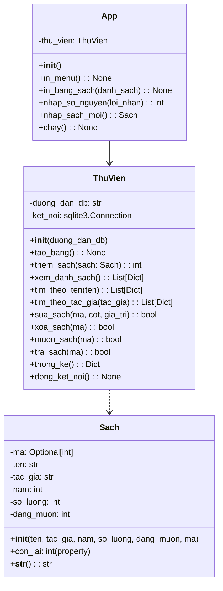
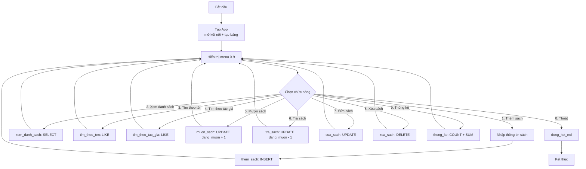

<!-- TỰ ĐỘNG ĐỒNG BỘ từ 03-Thuc-Chien/12-Du-An-Cuoi-Khoa/bai.md — đừng sửa trực tiếp, sửa bản chính rồi chạy tools/sync_tracks.py -->

# Bài 41 — Dự Án Cuối Khóa – Ứng Dụng Quản Lý Thư Viện (Library Manager)

> 🎓 **Chương 8 – Lập trình ứng dụng chuyên sâu**

## 🧠 Điều kiện tiên quyết

Không cần kiến thức lập trình trước đó — bài này là điểm khởi đầu.

---

## 🎯 Mục tiêu

Sau bài học này, học viên sẽ:

* ✅ Tổng hợp **toàn bộ kiến thức 40 bài trước**: OOP, SQLite, exception, module, typing, file, JSON...
* ✅ Phân tích yêu cầu và **thiết kế cơ sở dữ liệu** (bảng `Sach` với 6 cột) trước khi viết code.
* ✅ Xây dựng **3 lớp** `Sach`, `ThuVien`, `App` — đúng tinh thần lập trình hướng đối tượng (ôn bài 23).
* ✅ Viết đầy đủ các hàm **CRUD + mượn/trả + thống kê** bằng câu lệnh SQL an toàn (placeholder `?`).
* ✅ **Xử lý lỗi toàn diện**: nhập sai, mượn khi hết sách, lỗi database — chương trình không bao giờ gãy.
* ✅ Tạo ra **một sản phẩm chạy được, dữ liệu bền vững** nhờ SQLite — nâng cấp trực tiếp từ Mini Project (bài 40).
* ✅ Biết tự **chấm điểm theo rubric** và có định hướng phát triển sau khóa học.

---

## 📖 Kiến thức

> 💬 **Nhắc bài trước:** ở **[Bài 40](../11-Mini-Project/bai.md)** bạn đã làm "Quản lý cửa hàng sách" bằng **List + JSON** — dữ liệu nằm trong RAM, mỗi lần chạy phải nạp từ file. Bài cuối cùng này sẽ **nâng cấp toàn bộ** lên **OOP + SQLite**: dữ liệu nằm trong một *cơ sở dữ liệu* thật, mọi thao tác trở nên chuyên nghiệp như phần mềm thương mại.

### 1. Đặt vấn đề 📚

Một thư viện nhỏ của trường có hàng trăm đầu sách. Thủ thư hiện ghi sổ tay:

* 📕 Mỗi ngày phải lật sổ để xem **cuốn nào đang được mượn**, **còn lại bao nhiêu cuốn**.
* ✏️ Học sinh mượn/trả phải chờ thủ thư sửa sổ — dễ sai sót, mất thời gian.
* 📉 Cuối tháng muốn thống kê: bao nhiêu đầu sách? bao nhiêu cuốn đang mượn? — đếm tay rất mệt.

**Yêu cầu:** hãy xây một chương trình Python để máy tính làm hết việc trên. Đây chính là **bài toán cuối khóa** — kết hợp mọi thứ bạn đã học suốt 41 bài.

### 2. Yêu cầu chức năng (Requirements)

| STT | Chức năng | Kiểu thao tác | Mô tả ngắn |
|---|---|---|---|
| 1 | Thêm sách | CRUD – Create | Nhập tên, tác giả, năm, số lượng |
| 2 | Xem danh sách | CRUD – Read | In toàn bộ đầu sách dạng bảng |
| 3 | Tìm theo tên | CRUD – Read | Tìm sách có tên chứa chuỗi nhập vào |
| 4 | Tìm theo tác giả | CRUD – Read | Tìm theo tên tác giả |
| 5 | Mượn sách | Nghiệp vụ | Tăng `dang_muon` lên 1 nếu còn sách |
| 6 | Trả sách | Nghiệp vụ | Giảm `dang_muon` xuống 1 nếu có cuốn đang mượn |
| 7 | Sửa sách | CRUD – Update | Sửa một cột (tên, tác giả, năm, số lượng) |
| 8 | Xóa sách | CRUD – Delete | Xóa đầu sách theo mã |
| 9 | Thống kê | Báo cáo | Số đầu sách, tổng cuốn, đang mượn, còn lại |
| 0 | Thoát | Điều khiển | Đóng kết nối DB, kết thúc |

> 📐 **Bài 40 dạy ta:** trước khi viết code, phải **liệt kê chức năng**. Bài này ta làm điều đó một cách bài bản hơn: liệt kê xong → thiết kế dữ liệu → thiết kế lớp → vẽ sơ đồ → mới lập trình.

### 3. Bài 40 → Bài 41: sự tiến bộ như thế nào?

| Tiêu chí | Bài 40 (Mini Project) | Bài 41 (Dự án cuối khóa) |
|---|---|---|
| Tổ chức code | Các hàm rời rạc | **3 lớp OOP**: `Sach`, `ThuVien`, `App` |
| Lưu trữ | List + file JSON | **SQLite** — cơ sở dữ liệu thật sự |
| Truy vấn | Quét list bằng vòng lặp | Câu lệnh SQL: `SELECT`, `INSERT`, `UPDATE`, `DELETE` |
| An toàn dữ liệu | Phải nhớ lưu file thủ công | Mỗi thao tác **tự commit** ngay vào DB |
| Tìm kiếm | `in` trong list | `LIKE '%...%'` do database xử lý |
| Khả năng mở rộng | Chỉ chạy được khi dữ liệu nhỏ | Hàng nghìn cuốn sách vẫn nhanh |

> 🚀 Kỹ sư phần mềm thật sự thường làm đúng con đường này: **làm thử bằng cấu trúc đơn giản → nhận ra giới hạn → nâng cấp lên công nghệ mạnh hơn.**

### 4. Thiết kế cơ sở dữ liệu — bảng `Sach`

Một đầu sách cần 6 thông tin. Ta đặt tên cột **bằng tiếng Việt không dấu** để code khỏi lỗi:

```sql
CREATE TABLE IF NOT EXISTS Sach (
    id         INTEGER PRIMARY KEY AUTOINCREMENT,
    ten        TEXT    NOT NULL,
    tac_gia    TEXT    NOT NULL,
    nam        INTEGER,
    so_luong   INTEGER NOT NULL,
    dang_muon  INTEGER NOT NULL DEFAULT 0
);
```

| Cột | Kiểu dữ liệu | Ràng buộc | Ý nghĩa |
|---|---|---|---|
| `id` | INTEGER | PRIMARY KEY AUTOINCREMENT | Mã sách tự tăng, **duy nhất** |
| `ten` | TEXT | NOT NULL | Tên đầu sách |
| `tac_gia` | TEXT | NOT NULL | Tác giả |
| `nam` | INTEGER | — | Năm xuất bản |
| `so_luong` | INTEGER | NOT NULL | Tổng số cuốn của đầu sách |
| `dang_muon` | INTEGER | NOT NULL DEFAULT 0 | Số cuốn đang được mượn |

> 💡 **Vì sao có cả `so_luong` lẫn `dang_muon`?** Vì một đầu sách có thể có 10 cuốn; học sinh mượn 3 cuốn. Số còn lại trên kệ = `so_luong - dang_muon`. Không lưu "số còn lại" trực tiếp vì nó **tính được** từ hai cột kia — tránh dữ liệu trùng lặp và lệch nhau.
>
> 💾 **Lưu ý quan trọng:** khi chạy chương trình, file **`thu_vien.db` sẽ được tạo tự động ngay tại thư mục đang chạy** — bạn không cần tạo trước.

### 5. Thiết kế lớp — sơ đồ classDiagram



| Lớp | Trách nhiệm | Giống vai trò ngoài đời |
|---|---|---|
| `Sach` | Mô tả **một đầu sách** (dữ liệu thuần túy) | "Phiếu mô tả sách" |
| `ThuVien` | **Toàn bộ thao tác với database** (một class duy nhất chứa mọi câu SQL) | "Người thủ thư giữ sổ" |
| `App` | **Menu + nhập liệu + in ấn** (giao tiếp với người dùng) | "Quầy phục vụ bạn đọc" |

> 🧩 **Nguyên tắc một trách nhiệm (single responsibility):** `ThuVien` không bao giờ gọi `input()`; `App` không bao giờ viết câu SQL. Nhìn vào một class là biết nó chỉ lo một việc — mẹo lớn nhất của lập trình thực tế.

### 6. Sơ đồ luồng menu (flowchart)



> 🔁 **Khuôn mẫu menu** (đã học bài 40): `while True` → in menu → `input` → `if/elif` → lặp lại cho tới khi chọn `0` rồi `break`. Lần này mỗi nhánh chỉ cần **một dòng gọi phương thức của `ThuVien`** — sức mạnh của OOP.

### 7. Triển khai từng bước (Tạo ứng dụng)

#### Bước 0: Chuẩn bị — import và hằng số

```python
import sqlite3
from typing import Dict, List, Optional

# File thu_vien.db sẽ được tạo tự động tại thư mục đang chạy chương trình
TEN_FILE_DB = "thu_vien.db"
```

* `sqlite3` — thư viện chuẩn của Python, **không cần cài thêm** (ôn bài 36).
* Hằng số `TEN_FILE_DB` đặt tên file DB **một chỗ duy nhất** — muốn đổi tên chỉ sửa một dòng (ôn bài 38 về typing, bài 40 về hằng số).

#### Bước 1: Kết nối và tạo bảng

```python
class ThuVien:
    """Quản lý mọi thao tác với cơ sở dữ liệu SQLite."""

    COT_HOP_LE = ("ten", "tac_gia", "nam", "so_luong")  # danh sách cột được phép sửa

    def __init__(self, duong_dan_db: str = TEN_FILE_DB) -> None:
        self.duong_dan_db = duong_dan_db
        # row_factory: mỗi dòng trả về truy cập được theo tên cột (dong["ten"])
        self.ket_noi = sqlite3.connect(duong_dan_db)
        self.ket_noi.row_factory = sqlite3.Row
        self.tao_bang()

    def tao_bang(self) -> None:
        """Tạo bảng Sach nếu chưa tồn tại (chạy mỗi lần mở ứng dụng)."""
        with self.ket_noi:   # context manager: tự COMMIT khi thành công
            self.ket_noi.execute(
                """CREATE TABLE IF NOT EXISTS Sach (
                       id         INTEGER PRIMARY KEY AUTOINCREMENT,
                       ten        TEXT    NOT NULL,
                       tac_gia    TEXT    NOT NULL,
                       nam        INTEGER,
                       so_luong   INTEGER NOT NULL,
                       dang_muon  INTEGER NOT NULL DEFAULT 0
                   )"""
            )
```

* `sqlite3.Row` cho phép đọc cột **bằng tên** thay vì chỉ số: `dong["ten"]` thay vì `dong[1]` — code dễ đọc hơn nhiều (bài 36).
* `with self.ket_noi:` — nếu khối lệnh chạy tốt thì **tự động COMMIT**, nếu có lỗi thì tự ROLLBACK. Không còn lỗi "quên lưu" (bài 22 về file, bài 19 về exception).

#### Bước 2: Class `Sach`

```python
class Sach:
    """Một đầu sách trong thư viện."""

    def __init__(self, ten: str, tac_gia: str, nam: int, so_luong: int = 1,
                 dang_muon: int = 0, ma: Optional[int] = None) -> None:
        self.ma = ma
        self.ten = ten
        self.tac_gia = tac_gia
        self.nam = nam
        self.so_luong = so_luong
        self.dang_muon = dang_muon

    @property
    def con_lai(self) -> int:
        """Số cuốn còn lại chưa được mượn."""
        return self.so_luong - self.dang_muon

    def __str__(self) -> str:
        trang_thai = "con" if self.con_lai > 0 else "het"
        return (f"[{self.ma}] {self.ten} - {self.tac_gia} ({self.nam}) | "
                f"con {self.con_lai}/{self.so_luong} cuon [{trang_thai}]")
```

* `@property` biến phương thức thành **thuộc tính ảo**: `sach.con_lai` đọc như biến nhưng thực chất là kết quả tính toán (bài 23, bài 24).
* `Optional[int]` — `ma` chưa có khi mới nhập, sau khi `INSERT` mới được database cấp (bài 38).

#### Bước 3: CRUD — thêm, xem, tìm

```python
def them_sach(self, sach: Sach) -> int:
    """Thêm đầu sách mới; trả về mã sách vừa tạo."""
    with self.ket_noi:
        con_tro = self.ket_noi.execute(
            "INSERT INTO Sach (ten, tac_gia, nam, so_luong, dang_muon) "
            "VALUES (?, ?, ?, ?, ?)",
            (sach.ten, sach.tac_gia, sach.nam, sach.so_luong, sach.dang_muon),
        )
    return con_tro.lastrowid

def xem_danh_sach(self) -> List[Dict[str, object]]:
    """Trả về danh sách toàn bộ đầu sách, sắp theo mã."""
    con_tro = self.ket_noi.execute("SELECT * FROM Sach ORDER BY id")
    return [dict(dong) for dong in con_tro.fetchall()]

def tim_theo_ten(self, ten_can_tim: str) -> List[Dict[str, object]]:
    """Tìm đầu sách có tên chứa chuỗi cho trước."""
    con_tro = self.ket_noi.execute(
        "SELECT * FROM Sach WHERE ten LIKE ? ORDER BY id",
        (f"%{ten_can_tim.strip()}%",),
    )
    return [dict(dong) for dong in con_tro.fetchall()]
```

* 🔐 **`?` placeholder — an toàn tuyệt đối:** giá trị người dùng nhập luôn đi qua `?`, không bao giờ được ghép thẳng vào chuỗi SQL. Đây là cách chặn tấn công **SQL Injection** (bài 19 + 36).
* `dict(dong)` biến mỗi dòng `sqlite3.Row` thành từ điển tiện lợi cho việc in ấn ở tầng `App`.
* `LIKE '%...%'` — tìm "chứa" chuỗi, không cần nhập đúng cả tên (bài 8 về chuỗi).

#### Bước 4: Mượn và trả sách (nghiệp vụ quan trọng nhất)

```python
def _lay_sach(self, ma: int) -> Optional[Dict[str, object]]:
    """Lấy một dòng sách theo mã; trả về None nếu không có."""
    con_tro = self.ket_noi.execute("SELECT * FROM Sach WHERE id = ?", (ma,))
    dong = con_tro.fetchone()
    return dict(dong) if dong else None

def muon_sach(self, ma: int) -> bool:
    """Mượn một cuốn; từ chối nếu sách không còn."""
    dong = self._lay_sach(ma)
    if dong is None:
        return False                                   # không có sách
    if dong["dang_muon"] >= dong["so_luong"]:
        raise ValueError("Sach nay da duoc muon het")  # hết sách -> báo lỗi
    with self.ket_noi:
        self.ket_noi.execute(
            "UPDATE Sach SET dang_muon = dang_muon + 1 WHERE id = ?", (ma,)
        )
    return True

def tra_sach(self, ma: int) -> bool:
    """Trả một cuốn; từ chối nếu không có cuốn nào đang mượn."""
    dong = self._lay_sach(ma)
    if dong is None:
        return False
    if dong["dang_muon"] <= 0:
        raise ValueError("Khong co cuon nao dang muon de tra")
    with self.ket_noi:
        self.ket_noi.execute(
            "UPDATE Sach SET dang_muon = dang_muon - 1 WHERE id = ?", (ma,)
        )
    return True
```

> 🎭 **Cách giao tiếp giữa hai lớp:** `ThuVien` dùng hai "ngôn ngữ" khác nhau:
> * **`return False`** — khi mã sách **không tồn tại** (không phải lỗi, chỉ là kết quả trống).
> * **`raise ValueError`** — khi **nghiệp vụ bị vi phạm** (mượn khi hết sách, trả khi không có gì để trả).
>
> Tầng `App` sẽ bắt `ValueError` bằng `try/except` và in lời nhắn thân thiện — chương trình **không bao giờ gãy** (bài 19).

#### Bước 5: Thống kê bằng SQL

```python
def thong_ke(self) -> Dict[str, object]:
    """Tổng hợp: đầu sách, tổng cuốn, đang mượn, còn lại."""
    con_tro = self.ket_noi.execute(
        """SELECT COUNT(*) AS so_dau,
                  COALESCE(SUM(so_luong), 0)  AS tong_cuon,
                  COALESCE(SUM(dang_muon), 0) AS dang_muon
           FROM Sach"""
    )
    dong = dict(con_tro.fetchone())
    dong["con_lai"] = dong["tong_cuon"] - dong["dang_muon"]
    return dong
```

* `COUNT(*)` — đếm số dòng (đầu sách); `SUM(so_luong)` — cộng toàn bộ số cuốn (bài 10, 14).
* ⚠️ **Bẫy kinh điển:** khi bảng **trống**, `SUM` trả về `NULL`, không phải `0`. Hàm `COALESCE(..., 0)` đổi `NULL` thành `0` — nếu thiếu dòng này, thống kê thư viện rỗng sẽ ra `None` và cộng trừ sẽ báo lỗi.

#### Bước 6: Xử lý lỗi + typing (tầng App)

```python
def nhap_so_nguyen(self, loi_nhan: str) -> int:
    """Nhập số nguyên; lặp lại đến khi người dùng gõ đúng."""
    while True:
        try:
            return int(input(loi_nhan))      # Nhập: 2020
        except ValueError:
            print("Vui long nhap mot so nguyen hop le.")
```

* `while True` + `try/except` — người dùng gõ chữ thì in cảnh báo và **hỏi lại**, không thoát chương trình (bài 8, 11, 19).
* Mọi hàm đều có **type hints** (`-> int`, `-> List[Dict[str, object]]`) — tự ghi "hợp đồng" cho code, dễ đọc và dễ gỡ lỗi (bài 38).

#### Bước 7: Lắp ráp `App` và menu

```python
class App:
    """Giao diện menu điều khiển toàn bộ chương trình."""

    def __init__(self) -> None:
        self.thu_vien = ThuVien(TEN_FILE_DB)

    def in_menu(self) -> None:
        print("\n===== QUAN LY THU VIEN =====")
        print("1. Them sach        6. Tra sach")
        print("2. Xem danh sach    7. Sua sach")
        print("3. Tim theo ten     8. Xoa sach")
        print("4. Tim theo tac gia 9. Thong ke")
        print("5. Muon sach        0. Thoat")

    def chay(self) -> None:
        """Vòng lặp menu chính của chương trình."""
        while True:
            self.in_menu()
            chon = input("Chon chuc nang: ").strip()   # Nhập: 1
            if chon == "1":
                ...   # gọi nhap_sach_moi + thu_vien.them_sach
            elif chon == "0":
                print("Tam biet!")
                break
            else:
                print("Lua chon khong hop le.")
        self.thu_vien.dong_ket_noi()


if __name__ == "__main__":
    App().chay()
```

* `if __name__ == "__main__":` — chỉ chạy `chay()` khi gõ trực tiếp file này, không chạy khi `import` (bài 20 module).
* Khi thoát phải gọi `dong_ket_noi()` để **đóng kết nối** — giống như đóng cửa kho trước khi về.

### 8. Rubric chấm điểm 🎯

Dùng bảng này để **tự chấm** trước khi nộp bài — điểm tối đa 100:

| Tiêu chí | Điểm | Mô tả chi tiết |
|---|---|---|
| 1. Đủ chức năng | 30 | Menu đủ 9 chức năng + thoát; thêm, xem, tìm (2 loại), mượn, trả, sửa, xóa, thống kê đều hoạt động đúng |
| 2. OOP chuẩn | 15 | Đủ 3 lớp `Sach`, `ThuVien`, `App`; mỗi lớp một trách nhiệm; dùng `__init__`, `__str__`, `@property`, type hints |
| 3. Xử lý lỗi | 20 | Nhập sai kiểu dữ liệu; mượn khi hết sách; trả khi không mượn; mã không tồn tại — chương trình **không gãy**, có thông báo rõ |
| 4. Code sạch PEP 8 | 15 | Tên biến/hàm rõ nghĩa; thụt lề 4 khoảng trắng; hằng số; không lặp code; SQL dùng `?` placeholder |
| 5. Ghi chú | 10 | Docstring cho mỗi class và hàm; comment giải thích chỗ khó (mượn/trả, COALESCE...) |
| 6. Sáng tạo | 10 | Tính năng thêm: sắp xếp theo tên, xuất báo cáo ra file JSON, tìm theo năm, gợi ý sách hay mượn nhất... |

**Checklist nộp bài:**

- [ ] File `quan_ly_thu_vien.py` chạy được bằng Python 3.9+.
- [ ] File `thu_vien.db` tự tạo khi chạy, dữ liệu còn lại khi mở lại chương trình.
- [ ] Đã chạy thử kịch bản: thêm 3 sách → mượn → trả → thống kê → xóa → thoát → mở lại.
- [ ] Tự chấm đạt ít nhất 80/100 theo rubric.

---

## 💡 Ví dụ minh họa

### Ví dụ 1: In danh sách sách dạng bảng thẳng hàng

```python
def in_bang_sach(danh_sach):
    """In danh sách sách dạng bảng với các cột thẳng hàng."""
    if not danh_sach:
        print("Khong co sach nao.")
        return
    tieu_de = f"{'Ma':<4}{'Ten':<28}{'Tac gia':<18}{'Nam':<6}{'SL':<4}{'Dang muon':<10}"
    print(tieu_de)
    print("-" * len(tieu_de))
    for s in danh_sach:
        print(f"{s['id']:<4}{s['ten']:<28}{s['tac_gia']:<18}"
              f"{s['nam']:<6}{s['so_luong']:<4}{s['dang_muon']:<10}")

# Dữ liệu mẫu dạng dict (giống dòng SELECT trả về)
mau = [
    {"id": 1, "ten": "De Men Phieu Luu Ky", "tac_gia": "To Hoai", "nam": 1941, "so_luong": 3, "dang_muon": 1},
    {"id": 2, "ten": "Tuoi tho du doi", "tac_gia": "Nguyen Nhat Anh", "nam": 2008, "so_luong": 2, "dang_muon": 0},
]
in_bang_sach(mau)
```

**Giải thích từng dòng:**

| Dòng code | Ý nghĩa |
|---|---|
| `def in_bang_sach(danh_sach):` | Hàm nhận **bất kỳ** danh sách dict nào có 6 cột — tách rời khỏi database, dễ kiểm thử |
| `if not danh_sach:` | Danh sách rỗng thì in thông báo và thoát sớm (`return`) |
| `f"{'Ma':<4}"` | Căn **trái**, rộng 4 ký tự — các dấu nháy `'Ma'` cho f-string biết đây là chuỗi hằng (bài 18 f-string) |
| `"-" * len(tieu_de)` | Kẻ đường gạch dài đúng bằng chiều rộng tiêu đề (bài 10) |
| `for s in danh_sach:` | Duyệt từng cuốn sách, mỗi cuốn in một dòng |
| `s['id']:<4` | Độ rộng cố định của mỗi cột — số trong cột không bị lệch dù tên dài hay ngắn |

Kết quả:

```
Ma  Ten                          Tac gia            Nam   SL   Dang muon
----------------------------------------------------------------------
1   De Men Phieu Luu Ky          To Hoai            1941  3    1
2   Tuoi tho du doi              Nguyen Nhat Anh    2008  2    0
```

### Ví dụ 2: Đếm và cộng bằng SQL

```python
import sqlite3

ket_noi = sqlite3.connect("thu_vien.db")   # file tự tạo tại thư mục chạy
with ket_noi:
    ket_noi.execute(
        """CREATE TABLE IF NOT EXISTS Sach (
               id INTEGER PRIMARY KEY AUTOINCREMENT,
               ten TEXT NOT NULL,
               tac_gia TEXT NOT NULL,
               nam INTEGER,
               so_luong INTEGER NOT NULL,
               dang_muon INTEGER NOT NULL DEFAULT 0
           )"""
    )

# Đếm đầu sách và cộng tổng cuốn; COALESCE đổi NULL (bảng rỗng) thành 0
con_tro = ket_noi.execute(
    "SELECT COUNT(*) AS so_dau, COALESCE(SUM(so_luong), 0) AS tong_cuon FROM Sach"
)
dong = con_tro.fetchone()
print("So dau sach:", dong["so_dau"])       # 0
print("Tong so cuon:", dong["tong_cuon"])   # 0 (không phải None!)
ket_noi.close()
```

**Giải thích từng dòng:**

| Dòng code | Ý nghĩa |
|---|---|
| `sqlite3.connect("thu_vien.db")` | Mở (hoặc tạo) database — file xuất hiện tại thư mục chạy lệnh |
| `CREATE TABLE IF NOT EXISTS` | Tạo bảng nếu chưa có; chạy lại nhiều lần cũng không lỗi |
| `COUNT(*)` | Đếm **số dòng** của bảng = số đầu sách |
| `SUM(so_luong)` | Cộng tất cả giá trị cột `so_luong` = tổng số cuốn |
| `COALESCE(SUM(...), 0)` | Bảng trống thì `SUM` trả `NULL`; `COALESCE` thay bằng `0` |
| `dong["so_dau"]` | Đọc kết quả **theo tên cột** nhờ câu lệnh `AS` (đặt tên lại cho cột) |

> 💡 Muốn thấy rõ sức mạnh: thêm 2 cuốn sách rồi chạy lại câu lệnh này — `COUNT` và `SUM` tự cập nhật, database tự tính, ta không phải đếm tay.

### Ví dụ 3: Hỏi lại khi người dùng gõ sai

```python
def nhap_so_nguyen(loi_nhan: str) -> int:
    """Nhập số nguyên; lặp lại đến khi hợp lệ."""
    while True:
        try:
            return int(input(loi_nhan))      # Nhập: abc
        except ValueError:
            print("Vui long nhap mot so nguyen hop le.")

nam = nhap_so_nguyen("Nam xuat ban: ")       # Nhập: 1941
print("Ban da nhap nam:", nam)
```

**Giải thích từng dòng:**

| Dòng code | Ý nghĩa |
|---|---|
| `while True:` | Vòng lặp vô hạn có chủ đích: chỉ thoát khi nhập đúng |
| `try: return int(input(...))` | Nhập rồi ép kiểu ngay; nếu thành công thì **trả về và thoát khỏi vòng lặp** |
| `except ValueError:` | Gõ chữ (ví dụ `abc`) thì `int()` ném `ValueError` — bắt và in cảnh báo |
| Sau `except` không có `break` | Vòng lặp tiếp tục → **hỏi lại** cho tới khi đúng |

---

## 🔬 Ví dụ nâng cao

### Nâng cao 1: Toàn bộ luồng mượn – trả có kiểm tra

```python
import sqlite3
from typing import Dict, List, Optional

class ThuVien:
    """Quản lý thao tác với cơ sở dữ liệu SQLite."""

    def __init__(self, duong_dan_db: str = "thu_vien.db") -> None:
        self.duong_dan_db = duong_dan_db
        self.ket_noi = sqlite3.connect(duong_dan_db)
        self.ket_noi.row_factory = sqlite3.Row

    def _lay_sach(self, ma: int) -> Optional[Dict[str, object]]:
        con_tro = self.ket_noi.execute("SELECT * FROM Sach WHERE id = ?", (ma,))
        dong = con_tro.fetchone()
        return dict(dong) if dong else None

    def muon_sach(self, ma: int) -> bool:
        """Mượn 1 cuốn: kiểm tra tồn kho trước khi cập nhật."""
        dong = self._lay_sach(ma)
        if dong is None:
            return False
        if dong["dang_muon"] >= dong["so_luong"]:
            raise ValueError("Sach nay da duoc muon het")
        with self.ket_noi:
            self.ket_noi.execute(
                "UPDATE Sach SET dang_muon = dang_muon + 1 WHERE id = ?", (ma,)
            )
        return True

    def tra_sach(self, ma: int) -> bool:
        """Trả 1 cuốn: chỉ trả được khi có cuốn đang mượn."""
        dong = self._lay_sach(ma)
        if dong is None:
            return False
        if dong["dang_muon"] <= 0:
            raise ValueError("Khong co cuon nao dang muon de tra")
        with self.ket_noi:
            self.ket_noi.execute(
                "UPDATE Sach SET dang_muon = dang_muon - 1 WHERE id = ?", (ma,)
            )
        return True

# --- Kiểm thử nhanh: thêm sách rồi mượn/trả ---
tv = ThuVien("thu_vien.db")
with tv.ket_noi:
    tv.ket_noi.execute(
        """CREATE TABLE IF NOT EXISTS Sach (
               id INTEGER PRIMARY KEY AUTOINCREMENT,
               ten TEXT NOT NULL, tac_gia TEXT NOT NULL, nam INTEGER,
               so_luong INTEGER NOT NULL, dang_muon INTEGER NOT NULL DEFAULT 0
           )"""
    )
    con_tro = tv.ket_noi.execute(
        "INSERT INTO Sach (ten, tac_gia, nam, so_luong) "
        "VALUES ('De Men Phieu Luu Ky', 'To Hoai', 1941, 2)"
    )
    ma = con_tro.lastrowid

print("Muon lan 1:", tv.muon_sach(ma))     # True
print("Muon lan 2:", tv.muon_sach(ma))     # True
try:
    tv.muon_sach(ma)                        # hết sách -> ValueError
except ValueError as loi:
    print("Loi:", loi)
print("Muon sach khong ton tai:", tv.muon_sach(999))   # False
tv.ket_noi.close()
```

**Vì sao thiết kế này chuẩn cho dự án?** — Mỗi lần mượn là **hai bước**: đọc kiểm tra (SELECT) rồi mới ghi (UPDATE). Nếu đảo thứ tự — cứ UPDATE trước — sẽ xảy ra lỗi kinh điển: `dang_muon` vượt `so_luong`, thư viện "mượn nhầm" sách không có thật trên kệ.

### Nâng cao 2: Xuất báo cáo thống kê ra file JSON

Kết hợp bài 32 (JSON) và bài 22 (file) — biến báo cáo thành dữ liệu lưu trữ được:

```python
import json
from typing import Dict

def luu_bao_cao(bao_cao: Dict[str, object], ten_file: str = "bao_cao.json") -> None:
    """Ghi báo cáo thống kê ra file JSON."""
    with open(ten_file, "w", encoding="utf-8") as f:
        json.dump(bao_cao, f, ensure_ascii=False, indent=2)
    print(f"Da luu bao cao vao {ten_file}.")

# bao_cao = thu_vien.thong_ke()   # lấy từ database trong dự án thật
bao_cao_mau = {
    "so_dau": 5,
    "tong_cuon": 20,
    "dang_muon": 3,
    "con_lai": 17,
}
luu_bao_cao(bao_cao_mau)
```

Kết quả trong file `bao_cao.json`:

```json
{
  "so_dau": 5,
  "tong_cuon": 20,
  "dang_muon": 3,
  "con_lai": 17
}
```

> 🚀 Đây là **ý tưởng sáng tạo 10/10** cho rubric: database vẫn là nơi lưu chính, còn JSON là "bản sao" xuất ra để gửi cho hiệu trưởng.

### Nâng cao 3: Kịch bản kiểm thử tổng thể (trước khi nộp bài)

```python
# Chạy thử theo đúng kịch bản người dùng thật
# 1) Chạy quan_ly_thu_vien.py
# 2) Chọn 1 -> nhập: De Men Phieu Luu Ky / To Hoai / 1941 / 3
# 3) Chọn 1 -> nhập: Tuoi tho du doi / Nguyen Nhat Anh / 2008 / 2
# 4) Chọn 2 -> thấy đúng 2 sách
# 5) Chọn 5 -> mã 1 -> "Thanh cong."
# 6) Chọn 5 -> mã 1 -> "Thanh cong."
# 7) Chọn 5 -> mã 1 -> "Thanh cong."        (mượn hết 3/3 cuốn)
# 8) Chọn 5 -> mã 1 -> "Loi: Sach nay da duoc muon het"  (hết sách, không gãy)
# 9) Chọn 9 -> thống kê: 2 đầu sách, 5 cuốn, đang mượn 3, còn 2
# 10) Chọn 0 -> thoát
# 11) Chạy lại chương trình -> chọn 2 -> dữ liệu vẫn còn! (SQLite bền vững)
```

> 🧪 **Kịch bản kiểm thử** là phần không thể thiếu của một dự án: kiểm thử xong là biết chương trình "đủ chín" để nộp hay chưa. Dán kịch bản này vào cuối bài nộp là cách gây ấn tượng tuyệt vời với giảng viên.

---

## ⚠️ Lỗi thường gặp

### Lỗi 1: Ghép giá trị trực tiếp vào chuỗi SQL (SQL Injection)

```python
ten = input("Ten sach: ")                          # Nhập: Dế Mèn'
con_tro = ket_noi.execute(f"SELECT * FROM Sach WHERE ten = '{ten}'")   # ❌ SAI
```

* **Nguyên nhân:** dấu nháy trong chuỗi nhập làm vỡ cú pháp SQL — ngoài ra đây là lỗ hổng bảo mật nghiêm trọng.
* **Cách sửa:** luôn dùng placeholder: `execute("SELECT * FROM Sach WHERE ten = ?", (ten,))`.

### Lỗi 2: Bảng trống mà thống kê ra `None`

```python
tong = ket_noi.execute("SELECT SUM(so_luong) FROM Sach").fetchone()[0]
print(tong + 5)    # ❌ TypeError: unsupported operand (None + 5)
```

* **Nguyên nhân:** `SUM` trên bảng trống trả về `NULL`, tức `None` trong Python.
* **Cách sửa:** `COALESCE(SUM(so_luong), 0)` — hoặc kiểm tra `if tong is None: tong = 0`.

### Lỗi 3: Mượn sách mà không kiểm tra tồn kho

```python
ket_noi.execute("UPDATE Sach SET dang_muon = dang_muon + 1 WHERE id = ?", (ma,))
# sách chỉ có 2 cuốn -> dang_muon có thể thành 3, 4, 5... ❌ vô nghĩa
```

* **Nguyên nhân:** nghiệp vụ "không mượn quá số cuốn" bị bỏ qua.
* **Cách sửa:** SELECT kiểm tra trước (hàm `_lay_sach`), nếu `dang_muon >= so_luong` thì `raise ValueError`.

### Lỗi 4: Quên đóng kết nối / quên COMMIT

```python
ket_noi = sqlite3.connect("thu_vien.db")
ket_noi.execute("INSERT INTO Sach (ten, tac_gia, nam, so_luong) VALUES (?, ?, ?, ?)", du_lieu)
ket_noi.close()   # ❌ nếu chạy bằng lệnh INSERT mà chưa commit, dữ liệu có thể không được ghi
```

* **Nguyên nhân:** SQLite mặc định mở transaction ngầm; không COMMIT thì dữ liệu không xuống file.
* **Cách sửa:** dùng `with ket_noi:` — context manager tự động COMMIT/ROLLBACK; hoặc gọi `ket_noi.commit()` sau lệnh ghi.

### Lỗi 5: Nhầm kiểu dữ liệu khi đọc dòng kết quả

```python
dong = ket_noi.execute("SELECT * FROM Sach WHERE id = 1").fetchone()
print(dong["ten"])    # ❌ TypeError: tuple indices must be integers
```

* **Nguyên nhân:** chưa đặt `row_factory = sqlite3.Row` nên mỗi dòng là một **tuple**, không đọc được theo tên cột.
* **Cách sửa:** sau khi `connect`, ghi ngay `ket_noi.row_factory = sqlite3.Row`; hoặc đọc theo chỉ số `dong[1]`.

### Lỗi 6: Trả sách khi không có cuốn nào đang mượn

```python
ket_noi.execute("UPDATE Sach SET dang_muon = dang_muon - 1 WHERE id = ?", (ma,))
# dang_muon đang là 0 -> thành -1 ❌ số âm vô nghĩa
```

* **Cách sửa:** kiểm tra `dang_muon <= 0` trước khi trả, nếu đúng thì `raise ValueError("Khong co cuon nao dang muon de tra")`.

---

## 💎 Mẹo

* 🏗️ **Xây từng bước, test từng bước:** viết xong `them_sach` là chạy thử ngay — đừng viết cả dự án 200 dòng rồi mới chạy lần đầu (kinh nghiệm của bài 40).
* 🛡️ **Luôn dùng `?` placeholder** trong SQL — đây là thói quen phân biệt lập trình viên nghiệp dư và chuyên nghiệp.
* 🎨 **`row_factory = sqlite3.Row`** ngay sau khi kết nối — đọc cột theo tên, code trong sáng như đọc sách.
* 📏 **Tách `ThuVien` khỏi `input()`:** mọi phương thức dữ liệu chỉ nhận tham số và trả kết quả. Muốn đổi sang giao diện web sau này chỉ cần viết lại mỗi lớp `App`.
* 🔤 **Chú ý tìm kiếm tiếng Việt:** `LIKE` của SQLite chỉ không phân biệt hoa thường với chữ cái ASCII. "Dế mèn" và "dế Mèn" vẫn tìm được nhau vì phần lớn tên sách viết thường; nếu cần chuẩn xác 100%, lưu thêm cột tên viết thường.
* 🗂️ **Hằng số `TEN_FILE_DB`** đặt đầu file — nộp bài cho giảng viên thì đổi thành tên file của mình chỉ ở một chỗ.
* 🧪 **Kiểm thử dữ liệu bền vững:** chạy chương trình, thêm sách, thoát, chạy lại — sách phải còn nguyên. Đây là lợi thế lớn nhất của SQLite so với bài 40.
* 💾 **Sao lưu định kỳ:** copy file `thu_vien.db` đi nơi khác là có bản sao lưu — đơn giản hơn nhiều so với JSON.
* 📚 **Nhìn lại bài 40 để tự hào:** cùng một bài toán, giờ đây bạn viết bằng OOP + SQLite — đó chính là sự tiến bộ mà khóa học muốn bạn đạt được.

---

## 📝 Tóm tắt

| Khái niệm | Nội dung |
|---|---|
| 🏗️ Quy trình dự án | Phân tích yêu cầu → thiết kế DB → thiết kế lớp → sơ đồ → lập trình → kiểm thử |
| 🗄️ Bảng `Sach` | 6 cột: `id`, `ten`, `tac_gia`, `nam`, `so_luong`, `dang_muon` |
| 🧬 3 lớp | `Sach` (dữ liệu), `ThuVien` (SQL), `App` (menu) — mỗi lớp một trách nhiệm |
| ➕ Thêm sách | `INSERT ... VALUES (?, ?, ?, ?, ?)` + `cursor.lastrowid` |
| 🔍 Tìm kiếm | `WHERE ten LIKE ?` với `%chuoi%` |
| 📤📥 Mượn/trả | Đọc kiểm tra trước, `UPDATE dang_muon ± 1` sau; `raise ValueError` khi vi phạm nghiệp vụ |
| 📊 Thống kê | `COUNT(*)`, `COALESCE(SUM(...), 0)` — tránh `None` khi bảng trống |
| 🔐 An toàn | `?` placeholder chống SQL Injection; `with ket_noi:` tự COMMIT |
| 🛡️ Xử lý lỗi | `while True` + `try/except ValueError` cho mọi chỗ nhập liệu |
| 💾 File DB | `thu_vien.db` tự tạo tại thư mục chạy; `dong_ket_noi()` khi thoát |
| 📋 Rubric | 6 tiêu chí, tổng 100 điểm: chức năng 30, lỗi 20, PEP 8 15, OOP 15, chú thích 10, sáng tạo 10 |

---

## 🧪 Kiểm tra nhanh

1. ❓ Bài 40 dùng List + JSON, bài 41 nâng cấp lên công nghệ gì? Vì sao lại tốt hơn?
2. ❓ Bảng `Sach` có những cột nào? Cột nào tự tăng và duy nhất?
3. ❓ `dang_muon` và `so_luong` quan hệ với nhau thế nào? Khi nào không được phép mượn nữa?
4. ❓ Vì sao phải dùng `?` trong câu lệnh SQL thay vì ghép chuỗi bằng `f-string`?
5. ❓ `row_factory = sqlite3.Row` giúp gì cho việc đọc kết quả truy vấn?
6. ❓ Khi bảng rỗng, `SUM(so_luong)` trả về gì — và `COALESCE` dùng để làm gì?
7. ❓ `muon_sach` trả về `False` khi nào, và `raise ValueError` khi nào?
8. ❓ Viết câu lệnh SQL tìm sách có tên chứa chữ "De Men" (không phân biệt hoa thường).
9. ❓ `if __name__ == "__main__":` có ý nghĩa gì trong file `quan_ly_thu_vien.py`?
10. ❓ Nêu 2 cách bảo vệ chương trình khi người dùng gõ chữ vào chỗ yêu cầu số.

<details>
<summary>🔍 Xem đáp án</summary>

1. Nâng cấp lên **OOP + SQLite**: dữ liệu bền vững trong cơ sở dữ liệu thật, truy vấn nhanh, tự commit, không lo mất dữ liệu khi thoát.
2. `id`, `ten`, `tac_gia`, `nam`, `so_luong`, `dang_muon`. Cột `id` là PRIMARY KEY AUTOINCREMENT — tự tăng, duy nhất.
3. Số còn trên kệ = `so_luong - dang_muon`. Khi `dang_muon >= so_luong` thì không mượn được nữa.
4. Vì ghép chuỗi dễ bị **SQL Injection** và dễ vỡ cú pháp khi giá trị chứa dấu nháy; `?` an toàn tuyệt đối.
5. Mỗi dòng trả về đọc được **theo tên cột** (`dong["ten"]`) thay vì theo chỉ số — code dễ đọc, ít lỗi.
6. `SUM` trên bảng trống trả về `NULL` (tức `None`). `COALESCE(x, 0)` đổi `NULL` thành `0`.
7. Trả `False` khi mã sách **không tồn tại**; `raise ValueError` khi **vi phạm nghiệp vụ**: mượn khi hết sách hoặc trả khi không có cuốn nào đang mượn.
8. `SELECT * FROM Sach WHERE ten LIKE '%De Men%' ORDER BY id;`
9. Chỉ chạy `App().chay()` khi gõ trực tiếp file, không chạy khi file được `import` ở nơi khác.
10. Dùng `try/except ValueError` và hỏi lại trong vòng lặp `while True` (hàm `nhap_so_nguyen`).

</details>

---

## 📚 Bài đọc thêm

* [Python docs – sqlite3 (SQLite databases)](https://docs.python.org/3/library/sqlite3.html)
* [SQLite – Hướng dẫn cú pháp SQL chính thức](https://www.sqlite.org/lang.html)
* [W3Schools – SQL Tutorial](https://www.w3schools.com/sql/)
* [PEP 8 – Phong cách viết code Python](https://peps.python.org/pep-0008/)
* [PEP 257 – Docstring Conventions](https://peps.python.org/pep-0257/)
* [Python docs – typing (type hints)](https://docs.python.org/3/library/typing.html)
* [Mermaid – vẽ sơ đồ classDiagram](https://mermaid.js.org/syntax/classDiagram.html)

---

---

## 🧩 Bài tập

> 📝 🎓 **Bài tập cuối cùng của khóa học!** 20 bài tập này sẽ dẫn bạn **xây từng viên gạch** của chương trình `quan_ly_thu_vien.py`: từ class `Sach` nhỏ xíu đến toàn bộ ứng dụng hoàn chỉnh chạy bằng SQLite.

## 🟢 Dễ (Bài 1 – 7)

### Bài 1: Tạo lớp `Sach` cơ bản

* **Đề bài:** Định nghĩa class `Sach` có phương thức `__init__(ten, tac_gia, nam, so_luong=1)` lưu 4 thuộc tính, và `__str__` trả về chuỗi dạng `Ten sach - Tac gia (nam), X cuon`. Tạo 2 đối tượng và in ra bằng `print()`.
* **Input:** Không có — dùng trực tiếp 2 đầu sách mẫu: "De Men Phieu Luu Ky"/"To Hoai"/1941/10 và "Tuoi tho du doi"/"Nguyen Nhat Anh"/2008/5.
* **Output:** Hai chuỗi mô tả sách, mỗi cái một dòng.
* **Ví dụ:**
  ```
  De Men Phieu Luu Ky - To Hoai (1941), 10 cuon
  Tuoi tho du doi - Nguyen Nhat Anh (2008), 5 cuon
  ```
* **Gợi ý:** `__str__` phải `return` chuỗi (không được `print` bên trong); dùng f-string; nhớ từ khóa `self` cho mọi thuộc tính.

### Bài 2: Nâng cấp lớp `Sach` — mã sách, số đang mượn, số còn lại

* **Đề bài:** Nâng cấp `Sach` từ bài 1: thêm tham số `dang_muon=0` và `ma=None`; thêm `@property con_lai` trả về `so_luong - dang_muon`; cập nhật `__str__` hiển thị thêm trạng thái `con` (còn) hoặc `het` (hết).
* **Input:** Tạo sách: ma=1, ten="De Men Phieu Luu Ky", tac_gia="To Hoai", nam=1941, so_luong=10, dang_muon=3.
* **Output:**
  ```
  [1] De Men Phieu Luu Ky - To Hoai (1941) | con 7/10 cuon [con]
  Con lai: 7
  ```
* **Ví dụ:**
  ```
  # Tạo sách có 10 cuốn, đã mượn 3 -> còn 7
  ```
* **Gợi ý:** `@property` biến phương thức thành thuộc tính đọc được như biến; `con_lai > 0` thì trạng thái là `con`.

### Bài 3: Kết nối cơ sở dữ liệu SQLite

* **Đề bài:** Viết chương trình mở kết nối tới file `thu_vien.db` (file sẽ tự tạo), in ra phiên bản SQLite bằng câu lệnh `SELECT sqlite_version()`, rồi đóng kết nối.
* **Input:** Không có.
* **Output:** Một dòng dạng `Phien ban SQLite: 3.x.y` (con số tùy máy).
* **Ví dụ:**
  ```
  Phien ban SQLite: 3.45.1
  ```
* **Gợi ý:** `import sqlite3`; `sqlite3.connect("thu_vien.db")`; dùng `ket_noi.execute(...).fetchone()[0]` để lấy giá trị; đừng quên `ket_noi.close()`.

### Bài 4: Tạo bảng `Sach` trong database

* **Đề bài:** Mở kết nối `thu_vien.db`, tạo bảng `Sach` với 6 cột (`id` PRIMARY KEY AUTOINCREMENT, `ten` TEXT NOT NULL, `tac_gia` TEXT NOT NULL, `nam` INTEGER, `so_luong` INTEGER NOT NULL, `dang_muon` INTEGER NOT NULL DEFAULT 0), rồi in cấu trúc bảng bằng `PRAGMA table_info(Sach)`.
* **Input:** Không có.
* **Output:** Danh sách các cột (mỗi cột một tuple với id, tên, kiểu dữ liệu...).
* **Ví dụ:**
  ```
  (0, 'id', 'INTEGER', 0, None, 1)
  (1, 'ten', 'TEXT', 1, None, 0)
  ...
  ```
* **Gợi ý:** dùng `with ket_noi:` để câu lệnh `CREATE` được tự động COMMIT; `CREATE TABLE IF NOT EXISTS` an toàn khi chạy lại nhiều lần.

### Bài 5: Phương thức `them_sach` cho lớp `ThuVien`

* **Đề bài:** Tạo class `ThuVien` với `__init__(duong_dan_db="thu_vien.db")` (kết nối, đặt `row_factory = sqlite3.Row`, gọi tạo bảng) và phương thức `them_sach(sach)` dùng `INSERT INTO Sach (ten, tac_gia, nam, so_luong, dang_muon) VALUES (?, ?, ?, ?, ?)` — trả về mã sách mới tạo (`lastrowid`).
* **Input:** Tạo 2 đối tượng `Sach` rồi thêm vào thư viện.
* **Output:** Hai dòng `Da them sach co ma X` (mã tự tăng 1, 2...).
* **Ví dụ:**
  ```
  Da them sach co ma 1
  Da them sach co ma 2
  ```
* **Gợi ý:** dùng `with self.ket_noi:` bọc `execute` để tự COMMIT; `con_tro.lastrowid` lấy mã vừa tạo; truyền giá trị qua `?` — không ghép chuỗi.

### Bài 6: Phương thức `xem_danh_sach`

* **Đề bài:** Thêm vào `ThuVien` phương thức `xem_danh_sach()` chạy `SELECT * FROM Sach ORDER BY id` và trả về **list các dict** (mỗi dòng là `dict(dong)`). In kết quả ra màn hình sau khi thêm 2 sách.
* **Input:** Database có 2 sách (từ bài 5 — chạy lại bài 5 nếu chưa có).
* **Output:** Danh sách dict của 2 sách.
* **Ví dụ:**
  ```
  [{'id': 1, 'ten': 'De Men Phieu Luu Ky', 'tac_gia': 'To Hoai', 'nam': 1941, 'so_luong': 10, 'dang_muon': 0}, ...]
  ```
* **Gợi ý:** `fetchall()` trả list các `Row`; `dict(dong)` biến từng dòng thành từ điển nhờ `row_factory` đã đặt ở bài 5.

### Bài 7: Phương thức `_lay_sach` — lấy sách theo mã

* **Đề bài:** Thêm vào `ThuVien` phương thức `_lay_sach(ma)` dùng `SELECT * FROM Sach WHERE id = ?`, trả về dict của sách nếu có, **`None` nếu không có**. Kiểm thử với mã có thật và mã không tồn tại (ví dụ 999).
* **Input:** Database có sách mã 1.
* **Output:**
  ```
  Sach ma 1: {'id': 1, ...}
  Sach ma 999: None
  ```
* **Ví dụ:**
  ```
  # _lay_sach(1)  -> dict sách
  # _lay_sach(999) -> None
  ```
* **Gợi ý:** `fetchone()` trả `None` khi hết dòng; viết gọn: `return dict(dong) if dong else None`.

---

## 🟡 Trung bình (Bài 8 – 14)

### Bài 8: Tìm sách theo tên

* **Đề bài:** Thêm vào `ThuVien` phương thức `tim_theo_ten(ten_can_tim)` dùng `WHERE ten LIKE ?` với mẫu `%chuoi%` (bỏ khoảng trắng đầu/cuối bằng `strip()`), trả về list dict. Tìm chữ "de men".
* **Input:** Database có sách "De Men Phieu Luu Ky".
* **Output:** List chứa sách tìm thấy (rỗng nếu không có).
* **Ví dụ:**
  ```
  Tim 'de men': [{'id': 1, 'ten': 'De Men Phieu Luu Ky', ...}]
  ```
* **Gợi ý:** tham số truyền là `(f"%{ten_can_tim.strip()}%",)` — nhớ dấu phẩy để thành tuple; `LIKE` tìm "chứa", không cần nhập đúng cả tên.

### Bài 9: Tìm sách theo tác giả

* **Đề bài:** Thêm phương thức `tim_theo_tac_gia(tac_gia_can_tim)` tương tự bài 8 nhưng trên cột `tac_gia`. Tìm "hoai".
* **Input:** Database có sách tác giả "To Hoai".
* **Output:** List chứa sách của tác giả đó.
* **Ví dụ:**
  ```
  Tim 'hoai': [{'ten': 'De Men Phieu Luu Ky', 'tac_gia': 'To Hoai', ...}]
  ```
* **Gợi ý:** chỉ khác bài 8 ở tên cột trong `WHERE`; nên `ORDER BY id` cho kết quả ổn định.

### Bài 10: Sửa thông tin sách

* **Đề bài:** Thêm vào `ThuVien`:
  * Hằng số lớp `COT_HOP_LE = ("ten", "tac_gia", "nam", "so_luong")`.
  * Phương thức `sua_sach(ma, cot, gia_tri)`: nếu `cot` không nằm trong `COT_HOP_LE` thì `raise ValueError`; nếu sách không tồn tại trả `False`; ngược lại chạy `UPDATE Sach SET {cot} = ? WHERE id = ?` và trả `True`.
* **Input:** Sửa tên sách mã 1 thành "De Men Phieu Luu Ky (bia cung)".
* **Output:** `True`; sau đó `xem_danh_sach` thấy tên mới.
* **Ví dụ:**
  ```
  Sua thanh cong: True
  ```
* **Gợi ý:** cột chỉ được phép lấy từ danh sách hằng (chống SQL Injection vào tên cột); kiểm tra `_lay_sach(ma)` trước khi UPDATE.

### Bài 11: Xóa sách

* **Đề bài:** Thêm phương thức `xoa_sach(ma)` dùng `DELETE FROM Sach WHERE id = ?`: trả `True` nếu xóa được, `False` nếu mã không tồn tại. Kiểm thử xóa một sách rồi xem danh sách.
* **Input:** Database có sách mã 2.
* **Output:**
  ```
  Xoa sach 2: True
  Danh sach sau khi xoa chi con sach ma 1
  ```
* **Ví dụ:**
  ```
  Xoa sach 999: False
  ```
* **Gợi ý:** tương tự bài 10: kiểm tra tồn tại trước; dùng `with self.ket_noi:` cho lệnh DELETE.

### Bài 12: Mượn sách

* **Đề bài:** Thêm phương thức `muon_sach(ma)`:
  * Sách không tồn tại → trả `False`.
  * `dang_muon >= so_luong` (hết sách) → `raise ValueError("Sach nay da duoc muon het")`.
  * Còn sách → `UPDATE Sach SET dang_muon = dang_muon + 1 WHERE id = ?`, trả `True`.
  Kiểm thử mượn nhiều lần một sách có 2 cuốn.
* **Input:** Sách mã 1 có so_luong=2, dang_muon=0.
* **Output:**
  ```
  Lan 1: True
  Lan 2: True
  Lan 3: Loi: Sach nay da duoc muon het
  ```
* **Ví dụ:**
  ```
  Muon sach khong ton tai: False
  ```
* **Gợi ý:** dùng `_lay_sach(ma)` đọc kiểm tra trước, rồi mới UPDATE — đừng bỏ qua bước kiểm tra.

### Bài 13: Trả sách

* **Đề bài:** Thêm phương thức `tra_sach(ma)` ngược với bài 12:
  * Không tồn tại → `False`.
  * `dang_muon <= 0` → `raise ValueError("Khong co cuon nao dang muon de tra")`.
  * Ngược lại `UPDATE ... SET dang_muon = dang_muon - 1`, trả `True`.
  Kiểm thử trả khi chưa mượn và khi đang mượn.
* **Input:** Sách mã 1 đang có dang_muon=1 (vừa mượn ở bài 12).
* **Output:**
  ```
  Tra lan 1: True
  Tra lan 2: Loi: Khong co cuon nao dang muon de tra
  ```
* **Ví dụ:**
  ```
  Tra sach khong ton tai: False
  ```
* **Gợi ý:** đảo dấu của bài 12; kiểm tra `dang_muon <= 0` trước khi giảm để không ra số âm.

### Bài 14: Thống kê thư viện

* **Đề bài:** Thêm phương thức `thong_ke()` chạy `SELECT COUNT(*) AS so_dau, COALESCE(SUM(so_luong), 0) AS tong_cuon, COALESCE(SUM(dang_muon), 0) AS dang_muon FROM Sach` rồi thêm khóa `con_lai = tong_cuon - dang_muon`; trả về dict. Kiểm thử cả khi bảng trống.
* **Input:** Database có 2 sách: (3 cuốn, mượn 1) + (2 cuốn, mượn 0).
* **Output:**
  ```
  {'so_dau': 2, 'tong_cuon': 5, 'dang_muon': 1, 'con_lai': 4}
  ```
* **Ví dụ:**
  ```
  # Bảng trống -> {'so_dau': 0, 'tong_cuon': 0, 'dang_muon': 0, 'con_lai': 0}
  ```
* **Gợi ý:** `COALESCE` biến `NULL` (bảng trống) thành `0` — nếu bỏ nó, kết quả sẽ là `None`; `AS` đặt tên lại cho cột tính toán.

---

## 🔴 Khó (Bài 15 – 20)

### Bài 15: In danh sách sách dạng bảng

* **Đề bài:** Viết hàm `in_bang_sach(danh_sach)` (không thuộc class nào) in bảng với 6 cột: `Ma`, `Ten`, `Tac gia`, `Nam`, `SL`, `Dang muon` — căn trái bằng f-string `:<N`, có dòng tiêu đề và đường gạch ngang. Nếu danh sách rỗng in "Khong co sach nao.".
* **Input:** Kết quả của `xem_danh_sach()` sau khi thêm 2 sách.
* **Output:**
  ```
  Ma  Ten                          Tac gia            Nam   SL   Dang muon
  ----------------------------------------------------------------------
  1   De Men Phieu Luu Ky          To Hoai            1941  3    1
  ```
* **Ví dụ:**
  ```
  # in_bang_sach([]) -> Khong co sach nao.
  ```
* **Gợi ý:** đặt độ rộng cho từng cột: `{'Ma':<4}`, `{'Ten':<28}`, `{'Tac gia':<18}`, `{'Nam':<6}`, `{'SL':<4}`, `{'Dang muon':<10}`; kẻ gạch bằng `"-" * len(tieu_de)`.

### Bài 16: Nhập liệu an toàn — không bao giờ cho phép gõ sai

* **Đề bài:** Viết 2 hàm (tầng `App`):
  * `nhap_so_nguyen(loi_nhan)`: lặp đến khi người dùng gõ đúng số nguyên (bắt `ValueError`).
  * `nhap_sach_moi()`: nhập tên/tác giả **không được rỗng** (hỏi lại nếu rỗng), năm và số lượng là số nguyên, `so_luong` phải `>= 0`; trả về đối tượng `Sach`.
* **Input:** Người dùng gõ: tên rỗng (Enter), rồi "De Men", tác giả "To Hoai", năm "abc" rồi "1941", số lượng "3".
* **Output:** Chương trình hỏi lại mỗi lần gõ sai và cuối cùng tạo được `Sach` hợp lệ.
* **Ví dụ:**
  ```
  Ten sach:                (gõ Enter -> hỏi lại)
  Ten sach khong duoc rong, nhap lai: De Men
  Nam xuat ban: abc        (gõ chữ -> hỏi lại)
  Vui long nhap mot so nguyen hop le.
  Nam xuat ban: 1941
  ```
* **Gợi ý:** kết hợp `while True` + `try/except ValueError`; với chuỗi rỗng dùng `while not ten: ten = input(...)`. Chưa cần đưa vào `App`, viết dưới dạng hàm độc lập cũng được.

### Bài 17: Xử lý lỗi toàn diện cho mượn/trả

* **Đề bài:** Viết hàm `xu_ly_muon_tra(thu_vien, ma, loai)` trong đó `loai` là `"muon"` hoặc `"tra"`: gọi phương thức tương ứng trong `try/except`, bắt `ValueError` để in `"Loi: ..."`; `False` thì in "Khong tim thay sach". Kiểm thử: mượn sách không tồn tại, mượn đến khi hết sách, trả sách khi không có gì để trả — chương trình **không được gãy**.
* **Input:** Sách mã 1 có 1 cuốn.
* **Output:**
  ```
  Muon: Thanh cong.
  Muon: Loi: Sach nay da duoc muon het
  Tra: Thanh cong.
  Tra: Loi: Khong co cuon nao dang muon de tra
  Muon sach 999: Khong tim thay sach
  ```
* **Ví dụ:**
  ```
  # Cả 5 tình huống trên đều kết thúc bằng lệnh print, không có traceback
  ```
* **Gợi ý:** `except ValueError as loi: print("Loi:", loi)`; phân biệt hai tầng: `return False` (không tồn tại) và `raise ValueError` (vi phạm nghiệp vụ).

### Bài 18: Menu hoàn chỉnh

* **Đề bài:** Xây dựng class `App` với:
  * `__init__` tạo `self.thu_vien = ThuVien()`.
  * `in_menu()` in menu 9 chức năng + thoát.
  * `chay()`: vòng `while True` đọc lựa chọn, dùng `if/elif` gọi đúng phương thức (tích hợp `nhap_so_nguyen`, `nhap_sach_moi`, `in_bang_sach`, `xu_ly_muon_tra`); chọn "0" thì đóng kết nối và `break`; lựa chọn khác in "Lua chon khong hop le.".
  * `if __name__ == "__main__": App().chay()`.
* **Input:** Người dùng chọn lần lượt: 1 (thêm sách), 2 (xem), 9 (thống kê), 0 (thoát).
* **Output:** Mỗi thao tác in kết quả đúng chức năng; chương trình thoát sạch sẽ khi chọn 0.
* **Ví dụ:**
  ```
  ===== QUAN LY THU VIEN =====
  1. Them sach        6. Tra sach
  ...
  0. Thoat
  Chon chuc nang: 2
  ```
* **Gợi ý:** mỗi nhánh `elif` chỉ nên dài 2-4 dòng — nếu dài hơn, tách hàm riêng (ví dụ `xu_ly_sua_sach`, `xu_ly_thong_ke`); đừng quên `self.thu_vien.dong_ket_noi()` sau vòng lặp.

### Bài 19: Tối ưu hóa + tìm kiếm tổng hợp

* **Đề bài:** Tối ưu lại chương trình:
  1. Đưa tên file DB vào hằng số `TEN_FILE_DB = "thu_vien.db"` và cho `ThuVien.__init__` dùng nó làm giá trị mặc định.
  2. Viết docstring đầy đủ cho mọi class và phương thức.
  3. Thêm phương thức `tim_tong_hop(chuoi)` dùng `WHERE ten LIKE ? OR tac_gia LIKE ?` — tìm sách theo cả tên lẫn tác giả.
  4. Kiểm tra mọi câu SQL đều dùng `?` placeholder.
* **Input:** Tìm "hoai" (là tác giả) và "de men" (là tên).
* **Output:** Cả hai đều tìm được sách — không cần biết người dùng nhớ tên hay tác giả.
* **Ví dụ:**
  ```
  Tim 'hoai' -> [{'ten': 'De Men Phieu Luu Ky', ...}]
  Tim 'de men' -> [{'ten': 'De Men Phieu Luu Ky', ...}]
  ```
* **Gợi ý:** `WHERE ten LIKE ? OR tac_gia LIKE ?` với cùng một tham số `f"%{chuoi.strip()}%"` truyền hai lần; hằng số giúp đổi tên DB ở đúng một chỗ.

### Bài 20: Dự án hoàn chỉnh + kịch bản kiểm thử tổng thể

* **Đề bài:** Ghép toàn bộ các bài 1–19 thành chương trình hoàn chỉnh `quan_ly_thu_vien.py` (class `Sach`, `ThuVien`, `App`), sau đó **chạy kịch bản kiểm thử** sau và ghi lại kết quả:
  1. Thêm 3 sách: "De Men Phieu Luu Ky" (3 cuốn), "Tuoi tho du doi" (2 cuốn), "Nha Gia Kim" (1 cuốn).
  2. Xem danh sách → đúng 3 sách.
  3. Mượn sách 1 ba lần → lần 4 báo hết sách nhưng không gãy.
4. Mượn sách 3 → xem lại → `dang_muon` của sách 1 và 3 tăng.
5. Trả sách 1 một lần.
6. Thống kê → kiểm tra số liệu khớp.
7. Xóa sách 2 → danh sách còn 2 sách.
8. Thoát → chạy lại chương trình → dữ liệu vẫn còn (SQLite bền vững).
* **Input:** Các bước theo kịch bản trên.
* **Output:** Toàn bộ màn hình phiên chạy 1 và phiên chạy 2 (để chứng minh dữ liệu bền vững).
* **Ví dụ:**
  ```
  ----- THONG KE THU VIEN -----
  So dau sach      : 3
  Tong so cuon     : 6
  Dang duoc muon   : 3
  Con lai tren ke  : 3
  ```

---

## 🎯 Tổng kết

Bạn vừa hoàn thành **bài tập cuối cùng** của khóa học — 20 bài tập dẫn bạn đi từ một class 20 dòng đến một ứng dụng quản lý thư viện hoàn chỉnh với OOP + SQLite. Đây chính là bài tổng hợp toàn diện nhất: nếu làm được hết, bạn đã sẵn sàng cho những dự án thật sự!

---

## ✅ Đáp án

> 💡 **Hãy tự làm bài tập trước** rồi mới mở đáp án.

## 🟢 Dễ (Bài 1 – 7)


<details>
<summary>✅ Bài 1: Tạo lớp `Sach` cơ bản</summary>


**Phân tích:** Lớp đơn giản nhất của dự án — chỉ chứa dữ liệu và cách mô tả chính mình qua `__str__`.

**Ý tưởng:** `__init__` lưu 4 thuộc tính; `__str__` trả chuỗi dùng f-string để ghép thông tin.

**Thuật toán:**
1. Khai báo class `Sach` với `__init__` gán 4 thuộc tính.
2. Viết `__str__` trả về chuỗi theo mẫu yêu cầu.
3. Tạo 2 đối tượng và in ra.

**Code:**

```python
class Sach:
    """Một đầu sách trong thư viện."""

    def __init__(self, ten: str, tac_gia: str, nam: int, so_luong: int = 1) -> None:
        self.ten = ten
        self.tac_gia = tac_gia
        self.nam = nam
        self.so_luong = so_luong

    def __str__(self) -> str:
        """Chuỗi mô tả ngắn gọn đầu sách."""
        return f"{self.ten} - {self.tac_gia} ({self.nam}), {self.so_luong} cuon"


sach1 = Sach("De Men Phieu Luu Ky", "To Hoai", 1941, 10)
sach2 = Sach("Tuoi tho du doi", "Nguyen Nhat Anh", 2008, 5)
print(sach1)
print(sach2)
```

**Giải thích code:**
* `__init__(self, ten, tac_gia, nam, so_luong=1)` — hàm khởi tạo, `so_luong` có giá trị mặc định 1 (bài 12, 23).
* `__str__` — dùng `return` chứ không `print`: hàm này chỉ *trả về chuỗi*, còn `print(sach)` gọi ngầm nó.
* f-string `f"{self.ten} - ..."` — ghép chuỗi hiện đại (bài 18).

**Độ phức tạp:** O(1) — chỉ gán thuộc tính và tạo chuỗi.

---

</details>

<details>
<summary>✅ Bài 2: Nâng cấp lớp `Sach` — mã sách, số đang mượn, số còn lại</summary>


**Phân tích:** Sách thật có thêm mã số và trạng thái mượn/trả. `con_lai` không phải dữ liệu lưu trữ mà là **giá trị tính được** — dùng `@property`.

**Ý tưởng:** Thêm tham số `dang_muon=0`, `ma=None`; viết `@property con_lai`; cập nhật `__str__` kèm trạng thái `con`/`het`.

**Thuật toán:**
1. Thêm hai tham số mặc định vào `__init__`.
2. Viết property `con_lai = so_luong - dang_muon`.
3. Trong `__str__`, so sánh `con_lai > 0` để chọn trạng thái.

**Code:**

```python
from typing import Optional


class Sach:
    """Một đầu sách trong thư viện (nâng cấp: ma, dang_muon, con_lai)."""

    def __init__(self, ten: str, tac_gia: str, nam: int, so_luong: int = 1,
                 dang_muon: int = 0, ma: Optional[int] = None) -> None:
        self.ma = ma
        self.ten = ten
        self.tac_gia = tac_gia
        self.nam = nam
        self.so_luong = so_luong
        self.dang_muon = dang_muon

    @property
    def con_lai(self) -> int:
        """Số cuốn còn lại chưa được mượn."""
        return self.so_luong - self.dang_muon

    def __str__(self) -> str:
        trang_thai = "con" if self.con_lai > 0 else "het"
        return (f"[{self.ma}] {self.ten} - {self.tac_gia} ({self.nam}) | "
                f"con {self.con_lai}/{self.so_luong} cuon [{trang_thai}]")


sach = Sach("De Men Phieu Luu Ky", "To Hoai", 1941, 10, dang_muon=3, ma=1)
print(sach)
print("Con lai:", sach.con_lai)
```

**Giải thích code:**
* `ma: Optional[int] = None` — lúc nhập mới chưa có mã, database cấp mã sau (bài 38 `Optional`).
* `@property` — `sach.con_lai` đọc như biến nhưng chạy phương thức bên trong; **không ai gán được** `sach.con_lai = 5` vì không có setter — bảo vệ tính nhất quán (bài 23, 24).
* `trang_thai = "con" if ... else "het"` — biểu thức điều kiện gọn gàng (bài 8).

**Độ phức tạp:** O(1).

---

</details>

<details>
<summary>✅ Bài 3: Kết nối cơ sở dữ liệu SQLite</summary>


**Phân tích:** Bước đầu chạm vào SQLite: mở kết nối, chạy truy vấn, đóng kết nối — đúng chu trình sống của một kết nối.

**Ý tưởng:** `sqlite3.connect` tạo hoặc mở file; `SELECT sqlite_version()` trả phiên bản; luôn `close()`.

**Thuật toán:**
1. `import sqlite3`.
2. `ket_noi = sqlite3.connect("thu_vien.db")` — nếu file chưa có, SQLite tự tạo file rỗng.
3. Chạy `SELECT sqlite_version()`, lấy giá trị bằng `fetchone()[0]`.
4. In và đóng kết nối.

**Code:**

```python
import sqlite3

# Mở kết nối: file thu_vien.db được tạo ngay tại thư mục đang chạy
ket_noi = sqlite3.connect("thu_vien.db")

# Truy vấn phiên bản SQLite
con_tro = ket_noi.execute("SELECT sqlite_version()")
print("Phien ban SQLite:", con_tro.fetchone()[0])

ket_noi.close()  # luôn đóng kết nối sau khi dùng xong
```

**Giải thích code:**
* `sqlite3.connect("thu_vien.db")` — đường dẫn tương đối, nên file được tạo **trong thư mục đang chạy chương trình**, không phải thư mục chứa code.
* `execute()` trả về một **con trỏ (cursor)** — kết quả truy vấn nằm trong đó.
* `fetchone()` trả dòng đầu tiên dưới dạng tuple; `[0]` lấy ô đầu tiên.
* `close()` — đóng file DB, tránh khóa file (quan trọng trên Windows).

**Độ phức tạp:** O(1).

---

</details>

<details>
<summary>✅ Bài 4: Tạo bảng `Sach` trong database</summary>


**Phân tích:** Bảng là "khung sườn" chứa dữ liệu. Cần định nghĩa đủ 6 cột với ràng buộc đúng để nghiệp vụ mượn/trả sau này không bị sai.

**Ý tưởng:** `CREATE TABLE IF NOT EXISTS` — chạy bao nhiêu lần cũng an toàn; `with ket_noi:` để câu lệnh tự COMMIT.

**Thuật toán:**
1. Kết nối `thu_vien.db`.
2. Bọc `CREATE TABLE` trong `with ket_noi:`.
3. In cấu trúc bằng `PRAGMA table_info(Sach)` để tự kiểm tra.
4. Đóng kết nối.

**Code:**

```python
import sqlite3

ket_noi = sqlite3.connect("thu_vien.db")

with ket_noi:  # context manager: tự COMMIT khi thành công
    ket_noi.execute(
        """CREATE TABLE IF NOT EXISTS Sach (
               id         INTEGER PRIMARY KEY AUTOINCREMENT,
               ten        TEXT    NOT NULL,
               tac_gia    TEXT    NOT NULL,
               nam        INTEGER,
               so_luong   INTEGER NOT NULL,
               dang_muon  INTEGER NOT NULL DEFAULT 0
           )"""
    )

# Kiểm tra cấu trúc bảng: PRAGMA table_info trả 1 dòng cho mỗi cột
for dong in ket_noi.execute("PRAGMA table_info(Sach)"):
    print(dong)

ket_noi.close()
```

**Giải thích code:**
* `PRIMARY KEY AUTOINCREMENT` — `id` tự tăng và duy nhất, database quản lý, không phải tự đếm tay (bài 36).
* `NOT NULL` — không cho phép tên/tác giả/số lượng rỗng: dữ liệu dơ không thể vào bảng.
* `DEFAULT 0` — mỗi đầu sách mới bắt đầu với 0 cuốn đang mượn.
* `PRAGMA table_info` — lệnh tự kiểm tra cấu trúc, mỗi dòng trả về: `(vị trí, tên cột, kiểu, not_null, giá trị mặc định, khóa chính)`.

**Độ phức tạp:** O(1) — tạo bảng một lần.

---

</details>

<details>
<summary>✅ Bài 5: Phương thức `them_sach` cho lớp `ThuVien`</summary>


**Phân tích:** Đây là khởi đầu của lớp trung tâm `ThuVien` — nơi chứa mọi câu SQL. `__init__` mở kết nối và tự tạo bảng, `them_sach` ghi một dòng mới.

**Ý tưởng:** Giữ kết nối trong `self.ket_noi` (dùng chung cho mọi phương thức); `INSERT` với `?` placeholder; mã mới ở `cursor.lastrowid`.

**Thuật toán:**
1. `__init__`: kết nối, đặt `row_factory = sqlite3.Row`, gọi `tao_bang()`.
2. `tao_bang()`: `CREATE TABLE IF NOT EXISTS` trong `with self.ket_noi:`.
3. `them_sach`: `INSERT` 5 cột, bọc `with`, trả `con_tro.lastrowid`.

**Code:**

```python
import sqlite3
from typing import Optional


class Sach:
    """Một đầu sách trong thư viện."""

    def __init__(self, ten: str, tac_gia: str, nam: int, so_luong: int = 1,
                 dang_muon: int = 0, ma: Optional[int] = None) -> None:
        self.ma = ma
        self.ten = ten
        self.tac_gia = tac_gia
        self.nam = nam
        self.so_luong = so_luong
        self.dang_muon = dang_muon


class ThuVien:
    """Quản lý mọi thao tác với cơ sở dữ liệu SQLite."""

    def __init__(self, duong_dan_db: str = "thu_vien.db") -> None:
        self.duong_dan_db = duong_dan_db
        # row_factory: mỗi dòng trả về truy cập được theo tên cột (dong["ten"])
        self.ket_noi = sqlite3.connect(duong_dan_db)
        self.ket_noi.row_factory = sqlite3.Row
        self.tao_bang()

    def tao_bang(self) -> None:
        """Tạo bảng Sach nếu chưa tồn tại."""
        with self.ket_noi:
            self.ket_noi.execute(
                """CREATE TABLE IF NOT EXISTS Sach (
                       id         INTEGER PRIMARY KEY AUTOINCREMENT,
                       ten        TEXT    NOT NULL,
                       tac_gia    TEXT    NOT NULL,
                       nam        INTEGER,
                       so_luong   INTEGER NOT NULL,
                       dang_muon  INTEGER NOT NULL DEFAULT 0
                   )"""
            )

    def them_sach(self, sach: Sach) -> int:
        """Thêm đầu sách mới; trả về mã sách vừa tạo."""
        with self.ket_noi:
            con_tro = self.ket_noi.execute(
                "INSERT INTO Sach (ten, tac_gia, nam, so_luong, dang_muon) "
                "VALUES (?, ?, ?, ?, ?)",
                (sach.ten, sach.tac_gia, sach.nam, sach.so_luong, sach.dang_muon),
            )
        return con_tro.lastrowid


tv = ThuVien()
ma1 = tv.them_sach(Sach("De Men Phieu Luu Ky", "To Hoai", 1941, 10))
ma2 = tv.them_sach(Sach("Tuoi tho du doi", "Nguyen Nhat Anh", 2008, 5))
print("Da them sach co ma", ma1)
print("Da them sach co ma", ma2)
tv.ket_noi.close()
```

**Giải thích code:**
* `row_factory = sqlite3.Row` — một dòng kết quả đọc được theo tên cột; bắt buộc đặt **ngay sau** `connect`.
* `INSERT ... VALUES (?, ?, ?, ?, ?)` — 5 dấu `?` tương ứng 5 giá trị trong tuple. Lưu ý **không** ghi `id` — database tự cấp.
* `con_tro.lastrowid` — mã tự tăng vừa được SQLite cấp cho dòng mới (bài 36).
* `with self.ket_noi:` — lệnh ghi tự COMMIT; nếu lệnh lỗi sẽ tự ROLLBACK.

**Độ phức tạp:** O(1) — ghi một dòng, có index khóa chính.

---

</details>

<details>
<summary>✅ Bài 6: Phương thức `xem_danh_sach`</summary>


**Phân tích:** Hàm đọc (Read) quan trọng nhất: trả về **toàn bộ** dữ liệu sách dưới dạng list dict — định dạng mà tầng `App` sẽ in bảng.

**Ý tưởng:** `SELECT * ... ORDER BY id` để thứ tự ổn định; `[dict(dong) for dong in ...]` biến từng `Row` thành dict.

**Thuật toán:**
1. Chạy `SELECT * FROM Sach ORDER BY id`.
2. `fetchall()` lấy mọi dòng.
3. Duyệt và biến mỗi `Row` thành `dict` bằng `dict(dong)`.
4. Trả list kết quả.

**Code:**

```python
import sqlite3
from typing import Dict, List, Optional


class Sach:
    """Một đầu sách trong thư viện."""

    def __init__(self, ten: str, tac_gia: str, nam: int, so_luong: int = 1,
                 dang_muon: int = 0, ma: Optional[int] = None) -> None:
        self.ma = ma
        self.ten = ten
        self.tac_gia = tac_gia
        self.nam = nam
        self.so_luong = so_luong
        self.dang_muon = dang_muon


class ThuVien:
    """Quản lý mọi thao tác với cơ sở dữ liệu SQLite."""

    def __init__(self, duong_dan_db: str = "thu_vien.db") -> None:
        self.duong_dan_db = duong_dan_db
        self.ket_noi = sqlite3.connect(duong_dan_db)
        self.ket_noi.row_factory = sqlite3.Row
        self.tao_bang()

    def tao_bang(self) -> None:
        """Tạo bảng Sach nếu chưa tồn tại."""
        with self.ket_noi:
            self.ket_noi.execute(
                """CREATE TABLE IF NOT EXISTS Sach (
                       id         INTEGER PRIMARY KEY AUTOINCREMENT,
                       ten        TEXT    NOT NULL,
                       tac_gia    TEXT    NOT NULL,
                       nam        INTEGER,
                       so_luong   INTEGER NOT NULL,
                       dang_muon  INTEGER NOT NULL DEFAULT 0
                   )"""
            )

    def them_sach(self, sach: Sach) -> int:
        """Thêm đầu sách mới; trả về mã sách vừa tạo."""
        with self.ket_noi:
            con_tro = self.ket_noi.execute(
                "INSERT INTO Sach (ten, tac_gia, nam, so_luong, dang_muon) "
                "VALUES (?, ?, ?, ?, ?)",
                (sach.ten, sach.tac_gia, sach.nam, sach.so_luong, sach.dang_muon),
            )
        return con_tro.lastrowid

    def xem_danh_sach(self) -> List[Dict[str, object]]:
        """Trả về danh sách toàn bộ đầu sách, sắp theo mã."""
        con_tro = self.ket_noi.execute("SELECT * FROM Sach ORDER BY id")
        return [dict(dong) for dong in con_tro.fetchall()]


tv = ThuVien()
tv.them_sach(Sach("De Men Phieu Luu Ky", "To Hoai", 1941, 10))
tv.them_sach(Sach("Tuoi tho du doi", "Nguyen Nhat Anh", 2008, 5))

for sach in tv.xem_danh_sach():
    print(sach)

tv.ket_noi.close()
```

**Giải thích code:**
* `ORDER BY id` — kết quả luôn theo thứ tự mã; không có nó, thứ tự là tuỳ ý của database (bài 36).
* `dict(dong)` — nhờ `row_factory`, `Row.keys()` trả tên cột nên `dict()` chuyển thẳng thành từ điển `{"id": ..., "ten": ...}`.
* `-> List[Dict[str, object]]` — type hint mô tả chính xác kiểu trả về (bài 38).

**Độ phức tạp:** O(n) — phải duyệt toàn bộ `n` dòng.

---

</details>

<details>
<summary>✅ Bài 7: Phương thức `_lay_sach` — lấy sách theo mã</summary>


**Phân tích:** Hàm dùng chung cho sửa, xóa, mượn, trả: kiểm tra "sách này có tồn tại không và đang ở trạng thái nào?". Kết quả `None` là ngôn ngữ chuẩn cho "không tìm thấy".

**Ý tưởng:** `SELECT ... WHERE id = ?`; `fetchone()` trả `None` khi hết dòng; đặt tên `_lay_sach` với gạch dưới — quy ước "phương thức nội bộ".

**Thuật toán:**
1. Chạy `SELECT * FROM Sach WHERE id = ?` với `(ma,)`.
2. `fetchone()` lấy một dòng hoặc `None`.
3. Trả `dict(dong)` nếu có, ngược lại `None`.

**Code:**

```python
import sqlite3
from typing import Dict, List, Optional


class Sach:
    """Một đầu sách trong thư viện."""

    def __init__(self, ten: str, tac_gia: str, nam: int, so_luong: int = 1,
                 dang_muon: int = 0, ma: Optional[int] = None) -> None:
        self.ma = ma
        self.ten = ten
        self.tac_gia = tac_gia
        self.nam = nam
        self.so_luong = so_luong
        self.dang_muon = dang_muon


class ThuVien:
    """Quản lý mọi thao tác với cơ sở dữ liệu SQLite."""

    def __init__(self, duong_dan_db: str = "thu_vien.db") -> None:
        self.duong_dan_db = duong_dan_db
        self.ket_noi = sqlite3.connect(duong_dan_db)
        self.ket_noi.row_factory = sqlite3.Row
        self.tao_bang()

    def tao_bang(self) -> None:
        """Tạo bảng Sach nếu chưa tồn tại."""
        with self.ket_noi:
            self.ket_noi.execute(
                """CREATE TABLE IF NOT EXISTS Sach (
                       id         INTEGER PRIMARY KEY AUTOINCREMENT,
                       ten        TEXT    NOT NULL,
                       tac_gia    TEXT    NOT NULL,
                       nam        INTEGER,
                       so_luong   INTEGER NOT NULL,
                       dang_muon  INTEGER NOT NULL DEFAULT 0
                   )"""
            )

    def them_sach(self, sach: Sach) -> int:
        """Thêm đầu sách mới; trả về mã sách vừa tạo."""
        with self.ket_noi:
            con_tro = self.ket_noi.execute(
                "INSERT INTO Sach (ten, tac_gia, nam, so_luong, dang_muon) "
                "VALUES (?, ?, ?, ?, ?)",
                (sach.ten, sach.tac_gia, sach.nam, sach.so_luong, sach.dang_muon),
            )
        return con_tro.lastrowid

    def _lay_sach(self, ma: int) -> Optional[Dict[str, object]]:
        """Lấy một dòng sách theo mã; trả về None nếu không có."""
        con_tro = self.ket_noi.execute("SELECT * FROM Sach WHERE id = ?", (ma,))
        dong = con_tro.fetchone()
        return dict(dong) if dong else None


tv = ThuVien()
tv.them_sach(Sach("De Men Phieu Luu Ky", "To Hoai", 1941, 10))

print("Sach ma 1:", tv._lay_sach(1))
print("Sach ma 999:", tv._lay_sach(999))
tv.ket_noi.close()
```

**Giải thích code:**
* `(ma,)` — cặp ngoặc + dấu phẩy để tạo **tuple 1 phần tử**; nếu thiếu dấu phẩy, `(ma)` chỉ là số nguyên và `execute` sẽ báo lỗi.
* `fetchone()` — hiệu quả hơn `fetchall()` khi chỉ cần một dòng.
* `return dict(dong) if dong else None` — viết gọn cho "có thì trả dict, không thì None" — chỗ dùng `Optional` của bài 38.
* Gạch dưới đầu tên (`_lay_sach`) — quy ước: chỉ gọi nội bộ trong class, không gọi từ `App`.

**Độ phức tạp:** O(1) — tìm theo khóa chính `id`, SQLite dùng index.

---

</details>

<details>
<summary>✅ Bài 8: Tìm sách theo tên</summary>


**Phân tích:** Người dùng không nhớ tên chính xác, chỉ nhớ một phần. `LIKE '%...%'` giải quyết: tìm mọi tên **chứa** chuỗi nhập vào.

**Ý tưởng:** `WHERE ten LIKE ?` với giá trị `f"%{ten.strip()}%"`; trả list dict như `xem_danh_sach`.

**Thuật toán:**
1. Làm sạch chuỗi tìm bằng `strip()`.
2. Ghép mẫu `%` hai đầu.
3. `SELECT * FROM Sach WHERE ten LIKE ? ORDER BY id`.
4. Trả list dict.

**Code:**

```python
import sqlite3
from typing import Dict, List, Optional


class Sach:
    """Một đầu sách trong thư viện."""

    def __init__(self, ten: str, tac_gia: str, nam: int, so_luong: int = 1,
                 dang_muon: int = 0, ma: Optional[int] = None) -> None:
        self.ma = ma
        self.ten = ten
        self.tac_gia = tac_gia
        self.nam = nam
        self.so_luong = so_luong
        self.dang_muon = dang_muon


class ThuVien:
    """Quản lý mọi thao tác với cơ sở dữ liệu SQLite."""

    def __init__(self, duong_dan_db: str = "thu_vien.db") -> None:
        self.duong_dan_db = duong_dan_db
        self.ket_noi = sqlite3.connect(duong_dan_db)
        self.ket_noi.row_factory = sqlite3.Row
        self.tao_bang()

    def tao_bang(self) -> None:
        """Tạo bảng Sach nếu chưa tồn tại."""
        with self.ket_noi:
            self.ket_noi.execute(
                """CREATE TABLE IF NOT EXISTS Sach (
                       id         INTEGER PRIMARY KEY AUTOINCREMENT,
                       ten        TEXT    NOT NULL,
                       tac_gia    TEXT    NOT NULL,
                       nam        INTEGER,
                       so_luong   INTEGER NOT NULL,
                       dang_muon  INTEGER NOT NULL DEFAULT 0
                   )"""
            )

    def them_sach(self, sach: Sach) -> int:
        """Thêm đầu sách mới; trả về mã sách vừa tạo."""
        with self.ket_noi:
            con_tro = self.ket_noi.execute(
                "INSERT INTO Sach (ten, tac_gia, nam, so_luong, dang_muon) "
                "VALUES (?, ?, ?, ?, ?)",
                (sach.ten, sach.tac_gia, sach.nam, sach.so_luong, sach.dang_muon),
            )
        return con_tro.lastrowid

    def tim_theo_ten(self, ten_can_tim: str) -> List[Dict[str, object]]:
        """Tìm đầu sách có tên chứa chuỗi cho trước."""
        con_tro = self.ket_noi.execute(
            "SELECT * FROM Sach WHERE ten LIKE ? ORDER BY id",
            (f"%{ten_can_tim.strip()}%",),
        )
        return [dict(dong) for dong in con_tro.fetchall()]


tv = ThuVien()
tv.them_sach(Sach("De Men Phieu Luu Ky", "To Hoai", 1941, 10))

print("Tim 'de men':", tv.tim_theo_ten("de men"))
print("Tim 'mat khong co':", tv.tim_theo_ten("mat khong co"))
tv.ket_noi.close()
```

**Giải thích code:**
* `LIKE ?` với `"%de men%"` — dấu `%` là **ký tự đại diện**: đứng trước và sau chuỗi nghĩa là "bất kỳ chuỗi nào chứa 'de men'".
* `LIKE` chuẩn của SQLite **không phân biệt hoa thường** với chữ cái thường (A-Z/a-z), nên `"DE MEN"` cũng khớp (bài 18 chuỗi, bài 36 SQL).
* `string.strip()` — bỏ khoảng trắng thừa người dùng hay gõ đầu cuối; nếu nhập toàn khoảng trắng thì trả mọi sách — hãy nhớ kiểm tra lại trong `App`.
* Chuỗi nhập nằm trong **tham số `?`**, không nằm trong SQL — an toàn, không thể SQL Injection.

**Độ phức tạp:** O(n) — phải quét từng dòng để so khớp `LIKE`.

---

</details>

<details>
<summary>✅ Bài 9: Tìm sách theo tác giả</summary>


**Phân tích:** Giống hệt bài 8, chỉ khác cột. Đây là lúc thấy lợi ích của việc tách hàm: copy-paste từng dòng nhưng đổi `ten` → `tac_gia`.

**Ý tưởng:** Viết phương thức tương tự `tim_theo_ten`, đổi tên cột trong `WHERE`.

**Thuật toán:**
1. Làm sạch chuỗi tìm.
2. `SELECT * FROM Sach WHERE tac_gia LIKE ? ORDER BY id`.
3. Trả list dict.

**Code:**

```python
import sqlite3
from typing import Dict, List, Optional


class Sach:
    """Một đầu sách trong thư viện."""

    def __init__(self, ten: str, tac_gia: str, nam: int, so_luong: int = 1,
                 dang_muon: int = 0, ma: Optional[int] = None) -> None:
        self.ma = ma
        self.ten = ten
        self.tac_gia = tac_gia
        self.nam = nam
        self.so_luong = so_luong
        self.dang_muon = dang_muon


class ThuVien:
    """Quản lý mọi thao tác với cơ sở dữ liệu SQLite."""

    def __init__(self, duong_dan_db: str = "thu_vien.db") -> None:
        self.duong_dan_db = duong_dan_db
        self.ket_noi = sqlite3.connect(duong_dan_db)
        self.ket_noi.row_factory = sqlite3.Row
        self.tao_bang()

    def tao_bang(self) -> None:
        """Tạo bảng Sach nếu chưa tồn tại."""
        with self.ket_noi:
            self.ket_noi.execute(
                """CREATE TABLE IF NOT EXISTS Sach (
                       id         INTEGER PRIMARY KEY AUTOINCREMENT,
                       ten        TEXT    NOT NULL,
                       tac_gia    TEXT    NOT NULL,
                       nam        INTEGER,
                       so_luong   INTEGER NOT NULL,
                       dang_muon  INTEGER NOT NULL DEFAULT 0
                   )"""
            )

    def them_sach(self, sach: Sach) -> int:
        """Thêm đầu sách mới; trả về mã sách vừa tạo."""
        with self.ket_noi:
            con_tro = self.ket_noi.execute(
                "INSERT INTO Sach (ten, tac_gia, nam, so_luong, dang_muon) "
                "VALUES (?, ?, ?, ?, ?)",
                (sach.ten, sach.tac_gia, sach.nam, sach.so_luong, sach.dang_muon),
            )
        return con_tro.lastrowid

    def tim_theo_tac_gia(self, tac_gia_can_tim: str) -> List[Dict[str, object]]:
        """Tìm đầu sách theo tác giả (chứa chuỗi cho trước)."""
        con_tro = self.ket_noi.execute(
            "SELECT * FROM Sach WHERE tac_gia LIKE ? ORDER BY id",
            (f"%{tac_gia_can_tim.strip()}%",),
        )
        return [dict(dong) for dong in con_tro.fetchall()]


tv = ThuVien()
tv.them_sach(Sach("De Men Phieu Luu Ky", "To Hoai", 1941, 10))

print("Tim 'hoai':", tv.tim_theo_tac_gia("hoai"))
tv.ket_noi.close()
```

**Giải thích code:**
* Chỉ khác bài 8 ở tên cột trong câu SQL: `tac_gia LIKE ?`.
* `ORDER BY id` — kết quả ổn định giữa các lần chạy, dễ đối chiếu khi kiểm thử.

**Độ phức tạp:** O(n).

---

</details>

<details>
<summary>✅ Bài 10: Sửa thông tin sách</summary>


**Phân tích:** Câu `UPDATE` cần biết **cột nào** và **giá trị mới nào**. Vì tên cột không thể đưa qua `?` (SQL chỉ cho placeholder *giá trị*), ta phải tự kiểm tra tên cột bằng danh sách trắng `COT_HOP_LE` — đây là "tường lửa" chống SQL Injection vào tên cột.

**Ý tưởng:** Nếu `cot` không hợp lệ → `raise ValueError`; sách không tồn tại → `False`; ngược lại `UPDATE ... SET {cot} = ? WHERE id = ?` → `True`.

**Thuật toán:**
1. Kiểm tra `cot in COT_HOP_LE`, sai thì `raise ValueError`.
2. Kiểm tra `_lay_sach(ma) is None`, đúng thì `return False`.
3. Chạy UPDATE với `(gia_tri, ma)`, bọc `with`.
4. `return True`.

**Code:**

```python
import sqlite3
from typing import Dict, List, Optional


class Sach:
    """Một đầu sách trong thư viện."""

    def __init__(self, ten: str, tac_gia: str, nam: int, so_luong: int = 1,
                 dang_muon: int = 0, ma: Optional[int] = None) -> None:
        self.ma = ma
        self.ten = ten
        self.tac_gia = tac_gia
        self.nam = nam
        self.so_luong = so_luong
        self.dang_muon = dang_muon


class ThuVien:
    """Quản lý mọi thao tác với cơ sở dữ liệu SQLite."""

    COT_HOP_LE = ("ten", "tac_gia", "nam", "so_luong")

    def __init__(self, duong_dan_db: str = "thu_vien.db") -> None:
        self.duong_dan_db = duong_dan_db
        self.ket_noi = sqlite3.connect(duong_dan_db)
        self.ket_noi.row_factory = sqlite3.Row
        self.tao_bang()

    def tao_bang(self) -> None:
        """Tạo bảng Sach nếu chưa tồn tại."""
        with self.ket_noi:
            self.ket_noi.execute(
                """CREATE TABLE IF NOT EXISTS Sach (
                       id         INTEGER PRIMARY KEY AUTOINCREMENT,
                       ten        TEXT    NOT NULL,
                       tac_gia    TEXT    NOT NULL,
                       nam        INTEGER,
                       so_luong   INTEGER NOT NULL,
                       dang_muon  INTEGER NOT NULL DEFAULT 0
                   )"""
            )

    def them_sach(self, sach: Sach) -> int:
        """Thêm đầu sách mới; trả về mã sách vừa tạo."""
        with self.ket_noi:
            con_tro = self.ket_noi.execute(
                "INSERT INTO Sach (ten, tac_gia, nam, so_luong, dang_muon) "
                "VALUES (?, ?, ?, ?, ?)",
                (sach.ten, sach.tac_gia, sach.nam, sach.so_luong, sach.dang_muon),
            )
        return con_tro.lastrowid

    def _lay_sach(self, ma: int) -> Optional[Dict[str, object]]:
        """Lấy một dòng sách theo mã; trả về None nếu không có."""
        con_tro = self.ket_noi.execute("SELECT * FROM Sach WHERE id = ?", (ma,))
        dong = con_tro.fetchone()
        return dict(dong) if dong else None

    def sua_sach(self, ma: int, cot: str, gia_tri: object) -> bool:
        """Sửa một cột hợp lệ của đầu sách; trả về True nếu sửa được."""
        if cot not in ThuVien.COT_HOP_LE:
            raise ValueError(f"Khong ho tro sua cot: {cot}")
        if self._lay_sach(ma) is None:
            return False
        with self.ket_noi:
            self.ket_noi.execute(
                f"UPDATE Sach SET {cot} = ? WHERE id = ?", (gia_tri, ma)
            )
        return True


tv = ThuVien()
ma = tv.them_sach(Sach("De Men Phieu Luu Ky", "To Hoai", 1941, 10))

print("Sua ten:", tv.sua_sach(ma, "ten", "De Men Phieu Luu Ky (bia cung)"))
print("Sua nam:", tv.sua_sach(ma, "nam", 2010))
print("Sach khong ton tai:", tv.sua_sach(999, "ten", "abc"))
try:
    tv.sua_sach(ma, "gia", 50000)   # 'gia' không có trong bảng
except ValueError as loi:
    print("Loi:", loi)
tv.ket_noi.close()
```

**Giải thích code:**
* `COT_HOP_LE` — hằng số lớp: tên cột được phép sửa. Người dùng chỉ gõ từ danh sách này, mọi chuỗi khác bị chặn → tên cột an toàn.
* `f"UPDATE ... SET {cot} = ?"` — `{cot}` chỉ nhận giá trị từ `COT_HOP_LE` (đã kiểm tra), còn giá trị mới `gia_tri` vẫn qua `?` — kết hợp an toàn cả hai phía.
* `return False` khi sách không tồn tại; `raise ValueError` khi cột sai — đúng hai "ngôn ngữ" đã bàn ở bài giảng.

**Độ phức tạp:** O(1).

---

</details>

<details>
<summary>✅ Bài 11: Xóa sách</summary>


**Phân tích:** Lệnh `DELETE` nguy hiểm — xóa là mất vĩnh viễn. Phải kiểm tra sách tồn tại trước và trả kết quả rõ ràng để tầng `App` xác nhận với người dùng.

**Ý tưởng:** Kiểm tra `_lay_sach(ma)`, nếu có thì `DELETE ... WHERE id = ?` trong `with`.

**Thuật toán:**
1. `_lay_sach(ma)` trả `None` → `return False`.
2. Ngược lại chạy `DELETE`, bọc `with`, trả `True`.

**Code:**

```python
import sqlite3
from typing import Dict, List, Optional


class Sach:
    """Một đầu sách trong thư viện."""

    def __init__(self, ten: str, tac_gia: str, nam: int, so_luong: int = 1,
                 dang_muon: int = 0, ma: Optional[int] = None) -> None:
        self.ma = ma
        self.ten = ten
        self.tac_gia = tac_gia
        self.nam = nam
        self.so_luong = so_luong
        self.dang_muon = dang_muon


class ThuVien:
    """Quản lý mọi thao tác với cơ sở dữ liệu SQLite."""

    def __init__(self, duong_dan_db: str = "thu_vien.db") -> None:
        self.duong_dan_db = duong_dan_db
        self.ket_noi = sqlite3.connect(duong_dan_db)
        self.ket_noi.row_factory = sqlite3.Row
        self.tao_bang()

    def tao_bang(self) -> None:
        """Tạo bảng Sach nếu chưa tồn tại."""
        with self.ket_noi:
            self.ket_noi.execute(
                """CREATE TABLE IF NOT EXISTS Sach (
                       id         INTEGER PRIMARY KEY AUTOINCREMENT,
                       ten        TEXT    NOT NULL,
                       tac_gia    TEXT    NOT NULL,
                       nam        INTEGER,
                       so_luong   INTEGER NOT NULL,
                       dang_muon  INTEGER NOT NULL DEFAULT 0
                   )"""
            )

    def them_sach(self, sach: Sach) -> int:
        """Thêm đầu sách mới; trả về mã sách vừa tạo."""
        with self.ket_noi:
            con_tro = self.ket_noi.execute(
                "INSERT INTO Sach (ten, tac_gia, nam, so_luong, dang_muon) "
                "VALUES (?, ?, ?, ?, ?)",
                (sach.ten, sach.tac_gia, sach.nam, sach.so_luong, sach.dang_muon),
            )
        return con_tro.lastrowid

    def _lay_sach(self, ma: int) -> Optional[Dict[str, object]]:
        """Lấy một dòng sách theo mã; trả về None nếu không có."""
        con_tro = self.ket_noi.execute("SELECT * FROM Sach WHERE id = ?", (ma,))
        dong = con_tro.fetchone()
        return dict(dong) if dong else None

    def xoa_sach(self, ma: int) -> bool:
        """Xóa đầu sách theo mã; trả về True nếu xóa được."""
        if self._lay_sach(ma) is None:
            return False
        with self.ket_noi:
            self.ket_noi.execute("DELETE FROM Sach WHERE id = ?", (ma,))
        return True


tv = ThuVien()
ma1 = tv.them_sach(Sach("De Men Phieu Luu Ky", "To Hoai", 1941, 10))
tv.them_sach(Sach("Tuoi tho du doi", "Nguyen Nhat Anh", 2008, 5))

print("Xoa sach", ma1, ":", tv.xoa_sach(ma1))
print("Xoa sach 999:", tv.xoa_sach(999))
print("Danh sach con lai:", [s["ten"] for s in tv.xem_danh_sach()])
tv.ket_noi.close()
```

**Giải thích code:**
* Xóa trước, kiểm tra sau sẽ gây hiểu nhầm: `DELETE` với mã không tồn tại vẫn "thành công" (0 dòng bị xóa). Kiểm tra trước để phân biệt "không có" với "đã xóa".
* Trong dự án hoàn chỉnh, tầng `App` sẽ hỏi "Chac chan xoa? (y/n)" trước khi gọi — an toàn tuyệt đối (bài 40 cũng làm thế).

**Độ phức tạp:** O(1).

---

</details>

<details>
<summary>✅ Bài 12: Mượn sách</summary>


**Phân tích:** Nghiệp vụ lõi của thư viện. Mượn phải tuân thủ quy tắc: **không mượn quá số cuốn hiện có**. Cần đọc kiểm tra trước, ghi sau.

**Ý tưởng:** `_lay_sach(ma)` kiểm tra tồn tại; so sánh `dang_muon >= so_luong` → hết sách, `raise ValueError`; còn thì `UPDATE ... dang_muon = dang_muon + 1`.

**Thuật toán:**
1. `dong = _lay_sach(ma)`; `dong is None` → `False`.
2. `dong["dang_muon"] >= dong["so_luong"]` → `raise ValueError`.
3. `UPDATE Sach SET dang_muon = dang_muon + 1 WHERE id = ?`.
4. `return True`.

**Code:**

```python
import sqlite3
from typing import Dict, List, Optional


class Sach:
    """Một đầu sách trong thư viện."""

    def __init__(self, ten: str, tac_gia: str, nam: int, so_luong: int = 1,
                 dang_muon: int = 0, ma: Optional[int] = None) -> None:
        self.ma = ma
        self.ten = ten
        self.tac_gia = tac_gia
        self.nam = nam
        self.so_luong = so_luong
        self.dang_muon = dang_muon


class ThuVien:
    """Quản lý mọi thao tác với cơ sở dữ liệu SQLite."""

    def __init__(self, duong_dan_db: str = "thu_vien.db") -> None:
        self.duong_dan_db = duong_dan_db
        self.ket_noi = sqlite3.connect(duong_dan_db)
        self.ket_noi.row_factory = sqlite3.Row
        self.tao_bang()

    def tao_bang(self) -> None:
        """Tạo bảng Sach nếu chưa tồn tại."""
        with self.ket_noi:
            self.ket_noi.execute(
                """CREATE TABLE IF NOT EXISTS Sach (
                       id         INTEGER PRIMARY KEY AUTOINCREMENT,
                       ten        TEXT    NOT NULL,
                       tac_gia    TEXT    NOT NULL,
                       nam        INTEGER,
                       so_luong   INTEGER NOT NULL,
                       dang_muon  INTEGER NOT NULL DEFAULT 0
                   )"""
            )

    def them_sach(self, sach: Sach) -> int:
        """Thêm đầu sách mới; trả về mã sách vừa tạo."""
        with self.ket_noi:
            con_tro = self.ket_noi.execute(
                "INSERT INTO Sach (ten, tac_gia, nam, so_luong, dang_muon) "
                "VALUES (?, ?, ?, ?, ?)",
                (sach.ten, sach.tac_gia, sach.nam, sach.so_luong, sach.dang_muon),
            )
        return con_tro.lastrowid

    def _lay_sach(self, ma: int) -> Optional[Dict[str, object]]:
        """Lấy một dòng sách theo mã; trả về None nếu không có."""
        con_tro = self.ket_noi.execute("SELECT * FROM Sach WHERE id = ?", (ma,))
        dong = con_tro.fetchone()
        return dict(dong) if dong else None

    def muon_sach(self, ma: int) -> bool:
        """Mượn một cuốn; từ chối nếu sách không còn."""
        dong = self._lay_sach(ma)
        if dong is None:
            return False
        if dong["dang_muon"] >= dong["so_luong"]:
            raise ValueError("Sach nay da duoc muon het")
        with self.ket_noi:
            self.ket_noi.execute(
                "UPDATE Sach SET dang_muon = dang_muon + 1 WHERE id = ?", (ma,)
            )
        return True


tv = ThuVien()
ma = tv.them_sach(Sach("Nha Gia Kim", "Paulo Coelho", 1988, 2))

print("Muon lan 1:", tv.muon_sach(ma))      # True
print("Muon lan 2:", tv.muon_sach(ma))      # True
try:
    tv.muon_sach(ma)                         # hết sách -> ValueError
except ValueError as loi:
    print("Loi:", loi)
print("Muon sach khong ton tai:", tv.muon_sach(999))   # False
tv.ket_noi.close()
```

**Giải thích code:**
* `dang_muon = dang_muon + 1` — SQL tự tăng **trên database**, không cần đọc rồi gán lại qua Python — tránh "race condition" khi hai máy cùng truy cập.
* So sánh `>=` không phải `==`: chỉ cần mượn đủ hết là chặn, kể cả dữ liệu từng bị lỗi.
* `raise ValueError` — để tầng `App` in lời nhắn; còn `return False` — để `App` in "không tìm thấy" (bài 19).

**Độ phức tạp:** O(1).

---

</details>

<details>
<summary>✅ Bài 13: Trả sách</summary>


**Phân tích:** Phép toán ngược của bài 12 nhưng có một ràng buộc riêng: **không thể trả khi chưa mượn** — tránh `dang_muon` thành số âm.

**Ý tưởng:** Kiểm tra tồn tại → `False`; `dang_muon <= 0` → `raise ValueError`; còn thì `dang_muon = dang_muon - 1`.

**Thuật toán:**
1. `dong = _lay_sach(ma)`; `None` → `False`.
2. `dong["dang_muon"] <= 0` → `raise ValueError`.
3. `UPDATE ... dang_muon = dang_muon - 1`.
4. `return True`.

**Code:**

```python
import sqlite3
from typing import Dict, List, Optional


class Sach:
    """Một đầu sách trong thư viện."""

    def __init__(self, ten: str, tac_gia: str, nam: int, so_luong: int = 1,
                 dang_muon: int = 0, ma: Optional[int] = None) -> None:
        self.ma = ma
        self.ten = ten
        self.tac_gia = tac_gia
        self.nam = nam
        self.so_luong = so_luong
        self.dang_muon = dang_muon


class ThuVien:
    """Quản lý mọi thao tác với cơ sở dữ liệu SQLite."""

    def __init__(self, duong_dan_db: str = "thu_vien.db") -> None:
        self.duong_dan_db = duong_dan_db
        self.ket_noi = sqlite3.connect(duong_dan_db)
        self.ket_noi.row_factory = sqlite3.Row
        self.tao_bang()

    def tao_bang(self) -> None:
        """Tạo bảng Sach nếu chưa tồn tại."""
        with self.ket_noi:
            self.ket_noi.execute(
                """CREATE TABLE IF NOT EXISTS Sach (
                       id         INTEGER PRIMARY KEY AUTOINCREMENT,
                       ten        TEXT    NOT NULL,
                       tac_gia    TEXT    NOT NULL,
                       nam        INTEGER,
                       so_luong   INTEGER NOT NULL,
                       dang_muon  INTEGER NOT NULL DEFAULT 0
                   )"""
            )

    def them_sach(self, sach: Sach) -> int:
        """Thêm đầu sách mới; trả về mã sách vừa tạo."""
        with self.ket_noi:
            con_tro = self.ket_noi.execute(
                "INSERT INTO Sach (ten, tac_gia, nam, so_luong, dang_muon) "
                "VALUES (?, ?, ?, ?, ?)",
                (sach.ten, sach.tac_gia, sach.nam, sach.so_luong, sach.dang_muon),
            )
        return con_tro.lastrowid

    def _lay_sach(self, ma: int) -> Optional[Dict[str, object]]:
        """Lấy một dòng sách theo mã; trả về None nếu không có."""
        con_tro = self.ket_noi.execute("SELECT * FROM Sach WHERE id = ?", (ma,))
        dong = con_tro.fetchone()
        return dict(dong) if dong else None

    def tra_sach(self, ma: int) -> bool:
        """Trả một cuốn; từ chối nếu không có cuốn nào đang mượn."""
        dong = self._lay_sach(ma)
        if dong is None:
            return False
        if dong["dang_muon"] <= 0:
            raise ValueError("Khong co cuon nao dang muon de tra")
        with self.ket_noi:
            self.ket_noi.execute(
                "UPDATE Sach SET dang_muon = dang_muon - 1 WHERE id = ?", (ma,)
            )
        return True


tv = ThuVien()
ma = tv.them_sach(Sach("Nha Gia Kim", "Paulo Coelho", 1988, 2))
tv.muon_sach(ma)      # mượn 1 cuốn để có thứ trả

print("Tra lan 1:", tv.tra_sach(ma))     # True
try:
    tv.tra_sach(ma)                       # không còn cuốn đang mượn
except ValueError as loi:
    print("Loi:", loi)
print("Tra sach khong ton tai:", tv.tra_sach(999))   # False
tv.ket_noi.close()
```

**Giải thích code:**
* Điều kiện `<= 0` — chặn mọi khả năng `dang_muon` xuống âm; một số âm sẽ làm `con_lai = so_luong - dang_muon` vượt cả tổng kho — lỗi logic khó phát hiện.
* Cặp bài 12 + 13 hoàn chỉnh "vòng đời" một cuốn sách: mượn → đang mượn → trả → lên kệ.

**Độ phức tạp:** O(1).

---

</details>

<details>
<summary>✅ Bài 14: Thống kê thư viện</summary>


**Phân tích:** Database tính hộ mọi con số — không cần kéo toàn bộ dữ liệu về Python. Bẫy duy nhất: `SUM` trên bảng trống trả `NULL`.

**Ý tưởng:** Một câu `SELECT` với `COUNT(*)`, `SUM`, `COALESCE`; `AS` đặt tên cột; tính `con_lai` bằng Python.

**Thuật toán:**
1. `SELECT COUNT(*) AS so_dau, COALESCE(SUM(so_luong), 0) AS tong_cuon, COALESCE(SUM(dang_muon), 0) AS dang_muon FROM Sach`.
2. `dict(fetchone())` thành từ điển.
3. Thêm khóa `con_lai = tong_cuon - dang_muon`.
4. Trả về.

**Code:**

```python
import sqlite3
from typing import Dict, List, Optional


class Sach:
    """Một đầu sách trong thư viện."""

    def __init__(self, ten: str, tac_gia: str, nam: int, so_luong: int = 1,
                 dang_muon: int = 0, ma: Optional[int] = None) -> None:
        self.ma = ma
        self.ten = ten
        self.tac_gia = tac_gia
        self.nam = nam
        self.so_luong = so_luong
        self.dang_muon = dang_muon


class ThuVien:
    """Quản lý mọi thao tác với cơ sở dữ liệu SQLite."""

    def __init__(self, duong_dan_db: str = "thu_vien.db") -> None:
        self.duong_dan_db = duong_dan_db
        self.ket_noi = sqlite3.connect(duong_dan_db)
        self.ket_noi.row_factory = sqlite3.Row
        self.tao_bang()

    def tao_bang(self) -> None:
        """Tạo bảng Sach nếu chưa tồn tại."""
        with self.ket_noi:
            self.ket_noi.execute(
                """CREATE TABLE IF NOT EXISTS Sach (
                       id         INTEGER PRIMARY KEY AUTOINCREMENT,
                       ten        TEXT    NOT NULL,
                       tac_gia    TEXT    NOT NULL,
                       nam        INTEGER,
                       so_luong   INTEGER NOT NULL,
                       dang_muon  INTEGER NOT NULL DEFAULT 0
                   )"""
            )

    def them_sach(self, sach: Sach) -> int:
        """Thêm đầu sách mới; trả về mã sách vừa tạo."""
        with self.ket_noi:
            con_tro = self.ket_noi.execute(
                "INSERT INTO Sach (ten, tac_gia, nam, so_luong, dang_muon) "
                "VALUES (?, ?, ?, ?, ?)",
                (sach.ten, sach.tac_gia, sach.nam, sach.so_luong, sach.dang_muon),
            )
        return con_tro.lastrowid

    def muon_sach(self, ma: int) -> bool:
        """Mượn một cuốn; từ chối nếu sách không còn."""
        dong = self._lay_sach(ma)
        if dong is None:
            return False
        if dong["dang_muon"] >= dong["so_luong"]:
            raise ValueError("Sach nay da duoc muon het")
        with self.ket_noi:
            self.ket_noi.execute(
                "UPDATE Sach SET dang_muon = dang_muon + 1 WHERE id = ?", (ma,)
            )
        return True

    def _lay_sach(self, ma: int) -> Optional[Dict[str, object]]:
        """Lấy một dòng sách theo mã; trả về None nếu không có."""
        con_tro = self.ket_noi.execute("SELECT * FROM Sach WHERE id = ?", (ma,))
        dong = con_tro.fetchone()
        return dict(dong) if dong else None

    def thong_ke(self) -> Dict[str, object]:
        """Tổng hợp: đầu sách, tổng cuốn, đang mượn, còn lại."""
        con_tro = self.ket_noi.execute(
            """SELECT COUNT(*) AS so_dau,
                      COALESCE(SUM(so_luong), 0)  AS tong_cuon,
                      COALESCE(SUM(dang_muon), 0) AS dang_muon
               FROM Sach"""
        )
        dong = dict(con_tro.fetchone())
        dong["con_lai"] = dong["tong_cuon"] - dong["dang_muon"]
        return dong


tv = ThuVien()
ma1 = tv.them_sach(Sach("De Men Phieu Luu Ky", "To Hoai", 1941, 3))
ma2 = tv.them_sach(Sach("Tuoi tho du doi", "Nguyen Nhat Anh", 2008, 2))
tv.muon_sach(ma1)     # đang mượn 1 cuốn

print(tv.thong_ke())
tv.ket_noi.close()
```

**Giải thích code:**
* `COUNT(*)` — đếm số dòng = số đầu sách. Không bao giờ trả `NULL`.
* `COALESCE(x, 0)` — nếu `x` là `NULL` thì thay bằng `0`. `SUM` trên bảng trống trả `NULL`; bỏ `COALESCE`, bảng trống sẽ báo cáo `tong_cuon: None` và `con_lai` phép trừ sẽ gãy.
* `AS so_dau` — đặt tên cho cột tính toán; nhờ `row_factory`, `dict()` giữ đúng các tên này.
* `con_lai` tính bằng Python vì nó là phép trừ hai cột đã có sẵn — thêm vào cùng một truy vấn cũng được, nhưng tách ra dễ đọc hơn.

**Độ phức tạp:** O(n) — `SUM`/`COUNT` phải quét các dòng.

---

</details>

<details>
<summary>✅ Bài 15: In danh sách sách dạng bảng</summary>


**Phân tích:** Dữ liệu lấy từ database đã là list dict; công việc còn lại là trình bày. Hàm **không dùng chung database** — nhận list đầu vào, dễ kiểm thử.

**Ý tưởng:** f-string với `:<N` căn trái trên độ rộng cố định; tiêu đề và gạch ngang tạo khung bảng.

**Thuật toán:**
1. Danh sách rỗng → in "Khong co sach nao." và `return`.
2. Xây chuỗi tiêu đề 6 cột với độ rộng cố định.
3. In tiêu đề + đường gạch `"-" * len(tieu_de)`.
4. Duyệt từng sách, in một dòng với cùng độ rộng.

**Code:**

```python
from typing import Dict, List


def in_bang_sach(danh_sach: List[Dict[str, object]]) -> None:
    """In danh sách sách dạng bảng với các cột thẳng hàng."""
    if not danh_sach:
        print("Khong co sach nao.")
        return
    tieu_de = f"{'Ma':<4}{'Ten':<28}{'Tac gia':<18}{'Nam':<6}{'SL':<4}{'Dang muon':<10}"
    print(tieu_de)
    print("-" * len(tieu_de))
    for s in danh_sach:
        print(f"{s['id']:<4}{s['ten']:<28}{s['tac_gia']:<18}"
              f"{s['nam']:<6}{s['so_luong']:<4}{s['dang_muon']:<10}")


mau = [
    {"id": 1, "ten": "De Men Phieu Luu Ky", "tac_gia": "To Hoai",
     "nam": 1941, "so_luong": 3, "dang_muon": 1},
    {"id": 2, "ten": "Tuoi tho du doi", "tac_gia": "Nguyen Nhat Anh",
     "nam": 2008, "so_luong": 2, "dang_muon": 0},
]
in_bang_sach(mau)
in_bang_sach([])   # Khong co sach nao.
```

**Giải thích code:**
* `f"{'Ma':<4}"` — chuỗi hằng `'Ma'` bên trong cặp ngoặc nhọn của f-string → in ra `"Ma  "` (đủ 4 ký tự, căn trái). `<` = căn trái, con số = độ rộng (bài 18).
* `{"Ten":<28}` — cột tên rộng 28 cho tên sách dài; cột khác ngắn hơn để bảng không quá to.
* `"-" * len(tieu_de)` — nhân chuỗi (bài 10) tạo đường gạch vừa khít bề rộng tiêu đề.
* `-> None` — hàm chỉ in, không trả dữ liệu.

**Độ phức tạp:** O(n) — in n dòng.

---

</details>

<details>
<summary>✅ Bài 16: Nhập liệu an toàn — không bao giờ cho phép gõ sai</summary>


**Phân tích:** Người dùng là "kẻ thù" lớn nhất của chương trình: gõ chữ vào chỗ số, bỏ trống tên, số lượng âm... Mục tiêu: **không bao giờ để chương trình gãy vì nhập liệu**.

**Ý tưởng:** `while True` + `try/except ValueError` cho số; `while not ten` cho chuỗi rỗng; vòng lặp phụ kiểm tra `so_luong >= 0`.

**Thuật toán:**
1. `nhap_so_nguyen`: lặp `int(input())`; `except ValueError` → in cảnh báo → hỏi lại.
2. `nhap_sach_moi`: nhập `ten`, lặp khi rỗng; nhập `tac_gia`, lặp khi rỗng; `nam` = `nhap_so_nguyen`; `so_luong` = `nhap_so_nguyen` rồi lặp khi `so_luong < 0`.
3. Trả `Sach(...)`.

**Code:**

```python
from typing import Optional


class Sach:
    """Một đầu sách trong thư viện."""

    def __init__(self, ten: str, tac_gia: str, nam: int, so_luong: int = 1,
                 dang_muon: int = 0, ma: Optional[int] = None) -> None:
        self.ma = ma
        self.ten = ten
        self.tac_gia = tac_gia
        self.nam = nam
        self.so_luong = so_luong
        self.dang_muon = dang_muon


def nhap_so_nguyen(loi_nhan: str) -> int:
    """Nhập số nguyên; lặp lại đến khi người dùng gõ đúng."""
    while True:
        try:
            return int(input(loi_nhan))      # Nhập: abc
        except ValueError:
            print("Vui long nhap mot so nguyen hop le.")


def nhap_sach_moi() -> Sach:
    """Hỏi thông tin rồi tạo đối tượng Sach mới (dữ liệu hợp lệ bắt buộc)."""
    ten = input("Ten sach: ").strip()
    while not ten:                            # Nhập: (Enter) -> hỏi lại
        ten = input("Ten sach khong duoc rong, nhap lai: ").strip()

    tac_gia = input("Tac gia: ").strip()
    while not tac_gia:
        tac_gia = input("Tac gia khong duoc rong, nhap lai: ").strip()

    nam = nhap_so_nguyen("Nam xuat ban: ")    # Nhập: 1941
    so_luong = nhap_so_nguyen("So luong: ")   # Nhập: -1 -> hỏi lại
    while so_luong < 0:
        so_luong = nhap_so_nguyen("So luong phai >= 0, nhap lai: ")

    return Sach(ten, tac_gia, nam, so_luong)


sach = nhap_sach_moi()
print("Da tao:", sach)
```

**Giải thích code:**
* `return int(input(loi_nhan))` trong `try` — thành công thì trả về và **thoát vòng lặp ngay**; thất bại thì cảnh báo và hỏi lại.
* `while not ten` — chuỗi rỗng (kể cả toàn khoảng trắng sau `strip`) là "sai" trong Python → vòng lặp giữ người dùng cho tới khi nhập đủ.
* Block `while so_luong < 0` — kiểm tra **miền giá trị**, không phải kiểu; биên giới hợp lệ của nghiệp vụ được kiểm soát ngay tầng nhập.
* Kết quả là một hàm dùng được ngay trong `App` của bài 18 — tiết kiệm viết lại.

**Độ phức tạp:** O(1) — mỗi lần nhập kiểm tra hằng số lần trung bình.

---

</details>

<details>
<summary>✅ Bài 17: Xử lý lỗi toàn diện cho mượn/trả</summary>


**Phân tích:** Bài này thống nhất mọi "kênh lỗi" của mượn/trả thành một chỗ: `return False` (không tồn tại) và `raise ValueError` (vi phạm nghiệp vụ) — cả hai đều phải xử lý để chương trình không gãy.

**Ý tưởng:** Hàm `xu_ly_muon_tra` nhận `thu_vien`, `ma`, `loai`; gọi phương thức tương ứng trong `try/except`; phân biệt thông báo theo `False` hay `ValueError`.

**Thuật toán:**
1. Chọn `muon_sach` hay `tra_sach` theo `loai`.
2. `try`: kết quả `True` → "Thanh cong.", `False` → "Khong tim thay sach".
3. `except ValueError as loi:` → in `"Loi:", loi`.
4. Kiểm thử đủ 5 tình huống — không có traceback.

**Code:**

```python
import sqlite3
from typing import Dict, Optional


class Sach:
    """Một đầu sách trong thư viện."""

    def __init__(self, ten: str, tac_gia: str, nam: int, so_luong: int = 1,
                 dang_muon: int = 0, ma: Optional[int] = None) -> None:
        self.ma = ma
        self.ten = ten
        self.tac_gia = tac_gia
        self.nam = nam
        self.so_luong = so_luong
        self.dang_muon = dang_muon


class ThuVien:
    """Quản lý mọi thao tác với cơ sở dữ liệu SQLite."""

    def __init__(self, duong_dan_db: str = "thu_vien.db") -> None:
        self.duong_dan_db = duong_dan_db
        self.ket_noi = sqlite3.connect(duong_dan_db)
        self.ket_noi.row_factory = sqlite3.Row
        self.tao_bang()

    def tao_bang(self) -> None:
        """Tạo bảng Sach nếu chưa tồn tại."""
        with self.ket_noi:
            self.ket_noi.execute(
                """CREATE TABLE IF NOT EXISTS Sach (
                       id         INTEGER PRIMARY KEY AUTOINCREMENT,
                       ten        TEXT    NOT NULL,
                       tac_gia    TEXT    NOT NULL,
                       nam        INTEGER,
                       so_luong   INTEGER NOT NULL,
                       dang_muon  INTEGER NOT NULL DEFAULT 0
                   )"""
            )

    def them_sach(self, sach: Sach) -> int:
        """Thêm đầu sách mới; trả về mã sách vừa tạo."""
        with self.ket_noi:
            con_tro = self.ket_noi.execute(
                "INSERT INTO Sach (ten, tac_gia, nam, so_luong, dang_muon) "
                "VALUES (?, ?, ?, ?, ?)",
                (sach.ten, sach.tac_gia, sach.nam, sach.so_luong, sach.dang_muon),
            )
        return con_tro.lastrowid

    def _lay_sach(self, ma: int) -> Optional[Dict[str, object]]:
        """Lấy một dòng sách theo mã; trả về None nếu không có."""
        con_tro = self.ket_noi.execute("SELECT * FROM Sach WHERE id = ?", (ma,))
        dong = con_tro.fetchone()
        return dict(dong) if dong else None

    def muon_sach(self, ma: int) -> bool:
        """Mượn một cuốn; từ chối nếu sách không còn."""
        dong = self._lay_sach(ma)
        if dong is None:
            return False
        if dong["dang_muon"] >= dong["so_luong"]:
            raise ValueError("Sach nay da duoc muon het")
        with self.ket_noi:
            self.ket_noi.execute(
                "UPDATE Sach SET dang_muon = dang_muon + 1 WHERE id = ?", (ma,)
            )
        return True

    def tra_sach(self, ma: int) -> bool:
        """Trả một cuốn; từ chối nếu không có cuốn nào đang mượn."""
        dong = self._lay_sach(ma)
        if dong is None:
            return False
        if dong["dang_muon"] <= 0:
            raise ValueError("Khong co cuon nao dang muon de tra")
        with self.ket_noi:
            self.ket_noi.execute(
                "UPDATE Sach SET dang_muon = dang_muon - 1 WHERE id = ?", (ma,)
            )
        return True


def xu_ly_muon_tra(thu_vien: ThuVien, ma: int, loai: str) -> None:
    """Mượn hoặc trả sách; bắt mọi lỗi để chương trình không gãy."""
    try:
        if loai == "muon":
            ok = thu_vien.muon_sach(ma)
        else:
            ok = thu_vien.tra_sach(ma)
        if ok:
            print("Thanh cong.")
        else:
            print("Khong tim thay sach co ma", ma)
    except ValueError as loi:
        print("Loi:", loi)


tv = ThuVien()
ma = tv.them_sach(Sach("Nha Gia Kim", "Paulo Coelho", 1988, 1))

xu_ly_muon_tra(tv, ma, "muon")               # Thanh cong.
xu_ly_muon_tra(tv, ma, "muon")               # Loi: Sach nay da duoc muon het
xu_ly_muon_tra(tv, ma, "tra")                # Thanh cong.
xu_ly_muon_tra(tv, ma, "tra")                # Loi: Khong co cuon nao dang muon de tra
xu_ly_muon_tra(tv, 999, "muon")              # Khong tim thay sach co ma 999
tv.ket_noi.close()
```

**Giải thích code:**
* `try/except ValueError` chỉ bao lấy **phần nguy hiểm** — không bao toàn bộ chương trình: lỗi nghiệp vụ được bắt, còn bug lập trình thì vẫn nên lộ ra để biết mà sửa.
* `except ValueError as loi` — `loi` chứa chuỗi thông điệp đã viết trong `raise` — in thẳng ra cho người dùng đọc.
* Hàm trả `None` (chỉ in thông báo) — vai trò đúng đắn của tầng giao diện.

**Độ phức tạp:** O(1).

---

</details>

<details>
<summary>✅ Bài 18: Menu hoàn chỉnh</summary>


**Phân tích:** Bài tổng hợp: mọi thứ từ bài 1–17 ráp vào class `App`. `App` chỉ làm đúng 3 việc: in menu, nhập liệu an toàn, gọi `ThuVien`.

**Ý tưởng:** `__init__` tạo `self.thu_vien`; `in_menu` in 10 lựa chọn; `chay` là `while True` + `if/elif` gọi từng hàm — mỗi nhánh ngắn gọn, việc dài tách sang hàm riêng.

**Thuật toán:**
1. `__init__`: `self.thu_vien = ThuVien()`.
2. `in_menu`: in 9 chức năng + thoát.
3. `chay`: lặp — in menu, đọc lựa chọn, rẽ `if/elif` theo 10 nhánh; chọn "0" → đóng kết nối, `break`.
4. `if __name__ == "__main__":` khởi động.

**Code:**

```python
# quan_ly_thu_vien.py (bản đang xây dần — nối tiếp các bài trước)

import sqlite3
from typing import Dict, List, Optional


class Sach:
    """Một đầu sách trong thư viện."""

    def __init__(self, ten: str, tac_gia: str, nam: int, so_luong: int = 1,
                 dang_muon: int = 0, ma: Optional[int] = None) -> None:
        self.ma = ma
        self.ten = ten
        self.tac_gia = tac_gia
        self.nam = nam
        self.so_luong = so_luong
        self.dang_muon = dang_muon

    @property
    def con_lai(self) -> int:
        """Số cuốn còn lại chưa được mượn."""
        return self.so_luong - self.dang_muon

    def __str__(self) -> str:
        trang_thai = "con" if self.con_lai > 0 else "het"
        return (f"[{self.ma}] {self.ten} - {self.tac_gia} ({self.nam}) | "
                f"con {self.con_lai}/{self.so_luong} cuon [{trang_thai}]")


class ThuVien:
    """Quản lý mọi thao tác với cơ sở dữ liệu SQLite."""

    COT_HOP_LE = ("ten", "tac_gia", "nam", "so_luong")

    def __init__(self, duong_dan_db: str = "thu_vien.db") -> None:
        self.duong_dan_db = duong_dan_db
        self.ket_noi = sqlite3.connect(duong_dan_db)
        self.ket_noi.row_factory = sqlite3.Row
        self.tao_bang()

    def tao_bang(self) -> None:
        """Tạo bảng Sach nếu chưa tồn tại."""
        with self.ket_noi:
            self.ket_noi.execute(
                """CREATE TABLE IF NOT EXISTS Sach (
                       id         INTEGER PRIMARY KEY AUTOINCREMENT,
                       ten        TEXT    NOT NULL,
                       tac_gia    TEXT    NOT NULL,
                       nam        INTEGER,
                       so_luong   INTEGER NOT NULL,
                       dang_muon  INTEGER NOT NULL DEFAULT 0
                   )"""
            )

    def them_sach(self, sach: Sach) -> int:
        """Thêm đầu sách mới; trả về mã sách vừa tạo."""
        with self.ket_noi:
            con_tro = self.ket_noi.execute(
                "INSERT INTO Sach (ten, tac_gia, nam, so_luong, dang_muon) "
                "VALUES (?, ?, ?, ?, ?)",
                (sach.ten, sach.tac_gia, sach.nam, sach.so_luong, sach.dang_muon),
            )
        return con_tro.lastrowid

    def xem_danh_sach(self) -> List[Dict[str, object]]:
        """Trả về danh sách toàn bộ đầu sách, sắp theo mã."""
        con_tro = self.ket_noi.execute("SELECT * FROM Sach ORDER BY id")
        return [dict(dong) for dong in con_tro.fetchall()]

    def tim_theo_ten(self, ten_can_tim: str) -> List[Dict[str, object]]:
        """Tìm đầu sách có tên chứa chuỗi cho trước."""
        con_tro = self.ket_noi.execute(
            "SELECT * FROM Sach WHERE ten LIKE ? ORDER BY id",
            (f"%{ten_can_tim.strip()}%",),
        )
        return [dict(dong) for dong in con_tro.fetchall()]

    def tim_theo_tac_gia(self, tac_gia_can_tim: str) -> List[Dict[str, object]]:
        """Tìm đầu sách theo tác giả."""
        con_tro = self.ket_noi.execute(
            "SELECT * FROM Sach WHERE tac_gia LIKE ? ORDER BY id",
            (f"%{tac_gia_can_tim.strip()}%",),
        )
        return [dict(dong) for dong in con_tro.fetchall()]

    def _lay_sach(self, ma: int) -> Optional[Dict[str, object]]:
        """Lấy một dòng sách theo mã; trả về None nếu không có."""
        con_tro = self.ket_noi.execute("SELECT * FROM Sach WHERE id = ?", (ma,))
        dong = con_tro.fetchone()
        return dict(dong) if dong else None

    def sua_sach(self, ma: int, cot: str, gia_tri: object) -> bool:
        """Sửa một cột hợp lệ của đầu sách; trả về True nếu sửa được."""
        if cot not in ThuVien.COT_HOP_LE:
            raise ValueError(f"Khong ho tro sua cot: {cot}")
        if self._lay_sach(ma) is None:
            return False
        with self.ket_noi:
            self.ket_noi.execute(
                f"UPDATE Sach SET {cot} = ? WHERE id = ?", (gia_tri, ma)
            )
        return True

    def xoa_sach(self, ma: int) -> bool:
        """Xóa đầu sách theo mã; trả về True nếu xóa được."""
        if self._lay_sach(ma) is None:
            return False
        with self.ket_noi:
            self.ket_noi.execute("DELETE FROM Sach WHERE id = ?", (ma,))
        return True

    def muon_sach(self, ma: int) -> bool:
        """Mượn một cuốn; từ chối nếu sách không còn."""
        dong = self._lay_sach(ma)
        if dong is None:
            return False
        if dong["dang_muon"] >= dong["so_luong"]:
            raise ValueError("Sach nay da duoc muon het")
        with self.ket_noi:
            self.ket_noi.execute(
                "UPDATE Sach SET dang_muon = dang_muon + 1 WHERE id = ?", (ma,)
            )
        return True

    def tra_sach(self, ma: int) -> bool:
        """Trả một cuốn; từ chối nếu không có cuốn nào đang mượn."""
        dong = self._lay_sach(ma)
        if dong is None:
            return False
        if dong["dang_muon"] <= 0:
            raise ValueError("Khong co cuon nao dang muon de tra")
        with self.ket_noi:
            self.ket_noi.execute(
                "UPDATE Sach SET dang_muon = dang_muon - 1 WHERE id = ?", (ma,)
            )
        return True

    def thong_ke(self) -> Dict[str, object]:
        """Tổng hợp: đầu sách, tổng cuốn, đang mượn, còn lại."""
        con_tro = self.ket_noi.execute(
            """SELECT COUNT(*) AS so_dau,
                      COALESCE(SUM(so_luong), 0)  AS tong_cuon,
                      COALESCE(SUM(dang_muon), 0) AS dang_muon
               FROM Sach"""
        )
        dong = dict(con_tro.fetchone())
        dong["con_lai"] = dong["tong_cuon"] - dong["dang_muon"]
        return dong

    def dong_ket_noi(self) -> None:
        """Đóng kết nối trước khi thoát chương trình."""
        self.ket_noi.close()


class App:
    """Giao diện menu điều khiển toàn bộ chương trình."""

    def __init__(self) -> None:
        self.thu_vien = ThuVien()

    def in_menu(self) -> None:
        """In bảng menu cho người dùng."""
        print("\n===== QUAN LY THU VIEN =====")
        print("1. Them sach")
        print("2. Xem danh sach")
        print("3. Tim theo ten")
        print("4. Tim theo tac gia")
        print("5. Muon sach")
        print("6. Tra sach")
        print("7. Sua sach")
        print("8. Xoa sach")
        print("9. Thong ke")
        print("0. Thoat")

    def in_bang_sach(self, danh_sach: List[Dict[str, object]]) -> None:
        """In danh sách sách dạng bảng thẳng hàng."""
        if not danh_sach:
            print("Khong co sach nao.")
            return
        tieu_de = f"{'Ma':<4}{'Ten':<28}{'Tac gia':<18}{'Nam':<6}{'SL':<4}{'Dang muon':<10}"
        print(tieu_de)
        print("-" * len(tieu_de))
        for s in danh_sach:
            print(f"{s['id']:<4}{s['ten']:<28}{s['tac_gia']:<18}"
                  f"{s['nam']:<6}{s['so_luong']:<4}{s['dang_muon']:<10}")

    def nhap_so_nguyen(self, loi_nhan: str) -> int:
        """Nhập số nguyên; lặp lại đến khi người dùng gõ đúng."""
        while True:
            try:
                return int(input(loi_nhan))
            except ValueError:
                print("Vui long nhap mot so nguyen hop le.")

    def nhap_sach_moi(self) -> Sach:
        """Hỏi thông tin rồi tạo đối tượng Sach mới."""
        ten = input("Ten sach: ").strip()
        while not ten:                                 # Nhập: (Enter)
            ten = input("Ten sach khong duoc rong, nhap lai: ").strip()
        tac_gia = input("Tac gia: ").strip()
        while not tac_gia:
            tac_gia = input("Tac gia khong duoc rong, nhap lai: ").strip()
        nam = self.nhap_so_nguyen("Nam xuat ban: ")    # Nhập: 1941
        so_luong = self.nhap_so_nguyen("So luong: ")   # Nhập: 3
        while so_luong < 0:
            so_luong = self.nhap_so_nguyen("So luong phai >= 0, nhap lai: ")
        return Sach(ten, tac_gia, nam, so_luong)

    def xu_ly_muon_tra(self, ma: int, loai: str) -> None:
        """Mượn hoặc trả sách, bắt mọi lỗi để chương trình không gãy."""
        try:
            if loai == "muon":
                ok = self.thu_vien.muon_sach(ma)
            else:
                ok = self.thu_vien.tra_sach(ma)
            if ok:
                print("Thanh cong.")
            else:
                print("Khong tim thay sach co ma", ma)
        except ValueError as loi:
            print("Loi:", loi)

    def xu_ly_sua_sach(self) -> None:
        """Hỏi cột cần sửa rồi cập nhật một giá trị."""
        ma = self.nhap_so_nguyen("Ma sach can sua: ")   # Nhập: 1
        if self.thu_vien._lay_sach(ma) is None:
            print("Khong tim thay sach co ma", ma)
            return
        print("Cot hop le: ten, tac_gia, nam, so_luong")
        cot = input("Ten cot can sua: ").strip()         # Nhập: so_luong
        if cot not in ThuVien.COT_HOP_LE:
            print("Cot khong hop le.")
            return
        if cot in ("nam", "so_luong"):
            gia_tri = self.nhap_so_nguyen("Gia tri moi: ")   # Nhập: 5
        else:
            gia_tri = input("Gia tri moi: ").strip()         # Nhập: De Men Moi
        print("Da sua sach ma", ma if self.thu_vien.sua_sach(ma, cot, gia_tri)
              else "that bai.")

    def xu_ly_thong_ke(self) -> None:
        """In báo cáo thống kê thư viện."""
        tk = self.thu_vien.thong_ke()
        print("\n----- THONG KE THU VIEN -----")
        print(f"So dau sach      : {tk['so_dau']}")
        print(f"Tong so cuon     : {tk['tong_cuon']}")
        print(f"Dang duoc muon   : {tk['dang_muon']}")
        print(f"Con lai tren ke  : {tk['con_lai']}")

    def chay(self) -> None:
        """Vòng lặp menu chính của chương trình."""
        while True:
            self.in_menu()
            chon = input("Chon chuc nang: ").strip()     # Nhập: 1
            if chon == "1":
                sach = self.nhap_sach_moi()
                print("Da them sach ma", self.thu_vien.them_sach(sach))
            elif chon == "2":
                self.in_bang_sach(self.thu_vien.xem_danh_sach())
            elif chon == "3":
                ten = input("Nhap ten can tim: ").strip()   # Nhập: De Men
                self.in_bang_sach(self.thu_vien.tim_theo_ten(ten))
            elif chon == "4":
                tac_gia = input("Nhap tac gia can tim: ").strip()  # Nhập: Hoai
                self.in_bang_sach(self.thu_vien.tim_theo_tac_gia(tac_gia))
            elif chon == "5":
                self.xu_ly_muon_tra(self.nhap_so_nguyen("Ma sach can muon: "), "muon")
            elif chon == "6":
                self.xu_ly_muon_tra(self.nhap_so_nguyen("Ma sach can tra: "), "tra")
            elif chon == "7":
                self.xu_ly_sua_sach()
            elif chon == "8":
                ma = self.nhap_so_nguyen("Ma sach can xoa: ")   # Nhập: 2
                print("Da xoa sach." if self.thu_vien.xoa_sach(ma)
                      else "Khong tim thay sach.")
            elif chon == "9":
                self.xu_ly_thong_ke()
            elif chon == "0":
                print("Tam biet!")
                break
            else:
                print("Lua chon khong hop le.")
        self.thu_vien.dong_ket_noi()


if __name__ == "__main__":
    app = App()
    app.chay()
```

**Giải thích code:**
* Mỗi nhánh `elif` chỉ 1–4 dòng — nếu dài hơn thì nhường cho hàm riêng (`xu_ly_sua_sach`, `xu_ly_thong_ke`, `xu_ly_muon_tra`) → vòng `chay` đọc như bản đồ menu.
* `App` **không viết câu SQL nào**; `ThuVien` **không gọi `input()`** — ranh giới hai lớp được giữ, đúng "một trách nhiệm".
* `xoa_sach` trả `True/False` → lồng vào `print("Da xoa sach." if ... else ...)` — code gọn (bài 8).
* `if __name__ == "__main__":` — chỉ chạy khi gõ trực tiếp file (bài 20).

**Độ phức tạp:** O(1) cho mỗi lần lựa chọn menu (không tính độ phức tạp của hàm con được gọi).

---

</details>

<details>
<summary>✅ Bài 19: Tối ưu hóa + tìm kiếm tổng hợp</summary>


**Phân tích:** Chương trình đã chạy; giờ là giai đoạn "làm sạch": hằng số, docstring, gộp hai hàm tìm kiếm thành một tổng hợp — giảm thao tác cho người dùng.

**Ý tưởng:** Hằng số `TEN_FILE_DB` đặt đầu file; `tim_tong_hop` dùng `WHERE ten LIKE ? OR tac_gia LIKE ?`; đảm bảo mọi SQL dùng `?`.

**Thuật toán:**
1. Đặt `TEN_FILE_DB = "thu_vien.db"` ở đầu file, `__init__` mặc định dùng nó.
2. Thêm `tim_tong_hop(chuoi)` với một câu `WHERE ... OR ...`.
3. Rà soát: mọi giá trị nhập đi qua `?`; docstring đủ cho class và phương thức.
4. Kiểm thử cả hai hướng tìm.

**Code:**

```python
# Chỉ trình bày phần mới/tối ưu — các lớp khác giữ nguyên như bài 18

import sqlite3
from typing import Dict, List, Optional

# File thu_vien.db sẽ được tạo tự động tại thư mục đang chạy chương trình
TEN_FILE_DB = "thu_vien.db"


class Sach:
    """Một đầu sách trong thư viện."""

    def __init__(self, ten: str, tac_gia: str, nam: int, so_luong: int = 1,
                 dang_muon: int = 0, ma: Optional[int] = None) -> None:
        self.ma = ma
        self.ten = ten
        self.tac_gia = tac_gia
        self.nam = nam
        self.so_luong = so_luong
        self.dang_muon = dang_muon


class ThuVien:
    """Quản lý mọi thao tác với cơ sở dữ liệu SQLite."""

    COT_HOP_LE = ("ten", "tac_gia", "nam", "so_luong")

    def __init__(self, duong_dan_db: str = TEN_FILE_DB) -> None:
        """Mở kết nối, bật đọc theo tên cột và tạo bảng nếu chưa có."""
        self.duong_dan_db = duong_dan_db
        self.ket_noi = sqlite3.connect(duong_dan_db)
        self.ket_noi.row_factory = sqlite3.Row
        self.tao_bang()

    def tao_bang(self) -> None:
        """Tạo bảng Sach nếu chưa tồn tại."""
        with self.ket_noi:
            self.ket_noi.execute(
                """CREATE TABLE IF NOT EXISTS Sach (
                       id         INTEGER PRIMARY KEY AUTOINCREMENT,
                       ten        TEXT    NOT NULL,
                       tac_gia    TEXT    NOT NULL,
                       nam        INTEGER,
                       so_luong   INTEGER NOT NULL,
                       dang_muon  INTEGER NOT NULL DEFAULT 0
                   )"""
            )

    def them_sach(self, sach: Sach) -> int:
        """Thêm đầu sách mới; trả về mã sách vừa tạo."""
        with self.ket_noi:
            con_tro = self.ket_noi.execute(
                "INSERT INTO Sach (ten, tac_gia, nam, so_luong, dang_muon) "
                "VALUES (?, ?, ?, ?, ?)",
                (sach.ten, sach.tac_gia, sach.nam, sach.so_luong, sach.dang_muon),
            )
        return con_tro.lastrowid

    def tim_tong_hop(self, chuoi_can_tim: str) -> List[Dict[str, object]]:
        """Tìm theo cả tên lẫn tác giả — người dùng nhớ gì tìm nấy."""
        mau = f"%{chuoi_can_tim.strip()}%"
        con_tro = self.ket_noi.execute(
            "SELECT * FROM Sach WHERE ten LIKE ? OR tac_gia LIKE ? ORDER BY id",
            (mau, mau),
        )
        return [dict(dong) for dong in con_tro.fetchall()]


tv = ThuVien()
tv.them_sach(Sach("De Men Phieu Luu Ky", "To Hoai", 1941, 10))
tv.them_sach(Sach("Tuoi tho du doi", "Nguyen Nhat Anh", 2008, 5))

print("Tim 'hoai' (tac gia):", [s["ten"] for s in tv.tim_tong_hop("hoai")])
print("Tim 'de men' (ten):  ", [s["ten"] for s in tv.tim_tong_hop("de men")])
print("Tim 'tho' (trong ten 'Tuoi tho...'):", [s["ten"] for s in tv.tim_tong_hop("tho")])
tv.ket_noi.close()
```

**Giải thích code:**
* `TEN_FILE_DB` — hằng số: tên file DB chỉ xuất hiện **một lần** trong toàn chương trình; đổi tên DB chỉ sửa một dòng (quy tắc DRY – Don't Repeat Yourself).
* `WHERE ten LIKE ? OR tac_gia LIKE ?` — một lần tìm phủ cả hai cột; cùng một mẫu `mau` truyền hai lần — giữ nguyên placeholder, không ghép chuỗi.
* Docstring viết theo PEP 257: mô tả việc làm, không mô tả chi tiết cài đặt.
* Tối ưu thật sự nằm ở chỗ **giảm API**: thay vì 2 hàm `tim_theo_ten`/`tim_theo_tac_gia`, một hàm tổng hợp phục vụ tốt hơn cho menu thật (bài 20 dùng nó).

**Độ phức tạp:** O(n) — quét toàn bộ để so `LIKE` trên hai cột.

---

</details>

<details>
<summary>✅ Bài 20: Dự án hoàn chỉnh + kịch bản kiểm thử tổng thể</summary>


**Phân tích:** Bước cuối: ghép hoàn chỉnh (đã có ở Bài 18/19) và **chứng minh chương trình đúng** bằng kịch bản kiểm thử tự động — kiểm tra nghiệp vụ lẫn tính bền vững của dữ liệu.

**Ý tưởng:** Viết hàm `kiem_thu()` chạy đúng kịch bản 8 bước, dùng `assert` để máy tự báo sai nếu kết quả không khớp; mở lại database ở cuối để chứng minh dữ liệu còn nguyên.

**Thuật toán:**
1. Xóa file DB cũ (kịch bản bắt đầu sạch) — chú thích rõ để không lạm dụng ngoài kiểm thử.
2. Thêm 3 sách, kiểm tra mã trả về.
3. Mượn sách 1 ba lần; lần 4 bắt `ValueError`.
4. Mượn sách 3; kiểm tra `dang_muon`.
5. Trả sách 1 một lần.
6. `thong_ke()` khớp số liệu.
7. Xóa sách 2; còn 2 sách.
8. Đóng kết nối → mở lại → dữ liệu vẫn còn.

**Code:**

```python
import os
import sqlite3
from typing import Dict, List, Optional

TEN_FILE_DB = "thu_vien.db"


class Sach:
    """Một đầu sách trong thư viện."""

    def __init__(self, ten: str, tac_gia: str, nam: int, so_luong: int = 1,
                 dang_muon: int = 0, ma: Optional[int] = None) -> None:
        self.ma = ma
        self.ten = ten
        self.tac_gia = tac_gia
        self.nam = nam
        self.so_luong = so_luong
        self.dang_muon = dang_muon


class ThuVien:
    """Quản lý mọi thao tác với cơ sở dữ liệu SQLite."""

    COT_HOP_LE = ("ten", "tac_gia", "nam", "so_luong")

    def __init__(self, duong_dan_db: str = TEN_FILE_DB) -> None:
        self.duong_dan_db = duong_dan_db
        self.ket_noi = sqlite3.connect(duong_dan_db)
        self.ket_noi.row_factory = sqlite3.Row
        self.tao_bang()

    def tao_bang(self) -> None:
        """Tạo bảng Sach nếu chưa tồn tại."""
        with self.ket_noi:
            self.ket_noi.execute(
                """CREATE TABLE IF NOT EXISTS Sach (
                       id         INTEGER PRIMARY KEY AUTOINCREMENT,
                       ten        TEXT    NOT NULL,
                       tac_gia    TEXT    NOT NULL,
                       nam        INTEGER,
                       so_luong   INTEGER NOT NULL,
                       dang_muon  INTEGER NOT NULL DEFAULT 0
                   )"""
            )

    def them_sach(self, sach: Sach) -> int:
        """Thêm đầu sách mới; trả về mã sách vừa tạo."""
        with self.ket_noi:
            con_tro = self.ket_noi.execute(
                "INSERT INTO Sach (ten, tac_gia, nam, so_luong, dang_muon) "
                "VALUES (?, ?, ?, ?, ?)",
                (sach.ten, sach.tac_gia, sach.nam, sach.so_luong, sach.dang_muon),
            )
        return con_tro.lastrowid

    def xem_danh_sach(self) -> List[Dict[str, object]]:
        """Trả về danh sách toàn bộ đầu sách, sắp theo mã."""
        con_tro = self.ket_noi.execute("SELECT * FROM Sach ORDER BY id")
        return [dict(dong) for dong in con_tro.fetchall()]

    def _lay_sach(self, ma: int) -> Optional[Dict[str, object]]:
        """Lấy một dòng sách theo mã; trả về None nếu không có."""
        con_tro = self.ket_noi.execute("SELECT * FROM Sach WHERE id = ?", (ma,))
        dong = con_tro.fetchone()
        return dict(dong) if dong else None

    def xoa_sach(self, ma: int) -> bool:
        """Xóa đầu sách theo mã; trả về True nếu xóa được."""
        if self._lay_sach(ma) is None:
            return False
        with self.ket_noi:
            self.ket_noi.execute("DELETE FROM Sach WHERE id = ?", (ma,))
        return True

    def muon_sach(self, ma: int) -> bool:
        """Mượn một cuốn; từ chối nếu sách không còn."""
        dong = self._lay_sach(ma)
        if dong is None:
            return False
        if dong["dang_muon"] >= dong["so_luong"]:
            raise ValueError("Sach nay da duoc muon het")
        with self.ket_noi:
            self.ket_noi.execute(
                "UPDATE Sach SET dang_muon = dang_muon + 1 WHERE id = ?", (ma,)
            )
        return True

    def tra_sach(self, ma: int) -> bool:
        """Trả một cuốn; từ chối nếu không có cuốn nào đang mượn."""
        dong = self._lay_sach(ma)
        if dong is None:
            return False
        if dong["dang_muon"] <= 0:
            raise ValueError("Khong co cuon nao dang muon de tra")
        with self.ket_noi:
            self.ket_noi.execute(
                "UPDATE Sach SET dang_muon = dang_muon - 1 WHERE id = ?", (ma,)
            )
        return True

    def thong_ke(self) -> Dict[str, object]:
        """Tổng hợp: đầu sách, tổng cuốn, đang mượn, còn lại."""
        con_tro = self.ket_noi.execute(
            """SELECT COUNT(*) AS so_dau,
                      COALESCE(SUM(so_luong), 0)  AS tong_cuon,
                      COALESCE(SUM(dang_muon), 0) AS dang_muon
               FROM Sach"""
        )
        dong = dict(con_tro.fetchone())
        dong["con_lai"] = dong["tong_cuon"] - dong["dang_muon"]
        return dong

    def dong_ket_noi(self) -> None:
        """Đóng kết nối trước khi thoát chương trình."""
        self.ket_noi.close()


def kiem_thu() -> None:
    """Chạy kịch bản kiểm thử 8 bước; assert báo lỗi nếu sai."""
    # CHỈ DÙNG TRONG KIỂM THỬ: bắt đầu với database sạch
    if os.path.exists(TEN_FILE_DB):
        os.remove(TEN_FILE_DB)

    tv = ThuVien(TEN_FILE_DB)

    # Bước 1: thêm 3 sách
    ma1 = tv.them_sach(Sach("De Men Phieu Luu Ky", "To Hoai", 1941, 3))
    ma2 = tv.them_sach(Sach("Tuoi tho du doi", "Nguyen Nhat Anh", 2008, 2))
    ma3 = tv.them_sach(Sach("Nha Gia Kim", "Paulo Coelho", 1988, 1))
    assert (ma1, ma2, ma3) == (1, 2, 3)
    print("Buoc 1 - Them 3 sach: OK (ma 1, 2, 3)")

    # Bước 2: xem danh sách — đúng 3 đầu sách
    assert len(tv.xem_danh_sach()) == 3
    print("Buoc 2 - Xem danh sach: OK (3 dau sach)")

    # Bước 3: mượn sách 1 ba lần (3 cuốn), lần 4 phải báo lỗi
    assert tv.muon_sach(ma1) and tv.muon_sach(ma1) and tv.muon_sach(ma1)
    try:
        tv.muon_sach(ma1)
        raise SystemExit("Sai: dang le phai bao het sach")
    except ValueError:
        pass
    print("Buoc 3 - Muon het 3/3 cuon: OK (lan 4 bao loi)")

    # Bước 4: mượn sách 3 (chỉ có 1 cuốn) — đang mượn tăng đúng
    assert tv.muon_sach(ma3)
    dong1 = tv._lay_sach(ma1)
    dong3 = tv._lay_sach(ma3)
    assert dong1["dang_muon"] == 3 and dong3["dang_muon"] == 1
    print("Buoc 4 - Muon sach 3: OK (dang_muon: sach1=3, sach3=1)")

    # Bước 5: trả sách 1 một lần
    assert tv.tra_sach(ma1)
    assert tv._lay_sach(ma1)["dang_muon"] == 2
    print("Buoc 5 - Tra sach 1: OK (dang_muon=2)")

    # Bước 6: thống kê — 3 đầu, 6 cuốn, mượn 3, còn 3
    tk = tv.thong_ke()
    assert (tk["so_dau"], tk["tong_cuon"], tk["dang_muon"], tk["con_lai"]) == (3, 6, 3, 3)
    print("Buoc 6 - Thong ke: OK", tk)

    # Bước 7: xóa sách 2
    assert tv.xoa_sach(ma2)
    assert len(tv.xem_danh_sach()) == 2
    print("Buoc 7 - Xoa sach 2: OK (con 2 dau sach)")

    # Bước 8: đóng, mở lại — dữ liệu vẫn còn (bền vững)
    tv.dong_ket_noi()
    tv_moi = ThuVien(TEN_FILE_DB)
    assert len(tv_moi.xem_danh_sach()) == 2
    print("Buoc 8 - Mo lai chuong trinh: OK (du lieu con nguyen)")
    tv_moi.dong_ket_noi()

    print("\n✅ TAT CA 8 BUOC DEU QUA — DU AN SAN SAN NOP BAI!")


if __name__ == "__main__":
    kiem_thu()
```

**Giải thích code:**
* `assert dieu_kien` — nếu điều kiện sai, chương trình dừng và báo lỗi: máy tự kiểm tra thay con người đếm tay (bài 19, 23).
* Bước 3 dùng `try/except ValueError` **ngược**: mong đợi lỗi xuất hiện — nếu không xuất hiện nghĩa là hàm mượn sai.
* Bước 8 là **điểm mấu chốt của SQLite**: đóng kết nối, mở lại, dữ liệu vẫn nguyên — điều mà List+JSON của bài 40 phải lưu tay mới có được.
* Kịch bản này có thể dán vào cuối bài nộp như "bằng chứng kiểm thử" — điểm sáng tạo trong rubric.

**Độ phức tạp:** Tổng thể kịch bản O(n) — mỗi thao tác database là O(1) với khóa chính, O(n) với `LIKE`/`SUM`.

---

</details>

## 🚀 CODE HOÀN CHỈNH – Ứng Dụng Quản Lý Thư Viện


> 📄 Lưu thành file **`quan_ly_thu_vien.py`** rồi chạy `python quan_ly_thu_vien.py`. Chương trình chỉ dùng thư viện chuẩn `sqlite3` — **không cần cài đặt gì thêm**.
>
> 💾 Khi chạy lần đầu, file **`thu_vien.db` được tạo tự động tại thư mục đang chạy** chương trình.

```python
# quan_ly_thu_vien.py
"""
Dự án cuối khóa: Ứng dụng Quản lý Thư viện (Library Manager).

Tổng hợp toàn bộ khóa học: OOP + SQLite + xử lý lỗi + typing.
Chương trình dùng thư viện chuẩn sqlite3 — không cần cài thêm gì.

Lưu ý: file dữ liệu 'thu_vien.db' sẽ được tạo tự động ngay tại
thư mục đang chạy chương trình khi mở kết nối lần đầu.
"""

import sqlite3
from typing import Dict, List, Optional

# Hằng số: đổi tên file DB ở đúng một chỗ này
TEN_FILE_DB = "thu_vien.db"


class Sach:
    """Một đầu sách trong thư viện."""

    def __init__(self, ten: str, tac_gia: str, nam: int, so_luong: int = 1,
                 dang_muon: int = 0, ma: Optional[int] = None) -> None:
        self.ma = ma
        self.ten = ten
        self.tac_gia = tac_gia
        self.nam = nam
        self.so_luong = so_luong
        self.dang_muon = dang_muon

    @property
    def con_lai(self) -> int:
        """Số cuốn còn lại chưa được mượn."""
        return self.so_luong - self.dang_muon

    def __str__(self) -> str:
        """Chuỗi mô tả ngắn gọn, tiện in để kiểm tra."""
        trang_thai = "con" if self.con_lai > 0 else "het"
        return (f"[{self.ma}] {self.ten} - {self.tac_gia} ({self.nam}) | "
                f"con {self.con_lai}/{self.so_luong} cuon [{trang_thai}]")


class ThuVien:
    """Quản lý mọi thao tác với cơ sở dữ liệu SQLite."""

    # Danh sách cột được phép sửa — chống SQL Injection vào tên cột
    COT_HOP_LE = ("ten", "tac_gia", "nam", "so_luong")

    def __init__(self, duong_dan_db: str = TEN_FILE_DB) -> None:
        """Mở kết nối, bật đọc theo tên cột và tạo bảng nếu chưa có."""
        self.duong_dan_db = duong_dan_db
        # row_factory: mỗi dòng trả về truy cập được theo tên cột (dong["ten"])
        self.ket_noi = sqlite3.connect(duong_dan_db)
        self.ket_noi.row_factory = sqlite3.Row
        self.tao_bang()

    def tao_bang(self) -> None:
        """Tạo bảng Sach nếu chưa tồn tại (chạy mỗi lần mở ứng dụng)."""
        with self.ket_noi:  # context manager: tự COMMIT khi thành công
            self.ket_noi.execute(
                """CREATE TABLE IF NOT EXISTS Sach (
                       id         INTEGER PRIMARY KEY AUTOINCREMENT,
                       ten        TEXT    NOT NULL,
                       tac_gia    TEXT    NOT NULL,
                       nam        INTEGER,
                       so_luong   INTEGER NOT NULL,
                       dang_muon  INTEGER NOT NULL DEFAULT 0
                   )"""
            )

    def them_sach(self, sach: Sach) -> int:
        """Thêm đầu sách mới; trả về mã sách vừa tạo."""
        with self.ket_noi:
            con_tro = self.ket_noi.execute(
                "INSERT INTO Sach (ten, tac_gia, nam, so_luong, dang_muon) "
                "VALUES (?, ?, ?, ?, ?)",
                (sach.ten, sach.tac_gia, sach.nam, sach.so_luong, sach.dang_muon),
            )
        return con_tro.lastrowid

    def xem_danh_sach(self) -> List[Dict[str, object]]:
        """Trả về danh sách toàn bộ đầu sách, sắp theo mã."""
        con_tro = self.ket_noi.execute("SELECT * FROM Sach ORDER BY id")
        return [dict(dong) for dong in con_tro.fetchall()]

    def tim_theo_ten(self, ten_can_tim: str) -> List[Dict[str, object]]:
        """Tìm đầu sách có tên chứa chuỗi cho trước."""
        con_tro = self.ket_noi.execute(
            "SELECT * FROM Sach WHERE ten LIKE ? ORDER BY id",
            (f"%{ten_can_tim.strip()}%",),
        )
        return [dict(dong) for dong in con_tro.fetchall()]

    def tim_theo_tac_gia(self, tac_gia_can_tim: str) -> List[Dict[str, object]]:
        """Tìm đầu sách theo tác giả."""
        con_tro = self.ket_noi.execute(
            "SELECT * FROM Sach WHERE tac_gia LIKE ? ORDER BY id",
            (f"%{tac_gia_can_tim.strip()}%",),
        )
        return [dict(dong) for dong in con_tro.fetchall()]

    def _lay_sach(self, ma: int) -> Optional[Dict[str, object]]:
        """Lấy một dòng sách theo mã; trả về None nếu không có."""
        con_tro = self.ket_noi.execute("SELECT * FROM Sach WHERE id = ?", (ma,))
        dong = con_tro.fetchone()
        return dict(dong) if dong else None

    def sua_sach(self, ma: int, cot: str, gia_tri: object) -> bool:
        """Sửa một cột hợp lệ của đầu sách; trả về True nếu sửa được."""
        if cot not in ThuVien.COT_HOP_LE:
            raise ValueError(f"Khong ho tro sua cot: {cot}")
        if self._lay_sach(ma) is None:
            return False
        with self.ket_noi:
            self.ket_noi.execute(
                f"UPDATE Sach SET {cot} = ? WHERE id = ?", (gia_tri, ma)
            )
        return True

    def xoa_sach(self, ma: int) -> bool:
        """Xóa đầu sách theo mã; trả về True nếu xóa được."""
        if self._lay_sach(ma) is None:
            return False
        with self.ket_noi:
            self.ket_noi.execute("DELETE FROM Sach WHERE id = ?", (ma,))
        return True

    def muon_sach(self, ma: int) -> bool:
        """Mượn một cuốn; từ chối nếu sách không còn."""
        dong = self._lay_sach(ma)
        if dong is None:
            return False                                    # không có sách
        if dong["dang_muon"] >= dong["so_luong"]:
            raise ValueError("Sach nay da duoc muon het")   # hết sách
        with self.ket_noi:
            self.ket_noi.execute(
                "UPDATE Sach SET dang_muon = dang_muon + 1 WHERE id = ?", (ma,)
            )
        return True

    def tra_sach(self, ma: int) -> bool:
        """Trả một cuốn; từ chối nếu không có cuốn nào đang mượn."""
        dong = self._lay_sach(ma)
        if dong is None:
            return False
        if dong["dang_muon"] <= 0:
            raise ValueError("Khong co cuon nao dang muon de tra")
        with self.ket_noi:
            self.ket_noi.execute(
                "UPDATE Sach SET dang_muon = dang_muon - 1 WHERE id = ?", (ma,)
            )
        return True

    def thong_ke(self) -> Dict[str, object]:
        """Tổng hợp: đầu sách, tổng cuốn, đang mượn, còn lại."""
        con_tro = self.ket_noi.execute(
            """SELECT COUNT(*) AS so_dau,
                      COALESCE(SUM(so_luong), 0)  AS tong_cuon,
                      COALESCE(SUM(dang_muon), 0) AS dang_muon
               FROM Sach"""
        )
        dong = dict(con_tro.fetchone())
        dong["con_lai"] = dong["tong_cuon"] - dong["dang_muon"]
        return dong

    def dong_ket_noi(self) -> None:
        """Đóng kết nối trước khi thoát chương trình."""
        self.ket_noi.close()


class App:
    """Giao diện menu điều khiển toàn bộ chương trình."""

    def __init__(self) -> None:
        self.thu_vien = ThuVien(TEN_FILE_DB)

    def in_menu(self) -> None:
        """In bảng menu cho người dùng."""
        print("\n===== QUAN LY THU VIEN =====")
        print("1. Them sach")
        print("2. Xem danh sach")
        print("3. Tim theo ten")
        print("4. Tim theo tac gia")
        print("5. Muon sach")
        print("6. Tra sach")
        print("7. Sua sach")
        print("8. Xoa sach")
        print("9. Thong ke")
        print("0. Thoat")

    def in_bang_sach(self, danh_sach: List[Dict[str, object]]) -> None:
        """In danh sách sách dạng bảng thẳng hàng."""
        if not danh_sach:
            print("Khong co sach nao.")
            return
        tieu_de = f"{'Ma':<4}{'Ten':<28}{'Tac gia':<18}{'Nam':<6}{'SL':<4}{'Dang muon':<10}"
        print(tieu_de)
        print("-" * len(tieu_de))
        for s in danh_sach:
            print(f"{s['id']:<4}{s['ten']:<28}{s['tac_gia']:<18}"
                  f"{s['nam']:<6}{s['so_luong']:<4}{s['dang_muon']:<10}")

    def nhap_so_nguyen(self, loi_nhan: str) -> int:
        """Nhập số nguyên; lặp lại đến khi người dùng gõ đúng."""
        while True:
            try:
                return int(input(loi_nhan))      # Nhập: 1941
            except ValueError:
                print("Vui long nhap mot so nguyen hop le.")

    def nhap_sach_moi(self) -> Sach:
        """Hỏi thông tin rồi tạo đối tượng Sach mới (dữ liệu hợp lệ bắt buộc)."""
        ten = input("Ten sach: ").strip()
        while not ten:                            # Nhập: (Enter) -> hỏi lại
            ten = input("Ten sach khong duoc rong, nhap lai: ").strip()
        tac_gia = input("Tac gia: ").strip()
        while not tac_gia:
            tac_gia = input("Tac gia khong duoc rong, nhap lai: ").strip()
        nam = self.nhap_so_nguyen("Nam xuat ban: ")     # Nhập: 1941
        so_luong = self.nhap_so_nguyen("So luong: ")    # Nhập: 3
        while so_luong < 0:
            so_luong = self.nhap_so_nguyen("So luong phai >= 0, nhap lai: ")
        return Sach(ten, tac_gia, nam, so_luong)

    def xu_ly_muon_tra(self, ma: int, loai: str) -> None:
        """Mượn hoặc trả sách; bắt mọi lỗi để chương trình không gãy."""
        try:
            if loai == "muon":
                ok = self.thu_vien.muon_sach(ma)
            else:
                ok = self.thu_vien.tra_sach(ma)
            if ok:
                print("Thanh cong.")
            else:
                print("Khong tim thay sach co ma", ma)
        except ValueError as loi:
            print("Loi:", loi)

    def xu_ly_sua_sach(self) -> None:
        """Hỏi cột cần sửa rồi cập nhật một giá trị."""
        ma = self.nhap_so_nguyen("Ma sach can sua: ")    # Nhập: 1
        if self.thu_vien._lay_sach(ma) is None:
            print("Khong tim thay sach co ma", ma)
            return
        print("Cot hop le: ten, tac_gia, nam, so_luong")
        cot = input("Ten cot can sua: ").strip()          # Nhập: so_luong
        if cot not in ThuVien.COT_HOP_LE:
            print("Cot khong hop le.")
            return
        if cot in ("nam", "so_luong"):
            gia_tri = self.nhap_so_nguyen("Gia tri moi: ")   # Nhập: 5
        else:
            gia_tri = input("Gia tri moi: ").strip()         # Nhập: De Men Moi
        if self.thu_vien.sua_sach(ma, cot, gia_tri):
            print("Da sua sach ma", ma)
        else:
            print("Sua that bai.")

    def xu_ly_thong_ke(self) -> None:
        """In báo cáo thống kê thư viện."""
        tk = self.thu_vien.thong_ke()
        print("\n----- THONG KE THU VIEN -----")
        print(f"So dau sach      : {tk['so_dau']}")
        print(f"Tong so cuon     : {tk['tong_cuon']}")
        print(f"Dang duoc muon   : {tk['dang_muon']}")
        print(f"Con lai tren ke  : {tk['con_lai']}")

    def chay(self) -> None:
        """Vòng lặp menu chính của chương trình."""
        while True:
            self.in_menu()
            chon = input("Chon chuc nang: ").strip()       # Nhập: 1
            if chon == "1":
                sach = self.nhap_sach_moi()
                print("Da them sach ma", self.thu_vien.them_sach(sach))
            elif chon == "2":
                self.in_bang_sach(self.thu_vien.xem_danh_sach())
            elif chon == "3":
                ten = input("Nhap ten can tim: ").strip()  # Nhập: De Men
                self.in_bang_sach(self.thu_vien.tim_theo_ten(ten))
            elif chon == "4":
                tac_gia = input("Nhap tac gia can tim: ").strip()  # Nhập: Hoai
                self.in_bang_sach(self.thu_vien.tim_theo_tac_gia(tac_gia))
            elif chon == "5":
                self.xu_ly_muon_tra(
                    self.nhap_so_nguyen("Ma sach can muon: "), "muon")
            elif chon == "6":
                self.xu_ly_muon_tra(
                    self.nhap_so_nguyen("Ma sach can tra: "), "tra")
            elif chon == "7":
                self.xu_ly_sua_sach()
            elif chon == "8":
                ma = self.nhap_so_nguyen("Ma sach can xoa: ")  # Nhập: 2
                print("Da xoa sach." if self.thu_vien.xoa_sach(ma)
                      else "Khong tim thay sach.")
            elif chon == "9":
                self.xu_ly_thong_ke()
            elif chon == "0":
                print("Tam biet!")
                break
            else:
                print("Lua chon khong hop le.")
        self.thu_vien.dong_ket_noi()


if __name__ == "__main__":
    App().chay()
```

**Hướng dẫn sử dụng nhanh:**

1. Lưu code trên thành `quan_ly_thu_vien.py`.
2. Chạy: `python quan_ly_thu_vien.py`.
3. Thử kịch bản: `1` (thêm "De Men Phieu Luu Ky", "To Hoai", 1941, 3) → `1` (thêm "Nha Gia Kim", "Paulo Coelho", 1988, 1) → `2` (xem) → `5` (mượn sách mã 1) → `9` (thống kê) → `0` (thoát) → chạy lại → `2` (dữ liệu vẫn còn!).

---

## 🏁 Lời kết


Bạn đã đi hết **20 bài tập + 1 dự án hoàn chỉnh** — từ class `Sach` 10 dòng đến chương trình 250 dòng với OOP + SQLite + xử lý lỗi toàn diện. Đây chính là bài tổng hợp cuối cùng của khóa học:

* ✅ Bạn biết **phân tích yêu cầu, thiết kế dữ liệu, thiết kế lớp** trước khi viết code.
* ✅ Bạn viết được **SQL an toàn** (`?` placeholder), tự kiểm thử bằng kịch bản.
* ✅ Bạn đã có **sản phẩm đầu tiên** — hãy thêm một tính năng của riêng mình và khoe với bạn bè!

👉 Ôn lại bài trước: **[Bài 40: Mini Project](../11-Mini-Project/bai.md)** — so sánh để thấy bạn đã tiến bộ xa đến đâu!

---

## ➡️ Điều hướng

**Vị trí:** `04-Full/Phan-3-Thuc-Chien/12-Du-An-Cuoi-Khoa/bai.md`

🏆 **Bạn đã hoàn thành lộ trình Thực chiến!** Hãy quay lại nhánh [02 — Thuật Toán](../Phan-2-Thuat-Toan/01-Tu-Duy-Thuat-Toan/bai.md) nếu bạn muốn luyện tư duy giải thuật cho HSG.
